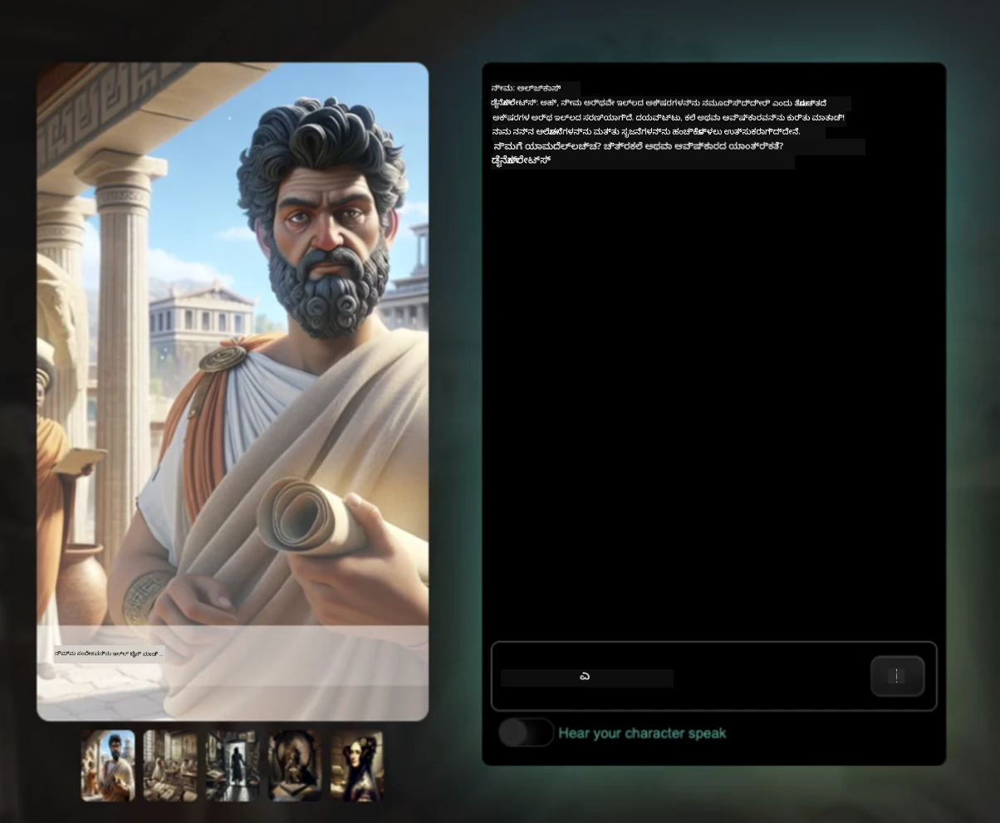
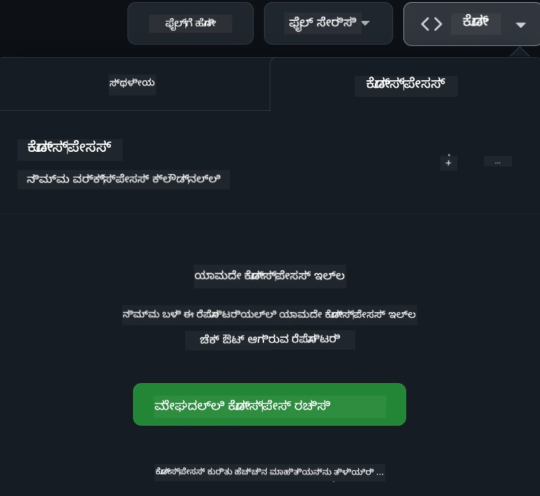

[](https://github.com/microsoft/Web-Dev-For-Beginners/blob/master/LICENSE)
[](https://GitHub.com/microsoft/Web-Dev-For-Beginners/graphs/contributors/)
[](https://GitHub.com/microsoft/Web-Dev-For-Beginners/issues/)
[](https://GitHub.com/microsoft/Web-Dev-For-Beginners/pulls/)
[](http://makeapullrequest.com) 

[](https://GitHub.com/microsoft/Web-Dev-For-Beginners/watchers/)
[](https://GitHub.com/microsoft/Web-Dev-For-Beginners/network/)
[](https://GitHub.com/microsoft/Web-Dev-For-Beginners/stargazers/)

[](https://discord.gg/nTYy5BXMWG)

# ಪ್ರಾರಂಭಿಕರಿಗಾಗಿ ವೆಬ್ ಅಭಿವೃದ್ಧಿ - ಒಂದು ಪಠ್ಯಕ್ರಮ

Microsoft Cloud Advocates ರ 12-ವಾರಗಳ ಸಂಪೂರ್ಣ ಕೋರ್ಸ್‌ನೊಂದಿಗೆ ವೆಬ್ ಅಭಿವೃದ್ಧಿಯ ಮೂಲಭೂತಗಳನ್ನು ಕಲಿಕಿರಿ. 24 ಪಾಠಗಳ ಪ್ರತಿ JavaScript, CSS, ಮತ್ತು HTML ಅನ್ನು ರೈತ ಸ್ಟಾರ್ಟಿ ಪ್ರಾಜೆಕ್ಟ್ಗಳ ಮೂಲಕ ಸಂಯೋಜಿಸುತ್ತದೆ, ಉದಾ: ಟೆರೆರಿ Homes, ಬ್ರೌಸರ್ ವಿಸ್ತರಣೆಗಳು ಮತ್ತು ಅಂತರಿಕ್ಷ ಆಟಗಳು. ಕುಯಿಜ್‌ಗಳು, ಚರ್ಚೆಗಳು ಮತ್ತು ಪ್ರಾಯೋಗಿಕ ನಿಯೋಜನೆಗಳ ಜೊತೆಗೆ ನಿರಂತರ ತೊಡಗಿಸಿಕೊಳ್ಳಿ. ನಿಮ್ಮ ಕೌಶಲ್ಯಗಳನ್ನು ಹೆಚ್ಚಿಸಿ ಮತ್ತು ನಮ್ಮ ಪರಿಣಾಮಕಾರಿ ಯೋಜನೆ ಆಧಾರಿತ ಶಿಕ್ಷಣ ವಿಧಾನದಿಂದ ನಿಮ್ಮ ಜ್ಞಾನವನ್ನು ಗರಿಷ್ಠಗೊಳಿಸಿ. ನಿಮ್ಮ ಕೋಡಿಂಗ್ ಪ್ರಯಾಣವನ್ನು ಇಂದು ಪ್ರಾರಂಭಿಸಿ!

Azure AI Foundry Discord ಸಮುದಾಯದಲ್ಲಿ ಸೇರಿಕೊಳ್ಳಿ

[](https://discord.gg/nTYy5BXMWG)

ಈ ಸಂಪನ್ಮೂಲಗಳನ್ನು ಬಳಸಲು ಆರಂಭಿಸಲು ಈ ಹಂತಗಳನ್ನು ಅನುಸರಿಸಿ:
1. **ರಿಪೊಸಿಟರಿಯನ್ನು ಫೋರ್ಕ್ ಮಾಡಿ**: ಕ್ಲಿಕ್ ಮಾಡಿ [](https://GitHub.com/microsoft/Web-Dev-For-Beginners/fork)
2. **ರಿಪೊಸಿಟರಿಯನ್ನು ಕ್ಲೋನ್ ಮಾಡಿ**:   `git clone https://github.com/microsoft/Web-Dev-For-Beginners.git`
3. [**Azure AI Foundry Discord ಗೆ ಸೇರಿ, ಪರಿಣಿತರು ಮತ್ತು ಇತರ ಅಭಿವೃದ್ಧಿಪಡಿಸುವವರು ಭೇಟಿ ಮಾಡಿ**](https://discord.com/invite/ByRwuEEgH4)

### 🌐 ಬಹು-ಭಾಷಾ ಬೆಂಬಲ

#### GitHub ಕಾರ್ಯಾಚರಣೆ ಮೂಲಕ ಬೆಂಬಲಿಸಲಾಗಿದೆ (자동 ಮತ್ತು ಎಲ್ಲಾ ವೇಳೆಯ નવೀಕರಣ)

<!-- CO-OP TRANSLATOR LANGUAGES TABLE START -->
[Arabic](../ar/README.md) | [Bengali](../bn/README.md) | [Bulgarian](../bg/README.md) | [Burmese (Myanmar)](../my/README.md) | [Chinese (Simplified)](../zh-CN/README.md) | [Chinese (Traditional, Hong Kong)](../zh-HK/README.md) | [Chinese (Traditional, Macau)](../zh-MO/README.md) | [Chinese (Traditional, Taiwan)](../zh-TW/README.md) | [Croatian](../hr/README.md) | [Czech](../cs/README.md) | [Danish](../da/README.md) | [Dutch](../nl/README.md) | [Estonian](../et/README.md) | [Finnish](../fi/README.md) | [French](../fr/README.md) | [German](../de/README.md) | [Greek](../el/README.md) | [Hebrew](../he/README.md) | [Hindi](../hi/README.md) | [Hungarian](../hu/README.md) | [Indonesian](../id/README.md) | [Italian](../it/README.md) | [Japanese](../ja/README.md) | [Kannada](./README.md) | [Khmer](../km/README.md) | [Korean](../ko/README.md) | [Lithuanian](../lt/README.md) | [Malay](../ms/README.md) | [Malayalam](../ml/README.md) | [Marathi](../mr/README.md) | [Nepali](../ne/README.md) | [Nigerian Pidgin](../pcm/README.md) | [Norwegian](../no/README.md) | [Persian (Farsi)](../fa/README.md) | [Polish](../pl/README.md) | [Portuguese (Brazil)](../pt-BR/README.md) | [Portuguese (Portugal)](../pt-PT/README.md) | [Punjabi (Gurmukhi)](../pa/README.md) | [Romanian](../ro/README.md) | [Russian](../ru/README.md) | [Serbian (Cyrillic)](../sr/README.md) | [Slovak](../sk/README.md) | [Slovenian](../sl/README.md) | [Spanish](../es/README.md) | [Swahili](../sw/README.md) | [Swedish](../sv/README.md) | [Tagalog (Filipino)](../tl/README.md) | [Tamil](../ta/README.md) | [Telugu](../te/README.md) | [Thai](../th/README.md) | [Turkish](../tr/README.md) | [Ukrainian](../uk/README.md) | [Urdu](../ur/README.md) | [Vietnamese](../vi/README.md)

> **ಸ್ಥಳೀಯವಾಗಿ ಕ್ಲೋನ್ ಮಾಡುವುದು ಇಷ್ಟವೇ?**
>
> ಈ ರಿಪೊಸಿಟರಿಯಲ್ಲಿ 50 ಕ್ಕೂ ಅಧಿಕ ಭಾಷಾಂತರಗಳು ಒಳಗೊಂಡಿದ್ದು ಡೌನ್ಲೋಡ್ ಗಾತ್ರವನ್ನು ಹೆಚ್ಚಿಸುತ್ತದೆ. ಭಾಷಾಂತರಗಳಿಲ್ಲದೆ ಕ್ಲೋನ್ ಮಾಡಲು sparse checkout ಬಳಸಿ:
>
> **Bash / macOS / Linux:**
> ```bash
> git clone --filter=blob:none --sparse https://github.com/microsoft/Web-Dev-For-Beginners.git
> cd Web-Dev-For-Beginners
> git sparse-checkout set --no-cone '/*' '!translations' '!translated_images'
> ```
>
> **CMD (Windows):**
> ```cmd
> git clone --filter=blob:none --sparse https://github.com/microsoft/Web-Dev-For-Beginners.git
> cd Web-Dev-For-Beginners
> git sparse-checkout set --no-cone "/*" "!translations" "!translated_images"
> ```
>
> ಇದು ನಿಮಗೆ ಕೋರ್ಸ್ ಪೂರ್ಣಗೊಳಿಸಲು ಬೇಕಾದ ಎಲ್ಲವನ್ನೂ ಬಹಳ ವೇಗವಾಗಿ ಡೌನ್ಲೋಡ್ ಮಾಡಿಕೊಳ್ಳಲು ಸಹಾಯ ಮಾಡುತ್ತದೆ.
<!-- CO-OP TRANSLATOR LANGUAGES TABLE END -->

**ನಿಮಗೆ ಹೆಚ್ಚುವರಿ ಭಾಷಾಂತರ ಬೆಂಬಲ ಬೇಕಾದರೆ ಅವು [ಇಲ್ಲಿ](https://github.com/Azure/co-op-translator/blob/main/getting_started/supported-languages.md) ಪಟ್ಟಿಯಲ್ಲಿವೆ**

[](https://open.vscode.dev/microsoft/Web-Dev-For-Beginners)

#### 🧑‍🎓 _ನೀವು ವಿದ್ಯಾರ್ಥಿ ಆಗಿದ್ದೀರಾ?_

[**ವಿದ್ಯಾರ್ಥಿ ಹಬ್ ಪುಟ**](https://docs.microsoft.com/learn/student-hub/?WT.mc_id=academic-77807-sagibbon) ಗೆ ಭೇಟಿ ನೀಡಿ, ಇಲ್ಲಿ ಪ್ರಾರಂಭಿಕ ಸಂಪನ್ಮೂಲಗಳು, ವಿದ್ಯಾರ್ಥಿ ಪ್ಯಾಕ್ಗಳು ಮತ್ತು ಉಚಿತ ಪ್ರಮಾಣಪತ್ರ ವೋಚ್ ಪಡೆಯುವ ಮಾರ್ಗಗಳು ಲಭ್ಯವಿವೆ. ನಮ್ಮ ವಿಷಯವನ್ನು ಮಾಸಿಕವಾಗಿ ಬದಲಾಯಿಸುವುದರಿಂದ ನೀವು ಈ ಪುಟವನ್ನು ಬುಕ್ಕ್ಮಾರ್ಕ್ ಮಾಡಿಕೊಂಡು ತಾತ್ಕಾಲಿಕವಾಗಿ ಪರಿಶೀಲಿಸಬಹುದು.

### 📣 ಪ್ರಕಟಣೆ - ಹೊಸ GitHub Copilot Agent ಮೋಡ್ ಸವಾಲುಗಳನ್ನು ಪೂರೈಸಿರಿ!

ಹೊಸ ಸವಾಲು ಸೇರಿಸಲಾಗಿದೆ, ಹೆಚ್ಚಿನ ಅಧ್ಯಾಯಗಳಲ್ಲಿ "GitHub Copilot Agent Challenge 🚀" ಎನ್ನುವದು ನೋಡಿ. ಇದು GitHub Copilot ಮತ್ತು Agent ಮೋಡ್ ಉಪಯೋಗಿಸಿ ಪೂರ್ಣಗೊಳಿಸುವ ಹೊಸ ಸವಾಲು. ನೀವು ಮೊದಲು Agent ಮೋಡ್ ಬಳಸಿಲ್ಲದಿದ್ದರೆ ಅದು ಪಠ್ಯ ರಚನೆಯ ಜೊತೆಗೆ ಫೈಲ್‌ಗಳನ್ನು ರಚಿಸಲು ಮತ್ತು ಸಂಪಾದಿಸಲು, ಕಮಾಂಡ್‌ಗಳನ್ನು ಚಾಲನೆ ಮಾಡಲು ಸಾಧ್ಯ.

### 📣 ಪ್ರಕಟಣೆ - _ಜನರೇಟಿವ್ AI ಬಳಸಿ ಹೊಸ ಪ್ರಾಜೆಕ್ಟ್ ನಿರ್ಮಿಸಿ_ 

ಹೊಸ AI ಸಹಾಯಕ ಪ್ರಾಜೆಕ್ಟ್ ಸೇರಿಸಲಾಗಿದೆ, ಪರಿಶೀಲಿಸಿ [project](./9-chat-project/README.md)

### 📣 ಪ್ರಕಟಣೆ - _ಜನರೇಟಿವ್ AI ಕುರಿತಲ್ಲಿನ ಹೊಸ ಪಠ್ಯಕ್ರಮ_ JavaScript ಗಾಗಿ ಬಿಡುಗಡೆಯಾಗಿದೆ

ನಮ್ಮ ಹೊಸ ಜನರೇಟಿವ್ AI ಪಠ್ಯಕ್ರಮವನ್ನು ತಪ್ಪಿಸಿಕೊಳ್ಳಬೇಡಿ!

ಪ್ರಾರಂಭಿಸಲು ಭೇಟಿ ನೀಡಿ [https://aka.ms/genai-js-course](https://aka.ms/genai-js-course)!


- ಮೂಲಭೂತದಿಂದ RAG ವರೆಗೆ ಪಾಠಗಳು.
- GenAI ಮತ್ತು ನಮ್ಮ ಸಹಚರ ಅಪ್ಲಿಕೇಶನ್ ಬಳಸಿ ಇತিহাসಿಕ ವ್ಯಕ್ತಿಗಳೊಂದಿಗೆ ಸಂವಾದ.
- ರಂಜನೆಯ narratives, ನೀವು ಕಾಲ ಪ್ರಯಾಣ ಮಾಡುತ್ತಿರುವಂತೆ ಅನುಭವ.



ಪ್ರತಿ ಪಾಠವು పూర్తి ಮಾಡಲು ನಿಯೋಜನೆ, ಜ್ಞಾನ ಮೌಲ್ಯಮಾಪನ ಮತ್ತು ಸವಾಲುಗಳನ್ನು ಒಳಗೊಂಡಿದೆ, ಕಲಿಕೆಯ ವಿಷಯಗಳು:
- ಪ್ರಾಂಪ್ಟ್ ಮತ್ತು ಪ್ರಾಂಪ್ಟ್ ಎಂಜಿನಿಯರಿಂಗ್
- ಪಠ್ಯ ಮತ್ತು ಚಿತ್ರ ಅಪ್ಲಿಕೇಶನ್ ಸೃಷ್ಟಿ
- ಹುಡುಕಾಟ ಅಪ್ಲಿಕೇಶನ್ಗಳು

ಪ್ರಾರಂಭಿಸಲು ಭೇಟಿ ನೀಡಿ [https://aka.ms/genai-js-course](https://aka.ms/genai-js-course)!


## 🌱 ಪ್ರಾರಂಭ

> **ಶಿಕ್ಷಕರು**, ಈ ಪಠ್ಯಕ್ರಮವನ್ನು ಹೇಗೆ ಬಳಸುವುದು ಎಂಬುದಾಗಿ ನಾವು ಕೆಲವು [ಸೂಚನೆಗಳನ್ನು](for-teachers.md) ಸೇರಿಸಿದ್ದೇವೆ. ದಯವಿಟ್ಟು ನಿಮ್ಮ ಅಭಿಪ್ರಾಯವನ್ನು ನಮ್ಮ [ಚರ್ಚಾ ವೇದಿಕೆಯಲ್ಲಿಹೇಗೆ](https://github.com/microsoft/Web-Dev-For-Beginners/discussions/categories/teacher-corner) ಹಂಚಿಕೊಳ್ಳಿ!

**[ಕಲಿಯುವವರು](https://aka.ms/student-page/?WT.mc_id=academic-77807-sagibbon)**, ಪ್ರತಿ ಪಾಠದ ಮುನ್ನಿನ ಕ್ವಿಜ್‌ಗಳನ್ನು ಪ್ರತಿದಿನ ಪ್ರಾರಂಭಿಸಿ, ಪಾಠಪುಸ್ತಕ ವाचन ಮಾಡಿ, ವಿವಿಧ ಚಟುವಟಿಕೆಗಳನ್ನು ಪೂರ್ಣಗೊಳಿಸಿ ಮತ್ತು ಪಾಠದ ನಂತರದ ಕ್ವಿಜ್‌ ಮೂಲಕ ನಿಮ್ಮ ಅರ್ಥವನ್ನು ಪರಿಶೀಲಿಸಿ.

ನಿಮ್ಮ ಕಲಿಕೆ ಅನುಭವವನ್ನು ಸುಧಾರಿಸಲು, ಯೋಜನೆಗಳ ಮೇಲೆ ಸಹಪಾಠಿಗಳೊಂದಿಗೆ ಸೇರಿ ಕೆಲಸ ಮಾಡಿರಿ! ಚರ್ಚೆಗಳನ್ನು ನಮ್ಮ [ಚರ್ಚಾ ವೇದಿಕೆಯಲ್ಲಿ](https://github.com/microsoft/Web-Dev-For-Beginners/discussions) ಪ್ರೋತ್ಸಾಹಿಸಲಾಗುತ್ತದೆ, ಇಲ್ಲಿ ನಮ್ಮ ಮಧ್ಯಸ್ಥರು ನಿಮ್ಮ ಪ್ರಶ್ನೆಗಳಿಗೆ ಉತ್ತರ ನೀಡಲಿದ್ದಾರೆ.

ನಿಮ್ಮ ಶಿಕ್ಷಣವನ್ನು ಮತ್ತಷ್ಟು ಸುಧಾರಿಸಲು, ನಾವು [Microsoft Learn](https://learn.microsoft.com/users/wirelesslife/collections/p1ddcy5jwy0jkm?WT.mc_id=academic-77807-sagibbon) ನಲ್ಲಿ ಹೆಚ್ಚಿನ ಅಧ್ಯಯನ ಸಾಮಗ್ರಿಗಳನ್ನು ಅನ್ವೇಷಿಸಲು ಶಿಫಾರಸು ಮಾಡುತ್ತೇವೆ.

### 📋 ನಿಮ್ಮ ಪರಿಸರವನ್ನು ಸ್ಥಾಪಿಸುವುದು

ಈ ಪಠ್ಯಕ್ರಮಕ್ಕೆ ಅಭಿವೃದ್ಧಿ ಪರಿಸರ ಸಿದ್ಧವಾಗಿದೆ! ಪ್ರಾರಂಭಿಸುವಾಗ ನೀವು [Codespace](https://github.com/features/codespaces/) (_ಬ್ರೌಸರ್ ಆಧಾರಿತ, ಯಾವುದೇ ಇನ್ಸ್ಟಾಲ್ ಅಗತ್ಯವಿಲ್ಲದ ಪರಿಸರ_) ಅಥವಾ ನಿಮ್ಮ ಕಂಪ್ಯೂಟರ್‌ನಲ್ಲಿ [Visual Studio Code](https://code.visualstudio.com/?WT.mc_id=academic-77807-sagibbon)ಂತಹ ಪಠ್ಯ ಸಂಪಾದಕ ಬಳಸಿಕೊಂಡು ಕಾರ್ಯಚರಣೆ ಆಯ್ಕೆ ಮಾಡಬಹುದು.

#### ನಿಮ್ಮ ರಿಪೊಸಿಟರಿಯನ್ನು ರಚಿಸಿ
ನಿಮ್ಮ ಕೆಲಸವನ್ನು ಸುಲಭವಾಗಿ ಉಳಿಸಲು, ಈ ರಿಪೊಸಿಟರಿಯ ನಕಲನ್ನು ರಚಿಸುವುದು ಶಿಫಾರಸು ಮಾಡಿದೆಯೆ. ಇದನ್ನು ನೀವು ಪುಟದ ಮೇಲ್ಭಾಗದಲ್ಲಿರುವ **Use this template** ಬಟನ್ ಕ್ಲಿಕ್ ಮಾಡಿ ಮಾಡಬಹುದು. ಇದು ನಿಮ್ಮ GitHub ಖಾತೆಯಲ್ಲಿ ಪಠ್ಯಕ್ರಮದ ನಕಲನ್ನು ಹೊಂದಿರುವ ಹೊಸ ರಿಪೊಸಿಟರಿಯನ್ನು ರಚಿಸುತ್ತದೆ.

ಈ ಹಂತಗಳನ್ನು ಅನುಸರಿಸಿ:
1. **ರಿಪೊಸಿಟರಿಯನ್ನು ಫೋರ್ಕ್ ಮಾಡಿ**: ಈ ಪುಟದ ಮೇಲ್ಭಾಗದ ಬಲಭಾಗದ "Fork" ಬಟನ್ ಕ್ಲಿಕ್ ಮಾಡಿ.
2. **ರಿಪೊಸಿಟರಿಯನ್ನು ಕ್ಲೋನ್ ಮಾಡಿ**:   `git clone https://github.com/microsoft/Web-Dev-For-Beginners.git`

#### Codespace ನಲ್ಲಿ ಪಠ್ಯಕ್ರಮವನ್ನು ಚಾಲನೆ ಮಾಡುವುದು

ನೀವು ರಚಿಸಿದ ಈ ರಿಪೊಸಿಟರಿಯ ನಕಲಿನಲ್ಲಿ, **Code** ಬಟನ್ ಕ್ಲಿಕ್ ಮಾಡಿ ಮತ್ತು **Open with Codespaces** ಆಯ್ಕೆ ಮಾಡಿ. ಇದು ನಿಮಗಾಗಿ ಹೊಸ Codespace ರಚಿಸುತ್ತದೆ.



#### ನಿಮ್ಮ ಕಂಪ್ಯೂಟರ್‌ನಲ್ಲಿ ಪಠ್ಯಕ್ರಮವನ್ನು ಸ್ಥಳೀಯವಾಗಿ ಚಾಲನೆ ಮಾಡುವುದು

ಈ ಪಠ್ಯಕ್ರಮವನ್ನು ನಿಮ್ಮ ಕಂಪ್ಯೂಟರ್‌ನಲ್ಲಿ ಸ್ಥಳೀಯವಾಗಿ ಚಾಲನೆ ಮಾಡಲು, ನಿಮ್ಮ ಬಳಿ ಪಠ್ಯ ಸಂಪಾದಕ, ಬ್ರೌಸರ್ ಮತ್ತು ಕಮಾಂಡ್ ಲೈನ್ ಉಪಕರಣ ಅಗತ್ಯವಿದೆ. ನಮ್ಮ ಮೊದಲ ಪಾಠ, [ಪ್ರೋಗ್ರಾಮಿಂಗ್ ಭಾಷೆಗಳು ಮತ್ತು ವಾಣಿಜ್ಯ ಉಪಕರಣಗಳ ಪರಿಚಯ](../../1-getting-started-lessons/1-intro-to-programming-languages) ನಿಮಗೆ ಪ್ರತಿಯೊಂದು ಈ ಉಪಕರಣಗಳ ಆಯ್ಕೆಗಳನ್ನು ಪರಿಚಯಿಸುವುದು.

ನಮ್ಮ ಶಿಫಾರಸು [Visual Studio Code](https://code.visualstudio.com/?WT.mc_id=academic-77807-sagibbon) ಅನ್ನು ಸಂಪಾದಕವಾಗಿ ಉಪಯೋಗಿಸುವುದಾಗಿ ಇದೆ, ಇದು ಅಂತರ್ಗತ [ಟರ್ಮಿನಲ್](https://code.visualstudio.com/docs/terminal/basics/?WT.mc_id=academic-77807-sagibbon) ಸಹ ಹೊಂದಿರುತ್ತದೆ. ನೀವು Visual Studio Code ಅನ್ನು ಇಲ್ಲಿ ಡೌನ್ಲೋಡ್ ಮಾಡಬಹುದು [ಇಲ್ಲಿ](https://code.visualstudio.com/?WT.mc_id=academic-77807-sagibbon).
1. ನಿಮ್ಮ ಸಂಗ್ರಹಣೆಯನ್ನು ನಿಮ್ಮ ಕಂಪ್ಯೂಟರ್‌ಗೆ ಕ್ಲೋನ್ ಮಾಡಿ. ನೀವು ಇದನ್ನು **Code** ಬಟನ್ ಕ್ಲಿಕ್ ಮಾಡಿ ಮತ್ತು URL ನಕಲಿಸುವ ಮೂಲಕ ಮಾಡಬಹುದು:

    [CodeSpace](./images/createcodespace.png)

    ನಂತರ, [Visual Studio Code](https://code.visualstudio.com/?WT.mc_id=academic-77807-sagibbon) ಒಳಗಿನ [Terminal](https://code.visualstudio.com/docs/terminal/basics/?WT.mc_id=academic-77807-sagibbon) ಅನ್ನು ತೆರೆಯಿರಿ ಮತ್ತು ಕೆಳಗಿನ ಕಮಾಂಡ್ ಅನ್ನು ಚಾಲನೆ ಮಾಡಿ, `<your-repository-url>` ಎಂಬುದನ್ನು ನೀವು ನಕಲಿಸಿದ URL ಮೂಲಕ ಬದಲಾಯಿಸಿ:

    ```bash 
    git clone <your-repository-url>
    ```

2. Visual Studio Code ನಲ್ಲಿ ಫೋಲ್ಡರ್ ತೆರೆಯಿರಿ. ನೀವು ಇದನ್ನು **File** > **Open Folder** ಕ್ಲಿಕ್ ಮಾಡಿ ಮತ್ತು ನೀವು ಕ್ಲೋನ್ ಮಾಡಿದ ಫೋಲ್ಡರ್ ಆಯ್ಕೆಮಾಡಿ ಮಾಡಬಹುದು.


>  ಶಿಫಾರಸುಮಾಡಲಾದ Visual Studio Code ವಿಸ್ತರಣೆಗಳು:
>
> * [Live Server](https://marketplace.visualstudio.com/items?itemName=ritwickdey.LiveServer&WT.mc_id=academic-77807-sagibbon) - Visual Studio Code ಒಳಗಿನ HTML ಪುಟಗಳನ್ನು ಪೂರ್ವದೃಶ್ಯ ಮಾಡಲು
> * [Copilot](https://marketplace.visualstudio.com/items?itemName=GitHub.copilot&WT.mc_id=academic-77807-sagibbon) - ನಿಮ್ಮ ಕೋಡ್ ಬರೆಯುವುದನ್ನು ವೇಗಗೊಳಿಸಲು ಸಹಾಯಕ

## 📂 ಪ್ರತಿ ಪಾಠದಲ್ಲಿ ಕಲಿತದ್ದಾಗಿವೆ:

- ಐಚ್ಛಿಕ ಸ್ಕೆಚ್ನೋಟ್
- ಐಚ್ಛಿಕ ಪೂರಕ ವೀಡಿಯೊ
- ಪಾಠದ ಮುಂಚಿನ ವಾರ್ಮ್ ಅಪ್ ಕ್ವಿಜ್
- ಬರೆಯಲಾದ ಪಾಠ
- ಪ್ರಾಜೆಕ್ಟ್ ಆಧಾರಿತ ಪಾಠಗಳಿಗೆ, ಪ್ರಾಜೆಕ್ಟ್ ನಿರ್ಮಿಸಲು ಹಂತ ಹಂತದ ಮಾರ್ಗದರ್ಶಿಗಳು
- ಜ್ಞಾಪಕ ತಪಾಸಣೆಗಳು
- ಒಂದು ಆವೃತ್ತಿ
- ಪೂರಕ ಓದು
- ಅಸೈನ್‌ಮೆಂಟ್
- [ಪಾಠದ ನಂತರದ ಕ್ವಿಜ್](https://ff-quizzes.netlify.app/web/)

> **ಕ್ವಿಜ್ ಗಳ ಬಗ್ಗೆ ಒಂದು ಟಿಪ್ಪಣಿ**: ಎಲ್ಲಾ ಕ್ವಿಜ್‌ಗಳು Quiz-app ಫೋಲ್ಡರ್‌ನಲ್ಲಿ ಇವೆ, 48 ಒಟ್ಟು ಕ್ವಿಜ್‌ಗಳು, ಪ್ರತಿ ಒಂದು ಮೂರು ಪ್ರಶ್ನೆಗಳಾಗಿವೆ. ಅವು [ಇಲ್ಲಿ](https://ff-quizzes.netlify.app/web/) ಲಭ್ಯವಿದ್ದು, ಕ್ವಿಜ್ ಆಪ್ ಅನ್ನು ಸ್ಥಳೀಯವಾಗಿ ನಡೆಸಬಹುದು ಅಥವಾ Azure ಗೆ ನಿಯೋಜಿಸಲಾಗುತ್ತದೆ; `quiz-app` ಫೋಲ್ಡರ್‌ನ ಸೂಚನೆಗಳನ್ನು ಅನುಸರಿಸಿ.

## 🗃️ ಪಾಠಗಳು

|     |                       ಪ್ರಾಜೆಕ್ಟ್ ಹೆಸರು                       |                            ಕಲಿಸಲಾದ ಧಾರಣೆಗಳು                             | ಅಧ್ಯಯನ ಉದ್ದೇಶಗಳು                                                                                                                 |                                                         ಲಿಂಕ್ ಮಾಡಲಾದ ಪಾಠ                                                          |         ಲೇಖಕ          |
| :-: | :------------------------------------------------------: | :--------------------------------------------------------------------: | ----------------------------------------------------------------------------------------------------------------------------------- | :----------------------------------------------------------------------------------------------------------------------------: | :---------------------: |
| 01  |                     ಪ್ರಾರಂಭಿಸುವುದು                      |           ಪ್ರೋಗ್ರಾಮಿಂಗ್ ಪರಿಚಯ ಮತ್ತು ವ್ಯಾಪಾರದ ಉಪಕರಣಗಳು           | ಹೆಚ್ಚಿನ ಪ್ರೋಗ್ರಾಮಿಂಗ್ ಭಾಷೆಗಳ ಹಿಂದೆ ಇರುವ ಮೂಲಭೂತ ತತ್ವಗಳನ್ನು ತಿಳಿದುಕೊಳ್ಳಿ ಮತ್ತು ತಜ್ಞರಿಗಾಗಿ ಸಹಕಾರ ಮಾಡು ತ ಸಾಫ್ಟ್‌ವೇರ್ ಬಗ್ಗೆ ತಿಳಿದುಕೊಳ್ಳಿ | [ಪ್ರೋಗ್ರಾಮಿಂಗ್ ಭಾಷೆಗಳು ಮತ್ತು ವ್ಯಾಪಾರದ ಉಪಕರಣಗಳ ಪರಿಚಯ](./1-getting-started-lessons/1-intro-to-programming-languages/README.md) |         Jasmine         |
| 02  |                     ಪ್ರಾರಂಭಿಸುವುದು                      |             GitHub ಆಧಾರಗಳು, ತಂಡದಲ್ಲಿ ಕೆಲಸ ಮಾಡುವುದನ್ನು ಒಳಗೊಂಡಿದೆ             | ನಿಮ್ಮ ಪ್ರಾಜೆಕ್ಟ್‌ನಲ್ಲಿ GitHub ಅನ್ನು ಹೇಗೆ ಬಳಸುವುದು ಮತ್ತು ಕೋಡ್ ಬೇಸ್ನಲ್ಲಿ ಇತರರೊಂದಿಗೆ ಜೊತೆಯ ಕೆಲಸ ಮಾಡುವುದು                                    |                            [GitHub ಪರಿಚಯ](./1-getting-started-lessons/2-github-basics/README.md)                             |          Floor          |
| 03  |                     ಪ್ರಾರಂಭಿಸುವುದು                      |                             ಪ್ರಾಪ್ಯತೆ                              | ವೆಬ್ ಪ್ರಾಪ್ಯತೆಯ ಮೂಲಭೂತಗಳನ್ನು ಕಲಿಯಿರಿ                                                                                               |                       [ಪ್ರಾಪ್ಯತೆಯ ಮೂಲಭೂತಗಳು](./1-getting-started-lessons/3-accessibility/README.md)                       |       Christopher       |
| 04  |                        JS ಮೂಲಭೂತಗಳು                         |                         JavaScript ಡೇಟಾ ಪ್ರಕಾರಗಳು                          | JavaScript ಡೇಟಾ ಪ್ರಕಾರಗಳ ಮೂಲಭೂತಗಳು                                                                                                 |                                       [ಡೇಟಾ ಪ್ರಕಾರಗಳು](./2-js-basics/1-data-types/README.md)                                        |         Jasmine         |
| 05  |                        JS ಮೂಲಭೂತಗಳು                         |                         ಕಾರ್ಯಗಳು ಮತ್ತು ವಿಧಾನಗಳು                          | ಅಪ್ಲಿಕೇಶನ್‌ನ ತರ್ಕ ಪ್ರವರ್ತನೆಯನ್ನು ನಿರ್ವಹಿಸಲು ಕಾರ್ಯಗಳು ಮತ್ತು ವಿಧಾನಗಳ ಬಗ್ಗೆ ತಿಳಿದುಕೊಳ್ಳಿ                                                             |                              [ಕಾರ್ಯಗಳು ಮತ್ತು ವಿಧಾನಗಳು](./2-js-basics/2-functions-methods/README.md)                               | Jasmine ಮತ್ತು Christopher |
| 06  |                        JS ಮೂಲಭೂತಗಳು                         |                        JS ಸಹಾಯದಿಂದ ನಿರ್ಧಾರಗಳನ್ನು ಕೈಗೊಳ್ಳುವುದು                        | ನಿರ್ಧಾರ ತೆಗೆದುಕೊಳ್ಳುವ ವಿಧಾನಗಳನ್ನು ಬಳಸಿಕೊಂಡು ನಿಮ್ಮ ಕೋಡ್‌ನಲ್ಲಿ ಪರಿಸ್ಥಿತಿಗಳನ್ನು ಹೇಗೆ ರಚಿಸುವುದು ಎಂಬುದನ್ನು ಕಲಿಯಿರಿ                                                           |                                 [ನಿರ್ಧಾರ ಕೈಗೊಳ್ಳುವುದು](./2-js-basics/3-making-decisions/README.md)                                  |         Jasmine         |
| 07  |                        JS ಮೂಲಭೂತಗಳು                         |                            ಅರೇಗಳು ಮತ್ತು ಲೂಪ್‌ಗಳು                            | JavaScript ನಲ್ಲಿ ಅರೇಗಳು ಮತ್ತು ಲೂಪ್‌ಗಳನ್ನು ಬಳಸಿಕೊಂಡು ಡೇಟಾ ಕೆಲಸಮಾಡಿ                                                                                 |                                   [ಅರೇಗಳು ಮತ್ತು ಲೂಪ್‌ಗಳು](./2-js-basics/4-arrays-loops/README.md)                                    |         Jasmine         |
| 08  |       [Terrarium](./3-terrarium/solution/README.md)       |                            HTML ಅನ್ವಯ                              | ಆನ್ಲೈನ್ ಟೆರೇರಿಯಮ್ ರಚಿಸಲು HTML ನಿರ್ಮಿಸಿ, ವಿನ್ಯಾಸ ನಿರ್ಮಾಣದ ಮೇಲೆ ಗಮನಹರಿಸಿ                                                         |                                 [HTML ಪರಿಚಯ](./3-terrarium/1-intro-to-html/README.md)                                 |           Jen           |
| 09  |       [Terrarium](./3-terrarium/solution/README.md)       |                            CSS ಅನ್ವಯ                             | ಆನ್ಲೈನ್ ಟೆರೇರಿಯಮ್ ಶೈಲಿ ಮಾಡಲು CSS ರಚಿಸಿ, ಬೇಸ್ CSS ಲಭ್ಯವಿದ್ದು ಪುಟವನ್ನು ಪ್ರತಿಕ್ರಿಯಾಶೀಲವಾಗಿಸುವವುಗಳನ್ನೂ ಸೇರಿಸಿ                     |                                  [CSS ಪರಿಚಯ](./3-terrarium/2-intro-to-css/README.md)                                  |           Jen           |
| 10  |            [Terrarium](./3-terrarium/solution/README.md)            |                 JavaScript Closures, DOM ತಿದ್ದುಪಡಿ                  | ಟೆರೇರಿಯಮ್ ಅನ್ನು ಡ್ರ್ಯಾಗ್/ಡ್ರಾಪ್ ಮುಖಪುಟದಂತೆ ಕಾರ್ಯತತ್ಥಗೊಳಿಸಲು JavaScript ನಿರ್ಮಿಸಿ, ಕ್ಲೋಶರ್‌ಗಳು ಮತ್ತು DOM ತಿದ್ದುಪಡಿಯಲ್ಲಿ ಕೇಂದ್ರೀಕರಿಸಿ             |                  [JavaScript Closures, DOM ತಿದ್ದುಪಡಿ](./3-terrarium/3-intro-to-DOM-and-closures/README.md)                   |           Jen           |
| 11  |          [Typing Game](./4-typing-game/solution/README.md)          |                          ಟೈಪಿಂಗ್ ಗೇಮ್ ನಿರ್ಮಿಸಿ                           | ಕ್ಲ್ಯುವರ್ಡ್ ಘಟನೆಗಳನ್ನು ಬಳಸಿ ನಿಮ್ಮ JavaScript ಅಪ್ಲಿಕೇಶನ್‌ನ ತರ್ಕವನ್ನು ಚಾಲನೆ ಮಾಡುವ ವಿಧಾನವನ್ನು ಕಲಿಯಿರಿ                                                          |                                [ ಘಟನೆ ಚಾಲಿತ ಪ್ರೋಗ್ರಾಮಿಂಗ್](./4-typing-game/typing-game/README.md)                                |       Christopher       |
| 12  | [Green Browser Extension](./5-browser-extension/solution/README.md) |                         ಬ್ರೌಸರ್‌ಗಳೊಂದಿಗೆ ಕೆಲಸ                            | ಬ್ರೌಸರ್‌ಗಳು ಹೇಗೆ ಕಾರ್ಯನಿರ್ವಹಿಸುತ್ತವೆ, ಅವುಗಳ ಇತಿಹಾಸ ಮತ್ತು ಮೊದಲನೆಯ ಬ್ರೌಸರ್ ವಿಸ್ತರಣೆ ಘಟಕಗಳನ್ನು ರಚಿಸುವ ಬಗ್ಗೆ ತಿಳಿದುಕೊಳ್ಳಿ                               |                               [ಬ್ರೌಸರ್ ಬಗ್ಗೆ](./5-browser-extension/1-about-browsers/README.md)                                |           Jen           |
| 13  | [Green Browser Extension](./5-browser-extension/solution/README.md) | форма ರಚನೆ, API ಕರೆಗೆ ಕರೆ ಮಾಡುವುದು ಮತ್ತು ಸ್ಥಳೀಯ ಸಂಗ್ರಹಣೆಯಲ್ಲಿ ಪರಿವರ್ತನಗಳನ್ನು ಸಂಗ್ರಹಿಸುವುದು | API ಅನ್ನು ಕರೆ ಮಾಡಲು ಬ್ರೌಸರ್ ವಿಸ್ತರಣೆಯ JavaScript ಘಟಕಗಳನ್ನು ನಿರ್ಮಿಸಿ, ಸ್ಥಳೀಯ ಸಂಗ್ರಹಣೆಯಲ್ಲಿ ಸಂಗ್ರಹಿಸಲಾದ ಪರಿವರ್ತನಗಳನ್ನು ಬಳಸಿಕೊಳ್ಳಿ                      |                [API ಗಳು, ಫಾರ್ಮ್‌ಗಳು, ಮತ್ತು ಸ್ಥಳೀಯ ಸಂಗ್ರಹಣೆ](./5-browser-extension/2-forms-browsers-local-storage/README.md)                 |           Jen           |
| 14  | [Green Browser Extension](./5-browser-extension/solution/README.md) |          ಬ್ರೌಸರ್‌ನ ಹಿನ್ನೆಲೆ ಪ್ರಕ್ರಿಯೆಗಳು, ವೆಬ್ ಕಾರ್ಯಕ್ಷಮತೆ          | ವಿಸ್ತರಣೆಯ ಐಕಾನ್ ನಿರ್ವಹಿಸಲು ಬ್ರೌಸರ್‌ನ ಹಿನ್ನೆಲೆ ಪ್ರಕ್ರಿಯೆಗಳನ್ನು ಬಳಸಿ; ವೆಬ್ ಕಾರ್ಯಕ್ಷಮತೆ ಮತ್ತು ಕೆಲವು ಅನ್ವಯವಾಗಿ ಪರಿಣಾಮಕಾರಿತ್ವ ಹೆಚ್ಚಿಸಲು ತಂತ್ರಗಳು ಕಲಿಯಿರಿ   |             [ಹಿಂದೆಲೆ ಕೆಲಸಗಳು ಮತ್ತು ಕಾರ್ಯಕ್ಷಮತೆ](./5-browser-extension/3-background-tasks-and-performance/README.md)              |           Jen           |
| 15  |           [Space Game](./6-space-game/solution/README.md)           |             ಜಾವಾಸ್ಕ್ರಿಪ್ಟ್ ಬಳಸಿ ಹೆಚ್ಚು ಮುಂದಿನ ಹಂತದ ಗೇಮ್ ಅಭಿವೃದ್ಧಿ             | ಕ್ಲಾಸುಗಳು ಮತ್ತು ಸಂಯೋಜನೆಯನ್ನು ಬಳಸಿ ವಾರಸತ್ವವನ್ನೂ, ಪಬ್ಲಿಷ್/ಸಬ್ಸ್ಕ್ರೈಬ್ (Pub/Sub) ಮಾದರಿಯನ್ನು ಕಲಿಯಿರಿ, ಗೇಮ್ ನಿರ್ಮಾಣಕ್ಕೆ ಸಿದ್ಧತೆಗಾಗಿ              |                      [ಮುಂದಿನ ಹಂತದ ಗೇಮ್ ಅಭಿವೃದ್ಧಿಗೆ ಪರಿಚಯ](./6-space-game/1-introduction/README.md)                       |          Chris          |
| 16  |           [Space Game](./6-space-game/solution/README.md)           |                           ಕ್ಯಾನ್ವಾಸ್‌ಗೆ ಚಿತ್ರಣ                            | ಪರದೆಗೆ ಚಿತ್ರಿಸಲು ಬಳಸುವ ಕ್ಯಾನ್ವಾಸ್ API ಬಗ್ಗೆ ಕಲಿಯಿರಿ                                                                       |                                [ಕ್ಯಾನ್ವಾಸ್‌ಗೆ ಚಿತ್ರಣ](./6-space-game/2-drawing-to-canvas/README.md)                                |          Chris          |
| 17  |           [Space Game](./6-space-game/solution/README.md)           |                   ಪರದೆದ ಮೇಲೆ ಅಂಶಗಳನ್ನು ಚಲಿಸುವುದು                    | ಕಾರ್ಟಿಸಿಯನ್ ಸಹಯೋಗಗಳು ಮತ್ತು ಕ್ಯಾನ್ವಾಸ್ API ಬಳಸಿ ಅಂಶಗಳು ಚಲನೆಯನ್ನು ಹೇಗೆ ಪಡೆಯುತ್ತವೆ ಎಂದು ಕಂಡುಹಿಡಿಯಿರಿ                                            |                           [ಅಂಶಗಳನ್ನು ಚಲಿಸುವುದು](./6-space-game/3-moving-elements-around/README.md)                           |          Chris          |
| 18  |           [Space Game](./6-space-game/solution/README.md)           |                          ಘರ್ಷಣೆ ಪತ್ತೆ                           | ಅಂಶಗಳನ್ನು ತಳ್ಳಿಕೊಂದುಕೊಳ್ಳಲು ಮತ್ತು ಪರಸ್ಪರ ಪ್ರತಿಕ್ರಿಯಿಸುವಂತೆ ಮಾಡಬೇಕು, ಕೀಲ್ಯುತಗಳ ಬಳಕೆಯಿಂದ ಮತ್ತು ಗೇಮ್ ಕಾರ್ಯಕ್ಷಮತೆಗೆ ಶಿಗಾರ ಕರ್ತವ್ಯವನ್ನು ಒದಗಿಸಿ    |                              [ಘರ್ಷಣೆ ಪತ್ತೆ](./6-space-game/4-collision-detection/README.md)                              |          Chris          |
| 19  |           [Space Game](./6-space-game/solution/README.md)           |                             ಅಂಕೆಯನ್ನು ಕಾಯ್ದಿರಿಸುವುದು                              | ಗೇಮ್ ಸ್ಥಿತಿ ಮತ್ತು ಕಾರ್ಯಕ್ಷಮತೆ ಆಧರಿಸಿ ಗಣಿತ ಲೆಕ್ಕಾಚಾರಗಳನ್ನು ಮಾಡಿ                                                                |                                    [ಅಂಕೆಯನ್ನು ಕಾಯ್ದಿರಿಸುವುದು](./6-space-game/5-keeping-score/README.md)                                    |          Chris          |
| 20  |           [Space Game](./6-space-game/solution/README.md)           |                     ಗೇಮಿನ ಮುಕ್ತಾಯ ಮತ್ತು ಮರುಪ್ರಾರಂಭ                     | ಗೇಮ್ ಮುಕ್ತಾಯ ಮತ್ತು ಮರುಪ್ರಾರಂಭದ ಬಗ್ಗೆ ತಿಳಿದುಕೊಳ್ಳಿ, ಆಸ್ತಿ ಸ್ವಚ್ಛಗೊಳಿಸುವಿಕೆ ಮತ್ತು ವರಿಯೇಬಲ್ ಮೌಲ್ಯಗಳನ್ನು ಮರುಹೊಂದಿಸುವುದನ್ನು ಒಳಗೊಂಡಿದೆ                              |                                [ಮುಕ್ತಾಯ ಶರತ್ತು](./6-space-game/6-end-condition/README.md)                                 |          Chris          |
| 21  |         [Banking App](./7-bank-project/solution/README.md)          |                 ವೆಬ್ ಅಪ್ಲಿಕೇಶನ್‌ನಲ್ಲಿ HTML ಟೆಂಪ್ಲೇಟ್ಸ್ ಮತ್ತು ಮಾರ್ಗಗಳು                 | ಮಾರ್ಗನಿರ್ದೇಶನೆ ಮತ್ತು HTML ಟೆಂಪ್ಲೇಟುಗಳನ್ನು ಬಳಸಿ ಬಹುಪುಟ ವೆಬ್ಸೈಟ್‌ಗಳ ನೆಲಸೂರಿಯನ್ನು ರಚಿಸಲು ಕಲಿಯಿರಿ                             |                            [HTML ಟೆಂಪ್ಲೇಟ್ಸ್ ಮತ್ತು ಮಾರ್ಗಗಳು](./7-bank-project/1-template-route/README.md)                             |          Yohan          |
| 22  |         [Banking App](./7-bank-project/solution/README.md)          |                  ಲಾಗಿನ್ ಮತ್ತು ನೋಂದಣಿ ಫಾರ್ಮ್ ರಚಿಸಿ                   | ಫಾರ್ಮ್‌ಗಳನ್ನು ನಿರ್ಮಿಸುವುದು ಮತ್ತು ಮಾನ್ಯತೆ ಕ್ರಮಾಲಯಗಳನ್ನು ನಿರ್ವಹಿಸುವ ಬಗ್ಗೆ ತಿಳಿದುಕೊಳ್ಳಿ                                                                          |                                           [ಫಾರ್ಮ್‌ಗಳು](./7-bank-project/2-forms/README.md)                                           |          Yohan          |
| 23  |         [Banking App](./7-bank-project/solution/README.md)          |                   ಡೇಟಾ ಪಡೆಯುವ ಮತ್ತು ಬಳಸುವ ವಿಧಾನಗಳು                   | ನಿಮ್ಮ ಅಪ್ಲಿಕೇಶನ್ ಒಳಗೆ ಮತ್ತು ಹೊರಗೆ ಡೇಟಾ ಹೇಗೆ ಹರಿದುಹೋಗುತ್ತದೆ ಮತ್ತು ಅದನ್ನು ಪಡೆಯುವುದು, ಸಂಗ್ರಹಿಸುವುದು ಮತ್ತು ಹಾಳುಮಾಡುವುದು ಹೇಗೆ ಎಂಬುದನ್ನು ತಿಳಿಯಿರಿ                                                 |                                            [ಡೇಟಾ](./7-bank-project/3-data/README.md)                                            |          Yohan          |
| 24  |         [Banking App](./7-bank-project/solution/README.md)          |                      ಸ್ಥಿತಿಮಾಪನದ ತತ್ವಗಳು                      | ನಿಮ್ಮ ಅಪ್ಲಿಕೇಶನ್ ಸ್ಥಿತಿಯನ್ನು ಹೇಗೆ ಹಿಡಿದಿಡುತ್ತದೆ ಮತ್ತು ಅದನ್ನು ಪ್ರೋಗ್ರಾಮ್ ಮೂಲಕ ಹೇಗೆ ನಿರ್ವಹಿಸುವುದು ಎಂಬುದನ್ನು ಕಲಿಯಿರಿ                                                              |                                [ಸ್ಥಿತಿಮಾಪನ](./7-bank-project/4-state-management/README.md)                                |          Yohan          |
| 25 | [Browser/VScode Code](../../8-code-editor) | VScode ನೊಂದಿಗೆ ಕೆಲಸ ಮಾಡುವುದು | ಕೋಡ್ ಸಂಪಾದಕವನ್ನು ಹೇಗೆ ಬಳಸುವುದು ಎಂಬುದನ್ನು ಕಲಿಯಿರಿ| [VScode ಕೋವಿಡ್ ಸಂಪಾದಕ ಬಳಕೆ](./8-code-editor/1-using-a-code-editor/README.md) | Chris |
| 26 | [AI Assistants](./9-chat-project/README.md) | AI ನೊಂದಿಗೆ ಕೆಲಸ ಮಾಡುವುದು | ನಿಮ್ಮದೇ AI ಸಹಾಯಕವನ್ನು ನಿರ್ಮಿಸುವುದು ಹೇಗೆ ಎಂಬುದನ್ನು ಕಲಿಯಿರಿ | [AI ಸಹಾಯಕ ಪ್ರಾಜೆಕ್ಟ್](./9-chat-project/README.md) | Chris |

## 🏫 ಅಧ್ಯಾಪನಾ ವಿಧಾನಶಾಸ್ತ್ರ

ನಮ್ಮ ಪಠ್ಯಕ್ರಮವನ್ನು ಎರಡು ಪ್ರಮುಖ ಅಧ್ಯಾಪನಾ ಸಿದ್ಧಾಂತಗಳೊಂದಿಗೆ ವಿನ್ಯಾಸಗೊಳಿಸಲಾಗಿದೆ:
* ಪ್ರಾಜೆಕ್ಟ್ ಆಧಾರಿತ ಅಧ್ಯಯನ
* ನಿಯಮಿತ ಕ್ವಿಜ್‌ಗಳು

ಕಾರ್ಯಕ್ರಮವು JavaScript, HTML, ಮತ್ತು CSS ನ ಮೂಲಭೂತಗಳನ್ನು ಹಾಗೆಯೇ ಇಂದಿನ ವೆಬ್ ಡೆವಲಪರ್‌ಗಳು ಬಳಸುವ ಇತ್ತೀಚಿನ ಉಪಕರಣಗಳು ಮತ್ತು ತಂತ್ರಗಳನ್ನು ಕಲಿಸುತ್ತದೆ. ವಿದ್ಯಾರ್ಥಿಗಳು ಟೈಪಿಂಗ್ ಗೇಮ್, ವರ್ಚುವಲ್ ಟೆರೇರಿಯಮ್, ಪರಿಸರ ಸ್ನೇಹಿ ಬ್ರೌಸರ್ ವಿಸ್ತರಣೆ, ಬಾಹ್ಯಾಕಾಶ ಆಕ್ರಮಣದ ಶೈಲಿಯ ಗೇಮ್ ಮತ್ತು ವ್ಯವಹಾರಗಳಿಗಾಗಿ ಬ್ಯಾಂಕಿಂಗ್ ಅಪ್ಲಿಕೇಶನ್ ನಿರ್ಮಿಸಿ ಅನುಷ್ಠಾನಾತ್ಮಕ ಅನುಭವವನ್ನು ಪಡೆಯುವ ಅವಕಾಶ ಹೊಂದಿದ್ದಾರೆ. ಸರಣಿ ಮುಗಿದ ಮೇಲೆ, ವಿದ್ಯಾರ್ಥಿಗಳು ವೆಬ್ ಅಭಿವೃದ್ಧಿಯ ಗಟ್ಟಿತನದ ತಿಳಿವಳಿಕೆ ಗಳಿಸಲಿದ್ದಾರೆ.

> 🎓 ನೀವು ಈ ಪಠ್ಯಕ್ರಮದ ಮೊದಲ ಕೆಲವು ಪಾಠಗಳನ್ನು Microsoft Learn ನಲ್ಲಿ [Learn Path](https://docs.microsoft.com/learn/paths/web-development-101/?WT.mc_id=academic-77807-sagibbon) ರಾಗಿ ತೆಗೆದುಕೊಳ್ಳಬಹುದು!

ವಿಷಯವು ಪ್ರಾಜೆಕ್ಟ್‌ಗಳೊಂದಿಗೆ ಹೊಂದಿಕೊಳ್ಳುವಂತೆ ಮಾಡಿರುವುದರಿಂದ ಪ್ರಕ್ರಿಯೆ ವಿದ್ಯಾರ್ಥಿಗಳಿಗೆ ಹೆಚ್ಚು ಆಕರ್ಷಕವಾಗುತ್ತದೆ ಮತ್ತು ತತ್ವಗಳ ಜ್ಞಾಪಕವನ್ನು ಹೆಚ್ಚಿಸುತ್ತದೆ. ನಾವು ಕೆಲ ಸ್ಟಾರ್ಟರ್ ಪಾಠಗಳನ್ನು JavaScript ಮೂಲಭೂತಗಳಲ್ಲಿ ಬರೆಯುತ್ತೇವೆ, ಮತ್ತು "[Beginners Series to: JavaScript](https://channel9.msdn.com/Series/Beginners-Series-to-JavaScript/?WT.mc_id=academic-77807-sagibbon)" ವೀಡಿಯೋ ಸರಣಿಯಿಂದ ಒಂದು ವೀಡಿಯೊ ಜೋಡಣೆ ಮಾಡಿದ್ದೇವೆ, ಅದರ ಕೆಲವು ರಚಯಿತೃಗಳು ಈ ಪಠ್ಯಕ್ರಮಕ್ಕೆ ಸಹಕೆಲಸ ಮಾಡಿದ್ದಾರೆ.

ಇಲ್ಲದೆ, ತರಗತಿಯ ಮೊದಲು ಒಂದು ಕಡಿಮೆ-ಪರಿಣಾಮದ ಕ್ವಿಜ್ ವಿದ್ಯಾರ್ಥಿಯ ಆಸೆ ಪ್ರತಿಪಾದಿಸುವಲ್ಲಿ ಸಹಾಯ ಮಾಡುತ್ತದೆ, ಮತ್ತು ತರಗತಿಯ ನಂತರ ಎರಡನೇ ಕ್ವಿಜ್ ಸ್ನಾಯಿಸಿದೆ ನಿರ್ಧರಿಸುತ್ತದೆ. ಈ ಪಠ್ಯಕ್ರಮವನ್ನು ಅನುಕೂಲಕರ ಮತ್ತು ಮನರಂಜನೀಯವಾಗಿರುವಂತೆ ವಿನ್ಯಾಸಗೊಳಿಸಲಾಗಿದೆ ಮತ್ತು ಸಂಪೂರ್ಣ ಅಥವಾ ಭಾಗವಾಗಿ ತೆಗೆದುಕೊಳ್ಳಬಹುದು. 12 ವಾರಗಳ ಚಕ್ರಾಂಬೆಲೆಲ್ಲಾ ಪ್ರಾಜೆಕ್ಟ್‌ಗಳು ಸಣ್ಣದಾಗಿ ಪ್ರಾರಂಭವಾಗುವುದರಿಂದ ಕೊನೆಯಲ್ಲಿ ಹೆಚ್ಚು ಸಂಕೀರ್ಣವಾಗುತ್ತದೆ.

ಜಾವಾಸ್ಕ್ರಿಪ್ಟ್ ಫ್ರೇಮಕೋರ್ಕ್‌ಗಳನ್ನು ಪರಿಚಯಿಸುವುದನ್ನು ಉದ್ದೇಶಪೂರ್ವಕವಾಗಿ ತಪ್ಪಿಸಿ, ವೆಬ್ ಡೆವಲಪರ್‌ಗೆ ಬೇಕಾದ ಮೂಲ ಕೌಶಲ್ಯಗಳ ಮೇಲೆ ಗಮನಹರಿಸಿ, ಈ ಪಠ್ಯಕ್ರಮವನ್ನು ಮುಗಿಸಲು ಮುಂದಿನ ಉತ್ತಮ ಹಂತವೆಂದರೆ Node.js ಬಗ್ಗೆ ಇತರ ವೀಡಿಯೋಸರಣಿಯಿಂದ ಕಲಿಯುವುದಾಗಿದೆ: "[Beginner Series to: Node.js](https://channel9.msdn.com/Series/Beginners-Series-to-Nodejs/?WT.mc_id=academic-77807-sagibbon)".

> ನಮ್ಮ [Code of Conduct](CODE_OF_CONDUCT.md) ಮತ್ತು [Contributing](CONTRIBUTING.md) ಮಾರ್ಗಸೂಚಿಗಳನ್ನು ಭೇಟಿ ಮಾಡಿ. ನಿಮ್ಮ ರಚನೆಯಾತ್ಮಕ ಪ್ರತಿಕ್ರಿಯೆಯನ್ನು ನಾವು ಸ್ವಾಗತಿಸುತ್ತೇವೆ!


## 🧭 ಆಫ್‍ಲೈನ್ ಪ್ರವೇಶ

ನೀವು ಈ ದಾಖಲೆಗಳನ್ನು ಆಫ್‍ಲೈನ್‌ನಲ್ಲಿ [Docsify](https://docsify.js.org/#/) ಬಳಸಿ ನಡೆಸಬಹುದು. ಈ ರೆಪೋವನ್ನು ಫೋರ್ಕ್ ಮಾಡಿ, ನಿಮ್ಮ ಸ್ಥಳೀಯ ಯಂತ್ರದಲ್ಲಿ [Docsify ಅನ್ನು ಇನ್‌ಸ್ಟಾಲ್](https://docsify.js.org/#/quickstart) ಮಾಡಿ ಮತ್ತು ನಂತರ ಈ ರೆಪೋ ಮೂಲ ಫೋಲ್ಡರ್‌ನಲ್ಲಿ `docsify serve` ಬಳಸಿ ಟೈಪ್ ಮಾಡಿ. ವೆಬ್‌ಸೈಟ್ ಅನ್ನು ನಿಮ್ಮ ಲೋಕಲ್‌ಹೋಸ್ಟ್‌ನ 3000 ಪೋರ್ಟ್ ನಲ್ಲಿ ಸಾಗಿಸಲಾಗುತ್ತದೆ: `localhost:3000`.


## 📘 PDF
ಎಲ್ಲಾ ಪಾಠಗಳ PDF ಅನ್ನು [ಇಲ್ಲಿ](https://microsoft.github.io/Web-Dev-For-Beginners/pdf/readme.pdf) ಕಾಣಬಹುದು.


## 🎒 ಇತರೆ ಕೋರ್ಸುಗಳು

ನಮ್ಮ ತಂಡ ಇತರೆ ಕೋರ್ಸುಗಳನ್ನು ತಯಾರಿಸುತ್ತದೆ! ಪರಿಶೀಲಿಸಿ:

<!-- CO-OP TRANSLATOR OTHER COURSES START -->
### LangChain
[](https://aka.ms/langchain4j-for-beginners)
[](https://aka.ms/langchainjs-for-beginners?WT.mc_id=m365-94501-dwahlin)
[](https://github.com/microsoft/langchain-for-beginners?WT.mc_id=m365-94501-dwahlin)
---

### ಅಜುರ್ / ಎಡ್ಜ್ / MCP / ಏಜೆಂಟ್ಸ್
[](https://github.com/microsoft/AZD-for-beginners?WT.mc_id=academic-105485-koreyst)
[](https://github.com/microsoft/edgeai-for-beginners?WT.mc_id=academic-105485-koreyst)
[](https://github.com/microsoft/mcp-for-beginners?WT.mc_id=academic-105485-koreyst)
[](https://github.com/microsoft/ai-agents-for-beginners?WT.mc_id=academic-105485-koreyst)

---
 
### ಜನರೇಟಿವ್ AI ಸರಣಿ
[](https://github.com/microsoft/generative-ai-for-beginners?WT.mc_id=academic-105485-koreyst)
[-9333EA?style=for-the-badge&labelColor=E5E7EB&color=9333EA)](https://github.com/microsoft/Generative-AI-for-beginners-dotnet?WT.mc_id=academic-105485-koreyst)
[-C084FC?style=for-the-badge&labelColor=E5E7EB&color=C084FC)](https://github.com/microsoft/generative-ai-for-beginners-java?WT.mc_id=academic-105485-koreyst)
[-E879F9?style=for-the-badge&labelColor=E5E7EB&color=E879F9)](https://github.com/microsoft/generative-ai-with-javascript?WT.mc_id=academic-105485-koreyst)

---
 
### ಮೂಲ ಅಧ್ಯಯನ
[](https://aka.ms/ml-beginners?WT.mc_id=academic-105485-koreyst)
[](https://aka.ms/datascience-beginners?WT.mc_id=academic-105485-koreyst)
[](https://aka.ms/ai-beginners?WT.mc_id=academic-105485-koreyst)
[](https://github.com/microsoft/Security-101?WT.mc_id=academic-96948-sayoung)
[](https://aka.ms/webdev-beginners?WT.mc_id=academic-105485-koreyst)
[](https://aka.ms/iot-beginners?WT.mc_id=academic-105485-koreyst)
[](https://github.com/microsoft/xr-development-for-beginners?WT.mc_id=academic-105485-koreyst)

---
 
### ಕೋಪೈಲಟ್ ಸರಣಿ
[](https://aka.ms/GitHubCopilotAI?WT.mc_id=academic-105485-koreyst)
[](https://github.com/microsoft/mastering-github-copilot-for-dotnet-csharp-developers?WT.mc_id=academic-105485-koreyst)
[](https://github.com/microsoft/CopilotAdventures?WT.mc_id=academic-105485-koreyst)
<!-- CO-OP TRANSLATOR OTHER COURSES END -->

## ಸಹಾಯ ಪಡೆಯುವುದು

ನೀವು ಅಡಗಿದರೆ ಅಥವಾ AI ಅಪ್ಲಿಕೇಶನ್‌ಗಳನ್ನು ನಿರ್ಮಿಸಲು ಯಾವುದೇ ಪ್ರಶ್ನೆಗಳಿದ್ದರೆ. MCP ಬಗ್ಗೆ ಚರ್ಚೆಗಳಲ್ಲಿ ಸಹ ಕಲಿಯುವವರೊಂದಿಗೆ ಮತ್ತು ಅನುಭವಿ ಅಭಿವೃದ್ಧಿಪಡಿಸುವವರೊಂದಿಗೆ ಸೇರಿಕೊಳ್ಳಿ. ಇದು ಪ್ರಶ್ನೆಗಳು ಸ್ವಾಗತಾರ್ಹವಾಗಿರುವ ಮತ್ತು ಜ್ಞಾನವನ್ನು ಮುಕ್ತವಾಗಿ ಹಂಚಿಕೆ ಮಾಡಿಕೊಳ್ಳುವ ಬೆಂಬಲಿಸುವ ಸಮುದಾಯವಾಗಿದೆ.

[](https://discord.gg/nTYy5BXMWG)

ನೀವು ಉತ್ಪನ್ನ ಪ್ರತಿಕ್ರಿಯೆ ಅಥವಾ ತಪ್ಪುಗಳನ್ನು ನಿರ್ಮಿಸುವಾಗ ಹೋಗಿರಿ:

[](https://aka.ms/foundry/forum)

## ಪರವಾನಗಿ

ಈ ಸಂಗ್ರಹಣೆಯನ್ನು MIT ಪರವಾನಗಿಯಡಿ ಪರವಾನಗಿಮಾಡಲಾಗಿದೆ. ಹೆಚ್ಚಿನ ಮಾಹಿತಿಗಾಗಿ [LICENSE](../../LICENSE) ಫೈಲ್ ಅನ್ನು ನೋಡಿ.

---

<!-- CO-OP TRANSLATOR DISCLAIMER START -->
**ಬ್ಯಾಜಪತ್ರ**:  
ಈ ದಸ್ತಾವೇಜು [Co-op Translator](https://github.com/Azure/co-op-translator) ಎಂಬ AI ಭಾಷಾಂತರ ಸೇವೆಯನ್ನು ಬಳಸಿ ಭಾಷಾಂತರಿಸಲಾಗಿದೆ. ನಿಖರತೆಯ ಕುರಿತು ನಾವು ಪ್ರಯತ್ನಿಸುವರೂ, ಸ್ವಯಂಕ್ರಿಯ ಭಾಷಾಂತರಗಳಲ್ಲಿ ತಪ್ಪುಗಳು ಅಥವಾ ಅಸತ್ಯತೆಗಳಿರಬಹುದು ಎಂಬುದನ್ನು ಗಮನದಲ್ಲಿರಲಿ. ಮೂಲ ಭಾಷೆಯ ದಸ್ತಾವೇಜನ್ನು ಅಧಿಕೃತ ಮೂಲವೆಂದು ಪರಿಗಣಿಸಬೇಕು. ಪ್ರಮುಖ ಮಾಹಿತಿಗಾಗಿ ವೃತ್ತಿಪರ ಮಾನವ ಭಾಷಾಂತರವನ್ನು ಶಿಫಾರಸು ಮಾಡಲಾಗುತ್ತದೆ. ಈ ಭಾಷಾಂತರ ಬಳಕೆದಿಂದ ಉಂಟಾಗುವ ಯಾವುದೇ ತಪ್ಪು ವಿವರಗಳ ಅಥವಾ ತಪ್ಪು ಅರ್ಥಗಳ ಹೊಣೆಗಾರಿಕೆ ನಾವು ಹೊಂದಿಲ್ಲ.
<!-- CO-OP TRANSLATOR DISCLAIMER END -->