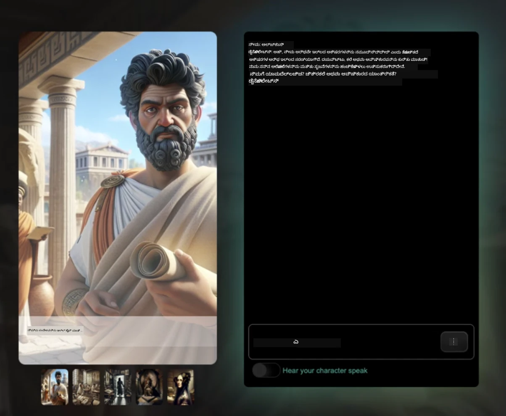
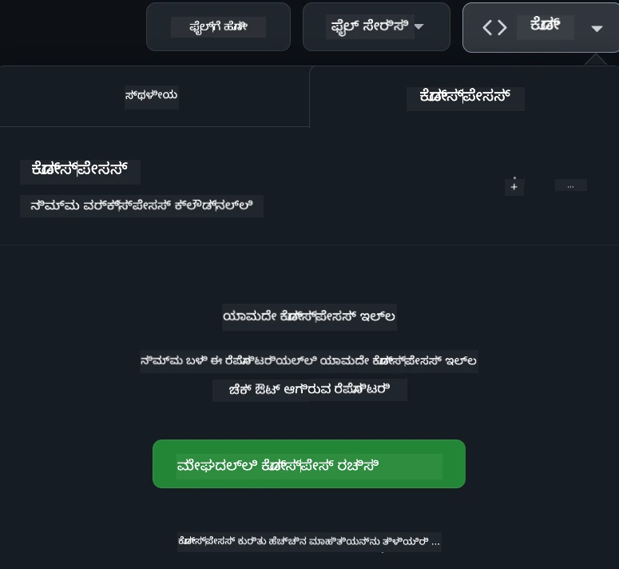

# ಶುರುಮೂಕರಿಗೆ ವೆಬ್ ಅಭಿವೃದ್ಧಿ - ಒಂದು ಪಠ್ಯಕ್ರಮ

Microsoft Cloud Advocates ಯಿಂದ ನಮ್ಮ 12-ವಾರಗಳ ಸಮಗ್ರ ಕೋರ್ಸ್ ಮೂಲಕ ವೆಬ್ ಅಭಿವೃದ್ಧಿಯ ಮೂಲಭೂತಗಳನ್ನು ಕಲಿಯಿರಿ. 24 ಪಾಠಗಳಲ್ಲಿ ಪ್ರತಿಯೊಂದೂ ಕೈಯಿಂದ ಪ್ರದರ್ಶನಗೊಂಡ ಪ್ರಾಜೆಕ್ಟ್‌ಗಳ ಮೂಲಕ JavaScript, CSS ಮತ್ತು HTML ಅನ್ನು ಅಧ್ಯಯನ ಮಾಡಲಾಗುತ್ತದೆ, ಉದಾಹರಣೆಗೆ ಟೆರೆರಿಯಂಗಳು, ಬ್ರೌಸರ್ ವಿಸ್ತರಣೆಗಳು ಮತ್ತು ಸ್ಪೇಸ್ ಗೇಮ್ಗಳು. ಕುಯಿಜ್‌ಗಳು, ಚರ್ಚೆಗಳು ಮತ್ತು ನೈಜ ಕಾರ್ಯಗಳನ್ನು ನಡೆಸಿ. ನಿಮ್ಮ ಕೌಶಲ್ಯಗಳನ್ನು ವೃದ್ಧಿಸಿ ಮತ್ತು ನಮ್ಮ ಪರಿಣಾಮಕಾರಿಯಾದ ಪ್ರಾಜೆಕ್ಟ್ ಆಧಾರಿತ ಪಠ್ಯಪದ್ಧತಿಯೊಂದಿಗೆ ಜ್ಞಾನವನ್ನು ಉತ್ತಮಗೊಳಿಸಿ. ನಿಮ್ಮ ಕೋಡಿಂಗ್ ಪ್ರಯಾಣವನ್ನು ಇಂದು ಪ್ರಾರಂಭಿಸಿ!

Azure AI Foundry Discord ಗೆ ಸೇರಿ ಮತ್ತು ತಜ್ಞರು ಮತ್ತು ಸಹ ಡೆವಲಪರ್‌ಗಳನ್ನು ಭೇಟಿಯಾಗಿ.

[](https://discord.gg/nTYy5BXMWG)

ಈ ಸಂಪನ್ಮೂಲಗಳನ್ನು ಬಳಸಿಕೊಂಡು ಆರಂಭಿಸಲು ಈ ಹಂತಗಳನ್ನು ಅನುಸರಿಸಿ:
1. **Repositories ಫೋರ್ಕ್ ಮಾಡಿರಿ**: ಕ್ಲಿಕ್ ಮಾಡಿ [](https://GitHub.com/microsoft/Web-Dev-For-Beginners/fork)
2. **Repositories ಕ್ಲೋನ್ ಮಾಡಿರಿ**:   `git clone https://github.com/microsoft/Web-Dev-For-Beginners.git`
3. [**Azure AI Foundry Discord ಗೆ ಸೇರಿ ಮತ್ತು ತಜ್ಞರು ಮತ್ತು ಸಹ ಡೆವಲಪರ್‌ಗಳನ್ನು ಭೇಟಿಯಾಗಿ**](https://discord.com/invite/ByRwuEEgH4)

### 🌐 ಬಹುಭಾಷಾ ಬೆಂಬಲ

#### GitHub ಕ್ರಿಯೆಯಿಂದ ಬೆಂಬಲಿತ (ಸ್ವಯಂಚಾಲಿತ ಮತ್ತು ಸದಾ ನವೀಕರಿಸಲಾಗಿದೆ)

> **ಸ್ಥಳೀಯವಾಗಿ ಕ್ಲೋನ್ ಮಾಡಲು ಇಷ್ಟವಿದೆಯೇ?**
>
> ಈ ರೆಪೊಗಳಲ್ಲಿ 50+ ಭಾಷಾ ಅನುವಾದಗಳು ಸೇರಿವೆ, ಇದು ಡೌನ್‌ಲೋಡ್ ಗಾತ್ರವನ್ನು ಗಮನೀಯವಾಗಿ ಹೆಚ್ಚಿಸುತ್ತದೆ. ಅನುವಾದಗಳಿಲ್ಲದೆ ಕ್ಲೋನ್ ಮಾಡಲು sparse checkout ಅನ್ನು ಬಳಸಿ:
>
> **Bash / macOS / Linux:**
> ```bash
> git clone --filter=blob:none --sparse https://github.com/microsoft/Web-Dev-For-Beginners.git
> cd Web-Dev-For-Beginners
> git sparse-checkout set --no-cone '/*' '!translations' '!translated_images'
> ```
>
> **CMD (ಪFenWindows):**
> ```cmd
> git clone --filter=blob:none --sparse https://github.com/microsoft/Web-Dev-For-Beginners.git
> cd Web-Dev-For-Beginners
> git sparse-checkout set --no-cone "/*" "!translations" "!translated_images"
> ```
>
> ಇದು ಕೋರ್ಸ್ ಪೂರ್ಣಗೊಳಿಸಲು ಬೇಕಾದ ಎಲ್ಲವನ್ನೂ ತುಂಬಾ ವೇಗವಾಗಿ ಡೌನ್‌ಲೋಡ್ ಮಾಡಲು ಸಹಾಯ ಮಾಡುತ್ತದೆ.

**ನೀವು ಹೆಚ್ಚುವರಿ ಅನುವಾದಗಳನ್ನು ಬಯಸಿದರೆ, ಬೆಂಬಲಿತ ಭಾಷೆಗಳು ಇಲ್ಲಿ ಪಟ್ಟಿ ಮಾಡಲಾಗಿದೆ. [ಇಲ್ಲಿ](https://github.com/Azure/co-op-translator/blob/main/getting_started/supported-languages.md)**

[](https://open.vscode.dev/microsoft/Web-Dev-For-Beginners)

#### 🧑‍🎓 _ನೀವು ವಿದ್ಯಾರ್ಥಿಯವರಾ?_

[**ವಿದ್ಯಾರ್ಥಿ ಹಬ್ ಪುಟ**](https://docs.microsoft.com/learn/student-hub/?WT.mc_id=academic-77807-sagibbon)ಗೆ ಭೇಟಿ ನೀಡಿ, ಇಲ್ಲಿ ನಿಮಗಾಗಿ ಆರಂಭಿಕ ಸಂಪನ್ಮೂಲಗಳು, ವಿದ್ಯಾರ್ಥಿ ಪ್ಯಾಕ್‌ಗಳು ಮತ್ತು ಉಚಿತ ಪ್ರಮಾಣಪತ್ರ ಕೂಪನ್ ಪಡೆಯುವ ಮಾರ್ಗಗಳು ಲಭ್ಯವಿವೆ. ಈ ಪುಟವನ್ನು ಬುಕ್‌ಮಾರ್ಕ್ ಮಾಡಿ ಮತ್ತು ತಿಂಗಳುಗಳಿಗೊಮ್ಮೆ ಅದು ನವೀಕರಣಗೊಂಡಿರುವುದನ್ನು ಪರಿಶೀಲಿಸಿ.

### 📣 ಘೋಷಣೆ - ಹೊಸ GitHub Copilot ಏಜೆಂಟ್ ಮೋಡ್ ಸವಾಲುಗಳನ್ನು ಪೂರ್ಣಗೊಳಿಸಿ!

ಹೊಸ ಸವಾಲು ಸೇರಿಸಲಾಗಿದೆ, ಬಹುತೇಕ ಅಧ್ಯಾಯಗಳಲ್ಲಿ "GitHub Copilot Agent Challenge 🚀" ಎಂದು ಪತ್ತೆಹಚ್ಚಿ. ಇದು GitHub Copilot ಮತ್ತು ಏಜೆಂಟ್ ಮೋಡ್ ಬಳಸಿ ಪೂರ್ಣಗೊಳಿಸಲು ಹೊಸ ಸವಾಲು. ನೀವು ಮೊದಲು ಏಜೆಂಟ್ ಮೋಡ್ ಬಳಸಿಲ್ಲದಿದ್ದರೆ, ಅದು ಕೇವಲ ಪಠ್ಯವನ್ನು ರಚಿಸುವುದಲ್ಲದೆ ಫೈಲ್‌ಗಳನ್ನು ರಚಿಸಬಹುದು, ಸಂಪಾದಿಸಬಹುದು, ಕಮಾಂಡ್‌ಗಳನ್ನು ಚಲಾಯಿಸಬಹುದು ಮತ್ತು ಇನ್ನಷ್ಟು ಮಾಡಬಹುದು.

### 📣 ಘೋಷಣೆ - _ಜನರೇಟಿವ್ AI ಬಳಸಿ ಹೊಸ ಪ್ರಾಜೆಕ್ಟ್_

ಹೊಸ AI ಅಸಿಸ್ಟೆಂಟ್ ಪ್ರಾಜೆಕ್ಟ್ ಸೇರಿಸಲಾಗಿದೆ, ಕನ್ನಡಿಸಿ ನೋಡಿ [project](./9-chat-project/README.md)

### 📣 ಘೋಷಣೆ - _JavaScript ಗಾಗಿ ಜನರೇಟಿವ್ AI ಮೇಲ್ಅಸ್ತರದ_ ಹೊಸ ಪಠ್ಯಕ್ರಮ ಹೊರಬಂದಿದೆ

ನಮ್ಮ ಹೊಸ ಜನರೇಟಿವ್ AI ಪಠ್ಯಕ್ರಮವನ್ನು ತಪ್ಪಿಸಿಕೊಳ್ಳಬೇಡಿ!

ತಾರಂಭಿಸಲು ಭೇಟಿಮಾಡಿ [https://aka.ms/genai-js-course](https://aka.ms/genai-js-course)


- ಮೂಲಗಳಿಂದ RAG ವರೆಗೆ ಎಲ್ಲಾ ವಿಷಯಗಳನ್ನು ಒಳಗೊಂಡ ಪಾಠಗಳು.
- GenAI ಮತ್ತು ನಮ್ಮ ಸಂಗಾತಿ ಆಪ್ ಬಳಸಿ ಐತಿಹಾಸಿಕ ಪಾತ್ರಗಳ ಜೊತೆಗೆ ಸಂವಹನ ಮಾಡಿ.
- ಆನಂದಕಾರಿಯಾಗಿ ಪಾತ್ರಕಥೆಗಳು, ನೀವು ಕಾಲಯಾನ ಮಾಡುತ್ತೀರಿ!



ಪ್ರತಿ ಪಾಠದಲ್ಲಿ ಪೂರ್ಣಗೊಳಿಸಲು ಒಂದು ಕಾರ್ಯ, ಜ್ಞಾನ ಪರಿಶೀಲನೆ ಮತ್ತು ಸವಾಲು ಸೇರಿವೆ, ಅಲ್ಲಿಯ ವಿಷಯಗಳ ಮೇಲೆ ಮಾರ್ಗದರ್ಶನ ನೀಡಲು:  
- ಪ್ರಾಂಪ್ಟ್ ಮತ್ತು ಪ್ರಾಂಪ್ಟ್ ಇಂಜಿನಿಯರಿಂಗ್  
- ಪಠ್ಯ ಮತ್ತು ಚಿತ್ರ ಆಪ್ ರಚನೆ  
- ಹುಡುಕು ಆಪ್ಗಳು  

ತಾರಂಭಿಸಲು ಭೇಟಿ ನೀಡಿ [https://aka.ms/genai-js-course](https://aka.ms/genai-js-course)

## 🌱 ಪ್ರಾರಂಭಿಸುವುದು

> **ಅಧ್ಯಾಪಕರು**, ಈ ಪಠ್ಯಕ್ರಮವನ್ನು ಹೇಗೆ ಬಳಸಬೇಕು ಎಂಬುದರ ಬಗ್ಗೆ ಕೆಲವು ಸಲಹೆಗಳನ್ನು ನಾವು [ಒದಗಿಸಿದ್ದೇವೆ](for-teachers.md). ದಯವಿಟ್ಟು ನಿಮ್ಮ ಅಭಿಪ್ರಾಯವನ್ನು [ನಮ್ಮ ಚರ್ಚಾ ವೇದಿಕೆ](https://github.com/microsoft/Web-Dev-For-Beginners/discussions/categories/teacher-corner) ನಲ್ಲಿ ಹಂಚಿಕೊಳ್ಳಿ!

**[ಶಿಕ್ಷಾರ್ಥಿಗಳು](https://aka.ms/student-page/?WT.mc_id=academic-77807-sagibbon)**, ಪ್ರತಿ ಪಾಠಕ್ಕೆ, ಪೂರ್ವ-ಉಪನ್ಯಾಸ ಕುಯಿಜ್‌ನಿಂದ ಪ್ರಾರಂಭಿಸಿ, ಉಪನ್ಯಾಸ ವಿಷಯವನ್ನು ಓದಿ, ವಿವಿಧ ಚಟುವಟಿಕೆಗಳನ್ನು ಪೂರ್ಣಗೊಳಿಸಿ ಮತ್ತು ನಂತರದ ಕುಯಿಜ್ ಮೂಲಕ ನಿಮ್ಮ ಅರ್ಥೈಸುವುದನ್ನು ಪರಿಶೀಲಿಸಿ.

ನಿಮ್ಮ ಅಧ್ಯಯನ ಅನುಭವವನ್ನು ಹೆಚ್ಚಿಸಲು, ಸಹಪಾಠಿಗಳೊಡನೆ ಸೇರಿ ಪ್ರಾಜೆಕ್ಟ್‌ಗಳಲ್ಲಿ ಕೆಲಸಮಾಡಿ! ಚರ್ಚೆಗಳು ನಮ್ಮ [ಚರ್ಚಾ ವೇದಿಕೆಯ](https://github.com/microsoft/Web-Dev-For-Beginners/discussions) ನಲ್ಲಿ ಪ್ರೋತ್ಸಾಹಿಸಲಾಗುತ್ತವೆ, ಅಲ್ಲಿ ನಮ್ಮ ಮಧ್ಯಸ್ಥರ ತಂಡ ನಿಮ್ಮ ಪ್ರಶ್ನೆಗಳಿಗೆ ಉತ್ತರ ನೀಡಲು ಲಭ್ಯವಿದೆ.

ನಿಮ್ಮ ಶಿಕ್ಷಣವನ್ನು ಮುಂದುವರೆಸಲು, [Microsoft Learn](https://learn.microsoft.com/users/wirelesslife/collections/p1ddcy5jwy0jkm?WT.mc_id=academic-77807-sagibbon) ನಲ್ಲಿ ಹೆಚ್ಚುವರಿ ಅಧ್ಯಯನ ಸಾಮಗ್ರಿಗಳನ್ನು ಅನ್ವೇಷಿಸಲು ಶಿಫಾರಸು ಮಾಡುತ್ತೇವೆ.

### 📋 ನಿಮ್ಮ ಪರಿಸರವನ್ನು ಸೆಟ್ ಮಾಡಲಾಗಿದೆ

ಈ ಪಠ್ಯಕ್ರಮವು ಅಭಿವೃದ್ಧಿ ಪರಿಸರವನ್ನು ಹೊಂದಿದೆ! ನೀವು ಪ್ರಾರಂಭಿಸಿದಾಗ, ನೀವು [Codespace](https://github.com/features/codespaces/) (ಬ್ರೌಸರ್ ಆಧಾರಿತ, ಸ್ಥಾಪನೆ ಅವಶ್ಯಕವಿಲ್ಲದ ಪರಿಸರ) ಅಥವಾ ನಿಮ್ಮ ಕಂಪ್ಯೂಟರ್‌ನಲ್ಲಿ [Visual Studio Code](https://code.visualstudio.com/?WT.mc_id=academic-77807-sagibbon) ಮುಂತಾದ ಟೆಕ್ಸ್ಟ್ ಎಡಿಟರ್ ಬಳಸಿಕೊಂಡು ಪ್ರೋಗ್ರಾಮ್ ನಡೆಸಬಹುದು.

#### ನಿಮ್ಮ ರಿಪೊಸಿಟರಿಯನ್ನು ರಚಿಸಿ  
ನಿಮ್ಮ ಕೆಲಸವನ್ನು ಸುಲಭವಾಗಿ ಉಳಿಸಲು, ಈ ರಿಪೊಸಿಟರಿಯ ಪ್ರತಿಯನ್ನು ನಿಮ್ಮ ಖಾತೆಯಲ್ಲಿ ತಯಾರಿಸಿಕೊಳ್ಳುವುದು ಶಿಫಾರಸು ಮಾಡಲಾಗಿದೆ. ಇದನ್ನು ಪುಟದ ಮೇಲ್ಭಾಗದಲ್ಲಿ ಇರುವ **Use this template** ಬಟನ್ ಒತ್ತಿ ಮಾಡಬಹುದು. ಇದು ಪಠ್ಯಕ್ರಮದ ಪ್ರತಿಯನ್ನು ಹೊಂದಿರುವ ಹೊಸ ರಿಪೊಸಿಟರಿಯನ್ನು ನಿಮ್ಮ GitHub ಖಾತೆಯಲ್ಲಿ ರಚಿಸುತ್ತದೆ.

ಈ ಹಂತಗಳನ್ನು ಅನುಸರಿಸಿ:  
1. **Repositories ಫೋರ್ಕ್ ಮಾಡಿರಿ**: ಈ ಪುಟದ ಮೇಲ್ಭಾಗದ ಬಲಭಾಗದಲ್ಲಿ "Fork" ಬಟನ್ ಕ್ಲಿಕ್ ಮಾಡಿ.  
2. **Repositories ಕ್ಲೋನ್ ಮಾಡಿರಿ**:   `git clone https://github.com/microsoft/Web-Dev-For-Beginners.git`  

#### Codespace ನಲ್ಲಿ ಪಠ್ಯಕ್ರಮವನ್ನು ನಡೆಸುವುದು

ನೀವು ರಚಿಸಿದ ಈ ರಿಪೊಸಿಟರಿ ಪ್ರತಿಯಲ್ಲಿ, **Code** ಬಟನ್ನುವೊಂದು ಕ್ಲಿಕ್ ಮಾಡಿ ಮತ್ತು **Open with Codespaces** ಆಯ್ಕೆಮಾಡಿ. ಇದು ಕೆಲಸ ಮಾಡಲು ಹೊಸ Codespace ರಚಿಸುತ್ತದೆ.



#### ನಿಮ್ಮ ಕಂಪ್ಯೂಟರ್‌ನಲ್ಲಿ ಸ್ಥಳೀಯವಾಗಿ ಪಠ್ಯಕ್ರಮವನ್ನು ಚಾಲನೆ ಮಾಡುವುದು

ಈ ಪಠ್ಯಕ್ರಮವನ್ನು ನಿಮ್ಮ ಕಂಪ್ಯೂಟರ್‌ನಲ್ಲಿ ನಡೆಸಲು, ಒಂದು ಟೆಕ್ಸ್ಟ್ ಎಡಿಟರ್, ಬ್ರೌಸರ್ ಮತ್ತು ಕಮಾಂಡ್ ಲೈನ್ ಸಾಧನ ಬೇಕಾಗುತ್ತದೆ. ನಮ್ಮ ಪ್ರಥಮ ಪಾಠ, [Introduction to Programming Languages and Tools of the Trade](../../1-getting-started-lessons/1-intro-to-programming-languages) ನೀವು ಆಯ್ಕೆಮಾಡಬಹುದಾದ ವಿವಿಧ ಸಾಧನಗಳ ಕುರಿತು ಮಾರ್ಗದರ್ಶನ ನೀಡುತ್ತದೆ.

ನಮ್ಮ ಶಿಫಾರಸು [Visual Studio Code](https://code.visualstudio.com/?WT.mc_id=academic-77807-sagibbon)ನ್ನು ನಿಮ್ಮ ಎಡಿಟರ್ ಆಗಿ ಬಳಸುವುದು, ಇದು ಒಳಗೊಂಡಿರುವ [ಟರ್ಮಿನಲ್](https://code.visualstudio.com/docs/terminal/basics/?WT.mc_id=academic-77807-sagibbon) ಸಹ ಹೊಂದಿದೆ. Visual Studio Codeನ್ನು [ಇಲ್ಲಿ](https://code.visualstudio.com/?WT.mc_id=academic-77807-sagibbon) ಡೌನ್‌ಲೋಡ್ ಮಾಡಬಹುದು.
1. ನಿಮ್ಮ ರೆಪొಸಿಟರಿಯನ್ನು ನಿಮ್ಮ ಕಂಪ್ಯೂಟರ್‌ಗೆ ಕ್ಲೋನ್ ಮಾಡಿ. ನೀವು ಇದರ ಬಗ್ಗೆ **Code** ಬಟನ್ ಕ್ಲಿಕ್ ಮಾಡಿ URL ನಕಲಿಸಬಹುದು:

    [CodeSpace](./images/createcodespace.png)

    ನಂತರ, [Visual Studio Code](https://code.visualstudio.com/?WT.mc_id=academic-77807-sagibbon) ನೊಳಗಿನ [Terminal](https://code.visualstudio.com/docs/terminal/basics/?WT.mc_id=academic-77807-sagibbon) ತೆರೆಯಿರಿ ಮತ್ತು ಕೆಳಗಿನ ಆಜ್ಞೆ ರನ್ ಮಾಡಿ, ಅಲ್ಲಿ `<your-repository-url>` ಅನ್ನು ನೀವು ಈಗ ನಕಲಿಸಿದ URL ನಿಂದ ಬದಲಾಯಿಸಿ:

    ```bash 
    git clone <your-repository-url>
    ```

2. Visual Studio Code ನಲ್ಲಿ ಫೋಲ್ಡರ್ ತೆರಯಿರಿ. ನೀವು ಇದನ್ನು **File** > **Open Folder** ಕ್ಲಿಕ್ ಮಾಡಿ ಮತ್ತು ನೀವು ಕ್ಲೋನ್ ಮಾಡಿದ ಫೋಲ್ಡರ್ ಆಯ್ಕೆಮಾಡಿ ಮಾಡಬಹುದು.


>  ಶಿಫಾರಸು ಮಾಡಲಾದ Visual Studio Code ವಿಸ್ತಾರಣೆಗಳು:
>
> * [Live Server](https://marketplace.visualstudio.com/items?itemName=ritwickdey.LiveServer&WT.mc_id=academic-77807-sagibbon) - Visual Studio Codeನಲ್ಲಿ HTML ಪುಟಗಳನ್ನು ಪೂರ್ವದೃಶ್ಯ ಮಾಡಲು
> * [Copilot](https://marketplace.visualstudio.com/items?itemName=GitHub.copilot&WT.mc_id=academic-77807-sagibbon) - ನಿಮ್ಮ ಕೋಡ್ ಅನ್ನು ವೇಗವಾಗಿ ಬರೆಯಲು ಸಹಾಯ ಮಾಡಲು

## 📂 ಪ್ರತಿಯೊಂದು ಪಾಠದಲ್ಲಿ ಸೇರಿದೆ:

- ಐಚ್ಛಿಕ ಸ್ಕೆಟ್ಟೀಚಿತ್ತ
- ಐಚ್ಛಿಕ ಪೂರಕ ವಿಡಿಯೋ
- ಪಾಠದ ಮುಂಚಿನ ತಯಾರಿ ಪ್ರಶ್ನೋತ್ತರ
- ಬರೆಯಲಾದ ಪಾಠ
- ಯೋಜನೆ ಆಧಾರಿತ ಪಾಠಗಳಿಗೆ, ಯೋಜನೆಯನ್ನು ನಿರ್ಮಿಸಲು ಹಂತ ಹಂತದ ಮಾರ್ಗದರ್ಶಿಗಳು
- ಜ್ಞಾನ ಪರಿಶೀಲನೆಗಳು
- ಒಂದು ಚಾಲೆಂಜ್
- ಪೂರಕ ಓದು
- ನಿಯೋಜನೆ
- [ಪಾಠದ ನಂತರ ಪ್ರಶ್ನೋತ್ತರ](https://ff-quizzes.netlify.app/web/)

> **ಪ್ರಶ್ನೋತ್ತರಗಳ ಬಗ್ಗೆ ಗಮನಿಕೆ**: ಎಲ್ಲಾ ಪ್ರಶ್ನೋತ್ತರಗಳು Quiz-app ಫೋಲ್ಡರ್‌ನೊಳಗೆ ಇವೆ, ಒಟ್ಟು 48 ಪ್ರಶ್ನೋತ್ತರಗಳು, ಪ್ರತಿ ಒಂದರಲ್ಲಿ ಮೂರು ಪ್ರಶ್ನೆಗಳು. ಅವುಗಳಿಗೆ [ಇಲ್ಲಿ](https://ff-quizzes.netlify.app/web/) ಲಭ್ಯವಿದೆ. ಪ್ರಶ್ನೋತ್ತರ ಆಪ್ ಅನ್ನು ಲೋಕಲ್‌ನಲ್ಲಿ ಚಲಾಯಿಸಬಹುದು ಅಥವಾ Azure ಗೆ ನಿಯೋಜಿಸಬಹುದು; `quiz-app` ಫೋಲ್ಡರ್‌ನಲ್ಲಿರುವ ಸೂಚನೆಗಳನ್ನು ಅನುಸರಿಸಿ.

## 🗃️ ಪಾಠಗಳು

|     |                       ಯೋಜನೆ ಹೆಸರು                      |                            ಕಲಿಕೆಯ ತತ್ವಗಳು                             | ಕಲಿಕೆ ಗುರಿಗಳು                                                                                                                      |                                                         ಲಿಂಕ್ ಮಾಡಿದ ಪಾಠ                                                          |         ಲೇಖಕ          |
| :-: | :------------------------------------------------------: | :--------------------------------------------------------------------: | -------------------------------------------------------------------------------------------------------------------------------- | :----------------------------------------------------------------------------------------------------------------------------: | :---------------------: |
| 01  |                     ಪ್ರಾರಂಭಿಸುವುದು                      |           ಪ್ರೋಗ್ರಾಮಿಂಗ್ ಪರಿಚಯ ಮತ್ತು ಉಪಕರಣಗಳ ಪರಿಚಯ           | ಬಹುತೇಕ ಪ್ರೋಗ್ರಾಮಿಂಗ್ ಭಾಷೆಗಳ ಮೂಲಭೂತ ಅಂಶಗಳನ್ನು ತಿಳಿದುಕೊಳ್ಳುವುದು ಮತ್ತು ವೃತ್ತಿಪರ ಅಭಿವೃದ್ಧಿಪಡಿಸುವವರಿಗೆ ಸಹಾಯ ಮಾಡುವ ಸಾಫ್ಟ್‌ವೇರ್‌ಗಳ ಕುರಿತು ತಿಳಿದುಕೊಳ್ಳುವುದು | [Intro to Programming Languages and Tools of the Trade](./1-getting-started-lessons/1-intro-to-programming-languages/README.md) |         Jasmine         |
| 02  |                     ಪ್ರಾರಂಭಿಸುವುದು                      |             GitHub ಮೂಲಭೂತ ಅಂಶಗಳು, ತಂಡದೊಂದಿಗೆ ಕೆಲಸ ಮಾಡುವಿಕೆ             | ನಿಮ್ಮ ಯೋಜನೆಯಲ್ಲಿ GitHub ನ 어떻게 ಉಪಯೋಗಿಸುವುದು, ಕೋಡ್‌ ಬೇಸ್ ಮೇಲೆ ಇತರರೊಡನೆ ಸಹಕಾರ ಹೇಗೆ ಮಾಡುವುದು |                            [Intro to GitHub](./1-getting-started-lessons/2-github-basics/README.md)                             |          Floor          |
| 03  |                     ಪ್ರಾರಂಭಿಸುವುದು                      |                             ಲಭ್ಯತೆ                             | ವೆಬ್ ಲಭ್ಯತೆಯ ಮೂಲಭೂತಗಳನ್ನು ತಿಳಿದುಕೊಳ್ಳುವುದು                                                                                            |                       [Accessibility Fundamentals](./1-getting-started-lessons/3-accessibility/README.md)                       |       Christopher       |
| 04  |                        JS ಮೂಲಭೂತಗಳು                         |                         ಜಾವಾಸ್ಕ್ರಿಪ್ಟ್ ಡೇಟಾ ಪ್ರಕಾರಗಳು                          | ಜಾವಾಸ್ಕ್ರಿಪ್ಟ್ ಡೇಟಾ ಪ್ರಕಾರಗಳ ಮೂಲಭೂತಗಳನ್ನು ತಿಳಿದುಕೊಳ್ಳುವುದು                                                                                     |                                       [Data Types](./2-js-basics/1-data-types/README.md)                                        |         Jasmine         |
| 05  |                        JS ಮೂಲಭೂತಗಳು                         |                         ಫಂಕ್ಷನ್ ಮತ್ತು ವಿಧಾನಗಳು                          | ಅಪ್ಲಿಕೇಶನ್ ನಿಯಂತ್ರಣ ವಲಯವನ್ನು ನಿರ್ವಹಿಸಲು ಫಂಕ್ಷನ್‌ಗಳು ಮತ್ತು ವಿಧಾನಗಳ ಬಗ್ಗೆ ತಿಳಿದುಕೊಳ್ಳುವುದು                                                         |                              [Functions and Methods](./2-js-basics/2-functions-methods/README.md)                               | Jasmine and Christopher |
| 06  |                        JS ಮೂಲಭೂತಗಳು                         |                        ಜಾವಾಸ್ಕ್ರಿಪ್ಟ್ೊಂದಿಗೆ ನಿರ್ಧಾರಗಳು ತೆಗೆದುಕೊಳ್ಳುವುದು                        | ನಿರ್ಧಾರಮಾಡುವ ವಿಧಾನಗಳನ್ನು ಬಳಸಿ ನಿಮ್ಮ ಕೋಡ್‌ನಲ್ಲಿ ಷರತ್ತುಗಳನ್ನು ಹೇಗೆ ರಚಿಸುವುದು ಎಂಬುದನ್ನು ಕಲಿಯಿರಿ                                                      |                                 [Making Decisions](./2-js-basics/3-making-decisions/README.md)                                  |         Jasmine         |
| 07  |                        JS ಮೂಲಭೂತಗಳು                         |                            ಜೋಡಿಗಳು ಮತ್ತು ಪುನರಾವರ್ತನೆಗಳು                            | ಜಾವಾಸ್ಕ್ರಿಪ್ಟ್‌ನಲ್ಲಿ ಜೋಡಿಗಳು ಮತ್ತು ಪುನರಾವರ್ತನೆಗಳೊಂದಿಗೆ ಡೇಟಾ ನಿರ್ವಹಿಸಿ                                                                   |                                   [Arrays and Loops](./2-js-basics/4-arrays-loops/README.md)                                    |         Jasmine         |
| 08  |       [Terrarium](./3-terrarium/solution/README.md)       |                            HTML ಕಾರ್ಯಾಚರಣೆ                            | ಆನ್‌ಲೈನ್ ಟೆರಾರಿಯನ್ ನಿರ್ಮಿಸಲು HTML ರಚಿಸಿ, ವಿನ್ಯಾಸ ಕಟ್ಟಳಿಕೆ ಮೇಲೆ ಗಮನಹರಿಸಿ                                                              |                                 [Introduction to HTML](./3-terrarium/1-intro-to-html/README.md)                                 |           Jen           |
| 09  |       [Terrarium](./3-terrarium/solution/README.md)       |                            CSS ಕಾರ್ಯಾಚರಣೆ                             | ಆನ್‌ಲೈನ್ ಟೆರಾರಿಯನ್‌ನ್ನು ಶೈಲಿ ಮಾಡಲು CSS ರಚಿಸಿ, ಹೆಚ್ಚಾಗಿ ಉತ್ತರದಾಯಕ ಪುಟ ನಿರ್ಮಾಣಕ್ಕೆ ಸ್ನೇಹಪೂರಕ CSS ಅಂಶಗಳ ಮೇಲೆ ಗಮನಹರಿಸಿ |                                  [Introduction to CSS](./3-terrarium/2-intro-to-css/README.md)                                  |           Jen           |
| 10  |            [Terrarium](./3-terrarium/solution/README.md)            |                 ಜಾವಾಸ್ಕ್ರಿಪ್ಟ್ ಕ್ಲೋಜರ್‌ಗಳು, DOM ಸಂಚಲನ                  | ಟೆರಾರಿಯನ್ ಅನ್ನು ಡ್ರ್ಯಾಗ್/ಡ್ರಾಪ್ ಇಂಟರ್ಫೇಸ್ ಆಗಿ ಕಾರ್ಯನಿರ್ವಹಿಸಲು ಜಾವಾಸ್ಕ್ರಿಪ್ಟ್ ರಚಿಸಿ, ಕ್ಲೋಜರ್‌ಗಳು ಮತ್ತು DOM ಸಂಚಲನದ ಮೇಲೆ ಗಮನಹರಿಸಿ              |                  [JavaScript Closures, DOM manipulation](./3-terrarium/3-intro-to-DOM-and-closures/README.md)                   |           Jen           |
| 11  |          [ಟೈಪಿಂಗ್ ಆಟ](./4-typing-game/solution/README.md)          |                          ಟೈಪಿಂಗ್ ಆಟ ನಿರ್ಮಿಸಿ                           | ಕೀಬೋರ್ಡ್ ಈವೆಂಟ್ಗಳನ್ನು ಬಳಸಿ ನಿಮ್ಮ ಜಾವಾಸ್ಕ್ರಿಪ್ಟ್ ಅಪ್ಲಿಕೇಶನ್‌ನ ಲಾಜಿಕ್ ಅನ್ನು ಕೊಂಡಾಡುವುದು ಕಲಿಯಿರಿ                                                      |                                [Event-Driven Programming](./4-typing-game/typing-game/README.md)                                |       Christopher       |
| 12  | [ಹಸಿರು ಬ್ರೌಸರ್ ವಿಸ್ತರಣೆ](./5-browser-extension/solution/README.md) |                         ಬ್ರೌಸರ್‌ಗಳೊಂದಿಗೆ ಕೆಲಸ                          | ಬ್ರೌಸರ್‌ಗಳು ಹೇಗೆ ಕಾರ್ಯನಿರ್ವಹಿಸುತ್ತವೆ, ಅವರ ಇತಿಹಾಸ ಮತ್ತು ಬ್ರೌಸರ್ ವಿಸ್ತರಣೆ ಮೊದಲ ಅಂಶಗಳನ್ನು ಹೇಗೆ ರಚಿಸುವುದು ಕಲಿಯಿರಿ                               |                               [About Browsers](./5-browser-extension/1-about-browsers/README.md)                                |           Jen           |
| 13  | [ಹಸಿರು ಬ್ರೌಸರ್ ವಿಸ್ತರಣೆ](./5-browser-extension/solution/README.md) | ಫಾರ್ಮ್ ನಿರ್ಮಿಸಲು, API ಕರೆ ಮಾಡಲು ಮತ್ತು ಸ್ಥಳೀಯ ಸಂಗ್ರಹಣೆ 변수ಗಳನ್ನು ಸಂಗ್ರಹಿಸಲು | ಬ್ರೌಸರ್ ವಿಸ್ತರಣೆಯ ಜಾವಾಸ್ಕ್ರಿಪ್ಟ್ ಅಂಶಗಳನ್ನು ರಚಿಸಿ API ಕರೆ ಮಾಡಲು ಮತ್ತು ಸ್ಥಳೀಯ ಸಂಗ್ರಹದಲ್ಲಿ ಸಂಗ್ರಹಿಸಿರುವ 변수ಗಳನ್ನು ಬಳಸಿರಿ                      |                [APIs, Forms, and Local Storage](./5-browser-extension/2-forms-browsers-local-storage/README.md)                 |           Jen           |
| 14  | [ಹಸಿರು ಬ್ರೌಸರ್ ವಿಸ್ತರಣೆ](./5-browser-extension/solution/README.md) |          ಬ್ರೌಸರ್‌ನ ಹಿನ್ನೆಲೆ ಪ್ರಕ್ರಿಯೆಗಳು, ವೆಬ್ ಕಾರ್ಯಕ್ಷಮತೆ          | ವಿಸ್ತರಣೆಯ ಐಕಾನ್ ನಿರ್ವಹಿಸಲು ಬ್ರೌಸರ್ ಹಿನ್ನೆಲೆ ಪ್ರಕ್ರಿಯೆಗಳನ್ನು ಬಳಸಿರಿ; ವೆಬ್ ಕಾರ್ಯಕ್ಷಮತೆ ಮತ್ತು ಕೆಲವು ಸುಧಾರಣೆಗಳ ಬಗ್ಗೆ ತಿಳಿದುಕೊಳ್ಳಿ   |             [Background Tasks and Performance](./5-browser-extension/3-background-tasks-and-performance/README.md)              |           Jen           |
| 15  |           [ಸ್ಪೇಸ್ ಆಟ](./6-space-game/solution/README.md)           |             ಜಾವಾಸ್ಕ್ರಿಪ್ಟ್ ಮೂಲಕ ಇನ್ನಷ್ಟು ಆಧುನಿಕ ಆಟ ಅಭಿವೃದ್ಧಿ             | ಕ್ಲಾಸ್‌ಗಳ ಮತ್ತು ಕಾಂಪೋಸಿಷನ್‌ ಬಳಸಿ ವರ್ಗಾವಣೆಯನ್ನು ತಿಳಿದುಕೊಳ್ಳಿ ಮತ್ತು ಪಬ್/ಸಬ್ ಮಾದರಿಯನ್ನು ತಿಳಿದುಕೊಳ್ಳಿ, ಆಟವನ್ನು ನಿರ್ಮಿಸಲು ತಯಾರಿ                           |                      [Introduction to Advanced Game Development](./6-space-game/1-introduction/README.md)                       |          Chris          |
| 16  |           [ಸ್ಪೇಸ್ ಆಟ](./6-space-game/solution/README.md)           |                           ಕ್ಯಾನ್ವಾಸ್‌ಗೆ ಚಿತ್ರಣ                            | ಪರದೆಗೆ ಅಂಶಗಳನ್ನು ಚಿತ್ರಿಸುವುದಕ್ಕೆ ಬಳಸುವ ಕ್ಯಾನ್ವಾಸ್ API ಬಗ್ಗೆ ತಿಳಿದುಕೊಳ್ಳಿ                                                                       |                                [Drawing to Canvas](./6-space-game/2-drawing-to-canvas/README.md)                                |          Chris          |
| 17  |           [ಸ್ಪೇಸ್ ಆಟ](./6-space-game/solution/README.md)           |                   ಪರದೆದ ಒಳಗಿನ ಅಂಶಗಳನ್ನು ಮುಂದುವರಿಸುವಿಕೆ                    | ಕಾರ್ಟೀಶಿಯನ್ ಸಂಯೋಜಕಗಳು ಮತ್ತು ಕ್ಯಾನ್ವಾಸ್ API ಬಳಸಿ ಅಂಶಗಳಿಗೆ ಚಲನೆ ನೀಡುವುದನ್ನು ಗಮನಿಸಿ                                           |                           [Moving Elements Around](./6-space-game/3-moving-elements-around/README.md)                           |          Chris          |
| 18  |           [ಸ್ಪೇಸ್ ಆಟ](./6-space-game/solution/README.md)           |                          ಸ್ಟಿಕ್ಕಾದ್ದರ ಪತ್ತೆ                          | ಕೀಲಿಮಣೆ ಒತ್ತುವಿಕೆಗಳನ್ನು ಬಳಸಿ ಅಂಶಗಳು ಪರಸ್ಪರ ತಗುಲುವಂತೆ ಮಾಡಿ ಮತ್ತು ಆಟದ ಕಾರ್ಯಕ್ಷಮತೆಯ ಖಾತರಿಗಾಗಿ ಶೀತಕಾಲ ಫಂಕ್ಷನ್ ಒದಗಿಸಿ    |                              [Collision Detection](./6-space-game/4-collision-detection/README.md)                              |          Chris          |
| 19  |           [ಸ್ಪೇಸ್ ಆಟ](./6-space-game/solution/README.md)           |                             ಅಂಕಗಳನ್ನು ಇಟ್ಟುಕೊಳ್ಳುವುದು                              | ಆಟದ ಸ್ಥಿತಿ ಮತ್ತು ಕಾರ್ಯಕ್ಷಮತೆಯ ಆಧಾರದ ಮೇಲೆ ಗಣಿತ ಲೆಕ್ಕಾಚಾರಗಳನ್ನು ನಿರ್ವಹಿಸಿ                                                                |                                    [Keeping Score](./6-space-game/5-keeping-score/README.md)                                    |          Chris          |
| 20  |           [ಸ್ಪೇಸ್ ಆಟ](./6-space-game/solution/README.md)           |                     ಆಟವನ್ನು ಕೊನೆಗೊಳಿಸಿ ಮತ್ತು ಮರುಪ್ರಾರಂಭಿಸಿ                     | ಆಟವನ್ನು ಕೊನೆಗೊಳಿಸುವುದು ಮತ್ತು ಮರುಪ್ರಾರಂಭಿಸುವುದರ ಬಗ್ಗೆ ಕಲಿಯಿರಿ, ಅಂಶಗಳನ್ನು ಸ್ವಚ್ಛಗೊಳಿಸುವುದು ಮತ್ತು ಚರಗಳ ಮೌಲ್ಯಗಳನ್ನು ಮರುಹೊಂದಿಸುವುದು                              |                                [The Ending Condition](./6-space-game/6-end-condition/README.md)                                 |          Chris          |
| 21  |         [ಬ್ಯಾಂಕಿಂಗ್ ಅಪ್](./7-bank-project/solution/README.md)          |                 ವೆಬ್ ಅಪ್ಲಿಕೇಶನ್‌ನಲ್ಲಿ HTML ಟ್ಯಾಂಪ್ಲೇಟುಗಳು ಮತ್ತು ಮಾರ್ಗಗಳ ರಚನೆ                 | ಬಹುಪುಟದ ವೆಬ್‌ಸೈಟ್ ವಾಸ್ತುಶಿಲ್ಪವನ್ನು ಮಾರ್ಗ ಉಪಯೋಗಿಸಿ ಮತ್ತು HTML ಟೆಂಪ್ಲೇಟುಗಳಿಂದ ಹೇಗೆ ರಚಿಸುವುದು ಕಲಿಯಿರಿ                             |                            [HTML Templates and Routes](./7-bank-project/1-template-route/README.md)                             |          Yohan          |
| 22  |         [ಬ್ಯಾಂಕಿಂಗ್ ಅಪ್](./7-bank-project/solution/README.md)          |                  ಲಾಗಿನ್ ಮತ್ತು ನೋಂದಣಿ ಫಾರ್ಮ್ ಅಡಿಯಲ್ಲಿ ನಿರ್ಮಿಸಿ                   | ಫಾರ್ಮ್‌ಗಳನ್ನು ನಿರ್ಮಿಸುವುದು ಮತ್ತು ಮಾನ್ಯತೆಯ ನಿಯಮಗಳನ್ನು ನಿರ್ವಹಿಸುವುದನ್ನು ತಿಳಿದುಕೊಳ್ಳಿ                                                                          |                                           [Forms](./7-bank-project/2-forms/README.md)                                           |          Yohan          |
| 23  |         [ಬ್ಯಾಂಕಿಂಗ್ ಅಪ್](./7-bank-project/solution/README.md)          |                   ಡೇಟಾ ಪಡೆಯುವ ಮತ್ತು ಉಪಯೋಗಿಸುವ ವಿಧಾನಗಳು                   | ನಿಮ್ಮ ಅಪ್ಲಿಕೇಶನ್‌ನಲ್ಲಿ ಡೇಟಾ ಹೇಗೆ ಹರಿಯುತ್ತದೆ, ಅದನ್ನು ಹೇಗೆ ಪಡೆಯಬೇಕು, ಸಂಗ್ರಹಿಸಬೇಕು ಮತ್ತು ತ್ಯಜಿಸಬೇಕು ಎಂಬುದನ್ನು ತಿಳಿದುಕೊಳ್ಳಿ                                                 |                                            [Data](./7-bank-project/3-data/README.md)                                            |          Yohan          |
| 24  |         [ಬ್ಯಾಂಕಿಂಗ್ ಅಪ್](./7-bank-project/solution/README.md)          |                      ರಾಜ್ಯ ನಿರ್ವಹಣೆಯ ತತ್ತ್ವಗಳು                      | ನಿಮ್ಮ ಅಪ್ಲಿಕೇಶನ್ ರಾಜ್ಯವನ್ನು ಹೇಗೆ ಇಡುತ್ತದೆ ಮತ್ತು ಅದನ್ನು ಪ್ರೋಗ್ರಾಮಾಗವಾಗಿ ಹೇಗೆ ನಿರ್ವಹಿಸುವುದು ಕಲಿಯಿರಿ                                                              |                                [State Management](./7-bank-project/4-state-management/README.md)                                |          Yohan          |
| 25 | [ಬ್ರೌಸರ್/VScode ಕೋಡ್](../../8-code-editor) | VScode ಜೊತೆಗೆ ಕೆಲಸ | ಕೋಡ್ ಎಡಿಟರ್ ಬಳಕೆ ಮಾಡುವುದು ಕಲಿಯಿರಿ| [Use VScode Code Editor](./8-code-editor/1-using-a-code-editor/README.md) | Chris |
| 26 | [AI ಸಹಾಯಕರು](./9-chat-project/README.md) | AI ಜೊತೆಗೆ ಕೆಲಸ | ನಿಮ್ಮದೇ AI ಸಹಾಯಕರನ್ನು ನಿರ್ಮಿಸುವುದು ಕಲಿಯಿರಿ | [AI Assistant project](./9-chat-project/README.md) | Chris |

## 🏫 ಪಾಠಶಕ್ತಿ

ನಮ್ಮ ಪಠ್ಯಕ್ರಮವು ಎರಡು ಪ್ರಮುಖ ಪಠ್ಯಶೈಲಿಜ್ಞಾನ ಪ್ರಿಂಸಿಪಲ್ಗಳ ಮೇಲೆ ನಿರ್ಮಿಸಲಾಗಿದೆ:
* ಯೋಜನೆ ಆಧಾರಿತ ಅಭ್ಯಾಸ
* ನಿಯಮಿತ ಪ್ರಶ್ನೋತ್ತರಗಳು

ಈ ಕಾರ್ಯಕ್ರಮವು ಜಾವಾಸ್ಕ್ರಿಪ್ಟ್, HTML ಮತ್ತು CSS ನ ಮೂಲಭೂತಗಳನ್ನು ಕಲಿಸುತ್ತದೆ, ಮತ್ತು ಇತ್ತೀಚಿನ ಉಪಕರಣಗಳು ಮತ್ತು ತಂತ್ರಗಳನ್ನು ಬೆಳೆಸುತ್ತದೆ, ಇಂದಿನ ವೆಬ್ ಡೆವಲಪರ್‌ಗಳು ಬಳಸುವಂತೆ. ವಿದ್ಯಾರ್ಥಿಗಳು ಟೈಪಿಂಗ್ ಆಟ, ವಾಸ್ತುಶಿಲ್ಪ ಟೆರಾರಿಯಂ, ಪರಿಸರಾನುಗ್ರಾಹಕ ಬ್ರೌಸರ್ ವಿಸ್ತರಣೆ, ಸ್ಪೇಸ್-ಇನ್‌ವೇಡರ್ ಶೈಲಿ ಆಟ ಮತ್ತು ವ್ಯವಹಾರಗಳಿಗಾಗಿ ಬ್ಯಾಂಕಿಂಗ್ ಅಪ್ ಅನ್ನು ನಿರ್ಮಿಸುವ ಮೂಲಕ ಪ್ರಾಯೋಗಿಕ ಅನುಭವ ಗಳಿಸುವ ಅವಕಾಶವನ್ನು ಹೊಂದಿದ್ದಾರೆ. ಸರಣಿಯ ಅಂತ್ಯದಲ್ಲಿ, ವಿದ್ಯಾರ್ಥಿಗಳು ವೆಬ್ ಅಭಿವೃದ್ಧಿಯ ದೃಢವಾದ ತಿಳುವಳಿಕೆಯನ್ನು ಪಡೆದುಕೊಳ್ಳುತ್ತಾರೆ.

> 🎓 ನೀವು ಈ ಪಠ್ಯಕ್ರಮದ ಪ್ರಥಮ ಕೆಲ ಪಾಠಗಳನ್ನು ಮائಕ್ರೋಸಾಫ್ಟ್ ಲರ್ನ್ ನಲ್ಲಿ [Learn Path](https://docs.microsoft.com/learn/paths/web-development-101/?WT.mc_id=academic-77807-sagibbon) ಆಗಿ ಪಡೆಯಬಹುದು!

ವಿಷಯವು ಯೋಜನೆಗಳಿಗೆ ಹೊಂದಿಕೊಳ್ಳುವಂತೆ ಖಚಿತಪಡಿಸುವ ಮೂಲಕ, ಪ್ರಕ್ರಿಯೆ ವಿದ್ಯಾರ್ಥಿಗಳಿಗೆ ಹೆಚ್ಚು ಆಕರ್ಷಕವಾಗುತ್ತದೆ ಮತ್ತು ತತ್ವಗಳ ಸ್ಮರಣೆ ಹೆಚ್ಚುತ್ತದೆ. ನಾವು ಜಾವಾಸ್ಕ್ರಿಪ್ಟ್ ಮೂಲಭೂತಗಳಲ್ಲಿ ಹಲವಾರು ಆರಂಭಿಕ ಪಾಠಗಳನ್ನು ಬರೆದಿದ್ದೇವೆ, ಜೊತೆಗೆ "[Beginners Series to: JavaScript](https://channel9.msdn.com/Series/Beginners-Series-to-JavaScript/?WT.mc_id=academic-77807-sagibbon)" ವಿಡಿಯೋ ಟ್ಯುಟೋರಿಯಲ್ ಸರಣಿಯಿಂದ ವಿಡಿಯೋ ಕೂಡ ವೀಕ್ಷಣೆ ಮಾಡಲಾಗಿದೆ, ಈ ಪಠ್ಯಕ್ರಮಕ್ಕೆ ಕೆಲವು ಲೇಖಕರು ಸಹ ಕೊಡುಗೆ ನೀಡಿದ್ದಾರೆ.

ಇದೊಂದಿಗೇ, ತರಗತಿ ಆರಂಭದಲ್ಲಿ ಕಡಿಮೆ ಒತ್ತಡದ ಪ್ರಶ್ನೋತ್ತರವು ವಿದ್ಯಾರ್ಥಿಯ ಅಭಿಪ್ರಾಯವು ವಿಷಯವನ್ನು ಕಲಿಯಲು ಪ್ರೇರೇಪಿಸುತ್ತದೆ, ಮತ್ತು ತರಗತಿ ನಂತರ ಮತ್ತೊಂದು ಪ್ರಶ್ನೋತ್ತರವು ತತ್ವಗಳ ಮರುಪಠಣೆಯನ್ನು ಖಚಿತಪಡಿಸುತ್ತದೆ. ಈ ಪಠ್ಯಕ್ರಮವು ಸುಗಮ ಮತ್ತು ಮನರಂಜನೆಯಾಗಿ ವಿನ್ಯಾಸಗೊಳ್ಳಿದ್ದು, ಸಂಪೂರ್ಣ ಅಥವಾ ಭಾಗವಾಗಿ ಪಡೆಯಬಹುದು. ಯೋಜನೆಗಳು ಸಣ್ಣದಾಗಿ ಪ್ರಾರಂಭವಾಗಿ 12 ವಾರಗಳ ಚಕ್ರದ ಕೊನೆಯಲ್ಲಿ ಹೆಚ್ಚು ಸಂಕೀರ್ಣವಾಗುತ್ತವೆ.

ನಾವು ಉದ್ದೇಶಪೂರ್ವಕವಾಗಿ ಜಾವಾಸ್ಕ್ರಿಪ್ಟ್ ಫ್ರೇಮ್ವರ್ಕ್‌ಗಳನ್ನು ಪರಿಚಯಿಸುವುದನ್ನು ತಪ್ಪಿಸಿ, ವೆಬ್ ಡೆವಲಪರ್ ಆಗಿ ಅಗತ್ಯವಿರುವ ಮೂಲ ಕೌಶಲ್ಯಗಳ ಮೇಲೆ ಗಮನಹರಿಸಿದ್ದೇವೆ, ಈ ಪಠ್ಯಕ್ರಮವನ್ನು ಪೂರ್ಣಗೊಳಿಸಲು ಉತ್ತಮ ಮುಂದುವರೆದ ಹಂತವು "[Beginner Series to: Node.js](https://channel9.msdn.com/Series/Beginners-Series-to-Nodejs/?WT.mc_id=academic-77807-sagibbon)" ಎಂಬ ಮತ್ತೊಂದು ವಿಡಿಯೋ ಸರಣಿಯಿಂದ Node.js ಬಗ್ಗೆ ತಿಳಿದುಕೊಳ್ಳುವುದು ಆಗಿರುತ್ತದೆ.

> ನಮ್ಮ [Code of Conduct](CODE_OF_CONDUCT.md) ಮತ್ತು [Contributing](CONTRIBUTING.md) ಮಾರ್ಗಸೂಚಿಗಳನ್ನು ಭೇಟಿ ಮಾಡಿ. ನಿಮ್ಮ ಸತಿಕೃತ ಅಭಿಪ್ರಾಯಗಳನ್ನು ಸ್ವಾಗತಿಸುತ್ತೇವೆ!

## 🧭 ಆಫ್‌ಲೈನ್ ಪ್ರವೇಶ

ನೀವು [Docsify](https://docsify.js.org/#/) ಉಪಯೋಗಿಸಿ ಈ ಡಾಕ್ಯುಮೆಂಟೇಶನ್ ಅನ್ನು ಆಫ್‌ಲೈನ್‌ನಲ್ಲಿ ರನ್ ಮಾಡಬಹುದು. ಈ ರೆಪೊವನ್ನು ಫೋರ್ಕ್ ಮಾಡಿ, ನಿಮ್ಮ ಸ್ಥಳೀಯ ಯಂತ್ರದಲ್ಲಿ [Docsify ನ ಸ್ಥಾಪನೆ](https://docsify.js.org/#/quickstart) ಮಾಡಿ, ನಂತರ ಈ ರೆಪೊಬ ಹೊಸ ಮೂಲ ಫೋಲ್ಡರ್‌ನಲ್ಲಿ `docsify serve` ಟೈಪ್ ಮಾಡಿ. ವೆಬ್‌ಸೈಟ್ ನಿಮ್ಮ ಲೋಕಲ್‌ಹೋಸ್ಟ್‌ನಲ್ಲಿ ಪೋರ್ಟ್ 3000 ನಲ್ಲಿ ಸರ್ವ್ ಆಗುತ್ತದೆ: `localhost:3000`.

## 📘 PDF
ಎಲ್ಲಾ ಪಾಠಗಳ PDF ಅನ್ನು ನೀವು [ಇಲ್ಲಿ](https://microsoft.github.io/Web-Dev-For-Beginners/pdf/readme.pdf) ಕಾಣಬಹುದು.


## 🎒 ಇತರ ಕೋರ್ಸ್‌ಗಳು

ನಮ್ಮ ತಂಡ ಇತರ ಕೋರ್ಸ್‌ಗಳನ್ನು ತಯಾರಿಸುತ್ತದೆ! ಪರಿಶೀಲಿಸಿ:

<!-- CO-OP TRANSLATOR OTHER COURSES START -->
### LangChain
[](https://aka.ms/langchain4j-for-beginners)
[](https://aka.ms/langchainjs-for-beginners?WT.mc_id=m365-94501-dwahlin)
[](https://github.com/microsoft/langchain-for-beginners?WT.mc_id=m365-94501-dwahlin)
---

### Azure / Edge / MCP / Agents
[](https://github.com/microsoft/AZD-for-beginners?WT.mc_id=academic-105485-koreyst)
[](https://github.com/microsoft/edgeai-for-beginners?WT.mc_id=academic-105485-koreyst)
[](https://github.com/microsoft/mcp-for-beginners?WT.mc_id=academic-105485-koreyst)
[](https://github.com/microsoft/ai-agents-for-beginners?WT.mc_id=academic-105485-koreyst)

---
 
### Generative AI Series
[](https://github.com/microsoft/generative-ai-for-beginners?WT.mc_id=academic-105485-koreyst)
[-9333EA?style=for-the-badge&labelColor=E5E7EB&color=9333EA)](https://github.com/microsoft/Generative-AI-for-beginners-dotnet?WT.mc_id=academic-105485-koreyst)
[-C084FC?style=for-the-badge&labelColor=E5E7EB&color=C084FC)](https://github.com/microsoft/generative-ai-for-beginners-java?WT.mc_id=academic-105485-koreyst)
[-E879F9?style=for-the-badge&labelColor=E5E7EB&color=E879F9)](https://github.com/microsoft/generative-ai-with-javascript?WT.mc_id=academic-105485-koreyst)

---
 
### ಕೋರ್ ಲರ್ನಿಂಗ್
[](https://aka.ms/ml-beginners?WT.mc_id=academic-105485-koreyst)
[](https://aka.ms/datascience-beginners?WT.mc_id=academic-105485-koreyst)
[](https://aka.ms/ai-beginners?WT.mc_id=academic-105485-koreyst)
[](https://github.com/microsoft/Security-101?WT.mc_id=academic-96948-sayoung)
[](https://aka.ms/webdev-beginners?WT.mc_id=academic-105485-koreyst)
[](https://aka.ms/iot-beginners?WT.mc_id=academic-105485-koreyst)
[](https://github.com/microsoft/xr-development-for-beginners?WT.mc_id=academic-105485-koreyst)

---
 
### ڪوಪೈಲಟ್ ಸರಣಿ
[](https://aka.ms/GitHubCopilotAI?WT.mc_id=academic-105485-koreyst)
[](https://github.com/microsoft/mastering-github-copilot-for-dotnet-csharp-developers?WT.mc_id=academic-105485-koreyst)
[](https://github.com/microsoft/CopilotAdventures?WT.mc_id=academic-105485-koreyst)
<!-- CO-OP TRANSLATOR OTHER COURSES END -->

## ಸಹಾಯ ಪಡೆಯುವುದು

ನೀವು ಅಡ್ಡಿಪಡಿಸಿದರೆ ಅಥವಾ AI ಅಪ್ಲಿಕೇಶನ್‌ಗಳನ್ನು ನಿರ್ಮಿಸುವ ಬಗ್ಗೆ ಯಾವುದೇ ಪ್ರಶ್ನೆಗಳಿದ್ದರೆ. MCP ಬಗ್ಗೆ ಚರ್ಚೆಗಳಲ್ಲಿ ಸಹ оқуಗರ ಮತ್ತು ಅನುಭವಸಂಪನ್ನ ಡೆವಲಪರ್‌ಗಳ ಜೊತೆ ಸೇರಿ. ಇದು ಪ್ರಶ್ನೆಗಳನ್ನು ಸ್ವಾಗತಿಸುವ ಮತ್ತು ಜ್ಞಾನವನ್ನು ಮುಕ್ತವಾಗಿ ಹಂಚುವ ಬೆಂಬಲದ ಸಮುದಾಯವಾಗಿದೆ.

[](https://discord.gg/nTYy5BXMWG)

ನೀವು ಉತ್ಪನ್ನ ಪ್ರತಿಕ್ರಿಯೆ ಅಥವಾ ನಿರ್ಮಾಣ ವೇಳೆ ದೋಷಗಳನ್ನು ಹೊಂದಿದ್ದರೆ ಭೇಟಿಮಾಡಿ:

[](https://aka.ms/foundry/forum)

## ಪರವಾನಗಿ

ಈ ರೆಪೊಸಿಟರಿ MIT ಪರವಾನಗಿ ಅಡಿ ಪರವಾನಗಿಯಾಗುತ್ತದೆ. ಹೆಚ್ಚಿನ ಮಾಹಿತಿಗಾಗಿ [LICENSE](../../LICENSE) ಫಯಲ್ ನೋಡಿ.

---

<!-- CO-OP TRANSLATOR DISCLAIMER START -->
**ತಪ್ಪು ನಿಬ್ಬೆರಗು**:
ಈ ದસ્તಾವೇಜು AI ಅನುವಾದ ಸೇವೆ [Co-op Translator](https://github.com/Azure/co-op-translator) ಬಳಸಿ ಅನುವಾದಿಸಲಾಗಿದೆ. ನಾವು ನಿಖರತೆಗೆ ಪ್ರಯತ್ನಿಸಿದರೂ, ಸ್ವಯಂಚಾಲಿತ ಅನುವಾದಗಳಲ್ಲಿ ತಪ್ಪುಗಳು ಅಥವಾ ಅಸತ್ಯತೆಗಳು ಇರುವ ಸಾಧ್ಯತೆ ಇದೆ ಎಂಬುದನ್ನು ದಯವಿಟ್ಟು ಗಮನದಲ್ಲಿಡಿ. ಮೂಲ ದಸ್ತಾವೇಜಿನ ಸ್ವಾಭಾವಿಕ ಭಾಷೆಯನ್ನು ಪ್ರಾಮಾಣಿಕ ಮೂಲವೆಂದು ಪರಿಗಣಿಸಬೇಕು. ಗಂಭೀರ ಮಾಹಿತಿಗಾಗಿ, ವೃತ್ತಿಪರ ಮಾನವ ಅನುವಾದವನ್ನು ಶಿಫಾರಸು ಮಾಡಲಾಗುತ್ತದೆ. ಈ ಅನುವಾದ ಬಳಕೆಯಿಂದ ಉಂಟಾಗುವ ಯಾವುದೇ ಗುದ್ದಲಾಟ ಅಥವಾ ತಪ್ಪು ಅರ್ಥಮಾಡಿಕೊಳ್ಳುವುದಕ್ಕೆ ನಾವು ಹೊಣೆಗಾರರಲ್ಲ.
<!-- CO-OP TRANSLATOR DISCLAIMER END -->