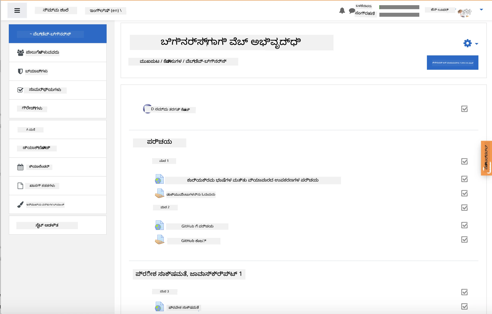
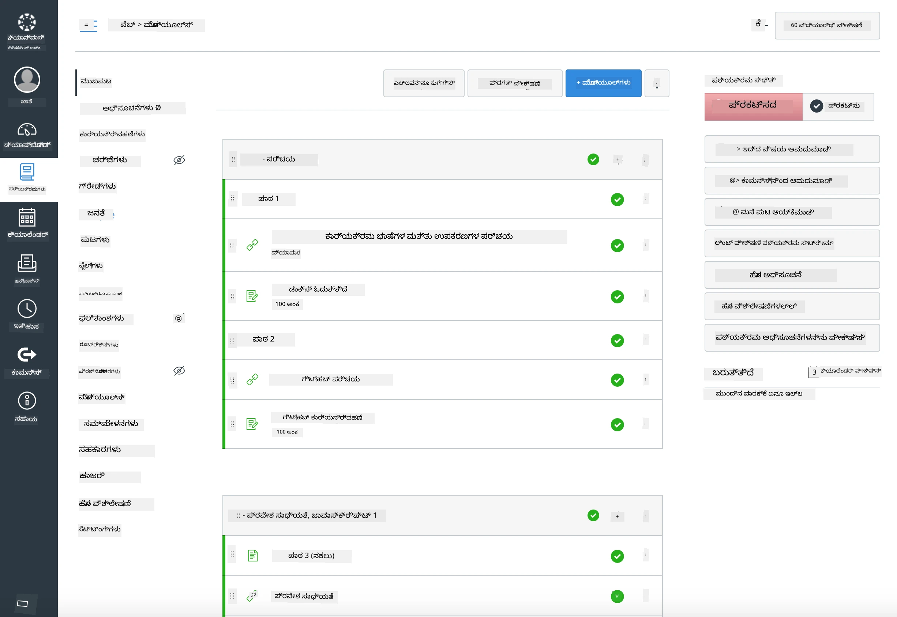

### ಶಿಕ್ಷಕರಿಗೆ

ನೀವು ಈ ಪಠ್ಯಕ್ರಮವನ್ನು ನಿಮ್ಮ ತರಗತಿಯಲ್ಲಿ ಬಳಸಲು ಸ್ವಾಗತಾರ್ಹರಾಗಿದ್ದೀರಿ. ಇದು GitHub Classroom ಮತ್ತು ಪ್ರಮುಖ LMS ವೇದಿಕೆಗಳೊಂದಿಗೆ ಸಿಹಿ ಸಮನ್ವಯವಾಗಿ ಕೆಲಸ ಮಾಡುತ್ತದೆ, ಮತ್ತು ಇದು ನಿಮ್ಮ ವಿದ್ಯಾರ್ಥಿಗಳೊಂದಿಗೆ ಸ್ವತಂತ್ರ ರಿಪೊ ಆಗಿಯೂ ಬಳಸಬಹುದು.

### GitHub Classroom ಜೊತೆಗೆ ಬಳಸಿ

ಪ್ರತಿ ಗುಂಪು ಪ್ರಕಾರ ಪಾಠಗಳು ಮತ್ತು ಹುದ್ದೆಗಳನ್ನು ನಿರ್ವಹಿಸಲು, ಪ್ರತಿ ಪಾಠಕ್ಕೆ ಒಂದೊಂದು ರಿಪೊವನ್ನು ಸೃಷ್ಟಿಸಿ ಅಂತೆ GitHub Classroom ಪ್ರತಿ ಹುದ್ದೆಯನ್ನು ಸ್ವತಂತ್ರವಾಗಿ ಜೋಡಿಸಬಹುದು.

- ಈ ರಿಪೊವನ್ನು ನಿಮ್ಮ ಸಂಸ್ಥೆಗೆ ಫೋರ್ಕ್ ಮಾಡಿ.
- ಪ್ರತಿ ಪಾಠಕ್ಕಾಗಿ ಪ್ರತ್ಯೇಕ ರಿಪೊ ಅನ್ನು ರಚಿಸಿ, ಪ್ರತಿ ಪಾಠದ ಫೋಲ್ಡರ್‌ನ ವಿಷಯಗಳನ್ನು ಅದರಲ್ಲಿಗೆ ಹೊರತಗೊಳ್ಳಿ.
  - ಆಯ್ಕೆ A: ಖಾಲಿ ರಿಪೊಗಳನ್ನು (ಪ್ರತಿ ಪಾಠಕ್ಕೆ ಒಂದು) ರಚಿಸಿ ಮತ್ತು ಪಾಠ ಫೋಲ್ಡರ್ ವಿಷಯಗಳನ್ನು ಪ್ರತಿಯೊಂದರಲ್ಲಿಗೆ ನಕಲು ಮಾಡಿ.
  - ಆಯ್ಕೆ B: If provenance is needed, use Git ಇತಿಹಾಸವನ್ನು ಉಳಿಸುವ ವಿಧಾನವನ್ನು ಅನುಸರಿಸಿ (ಉದಾ: ಫೋಲ್ಡರ್ ಅನ್ನು ಹೊಸ ರಿಪೊಗೆ ವಿಭಜಿಸುವುದು).
- GitHub Classroom ನಲ್ಲಿ, ಪ್ರತಿ ಪಾಠಕ್ಕೆ ಒಂದು ಹುದ್ದೆ ಸೃಷ್ಟಿಸಿ ಮತ್ತು ಅದನ್ನು ಸೂಕ್ತ ಪಾಠ ರಿಪೊಗೆ ಸೂಚಿಸಿ.
- ಶಿಫಾರಸು ಮಾಡಲಾದ ಸೆಟ್ಟಿಂಗ್‌ಗಳು:
  - ರಿಪೊ ವೀಕ್ಷಣೀಯತೆ: ವಿದ್ಯಾರ್ಥಿಗಳ ಕೆಲಸಕ್ಕೆ ಖಾಸಗಿ ಸೇವನೆ.
  - ಸ್ಟಾರ್ಟರ್ ಕೋಡ್ ಪಾಠ ರಿಪೊ ಮೂಲ ಶಾಖೆಯಿಂದ ಬಳಸಿ.
  - ಕ್ವಿಜ್‌ಗಳು ಮತ್ತು ಸಲ್ಲಿಕೆಗಳಿಗೆ ಇಷ್ಯೂಗಳು ಮತ್ತು ಪುಲ್ ರಿಕ್ವೆಸ್ಟ್ ಟೆಂಪ್ಲೇಟ್ಗಳನ್ನು ಸೇರಿಸಿ.
  - ನಿಮ್ಮ ಪಾಠಗಳಲ್ಲಿ ಇದ್ದರೆ ಸ್ವಯಂಮತ್ಸರಿಗೆ ಮತ್ತು ಪರೀಕ್ಷೆಗಳನ್ನು ಆಯ್ಕೆಮಾಡಿ ಸನ್ನಿಹಿತಗೊಳಿಸಬಹುದು.
- ಸಹಾಯಕ ನಿಯಮಗಳು:
  - ರಿಪೊ ಹೆಸರುಗಳು ಹೀಗೆ ಇರಲಿ: lesson-01-intro, lesson-02-html, ಇತ್ಯಾದಿ.
  - ಲೇಬಲ್ಗಳು: quiz, assignment, needs-review, late, resubmission.
  - ಗುಂಪುಗಳ ಪ್ರಕಾರ ಟ್ಯಾಗ್‌ಗಳು/ವಿಡೀಕರಣಗಳು (ಉದಾ: v2025-term1).

ಟಿಪ್: Git ಸಂಘರ್ಷಗಳ ತಡೆಗಾಗಿ ಸಿಂಕ್ ಮಾಡಲಾದ ಫೋಲ್ಡರ್‌ಗಳ ಒಳಗೆ (ಉದಾ: OneDrive/Google Drive) ರಿಪೊಗಳನ್ನು ಉಳಿಸುವುದನ್ನು ತಪ್ಪಿಸಿ, ವಿಶೇಷವಾಗಿ Windows ನಲ್ಲಿ.

### Moodle, Canvas, ಅಥವಾ Blackboard ಜೊತೆ ಬಳಸಿ

ಈ ಪಠ್ಯಕ್ರಮದಲ್ಲಿ ಸಾಮಾನ್ಯ LMS ಕಾರ್ಯಪ್ರವಾಹಗಳಿಗೆ ಅನ್ವಯಿಸಬಹುದಾದ ಆಮದು ಪ್ಯಾಕೇಜ್ಗಳು ಸೇರಿವೆ.

- Moodle: ಪೂರ್ಣ ಕೋರ್ಸ್ ಲೋಡ್ ಮಾಡಲು Moodle ಅಪ್ಲೋಡ್ ಫೈಲ್ [Moodle upload file](../../../../../../../teaching-files/webdev-moodle.mbz) ಬಳಸಿ.
- Common Cartridge: ಹೆಚ್ಚಿನ LMS ಹೊಂದಾಣಿಕೆಗೆ Common Cartridge ಫೈಲ್ [Common Cartridge file](../../../../../../../teaching-files/webdev-common-cartridge.imscc) ಬಳಸಿ.
- ಟಿಪ್ಪಣಿಗಳು:
  - Moodle ಕ್ಲೌಡ್‌ಗೆ Common Cartridge ಬೆಂಬಲ ಸೀಮಿತವಾಗಿದೆ. ಮೇಲಿನ Moodle ಫೈಲ್‌ನ್ನು ವಿಷಯಪ್ರಕಾರ Canvas ಗೆ ಅಪ್ಲೋಡ್ ಮಾಡಬಹುದು.
  - ಆಮದು ನಂತರ, ನೀವು ಉಪನ್ಯಾಸ ಸಮಯಕ್ಕೆ ಸರಿಹೊಂದುವಂತೆ ಮೊಡ್ಯೂಲ್‌ಗಳು, ದಿನಾಂಕಗಳು ಮತ್ತು ಕ್ವಿಜ್ ಸೆಟ್ಟಿಂಗ್‌ಗಳನ್ನು ಪರಿಶೀಲಿಸಿ.

> Moodle ತರಗತಿಯಲ್ಲಿ ಪಠ್ಯಕ್ರಮ

> Canvas ನಲ್ಲಿ ಪಠ್ಯಕ್ರಮ

### ರಿಪೊ ಅನ್ನು ನೇರವಾಗಿ ಬಳಸಿ (Classroom ಇಲ್ಲದೆ)

ನೀವು GitHub Classroom ಬಳಸಲು ಇಚ್ಛಿಸದಿದ್ದರೆ, ಈ ರಿಪೊದಿಂದಲೇ ಕೋರ್ಸ್ ನಡೆದುಕೊಳ್ಳಬಹುದು.

- ಸಹಕಾಲಿಕ/ಆನ್‌ಲೈನ್ ವಿನ್ಯಾಸಗಳು (Zoom/Teams):
  - ಸಣ್ಣ ಮಾರ್ಗದರ್ಶಕರಾಗಿರುವ ತಳಮಳಿಸುಗೆಗಳು ಜರುಗಿಸಿ; ಕ್ವಿಜ್‌ಗಳಿಗೆ ಬ್ರೇಕ್‌ಔಟ್ ರೂಮ್‌ಗಳನ್ನು ಬಳಸಿರಿ.
  - ಕ್ವಿಜ್‌ಗಳಿಗೆ ಸಮಯ ವಿಂಡೊನ್ನು ಪ್ರಕಟಿಸಿ; ವಿದ್ಯಾರ್ಥಿಗಳು ಉತ್ತರಗಳನ್ನು GitHub Issues ಮೂಲಕ ಸಲ್ಲಿಸುತ್ತಾರೆ.
  - ಸಹಕಾರ ಹುದ್ದೆಗಳಿಗೆ, ವಿದ್ಯಾರ್ಥಿಗಳು ಸಾರ್ವಜನಿಕ ಪಾಠ ರಿಪೊಗಳಲ್ಲಿ ಕಾರ್ಯನಿರ್ವಹಿಸಿ ಪುಲ್ ರಿಕ್ವೆಸ್ಟ್ ತೆರೆಯುತ್ತಾರೆ.
- ಖಾಸಗಿ/ಅಸಹಕರಿಶಾಲಿ ವಿನ್ಯಾಸಗಳು:
  - ವಿದ್ಯಾರ್ಥಿಗಳು ತಮ್ಮದೇ ಖಾಸಗಿ ರಿಪೊಗಳಿಗೆ ಪ್ರತಿ ಪಾಠವನ್ನು ಫೋರ್ಕ್ ಮಾಡಿ ಮತ್ತು ನಿಮ್ಮನ್ನು ಸಹಕಾರಿಯಾಗಿ ಸೇರಿಸಿಕೊಳ್ಳುತ್ತಾರೆ.
  - ಇಷ್ಯೂಗಳು (ಕ್ವಿಜ್‌ಗಳು) ಮತ್ತು ಪುಲ್ ರಿಕ್ವೆಸ್ಟ್‌ಗಳು (ಹುದ್ದೆಗಳು) ಮೂಲಕ ನೀವು ಅಥವಾ ಅವರು ತಮ್ಮ ಖಾಸಗಿ ರಿಪೊಗಳಲ್ಲಿನ ತರಗತಿ ರಿಪೊಗೆ ಸಲ್ಲಿಕೆ ಮಾಡುತ್ತಾರೆ.

### ಉತ್ತಮ ಅಭ್ಯಾಸಗಳು

- Git/GitHub ಮೂಲ बातें, Issues, ಮತ್ತು PRs ಬಗ್ಗೆ ಪರಿಚಯ ಪಾಠವನ್ನು ನೀಡಿರಿ.
- ಎಲೈಗು-ಹಂತೀಯ ಕ್ವಿಜ್/ಹುದ್ದೆಗಳಿಗೆ Issues ನಲ್ಲಿ ಚೆಕ್‌ಲಿಸ್ಟ್‌ಗಳನ್ನು ಬಳಸಿರಿ.
- ತರಗತಿ ನಿಯಮಗಳನ್ನು ಸ್ಥಾಪಿಸಲು CONTRIBUTING.md ಮತ್ತು CODE_OF_CONDUCT.md ಸೇರಿಸಿ.
- ಪ್ರವೇಶ ಸಾಧನಗಳ ಸೂಚನೆಗಳು (alt ಪಠ್ಯ, ಕ್ಯಾಪ್ಶನ್‌ಗಳು) ಮತ್ತು ಮುದ್ರಣযোগ্য PDF ಗಳು ಒದಗಿಸಿ.
- ಸರ್ವರಿಸು ಪ್ರತಿ ಅವಧಿಗೆ ನಿಮ್ಮ ವಿಷಯವನ್ನು ವರ್ಝನ್ ಮಾಡಿ ಮತ್ತು ಪ್ರಕಟಣೆಯ ನಂತರ ಪಾಠ ರಿಪೊಗಳನ್ನು ಸ್ಥಗಿತಗೊಳಿಸಿ.

### ಪ್ರತಿಕ್ರিয়া ಮತ್ತು ಬೆಂಬಲ

ನಾವು ಈ ಪಠ್ಯಕ್ರಮವು ನೀವು ಮತ್ತು ನಿಮ್ಮ ವಿದ್ಯಾರ್ಥಿಗಳು ಬಳಸಲು ಸಹಾಯಕವಾಗಿರಲು ಬಯಸುತ್ತೇವೆ. ದಯವಿಟ್ಟು ಈ ರಿಪೊದಲ್ಲಿ ಹೊಸ Issue ತೆರೆಯಿರಿ ದೋಷಗಳು, ವಿನಂತಿಗಳು, ಅಥವಾ ಸುಧಾರಣೆಗಳಿಗೆ, ಅಥವಾ Teacher Corner ನಲ್ಲಿ ಚರ್ಚೆ ಪ್ರಾರಂಭಿಸಿ.

---

<!-- CO-OP TRANSLATOR DISCLAIMER START -->
**ಬಾಧ್ಯತಾ ವಿವರಣೆ**:  
ಈ ದಾಖಲೆ [Co-op Translator](https://github.com/Azure/co-op-translator) ಎಂಬ AI ಅನುವಾದ ಸೇವೆಯನ್ನು ಬಳಸಿ ಅನುವಾದಿಸಲಾಗಿದೆ. ನಾವು ನಿಖರತೆಗೆ ಪ್ರಯತ್ನಿಸಿದರೂ, ಸ್ವಯಂಚಾಲಿತ ಅನುವಾದಗಳಲ್ಲಿ ತೈರ್ಯತೆಗಳು ಅಥವಾ ತಪ್ಪುಗಳು ಇರಬಹುದು ಎಂದು ದಯವಿಟ್ಟು ಗಮನಿಸಿ. ಮೂಲದ ಭಾಷೆಯಲ್ಲಿ ಇರುವ ಮೂಲ ದಾಖಲೆ ಅಧಿಕೃತ ಮೂಲವೆಂದು ಪರಿಗಣಿಸಲಾಗಬೇಕು. ಮಹತ್ವದ ಮಾಹಿತಿಗಾಗಿ, ತಜ್ಞ ಮಾನವ ಅನುವಾದವನ್ನು ಶಿಫಾರಸು ಮಾಡಲಾಗುತ್ತದೆ. ಈ ಅನುವಾದ ಬಳಕೆಯಿಂದ ಉಂಟಾಗುವ ಯಾವುದೇ ಅರ್ಥಮಾಡಿಕೊಳ್ಳದ ಜೀವಮಾನಗಳಿಗೆ ನಾವು ಹೊಣೆ ಹೊರುವುದಿಲ್ಲ.
<!-- CO-OP TRANSLATOR DISCLAIMER END -->