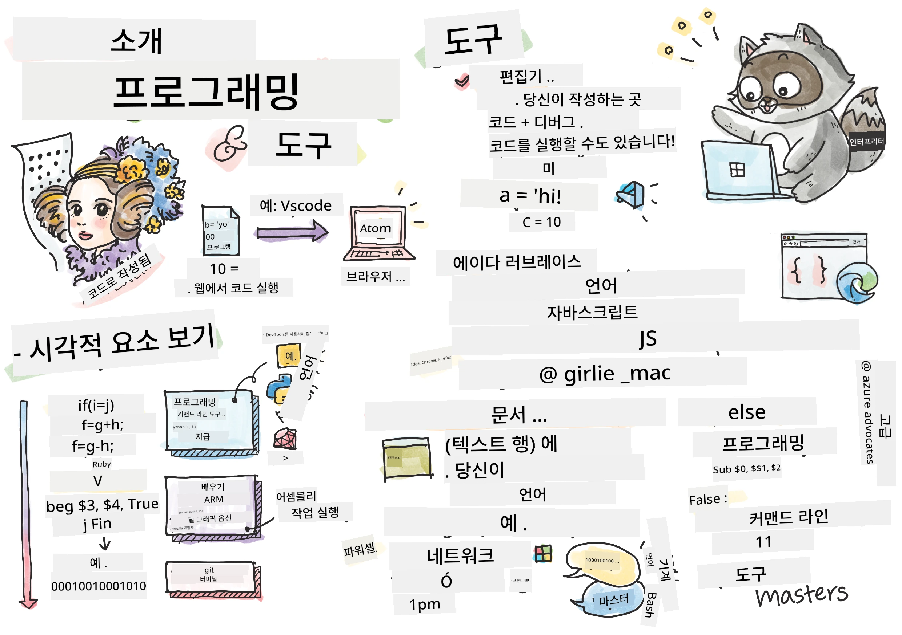
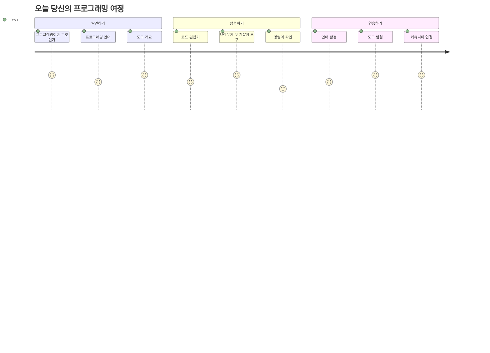
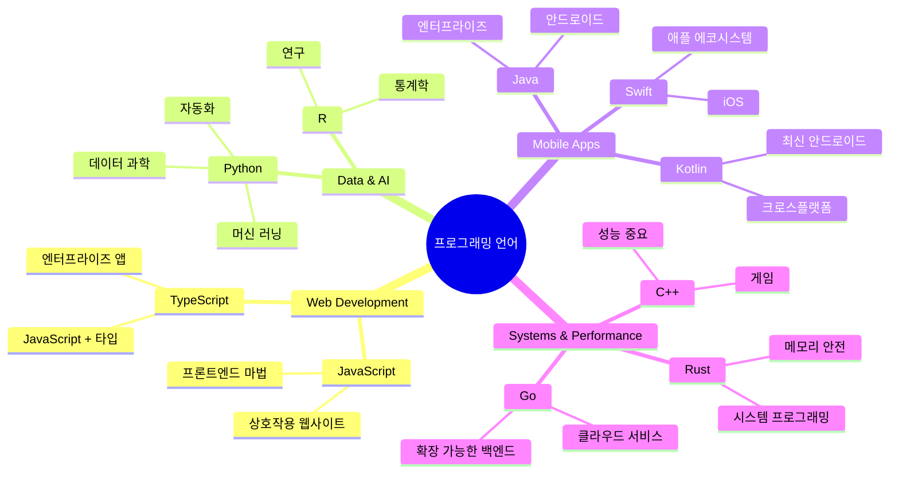
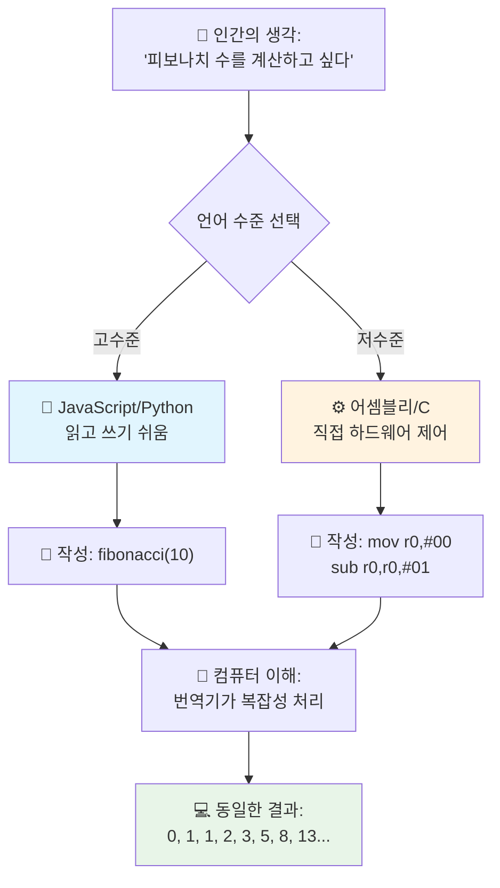
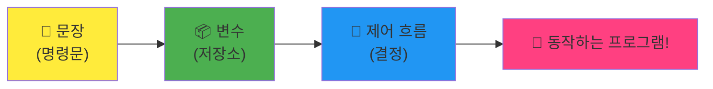
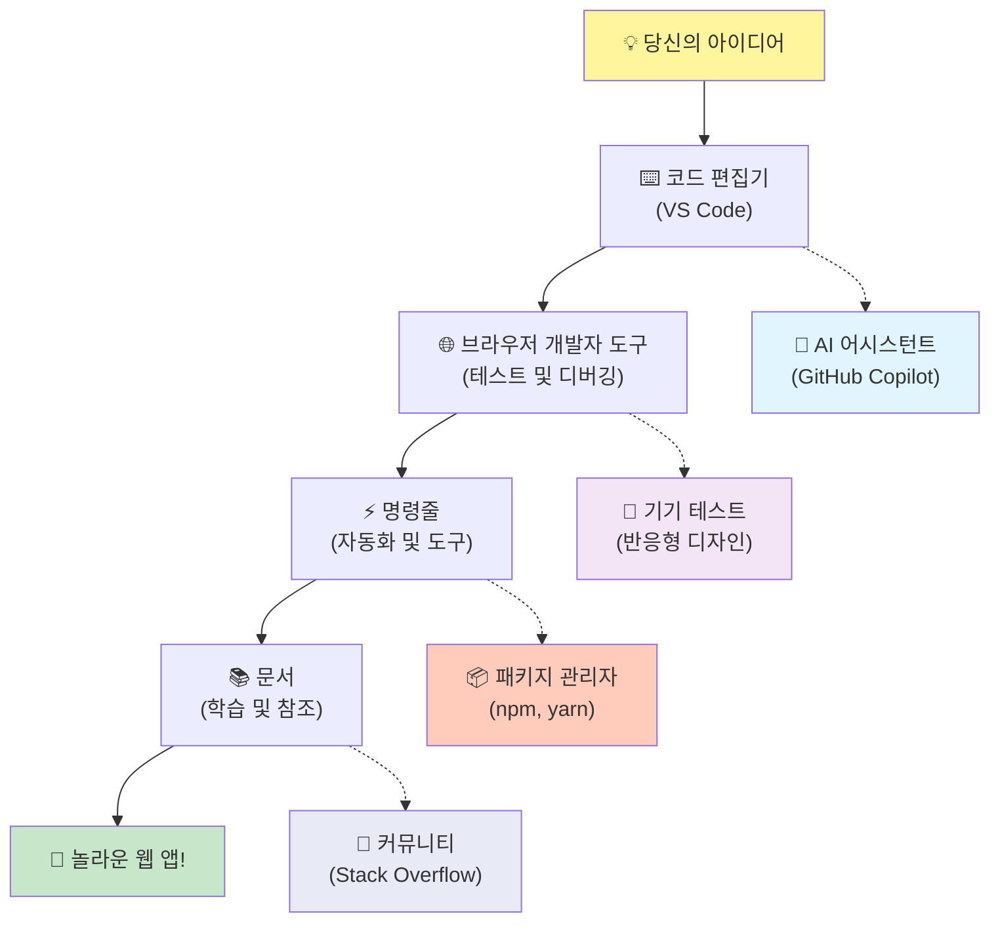
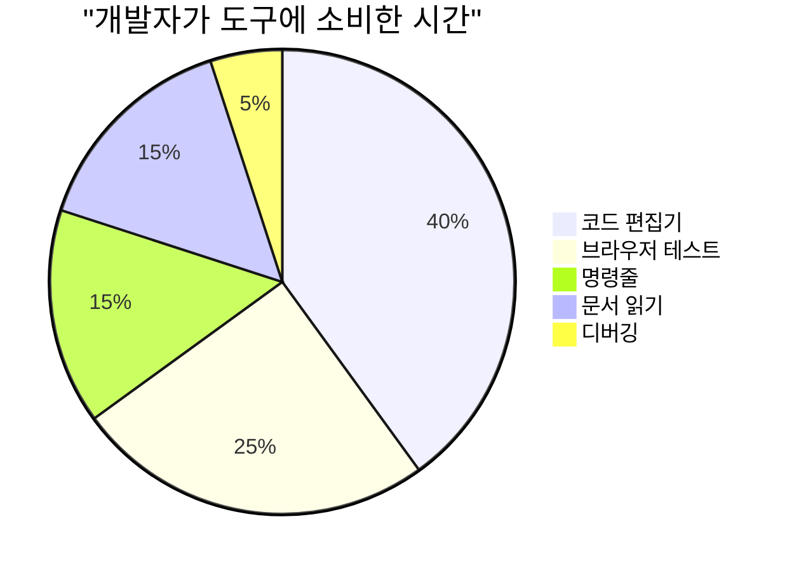
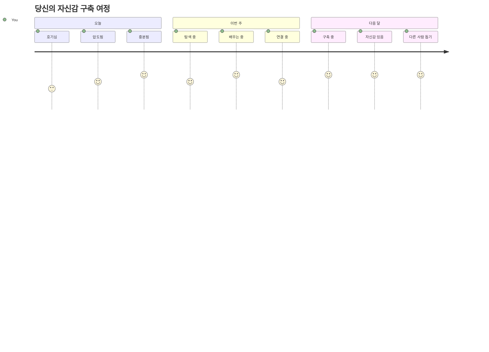

# 프로그래밍 언어와 최신 개발 도구 소개

안녕하세요, 미래의 개발자님! 👋 매일매일 저를 소름 돋게 하는 이야기를 해도 될까요? 프로그래밍은 단지 컴퓨터에 관한 것이 아니라, 여러분의 가장 대담한 아이디어를 현실로 만드는 진짜 초능력을 갖게 되는 거랍니다!

여러분이 좋아하는 앱을 사용할 때 모든 게 딱 맞아떨어지는 순간을 아시나요? 버튼을 누르자마자 “와, 어떻게 이렇게 한 거지?” 싶은 마법 같은 일이 벌어지는 순간을요. 그 마법은 바로 여러분과 같은 사람이, 아마 가장 좋아하는 카페에서 새벽 2시에 세 번째 에스프레소를 마시며 코드를 쓴 결과입니다. 그리고 여러분의 마음을 완전히 흔들어 놓을 사실이 있어요: 이 수업이 끝날 때쯤이면 그들이 어떻게 그걸 만들었는지 이해할 뿐만 아니라 여러분도 직접 시도하고 싶어 할 거예요!

지금 프로그래밍이 어렵게 느껴진다고 해도 완전히 이해해요. 저도 처음 시작할 때는 수학 천재거나 다섯 살 때부터 코딩하고 있어야 하는 줄 알았거든요. 그런데 제 생각을 완전히 바꾼 건 이것이었어요: 프로그래밍은 새로운 언어로 대화하는 법을 배우는 것과 똑같다는 거죠. “안녕하세요”, “감사합니다”부터 시작해 커피 주문까지 익히고, 어느새 깊은 철학적 대화를 나누는 단계로 가게 되는 거예요! 단, 이번엔 컴퓨터와 대화하는 거고 솔직히? 컴퓨터는 여러분 실수도 안 판단하고 계속 다시 시도할 수 있게 늘 참고 기다려 주는 가장 인내심 많은 대화 상대예요!

오늘은 최신 웹 개발을 가능하게 할 뿐 아니라 정말 중독성 강한 놀라운 도구들을 탐험할 거예요. 넷플릭스, 스포티파이, 좋아하는 인디 앱 스튜디오의 개발자들이 매일 같이 쓰는 똑같은 편집기, 브라우저, 작업 흐름들을 말이죠. 그리고 여러분이 춤추게 만들 부분: 이 전문적인 수준의 산업 표준 도구들 대부분이 완전 무료라는 사실이에요!


> 스케치노트 by [Tomomi Imura](https://twitter.com/girlie_mac)



## 여러분이 이미 알고 있는 걸 볼까요!

재미있는 걸 시작하기 전에 궁금해요 – 여러분은 프로그래밍 세계에 대해 이미 무엇을 알고 있나요? 그리고 만약 이 질문들을 보면서 “전혀 모르겠는데요”라고 생각해도 괜찮아요, 완벽해요! 지금 이 순간 딱 맞는 자리에 있다는 뜻이에요. 이 퀴즈는 운동 전 스트레칭처럼, 뇌 근육을 준비시키는 워밍업이라 생각하세요!

[수업 전 퀴즈 풀기](https://forms.office.com/r/dru4TE0U9n?origin=lprLink)


## 우리가 함께 떠날 모험

정말로 오늘 탐험할 것들이 너무 흥분돼요! 이 개념들을 이해하는 순간 여러분 표정을 직접 보고 싶을 정도예요. 우리 함께할 엄청난 여정은 다음과 같아요:

- **프로그래밍이 실제로 무엇인지(그리고 왜 가장 멋진 일인지!)** – 알람이 어떻게 월요일 아침임을 알아챌 수 있는지, 넷플릭스 추천 알고리즘이 어떻게 완벽하게 맞춰지는지 등, 주변 모든 것을 움직이는 보이지 않는 마법 같은 코드의 힘을 발견할 거예요.
- **프로그래밍 언어와 그 멋진 개성들** – 각기 다른 초능력과 문제 해결 방식이 있는 파티에 들어가는 걸 상상해 보세요. 프로그래밍 언어의 세계가 딱 그렇고, 여러분은 그들과 만나는 걸 좋아하게 될 거예요!
- **디지털 마법을 만드는 기본 조각들** – 궁극의 창의적인 레고 세트라고 생각하세요. 이 조각들이 어떻게 맞물리는지 이해하면 상상하는 건 무엇이든 현실로 만들 수 있다는 걸 알게 될 거예요.
- **마법사의 지팡이를 막 쥔 것 같은 전문 도구들** – 과장 아님! 이 도구들은 진짜 초능력을 가진 느낌을 줄 거예요. 게다가 그 도구들은 프로들이 매일 사용하는 바로 그 도구랍니다!

> 💡 **이것만 기억하세요**: 오늘 모든 걸 외우려 하지 마세요! 지금은 무엇이 가능한지에 대한 흥분의 불꽃만 느끼면 충분해요. 세부 사항은 함께 연습하며 자연스럽게 익혀질 거예요 – 그게 진짜 학습 방법이니까요!

> 이 수업은 [Microsoft Learn](https://docs.microsoft.com/learn/modules/web-development-101/introduction-programming/?WT.mc_id=academic-77807-sagibbon)에서 들을 수 있어요!

## 프로그래밍이 도대체 *뭘까?*

자, 백만 달러짜리 질문을 해결해 봅시다: 프로그래밍이란 진짜 무엇일까요?

제가 프로그래밍을 생각하는 방식을 완전히 바꾼 이야기를 해 줄게요. 지난주에 엄마에게 새 스마트 TV 리모컨 쓰는 법을 설명하려 했는데, “빨간 버튼을 누르는데 큰 빨간 버튼 말고 왼쪽에 있는 작은 빨간 버튼... 아니, 그 쪽 왼쪽... 네, 2초간 누르고 1초 아니고 3초도 아니고...”라고 말하는 걸 발견했어요. 익숙하죠? 😅

그게 바로 프로그래밍이에요! 엄청나게 상세하고 단계별로 강력하지만 완벽하게 설명해야 하는 예술이죠. 단지 엄마에게 설명하는 게 아니라(엄마는 “어떤 빨간 버튼?”이라고 물을 수 있지만), 컴퓨터에게 설명하는 거예요(컴퓨터는 여러분이 말한 대로 딱 그걸 하죠, 비록 여러분이 의도한 것과 다를지라도).

처음 이걸 배우고 충격 받았던 건 이거예요: 컴퓨터는 본질적으로 매우 단순하다는 사실입니다. 그들은 오직 1과 0, 즉 “예” 아니면 “아니오”, “켜짐”과 “꺼짐”만 이해해요. 그것뿐이죠! 그런데 여기서 마법 같은 점은 우리에게 매트릭스처럼 1과 0으로 말할 필요가 없다는 거예요. 바로 **프로그래밍 언어**가 등장하는 이유죠. 이 언어들은 인간의 생각을 컴퓨터 언어로 변환해 주는 최고의 번역가 같은 존재랍니다.

그리고 아침에 일어나면 아직도 온몸에 소름 돋는 이 사실: 여러분 삶의 모든 디지털은 누군가 여러분과 똑같은 사람이 아마 파자마 차림에 커피 한 잔 들고 노트북에 코딩하며 시작했어요. 여러분을 완벽하게 만들어 주는 인스타그램 필터? 누군가 그걸 코딩했죠. 여러분을 새로운 좋아하는 노래로 안내한 추천 알고리즘? 개발자가 만들었어요. 친구들과 식사비를 나누는 앱? 누군가는 “이거 너무 불편해, 내가 고칠 수 있겠다”고 생각했고... 고친 거예요!

프로그래밍을 배우면 단순한 기술을 익히는 게 아니라, “세상을 조금 더 나아지게 만드는 무언가를 만들 수 있다면?”이라고 생각하며 문제 해결에 몰두하는 놀라운 커뮤니티의 일원이 되는 거예요. 솔직히, 이보다 멋진 게 있을까요?

✅ **재미있는 사실 찾기**: 잠시 짬 날 때 시도해 볼 흥미로운 퀴즈 – 세계 최초의 컴퓨터 프로그래머는 누구일까요? 힌트: 여러분이 기대하는 사람이 아닐 수도 있어요! 이 사람의 이야기는 정말 매혹적이고, 프로그래밍이 언제나 창의적 문제 해결과 자유로운 사고에 관한 것이었음을 보여줘요.

### 🧠 **중간 점검: 기분은 어떤가요?**

**잠시 생각해 보세요:**
- “컴퓨터에 명령을 내리는 것”이라는 개념이 이제 이해되나요?
- 일상에서 프로그래밍으로 자동화하고 싶은 작업이 생각나나요?
- 프로그래밍에 대해 궁금한 점이 떠오르나요?

> **기억하세요**: 지금 조금 헷갈려도 괜찮아요. 프로그래밍은 새 언어 배우기와 같아서 뇌가 그 연결고리를 만들려면 시간이 걸려요. 잘하고 있어요!

## 프로그래밍 언어는 다양한 마법의 맛과 같아요

이거 좀 이상하게 들릴 수 있지만 끝까지 들어 주세요 – 프로그래밍 언어는 음악 장르와 아주 비슷해요. 재즈는 부드럽고 즉흥적이며, 록은 강력하고 직설적이고, 클래식은 우아하고 구조적이며, 힙합은 창의적이고 표현력이 풍부하죠. 각 스타일은 자신만의 분위기와 열정적인 팬 커뮤니티가 있고, 각기 다른 기분과 상황에 맞춰져 있어요.

프로그래밍 언어도 똑같아요! 재미있는 모바일 게임을 만들 때와 방대한 기후 데이터 처리를 할 때 같은 언어를 쓰지 않는 것처럼, 요가 수업에 데스 메탈을 틀지 않는 것과 같아요(어쨌든 대부분의 요가 수업은요! 😄).

하지만 매번 놀라운 건, 이 언어들은 가장 인내심 많고 똑똑한 통역사가 바로 옆에 앉아 있는 것과 같다는 점이에요. 사람의 창의적인 사고를 자연스럽게 표현하면 그들이 컴퓨터가 이해하는 1과 0으로 복잡한 작업을 모두 처리해 주죠. “인간의 창의력”과 “컴퓨터 논리”에 완벽히 능통한 친구가 바로 그들이에요 – 피곤하지 않고 커피 휴식도 필요 없고, 같은 질문을 다시 해도 절대 판단하지 않는 정말 착한 친구!

### 인기 프로그래밍 언어와 용도


| 언어 | 최적 용도 | 인기 이유 |
|----------|----------|--------------|
| **JavaScript** | 웹 개발, 사용자 인터페이스 | 브라우저에서 실행되고 인터랙티브한 웹 사이트 구현 가능 |
| **Python** | 데이터 과학, 자동화, AI | 읽기 쉽고 배우기 쉬우며 강력한 라이브러리 존재 |
| **Java** | 엔터프라이즈 애플리케이션, 안드로이드 앱 | 플랫폼 독립적이고 대규모 시스템에 견고함 |
| **C#** | 윈도우 애플리케이션, 게임 개발 | 강력한 마이크로소프트 에코시스템 지원 |
| **Go** | 클라우드 서비스, 백엔드 시스템 | 빠르고 간단하며 현대 컴퓨팅에 적합 |

### 고급 언어 vs 저수준 언어

솔직히 제가 처음 배울 때 가장 혼란스러웠던 개념이라, 이걸 완전히 이해할 수 있게 해 준 비유를 여러분과 나누고 싶어요 – 여러분에게도 도움이 되길 바랍니다!

언어를 모르는 나라에 가서 화장실이 급히 필요할 때 상황을 상상해 봅시다(다들 경험 있죠? 😅):

- **저수준 프로그래밍**은 그 나라 할머니와 문화적 참조, 지역 은어, 그곳에서 자란 사람만 아는 농담까지 섞어 가며 대화할 줄 아는 수준이라고 할 수 있어요. 매우 인상적이고 효율적이지만… 그냥 화장실 찾기엔 너무 부담스러워요.

- **고급 프로그래밍**은 그 나라 사람처럼 여러분을 이해해 주는 멋진 현지 친구가 옆에 있는 것과 같아요. 여러분이 영어로 “화장실 좀 찾고 싶어요”라고 말하면, 친구가 문화적 번역을 하고 여러분이 이해하기 가장 쉬운 길을 안내해 주는 거죠.

프로그래밍 언어 측면에서 보면:
- **저수준 언어** (예: 어셈블리어, C)는 컴퓨터 하드웨어와 정말 상세히 대화할 수 있지만, 기계처럼 생각해야 해서 꽤 큰 사고 전환이 필요해요!
- **고급 언어** (예: JavaScript, Python, C#)는 인간처럼 생각하면서 복잡한 기계어를 백그라운드에서 처리해 줘요. 또한 처음 배웠을 때를 기억하는 따뜻한 커뮤니티가 환영해 줘서 정말 도움돼요!

어떤 언어부터 시작하길 권할까요? 😉 고급 언어는 마치 몸에 익힌 보조 바퀴 같아서, 아예 떼고 싶지 않을 만큼 훨씬 즐거운 경험을 선사하는 언어랍니다!



### 왜 고급 언어가 훨씬 친근한지 보여 드릴게요

자, 고급 언어와 사랑에 빠진 이유를 완벽히 보여 줄 예시를 보여줄게요. 먼저 약속 하나만 해 주세요. 첫 코드 예시를 보면서 당황하지 않기로! 겁을 주려고 그런 게 아니라, 이게 바로 제가 말하는 핵심입니다!

우리는 두 가지 완전히 다른 스타일의 코드로 같은 작업을 할 거예요. 두 코드는 피보나치 수열을 만드는데, 이 수열은 앞의 두 숫자를 더해서 다음 숫자를 만드는 아름다운 수학적 패턴입니다: 0, 1, 1, 2, 3, 5, 8, 13... (재미있는 사실: 자연 어디에나 이 패턴이 있는데 – 해바라기 씨 나선, 솔방울 무늬, 심지어 은하 형성 방식까지도요!)

준비됐나요? 시작해 봅시다!

**고급 언어 (JavaScript) – 인간 친화적:**

```javascript
// 1단계: 기본 피보나치 설정
const fibonacciCount = 10;
let current = 0;
let next = 1;

console.log('Fibonacci sequence:');
```

**이 코드는 다음을 수행해요:**
- 피보나치 수를 몇 개 생성할지 지정하는 상수 선언
- 현재 숫자와 다음 숫자를 추적하는 두 변수 초기화
- 피보나치 패턴을 정의하는 시작 값(0과 1) 설정
- 출력 식별을 위한 헤더 메시지 표시

```javascript
// 2단계: 루프를 사용하여 수열 생성
for (let i = 0; i < fibonacciCount; i++) {
  console.log(`Position ${i + 1}: ${current}`);
  
  // 수열의 다음 숫자 계산
  const sum = current + next;
  current = next;
  next = sum;
}
```

**여기서 일어나는 일을 분석해 보면:**
- `for` 루프를 사용해 수열의 각 위치를 반복
- 템플릿 리터럴 형식으로 각 숫자와 위치 표시
- 현재 값과 다음 값을 더해 다음 피보나치 숫자 계산
- 다음 반복을 위해 추적 변수 업데이트

```javascript
// 3단계: 현대 함수형 접근
const generateFibonacci = (count) => {
  const sequence = [0, 1];
  
  for (let i = 2; i < count; i++) {
    sequence[i] = sequence[i - 1] + sequence[i - 2];
  }
  
  return sequence;
};

// 사용 예제
const fibSequence = generateFibonacci(10);
console.log(fibSequence);
```

**위 예시에서 우리는:**
- 최신 화살표 함수 문법으로 재사용 가능한 함수 생성
- 하나씩 출력하는 대신 전체 수열을 저장하는 배열 생성
- 배열 인덱싱을 사용해 이전 값들로 새 숫자 계산
- 프로그램 다른 부분에서 유연하게 쓸 수 있게 전체 수열 반환

**저수준 언어 (ARM 어셈블리) – 컴퓨터 친화적:**

```assembly
 area ascen,code,readonly
 entry
 code32
 adr r0,thumb+1
 bx r0
 code16
thumb
 mov r0,#00
 sub r0,r0,#01
 mov r1,#01
 mov r4,#10
 ldr r2,=0x40000000
back add r0,r1
 str r0,[r2]
 add r2,#04
 mov r3,r0
 mov r0,r1
 mov r1,r3
 sub r4,#01
 cmp r4,#00
 bne back
 end
```

JavaScript 버전은 영어 명령어처럼 읽히는 반면, 어셈블리 버전은 컴퓨터 프로세서를 직접 제어하는 암호 같은 명령어로 구성되어 있음을 눈치채셨나요? 두 버전 모두 같은 작업을 수행하지만, 고급 언어가 인간이 이해하고 작성하고 유지하는 데 훨씬 쉽다는 점이 핵심 차이입니다.

**주요 차이점:**
- **가독성**: JavaScript는 `fibonacciCount` 같은 설명적 이름을 사용하는 반면 어셈블리는 `r0`, `r1` 같은 암호 같은 라벨을 사용합니다.
- **주석**: 고급 언어들은 코드를 스스로 문서화하는 설명적인 주석을 권장합니다  
- **구조**: 자바스크립트의 논리적 흐름은 사람들이 문제를 단계별로 생각하는 방식을 닮았습니다  
- **유지보수**: 다양한 요구 사항에 맞춰 자바스크립트 버전을 업데이트하는 것이 직관적이고 명확합니다  

✅ **피보나치 수열에 관하여**: 이 정말 아름다운 숫자 패턴(각 숫자가 이전 두 수의 합인: 0, 1, 1, 2, 3, 5, 8…)은 자연에서 문자 그대로 *모든 곳*에서 나타납니다! 해바라기 소용돌이, 솔방울 패턴, 노틸러스 껍질이 구부러지는 방식, 심지어 나뭇가지가 자라는 방식에서도 발견할 수 있습니다. 수학과 코드를 통해 자연이 아름다움을 창조하는 패턴을 이해하고 재현할 수 있다는 점은 정말 놀랍습니다!  

## 마법을 만들어내는 기본 구성 요소들  

좋아요, 이제 프로그래밍 언어들이 실제로 어떻게 보이는지 봤으니, 지금까지 작성된 거의 모든 프로그램을 구성하는 근본적인 조각들을 분해해봅시다. 이를 좋아하는 요리법의 필수 재료라고 생각하세요 – 각 재료가 하는 일을 이해하면 거의 모든 언어로 코드를 읽고 쓸 수 있을 겁니다!  

이건 프로그래밍의 문법을 배우는 것과 비슷합니다. 학교에서 명사, 동사, 문장을 어떻게 만드는지 배웠던 기억 나죠? 프로그래밍에도 나름의 문법이 있는데, 솔직히 영어 문법보다 훨씬 논리적이고 너그럽답니다! 😄  

### 문장: 단계별 명령  

먼저 **문장(statements)** 에 대해 이야기해봅시다 – 컴퓨터와 대화하는 개별 문장과 같죠. 각 문장은 컴퓨터에 특정 작업을 수행하라고 알려주는 것으로, "여기서 좌회전해라", "빨간불에서 멈춰라", "저기 주차해라" 같은 지시입니다.  

문장들이 가장 멋진 점은 대개 읽기 쉽다는 거예요. 한번 보세요:  

```javascript
// 단일 동작을 수행하는 기본 명령문
const userName = "Alex";                    
console.log("Hello, world!");              
const sum = 5 + 3;                         
```
  
**이 코드가 하는 일은 다음과 같습니다:**  
- **상수 변수 선언**하여 사용자의 이름 저장  
- **인사 메시지를** 콘솔 출력에 표시  
- **수학 연산 결과를** 계산하고 저장  

```javascript
// 웹 페이지와 상호작용하는 명령문
document.title = "My Awesome Website";      
document.body.style.backgroundColor = "lightblue";
```
  
**단계별로 무슨 일이 일어나는지:**  
- **브라우저 탭에 표시되는** 웹페이지 제목을 수정  
- **전체 페이지 본문의** 배경색을 변경  

### 변수: 프로그램의 메모리 시스템  

좋아요, **변수(variables)** 는 내가 가르치는 것 중 가장 좋아하는 개념 중 하나인데, 일상생활에서 매일 사용하는 것과 아주 비슷하기 때문입니다!  

핸드폰 연락처 목록을 생각해봐요. 모든 전화번호를 외우지 않잖아요 – 대신 "엄마", "베스트 프렌드", "새벽 2시까지 배달하는 피자집" 같은 이름을 저장하고, 핸드폰이 실제 번호를 기억하도록 하죠. 변수가 바로 그런 역할을 합니다! 프로그램이 정보를 저장하고 나중에 의미 있는 이름으로 다시 가져올 수 있는 라벨이 붙은 용기 같은 거예요.  

진짜 멋진 점은 변수는 프로그램 실행 중에 바뀔 수 있다는 거예요 (그래서 이름이 '변수'인 거죠 – 이해하셨죠?). 마치 더 좋은 피자집을 발견하면 연락처를 업데이트하는 것처럼, 프로그램이 새로운 정보를 배우거나 상황이 변함에 따라 변수 값도 바뀔 수 있습니다!  

이렇게 얼마나 간단한지 보여줄게요:  

```javascript
// 1단계: 기본 변수 생성
const siteName = "Weather Dashboard";        
let currentWeather = "sunny";               
let temperature = 75;                       
let isRaining = false;                      
```
  
**이 개념들을 이해하기:**  
- **변하지 않는 값들은** `const` 변수에 저장 (예: 사이트 이름)  
- **변할 수 있는 값들은** `let`으로 사용  
- **다양한 데이터 타입을 지정하기:** 문자열(텍스트), 숫자, 불리언(true/false)  
- **각 변수명이 어떤 내용을 담고 있는지 설명하는** 명확한 이름 선택  

```javascript
// 2단계: 관련 데이터를 그룹화하기 위해 객체 작업하기
const weatherData = {                       
  location: "San Francisco",
  humidity: 65,
  windSpeed: 12
};
```
  
**위 예제에서는:**  
- 관련된 날씨 정보를 묶기 위해 객체 생성  
- 하나의 변수 이름 아래 여러 데이터를 구성  
- 각 정보를 명확히 라벨링하는 키-값 쌍 사용  

```javascript
// 3단계: 변수 사용 및 업데이트하기
console.log(`${siteName}: Today is ${currentWeather} and ${temperature}°F`);
console.log(`Wind speed: ${weatherData.windSpeed} mph`);

// 변경 가능한 변수 업데이트하기
currentWeather = "cloudy";                  
temperature = 68;                          
```
  
**각 부분 이해하기:**  
- `${}` 문법을 사용한 템플릿 리터럴로 정보 표시  
- 점 표기법 (`weatherData.windSpeed`) 으로 객체 속성 접근  
- `let`으로 선언된 변수 값을 업데이트하여 조건 변화 반영  
- 여러 변수를 조합해 의미 있는 메시지 생성  

```javascript
// 4단계: 더 깔끔한 코드를 위한 최신 구조 분해
const { location, humidity } = weatherData; 
console.log(`${location} humidity: ${humidity}%`);
```
  
**꼭 알아두세요:**  
- 구조 분해 할당을 사용하여 객체의 특정 속성 추출  
- 객체 키 이름과 같은 이름으로 새 변수 생성  
- 반복적인 점 표기법 사용 줄여 코드 간결화  

### 제어 흐름: 프로그램에 사고하도록 가르치기  

좋아요, 이제 프로그래밍이 정말 신기해지는 순간입니다! **제어 흐름(Control Flow)** 은 기본적으로 프로그램에 스마트한 결정을 내리도록 가르치는 것이며, 여러분이 매일 무의식적으로 하는 것과 같습니다.  

예를 들어 오늘 아침에 "비 오면 우산 들고, 추우면 재킷 입고, 늦었으면 아침 건너뛰고 커피 사서 가자" 같은 루틴을 머릿속으로 따라갔겠죠? 우리의 뇌는 이런 if-then(만약 - 그러면) 논리를 하루에도 수십 번 자연스럽게 합니다!  

이게 바로 프로그램이 지루하고 예측 가능한 스크립트를 단순히 실행하는 대신, 상황을 살피고 평가해서 적절히 반응하도록 만드는 이유입니다. 프로그램에 적응하고 선택할 수 있는 두뇌를 심어주는 거죠!  

이게 어떻게 멋지게 작동하는지 보고 싶나요? 보여드릴게요:  

```javascript
// 1단계: 기본 조건 논리
const userAge = 17;

if (userAge >= 18) {
  console.log("You can vote!");
} else {
  const yearsToWait = 18 - userAge;
  console.log(`You'll be able to vote in ${yearsToWait} year(s).`);
}
```
  
**이 코드가 하는 일:**  
- 사용자의 나이가 투표 자격이 되는지 확인  
- 조건 결과에 따라 서로 다른 코드 블록 실행  
- 18세 미만이면 투표 가능 시점까지 남은 시간 계산 및 표시  
- 각 상황에 맞는 구체적이고 유용한 피드백 제공  

```javascript
// 단계 2: 논리 연산자를 사용한 여러 조건
const userAge = 17;
const hasPermission = true;

if (userAge >= 18 && hasPermission) {
  console.log("Access granted: You can enter the venue.");
} else if (userAge >= 16) {
  console.log("You need parent permission to enter.");
} else {
  console.log("Sorry, you must be at least 16 years old.");
}
```
  
**무슨 일이 일어나는지 분해해보면:**  
- `&&` (그리고 연산자)를 사용해 여러 조건 결합  
- 여러 시나리오에 대해 `else if`로 조건 계층화  
- 모든 경우를 처리하는 마지막 `else` 문 작성  
- 서로 다른 상황별로 명확하고 실행 가능한 피드백 제공  

```javascript
// 3단계: 삼항 연산자를 사용한 간결한 조건문
const votingStatus = userAge >= 18 ? "Can vote" : "Cannot vote yet";
console.log(`Status: ${votingStatus}`);
```
  
**꼭 기억해야 할 점:**  
- 간단한 두 옵션 조건에는 삼항 연산자(`? :`) 사용  
- 조건 먼저 쓰고 `?`, 참 반환 값, `:`, 거짓 반환 값 순서  
- 조건에 따른 값 할당이 필요할 때 이 패턴 적용  

```javascript
// 4단계: 여러 특정 경우 처리하기
const dayOfWeek = "Tuesday";

switch (dayOfWeek) {
  case "Monday":
  case "Tuesday":
  case "Wednesday":
  case "Thursday":
  case "Friday":
    console.log("It's a weekday - time to work!");
    break;
  case "Saturday":
  case "Sunday":
    console.log("It's the weekend - time to relax!");
    break;
  default:
    console.log("Invalid day of the week");
}
```
  
**이 코드는 다음을 수행:**  
- 변수 값을 여러 특정 케이스와 비교  
- 유사한 케이스들을 그룹화 (평일과 주말)  
- 일치하는 케이스가 있으면 해당 코드 블록 실행  
- 예기치 않은 값 처리를 위한 `default` 케이스 포함  
- `break` 문으로 다음 케이스로 코드 실행되는 걸 방지  

> 💡 **실생활 비유**: 제어 흐름은 세상에서 가장 인내심 많은 GPS가 길을 알려주는 것과 같습니다. "만약 메인 스트리트에 교통 체증이 있으면 고속도로를 이용하세요. 공사가 있어 고속도로가 막히면 경치 좋은 길을 이용하세요." 프로그램도 똑같은 조건부 논리를 사용해 다양한 상황에 지능적으로 반응하고 사용자에게 항상 최고의 경험을 제공합니다.  

### 🎯 **개념 확인: 기본 구성 요소 숙달**  

**기본 개념 이해도를 확인해봅시다:**  
- 변수와 문장의 차이를 자신만의 말로 설명할 수 있나요?  
- if-then 결정문을 쓸 수 있는 현실 세계 시나리오를 생각해보세요 (예: 투표 조건)  
- 프로그래밍 논리에서 놀랐던 점이 무엇인지요?  

**빠른 자신감 충전:**  

✅ **다음에 할 일**: 놀라운 여정을 계속하면서 이 개념들을 더 깊이 파고들 거예요! 지금은 앞으로 펼쳐질 모든 놀라운 가능성에 대해 설렘을 느끼는 데 집중하세요. 구체적인 기술과 기법들은 함께 연습하면서 자연스럽게 습득될 겁니다 – 기대 이상으로 재미있을 거라는 걸 약속합니다!  

## 업무 도구  

이번 부분은 정말 너무 신나서 감정을 주체하기 힘들 정도입니다! 🚀 이제 곧 소개할 이 놀라운 도구들은 마치 디지털 우주선의 열쇠를 손에 쥔 기분을 맛보게 해줄 거예요.  

셰프가 손의 연장처럼 완벽하게 균형 잡힌 칼들을 가지고 있듯이, 혹은 뮤지션이 만지는 순간 노래하는 기타를 가진 것처럼, 개발자들도 우리만의 마법 같은 도구들을 가지고 있는데, 그 중 대부분이 완전히 무료라는 사실!  

이 도구들은 소프트웨어 개발 방식을 완전히 혁신했기에 여러분과 공유할 생각에 의자에서 벌떡 일어날 지경입니다. AI 기반 코딩 도우미가 코드를 작성하도록 도와주고(진짜예요!), 와이파이만 있으면 어디서든 전체 애플리케이션을 개발할 수 있는 클라우드 환경, 그리고 프로그램을 엑스레이처럼 들여다보는 디버깅 도구까지요.  

그리고 아직도 소름 돋는 건 이게 초보자용 도구가 아니라는 점입니다. 지금 이 순간 구글, 넷플릭스, 그리고 여러분이 좋아하는 인디 앱 스튜디오에서 사용하는 바로 그 전문 도구들입니다. 사용하면 진짜 프로가 된 기분일 거예요!  


### 코드 편집기와 IDE: 당신의 새로운 디지털 절친  

이제 코드 편집기에 대해 이야기해봅시다 – 이게 곧 여러분의 가장 좋아하는 장소가 될 거예요! 개인 코딩 성역처럼, 대부분의 시간을 이곳에서 디지털 창작물을 만들고 다듬게 됩니다.  

현대 편집기의 마법은 단순한 텍스트 편집기를 넘어선다는 것입니다. 24시간 내내 당신 곁에서 가장 똑똑하고 든든한 코딩 멘토가 되어줍니다. 오타를 바로 잡아주고, 천재처럼 보이게 개선안을 제안하며, 코드가 하는 일을 이해하도록 돕고, 때론 당신이 치려는 내용을 예측해 완성까지 해줍니다!  

자동 완성 기능을 처음 발견했을 때 미래에 살고 있는 느낌을 받았어요. 뭔가를 치기 시작하면 편집기가 "이 함수 쓰려고 생각 중 아니었니? 네가 필요로 하는 걸 딱 해주는 함수야"라고 말해주는 것 같거든요. 마치 마음을 읽는 코딩 친구가 생긴 느낌이죠!  

**이 편집기들이 놀라운 이유는 뭘까요?**  

최신 코드 편집기는 생산성을 극대화할 다양한 기능을 제공합니다:  

| 기능 | 역할 | 왜 도움이 되는가 |  
|---------|--------------|--------------|  
| **구문 강조** | 코드의 다양한 부분을 색으로 구분 | 코드를 더 쉽게 읽고 오류 탐지 가능 |  
| **자동 완성** | 타이핑 중 코드 제안 | 코딩 속도 향상 및 오타 감소 |  
| **디버깅 도구** | 오류 찾기 및 수정 지원 | 디버깅 시간 크게 절약 |  
| **확장 기능** | 전문 기능 추가 가능 | 기술별로 편집기 맞춤화 |  
| **AI 도우미** | 코드와 설명 제안 | 학습 및 생산성 가속 |  

> 🎥 **동영상 자료**: 이 도구들이 실제로 어떻게 작동하는지 보고 싶다면, [Tools of the Trade 영상](https://youtube.com/watch?v=69WJeXGBdxg) 을 참고하세요.  

#### 웹 개발에 추천하는 편집기  

**[Visual Studio Code](https://code.visualstudio.com/?WT.mc_id=academic-77807-sagibbon)** (무료)  
- 웹 개발자 사이에서 가장 인기 많음  
- 훌륭한 확장 기능 생태계  
- 내장된 터미널과 Git 통합  
- **필수 확장:**  
  - [GitHub Copilot](https://marketplace.visualstudio.com/items?itemName=GitHub.copilot) - AI 기반 코드 제안  
  - [Live Share](https://marketplace.visualstudio.com/items?itemName=MS-vsliveshare.vsliveshare) - 실시간 협업  
  - [Prettier](https://marketplace.visualstudio.com/items?itemName=esbenp.prettier-vscode) - 자동 코드 포맷팅  
  - [Code Spell Checker](https://marketplace.visualstudio.com/items?itemName=streetsidesoftware.code-spell-checker) - 코드 오타 잡기  

**[JetBrains WebStorm](https://www.jetbrains.com/webstorm/)** (유료, 학생 무료)  
- 고급 디버깅 및 테스트 도구  
- 지능형 코드 완성 기능  
- 내장 버전 관리 지원  

**클라우드 기반 IDE들** (가격 다양)  
- [GitHub Codespaces](https://github.com/features/codespaces) - 브라우저에서 완전한 VS Code  
- [Replit](https://replit.com/) - 학습과 코드 공유에 좋음  
- [StackBlitz](https://stackblitz.com/) - 즉시 사용 가능한 풀스택 웹 개발환경  

> 💡 **시작 팁**: Visual Studio Code부터 시작하세요 – 무료이고 업계에서 널리 쓰이며, 방대한 커뮤니티가 튜토리얼과 확장을 만듭니다.  

### 웹 브라우저: 비밀스러운 개발 연구소  

자, 이번엔 완전히 놀랄 준비 하세요! 평소 소셜 미디어를 보고 영상 보는 데만 쓰던 브라우저가 사실은 숨겨진 강력한 개발자 연구소 역할을 해왔다는 걸 이제 알게 될 겁니다!  

웹페이지에서 우클릭하고 “요소 검사”를 선택할 때마다, 사실 여러분은 숨겨진 개발 도구 세트가 열리는 셈입니다. 제가 예전에 수백 달러 주고 샀던 비싼 소프트웨어보다도 더 강력한 도구들이죠. 마치 평범한 부엌 뒤에 전문가 셰프의 실험실이 숨겨져 있었던 걸 발견하는 기분입니다!
처음 누군가가 브라우저 개발자 도구(DevTools)를 보여줬을 때, 저는 무려 세 시간이나 이것저것 눌러보며 "잠깐만요, 이거도 할 수 있다고?!"라고 감탄했어요. 실제로 웹사이트를 실시간으로 편집할 수 있고, 모든 것이 얼마나 빠르게 로드되는지 정확히 볼 수 있으며, 사이트가 다른 기기에서 어떻게 보이는지 테스트할 수 있고, 심지어 JavaScript를 전문가처럼 디버깅할 수 있답니다. 정말 충격적이에요!

**브라우저가 당신의 비밀 무기인 이유는 다음과 같습니다:**

웹사이트나 웹 애플리케이션을 만들 때, 실제 환경에서 어떻게 보이고 작동하는지 확인해야 합니다. 브라우저는 당신의 작업물을 보여줄 뿐만 아니라 성능, 접근성, 잠재적인 문제에 대한 자세한 피드백도 제공합니다.

#### 브라우저 개발자 도구(DevTools)

현대 브라우저는 포괄적인 개발 툴을 포함합니다:

| 도구 분류 | 역할 | 사용 사례 |
|---------------|--------------|------------------|
| **요소 검사기(Element Inspector)** | HTML/CSS를 실시간으로 보고 편집 | 스타일을 조정하여 즉시 결과 확인 |
| **콘솔(Console)** | 오류 메시지 확인 및 JavaScript 테스트 | 문제 디버그 및 코드 실험 |
| **네트워크 모니터(Network Monitor)** | 리소스 로드 상태 추적 | 성능 및 로딩 시간 최적화 |
| **접근성 검사기(Accessibility Checker)** | 포용적 디자인 테스트 | 모든 사용자가 사이트를 이용할 수 있도록 보장 |
| **기기 시뮬레이터(Device Simulator)** | 다양한 화면 크기 미리보기 | 여러 기기 없이 반응형 디자인 테스트 |

#### 개발용으로 추천하는 브라우저

- **[Chrome](https://developers.google.com/web/tools/chrome-devtools/)** - 업계 표준 DevTools와 방대한 문서
- **[Firefox](https://developer.mozilla.org/docs/Tools)** - 뛰어난 CSS Grid 및 접근성 도구
- **[Edge](https://docs.microsoft.com/microsoft-edge/devtools-guide-chromium/?WT.mc_id=academic-77807-sagibbon)** - Chromium 기반의 Microsoft 개발자 리소스 제공

> ⚠️ **중요 테스트 팁**: 항상 여러 브라우저에서 웹사이트를 테스트하세요! Chrome에서는 완벽하게 작동해도 Safari나 Firefox에서는 다르게 보일 수 있습니다. 전문가 개발자들은 모든 주요 브라우저에서 테스트하여 일관된 사용자 경험을 보장합니다.


### 커맨드 라인 도구: 개발자의 초능력 게이트웨이

자, 커맨드 라인에 대해 솔직하게 이야기해볼게요. 저처럼 진심으로 이해하는 사람에게 듣길 바라고요. 처음 봤을 때—그냥 깜빡이는 텍스트가 있는 무서운 검은 화면이었어요—저는 "아니, 절대 안 돼! 이거 1980년대 해커 영화에서나 나올 법한 거고, 나는 절대 똑똑하지 않아!"라고 생각했죠 😅

하지만 그때 누군가가 제게 알려줬으면 좋았을 것, 지금 제가 여러분에게 말해주는 건 이겁니다: 커맨드 라인은 무서운 게 아니라, 컴퓨터와 직접 대화하는 것과 같아요. 마치 사진과 메뉴가 있는 고급 앱으로 음식을 주문하는 것(쉽고 편한)과, 당신이 좋아하는 현지 식당에 들어가서 셰프가 당신이 좋아할 완벽한 음식을 “놀라움으로 한 가지 만들어 주세요”라는 말 한 마디로 만들어주는 것의 차이 같아요.

커맨드 라인은 개발자들이 마법사가 된 것 같은 느낌을 받는 곳입니다. 몇 가지 마법 같은 단어(사실은 그냥 명령어지만 마법적인!)를 입력하고 엔터를 누르면, 프로젝트 구조를 통째로 만들거나 전 세계의 강력한 도구를 설치하거나 수백만 명이 볼 수 있도록 인터넷에 앱을 배포할 수 있죠. 그 힘을 처음 맛본다면 솔직히 중독될 거예요!

**커맨드 라인이 당신의 가장 좋아하는 도구가 될 이유:**

그래픽 인터페이스가 많은 작업에 좋지만, 커맨드 라인은 자동화, 정밀함, 속도에서 뛰어납니다. 많은 개발 도구가 주로 커맨드 라인 인터페이스로 작동하며, 이를 효율적으로 사용하는 법을 배우면 생산성이 극적으로 향상됩니다.

```bash
# 1단계: 프로젝트 디렉토리를 생성하고 이동합니다
mkdir my-awesome-website
cd my-awesome-website
```
  
**이 코드는 무엇을 할까요:**  
- **my-awesome-website**라는 새 디렉토리를 만들어 프로젝트용 공간 마련  
- 새로 만든 디렉토리로 이동하여 작업 시작

```bash
# 2단계: package.json으로 프로젝트 초기화
npm init -y

# 최신 개발 도구 설치
npm install --save-dev vite prettier eslint
npm install --save-dev @eslint/js
```
  
**단계별 진행 상황:**  
- 기본 설정으로 새로운 Node.js 프로젝트 초기화 (`npm init -y`)  
- 빠른 개발 및 프로덕션 빌드를 위한 최신 빌드 도구 Vite 설치  
- 자동 코드 포맷터 Prettier와 코드 품질 검사 도구 ESLint 추가  
- 이들을 개발용 의존성으로 표시하기 위해 `--save-dev` 플래그 사용

```bash
# 3단계: 프로젝트 구조 및 파일 생성
mkdir src assets
echo '<!DOCTYPE html><html><head><title>My Site</title></head><body><h1>Hello World</h1></body></html>' > index.html

# 개발 서버 시작
npx vite
```
  
**위에서 한 일:**  
- 소스 코드와 자산을 위한 별도의 폴더 생성으로 프로젝트 구조화  
- 올바른 문서 구조를 갖춘 기본 HTML 파일 생성  
- 라이브 리로딩과 핫 모듈 교체를 위한 Vite 개발 서버 시작

#### 웹 개발에 필수적인 커맨드 라인 도구

| 도구 | 목적 | 필요성 |
|------|---------|-----------------|
| **[Git](https://git-scm.com/)** | 버전 관리 | 변경사항 추적, 협업, 백업 |
| **[Node.js & npm](https://nodejs.org/)** | JavaScript 런타임 및 패키지 관리 | 브라우저 외부에서 JavaScript 실행, 최신 개발 도구 설치 |
| **[Vite](https://vitejs.dev/)** | 빌드 도구 및 개발 서버 | 핫 모듈 교체로 초고속 개발 환경 제공 |
| **[ESLint](https://eslint.org/)** | 코드 품질 | JavaScript 문제 자동 감지 및 수정 |
| **[Prettier](https://prettier.io/)** | 코드 포맷팅 | 코드 일관성 유지 및 가독성 향상 |

#### 운영체제별 옵션

**Windows:**  
- **[Windows Terminal](https://docs.microsoft.com/windows/terminal/?WT.mc_id=academic-77807-sagibbon)** - 최신 기능이 풍부한 터미널  
- **[PowerShell](https://docs.microsoft.com/powershell/?WT.mc_id=academic-77807-sagibbon)** 💻 - 강력한 스크립팅 환경  
- **[Command Prompt](https://docs.microsoft.com/windows-server/administration/windows-commands/?WT.mc_id=academic-77807-sagibbon)** 💻 - 전통적인 Windows 커맨드 라인  

**macOS:**  
- **[Terminal](https://support.apple.com/guide/terminal/)** 💻 - 기본 내장 터미널 앱  
- **[iTerm2](https://iterm2.com/)** - 고급 기능을 갖춘 터미널  

**Linux:**  
- **[Bash](https://www.gnu.org/software/bash/)** 💻 - 표준 Linux 쉘  
- **[KDE Konsole](https://docs.kde.org/trunk5/en/konsole/konsole/index.html)** - 고급 터미널 에뮬레이터  

> 💻 = 운영체제에 기본 설치됨

> 🎯 **학습 경로**: `cd`(디렉토리 이동), `ls` 혹은 `dir`(파일 목록), `mkdir`(폴더 생성) 같은 기본 명령어부터 시작하세요. `npm install`, `git status`, `code .`(현재 폴더를 VS Code로 열기) 같은 최신 워크플로 명령어로 연습하세요. 익숙해지면 자연스럽게 고급 명령어와 자동화 기법을 익히게 될 거예요.


### 문서화: 언제나 함께하는 학습 멘토

초보인 당신에게 용기를 줄 작은 비밀을 알려줄게요: 가장 경험 많은 개발자도 엄청난 시간을 문서 읽기에 투자합니다. 그들이 모르는 게 아니라, 오히려 현명하다는 뜻이에요!

문서는 24시간 대기하는 세계 최고의 인내심 있고 해박한 선생님과 같습니다. 새벽 2시에 문제에 막혔나요? 문서는 따뜻하게 가상의 포옹과 딱 맞는 답변을 준비해줘요. 모두가 이야기하는 멋진 새 기능을 배우고 싶나요? 단계별 예제와 함께 도와줘요. 왜 이렇게 동작하는지 이해하고 싶나요? 문서가 드디어 이해시키는 법을 알려줍니다!

저의 시각을 완전히 바꾼 점: 웹 개발 세계가 엄청나게 빠르게 움직이며, 누구도(절대 누구도!) 모든 내용을 외우지 않는다는 사실입니다. 15년 이상 경력의 선임 개발자도 기본 구문을 찾아봅니다. 부끄러운 일은 아니고 오히려 똑똑한 것입니다! 완벽한 기억력이 중요한 게 아니라, 신뢰할 수 있는 답을 빠르게 찾고 이를 어떻게 적용할지 아는 게 중요해요.

**진짜 마법은 여기서 시작됩니다:**

전문 개발자들은 문서를 많이 읽습니다—그들이 모르는 게 아니라, 웹 개발 환경이 너무 빨리 변해 계속 배워야 하니까요. 좋은 문서는 ‘어떻게’뿐 아니라 ‘왜’와 ‘언제’ 사용하는지도 이해시켜 줍니다.

#### 필수 문서 리소스

**[Mozilla Developer Network (MDN)](https://developer.mozilla.org/docs/Web)**  
- 웹 기술 문서의 금본위  
- HTML, CSS, JavaScript에 대한 종합 가이드  
- 브라우저 호환 정보 포함  
- 실용적인 예제와 인터랙티브 데모 제공  

**[Web.dev](https://web.dev)** (Google 제공)  
- 최신 웹 개발 모범 사례  
- 성능 최적화 가이드  
- 접근성 및 포용적 디자인 원칙  
- 실제 프로젝트 케이스 스터디  

**[Microsoft Developer Documentation](https://docs.microsoft.com/microsoft-edge/#microsoft-edge-for-developers)**  
- Edge 브라우저 개발 리소스  
- 프로그레시브 웹 앱 가이드  
- 크로스플랫폼 개발 인사이트  

**[Frontend Masters Learning Paths](https://frontendmasters.com/learn/)**  
- 체계적인 학습 과정  
- 업계 전문가의 비디오 강의  
- 실습 코딩 연습  

> 📚 **학습 전략**: 문서를 외우려 하지 말고, 효율적으로 탐색하는 법을 배우세요. 자주 참조하는 자료는 북마크하고, 검색 기능을 활용해 필요한 정보를 빠르게 찾는 연습을 하세요.

### 🔧 **도구 숙련도 점검: 무엇이 와 닿나요?**

**잠시 생각해보세요:**  
- 가장 먼저 사용해보고 싶은 도구는 무엇인가요? (정답은 없습니다!)  
- 커맨드 라인은 아직도 부담스럽나요, 아니면 궁금하신가요?  
- 브라우저 DevTools를 써서 좋아하는 웹사이트의 내부를 들여다볼 수 있을 것 같나요?


> **재미있는 통찰:** 대부분 개발자는 코드 에디터에서 약 40% 시간을 보내지만, 테스트, 학습, 문제 해결에 쏟는 시간도 엄청납니다. 프로그래밍은 단순히 코드를 쓰는 게 아니라 경험을 만드는 일이에요!

✅ **생각거리:** 웹사이트를 “개발”하는 도구와 “디자인”하는 도구는 어떻게 다를까요? 아름다운 집을 설계하는 건축가와 실제로 짓는 시공사의 차이와 같아요. 둘 다 중요하지만 도구함은 다르죠! 이런 생각이 웹사이트가 어떻게 생겨나는지 더 크게 이해하는 데 도움이 될 겁니다.

## GitHub Copilot 에이전트 챌린지 🚀

에이전트 모드를 사용해 다음 챌린지를 완료하세요:

**설명:** 최신 코드 에디터나 IDE의 기능을 탐색하고, 웹 개발자로서 작업 흐름을 어떻게 개선하는지 보여주세요.

**프롬프트:** Visual Studio Code, WebStorm, 혹은 클라우드 기반 IDE 중 하나를 선택하세요. 코드를 더 효율적으로 작성, 디버깅, 유지하는 데 도움이 되는 세 가지 기능이나 확장 기능을 나열하고, 각각이 작업 흐름에 어떻게 이득을 주는지 간략히 설명하세요.

---

## 🚀 챌린지

**자, 탐정님, 첫 사건 준비되셨나요?**

멋진 기초를 쌓으셨으니, 프로그래밍 세계가 얼마나 다양하고 매력적인지 보여줄 모험이 기다리고 있어요. 그리고 걱정 마세요—아직 코드를 직접 쓰는 게 아니라 흥미진진한 프로그래밍 언어 탐정 역할을 하는 거예요!

**당신의 임무, 수락한다면:**  
1. **언어 탐험가 되기**: 완전히 다른 세 세계에서 온 세 가지 프로그래밍 언어를 골라보세요 — 웹사이트를 만드는 언어, 모바일 앱을 만드는 언어, 과학자들의 데이터 처리를 위한 언어 등등. 각 언어로 같은 간단한 작업 예제를 찾아보세요. 똑같은 일을 하는데 얼마나 달라 보이는지 정말 놀라실 거예요!  

2. **기원 이야기 밝히기**: 각 언어가 특별한 이유가 뭘까요? 모든 언어는 “이 특정 문제를 더 잘 해결할 방법이 있어야 한다”는 생각에서 만들어졌어요. 그 문제들이 무엇인지 찾아보세요. 어떤 이야기들은 정말 매력적입니다!  

3. **커뮤니티 만나기**: 각 언어 커뮤니티가 얼마나 환영하는지, 열정적인지도 살펴보세요. 수백만 명의 개발자가 지식과 도움을 나누는 곳도 있고, 작지만 끈끈하고 지원이 강한 곳도 있어요. 각 커뮤니티의 독특한 개성을 발견하는 재미가 쏠쏠할 겁니다!  

4. **직감 따르기**: 지금 당신에게 가장 친근하게 느껴지는 언어는 무엇인가요? “완벽한” 선택을 하려 하지 말고 직감을 믿으세요! 정답도 틀림도 없고, 나중에 다른 언어도 얼마든지 탐구할 수 있답니다.

**보너스 탐정 과제**: 각각의 언어로 만들어진 주요 웹사이트나 앱이 무엇인지 알아보세요. 인스타그램, 넷플릭스, 혹은 계속 손에서 놓을 수 없는 모바일 게임이 어떤 언어로 만들어졌는지 알면 정말 놀랄 거예요!

> 💡 **기억하세요**: 오늘 당장 이 언어들을 전문가 수준으로 배우려는 게 아닙니다. 어디에 자리를 잡을지 결정하기 전, 동네를 미리 둘러보는 거예요. 천천히, 재미있게, 호기심을 따라가세요!

## 여러분이 발견한 것을 축하합시다!

와우, 오늘 엄청난 정보를 흡수하셨네요! 이 놀라운 여정에서 얼마나 많은 내용을 잘 받아들였는지 정말 기대가 돼요. 그리고 기억하세요—이건 완벽해야 하는 시험이 아니에요. 여러분이 탐구하는 이 매혹적인 세계에 대해 배운 모든 멋진 사실을 축하하는 시간입니다!

[수업 후 퀴즈 풀기](https://ff-quizzes.netlify.app/web/)
## 복습 및 자기 주도 학습

**천천히 탐색하며 재미있게 즐기세요!**

오늘 정말 많은 것을 배웠고, 그 점을 자랑스럽게 생각하세요! 이제 재미있는 시간이 시작됩니다 – 여러분의 호기심을 자극한 주제들을 탐험해보세요. 이것은 숙제가 아니라 모험입니다!

**흥미로운 주제에 더 깊이 빠져들기:**

**프로그래밍 언어를 직접 경험해보기:**
- 관심이 간 2-3개의 공식 언어 사이트를 방문해 보세요. 각 언어마다 고유한 개성과 이야기가 있답니다!
- [CodePen](https://codepen.io/), [JSFiddle](https://jsfiddle.net/), 또는 [Replit](https://replit.com/) 같은 온라인 코딩 플레이그라운드를 사용해 보세요. 실험하는 걸 두려워하지 마세요 – 아무것도 망가뜨리지 않으니까요!
- 좋아하는 언어가 어떻게 탄생했는지에 대해 읽어보세요. 정말 흥미로운 탄생 이야기가 많아서 언어가 왜 그렇게 작동하는지 이해하는 데 큰 도움이 될 거예요.

**새로운 도구에 익숙해지기:**
- Visual Studio Code를 아직 설치하지 않았다면 지금 다운로드하세요 – 무료고 정말 좋아하게 될 거예요!
- 확장 프로그램 마켓플레이스를 몇 분간 둘러보세요. 코드 편집기를 위한 앱 스토어 같은 곳이에요!
- 브라우저 개발자 도구를 열고 여기저기 클릭해 보세요. 모든 걸 이해하려고 애쓰지 말고 그냥 어떤 기능들이 있는지 친숙해지세요.

**커뮤니티에 참여하기:**
- [Dev.to](https://dev.to/), [Stack Overflow](https://stackoverflow.com/), 또는 [GitHub](https://github.com/)의 개발자 커뮤니티를 팔로우하세요. 프로그래밍 커뮤니티는 새내기에게 정말 따뜻하게 맞아줍니다!
- 유튜브에서 초보자 친화적인 코딩 영상을 찾아보세요. 시작할 때의 기분을 잘 아는 멋진 크리에이터들이 많아요.
- 지역 모임이나 온라인 커뮤니티 가입을 고려해 보세요. 개발자들은 새내기 돕는 걸 정말 좋아해요!

> 🎯 **기억하세요, 제가 드리고 싶은 말은 이겁니다**: 하루아침에 코딩 천재가 될 필요는 없어요! 지금은 이 멋진 새 세계를 알아가는 중이에요. 천천히 하면서 여정을 즐기고, 여러분이 존경하는 모든 개발자들도 처음에는 바로 여러분 자리에서 설레고 약간 부담스러웠다는 걸 기억하세요. 그건 완전히 정상이고, 여러분이 제대로 하고 있다는 의미랍니다!


## 과제

[Reading the Docs](assignment.md)

> 💡 **과제 수행에 드리는 작은 팁**: 지금까지 다루지 않은 도구를 탐색해 보세요! 이미 알던 편집기, 브라우저, 명령줄 도구는 건너뛰고, 활발하게 유지∙관리되고 활기찬 커뮤니티가 있는 놀라운 개발 도구 세상을 탐험해 보세요(멈출 때 친절하게 도움을 받을 수 있는 좋은 튜토리얼과 사람들이 있는 곳이죠).

---

## 🚀 여러분의 프로그래밍 여정 타임라인

### ⚡ **다음 5분 안에 할 수 있는 것**
- [ ] 관심이 간 2-3개 프로그래밍 언어 사이트를 북마크하기
- [ ] Visual Studio Code를 아직 다운로드하지 않았다면 설치하기
- [ ] 브라우저 개발자 도구(F12)를 열고 아무 웹사이트에서 여기저기 클릭해보기
- [ ] 프로그래밍 커뮤니티 하나 가입하기(Dev.to, Reddit r/webdev, 또는 Stack Overflow)

### ⏰ **이번 시간 내에 달성할 수 있는 것**
- [ ] 수업 후 퀴즈 완료하고 답변 깊이 생각해보기
- [ ] GitHub Copilot 확장 프로그램으로 VS Code 설정하기
- [ ] 온라인에서 두 가지 다른 프로그래밍 언어로 “Hello World” 예제 해보기
- [ ] 유튜브에서 “개발자의 하루” 영상 시청하기
- [ ] 탐험 도전 과제에서 프로그래밍 언어 탐정 활동 시작하기

### 📅 **일주일간의 모험**
- [ ] 과제를 완료하고 3가지 새로운 개발 도구 탐색하기
- [ ] 5명의 개발자 또는 프로그래밍 관련 소셜 미디어 계정 팔로우하기
- [ ] CodePen이나 Replit에서 작은 무언가 만들어보기(“Hello, [당신의 이름]!”라도 좋아요!)
- [ ] 개발자의 코딩 여정에 대한 블로그 포스트 한 개 읽기
- [ ] 가상 모임 참여하거나 프로그래밍 강연 보기
- [ ] 온라인 튜토리얼로 선택한 언어 공부 시작하기

### 🗓️ **한 달간의 변화**
- [ ] 첫 번째 작은 프로젝트 만들기(간단한 웹페이지도 포함!)
- [ ] 오픈소스 프로젝트에 기여하기(문서 수정부터 시작)
- [ ] 프로그래밍을 막 시작한 누군가를 멘토링하기
- [ ] 개발자 포트폴리오 웹사이트 만들기
- [ ] 지역 개발자 커뮤니티나 스터디 그룹과 연결되기
- [ ] 다음 학습 목표 계획하기

### 🎯 **최종 반성 및 점검**

**다음 단계로 넘어가기 전에, 잠시 스스로 축하해보세요:**
- 오늘 프로그래밍에서 가장 설레었던 점은 무엇인가요?
- 가장 먼저 탐색하고 싶은 도구나 개념은 무엇인가요?
- 이 프로그래밍 여정을 시작하는 기분은 어때요?
- 지금 당장 개발자에게 묻고 싶은 질문은 무엇인가요?


> 🌟 **기억하세요**: 모든 전문가도 처음에는 초보자였습니다. 모든 시니어 개발자도 지금 여러분과 똑같이 설레고 약간은 벅차고, 분명 가능한 일들에 대해 궁금해했었죠. 여러분은 멋진 동료들과 함께 있고, 이 여정은 놀라울 것입니다. 프로그래밍의 멋진 세계에 오신 것을 환영합니다! 🎉

---

<!-- CO-OP TRANSLATOR DISCLAIMER START -->
**면책 조항**:  
이 문서는 AI 번역 서비스 [Co-op Translator](https://github.com/Azure/co-op-translator)를 사용하여 번역되었습니다. 정확성을 위해 최선을 다하고 있으나, 자동 번역에는 오류나 부정확성이 포함될 수 있음을 양해해 주시기 바랍니다. 원문 문서가 권위 있는 출처로 간주되어야 합니다. 중요한 정보의 경우 전문적인 인간 번역을 권장합니다. 본 번역의 사용으로 인해 발생하는 오해나 잘못된 해석에 대해 당사는 책임을 지지 않습니다.
<!-- CO-OP TRANSLATOR DISCLAIMER END -->