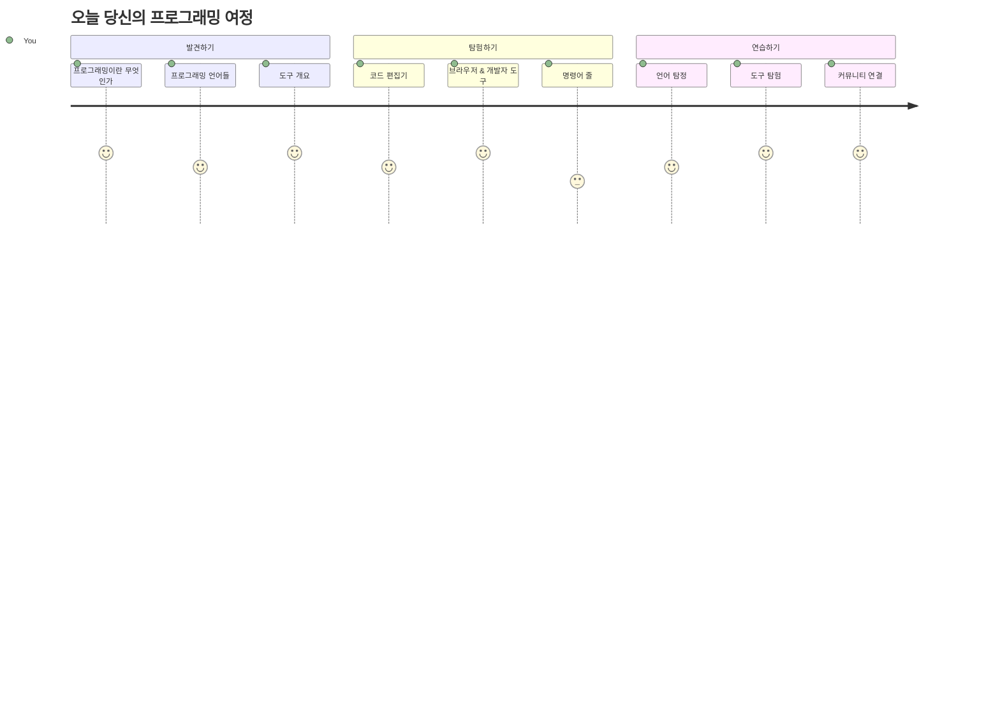
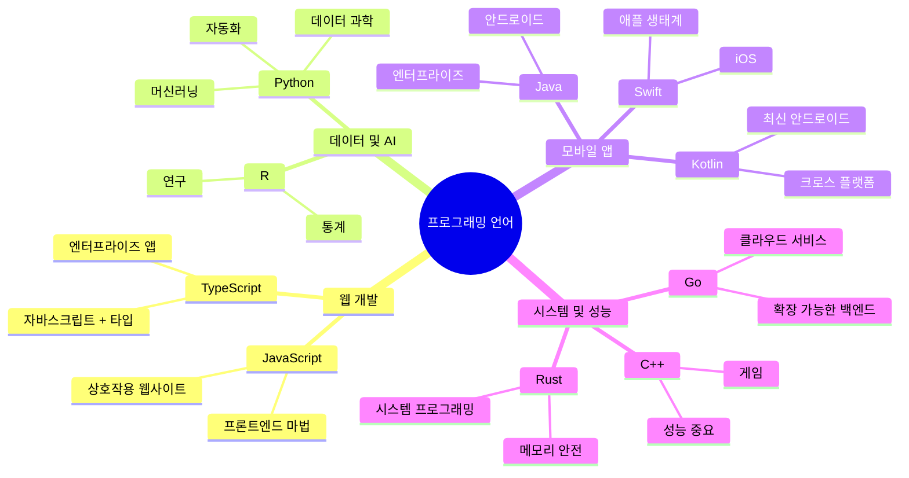
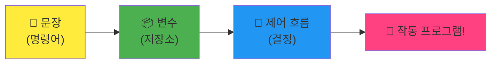
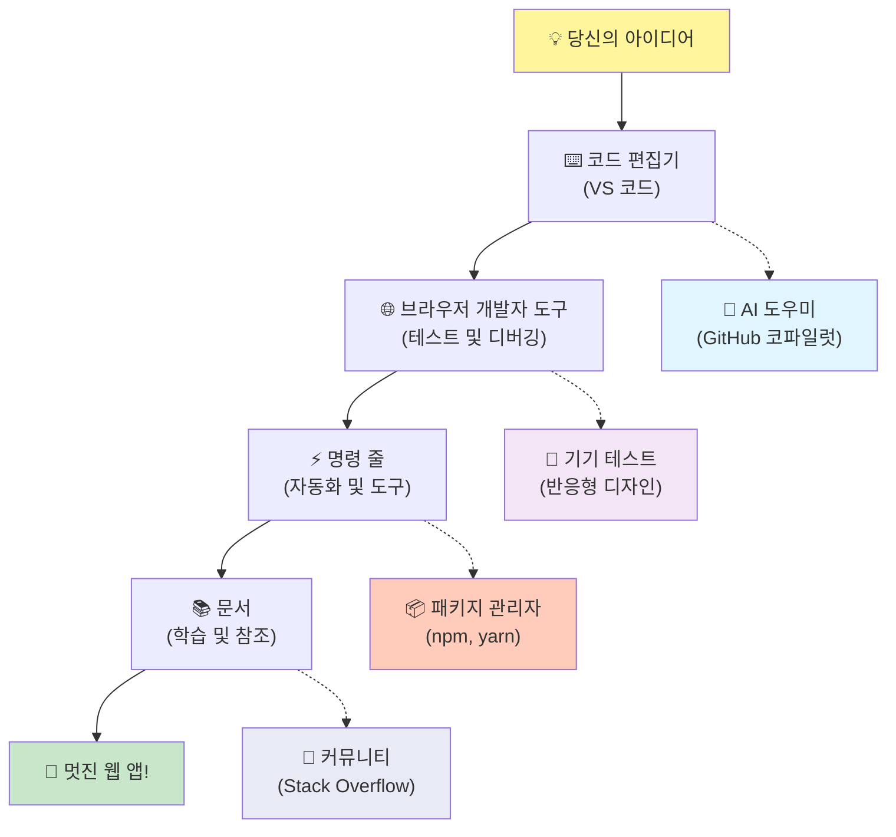
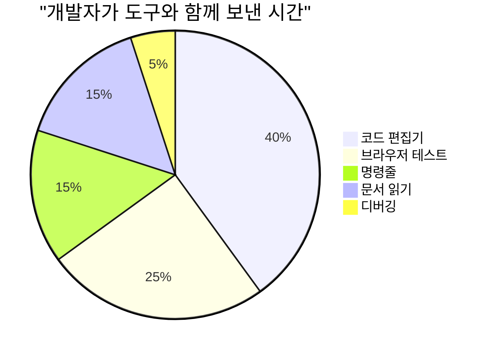
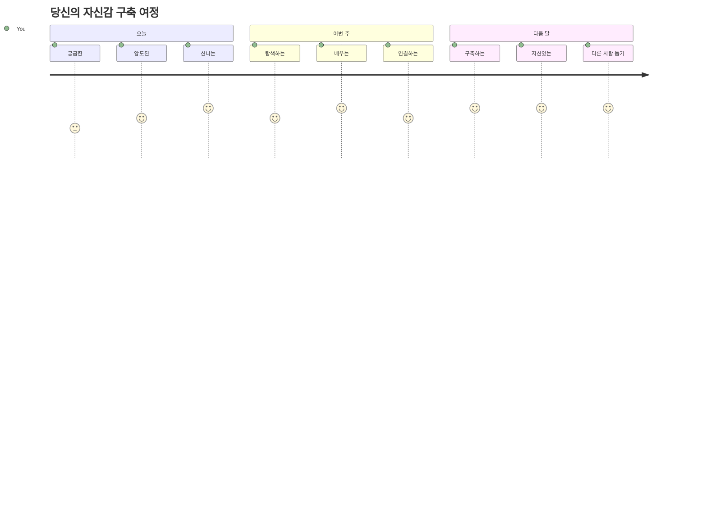

# 프로그래밍 언어 및 최신 개발자 도구 소개
 
안녕, 미래의 개발자! 👋 매일매일 지금도 소름이 돋는 이야기를 하나 해줘도 될까? 프로그래밍은 단순히 컴퓨터에 관한 게 아니야 – 네가 가장 대담한 아이디어를 현실로 만드는 진짜 슈퍼파워를 가지게 되는 거란다!

네가 좋아하는 앱을 사용하다가 모든 게 완벽하게 착착 맞아떨어지는 순간을 알지? 버튼을 누르자마자 완전 마법 같은 일이 일어나면서 “와, 그걸 어떻게 한 거야?” 싶은 순간 말이야. 그 마법을 만든 코드를 쓴 사람은 다름 아닌 너와 똑같은 사람일 거야 – 아마도 좋아하는 카페에서 새벽 2시에 세 번째 에스프레소와 함께 앉아 있었겠지. 그리고 이게 네 마음을 완전히 뒤흔들 거야: 이 수업이 끝날 때쯤이면 그들이 어떻게 했는지 이해할 뿐만 아니라, 직접 꼭 해보고 싶어질 거야!

솔직히 말할게, 프로그래밍이 지금은 어렵게 느껴질 수 있다는 거 잘 알아. 내가 처음 시작할 때는 누군가는 수학 천재여야 하거나 다섯 살 때부터 코딩을 해왔어야 한다고 생각했거든. 하지만 내 관점을 완전히 바꿔준 건 이거야: 프로그래밍은 새로운 언어로 대화하는 걸 배우는 것과 똑같아. “안녕” “고마워”부터 시작해서 커피 주문하는 단계까지 가고, 어느새 깊은 철학적 토론까지 하게 되는 거야! 물론 여기서는 컴퓨터와 대화하는 셈인데, 솔직히 말해서 컴퓨터는 네가 만난 대화 상대 중 가장 인내심 많은 친구야 – 절대 실수를 비난하지 않고 언제나 다시 시도할 준비가 되어 있거든!

오늘은 현대 웹 개발을 가능하게 하면서도 진짜 중독성 있는 도구들을 탐험할 거야. 내가 말하는 건 Netflix, Spotify, 그리고 네가 좋아하는 인디 앱 스튜디오의 개발자들이 매일매일 사용하는 바로 그 편집기, 브라우저, 작업 흐름들이야. 그리고 네가 신나서 춤추게 할 부분은: 이 전문가용, 업계 표준 도구 대부분이 완전히 무료라는 거야!


> 스케치노트 작성자: [Tomomi Imura](https://twitter.com/girlie_mac)


```mermaid
journey
    title 오늘 당신의 프로그래밍 여정
    section 발견하기
      프로그래밍이란 무엇인가: 5: You
      프로그래밍 언어들: 4: You
      도구 개요: 5: You
    section 탐험하기
      코드 편집기: 4: You
      브라우저 & 개발자 도구: 5: You
      명령어 줄: 3: You
    section 연습하기
      언어 탐정: 4: You
      도구 탐험: 5: You
      커뮤니티 연결: 5: You
```
## 이미 알고 있는 것을 살펴볼게요!

재미있는 부분으로 뛰어들기 전에, 궁금해요 – 프로그래밍 세계에 대해 이미 무엇을 알고 있나요? 그리고 만약 이 질문들을 보고 “사실 하나도 모르겠어”라고 생각한다면, 그건 완전 괜찮고 오히려 완벽한 상태예요! 그 말은 당신이 바로 적합한 자리에 있다는 뜻이에요. 이 퀴즈는 운동 전에 스트레칭하는 것과 같아요 – 그냥 뇌 근육을 풀어주고 있는 거랍니다!

[사전 퀴즈 풀기](https://ff-quizzes.netlify.app/web/)


## 우리가 함께 떠날 모험

자, 지금부터 우리가 탐험할 내용을 정말로 기대하고 있어요! 솔직히 말해서, 어떤 개념이 딱 이해되는 순간 당신 얼굴을 볼 수 있으면 좋겠어요. 우리가 함께할 멋진 여정을 소개할게요:

- **프로그래밍이 실제로 뭔지(그리고 왜 가장 멋진 건지!)** – 왜 코드는 당신 주위 모든 것들을 움직이는 보이지 않는 마법인지를 알아볼 거예요. 그 월요일 아침임을 어떻게 아는지 모를 알람부터 넷플릭스 추천을 완벽하게 맞추는 알고리즘까지 말이에요
- **프로그래밍 언어와 그 놀라운 개성들** – 각 사람마다 완전히 다른 슈퍼파워와 문제 해결 방식이 있는 파티에 가는 걸 상상해 보세요. 프로그래밍 언어 세계가 바로 그렇고, 당신도 그 친구들을 만나게 될 거예요!
- **디지털 마법을 만드는 기본 빌딩 블록** – 이걸 최고의 창의적인 LEGO 세트라고 생각해 보세요. 이 조각들이 어떻게 맞춰지는지 이해하니 상상하는 거의 모든 것을 만들 수 있다는 걸 알게 될 거예요
- **마법사의 지팡이를 받은 기분이 들게 할 전문가용 도구** – 과장하는 게 아니라, 이 도구들은 진심으로 슈퍼파워를 얻은 기분이 들게 할 거예요. 그리고 가장 좋은 점? 프로들이 실제로 쓰는 똑같은 도구들이랍니다!

> 💡 **한 가지 알려줄게요**: 오늘 모든 걸 외우려고 하지 마세요! 지금은 가능성에 대한 흥분과 기대감을 느끼면 충분해요. 세부 사항은 함께 연습하면서 자연스럽게 익혀질 거예요 – 이게 진짜 학습 방법이니까요!

> 이 수업은 [Microsoft Learn](https://learn.microsoft.com/en-us/learn/modules/web-development-101/introduction-programming/?WT.mc_id=academic-77807-sagibbon)에서도 수강할 수 있어요!

## 그럼 프로그래밍이란 *정확히* 무엇일까요?

좋아요, 이제 백만 달러짜리 질문에 대해 이야기해 볼게요: 프로그래밍이란 진짜 뭘까요?

내 생각을 완전히 바꿔준 이야기를 들려줄게요. 지난주에 엄마에게 새로 산 스마트 TV 리모컨 사용법을 설명하려 했어요. “빨간 버튼 눌러, 그런데 큰 빨간 버튼 말고 왼쪽에 작은 빨간 버튼... 아니야, 그 다른 왼쪽... 알았어, 이제 2초간 누르고 있어, 1초도 아니고 3초도 아니고...” 이런 말을 계속 하게 되더라고요. 익숙한가요? 😅

바로 그게 프로그래밍이에요! 이것은 엄청나게 상세하고 단계적인 지시를 강력한 무언가에게 주는 기술입니다. 그런데 대신 엄마가 물어볼 수 있는 “어느 빨간 버튼?” 같은 질문이 아니라, 컴퓨터에게 설명하는 거예요. 컴퓨터는 말 그대로 당신이 말한 대로 정확히 실행하는데, 심지어 당신이 의도한 것과 조금 달라도 말이죠.

처음 배울 때 내 마음을 완전히 뒤흔든 게 있었어요: 컴퓨터는 본질적으로 꽤 단순하다는 거예요. 단지 두 가지, 1과 0만 이해해요 – 기본적으로 “예”와 “아니오” 또는 “켜짐”과 “꺼짐” 의미죠. 그게 전부예요! 하지만 여기서 마법 같은 점이 있는데 – 우리가 매트릭스처럼 1과 0만으로 말할 필요가 없다는 거예요. 바로 거기서 **프로그래밍 언어**가 역할을 해 줍니다. 프로그래밍 언어는 당신의 정상적인 인간적 사고를 컴퓨터 언어로 변환해 주는 세계 최고의 통역사와 같아요.

그리고 매일 아침 내가 실제로 소름 돋는 것은 이거예요: 당신 생활 속의 모든 디지털은 누군가처럼, 아마 잠옷 차림에 커피 한 잔 들고 노트북 자판을 두드리던 사람이 시작했어요. 당신을 완벽하게 만들어 주는 인스타그램 필터? 누군가 만든 거예요. 당신이 좋아하는 새 노래를 추천한 알고리즘? 개발자가 만든 거죠. 친구들과 식사 비용을 나누는 앱? 네, 누군가 “이거 불편하네, 고칠 수 있겠다”고 생각하고 실제로 만들었답니다!

프로그래밍을 배울 때, 단순히 새로운 기술을 얻는 게 아니라, 매일 “누군가의 하루를 조금이라도 더 좋게 바꿀 무언가를 만들 수 있을까?”를 고민하는 멋진 문제 해결자 공동체의 일원이 되는 거예요. 솔직히, 그보다 멋진 게 있을까요?

✅ **흥미로운 사실 찾기**: 여유가 있을 때 꼭 찾아보세요 – 세계 최초의 컴퓨터 프로그래머가 누군지 아나요? 힌트를 드리자면, 당신이 기대하는 사람이 아닐 수도 있어요! 이분의 이야기는 정말 흥미진진하고 프로그래밍이 언제나 창의적 문제 해결과 발상의 전환에 관한 것임을 보여줘요.

### 🧠 **상태 점검: 기분이 어떤가요?**

**잠깐만 생각해 봐요:**
- “컴퓨터에게 지시를 주는 것”이라는 개념이 이제 이해가 되나요?
- 일상적인 작업 중 프로그래밍으로 자동화하고 싶은 게 있나요?
- 프로그래밍 전체에 대해 궁금한 점이 떠오르나요?

> **기억하세요**: 지금 어떤 개념이 헷갈려도 당연해요. 프로그래밍은 새로운 언어를 배우는 것과 같아서 뇌가 그 신경경로를 만들려면 시간이 걸리니까요. 당신은 잘하고 있어요!

## 프로그래밍 언어는 마치 다양한 마법의 맛과 같아요

이거 이상하게 들릴 수 있지만, 끝까지 들어 봐요 – 프로그래밍 언어는 다양한 음악 장르와 비슷해요. 재즈는 부드럽고 즉흥적이고, 록은 강력하고 직설적이며, 클래식은 우아하고 구조적이고, 힙합은 창의적이고 표현력이 넘치죠. 각 스타일은 고유한 분위기와 열정적인 팬층이 있으며, 다른 기분과 상황에 딱 맞는 장르겠죠.

프로그래밍 언어도 똑같아요! 엄청난 양의 기후 데이터를 분석하는 데 쓸 언어와 재미있는 모바일 게임을 만드는 데 쓸 언어가 다르듯, 요가 수업에 데스 메탈 음악을 틀지 않는 것과 같답니다(대부분의 요가 수업 말이에요! 😄).

하지만 내가 매번 생각할 때마다 진짜 소름 끼치는 점은 이거예요: 이 언어들은 세상에서 가장 인내심 많고 똑똑한 통역사가 바로 옆에 있는 것과 같아요. 사람 뇌에 자연스러운 방식으로 아이디어를 표현하면, 그들이 컴퓨터가 이해하는 1과 0으로 엄청 복잡하게 번역해 줍니다. 마치 “인간의 창의성”과 “컴퓨터 논리” 둘 다 완벽하게 구사하는 친구가 있어서 지치지도 않고, 커피도 안 마시고, 똑같은 질문을 두 번 해도 절대 평가하지 않는 거예요!

### 인기 프로그래밍 언어와 용도


```mermaid
mindmap
  root((프로그래밍 언어))
    웹 개발
      JavaScript
        프론트엔드 마법
        상호작용 웹사이트
      TypeScript
        자바스크립트 + 타입
        엔터프라이즈 앱
    데이터 및 AI
      Python
        데이터 과학
        머신러닝
        자동화
      R
        통계
        연구
    모바일 앱
      Java
        안드로이드
        엔터프라이즈
      Swift
        iOS
        애플 생태계
      Kotlin
        최신 안드로이드
        크로스 플랫폼
    시스템 및 성능
      C++
        게임
        성능 중요
      Rust
        메모리 안전
        시스템 프로그래밍
      Go
        클라우드 서비스
        확장 가능한 백엔드
```
| 언어 | 최적 용도 | 인기 있는 이유 |
|----------|----------|------------------|
| **JavaScript** | 웹 개발, 사용자 인터페이스 | 브라우저에서 실행되고 인터랙티브 웹사이트 구동 |
| **Python** | 데이터 과학, 자동화, AI | 배우기 쉽고 읽기 쉬우며 강력한 라이브러리 보유 |
| **Java** | 엔터프라이즈 애플리케이션, 안드로이드 앱 | 플랫폼 독립적, 대규모 시스템에 강력함 |
| **C#** | 윈도우 애플리케이션, 게임 개발 | 마이크로소프트 생태계 강력 지원 |
| **Go** | 클라우드 서비스, 백엔드 시스템 | 빠르고 단순하며 현대 컴퓨팅에 최적화 |

### 고급 언어 vs 저급 언어

솔직히 처음 배울 때 이 개념이 내 뇌를 폭발시켰기 때문에, 이걸 나중에야 이해하게 해준 비유를 공유할게요 – 그리고 이게 여러분에게도 도움이 되길 진심으로 바랍니다!

당신이 말을 전혀 못하는 나라에 여행 갔다고 상상해 보세요. 화장실 찾는 게 급한 상황입니다 (우리 모두 겪었죠? 😅):

- **저급 프로그래밍**은 언어를 완벽히 배우고 그 지역 할머니와 문화적 참조, 현지 속어, 지역 농담까지 주고받으며 대화하는 것과 같아요. 엄청 인상적이고 효율적이지만… 화장실 찾는 데는 좀 과한 수준이죠.

- **고급 프로그래밍**은 마치 그 지역의 멋진 친구가 대신 이해해 주는 것과 같아요. “화장실 어디야?”라고 영어로 말해도, 그 친구가 문화적 차이를 풀어주고 비현지인인 당신에게 딱 맞는 길을 알려줍니다.

프로그래밍 용어로 보자면:
- **저급 언어**(예: 어셈블리, C)는 컴퓨터 하드웨어와 매우 상세하게 대화하지만, 기계처럼 생각해야 하는… 엄청 큰 사고 전환이 필요해요!
- **고급 언어**(예: 자바스크립트, 파이썬, C#)는 당신이 인간답게 생각하면서, 그 뒤에서 기계어로 바꾸는 작업을 처리해 줍니다. 뿐만 아니라 새내기 시절을 기억하는 친절한 커뮤니티도 가득해요!

어느 쪽부터 시작하라고 할지 알겠죠? 😉 고급 언어는 트레이닝 휠(보조 바퀴) 같은 거예요. 빼고 싶지도 않을 만큼 훨씬 즐거운 경험을 만듭니다!


```mermaid
flowchart TB
    A["👤 인간의 생각:<br/>'피보나치 수를 계산하고 싶다'"] --> B{언어 수준 선택}
    
    B -->|고급 언어| C["🌟 자바스크립트/파이썬<br/>읽고 쓰기 쉬움"]
    B -->|저급 언어| D["⚙️ 어셈블리/C<br/>직접 하드웨어 제어"]
    
    C --> E["📝 작성: fibonacci(10)"]
    D --> F["📝 작성: mov r0,#00<br/>sub r0,r0,#01"]
    
    E --> G["🤖 컴퓨터 이해:<br/>번역기가 복잡성을 처리함"]
    F --> G
    
    G --> H["💻 동일한 결과:<br/>0, 1, 1, 2, 3, 5, 8, 13..."]
    
    style C fill:#e1f5fe
    style D fill:#fff3e0
    style H fill:#e8f5e8
```
### 왜 고급 언어가 훨씬 친근한지 보여 줄게요

좋아요, 내가 고급 언어에 반하게 된 이유를 완벽하게 시연하는 걸 보여줄 거예요. 근데 먼저, 약속해 줘요. 첫 번째 코드 예제를 볼 때 당황하거나 겁먹지 마세요! 처음 보면 무서울 수 있다는 게 정확히 내가 하려는 말이니까요!

우리는 아주 다른 스타일 두 개의 코드로 같은 작업을 해 볼 거예요. 둘 다 피보나치 수열이라는 걸 만들어요 – 이건 각 숫자가 바로 앞 두 숫자의 합으로 이뤄진 아름다운 수학 패턴입니다: 0, 1, 1, 2, 3, 5, 8, 13... (재미있는 사실: 이 패턴은 해바라기 씨앗과 솔방울, 심지어 은하계 형성 등 자연 곳곳에서 볼 수 있어요!)

둘의 차이 볼 준비 됐나요? 시작해 봐요!

**고급 언어 (JavaScript) – 인간 친화적:**

```javascript
// 1단계: 기본 피보나치 설정
const fibonacciCount = 10;
let current = 0;
let next = 1;

console.log('Fibonacci sequence:');
```

**이 코드가 하는 일:**
- 피보나치 수 개수를 지정하는 상수를 **선언**함
- 수열에서 현재 값과 다음 값을 추적할 두 변수를 **초기화**함
- 피보나치 패턴을 정의하는 시작 값(0과 1)을 **설정**함
- 출력 내용을 식별하는 헤더 메시지를 **표시**함

```javascript
// 2단계: 루프로 시퀀스 생성
for (let i = 0; i < fibonacciCount; i++) {
  console.log(`Position ${i + 1}: ${current}`);
  
  // 시퀀스의 다음 숫자 계산
  const sum = current + next;
  current = next;
  next = sum;
}
```

**여기서 무슨 일이 일어나는지 분해해 볼게요:**
- `for` 루프를 사용해 수열의 각 위치를 **반복**
- 템플릿 리터럴 형식으로 각 숫자와 위치를 **출력**
- 현재 값과 다음 값을 더해 새로운 피보나치 수를 **계산**
- 다음 반복을 위해 추적 변수를 **업데이트**

```javascript
// 3단계: 현대적인 함수형 접근법
const generateFibonacci = (count) => {
  const sequence = [0, 1];
  
  for (let i = 2; i < count; i++) {
    sequence[i] = sequence[i - 1] + sequence[i - 2];
  }
  
  return sequence;
};

// 사용 예제
const fibSequence = generateFibonacci(10);
console.log(fibSequence);
```

**위 코드에는 다음이 포함돼요:**
- 최신 화살표 함수 문법으로 재사용 가능한 함수 **생성**
- 하나하나 출력하는 대신 전체 수열을 저장하는 배열 **구축**
- 이전 값을 기준으로 새 숫자를 계산하는 배열 인덱싱 **사용**
- 프로그램 다른 부분에서 유연하게 사용하도록 전체 수열 **반환**

**저급 언어 (ARM 어셈블리) – 컴퓨터 친화적:**

```assembly
 area ascen,code,readonly
 entry
 code32
 adr r0,thumb+1
 bx r0
 code16
thumb
 mov r0,#00
 sub r0,r0,#01
 mov r1,#01
 mov r4,#10
 ldr r2,=0x40000000
back add r0,r1
 str r0,[r2]
 add r2,#04
 mov r3,r0
 mov r0,r1
 mov r1,r3
 sub r4,#01
 cmp r4,#00
 bne back
 end
```

자바스크립트 버전이 거의 영어 지침처럼 읽히는 반면, 어셈블리 버전은 컴퓨터 프로세서를 직접 제어하는 암호 같은 명령을 사용하는 것을 눈치챘나요? 둘 다 같은 작업을 수행하지만, 고급 언어가 인간이 이해하고 쓰고 유지하기 훨씬 쉽답니다.

**눈에 띄는 주요 차이점:**
- **가독성**: 자바스크립트는 `fibonacciCount`와 같은 설명적인 이름을 사용하는 반면 어셈블리는 `r0`, `r1`과 같은 암호 같은 레이블을 사용합니다.  
- **댓글**: 고급 언어는 코드를 자체 문서화할 수 있도록 설명적인 주석 작성을 장려합니다.  
- **구조**: 자바스크립트의 논리적 흐름은 문제를 단계별로 생각하는 인간의 사고 방식과 일치합니다.  
- **유지보수**: 다양한 요구사항에 맞게 자바스크립트 버전을 업데이트하는 것은 쉽고 명확합니다.  

✅ **피보나치 수열에 대하여**: 이 절대적으로 아름다운 숫자 패턴(각 숫자가 앞의 두 숫자의 합과 같은: 0, 1, 1, 2, 3, 5, 8...)은 자연계에서 문자 그대로 *어디에나* 나타납니다! 해바라기 나선, 솔방울 패턴, 노틸러스 조개의 곡선, 심지어 나뭇가지가 자라는 방식에서도 찾을 수 있습니다. 수학과 코드를 통해 자연이 아름다움을 창조하는 패턴을 이해하고 재현할 수 있다는 사실은 정말 놀랍습니다!  

## 마법을 만들어내는 기본 구성 요소  

자, 이제 프로그래밍 언어가 실제로 어떻게 작동하는지 확인했으니, 지금까지 작성된 모든 프로그램을 구성하는 기본 조각들을 분해해 봅시다. 이것들을 여러분이 좋아하는 요리법의 필수 재료라고 생각하세요 – 각각이 무슨 역할을 하는지 이해하면 거의 모든 언어로 코드를 읽고 쓸 수 있게 될 것입니다!  

이것은 일종의 프로그래밍 문법을 배우는 것과 같습니다. 학교에서 명사, 동사, 문장 구성 방법을 배웠던 기억이 나나요? 프로그래밍도 나름의 문법이 있는데 솔직히 영어 문법보다 훨씬 논리적이고 관용적입니다! 😄  

### 문장(Statements): 단계별 명령어  

먼저 **문장**부터 시작해 봅시다 – 이들은 컴퓨터와 대화할 때의 개별 문장과 같습니다. 각 문장은 컴퓨터에게 특정 작업 하나를 하도록 지시하는 것이며, "여기서 왼쪽으로 돌기", "빨간불에서 멈추기", "저 공간에 주차하기"와 같은 지시를 주는 것과 비슷합니다.  

제가 문장에 대해 사랑하는 점은 일반적으로 읽기 쉽다는 것입니다. 한번 보세요:  

```javascript
// 단일 작업을 수행하는 기본 문장들
const userName = "Alex";                    
console.log("Hello, world!");              
const sum = 5 + 3;                         
```
  
**이 코드는 다음을 수행합니다:**  
- 사용자 이름을 저장할 상수 변수 선언  
- 콘솔 출력에 인사 메시지 표시  
- 수학적 연산 결과 계산 및 저장  

```javascript
// 웹 페이지와 상호작용하는 구문
document.title = "My Awesome Website";      
document.body.style.backgroundColor = "lightblue";
```
  
**단계별로 무슨 일이 일어나는지:**  
- 브라우저 탭에 표시되는 웹페이지 제목 수정  
- 페이지 전체 바디의 배경색 변경  

### 변수(Variables): 프로그램의 기억 장치  

자, **변수**는 정말 제가 가장 좋아하는 개념 중 하나입니다. 왜냐하면 일상에서 여러분이 이미 매일 사용하는 것과 너무 비슷하기 때문입니다!  

휴대폰 연락처 목록을 잠시 생각해 보세요. 여러분은 모두 전화번호를 외우지 않죠 – 대신에 “엄마”, “친한 친구”, “새벽 2시까지 배달하는 피자집” 같은 이름을 저장하고 휴대폰이 실제 번호를 기억합니다. 변수도 마찬가지입니다! 변수는 프로그램이 정보를 저장하고 의미 있는 이름으로 나중에 다시 불러올 수 있는 라벨이 붙은 컨테이너와 같습니다.  

정말 멋진 점은 변수는 프로그램이 실행되는 동안 변할 수 있다는 것입니다(그래서 'variable'이라는 이름이 붙었죠). 더 나은 피자집을 발견하면 연락처를 업데이트하는 것처럼, 프로그램이 새로운 정보를 배우거나 상황이 바뀌면 변수도 업데이트할 수 있습니다!  

이것이 얼마나 간단할 수 있는지 보여 드릴게요:  

```javascript
// 1단계: 기본 변수 생성하기
const siteName = "Weather Dashboard";        
let currentWeather = "sunny";               
let temperature = 75;                       
let isRaining = false;                      
```
  
**이 개념들을 이해하기:**  
- 변하지 않는 값은 `const` 변수에 저장 (예: 사이트 이름)  
- 변할 수 있는 값은 `let` 사용  
- 문자열(텍스트), 숫자, 불리언(true/false) 같은 다양한 데이터 유형 할당  
- 각 변수가 포함하는 내용을 설명하는 이름 선택  

```javascript
// 2단계: 관련 데이터를 그룹화하기 위해 객체 작업하기
const weatherData = {                       
  location: "San Francisco",
  humidity: 65,
  windSpeed: 12
};
```
  
**위에선:**  
- 관련 있는 날씨 정보를 한 곳에 묶기 위해 객체 생성  
- 여러 데이터를 하나의 변수 이름 아래 정리  
- 각 정보 조각을 명확히 라벨링하는 키-값 쌍 사용  

```javascript
// 3단계: 변수 사용 및 업데이트
console.log(`${siteName}: Today is ${currentWeather} and ${temperature}°F`);
console.log(`Wind speed: ${weatherData.windSpeed} mph`);

// 변경 가능한 변수 업데이트
currentWeather = "cloudy";                  
temperature = 68;                          
```
  
**각 부분 이해하기:**  
- `${}` 문법을 사용하는 템플릿 리터럴로 정보 표시  
- 점(.) 표기법으로 객체 프로퍼티 접근 (`weatherData.windSpeed`)  
- 변경 가능한 `let` 변수 업데이트로 상황 반영  
- 여러 변수를 결합해 의미 있는 메시지 생성  

```javascript
// 4단계: 더 깔끔한 코드를 위한 최신 구조 분해
const { location, humidity } = weatherData; 
console.log(`${location} humidity: ${humidity}%`);
```
  
**알아두어야 할 점:**  
- 구조 분해 할당으로 객체에서 특정 프로퍼티 추출  
- 객체 키와 동일한 이름으로 새 변수 자동 생성  
- 반복적인 점 표기법을 피해 코드 간소화  

### 제어 흐름(Control Flow): 프로그램에게 사고하는 법 가르치기  

여기서 프로그래밍이 진짜 놀라워집니다! **제어 흐름**이란 프로그램에게 똑똑한 판단을 내리도록 가르치는 것으로, 여러분이 매일 생각 없이 하는 바로 그 방식과 같습니다.  

아침에 "비가 오면 우산을 챙기고, 춥다면 재킷을 입고, 늦으면 아침을 거르고 길에서 커피를 산다" 같은 판단을 했을 거예요. 여러분의 두뇌는 매일 이런 if-then 논리를 수십 번 자연스럽게 따릅니다!  

이런 덕분에 프로그램은 단순히 지루하고 예측 가능한 명령만 수행하는 대신 상황을 보고 무슨 일이 일어나는지 평가하고 적절하게 반응할 수 있어 ‘지능적이고 살아있는’ 것처럼 느껴집니다. 프로그램에게 적응하고 선택할 수 있는 두뇌를 준 셈이죠!  

이게 어떻게 정말 멋지게 작동하는지 보여 드릴게요:  

```javascript
// 1단계: 기본 조건 논리
const userAge = 17;

if (userAge >= 18) {
  console.log("You can vote!");
} else {
  const yearsToWait = 18 - userAge;
  console.log(`You'll be able to vote in ${yearsToWait} year(s).`);
}
```
  
**이 코드는 다음을 수행합니다:**  
- 사용자 나이가 투표 요건을 충족하는지 확인  
- 조건 결과에 따라 다른 코드 블록 실행  
- 만 18세 미만일 경우 투표 가능할 때까지 남은 기간 계산 및 표시  
- 각 시나리오에 대해 구체적이고 유용한 피드백 제공  

```javascript
// 2단계: 논리 연산자를 사용한 여러 조건
const userAge = 17;
const hasPermission = true;

if (userAge >= 18 && hasPermission) {
  console.log("Access granted: You can enter the venue.");
} else if (userAge >= 16) {
  console.log("You need parent permission to enter.");
} else {
  console.log("Sorry, you must be at least 16 years old.");
}
```
  
**여기서 일어나는 일 분해:**  
- `&&` (그리고) 연산자를 사용해 여러 조건 결합  
- 여러 시나리오를 다루기 위해 `else if`로 조건 계층 구성  
- 마지막 `else` 문으로 모든 경우 처리  
- 각각의 다른 상황에 대해 명확하고 실용적인 피드백 제공  

```javascript
// 3단계: 삼항 연산자를 사용한 간결한 조건문
const votingStatus = userAge >= 18 ? "Can vote" : "Cannot vote yet";
console.log(`Status: ${votingStatus}`);
```
  
**기억해야 할 점:**  
- 간단한 두 가지 선택 조건에 삼항 연산자(`? :`) 사용  
- 먼저 조건 작성, 다음에 `?`, 참 결과, `:`, 거짓 결과 순서  
- 조건에 따라 값을 할당할 때 이 패턴 적용  

```javascript
// 4단계: 여러 특정 사례 처리
const dayOfWeek = "Tuesday";

switch (dayOfWeek) {
  case "Monday":
  case "Tuesday":
  case "Wednesday":
  case "Thursday":
  case "Friday":
    console.log("It's a weekday - time to work!");
    break;
  case "Saturday":
  case "Sunday":
    console.log("It's the weekend - time to relax!");
    break;
  default:
    console.log("Invalid day of the week");
}
```
  
**이 코드는 다음을 수행합니다:**  
- 변수 값을 여러 특정 경우와 비교  
- 유사한 경우를 그룹화(평일 대 주말)  
- 일치하는 경우에 적절한 코드 블록 실행  
- 예기치 않은 값을 처리하는 `default` 케이스 포함  
- 다음 경우로 넘어가는 것을 방지하는 `break` 문 사용  

> 💡 **현실 세계 비유**: 제어 흐름은 가장 인내심 많은 GPS가 길 안내를 하는 것과 같아요. “Main Street에 교통 체증이 있으면 고속도로로 가세요. 고속도로에 공사가 있으면 경치 좋은 길을 시도해 보세요.” 프로그램도 똑같은 조건부 논리를 사용해 상황에 지능적으로 대응하며 항상 사용자에게 최적의 경험을 제공합니다.  

### 🎯 **개념 확인: 기본 구성 요소 숙달하기**  

**기본 개념들을 얼마나 이해했는지 보자:**  
- 변수와 문장의 차이를 자신만의 말로 설명할 수 있나요?  
- if-then 결정을 사용할 수 있는 현실 상황을 생각해 봅시다(예: 투표 예시)  
- 프로그래밍 논리에서 놀랐던 한 가지는 무엇인가요?  

**빠른 자신감 부스터:**  

```mermaid
flowchart LR
    A["📝 문장<br/>(명령어)"] --> B["📦 변수<br/>(저장소)"] --> C["🔀 제어 흐름<br/>(결정)"] --> D["🎉 작동 프로그램!"]
    
    style A fill:#ffeb3b
    style B fill:#4caf50
    style C fill:#2196f3
    style D fill:#ff4081
```  
✅ **다음에 다룰 내용**: 이 엄청난 여정을 함께 계속하면서 이 개념들을 더 깊이 파고들며 정말 즐거운 시간을 보낼 거예요! 지금은 앞에 펼쳐질 놀라운 가능성들에 대한 흥분을 느끼는 데 집중하세요. 구체적인 기술과 기법들은 함께 연습하면서 자연스럽게 익힐 수 있을 거예요 – 이건 분명 기대 이상으로 재미있을 겁니다!  

## 도구들  

자, 이제 제가 감정을 주체할 수 없을 정도로 흥분하는 순간입니다! 🚀 이제 여러분에게 마치 디지털 우주선 열쇠를 막 받은 것처럼 느끼게 해줄 믿을 수 없이 멋진 도구들에 대해 이야기할 거예요.  

요리사가 손의 연장처럼 느껴지는 완벽하게 균형 잡힌 칼을 가지고 있거나 음악가가 한 번 만지면 노래하는 기타를 가진 것처럼, 개발자도 이런 마법 같은 도구들을 가지고 있습니다. 그리고 이 도구들의 대부분이 완전히 무료라는 사실이 여러분의 마음을 완전히 뒤흔들 거예요!  

이 도구들을 여러분과 공유하는 생각에 저는 실제로 의자에서 들썩이고 있습니다. 왜냐하면 이 도구들이 우리가 소프트웨어를 만드는 방식을 완전히 혁신했기 때문입니다. AI 기반 코딩 어시스턴트가 코드를 직접 작성해 주고(진심입니다!), 어디서든 Wi-Fi만 있으면 앱을 개발할 수 있는 클라우드 환경, 그리고 프로그램의 X-레이 비전을 제공하는 것처럼 정교한 디버깅 도구들에 대해서 이야기하고 있습니다.  

그리고 아직도 소름이 돋는 부분은 이것들이 여러분이 곧 써볼 “초급 도구”가 아니라는 점입니다. 구글, 넷플릭스, 여러분이 좋아하는 인디 앱 스튜디오 같은 곳의 개발자들이 바로 지금 이 순간에도 사용하는 그 전문급 도구들이란 점입니다. 여러분도 사용하면 엄청난 프로가 된 기분을 느낄 거예요!  


```mermaid
graph TD
    A["💡 당신의 아이디어"] --> B["⌨️ 코드 편집기<br/>(VS 코드)"] 
    B --> C["🌐 브라우저 개발자 도구<br/>(테스트 및 디버깅)"]
    C --> D["⚡ 명령 줄<br/>(자동화 및 도구)"]
    D --> E["📚 문서<br/>(학습 및 참조)"]
    E --> F["🚀 멋진 웹 앱!"]
    
    B -.-> G["🤖 AI 도우미<br/>(GitHub 코파일럿)"]
    C -.-> H["📱 기기 테스트<br/>(반응형 디자인)"]
    D -.-> I["📦 패키지 관리자<br/>(npm, yarn)"]
    E -.-> J["👥 커뮤니티<br/>(Stack Overflow)"]
    
    style A fill:#fff59d
    style F fill:#c8e6c9
    style G fill:#e1f5fe
    style H fill:#f3e5f5
    style I fill:#ffccbc
    style J fill:#e8eaf6
```  
### 코드 편집기 및 IDE: 새로운 디지털 베스트 프렌드  

코드 편집기에 대해 이야기해 봅시다 – 여러분의 새로워질 가장 좋아하는 장소가 될 거예요! 여기서 대부분의 시간을 보내며 디지털 창작물을 만들고 완성하니까요.  

하지만 현대 편집기가 가진 마법 같은 점은 이것들이 단순한 텍스트 편집기가 아니라는 것입니다. 언제나 옆에 앉아 있는 가장 똑똑하고 든든한 코딩 멘토가 있는 것 같습니다. 오타가 생기기도 전에 잡아주고, 천재처럼 보이게 해 주는 개선방안을 제안하며, 코드의 각 부분이 무슨 역할을 하는지 이해할 수 있도록 돕고, 어떤 편집기는 여러분이 타자를 치기 전에 무슨 말을 하려는지 예측해 완성해 주기까지 합니다!  

제가 자동 완성 기능을 처음 발견했을 때는 진짜 미래에 살고 있는 것 같았어요. 뭔가 입력하면 편집기가 "이 함수가 필요한 거 아니야?"라고 말하는 것 같은 느낌이었죠. 마치 마음을 읽는 코딩 친구 같아요!  

**이 편집기들이 이렇게 대단한 이유:**  

현대 코드 편집기는 생산성을 높이도록 설계된 다양한 기능을 제공합니다:  

| 기능 | 역할 | 도움 되는 이유 |  
|---------|--------------|--------------|  
| **문법 강조** | 코드의 다른 부분에 색상을 입힙니다 | 코드를 읽기 쉽고 오류를 발견하기 쉽게 함 |  
| **자동 완성** | 입력하는 코드를 제안함 | 코딩 속도를 높이고 오타를 줄임 |  
| **디버깅 도구** | 오류를 찾고 고치는 데 도움 | 문제 해결 시간을 수 시간 단축 |  
| **확장 기능** | 특화된 기능 추가 가능 | 어떤 기술에도 맞게 편집기 사용자화 |  
| **AI 어시스턴트** | 코드 및 설명 제안 | 학습과 생산성 가속화 |  

> 🎥 **비디오 자료**: 이 도구들이 실제로 어떻게 작동하는지 보고 싶다면, [Tools of the Trade 동영상](https://youtube.com/watch?v=69WJeXGBdxg)을 참고하세요.  

#### 웹 개발 추천 편집기  

**[Visual Studio Code](https://code.visualstudio.com/?WT.mc_id=academic-77807-sagibbon)** (무료)  
- 웹 개발자들 사이에서 가장 인기 있음  
- 훌륭한 확장 기능 생태계  
- 내장 터미널 및 Git 통합  
- **꼭 필요한 확장:**  
  - [GitHub Copilot](https://marketplace.visualstudio.com/items?itemName=GitHub.copilot) - AI 기반 코드 제안  
  - [Live Share](https://marketplace.visualstudio.com/items?itemName=MS-vsliveshare.vsliveshare) - 실시간 협업  
  - [Prettier](https://marketplace.visualstudio.com/items?itemName=esbenp.prettier-vscode) - 자동 코드 포맷팅  
  - [Code Spell Checker](https://marketplace.visualstudio.com/items?itemName=streetsidesoftware.code-spell-checker) - 코드 내 오타 잡기  

**[JetBrains WebStorm](https://www.jetbrains.com/webstorm/)** (유료, 학생은 무료)  
- 고급 디버깅 및 테스트 도구  
- 지능형 코드 완성  
- 내장 버전 관리  

**클라우드 기반 IDE** (다양한 가격)  
- [GitHub Codespaces](https://github.com/features/codespaces) - 브라우저 내 완전한 VS Code  
- [Replit](https://replit.com/) - 학습과 코드 공유에 좋음  
- [StackBlitz](https://stackblitz.com/) - 즉시 사용 가능한 풀스택 웹 개발  

> 💡 **시작 팁**: Visual Studio Code부터 시작하세요 – 무료고 업계에서 널리 쓰이며 도움 되는 튜토리얼과 확장이 매우 많습니다.  


### 웹 브라우저: 비밀 개발 실험실  

자, 이제 정말 놀랄 준비하세요! 여러분은 소셜 미디어를 스크롤하고 동영상을 보려고 브라우저를 사용하고 있었지만, 사실은 이 전체 시간 동안 숨겨진 놀라운 개발자 실험실이 숨어 있었다는 걸 아시나요? 그리고 여러분이 발견하기만을 기다렸죠!  

웹페이지에서 오른쪽 클릭 후 “요소 검사”를 선택할 때마다, 사실 저는 수백 달러를 내고 샀던 몇몇 고가 소프트웨어보다 더 강력한 개발자 도구의 숨겨진 세계를 여는 것입니다. 마치 평범한 주방 뒤에 프로 셰프의 실험실이 비밀 패널 뒤에 숨겨져 있었다는 것을 발견한 것과 같습니다!  
누군가 처음으로 브라우저 개발자 도구(DevTools)를 보여줬을 때, 나는 세 시간이나 클릭하며 "잠깐, 이걸도 할 수 있다고?!"라고 놀랐어. 실제로 실시간으로 웹사이트를 편집할 수 있고, 모든 요소가 얼마나 빠르게 로드되는지 정확히 볼 수 있으며, 다양한 장치에서 내 사이트가 어떻게 보이는지 테스트하고, 심지어 자바스크립트를 완전 전문가처럼 디버깅할 수도 있어. 정말 놀라워!

**브라우저가 당신의 비밀 무기인 이유는 다음과 같아:**

웹사이트나 웹 애플리케이션을 만들 때, 실제 환경에서 어떻게 보이고 작동하는지 확인해야 해. 브라우저는 당신의 작업물을 보여주는 것뿐만 아니라 성능, 접근성, 잠재적인 문제에 대해 자세한 피드백도 제공하지.

#### 브라우저 개발자 도구 (DevTools)

현대 브라우저는 포괄적인 개발 도구 세트를 포함하고 있어:

| 도구 카테고리 | 역할 | 사용 사례 예시 |
|---------------|--------|----------------|
| **요소 검사기** | 실시간으로 HTML/CSS를 보고 편집 | 즉각적인 스타일 조정 결과 확인 |
| **콘솔** | 오류 메시지 확인 및 자바스크립트 테스트 | 문제 디버깅과 코드 실험 |
| **네트워크 모니터** | 리소스 로딩 추적 | 성능과 로딩 시간 최적화 |
| **접근성 검사기** | 포괄적 디자인 테스트 | 모든 사용자를 위한 사이트 보장 |
| **장치 시뮬레이터** | 다양한 화면 크기 미리보기 | 여러 장치 없이 반응형 디자인 테스트 |

#### 개발용 추천 브라우저

- **[Chrome](https://developers.google.com/web/tools/chrome-devtools/)** - 업계 표준 DevTools와 방대한 문서
- **[Firefox](https://developer.mozilla.org/docs/Tools)** - 훌륭한 CSS Grid 및 접근성 도구
- **[Edge](https://docs.microsoft.com/microsoft-edge/devtools-guide-chromium/?WT.mc_id=academic-77807-sagibbon)** - 크로미움 기반, 마이크로소프트의 개발자 리소스 제공

> ⚠️ **중요한 테스트 팁**: 항상 여러 브라우저에서 웹사이트를 테스트하세요! Chrome에서 완벽하게 작동해도 Safari나 Firefox에서는 다를 수 있어요. 전문가 개발자들은 모든 주요 브라우저에서 일관된 사용자 경험을 위해 테스트합니다.


### 커맨드 라인 도구: 개발자 슈퍼파워로 가는 관문

자, 커맨드 라인에 대해 솔직한 얘기를 해보자. 내가 진짜로 느낀 걸 말하고 싶어. 처음 봤을 때 — 깜빡이는 텍스트가 있는 무서운 검은 화면 — 나는 사실 이렇게 생각했어, "절대 안 돼! 이건 1980년대 해커 영화에 나오는 거 같고, 나는 절대 이걸 다룰 만큼 똑똑하지 않아!" 😅

하지만 누군가 그때 내게 알려줬으면 좋았을 걸, 그리고 지금 내가 너에게 말하는 건: 커맨드 라인은 무섭지 않아 — 사실은 컴퓨터와 직접 대화하는 것과 같아. 마치 사진과 메뉴가 있는 세련된 앱으로 음식을 주문하는 것과, 당신이 좋아하는 걸 알고 딱 맞는 요리를 직접 만들어 주는 현지 식당에 가서 "놀라운 걸로 부탁해"라고 말하는 것의 차이라고 생각해 봐.

커맨드 라인은 개발자들이 마법사처럼 느끼는 곳이야. 마법 같은 단어 몇 개를 타이핑하고 (사실 명령어지만, 마치 마법처럼 느껴져!), 엔터를 누르면, BOOM — 전체 프로젝트 구조를 만들고, 전 세계에서 강력한 도구들을 설치하며, 수백만 명에게 앱을 배포할 수도 있어. 그 힘을 한 번 맛보면, 솔직히 중독될 거야!

**커맨드 라인이 당신의 가장 좋아하는 도구가 될 이유:**

그래픽 인터페이스도 훌륭하지만, 커맨드 라인은 자동화, 정밀함, 그리고 속도에서 뛰어나. 많은 개발 도구가 주로 커맨드 라인 인터페이스를 통해 작동하며, 이를 능숙하게 다루면 생산성이 크게 향상돼.

```bash
# 1단계: 프로젝트 디렉토리를 생성하고 이동하세요
mkdir my-awesome-website
cd my-awesome-website
```

**이 코드는 다음을 수행해:**
- 프로젝트용으로 "my-awesome-website"라는 새 디렉토리를 생성
- 새로 생성한 디렉토리로 이동하여 작업 시작

```bash
# 2단계: package.json으로 프로젝트 초기화
npm init -y

# 최신 개발 도구 설치
npm install --save-dev vite prettier eslint
npm install --save-dev @eslint/js
```

**순서대로 무슨 일이 일어나는지:**
- `npm init -y`로 기본 설정으로 새로운 Node.js 프로젝트 초기화
- 빠른 개발 및 배포 빌드를 위한 최신 빌드 도구 Vite 설치
- 자동 코드 형식을 위한 Prettier 추가 및 코드 품질 검사를 위한 ESLint 설치
- `--save-dev` 플래그를 사용하여 개발 전용 의존성으로 표시

```bash
# 3단계: 프로젝트 구조와 파일 생성
mkdir src assets
echo '<!DOCTYPE html><html><head><title>My Site</title></head><body><h1>Hello World</h1></body></html>' > index.html

# 개발 서버 시작
npx vite
```

**위에서 한 작업:**
- 소스 코드 및 자산용 별도의 폴더를 만들어 프로젝트를 체계화
- 올바른 문서 구조를 갖춘 기본 HTML 파일 생성
- 실시간 리로드 및 핫 모듈 교체를 위한 Vite 개발 서버 시작

#### 웹 개발 필수 커맨드 라인 도구

| 도구 | 목적 | 필요한 이유 |
|------|---------|-----------------|
| **[Git](https://git-scm.com/)** | 버전 관리 | 변경 사항 추적, 협업, 작업 백업 |
| **[Node.js & npm](https://nodejs.org/)** | 자바스크립트 런타임 및 패키지 관리 | 브라우저 밖에서 자바스크립트 실행, 최신 개발 도구 설치 |
| **[Vite](https://vitejs.dev/)** | 빌드 도구 및 개발 서버 | 빠른 개발과 핫 모듈 교체 제공 |
| **[ESLint](https://eslint.org/)** | 코드 품질 검사 | 자바스크립트 문제 자동 발견 및 수정 |
| **[Prettier](https://prettier.io/)** | 코드 포맷팅 | 코드를 일관성 있고 읽기 쉽게 유지 |

#### 플랫폼별 옵션

**Windows:**
- **[Windows Terminal](https://docs.microsoft.com/windows/terminal/?WT.mc_id=academic-77807-sagibbon)** - 현대적이고 기능이 풍부한 터미널
- **[PowerShell](https://docs.microsoft.com/powershell/?WT.mc_id=academic-77807-sagibbon)** 💻 - 강력한 스크립팅 환경
- **[Command Prompt](https://docs.microsoft.com/windows-server/administration/windows-commands/?WT.mc_id=academic-77807-sagibbon)** 💻 - 전통적인 윈도우 커맨드 라인

**macOS:**
- **[Terminal](https://support.apple.com/guide/terminal/)** 💻 - 내장 터미널 앱
- **[iTerm2](https://iterm2.com/)** - 고급 기능을 갖춘 향상된 터미널

**Linux:**
- **[Bash](https://www.gnu.org/software/bash/)** 💻 - 표준 리눅스 셸
- **[KDE Konsole](https://docs.kde.org/trunk5/en/konsole/konsole/index.html)** - 고급 터미널 에뮬레이터

> 💻 = 운영체제에 기본 탑재됨

> 🎯 **학습 경로**: `cd` (디렉토리 변경), `ls` 또는 `dir` (파일 목록), `mkdir` (폴더 생성) 같은 기본 명령어부터 시작하세요. `npm install`, `git status`, `code .`(현재 디렉토리를 VS Code로 열기)와 같은 현대 워크플로 명령어로 연습하세요. 익숙해지면 자연스럽게 고급 명령어나 자동화 기법도 익히게 될 겁니다.


### 문서: 언제든지 이용 가능한 학습 멘토

자, 초보자라는 사실 때문에 좀 더 마음 편해질 수 있는 비밀을 알려줄게: 가장 경험 많은 개발자들조차도 시간이 나면 문서를 읽는 데 많은 시간을 써. 그들이 모르는 게 있어서가 아니라 사실은 현명하다는 증거야!

문서를 세계에서 가장 인내심 많고 지식이 풍부한 선생님에게 24시간 언제든 접근할 수 있다고 생각해 봐. 새벽 2시에 문제가 생겨도 문서가 따뜻한 가상 포옹과 필요한 정확한 답을 제공해 줘. 모두가 이야기하는 멋진 새 기능을 배우고 싶다면 문서가 단계별 예제와 함께 당신을 도와줘. "왜 이렇게 작동하지?" 궁금할 때도, 문서가 아주 쉽게 이해되도록 설명해 줘.

내 관점을 완전히 바꿔준 한 가지: 웹 개발 세계는 엄청나게 빠르게 변하고, 아무도(정말 아무도) 모든 걸 외우고 있지 않아. 15년 경력의 시니어 개발자도 기본 문법을 찾아보는 걸 봤는데, 그게 부끄러운 게 아니라 똑똑한 거야! 완벽한 기억보다는, 신뢰할 수 있는 답을 빠르게 찾고 응용하는 법을 아는 게 중요하지.

**진짜 마법은 여기서 시작돼:**

전문가 개발자는 자신이 모르는 게 아니라 웹 개발 환경이 너무 빨리 변화하기 때문에 지속적인 학습을 위해 문서를 많이 읽어. 훌륭한 문서는 *어떻게* 사용하는지 뿐만 아니라 *왜* 그리고 *언제* 사용해야 하는지를 이해하도록 도와줘.

#### 필수 문서 리소스

**[Mozilla Developer Network (MDN)](https://developer.mozilla.org/docs/Web)**
- 웹 기술 문서의 황금 표준
- HTML, CSS, 자바스크립트를 위한 종합 가이드
- 브라우저 호환 정보 포함
- 실용적인 예제와 인터랙티브 데모 제공

**[Web.dev](https://web.dev)** (Google 제공)
- 현대 웹 개발 모범 사례
- 성능 최적화 가이드
- 접근성 및 포괄적 디자인 원칙
- 실제 프로젝트 사례 연구

**[Microsoft Developer Documentation](https://docs.microsoft.com/microsoft-edge/#microsoft-edge-for-developers)**
- Edge 브라우저 개발 리소스
- 프로그레시브 웹 앱 안내서
- 크로스 플랫폼 개발 인사이트

**[Frontend Masters Learning Paths](https://frontendmasters.com/learn/)**
- 체계적인 학습 커리큘럼
- 업계 전문가의 영상 강의
- 실습 코딩 연습

> 📚 **학습 전략**: 문서를 외우려 하기보다는 효율적으로 탐색하는 방법을 배우세요. 자주 사용하는 참고 자료는 북마크하고, 검색 기능을 활용해 특정 정보를 빠르게 찾는 연습을 하세요.

### 🔧 **도구 숙련도 점검: 무엇이 당신과 가장 잘 맞나요?**

**잠시 생각해 보세요:**
- 가장 먼저 써보고 싶은 도구는 무엇인가요? (틀린 답은 없어요!)
- 커맨드 라인이 아직도 어렵게 느껴지나요, 아니면 궁금한가요?
- 브라우저 DevTools를 활용해 좋아하는 웹사이트 뒤를 들여다볼 수 있다고 상상해보나요?


```mermaid
pie title "개발자가 도구와 함께 보낸 시간"
    "코드 편집기" : 40
    "브라우저 테스트" : 25
    "명령줄" : 15
    "문서 읽기" : 15
    "디버깅" : 5
```
> **재미있는 통찰**: 대부분 개발자는 코드 편집기에서 약 40%의 시간을 보내지만, 테스트하고 배우고 문제를 해결하는 데 얼마나 많은 시간이 쓰이는지 눈여겨보세요. 프로그래밍은 단순히 코드를 쓰는 게 아니라 경험을 만들어 가는 일이에요!

✅ **생각거리**: 흥미로운 질문입니다 – 웹사이트를 구축하는 도구(개발)와 디자인하는 도구(디자인)는 어떻게 다를까요? 마치 아름다운 집을 설계하는 건축가와 실제 집을 짓는 시공업자의 차이 같아요. 둘 다 중요하지만 도구 상자가 달라야 하죠! 이런 시각은 웹사이트가 어떻게 탄생하는지 더 잘 이해하는 데 큰 도움이 될 거예요.

## GitHub Copilot 에이전트 챌린지 🚀

Agent 모드를 사용해 다음 챌린지를 완료하세요:

**설명:** 현대 코드 편집기나 IDE의 기능을 탐색하고, 그것이 웹 개발자로서의 작업 흐름을 어떻게 개선하는지 시연하세요.

**프롬프트:** Visual Studio Code, WebStorm, 클라우드 기반 IDE 중 하나를 선택하세요. 코드를 더 효율적으로 작성, 디버그 또는 유지할 수 있게 해주는 세 가지 기능 또는 확장 기능을 나열하고, 각 기능이 작업 흐름에 어떤 도움을 주는지 간단히 설명하세요.

---

## 🚀 챌린지

**자, 탐정님, 첫 사건 준비 되셨나요?**

지금 훌륭한 기초를 갖췄으니, 프로그래밍 세계가 얼마나 다양하고 매력적인지를 보여줄 모험에 나설 거예요. 그리고 들어보세요 – 아직 코드를 쓰는 것이 아니라 프로그래밍 언어 탐정으로서 첫 흥미진진한 사건을 맡는 셈이니 부담 갖지 마세요!

**당신의 임무, 받아들일 준비가 되었다면 :**
1. **언어 탐험가가 되기**: 완전히 다른 세계에서 온 세 가지 프로그래밍 언어를 선택하세요 — 웹사이트 구축용, 모바일 앱 생성용, 과학 데이터 처리를 위한 언어 등. 각 언어로 같은 간단한 작업 예제를 찾아보세요. 같은 일을 하면서도 얼마나 다르게 생겼는지 정말 놀라울 거예요!

2. **기원 이야기 파헤치기**: 각각의 언어는 무엇이 특별할까요? 재미있는 사실은 모든 프로그래밍 언어는 "음, 이 특정 문제를 해결할 더 나은 방법이 있어야 해"라는 생각에서 만들어졌다는 거예요. 그 문제들이 무엇인지 찾을 수 있을까요? 어떤 이야기는 정말 흥미진진해요!

3. **커뮤니티 만나기**: 각 언어 커뮤니티가 얼마나 환영하고 열정적인지 확인해 보세요. 몇몇은 수백만 명의 개발자가 지식을 공유하고 서로 돕지만, 다른 것은 작지만 매우 끈끈하고 지원적이에요. 다양한 커뮤니티 성격을 보는 것도 재미있을 거예요!

4. **직감 따르기**: 지금 가장 친근하게 느껴지는 언어는 무엇인가요? “완벽한” 선택에 대해 스트레스 받지 마세요 — 그냥 당신의 본능을 따라가세요! 여긴 정답이 없고 나중에 언제든 다른 언어를 탐험할 수 있어요.

**보너스 탐정 작업**: 각 언어로 만들어진 주요 웹사이트나 앱이 무엇인지 발견해 보세요. 인스타그램, 넷플릭스, 또는 당신이 못 끊는 모바일 게임이 무엇으로 만들어졌는지 알게 되면 정말 놀랄 거예요!

> 💡 **기억하세요**: 오늘 당장 어느 언어의 전문가가 되려는 게 아니에요. 그냥 어디에 자리 잡을지 결정하기 전에 그 동네를 둘러보는 거예요. 천천히 즐기고 호기심을 따라가세요!

## 발견한 것을 축하합시다!

와우, 오늘 정말 엄청난 정보를 많이 흡수했네요! 이 놀라운 여정의 많은 부분이 여러분과 함께 했기를 진심으로 기대해요. 그리고 기억하세요 – 이건 완벽하게 해야 하는 시험이 아니에요. 여러분이 이 흥미로운 세계에 뛰어들기 전에 배운 모든 멋진 것을 축하하는 시간입니다!

[수업 후 퀴즈 풀기](https://ff-quizzes.netlify.app/web/)

## 복습 & 자기 학습

**천천히 탐색하며 즐기세요!**
오늘 정말 많은 것을 배웠고, 그것만으로도 자랑스러워할 만해요! 이제 재미있는 부분이 시작됩니다 – 여러분의 호기심을 자극한 주제들을 탐험할 시간이에요. 이건 숙제가 아니라 모험이라는 걸 기억하세요!

**흥미로운 주제를 더 깊이 탐구해보세요:**

**프로그래밍 언어를 직접 다뤄보세요:**
- 관심이 간 2~3개의 공식 웹사이트를 방문해보세요. 각 언어마다 저마다의 개성과 이야기가 있어요!
- [CodePen](https://codepen.io/), [JSFiddle](https://jsfiddle.net/), [Replit](https://replit.com/) 같은 온라인 코딩 플레이그라운드를 사용해보세요. 다양한 시도를 두려워하지 마세요 – 뭘 망가뜨릴 수는 없어요!
- 좋아하는 언어가 어떻게 만들어졌는지 배워보세요. 진짜로, 어떤 기원 이야기는 정말 흥미진진해서 언어가 왜 그런 식으로 동작하는지 이해하는 데 도움이 될 거예요.

**새 도구에 익숙해지기:**
- 아직 다운로드하지 않았다면 Visual Studio Code를 다운받으세요 – 무료고 금방 좋아하게 될 거예요!
- 익스텐션 마켓플레이스를 몇 분 정도 둘러보세요. 코드 편집기용 앱 스토어 같은 곳이에요!
- 브라우저의 개발자 도구(Developer Tools)를 열고 이것저것 클릭해보세요. 모두 이해하려고 애쓰지 말고, 일단 한번 익숙해지는 게 중요해요.

**커뮤니티에 참여하기:**
- [Dev.to](https://dev.to/), [Stack Overflow](https://stackoverflow.com/), [GitHub](https://github.com/) 같은 개발자 커뮤니티를 팔로우하세요. 프로그래밍 커뮤니티는 새내기를 정말 환영해줘요!
- 유튜브에서 초보자 친화적인 코딩 영상을 시청하세요. 시작할 때의 마음을 이해하는 훌륭한 크리에이터가 정말 많답니다.
- 지역 모임이나 온라인 커뮤니티에도 참여해보세요. 개발자들은 새내기를 돕는 일을 정말 좋아해요!

> 🎯 **중요한 점은 이겁니다**: 단번에 코딩 마법사가 될 필요는 없어요! 지금은 그저 여러분이 곧 속하게 될 멋진 새로운 세상을 천천히 알아가는 중일 뿐이에요. 시간을 갖고, 이 여정을 즐기세요. 그리고 기억하세요 – 여러분이 존경하는 모든 개발자는 한때 바로 여러분과 똑같은 자리에서 신나면서도 약간 벅찬 기분을 느꼈다는 점을요. 그건 아주 정상이고, 여러분이 제대로 하고 있다는 의미입니다!


## Assignment

[Reading the Docs](assignment.md)

> 💡 **과제에 대한 작은 격려**: 아직 다뤄보지 않은 도구를 탐험하는 걸 정말 보고 싶어요! 지금까지 얘기했던 에디터, 브라우저, 커맨드라인 도구는 건너뛰고 – 그 밖에 멋진 개발 도구들이 세상에는 엄청나게 많답니다. 꾸준히 관리되고 활발한 커뮤니티가 있는 도구를 찾아보세요(이런 곳이 가장 좋은 튜토리얼이 많고, 막힐 때 친절하게 도움을 받을 수 있어요).

---

## 🚀 당신의 프로그래밍 여정 타임라인

### ⚡ **다음 5분 안에 할 수 있는 일**
- [ ] 관심이 간 프로그래밍 언어 웹사이트 2~3개 즐겨찾기 하기
- [ ] 아직 설치하지 않았다면 Visual Studio Code 다운로드하기
- [ ] 브라우저 개발자 도구(F12) 열고 아무 웹사이트 클릭해보기
- [ ] 프로그래밍 커뮤니티 하나 가입하기 (Dev.to, Reddit r/webdev, Stack Overflow 중 택 1)

### ⏰ **이번 한 시간 동안 해낼 수 있는 일**
- [ ] 수업 후 퀴즈 풀고 답변에 대해 생각해보기
- [ ] VS Code에 GitHub Copilot 익스텐션 설치하기
- [ ] 온라인에서 서로 다른 프로그래밍 언어 2개로 "Hello World" 예제 해보기
- [ ] 유튜브에서 "개발자의 하루" 영상 보기
- [ ] 언어 탐정 작업 시작하기 (챌린지 참고)

### 📅 **한 주 동안의 모험**
- [ ] 과제 완성하고 새로운 개발 도구 3개 탐험하기
- [ ] 소셜 미디어에서 개발자 또는 프로그래밍 계정 5개 팔로우하기
- [ ] CodePen 또는 Replit에서 작은 프로젝트 만들어 보기 ("Hello, [Your Name]!"도 좋아요!)
- [ ] 개발자 블로그 하나 읽기 (누군가의 코딩 여정 이야기)
- [ ] 온라인 모임 참여하거나 프로그래밍 강연 시청하기
- [ ] 선택한 언어로 온라인 튜토리얼 시작하기

### 🗓️ **한 달 동안의 변화**
- [ ] 첫 작은 프로젝트 만들기 (간단한 웹페이지도 충분해요!)
- [ ] 오픈소스 프로젝트에 기여하기 (문서 수정부터 시작해도 좋아요)
- [ ] 프로그래밍을 이제 막 시작하는 사람 멘토링하기
- [ ] 개발자 포트폴리오 웹사이트 만들기
- [ ] 지역 개발자 커뮤니티 또는 스터디 그룹과 연결하기
- [ ] 다음 학습 목표 계획하기

### 🎯 **마지막 자기 성찰 점검하기**

**다음 단계로 가기 전에 잠시 축하할 시간이에요:**
- 오늘 프로그래밍에서 가장 설레었던 한 가지는 무엇인가요?
- 가장 먼저 탐험하고 싶은 도구나 개념은 무엇인가요?
- 이 프로그래밍 여정을 시작하는 기분은 어떤가요?
- 지금 당장 개발자에게 묻고 싶은 질문 하나는 무엇인가요?


```mermaid
journey
    title 당신의 자신감 구축 여정
    section 오늘
      궁금한: 3: You
      압도된: 4: You
      신나는: 5: You
    section 이번 주
      탐색하는: 4: You
      배우는: 5: You
      연결하는: 4: You
    section 다음 달
      구축하는: 5: You
      자신있는: 5: You
      다른 사람 돕기: 5: You
```
> 🌟 **기억하세요**: 모든 전문가도 한때는 초보자였어요. 모든 시니어 개발자도 지금 여러분처럼 설레었고, 조금 벅차면서도 가능성을 궁금해하는 마음이 있었답니다. 여러분은 놀라운 사람들과 함께하고 있고, 이 여정은 분명 멋진 경험이 될 거예요. 프로그래밍의 멋진 세계에 오신 걸 환영합니다! 🎉

---

<!-- CO-OP TRANSLATOR DISCLAIMER START -->
**면책 조항**:  
이 문서는 AI 번역 서비스 [Co-op Translator](https://github.com/Azure/co-op-translator)를 사용하여 번역되었습니다. 정확성을 위해 최선을 다하고 있으나, 자동 번역에는 오류나 부정확한 내용이 포함될 수 있음을 유의해 주십시오. 원문은 해당 언어로 작성된 원본 문서를 권위 있는 자료로 간주해야 합니다. 중요한 정보의 경우 전문적인 인적 번역을 권장합니다. 본 번역 사용으로 인한 오해나 잘못된 해석에 대해 당사는 책임을 지지 않습니다.
<!-- CO-OP TRANSLATOR DISCLAIMER END -->