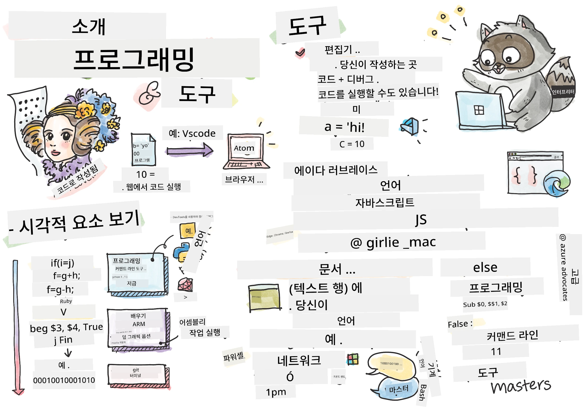
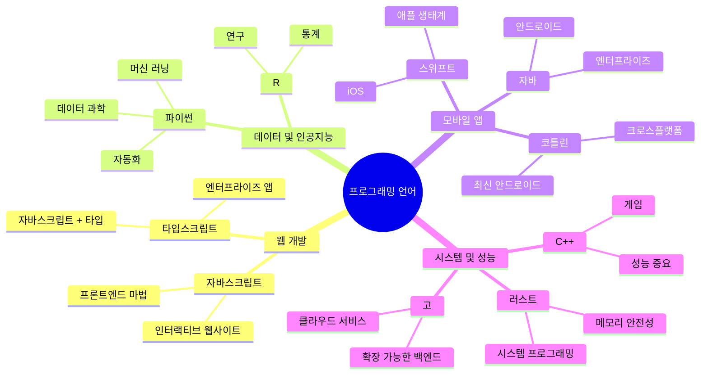
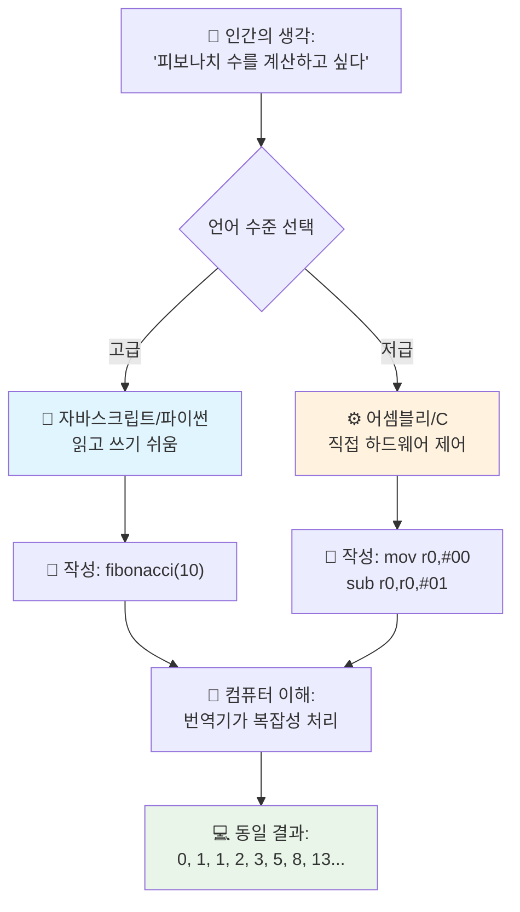
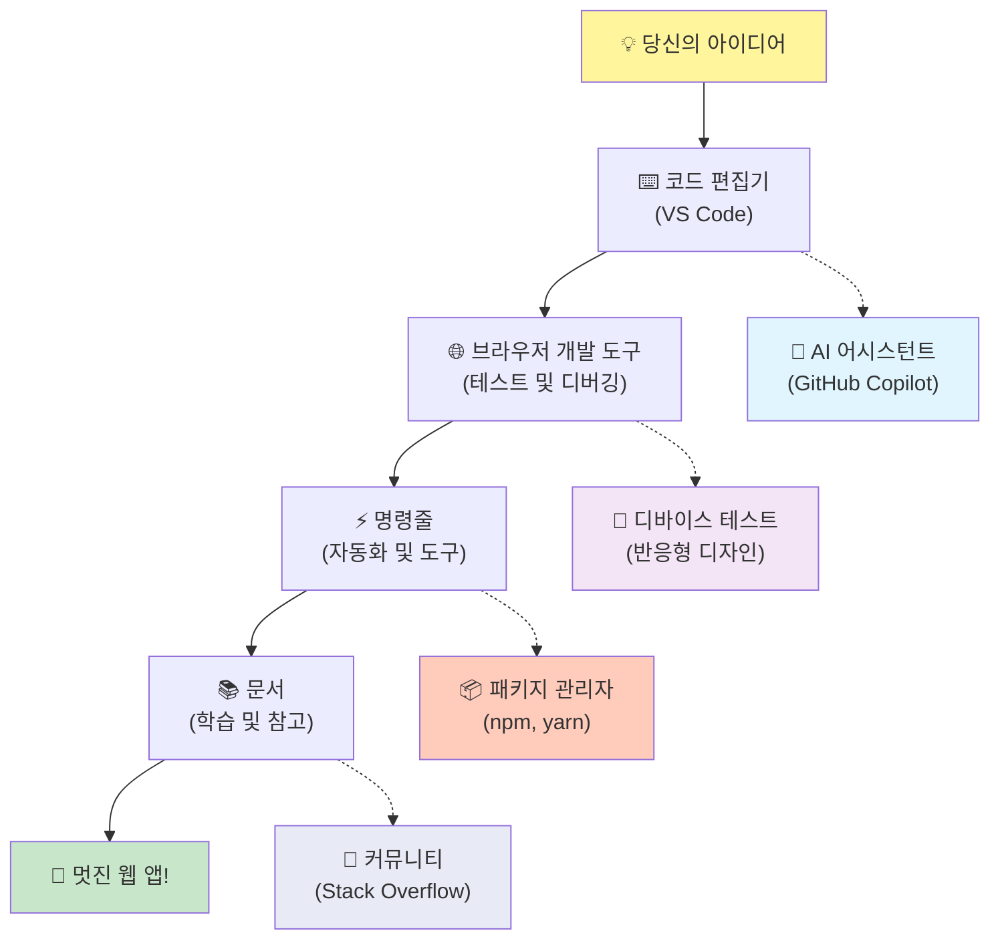
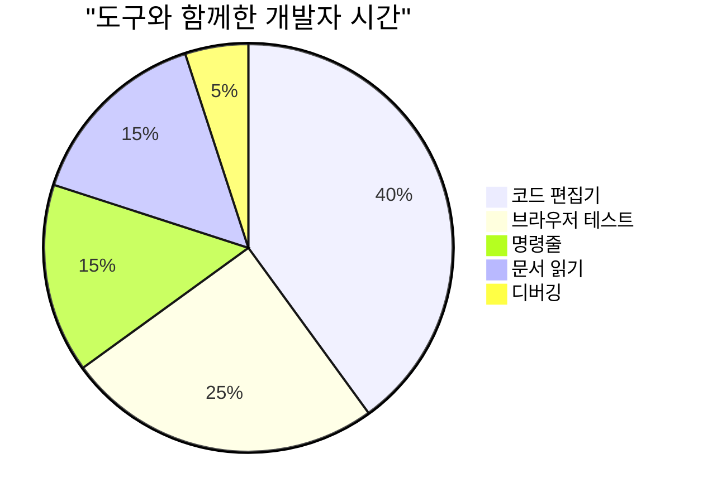

# 프로그래밍 언어 및 최신 개발자 도구 소개

안녕하세요, 미래의 개발자님! 👋 매일매일 아직도 소름 돋는 이야기를 해도 될까요? 프로그래밍은 단지 컴퓨터에 관한 것이 아니라, 당신의 가장 대담한 아이디어를 실현할 수 있는 진짜 초능력을 갖는다는 사실을 곧 알게 될 거예요!

당신이 좋아하는 앱을 사용할 때 모든 게 완벽히 맞아떨어지는 순간을 아나요? 버튼을 누르자마자 "와, 저걸 어떻게 한 거지?"라는 마법 같은 일이 일어나는 순간요. 바로 당신과 똑같은 누군가가—아마도 좋아하는 커피숍에서 새벽 2시에 세 번째 에스프레소를 마시며—그 마법을 만들 코드를 작성한 거예요. 그리고 이 부분이 당신의 마음을 흔들 거예요: 이 수업이 끝날 때쯤이면, 그들이 어떻게 했는지 이해하는 것뿐만 아니라 직접 해보고 싶어질 거예요!

프로그래밍이 지금은 겁이 난다고 해도 전혀 문제없어요. 제가 처음 시작했을 때, 솔직히 수학 천재이거나 다섯 살 때부터 코딩을 해왔어야 한다고 생각했거든요. 그런데 제 생각을 완전히 바꾼 건 이거예요: 프로그래밍은 새로운 언어로 대화를 배우는 것과 똑같다는 거예요. "안녕하세요"와 "감사합니다"부터 시작해 커피 주문까지 하고, 어느새 깊은 철학 토론까지 하게 되죠! 여기서는 컴퓨터와 대화를 하는 거예요. 솔직히 말하면, 컴퓨터는 가장 인내심 많은 대화 상대예요 — 실수를 전혀 판단하지 않고 항상 다시 시도할 준비가 되어 있거든요!

오늘은 최신 웹 개발을 가능할 뿐만 아니라 정말 중독성 있게 만드는 놀라운 도구들을 탐험할 거예요. Netflix, Spotify, 그리고 당신이 좋아하는 인디 앱 스튜디오의 개발자들이 매일 사용하는 똑같은 편집기, 브라우저, 그리고 작업 흐름을 말하는 거예요. 그리고 이 부분이 당신을 행복하게 만들 거예요: 이 전문급, 업계 표준 도구들 대부분이 완전히 무료라는 사실이에요!


> 스케치노트: [Tomomi Imura](https://twitter.com/girlie_mac)


```mermaid
journey
    title 오늘의 프로그래밍 여정
    section 발견
      프로그래밍이란 무엇인가: 5: You
      프로그래밍 언어: 4: You
      도구 개요: 5: You
    section 탐색
      코드 편집기: 4: You
      브라우저 및 개발 도구: 5: You
      명령줄: 3: You
    section 연습
      언어 탐정: 4: You
      도구 탐색: 5: You
      커뮤니티 연결: 5: You
```  
## 당신이 이미 알고 있는 것을 확인해 볼까요!

재미있는 내용에 들어가기 전에, 프로그래밍 세계에 대해 이미 알고 있는 게 무엇인지 궁금해요! 만약 이 질문들을 보며 "나는 이거에 대해 전혀 모르는데"라고 생각해도 그건 전혀 문제없고 오히려 완벽해요! 지금 당신은 바로 딱 맞는 장소에 있는 거니까요. 이 퀴즈를 운동 전 스트레칭처럼 생각하세요 — 두뇌 근육을 워밍업하는 중일 뿐이에요!

[수업 전 퀴즈 풀기](https://ff-quizzes.netlify.app/web/)


## 우리가 함께 떠날 모험

자, 오늘 우리가 탐험할 내용이 너무 기대돼서 진심으로 들뜬 상태예요! 진짜로, 어떤 개념이 쏙 들어오는 순간 당신의 표정을 보고 싶어요. 함께 떠날 놀라운 여정은 이렇습니다:

- **프로그래밍이 실제로 무엇인가 (그리고 왜 이게 가장 멋진 것인지!)** – 코드는 주변 모든 것을 보이지 않는 마법처럼 움직이게 한다는 걸, 월요일 아침임을 어떻게 아는 알람부터 당신의 넷플릭스 추천 알고리즘까지, 알아볼 거예요
- **프로그래밍 언어와 그들의 멋진 개성들** – 각자가 완전히 다른 초능력과 문제 해결 방식을 가진 사람들로 구성된 파티에 들어가는 걸 상상해보세요. 프로그래밍 언어 세계가 그렇고, 당신은 이 멤버들을 만나게 될 거예요!
- **디지털 마법을 만드는 기본 구성 요소** – 이것들은 궁극의 창작 레고 세트와 같아요. 이 조각들이 어떻게 맞물리는지 알게 되면 상상하는 모든 걸 실제로 만들 수 있음을 깨닫게 될 거예요
- **마법사의 지팡이를 건네받은 듯한 기분이 들게 하는 전문 도구들** – 과장이 아니라, 이 도구들은 진짜로 초능력을 가진 것 같은 느낌을 줄 거예요. 그리고 최고는? 이건 프로들이 매일 쓰는 도구들이에요!

> 💡 **이 점 기억하세요**: 오늘 모든 걸 외우려고 하지 마세요! 지금은 가능성에 대한 흥미로운 불꽃을 느끼기만 하길 바라요. 세부사항은 연습하면서 자연스럽게 기억될 거예요 — 그게 진짜 학습 방법이에요!

> [Microsoft Learn](https://learn.microsoft.com/en-us/learn/modules/web-development-101/introduction-programming/?WT.mc_id=academic-77807-sagibbon)에서 이 수업을 진행할 수도 있어요!

## 그렇다면 프로그래밍이란 정확히 무엇일까요?

자, 백만 달러짜리 질문을 다뤄볼게요: 프로그래밍이란 진짜로 무엇일까요?

제가 이걸 완전히 새롭게 보게 된 이야기를 해 드릴게요. 지난주에 엄마에게 새 스마트 TV 리모컨 쓰는 법을 설명하려 했어요. "빨간 버튼 누르세요, 근데 큰 빨간 버튼 말고 왼쪽에 있는 작은 빨간 버튼 ... 아니 당신 왼쪽 ... 좋아요, 이제 2초 동안 누르세요, 1초도 아니고 3초도 아니고 ..." 이런 식이었거든요. 익숙하나요? 😅

그게 바로 프로그래밍이에요! 엄청 강력하지만 완벽하게 상세한 단계별 지시를 주는 예술이죠. 다만 엄마에게 설명하는 게 아니라(엄마는 "어느 빨간 버튼이요?!"라고 묻지만), 컴퓨터에게 설명하는 겁니다(컴퓨터는 당신이 말한 대로 딱 실행해요, 설령 당신이 말한 게 정확히 뜻한 것이 아니어도요).

제가 처음 이걸 배우고 충격받은 사실은 이거였어요: 컴퓨터는 사실 코어 자체가 꽤 단순해요. 정말로 두 가지밖에 모르는 거예요 — 1과 0, 즉 '예'와 '아니오' 또는 '켜짐'과 '꺼짐' 정도예요. 그게 전부죠! 그런데 마법이 시작되는 곳은 우리가 행렬처럼 1과 0으로만 말할 필요가 없다는 거예요. 이때 <strong>프로그래밍 언어</strong>가 등장합니다. 이들은 당신의 아주 평범한 인간 생각을 컴퓨터 언어로 변환하는 최고의 통역사 같은 존재예요.

그리고 매일 아침 일어나서도 아직 소름 돋는 게 있어요: 당신 인생의 모든 디지털 것은 바로 당신과 똑같은 누군가가, 아마도 잠옷 차림에 커피 한잔을 들고 노트북에 코딩을 하면서 시작되었다는 사실이에요. 당신을 완벽하게 만들어주는 인스타그램 필터? 그거 누군가가 코딩했어요. 새로 좋아하는 노래를 찾게 해 준 추천 알고리즘? 개발자가 만들었죠. 친구들과 저녁값을 나누는 앱? 네, "이거 너무 불편한데, 내가 고칠 수 있겠어"라고 생각한 누군가가 그리고 해냈어요!

프로그래밍을 배우면, 단지 새로운 기술을 익히는 게 아니라 이런 놀라운 문제 해결 커뮤니티의 일부가 되는 거예요. "누군가의 하루를 조금 더 나아지게 만드는 무언가를 만들 수 있다면 어떨까?"라는 생각으로 매일을 보내는 사람들이요. 솔직히, 이보다 멋진 게 있을까요?

✅ **재미있는 사실 탐색**: 시간이 있을 때 꼭 검색해보세요 — 세계 최초의 컴퓨터 프로그래머는 누구일까요? 힌트를 드리자면, 기대하는 사람이 아닐 수도 있어요! 이 사람의 이야기는 정말 흥미롭고, 프로그래밍이 언제나 창의적 문제 해결과 틀을 벗어난 사고에 관한 것이었음을 보여줍니다.

### 🧠 **점검 시간: 기분은 어떠신가요?**

**잠시 시간을 내어 생각해 보세요:**
- "컴퓨터에게 지시를 준다"라는 생각이 이제 이해가 되나요?
- 일상적인 업무 중 프로그래밍으로 자동화하고 싶은 일이 있나요?
- 프로그래밍 전체에 대해 궁금한 점이 어떤 게 떠오르나요?

> <strong>기억하세요</strong>: 어떤 개념이 아직 애매해도 전혀 괜찮아요. 프로그래밍 공부는 새 언어를 배우는 것과 같아서 뇌가 신경 회로를 만드는 데 시간이 걸려요. 잘 하고 계시니까요!

## 프로그래밍 언어는 마치 다른 마법의 맛과 같아요

이상하게 들릴 수 있지만 들어 보세요 — 프로그래밍 언어는 다양한 음악 장르와 많이 닮았어요. 생각해보세요: 재즈는 부드럽고 즉흥적이고, 록은 강력하고 직설적이며, 클래식은 우아하고 구조적이고, 힙합은 창의적이고 표현적이에요. 각 장르는 자체 분위기와 열정적인 팬 공동체가 있으며, 서로 다른 기분과 상황에 딱 맞아요.

프로그래밍 언어도 똑같이 작동해요! 기후 데이터처럼 엄청난 양을 분석하는 데 쓸 언어와 재미있는 모바일 게임을 만드는 데 쓸 언어는 달라야 하죠. 요가 수업에서 데스 메탈을 틀지 않는 것과 마찬가지예요(대부분의 요가 수업 말이죠! 😄).

다만 매번 생각할 때마다 감탄하는 건 이 점이에요: 이 언어들은 당신 옆에 앉아 가장 인내심 많고 천재적인 통역사가 있는 것과 같아요. 인간의 뇌에 자연스러운 방식으로 아이디어를 표현하면, 프로그래밍 언어가 그것을 1과 0으로 번역해서 컴퓨터가 이해할 수 있게 만들어 줘요. "인간 창의력"과 "컴퓨터 논리" 모두에 완벽한 친구가 있는 느낌이죠 — 졸지 않고, 커피 휴식이 필요 없고, 같은 질문을 두 번 해도 절대 뭐라 하지 않는 친구랍니다!

### 인기 프로그래밍 언어와 용도


```mermaid
mindmap
  root((프로그래밍 언어))
    웹 개발
      자바스크립트
        프론트엔드 마법
        인터랙티브 웹사이트
      타입스크립트
        자바스크립트 + 타입
        엔터프라이즈 앱
    데이터 및 인공지능
      파이썬
        데이터 과학
        머신 러닝
        자동화
      R
        통계
        연구
    모바일 앱
      자바
        안드로이드
        엔터프라이즈
      스위프트
        iOS
        애플 생태계
      코틀린
        최신 안드로이드
        크로스플랫폼
    시스템 및 성능
      C++
        게임
        성능 중요
      러스트
        메모리 안전성
        시스템 프로그래밍
      고
        클라우드 서비스
        확장 가능한 백엔드
```
| 언어 | 용도 | 인기 있는 이유 |
|----------|----------|------------------|
| **JavaScript** | 웹 개발, 사용자 인터페이스 | 브라우저에서 실행되며 인터랙티브 웹사이트를 구동 |
| **Python** | 데이터 과학, 자동화, AI | 쉽게 읽고 배우기 쉬우며 강력한 라이브러리 |
| **Java** | 엔터프라이즈 애플리케이션, Android 앱 | 플랫폼 독립적이며 대규모 시스템에 견고 |
| **C#** | 윈도우 애플리케이션, 게임 개발 | 강력한 Microsoft 생태계 지원 |
| **Go** | 클라우드 서비스, 백엔드 시스템 | 빠르고 단순하며 현대 컴퓨팅을 위해 설계됨 |

### 고수준 vs 저수준 언어

정말 처음 배울 때 머리가 터질 듯 했던 개념이라, 제가 이해하는 데 도움 된 비유를 공유할게요 — 당신도 도움이 되길 바라요!

당신이 모국어를 모르는 나라에 가서 급하게 화장실을 찾아야 한다고 생각해 보세요 (우리 모두 경험 있죠? 😅):

- <strong>저수준 프로그래밍</strong>은 마치 그 지역 사투리를 아주 잘 배워서 거리 구석에서 과일 파는 할머니와 문화적 참조, 현지 은어, 그 지역에서 자란 사람만 이해하는 농담까지 해가며 대화를 나누는 것 같아요. 아주 인상적이고 효율적이지만… 그냥 화장실을 찾는 데는 너무 과한 방법일 수도 있죠.

- <strong>고수준 프로그래밍</strong>은 마치 그 지역 사정을 완벽히 아는 친구가 옆에 있어서, 당신이 "화장실이 급해요"라고 영어로만 말해도 모든 문화적 통역을 다 해주고 이해하기 쉽게 길을 알려주는 것과 같아요.

프로그래밍 용어로:
- **저수준 언어** (예: 어셈블리, C)는 컴퓨터 하드웨어와 아주 구체적인 대화를 하게 해 주지만, 컴퓨터처럼 생각해야 해요. 정신적으로 큰 변화를 요구하죠!
- **고수준 언어** (예: JavaScript, Python, C#)는 인간처럼 생각하면서 뒤에서는 기계어를 모두 처리해 줘요. 게다가 새로 시작하는 사람을 기억하고 진심으로 돕고 싶어하는 아주 환영하는 커뮤니티가 있어요!

어떤 걸 추천할지 짐작 가시나요? 😉 고수준 언어는 훈련용 보조 바퀴같아서 절대 떼고 싶지 않을 만큼 모든 과정을 훨씬 즐겁게 만들어 줘요!


```mermaid
flowchart TB
    A["👤 인간의 생각:<br/>'피보나치 수를 계산하고 싶다'"] --> B{언어 수준 선택}
    
    B -->|고급| C["🌟 자바스크립트/파이썬<br/>읽고 쓰기 쉬움"]
    B -->|저급| D["⚙️ 어셈블리/C<br/>직접 하드웨어 제어"]
    
    C --> E["📝 작성: fibonacci(10)"]
    D --> F["📝 작성: mov r0,#00<br/>sub r0,r0,#01"]
    
    E --> G["🤖 컴퓨터 이해:<br/>번역기가 복잡성 처리"]
    F --> G
    
    G --> H["💻 동일 결과:<br/>0, 1, 1, 2, 3, 5, 8, 13..."]
    
    style C fill:#e1f5fe
    style D fill:#fff3e0
    style H fill:#e8f5e8
```  
### 왜 고수준 언어가 훨씬 친근한지 보여줄게요

자, 고수준 언어를 사랑하게 된 이유를 완벽히 보여줄 뭔가를 보여드리려고 해요. 하지만 먼저 한 가지 약속해 주세요. 첫 번째 코드 예제를 볼 때 당황하지 말 것! 무섭게 보이도록 만드는 게 바로 이 예제의 목적이에요!

완전히 다른 두 스타일로 작성한 같은 작업을 볼 거예요. 둘 다 피보나치 수열을 만들죠 — 각 수가 바로 앞 두 수의 합인 아름다운 수학 패턴: 0, 1, 1, 2, 3, 5, 8, 13... (재미있는 사실: 이 패턴은 자연계 곳곳에 있는데, 해바라기 씨의 나선형, 솔방울 무늬, 심지어 은하 형성 방식에서도 찾아볼 수 있어요!)

비교해볼 준비되셨나요? 시작해 볼게요!

**고수준 언어 (JavaScript) — 인간 친화적:**

```javascript
// 1단계: 기본 피보나치 설정
const fibonacciCount = 10;
let current = 0;
let next = 1;

console.log('Fibonacci sequence:');
```
  
**이 코드는 다음을 합니다:**
- <strong>상수 선언</strong>해서 몇 개의 피보나치 수를 생성할지 지정
- <strong>변수 초기화</strong>해서 현재 숫자와 다음 숫자 추적
- **시작 값 설정** (0과 1)으로 피보나치 패턴 정의
- <strong>헤더 메시지 표시</strong>로 결과 구분

```javascript
// 2단계: 루프를 사용하여 시퀀스 생성
for (let i = 0; i < fibonacciCount; i++) {
  console.log(`Position ${i + 1}: ${current}`);
  
  // 시퀀스의 다음 숫자 계산
  const sum = current + next;
  current = next;
  next = sum;
}
```
  
**작동 과정 분석:**
- `for` 루프로 수열 각 위치를 반복
- 템플릿 리터럴 포맷으로 각 숫자와 위치 표시
- 현재 값과 다음 값을 더해 다음 피보나치 수 계산
- 추적 변수를 업데이트해서 다음 반복 준비

```javascript
// 3단계: 현대적인 함수형 접근법
const generateFibonacci = (count) => {
  const sequence = [0, 1];
  
  for (let i = 2; i < count; i++) {
    sequence[i] = sequence[i - 1] + sequence[i - 2];
  }
  
  return sequence;
};

// 사용 예제
const fibSequence = generateFibonacci(10);
console.log(fibSequence);
```
  
**위에서 우리는:**
- 현대적인 화살표 함수 문법으로 재사용 가능한 함수 생성
- 전체 수열을 저장하는 배열 만들어 한 개씩 표시하지 않음
- 배열 인덱싱을 활용해 앞 두 값을 더해 새 숫자 계산
- 프로그램 다른 부분에서 사용할 수 있도록 전체 수열 반환

**저수준 언어 (ARM 어셈블리) — 컴퓨터 친화적:**

```assembly
 area ascen,code,readonly
 entry
 code32
 adr r0,thumb+1
 bx r0
 code16
thumb
 mov r0,#00
 sub r0,r0,#01
 mov r1,#01
 mov r4,#10
 ldr r2,=0x40000000
back add r0,r1
 str r0,[r2]
 add r2,#04
 mov r3,r0
 mov r0,r1
 mov r1,r3
 sub r4,#01
 cmp r4,#00
 bne back
 end
```
  
JavaScript 버전은 거의 영어 지시문처럼 읽히는 반면, 어셈블리 버전은 컴퓨터 프로세서를 직접 제어하는 암호 같은 명령어를 사용합니다. 둘 다 동일한 작업을 수행하지만, 고수준 언어가 사람에게 훨씬 이해하고 작성하며 유지 관리하기 쉽습니다.

**눈에 띄는 주요 차이점들:**
- <strong>가독성</strong>: JavaScript는 `fibonacciCount`처럼 설명적인 이름을 사용하는 반면, 어셈블리는 `r0`, `r1` 같은 암호 같은 라벨을 사용합니다.
- <strong>주석</strong>: 고급 언어는 코드 자체를 문서화하는 설명 주석을 적극 권장합니다.
- <strong>구조</strong>: JavaScript의 논리 흐름은 인간이 문제를 단계별로 생각하는 방식과 일치합니다.
- <strong>유지보수</strong>: 요구 사항 변경에 따라 JavaScript 버전을 업데이트하는 것이 간단하고 명확합니다.

✅ **피보나치 수열에 대하여**: 이 정말 멋진 숫자 패턴(각 숫자가 앞의 두 숫자의 합: 0, 1, 1, 2, 3, 5, 8...)은 자연에서 문자 그대로 <em>모든 곳</em>에 나타납니다! 해바라기 나선, 솔방울 무늬, 노틸러스 조개 껍데기의 곡선, 심지어 나무 가지가 자라는 방식에서도 찾을 수 있습니다. 수학과 코딩이 자연이 아름다움을 창조하는 패턴을 이해하고 재현하는 데 얼마나 도움이 되는지 정말 놀랍습니다!

## 마법을 만드는 기본 구성 요소

좋아요, 이제 프로그래밍 언어가 실제로 어떻게 작동하는지 봤으니, 지금까지 쓰인 모든 프로그램의 기본적인 구성 요소들을 살펴봅시다. 이걸 좋아하는 조리법의 필수 재료라고 생각하세요 – 각각이 어떤 역할을 하는지 이해하면 사실상 어떤 언어로든 코드를 읽고 쓸 수 있게 됩니다!

이건 프로그래밍 문법을 배우는 것과 비슷합니다. 학교에서 명사, 동사, 문장 만드는 법을 배웠던 거 기억나죠? 프로그래밍에도 자체 문법이 있는데, 솔직히 영어 문법보다 훨씬 논리적이고 관대합니다! 😄

### 문장(Statements): 단계별 명령어

먼저 <strong>문장</strong>부터 시작해보죠 – 이건 컴퓨터와 대화하는 개별 문장과 같습니다. 각 문장은 컴퓨터에게 한 가지 특정 작업을 하라고 지시하는 것이에요, 일종의 길 안내처럼: "여기서 좌회전해," "빨간 불에서 멈춰," "저 자리에 주차해."

제가 문장의 좋은 점으로 꼽는 건 보통 읽기 쉽다는 겁니다. 이걸 보세요:

```javascript
// 단일 작업을 수행하는 기본 문장
const userName = "Alex";                    
console.log("Hello, world!");              
const sum = 5 + 3;                         
```
  
**이 코드는 다음을 수행합니다:**  
- 사용자 이름을 저장할 상수 변수를 선언  
- 콘솔 출력에 인사말 메시지를 표시  
- 수학 연산 결과를 계산하여 저장  

```javascript
// 웹 페이지와 상호작용하는 명령문
document.title = "My Awesome Website";      
document.body.style.backgroundColor = "lightblue";
```
  
**단계별로 무슨 일이 일어나는지:**  
- 브라우저 탭에 표시되는 웹페이지 제목을 수정  
- 페이지 전체 배경 색상을 변경  

### 변수(Variables): 프로그램의 메모리 시스템

자, <strong>변수</strong>는 솔직히 제가 가르치기 가장 좋아하는 개념 중 하나입니다. 왜냐면 일상생활에서 이미 사용하는 것과 너무 비슷하기 때문이죠!

핸드폰 연락처를 잠깐 생각해보세요. 모든 사람의 전화번호를 외우진 않잖아요 – 대신 "엄마", "베스트 프렌드", 혹은 "새벽 2시까지 배달하는 피자집" 같은 이름을 저장하고 핸드폰이 진짜 번호를 기억하게 하죠. 변수도 똑같아요! 프로그램이 정보를 저장하고 나중에 이해하기 쉬운 이름으로 꺼낼 수 있는 라벨 붙은 컨테이너인 셈입니다.

정말 멋진 건, 프로그램이 실행되는 동안 변수는 변할 수 있다는 겁니다(그래서 변수(variable)라는 이름이 붙었죠!). 마치 더 좋은 피자집을 발견하면 연락처를 업데이트하는 것처럼 변수도 프로그램이 새로운 정보를 배우거나 상황이 바뀌면 업데이트할 수 있습니다!

아래 예시를 보면서 이게 얼마나 간단한지 보여드릴게요:

```javascript
// 1단계: 기본 변수 생성하기
const siteName = "Weather Dashboard";        
let currentWeather = "sunny";               
let temperature = 75;                       
let isRaining = false;                      
```
  
**이 개념을 이해하기:**  
- `const` 변수에 변하지 않는 값 저장 (예: 사이트 이름)  
- 프로그램 내내 변할 수 있는 값에는 `let` 사용  
- 문자열(텍스트), 숫자, 불리언(true/false) 같은 다양한 데이터 타입 할당  
- 각 변수가 담고 있는 내용을 설명하는 이름 선택  

```javascript
// 2단계: 관련 데이터를 그룹화하기 위해 객체 작업하기
const weatherData = {                       
  location: "San Francisco",
  humidity: 65,
  windSpeed: 12
};
```
  
**위 예제에서:**  
- 관련된 날씨 정보를 묶는 객체 생성  
- 여러 데이터를 하나의 변수 이름 아래에 정리  
- 각 정보를 명확히 라벨링한 키-값 쌍 사용  

```javascript
// 3단계: 변수 사용 및 업데이트
console.log(`${siteName}: Today is ${currentWeather} and ${temperature}°F`);
console.log(`Wind speed: ${weatherData.windSpeed} mph`);

// 변경 가능한 변수 업데이트
currentWeather = "cloudy";                  
temperature = 68;                          
```
  
**각 부분 이해하기:**  
- `${}` 문법을 사용하여 템플릿 리터럴로 정보 표시  
- 점(.) 표기법 (`weatherData.windSpeed`)으로 객체 속성 접근  
- `let`으로 선언된 변수 값을 변화하는 조건에 맞게 업데이트  
- 여러 변수를 조합해 의미 있는 메시지 생성  

```javascript
// 4단계: 더 깔끔한 코드를 위한 현대적 구조 분해
const { location, humidity } = weatherData; 
console.log(`${location} humidity: ${humidity}%`);
```
  
**필요한 내용을 정리하면:**  
- 구조 분해 할당(destructuring assignment)으로 객체의 특정 속성 추출  
- 객체 키와 같은 이름으로 새 변수 자동 생성  
- 점 표기법 반복을 줄여 코드 간결화  

### 제어 흐름(Control Flow): 프로그램에 사고력을 가르치기

자, 여기서부터 프로그래밍이 정말 놀라워지기 시작합니다! <strong>제어 흐름</strong>은 본질적으로 프로그램에게 스마트한 결정을 내리는 법을 가르치는 거예요, 여러분이 매일 무의식적으로 하듯 말이죠.

예를 들어, 오늘 아침에 "비가 오면 우산을 챙긴다. 추우면 재킷을 입는다. 늦으면 아침을 건너뛰고 길에서 커피를 산다."는 생각을 했을 겁니다. 우리 뇌는 이런 if-then 논리를 하루에도 수십 번씩 자연스럽게 따릅니다!

그래서 프로그램이 그냥 지루하고 예측 가능한 스크립트를 따라가는 게 아니라 지능 있고 살아있는 것처럼 느껴지는 겁니다. 상황을 보고 현재를 평가한 후 적절히 반응할 수 있으니까요. 프로그램에 적응하고 선택할 수 있는 두뇌를 주는 것과 같습니다!

어떻게 이게 멋지게 작동하는지 보여드릴게요:

```javascript
// 1단계: 기본 조건 논리
const userAge = 17;

if (userAge >= 18) {
  console.log("You can vote!");
} else {
  const yearsToWait = 18 - userAge;
  console.log(`You'll be able to vote in ${yearsToWait} year(s).`);
}
```
  
**이 코드가 수행하는 작업:**  
- 사용자의 나이가 투표 자격을 충족하는지 확인  
- 조건 결과에 따라 다른 코드 블록 실행  
- 18세 미만일 때 투표 가능할 때까지 남은 기간 계산 및 표시  
- 각 상황에 맞는 구체적이고 유용한 피드백 제공  

```javascript
// 2단계: 논리 연산자를 사용한 다중 조건
const userAge = 17;
const hasPermission = true;

if (userAge >= 18 && hasPermission) {
  console.log("Access granted: You can enter the venue.");
} else if (userAge >= 16) {
  console.log("You need parent permission to enter.");
} else {
  console.log("Sorry, you must be at least 16 years old.");
}
```
  
**여기서 무슨 일이 일어나는지 분해하면:**  
- `&&`(그리고) 연산자로 복수 조건 결합  
- 여러 시나리오에 대해 `else if`로 조건 계층 구조 생성  
- 마지막 `else` 문으로 모든 가능한 경우 처리  
- 각 다른 상황에 대해 명확하고 실행 가능한 피드백 제공  

```javascript
// 3단계: 삼항 연산자를 사용한 간결한 조건문
const votingStatus = userAge >= 18 ? "Can vote" : "Cannot vote yet";
console.log(`Status: ${votingStatus}`);
```
  
**기억할 점:**  
- 간단한 두 가지 경우 조건에는 삼항 연산자(`? :`) 사용  
- 조건 먼저 쓰고 `?`, 참일 결과, `:`, 거짓일 결과 순서로 작성  
- 조건에 따라 값 할당할 때 이 패턴 적용  

```javascript
// 4단계: 여러 특정 경우 처리하기
const dayOfWeek = "Tuesday";

switch (dayOfWeek) {
  case "Monday":
  case "Tuesday":
  case "Wednesday":
  case "Thursday":
  case "Friday":
    console.log("It's a weekday - time to work!");
    break;
  case "Saturday":
  case "Sunday":
    console.log("It's the weekend - time to relax!");
    break;
  default:
    console.log("Invalid day of the week");
}
```
  
**이 코드는 다음을 수행합니다:**  
- 변수 값을 여러 특정 경우와 비교  
- 비슷한 경우를 그룹화(평일 vs 주말)  
- 일치하는 경우에 적절한 코드 블록 실행  
- 예상치 못한 값을 처리할 `default` 케이스 포함  
- 다음 케이스로 넘어가지 않도록 `break` 문 사용  

> 💡 **현실 세계 비유**: 제어 흐름은 세상에서 가장 인내심 많은 GPS가 길 안내하는 것과 같습니다. "메인 스트리트에 교통 체증이면 고속도로 타. 공사로 고속도로 막히면 경치 좋은 길로 가 봐." 프로그램도 동일한 조건 논리를 사용해 상황에 지능적으로 반응하고 항상 사용자에게 최상의 경험을 제공합니다.

### 🎯 **개념 점검: 기본 구성 요소 숙달**

**기본을 얼마나 이해했는지 확인해봅시다:**  
- 변수와 문장의 차이를 자신만의 말로 설명할 수 있나요?  
- if-then 결정을 실제 사용했던 사례를 생각해보세요(우리 투표 예시처럼)  
- 프로그래밍 논리 중 놀랐던 점은 무엇인가요?  

**간단한 자신감 부스터:**  

```mermaid
flowchart LR
    A["📝 문장<br/>(명령문)"] --> B["📦 변수<br/>(저장소)"] --> C["🔀 제어 흐름<br/>(결정)"] --> D["🎉 작동하는 프로그램!"]
    
    style A fill:#ffeb3b
    style B fill:#4caf50
    style C fill:#2196f3
    style D fill:#ff4081
```  
✅ **앞으로 배울 내용 소개**: 이 훌륭한 여정을 함께 계속하면서 이 개념들을 더 깊게 파고들 예정입니다! 지금은 앞으로 펼쳐질 놀라운 가능성에 대한 기대감에 집중하세요. 구체적인 기술과 기법들은 함께 연습하면서 자연스럽게 익힐 거예요 – 이 과정이 예상보다 훨씬 재미있을 거라고 약속합니다!

## 도구 소개

솔직히 이 부분이 너무 신나서 참을 수가 없네요! 🚀 이제 디지털 우주선의 키를 바로 받은 것 같은 느낌을 줄 놀라운 도구들에 대해 이야기할 거예요.

요리사가 손처럼 자연스러운 균형 잡힌 칼을 가지고 있거나, 연주자가 처음 만지면 바로 노래하는 기타를 가진 것과 같듯, 개발자들도 마법 같은 도구가 있는데, 놀랍게도 대부분 완전 무료입니다!

제가 정말 흥분되는 이유는, 이 도구들이 소프트웨어 개발 방식을 완전히 혁신했기 때문입니다. AI 기반 코딩 도우미가 여러분 코드를 도와 쓰고(농담 아니에요!), 어디서나 Wi-Fi만 있으면 전체 애플리케이션을 개발할 수 있는 클라우드 환경, 그리고 프로그램을 엑스레이처럼 투시하는 듯한 정교한 디버깅 도구까지 갖췄습니다.

그리고 아직도 소름 돋는 부분은 이 도구들이 '초보자용'이 아니라는 거예요. 구글, 넷플릭스, 그리고 여러분이 좋아하는 인디 앱 스튜디오의 개발자도 바로 지금 이 순간 똑같은 프로페셔널 툴을 사용하고 있습니다. 여러분도 이걸 사용하면 진짜 전문가가 된 느낌을 받을 겁니다!


```mermaid
graph TD
    A["💡 당신의 아이디어"] --> B["⌨️ 코드 편집기<br/>(VS Code)"] 
    B --> C["🌐 브라우저 개발 도구<br/>(테스트 및 디버깅)"]
    C --> D["⚡ 명령줄<br/>(자동화 및 도구)"]
    D --> E["📚 문서<br/>(학습 및 참고)"]
    E --> F["🚀 멋진 웹 앱!"]
    
    B -.-> G["🤖 AI 어시스턴트<br/>(GitHub Copilot)"]
    C -.-> H["📱 디바이스 테스트<br/>(반응형 디자인)"]
    D -.-> I["📦 패키지 관리자<br/>(npm, yarn)"]
    E -.-> J["👥 커뮤니티<br/>(Stack Overflow)"]
    
    style A fill:#fff59d
    style F fill:#c8e6c9
    style G fill:#e1f5fe
    style H fill:#f3e5f5
    style I fill:#ffccbc
    style J fill:#e8eaf6
```  
### 코드 편집기와 통합 개발 환경(IDE): 새로운 디지털 베스트 프렌드

코드 편집기에 대해 얘기해볼게요 – 곧 여러분의 새로운 좋아하는 공간이 될 거예요! 개인적인 코딩 피난처처럼 여기서 대부분의 시간을 보내며 디지털 창작물을 다듬고 완성하게 됩니다.

근데 현대 편집기가 마법 같은 이유는 이것들이 단순한 텍스트 에디터가 아니라는 점입니다. 24시간 언제나 옆에서 가장 똑똑하고 지원을 아끼지 않는 코딩 멘토가 있는 것과 같아요. 오타를 내가 알아채기 전에 잡아주고, 천재처럼 보이게 하는 개선안을 제시하고, 코드 하나하나가 뭘 하는지 알려주고, 때론 내가 입력할 걸 미리 예측해서 마무리까지 제안해주기도 합니다!

자동 완성을 처음 발견했을 때 마치 미래에 사는 기분이었어요. 타이핑하면 편집기가 "어, 이 함수 생각하고 있던 거야? 그게 딱 필요하던 거지?" 하면서 마인드 리더 같은 친구가 되어줍니다!

**이 편집기들이 대단한 이유는?**

현대 코드 편집기는 생산성을 높여주는 인상적인 기능을 많이 제공합니다:

| 기능 | 무슨 역할을 하나요 | 왜 도움이 되나요 |
|---------|--------------|--------------|
| **문법 강조(Syntax Highlighting)** | 코드의 다양한 부분을 색깔로 표시 | 코드를 더 쉽게 읽고 오류를 발견 |
| **자동 완성(Auto-completion)** | 타이핑하는 코드 제안 | 코딩 속도 향상, 오타 줄임 |
| **디버깅 도구(Debugging Tools)** | 오류 찾고 수정 도와줌 | 문제 해결에 걸리는 시간 절약 |
| **확장 기능(Extensions)** | 특화 기능 추가 | 어떤 기술 환경에도 맞게 편집기 맞춤화 |
| **AI 어시스턴트(AI Assistants)** | 코드 제안과 설명 제공 | 학습과 생산성 가속 |

> 🎥 **영상 자료**: 이 도구들이 실제로 어떻게 작동하는지 보고 싶나요? 이 [Tools of the Trade video](https://youtube.com/watch?v=69WJeXGBdxg)에서 종합적인 개요를 확인하세요.

#### 웹 개발 추천 편집기

**[Visual Studio Code](https://code.visualstudio.com/?WT.mc_id=academic-77807-sagibbon)** (무료)  
- 웹 개발자 사이에서 가장 인기  
- 훌륭한 확장 기능 생태계  
- 내장 터미널과 Git 통합  
- **필수 확장 프로그램**:  
  - [GitHub Copilot](https://marketplace.visualstudio.com/items?itemName=GitHub.copilot) - AI 기반 코드 제안  
  - [Live Share](https://marketplace.visualstudio.com/items?itemName=MS-vsliveshare.vsliveshare) - 실시간 협업  
  - [Prettier](https://marketplace.visualstudio.com/items?itemName=esbenp.prettier-vscode) - 자동 코드 포맷팅  
  - [Code Spell Checker](https://marketplace.visualstudio.com/items?itemName=streetsidesoftware.code-spell-checker) - 코드 내 오타 잡기  

**[JetBrains WebStorm](https://www.jetbrains.com/webstorm/)** (유료, 학생 무료)  
- 고급 디버깅 및 테스트 도구  
- 지능형 코드 완성  
- 내장 버전 관리  

**클라우드 기반 IDE** (가격 다양)  
- [GitHub Codespaces](https://github.com/features/codespaces) - 브라우저 내 전체 VS Code  
- [Replit](https://replit.com/) - 배우고 코드 공유하기 좋음  
- [StackBlitz](https://stackblitz.com/) - 즉시 사용할 수 있는 풀스택 웹 개발  

> 💡 **시작 팁**: Visual Studio Code로 시작하세요 – 무료이고 업계에서 널리 쓰이며, 도움이 되는 튜토리얼과 확장 생태계가 매우 큽니다.

### 웹 브라우저: 나만의 비밀 개발 실험실

자, 완전히 놀랄 준비하세요! 여러분이 소셜 미디어를 넘기고 동영상을 보려고 브라우저를 사용해온 동안, 사실은 숨겨진 믿기 어려운 비밀 개발 실험실을 계속 품고 있었다는 사실을 아시나요?

웹페이지에서 마우스 오른쪽 버튼 클릭 후 "요소 검사"를 선택할 때마다 여러분은 숨겨진 개발자 도구의 세계를 열게 됩니다. 이 도구들은 제가 수백 달러 주고 샀던 비싼 소프트웨어보다 훨씬 강력합니다. 마치 평범한 주방 뒤에 프로 셰프의 실험실이 비밀 패널 뒤에 숨겨져 있는 것을 발견하는 것과 같습니다!
누군가 처음 브라우저 개발자 도구(DevTools)를 보여줬을 때, 나는 그냥 이리저리 클릭하면서 "잠깐만, 이거도 할 수 있다고?!" 하며 세 시간이나 보냈어요. 실시간으로 아무 웹사이트나 편집할 수 있고, 모든 게 얼마나 빨리 로드되는지 정확히 볼 수 있으며, 다양한 기기에서 내 사이트가 어떻게 보이는지 테스트하고, 프로처럼 자바스크립트 디버깅도 할 수 있어요. 정말 놀라워요!

**브라우저가 당신의 비밀 무기인 이유는 다음과 같습니다:**

웹사이트나 웹 애플리케이션을 만들 때, 실제 환경에서 어떻게 보이고 동작하는지 확인해야 합니다. 브라우저는 작업물을 보여줄 뿐만 아니라 성능, 접근성, 잠재적인 문제에 대한 자세한 피드백도 제공합니다.

#### 브라우저 개발자 도구 (DevTools)

최신 브라우저에는 포괄적인 개발 도구가 포함되어 있습니다:

| 도구 카테고리 | 기능 | 사용 사례 예시 |
|---------------|-------------|-----------------|
| **요소 검사기** | 실시간으로 HTML/CSS 보기 및 편집 | 스타일을 조정하여 즉시 결과 확인 |
| <strong>콘솔</strong> | 오류 메시지 보기 및 자바스크립트 테스트 | 문제 디버깅 및 코드 실험 |
| **네트워크 모니터** | 리소스 로딩 추적 | 성능 및 로딩 시간 최적화 |
| **접근성 검사기** | 포괄적인 디자인 테스트 | 모든 사용자가 사이트를 이용할 수 있도록 보장 |
| **기기 시뮬레이터** | 다양한 화면 크기 미리보기 | 여러 기기 없이 반응형 디자인 테스트 |

#### 개발에 추천하는 브라우저

- **[Chrome](https://developers.google.com/web/tools/chrome-devtools/)** – 광범위한 문서가 있는 업계 표준 DevTools
- **[Firefox](https://developer.mozilla.org/docs/Tools)** – 뛰어난 CSS 그리드 및 접근성 도구
- **[Edge](https://docs.microsoft.com/microsoft-edge/devtools-guide-chromium/?WT.mc_id=academic-77807-sagibbon)** – Chromium 기반 Microsoft 개발자 리소스 제공

> ⚠️ **중요한 테스트 팁**: 웹사이트를 여러 브라우저에서 항상 테스트하세요! Chrome에서는 완벽하게 작동하는 것이 Safari나 Firefox에서는 다르게 보일 수 있습니다. 전문 개발자는 모든 주요 브라우저에서 테스트하여 일관된 사용자 경험을 보장합니다.


### 커맨드 라인 도구: 개발자 슈퍼파워의 관문

자, 커맨드 라인에 대해 솔직하게 말해보자면, 내가 처음 봤을 때 — 그냥 깜빡이는 텍스트가 있는 무서운 검은 화면 — 나는 "아니, 절대 안 돼! 이건 1980년대 해커 영화 같은 거고, 나는 이거 할만큼 똑똑하지 않아!" 라고 생각했어요 😅

하지만 당시 누군가가 나에게 말해줬으면 하는 점, 그리고 지금 여러분께 말해주고 싶은 건: 커맨드 라인은 무서운 게 아니라, 사실 컴퓨터와 직접 대화하는 것과 같다는 점이에요. 멋지고 메뉴와 그림이 있는 앱으로 음식을 주문하는 것과, 좋아하는 동네 식당에 직접 가서 요리사가 "놀라운 걸로 맛보여줘"라고 말하자마자 완벽한 음식을 만드는 것의 차이처럼요.

커맨드 라인은 개발자들이 마법사처럼 느끼는 곳입니다. 몇 개의 마법 같은 단어(사실은 그냥 명령어지만 마법 같아요!)를 타이핑하고, 엔터를 누르면, 짠! 전체 프로젝트 구조를 만들거나, 세계 각국에서 강력한 도구를 설치하거나, 수백만 명이 볼 수 있도록 앱을 인터넷에 배포할 수 있어요. 그 힘을 한 번 맛보면, 솔직히 꽤 중독성이 있답니다!

**커맨드 라인이 가장 좋아질 이유:**

그래픽 인터페이스가 많은 작업에 좋긴 하지만, 커맨드 라인은 자동화, 정밀함, 속도에서 탁월합니다. 많은 개발 도구가 주로 커맨드 라인 인터페이스를 통해 작동하며, 이를 효율적으로 사용하는 법을 배우면 생산성이 크게 향상됩니다.

```bash
# 1단계: 프로젝트 디렉터리를 생성하고 이동하세요
mkdir my-awesome-website
cd my-awesome-website
```

**이 코드는 다음을 수행합니다:**
- 프로젝트를 위한 "my-awesome-website"라는 새 디렉터리를 생성
- 새로 생성한 디렉터리로 이동하여 작업 시작

```bash
# 2단계: package.json으로 프로젝트 초기화
npm init -y

# 최신 개발 도구 설치하기
npm install --save-dev vite prettier eslint
npm install --save-dev @eslint/js
```

**단계별 설명:**
- `npm init -y`를 사용해 기본 설정으로 새로운 Node.js 프로젝트 초기화
- 빠른 개발 및 프로덕션 빌드를 위한 최신 빌드 도구 Vite 설치
- 자동 코드 포맷팅용 Prettier와 코드 품질 검사용 ESLint 추가
- `--save-dev` 플래그를 사용해 개발 전용 의존성으로 표시

```bash
# 3단계: 프로젝트 구조 및 파일 생성
mkdir src assets
echo '<!DOCTYPE html><html><head><title>My Site</title></head><body><h1>Hello World</h1></body></html>' > index.html

# 개발 서버 시작
npx vite
```

**위에서 우리는:**
- 소스 코드와 자산용 별도 폴더 생성으로 프로젝트 구성
- 올바른 문서 구조를 갖춘 기본 HTML 파일 생성
- Vite 개발 서버를 시작하여 라이브 리로드와 핫 모듈 교체 지원

#### 웹 개발 필수 커맨드 라인 도구

| 도구 | 용도 | 필요한 이유 |
|------|--------|--------------|
| **[Git](https://git-scm.com/)** | 버전 관리 | 변경사항 추적, 협업, 작업 백업 |
| **[Node.js & npm](https://nodejs.org/)** | 자바스크립트 런타임 및 패키지 관리 | 브라우저 외 자바스크립트 실행, 최신 도구 설치 |
| **[Vite](https://vitejs.dev/)** | 빌드 도구 및 개발 서버 | 핫 모듈 교체가 적용된 초고속 개발 |
| **[ESLint](https://eslint.org/)** | 코드 품질 | 자바스크립트 문제 자동 발견 및 수정 |
| **[Prettier](https://prettier.io/)** | 코드 포맷팅 | 일관된 코드 형식과 가독성 유지 |

#### 운영체제별 옵션

**Windows:**
- **[Windows Terminal](https://docs.microsoft.com/windows/terminal/?WT.mc_id=academic-77807-sagibbon)** – 최신 기능 가득한 터미널
- **[PowerShell](https://docs.microsoft.com/powershell/?WT.mc_id=academic-77807-sagibbon)** 💻 – 강력한 스크립팅 환경
- **[Command Prompt](https://learn.microsoft.com/windows-server/administration/windows-commands/windows-commands)** 💻 – 전통적인 윈도우 커맨드 라인

**macOS:**
- **[Terminal](https://support.apple.com/guide/terminal/)** 💻 – 기본 제공 터미널 앱
- **[iTerm2](https://iterm2.com/)** – 고급 기능을 갖춘 향상된 터미널

**Linux:**
- **[Bash](https://www.gnu.org/software/bash/)** 💻 – 표준 리눅스 셸
- **[KDE Konsole](https://docs.kde.org/trunk5/en/konsole/konsole/index.html)** – 고급 터미널 에뮬레이터

> 💻 = 운영체제에 기본 설치됨

> 🎯 **학습 경로**: `cd` (디렉터리 변경), `ls` 또는 `dir` (파일 목록 보기), `mkdir` (폴더 생성) 같은 기본 명령어로 시작하세요. 그런 다음 `npm install`, `git status`, `code .` (현재 디렉터리를 VS Code로 열기) 같은 현대적 워크플로우 명령어를 연습하세요. 익숙해질수록 자연스럽게 더 고급 명령어와 자동화 기술을 배울 수 있습니다.


### 문서화: 언제나 곁에 있는 학습 멘토

자, 초보자라서 더 안심할 수 있게 작은 비밀을 알려드릴게요: 가장 경험 많은 개발자도 상당한 시간을 문서를 읽는 데 보냅니다. 그게 자신이 모른다거나 하는 게 아니라 — 오히려 현명함의 표시랍니다!

문서를 24시간 언제나 함께하는 가장 인내심 많고 지식이 풍부한 선생님이라고 생각하세요. 새벽 2시에 문제에 막혔나요? 문서는 따뜻한 가상 포옹과 딱 필요한 답을 주죠. 모두가 이야기하는 멋진 새 기능을 배우고 싶나요? 문서가 단계별 예제로 도와줍니다. 왜 어떤 기능이 그렇게 작동하는지 알고 싶나요? 문서가 딱 이해하기 쉽게 설명해줍니다!

전혀 다른 관점을 깨닫게 한 게 하나 있는데요: 웹 개발은 엄청나게 빠르게 변하고, 아무도 (진짜 아무도!) 모든 걸 외우지 못해요. 15년 경력의 시니어 개발자도 기본 문법을 찾아보는 걸 봤는데, 부끄러운 게 아니라 현명한 행동이에요! 완벽한 암기가 아니라, 빠르게 신뢰할 수 있는 답을 찾고 그걸 적용할 줄 아는 게 중요합니다.

**진짜 마법은 여기서 일어납니다:**

전문 개발자들이 상당한 시간을 문서 읽기에 투자하는 이유는, 빠르게 변화하는 웹 개발 환경에서 최신 정보를 유지하려면 끊임없이 배워야 하기 때문입니다. 훌륭한 문서는 <em>어떻게</em> 사용하는지뿐 아니라 <em>왜</em> 그리고 <em>언제</em> 사용하는지도 이해하도록 도와줍니다.

#### 필수 문서화 자료

**[Mozilla Developer Network (MDN)](https://developer.mozilla.org/docs/Web)**
- 웹 기술 문서의 황금 표준
- HTML, CSS, 자바스크립트에 대한 포괄적 가이드
- 브라우저 호환성 정보 포함
- 실용적인 예제와 인터랙티브 데모 제공

**[Web.dev](https://web.dev)** (Google 제공)
- 현대 웹 개발 최선 사례
- 성능 최적화 가이드
- 접근성과 포괄적 디자인 원칙
- 실제 프로젝트 사례 연구

**[Microsoft Developer Documentation](https://docs.microsoft.com/microsoft-edge/#microsoft-edge-for-developers)**
- Edge 브라우저 개발 자료
- 점진적 웹 앱 가이드
- 크로스 플랫폼 개발 인사이트

**[Frontend Masters Learning Paths](https://frontendmasters.com/learn/)**
- 구조화된 학습 과정
- 업계 전문가 영상 강의
- 실습 코딩 과제

> 📚 **공부 전략**: 문서를 외우려고 하지 말고 효율적으로 탐색하는 법을 배우세요. 자주 쓰는 참고 자료를 즐겨찾기하고 필요한 정보를 빠르게 찾기 위해 검색 기능을 활용해 연습하세요.

### 🔧 **도구 마스터리 체크: 무엇이 당신과 공명하나요?**

**잠시 생각해보세요:**
- 가장 먼저 사용해보고 싶은 도구는 무엇인가요? (틀린 답은 없어요!)
- 커맨드 라인이 아직도 부담스럽나요, 아니면 호기심이 생겼나요?
- 브라우저 DevTools로 좋아하는 웹사이트의 속살을 엿보는 게 상상이 되나요?


```mermaid
pie title "도구와 함께한 개발자 시간"
    "코드 편집기" : 40
    "브라우저 테스트" : 25
    "명령줄" : 15
    "문서 읽기" : 15
    "디버깅" : 5
```
> **재미있는 통찰**: 대부분 개발자는 코드 편집기에서 약 40%의 시간을 보내지만, 꽤 많은 시간을 테스트, 학습, 문제 해결에 쏟아요. 프로그래밍은 단지 코드를 쓰는 게 아니라 경험을 만들어 가는 과정입니다!

✅ **생각할 거리**: 웹사이트를 만드는(개발) 도구와 사이트 디자인 도구가 어떻게 다를지 생각해보세요. 마치 아름다운 집을 설계하는 건축가와 실제로 집을 짓는 시공업자가 다른 도구 상자를 쓰는 것과 같아요! 이런 사고방식은 웹사이트가 어떻게 탄생하는지 더 넓은 시야로 보게 도와줍니다.

## GitHub Copilot Agent 챌린지 🚀

Agent 모드를 사용해 다음 챌린지를 완료하세요:

**설명:** 현대 코드 편집기 또는 IDE의 기능을 탐색하고, 이것이 웹 개발자의 워크플로우를 어떻게 향상시키는지 보여주세요.

**프롬프트:** Visual Studio Code, WebStorm, 클라우드 기반 IDE 중 하나를 선택하세요. 코드 작성, 디버깅 또는 유지 관리에 도움 되는 세 가지 기능이나 확장 프로그램을 나열하고, 각각이 어떻게 작업 흐름에 이득이 되는지 간단히 설명하세요.

---

## 🚀 챌린지

**좋아요, 탐정님, 첫 사건 준비되셨나요?**

이제 훌륭한 기반 지식을 얻었으니, 프로그래밍 세계가 얼마나 다양하고 흥미진진한지 직접 보게 해주는 모험을 시작할 거예요. 코딩을 당장 할 필요는 없으니 부담 갖지 마세요! 마치 프로그래밍 언어 탐정이 된 것처럼 첫 흥미진진한 사건에 도전해보세요!

**당신의 임무, 받아들인다면:**
1. **언어 탐험가 되기**: 완전히 다른 세 분야에서 각각 세 가지 프로그래밍 언어를 골라보세요 — 예를 들어 웹사이트를 만드는 것, 모바일 앱 만들기, 과학자들을 위한 데이터 처리 언어. 각 언어로 같은 간단한 작업의 예제를 찾아보세요. 똑같은 일을 하면서도 얼마나 다르게 생겼는지 보고 깜짝 놀라실 거예요!

2. **기원 이야기 밝히기**: 각 언어가 특별한 이유는 뭘까요? 멋진 사실 하나 — 모든 프로그래밍 언어는 누군가가 “이 특정 문제를 더 잘 해결할 방법이 있어야 해”라고 생각해서 만들어졌어요. 각 문제점들이 무엇인지 추적해보세요. 그 이야기들은 정말 매력적입니다!

3. **커뮤니티 만나기**: 각 언어 커뮤니티가 얼마나 환영하고 열정적인지 확인해보세요. 어떤 곳은 수백만 명의 개발자가 지식 공유와 도움을 주고받으며, 어떤 곳은 작지만 긴밀한 지원 커뮤니티가 있어요. 각기 다른 커뮤니티 성격을 보는 게 재미있을 거예요!

4. **직감 따르기**: 지금 가장 친근하게 느껴지는 언어는 무엇인가요? 완벽한 선택을 하려고 스트레스 받지 말고, 당신의 직감을 믿으세요! 여기엔 틀린 답이 없고, 나중에 다른 언어들도 탐색할 수 있어요.

**보너스 탐정 미션**: 각 언어로 만들어진 주요 웹사이트나 앱은 무엇인지 찾아보세요. 인스타그램, 넷플릭스, 혹은 당신이 멈출 수 없는 모바일 게임이 어떤 언어로 만들어졌는지 알면 정말 놀라실 거예요!

> 💡 <strong>기억하세요</strong>: 오늘 당장 어느 언어의 전문가가 되려는 게 아니라, 이웃 동네를 알아보는 중이에요. 어디에 터를 잡을지 결정하기 전에 천천히 즐기면서 호기심을 따라가세요!

## 당신이 발견한 것을 축하합시다!

와우, 오늘 엄청난 정보를 정말 많이 흡수했네요! 이 멋진 여정에서 얼마나 많은 게 머릿속에 남았는지 보는 게 정말 기대돼요. 그리고 잊지 마세요 — 이건 완벽을 요구하는 시험이 아니에요. 그냥 이 흥미로운 세계에 대해 배운 모든 멋진 것들을 축하하는 시간이랍니다!

[수업 후 퀴즈 풀기](https://ff-quizzes.netlify.app/web/)

## 복습 및 자기 주도 학습

**시간을 가지고 탐색하고 재미있게 학습하세요!**
오늘 정말 많은 것을 배웠고, 그건 자랑스러워해도 될 일이에요! 이제 재미있는 시간이 왔어요 – 여러분의 호기심을 자극한 주제들을 탐험하는 시간이죠. 기억하세요, 이건 숙제가 아니라 모험입니다!

**흥미로운 것들을 더 깊이 파고들기:**

**프로그래밍 언어 직접 다뤄보기:**
- 관심이 간 2-3개의 공식 웹사이트를 방문해보세요. 각각 고유의 개성과 이야기가 있답니다!
- [CodePen](https://codepen.io/), [JSFiddle](https://jsfiddle.net/), 또는 [Replit](https://replit.com/) 같은 온라인 코딩 놀이터를 사용해보세요. 두려워하지 말고 실험해보세요 – 절대 뭔가 망가지지 않아요!
- 좋아하는 언어가 어떻게 탄생했는지 읽어보세요. 진짜로, 이런 기원 이야기는 흥미진진해서 왜 언어들이 그렇게 작동하는지 이해하는 데 도움이 될 거예요.

**새로운 도구에 익숙해지기:**
- 아직 안 깔았다면 Visual Studio Code를 다운로드하세요 – 무료이고 정말 마음에 들 거예요!
- 익스텐션 마켓플레이스를 몇 분간 둘러보세요. 코드 에디터용 앱 스토어 같답니다!
- 브라우저 개발자 도구를 열고 여기저기 클릭해보세요. 모든 걸 다 이해하려고 하지 말고 그냥 익숙해지세요.

**커뮤니티에 참여하기:**
- [Dev.to](https://dev.to/), [Stack Overflow](https://stackoverflow.com/), 또는 [GitHub](https://github.com/) 같은 개발자 커뮤니티를 팔로우하세요. 프로그래밍 커뮤니티는 신입에게 정말 친절하답니다!
- 유튜브에서 초보자용 코딩 영상을 보세요. 시작할 때 마음을 잘 아는 멋진 크리에이터들이 많아요.
- 가끔 지역 모임이나 온라인 커뮤니티에 참여해보세요. 믿어요, 개발자들은 신입을 돕는 걸 정말 좋아해요!

> 🎯 **이걸 꼭 기억해 주세요**: 여러분이 하루아침에 코딩 천재가 될 거라고 기대하지 마세요! 지금은 여러분이 곧 함께할 이 멋진 새 세계를 알아가는 중입니다. 천천히, 여행을 즐기면서 진행하세요. 그리고 기억하세요 – 여러분이 존경하는 모든 개발자는 한 때 여러분처럼 설레면서도 약간은 벅찬 마음으로 시작했답니다. 그건 너무나 정상이고, 여러분은 잘 하고 있다는 뜻이에요!


## Assignment

[Reading the Docs](assignment.md)

> 💡 **과제에 대한 작은 팁**: 아직 다루지 않은 도구들을 탐험해 보길 정말 권장해요! 이미 이야기했던 에디터, 브라우저, 커맨드 라인 도구는 건너뛰고 – 놀랍도록 훌륭한 개발 도구들의 광대한 우주가 여러분을 기다리고 있어요. 적극적으로 유지보수되고 활발한 커뮤니티가 있는 도구를 찾아보세요 (이런 도구들은 가장 좋은 튜토리얼과 도움이 필요한 순간에 친절한 사람들이 많습니다).

---

## 🚀 여러분의 프로그래밍 여정 일정표

### ⚡ **다음 5분 내에 할 수 있는 일**
- [ ] 관심 가는 프로그래밍 언어 웹사이트 2-3개를 즐겨찾기하기
- [ ] 아직 안 했다면 Visual Studio Code 다운로드하기
- [ ] 브라우저 개발자 도구(F12) 열고 아무 사이트에서나 클릭하며 살펴보기
- [ ] 프로그래밍 커뮤니티 하나 가입하기 (Dev.to, Reddit r/webdev, Stack Overflow)

### ⏰ **이 한 시간 안에 할 수 있는 일**
- [ ] 수업 후 퀴즈 풀고 답변 돌아보기
- [ ] VS Code에 GitHub Copilot 확장 기능 세팅하기
- [ ] 온라인에서 서로 다른 프로그래밍 언어 2개로 "Hello World" 예제 실행해보기
- [ ] 유튜브에서 "개발자의 하루" 영상 시청하기
- [ ] 프로그래밍 언어 탐정 작업 시작하기 (도전 과제에서)

### 📅 **일주일간의 모험**
- [ ] 과제를 완료하고 3개의 새로운 개발 도구 탐색하기
- [ ] 소셜 미디어에서 개발자 또는 프로그래밍 계정 5개 팔로우하기
- [ ] CodePen 또는 Replit에서 작은 프로젝트 만들어보기 (심지어 "Hello, [Your Name]!"만 해도 좋아요)
- [ ] 누군가의 코딩 여정을 다룬 개발자 블로그 글 읽기
- [ ] 가상 모임에 참여하거나 프로그래밍 강연 시청하기
- [ ] 선택한 언어 온라인 튜토리얼로 배우기 시작하기

### 🗓️ **한 달간의 성장 여정**
- [ ] 첫 작은 프로젝트 만들기 (간단한 웹페이지도 포함)
- [ ] 오픈 소스 프로젝트에 기여하기 (문서 수정부터 시작)
- [ ] 막 시작한 사람을 멘토링하기
- [ ] 개발자 포트폴리오 웹사이트 만들기
- [ ] 지역 개발자 커뮤니티 또는 스터디 그룹과 연결하기
- [ ] 다음 학습 목표 계획하기

### 🎯 **최종 되돌아보기**

**계속하기 전에 잠시 축하하세요:**
- 오늘 프로그래밍에서 흥미로웠던 한 가지는 무엇인가요?
- 가장 먼저 탐색하고 싶은 도구나 개념은 무엇인가요?
- 이 프로그래밍 여정을 시작하는 기분은 어떤가요?
- 지금 개발자에게 질문하고 싶은 한 가지는 무엇인가요?


```mermaid
journey
    title 당신의 자신감 향상 여정
    section 오늘
      호기심: 3: You
      압도됨: 4: You
      신남: 5: You
    section 이번 주
      탐색 중: 4: You
      배우는 중: 5: You
      연결 중: 4: You
    section 다음 달
      구축 중: 5: You
      자신감 있음: 5: You
      다른 사람 돕기: 5: You
```
> 🌟 **잊지 마세요**: 모든 전문가도 한때는 초보자였어요. 모든 시니어 개발자도 지금 여러분처럼 설레고, 약간은 벅차면서, 가능성에 대해 호기심 가득했답니다. 여러분은 멋진 동료들과 함께하고 있고, 이 여정은 정말 놀라울 거예요. 환영합니다, 멋진 프로그래밍 세계에! 🎉

---

<!-- CO-OP TRANSLATOR DISCLAIMER START -->
**면책 조항**:  
이 문서는 AI 번역 서비스 [Co-op Translator](https://github.com/Azure/co-op-translator)를 사용하여 번역되었습니다. 정확성을 위해 노력하고 있으나, 자동 번역에는 오류나 부정확한 부분이 있을 수 있음을 유의하시기 바랍니다. 원문 문서가 권위 있는 출처로 간주되어야 합니다. 중요한 정보에 대해서는 전문 인력의 번역을 권장합니다. 본 번역 사용으로 인한 오해나 잘못된 해석에 대해 당사는 책임을 지지 않습니다.
<!-- CO-OP TRANSLATOR DISCLAIMER END -->