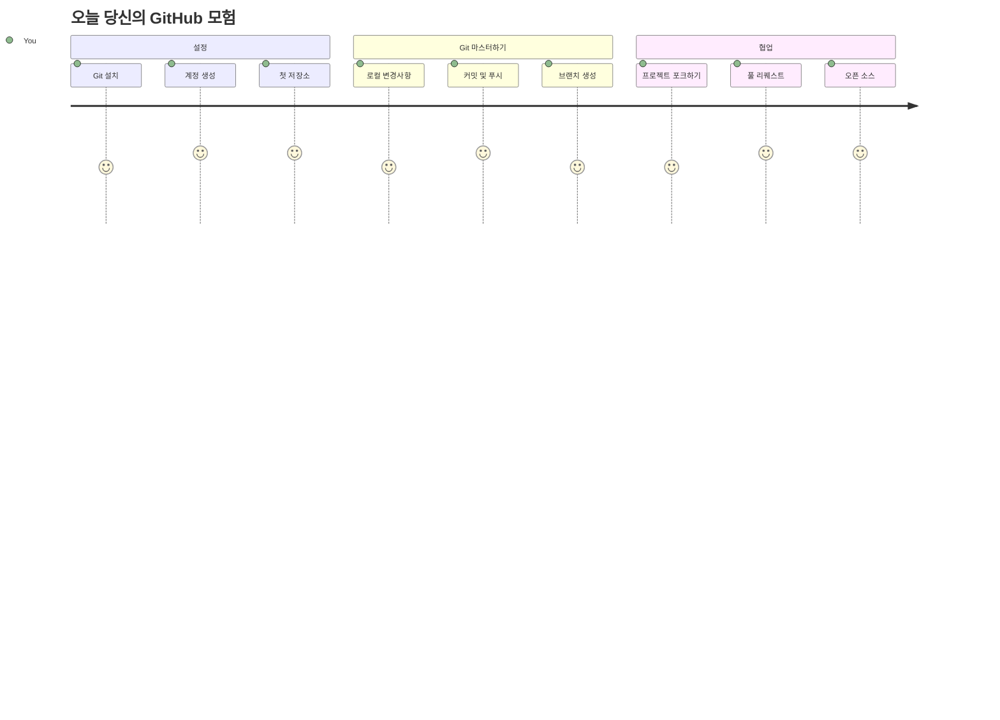
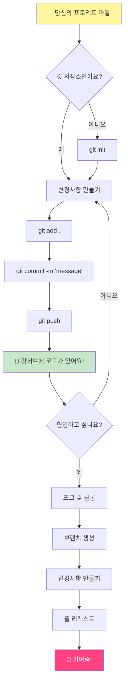
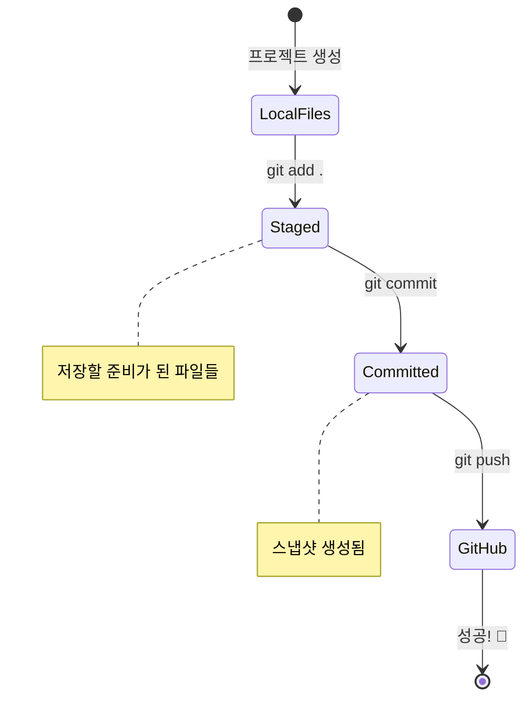
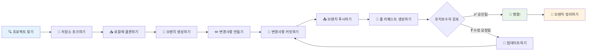
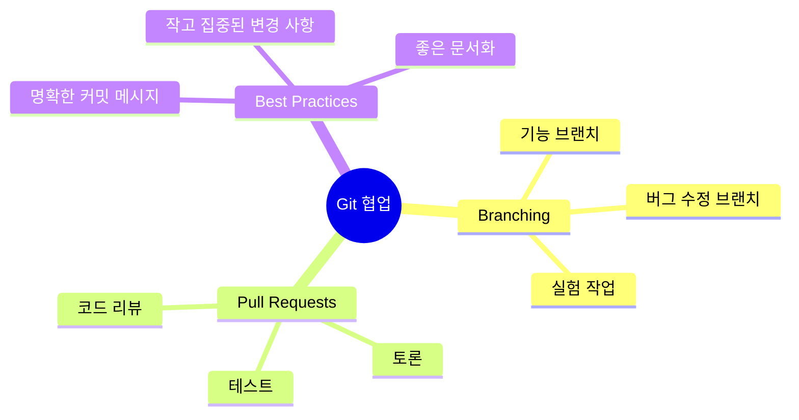
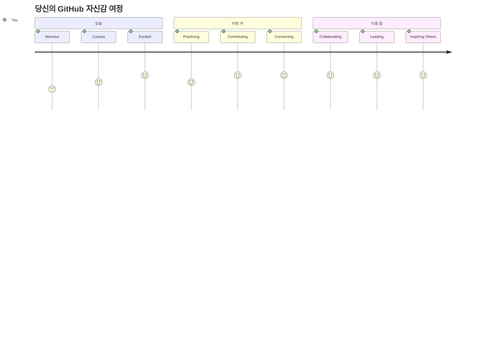

<!--
CO_OP_TRANSLATOR_METADATA:
{
  "original_hash": "5c383cc2cc23bb164b06417d1c107a44",
  "translation_date": "2026-01-06T15:49:30+00:00",
  "source_file": "1-getting-started-lessons/2-github-basics/README.md",
  "language_code": "ko"
}
-->
# Introduction to GitHub

안녕하세요, 미래의 개발자님! 👋 전 세계 수백만 개발자들과 함께할 준비가 되셨나요? 여러분께 GitHub를 소개하게 되어 정말 기쁩니다 – 프로그래머들을 위한 소셜 미디어 플랫폼이라고 생각하세요. 점심 사진을 공유하는 대신, 우리는 코드를 공유하고 함께 놀라운 것들을 만들어가고 있답니다!

정말 놀라운 점은 이겁니다: 여러분의 휴대폰에 있는 모든 앱, 방문하는 모든 웹사이트, 그리고 배우게 될 대부분의 도구들은 모두 GitHub와 같은 플랫폼에서 협업하는 개발자 팀에 의해 만들어졌다는 거예요. 여러분이 사랑하는 음악 앱? 여러분과 같은 누군가가 기여했어요. 절대 놓을 수 없는 그 게임? 네, 아마도 GitHub 협업으로 만들어졌을 거예요. 그리고 이제 여러분이 그 멋진 커뮤니티의 일원이 되는 법을 배우게 될 거예요!

처음에는 조금 벅차 보일 수도 있다는 걸 알고 있어요 – 저도 첫 GitHub 페이지를 보고 “대체 이게 뭘 뜻하는 거지?” 하고 한참을 멍하니 바라봤던 기억이 나요. 하지만 여기서 중요한 점은: 모든 개발자는 바로 여러분이 지금 있는 자리에서 시작했다는 거예요. 이 수업이 끝날 때쯤이면 여러분만의 GitHub 저장소를 갖게 될 거예요 (클라우드에 개인 프로젝트를 전시하는 공간이라고 생각하세요). 또한 작업물을 저장하고, 다른 사람과 공유하며, 수백만 명이 사용하는 프로젝트에 기여하는 방법도 알게 될 겁니다.

함께 한 걸음씩 천천히 배워 나가 보겠습니다. 서두르지 않고, 압박감 없이 – 여러분과 저, 그리고 여러분의 새 친구가 될 몇 가지 멋진 도구들만 있을 거예요!


> Sketchnote by [Tomomi Imura](https://twitter.com/girlie_mac)


## 사전 강의 퀴즈
[사전 강의 퀴즈](https://ff-quizzes.netlify.app)

## 소개

정말 흥미로운 내용을 시작하기 전에, 여러분의 컴퓨터가 GitHub 마법을 준비할 수 있도록 해봅시다! 이 과정을 마치 멋진 작품을 만들기 전에 미술 도구를 정리하는 것과 같다고 생각하세요 – 올바른 도구가 준비되면 모든 과정이 훨씬 원활하고 재미있어집니다.

제가 여러분을 각 설치 단계마다 직접 안내할 거고, 처음 보기에 겁먹을 필요가 전혀 없다는 것을 약속해요. 바로 이해되지 않아도 괜찮아요! 저도 첫 개발 환경 설정할 때 고대 상형문자를 읽으려는 것 같은 기분이었거든요. 모든 개발자가 처음에는 여러분과 똑같이 ‘내가 제대로 하고 있는 걸까?’ 하는 고민을 했답니다. 스포일러: 여러분이 지금 여기서 배우는 중이라면 이미 제대로 하고 있는 거예요! 🌟

이번 수업에서는 다음을 다룹니다:

- 여러분이 컴퓨터에서 하는 작업 추적하기
- 다른 사람과 프로젝트 함께 작업하기
- 오픈 소스 소프트웨어에 기여하는 방법

### 사전 조건

이제 여러분의 컴퓨터를 GitHub 마법에 준비해 봅시다! 걱정 마세요 – 이 설정은 딱 한 번만 하면 되니까 이후 여러분의 전체 코딩 여정에 쭉 도움이 될 거예요.

우선 기본부터 시작할게요! 먼저 Git이 이미 여러분 컴퓨터에 설치되어 있는지 확인해 보겠습니다. Git은 여러분의 코드를 수정할 때마다 모든 변경 내역을 기억해 주는 똑똑한 조수와 같아요 – 2초마다 Ctrl+S를 누르는 것보다 훨씬 낫답니다(우린 다 해봤죠!).

터미널에서 아래 명령어를 입력해 Git이 설치되어 있는지 확인해 봅시다:
`git --version`

Git이 아직 없다면 걱정하지 마세요! [Git 다운로드](https://git-scm.com/downloads) 페이지에서 받아 설치하세요. 설치가 끝났으면 Git을 제대로 설정해 줘야 합니다:

> 💡 **처음 설정하기**: 다음 명령어들은 Git에게 여러분이 누구인지 말해주는 거예요. 이 정보는 여러분이 만드는 모든 커밋에 붙으니, 공개해도 되는 이름과 이메일을 사용하세요.

```bash
git config --global user.name "your-name"
git config --global user.email "your-email"
```

Git이 이미 설정되어 있는지 확인하려면 다음 명령어를 입력할 수 있습니다:
```bash
git config --list
```

또한 GitHub 계정, 코드 에디터(Visual Studio Code 같은)가 필요하며, 터미널(또는 명령 프롬프트)을 열어야 합니다.

[github.com](https://github.com/)에 접속해 계정을 만들거나, 이미 계정이 있다면 로그인 후 프로필을 완성하세요.

💡 **최신 팁**: 비밀번호 없이 간편하게 인증하려면 [SSH 키 설정](https://docs.github.com/en/authentication/connecting-to-github-with-ssh)이나 [GitHub CLI](https://cli.github.com/) 사용을 고려해보세요.

✅ GitHub만 코드 저장소가 아니에요; 다른 플랫폼도 있지만 GitHub가 가장 유명합니다.

### 준비

여러분의 로컬 컴퓨터(노트북이나 PC)에 코드 프로젝트가 담긴 폴더가 필요하고, GitHub에 공개 저장소가 필요합니다. 후자는 다른 사람들의 프로젝트에 기여하는 예제로 사용될 거예요.

### 코드 안전하게 지키기

잠시 보안을 이야기해 봅시다 – 하지만 걱정 마세요, 무서운 얘기로 압도하지는 않을 거예요! 이 보안 습관은 자동차나 집에 자물쇠를 채우는 것과 같다고 생각하세요. 간단하지만 여러분의 노력을 안전하게 지켜주는 습관들이죠.

처음부터 안전하고 현대적인 방법으로 GitHub를 다루는 법을 알려드릴게요. 이렇게 하면 여러분은 코딩 경력 내내 좋은 습관을 쌓게 될 거예요.

GitHub를 사용할 때는 다음 보안 최선책을 따르는 것이 중요합니다:

| 보안 영역 | 최선책 | 이유 |
|---------------|---------------|----------------|
| **인증** | SSH 키 또는 개인 액세스 토큰 사용 | 비밀번호는 덜 안전하며 점점 사라지고 있음 |
| **2단계 인증** | GitHub 계정에서 2FA 활성화 | 계정 보호를 한층 강화함 |
| **저장소 보안** | 민감한 정보는 절대 커밋하지 않기 | API 키와 비밀번호는 절대 공개 저장소에 넣지 않음 |
| **의존성 관리** | Dependabot 활성화 | 의존성을 안전하고 최신 상태로 유지 |

> ⚠️ **중요 보안 알림**: API 키, 비밀번호 등 민감한 정보는 절대 저장소에 커밋하지 마세요. 환경 변수와 `.gitignore` 파일을 사용해 민감한 데이터를 보호하세요.

**최신 인증 설정법:**

```bash
# SSH 키 생성 (최신 ed25519 알고리즘)
ssh-keygen -t ed25519 -C "your_email@example.com"

# Git이 SSH를 사용하도록 설정하기
git remote set-url origin git@github.com:username/repository.git
```

> 💡 **프로 팁**: SSH 키를 사용하면 비밀번호를 반복 입력할 필요가 없고, 전통적인 인증 방식보다 훨씬 안전합니다.

---

## 프로처럼 코드 관리하기

자, 이제 정말 신나는 부분입니다! 🎉 여러분이 프로처럼 코드 변경 사항을 추적하고 관리하는 법을 배울 거예요. 이건 정말 게임 체인저 같은 내용이라서 제가 가장 좋아하는 가르침 중 하나이기도 해요.

상상해 보세요: 멋진 이야기를 쓰고 있는데, 매 초안, 훌륭한 수정, 그리고 “와, 이건 천재적 아이디어야!” 순간들을 모두 기록하고 싶을 때. Git이 여러분의 코드를 위해 하는 일이 바로 이겁니다! 모든 키 입력, 모든 변경, 그리고 “앗, 이거 완전 망쳤다” 순간까지도 즉시 되돌릴 수 있는 놀라운 시간 여행 노트북 같은 거죠.

솔직히 말씀드리면 처음에는 부담스러울 수도 있어요. 저도 처음에 “왜 그냥 평범하게 파일만 저장하면 안 되지?” 했거든요. 하지만 한번 Git 개념이 눈에 들어오면, “내가 어떻게 이걸 없이 코딩했지?” 하고 놀랄 거예요. 평생 걸어서 다니던 사람이 날 수 있다는 것을 발견하는 것과 같답니다!

가령 여러분에게 로컬에 코드 프로젝트가 들어있는 폴더가 있다고 칩시다. git이라는 버전 관리 시스템을 사용해 여러분의 진행 상황을 추적하고자 해요. 어떤 사람들은 git을 미래의 나에게 보내는 러브레터라고도 비유합니다. 며칠, 몇 주, 몇 달 후에 커밋 메시지를 보면 왜 그 결정을 했는지, 또는 “롤백” 즉, 변경을 되돌릴 수 있겠죠 – 단, 좋은 커밋 메시지를 작성했을 때 말이에요.


### 과제: 첫 저장소 만들기!

> 🎯 **여러분의 미션 (정말 기대돼요!)**: 여러분의 첫 번째 GitHub 저장소를 함께 만들어 봅시다! 이 과정을 끝내면 여러분만의 작은 인터넷 공간에 여러분의 코드가 살게 되고, 첫 “커밋”(프로처럼 작업을 똑똑하게 저장하는 것)을 하게 될 거예요.
>
> 이 순간은 정말 특별합니다 – 공식적으로 글로벌 개발자 커뮤니티에 합류하는 순간이니까요! 저도 첫 저장소를 만들던 그 설렘을 아직도 기억해요, “와, 진짜 내가 하고 있구나!” 하면서요.

한 걸음씩 함께 이 모험을 걸어가 봅시다. 각 부분을 천천히 진행하세요 – 서두르느라 상금은 없어요, 그리고 모든 단계가 의미 있게 다가올 거예요. 기억하세요, 여러분이 존경하는 모든 코딩 스타도 한때 지금 여러분과 똑같은 자리에서 첫 저장소를 만들려고 했다는 걸! 참 멋지지 않나요?

> 영상 확인하기
>
> [](https://www.youtube.com/watch?v=9R31OUPpxU4)

**함께 해 봅시다:**

1. **GitHub에서 저장소 만들기**. GitHub.com으로 가서 초록색 **New** 버튼(또는 오른쪽 상단의 **+** 아이콘)을 찾으세요. 클릭한 후 **New repository**를 선택합니다.

   할 일은 다음과 같습니다:
   1. 저장소 이름을 정하세요 – 여러분에게 의미 있는 것으로!
   1. 원한다면 설명을 추가하세요 (다른 사람이 프로젝트를 이해하는 데 도움 됨)
   1. 공개할지(누구나 볼 수 있음) 비공개할지(본인만 볼 수 있음) 결정하세요
   1. README 파일 추가 체크박스를 선택하는 걸 추천합니다 – 프로젝트의 첫 페이지와 같아요
   1. **Create repository**를 클릭하고 축하하세요 – 첫 저장소가 만들어졌습니다! 🎉

2. **프로젝트 폴더로 이동하기**. 터미널을 열어 봅시다 (너무 무섭지 않아요!). 컴퓨터에게 여러분의 프로젝트 파일이 어디 있는지 알려줘야 해요. 이렇게 입력하세요:

   ```bash
   cd [name of your folder]
   ```

   **우리가 하는 일:**
   - 간단히 말해 “컴퓨터야, 내 프로젝트 폴더로 데려가줘”라고 말하는 거예요
   - 바탕화면에서 특정 폴더를 여는 것과 같지만 명령어로 하는 겁니다
   - `[name of your folder]`를 실제 폴더 이름으로 바꾸세요

3. **폴더를 Git 저장소로 만들기**. 이제 진짜 마법이 일어나는 곳이에요! 이렇게 입력하세요:

   ```bash
   git init
   ```

   **방금 일어난 일:**
   - Git이 프로젝트 안에 숨겨진 `.git` 폴더를 만들었어요 – 보이지는 않지만 꼭 있습니다!
   - 여러분의 평범한 폴더가 모든 변경 사항을 추적할 수 있는 “저장소”가 되었어요
   - 이 폴더에 특별한 힘이 생겨 모든 걸 기억할 수 있게 된 거죠

4. **현재 상태 확인하기**. 이제 Git이 프로젝트를 어떻게 보는지 확인해 볼까요?

   ```bash
   git status
   ```

   **Git이 여러분에게 알려주는 내용을 이해하기:**
   
   다음과 같은 화면이 보일 수 있어요:

   ```output
   Changes not staged for commit:
   (use "git add <file>..." to update what will be committed)
   (use "git restore <file>..." to discard changes in working directory)

        modified:   file.txt
        modified:   file2.txt
   ```

   **당황하지 마세요! 의미는 이렇습니다:**
   - **빨간색**으로 표시된 파일은 변경되었지만 아직 저장할 준비가 안 됐어요
   - **초록색**으로 표시된 파일은 저장할 준비가 된 상태입니다
   - Git이 여러분이 다음에 할 수 있는 일을 친절하게 알려주고 있어요

   > 💡 **프로 팁**: `git status` 명령어는 최고의 친구입니다! 궁금할 때마다 사용하세요. 마치 Git에게 “지금 상황이 어떤가요?”라고 묻는 것과 같아요.

5. **파일을 저장할 준비하기** (“스테이징”이라고 합니다):

   ```bash
   git add .
   ```

   **우리가 한 일:**
   - Git에게 “모든 파일을 다음 저장에 포함시키겠다”고 말했어요
   - `.`은 “이 폴더 안에 있는 모든 것”을 의미합니다
   - 이제 파일들이 “스테이지”에 올라가 다음 단계 준비 완료!

   **선택적으로 할 수도 있어요** 특정 파일만 추가하려면 이렇게 입력하세요:

   ```bash
   git add [file or folder name]
   ```

   **왜 이럴까요?**
   - 때때로 관련 변경사항만 묶어 저장하고 싶을 때가 있어요
   - 작업을 논리적인 덩어리로 나누는 데 도움 됩니다
   - 언제 어떤 부분이 바뀌었는지 이해하기 쉽게 만듭니다

   **마음이 바뀌었나요?** 괜찮아요! 이렇게 스테이지에서 파일을 빼낼 수 있습니다:

   ```bash
   # 모든 항목의 스테이지를 해제합니다
   git reset
   
   # 단일 파일의 스테이지만 해제합니다
   git reset [file name]
   ```

   걱정하지 마세요 – 이 명령은 작업물을 삭제하지 않고, 그저 “저장 준비된” 파일 목록에서 빼는 것뿐입니다.

6. **작업을 영구 저장하기** (첫 커밋 만들기!):

   ```bash
   git commit -m "first commit"
   ```

   **🎉 축하합니다! 첫 커밋을 성공적으로 했어요!**
   
   **방금 일어난 일:**
   - Git이 현재 스테이지 된 모든 파일의 “스냅샷”을 찍었어요
   - 커밋 메시지 “first commit”은 이 저장 시점의 의미를 설명합니다
   - Git은 이 스냅샷에 고유한 ID를 부여해 언제든 찾을 수 있게 했어요
   - 이제 공식적으로 프로젝트 이력을 추적하기 시작했습니다!

   > 💡 **앞으로 커밋 메시지**: 다음부터는 더 구체적으로 작성해 보세요! “updated stuff” 대신 “홈페이지에 연락처 폼 추가”나 “네비게이션 메뉴 버그 수정”처럼요. 미래의 여러분이 고마워할 거예요!

7. **로컬 프로젝트를 GitHub에 연결하기**. 지금 여러분의 프로젝트는 컴퓨터에만 존재해요. GitHub 저장소와 연결해서 전 세계와 공유해 봅시다!

   먼저 GitHub 저장소 페이지로 가서 URL을 복사합니다. 그리고 여기로 돌아와서 다음 명령어를 입력하세요:

   ```bash
   git remote add origin https://github.com/username/repository_name.git
   ```
   
   (복사한 저장소 URL로 바꿔 주세요!)

   **방금 한 일:**
   - 로컬 프로젝트와 GitHub 저장소 간의 연결을 만들었습니다
   - "Origin"은 GitHub 저장소에 붙인 별명일 뿐입니다 – 전화 연락처에 추가하는 것과 같습니다
   - 이제 로컬 Git은 코드를 공유할 준비가 되면 어디로 보내야 하는지 압니다

   💡 **더 쉬운 방법**: GitHub CLI가 설치되어 있으면 한 명령어로 할 수 있습니다:
   ```bash
   gh repo create my-repo --public --push --source=.
   ```

8. **코드를 GitHub에 전송하기** (중요한 순간!):

   ```bash
   git push -u origin main
   ```

   **🚀 바로 이겁니다! 코드를 GitHub에 업로드합니다!**
   
   **무슨 일이 일어나는지:**
   - 커밋이 컴퓨터에서 GitHub로 전송됩니다
   - `-u` 플래그는 앞으로 푸시할 때 더 쉽게 연결되도록 영구 연결을 설정합니다
   - "main"은 기본 브랜치 이름입니다 (주요 폴더처럼)
   - 이 후에는 `git push`만 입력해도 됩니다!

   💡 **빠른 참고**: 브랜치 이름이 다른 경우(예: "master")에는 그 이름을 사용하세요. `git branch --show-current`로 확인할 수 있습니다.

9. **새로운 일상 코딩 리듬** (이제 중독될 겁니다!):

   앞으로 프로젝트에 변경사항이 생길 때마다 이 간단한 세 단계 춤을 추면 됩니다:

   ```bash
   git add .
   git commit -m "describe what you changed"
   git push
   ```

   **이것이 당신의 코딩 심장 박동입니다:**
   - 멋진 변경을 코드에 반영 ✨
   - `git add`로 준비하기 ("Git, 이 변경 사항에 주목해!")
   - `git commit`과 설명 메시지로 저장하기 (미래의 당신이 감사할 거예요!)
   - `git push`로 세상과 공유 🚀
   - 반복하기 – 진심으로, 이 과정이 숨쉬는 것처럼 자연스러워집니다!

   이 작업 흐름이 좋은 점은 비디오 게임에서 여러 저장 지점을 갖는 것과 같다는 점입니다. 마음에 드는 변경을 했나요? 커밋하세요! 위험한 시도를 하고 싶나요? 문제없습니다 – 만약 상황이 꼬이면 언제든 마지막 커밋으로 돌아갈 수 있습니다!

   > 💡 **팁**: `.gitignore` 파일을 사용해 GitHub에 올리고 싶지 않은 파일이 나타나지 않도록 하는 것을 고려하세요 - 예를 들어 같은 폴더에 둔 메모 파일 같은 것들 말입니다. `.gitignore` 파일 템플릿은 [.gitignore templates](https://github.com/github/gitignore)에서 찾거나 [gitignore.io](https://www.toptal.com/developers/gitignore)를 사용해 만들 수 있습니다.

### 🧠 **첫 번째 저장소 체크인: 기분이 어땠나요?**

**잠시 멈추고 축하하며 생각해 봅시다:**
- 코드를 처음 GitHub에서 보는 기분은 어땠나요?
- 가장 이해하기 어려웠던 단계와 의외로 쉬웠던 단계는 무엇인가요?
- `git add`, `git commit`, `git push`의 차이를 자신만의 말로 설명할 수 있나요?


> **기억하세요**: 숙련된 개발자도 때때로 명령어를 잊을 수 있습니다. 이 작업 흐름이 근육 기억으로 자리 잡는 데는 연습이 필요해요 - 잘하고 있습니다!

#### 최신 Git 작업 흐름

다음 현대적인 실천 방식을 고려하세요:

- **Conventional Commits**: `feat:`, `fix:`, `docs:` 같은 표준화된 커밋 메시지 형식을 사용하세요. 자세한 내용은 [conventionalcommits.org](https://www.conventionalcommits.org/) 참조
- **원자적 커밋**: 각 커밋이 단일 논리적 변경사항을 나타내도록 하기
- **자주 커밋하기**: 큰 덩어리가 아니라 설명이 잘 된 잦은 커밋을 하세요

#### 커밋 메시지

훌륭한 Git 커밋 제목은 다음 문장을 완성합니다:  
이 커밋이 적용되면 <여기에 제목 입력>

제목은 명령형 현재형을 사용하세요: "change" (changed나 changes 아님).  
본문(선택 사항)도 명령형 현재형을 사용합니다. 본문에는 변경 동기와 이전 행동과의 대조를 포함하세요. `왜`를 설명하는 것이지 `어떻게`를 설명하는 것이 아닙니다.

✅ GitHub를 둘러보며 훌륭한 커밋 메시지를 찾아보세요. 가장 간결한 메시지는 무엇인가요? 커밋 메시지에서 가장 중요하고 유용한 정보는 무엇이라 생각하나요?

## 다른 사람과 함께 일하기 (재미있는 부분!)

이제 모자 단단히 잡으세요, GitHub가 정말 마법처럼 다가오는 순간입니다! 🪄 내 코드를 관리하는 법을 익혔으니 이제 전 세계의 멋진 사람들과 협업하는 제가 가장 좋아하는 부분을 배워볼 차례입니다.

내일 아침 일어나 보면 누군가 도쿄에서 당신이 자는 동안 코드를 개선했을 수도 있고, 베를린에서 버그를 고쳤을 수도 있습니다. 오후가 되면 상파울루의 개발자가 당신이 생각하지 못한 기능을 추가해 놓을 수도 있습니다. 이건 공상 과학이 아니라 GitHub 세계의 평범한 화요일입니다!

제가 정말 신나하는 이유는 여러분이 배우게 될 협업 기술이 바로 구글, 마이크로소프트, 그리고 여러분이 좋아하는 스타트업 팀들이 매일 사용하는 정확한 작업 흐름이라는 점입니다. 단순히 멋진 도구를 배우는 것이 아니라, 전 세계 소프트웨어가 함께 작동하게 만드는 비밀 언어를 배우는 거예요.

솔직히 말해, 누군가가 여러분의 첫 풀 리퀘스트를 머지하는 순간의 짜릿함을 경험하면 개발자들이 오픈 소스에 열정을 느끼는 이유를 알게 될 것입니다. 이건 세계 최대이자 가장 창의적인 팀 프로젝트에 참여하는 것과 같습니다!

> 영상 보기
>
> [](https://www.youtube.com/watch?v=bFCM-PC3cu8)

GitHub에 올리는 주된 이유는 다른 개발자들과 협업하는 것을 가능하게 하기 위함입니다.


저장소에서 `Insights > Community` 로 이동해 프로젝트가 권장 커뮤니티 기준과 어떻게 비교되는지 확인하세요.

저장소를 전문적이고 환영받는 장소로 만들고 싶나요? 저장소로 가서 `Insights > Community`를 클릭하세요. 이 멋진 기능은 프로젝트가 GitHub 커뮤니티가 생각하는 "좋은 저장소 관행"과 어떻게 맞는지 보여줍니다.

> 🎯 **프로젝트 빛내기**: 잘 정리된 저장소와 훌륭한 문서는 깨끗하고 환영하는 매장을 가진 것과 같습니다. 사람들이 당신이 작업을 신경 쓰고 있고 기여하고 싶어 하게 만듭니다!

**멋진 저장소를 만드는 항목:**

| 추가할 것 | 중요한 이유 | 당신에게 주는 이점 |
|-------------|-------------------|---------------------|
| **설명** | 첫인상이 중요! | 사람들이 프로젝트가 무엇인지 즉시 알 수 있음 |
| **README** | 프로젝트의 첫 페이지 | 새로운 방문자에게 친절한 안내서 같은 역할 |
| **기여 지침** | 도움을 환영하는 모습 | 사람들이 어떻게 도울 수 있는지 정확히 알게 됨 |
| **행동 강령** | 친근한 공간 조성 | 모두가 참여하기 편한 분위기 조성 |
| **라이선스** | 법적 명확성 | 다른 사람들이 코드를 어떻게 사용할 수 있는지 알게 됨 |
| **보안 정책** | 책임 있는 모습 보여주기 | 전문적인 관행을 보여줌 |

> 💡 **전문가 팁**: 새 저장소를 생성할 때 GitHub이 이 모든 파일의 템플릿을 제공합니다. 체크박스를 선택하면 자동 생성됩니다.

**탐색할 최신 GitHub 기능:**

🤖 **자동화 및 CI/CD:**
- 자동화 테스트 및 배포를 위한 **GitHub Actions**
- 자동 의존성 업데이트를 제공하는 **Dependabot**

💬 **커뮤니티 및 프로젝트 관리:**
- 이슈 외 커뮤니티 대화를 위한 **GitHub Discussions**
- 칸반 스타일 프로젝트 관리를 위한 **GitHub Projects**
- 코드 품질 기준 강제를 위한 **브랜치 보호 규칙**

이 모든 자원들은 신규 팀원 온보딩에 도움을 줍니다. 신규 기여자들은 코드를 보기 전에 이런 것들을 먼저 확인하여 프로젝트가 자신에게 맞는지 판단합니다.

✅ README 파일은 준비하는 데 시간이 걸리지만 바쁜 관리자들에 의해 종종 간과됩니다. 특히 설명이 잘 된 README 예제를 찾아보세요. 참고로 [좋은 README 만들기 도구](https://www.makeareadme.com/)도 있습니다.

### 작업: 코드 병합하기

기여 문서는 사람들이 프로젝트에 기여하는 방법을 안내합니다. 어떤 유형의 기여를 원하고, 기여 절차가 어떻게 진행되는지 설명합니다. 기여자는 GitHub 저장소에 기여하기 위해 일련의 단계를 거쳐야 합니다:


1. **저장소 포크하기** 아마도 사람들에게 프로젝트를 _포크_ 하도록 요청할 것입니다. 포크란 자신의 GitHub 프로필에 저장소 복제본을 만드는 것입니다.
1. **클론하기** 그 후 로컬 머신에 프로젝트를 클론합니다.
1. **브랜치 만들기** 기여자에게 작업을 위한 _브랜치_ 생성을 요청할 것입니다. 
1. **변경을 한 영역에 집중하기** 기여자에게 한 번에 한 가지 작업에 집중하도록 요청하세요 – 그러면 _병합_ 확률이 높아집니다. 예를 들어 버그 수정, 새 기능 추가, 여러 테스트 업데이트를 모두 하면 3개 중 2개, 또는 1개만 적용할 수도 있잖아요?

✅ 브랜치가 특히 중요하게 여겨지는 상황을 상상해 보세요. 어떤 사례들이 떠오르나요?

> 참고로, 세상을 바꾸고 싶으면 먼저 자신이 변화를 만들어야 하며, 본인 작업용 브랜치도 만들어야 합니다. 현재 “체크아웃된” 브랜치에 커밋이 생성됩니다. `git status`로 어떤 브랜치인지 확인하세요.

기여자 작업 흐름을 따라가 봅시다. 기여자가 이미 _포크_와 _클론_을 해서 로컬 머신에 작업 가능한 Git 레포가 있다고 가정합니다:

1. **브랜치 만들기**. 다음 명령어로 작업할 변경사항을 담을 브랜치를 만듭니다:

   ```bash
   git branch [branch-name]
   ```

   > 💡 **최신 방식**: 새 브랜치를 한 명령어로 만들면서 전환할 수도 있습니다:
   ```bash
   git switch -c [branch-name]
   ```

1. **작업 브랜치로 전환하기**. 지정한 브랜치로 전환하고 작업 디렉터리를 최신 상태로 업데이트합니다:

   ```bash
   git switch [branch-name]
   ```

   > 💡 **최신 팁**: 브랜치 변경 시 `git switch`는 `git checkout`의 현대적 대체 명령어입니다. 초보자에게 더 명확하고 안전합니다.

1. **작업하기**. 이때부터 변경사항을 추가하세요. 다음 명령어로 Git에 알리는 걸 잊지 마세요:

   ```bash
   git add .
   git commit -m "my changes"
   ```

   > ⚠️ **커밋 메시지 품질**: 좋은 커밋 메시지를 작성해 본인과 레포 관리자가 모두 이해하기 쉽게 하세요. 구체적이어야 합니다!

1. **작업을 `main` 브랜치와 통합하기**. 작업이 끝나면 `main` 브랜치와 병합합니다. `main`이 중간에 변경되었을 수 있으니 먼저 최신으로 업데이트합니다:

   ```bash
   git switch main
   git pull
   ```

   이 단계에서는 Git이 작업 브랜치에서 변경사항을 쉽게 _합칠_ 수 없는 충돌이 발생할 수 있으니 다음 명령어를 실행합니다:

   ```bash
   git switch [branch_name]
   git merge main
   ```

   `git merge main` 명령어는 `main`의 모든 변경사항을 브랜치로 가져옵니다. 보통은 계속 진행할 수 있습니다. 만약 안 되면 VS Code가 충돌 지점을 알려주고, 가장 정확한 내용을 담도록 파일을 수정하면 됩니다.

   💡 **최신 대안**: 더 깔끔한 기록을 원하면 `git rebase`를 고려하세요:
   ```bash
   git rebase main
   ```
   이는 최신 main 브랜치 위에 커밋을 재적용하여 선형 기록을 만듭니다.

1. **작업을 GitHub에 전송하기**. 작업을 전송한다는 건 브랜치를 저장소에 푸시하고 PR, 풀 리퀘스트를 여는 것을 의미합니다.

   ```bash
   git push --set-upstream origin [branch-name]
   ```

   위 명령어는 포크한 저장소에 브랜치를 만듭니다.

### 🤝 **협업 역량 점검: 함께 일할 준비가 되었나요?**

**협업에 대해 어떻게 느끼는지 보겠습니다:**
- 포크와 풀 리퀘스트 개념이 이제 이해되나요?
- 브랜치 작업 중 연습하고 싶은 점은 무엇인가요?
- 다른 사람 프로젝트에 기여하는 데 얼마나 편안함을 느끼나요?


> **자신감을 가지세요**: 당신이 존경하는 모든 개발자들도 첫 풀 리퀘스트때는 긴장했었습니다. GitHub 커뮤니티는 새로운 사람들에게 매우 환영합니다!

1. **PR 열기**. 다음은 PR을 여는 단계입니다. 포크한 저장소로 가서 GitHub가 새 PR을 만들지 묻는 메시지를 보게 됩니다. 클릭하면 커밋 메시지 제목을 수정하거나 적합한 설명을 달 수 있는 인터페이스로 이동합니다. 포크한 저장소 관리자가 이 PR을 확인하고 _성공을 빕니다_ 머지할 것입니다. 당신은 이제 기여자가 된 겁니다, 축하해요 :)

   💡 **최신 팁**: GitHub CLI로도 PR을 만들 수 있습니다:
   ```bash
   gh pr create --title "Your PR title" --body "Description of changes"
   ```

   🔧 **PR 모범 사례**:
   - "Fixes #123" 같은 키워드로 관련 이슈 연결하기
   - UI 변경 시 스크린샷 추가하기
   - 특정 리뷰어 요청하기
   - 작업 중인 PR은 초안으로 표시하기
   - 리뷰 요청 전 모든 CI 검사 통과 확인하기
1. **정리하기**. PR을 성공적으로 병합한 후에는 _정리하기_가 좋은 습관으로 여겨집니다. 로컬 브랜치와 GitHub에 푸시한 브랜치 둘 다 정리하고 싶을 것입니다. 먼저 다음 명령어로 로컬에서 삭제해 봅시다:

   ```bash
   git branch -d [branch-name]
   ```

   다음으로 포크한 저장소의 GitHub 페이지에 가서 방금 푸시한 원격 브랜치를 삭제하세요.

`Pull request`는 다소 어색한 용어일 수 있습니다. 실제로는 변경사항을 프로젝트에 푸시하고 싶지만, 유지보수자(프로젝트 소유자)나 핵심 팀이 여러분의 변경사항을 프로젝트의 "main" 브랜치와 병합하기 전에 검토해야 하므로, 유지보수자에게 변경 결정을 요청하는 것입니다.

풀 리퀘스트는 브랜치에 도입된 차이점을 비교하고 리뷰, 코멘트, 통합 테스트 등으로 토론하는 장소입니다. 좋은 풀 리퀘스트는 커밋 메시지와 대략 동일한 규칙을 따릅니다. 예를 들어 작업이 이슈를 해결한다면 이슈 트래커의 이슈를 참조로 추가할 수 있습니다. 이는 `#` 뒤에 이슈 번호를 붙여서 표현합니다. 예를 들어 `#97`입니다.

🤞모든 검사가 통과하고 프로젝트 소유자가 여러분의 변경사항을 프로젝트에 병합해 주길 바랍니다🤞

로컬 작업 브랜치를 GitHub 원격 브랜치의 최신 커밋으로 업데이트하세요:

`git pull`

## 오픈 소스에 기여하기 (당신이 변화를 만드는 기회!)

정말 놀라운 경험을 할 준비가 되셨나요? 🤯 오픈 소스 프로젝트에 기여하는 것에 대해 이야기해 봅시다 – 이 이야기를 여러분과 나누는 것만으로도 소름이 돋습니다!

이제 진정으로 특별한 무언가의 일부가 될 기회입니다. 매일 수백만 명의 개발자들이 사용하는 도구를 개선하거나, 친구들이 사랑하는 앱에서 버그를 수정하는 것을 상상해 보세요. 그것은 단순한 꿈이 아니라, 오픈 소스 기여의 본질입니다!

생각할 때마다 소름이 돋는 점은 다음과 같습니다: 여러분이 지금까지 배워온 모든 도구 — 코드 편집기, 우리가 탐구할 프레임워크, 심지어 여러분이 이 글을 읽고 있는 브라우저조차도 — 모두 여러분과 똑같은 초보자가 첫 기여를 한 데서 시작되었습니다. 여러분이 좋아하는 VS Code 확장 프로그램을 만든 그 뛰어난 개발자도 처음에는 떨리는 손으로 "create pull request"를 클릭한 초보자였습니다.

그리고 이보다 더 아름다운 점은: 오픈 소스 커뮤니티는 인터넷에서 가장 큰 포옹과 같습니다. 대부분의 프로젝트는 신참을 적극적으로 환영하며 "good first issue" 태그가 붙은 이슈를 두어 여러분 같은 사람들을 기다리고 있습니다! 유지보수자는 새로운 기여자를 보면 진심으로 반가워하며 자신의 첫 걸음을 기억합니다.

```mermaid
flowchart TD
    A[🔍 GitHub 탐색하기] --> B[🏷️ "good first issue" 찾기]
    B --> C[📖 기여 지침 읽기]
    C --> D[🍴 저장소 포크하기]
    D --> E[💻 로컬 환경 설정하기]
    E --> F[🌿 기능 브랜치 만들기]
    F --> G[✨ 기여하기]
    G --> H[🧪 변경 사항 테스트하기]
    H --> I[📝 명확한 커밋 작성하기]
    I --> J[📤 푸시 및 PR 만들기]
    J --> K[💬 피드백에 참여하기]
    K --> L[🎉 병합됨! 이제 기여자입니다!]
    L --> M[🌟 다음 이슈 찾기]
    
    style A fill:#e1f5fe
    style L fill:#c8e6c9
    style M fill:#fff59d
```
여기서는 단순히 코딩을 배우는 것이 아니라, 매일 "디지털 세상을 조금 더 나은 곳으로 만들려면 어떻게 할까?"를 생각하며 일어나는 글로벌 빌더 가족에 합류할 준비를 하는 것입니다. 클럽에 오신 것을 환영합니다! 🌟

먼저, GitHub에서 여러분이 관심 있고 변경사항을 기여하고 싶은 저장소(또는 **repo**)를 찾아 봅시다. 그 내용을 여러분의 컴퓨터로 복사해야 합니다.

✅ '초보자 친화적인' 저장소를 찾는 좋은 방법은 [‘good-first-issue’ 태그로 검색하기](https://github.blog/2020-01-22-browse-good-first-issues-to-start-contributing-to-open-source/)입니다.


코드를 복사하는 방법은 여러 가지가 있습니다. 한 가지 방법은 저장소 내용을 HTTPS, SSH, 또는 GitHub CLI(명령줄 인터페이스)를 사용하여 "clone"하는 것입니다.

터미널을 열고 다음과 같이 저장소를 clone하세요:
```bash
# HTTPS 사용
git clone https://github.com/ProjectURL

# SSH 사용 (SSH 키 설정 필요)
git clone git@github.com:username/repository.git

# GitHub CLI 사용
gh repo clone username/repository
```

작업하려면 올바른 폴더로 이동하세요:
`cd ProjectURL`

전체 프로젝트를 열 수도 있습니다:
- **[GitHub Codespaces](https://github.com/features/codespaces)** - 브라우저 안에서 VS Code를 사용할 수 있는 GitHub의 클라우드 개발 환경
- **[GitHub Desktop](https://desktop.github.com/)** - Git 작업용 GUI 애플리케이션  
- **[GitHub.dev](https://github.dev)** - GitHub 저장소에서 `.` 키를 눌러 브라우저에서 VS Code 열기
- GitHub Pull Requests 확장 프로그램이 설치된 VS Code

마지막으로, 코드를 압축된 폴더로 다운로드할 수도 있습니다.

### GitHub에 관한 몇 가지 흥미로운 점

GitHub에서 공개 저장소는 별표(star), 감시(watch), 그리고 "포크"할 수 있습니다. 별표를 표시한 저장소는 오른쪽 상단 드롭다운 메뉴에서 찾을 수 있습니다. 코드에 대한 즐겨찾기 같은 기능입니다.

프로젝트에는 일반적으로 GitHub의 "Issues" 탭에 이슈 트래커가 있어 관련 문제를 논의합니다. "Pull Requests" 탭은 변경 사항 진행과 검토를 위한 공간입니다.

프로젝트에 따라 포럼, 메일링 리스트, 또는 Slack, Discord, IRC 같은 채널에서 토론이 진행될 수도 있습니다.

🔧 **현대 GitHub 기능**:
- **GitHub Discussions** - 커뮤니티 대화용 내장 포럼
- **GitHub Sponsors** - 유지보수자 재정 지원  
- **보안 탭(Security tab)** - 취약점 리포트 및 보안 권고사항
- **Actions 탭** - 자동 워크플로우 및 CI/CD 파이프라인 확인
- **Insights 탭** - 기여자, 커밋, 프로젝트 건강 상태 분석
- **Projects 탭** - GitHub 내장 프로젝트 관리 도구

✅ 새 GitHub 저장소를 둘러보고 설정 편집, 저장소 정보 추가, 프로젝트(예: 칸반 보드) 생성, GitHub Actions를 통한 자동화 설정 등 여러가지를 시도해 보세요. 할 수 있는 일이 아주 많습니다!

---

## 🚀 도전 과제

이제 새로 익힌 GitHub 슈퍼파워를 실전에 사용해 볼 시간입니다! 🚀 아주 만족스러운 방식으로 모든 것이 이해될 도전을 소개합니다:

친구나 가족 중 한 명(늘 "컴퓨터 일"에 대해 묻는 사람)과 함께 협력 코딩 모험을 시작해 보세요! 진짜 마법이 시작되는 순간입니다 — 프로젝트를 만들고, 그들이 포크하게 하고, 브랜치를 만들고, 여러분이 프로가 되어가는 것처럼 변경 사항을 병합하세요.

사실, 아마도 같은 줄을 동시에 바꾸려고 하며 웃음도 터질 테고, 머리를 긁적이며 혼란스러울 수도 있지만, 모든 학습이 가치 있는 "아하!" 순간들을 분명히 경험할 것입니다. 게다가 누군가와 첫 성공적인 병합을 공유하는 건 아주 특별한 축하와 같습니다 — 여러분이 얼마나 성장했는지를 자축하는 작은 행사입니다!

아직 함께할 코딩 친구가 없나요? 걱정하지 마세요! GitHub 커뮤니티는 친절한 사람들이 가득합니다. 그들은 자신의 첫날을 기억하며 "good first issue" 레이블이 붙은 저장소를 찾으세요 — 기본적으로 "초보자 여러분, 함께 배우자!"라고 말하는 것입니다. 정말 멋지죠?

## 강의 후 퀴즈
[강의 후 퀴즈](https://ff-quizzes.netlify.app/web/en/)

## 복습 및 계속 학습하기

휴! 🎉 여러분 정말 대단합니다 — GitHub 기본기를 완벽하게 정복했네요! 지금 머리가 조금 꽉 찬 기분이라면 그건 완전히 정상이고 사실 좋은 신호입니다. 처음 시작했을 때 저도 이 도구들을 익히는 데 몇 주가 걸렸거든요.

Git과 GitHub은 믿을 수 없을 정도로 강력합니다 (진짜로요). 심지어 마법사처럼 보이는 개발자들도 모두 이 도구들을 완벽히 이해하기 전에는 연습하고 시행착오를 겪었습니다. 이 강의를 무사히 마쳤다는 사실만으로도 가장 중요한 도구들을 다룰 첫걸음을 내딛은 것입니다.

여기 연습에 큰 도움이 되고 여러분을 더 멋지게 만들어줄 환상적인 자료 몇 가지가 있습니다:

- [오픈 소스에 기여하는 가이드](https://opensource.guide/how-to-contribute/#how-to-submit-a-contribution) – 변화를 만드는 로드맵
- [Git 치트시트](https://training.github.com/downloads/github-git-cheat-sheet/) – 빠른 참고용으로 항상 옆에 두세요!

그리고 기억하세요: 연습은 완벽이 아니라 발전을 만듭니다! Git과 GitHub을 많이 사용할수록 점점 더 자연스러워질 것입니다. GitHub에서는 안전한 환경에서 연습할 수 있는 멋진 인터랙티브 강좌를 만들었습니다:

- [GitHub 소개](https://github.com/skills/introduction-to-github)
- [Markdown으로 소통하기](https://github.com/skills/communicate-using-markdown)  
- [GitHub Pages](https://github.com/skills/github-pages)
- [병합 충돌 관리하기](https://github.com/skills/resolve-merge-conflicts)

**모험심이 생기나요? 최신 도구들도 살펴보세요:**
- [GitHub CLI 문서](https://cli.github.com/manual/) – 명령줄 마법사가 되고 싶을 때
- [GitHub Codespaces 문서](https://docs.github.com/en/codespaces) – 클라우드에서 코딩하기!
- [GitHub Actions 문서](https://docs.github.com/en/actions) – 모든 것을 자동화하세요
- [Git 베스트 프랙티스](https://www.atlassian.com/git/tutorials/comparing-workflows) – 워크플로우 게임 수준 업

## GitHub Copilot Agent 챌린지 🚀

Agent 모드를 사용해 다음 도전을 완수하세요:

**설명:** 이 강의에서 배운 완전한 GitHub 워크플로우를 보여주는 협업 웹 개발 프로젝트를 만드세요. 이 도전 과제는 저장소 생성, 협업 기능, 최신 Git 워크플로우를 실제 시나리오에서 연습하도록 도와줍니다.

**프롬프트:** 간단한 "Web Development Resources" 프로젝트를 위한 새 공개 GitHub 저장소를 만드세요. 저장소에는 HTML, CSS, JavaScript 등 카테고리별로 정리된 유용한 웹 개발 도구와 리소스를 나열한 잘 구조화된 README.md 파일이 포함되어야 합니다. 라이선스, 기여 지침, 행동 강령 등 적절한 커뮤니티 표준으로 저장소를 설정하세요. 최소 두 개의 기능 브랜치를 만드세요: 하나는 CSS 리소스 추가용, 다른 하나는 JavaScript 리소스 추가용입니다. 각 브랜치에 설명 있는 커밋 메시지와 함께 커밋한 뒤, 변경 사항을 main으로 병합하기 위한 풀 리퀘스트를 생성하세요. Issues, Discussions 기능을 활성화하고 자동 검사용 기본 GitHub Actions 워크플로우도 설정하세요.

## 과제

여러분의 임무, 수락한다면: GitHub Skills의 [Introduction to GitHub](https://github.com/skills/introduction-to-github) 코스를 완료하세요. 이 인터랙티브 강의는 안전하고 안내되는 환경에서 학습한 모든 것을 연습할 기회를 제공합니다. 완료하면 멋진 배지도 받을 수 있습니다! 🏅

**더 많은 도전을 준비되셨나요?**
- GitHub 계정에 SSH 인증 설정하기 (이제 비밀번호는 그만!)
- GitHub CLI를 사용해 일상적인 Git 작업 해보기
- GitHub Actions 워크플로우가 포함된 저장소 만들기
- 클라우드 기반 편집기로 이 저장소를 열어 GitHub Codespaces 체험하기

---

## 🚀 여러분의 GitHub 장인되기 타임라인

### ⚡ **다음 5분 안에 할 수 있는 일**
- [ ] 이 저장소와 관심 있는 프로젝트 3개에 별표 달기
- [ ] GitHub 계정에 2단계 인증 설정하기
- [ ] 첫 저장소를 위한 간단한 README 만들기
- [ ] 영감을 주는 개발자 5명 팔로우하기

### 🎯 **이번 시간 안에 달성할 수 있는 목표**
- [ ] 수업 후 퀴즈 완료하고 GitHub 여정을 되돌아보기
- [ ] 비밀번호 없이 로그인할 수 있도록 SSH 키 설정하기
- [ ] 훌륭한 커밋 메시지와 함께 첫 의미 있는 커밋 만들기
- [ ] GitHub "Explore" 탭에서 인기 프로젝트 탐색하기
- [ ] 저장소 포크하고 작은 변경사항 만들어보기 연습

### 📅 **이번 주 동안의 GitHub 탐험**
- [ ] GitHub Skills 코스 완료 (Introduction to GitHub, Markdown)
- [ ] 오픈 소스 프로젝트에 첫 풀 리퀘스트 보내기
- [ ] GitHub Pages 사이트 만들어 작업물 전시하기
- [ ] 관심 있는 프로젝트의 GitHub Discussions 참여하기
- [ ] README, 라이선스 등 적절한 커뮤니티 표준을 갖춘 저장소 생성하기
- [ ] 클라우드 기반 개발을 위해 GitHub Codespaces 체험하기

### 🌟 **한 달간의 변화**
- [ ] 서로 다른 3개의 오픈 소스 프로젝트에 기여하기
- [ ] GitHub 초보자 멘토링하기 (선행 베풀기!)
- [ ] GitHub Actions로 자동화 워크플로우 세팅하기
- [ ] GitHub 기여 기록을 보여주는 포트폴리오 만들기
- [ ] Hacktoberfest 또는 유사한 커뮤니티 행사 참여하기
- [ ] 다른 사람들이 기여하는 자신의 프로젝트 유지보수자로 활동하기

### 🎓 **최종 GitHub 장인 점검**

**지금까지 온 길을 축하하며:**
- GitHub 사용에서 가장 좋아하는 점은 무엇인가요?
- 어떤 협업 기능이 가장 기대되나요?
- 오픈 소스 기여에 대해 지금 얼마나 자신감이 있나요?
- 첫 번째로 기여하고 싶은 프로젝트는 무엇인가요?


> 🌍 **전 세계 개발자 커뮤니티에 오신 것을 환영합니다!** 이제 전 세계 수백만 개발자와 협업할 도구를 갖추셨습니다. 여러분의 첫 기여는 작게 느껴질지 모르지만, 모든 주요 오픈 소스 프로젝트는 누군가 첫 커밋을 했던 데서 시작했습니다. 여러분이 얼마나 영향력을 발휘할지는 중요한 게 아니라, 어떤 놀라운 프로젝트가 여러분만의 독특한 관점을 가장 먼저 혜택 받게 될지입니다! 🚀

기억하세요: 모든 전문가는 한때 초보자였습니다. 여러분은 할 수 있습니다! 💪

---

<!-- CO-OP TRANSLATOR DISCLAIMER START -->
**면책 조항**:  
이 문서는 AI 번역 서비스 [Co-op Translator](https://github.com/Azure/co-op-translator)를 사용하여 번역되었습니다. 정확성을 위해 최선을 다하고 있으나, 자동 번역에는 오류나 부정확한 부분이 포함될 수 있음을 알려드립니다. 원문 문서가 권위 있는 출처로 간주되어야 합니다. 중요한 정보의 경우, 전문 인간 번역을 권장합니다. 본 번역 사용으로 인한 오해나 잘못된 해석에 대해 당사는 책임을 지지 않습니다.
<!-- CO-OP TRANSLATOR DISCLAIMER END -->