# 접근성 높은 웹페이지 만들기

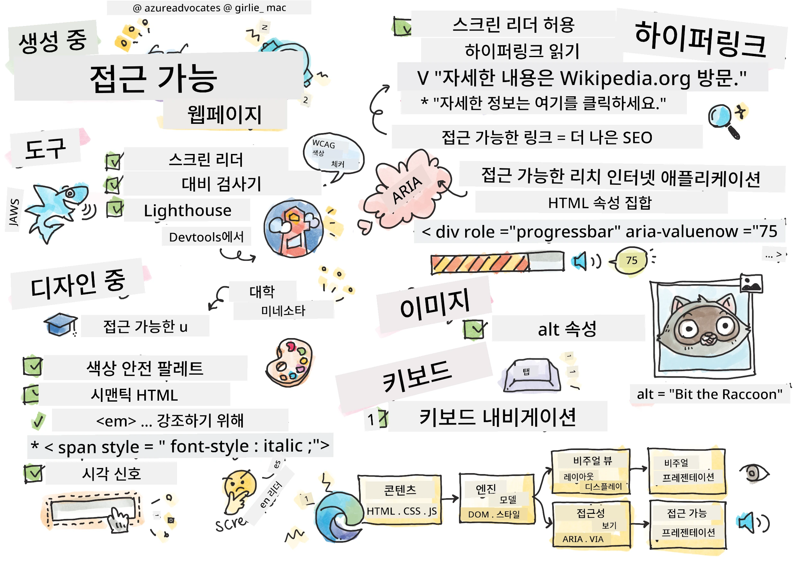
> 스케치노트 by [Tomomi Imura](https://twitter.com/girlie_mac)

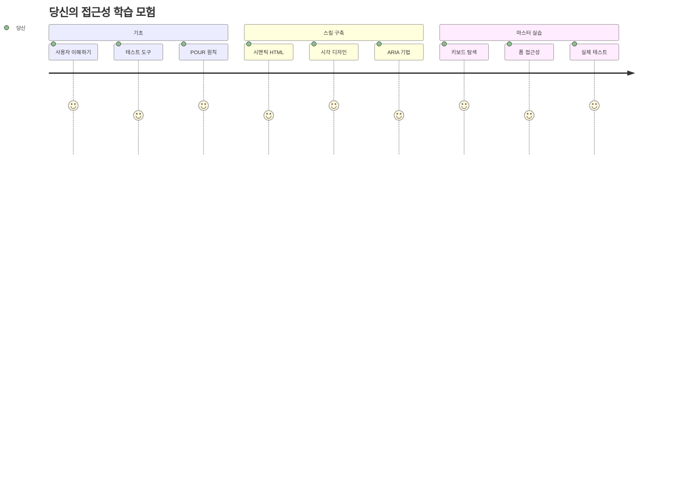
## 강의 전 퀴즈
[강의 전 퀴즈](https://ff-quizzes.netlify.app/web/)

> 웹의 힘은 보편성에 있습니다. 장애에 상관없이 누구나 접근할 수 있어야 한다는 것은 필수적인 측면입니다.
>
> \- Sir Timothy Berners-Lee, W3C 디렉터이자 월드 와이드 웹의 발명가

여기 놀랄 만한 사실이 있어요: 접근성 높은 웹사이트를 만들면 단지 장애가 있는 사람들만 돕는 게 아니라, 실제로 모두를 위한 더 나은 웹을 만드는 거예요!

길 모퉁이에 있는 그 경사로, 본래는 휠체어 이용자를 위해 설계되었지만 이제는 유모차를 밀고 다니는 사람, 배달 노동자의 카트, 여행객의 바퀴 달린 가방, 자전거 이용자에게도 도움을 줍니다. 바로 접근성 웹 디자인이 그런 식으로 작동하는 거죠—한 그룹을 돕는 해결책이 종종 모두에게 이롭게 작용한다는 의미입니다. 멋지죠?

이번 강의에서는 누구든지 어떤 방식으로 웹을 탐색하든 제대로 작동하는 웹사이트를 만드는 방법을 살펴봅니다. 이미 웹 표준에 내장된 실용적인 기법을 발견하고, 테스트 도구를 직접 사용해 보며, 접근성이 모든 사용자에게 사이트를 더 사용하기 쉽도록 만드는 방법을 체험할 거예요.

이 강의를 마치면 접근성을 개발 워크플로우에 자연스럽게 통합할 수 있는 자신감이 생길 것입니다. 사려 깊은 디자인 선택이 어떻게 수십억 사용자가 웹에 접근할 수 있게 열어주는지 탐험할 준비 되셨나요? 함께 시작해 봅시다!

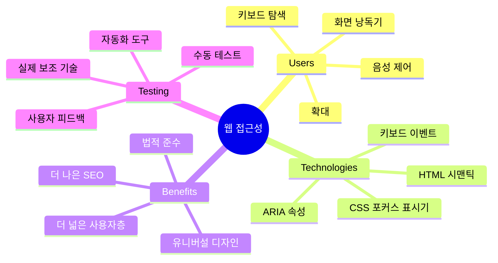
> 이 강의는 [Microsoft Learn](https://docs.microsoft.com/learn/modules/web-development-101/accessibility/?WT.mc_id=academic-77807-sagibbon)에서 수강할 수 있습니다!

## 보조 기술 이해하기

코딩에 들어가기 전에, 다양한 능력을 가진 사람들이 실제로 웹을 어떻게 경험하는지 잠시 알아봅시다. 이건 단순한 이론이 아니라—이런 실제 탐색 패턴을 이해하면 훨씬 더 뛰어난 개발자가 될 수 있어요!

보조 기술은 장애가 있는 사람들이 웹사이트와 상호작용하도록 돕는 놀라운 도구입니다. 이런 기술들이 어떻게 작동하는지 익히면, 접근성 높은 웹 경험을 만드는 것은 훨씬 직관적이 됩니다. 마치 다른 사람의 눈으로 코드를 보는 법을 배우는 것과 같습니다.

### 화면 낭독기

[화면 낭독기](https://en.wikipedia.org/wiki/Screen_reader)는 디지털 텍스트를 음성이나 점자 출력으로 변환하는 꽤 정교한 기술입니다. 주로 시각 장애인이 사용하지만, 난독증 같은 학습 장애가 있는 사용자에게도 매우 도움이 됩니다.

저는 화면 낭독기를 똑똑한 해설자가 책을 읽어주는 것이라고 생각합니다. 내용은 논리적 순서로 읽어주고, "버튼"이나 "링크" 같은 상호작용 요소를 알리며, 페이지를 빠르게 이동할 수 있도록 키보드 단축키를 제공합니다. 하지만 여기 중요한 점은—화면 낭독기가 제대로 작동하려면 우리가 웹사이트를 올바른 구조와 의미 있는 내용으로 만들어야 한다는 점입니다. 바로 여러분 개발자의 역할이에요!

**플랫폼별 인기 화면 낭독기:**
- **윈도우**: [NVDA](https://www.nvaccess.org/about-nvda/) (무료이자 가장 인기), [JAWS](https://webaim.org/articles/jaws/), [Narrator](https://support.microsoft.com/windows/complete-guide-to-narrator-e4397a0d-ef4f-b386-d8ae-c172f109bdb1/?WT.mc_id=academic-77807-sagibbon) (내장)
- **macOS/iOS**: [VoiceOver](https://support.apple.com/guide/voiceover/welcome/10) (내장 및 매우 강력)
- **안드로이드**: [TalkBack](https://support.google.com/accessibility/android/answer/6283677) (내장)
- **리눅스**: [Orca](https://wiki.gnome.org/Projects/Orca) (무료 오픈소스)

**화면 낭독기의 웹 콘텐츠 탐색 방법:**

화면 낭독기는 숙련된 사용자가 효율적으로 탐색할 수 있도록 여러 가지 방법을 제공합니다:
- **순차 읽기**: 책을 읽듯이 위에서 아래로 내용 읽기
- **랜드마크 탐색**: 페이지 구역(header, nav, main, footer) 간 빠르게 이동
- **헤딩 탐색**: 제목 간 건너뛰면서 페이지 구조 파악
- **링크 목록**: 모든 링크 목록 생성 후 빠르게 접근
- **폼 컨트롤**: 입력 필드와 버튼 사이를 직접 탐색

> 💡 **정말 놀라운 사실**: 화면 낭독기 사용자 중 68%가 주로 헤딩을 이용해 탐색합니다 ([WebAIM 설문조사](https://webaim.org/projects/screenreadersurvey9/#finding)). 즉, 당신의 헤딩 구조는 사용자에게 일종의 길잡이 지도가 되는 셈입니다—잘 만들면 사용자가 콘텐츠를 훨씬 빠르게 찾도록 돕는다는 뜻이죠!

### 테스트 워크플로우 구축하기

좋은 소식입니다—효과적인 접근성 테스트는 부담스러울 필요가 없어요! 자동화 도구(명백한 문제 발견에 탁월함)와 직접 테스트를 병행하면 됩니다. 제가 효과적이라고 생각하는 체계적인 방법은 다음과 같으며, 하루 종일 시간을 빼앗기지 않고도 많은 문제를 발견할 수 있어요:

**필수 수동 테스트 워크플로우:**

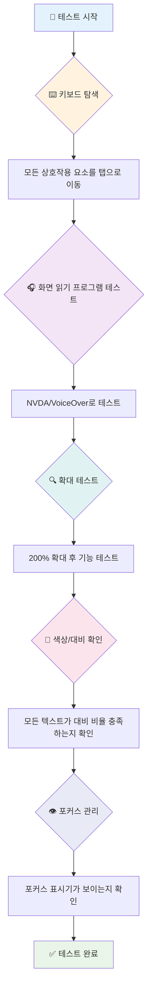
**단계별 테스트 체크리스트:**
1. **키보드 탐색**: Tab, Shift+Tab, Enter, Space, 화살표 키만 사용
2. **화면 낭독기 테스트**: NVDA, VoiceOver, Narrator 활성화 후 눈 감고 탐색 시도
3. **확대 테스트**: 200% 및 400% 배율에서 테스트
4. **색상 대비 확인**: 모든 텍스트 및 UI 요소 점검
5. **포커스 표시 테스트**: 모든 상호작용 요소가 눈에 띄는 포커스 상태인지 확인

✅ **Lighthouse로 시작하기**: 브라우저 개발자 도구에서 Lighthouse 접근성 감사를 실행한 후 결과를 참고해 수동 테스트 초점 영역을 정하세요.

### 확대 및 돋보기 도구

휴대폰에서 텍스트가 너무 작을 때 핀치 줌 하거나, 밝은 햇빛 아래서 노트북 화면을 찡그려 본 경험 있죠? 많은 사용자가 매일 콘텐츠를 읽기 쉽게 확대 도구를 사용합니다. 저시력자, 고령자, 야외에서 웹사이트를 읽으려는 사람 모두 포함됩니다.

현대 확대 기술은 단순히 크기를 키우는 것을 넘어 발전했습니다. 이 도구들이 어떻게 작동하는지 이해하면, 어떤 확대 수준에서도 기능적이고 매력적인 반응형 디자인을 만들 수 있어요.

**현대 브라우저 확대 기능:**
- **페이지 확대**: 텍스트, 이미지, 레이아웃 등 모든 콘텐츠를 비례 확대—가장 권장되는 방법
- **텍스트 전용 확대**: 원래 레이아웃은 유지하면서 폰트 크기만 커짐
- **핀치 투 줌**: 모바일 제스처로 임시 확대 지원
- **브라우저 지원**: 모든 최신 브라우저가 500%까지 확대해도 기능 깨지지 않음

**특수 확대 소프트웨어:**
- **윈도우**: [Magnifier](https://support.microsoft.com/windows/use-magnifier-to-make-things-on-the-screen-easier-to-see-414948ba-8b1c-d3bd-8615-0e5e32204198) (내장), [ZoomText](https://www.freedomscientific.com/training/zoomtext/getting-started/)
- **macOS/iOS**: [Zoom](https://www.apple.com/accessibility/mac/vision/) (내장, 고급 기능 포함)

> ⚠️ **설계 고려사항**: WCAG는 콘텐츠가 200% 확대 시에도 제대로 작동할 것을 요구합니다. 이 경우 가로 스크롤은 최소화하고, 모든 상호작용 요소가 접근 가능해야 합니다.

✅ **반응형 디자인 테스트**: 브라우저 확대를 200%와 400%로 설정해보세요. 레이아웃이 자연스럽게 조정되나요? 불필요한 스크롤 없이 모든 기능에 접근할 수 있나요?

## 최신 접근성 테스트 도구

이제 사람들이 보조 기술로 웹을 어떻게 탐색하는지 이해했으니, 접근성 높은 웹사이트를 구축하고 테스트하는 데 도움이 되는 도구들을 살펴봅시다.

비유하자면 자동화 도구는 명백한 문제(예: 누락된 alt 텍스트)를 잘 찾아내고, 직접 테스트는 실제로 사이트 사용 감각을 확인하는 역할을 합니다. 둘이 함께 작동해야 모두가 사용할 수 있는 사이트를 만들 수 있어요.

### 색상 대비 테스트

좋은 소식: 색상 대비는 가장 흔한 접근성 문제 중 하나이지만, 동시에 가장 쉽게 고칠 수 있기도 합니다. 적절한 대비는 시각 장애인뿐 아니라 해변에서 휴대폰을 읽는 사람 등 모두에게 이익이 됩니다.

**WCAG 대비 기본 요구사항:**

| 텍스트 유형 | WCAG AA (최소) | WCAG AAA (향상) |
|-------------|----------------|------------------|
| **일반 텍스트** (18pt 미만) | 4.5:1 대비 비율 | 7:1 대비 비율 |
| **큰 텍스트** (18pt 이상 혹은 14pt 이상 볼드) | 3:1 대비 비율 | 4.5:1 대비 비율 |
| **UI 구성 요소** (버튼, 폼 경계 등) | 3:1 대비 비율 | 3:1 대비 비율 |

**필수 테스트 도구:**
- [Colour Contrast Analyser](https://www.tpgi.com/color-contrast-checker/) - 색상 선택 기능 있는 데스크톱 앱
- [WebAIM Contrast Checker](https://webaim.org/resources/contrastchecker/) - 웹 기반, 즉시 피드백 제공
- [Stark](https://www.getstark.co/) - Figma, Sketch, Adobe XD 용 디자인 도구 플러그인
- [Accessible Colors](https://accessible-colors.com/) - 접근성 있는 색상 팔레트 찾기

✅ **더 나은 색상 팔레트 만들기**: 브랜드 색상을 기준으로 대비 검사 도구를 사용해 접근성 있는 변형을 만드세요. 이런 변형을 디자인 시스템의 접근성 색상 토큰으로 문서화하세요.

### 종합적인 접근성 감사

가장 효과적인 접근성 테스트는 여러 접근법을 결합합니다. 단일 도구가 모든 것을 잡아내지 못하므로, 다양한 방법을 활용해 테스트 루틴을 만드는 것이 철저한 검증을 보장합니다.

**브라우저 내장 테스트(개발자 도구):**
- **크롬/엣지**: Lighthouse 접근성 감사 + 접근성 패널
- **파이어폭스**: 상세 트리 뷰가 있는 접근성 인스펙터
- **사파리**: VoiceOver 시뮬레이션이 포함된 웹 인스펙터 감사 탭

**전문 테스트 확장 프로그램:**
- [axe DevTools](https://www.deque.com/axe/devtools/) - 업계 표준 자동화 테스트
- [WAVE](https://wave.webaim.org/extension/) - 시각적 피드백 및 오류 하이라이트
- [Accessibility Insights](https://accessibilityinsights.io/) - 마이크로소프트의 종합 테스트 스위트

**명령줄 및 CI/CD 통합:**
- [axe-core](https://github.com/dequelabs/axe-core) - 자동화 테스트용 자바스크립트 라이브러리
- [Pa11y](https://pa11y.org/) - 명령줄 접근성 테스트 도구
- [Lighthouse CI](https://github.com/GoogleChrome/lighthouse-ci) - 자동화 접근성 점수 측정

> 🎯 **테스트 목표**: Lighthouse 접근성 점수 95+를 목표로 하세요. 자동화 도구는 약 30-40%의 문제만 잡아내므로 수동 테스트가 여전히 필수입니다!

### 🧠 **테스트 기술 점검: 문제 찾을 준비 되셨나요?**

**접근성 테스트에 대해 어떻게 느끼시는지 확인해 봅시다:**
- 지금 가장 접근하기 쉬운 테스트 방법은 무엇인가요?
- 하루 종일 키보드만 사용해 탐색할 수 있을 것 같나요?
- 온라인에서 개인적으로 경험한 접근성 장벽은 무엇인가요?

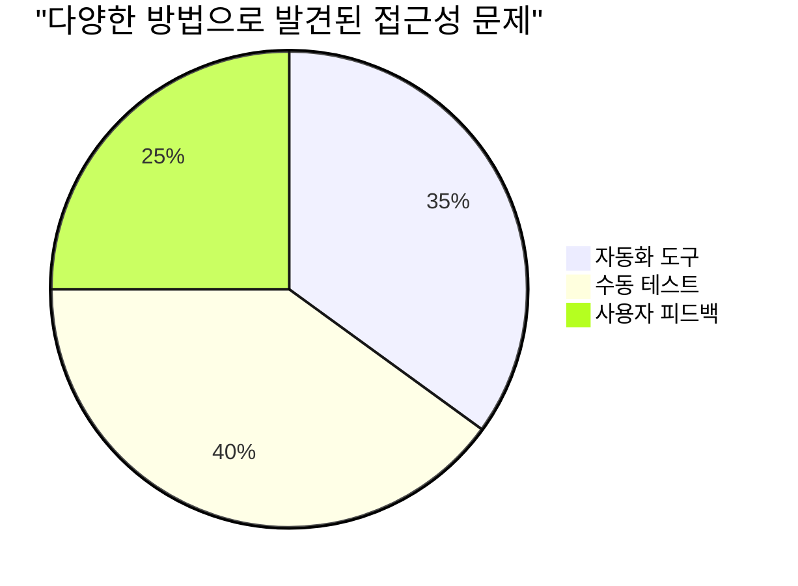
> **자신감 상승 팁**: 전문 접근성 테스터들이 바로 이 조합을 사용합니다. 여러분도 업계 표준 관행을 배우고 있는 셈이죠!

## 처음부터 접근성 구축하기

접근성 성공의 핵심은 처음부터 토대에 반영하는 것입니다. "나중에 접근성을 추가하면 되겠지" 하는 생각은, 이미 지어진 집에 경사로를 붙이려는 것과 같습니다. 가능은 하지만 쉽지 않죠.

접근성을 집 설계와 비슷하게 생각하세요—처음 건축 계획 단계에서 휠체어 접근성을 포함하는 게, 나중에 다시 공사를 하는 것보다 훨씬 쉽습니다.

### POUR 원칙: 접근성의 기초

웹 콘텐츠 접근성 가이드라인(WCAG)은 POUR라는 네 가지 기본 원칙으로 구성되어 있습니다. 걱정 마세요—딱딱한 학술 이론이 아니라 모두를 위한 콘텐츠를 만드는 실용적인 가이드라인입니다.

POUR 원칙을 익히면 접근성 결정을 훨씬 직관적으로 내릴 수 있습니다. 설계 선택을 안내하는 마음속 체크리스트 같은 느낌이죠. 하나씩 살펴봅시다:

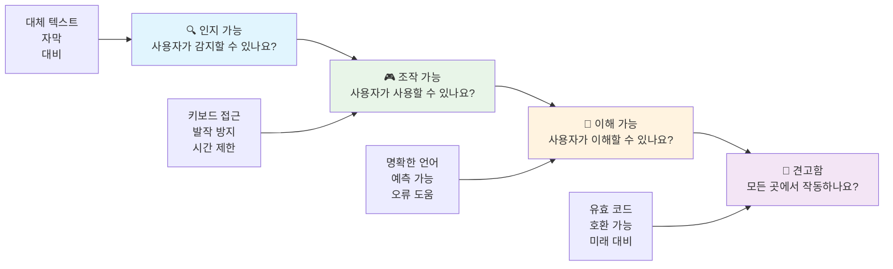
**🔍 인지 가능(Perceivable)**: 사용자가 자신의 감각으로 인지할 수 있는 방식으로 정보 제공

- 텍스트가 아닌 콘텐츠(이미지, 비디오, 오디오)에 텍스트 대체 수단 제공
- 모든 텍스트 및 UI 구성요소에 충분한 색상 대비 확보
- 멀티미디어 콘텐츠에 캡션과 전사 제공
- 내용이 200% 확대 시에도 기능 유지하도록 설계
- 정보를 전달할 때 여러 감각적 특성(색상만 사용하는 것이 아님) 활용

**🎮 조작 가능(Operable)**: 모든 인터페이스 요소가 사용 가능한 입력 방법으로 조작 가능해야 함

- 키보드 탐색만으로도 모든 기능에 접근 가능하게 하기
- 사용자가 읽고 상호작용할 충분한 시간 제공
- 발작이나 전정 장애를 유발할 수 있는 콘텐츠 피하기
- 명확한 구조와 랜드마크로 효율적 탐색 지원
- 상호작용 요소의 목표 크기 최소 44px 확보

**📖 이해 가능(Understandable)**: 정보와 UI 작동 방식이 명확하고 이해하기 쉬워야 함

- 청중에게 적절한 명확하고 단순한 언어 사용
- 내용이 예측 가능하고 일관된 방식으로 표시 및 작동되도록 하기
- 사용자 입력에 대한 명확한 지침 및 오류 메시지 제공
- 사용자 실수를 이해하고 수정하도록 도움 제공
- 논리적 읽기 순서와 정보 계층 구조로 콘텐츠 구성

**💪 견고함(Robust)**: 다양한 기술과 보조 기기에서 콘텐츠가 안정적으로 작동해야 함

- **유효하고 시맨틱한 HTML을 기초로 사용하기**
- **현재 및 미래의 보조 기술과 호환성 확보**
- **코딩 시 웹 표준과 모범 사례 준수하기**
- **다양한 브라우저, 기기 및 지원 도구에서 테스트하세요**
- **고급 기능이 지원되지 않을 때도 콘텐츠가 자연스럽게 동작하도록 구조화하세요**

### 🎯 **POUR 원칙 점검: 확실히 익히기**

**기본 개념에 대한 빠른 성찰:**
- 각 POUR 원칙을 충족하지 못하는 웹사이트 기능을 생각해 본 적 있나요?
- 개발자로서 어떤 원칙이 가장 자연스럽게 느껴지나요?
- 이 원칙들이 장애가 있는 사용자뿐 아니라 모든 사람의 디자인을 어떻게 개선할 수 있을까요?

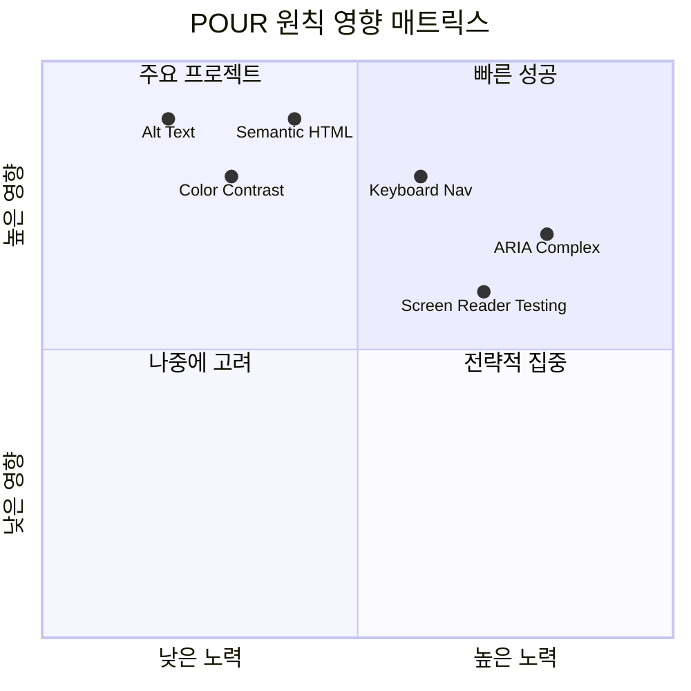
> **기억하세요**: 영향력이 크고 노력이 적은 개선부터 시작하세요. 시맨틱 HTML과 alt 텍스트는 최소한의 노력으로 최대의 접근성 향상을 제공합니다!

## 접근 가능한 시각 디자인 만들기

좋은 시각 디자인과 접근성은 함께 갑니다. 접근성을 염두에 두고 디자인하면 이러한 제약이 모든 사용자에게 혜택을 주는 더 깔끔하고 우아한 해결책으로 이어지는 경우가 많습니다.

시각적 능력이나 콘텐츠를 보는 조건에 관계없이 모두에게 잘 작동하는 시각적으로 매력적인 디자인을 만드는 방법을 살펴보겠습니다.

### 색상 및 시각적 접근성 전략

색상은 강력한 커뮤니케이션 수단이지만 중요한 정보를 전달하는 유일한 방법이 되어서는 안 됩니다. 색상을 넘어서서 디자인하는 것은 더 견고하고 포괄적인 경험을 창출하여 더 다양한 상황에서 작동합니다.

**색각 차이를 고려한 디자인:**

남성의 약 8%, 여성의 0.5%가 일종의 색각 차이(일명 '색맹')를 가지고 있습니다. 가장 흔한 유형은:
- **적녹색맹 (Deuteranopia)**: 빨간색과 녹색 구분 어려움
- **적색맹 (Protanopia)**: 빨간색이 더 어둡게 보임
- **황청색맹 (Tritanopia)**: 파랑과 노랑 구분 어려움 (희귀)

**포괄적인 색상 전략:**

```css
/* ❌ Bad: Using only color to indicate status */
.error { color: red; }
.success { color: green; }

/* ✅ Good: Color plus icons and context */
.error {
  color: #d32f2f;
  border-left: 4px solid #d32f2f;
}
.error::before {
  content: "⚠️";
  margin-right: 8px;
}

.success {
  color: #2e7d32;
  border-left: 4px solid #2e7d32;
}
.success::before {
  content: "✅";
  margin-right: 8px;
}
```

**기본 대비 요구 사항을 넘어서서:**
- 색맹 시뮬레이터로 색상 선택을 테스트하세요
- 색상 코드와 함께 패턴, 질감, 형태를 사용하세요
- 상호작용 상태가 색상 없이도 구분 가능하도록 하세요
- 고대비 모드에서 디자인이 어떻게 보이는지 고려하세요

✅ **색상 접근성 테스트**: [Coblis](https://www.color-blindness.com/coblis-color-blindness-simulator/)와 같은 도구를 사용하여 사용자가 색각 차이를 어떻게 보는지 확인하세요.

### 포커스 표시기 및 상호작용 디자인

포커스 표시기는 디지털 커서와 같아서 키보드 사용자가 현재 페이지에서 어디에 있는지 보여줍니다. 잘 디자인된 포커스 표시기는 모든 사용자가 상호작용을 명확하고 예측 가능하게 만드는 경험을 개선합니다.

**최신 포커스 표시기 모범 사례:**

```css
/* Enhanced focus styles that work across browsers */
button:focus-visible {
  outline: 2px solid #0066cc;
  outline-offset: 2px;
  box-shadow: 0 0 0 4px rgba(0, 102, 204, 0.25);
}

/* Remove focus outline for mouse users, preserve for keyboard users */
button:focus:not(:focus-visible) {
  outline: none;
}

/* Focus-within for complex components */
.card:focus-within {
  box-shadow: 0 0 0 3px rgba(74, 144, 164, 0.5);
  border-color: #4A90A4;
}

/* Ensure focus indicators meet contrast requirements */
.custom-focus:focus-visible {
  outline: 3px solid #ffffff;
  outline-offset: 2px;
  box-shadow: 0 0 0 6px #000000;
}
```

**포커스 표시기 요구 사항:**
- **가시성**: 주변 요소와 최소 3:1 대비 비율 유지
- **굵기**: 요소 전체를 둘러싸는 최소 2픽셀 두께
- **지속성**: 포커스가 이동할 때까지 표시 유지
- **구분성**: 다른 UI 상태와 명백히 구분되어야 함

> 💡 **디자인 팁**: 훌륭한 포커스 표시기는 윤곽선, 박스 그림자, 색상 변화를 결합해 다양한 배경과 상황에서 가시성을 확보합니다.

✅ **포커스 표시기 점검**: 웹사이트를 탭 키로 탐색하며 명확한 포커스 표시기가 있는지 확인하세요. 보기 어렵거나 전혀 없는 요소가 있나요?

### 시맨틱 HTML: 접근성의 기반

시맨틱 HTML은 보조 기술에 웹사이트의 GPS 역할을 합니다. 의도된 목적에 맞는 HTML 요소를 사용하면 스크린 리더, 키보드, 기타 도구에 효과적인 탐색을 위한 상세 지도를 제공하는 셈입니다.

제가 이해하기 쉬웠던 비유를 하나 드리자면, 시맨틱 HTML은 명확한 카테고리와 유용한 안내판이 있는 잘 정리된 도서관과 책이 무작위로 흩어져 있는 창고의 차이입니다. 두 곳 모두 같은 책들이 있지만 어느 쪽에서 더 쉽게 원하는 책을 찾을 수 있을까요? 당연히 도서관이겠죠!

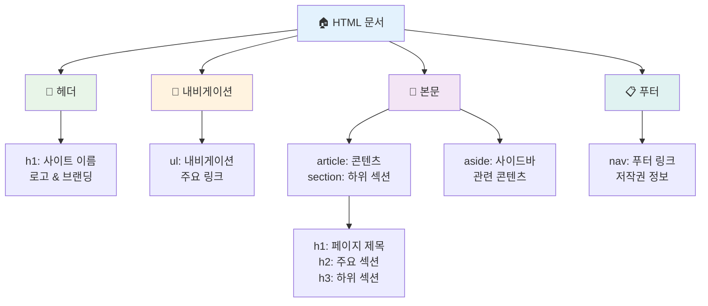
**접근 가능한 페이지 구조의 기본 구성 요소:**

```html
<!-- Landmark elements provide page navigation structure -->
<header>
  <h1>Your Site Name</h1>
  <nav aria-label="Main navigation">
    <ul>
      <li><a href="/home">Home</a></li>
      <li><a href="/about">About</a></li>
      <li><a href="/services">Services</a></li>
    </ul>
  </nav>
</header>

<main>
  <article>
    <header>
      <h1>Article Title</h1>
      <p>Published on <time datetime="2024-10-14">October 14, 2024</time></p>
    </header>
    
    <section>
      <h2>First Section</h2>
      <p>Content that relates to this section...</p>
    </section>
    
    <section>
      <h2>Second Section</h2>
      <p>More related content...</p>
    </section>
  </article>
  
  <aside>
    <h2>Related Links</h2>
    <nav aria-label="Related articles">
      <ul>
        <li><a href="/related-1">First related article</a></li>
        <li><a href="/related-2">Second related article</a></li>
      </ul>
    </nav>
  </aside>
</main>

<footer>
  <p>&copy; 2024 Your Site Name. All rights reserved.</p>
  <nav aria-label="Footer links">
    <ul>
      <li><a href="/privacy">Privacy Policy</a></li>
      <li><a href="/contact">Contact Us</a></li>
    </ul>
  </nav>
</footer>
```

**시맨틱 HTML이 접근성을 혁신하는 이유:**

| 시맨틱 요소 | 용도 | 스크린 리더 이점 |
|------------------|---------|----------------------|
| `<header>` | 페이지 또는 섹션의 헤더 | "배너 랜드마크" - 상단으로 빠르게 이동 |
| `<nav>` | 내비게이션 링크 | "내비게이션 랜드마크" - 내비게이션 섹션 목록 |
| `<main>` | 주요 페이지 콘텐츠 | "메인 랜드마크" - 콘텐츠로 바로 이동 |
| `<article>` | 독립적인 콘텐츠 | 아티클 경계 알림 |
| `<section>` | 주제별 콘텐츠 그룹 | 콘텐츠 구조 제공 |
| `<aside>` | 관련 사이드바 콘텐츠 | "보조 랜드마크" |
| `<footer>` | 페이지 또는 섹션의 푸터 | "콘텐츠 정보 랜드마크" |

**시맨틱 HTML이 선사하는 스크린 리더 슈퍼파워:**
- **랜드마크 내비게이션**: 주요 페이지 섹션 간 즉시 점프
- **헤딩 개요**: 헤딩 구조에서 목차 생성
- **요소 목록**: 모든 링크, 버튼, 폼 컨트롤 목록 만들기
- **컨텍스트 인식**: 콘텐츠 섹션 간 관계 이해

> 🎯 **간단 테스트**: NVDA/JAWS에서 랜드마크 단축키(D), 헤딩 단축키(H), 링크 단축키(K)로 사이트를 탐색해 보세요. 내비게이션이 논리적이고 이해가 되나요?

### 🏗️ **시맨틱 HTML 숙련도 점검: 견고한 기반 구축**

**시맨틱 이해도를 평가해 봅시다:**
- HTML만 보고 웹페이지 내 랜드마크를 식별할 수 있나요?
- `<section>`과 `<div>`의 차이를 친구에게 어떻게 설명하겠나요?
- 스크린 리더 사용자가 내비게이션 문제를 신고하면 가장 먼저 무엇을 확인하겠나요?

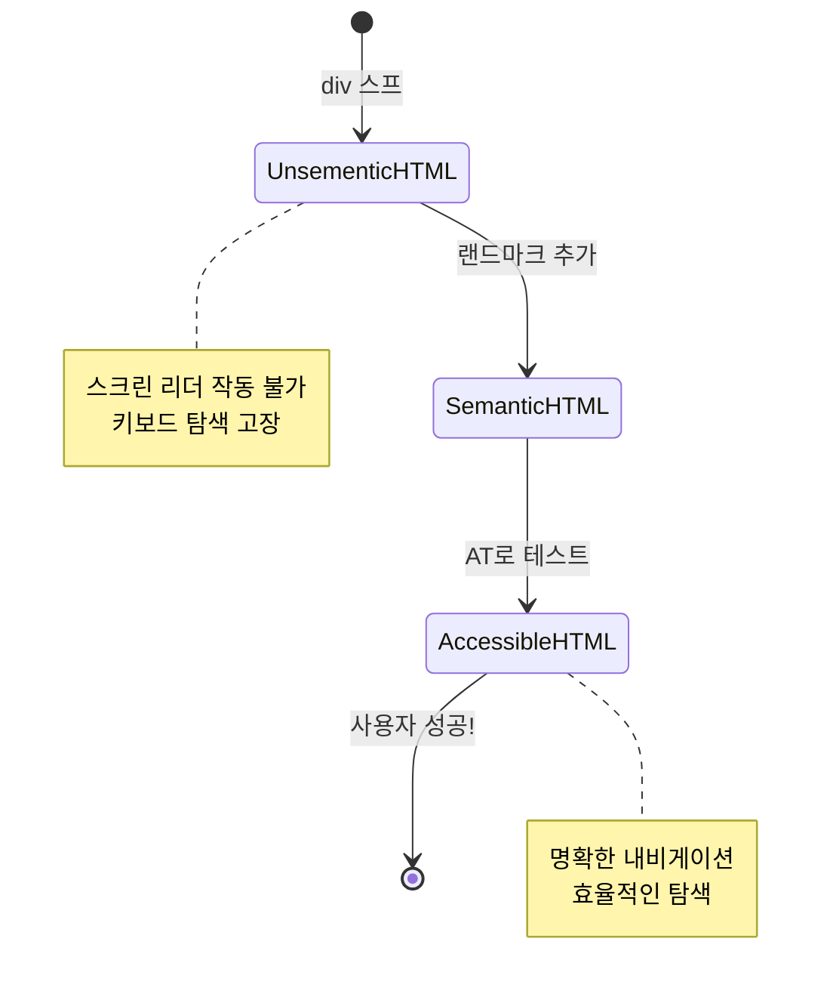
> **전문가 팁**: 좋은 시맨틱 HTML은 약 70%의 접근성 문제를 자동으로 해결합니다. 이 기초를 마스터하면 이미 훌륭한 출발선에 선 것입니다!

✅ **시맨틱 구조 점검**: 브라우저 개발자 도구의 접근성 패널을 사용해 접근성 트리를 보고 마크업이 논리적 구조를 만드는지 확인하세요.

### 헤딩 계층 구조: 논리적인 콘텐츠 개요 만들기

헤딩은 접근 가능한 콘텐츠에서 매우 중요하며, 모든 것을 연결하는 척추와 같습니다. 스크린 리더 사용자는 헤딩을 통해 콘텐츠를 이해하고 탐색합니다. 페이지를 위한 목차 역할을 한다고 생각하세요.

**헤딩의 황금률:**
레벨을 건너뛰지 마세요. 항상 `<h1>`에서 `<h2>`, `<h3>` 순으로 논리적으로 진행하세요. 학교에서 목차를 만들 때와 같은 원리입니다. "I. 주요 포인트"에서 바로 "C. 하위 하위 포인트"로 건너뛰지 않죠? 그 사이에 "A. 하위 포인트"가 있어야 합니다.

**완벽한 헤딩 구조 예시:**

```html
<!-- ✅ Excellent: Logical, hierarchical progression -->
<main>
  <h1>Complete Guide to Web Accessibility</h1>
  
  <section>
    <h2>Understanding Screen Readers</h2>
    <p>Introduction to screen reader technology...</p>
    
    <h3>Popular Screen Reader Software</h3>
    <p>NVDA, JAWS, and VoiceOver comparison...</p>
    
    <h3>Testing with Screen Readers</h3>
    <p>Step-by-step testing instructions...</p>
  </section>
  
  <section>
    <h2>Color and Contrast Guidelines</h2>
    <p>Designing with sufficient contrast...</p>
    
    <h3>WCAG Contrast Requirements</h3>
    <p>Understanding the different contrast levels...</p>
    
    <h3>Testing Tools and Techniques</h3>
    <p>Tools for verifying contrast ratios...</p>
  </section>
</main>
```

```html
<!-- ❌ Problematic: Skipping levels, inconsistent structure -->
<h1>Page Title</h1>
<h3>Subsection</h3> <!-- Skipped h2 -->
<h2>This should come before h3</h2>
<h1>Another main heading?</h1> <!-- Multiple h1s -->
```

**헤딩 모범 사례:**
- **페이지당 한 개의 `<h1>`**: 일반적으로 메인 페이지 제목이나 주요 콘텐츠 제목
- **논리적 진행**: 레벨을 건너뛰지 않기 (h1 → h2 → h3, h1 → h3 아님)
- **설명적 콘텐츠**: 문맥 없이도 의미가 전달되도록 제목 작성
- **CSS로 시각적 스타일링**: 구조는 HTML 레벨로, 외형은 CSS로 조정

**스크린 리더 내비게이션 통계:**
- 68%의 스크린 리더 사용자가 헤딩 단축키로 탐색 ([WebAIM 조사](https://webaim.org/projects/screenreadersurvey9/#finding))
- 사용자는 논리적인 헤딩 개요를 기대함
- 헤딩이 페이지 구조를 가장 빠르게 이해하는 방법

> 💡 **전문가 팁**: 브라우저 확장 프로그램 "HeadingsMap"을 사용해 헤딩 구조를 시각화하세요. 잘 정리된 목차처럼 보여야 합니다.

✅ **헤딩 구조 테스트**: 스크린 리더의 헤딩 탐색 기능(NVDA에서 H 키)으로 헤딩을 순차적으로 넘어가 보세요. 콘텐츠 이야기가 논리적으로 전개되나요?

### 고급 시각적 접근성 기법

대비 및 색상 기본 원칙을 넘어서, 진정으로 포괄적인 시각 경험을 만드는 정교한 기법들이 있습니다. 이러한 방법은 다양한 시청 조건과 보조 기술 전반에서 작동하는 콘텐츠를 보장합니다.

**필수 시각 커뮤니케이션 전략:**

- **다중 모달 피드백**: 시각적, 텍스트, 때로는 음성 신호 결합
- **점진적 공개**: 정보를 소화하기 쉬운 단위로 제공
- **일관된 상호작용 패턴**: 친숙한 UI 규칙 사용
- **반응형 타이포그래피**: 기기에 맞게 텍스트 크기 조정
- **로딩 및 오류 상태**: 모든 사용자 행동에 명확한 피드백 제공

**접근성 향상을 위한 CSS 유틸리티:**

```css
/* Screen reader only text - visually hidden but accessible */
.sr-only {
  position: absolute;
  width: 1px;
  height: 1px;
  padding: 0;
  margin: -1px;
  overflow: hidden;
  clip: rect(0, 0, 0, 0);
  white-space: nowrap;
  border: 0;
}

/* Skip link for keyboard navigation */
.skip-link {
  position: absolute;
  top: -40px;
  left: 6px;
  background: #000000;
  color: #ffffff;
  padding: 8px 16px;
  text-decoration: none;
  border-radius: 4px;
  font-weight: bold;
  transition: top 0.3s ease;
  z-index: 1000;
}

.skip-link:focus {
  top: 6px;
}

/* Reduced motion respect */
@media (prefers-reduced-motion: reduce) {
  .skip-link {
    transition: none;
  }
  
  * {
    animation-duration: 0.01ms !important;
    animation-iteration-count: 1 !important;
    transition-duration: 0.01ms !important;
  }
}

/* High contrast mode support */
@media (prefers-contrast: high) {
  .button {
    border: 2px solid;
  }
}
```

> 🎯 **접근성 패턴**: "스킵 링크"는 키보드 사용자에게 필수입니다. 페이지 내 첫 번째로 포커스 가능한 요소여야 하며 메인 콘텐츠 영역으로 바로 점프해야 합니다.

✅ **스킵 내비게이션 구현**: 페이지에 스킵 링크를 추가하고 페이지 로드 직후 Tab 키를 눌러 테스트하세요. 링크가 나타나 메인 콘텐츠로 점프할 수 있어야 합니다.

## 의미 있는 링크 텍스트 작성

링크는 웹의 고속도로와 같습니다. 그런데 링크 텍스트가 형편없으면 도로 표지판에 '장소'라고만 적혀 있는 것과 같습니다. 별로 도움이 안 되죠?

제가 처음 배웠을 때 놀랐던 점은, 스크린 리더가 페이지 내 모든 링크를 추출해 한꺼번에 목록으로 보여준다는 것입니다. 만약 한 사람이 당신의 페이지 링크 목록을 받는다면 각각의 링크가 혼자서도 의미가 있을까요? 바로 그것이 링크 텍스트가 통과해야 할 시험입니다!

### 링크 내비게이션 패턴 이해하기

스크린 리더는 잘 작성된 링크 텍스트에 의존하는 강력한 링크 탐색 기능을 제공합니다:

**링크 내비게이션 방법:**
- **순차 읽기**: 콘텐츠 흐름 내에서 링크가 문맥과 함께 읽힘
- **링크 목록 생성**: 모든 페이지 링크를 검색 가능한 디렉토리로 제공
- **빠른 탐색**: 키보드 단축키(NVDA에서 K)로 링크 간 점프 가능
- **검색 기능**: 일부 텍스트 입력으로 특정 링크 찾기

**문맥의 중요성:**
스크린 리더 사용자가 링크 목록을 생성하면 다음과 같은 항목들이 보입니다:
- "보고서 다운로드"
- "더 알아보기"
- "여기를 클릭"
- "개인정보처리방침"
- "여기를 클릭"

이 중 문맥 없이 유용한 정보를 주는 링크는 겨우 두 개뿐입니다!

> 📊 **사용자 영향**: 스크린 리더 사용자는 링크 목록을 스캔해 페이지 내용을 빠르게 이해합니다. 일반적인 링크 텍스트는 사용자가 링크의 문맥으로 되돌아가게 만들어 탐색 속도를 크게 저하시킵니다.

### 피해야 할 흔한 링크 텍스트 실수

무엇이 작동하지 않는지 이해하면 기존 콘텐츠의 접근성 문제를 인식하고 해결할 수 있습니다.

**❌ 문맥이 없는 일반적인 링크 텍스트:**

```html
<!-- Meaningless when read from a link list -->
<p>Our sustainability efforts are detailed in our recent report. 
   <a href="/sustainability-2024.pdf">Click here</a> to view it.</p>

<!-- Repeated generic text throughout the page -->
<div class="article-card">
  <h3>Web Accessibility Guide</h3>
  <p>Learn the fundamentals...</p>
  <a href="/accessibility-guide">Read more</a>
</div>
<div class="article-card">
  <h3>Color Contrast Tips</h3>
  <p>Improve your design...</p>
  <a href="/color-contrast">Read more</a>
</div>

<!-- URLs as link text (difficult for screen readers to announce) -->
<p>Visit https://www.w3.org/WAI/WCAG21/quickref/ for WCAG guidelines.</p>

<!-- Vague action words -->
<a href="/contact">Go</a> | <a href="/about">See</a> | <a href="/help">View</a>
```

**이 패턴들이 실패하는 이유:**
- **"여기를 클릭"**은 목적지를 아무것도 알려주지 않음
- **"더 읽기"**가 여러 번 반복되면 혼란을 초래
- **원시 URL**은 스크린 리더가 명확히 발음하기 어려움
- **"가기", "보기" 같은 단어**는 설명이 부족함

### 뛰어난 링크 텍스트 작성법

설명적인 링크 텍스트는 모두에게 이롭습니다—시각 사용자는 링크를 빠르게 스캔할 수 있고 스크린 리더 사용자는 즉시 목적지를 이해합니다.

**✅ 명확하고 설명적인 링크 텍스트 예:**

```html
<!-- Descriptive text that explains the destination -->
<p>Our comprehensive <a href="/sustainability-2024.pdf">2024 sustainability report (PDF, 2.1MB)</a> details our environmental initiatives.</p>

<!-- Specific, unique link text for each card -->
<div class="article-card">
  <h3>Web Accessibility Guide</h3>
  <p>Learn the fundamentals of inclusive design...</p>
  <a href="/accessibility-guide">Read our complete web accessibility guide</a>
</div>
<div class="article-card">
  <h3>Color Contrast Tips</h3>
  <p>Improve your design with better color choices...</p>
  <a href="/color-contrast">Explore color contrast best practices</a>
</div>

<!-- Meaningful text instead of raw URLs -->
<p>The <a href="https://www.w3.org/WAI/WCAG21/quickref/">WCAG 2.1 Quick Reference guide</a> provides comprehensive accessibility guidelines.</p>

<!-- Descriptive action links -->
<a href="/contact">Contact our support team</a> | 
<a href="/about">About our company</a> | 
<a href="/help">Get help with your account</a>
```

**링크 텍스트 모범 사례:**
- **구체적으로 작성**: "분기별 재무 보고서 다운로드" vs "다운로드"
- **파일 유형 및 크기 포함**: 다운로드 파일에는 "(PDF, 1.2MB)" 등 명시
- **외부 링크임을 언급**: 적절할 때 "(새 창에서 열림)" 표시
- **능동적인 언어 사용**: "문의하기" vs "문의 페이지"
- **간결하게 유지**: 가급적 2~8단어 사이로

### 고급 링크 접근성 패턴

때로는 시각적 디자인 제약이나 기술적 요구로 특수한 솔루션이 필요합니다. 흔한 어려운 상황에 대한 정교한 기법을 소개합니다:

**강화된 문맥 제공을 위한 ARIA 사용:**

```html
<!-- When button text must be short but needs more context -->
<a href="/report.pdf" 
   aria-label="Download 2024 annual financial report, PDF format, 2.3MB">
  Download Report
</a>

<!-- When the full context comes from surrounding content -->
<h3 id="sustainability-heading">Sustainability Initiative</h3>
<p>Our efforts to reduce environmental impact...</p>
<a href="/sustainability-details" 
   aria-labelledby="sustainability-heading"
   aria-describedby="sustainability-summary">
  Learn more
</a>
<p id="sustainability-summary">Detailed breakdown of our 2024 environmental goals and achievements</p>
```

**파일 유형 및 외부 목적지 표시법:**

```html
<!-- Method 1: Include information in visible link text -->
<a href="/annual-report.pdf">
  Download our 2024 annual report (PDF, 2.3MB)
</a>

<!-- Method 2: Use screen reader-only text for file details -->
<a href="/annual-report.pdf">
  Download our 2024 annual report
  <span class="sr-only">(PDF format, 2.3MB)</span>
</a>

<!-- Method 3: External link indication -->
<a href="https://example.com" 
   target="_blank" 
   aria-describedby="external-link-warning">
  Visit external resource
</a>
<span id="external-link-warning" class="sr-only">
  (opens in new window)
</span>

<!-- Method 4: Using CSS for visual indicators -->
<a href="https://example.com" class="external-link">
  External resource
</a>
```

```css
/* Visual indicator for external links */
.external-link::after {
  content: " ↗";
  font-size: 0.8em;
  color: #666;
}

/* Screen reader announcement for external links */
.external-link::before {
  content: "External link: ";
  position: absolute;
  left: -10000px;
  width: 1px;
  height: 1px;
  overflow: hidden;
}
```

> ⚠️ **중요**: `target="_blank"`를 사용할 때는 링크가 새 창이나 탭에서 열림을 항상 사용자에게 알려야 합니다. 예상치 못한 탐색 변화는 혼란을 줄 수 있습니다.

✅ **링크 문맥 테스트**: 브라우저 개발자 도구를 사용해 페이지 내 모든 링크 목록을 생성해 보세요. 주변 문맥 없이 각 링크의 목적을 이해할 수 있나요?

## ARIA: HTML 접근성 슈퍼차저

[접근 가능한 풍부 인터넷 애플리케이션(ARIA)](https://developer.mozilla.org/docs/Web/Accessibility/ARIA)는 복잡한 웹 애플리케이션과 보조 기술 사이의 범용 번역기와 같습니다. HTML만으로는 표현할 수 없는 인터랙티브 컴포넌트 동작을 ARIA가 보완해 줍니다.

저는 ARIA를 HTML에 도움이 되는 주석을 다는 것과 비슷하게 생각합니다—극본에 배우들이 역할과 관계를 이해하도록 해주는 무대 지시문과 같습니다.

**ARIA에 관한 가장 중요한 규칙은**: 항상 시맨틱 HTML을 먼저 사용하고 ARIA는 그 위에 보완적으로 추가해야 합니다. ARIA는 양념일 뿐 주 요리가 아닙니다. HTML 구조를 명확하게 하고 향상시켜야 하며 절대 대체해서는 안 됩니다. 기초를 먼저 제대로 다지세요!

### ARIA 전략적 구현

ARIA는 강력하지만 책임도 따릅니다. 잘못된 ARIA 사용은 접근성을 더욱 나쁘게 만들 수 있습니다. 언제, 어떻게 효과적으로 사용할까요?

**✅ ARIA를 사용해야 할 때:**
- 사용자 정의 인터랙티브 위젯(아코디언, 탭, 캐러셀) 제작 시
- 페이지 리로드 없이 콘텐츠가 동적으로 변할 때
- 복잡한 UI 관계에 추가 문맥 제공 시
- 로딩 상태 또는 실시간 콘텐츠 업데이트 표현 시
- 사용자 정의 컨트롤을 가진 앱 유사 인터페이스 제작 시

**❌ ARIA 사용을 피해야 할 때:**
- 표준 HTML 요소가 이미 필요한 시맨틱을 제공할 때
- 올바른 구현 방법을 모를 때
- 시맨틱 HTML이 이미 제공하는 정보를 중복할 때
- 실제 보조 기술로 테스트하지 않았을 때

> 🎯 **ARIA 황금률**: "필요한 경우에만 시맨틱 변경, 항상 키보드 접근성 보장, 실제 보조 기술로 테스트하기."
**ARIA의 다섯 가지 범주:**

1. **역할(Roles)**: 이 요소는 무엇인가? (`button`, `tab`, `dialog`)
2. **속성(Properties)**: 특징은 무엇인가? (`aria-required`, `aria-haspopup`)
3. **상태(States)**: 현재 상태는 어떠한가? (`aria-expanded`, `aria-checked`)
4. **랜드마크(Landmarks)**: 페이지 구조에서 어디에 위치하는가? (`banner`, `navigation`, `main`)
5. **라이브 영역(Live regions)**: 변경 사항이 어떻게 발표되어야 하는가? (`aria-live`, `aria-atomic`)

### 현대 웹 앱을 위한 필수 ARIA 패턴

이 패턴들은 대화형 웹 애플리케이션에서 가장 흔한 접근성 문제를 해결합니다:

**요소 이름 지정 및 설명:**

```html
<!-- aria-label: Provides accessible name when visible text isn't sufficient -->
<button aria-label="Close newsletter subscription dialog">×</button>

<!-- aria-labelledby: References existing text as the accessible name -->
<section aria-labelledby="news-heading">
  <h2 id="news-heading">Latest News</h2>
  <!-- news content -->
</section>

<!-- aria-describedby: Links to additional descriptive text -->
<input type="password" 
       aria-describedby="pwd-requirements pwd-strength"
       required>
<div id="pwd-requirements">
  Password must contain at least 8 characters, including uppercase, lowercase, and numbers.
</div>
<div id="pwd-strength" aria-live="polite">
  <!-- Dynamic password strength indicator -->
</div>
```

**동적 콘텐츠를 위한 라이브 영역:**

```html
<!-- Polite announcements (don't interrupt current speech) -->
<div aria-live="polite" id="status-updates">
  <!-- Status messages appear here -->
</div>

<!-- Assertive announcements (interrupt and announce immediately) -->
<div aria-live="assertive" id="urgent-alerts">
  <!-- Error messages and critical alerts -->
</div>

<!-- Loading states with live regions -->
<button id="submit-btn" aria-describedby="loading-status">
  Submit Application
</button>
<div id="loading-status" aria-live="polite" aria-atomic="true">
  <!-- "Processing your application..." appears here -->
</div>
```

**대화형 위젯 예제 (아코디언):**

```html
<div class="accordion">
  <h3>
    <button aria-expanded="false" 
            aria-controls="panel-1" 
            id="accordion-trigger-1"
            class="accordion-trigger">
      Accessibility Guidelines
    </button>
  </h3>
  <div id="panel-1" 
       role="region"
       aria-labelledby="accordion-trigger-1" 
       hidden>
    <p>WCAG 2.1 provides comprehensive guidelines...</p>
  </div>
</div>
```

```javascript
// 아코디언 상태를 관리하는 자바스크립트
function toggleAccordion(trigger) {
  const panel = document.getElementById(trigger.getAttribute('aria-controls'));
  const isExpanded = trigger.getAttribute('aria-expanded') === 'true';
  
  // 상태 전환
  trigger.setAttribute('aria-expanded', !isExpanded);
  panel.hidden = isExpanded;
  
  // 화면 낭독기에 변경 사항 알리기
  const status = document.getElementById('status-updates');
  status.textContent = isExpanded ? 'Section collapsed' : 'Section expanded';
}
```

### ARIA 구현 모범 사례

ARIA는 강력하지만 신중한 구현이 필요합니다. 다음 지침을 따르면 ARIA가 접근성을 향상시키고 방해하지 않도록 할 수 있습니다:

**🛡️ 핵심 원칙:**

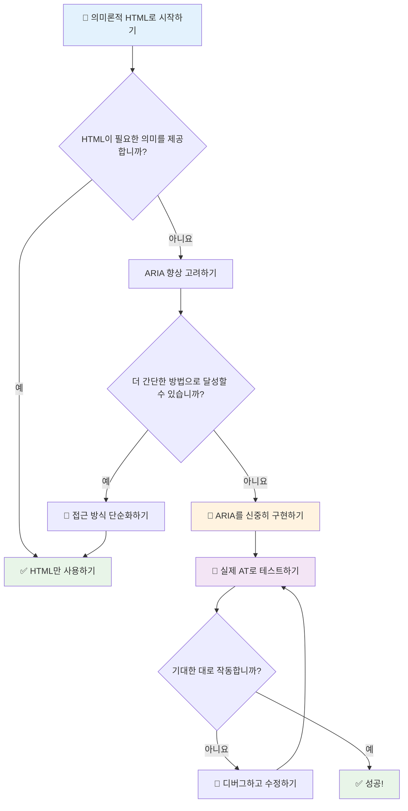
1. **먼저 의미론적 HTML 사용**: 항상 `<button>`을 `<div role="button">`보다 선호하세요
2. **의미론 깨뜨리지 말기**: 기존 HTML 의미를 절대 덮어쓰지 마세요 (`<h1 role="button">` 피하기)
3. **키보드 접근성 유지**: 모든 대화형 ARIA 요소는 완벽하게 키보드로 접근 가능해야 합니다
4. **실제 사용자와 테스트**: ARIA 지원은 보조 기술마다 크게 다릅니다
5. **단순하게 시작하기**: 복잡한 ARIA 구현은 오류 발생 가능성이 높습니다

**🔍 테스트 워크플로우:**

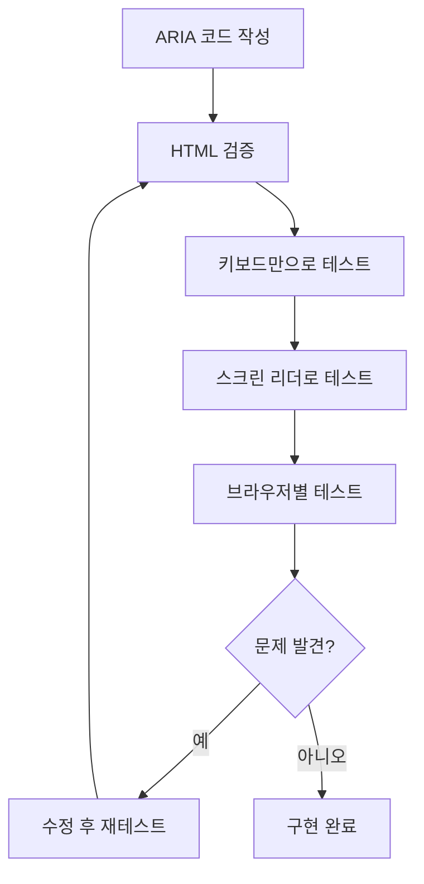
**🚫 피해야 할 일반적인 ARIA 실수:**

- **모순되는 정보**: HTML 의미론과 모순되지 않도록
- **과도한 레이블링**: 너무 많은 ARIA 정보는 사용자를 혼란스럽게 함
- **정적인 ARIA**: 콘텐츠 변경 시 ARIA 상태를 업데이트하지 않음
- **테스트되지 않은 구현**: 이론에서는 작동하지만 실제에서는 실패하는 ARIA
- **키보드 지원 누락**: 키보드 상호작용 없는 ARIA 역할

> 💡 **테스트 자료**: [accessibility-checker](https://www.npmjs.com/package/accessibility-checker) 같은 도구로 자동 ARIA 검증을 하되, 항상 실제 화면 리더기로 테스트하여 완전한 경험을 확보하세요.

### 🎭 **ARIA 숙련도 평가: 복잡한 상호작용에 대비되었나요?**

**ARIA 자신감 점검:**
- 의미론적 HTML 대신 언제 ARIA를 선택하나요? (힌트: 거의 선택하지 않습니다!)
- 왜 `<div role="button">`이 보통 `<button>`보다 나쁜지 설명할 수 있나요?
- ARIA 테스트에서 가장 중요한 점은 무엇인가요?

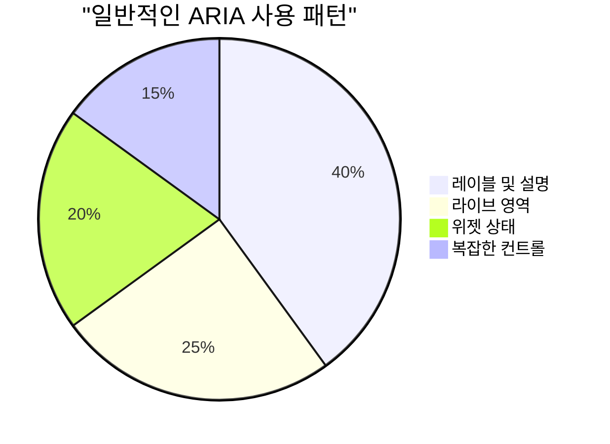
> **핵심 통찰**: 대부분의 ARIA 사용은 요소 레이블 지정과 설명에 집중됩니다. 복잡한 위젯 패턴은 생각보다 훨씬 적습니다!

✅ **전문가에게 배우기**: 복잡한 대화형 위젯의 배틀 테스트된 패턴과 구현을 보려면 [ARIA Authoring Practices Guide](https://w3c.github.io/aria-practices/)를 참고하세요.

## 이미지 및 미디어 접근성 확보

시각 및 청각 콘텐츠는 현대 웹 경험에서 필수적이지만, 신중하지 않으면 장애물이 될 수 있습니다. 미디어의 정보와 감정적 영향이 모든 사용자에게 도달하도록 하는 것이 목표입니다. 익숙해지면 자연스럽게 할 수 있습니다.

매체 종류마다 접근성 접근법이 다릅니다. 요리처럼—섬세한 생선을 거친 스테이크처럼 다루지 않듯, 상황마다 올바른 해결책을 선택하는 것이 중요합니다.

### 이미지 접근성 전략

웹사이트의 모든 이미지는 목적이 있습니다. 그 목적을 이해하면 더 좋은 대체 텍스트를 작성하고 포괄적인 경험을 만들 수 있습니다.

**이미지 4가지 유형과 Alt 텍스트 전략:**

**정보 전달 이미지** - 중요한 정보를 전달함:  
```html

```
  
**장식용 이미지** - 정보 가치 없는 순수 시각 이미지:  
```html

```
  
**기능적 이미지** - 버튼이나 컨트롤 역할:  
```html
<button>
  
</button>
```
  
**복잡한 이미지** - 차트, 다이어그램, 인포그래픽:  
```html

<div id="chart-description">
  <p>Detailed description: Sales data shows a steady increase across all quarters...</p>
</div>
```
  
### 비디오 및 오디오 접근성

**비디오 요구 사항:**  
- **자막**: 발화 내용과 효과음의 텍스트 버전  
- **오디오 설명**: 시각 요소에 대한 나레이션 (시각 장애 사용자용)  
- **스크립트**: 모든 오디오 및 시각 콘텐츠의 전체 텍스트 버전  

```html
<video controls>
  <source src="video.mp4" type="video/mp4">
  <track kind="captions" src="captions.vtt" srclang="en" label="English">
  <track kind="descriptions" src="descriptions.vtt" srclang="en" label="Audio descriptions">
</video>
```
  
**오디오 요구 사항:**  
- **스크립트**: 모든 발화 내용의 텍스트 버전  
- **시각적 표시기**: 오디오 전용 콘텐츠에 시각적 신호 제공  

### 최신 이미지 기술

**장식용 이미지에 CSS 사용하기:**  
```css
.hero-section {
  background-image: url('decorative-hero.jpg');
  /* Decorative images in CSS don't need alt text */
}
```
  
**접근성을 고려한 반응형 이미지:**  
```html
<picture>
  <source media="(min-width: 800px)" srcset="large-chart.png">
  <source media="(min-width: 400px)" srcset="medium-chart.png">
  
</picture>
```
  
✅ **이미지 접근성 테스트**: 화면 리더기로 이미지가 있는 페이지를 탐색해 보세요. 콘텐츠를 이해하는 데 충분한 정보가 제공되나요?

## 키보드 내비게이션 및 포커스 관리

많은 사용자가 키보드만으로 웹을 탐색합니다. 운동 장애가 있는 사람들, 키보드가 마우스보다 빠른 고급 사용자, 마우스가 작동하지 않는 사람들도 포함됩니다. 사이트가 키보드 입력에 잘 작동하도록 하는 것은 필수이자 모두에게 더 효율적인 사이트를 만듭니다.

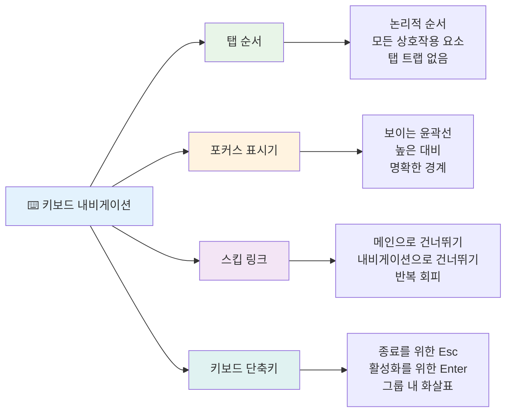
### 필수 키보드 내비게이션 패턴

**표준 키보드 상호작용:**  
- **Tab**: 대화형 요소 사이를 앞 방향으로 이동  
- **Shift + Tab**: 뒤 방향으로 이동  
- **Enter**: 버튼 및 링크 활성화  
- **Space**: 버튼 활성화, 체크박스 체크  
- **화살표 키**: 구성 요소 그룹 내 탐색 (라디오 버튼, 메뉴 등)  
- **Escape**: 모달, 드롭다운 닫기 혹은 작업 취소  

### 포커스 관리 모범 사례

**명확한 포커스 표시:**  
```css
/* Ensure focus is always visible */
button:focus-visible {
  outline: 2px solid #4A90A4;
  outline-offset: 2px;
}

/* Custom focus styles for different components */
.card:focus-within {
  box-shadow: 0 0 0 3px rgba(74, 144, 164, 0.5);
}
```
  
**효율적 내비게이션을 위한 스킵 링크:**  
```html
<a href="#main-content" class="skip-link">Skip to main content</a>
<a href="#navigation" class="skip-link">Skip to navigation</a>

<nav id="navigation">
  <!-- navigation content -->
</nav>
<main id="main-content">
  <!-- main content -->
</main>
```
  
**적절한 탭 순서:**  
```html
<!-- Use semantic HTML for natural tab order -->
<form>
  <label for="name">Name:</label>
  <input type="text" id="name" tabindex="0">
  
  <label for="email">Email:</label>
  <input type="email" id="email" tabindex="0">
  
  <button type="submit" tabindex="0">Submit</button>
</form>
```
  
### 모달에서의 포커스 갇힘

모달 대화상자를 열 때는 포커스가 모달 내부에 갇혀야 합니다:

```javascript
// 현대적인 포커스 트랩 구현
function trapFocus(element) {
  const focusableElements = element.querySelectorAll(
    'button, [href], input, select, textarea, [tabindex]:not([tabindex="-1"])'
  );
  
  const firstElement = focusableElements[0];
  const lastElement = focusableElements[focusableElements.length - 1];

  element.addEventListener('keydown', (e) => {
    if (e.key === 'Tab') {
      if (e.shiftKey && document.activeElement === firstElement) {
        e.preventDefault();
        lastElement.focus();
      } else if (!e.shiftKey && document.activeElement === lastElement) {
        e.preventDefault();
        firstElement.focus();
      }
    }
    
    if (e.key === 'Escape') {
      closeModal();
    }
  });
  
  // 모달이 열릴 때 첫 번째 요소에 포커스 맞추기
  firstElement.focus();
}
```
  
✅ **키보드 내비게이션 테스트**: Tab 키만 사용하여 사이트를 탐색해 보세요. 모든 대화형 요소에 도달할 수 있나요? 포커스 순서는 논리적이고, 포커스 표시기가 명확한가요?

## 폼 접근성

폼은 사용자 상호작용에서 매우 중요하며 특별한 접근성 주의가 필요합니다.

### 라벨과 폼 컨트롤 연관

**모든 폼 컨트롤에는 라벨이 필요합니다:**  
```html
<!-- Explicit labeling (preferred) -->
<label for="username">Username:</label>
<input type="text" id="username" name="username" required>

<!-- Implicit labeling -->
<label>
  Password:
  <input type="password" name="password" required>
</label>

<!-- Using aria-label when visual label isn't desired -->
<input type="search" aria-label="Search products" placeholder="Search...">
```
  
### 오류 처리 및 검증

**접근 가능한 오류 메시지:**  
```html
<label for="email">Email Address:</label>
<input type="email" id="email" name="email" 
       aria-describedby="email-error" 
       aria-invalid="true" required>
<div id="email-error" role="alert">
  Please enter a valid email address
</div>
```
  
**폼 검증 모범 사례:**  
- 잘못된 필드에 `aria-invalid` 사용  
- 명확하고 구체적인 오류 메시지 제공  
- 중요한 오류 알림에 `role="alert"` 사용  
- 즉시 및 제출 시 오류 표시  

### 필드셋과 그룹화

**관련 폼 컨트롤 그룹화:**  
```html
<fieldset>
  <legend>Shipping Address</legend>
  <label for="street">Street Address:</label>
  <input type="text" id="street" name="street">
  
  <label for="city">City:</label>
  <input type="text" id="city" name="city">
</fieldset>

<fieldset>
  <legend>Preferred Contact Method</legend>
  <input type="radio" id="contact-email" name="contact" value="email">
  <label for="contact-email">Email</label>
  
  <input type="radio" id="contact-phone" name="contact" value="phone">
  <label for="contact-phone">Phone</label>
</fieldset>
```

## 여러분의 접근성 여정: 주요 요점

축하합니다! 이제 진정으로 포괄적인 웹 경험을 만들기 위한 기본 지식을 얻었습니다. 정말 흥미로운 내용입니다! 웹 접근성은 단순히 규정 준수 체크리스트가 아니라, 사람들이 디지털 콘텐츠와 상호작용하는 다양한 방식을 인식하고 그 복잡성을 위해 설계하는 것입니다.

여러분은 이제 훌륭한 디자인이 누구에게나 잘 작동한다는 것을 이해하는 개발자 커뮤니티의 일부입니다. 환영합니다!

**🎯 여러분의 접근성 도구 세트에는 다음이 포함됩니다:**

| 핵심 원칙                | 구현 방법                                    | 영향                                          |
|------------------------|----------------------------------------|---------------------------------------------|
| **의미론적 HTML 기반**     | 목적에 맞는 적절한 HTML 요소 사용                  | 화면 리더가 효율적으로 탐색, 키보드 자동 작동             |
| **포괄적 시각 디자인**     | 충분한 대비, 의미 있는 색상 사용, 명확한 포커스 표시          | 어떠한 조명 환경에서도 모두에게 명확함                        |
| **설명적 콘텐츠**          | 의미 있는 링크 텍스트, alt 텍스트, 제목                    | 시각적 맥락 없더라도 사용자가 콘텐츠 이해 가능                 |
| **키보드 접근성**          | 탭 순서, 단축키, 포커스 관리                           | 운동장애 접근성과 고급 사용자 효율성                            |
| **ARIA 향상**             | 의미론적 간극을 채우는 전략적 사용                         | 복잡한 애플리케이션이 보조 기술과 함께 작동                     |
| **종합적 테스트**          | 자동화 도구 + 수동 확인 + 실제 사용자 테스트                | 사용자에게 영향을 주기 전에 문제 발견                            |

**🚀 다음 단계:**

1. **작업 흐름에 접근성 포함시키기**: 테스트를 개발 프로세스의 자연스러운 일부로 만드세요  
2. **실제 사용자에게 배우기**: 보조 기술 사용자들의 피드백을 구하세요  
3. **최신 상태 유지**: 접근성 기술은 새로운 기술과 표준에 따라 진화함  
4. **포용 옹호하기**: 지식을 공유하고 팀의 우선순위로 삼으세요  

> 💡 **기억하세요**: 접근성 제약은 종종 모두에게 이익이 되는 혁신적이고 세련된 해결책을 만듭니다. 점자 가이드, 자막, 음성 제어가 모두 접근성 기능으로 시작되어 주류 개선이 되었습니다.

**비즈니스 관점도 명확합니다**: 접근 가능한 웹사이트는 더 많은 사용자에게 도달하고, 검색 엔진 순위가 높으며, 유지보수 비용이 낮고, 법적 위험을 피할 수 있습니다. 그러나 솔직히 말해, 접근성을 신경 쓰는 진짜 이유는 훨씬 더 깊습니다. 접근 가능한 웹사이트는 웹의 최고의 가치인 개방성, 포용성, 누구나 정보에 평등하게 접근할 권리가 있다는 생각을 구현합니다.

이제 여러분은 미래의 포괄적인 웹을 구축할 준비가 되었습니다. 여러분이 만드는 모든 접근 가능한 사이트는 인터넷을 모두에게 더 환영받는 장소로 만듭니다. 정말 대단하지 않나요?

## 추가 자료

접근성 학습 여정을 계속할 수 있는 필수 자료들:

**📚 공식 표준 및 가이드라인:**  
- [WCAG 2.1 가이드라인](https://www.w3.org/WAI/WCAG21/quickref/) - 공식 접근성 표준과 빠른 참고  
- [ARIA Authoring Practices Guide](https://w3c.github.io/aria-practices/) - 대화형 위젯을 위한 포괄적 패턴  
- [WebAIM 가이드라인](https://webaim.org/) - 실용적이고 초보자 친화적인 접근성 안내  

**🛠️ 도구 및 테스트 자료:**  
- [axe DevTools](https://www.deque.com/axe/devtools/) - 업계 표준 접근성 테스트  
- [A11y Project 체크리스트](https://www.a11yproject.com/checklist/) - 단계별 접근성 검증  
- [Accessibility Insights](https://accessibilityinsights.io/) - 마이크로소프트의 포괄적 테스트 툴  
- [Color Oracle](https://colororacle.org/) - 디자인 테스트를 위한 색맹 시뮬레이터  

**🎓 학습 및 커뮤니티:**  
- [WebAIM 스크린 리더 설문 조사](https://webaim.org/projects/screenreadersurvey9/) - 실제 사용자 선호도 및 행동  
- [Inclusive Components](https://inclusive-components.design/) - 현대적 접근 가능한 컴포넌트 패턴  
- [A11y Coffee](https://a11y.coffee/) - 빠른 접근성 팁과 인사이트  
- [Web Accessibility Initiative (WAI)](https://www.w3.org/WAI/) - W3C의 포괄적 접근성 리소스  

**🎥 실습 학습:**  
- [Accessibility Developer Guide](https://www.accessibility-developer-guide.com/) - 실용적인 구현 가이드  
- [Deque University](https://dequeuniversity.com/) - 전문 접근성 교육 과정  

## GitHub Copilot Agent 챌린지 🚀

에이전트 모드를 사용하여 다음 챌린지를 완료하세요:

**설명:** 올바른 포커스 관리, ARIA 속성, 키보드 내비게이션 패턴을 시연하는 접근 가능한 모달 대화상자 컴포넌트를 만드세요.

**프롬프트:** HTML, CSS, JavaScript로 완전한 모달 대화상자 컴포넌트를 구축하세요. 올바른 포커스 갇힘, ESC 키로 닫기, 외부 클릭으로 닫기, 화면 리더를 위한 ARIA 속성, 명확한 포커스 표시기를 포함해야 합니다. 모달에는 적절한 라벨과 오류 처리를 갖춘 폼이 있어야 하며, WCAG 2.1 AA 기준을 충족해야 합니다.


## 🚀 챌린지

아래 HTML을 가능한 한 접근성 좋게, 배운 전략을 활용하여 다시 작성하세요.

```html
<!DOCTYPE html>
<html lang="en">
  <head>
    <meta charset="UTF-8">
    <meta name="viewport" content="width=device-width, initial-scale=1.0">
    <title>Turtle Ipsum - The World's Premier Turtle Fan Club</title>
    <link href='../assets/style.css' rel='stylesheet' type='text/css'>
  </head>
  <body>
    <header class="site-header">
      <h1 class="site-title">Turtle Ipsum</h1>
      <p class="site-subtitle">The World's Premier Turtle Fan Club</p>
    </header>
    
    <nav class="main-nav" aria-label="Main navigation">
      <h2 class="nav-header">Resources</h2>
      <ul class="nav-list">
        <li><a href="https://www.youtube.com/watch?v=CMNry4PE93Y">"I like turtles" video</a></li>
        <li><a href="https://en.wikipedia.org/wiki/Turtle">Basic turtle information</a></li>
        <li><a href="https://en.wikipedia.org/wiki/Turtles_(chocolate)">Chocolate turtles candy</a></li>
      </ul>
    </nav>
    
    <main class="main-content">
      <article>
        <h1>Welcome to Turtle Ipsum</h1>
        <p class="intro">
          <a href="/about">Learn more about our turtle community</a> and discover fascinating facts about these amazing creatures.
        </p>
        <p class="article-text">
          Turtle ipsum dolor sit amet, consectetur adipiscing elit, sed do eiusmod tempor incididunt ut labore et dolore magna aliqua. Ut enim ad minim veniam, quis nostrud exercitation ullamco laboris nisi ut aliquip ex ea commodo consequat. Duis aute irure dolor in reprehenderit in voluptate velit esse cillum dolore eu fugiat nulla pariatur. Excepteur sint occaecat cupidatat non proident, sunt in culpa qui officia deserunt mollit anim id est laborum.
        </p>
      </article>
    </main>
    
    <footer class="footer">
      <section class="newsletter-signup">
        <h2>Stay Updated</h2>
        <button type="button" onclick="showNewsletterForm()">Sign up for turtle news</button>
      </section>
      
      <nav class="footer-nav" aria-label="Footer navigation">
        <h2>Site Pages</h2>
        <ul>
          <li><a href="../">Home</a></li>
          <li><a href="../semantic">Semantic HTML example</a></li>
        </ul>
      </nav>
      
      <p class="footer-copyright">&copy; 2024 Instrument. All rights reserved.</p>
    </footer>
  </body>
</html>
```

**주요 개선 내용:**  
- 적절한 의미론적 HTML 구조 추가  
- 제목 계층 구조 수정 (단일 h1, 논리적 진행)  
- "click here" 대신 의미 있는 링크 텍스트 사용  
- 탐색용 적절한 ARIA 라벨 추가  
- lang 속성과 적절한 메타 태그 포함  
- 대화형 요소에 button 요소 사용  
- 적절한 랜드마크를 사용해 footer 구성  

## 강의 후 퀴즈  
[강의 후 퀴즈](https://ff-quizzes.netlify.app/web/en/)

## 복습 및 자기 주도 학습

많은 국가에서 접근성 요구사항에 관한 법률이 있습니다. 거주하는 국가의 접근성 법률을 읽어보세요. 무엇이 포함되고 무엇이 제외되는지 알아보세요. 예시로 [이 정부 웹사이트](https://accessibility.blog.gov.uk/)가 있습니다.

## 과제

[비접근성 웹사이트 분석](assignment.md)

크레딧: [Turtle Ipsum](https://github.com/Instrument/semantic-html-sample) by Instrument

---

## 🚀 여러분의 접근성 마스터리 타임라인

### ⚡ **다음 5분 동안 할 수 있는 일**
- [ ] 브라우저에 axe DevTools 확장 설치  
- [ ] 좋아하는 웹사이트에 Lighthouse 접근성 감사 실행  
- [ ] Tab 키만으로 임의 웹사이트 내비게이션 시도  
- [ ] 브라우저 내장 화면 리더기 (Narrator/VoiceOver) 테스트  

### 🎯 **이번 한 시간 동안 이룰 수 있는 일**
- [ ] 강의 후 퀴즈 완료 및 접근성 인사이트 반영  
- [ ] 10개의 서로 다른 이미지에 의미 있는 alt 텍스트 작성 연습  
- [ ] HeadingsMap 확장으로 웹사이트 제목 구조 감사  
- [ ] 챌린지 HTML에서 발견된 접근성 문제 수정  
- [ ] WebAIM 도구로 현재 프로젝트 색상 대비 테스트  

### 📅 **일주일간의 접근성 여정**
- [ ] 비접근성 웹사이트 분석 과제 완료  
- [ ] 개발 환경에 접근성 테스트 도구 설정
- [ ] 5개의 서로 다른 복잡한 웹사이트에서 키보드 탐색 연습하기
- [ ] 적절한 레이블, 오류 처리 및 ARIA가 포함된 간단한 폼 만들기
- [ ] 접근성 커뮤니티 가입하기 (A11y Slack, WebAIM 포럼)
- [ ] 장애가 있는 실제 사용자가 웹사이트를 탐색하는 모습 관찰하기 (YouTube에 좋은 예시가 많음)

### 🌟 **한 달 간의 변화**
- [ ] 접근성 테스트를 개발 워크플로우에 통합하기
- [ ] 접근성 문제를 수정하여 오픈 소스 프로젝트에 기여하기
- [ ] 보조 기술을 사용하는 사람과 함께 사용성 테스트 수행하기
- [ ] 팀을 위한 접근 가능한 컴포넌트 라이브러리 만들기
- [ ] 직장이나 커뮤니티에서 접근성 옹호하기
- [ ] 접근성 개념에 익숙하지 않은 사람 멘토링하기

### 🏆 **최종 접근성 챔피언 점검**

**접근성 여정을 축하합니다:**
- 사람들이 웹을 어떻게 사용하는지에 대해 가장 놀라웠던 점은 무엇인가요?
- 어떤 접근성 원칙이 당신의 개발 스타일과 가장 잘 맞나요?
- 접근성에 대해 배우면서 디자인에 대한 관점이 어떻게 바뀌었나요?
- 실제 프로젝트에서 가장 먼저 개선하고 싶은 접근성 요소는 무엇인가요?

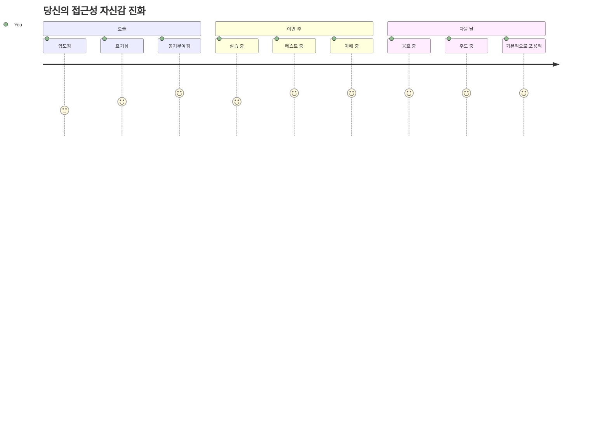
> 🌍 **당신은 이제 접근성 챔피언입니다!** 훌륭한 웹 경험은 웹에 접근하는 방식과 상관없이 모두에게 작동한다는 것을 이해합니다. 당신이 만드는 모든 접근 가능한 기능은 인터넷을 더 포용적으로 만듭니다. 웹은 접근성을 제약이 아닌, 모든 사용자를 위한 더 나은 경험을 창조할 기회로 보는 개발자들을 필요로 합니다. 운동에 오신 것을 환영합니다! 🎉

---

<!-- CO-OP TRANSLATOR DISCLAIMER START -->
**면책 조항**:  
이 문서는 AI 번역 서비스 [Co-op Translator](https://github.com/Azure/co-op-translator)를 사용하여 번역되었습니다. 정확성을 위해 최선을 다하고 있으나, 자동 번역에는 오류나 부정확한 부분이 있을 수 있음을 유의하시기 바랍니다. 원문 언어로 된 원본 문서가 권위 있는 출처로 간주되어야 합니다. 중요한 정보의 경우, 전문 인력에 의한 번역을 권장합니다. 이 번역본의 사용으로 인해 발생하는 오해나 잘못된 해석에 대해서 당사는 책임을 지지 않습니다.
<!-- CO-OP TRANSLATOR DISCLAIMER END -->