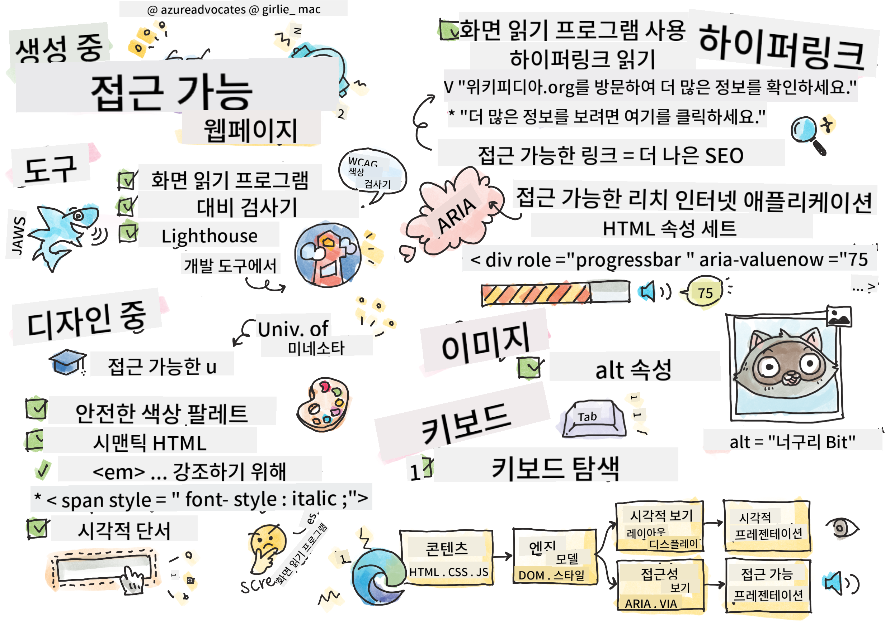

<!--
CO_OP_TRANSLATOR_METADATA:
{
  "original_hash": "f0c88c3e2cefa8952d356f802b1e47ca",
  "translation_date": "2025-08-29T15:45:52+00:00",
  "source_file": "1-getting-started-lessons/3-accessibility/README.md",
  "language_code": "ko"
}
-->
# 접근 가능한 웹페이지 만들기


> [Tomomi Imura](https://twitter.com/girlie_mac)의 스케치노트

## 강의 전 퀴즈
[강의 전 퀴즈](https://ff-quizzes.netlify.app/web/)

> 웹의 힘은 그 보편성에 있습니다. 장애에 관계없이 모든 사람이 접근할 수 있는 것이 필수적인 요소입니다.
>
> \- Sir Timothy Berners-Lee, W3C 디렉터 및 월드 와이드 웹 발명가

이 인용문은 접근 가능한 웹사이트를 만드는 것의 중요성을 완벽히 강조합니다. 모든 사람이 접근할 수 없는 애플리케이션은 본질적으로 배제적입니다. 웹 개발자로서 우리는 항상 접근성을 염두에 두어야 합니다. 처음부터 이러한 초점을 맞추면 여러분이 만든 페이지를 모든 사람이 접근할 수 있도록 보장하는 데 큰 도움이 될 것입니다. 이번 강의에서는 웹 자산이 접근 가능하도록 보장하는 데 도움이 되는 도구와 접근성을 고려한 개발 방법에 대해 배웁니다.

> 이 강의를 [Microsoft Learn](https://docs.microsoft.com/learn/modules/web-development-101/accessibility/?WT.mc_id=academic-77807-sagibbon)에서 수강할 수 있습니다!

## 사용할 도구

### 화면 읽기 프로그램

가장 잘 알려진 접근성 도구 중 하나는 화면 읽기 프로그램입니다.

[화면 읽기 프로그램](https://en.wikipedia.org/wiki/Screen_reader)은 시각 장애가 있는 사람들이 자주 사용하는 클라이언트입니다. 브라우저가 우리가 공유하려는 정보를 적절히 전달하도록 시간을 들이는 것처럼, 화면 읽기 프로그램도 동일한 정보를 전달하도록 해야 합니다.

화면 읽기 프로그램은 기본적으로 페이지를 위에서 아래로 소리 내어 읽습니다. 페이지가 모두 텍스트로 구성되어 있다면, 화면 읽기 프로그램은 브라우저와 유사한 방식으로 정보를 전달합니다. 물론 웹 페이지는 순수 텍스트로만 구성되지 않습니다. 링크, 그래픽, 색상 및 기타 시각적 요소를 포함합니다. 화면 읽기 프로그램이 이러한 정보를 올바르게 읽도록 주의해야 합니다.

모든 웹 개발자는 화면 읽기 프로그램을 익혀야 합니다. 위에서 강조했듯이, 이는 사용자가 활용할 클라이언트입니다. 브라우저 작동 방식을 익히는 것처럼 화면 읽기 프로그램 작동 방식을 배워야 합니다. 다행히도 대부분의 운영 체제에는 화면 읽기 프로그램이 내장되어 있습니다.

일부 브라우저에는 텍스트를 소리 내어 읽거나 기본 탐색 기능을 제공하는 내장 도구와 확장 기능이 있습니다. 예를 들어 [Edge 브라우저의 접근성 도구](https://support.microsoft.com/help/4000734/microsoft-edge-accessibility-features)가 있습니다. 이러한 도구도 중요한 접근성 도구이지만 화면 읽기 프로그램 테스트 도구로 오해해서는 안 됩니다.

✅ 화면 읽기 프로그램과 브라우저 텍스트 읽기 도구를 사용해 보세요. Windows에는 기본적으로 [Narrator](https://support.microsoft.com/windows/complete-guide-to-narrator-e4397a0d-ef4f-b386-d8ae-c172f109bdb1/?WT.mc_id=academic-77807-sagibbon)가 포함되어 있으며, [JAWS](https://webaim.org/articles/jaws/)와 [NVDA](https://www.nvaccess.org/about-nvda/)도 설치할 수 있습니다. macOS와 iOS에는 기본적으로 [VoiceOver](https://support.apple.com/guide/voiceover/welcome/10)가 설치되어 있습니다.

### 확대 기능

시각 장애가 있는 사람들이 자주 사용하는 또 다른 도구는 화면 확대 기능입니다. 가장 기본적인 확대 기능은 `Control + 플러스 기호 (+)`를 사용하거나 화면 해상도를 낮추는 방식으로 이루어집니다. 이러한 확대 기능은 페이지 전체를 크기 조정하므로 [반응형 디자인](https://developer.mozilla.org/docs/Learn/CSS/CSS_layout/Responsive_Design)을 사용하여 확대된 화면에서도 좋은 사용자 경험을 제공하는 것이 중요합니다.

또 다른 확대 방식은 특수 소프트웨어를 사용하여 화면의 특정 영역을 확대하고 이동하는 방식으로, 실제 돋보기를 사용하는 것과 비슷합니다. Windows에는 [Magnifier](https://support.microsoft.com/windows/use-magnifier-to-make-things-on-the-screen-easier-to-see-414948ba-8b1c-d3bd-8615-0e5e32204198)가 내장되어 있으며, [ZoomText](https://www.freedomscientific.com/training/zoomtext/getting-started/)는 더 많은 기능과 사용자 기반을 가진 타사 확대 소프트웨어입니다. macOS와 iOS에는 [Zoom](https://www.apple.com/accessibility/mac/vision/)이라는 내장 확대 소프트웨어가 있습니다.

### 대비 검사 도구

웹사이트의 색상은 색맹 사용자나 저대비 색상을 보기 어려운 사람들의 요구를 충족하도록 신중히 선택해야 합니다.

✅ 브라우저 확장 프로그램인 [WCAG의 색상 대비 검사기](https://microsoftedge.microsoft.com/addons/detail/wcag-color-contrast-check/idahaggnlnekelhgplklhfpchbfdmkjp?hl=en-US&WT.mc_id=academic-77807-sagibbon)를 사용하여 좋아하는 웹사이트의 색상 사용을 테스트해 보세요. 무엇을 배울 수 있나요?

### Lighthouse

브라우저의 개발자 도구 영역에서 Lighthouse 도구를 찾을 수 있습니다. 이 도구는 웹사이트의 접근성(및 기타 분석)을 처음으로 확인하는 데 중요합니다. Lighthouse에만 의존해서는 안 되지만, 100% 점수는 기본적으로 매우 유용합니다.

✅ 브라우저의 개발자 도구 패널에서 Lighthouse를 찾아 실행하여 웹사이트를 분석해 보세요. 무엇을 발견했나요?

## 접근성을 고려한 디자인

접근성은 비교적 큰 주제입니다. 이를 돕기 위해 다양한 리소스가 제공됩니다.

- [Accessible U - University of Minnesota](https://accessibility.umn.edu/your-role/web-developers)

모든 접근성 요소를 다룰 수는 없지만, 아래는 구현해야 할 핵심 원칙들입니다. 처음부터 접근 가능한 페이지를 디자인하는 것이 기존 페이지를 접근 가능하게 만드는 것보다 **항상** 더 쉽습니다.

## 좋은 디스플레이 원칙

### 색상 안전 팔레트

사람들은 세상을 다양한 방식으로 보며, 색상도 포함됩니다. 사이트의 색상 테마를 선택할 때 모든 사람이 접근할 수 있도록 해야 합니다. 색상 팔레트를 생성하는 데 유용한 [도구는 Color Safe](http://colorsafe.co/)입니다.

✅ 색상 사용이 매우 문제가 되는 웹사이트를 찾아보세요. 왜 그런가요?

### 올바른 HTML 사용

CSS와 JavaScript를 사용하면 어떤 요소든 어떤 유형의 컨트롤처럼 보이게 만들 수 있습니다. `<span>`을 사용하여 `<button>`을 만들거나 `<b>`를 사용하여 하이퍼링크를 만들 수 있습니다. 이는 스타일링이 더 쉬워 보일 수 있지만, 화면 읽기 프로그램에는 아무런 정보를 전달하지 않습니다. 페이지에서 컨트롤을 만들 때 적절한 HTML을 사용하세요. 하이퍼링크를 원한다면 `<a>`를 사용하세요. 올바른 HTML을 사용하는 것은 의미론적 HTML을 사용하는 것이라고 합니다.

✅ 웹사이트에 가서 디자이너와 개발자가 HTML을 올바르게 사용하고 있는지 확인하세요. 링크여야 할 버튼을 찾을 수 있나요? 힌트: 브라우저에서 '페이지 소스 보기'를 선택하여 기본 코드를 확인하세요.

### 설명이 있는 헤딩 계층 구조 만들기

화면 읽기 프로그램 사용자는 [헤딩에 크게 의존](https://webaim.org/projects/screenreadersurvey8/#finding)하여 정보를 찾고 페이지를 탐색합니다. 설명이 있는 헤딩 콘텐츠를 작성하고 의미론적 헤딩 태그를 사용하는 것은 화면 읽기 프로그램 사용자에게 쉽게 탐색할 수 있는 사이트를 만드는 데 중요합니다.

### 좋은 시각적 단서 사용

CSS는 페이지의 모든 요소의 외형을 완전히 제어할 수 있습니다. 윤곽선이 없는 텍스트 상자나 밑줄이 없는 하이퍼링크를 만들 수 있습니다. 그러나 이러한 단서를 제거하면 이를 의존하는 사람이 컨트롤 유형을 인식하기 어려워질 수 있습니다.

## 링크 텍스트의 중요성

하이퍼링크는 웹 탐색의 핵심입니다. 따라서 화면 읽기 프로그램이 링크를 올바르게 읽을 수 있도록 하는 것은 모든 사용자가 사이트를 탐색할 수 있도록 하는 데 중요합니다.

### 화면 읽기 프로그램과 링크

예상대로 화면 읽기 프로그램은 페이지의 다른 텍스트와 마찬가지로 링크 텍스트를 읽습니다. 이를 염두에 두고 아래에 표시된 텍스트는 완벽히 괜찮아 보일 수 있습니다.

> 작은 펭귄은 때로는 요정 펭귄으로 알려져 있으며 세계에서 가장 작은 펭귄입니다. [여기를 클릭하세요](https://en.wikipedia.org/wiki/Little_penguin)에서 더 많은 정보를 확인하세요.

> 작은 펭귄은 때로는 요정 펭귄으로 알려져 있으며 세계에서 가장 작은 펭귄입니다. https://en.wikipedia.org/wiki/Little_penguin에서 더 많은 정보를 확인하세요.

> **NOTE** 아래에서 읽게 될 내용처럼, 위와 같은 링크를 **절대** 만들지 말아야 합니다.

화면 읽기 프로그램은 브라우저와는 다른 인터페이스로, 다른 기능 세트를 가지고 있습니다.

### URL 사용의 문제점

화면 읽기 프로그램은 텍스트를 읽습니다. 텍스트에 URL이 나타나면 화면 읽기 프로그램은 URL을 읽습니다. 일반적으로 URL은 의미 있는 정보를 전달하지 않으며, 귀찮게 들릴 수 있습니다. 휴대폰이 텍스트 메시지의 URL을 소리 내어 읽은 적이 있다면 이를 경험했을 것입니다.

### "여기를 클릭하세요" 사용의 문제점

화면 읽기 프로그램은 페이지의 하이퍼링크만 읽을 수 있는 기능도 있습니다. 이는 시각적인 사람이 페이지에서 링크를 스캔하는 방식과 비슷합니다. 링크 텍스트가 항상 "여기를 클릭하세요"라면 사용자는 "여기를 클릭하세요, 여기를 클릭하세요, 여기를 클릭하세요, 여기를 클릭하세요, 여기를 클릭하세요, ..."만 듣게 됩니다. 모든 링크가 서로 구별되지 않게 됩니다.

### 좋은 링크 텍스트

좋은 링크 텍스트는 링크의 목적을 간략히 설명합니다. 위의 작은 펭귄에 대한 예에서 링크는 해당 종에 대한 Wikipedia 페이지로 연결됩니다. *작은 펭귄*이라는 문구는 누군가가 링크를 클릭했을 때 무엇을 배우게 될지 명확히 알려주므로 완벽한 링크 텍스트가 됩니다.

> 작은 펭귄은 때로는 요정 펭귄으로 알려져 있으며 세계에서 가장 작은 펭귄입니다. [작은 펭귄](https://en.wikipedia.org/wiki/Little_penguin)에서 더 많은 정보를 확인하세요.

✅ 몇 분 동안 웹을 탐색하며 모호한 링크 전략을 사용하는 페이지를 찾아보세요. 더 나은 링크를 사용하는 사이트와 비교해 보세요. 무엇을 배울 수 있나요?

#### 검색 엔진 관련 참고 사항

모든 사용자가 접근할 수 있도록 사이트를 보장하면 검색 엔진이 사이트를 탐색하는 데도 도움이 됩니다. 검색 엔진은 링크 텍스트를 사용하여 페이지의 주제를 학습합니다. 따라서 좋은 링크 텍스트를 사용하는 것은 모두에게 도움이 됩니다!

### ARIA

다음 페이지를 상상해 보세요:

| 제품          | 설명              | 주문          |
| ------------- | ----------------- | ------------- |
| 위젯          | [설명](../../../../1-getting-started-lessons/3-accessibility/')       | [주문](../../../../1-getting-started-lessons/3-accessibility/')   |
| 슈퍼 위젯     | [설명](../../../../1-getting-started-lessons/3-accessibility/')       | [주문](../../../../1-getting-started-lessons/3-accessibility/')   |

이 예에서 브라우저를 사용하는 사람에게는 설명과 주문 텍스트를 중복하는 것이 합리적입니다. 그러나 화면 읽기 프로그램을 사용하는 사람은 *설명*과 *주문*이라는 단어만 반복적으로 듣게 되어 맥락을 이해할 수 없습니다.

이러한 시나리오를 지원하기 위해 HTML은 [접근 가능한 풍부한 인터넷 애플리케이션(ARIA)](https://developer.mozilla.org/docs/Web/Accessibility/ARIA)이라는 속성 세트를 지원합니다. 이러한 속성은 화면 읽기 프로그램에 추가 정보를 제공할 수 있습니다.

> **NOTE**: HTML의 많은 측면과 마찬가지로 브라우저 및 화면 읽기 프로그램 지원은 다를 수 있습니다. 그러나 대부분의 주요 클라이언트는 ARIA 속성을 지원합니다.

페이지 형식이 허용하지 않을 때 링크를 설명하기 위해 `aria-label`을 사용할 수 있습니다. 위젯에 대한 설명은 다음과 같이 설정할 수 있습니다:

``` html
<a href="#" aria-label="Widget description">description</a>
```

✅ 일반적으로 위에서 설명한 의미론적 마크업을 사용하는 것이 ARIA 사용보다 우선하지만, HTML 위젯에 대한 의미론적 대안이 없는 경우가 있습니다. 좋은 예는 트리입니다. 트리에 대한 HTML 대안이 없으므로 이 요소의 일반 `<div>`를 적절한 역할과 ARIA 값으로 식별합니다. [MDN의 ARIA 문서](https://developer.mozilla.org/docs/Web/Accessibility/ARIA)에는 더 유용한 정보가 포함되어 있습니다.

```html
<h2 id="tree-label">File Viewer</h2>
<div role="tree" aria-labelledby="tree-label">
  <div role="treeitem" aria-expanded="false" tabindex="0">Uploads</div>
</div>
```

## 이미지

화면 읽기 프로그램이 이미지에 있는 내용을 자동으로 읽을 수 없다는 것은 당연합니다. 이미지를 접근 가능하게 만드는 것은 많은 작업이 필요하지 않습니다. 바로 `alt` 속성을 사용하는 것입니다. 모든 의미 있는 이미지는 자신이 무엇인지 설명하는 `alt`를 가져야 합니다. 순전히 장식적인 이미지는 `alt` 속성을 빈 문자열로 설정해야 합니다: `alt=""`. 이렇게 하면 화면 읽기 프로그램이 장식적인 이미지를 불필요하게 알리는 것을 방지할 수 있습니다.

✅ 예상대로 검색 엔진도 이미지에 있는 내용을 이해할 수 없습니다. 검색 엔진도 alt 텍스트를 사용합니다. 따라서 페이지를 접근 가능하게 만드는 것은 추가적인 이점을 제공합니다!

## 키보드

일부 사용자는 마우스나 트랙패드를 사용할 수 없으며, 대신 키보드 상호작용을 통해 한 요소에서 다음 요소로 이동합니다. 키보드 사용자가 문서를 내려가면서 각 인터랙티브 요소에 접근할 수 있도록 웹사이트가 논리적인 순서로 콘텐츠를 제공하는 것이 중요합니다. 의미론적 마크업으로 웹페이지를 작성하고 CSS를 사용하여 시각적 레이아웃을 스타일링하면 사이트가 키보드로 탐색 가능해야 하지만, 이 측면을 수동으로 테스트하는 것이 중요합니다. [키보드 탐색 전략](https://webaim.org/techniques/keyboard/)에 대해 자세히 알아보세요.

✅ 웹사이트에 가서 키보드만 사용하여 탐색해 보세요. 무엇이 작동하고, 무엇이 작동하지 않나요? 왜 그런가요?

## 요약

일부 사람만 접근할 수 있는 웹은 진정한 '월드 와이드 웹'이 아닙니다. 여러분이 만든 사이트가 접근 가능하도록 보장하는 가장 좋은 방법은 처음부터 접근성 모범 사례를 통합하는 것입니다. 추가 단계가 필요하지만, 지금 이러한 기술을 워크플로에 통합하면 여러분이 만든 모든 페이지가 접근 가능하게 됩니다.

---

## 🚀 도전 과제

이 HTML을 접근 가능한 방식으로 다시 작성해 보세요. 배운 전략을 활용하세요.

```html
<!DOCTYPE html>
<html>
  <head>
    <title>
      Example
    </title>
    <link href='../assets/style.css' rel='stylesheet' type='text/css'>
  </head>
  <body>
    <div class="site-header">
      <p class="site-title">Turtle Ipsum</p>
      <p class="site-subtitle">The World's Premier Turtle Fan Club</p>
    </div>
    <div class="main-nav">
      <p class="nav-header">Resources</p>
      <div class="nav-list">
        <p class="nav-item nav-item-bull"><a href="https://www.youtube.com/watch?v=CMNry4PE93Y">"I like turtles"</a></p>
        <p class="nav-item nav-item-bull"><a href="https://en.wikipedia.org/wiki/Turtle">Basic Turtle Info</a></p>
        <p class="nav-item nav-item-bull"><a href="https://en.wikipedia.org/wiki/Turtles_(chocolate)">Chocolate Turtles</a></p>
      </div>
    </div>
    <div class="main-content">
      <div>
        <p class="page-title">Welcome to Turtle Ipsum. 
            <a href="">Click here</a> to learn more.
        </p>
        <p class="article-text">
          Turtle ipsum dolor sit amet, consectetur adipiscing elit, sed do eiusmod tempor incididunt ut labore et dolore magna aliqua. Ut enim ad minim veniam, quis nostrud exercitation ullamco laboris nisi ut aliquip ex ea commodo consequat. Duis aute irure dolor in reprehenderit in voluptate velit esse cillum dolore eu fugiat nulla pariatur. Excepteur sint occaecat cupidatat non proident, sunt in culpa qui officia deserunt mollit anim id est laborum
        </p>
      </div>
    </div>
    <div class="footer">
      <div class="footer-section">
        <span class="button">Sign up for turtle news</span>
      </div><div class="footer-section">
        <p class="nav-header footer-title">
          Internal Pages
        </p>
        <div class="nav-list">
          <p class="nav-item nav-item-bull"><a href="../">Index</a></p>
          <p class="nav-item nav-item-bull"><a href="../semantic">Semantic Example</a></p>
        </div>
      </div>
      <p class="footer-copyright">&copy; 2016 Instrument</p>
    </div>
  </body>
</html>
```

## 강의 후 퀴즈
[강의 후 퀴즈](https://ff-quizzes.netlify.app/web/en/)

## 복습 및 자기 학습
많은 정부가 접근성 요구 사항에 관한 법률을 가지고 있습니다. 여러분이 거주하는 국가의 접근성 법률에 대해 조사해 보세요. 무엇이 포함되고, 무엇이 포함되지 않는지 확인하세요. 예를 들어, [이 정부 웹사이트](https://accessibility.blog.gov.uk/)를 참고할 수 있습니다.

## 과제

[접근성이 부족한 웹사이트 분석하기](assignment.md)

출처: Instrument의 [Turtle Ipsum](https://github.com/Instrument/semantic-html-sample)

---

**면책 조항**:  
이 문서는 AI 번역 서비스 [Co-op Translator](https://github.com/Azure/co-op-translator)를 사용하여 번역되었습니다. 정확성을 위해 최선을 다하고 있지만, 자동 번역에는 오류나 부정확성이 포함될 수 있습니다. 원본 문서를 해당 언어로 작성된 상태에서 권위 있는 자료로 간주해야 합니다. 중요한 정보의 경우, 전문적인 인간 번역을 권장합니다. 이 번역 사용으로 인해 발생하는 오해나 잘못된 해석에 대해 책임을 지지 않습니다.