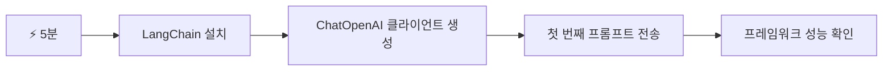
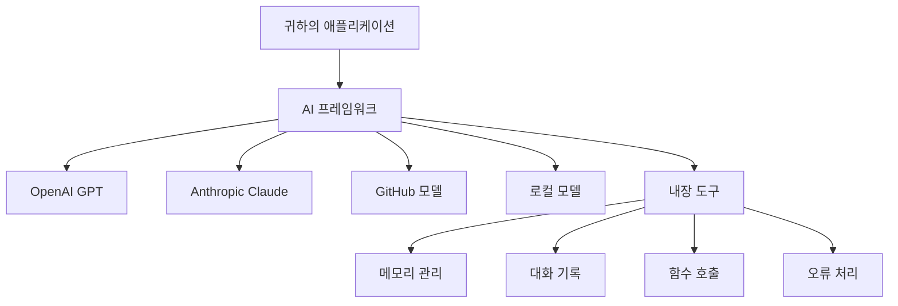
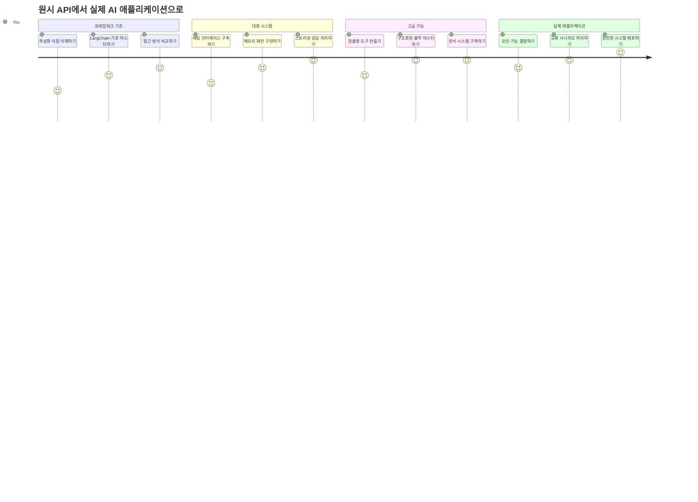
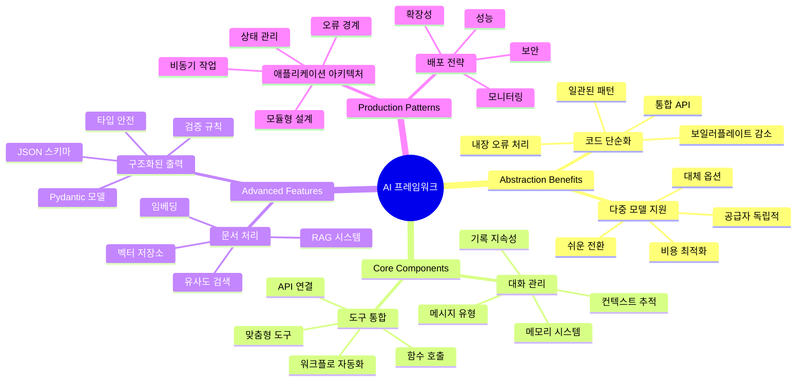
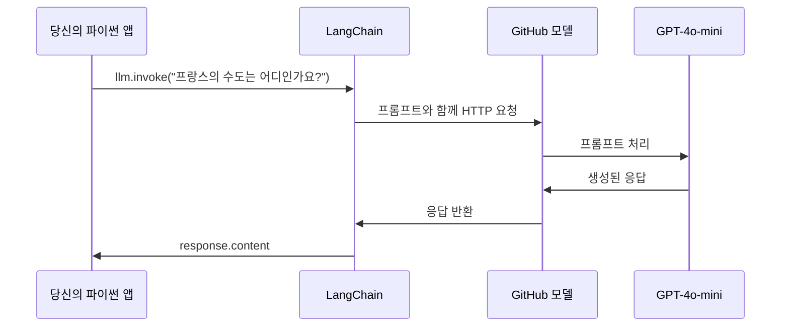
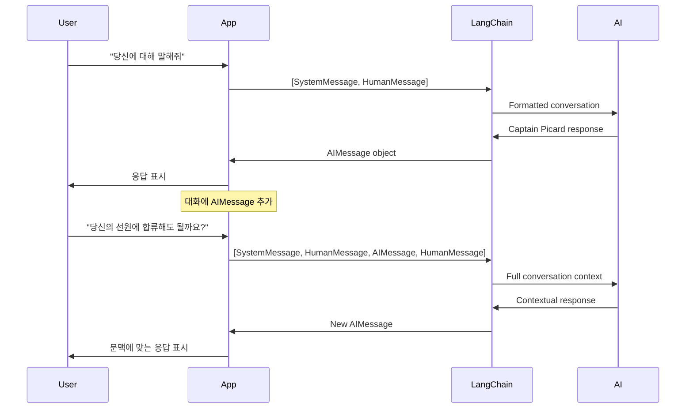
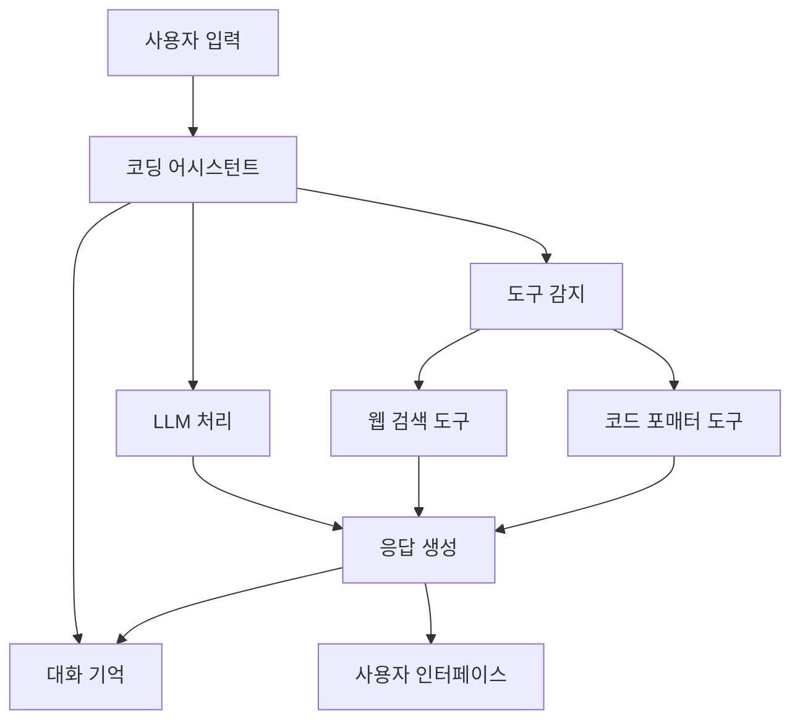
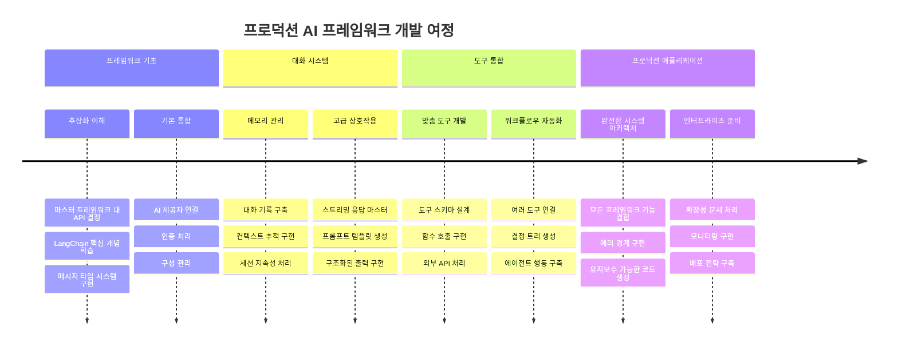
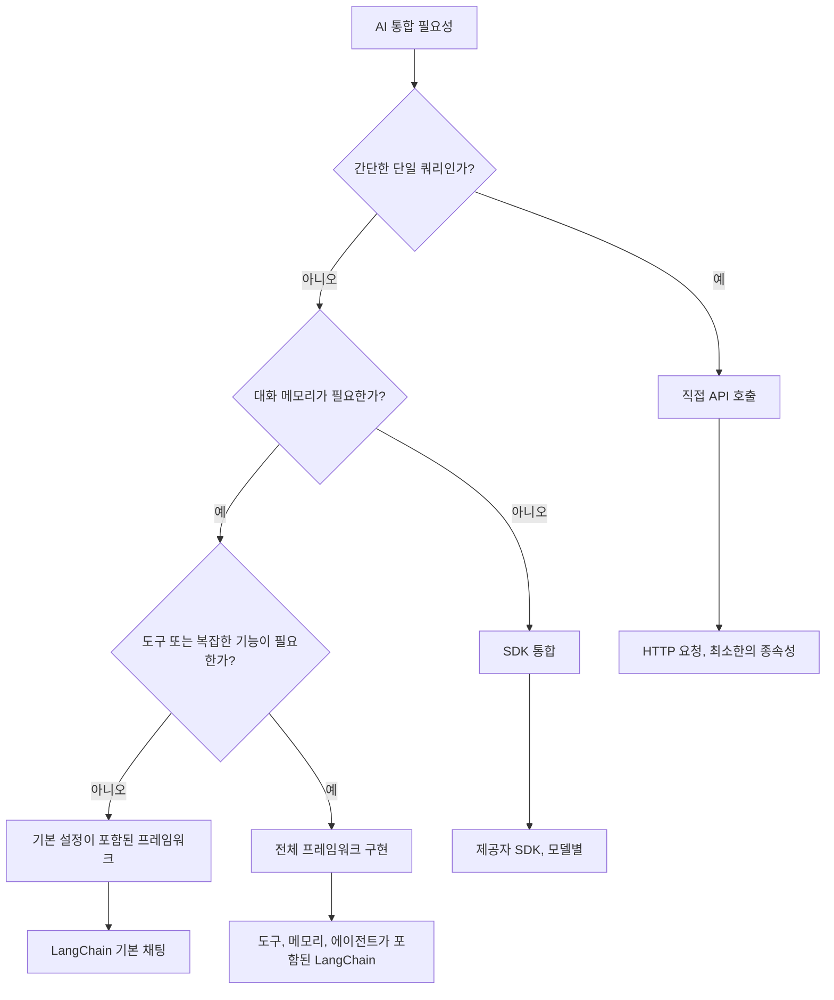

# AI 프레임워크

처음부터 AI 애플리케이션을 구축하려고 할 때 압도당한 적 있나요? 혼자가 아닙니다! AI 프레임워크는 AI 개발을 위한 만능 도구와 같습니다 - 지능형 애플리케이션을 만들 때 시간과 어려움을 줄여주는 강력한 도구입니다. AI 프레임워크를 잘 정리된 라이브러리라고 생각해 보세요: 사전 구축된 구성 요소, 표준화된 API, 그리고 스마트한 추상화를 제공하여 구현 세부 사항에 씨름하는 대신 문제 해결에 집중할 수 있도록 해줍니다.

이 수업에서는 LangChain과 같은 프레임워크가 복잡했던 AI 통합 작업을 어떻게 깔끔하고 읽기 쉬운 코드로 바꿀 수 있는지 알아봅니다. 대화 기록 관리, 도구 호출 구현, 다양한 AI 모델을 하나의 통합 인터페이스로 다루는 방법 같은 실전 과제들을 해결하는 방법을 발견할 것입니다.

학습이 끝날 무렵에는 언제 순수 API 호출 대신 프레임워크를 사용해야 하는지, 추상화를 효과적으로 사용하는 방법, 그리고 실제 사용에 적합한 AI 애플리케이션을 만드는 방법을 알게 됩니다. AI 프레임워크가 여러분의 프로젝트에 어떻게 도움이 되는지 함께 살펴봅시다.

## ⚡ 다음 5분 안에 할 수 있는 것

**바쁜 개발자를 위한 빠른 시작 경로**


- **1분 차**: LangChain 설치: `pip install langchain langchain-openai`
- **2분 차**: GitHub 토큰 설정 및 ChatOpenAI 클라이언트 임포트
- **3분 차**: 시스템 및 인간 메시지로 간단한 대화 생성
- **4분 차**: 기본 도구(예: 덧셈 함수) 추가 및 AI 도구 호출 경험
- **5분 차**: 순수 API 호출과 프레임워크 추상화의 차이 체험

**빠른 테스트 코드**:  
```python
from langchain_openai import ChatOpenAI
from langchain_core.messages import SystemMessage, HumanMessage

llm = ChatOpenAI(
    api_key=os.environ["GITHUB_TOKEN"],
    base_url="https://models.github.ai/inference",
    model="openai/gpt-4o-mini"
)

response = llm.invoke([
    SystemMessage(content="You are a helpful coding assistant"),
    HumanMessage(content="Explain Python functions briefly")
])
print(response.content)
```
  
**이것이 중요한 이유**: 5분 만에 AI 프레임워크가 복잡한 AI 통합을 간단한 메서드 호출로 어떻게 바꾸는지 경험할 수 있습니다. 이것이 생산용 AI 애플리케이션을 구동하는 기초입니다.

## 왜 프레임워크를 선택할까?

이제 AI 앱을 만들 준비가 되셨군요 - 멋집니다! 그러나 선택할 수 있는 여러 경로가 있으며, 각각 장단점이 있습니다. 이는 마치 걸어서, 자전거로, 혹은 자동차로 이동하는 것과 같습니다 - 모두 목적지에 도착하지만 경험과 노력은 완전히 다르죠.

프로젝트에 AI를 통합하는 세 가지 주요 방법을 살펴보겠습니다:

| 방법 | 장점 | 최적 용도 | 고려사항 |
|----------|------------|----------|--------------|
| **직접 HTTP 요청** | 완전한 제어, 의존성 없음 | 간단한 질의, 기본 개념 학습 | 코드가 장황하고 오류 처리 수동 |
| **SDK 통합** | 보일러플레이트 감소, 모델별 최적화 | 단일 모델 애플리케이션 | 특정 제공자에 제한 |
| **AI 프레임워크** | 통합 API, 내장 추상화 | 다중 모델 앱, 복잡한 워크플로우 | 학습 곡선, 과도한 추상화 가능성 |

### 프레임워크의 실제 혜택


**프레임워크가 중요한 이유:**  
- 여러 AI 제공자를 하나의 인터페이스로 **통합**  
- 대화 기억을 자동으로 **처리**  
- 임베딩, 함수 호출 같은 일반 작업을 위한 기성 도구 **제공**  
- 오류 처리 및 재시도 로직 **관리**  
- 복잡한 워크플로우를 읽기 쉬운 메서드 호출로 **변환**

> 💡 **프로 팁**: 서로 다른 AI 모델을 전환하거나 에이전트, 메모리, 도구 호출 같은 복잡한 기능을 구축할 때 프레임워크를 사용하세요. 기본 개념 학습이나 단순한 애플리케이션 구축 시에는 직접 API를 사용하는 것이 좋습니다.

**요점**: 장인의 특화된 도구와 완비된 작업장의 선택처럼, 작업에 적합한 도구를 고르는 문제입니다. 복잡하고 기능이 풍부한 애플리케이션에는 프레임워크가 뛰어나며, 단순한 사용 사례에는 직접 API가 효과적입니다.

## 🗺️ AI 프레임워크 마스터를 향한 학습 여정


**학습 목표**: 이번 강의가 끝나면 AI 프레임워크 개발에 능숙해져 상용 AI 어시스턴트와 견줄 수 있는 정교하고 생산 준비가 된 AI 애플리케이션을 만들 수 있습니다.

## 소개

이 수업에서 배우게 될 내용:

- 일반 AI 프레임워크 사용법.
- 채팅 대화, 도구 사용, 메모리 및 컨텍스트와 같은 공통 문제 해결.
- 이를 활용해 AI 앱 구축하기.

## 🧠 AI 프레임워크 개발 생태계


**핵심 원리**: AI 프레임워크는 복잡도를 추상화하면서 대화 관리, 도구 통합, 문서 처리를 위한 강력한 추상화를 제공하여 개발자가 깔끔하고 유지보수 가능한 코드로 정교한 AI 애플리케이션을 구축할 수 있게 합니다.

## 첫 번째 AI 프롬프트

AI 애플리케이션의 기본을 시작해 봅시다 - 질문을 보내고 답을 받는 첫 애플리케이션을 만들어보는 것부터. 아키메데스가 목욕 도중 부력의 원리를 발견한 것처럼, 가장 간단한 관찰이 가장 강력한 통찰로 이어질 때가 있습니다 - 프레임워크는 이런 통찰을 가능하게 합니다.

### LangChain과 GitHub 모델 설정

LangChain을 사용해 GitHub 모델에 연결할 예정입니다. 이게 참 좋은 점은 다양한 AI 모델에 무료로 접근할 수 있다는 겁니다. 가장 좋은 점? 몇 가지 간단한 구성 매개변수만 있으면 바로 시작할 수 있습니다:

```python
from langchain_openai import ChatOpenAI
import os

llm = ChatOpenAI(
    api_key=os.environ["GITHUB_TOKEN"],
    base_url="https://models.github.ai/inference",
    model="openai/gpt-4o-mini",
)

# 간단한 프롬프트 보내기
response = llm.invoke("What's the capital of France?")
print(response.content)
```
  
**여기서 일어나는 일 설명:**  
- `ChatOpenAI` 클래스를 사용해 LangChain 클라이언트를 **생성** - AI와 소통하는 게이트웨이!  
- 인증 토큰으로 GitHub 모델 연결 **설정**  
- 사용할 AI 모델 지정 (`gpt-4o-mini`) - AI 어시스턴트 선택하는 것처럼 생각하세요  
- `invoke()` 메서드로 질문 **전송** - 마법이 일어나는 곳  
- 응답 추출 및 표시 - 이렇게 AI와 대화합니다!

> 🔧 **설정 참고**: GitHub Codespaces를 사용 중이라면, 이미 `GITHUB_TOKEN`이 설정되어 있어 다행입니다! 로컬 환경이라면 적절한 권한으로 개인 액세스 토큰을 생성하면 됩니다.

**기대 출력:**  
```text
The capital of France is Paris.
```
  


## 대화형 AI 구축

앞 예제는 기본적인 단일 교환만 보여줬지만, 질문하고 답을 받고 끝입니다. 실제 애플리케이션에서는 AI가 대화 내용을 기억하도록 하길 원합니다. 마치 왓슨과 홈즈가 시간이 지남에 따라 조사 대화를 쌓아간 것처럼요.

LangChain이 특히 유용한 부분입니다. 대화를 구조화하고 AI에 개성을 부여할 수 있는 다양한 메시지 유형을 제공합니다. 컨텍스트와 캐릭터를 유지하는 채팅 경험을 구축할 수 있습니다.

### 메시지 유형 이해하기

이 메시지 유형들을 대화 참가자가 쓰는 다양한 "모자"로 생각해 보세요. LangChain은 누가 무엇을 말하는지 추적하기 위해 다양한 메시지 클래스를 사용합니다:

| 메시지 유형 | 목적 | 사용 예 |
|--------------|---------|---------|
| `SystemMessage` | AI 성격과 행동 정의 | "당신은 도움이 되는 코딩 어시스턴트입니다" |
| `HumanMessage` | 사용자 입력 표현 | "함수가 어떻게 작동하는지 설명해 줘" |
| `AIMessage` | AI 응답 저장 | 대화 중 이전 AI 응답 |

### 첫 대화 만들기

특정 역할을 맡긴 AI와 대화를 만들어 봅시다. 우리가 만든 AI는 외교적 지혜와 리더십으로 유명한 피카드 선장 역을 맡습니다:

```python
messages = [
    SystemMessage(content="You are Captain Picard of the Starship Enterprise"),
    HumanMessage(content="Tell me about you"),
]
```
  
**대화 설정 해설:**  
- `SystemMessage`로 AI 역할과 성격 **설정**  
- `HumanMessage`로 초기 사용자 질문 **제공**  
- 다중 턴 대화의 기반 **구축**

전체 예제 코드는 다음과 같습니다:

```python
from langchain_core.messages import HumanMessage, SystemMessage
from langchain_openai import ChatOpenAI
import os

llm = ChatOpenAI(
    api_key=os.environ["GITHUB_TOKEN"],
    base_url="https://models.github.ai/inference",
    model="openai/gpt-4o-mini",
)

messages = [
    SystemMessage(content="You are Captain Picard of the Starship Enterprise"),
    HumanMessage(content="Tell me about you"),
]


# 작동함
response  = llm.invoke(messages)
print(response.content)
```
  
아래와 비슷한 결과가 나올 것입니다:

```text
I am Captain Jean-Luc Picard, the commanding officer of the USS Enterprise (NCC-1701-D), a starship in the United Federation of Planets. My primary mission is to explore new worlds, seek out new life and new civilizations, and boldly go where no one has gone before. 

I believe in the importance of diplomacy, reason, and the pursuit of knowledge. My crew is diverse and skilled, and we often face challenges that test our resolve, ethics, and ingenuity. Throughout my career, I have encountered numerous species, grappled with complex moral dilemmas, and have consistently sought peaceful solutions to conflicts.

I hold the ideals of the Federation close to my heart, believing in the importance of cooperation, understanding, and respect for all sentient beings. My experiences have shaped my leadership style, and I strive to be a thoughtful and just captain. How may I assist you further?
```
  
대화 연속성을 유지하려면(컨텍스트를 매번 초기화하지 않고), 응답을 메시지 목록에 계속 추가해야 합니다. 세대를 거쳐 구전된 이야기를 보존하는 것처럼, 이 방법이 지속적인 기억을 만듭니다:

```python
from langchain_core.messages import HumanMessage, SystemMessage
from langchain_openai import ChatOpenAI
import os

llm = ChatOpenAI(
    api_key=os.environ["GITHUB_TOKEN"],
    base_url="https://models.github.ai/inference",
    model="openai/gpt-4o-mini",
)

messages = [
    SystemMessage(content="You are Captain Picard of the Starship Enterprise"),
    HumanMessage(content="Tell me about you"),
]


# 작동합니다
response  = llm.invoke(messages)

print(response.content)

print("---- Next ----")

messages.append(response)
messages.append(HumanMessage(content="Now that I know about you, I'm Chris, can I be in your crew?"))

response  = llm.invoke(messages)

print(response.content)

```
  
멋지죠? 여기선 LLM을 두 번 호출합니다 - 먼저 초기 두 메시지만으로, 그리고 다음엔 전체 대화 내역과 함께. 마치 AI가 실제로 대화를 따라가는 것처럼요!

코드를 실행하면 두 번째 응답이 다음과 비슷하게 들릴 겁니다:

```text
Welcome aboard, Chris! It's always a pleasure to meet those who share a passion for exploration and discovery. While I cannot formally offer you a position on the Enterprise right now, I encourage you to pursue your aspirations. We are always in need of talented individuals with diverse skills and backgrounds. 

If you are interested in space exploration, consider education and training in the sciences, engineering, or diplomacy. The values of curiosity, resilience, and teamwork are crucial in Starfleet. Should you ever find yourself on a starship, remember to uphold the principles of the Federation: peace, understanding, and respect for all beings. Your journey can lead you to remarkable adventures, whether in the stars or on the ground. Engage!
```
  

그래도 "아마도"라고 받아들이겠습니다 ;)

## 스트리밍 응답

ChatGPT가 답변을 실시간으로 "입력"하는 것처럼 보인 적 있나요? 그게 바로 스트리밍입니다. 숙련된 서예가가 붓글씨를 한 획씩 그려내는 모습을 보는 것처럼, 스트리밍은 상호작용을 더 자연스럽게 만들고 즉각적인 피드백을 제공합니다.

### LangChain에서 스트리밍 구현하기

```python
from langchain_openai import ChatOpenAI
import os

llm = ChatOpenAI(
    api_key=os.environ["GITHUB_TOKEN"],
    base_url="https://models.github.ai/inference",
    model="openai/gpt-4o-mini",
    streaming=True
)

# 응답을 스트리밍하세요
for chunk in llm.stream("Write a short story about a robot learning to code"):
    print(chunk.content, end="", flush=True)
```
  
**스트리밍의 장점:**  
- 생성되는 콘텐츠를 바로 보여줌 - 기다림이 사라짐!  
- 사용자로 하여금 실제 무언가가 진행 중임을 느낌  
- 기술적으로는 빠르지 않아도 더 빨리 느껴짐  
- AI가 아직 "생각" 중일 때도 사용자가 읽기 시작할 수 있음

> 💡 **사용자 경험 팁**: 스트리밍은 코드 설명, 창의적 글쓰기, 상세 튜토리얼처럼 긴 답변에 특히 빛납니다. 사용자는 빈 화면을 바라보며 기다리는 대신 진행 상황을 볼 수 있어 좋아할 겁니다!

### 🎯 교육적 점검: 프레임워크 추상화 혜택

**잠시 멈추고 반영:** 방금 AI 프레임워크 추상화의 힘을 경험했습니다. 이전 수업의 순수 API 호출과 비교해 보세요.

**간단한 자가 점검:**  
- LangChain이 수동 메시지 추적에 비해 대화 관리를 어떻게 단순화하는지 설명할 수 있나요?  
- `invoke()`와 `stream()` 메서드의 차이점과 각각 언제 사용하는지 알겠나요?  
- 프레임워크 메시지 유형 시스템이 코드 조직을 어떻게 개선하나요?

**현실 세계 연결:** 여러분이 배운 추상화 패턴(메시지 유형, 스트리밍 인터페이스, 대화 메모리)은 ChatGPT 인터페이스부터 GitHub Copilot 코드 지원까지 모든 주요 AI 애플리케이션에서 사용됩니다. 여러분은 전문 AI 개발 팀이 사용하는 동일한 아키텍처 패턴을 마스터하고 있습니다.

**도전 문제:** 단일 인터페이스로 다양한 AI 모델 제공자(OpenAI, Anthropic, Google)를 처리하는 프레임워크 추상화를 어떻게 설계하시겠습니까? 장점과 단점을 고려해 보세요.

## 프롬프트 템플릿

프롬프트 템플릿은 고전 웅변에서 사용된 수사 구조와 같습니다 - 키케로가 다른 청중을 위해 연설 패턴을 조절하면서도 같은 설득 구조를 유지한 것처럼요. 모든 것을 처음부터 다시 쓸 필요 없이 교체 가능한 정보 조각들을 사용해 재사용 가능한 프롬프트를 만들 수 있습니다. 템플릿을 만들고 나면 변수만 필요한 값으로 채우면 됩니다.

### 재사용 가능한 프롬프트 만들기

```python
from langchain_core.prompts import ChatPromptTemplate

# 코드 설명을 위한 템플릿 정의
template = ChatPromptTemplate.from_messages([
    ("system", "You are an expert programming instructor. Explain concepts clearly with examples."),
    ("human", "Explain {concept} in {language} with a practical example for {skill_level} developers")
])

# 다양한 값으로 템플릿 사용
questions = [
    {"concept": "functions", "language": "JavaScript", "skill_level": "beginner"},
    {"concept": "classes", "language": "Python", "skill_level": "intermediate"},
    {"concept": "async/await", "language": "JavaScript", "skill_level": "advanced"}
]

for question in questions:
    prompt = template.format_messages(**question)
    response = llm.invoke(prompt)
    print(f"Topic: {question['concept']}\n{response.content}\n---\n")
```
  
**템플릿을 사랑하게 될 이유:**  
- 앱 전체에서 프롬프트의 일관성 유지  
- 지저분한 문자열 연결 없이 깔끔하고 단순한 변수 사용  
- 구조가 일정해 AI가 예측 가능하게 행동  
- 템플릿 한 번 변경하면 어디서나 업데이트

## 구조화된 출력

비구조화된 텍스트로 된 AI 응답을 파싱하려다 답답했던 적 있나요? 구조화된 출력은 린네우스가 생물 분류를 체계적으로 했던 방식을 AI에게 가르치는 것과 같습니다 - 조직적이고 예측 가능하며 다루기 쉽습니다. JSON, 특정 데이터 구조, 원하는 어떤 형식으로든 요청할 수 있습니다.

### 출력 스키마 정의

```python
from langchain_core.prompts import ChatPromptTemplate
from langchain_core.output_parsers import JsonOutputParser
from pydantic import BaseModel, Field

class CodeReview(BaseModel):
    score: int = Field(description="Code quality score from 1-10")
    strengths: list[str] = Field(description="List of code strengths")
    improvements: list[str] = Field(description="List of suggested improvements")
    overall_feedback: str = Field(description="Summary feedback")

# 파서를 설정합니다
parser = JsonOutputParser(pydantic_object=CodeReview)

# 포맷 지침과 함께 프롬프트를 생성합니다
prompt = ChatPromptTemplate.from_messages([
    ("system", "You are a code reviewer. {format_instructions}"),
    ("human", "Review this code: {code}")
])

# 지침으로 프롬프트를 포맷합니다
chain = prompt | llm | parser

# 구조화된 응답을 받습니다
code_sample = """
def calculate_average(numbers):
    return sum(numbers) / len(numbers)
"""

result = chain.invoke({
    "code": code_sample,
    "format_instructions": parser.get_format_instructions()
})

print(f"Score: {result['score']}")
print(f"Strengths: {', '.join(result['strengths'])}")
```
  
**구조화된 출력이 게임 체인저인 이유:**  
- 매번 일관된 형식으로 받으니 일일이 추측할 필요 없음  
- 추가 작업 없이 데이터베이스와 API에 바로 연결 가능  
- 이상한 AI 응답을 미리 잡아내 앱이 깨지는 걸 방지  
- 다루는 내용을 정확히 알기에 코드가 더 깔끔해짐

## 도구 호출

가장 강력한 기능 중 하나인 도구에 도달했습니다. 이것이 AI에게 대화 이상의 실용적인 능력을 부여하는 방법입니다. 중세 길드가 특정 장인을 위해 특화된 도구를 개발한 것처럼, 여러분도 AI에 전문화된 도구를 장착할 수 있습니다. 사용 가능한 도구를 설명하면, 요청이 일치할 때 AI가 조치를 취할 수 있습니다.

### Python 사용하기

다음과 같이 몇 가지 도구를 추가해 보겠습니다:

```python
from typing_extensions import Annotated, TypedDict

class add(TypedDict):
    """Add two integers."""

    # 주석은 타입을 가져야 하며 선택적으로 기본 값과 설명(순서대로)을 포함할 수 있습니다.
    a: Annotated[int, ..., "First integer"]
    b: Annotated[int, ..., "Second integer"]

tools = [add]

functions = {
    "add": lambda a, b: a + b
}
```
  
무슨 일이 일어나고 있을까요? `TypedDict`를 상속하고 `a`, `b`에 고급 `Annotated` 타입을 사용해 `add`라는 도구의 청사진을 만들고 있습니다. LLM에게 이 도구가 뭘 하며 어떤 입력이 필요한지 명확히 알려주는 셈이죠. `functions` 딕셔너리는 도구 상자와 같아서, AI가 특정 도구를 사용하기로 결정하면 코드가 무엇을 해야 하는지 정확히 알려줍니다.

이 도구를 사용해 LLM을 호출하는 방법을 살펴봅시다:

```python
llm = ChatOpenAI(
    api_key=os.environ["GITHUB_TOKEN"],
    base_url="https://models.github.ai/inference",
    model="openai/gpt-4o-mini",
)

llm_with_tools = llm.bind_tools(tools)
```
  
여기서는 `tools` 배열과 함께 `bind_tools`를 호출하여, 도구를 아는 LLM인 `llm_with_tools`를 만듭니다.

이 새 LLM을 사용하려면 다음 코드를 입력하면 됩니다:

```python
query = "What is 3 + 12?"

res = llm_with_tools.invoke(query)
if(res.tool_calls):
    for tool in res.tool_calls:
        print("TOOL CALL: ", functions[tool["name"]](../../../10-ai-framework-project/**tool["args"]))
print("CONTENT: ",res.content)
```
  
도구가 있는 이 새 llm에서 `invoke`를 호출하면, 아마도 `tool_calls` 속성이 채워질 겁니다. 만약 그렇다면 식별된 도구는 호출할 도구 이름과 인수를 식별하는 `name`과 `args` 속성을 갖습니다. 전체 코드는 다음과 같습니다:

```python
from langchain_core.messages import HumanMessage, SystemMessage
from langchain_openai import ChatOpenAI
import os
from typing_extensions import Annotated, TypedDict

class add(TypedDict):
    """Add two integers."""

    # 애노테이션은 타입을 가져야 하며, 선택적으로 기본값과 설명을 포함할 수 있습니다(그 순서대로).
    a: Annotated[int, ..., "First integer"]
    b: Annotated[int, ..., "Second integer"]

tools = [add]

functions = {
    "add": lambda a, b: a + b
}

llm = ChatOpenAI(
    api_key=os.environ["GITHUB_TOKEN"],
    base_url="https://models.github.ai/inference",
    model="openai/gpt-4o-mini",
)

llm_with_tools = llm.bind_tools(tools)

query = "What is 3 + 12?"

res = llm_with_tools.invoke(query)
if(res.tool_calls):
    for tool in res.tool_calls:
        print("TOOL CALL: ", functions[tool["name"]](../../../10-ai-framework-project/**tool["args"]))
print("CONTENT: ",res.content)
```
  
이 코드를 실행하면 다음과 비슷한 출력이 나올 것입니다:

```text
TOOL CALL:  15
CONTENT: 
```
  
AI가 "3 + 12는 무엇인가요"라는 문장을 분석하고 이 작업에 `add` 도구가 적합하다고 인식했습니다. 숙련된 사서가 질문 유형에 따라 참조할 자료를 아는 것처럼, 도구 이름, 설명, 필드 명세를 토대로 판단한 것입니다. 15라는 결과는 `functions` 딕셔너리가 도구를 실행하여 나온 값입니다:

```python
print("TOOL CALL: ", functions[tool["name"]](../../../10-ai-framework-project/**tool["args"]))
```
  
### 웹 API를 호출하는 더 흥미로운 도구
숫자 더하기는 개념을 보여주지만, 실제 도구들은 보통 웹 API 호출 같은 더 복잡한 작업을 수행합니다. 예제를 확장해 AI가 인터넷에서 콘텐츠를 가져오도록 해보겠습니다 - 마치 구식 전신사가 먼 위치를 연결하던 것과 비슷하게요:

```python
class joke(TypedDict):
    """Tell a joke."""

    # 어노테이션은 타입을 가져야 하며 선택적으로 기본값과 설명(그 순서대로)을 포함할 수 있습니다.
    category: Annotated[str, ..., "The joke category"]

def get_joke(category: str) -> str:
    response = requests.get(f"https://api.chucknorris.io/jokes/random?category={category}", headers={"Accept": "application/json"})
    if response.status_code == 200:
        return response.json().get("value", f"Here's a {category} joke!")
    return f"Here's a {category} joke!"

functions = {
    "add": lambda a, b: a + b,
    "joke": lambda category: get_joke(category)
}

query = "Tell me a joke about animals"

# 나머지 코드는 동일합니다
```

이 코드를 실행하면 대략 다음과 같은 응답을 받게 됩니다:

```text
TOOL CALL:  Chuck Norris once rode a nine foot grizzly bear through an automatic car wash, instead of taking a shower.
CONTENT:  
```

```mermaid
flowchart TD
    A[사용자 문의: "동물에 관한 농담을 알려줘"] --> B[LangChain 분석]
    B --> C{도구 사용 가능?}
    C -->|예| D[농담 도구 선택]
    C -->|아니오| E[직접 응답 생성]
    
    D --> F[매개변수 추출]
    F --> G[농담 호출(category="animals")]
    G --> H[chucknorris.io에 API 요청]
    H --> I[농담 내용 반환]
    I --> J[사용자에게 표시]
    
    E --> K[AI 생성 응답]
    K --> J
    
    subgraph "도구 정의 계층"
        L[TypedDict 스키마]
        M[함수 구현]
        N[매개변수 검증]
    end
    
    D --> L
    F --> N
    G --> M
```
전체 코드는 다음과 같습니다:

```python
from langchain_openai import ChatOpenAI
import requests
import os
from typing_extensions import Annotated, TypedDict

class add(TypedDict):
    """Add two integers."""

    # 주석에는 타입이 있어야 하며, 선택적으로 기본 값과 설명을 포함할 수 있습니다(그 순서대로).
    a: Annotated[int, ..., "First integer"]
    b: Annotated[int, ..., "Second integer"]

class joke(TypedDict):
    """Tell a joke."""

    # 주석에는 타입이 있어야 하며, 선택적으로 기본 값과 설명을 포함할 수 있습니다(그 순서대로).
    category: Annotated[str, ..., "The joke category"]

tools = [add, joke]

def get_joke(category: str) -> str:
    response = requests.get(f"https://api.chucknorris.io/jokes/random?category={category}", headers={"Accept": "application/json"})
    if response.status_code == 200:
        return response.json().get("value", f"Here's a {category} joke!")
    return f"Here's a {category} joke!"

functions = {
    "add": lambda a, b: a + b,
    "joke": lambda category: get_joke(category)
}

llm = ChatOpenAI(
    api_key=os.environ["GITHUB_TOKEN"],
    base_url="https://models.github.ai/inference",
    model="openai/gpt-4o-mini",
)

llm_with_tools = llm.bind_tools(tools)

query = "Tell me a joke about animals"

res = llm_with_tools.invoke(query)
if(res.tool_calls):
    for tool in res.tool_calls:
        # print("툴 호출: ", tool)
        print("TOOL CALL: ", functions[tool["name"]](../../../10-ai-framework-project/**tool["args"]))
print("CONTENT: ",res.content)
```

## 임베딩과 문서 처리

임베딩은 현대 AI에서 가장 세련된 솔루션 중 하나를 나타냅니다. 어떤 텍스트 조각이든 의미를 포착하는 숫자 좌표로 변환할 수 있다고 상상해보세요. 임베딩이 바로 그런 역할을 합니다 - 텍스트를 다차원 공간의 점들로 변환해서 유사한 개념들이 군집하도록 합니다. 이는 멘델레예프가 원자 속성에 따라 주기율표를 정리했던 방식과 비슷하게 아이디어를 위한 좌표 시스템을 갖는 것과 같습니다.

### 임베딩 생성과 활용

```python
from langchain_openai import OpenAIEmbeddings
from langchain_community.vectorstores import FAISS
from langchain_community.document_loaders import TextLoader
from langchain.text_splitter import CharacterTextSplitter

# 임베딩 초기화
embeddings = OpenAIEmbeddings(
    api_key=os.environ["GITHUB_TOKEN"],
    base_url="https://models.github.ai/inference",
    model="text-embedding-3-small"
)

# 문서 로드 및 분할
loader = TextLoader("documentation.txt")
documents = loader.load()

text_splitter = CharacterTextSplitter(chunk_size=1000, chunk_overlap=0)
texts = text_splitter.split_documents(documents)

# 벡터 저장소 생성
vectorstore = FAISS.from_documents(texts, embeddings)

# 유사도 검색 수행
query = "How do I handle user authentication?"
similar_docs = vectorstore.similarity_search(query, k=3)

for doc in similar_docs:
    print(f"Relevant content: {doc.page_content[:200]}...")
```

### 다양한 포맷의 문서 로더

```python
from langchain_community.document_loaders import (
    PyPDFLoader,
    CSVLoader,
    JSONLoader,
    WebBaseLoader
)

# 다양한 문서 유형 로드
pdf_loader = PyPDFLoader("manual.pdf")
csv_loader = CSVLoader("data.csv")
json_loader = JSONLoader("config.json")
web_loader = WebBaseLoader("https://example.com/docs")

# 모든 문서 처리
all_documents = []
for loader in [pdf_loader, csv_loader, json_loader, web_loader]:
    docs = loader.load()
    all_documents.extend(docs)
```

**임베딩으로 할 수 있는 것들:**
- **검색 구축**: 단순 키워드 매칭이 아니라 실제 의미를 이해하는 검색
- **AI 생성**: 문서에 대해 질문에 답할 수 있는 AI 만들기
- **추천 시스템**: 진짜 관련성 높은 콘텐츠를 제안하는 추천 시스템 제작
- **자동화**: 콘텐츠를 자동으로 구성하고 분류하기

```mermaid
flowchart LR
    A[문서] --> B[텍스트 분할기]
    B --> C[임베딩 생성]
    C --> D[벡터 저장소]
    
    E[사용자 질의] --> F[질의 임베딩]
    F --> G[유사도 검색]
    G --> D
    D --> H[관련 문서]
    H --> I[AI 응답]
    
    subgraph "벡터 공간"
        J[문서 A: [0.1, 0.8, 0.3...]]
        K[문서 B: [0.2, 0.7, 0.4...]]
        L[질의: [0.15, 0.75, 0.35...]]
    end
    
    C --> J
    C --> K
    F --> L
    G --> J
    G --> K
```
## 완전한 AI 애플리케이션 구축

이제까지 배운 내용을 모두 통합해서 포괄적인 애플리케이션을 만들어보겠습니다 - 질문에 답하고, 도구를 사용하며, 대화 기억을 유지하는 코딩 어시스턴트입니다. 인쇄기가 기존 기술들(활자, 잉크, 종이, 압력)을 결합해 혁신을 일으켰듯, AI 구성 요소를 실용적이고 유용한 무언가로 결합할 것입니다.

### 완전한 애플리케이션 예제

```python
from langchain_openai import ChatOpenAI, OpenAIEmbeddings
from langchain_core.prompts import ChatPromptTemplate
from langchain_core.messages import HumanMessage, SystemMessage, AIMessage
from langchain_community.vectorstores import FAISS
from typing_extensions import Annotated, TypedDict
import os
import requests

class CodingAssistant:
    def __init__(self):
        self.llm = ChatOpenAI(
            api_key=os.environ["GITHUB_TOKEN"],
            base_url="https://models.github.ai/inference",
            model="openai/gpt-4o-mini"
        )
        
        self.conversation_history = [
            SystemMessage(content="""You are an expert coding assistant. 
            Help users learn programming concepts, debug code, and write better software.
            Use tools when needed and maintain a helpful, encouraging tone.""")
        ]
        
        # 도구 정의
        self.setup_tools()
    
    def setup_tools(self):
        class web_search(TypedDict):
            """Search for programming documentation or examples."""
            query: Annotated[str, "Search query for programming help"]
        
        class code_formatter(TypedDict):
            """Format and validate code snippets."""
            code: Annotated[str, "Code to format"]
            language: Annotated[str, "Programming language"]
        
        self.tools = [web_search, code_formatter]
        self.llm_with_tools = self.llm.bind_tools(self.tools)
    
    def chat(self, user_input: str):
        # 사용자 메시지를 대화에 추가
        self.conversation_history.append(HumanMessage(content=user_input))
        
        # AI 응답 받기
        response = self.llm_with_tools.invoke(self.conversation_history)
        
        # 도구 호출 처리
        if response.tool_calls:
            for tool_call in response.tool_calls:
                tool_result = self.execute_tool(tool_call)
                print(f"🔧 Tool used: {tool_call['name']}")
                print(f"📊 Result: {tool_result}")
        
        # AI 응답을 대화에 추가
        self.conversation_history.append(response)
        
        return response.content
    
    def execute_tool(self, tool_call):
        tool_name = tool_call['name']
        args = tool_call['args']
        
        if tool_name == 'web_search':
            return f"Found documentation for: {args['query']}"
        elif tool_name == 'code_formatter':
            return f"Formatted {args['language']} code: {args['code'][:50]}..."
        
        return "Tool execution completed"

# 사용 예시
assistant = CodingAssistant()

print("🤖 Coding Assistant Ready! Type 'quit' to exit.\n")

while True:
    user_input = input("You: ")
    if user_input.lower() == 'quit':
        break
    
    response = assistant.chat(user_input)
    print(f"🤖 Assistant: {response}\n")
```

**애플리케이션 아키텍처:**


**구현한 주요 기능:**
- **대화 전체를 기억**하여 문맥 연속성 유지
- **도구 호출**을 통해 대화 이상의 작업 수행
- **예측 가능한 상호작용 패턴** 준수
- **오류 처리와 복잡한 작업 흐름** 자동 관리

### 🎯 교육 점검: 프로덕션 AI 아키텍처

**아키텍처 이해**: 대화 관리, 도구 호출, 구조화된 작업 흐름을 통합한 완전한 AI 애플리케이션을 구축했습니다. 이는 프로덕션 수준 AI 애플리케이션 개발을 나타냅니다.

**주요 개념 숙달**:
- **클래스 기반 아키텍처**: 조직적이고 유지보수 가능한 AI 앱 구조
- **도구 통합**: 대화 외 맞춤형 기능
- **메모리 관리**: 지속적인 대화 문맥 유지
- **오류 처리**: 견고한 애플리케이션 행동

**업계 연계**: 구현한 아키텍처 패턴(대화 클래스, 도구 시스템, 메모리 관리)은 Slack AI 어시스턴트, GitHub Copilot, Microsoft Copilot 같은 엔터프라이즈 AI 애플리케이션에 사용되는 패턴과 동일합니다. 전문적 수준의 아키텍처 사고를 바탕으로 구축하는 중입니다.

**반성 질문**: 이 애플리케이션을 다중 사용자 지원, 지속 저장소 연동, 외부 데이터베이스 통합까지 확장한다면 어떻게 구현할까요? 확장성과 상태 관리 문제를 고려해보세요.

## 과제: AI 기반 학습 도우미 만들기

**목표**: 프로그래밍 개념 학습을 돕는 AI 도우미를 만들어 설명, 코드 예제, 인터랙티브 퀴즈를 제공합니다.

### 요구사항

**핵심 기능 (필수):**
1. **대화형 인터페이스**: 여러 질문에서 문맥을 유지하는 채팅 시스템 구현
2. **교육 도구**: 학습에 도움이 되는 도구 2개 이상 제작
   - 코드 설명 도구
   - 개념 퀴즈 생성기
3. **개인화 학습**: 시스템 메시지로 다양한 실력 수준에 맞게 응답 조절
4. **응답 포맷팅**: 퀴즈 질문에 structured output 적용

### 구현 단계

**1단계: 환경 설정**
```bash
pip install langchain langchain-openai
```

**2단계: 기본 채팅 기능**
- `StudyAssistant` 클래스 생성
- 대화 기억 구현
- 교육 지원용 성격 설정 추가

**3단계: 교육 도구 추가**
- **코드 설명기**: 코드를 이해하기 쉬운 부분으로 분해
- **퀴즈 생성기**: 프로그래밍 개념 관련 질문 제작
- **진행 추적기**: 다룬 주제 추적

**4단계: 고급 기능 (선택)**
- 스트리밍 응답 구현으로 사용자 경험 개선
- 문서 로딩 추가로 강의 자료 포함
- 임베딩 생성해 유사도 기반 콘텐츠 검색 구현

### 평가 기준

| 기능 | 우수 (4) | 양호 (3) | 보통 (2) | 개선 필요 (1) |
|---------|---------------|----------|------------------|----------------|
| **대화 흐름** | 자연스럽고 문맥 인지 | 양호한 문맥 유지 | 기본 대화 | 대화 간 기억 없음 |
| **도구 통합** | 여러 유용한 도구 원활 작동 | 2개 이상 도구 올바른 구현 | 1~2개 기본 도구 | 도구 작동 안 함 |
| **코드 품질** | 깔끔하고 문서화 잘 됨, 오류 처리 | 구조 양호, 일부 문서화 | 기본 기능 작동 | 구조 부실, 오류 처리 없음 |
| **교육적 가치** | 학습에 진짜 도움, 적응형 | 좋은 학습 지원 | 기본 설명 제공 | 교육적 효과 제한적 |

### 코드 구조 예시

```python
class StudyAssistant:
    def __init__(self, skill_level="beginner"):
        # LLM, 도구 및 대화 메모리 초기화
        pass
    
    def explain_code(self, code, language):
        # 도구: 코드 작동 방식 설명
        pass
    
    def generate_quiz(self, topic, difficulty):
        # 도구: 연습 문제 만들기
        pass
    
    def chat(self, user_input):
        # 주요 대화 인터페이스
        pass

# 사용 예시
assistant = StudyAssistant(skill_level="intermediate")
response = assistant.chat("Explain how Python functions work")
```

**보너스 과제:**
- 음성 입출력 기능 추가
- Streamlit 또는 Flask로 웹 인터페이스 구현
- 임베딩으로 강의 자료에서 지식 베이스 만들기
- 진행 상황 추적 및 개인화 학습 경로 추가

## 📈 AI 프레임워크 개발 마스터 타임라인


**🎓 졸업 단계**: 현대 AI 애플리케이션을 구동하는 동일한 도구와 패턴으로 AI 프레임워크 개발을 성공적으로 숙달했습니다. 이 기술들은 최첨단 AI 애플리케이션 개발 능력을 나타내며, 엔터프라이즈 수준의 지능형 시스템 구축에 대비합니다.

**🔄 다음 단계 기능**:
- 고급 AI 아키텍처 탐색 준비(에이전트, 다중 에이전트 시스템)
- 벡터 데이터베이스를 활용한 RAG 시스템 구축 준비
- 다중 모달 AI 애플리케이션 제작 가능
- AI 애플리케이션 확장과 최적화 기반 마련

## 요약

🎉 이제 AI 프레임워크 개발 기본기를 마스터했고 LangChain으로 복잡한 AI 애플리케이션을 만드는 법을 배웠습니다. 종합적 도제 과정을 완료한 것처럼 실질적 기술 도구 모음을 갖추었습니다. 지금까지 배운 내용을 되짚어봅시다.

### 배운 내용

**핵심 프레임워크 개념:**
- **프레임워크 장점**: 직접 API 호출 대신 언제 프레임워크를 선택해야 하는지 이해
- **LangChain 기초**: AI 모델 연결 설정 및 구성
- **메시지 유형**: `SystemMessage`, `HumanMessage`, `AIMessage`를 사용한 구조적 대화

**고급 기능:**
- **도구 호출**: 맞춤형 도구 생성 및 통합으로 AI 기능 확장
- **대화 기억**: 여러 대화 턴 간 문맥 유지
- **스트리밍 응답**: 실시간 응답 전달 구현
- **프롬프트 템플릿**: 재사용 가능한 동적 프롬프트 구축
- **구조화된 출력**: 일관되고 파싱 가능한 AI 응답 보장
- **임베딩**: 의미론적 검색과 문서 처리 기능 생성

**실용적 응용:**
- **완전한 앱 구축**: 여러 기능을 결합해 프로덕션용 앱 제작
- **오류 처리**: 견고한 오류 관리와 유효성 검사 구현
- **도구 통합**: AI 기능을 확장하는 맞춤 도구 제작

### 핵심 요점

> 🎯 **기억하세요**: LangChain 같은 AI 프레임워크는 복잡도를 숨기고 많은 기능을 제공하는 최고의 동반자입니다. 대화 기억, 도구 호출, 여러 AI 모델 사용이 필요할 때 특히 유용합니다.

**AI 통합 결정 프레임워크:**


### 다음 단계는?

**지금 바로 시작하세요:**
- 이 개념들을 토대로 스스로 흥미로운 무언가를 만드세요!
- LangChain을 통해 다양한 AI 모델을 자유롭게 테스트해보세요 - AI 모델 놀이터 같을 겁니다
- 실제 업무나 프로젝트의 문제를 해결하는 도구를 만드세요

**더 높은 수준을 원한다면?**
- **AI 에이전트**: 스스로 계획을 세우고 실행하는 AI 시스템 만들기
- **RAG (검색 증강 생성)**: 자체 지식 베이스와 AI 결합해 강력한 애플리케이션 제작
- **다중 모달 AI**: 텍스트, 이미지, 오디오를 함께 다루며 무한한 가능성 탐험
- **프로덕션 배포**: AI 앱을 확장하고 실세계에서 모니터링하는 법 배우기

**커뮤니티에 참여하세요:**
- LangChain 커뮤니티는 최신 정보와 모범 사례 학습에 최적이에요
- GitHub Models를 통해 최신 AI 기능에 접근하며 실험하세요
- 다양한 사용 사례를 꾸준히 연습하세요 - 각 프로젝트마다 새로운 것을 배울 수 있습니다

이제 진정 지능적이고 대화형인 애플리케이션을 만들어 사람들이 실제 문제를 해결할 수 있게 돕는 지식을 갖췄습니다. 르네상스 장인들이 예술적 비전과 기술적 숙련을 결합했듯, 여러분도 AI 기능과 실용적 응용을 융합할 수 있습니다. 질문은: 무엇을 만들 것인가? 🚀

## GitHub Copilot 에이전트 챌린지 🚀

에이전트 모드를 사용해 다음 도전을 완성하세요:

**설명:** 도구 호출, 구조화 출력, 대화 기억 등 여러 LangChain 기능을 결합한 고급 AI 코드 리뷰 어시스턴트를 만드세요. 코드 제출물에 대해 포괄적인 피드백을 제공합니다.

**프롬프트:** 다음을 구현하는 CodeReviewAssistant 클래스를 만드세요:
1. 코드 복잡도를 분석하고 개선안을 제안하는 도구
2. 모범 사례 대비 코드를 점검하는 도구
3. 일관된 리뷰 형식을 위한 Pydantic 모델 기반 구조화 출력
4. 리뷰 세션을 추적하는 대화 기억
5. 코드 제출을 처리하고 상세하고 실행 가능한 피드백을 주는 주요 채팅 인터페이스

이 어시스턴트는 여러 프로그래밍 언어의 코드를 리뷰할 수 있어야 하며, 세션 내 여러 코드 제출물 간 문맥을 유지하고, 요약 점수와 상세 개선 제안 모두를 제공해야 합니다.

[agent mode](https://code.visualstudio.com/blogs/2025/02/24/introducing-copilot-agent-mode) 에 대해 더 알아보세요.

---

<!-- CO-OP TRANSLATOR DISCLAIMER START -->
**면책 조항**:  
이 문서는 AI 번역 서비스 [Co-op Translator](https://github.com/Azure/co-op-translator)를 사용하여 번역되었습니다. 정확성을 기하기 위해 노력하나, 자동 번역에는 오류나 부정확성이 있을 수 있음을 양지해 주시기 바랍니다. 원문은 해당 언어의 원본 문서가 권위 있는 자료로 간주되어야 합니다. 중요한 정보의 경우, 전문적인 인간 번역을 권장합니다. 본 번역의 사용으로 인해 발생하는 오해나 잘못된 해석에 대해 당사는 책임을 지지 않습니다.
<!-- CO-OP TRANSLATOR DISCLAIMER END -->