# JavaScript 기초: 데이터 타입

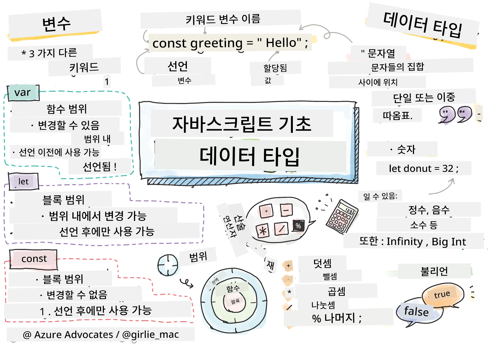
> 스케치노트 작성자 [Tomomi Imura](https://twitter.com/girlie_mac)

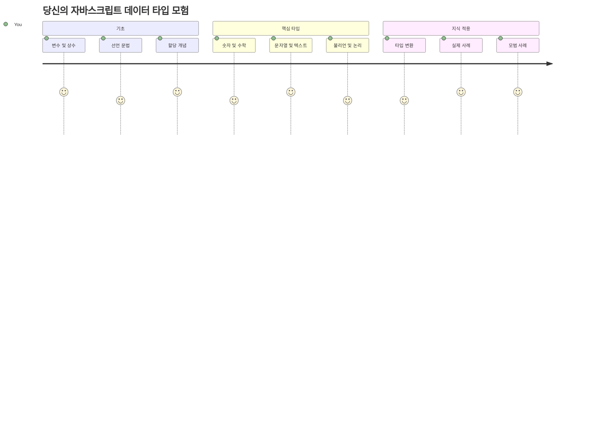
데이터 타입은 자바스크립트에서 작성하는 모든 프로그램에서 접하게 되는 기본 개념 중 하나입니다. 데이터 타입을 고대 알렉산드리아의 사서들이 사용하던 문서 보관 방식에 비유해 보세요 – 시, 수학, 역사 기록이 담긴 두루마리를 각각 다른 장소에 보관했죠. 자바스크립트도 다양한 종류의 데이터를 서로 다른 범주로 조직합니다.

이번 강의에서는 자바스크립트를 작동하게 하는 핵심 데이터 타입들을 알아봅니다. 숫자, 텍스트, 참/거짓 값을 다루는 방법과 올바른 타입을 선택하는 것이 왜 중요한지 배우게 될 것입니다. 처음에는 추상적으로 느껴질 수 있지만, 연습을 통해 자연스럽게 익히게 됩니다.

데이터 타입을 이해하면 자바스크립트의 다른 모든 것이 훨씬 명확해집니다. 건축가가 대성당을 짓기 전에 서로 다른 건축 자재를 이해해야 하듯, 이러한 기본 개념은 앞으로 만드는 모든 것들을 지탱해 줍니다.

## 강의 전 퀴즈
[강의 전 퀴즈](https://ff-quizzes.netlify.app/web/)

이번 강의는 웹에서 상호작용을 제공하는 자바스크립트의 기초를 다룹니다.

> 이 강의를 [Microsoft Learn](https://docs.microsoft.com/learn/modules/web-development-101-variables/?WT.mc_id=academic-77807-sagibbon)에서 수강할 수 있습니다!

[](https://youtube.com/watch?v=JNIXfGiDWM8 "Variables in JavaScript")

[](https://youtube.com/watch?v=AWfA95eLdq8 "Data Types in JavaScript")

> 🎥 위 이미지 클릭 시 변수와 데이터 타입에 대한 동영상을 볼 수 있습니다

변수와 그 안에 담기는 데이터 타입부터 시작해 봅시다!

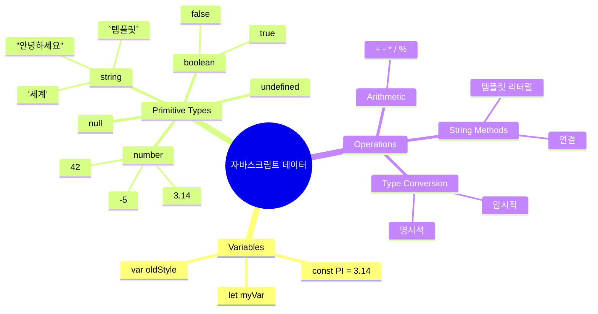
## 변수

변수는 프로그래밍의 기본적인 구성 요소입니다. 중세 연금술사들이 다양한 물질을 담기 위해 라벨이 붙은 병을 사용했던 것처럼, 변수는 정보를 저장하고 나중에 참조할 수 있도록 설명적인 이름을 부여할 수 있습니다. 누군가의 나이를 기억해야 하나요? `age`라는 변수에 저장하세요. 사용자 이름을 추적하고 싶나요? `userName`이라는 변수에 보관하세요.

이번에는 자바스크립트에서 변수를 생성하는 현대적 방식을 중점적으로 다룹니다. 여기서 배우는 기법은 수년간 언어가 진화해 오면서 프로그래밍 커뮤니티가 개발한 모범 사례를 반영합니다.

변수를 생성하고 **선언**하는 문법은 **[키워드] [이름]**입니다. 두 부분으로 구성됩니다:

- **키워드**. 변경 가능한 변수에는 `let`, 변하지 않는 값에는 `const`를 사용합니다.
- **변수 이름**, 이 부분은 직접 선택하는 설명적인 이름입니다.

✅ `let` 키워드는 ES6에서 도입되었으며 _블록 스코프_를 갖습니다. 오래된 `var` 대신 `let`이나 `const`를 사용하는 것이 권장됩니다. 블록 스코프에 관해서는 이후 강의에서 더 자세히 다루겠습니다.

### 과제 - 변수 다루기

1. **변수 선언**. 먼저 첫 변수를 만들어 봅시다:

    ```javascript
    let myVariable;
    ```

   **이 작업의 의미:**
   - 자바스크립트에게 `myVariable`이라는 저장 공간을 만들라고 지시
   - 이 변수에 메모리 공간을 할당함
   - 현재 이 변수는 값이 없음(정의되지 않은 상태)

2. **값 할당**. 이제 변수에 값을 넣어 봅시다:

    ```javascript
    myVariable = 123;
    ```

   **값 할당 방식:**
   - `=` 연산자가 변수에 값 123을 할당
   - 변수는 이제 정의되지 않은 상태가 아닌 123을 값으로 가짐
   - 코드 어디서든 `myVariable`로 이 값을 참조할 수 있음

   > 참고: 여기서 `=`는 할당 연산자로, 변수에 값을 설정하는 역할이며 동등함을 뜻하지 않습니다.

3. **효율적으로 작성하기**. 사실 이 두 단계를 하나로 합칠 수 있습니다:

    ```javascript
    let myVariable = 123;
    ```

    **이 방법의 장점:**
    - 변수 선언과 값 할당을 한문장으로 처리
    - 개발자들이 표준적으로 사용하는 스타일
    - 코드 길이를 줄이면서 명확성 유지

4. **값 변경하기**. 만약 다른 숫자를 저장하고 싶다면?

   ```javascript
   myVariable = 321;
   ```

   **재할당 이해하기:**
   - 변수 값이 123에서 321로 변경됨
   - 이전 값은 덮어쓰임 – 변수는 한 번에 오직 하나의 값만 저장
   - 이 가변성은 `let`으로 선언된 변수의 핵심 특성

   ✅ 직접 해보세요! 브라우저에서 자바스크립트를 실행할 수 있습니다. 브라우저 창에서 개발자 도구(Developer Tools)를 열고 콘솔에 `let myVariable = 123`을 입력한 다음 엔터, 그리고 `myVariable`을 입력해 결과를 확인하세요. 다음 강의에서 이 개념을 더 깊이 다룰 것입니다.

### 🧠 **변수 이해도 확인: 익숙해지기**

**변수에 대해 얼마나 이해했는지 확인해 봅시다:**
- 변수 선언과 할당의 차이점을 설명할 수 있나요?
- 변수를 선언하기 전에 사용하면 어떻게 되나요?
- 언제 `let`을 `const` 대신 선택하나요?

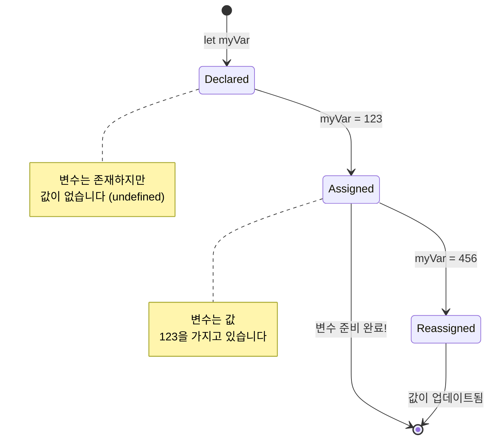
> **간단 팁**: 변수를 라벨이 붙은 저장 상자라고 생각하세요. 상자를 만들고(`let`), 그 안에 무언가를 넣고(`=`), 필요할 때 내용을 바꿀 수 있습니다!

## 상수

프로그램 실행 중 절대 변하지 않아야 하는 정보를 저장해야 할 때가 있습니다. 상수는 고대 그리스의 유클리드가 확립한 수학적 원리와 같습니다 – 한 번 증명되고 문서화되면 이후 모든 참조에서 고정되어 변하지 않죠.

상수는 변수와 비슷하지만 중요한 제한이 있습니다: 값을 할당하면 변경할 수 없습니다. 이런 불변성은 프로그램에서 중요한 값이 실수로 변경되는 것을 막아줍니다.

상수 선언과 초기화는 변수와 같은 개념을 따르지만 `const` 키워드를 사용합니다. 상수 이름은 일반적으로 모두 대문자로 선언합니다.

```javascript
const MY_VARIABLE = 123;
```

**이 코드는 다음을 수행합니다:**
- 값 123을 갖는 `MY_VARIABLE`이라는 상수를 생성
- 상수에는 대문자 이름 규칙 사용
- 이후 이 값은 변경할 수 없음

상수에 대한 두 가지 주요 규칙:

- **반드시 즉시 값을 할당해야 한다** – 빈 상수는 허용되지 않음
- **할당한 값을 절대 변경할 수 없다** – 변경 시 자바스크립트가 오류를 발생시킴. 확인해 봅시다:

   **단순 값** - 다음은 허용되지 않습니다:
   
      ```javascript
      const PI = 3;
      PI = 4; // 허용되지 않음
      ```

   **기억할 점:**
   - 상수를 재할당하려 시도하면 오류가 발생
   - 중요한 값을 실수로 변경하는 것을 방지
   - 프로그램 전체에서 값이 일관되게 유지됨
 
   **객체 참조는 보호됨** - 다음은 허용되지 않습니다:
   
      ```javascript
      const obj = { a: 3 };
      obj = { b: 5 } // 허용되지 않음
      ```

   **이 개념 이해하기:**
   - 객체 전체를 새 객체로 교체하는 것을 방지
   - 원래 객체에 대한 참조를 보호
   - 메모리 상에서 객체의 정체성을 유지

    **객체의 값은 보호되지 않음** - 다음은 허용됩니다:
    
      ```javascript
      const obj = { a: 3 };
      obj.a = 5;  // 허용됨
      ```

      **여기서 발생하는 일:**
      - 객체 내부의 속성 값을 수정
      - 같은 객체 참조 유지
      - 객체 내용은 변경 가능하지만 참조는 불변임을 보여줌

   > 참고로, `const`는 참조 자체를 재할당으로부터 보호하지만 값 자체가 _불변_인 것은 아닙니다. 특히 객체와 같이 복잡한 구조에서는 내부 값이 변경될 수 있습니다.

## 데이터 타입

자바스크립트는 정보를 데이터 타입이라는 다른 범주로 분류합니다. 이 개념은 고대 학자들이 지식을 분류한 방식과 유사합니다 – 아리스토텔레스는 다양한 추론 유형을 구분했으며, 논리적 원칙이 시, 수학, 자연철학에 동일하게 적용될 수 없음을 알았습니다.

데이터 타입이 중요한 이유는 서로 다른 연산이 서로 다른 종류의 정보와 작동하기 때문입니다. 사람 이름에 산술 연산을 할 수 없거나 수학적 방정식을 알파벳 순으로 정렬할 수 없는 것처럼, 자바스크립트도 각 연산에 맞는 적절한 데이터 타입이 필요합니다. 이를 이해하면 오류를 방지하고 코드를 더 신뢰성 있게 만들 수 있습니다.

변수는 숫자, 텍스트 등 다양한 타입의 값을 저장할 수 있습니다. 이러한 여러 값의 종류를 **데이터 타입**이라고 합니다. 데이터 타입은 개발자가 코드 작성 및 소프트웨어 실행 방식을 결정하는 데 중요한 역할을 합니다. 또한 일부 데이터 타입은 값에서 추가 정보를 변환하거나 추출하는 독특한 기능을 가지고 있습니다.

✅ 데이터 타입은 자바스크립트 데이터 원시값(JavaScript data primitives)이라고도 불리며, 언어가 제공하는 가장 낮은 수준의 데이터 타입입니다. 7가지 원시 타입이 있습니다: string, number, bigint, boolean, undefined, null, symbol. 각각이 무엇을 나타내는지 잠시 상상해 보세요. `zebra`는 무엇일까요? `0`은? `true`는?

### 숫자

숫자는 자바스크립트에서 가장 직관적인 데이터 타입입니다. 42 같은 정수, 3.14 같은 소수, -5 같은 음수 등을 사용할 때 자바스크립트는 모두 동일하게 취급합니다.

아까 변수에 저장했던 123도 실제로는 숫자 데이터 타입이었습니다:

```javascript
let myVariable = 123;
```

**핵심 특징:**
- 자바스크립트는 숫자 값을 자동으로 인식
- 수학 연산에 변수 사용 가능
- 명시적인 타입 선언이 필요 없음

변수는 소수점이 있는 숫자나 음수도 저장할 수 있습니다. 숫자는 [다음 섹션](../../../../2-js-basics/1-data-types)에서 다루는 산술 연산자와 함께 사용할 수 있습니다.

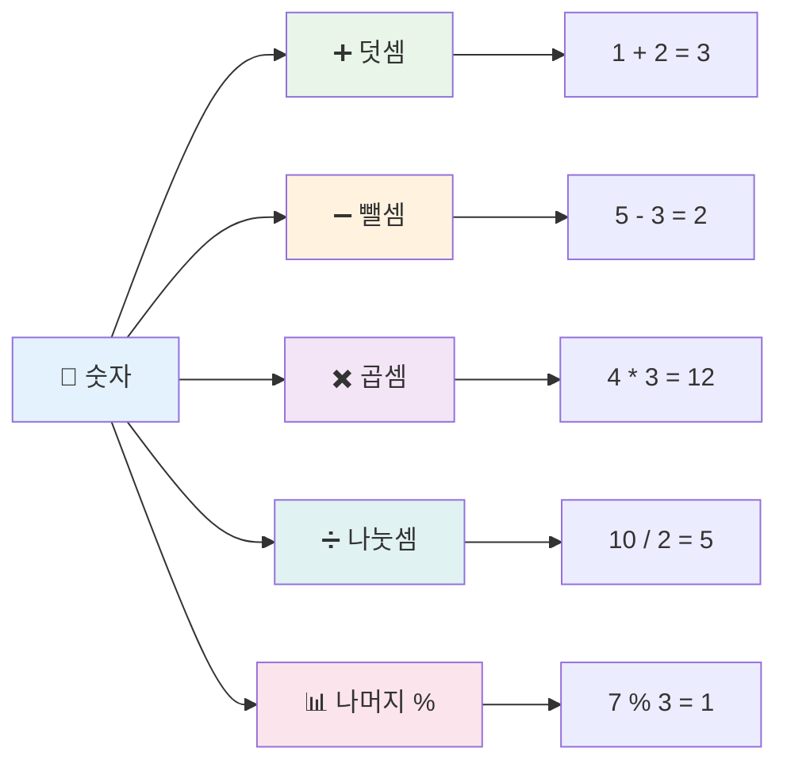
### 산술 연산자

산술 연산자는 자바스크립트에서 수학 계산을 수행하도록 합니다. 이 연산자들은 중세 수학자 알-콰리즈미가 개발한 대수 표기법과 같이 수세기 동안 사용된 수학 원칙을 따릅니다.

연산자는 전통적인 수학에서 기대하는 그대로 작동합니다: 더하기는 덧셈, 빼기는 뺄셈, 등등.

산술 기능을 수행할 때 사용할 수 있는 여러 연산자 중 일부는 다음과 같습니다:

| 기호   | 설명                                                               | 예시                            |
| ------ | ------------------------------------------------------------------ | ------------------------------- |
| `+`    | **덧셈**: 두 숫자의 합 계산                                         | `1 + 2 // 예상 결과는 3`        |
| `-`    | **뺄셈**: 두 숫자의 차 계산                                         | `1 - 2 // 예상 결과는 -1`       |
| `*`    | **곱셈**: 두 숫자의 곱 계산                                         | `1 * 2 // 예상 결과는 2`        |
| `/`    | **나눗셈**: 두 숫자의 몫 계산                                       | `1 / 2 // 예상 결과는 0.5`      |
| `%`    | **나머지**: 두 숫자의 나눗셈 후 나머지 계산                        | `1 % 2 // 예상 결과는 1`        |

✅ 직접 해보세요! 브라우저 콘솔에서 산술 연산을 시도해 보세요. 결과가 놀랍나요?

### 🧮 **수학 실력 점검: 자신 있게 계산하기**

**산술 이해도를 테스트해 봅시다:**
- `/`(나누기)와 `%`(나머지)의 차이는 무엇인가요?
- `10 % 3`은 무엇일지 예측해 보세요. (힌트: 3.33이 아닙니다...)
- 왜 나머지 연산자가 프로그래밍에서 유용할까요?

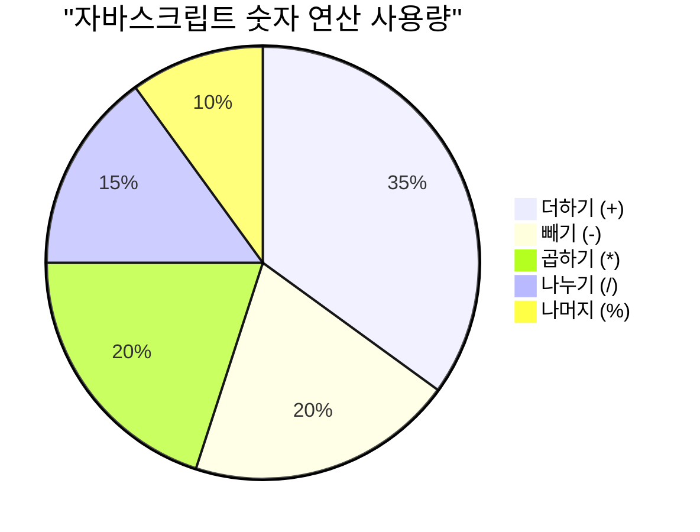
> **실전 팁**: 나머지 연산자(%)는 숫자가 짝수/홀수인지 확인하거나, 패턴을 만들거나, 배열을 순회할 때 매우 유용합니다!

### 문자열

자바스크립트에서 텍스트 데이터는 문자열(string)로 표현됩니다. '문자열'이라는 용어는 문자들이 줄줄이 연결된다는 의미에서 유래했습니다. 중세 수도원의 서기관들이 글자들을 연결해 단어와 문장을 만들던 방식과 유사합니다.

문자열은 웹 개발에 있어 기본적인 요소입니다. 웹사이트에 표시되는 모든 텍스트 – 사용자 이름, 버튼 레이블, 오류 메시지, 콘텐츠 등 – 는 모두 문자열 데이터입니다. 문자열을 이해하는 것은 실용적인 사용자 인터페이스를 만드는 데 필수적입니다.

문자열은 작은따옴표 또는 큰따옴표 사이에 위치한 문자 집합입니다.

```javascript
'This is a string'
"This is also a string"
let myString = 'This is a string value stored in a variable';
```

**이 개념을 이해합시다:**
- 문자열은 작은따옴표 `'` 또는 큰따옴표 `"`를 사용해 정의
- 문자, 숫자, 기호를 포함한 텍스트 데이터를 저장
- 변수에 문자열 값을 할당하여 나중에 사용 가능
- 문자열과 변수명을 구분하기 위해 따옴표를 반드시 사용해야 함

문자열을 작성할 때는 반드시 따옴표를 사용하세요. 그렇지 않으면 자바스크립트가 변수명으로 해석합니다.

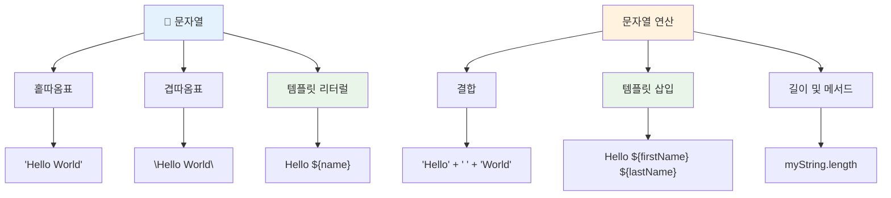
### 문자열 포맷팅

문자열 조작은 텍스트 요소를 합치거나 변수 삽입, 프로그램 상태에 반응하는 동적 콘텐츠 생성 등을 가능하게 합니다. 이 기법을 활용하면 프로그래밍 방식으로 텍스트를 구성할 수 있습니다.

종종 여러 문자열을 하나로 합쳐야 하는데, 이를 연결(concatenation)이라고 합니다.
두 개 이상의 문자열을 **이어 붙이거나** 함께 결합하려면 `+` 연산자를 사용하세요.

```javascript
let myString1 = "Hello";
let myString2 = "World";

myString1 + myString2 + "!"; //안녕 세상!
myString1 + " " + myString2 + "!"; //안녕하세요 세계!
myString1 + ", " + myString2 + "!"; //안녕, 세계!
```

**단계별로 무슨 일이 일어나는지 살펴보면:**
- `+` 연산자를 사용해 여러 문자열을 **결합**합니다
- 첫 번째 예제에서는 문자열 사이에 공백 없이 바로 **이어 붙입니다**
- 가독성을 위해 문자열 사이에 공백 문자 `" "`를 **추가**합니다
- 올바른 형식을 만들기 위해 쉼표 같은 구두점을 **삽입**합니다

✅ 왜 JavaScript에서는 `1 + 1 = 2` 이지만 `'1' + '1' = 11`일까요? 생각해 보세요. 그렇다면 `'1' + 1` 은요?

**템플릿 리터럴**은 문자열을 포맷하는 또 다른 방법으로, 따옴표 대신 백틱(backtick)을 사용합니다. 일반 텍스트가 아닌 부분은 `${ }` 안에 넣어야 합니다. 여기에는 문자열일 수 있는 변수들도 포함됩니다.

```javascript
let myString1 = "Hello";
let myString2 = "World";

`${myString1} ${myString2}!` //안녕하세요, 세상!
`${myString1}, ${myString2}!` //안녕하세요, 세상!
```

**각 부분을 이해해 봅시다:**
- 템플릿 리터럴을 만들 때 일반 따옴표 대신 백틱 `` ` `` 을 **사용**합니다
- `${}` 자리 표시자 구문을 사용해 변수를 직접 **삽입**합니다
- 작성한 대로 공백과 서식을 **정확하게 보존**합니다
- 변수와 함께 복잡한 문자열을 더 깔끔하게 만드는 방법을 **제공**합니다

어떤 방법으로도 포맷팅 목표를 달성할 수 있지만, 템플릿 리터럴은 공백과 줄바꿈을 정확히 반영합니다.

✅ 템플릿 리터럴을 평범한 문자열 대신 언제 사용해야 할까요?

### 🔤 **문자열 숙련도 점검: 텍스트 조작 자신감**

**문자열 실력을 평가해 봅시다:**
- 왜 `'1' + '1'`이 `2` 가 아닌 `'11'`인지 설명할 수 있나요?
- 문자열 결합과 템플릿 리터럴 중 어떤 문자열 방법이 더 읽기 쉬운가요?
- 문자열 주위에 따옴표를 빼먹으면 어떻게 될까요?

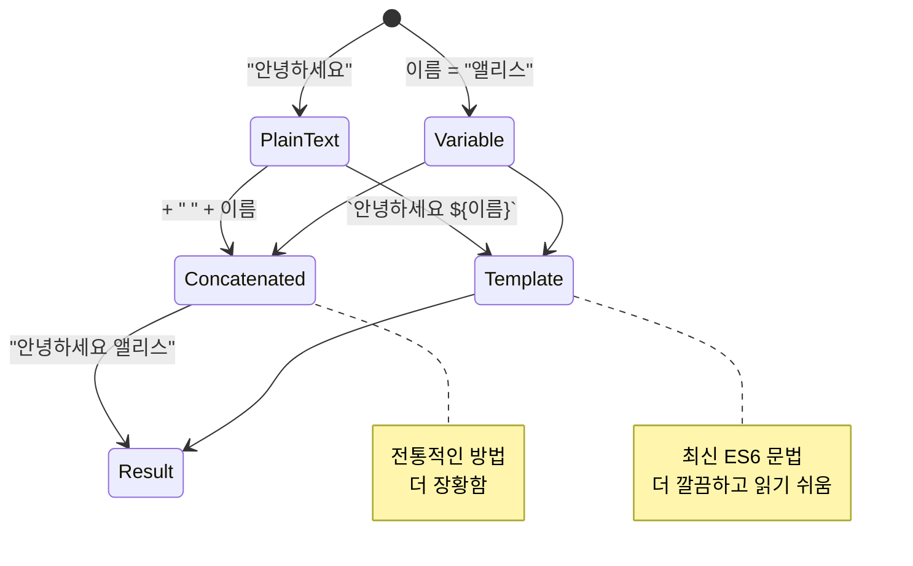
> **전문가 팁**: 템플릿 리터럴은 더 읽기 쉽고 여러 줄 문자열도 잘 처리하기 때문에 복잡한 문자열을 만들 때 일반적으로 선호됩니다!

### 불리언(Booleans)

불리언은 가장 단순한 형태의 데이터로, 오직 두 가지 값만 가질 수 있습니다 – `true` 또는 `false`. 이 이진 논리 시스템은 19세기 수학자 조지 불(George Boole)의 불 대수에서 유래했습니다.

단순함에도 불리하고, 불리언은 프로그램 논리에 필수적입니다. 사용자가 로그인했는지, 버튼이 클릭되었는지, 특정 조건이 충족되었는지에 따라 코드가 결정하도록 해 줍니다.

불리언 값은 오직 `true` 또는 `false` 둘 중 하나일 수 있습니다. 특정 조건이 충족되면 어떤 코드 줄이 실행될지 결정하는 데 도움을 줍니다. 많은 경우에 [연산자](../../../../2-js-basics/1-data-types)가 불리언 값을 설정하는 데 도움을 주며, 변수 초기화나 값 업데이트가 연산자를 통해 이루어지는 것을 자주 볼 수 있습니다.

```javascript
let myTrueBool = true;
let myFalseBool = false;
```

**위 예제에서:**
- 불리언 값 `true`를 저장하는 변수를 **생성**했습니다
- 불리언 값 `false`를 저장하는 방법을 **보여주었습니다**
- 따옴표 없이 정확한 키워드 `true`와 `false`를 **사용**했습니다
- 조건문에서 사용할 수 있도록 이 변수를 **준비**했습니다

✅ 변수는 불리언 `true`로 평가되면 'truthy'로 간주할 수 있습니다. 흥미롭게도 JavaScript에서는 [거짓으로 정의하지 않는 모든 값은 truthy](https://developer.mozilla.org/docs/Glossary/Truthy)입니다.

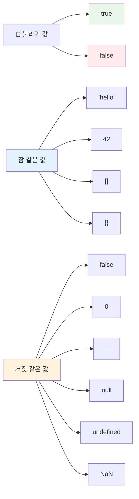
### 🎯 **불리언 논리 점검: 의사 결정 능력**

**불리언 이해도를 테스트해 보세요:**
- JavaScript에 `true`와 `false` 외에도 'truthy'와 'falsy' 값이 존재하는 이유는 무엇일까요?
- 다음 중 falsy인 값을 예측할 수 있나요: `0`, `"0"`, `[]`, `"false"`?
- 불리언은 프로그램 흐름을 제어하는 데 어떻게 유용할까요?

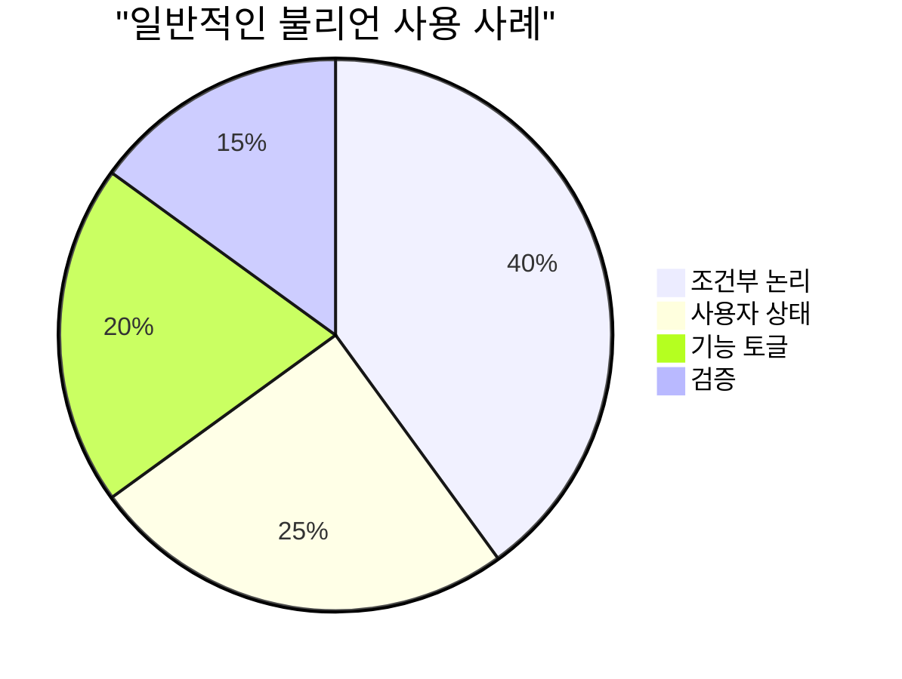
> **기억하세요**: JavaScript에서 falsy 값은 단 6가지입니다: `false`, `0`, `""`, `null`, `undefined`, `NaN`. 나머지는 모두 truthy입니다!

---

## 📊 **데이터 타입 도구 요약**

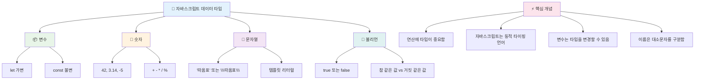
## GitHub Copilot 에이전트 챌린지 🚀

에이전트 모드를 사용해 다음 챌린지를 완료하세요:

**설명:** 이 수업에서 배운 모든 JavaScript 데이터 타입을 사용하고 실제 데이터 시나리오를 처리하는 개인 정보 관리자를 만드세요.

**프롬프트:** 이름(문자열), 나이(숫자), 학생 여부(불리언), 좋아하는 색 배열, 주소 객체(거리, 도시, 우편번호 포함)를 담은 사용자 프로필 객체를 생성하는 JavaScript 프로그램을 만드세요. 프로필 정보를 표시하고 개별 필드를 업데이트하는 함수도 포함하세요. 문자열 결합, 템플릿 리터럴, 나이를 이용한 산술 연산, 학생 여부 불리언 논리를 시연해야 합니다.

[에이전트 모드](https://code.visualstudio.com/blogs/2025/02/24/introducing-copilot-agent-mode)에 대해 더 알아보세요.

## 🚀 챌린지

JavaScript에는 개발자를 놀라게 할 수 있는 동작들이 있습니다. 고전적인 예를 하나 살펴볼까요: 브라우저 콘솔에 `let age = 1; let Age = 2; age == Age`를 입력해보세요. 결과는 `false`입니다 – 이유를 알겠나요?

이것은 JavaScript 동작 중 하나일 뿐입니다. 이런 특성을 익히면 더 신뢰성 있는 코드를 작성하고 디버깅 능력을 높일 수 있습니다.

## 강의 후 퀴즈  
[강의 후 퀴즈](https://ff-quizzes.netlify.app)

## 복습 및 자체 학습

[이 JavaScript 연습 문제 목록](https://css-tricks.com/snippets/javascript/)을 살펴보고 하나씩 도전해 보세요. 무엇을 배웠나요?

## 과제

[데이터 타입 연습](assignment.md)

## 🚀 JavaScript 데이터 타입 숙련도 타임라인

### ⚡ **다음 5분 동안 할 수 있는 일**
- [ ] 브라우저 콘솔을 열고 서로 다른 데이터 타입 3개 변수 만들기
- [ ] 챌린지 시도: `let age = 1; let Age = 2; age == Age`가 false인 이유 찾기
- [ ] 이름과 좋아하는 숫자를 문자열 결합해 보기
- [ ] 숫자와 문자열을 더했을 때 어떤 일이 일어나는지 테스트하기

### 🎯 **이번 시간 내 달성할 수 있는 목표**
- [ ] 강의 후 퀴즈 완료 및 헷갈리는 개념 복습하기
- [ ] 두 숫자를 더하고 빼고 곱하고 나누는 간단한 계산기 만들기
- [ ] 템플릿 리터럴을 활용한 이름 포맷터 만들기
- [ ] `==` 와 `===` 비교 연산자의 차이 탐색하기
- [ ] 서로 다른 데이터 타입 간 변환 연습하기

### 📅 **이번 주 JavaScript 기초 완성**
- [ ] 과제를 자신감과 창의성으로 완수하기
- [ ] 배운 모든 데이터 타입을 포함한 개인 프로필 객체 만들기
- [ ] [CSS-Tricks JavaScript 연습문제](https://css-tricks.com/snippets/javascript/) 도전하기
- [ ] 불리언 논리를 활용한 간단한 폼 검증기 만들기
- [ ] 배열과 객체 데이터 타입 실습(예고편)
- [ ] JavaScript 커뮤니티에 참여해 데이터 타입 관련 질문하기

### 🌟 **이번 달 JavaScript 실력 향상**
- [ ] 데이터 타입 지식을 큰 프로젝트에 통합하기
- [ ] 실제 애플리케이션에서 각 데이터 타입을 언제, 왜 사용하는지 이해하기
- [ ] 초보자에게 JavaScript 기본 개념 설명 도와주기
- [ ] 다양한 사용자 데이터를 관리하는 작은 애플리케이션 만들기
- [ ] 타입 강제 변환, 엄격 동등 비교 같은 고급 데이터 타입 개념 탐색하기
- [ ] 오픈 소스 JavaScript 프로젝트에 문서 개선으로 기여하기

### 🧠 **최종 데이터 타입 숙련도 점검**

**JavaScript 기초 완성 축하:**
- 어떤 데이터 타입 동작이 가장 놀라웠나요?
- 변수와 상수 차이를 친구에게 설명하는 데 얼마나 자신 있나요?
- JavaScript 타입 시스템에 관해 가장 흥미롭게 발견한 점은 무엇인가요?
- 이 기본 지식을 활용해 어떤 실제 애플리케이션을 만들고 싶나요?

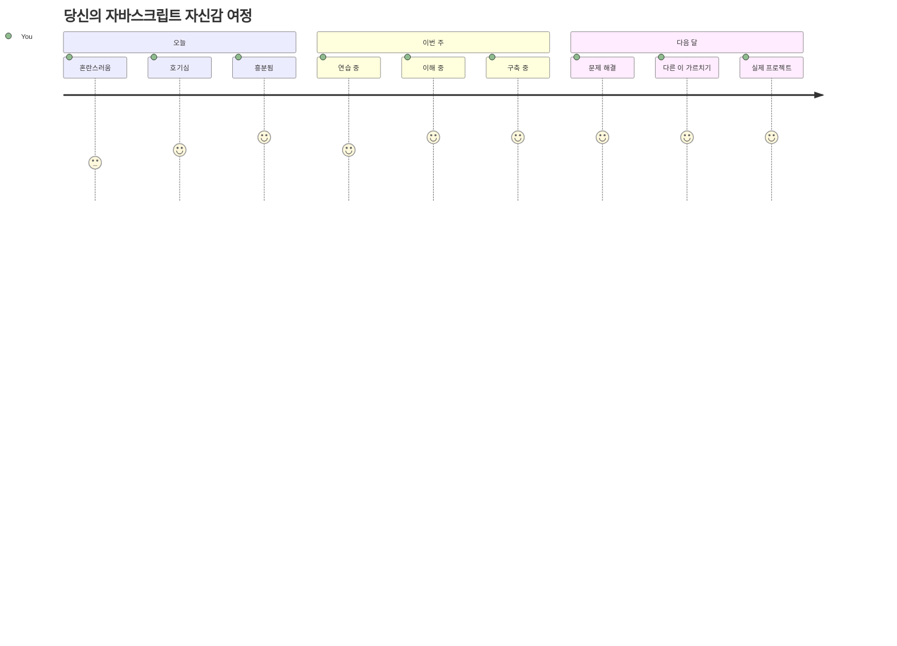
> 💡 **기반을 다졌습니다!** 데이터 타입을 이해하는 것은 이야기 쓰기 전에 알파벳을 배우는 것과 같습니다. 앞으로 작성할 모든 JavaScript 프로그램은 이 기본 개념들을 사용할 것입니다. 이제 인터랙티브 웹사이트, 동적 애플리케이션 만들기와 실제 문제 해결을 코드로 할 수 있는 토대를 마련했습니다. 멋진 JavaScript 세계에 오신 것을 환영합니다! 🎉

---

<!-- CO-OP TRANSLATOR DISCLAIMER START -->
**면책 조항**:  
이 문서는 AI 번역 서비스 [Co-op Translator](https://github.com/Azure/co-op-translator)를 사용하여 번역되었습니다. 정확성을 위해 노력하고 있으나, 자동 번역에는 오류나 부정확한 부분이 있을 수 있음을 유의하시기 바랍니다. 원본 문서는 해당 언어의 원본 문서가 권위 있는 자료로 간주되어야 합니다. 중요한 정보에 대해서는 전문적인 인간 번역을 권장합니다. 본 번역 사용으로 인해 발생하는 모든 오해나 오역에 대해서는 책임을 지지 않습니다.
<!-- CO-OP TRANSLATOR DISCLAIMER END -->