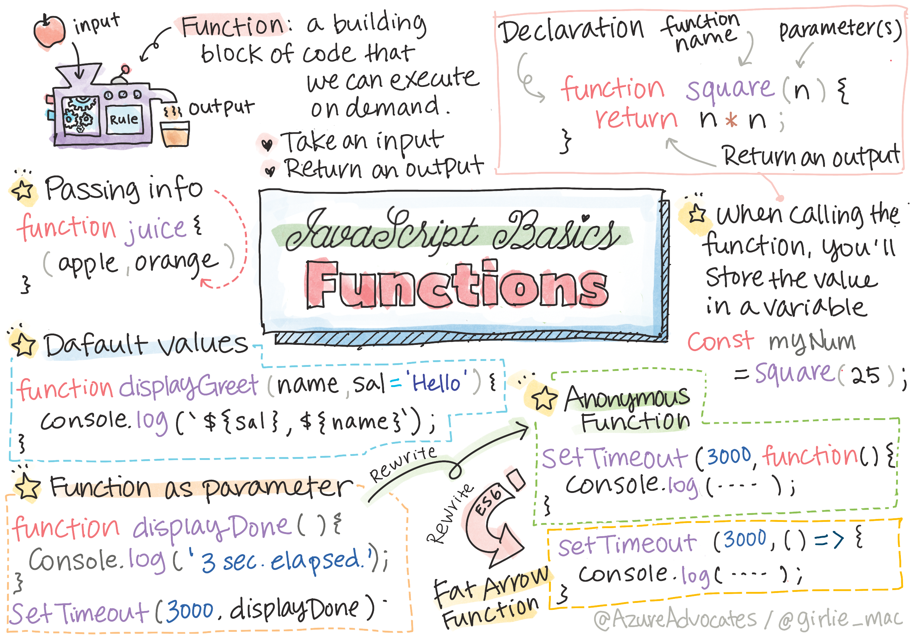

<!--
CO_OP_TRANSLATOR_METADATA:
{
  "original_hash": "b4612bbb9ace984f374fcc80e3e035ad",
  "translation_date": "2025-08-23T22:42:23+00:00",
  "source_file": "2-js-basics/2-functions-methods/README.md",
  "language_code": "ko"
}
-->
# JavaScript 기초: 메서드와 함수


> 스케치노트 제공: [Tomomi Imura](https://twitter.com/girlie_mac)

## 강의 전 퀴즈
[강의 전 퀴즈](https://ff-quizzes.netlify.app/web/quiz/9)

코드를 작성할 때, 항상 코드가 읽기 쉬운지 확인하는 것이 중요합니다. 이 말이 직관적이지 않게 들릴 수 있지만, 코드는 작성되는 것보다 읽히는 경우가 훨씬 더 많습니다. 개발자가 유지보수 가능한 코드를 작성하기 위해 사용하는 핵심 도구 중 하나가 바로 **함수**입니다.

[](https://youtube.com/watch?v=XgKsD6Zwvlc "Methods and Functions")

> 🎥 위 이미지를 클릭하면 메서드와 함수에 대한 동영상을 볼 수 있습니다.

> 이 강의를 [Microsoft Learn](https://docs.microsoft.com/learn/modules/web-development-101-functions/?WT.mc_id=academic-77807-sagibbon)에서 수강할 수 있습니다!

## 함수

함수는 기본적으로 우리가 필요할 때 실행할 수 있는 코드 블록입니다. 동일한 작업을 여러 번 수행해야 하는 경우에 적합합니다. 동일한 로직을 여러 위치에 복제하는 대신(업데이트가 필요할 때 어려워질 수 있음), 한 곳에 중앙 집중화하여 필요할 때마다 호출할 수 있습니다. 심지어 다른 함수에서 함수를 호출할 수도 있습니다!

함수의 이름을 지정할 수 있는 기능도 매우 중요합니다. 이것이 사소하게 들릴 수 있지만, 이름은 코드 섹션을 빠르게 문서화하는 방법을 제공합니다. 버튼에 붙은 라벨처럼 생각할 수 있습니다. "타이머 취소"라고 적힌 버튼을 클릭하면 시계가 멈출 것이라는 것을 알 수 있습니다.

## 함수 생성 및 호출

함수의 문법은 다음과 같습니다:

```javascript
function nameOfFunction() { // function definition
 // function definition/body
}
```

예를 들어, 인사말을 표시하는 함수를 만들고 싶다면 다음과 같이 작성할 수 있습니다:

```javascript
function displayGreeting() {
  console.log('Hello, world!');
}
```

함수를 호출(또는 실행)하려면 함수 이름 뒤에 `()`를 사용합니다. 함수는 호출하기 전에 정의되거나 호출 후에 정의될 수 있습니다. JavaScript 컴파일러가 이를 찾아줍니다.

```javascript
// calling our function
displayGreeting();
```

> **NOTE:** **메서드**라는 특별한 유형의 함수가 있습니다. 이미 사용해본 적이 있을 겁니다! 사실, 위의 데모에서 `console.log`를 사용할 때 이를 보았습니다. 메서드와 함수의 차이점은 메서드는 객체에 연결되어 있다는 점입니다(예: `console`), 반면 함수는 독립적으로 존재합니다. 많은 개발자들이 이 용어를 혼용해서 사용하기도 합니다.

### 함수 작성 시 모범 사례

함수를 작성할 때 염두에 두어야 할 몇 가지 모범 사례가 있습니다:

- 항상 함수가 수행할 작업을 알 수 있도록 설명적인 이름을 사용하세요.
- 단어를 결합할 때 **camelCasing**을 사용하세요.
- 특정 작업에 집중하도록 함수를 작성하세요.

## 함수에 정보 전달하기

함수를 더 재사용 가능하게 만들기 위해 종종 정보를 전달하고 싶을 때가 있습니다. 위의 `displayGreeting` 예제를 고려해보면, 이 함수는 **Hello, world!**만 표시합니다. 가장 유용한 함수는 아니겠죠. 이를 조금 더 유연하게 만들어서 인사할 사람의 이름을 지정할 수 있도록 하려면 **매개변수**를 추가할 수 있습니다. 매개변수(때로는 **인자**라고도 함)는 함수에 전달되는 추가 정보입니다.

매개변수는 정의 부분에서 괄호 안에 나열되며 쉼표로 구분됩니다:

```javascript
function name(param, param2, param3) {

}
```

`displayGreeting`을 업데이트하여 이름을 받아 표시할 수 있도록 만들 수 있습니다.

```javascript
function displayGreeting(name) {
  const message = `Hello, ${name}!`;
  console.log(message);
}
```

함수를 호출하고 매개변수를 전달하려면 괄호 안에 값을 지정합니다.

```javascript
displayGreeting('Christopher');
// displays "Hello, Christopher!" when run
```

## 기본값

함수에 더 많은 매개변수를 추가하여 더욱 유연하게 만들 수 있습니다. 하지만 모든 값을 반드시 지정해야 한다면 어떨까요? 인사말 예제를 계속 사용해보면, 이름은 필수로 남겨두고(누구에게 인사할지 알아야 하니까요), 인사말 자체는 원하는 대로 사용자 정의할 수 있도록 하고 싶습니다. 사용자가 사용자 정의를 원하지 않는 경우 기본값을 제공합니다. 매개변수에 기본값을 제공하려면 변수에 값을 설정하는 것과 비슷한 방식으로 설정합니다 - `parameterName = 'defaultValue'`. 전체 예제는 다음과 같습니다:

```javascript
function displayGreeting(name, salutation='Hello') {
  console.log(`${salutation}, ${name}`);
}
```

함수를 호출할 때 `salutation` 값을 설정할지 여부를 결정할 수 있습니다.

```javascript
displayGreeting('Christopher');
// displays "Hello, Christopher"

displayGreeting('Christopher', 'Hi');
// displays "Hi, Christopher"
```

## 반환값

지금까지 우리가 만든 함수는 항상 [console](https://developer.mozilla.org/docs/Web/API/console)에 출력됩니다. 때로는 이것이 우리가 원하는 것일 수 있습니다. 특히 다른 서비스를 호출하는 함수를 만들 때 그렇습니다. 하지만 계산을 수행하고 값을 반환하여 다른 곳에서 사용할 수 있도록 돕는 보조 함수를 만들고 싶다면 어떻게 해야 할까요?

이를 위해 **반환값**을 사용할 수 있습니다. 반환값은 함수에 의해 반환되며, 문자열이나 숫자와 같은 리터럴 값처럼 변수에 저장할 수 있습니다.

함수가 무언가를 반환한다면 `return` 키워드를 사용합니다. `return` 키워드는 반환할 값이나 참조를 기대합니다:

```javascript
return myVariable;
```  

인사말 메시지를 생성하고 호출자에게 값을 반환하는 함수를 만들 수 있습니다.

```javascript
function createGreetingMessage(name) {
  const message = `Hello, ${name}`;
  return message;
}
```

이 함수를 호출할 때 값을 변수에 저장합니다. 이는 정적 값(예: `const name = 'Christopher'`)을 변수에 설정하는 방식과 매우 유사합니다.

```javascript
const greetingMessage = createGreetingMessage('Christopher');
```

## 함수의 매개변수로 함수 전달하기

프로그래밍 경력이 발전함에 따라 함수의 매개변수로 함수를 전달하는 경우를 접하게 될 것입니다. 이 멋진 트릭은 어떤 일이 발생하거나 완료될 시점을 알 수 없지만, 이에 대한 응답으로 작업을 수행해야 할 때 자주 사용됩니다.

예를 들어 [setTimeout](https://developer.mozilla.org/docs/Web/API/WindowOrWorkerGlobalScope/setTimeout)을 고려해보세요. 이 함수는 타이머를 시작하고 완료되었을 때 코드를 실행합니다. 실행할 코드를 알려줘야 합니다. 함수가 딱 적합한 역할을 할 것 같지 않나요?

아래 코드를 실행하면 3초 후에 **3 seconds has elapsed** 메시지가 표시됩니다.

```javascript
function displayDone() {
  console.log('3 seconds has elapsed');
}
// timer value is in milliseconds
setTimeout(displayDone, 3000);
```

### 익명 함수

우리가 만든 것을 다시 살펴보겠습니다. 한 번만 사용될 이름을 가진 함수를 만들고 있습니다. 애플리케이션이 더 복잡해지면 한 번만 호출될 함수들을 많이 만들게 될 것입니다. 이는 이상적이지 않습니다. 사실, 항상 이름을 제공할 필요는 없습니다!

함수를 매개변수로 전달할 때 미리 하나를 만들지 않고 매개변수의 일부로 바로 작성할 수 있습니다. 동일한 `function` 키워드를 사용하지만 매개변수로 작성합니다.

위 코드를 익명 함수를 사용하도록 다시 작성해봅시다:

```javascript
setTimeout(function() {
  console.log('3 seconds has elapsed');
}, 3000);
```

새 코드를 실행하면 동일한 결과를 얻을 수 있습니다. 이름을 지정하지 않고도 함수를 만들었습니다!

### 화살표 함수

많은 프로그래밍 언어(특히 JavaScript)에서 공통적으로 사용되는 단축 방법 중 하나는 **화살표** 또는 **굵은 화살표** 함수입니다. 이는 `=>`라는 특별한 표시를 사용하며, 화살표처럼 생겼기 때문에 이름이 붙었습니다! `=>`를 사용하면 `function` 키워드를 생략할 수 있습니다.

코드를 한 번 더 다시 작성하여 화살표 함수를 사용해봅시다:

```javascript
setTimeout(() => {
  console.log('3 seconds has elapsed');
}, 3000);
```

### 각 전략을 사용할 시점

이제 매개변수로 함수를 전달하는 세 가지 방법을 보았고, 각각을 언제 사용해야 할지 궁금할 수 있습니다. 함수가 여러 번 사용될 것임을 알고 있다면 일반적으로 작성하세요. 특정 위치에서만 사용할 것이라면 익명 함수를 사용하는 것이 일반적으로 가장 좋습니다. 화살표 함수와 전통적인 `function` 문법 중 어느 것을 사용할지는 개인의 선택이지만, 대부분의 현대 개발자들은 `=>`를 선호한다는 것을 알게 될 것입니다.

---

## 🚀 도전

함수와 메서드의 차이를 한 문장으로 설명할 수 있나요? 시도해보세요!

## 강의 후 퀴즈
[강의 후 퀴즈](https://ff-quizzes.netlify.app/web/quiz/10)

## 복습 및 자기 학습

[화살표 함수에 대해 조금 더 읽어보는 것](https://developer.mozilla.org/docs/Web/JavaScript/Reference/Functions/Arrow_functions)은 가치가 있습니다. 이는 점점 더 많은 코드베이스에서 사용되고 있습니다. 함수를 작성한 후 이 문법으로 다시 작성해보세요.

## 과제

[Fun with Functions](assignment.md)

**면책 조항**:  
이 문서는 AI 번역 서비스 [Co-op Translator](https://github.com/Azure/co-op-translator)를 사용하여 번역되었습니다. 정확성을 위해 최선을 다하고 있지만, 자동 번역에는 오류나 부정확성이 포함될 수 있습니다. 원본 문서를 해당 언어로 작성된 상태에서 권위 있는 자료로 간주해야 합니다. 중요한 정보의 경우, 전문적인 인간 번역을 권장합니다. 이 번역 사용으로 인해 발생하는 오해나 잘못된 해석에 대해 당사는 책임을 지지 않습니다.