<!--
CO_OP_TRANSLATOR_METADATA:
{
  "original_hash": "71f7d7dafa1c7194d79ddac87f669ff9",
  "translation_date": "2026-01-06T14:47:29+00:00",
  "source_file": "2-js-basics/2-functions-methods/README.md",
  "language_code": "ko"
}
-->
# JavaScript 기초: 메서드와 함수


> 스케치노트 by [Tomomi Imura](https://twitter.com/girlie_mac)

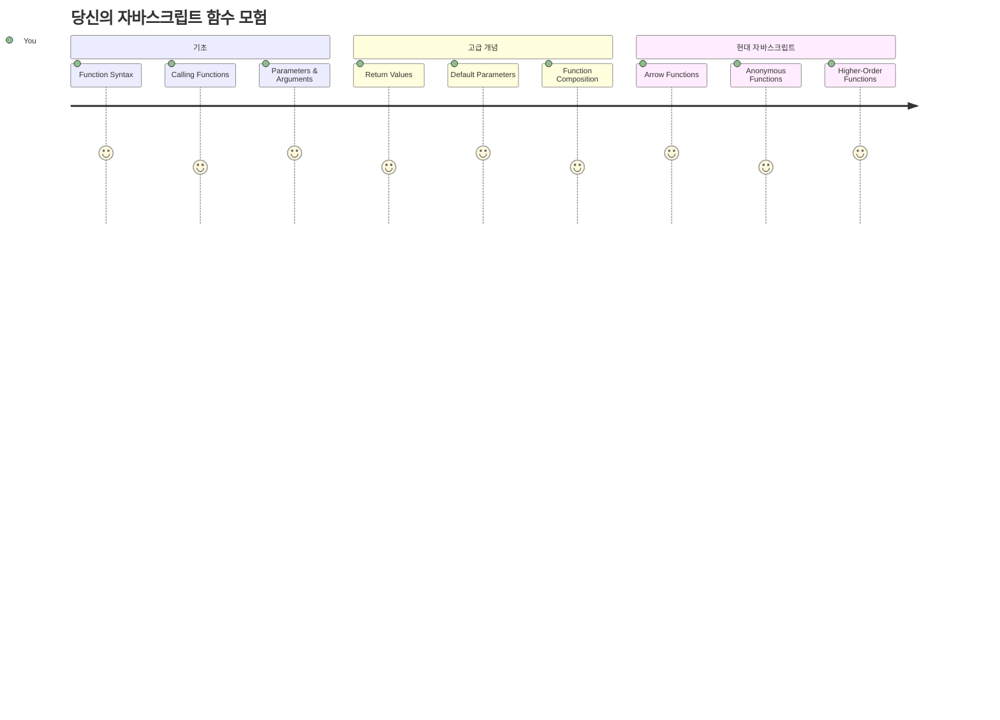
## 강의 전 퀴즈
[강의 전 퀴즈](https://ff-quizzes.netlify.app)

같은 코드를 반복해서 작성하는 것은 프로그래밍에서 가장 흔한 좌절 중 하나입니다. 함수는 코드를 재사용 가능한 블록으로 묶어 이 문제를 해결해 줍니다. 함수를 헨리 포드의 조립 라인을 혁신적으로 만든 표준화된 부품과 같이 생각해 보세요 — 한 번 신뢰할 수 있는 부품을 만들면 어디서든 새로 만들지 않고 사용할 수 있습니다.

함수는 코드 조각을 묶어 프로그램 전체에서 재사용할 수 있게 해줍니다. 같은 로직을 복사해서 붙여넣는 대신 함수를 한 번 만들고 필요할 때마다 호출할 수 있습니다. 이 방식은 코드를 체계적으로 유지하고 수정 작업을 훨씬 쉽게 만듭니다.

이번 수업에서는 직접 함수를 만드는 방법, 정보 전달 방법, 유용한 결과를 받는 방법을 배웁니다. 함수와 메서드의 차이를 이해하고, 최신 문법 방식을 배우며, 함수들이 서로 어떻게 작동하는지 단계별로 살펴봅니다.

[](https://youtube.com/watch?v=XgKsD6Zwvlc "Methods and Functions")

> 🎥 위 이미지를 클릭하면 메서드와 함수에 관한 영상을 볼 수 있습니다.

> 이 수업은 [Microsoft Learn](https://docs.microsoft.com/learn/modules/web-development-101-functions/?WT.mc_id=academic-77807-sagibbon)에서도 수강할 수 있습니다!

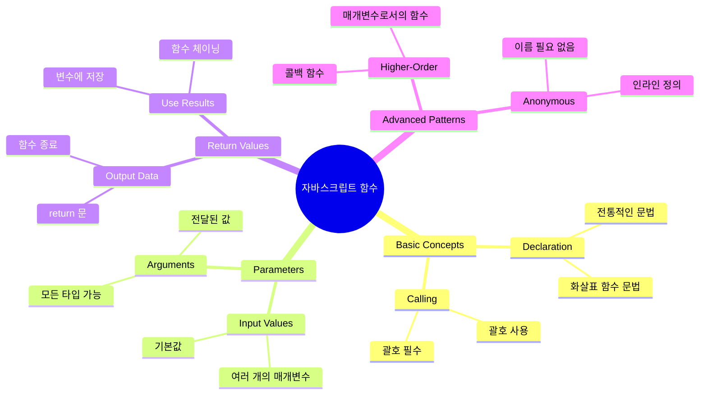
## 함수

함수는 특정 작업을 수행하는 독립적인 코드 블록입니다. 필요할 때마다 실행할 수 있는 로직을 캡슐화합니다.

프로그램 전반에 걸쳐 같은 코드를 여러 번 작성하는 대신, 함수를 만들어 필요할 때 호출할 수 있습니다. 이 방식은 코드를 깔끔하게 유지하며 수정하기 훨씬 용이합니다. 만약 코드베이스의 20군데에 흩어져 있는 로직을 수정해야 한다면 유지보수가 얼마나 어려운지 상상해 보세요.

함수에 의미 있는 이름을 부여하는 것이 중요합니다. 잘 지어진 함수 이름은 그 목적을 명확하게 전달합니다 — `cancelTimer()`를 보면 즉시 그 역할을 이해할 수 있듯이, 버튼에 명확한 라벨이 붙어 있으면 클릭했을 때 무슨 일이 일어날지 바로 알 수 있습니다.

## 함수 생성 및 호출

함수를 생성하는 방식을 살펴봅시다. 문법은 일관된 패턴을 따릅니다:

```javascript
function nameOfFunction() { // 함수 정의
 // 함수 정의/본문
}
```

분해해 보면:
- `function` 키워드는 자바스크립트에게 "나는 함수를 만들 거야!"라고 알립니다
- `nameOfFunction`은 함수에 의미 있는 이름을 부여하는 자리입니다
- 괄호 `()` 안에는 나중에 배울 매개변수를 넣을 수 있습니다
- 중괄호 `{}` 안에는 함수가 호출될 때 실행되는 실제 코드가 들어갑니다

간단한 인사 함수 예제로 확인해 봅시다:

```javascript
function displayGreeting() {
  console.log('Hello, world!');
}
```

이 함수는 콘솔에 "Hello, world!"를 출력합니다. 한 번 정의해 두면 필요할 때 여러 번 사용할 수 있습니다.

함수를 실행(호출)하려면 함수 이름 뒤에 괄호를 적으면 됩니다. 자바스크립트는 함수 정의 위치와 호출 위치가 달라도 실행 순서를 자동으로 처리합니다.

```javascript
// 우리의 함수를 호출합니다
displayGreeting();
```

이 줄을 실행하면 `displayGreeting` 함수 내부의 모든 코드가 실행되어 브라우저 콘솔에 "Hello, world!"가 표시됩니다. 이 함수를 반복해서 여러 번 호출할 수 있습니다.

### 🧠 **함수 기본 점검: 첫 함수 만들기**

**기본 함수에 대해 점검해 봅시다:**
- 함수 정의에 중괄호 `{}`를 사용하는 이유는 무엇일까요?
- `displayGreeting`을 괄호 없이 작성하면 어떻게 될까요?
- 같은 함수를 여러 번 호출하는 이유는 무엇일까요?

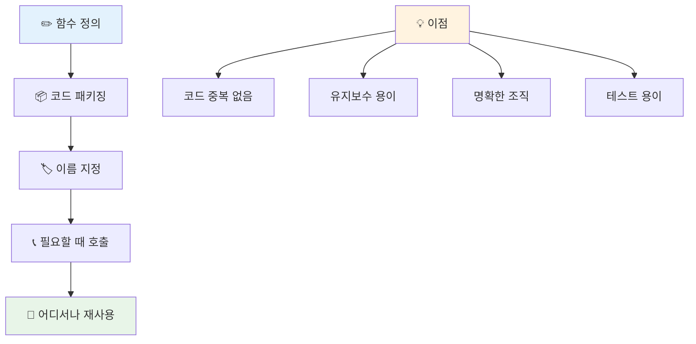
> **참고:** 지금까지 수업 내내 **메서드**를 사용해 왔습니다. `console.log()`는 메서드로, 본질적으로 `console` 객체에 속한 함수입니다. 메서드와 함수의 주요 차이점은 메서드는 객체에 붙어있지만 함수는 독립적입니다. 많은 개발자들이 일상 대화에서 두 용어를 혼용하기도 합니다.

### 함수 작성 모범 사례

훌륭한 함수를 작성하기 위한 몇 가지 팁입니다:

- 함수 이름을 명확하고 의미 있게 지으세요 — 미래의 내 당신이 고마워 할 겁니다!
- 여러 단어로 된 이름은 **camelCase** 스타일을 사용하세요 (예: `calculateTotal`, `calculate_total`이 아님)
- 각 함수는 한 가지 작업에 집중하도록 작성하세요

## 함수에 정보 전달하기

우리의 `displayGreeting` 함수는 제한적입니다 — 항상 "Hello, world!"만 표시할 수 있습니다. 매개변수(parameter)는 함수가 더 유연하고 유용하게 작동하도록 도와줍니다.

**매개변수**는 함수가 호출될 때마다 다른 값을 넣을 수 있는 자리 표시자와 같습니다. 이렇게 하면 같은 함수가 각 호출마다 다른 정보를 처리할 수 있습니다.

함수 정의 시 괄호 안에 매개변수를 쉼표로 구분하여 나열합니다:

```javascript
function name(param, param2, param3) {

}
```

각 매개변수는 자리표시자와 같아서, 함수를 호출하는 사람이 실제 값을 넣어 해당 자리에 할당됩니다.

인사 함수에 사람 이름을 받도록 바꿔 봅시다:

```javascript
function displayGreeting(name) {
  const message = `Hello, ${name}!`;
  console.log(message);
}
```

이 예제에서는 백틱(`` ` ``)과 `${}`를 사용해 이름을 메시지에 직접 넣었습니다 — 이를 템플릿 리터럴(template literal)이라고 하며, 변수와 문자열을 섞어 만들 때 아주 유용한 방법입니다.

함수를 호출할 때 임의의 이름을 전달할 수 있습니다:

```javascript
displayGreeting('Christopher');
// 실행 시 "안녕하세요, 크리스토퍼!"를 표시합니다
```

자바스크립트가 문자열 `'Christopher'`를 `name` 매개변수에 할당하고 "Hello, Christopher!"라는 개인화 메시지를 만듭니다.

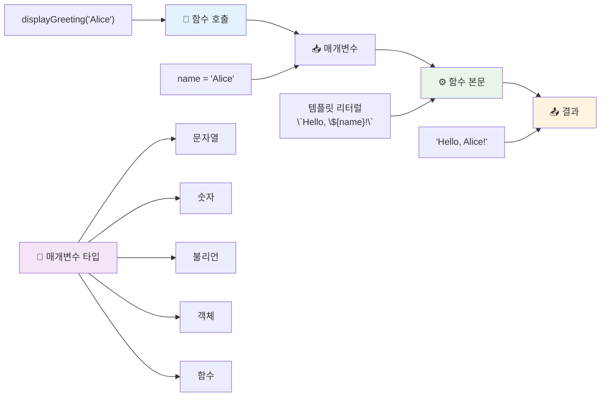
## 기본값 설정

어떤 매개변수를 선택적(optional)으로 만들고 싶을 때는 기본값(default values)을 설정하면 편리합니다!

예를 들어 인사말 단어를 바꾸게 하되, 지정하지 않으면 기본적으로 "Hello"를 사용하게 할 수 있습니다. 기본값은 변수에 값을 할당하듯 등호(`=`)로 지정합니다:

```javascript
function displayGreeting(name, salutation='Hello') {
  console.log(`${salutation}, ${name}`);
}
```

여기서 `name`은 필수이며, `salutation`은 따로 지정하지 않으면 `'Hello'`가 기본으로 할당됩니다.

이제 이 함수를 두 가지 방식으로 호출할 수 있습니다:

```javascript
displayGreeting('Christopher');
// "안녕하세요, 크리스토퍼"를 표시합니다

displayGreeting('Christopher', 'Hi');
// "안녕, 크리스토퍼"를 표시합니다
```

첫 번째 호출에서는 인사말을 지정하지 않았으니 자바스크립트는 기본값 "Hello"를 사용합니다. 두 번째 호출은 "Hi"라는 커스텀 인사말을 사용합니다. 이런 유연성 덕분에 함수가 다양한 상황에 적응할 수 있습니다.

### 🎛️ **매개변수 이해 점검: 함수 유연성 확보**

**매개변수 이해도를 테스트해 봅시다:**
- 매개변수(parameter)와 인수(argument)의 차이는 무엇인가요?
- 실무에서 기본값이 왜 유용할까요?
- 매개변수보다 더 많은 인수를 전달하면 어떻게 될까요?

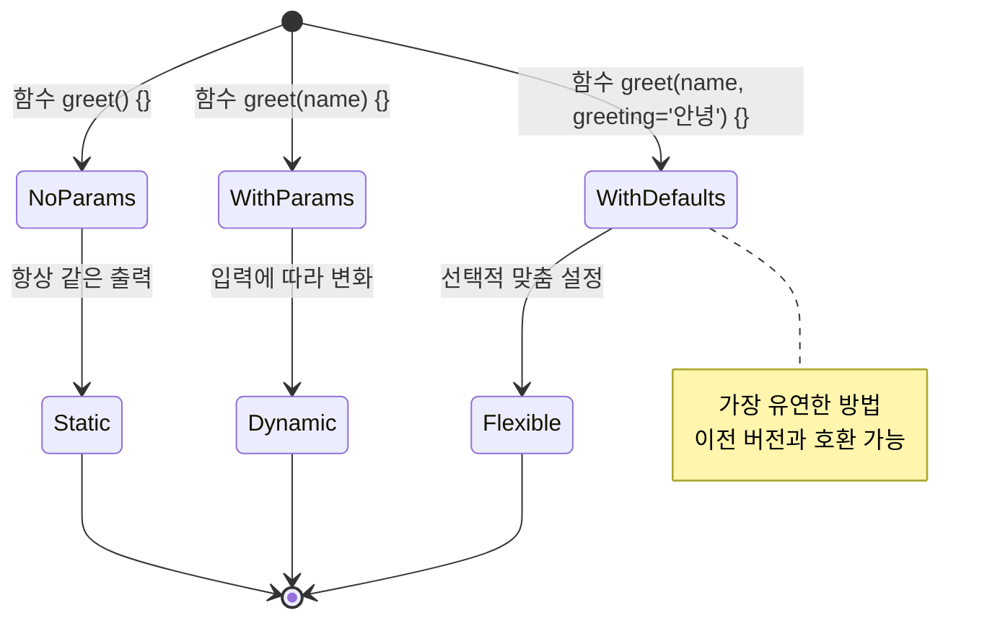
> **전문가 팁**: 기본 매개변수는 함수를 더 사용자 친화적으로 만듭니다. 사용자는 합리적 기본값으로 쉽게 시작할 수 있고 필요 시 맞춤 설정할 수도 있습니다!

## 반환값 (Return values)

지금까지 함수는 메시지를 콘솔에 출력만 했지만, 계산 결과를 함수가 반환하게 하고 싶을 때는 어떻게 할까요?

이때 **반환값**을 사용합니다. 함수가 무엇인가를 출력하는 대신, 값을 돌려주면 변수에 저장하거나 다른 코드에서 활용할 수 있습니다.

값을 돌려주려면 `return` 키워드 뒤에 반환할 값을 적으면 됩니다:

```javascript
return myVariable;
```

중요한 점: 함수가 `return` 명령문을 만나면 즉시 종료되고, 해당 값을 호출한 곳에 돌려줍니다.

인사 함수가 출력을 하지 않고 메시지를 반환하도록 바꿔 봅시다:

```javascript
function createGreetingMessage(name) {
  const message = `Hello, ${name}`;
  return message;
}
```

이제 이 함수는 인사 메시지를 생성해 우리에게 돌려줍니다.

반환된 값을 사용하려면 변수에 저장하면 됩니다:

```javascript
const greetingMessage = createGreetingMessage('Christopher');
```

이제 `greetingMessage` 변수에는 "Hello, Christopher"가 들어 있고, 웹 페이지에 표시하거나 이메일에 포함시키거나 다른 함수에 전달하는 등 어디서든 사용할 수 있습니다.

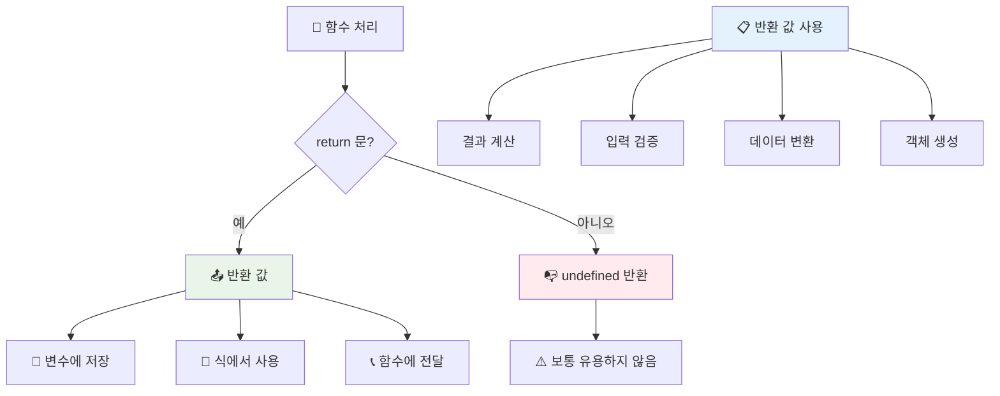
### 🔄 **반환값 이해 점검: 결과를 받아보기**

**반환값 이해도를 평가해 봅시다:**
- 함수 내 `return` 뒤의 코드는 어떻게 될까요?
- 왜 값을 반환하는 것이 단순 출력보다 좋은가요?
- 함수는 다양한 타입(문자열, 숫자, 불리언)을 반환할 수 있나요?

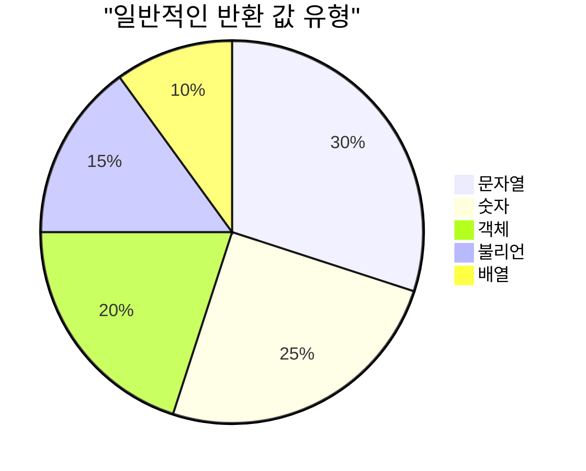
> **핵심 인사이트**: 값을 반환하는 함수는 호출하는 쪽에서 결과를 어떻게 처리할지 결정할 수 있어 더욱 다재다능합니다. 덕분에 코드를 더 모듈화하고 재사용하기 쉽습니다!

## 함수를 매개변수로 전달하기

함수를 다른 함수의 매개변수로 넘길 수 있습니다. 처음에는 복잡해 보일 수 있지만, 매우 유용한 프로그래밍 기법입니다.

이 패턴은 "어떤 일이 일어날 때 이렇게 해라"와 같이 사용할 때 자주 쓰입니다. 예를 들어 "타이머가 끝났을 때 이 코드를 실행해라", "사용자가 버튼을 클릭하면 이 함수를 호출해라" 같은 경우입니다.

자바스크립트 내장 함수인 `setTimeout`을 봅시다. 지정한 시간(밀리초) 후에 코드를 실행합니다. 여기에 실행할 코드를 전달해야 하니, 함수 전달이 딱입니다!

다음 코드를 실행해 보세요 — 3초 후 메시지를 볼 수 있습니다:

```javascript
function displayDone() {
  console.log('3 seconds has elapsed');
}
// 타이머 값은 밀리초 단위입니다
setTimeout(displayDone, 3000);
```

`displayDone`을 괄호 없이 `setTimeout`에 전달하는 점에 주목하세요. 직접 함수를 호출하는 게 아니라, `setTimeout`에게 "3초 후에 이 함수를 호출해라"라고 넘기는 겁니다.

### 익명 함수

가끔 이름이 필요 없는 함수가 있기도 합니다. 한 번만 사용할 건데 이름까지 지을 필요 있을까요?

자바스크립트는 **익명 함수**를 지원합니다 — 이름이 없는 함수를 필요한 곳에 바로 정의할 수 있습니다.

타이머 예제를 익명 함수로 바꿔 봅시다:

```javascript
setTimeout(function() {
  console.log('3 seconds has elapsed');
}, 3000);
```

결과는 같지만, 함수 선언 없이 바로 `setTimeout` 호출 안에 함수를 정의했습니다.

### 화살표 함수

현대 자바스크립트에는 함수를 더 짧고 간결하게 쓰는 방법으로 **화살표 함수(arrow functions)**가 있습니다. `=>` 기호(화살표 모양)를 사용하며, 개발자들 사이에서 매우 인기입니다.

화살표 함수는 `function` 키워드를 생략하고 더 간결한 구문을 제공합니다.

타이머 예제를 화살표 함수로 표현하면:

```javascript
setTimeout(() => {
  console.log('3 seconds has elapsed');
}, 3000);
```

`()`는 매개변수 자리(이 예제는 비어 있음), 그다음 `=>`, 그리고 중괄호 `{}` 안에 함수 본문이 옵니다. 같은 기능을 더 간결하게 작성했습니다.

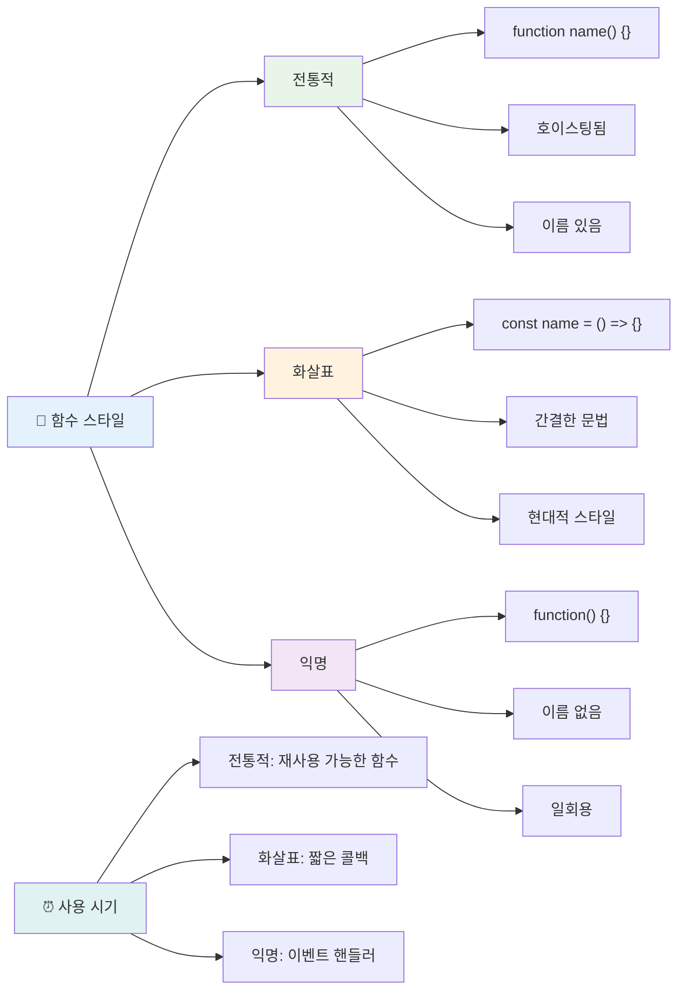
### 언제 어떤 방식을 쓸까요?

각 방식을 언제 써야 할까요? 실용적인 기준: 함수를 여러 번 재사용하려면 이름을 붙여 별도로 정의하세요. 한 번만 사용할 거면 익명 함수를 고려하세요. 화살표 함수와 전통 함수 문법 모두 유효하지만, 현대 자바스크립트 코드에서는 화살표 함수가 널리 쓰입니다.

### 🎨 **함수 스타일 점검: 올바른 문법 선택**

**문법 이해도를 테스트해 봅시다:**
- 언제 화살표 함수를 전통 함수 문법 대신 선호하나요?
- 익명 함수의 주요 이점은 무엇인가요?
- 이름 있는 함수가 익명 함수보다 나은 상황을 생각할 수 있나요?

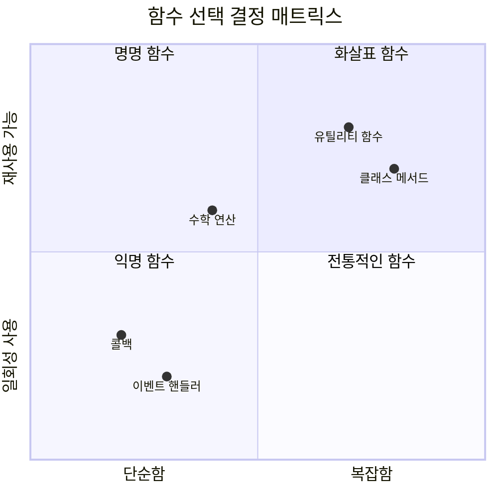
> **최신 트렌드:** 간결한 문법 덕분에 많은 개발자들이 화살표 함수를 기본 선택으로 사용하지만, 전통 함수도 여전히 필요에 따라 사용됩니다!

---


## 🚀 도전 과제

함수와 메서드의 차이를 한 문장으로 말할 수 있나요? 도전해 보세요!

## GitHub Copilot 에이전트 도전 🚀

Agent 모드를 활용해 다음 도전을 완수하세요:

**설명:** 이 수업에서 다룬 함수 개념들(매개변수, 기본값, 반환값, 화살표 함수 등)을 활용하는 수학 함수 유틸리티 라이브러리를 만드세요.

**프롬프트:** `mathUtils.js`라는 자바스크립트 파일에 다음 함수들을 작성하세요:
1. 두 매개변수를 받아 합을 반환하는 함수 `add`
2. 기본값을 가진 두 번째 매개변수가 1인 함수 `multiply`
3. 숫자를 받아 제곱을 반환하는 화살표 함수 `square`
4. 다른 함수를 매개변수로 받고 두 숫자에 적용하는 함수 `calculate`
5. 각 함수를 적절한 테스트 케이스로 호출하는 예시

[agent 모드](https://code.visualstudio.com/blogs/2025/02/24/introducing-copilot-agent-mode)에 대해 더 알아보세요.

## 강의 후 퀴즈
[강의 후 퀴즈](https://ff-quizzes.netlify.app)

## 복습 및 자기주도 학습

코드 베이스에서 점점 더 많이 사용되는 화살표 함수에 대해 [자세히 읽어보는 것](https://developer.mozilla.org/docs/Web/JavaScript/Reference/Functions/Arrow_functions)이 도움이 됩니다. 함수를 작성한 후 화살표 함수 문법으로 다시 작성해 보세요.

## 과제

[함수 재미있게 배우기](assignment.md)

---

## 🧰 **당신의 자바스크립트 함수 도구 상자 요약**

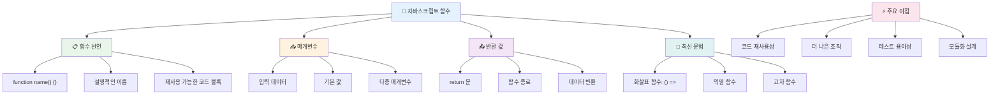
---

## 🚀 당신의 자바스크립트 함수 숙련도 타임라인

### ⚡ **다음 5분 내에 할 수 있는 것들**
- [ ] 좋아하는 숫자를 반환하는 간단한 함수 작성하기
- [ ] 두 매개변수를 받아 더하는 함수 만들기
- [ ] 전통적인 함수를 화살표 함수 문법으로 변환해 보기
- [ ] 도전 과제 연습: 함수와 메서드의 차이점 설명하기

### 🎯 **이번 시간에 달성할 수 있는 목표**
- [ ] 수업 후 퀴즈 완료하고 헷갈리는 개념 복습하기
- [ ] GitHub Copilot 챌린지에서 나온 수학 유틸리티 라이브러리 만들기
- [ ] 다른 함수를 매개변수로 사용하는 함수 만들기
- [ ] 기본 매개변수가 있는 함수 작성 연습하기
- [ ] 함수 반환 값에서 템플릿 리터럴 실험해 보기

### 📅 **일주일간의 함수 마스터 계획**
- [ ] 창의적으로 "Fun with Functions" 과제 완료하기
- [ ] 작성한 반복 코드 일부를 재사용 가능한 함수로 리팩토링하기
- [ ] 함수만 사용해 작은 계산기 만들기 (전역 변수 없이)
- [ ] `map()` 및 `filter()` 같은 배열 메서드로 화살표 함수 연습하기
- [ ] 흔히 하는 작업을 위한 유틸리티 함수 모음 만들기
- [ ] 고차 함수와 함수형 프로그래밍 개념 학습하기

### 🌟 **한 달간의 변화 프로젝트**
- [ ] 클로저와 스코프 같은 고급 함수 개념 마스터하기
- [ ] 함수 합성을 많이 활용하는 프로젝트 만들기
- [ ] 함수 문서화를 개선하여 오픈 소스에 기여하기
- [ ] 다른 사람에게 함수와 다양한 문법 스타일 가르치기
- [ ] JavaScript의 함수형 프로그래밍 패러다임 탐구하기
- [ ] 미래 프로젝트를 위해 재사용 가능한 개인 라이브러리 만들기

### 🏆 **최종 함수 챔피언 점검**

**함수 마스터를 축하하며:**
- 지금까지 만든 함수 중 가장 유용한 함수는 무엇인가요?
- 함수를 배우면서 코드 조직 방법에 어떤 변화가 있었나요?
- 선호하는 함수 문법 스타일과 그 이유는 무엇인가요?
- 함수를 작성해서 해결하고 싶은 현실 문제는 무엇인가요?

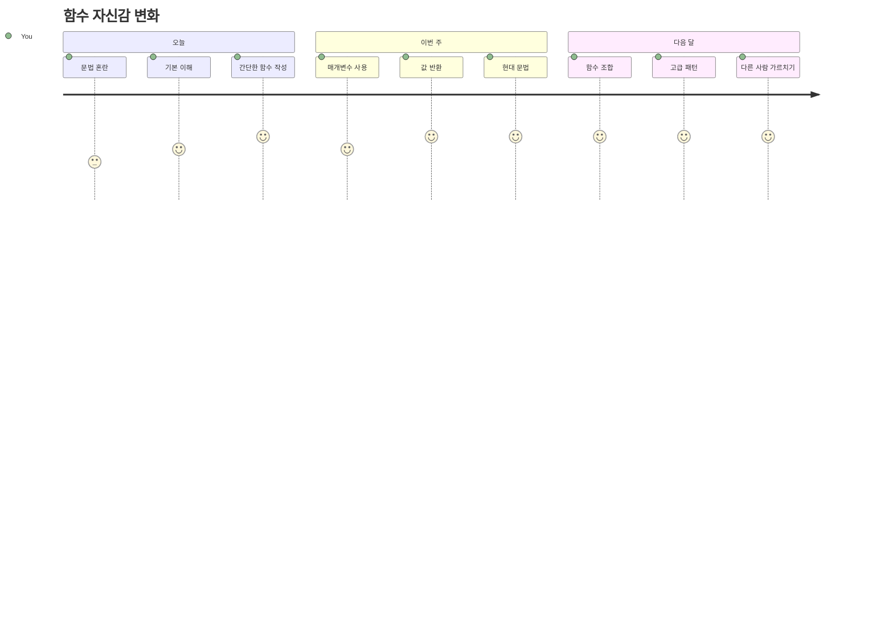
> 🎉 **프로그래밍에서 가장 강력한 개념 중 하나를 마스터했습니다!** 함수는 더 큰 프로그램을 구성하는 빌딩 블록입니다. 여러분이 만들게 될 모든 애플리케이션은 코드 구성, 재사용, 구조화를 위해 함수를 사용합니다. 이제 논리를 재사용 가능한 컴포넌트로 패키징하는 법을 이해했으니 더 효율적이고 효과적인 개발자가 되었습니다. 모듈식 프로그래밍의 세계에 오신 것을 환영합니다! 🚀

---

<!-- CO-OP TRANSLATOR DISCLAIMER START -->
**면책 조항**:  
이 문서는 AI 번역 서비스 [Co-op Translator](https://github.com/Azure/co-op-translator)를 사용하여 번역되었습니다. 정확성을 위해 최선을 다하고 있으나, 자동 번역에는 오류나 부정확성이 포함될 수 있음을 양지해 주시기 바랍니다. 원문은 해당 언어의 원본 문서가 권위 있는 자료로 간주되어야 합니다. 중요한 정보의 경우 전문 번역가에 의한 인간 번역을 권장합니다. 이 번역본 사용으로 인해 발생하는 오해나 오인에 대해 당사는 책임을 지지 않습니다.
<!-- CO-OP TRANSLATOR DISCLAIMER END -->