<!--
CO_OP_TRANSLATOR_METADATA:
{
  "original_hash": "c688385d15dd3645e924ea0ffee8967f",
  "translation_date": "2026-01-06T14:51:18+00:00",
  "source_file": "2-js-basics/3-making-decisions/README.md",
  "language_code": "ko"
}
-->
# JavaScript 기초: 의사 결정

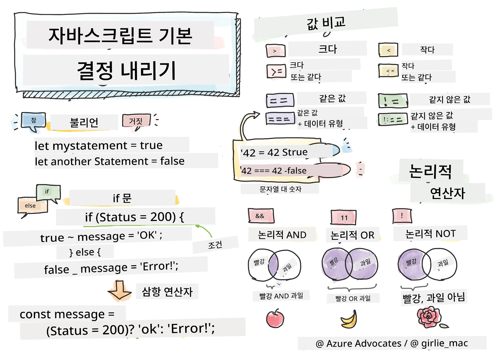

> 스케치노트 작성자 [Tomomi Imura](https://twitter.com/girlie_mac)

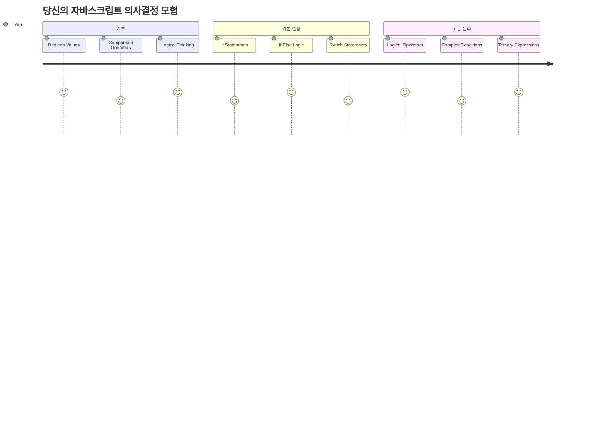
애플리케이션이 어떻게 똑똑한 결정을 내리는지 궁금했던 적 있나요? 예를 들어 내비게이션 시스템이 가장 빠른 경로를 선택하는 방법, 또는 온도 조절기가 언제 난방을 켤지 결정하는 방법 말이죠. 이것이 프로그래밍에서 의사 결정의 기본 개념입니다.

찰스 배비지의 해석 엔진이 조건에 따라 다른 연산 순서를 따르도록 설계된 것처럼, 현대의 자바스크립트 프로그램도 다양한 상황에 따라 선택을 해야 합니다. 이 분기하고 결정을 내리는 능력이 정적인 코드를 반응형이고 지능적인 애플리케이션으로 변화시키는 요인입니다.

이번 수업에서는 조건부 논리를 프로그램에 구현하는 법을 배웁니다. 조건문, 비교 연산자, 논리식을 탐구하여 코드가 상황을 평가하고 적절히 반응하도록 만들 것입니다.

## 강의 전 퀴즈

[강의 전 퀴즈](https://ff-quizzes.netlify.app/web/quiz/11)

의사 결정 능력과 프로그램 흐름 제어는 프로그래밍의 기본적인 측면입니다. 이 섹션에서는 불리언 값과 조건부 논리를 사용해 자바스크립트 프로그램의 실행 경로를 제어하는 방법을 다룹니다.

[](https://youtube.com/watch?v=SxTp8j-fMMY "Making Decisions")

> 🎥 위 이미지를 클릭하면 의사 결정에 관한 동영상을 볼 수 있습니다.

> 이 수업은 [Microsoft Learn](https://docs.microsoft.com/learn/modules/web-development-101-if-else/?WT.mc_id=academic-77807-sagibbon)에서도 들을 수 있습니다!

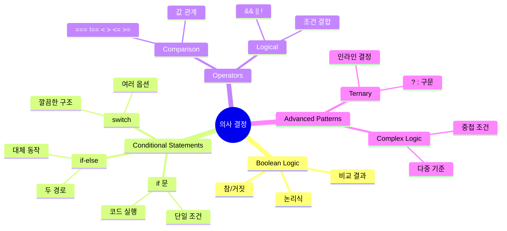
## 불리언(Booleans) 간단 복습

의사 결정에 앞서, 지난 수업에서 배운 불리언 값을 다시 살펴보겠습니다. 수학자 조지 불(George Boole)의 이름을 딴 이 값들은 이진 상태를 나타냅니다—`true` 또는 `false`. 애매함 없이 딱 두 가지 상태만 존재합니다.

이 이진 값들은 모든 계산 논리의 기초를 이룹니다. 프로그램이 내리는 모든 결정은 결국 불리언 평가로 귀결됩니다.

불리언 변수를 만드는 방법은 간단합니다:

```javascript
let myTrueBool = true;
let myFalseBool = false;
```

이렇게 두 개의 변수가 명시적인 불리언 값으로 생성됩니다.

✅ 불리언은 영국의 수학자, 철학자이자 논리학자인 조지 불(1815~1864)의 이름에서 유래되었습니다.

## 비교 연산자와 불리언

실제로 불리언 값을 수동으로 설정하는 일은 드뭅니다. 대신 조건을 평가해서 생성합니다: "이 숫자가 저 숫자보다 큰가?" 또는 "이 값들이 같은가?"

비교 연산자는 이러한 평가를 가능하게 합니다. 이들은 값을 비교하고 피연산자 간의 관계에 따라 불리언 결과를 반환합니다.

| 기호   | 설명                                                                                                                                                          | 예시                 |
| ------ | ------------------------------------------------------------------------------------------------------------------------------------------------------------- | -------------------- |
| `<`    | **작다**: 왼쪽 값이 오른쪽 값보다 작으면 `true` 불리언을 반환                                                                                              | `5 < 6 // true`      |
| `<=`   | **작거나 같다**: 왼쪽 값이 오른쪽 값보다 작거나 같으면 `true`를 반환                                                                                        | `5 <= 6 // true`     |
| `>`    | **크다**: 왼쪽 값이 오른쪽 값보다 크면 `true`를 반환                                                                                                        | `5 > 6 // false`     |
| `>=`   | **크거나 같다**: 왼쪽 값이 오른쪽 값보다 크거나 같으면 `true`를 반환                                                                                        | `5 >= 6 // false`    |
| `===`  | **엄격한 동등성**: 왼쪽과 오른쪽 값이 같고 자료형도 같으면 `true`를 반환                                                                                     | `5 === 6 // false`   |
| `!==`  | **부등호**: 엄격한 동등성 연산자 결과의 반대 불리언 값을 반환                                                                                               | `5 !== 6 // true`    |

✅ 웹 브라우저의 콘솔에 비교 연산을 작성해서 확인해보세요. 반환된 값 중 놀라운 점이 있나요?

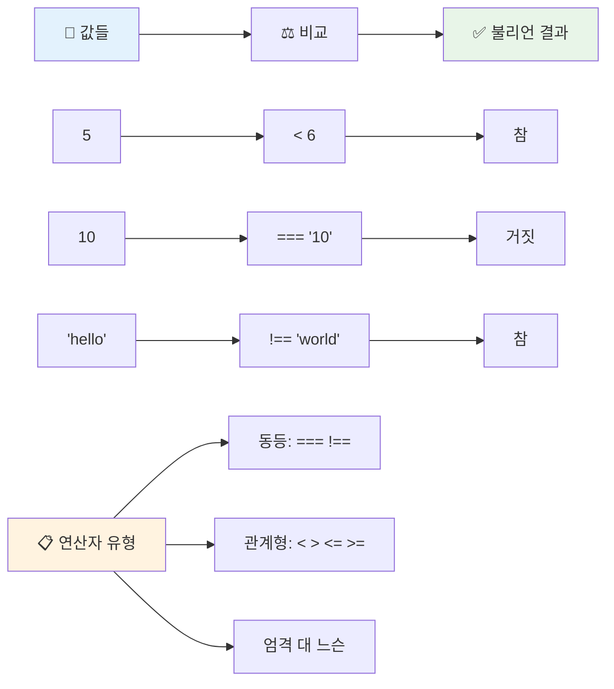
### 🧠 **비교 연산 숙달 확인: 불리언 논리 이해하기**

**비교에 대해 테스트해보기:**
- 왜 `===` (엄격한 동등성)이 보통 `==` (느슨한 동등성)보다 선호될까요?
- `5 === '5'`는 무엇을 반환할까요? `5 == '5'`는요?
- `!==`와 `!=`의 차이는 무엇인가요?

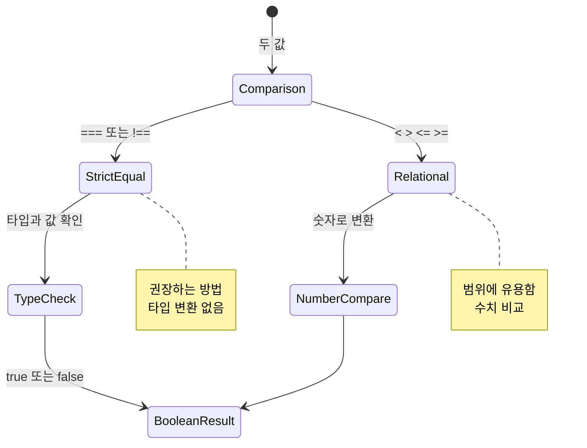
> **전문가 팁**: 타입 변환이 필요하지 않는 한 항상 `===`와 `!==`를 사용하세요. 예상치 못한 동작을 방지할 수 있습니다!

## If 문

`if` 문은 코드에서 질문을 하는 것과 같습니다. "만약 이 조건이 참이라면, 이 일을 수행해라." 자바스크립트에서 의사 결정을 위해 가장 중요한 도구입니다.

작동 방식은 다음과 같습니다:

```javascript
if (condition) {
  // 조건이 참입니다. 이 블록의 코드는 실행됩니다.
}
```

조건은 괄호 안에 들어가고, 만약 `true`라면 자바스크립트는 중괄호 안 코드를 실행합니다. `false`라면 전체 블록을 건너뜁니다.

조건을 만들 때는 보통 비교 연산자를 사용합니다. 실용적인 예를 보겠습니다:

```javascript
let currentMoney = 1000;
let laptopPrice = 800;

if (currentMoney >= laptopPrice) {
  // 조건이 참입니다. 이 블록의 코드는 실행됩니다.
  console.log("Getting a new laptop!");
}
```

`1000 >= 800`은 `true`로 평가되므로 블록 내 코드가 실행되어 콘솔에 "신형 노트북 구입!"이 출력됩니다.

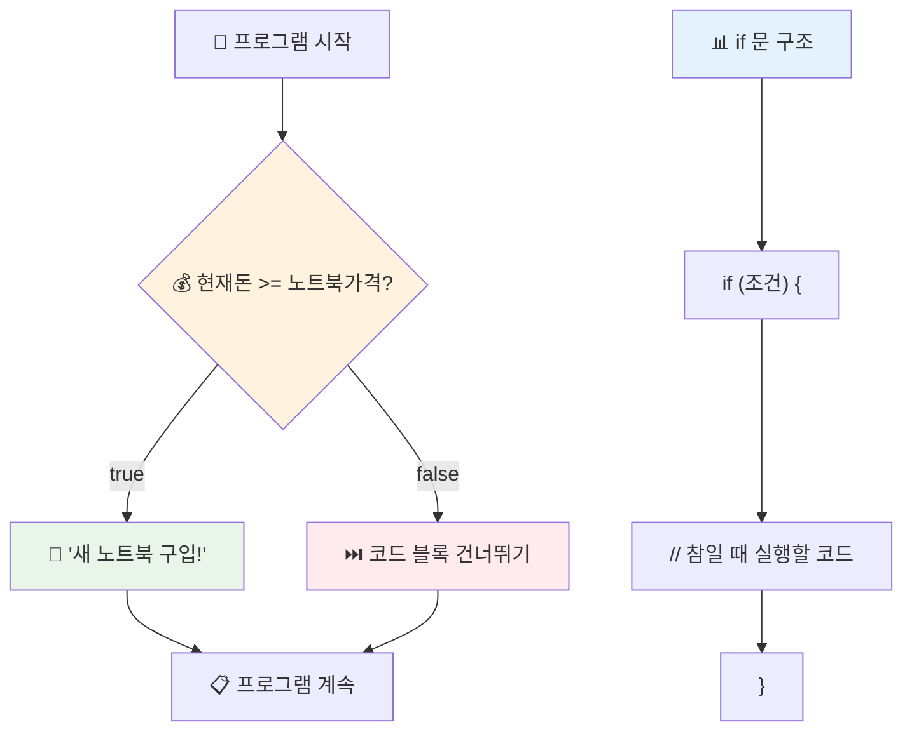
## If..Else 문

하지만 조건이 거짓일 때 다른 작업을 하길 원한다면? 그게 바로 `else` 문이 등장하는 이유입니다—백업 계획과 비슷합니다.

`else` 문은 "만약 이 조건이 거짓이라면, 이 작업을 해라"라고 말하는 방법입니다.

```javascript
let currentMoney = 500;
let laptopPrice = 800;

if (currentMoney >= laptopPrice) {
  // 조건이 참입니다. 이 블록의 코드가 실행됩니다.
  console.log("Getting a new laptop!");
} else {
  // 조건이 거짓입니다. 이 블록의 코드가 실행됩니다.
  console.log("Can't afford a new laptop, yet!");
}
```

이번엔 `500 >= 800`이 `false`라서 자바스크립트가 첫 번째 블록을 건너뛰고 `else` 블록을 실행합니다. 콘솔에는 "아직 노트북을 살 여유가 없다!"가 출력됩니다.

✅ 이 코드와 아래 코드를 브라우저 콘솔에 실행해서 이해도를 테스트해보세요. currentMoney와 laptopPrice 변수 값을 바꿔 `console.log()` 결과를 바꿔볼 수 있습니다.

### 🎯 **If-Else 논리 점검: 분기 경로**

**조건부 논리 이해도 평가:**
- currentMoney가 laptopPrice와 정확히 같다면 어떻게 될까요?
- 현실 세계에서 if-else 논리가 유용할 만한 시나리오는 무엇일까요?
- 여러 가격 범위를 처리하기 위해 어떻게 확장할 수 있을까요?

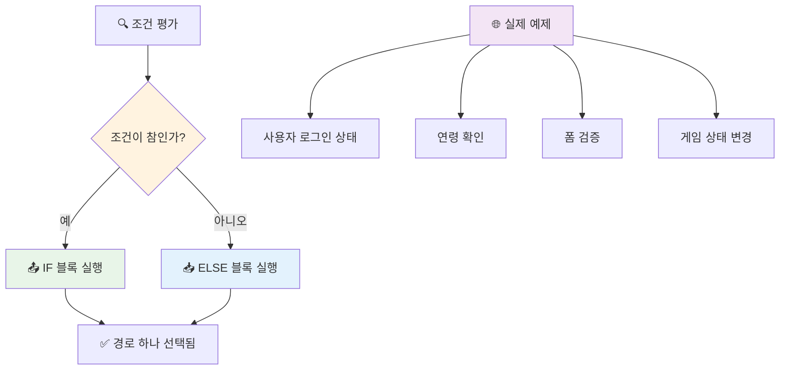
> **핵심 알짜 팁**: if-else 문은 정확히 하나의 경로만 선택되도록 보장합니다. 이는 프로그램이 모든 조건에서 항상 반응이 있음을 의미합니다!

## Switch 문

가끔 하나의 값을 여러 옵션과 비교해야 할 때가 있습니다. 여러 `if..else` 문을 연속으로 쓰는 방법도 있지만, 복잡해지고 다루기 어렵습니다. `switch`문은 여러 개의 이산 값을 다루기에 더 깔끔한 구조를 제공합니다.

이 개념은 초기 전화교환기의 기계식 스위칭 시스템과 비슷합니다—하나의 입력값이 실행할 특정 경로를 결정합니다.

```javascript
switch (expression) {
  case x:
    // 코드 블록
    break;
  case y:
    // 코드 블록
    break;
  default:
    // 코드 블록
}
```

구조는 다음과 같습니다:
- 자바스크립트가 표현식을 한 번 평가
- 각 `case`를 차례로 검사하며 일치 여부 확인
- 일치하는 경우 해당 코드 블럭 실행
- `break` 문은 자바스크립트에게 switch 실행을 멈추고 빠져나가라고 지시
- 일치하는 case가 없으면 `default` 블록을 실행(설정한 경우)

```javascript
// 요일을 위한 switch 문을 사용하는 프로그램
let dayNumber = 2;
let dayName;

switch (dayNumber) {
  case 1:
    dayName = "Monday";
    break;
  case 2:
    dayName = "Tuesday";
    break;
  case 3:
    dayName = "Wednesday";
    break;
  default:
    dayName = "Unknown day";
    break;
}
console.log(`Today is ${dayName}`);
```

이 예에서는 자바스크립트가 `dayNumber`가 `2`임을 확인하고, `case 2`를 찾아 `dayName`을 "화요일"로 설정한 후 switch를 중단합니다. 결과는 "오늘은 화요일입니다"가 콘솔에 출력됩니다.

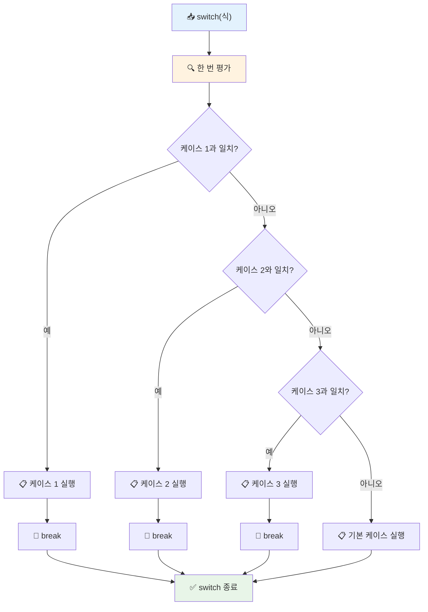
✅ 이 코드와 다음 코드를 브라우저 콘솔에서 실행해 이해도를 테스트해보세요. 변수 a의 값을 바꾸면 `console.log()` 결과가 달라집니다.

### 🔄 **Switch 문 숙달 체크: 여러 옵션 처리**

**Switch 문 이해도 테스트:**
- `break` 문을 깜빡하면 어떻게 될까요?
- 여러 `if-else` 대신 언제 `switch`를 사용하는 것이 좋을까요?
- `default` 케이스는 모든 경우를 다뤘다고 생각해도 왜 유용할까요?

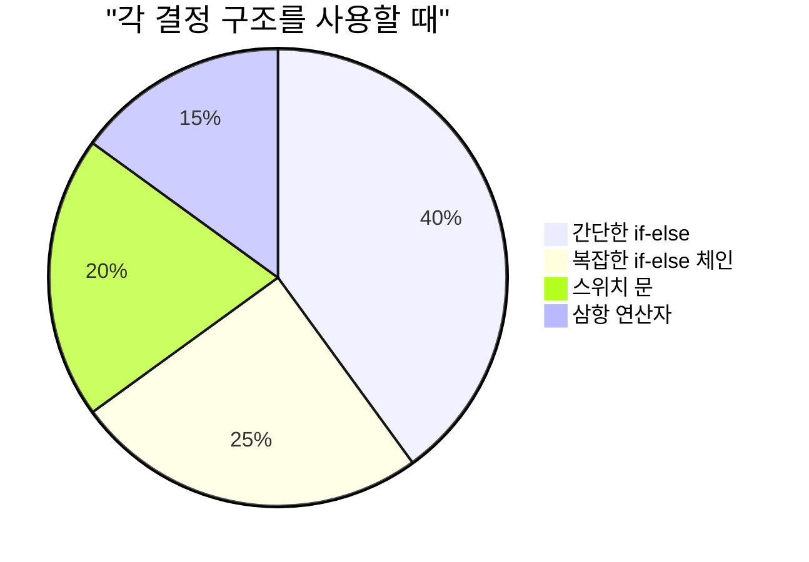
> **모범 사례**: 하나의 변수에서 여러 특정 값을 비교할 때 `switch`를 사용합니다. 범위 검사나 복잡한 조건에는 `if-else`가 더 적합합니다!

## 논리 연산자와 불리언

복잡한 결정을 할 때는 여러 조건을 동시에 평가해야 하는 경우가 많습니다. 수학에서 불 대수(Boolean algebra)가 논리식을 결합하는 것처럼, 프로그래밍에서도 논리 연산자를 제공하여 여러 불리언 조건을 연결합니다.

이 연산자들은 단순한 참/거짓 평가를 조합해 정교한 조건부 논리를 만듭니다.

| 기호   | 설명                                                                                      | 예시                                                                       |
| ------ | ----------------------------------------------------------------------------------------- | -------------------------------------------------------------------------- |
| `&&`   | **논리 AND**: 두 불리언 식을 비교. 양쪽 모두 참일 때만 `true` 반환                       | `(5 > 3) && (5 < 10) // 양쪽 모두 참. true 반환`                            |
| `\|\|` | **논리 OR**: 두 불리언 식을 비교. 한쪽만 참이어도 `true` 반환                            | `(5 > 10) \|\| (5 < 10) // 한쪽이 거짓, 다른 쪽이 참. true 반환`            |
| `!`    | **논리 NOT**: 불리언 식의 반대 값 반환                                                  | `!(5 > 10) // 5가 10보다 크지 않아 "!"가 true로 만듦`                       |

이 연산자는 조건을 다음과 같이 결합할 수 있습니다:
- AND (`&&`)는 두 조건 모두 참이어야 함
- OR (`||`)는 하나 이상의 조건이 참이어야 함  
- NOT (`!`)은 참과 거짓을 뒤바꿈

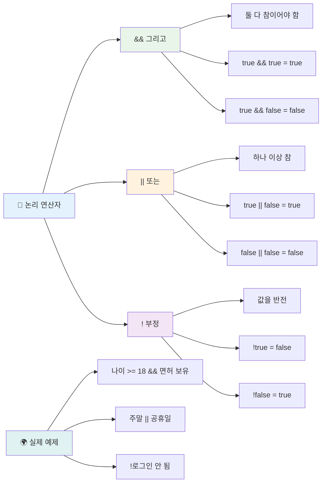
## 논리 연산자와 조건 및 결정

조금 더 현실적인 예제를 통해 논리 연산자를 살펴봅시다:

```javascript
let currentMoney = 600;
let laptopPrice = 800;
let laptopDiscountPrice = laptopPrice - (laptopPrice * 0.2); // 20퍼센트 할인된 노트북 가격

if (currentMoney >= laptopPrice || currentMoney >= laptopDiscountPrice) {
  // 조건이 참입니다. 이 블록의 코드가 실행됩니다.
  console.log("Getting a new laptop!");
} else {
  // 조건이 거짓입니다. 이 블록의 코드가 실행됩니다.
  console.log("Can't afford a new laptop, yet!");
}
```

이 예에서 20% 할인 가격(640)을 계산한 뒤, 전체 가격 또는 할인 가격 중 하나를 현재 가진 돈으로 감당할 수 있는지를 평가합니다. 600은 640 할인 가격 조건을 충족하지 못하지만, 조건식은 OR 연산자로, 둘 중 하나라도 참이면 전체가 참이므로 `true`로 평가됩니다.

### 🧮 **논리 연산자 점검: 조건 조합 연습**

**논리 연산자 이해도 테스트:**
- 표현식 `A && B`에서 A가 거짓이면 무엇이 일어날까요? B는 평가되나요?
- 세 가지 연산자 (&&, ||, !)를 동시에 써야 하는 상황을 생각해볼 수 있나요?
- `!user.isActive`와 `user.isActive !== true`는 어떻게 다른가요?

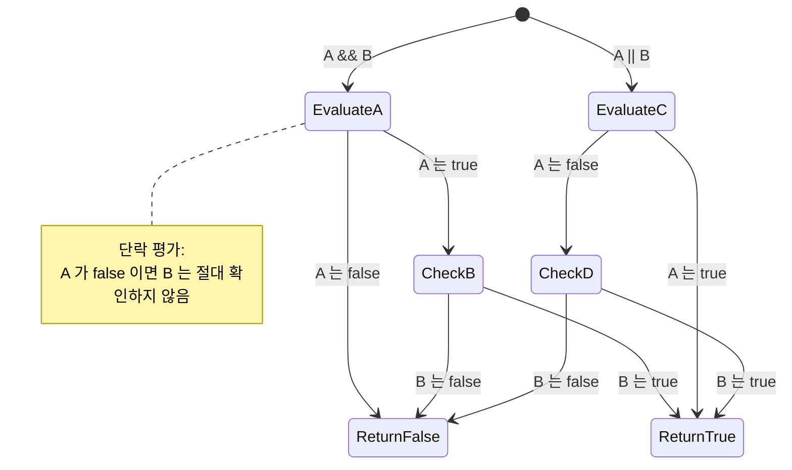
> **성능 팁**: 자바스크립트는 "단락 평가(short-circuit evaluation)"를 사용합니다 - `A && B`에서 A가 거짓이면 B는 평가되지 않아요. 이를 잘 활용하세요!

### 부정 연산자

때때로 어떤 것이 참이 아닐 때를 생각하는 게 더 쉽습니다. 예를 들어 "사용자가 로그인했는가?" 대신 "사용자가 로그인하지 않았는가?"를 묻고 싶을 때도 있죠. 느낌표(`!`) 연산자는 그 논리를 반전시켜줍니다.

```javascript
if (!condition) {
  // 조건이 거짓일 때 실행됩니다
} else {
  // 조건이 참일 때 실행됩니다
}
```

`!` 연산자는 "반대의..."라고 말하는 것과 같아요—무언가가 `true`일 때 `!`는 `false`로 바꾸고, 그 반대도 마찬가지입니다.

### 삼항 연산자

간단한 조건부 할당을 위해 자바스크립트는 **삼항 연산자**를 제공합니다. 이 간결한 문법으로 조건식을 한 줄에 작성할 수 있습니다. 조건에 따라 두 값 중 하나를 할당할 필요가 있을 때 유용합니다.

```javascript
let variable = condition ? returnThisIfTrue : returnThisIfFalse;
```

이 문법은 이렇게 읽힙니다: "이 조건이 참인가? 참이면 이 값을 써라. 거짓이면 저 값을 써라."

더 구체적인 예를 보겠습니다:

```javascript
let firstNumber = 20;
let secondNumber = 10;
let biggestNumber = firstNumber > secondNumber ? firstNumber : secondNumber;
```

✅ 코드를 여러 번 읽어보세요. 이 연산자들이 어떻게 작동하는지 이해가 되나요?

이 줄은 이렇게 말하는 겁니다: "`firstNumber`가 `secondNumber`보다 큰가? 참이면 `biggestNumber`에 `firstNumber`를 넣고, 아니면 `secondNumber`를 넣어라."

삼항 연산자는 전통적인 `if..else` 문을 더 짧게 쓴 것뿐입니다:

```javascript
let biggestNumber;
if (firstNumber > secondNumber) {
  biggestNumber = firstNumber;
} else {
  biggestNumber = secondNumber;
}
```

양쪽 방식 모두 같은 결과를 만듭니다. 삼항 연산자는 간결함을 제공하고, 전통적인 if-else 구조는 복잡한 조건에서는 읽기 더 쉬울 수 있습니다.

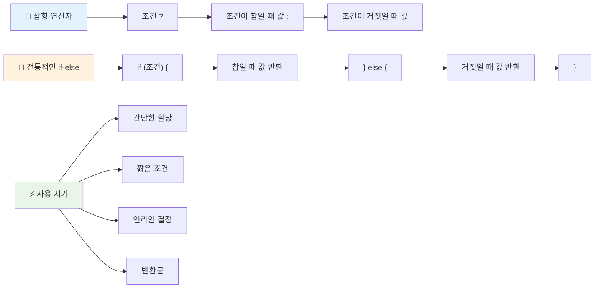
---


## 🚀 도전 과제

논리 연산자를 사용하는 프로그램을 먼저 작성한 다음, 삼항 연산자를 사용하여 다시 작성하세요. 어떤 문법이 더 선호되나요?

---

## GitHub Copilot Agent 도전 과제 🚀

에이전트 모드를 사용해 다음 도전을 완료하세요:

**설명:** 이번 수업에서 다룬 여러 의사 결정 개념(if-else 문, switch 문, 논리 연산자, 삼항 연산자)을 포함하는 포괄적인 성적 계산기를 만드세요.

**요구사항:** 학생의 숫자 점수(0-100)를 받아 다음 기준에 따라 학점(A-F)을 판단하는 자바스크립트 프로그램을 작성하세요:
- A: 90-100
- B: 80-89  
- C: 70-79
- D: 60-69
- F: 60 미만

요구조건:
1. 학점 판정에 if-else 문을 사용하세요.
2. 학생이 합격했는지(성적 >= 60) AND 우등인지(성적 >= 90)를 논리 연산자를 사용하여 확인하세요  
3. switch 문을 사용하여 각 등급에 대해 구체적인 피드백을 제공하세요  
4. 삼항 연산자를 사용하여 학생이 다음 과정에 적합한지(성적 >= 70) 결정하세요  
5. 점수가 0에서 100 사이인지 입력 검증을 포함하세요  

59, 60, 89, 90과 같은 경계 값 및 잘못된 입력을 포함하여 다양한 점수로 프로그램을 테스트하세요.  

[agent mode](https://code.visualstudio.com/blogs/2025/02/24/introducing-copilot-agent-mode)에 대해 자세히 알아보세요.

## 강의 후 퀴즈

[강의 후 퀴즈](https://ff-quizzes.netlify.app/web/quiz/12)

## 복습 및 자기주도 학습

사용자에게 제공되는 다양한 연산자에 대해 더 읽어보세요 [MDN에서](https://developer.mozilla.org/docs/Web/JavaScript/Reference/Operators).

Josh Comeau의 멋진 [연산자 조회](https://joshwcomeau.com/operator-lookup/)를 살펴보세요!

## 과제

[연산자](assignment.md)

---

## 🧠 **당신의 의사결정 도구 요약**

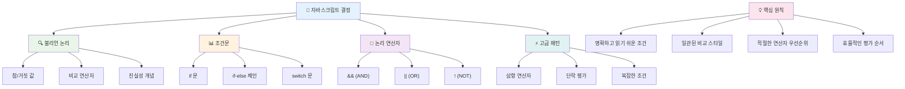
---

## 🚀 당신의 JavaScript 의사결정 마스터리 타임라인

### ⚡ **다음 5분 동안 할 수 있는 것들**
- [ ] 브라우저 콘솔에서 비교 연산자 연습하기
- [ ] 나이를 확인하는 간단한 if-else 문 작성하기
- [ ] 삼항 연산자를 사용해 if-else 문을 다시 작성하는 도전 과제 시도하기
- [ ] 다양한 "참 같은"과 "거짓 같은" 값들이 어떻게 동작하는지 테스트하기

### 🎯 **이번 시간 동안 이룰 수 있는 목표**
- [ ] 수업 후 퀴즈 완료하고 헷갈리는 개념 복습하기
- [ ] GitHub Copilot 챌린지의 종합 점수 계산기 만들기
- [ ] 실제 상황(예: 입을 옷 선택)에 맞는 간단한 결정 트리 만들기
- [ ] 논리 연산자를 사용해 여러 조건 결합 연습하기
- [ ] 다양한 용도에 맞춘 switch 문 실험하기

### 📅 **이번 주 논리 마스터링 계획**
- [ ] 창의적인 예제와 함께 연산자 과제 완료하기
- [ ] 다양한 조건문 구조를 활용한 미니 퀴즈 애플리케이션 만들기
- [ ] 여러 입력 조건을 검사하는 폼 검증기 만들기
- [ ] Josh Comeau의 [연산자 조회](https://joshwcomeau.com/operator-lookup/) 연습문제 풀기
- [ ] 기존 코드를 더 적절한 조건문 구조로 리팩토링하기
- [ ] 단락 평가(short-circuit evaluation) 및 성능 영향 연구하기

### 🌟 **한 달간의 변화 계획**
- [ ] 복잡한 중첩 조건을 마스터하고 코드 가독성 유지하기
- [ ] 정교한 의사결정 로직을 가진 애플리케이션 만들기
- [ ] 오픈 소스 프로젝트에 조건문 로직 개선으로 기여하기
- [ ] 다양한 조건문 구조와 사용 시기에 대해 다른 사람에게 가르치기
- [ ] 조건문 로직의 함수형 프로그래밍 접근법 탐구하기
- [ ] 조건문 관련 개인 참고 가이드 만들기

### 🏆 **최종 의사결정 챔피언 점검**

**논리적 사고력 마스터를 축하하며:**  
- 지금까지 성공적으로 구현한 가장 복잡한 의사결정 로직은 무엇인가요?  
- 가장 자연스럽게 느껴지는 조건문 구조와 그 이유는 무엇인가요?  
- 논리 연산자에 대해 배우면서 문제 해결 방식이 어떻게 바뀌었나요?  
- 어떤 실제 애플리케이션이 정교한 의사결정 로직을 필요로 할까요?

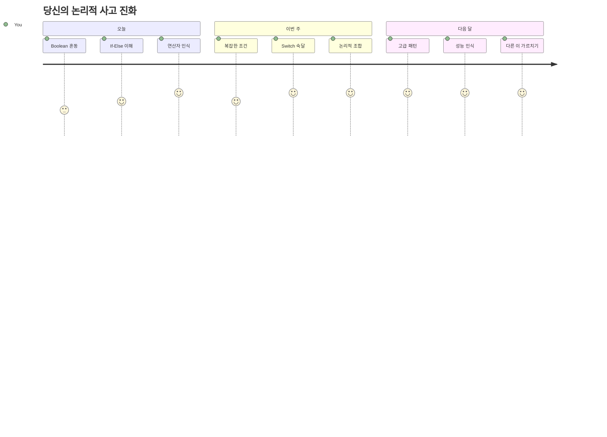
> 🧠 **당신은 디지털 의사결정의 기술을 마스터했습니다!** 모든 인터랙티브 애플리케이션은 사용자 행동과 변화하는 조건에 지능적으로 대응하기 위해 조건 논리에 의존합니다. 이제 여러분은 프로그램이 사고하고 평가하며 적절한 반응을 선택할 수 있게 만드는 방법을 이해하고 있습니다. 이 논리적 기초가 여러분이 만드는 모든 동적 애플리케이션을 강력하게 할 것입니다! 🎉

---

<!-- CO-OP TRANSLATOR DISCLAIMER START -->
**면책 조항**:  
이 문서는 AI 번역 서비스 [Co-op Translator](https://github.com/Azure/co-op-translator)를 사용하여 번역되었습니다. 정확성을 위해 최선을 다하고 있으나, 자동 번역에는 오류나 부정확성이 포함될 수 있음을 유의하시기 바랍니다. 원래 문서의 원어본이 권위 있는 출처로 간주되어야 합니다. 중요한 정보의 경우, 전문적인 인간 번역을 권장합니다. 본 번역의 사용으로 인해 발생하는 오해나 잘못된 해석에 대해 당사는 책임을 지지 않습니다.
<!-- CO-OP TRANSLATOR DISCLAIMER END -->