<!--
CO_OP_TRANSLATOR_METADATA:
{
  "original_hash": "1710a50a519a6e4a1b40a5638783018d",
  "translation_date": "2026-01-06T14:53:41+00:00",
  "source_file": "2-js-basics/4-arrays-loops/README.md",
  "language_code": "ko"
}
-->
# JavaScript 기본: 배열과 반복문

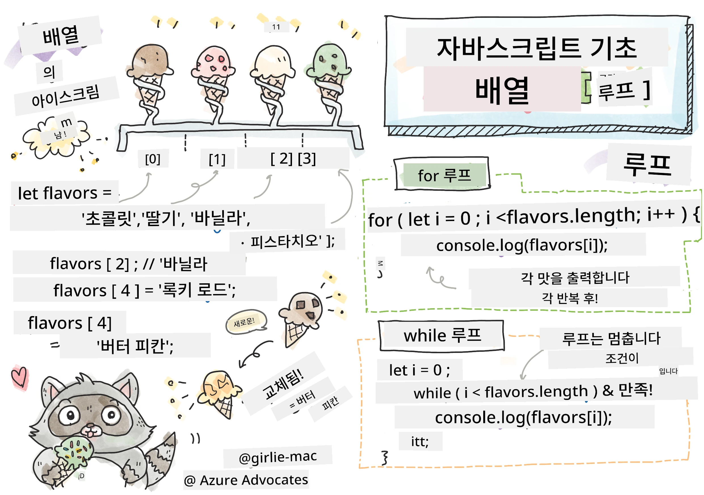
> 스케치노트 작성자 [Tomomi Imura](https://twitter.com/girlie_mac)

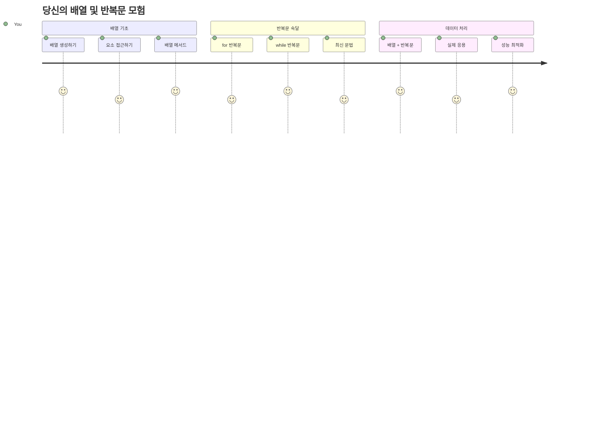
## 강의 전 퀴즈
[강의 전 퀴즈](https://ff-quizzes.netlify.app/web/quiz/13)

웹사이트가 어떻게 쇼핑 카트 아이템을 추적하거나 친구 목록을 표시하는지 궁금한 적 있나요? 바로 배열과 반복문의 역할입니다. 배열은 여러 정보를 담는 디지털 컨테이너 같고, 반복문은 반복적인 코드를 작성하지 않고도 그 데이터를 효율적으로 다루도록 도와줍니다.

이 두 개념은 프로그램에서 정보를 처리하는 기초를 형성합니다. 하나하나 수동으로 작성하는 대신 수백, 수천 개의 항목을 빠르게 처리하는 똑똑하고 효율적인 코드를 만드는 방법을 배우게 될 것입니다.

이 강의를 마치면 몇 줄의 코드로도 복잡한 데이터 작업을 완성할 수 있다는 것을 이해하게 됩니다. 이 필수 프로그래밍 개념들을 함께 탐구해봅시다.

[](https://youtube.com/watch?v=1U4qTyq02Xw "Arrays")

[](https://www.youtube.com/watch?v=Eeh7pxtTZ3k "Loops")

> 🎥 위 이미지를 클릭해 배열과 반복문에 관한 영상을 시청하세요.

> 이 강의는 [Microsoft Learn](https://docs.microsoft.com/learn/modules/web-development-101-arrays/?WT.mc_id=academic-77807-sagibbon) 에서도 수강할 수 있습니다!

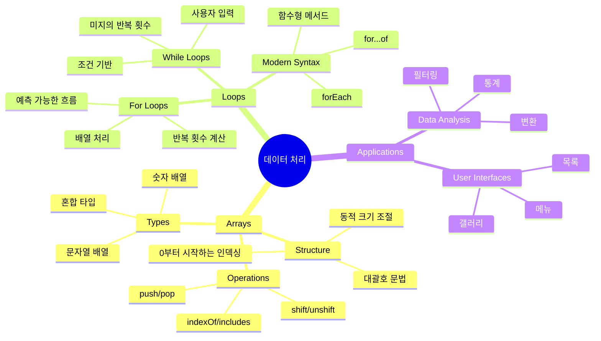
## 배열

배열은 디지털 서랍장 같다고 생각하세요 - 각 서랍에 한 문서가 아니라, 여러 관련 항목을 하나의 구조화된 컨테이너에 정리하는 것입니다. 프로그래밍 용어로 배열은 여러 정보를 하나의 조직화된 패키지로 저장할 수 있게 합니다.

사진 갤러리, 할 일 목록 관리, 게임의 최고 점수 추적 등 무엇을 하든 배열은 데이터 정리의 토대가 됩니다. 어떻게 동작하는지 살펴봅시다.

✅ 배열은 우리 주변에 널려 있습니다! 태양광 패널 배열 같은 실제 배열 사례를 생각해보세요.

### 배열 만들기

배열을 만드는 것은 아주 쉽습니다 - 대괄호를 사용하세요!

```javascript
// 빈 배열 - 아이템을 기다리는 빈 쇼핑 카트처럼
const myArray = [];
```

**무슨 일이 일어났나요?**
대괄호 `[]`를 사용해 빈 컨테이너를 만들었습니다. 마치 빈 도서관 책장이 새 책들을 담기 위해 준비된 것과 같습니다.

배열을 처음부터 초기 값으로 채울 수도 있습니다:

```javascript
// 당신의 아이스크림 가게 맛 메뉴
const iceCreamFlavors = ["Chocolate", "Strawberry", "Vanilla", "Pistachio", "Rocky Road"];

// 사용자의 프로필 정보 (서로 다른 유형의 데이터 혼합)
const userData = ["John", 25, true, "developer"];

// 좋아하는 수업의 시험 점수
const scores = [95, 87, 92, 78, 85];
```

**주목할 점:**
- 텍스트, 숫자, 혹은 true/false 값도 같은 배열에 저장 가능
- 항목 간에는 쉼표로 구분하면 됩니다 - 간단하죠!
- 배열은 관련 정보를 함께 보관하기에 완벽합니다

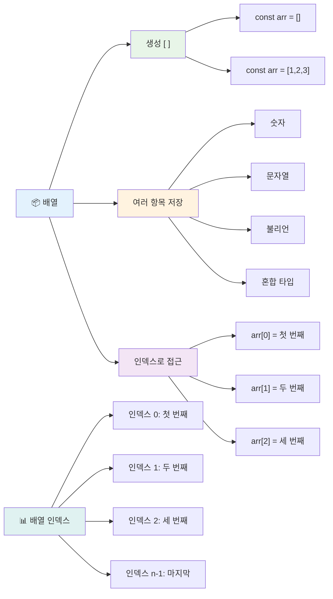
### 배열 인덱스

처음에는 이상하게 느껴질 수 있지만, 배열은 항목 번호를 0부터 시작합니다. 이 0부터 시작하는 인덱싱은 컴퓨터 메모리 작동 방식에서 유래했으며, C와 같은 초기 프로그래밍 언어부터 내려온 관례입니다. 배열의 각 위치는 **인덱스**라는 고유 번호를 갖습니다.

| 인덱스 | 값 | 설명 |
|-------|-------|-------------|
| 0 | "Chocolate" | 첫 번째 요소 |
| 1 | "Strawberry" | 두 번째 요소 |
| 2 | "Vanilla" | 세 번째 요소 |
| 3 | "Pistachio" | 네 번째 요소 |
| 4 | "Rocky Road" | 다섯 번째 요소 |

✅ 배열이 0부터 시작하는 것이 놀랍나요? 일부 프로그래밍 언어에서는 인덱스가 1부터 시작하기도 합니다. 이와 관련된 흥미로운 역사를 [위키피디아](https://en.wikipedia.org/wiki/Zero-based_numbering)에서 읽어볼 수 있습니다.

**배열 요소 접근하기:**

```javascript
const iceCreamFlavors = ["Chocolate", "Strawberry", "Vanilla", "Pistachio", "Rocky Road"];

// 대괄호 표기법을 사용하여 개별 요소에 접근하기
console.log(iceCreamFlavors[0]); // "Chocolate" - 첫 번째 요소
console.log(iceCreamFlavors[2]); // "Vanilla" - 세 번째 요소
console.log(iceCreamFlavors[4]); // "Rocky Road" - 마지막 요소
```

**무슨 일이 일어나는지 분석해봅시다:**
- **대괄호 표기법**과 인덱스 번호를 사용해 요소에 접근
- 해당 위치에 저장된 값을 **반환**
- 0부터 세기 시작해서 첫 번째 요소 인덱스는 0

**배열 요소 수정하기:**

```javascript
// 기존 값을 변경하세요
iceCreamFlavors[4] = "Butter Pecan";
console.log(iceCreamFlavors[4]); // "버터 피칸"

// 끝에 새 요소 추가
iceCreamFlavors[5] = "Cookie Dough";
console.log(iceCreamFlavors[5]); // "쿠키 도우"
```

**위 코드에서 한 일:**
- 인덱스 4의 요소를 "Rocky Road"에서 "Butter Pecan"으로 **수정**
- 인덱스 5에 새 요소 "Cookie Dough"를 **추가**
- 현재 크기보다 넘어가는 인덱스를 추가하면 배열 크기 **자동 확장**

### 배열 길이와 주요 메서드

배열에는 데이터를 다루기 쉬운 내장 속성과 메서드가 있습니다.

**배열 길이 찾기:**

```javascript
const iceCreamFlavors = ["Chocolate", "Strawberry", "Vanilla", "Pistachio", "Rocky Road"];
console.log(iceCreamFlavors.length); // 5

// 배열이 변경되면 길이가 자동으로 업데이트됩니다
iceCreamFlavors.push("Mint Chip");
console.log(iceCreamFlavors.length); // 6
```

**중요 포인트:**
- 배열 안의 총 요소 수를 **반환**
- 요소가 추가/삭제될 때 자동으로 **업데이트**
- 반복문과 검증에 유용한 **동적 개수 제공**

**핵심 배열 메서드:**

```javascript
const fruits = ["apple", "banana", "orange"];

// 요소 추가
fruits.push("grape");           // 끝에 추가: ["apple", "banana", "orange", "grape"]
fruits.unshift("strawberry");   // 시작에 추가: ["strawberry", "apple", "banana", "orange", "grape"]

// 요소 제거
const lastFruit = fruits.pop();        // "grape"를 제거하고 반환
const firstFruit = fruits.shift();     // "strawberry"를 제거하고 반환

// 요소 찾기
const index = fruits.indexOf("banana"); // 1 반환 ("banana"의 위치)
const hasApple = fruits.includes("apple"); // true 반환
```

**다음 메서드를 기억하세요:**
- `push()`(끝에 추가), `unshift()`(처음에 추가)로 요소를 **추가**
- `pop()`(끝에서 제거), `shift()`(처음에서 제거)로 요소를 **삭제**
- `indexOf()`로 요소 위치를 찾고, `includes()`로 존재 여부 확인
- 제거된 요소나 위치 인덱스 같은 유용한 값을 **반환**

✅ 직접 해보세요! 브라우저 콘솔에서 직접 배열을 만들고 조작해보세요.

### 🧠 **배열 기본 확인: 데이터 정리**

**배열 이해도 테스트:**
- 왜 배열은 1이 아닌 0부터 세기 시작할까요?
- 존재하지 않는 인덱스에 접근하면 어떻게 될까요? (예: 5개 요소 배열에서 `arr[100]`)
- 배열이 유용할 세 가지 실생활 사례를 생각해보세요.

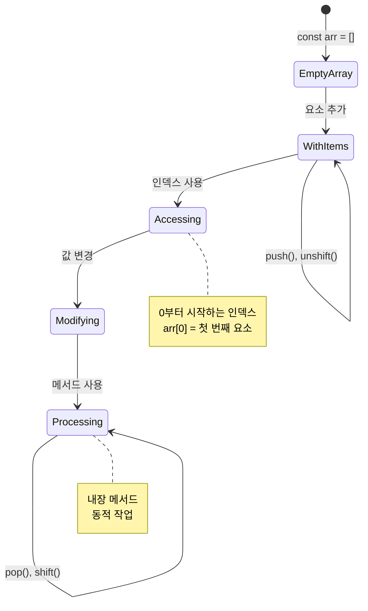
> **실생활 인사이트**: 프로그래밍에서 배열은 어디에나 있습니다! 소셜 미디어 피드, 쇼핑 카트, 사진 갤러리, 재생 목록 노래 등, 모두 배열을 기반으로 합니다!

## 반복문

찰스 디킨스 소설에 나오는 학생들이 판자에 줄을 계속 쓰는 처벌을 생각해 보세요. 만약 "이 문장을 100번 써라"고 한 번만 지시하면 자동으로 되는 상황을 상상해보세요. 바로 그것이 반복문이 코드에서 하는 일입니다.

반복문은 피곤함 없이 반복 작업을 수행하는 무한한 조수와 같습니다. 쇼핑 카트의 모든 아이템을 확인하거나 앨범의 모든 사진을 표시할 때, 반복문은 효율적으로 반복 작업을 처리합니다.

JavaScript는 여러 종류의 반복문을 제공합니다. 각각을 살펴보고 언제 사용하는지 이해해봅시다.

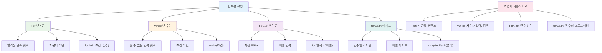
### For 반복문

`for` 반복문은 타이머를 설정하는 것과 같습니다 - 몇 번 반복할지 정확히 알고 있습니다. 매우 체계적이고 예측 가능해서 배열 작업이나 개수 세기에 완벽합니다.

**For 반복문 구조:**

| 구성요소 | 역할 | 예시 |
|-----------|---------|----------|
| **초기화** | 시작 지점 설정 | `let i = 0` |
| **조건** | 반복 계속 여부 | `i < 10` |
| **증가** | 갱신 방식 | `i++` |

```javascript
// 0에서 9까지 세기
for (let i = 0; i < 10; i++) {
  console.log(`Count: ${i}`);
}

// 좀 더 실용적인 예: 점수 처리
const testScores = [85, 92, 78, 96, 88];
for (let i = 0; i < testScores.length; i++) {
  console.log(`Student ${i + 1}: ${testScores[i]}%`);
}
```

**단계별 설명:**
- 카운터 변수 `i`를 0으로 **초기화**
- 반복마다 조건 `i < 10`을 **검사**
- 조건이 참이면 코드 블록을 **실행**
- 각 반복 후 `i`를 `i++`로 1씩 **증가**
- 조건이 거짓이 되면 (i가 10에 도달 시) **중지**

✅ 이 코드를 브라우저 콘솔에서 실행해보세요. 카운터, 조건, 반복식을 바꾸면 어떤 일이 일어날까요? 역순으로 실행해 카운트다운을 만들 수도 있나요?

### 🗓️ **For 반복문 숙련도 체크: 통제된 반복**

**For 반복문 이해도 평가:**
- For 반복문 세 부분과 각각의 역할은 무엇인가요?
- 배열을 거꾸로 반복하려면 어떻게 하나요?
- 증가 부분(`i++`)을 빼면 무슨 일이 일어나나요?

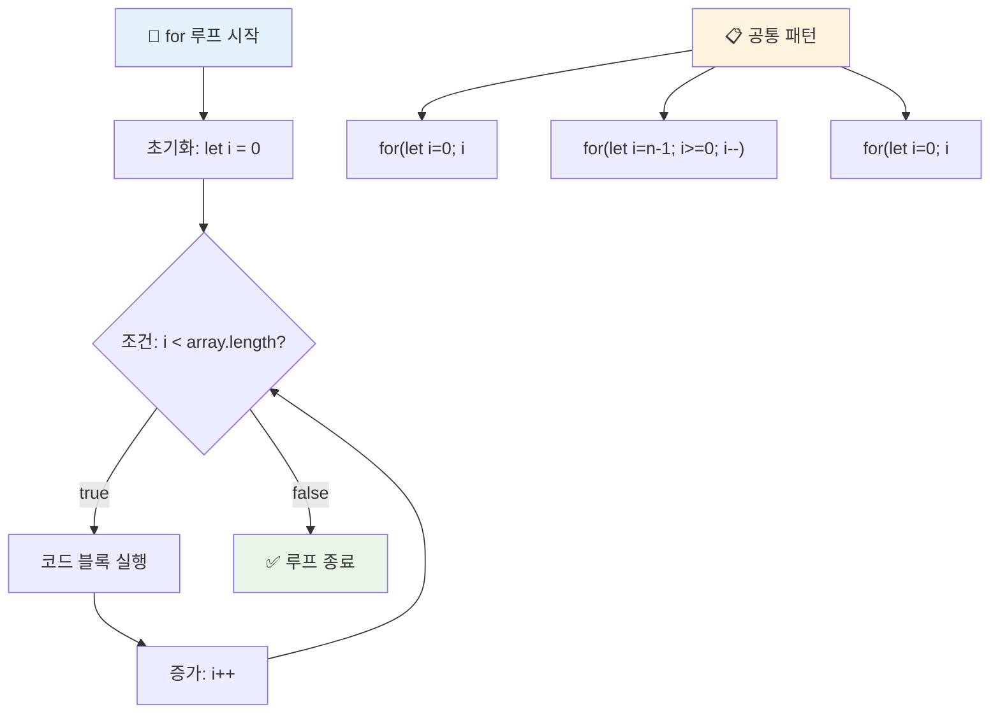
> **반복문 지혜**: For 반복문은 몇 번 반복할지 정확히 알 때 가장 적합합니다. 배열 처리 시 가장 흔한 선택입니다!

### While 반복문

`while` 반복문은 "조건이 참인 동안 계속"합니다 - 정확히 몇 번 실행될지 모를 수 있지만 언제 멈출지는 압니다. 사용자 입력을 받을 때나 원하는 데이터를 찾을 때까지 탐색할 때 적합합니다.

**While 반복문 특성:**
- 조건이 참인 동안 반복 **계속 실행**
- 카운터 변수 관리를 직접 **수동으로 해야 함**
- 각 반복 전에 조건을 **검사**
- 조건이 거짓이 안 되면 무한 루프가 발생할 수 있음

```javascript
// 기본적인 카운팅 예제
let i = 0;
while (i < 10) {
  console.log(`While count: ${i}`);
  i++; // 증가시키는 것을 잊지 마세요!
}

// 좀 더 실용적인 예제: 사용자 입력 처리
let userInput = "";
let attempts = 0;
const maxAttempts = 3;

while (userInput !== "quit" && attempts < maxAttempts) {
  userInput = prompt(`Enter 'quit' to exit (attempt ${attempts + 1}):`);
  attempts++;
}

if (attempts >= maxAttempts) {
  console.log("Maximum attempts reached!");
}
```

**예제에서 배울 점:**
- 반복문 내부에서 카운터 `i`를 직접 **관리**
- 무한 루프를 막기 위해 카운터를 **증가**
- 사용자 입력과 시도 제한 등 실제 사용 사례 시연
- 무한 실행 방지를 위한 안전장치 포함

### ♾️ **While 반복문 지혜 점검: 조건 기반 반복**

**While 반복문 이해력 테스트:**
- While 반복문 사용 시 가장 큰 위험은 무엇인가요?
- 언제 while 반복문을 for 반복문 대신 선택하나요?
- 무한 루프를 어떻게 예방할 수 있나요?

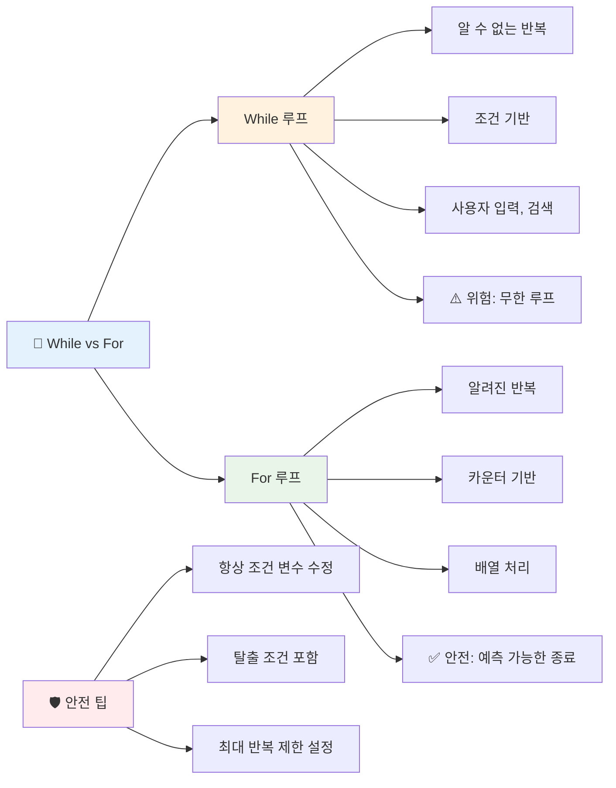
> **안전 우선**: While 반복문은 강력하지만 조건 관리에 주의해야 합니다. 반드시 반복 조건이 언젠가는 거짓이 되도록 확인하세요!

### 최신 반복문 대안

JavaScript에는 더 읽기 쉽고 오류가 적은 최신 반복문 문법이 있습니다.

**For...of 반복문 (ES6+):**

```javascript
const colors = ["red", "green", "blue", "yellow"];

// 현대적인 접근 방식 - 더 깔끔하고 안전함
for (const color of colors) {
  console.log(`Color: ${color}`);
}

// 전통적인 for 루프와 비교
for (let i = 0; i < colors.length; i++) {
  console.log(`Color: ${colors[i]}`);
}
```

**for...of의 주요 장점:**
- 인덱스 관리와 off-by-one 오류 **제거**
- 배열 요소에 직접 **접근 가능**
- 코드 가독성 향상 및 문법 단순화

**forEach 메서드:**

```javascript
const prices = [9.99, 15.50, 22.75, 8.25];

// 함수형 프로그래밍 스타일을 위해 forEach 사용
prices.forEach((price, index) => {
  console.log(`Item ${index + 1}: $${price.toFixed(2)}`);
});

// 간단한 작업을 위한 화살표 함수와 forEach 사용
prices.forEach(price => console.log(`Price: $${price}`));
```

**forEach에 대해 알아야 할 점:**
- 배열의 각 요소에 대해 함수 실행
- 요소 값과 인덱스를 함수 매개변수로 제공
- 조기 종료 불가능 (전통적 반복문과 다름)
- 반환 값은 undefined (새 배열 생성 안 함)

✅ 왜 for 반복문과 while 반복문 중 하나를 선택할까요? StackOverflow에서 17,000명이 같은 질문을 했으며, 몇몇 의견이 [흥미로울 수 있습니다](https://stackoverflow.com/questions/39969145/while-loops-vs-for-loops-in-javascript).

### 🎨 **최신 반복문 문법 점검: ES6+ 수용하기**

**모던 자바스크립트 이해도 평가:**
- `for...of`가 전통적 for 반복문보다 나은 점은 무엇인가요?
- 언제 전통 for 반복문을 선호하나요?
- `forEach`와 `map`의 차이는 무엇인가요?

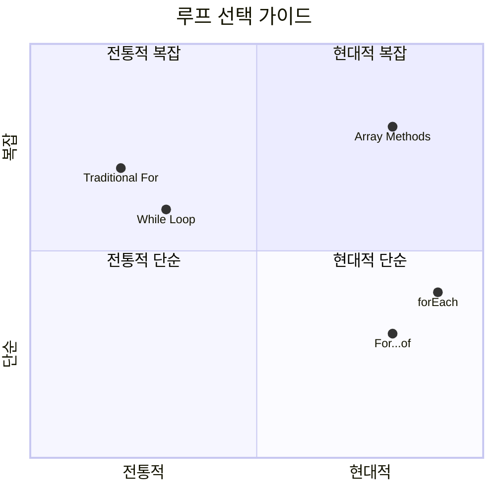
> **최신 트렌드**: `for...of`와 `forEach` 같은 ES6+ 문법이 더 깔끔하고 오류가 적어 배열 반복에 선호되고 있습니다!

## 반복문과 배열

배열과 반복문을 결합하면 강력한 데이터 처리 능력을 만들 수 있습니다. 이 조합은 목록 표시부터 통계 계산에 이르기까지 많은 프로그래밍 작업의 기본입니다.

**전통적 배열 처리:**

```javascript
const iceCreamFlavors = ["Chocolate", "Strawberry", "Vanilla", "Pistachio", "Rocky Road"];

// 고전적인 for 루프 방식
for (let i = 0; i < iceCreamFlavors.length; i++) {
  console.log(`Flavor ${i + 1}: ${iceCreamFlavors[i]}`);
}

// 현대적인 for...of 방식
for (const flavor of iceCreamFlavors) {
  console.log(`Available flavor: ${flavor}`);
}
```

**각 접근법 살펴보기:**
- 배열 길이 속성을 사용해 반복 경계를 정함
- 전통적 for 반복문에서는 인덱스로 요소 접근
- for...of에서는 직접 요소에 접근 가능
- 배열 각 요소를 한 번씩 정확히 처리

**실용적 데이터 처리 예:**

```javascript
const studentGrades = [85, 92, 78, 96, 88, 73, 89];
let total = 0;
let highestGrade = studentGrades[0];
let lowestGrade = studentGrades[0];

// 하나의 루프로 모든 학년을 처리하세요
for (let i = 0; i < studentGrades.length; i++) {
  const grade = studentGrades[i];
  total += grade;
  
  if (grade > highestGrade) {
    highestGrade = grade;
  }
  
  if (grade < lowestGrade) {
    lowestGrade = grade;
  }
}

const average = total / studentGrades.length;
console.log(`Average: ${average.toFixed(1)}`);
console.log(`Highest: ${highestGrade}`);
console.log(`Lowest: ${lowestGrade}`);
```

**이 코드 동작 원리:**
- 합계와 극값을 추적할 변수 초기화
- 하나의 효율적 반복문으로 각 점수 처리
- 평균 계산을 위한 총합 누적
- 반복 중 최고, 최저 점수 추적
- 반복 완료 후 통계 계산

✅ 브라우저 콘솔에서 직접 만든 배열을 대상으로 반복문을 실행해보세요.

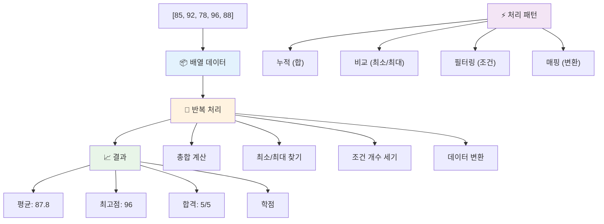
---

## GitHub Copilot Agent 챌린지 🚀

에이전트 모드를 사용해 다음 과제를 완료하세요:

**설명:** 배열과 반복문을 결합해 데이터셋을 분석하고 의미 있는 통계 정보를 생성하는 포괄적 데이터 처리 함수를 만드세요.

**요구사항:** 학생 이름과 점수 속성을 갖는 학생 성적 객체 배열을 인자로 받고, 최고 점수, 최저 점수, 평균 점수, 70점 이상 통과 학생 수, 평균 이상 점수를 받은 학생 이름 배열을 반환하는 `analyzeGrades` 함수를 작성하세요. 두 가지 이상의 서로 다른 반복문 유형을 사용해야 합니다.

[agent mode](https://code.visualstudio.com/blogs/2025/02/24/introducing-copilot-agent-mode) 에 대해 더 알아보세요.

## 🚀 챌린지
JavaScript는 특정 작업에 대해 전통적인 루프를 대체할 수 있는 여러 현대적인 배열 메서드를 제공합니다. [forEach](https://developer.mozilla.org/docs/Web/JavaScript/Reference/Global_Objects/Array/forEach), [for-of](https://developer.mozilla.org/docs/Web/JavaScript/Reference/Statements/for...of), [map](https://developer.mozilla.org/docs/Web/JavaScript/Reference/Global_Objects/Array/map), [filter](https://developer.mozilla.org/docs/Web/JavaScript/Reference/Global_Objects/Array/filter), 및 [reduce](https://developer.mozilla.org/docs/Web/JavaScript/Reference/Global_Objects/Array/reduce)를 탐색해보세요.

**당신의 도전 과제:** 학생 성적 예제를 세 가지 이상의 서로 다른 배열 메서드를 사용하여 리팩토링하세요. 현대적인 JavaScript 문법으로 얼마나 코드가 더 깔끔하고 읽기 쉬워지는지 주목하세요.

## 강의 후 퀴즈
[강의 후 퀴즈](https://ff-quizzes.netlify.app/web/quiz/14)

## 복습 및 자기 학습

JavaScript의 배열에는 데이터 조작에 매우 유용한 많은 메서드가 포함되어 있습니다. [이 메서드들에 대해 읽어보고](https://developer.mozilla.org/docs/Web/JavaScript/Reference/Global_Objects/Array) 직접 몇 가지를 사용해보세요 (예: push, pop, slice, splice) 자신이 만든 배열에서.

## 과제

[배열 반복하기](assignment.md)

---

## 📊 **당신의 배열 및 루프 도구 요약**

```mermaid
graph TD
    A["🎯 배열 & 반복문 숙달"] --> B["📦 배열 기초"]
    A --> C["🔄 반복문 종류"]
    A --> D["🔗 데이터 처리"]
    A --> E["🎨 최신 기법"]
    
    B --> B1["생성: [ ]"]
    B --> B2["인덱싱: arr[0]"]
    B --> B3["메서드: push, pop"]
    B --> B4["속성: length"]
    
    C --> C1["For: 정해진 반복"]
    C --> C2["While: 조건 기반"]
    C --> C3["For...of: 직접 접근"]
    C --> C4["forEach: 함수형"]
    
    D --> D1["통계 계산"]
    D --> D2["데이터 변환"]
    D --> D3["필터링 & 검색"]
    D --> D4["실시간 처리"]
    
    E --> E1["화살표 함수"]
    E --> E2["메서드 체이닝"]
    E --> E3["구조 분해"]
    E --> E4["템플릿 리터럴"]
    
    F["💡 주요 이점"] --> F1["효율적인 데이터 처리"]
    F --> F2["중복 코드 감소"]
    F --> F3["확장 가능한 솔루션"]
    F --> F4["더 깔끔한 문법"]
    
    style A fill:#e3f2fd
    style B fill:#e8f5e8
    style C fill:#fff3e0
    style D fill:#f3e5f5
    style E fill:#e0f2f1
    style F fill:#fce4ec
```
---

## 🚀 당신의 배열 및 루프 마스터리 타임라인

### ⚡ **다음 5분 내에 할 수 있는 것**
- [ ] 좋아하는 영화 배열을 만들고 특정 요소에 접근하기
- [ ] 1부터 10까지 세는 for 루프 작성하기
- [ ] 강의에서 다룬 현대 배열 메서드 도전 과제 시도하기
- [ ] 브라우저 콘솔에서 배열 인덱싱 연습하기

### 🎯 **이번 한 시간에 성취할 수 있는 것**
- [ ] 강의 후 퀴즈 완성하고 어려운 개념 복습하기
- [ ] GitHub Copilot 도전 과제에서 종합 성적 분석기 만들기
- [ ] 아이템 추가 및 제거가 가능한 간단한 쇼핑 카트 만들기
- [ ] 서로 다른 루프 타입 간 변환 연습하기
- [ ] `push`, `pop`, `slice`, `splice` 같은 배열 메서드 실험하기

### 📅 **한 주 동안의 데이터 처리 여정**
- [ ] 창의적으로 개선한 "배열 반복하기" 과제 완성하기
- [ ] 배열 및 루프를 활용한 할 일 목록 애플리케이션 만들기
- [ ] 수치 데이터를 위한 간단한 통계 계산기 만들기
- [ ] [MDN 배열 메서드](https://developer.mozilla.org/docs/Web/JavaScript/Reference/Global_Objects/Array) 연습하기
- [ ] 사진 갤러리 또는 음악 재생목록 인터페이스 만들기
- [ ] `map`, `filter`, `reduce`와 함께 함수형 프로그래밍 탐색하기

### 🌟 **한 달 동안의 변화**
- [ ] 고급 배열 작업 및 성능 최적화 마스터하기
- [ ] 완전한 데이터 시각화 대시보드 구축하기
- [ ] 데이터 처리 관련 오픈 소스 프로젝트에 기여하기
- [ ] 실용적인 예제와 함께 다른 사람에게 배열 및 루프 가르치기
- [ ] 재사용 가능한 데이터 처리 함수 개인 라이브러리 만들기
- [ ] 배열을 기반으로 한 알고리즘 및 데이터 구조 탐구하기

### 🏆 **최종 데이터 처리 챔피언 점검**

**당신의 배열 및 루프 마스터리를 축하합니다:**
- 실제 애플리케이션에 가장 유용한 배열 작업은 무엇이었나요?
- 어떤 루프 타입이 가장 자연스러운지, 그 이유는 무엇인가요?
- 배열과 루프를 이해하면서 데이터 구성 방식에 어떤 변화가 있었나요?
- 다음에 도전하고 싶은 복잡한 데이터 처리 작업은 무엇인가요?

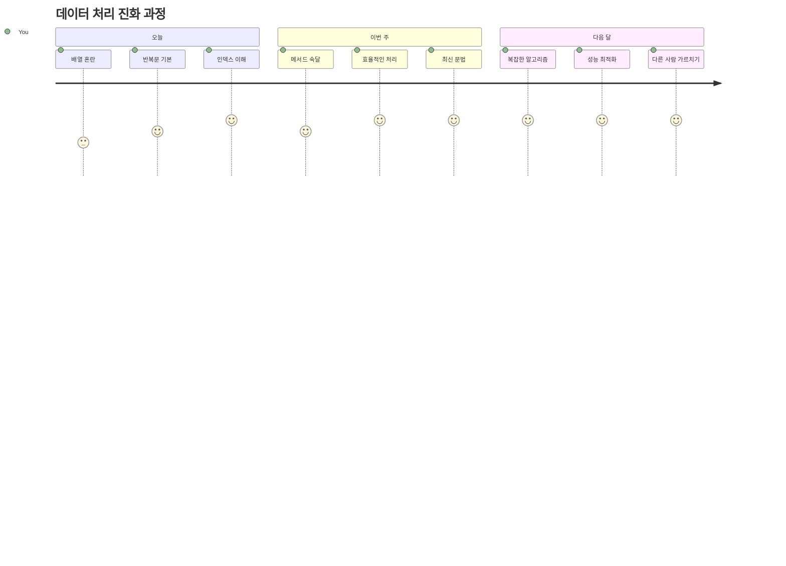
> 📦 **데이터 구성 및 처리의 힘을 해제했습니다!** 배열과 루프는 당신이 앞으로 만들 거의 모든 애플리케이션의 기반입니다. 간단한 목록부터 복잡한 데이터 분석까지, 이제 정보를 효율적이고 우아하게 처리할 도구를 갖추었습니다. 모든 동적인 웹사이트, 모바일 앱, 데이터 기반 애플리케이션은 이 기본 개념에 의존합니다. 확장 가능한 데이터 처리의 세계에 오신 것을 환영합니다! 🎉

---

<!-- CO-OP TRANSLATOR DISCLAIMER START -->
**면책 조항**:  
이 문서는 AI 번역 서비스 [Co-op Translator](https://github.com/Azure/co-op-translator)를 사용하여 번역되었습니다. 정확성을 위해 노력하고 있으나, 자동 번역에는 오류나 부정확한 부분이 있을 수 있음을 양지해 주시기 바랍니다. 원문은 해당 언어의 원본 문서가 권위 있는 자료로 간주되어야 합니다. 중요한 정보에 대해서는 전문적인 인간 번역을 권장합니다. 이 번역의 사용으로 인해 발생하는 오해나 잘못된 해석에 대해 당사는 책임을 지지 않습니다.
<!-- CO-OP TRANSLATOR DISCLAIMER END -->