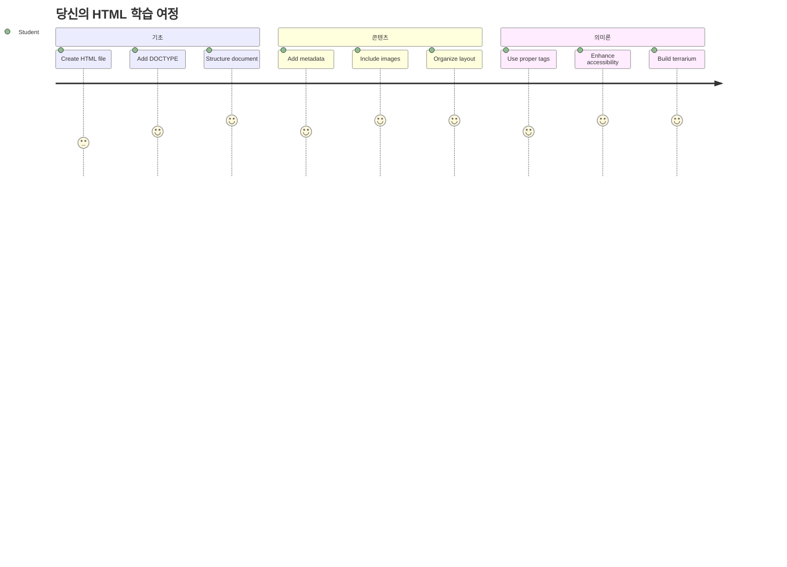
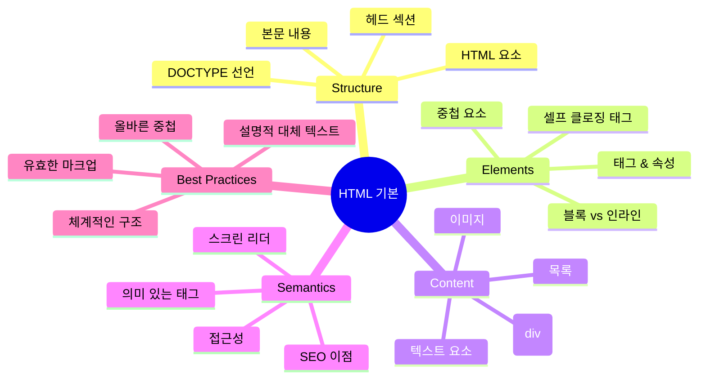
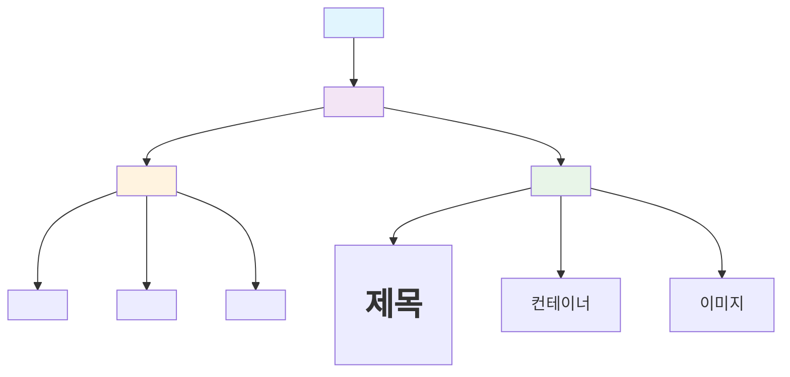
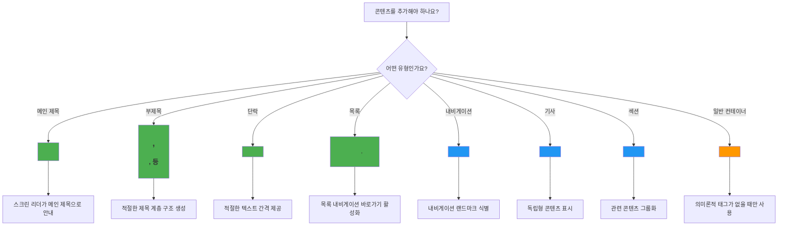
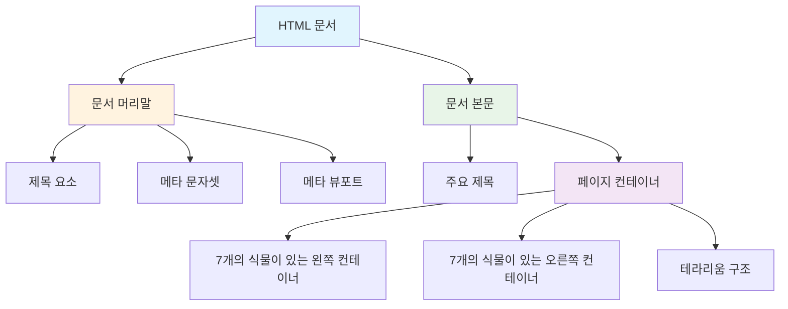
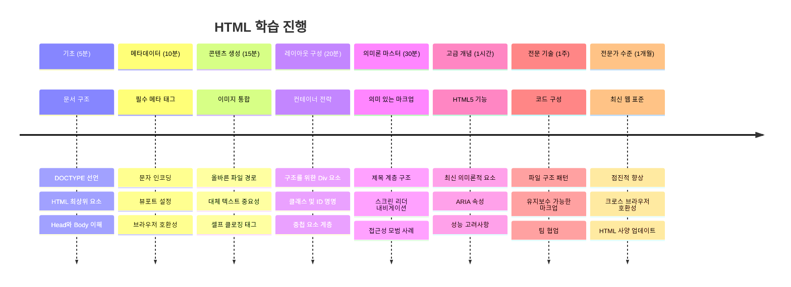

<!--
CO_OP_TRANSLATOR_METADATA:
{
  "original_hash": "3fcfa99c4897e051b558b5eaf1e8cc74",
  "translation_date": "2026-01-06T15:33:53+00:00",
  "source_file": "3-terrarium/1-intro-to-html/README.md",
  "language_code": "ko"
}
-->
# Terrarium Project Part 1: Introduction to HTML



> 스케치노트 작성자 [Tomomi Imura](https://twitter.com/girlie_mac)

HTML 또는 하이퍼텍스트 마크업 언어는 여러분이 방문한 모든 웹사이트의 기반입니다. HTML을 웹 페이지에 구조를 부여하는 골격으로 생각해보세요. 어떤 콘텐츠가 어디에 배치되고, 어떻게 조직되며, 각 부분이 무엇을 의미하는지 정의합니다. CSS는 나중에 HTML에 색상과 레이아웃을 입히고, JavaScript는 상호작용을 통해 생명을 불어넣지만, HTML은 모든 것을 가능하게 하는 필수적인 구조를 제공합니다.

이번 수업에서는 가상 테라리움 인터페이스를 위한 HTML 구조를 만들어 봅니다. 이 실습 프로젝트는 시각적으로 흥미로운 것을 만드는 동시에 기본적인 HTML 개념을 배울 수 있게 해줍니다. 시맨틱 요소를 사용해 콘텐츠를 조직하는 방법, 이미지 작업, 그리고 인터랙티브 웹 애플리케이션의 기초를 만드는 법을 배우게 됩니다.

수업이 끝나면 식물 이미지가 정돈된 열에 표시된 작동하는 HTML 페이지가 완성되어 다음 수업에서 스타일링할 준비가 됩니다. 처음에는 단순해 보여도 걱정하지 마세요. CSS가 시각적 다듬기를 하기 전 HTML이 해야 할 역할이 바로 그것입니다.


## 수업 전 퀴즈

[수업 전 퀴즈](https://ff-quizzes.netlify.app/web/quiz/15)

> 📺 **보고 배우기**: 도움이 되는 개요 영상 확인하기
> 
> [](https://www.youtube.com/watch?v=1TvxJKBzhyQ)

## 프로젝트 설정하기

HTML 코드를 작성하기 전에 테라리움 프로젝트를 위한 적절한 작업 공간을 설정합시다. 처음부터 체계적인 파일 구조를 만드는 것은 웹 개발 여정 내내 큰 도움이 되는 중요한 습관입니다.

### 과제: 프로젝트 구조 만들기

테라리움 프로젝트 전용 폴더를 만들고 첫 번째 HTML 파일을 추가합니다. 두 가지 방법이 있습니다:

**옵션 1: Visual Studio Code 사용하기**
1. Visual Studio Code를 엽니다.
2. "파일" → "폴더 열기"를 클릭하거나 `Ctrl+K, Ctrl+O` (Windows/Linux), `Cmd+K, Cmd+O` (Mac)을 사용합니다.
3. `terrarium`이라는 새 폴더를 만들고 선택합니다.
4. 탐색기 창에서 "새 파일" 아이콘을 클릭합니다.
5. 파일명을 `index.html`로 지정합니다.


**옵션 2: 터미널 명령어 사용하기**
```bash
mkdir terrarium
cd terrarium
touch index.html
code index.html
```

**이 명령어들이 하는 일:**
- **`terrarium`** 이라는 새 디렉토리를 생성합니다.
- terrarium 디렉토리로 이동합니다.
- 빈 `index.html` 파일을 생성합니다.
- Visual Studio Code에서 파일을 열어 편집합니다.

> 💡 **전문가 팁**: `index.html` 파일명은 웹 개발에서 특별한 의미가 있습니다. 누군가 웹사이트를 방문하면 브라우저는 기본 페이지로 자동으로 `index.html` 파일을 찾습니다. 따라서 `https://mysite.com/projects/` 같은 URL에서는 파일명을 명시하지 않아도 `projects` 폴더 내 `index.html` 파일을 불러옵니다.

## HTML 문서 구조 이해하기

모든 HTML 문서는 브라우저가 올바르게 이해하고 표시할 수 있도록 특정 구조를 따릅니다. 이 구조는 정중한 편지처럼 – 특정 순서의 필수 요소들을 가지며, 웹 페이지 내용을 제대로 처리하도록 돕습니다.


먼저 모든 HTML 문서가 필요로 하는 기본 뼈대를 추가합시다.

### DOCTYPE 선언과 루트 요소

모든 HTML 파일의 첫 두 줄은 문서를 브라우저에 소개하는 역할을 합니다:

```html
<!DOCTYPE html>
<html></html>
```

**이 코드가 하는 일 설명:**
- `<!DOCTYPE html>`을 사용해 문서 타입을 HTML5로 선언합니다.
- 모든 페이지 내용을 담을 루트 `<html>` 요소를 만듭니다.
- 적절한 브라우저 렌더링을 위한 최신 웹 표준을 설정합니다.
- 다양한 브라우저와 기기에서 일관된 표시를 보장합니다.

> 💡 **VS Code 팁**: VS Code에서 HTML 태그 위에 마우스를 올리면 MDN 웹 문서의 유용한 정보, 사용 예시, 브라우저 호환성 등을 확인할 수 있습니다.

> 📚 **더 알아보기**: DOCTYPE 선언은 브라우저가 "퀄크 모드"로 들어가는 것을 방지합니다. 퀄크 모드는 매우 오래된 웹사이트를 지원하기 위해 사용되었습니다. 현대 웹 개발은 간단한 `<!DOCTYPE html>` 선언을 사용하여 [표준 준수 렌더링](https://developer.mozilla.org/docs/Web/HTML/Quirks_Mode_and_Standards_Mode)을 보장합니다.

### 🔄 **교육적 점검**
**잠시 멈추고 생각하기**: 계속하기 전에 다음을 이해했는지 확인하세요.
- ✅ 왜 모든 HTML 문서에 DOCTYPE 선언이 필요한지
- ✅ `<html>` 루트 요소가 무엇을 포함하는지
- ✅ 이 구조가 브라우저가 페이지를 올바르게 렌더링하는 데 어떻게 도움이 되는지

**간단한 자기 점검**: "표준 준수 렌더링"이 무엇인지 자신의 말로 설명할 수 있나요?

## 필수 문서 메타데이터 추가하기

HTML 문서의 `<head>` 섹션은 방문자가 페이지에서 직접 보지 않는, 브라우저와 검색 엔진에 필요한 중요한 정보를 담고 있습니다. 웹페이지가 제대로 작동하고 다양한 기기 및 플랫폼에서 정확히 보일 수 있게 돕는 '무대 뒤' 정보라고 생각하세요.

이 메타데이터는 브라우저에 페이지를 어떻게 표시할지, 어떤 문자 인코딩을 사용할지, 다른 화면 크기를 어떻게 처리할지를 알려줍니다. 이는 전문적이고 접근 가능한 웹 페이지를 만드는 데 꼭 필요합니다.

### 과제: 문서 헤드 추가하기

여는 `<html>` 태그와 닫는 `</html>` 태그 사이에 아래 `<head>` 섹션을 넣으세요:

```html
<head>
	<title>Welcome to my Virtual Terrarium</title>
	<meta charset="utf-8" />
	<meta http-equiv="X-UA-Compatible" content="IE=edge" />
	<meta name="viewport" content="width=device-width, initial-scale=1" />
</head>
```

**각 요소가 하는 일을 세분화해서 설명:**
- 브라우저 탭과 검색 결과에 표시되는 페이지 제목을 설정합니다.
- 전 세계에서 텍스트가 제대로 보이도록 UTF-8 문자 인코딩을 지정합니다.
- 최신 버전의 인터넷 익스플로러와 호환을 보장합니다.
- 뷰포트를 기기 너비에 맞춰 반응형 디자인을 설정합니다.
- 초기 확대 배율을 설정해서 내용을 자연스러운 크기로 표시합니다.

> 🤔 **생각해 보세요**: `<meta name="viewport" content="width=600">`와 같은 뷰포트 메타 태그를 설정하면 무슨 일이 벌어질까요? 페이지가 항상 600픽셀 너비로 고정되어 반응형 디자인이 무너지게 됩니다! [올바른 뷰포트 설정](https://developer.mozilla.org/docs/Web/HTML/Viewport_meta_tag)을 더 알아보세요.

## 문서 본문 구성하기

`<body>` 요소는 웹페이지에서 사용자가 보고 상호작용할 수 있는 모든 콘텐츠를 담고 있습니다. `<head>`는 브라우저에 지시를 내리는 역할을 했지만, `<body>`는 실제 내용인 텍스트, 이미지, 버튼 등 사용자 인터페이스를 구성하는 요소를 포함합니다.

본문 구조를 추가하고 HTML 태그가 어떻게 함께 작동하는지 이해해봅시다.

### HTML 태그 구조 이해하기

HTML은 대부분 쌍으로 짝지어진 태그를 사용하여 요소를 정의합니다. 예를 들어, `<p>`로 열고 `</p>`로 닫으며 그 사이에 콘텐츠가 들어갑니다: `<p>Hello, world!</p>`. 이 코드는 "Hello, world!"라는 텍스트를 포함하는 문단 요소를 만듭니다.

### 과제: Body 요소 추가하기

HTML 파일을 업데이트하여 `<body>` 요소를 포함하세요:

```html
<!DOCTYPE html>
<html>
	<head>
		<title>Welcome to my Virtual Terrarium</title>
		<meta charset="utf-8" />
		<meta http-equiv="X-UA-Compatible" content="IE=edge" />
		<meta name="viewport" content="width=device-width, initial-scale=1" />
	</head>
	<body></body>
</html>
```

**완전한 구조가 제공하는 것:**
- 기본 HTML5 문서 틀을 만듭니다.
- 올바른 브라우저 렌더링을 위한 필수 메타데이터를 포함합니다.
- 보이는 콘텐츠를 위한 빈 본문을 생성합니다.
- 현대 웹 개발 우수 사례를 따릅니다.

이제 테라리움에 보이는 요소를 추가할 준비가 됐습니다. `<div>` 요소를 컨테이너로 사용해 콘텐츠의 여러 섹션을 조직하고, `` 요소로 식물 이미지를 표시할 것입니다.

### 이미지와 레이아웃 컨테이너 다루기

HTML에서 이미지는 특별하게 “셀프 클로징(self-closing)” 태그를 사용합니다. 콘텐츠를 감싸는 `<p></p>` 같은 태그와 달리 `` 태그는 이미지 파일 경로를 지정하는 `src` 속성과 접근성을 위한 `alt` 속성 등 필요한 정보를 태그 내에 모두 포함합니다.

HTML에 이미지를 추가하기 전에 프로젝트 파일을 적절히 정리해야 합니다. images 폴더를 만들고 식물 그래픽을 추가합시다.

**먼저 이미지 준비하기:**
1. 테라리움 프로젝트 폴더 안에 `images`라는 폴더를 만듭니다.
2. [솔루션 폴더](../../../../3-terrarium/solution/images)에서 식물 이미지를 모두 다운로드합니다 (총 14개 식물 이미지).
3. 모든 식물 이미지를 새로 만든 `images` 폴더에 복사합니다.

### 과제: 식물 표시 레이아웃 만들기

이제 `<body></body>` 태그 사이에 두 개의 열로 구성된 식물 이미지들을 추가하세요:

```html
<div id="page">
	<div id="left-container" class="container">
		<div class="plant-holder">
			
		</div>
		<div class="plant-holder">
			
		</div>
		<div class="plant-holder">
			
		</div>
		<div class="plant-holder">
			
		</div>
		<div class="plant-holder">
			
		</div>
		<div class="plant-holder">
			
		</div>
		<div class="plant-holder">
			
		</div>
	</div>
	<div id="right-container" class="container">
		<div class="plant-holder">
			
		</div>
		<div class="plant-holder">
			
		</div>
		<div class="plant-holder">
			
		</div>
		<div class="plant-holder">
			
		</div>
		<div class="plant-holder">
			
		</div>
		<div class="plant-holder">
			
		</div>
		<div class="plant-holder">
			
		</div>
	</div>
</div>
```

**이 코드에서 단계별로 일어나는 일:**
- 모든 콘텐츠를 담는 메인 페이지 컨테이너 `id="page"`를 만듭니다.
- 왼쪽과 오른쪽 두 개의 열 컨테이너 `left-container`와 `right-container`를 설정합니다.
- 왼쪽 열에 7개, 오른쪽 열에 7개의 식물을 배치합니다.
- 각 식물 이미지를 개별 위치 지정을 위한 `plant-holder` div로 감쌉니다.
- 다음 수업에서 CSS 스타일링을 위한 일관된 클래스 이름을 적용합니다.
- 나중에 JavaScript 상호작용을 위해 각 식물 이미지에 고유 ID를 부여합니다.
- 이미지 폴더를 가리키는 올바른 파일 경로를 포함합니다.

> 🤔 **생각해 보세요**: 현재 모든 이미지가 같은 alt 텍스트 "plant"를 가지고 있는데, 접근성 측면에서 이상적이지 않습니다. 화면 읽기 사용자는 14번 "plant"라는 단어를 듣고 어떤 식물을 가리키는지 알 수 없습니다. 각 이미지에 대해 더 나은, 구체적인 alt 텍스트는 무엇일까요?

> 📝 **HTML 요소 유형**: `<div>` 요소는 ‘블록 레벨’로서 전체 너비를 차지하며, `<span>` 요소는 ‘인라인’으로 필요한 너비만 차지합니다. 만약 이 모든 `<div>`를 `<span>`으로 바꾼다면 어떤 일이 발생할까요?

### 🔄 **교육적 점검**
**구조 이해하기**: HTML 구조를 잠시 검토하세요:
- ✅ 레이아웃의 주요 컨테이너를 확인할 수 있나요?
- ✅ 각 이미지에 고유 ID가 있는 이유를 이해하나요?
- ✅ `plant-holder` div의 목적을 어떻게 설명하겠나요?

**시각 검사**: HTML 파일을 브라우저에서 열어보세요. 다음이 보여야 합니다:
- 기본 식물 이미지 목록
- 두 열로 정돈된 이미지들
- 단순하고 스타일링되지 않은 레이아웃

**기억하세요**: 이런 평범한 모습이 CSS 스타일링 전 HTML이 보여야 할 정확한 모습입니다!

이 마크업이 추가되면 식물이 화면에 나타나지만 아직 다듬어진 모습은 아닙니다 – 그 역할은 다음 수업의 CSS가 담당합니다! 지금은 콘텐츠를 적절히 조직하고 접근성 모범 사례를 따른 견고한 HTML 기초가 마련된 상태입니다.

## 접근성을 위한 시맨틱 HTML 사용

시맨틱 HTML은 외형뿐 아니라 의미와 목적에 따라 HTML 요소를 선택하는 것입니다. 시맨틱 마크업을 사용하면 웹 브라우저, 검색 엔진, 그리고 스크린 리더 같은 보조 기술에 콘텐츠의 구조와 의미를 전달하게 됩니다.


이 방법은 장애가 있는 사용자에게 웹사이트 접근성을 높이고, 검색 엔진이 콘텐츠를 더 잘 이해하도록 돕습니다. 현대 웹 개발의 근간이 되는 원칙이며 모두에게 더 나은 경험을 만듭니다.

### 시맨틱 페이지 제목 추가하기

테라리움 페이지에 적절한 제목을 넣어 봅시다. 여는 `<body>` 태그 바로 다음 줄에 다음 코드를 삽입하세요:

```html
<h1>My Terrarium</h1>
```

**시맨틱 마크업이 중요한 이유:**
- 스크린 리더가 페이지 구조를 쉽게 탐색하고 이해하게 돕습니다.
- 콘텐츠 계층을 명확히 하여 검색 엔진 최적화(SEO)를 향상시킵니다.
- 시각 장애인이나 인지 기능 차이가 있는 사용자도 접근성을 높입니다.
- 모든 기기와 플랫폼 전반에 걸쳐 더 좋은 사용자 경험을 제공합니다.
- 전문적인 개발을 위한 웹 표준과 최선의 실천법을 따릅니다.

**시맨틱 vs 비시맨틱 선택 예시:**

| 목적 | ✅ 시맨틱 선택 | ❌ 비시맨틱 선택 |
|---------|-------------------|------------------------|
| 주요 제목 | `<h1>Title</h1>` | `<div class="big-text">Title</div>` |
| 내비게이션 | `<nav><ul><li></li></ul></nav>` | `<div class="menu"><div></div></div>` |
| 버튼 | `<button>Click me</button>` | `<span onclick="...">Click me</span>` |
| 기사 내용 | `<article><p></p></article>` | `<div class="content"><div></div></div>` |

> 🎥 **실제 예제 보기**: [웹 페이지에서 스크린 리더가 어떻게 작동하는지](https://www.youtube.com/watch?v=OUDV1gqs9GA) 영상을 시청하여 시맨틱 마크업이 접근성에 왜 중요한지 이해하세요. 적절한 HTML 구조가 사용자를 효율적으로 안내하는 방법을 확인할 수 있습니다.

## 테라리움 컨테이너 만들기

이제 테라리움 자체 – 식물을 담을 유리 용기 – 의 HTML 구조를 추가해 봅시다. 이 섹션은 중요한 개념을 보여줍니다: HTML은 구조를 제공하지만 CSS 스타일링 없이는 이 요소들이 눈에 보이지 않습니다.

테라리움 마크업은 다음 수업에서 CSS 스타일링을 직관적이고 유지보수 쉽게 만들기 위해 설명적인 클래스 이름을 사용합니다.

### 과제: 테라리움 구조 추가하기

마지막 `</div>` 태그 위(페이지 컨테이너 닫는 태그 바로 전에) 이 마크업을 삽입하세요:

```html
<div id="terrarium">
	<div class="jar-top"></div>
	<div class="jar-walls">
		<div class="jar-glossy-long"></div>
		<div class="jar-glossy-short"></div>
	</div>
	<div class="dirt"></div>
	<div class="jar-bottom"></div>
</div>
```

**이 테라리움 구조가 하는 일:**
- 고유 ID를 가진 메인 테라리움 컨테이너를 생성합니다.
- **각 시각적 구성 요소(상단, 벽, 흙, 하단)에 대해 별도의 요소를 정의합니다**
- **유리 반사 효과(광택 요소)를 위한 중첩 요소를 포함합니다**
- **각 요소의 용도를 명확히 나타내는 설명적인 클래스 이름을 사용합니다**
- **유리 테라리움 외관을 만들어낼 CSS 스타일링 구조를 준비합니다**

> 🤔 **뭔가 눈치채셨나요?**: 이 마크업을 추가했는데 페이지에 새로 보이는 것은 없죠! 이것은 HTML이 구조를 제공하는 반면 CSS가 외관을 제공한다는 점을 완벽하게 보여줍니다. 이 `<div>` 요소들은 존재하지만 아직 시각적 스타일링이 없으며 – 다음 수업에서 스타일이 적용될 것입니다!


### 🔄 **교육 점검**
**HTML 구조 숙달**: 다음을 할 수 있는지 확인하세요:
- ✅ HTML 구조와 시각적 외관의 차이 설명하기
- ✅ 시맨틱과 비시맨틱 HTML 요소 구분하기
- ✅ 적절한 마크업이 접근성에 어떻게 도움이 되는지 설명하기
- ✅ 완전한 문서 트리 구조 인식하기

**이해도 테스트**: 자바스크립트가 비활성화되고 CSS가 제거된 상태로 브라우저에서 HTML 파일을 열어 보세요. 이것이 당신이 만든 순수 시맨틱 구조임을 보여줍니다!

---

## GitHub Copilot 에이전트 챌린지

에이전트 모드를 사용하여 다음 챌린지를 완료하세요:

**설명:** 테라리움 프로젝트에 추가할 수 있는 식물 관리 가이드 섹션에 대한 시맨틱 HTML 구조를 만드세요.

**요구 사항:** "Plant Care Guide"라는 주요 제목과 각각 "Watering", "Light Requirements", "Soil Care"라는 부제목을 가진 세 개의 하위 섹션을 포함하는 시맨틱 HTML 섹션을 만드세요. 각 섹션에는 식물 관리 정보가 담긴 단락이 포함되어야 합니다. `<section>`, `<h2>`, `<h3>`, `<p>` 같은 적절한 시맨틱 HTML 태그를 사용해 내용을 구조화하세요.

[여기](https://code.visualstudio.com/blogs/2025/02/24/introducing-copilot-agent-mode)에서 에이전트 모드에 대해 더 알아보세요.

## HTML 역사 탐구 챌린지

**웹 진화를 배우기**

HTML은 1990년 팀 버너스리(Tim Berners-Lee)가 CERN에서 최초 웹 브라우저를 만든 이후 크게 발전해 왔습니다. `<marquee>` 같은 일부 오래된 태그는 접근성 기준이나 반응형 디자인과 잘 맞지 않아 현재는 더 이상 권장되지 않습니다.

**실험해 보세요:**
1. `<h1>` 제목을 일시적으로 `<marquee>` 태그로 감싸 보세요: `<marquee><h1>My Terrarium</h1></marquee>`
2. 브라우저에서 페이지를 열어 스크롤 효과를 관찰하세요
3. 이 태그가 왜 비권장되었는지 생각해 보세요 (힌트: 사용자 경험과 접근성을 고려하세요)
4. `<marquee>` 태그를 제거하고 시맨틱 마크업으로 복원하세요

**반성 질문:**
- 스크롤 제목이 시각 장애나 동작 민감성을 가진 사용자에게 어떤 영향을 미칠까요?
- 비슷한 시각 효과를 더 접근성 있게 구현할 수 있는 현대 CSS 기법은 무엇일까요?
- 왜 현재 웹 표준을 사용하고 비권장 요소를 피하는 것이 중요할까요?

[여기](https://developer.mozilla.org/docs/Web/HTML/Element#Obsolete_and_deprecated_elements)에서 폐기되고 비권장된 HTML 요소에 대해 더 알아보고 웹 표준이 어떻게 사용자 경험 향상을 목표로 진화하는지 이해하세요.


## 강의 후 퀴즈

[강의 후 퀴즈](https://ff-quizzes.netlify.app/web/quiz/16)

## 복습 및 자기주도 학습

**HTML 지식 심화하기**

HTML은 30년 넘게 웹의 기반이 되어 왔으며, 단순 문서 마크업 언어에서 상호작용 애플리케이션을 구축하는 정교한 플랫폼으로 발전했습니다. 이 진화를 이해하면 현대 웹 표준을 더욱 잘 이해하고 개발 결정을 더 효과적으로 내릴 수 있습니다.

**추천 학습 경로:**

1. **HTML 역사와 진화**
   - HTML 1.0부터 HTML5까지의 타임라인 조사하기
   - 특정 태그가 폐기된 이유 탐구(접근성, 모바일 친화성, 유지보수성)
   - 새로운 HTML 기능과 제안 조사하기

2. **시맨틱 HTML 심층 학습**
   - [HTML5 시맨틱 요소 전체 목록](https://developer.mozilla.org/docs/Web/HTML/Element) 공부하기
   - `<article>`, `<section>`, `<aside>`, `<main>`의 사용 시기 파악하기
   - 접근성 향상을 위한 ARIA 속성 학습하기

3. **현대 웹 개발**
   - Microsoft Learn에서 [반응형 웹사이트 구축](https://docs.microsoft.com/learn/modules/build-simple-website/?WT.mc_id=academic-77807-sagibbon) 배우기
   - HTML, CSS, 자바스크립트 통합 방법 이해하기
   - 웹 성능 및 SEO 최적화 방법 익히기

**반성 질문:**
- 어떤 폐기 태그를 발견했고, 왜 삭제되었나요?
- 앞으로 제안되고 있는 새 HTML 기능은 무엇인가요?
- 시맨틱 HTML이 웹 접근성과 SEO에 어떻게 기여하나요?

### ⚡ **다음 5분 내 할 수 있는 일**
- [ ] 개발자 도구(F12) 열어 좋아하는 웹사이트의 HTML 구조 검사하기
- [ ] 기본 태그 `<h1>`, `<p>`, ``를 사용한 간단한 HTML 파일 만들기
- [ ] 온라인 W3C HTML Validator로 HTML 검증하기
- [ ] HTML에 `<!-- comment -->` 사용해 주석 추가해보기

### 🎯 **이번 시간에 할 수 있는 목표**
- [ ] 강의 후 퀴즈 완료 및 시맨틱 HTML 개념 복습하기
- [ ] 적절한 HTML 구조를 사용해 나 자신에 관한 간단한 웹페이지 만들기
- [ ] 다양한 제목 레벨과 텍스트 서식 태그 실험하기
- [ ] 이미지와 링크 추가로 멀티미디어 통합 연습하기
- [ ] 아직 시도하지 않은 HTML5 기능 조사하기

### 📅 **한 주간 HTML 여정**
- [ ] 시맨틱 마크업을 활용해 테라리움 프로젝트 과제 완료하기
- [ ] ARIA 레이블과 역할을 사용해 접근성 좋은 웹페이지 만들기
- [ ] 다양한 입력 유형을 활용한 폼 생성 연습하기
- [ ] localStorage 또는 Geolocation 같은 HTML5 API 탐색하기
- [ ] 반응형 HTML 패턴과 모바일 퍼스트 디자인 공부하기
- [ ] 다른 개발자의 HTML 코드 검토하며 최선 사례 배우기

### 🌟 **한 달간 웹 기본기 다지기**
- [ ] HTML 실력을 보여줄 포트폴리오 웹사이트 제작하기
- [ ] Handlebars 같은 프레임워크로 HTML 템플릿 학습하기
- [ ] HTML 문서화 개선으로 오픈소스 프로젝트에 기여하기
- [ ] 커스텀 요소 등 고급 HTML 개념 마스터하기
- [ ] CSS 프레임워크 및 자바스크립트 라이브러리와 통합하기
- [ ] HTML 기본기를 배우는 이들을 멘토링하기

## 🎯 당신의 HTML 숙련도 일정


### 🛠️ 당신의 HTML 도구 요약

이번 수업을 마치면 다음을 갖게 됩니다:
- **문서 구조**: 적절한 DOCTYPE을 갖춘 완전한 HTML5 기반
- **시맨틱 마크업**: 접근성과 SEO를 강화하는 의미 있는 태그
- **이미지 통합**: 올바른 파일 구성 및 대체 텍스트 관행
- **레이아웃 컨테이너**: 설명적인 클래스 이름을 가진 전략적 div 활용
- **접근성 인식**: 스크린 리더 내비게이션 이해
- **현대 표준**: 최신 HTML5 관행과 비권장 태그 지식
- **프로젝트 기반**: CSS 스타일링과 JavaScript 상호작용 기초 탄탄하게 마련

**다음 단계**: 당신의 HTML 구조는 CSS 스타일링을 위한 준비가 완료되었습니다! 구축한 시맨틱 기초 덕분에 다음 수업을 훨씬 쉽게 이해할 수 있을 것입니다.


## 과제

[HTML 연습하기: 블로그 목업 만들기](assignment.md)

---

<!-- CO-OP TRANSLATOR DISCLAIMER START -->
**면책 조항**:  
이 문서는 AI 번역 서비스 [Co-op Translator](https://github.com/Azure/co-op-translator)를 사용하여 번역되었습니다. 정확성을 위해 최선을 다하고 있으나, 자동 번역에는 오류나 부정확한 부분이 있을 수 있음을 양지해 주시기 바랍니다. 원문 문서는 권위 있는 출처로 간주되어야 합니다. 중요한 정보의 경우 전문 인력에 의한 번역을 권장합니다. 이 번역의 사용으로 인해 발생하는 오해나 잘못된 해석에 대해 당사는 책임을 지지 않습니다.
<!-- CO-OP TRANSLATOR DISCLAIMER END -->