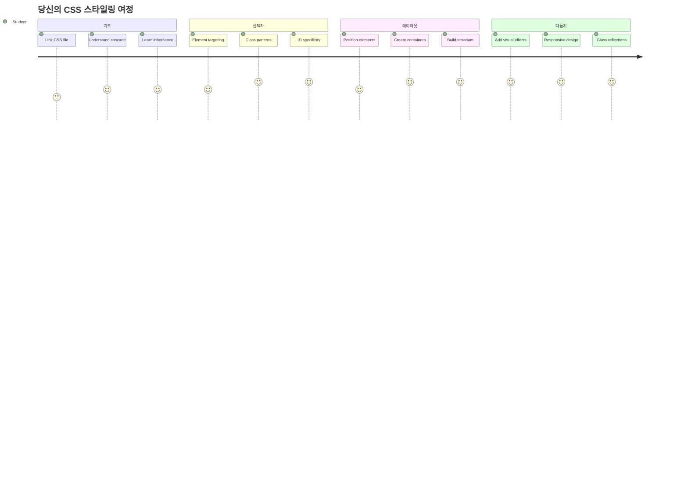
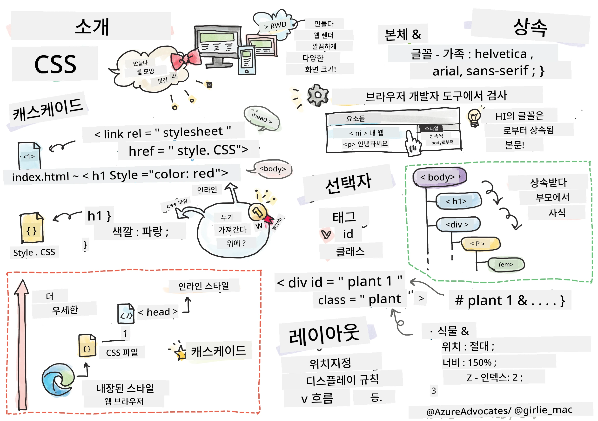
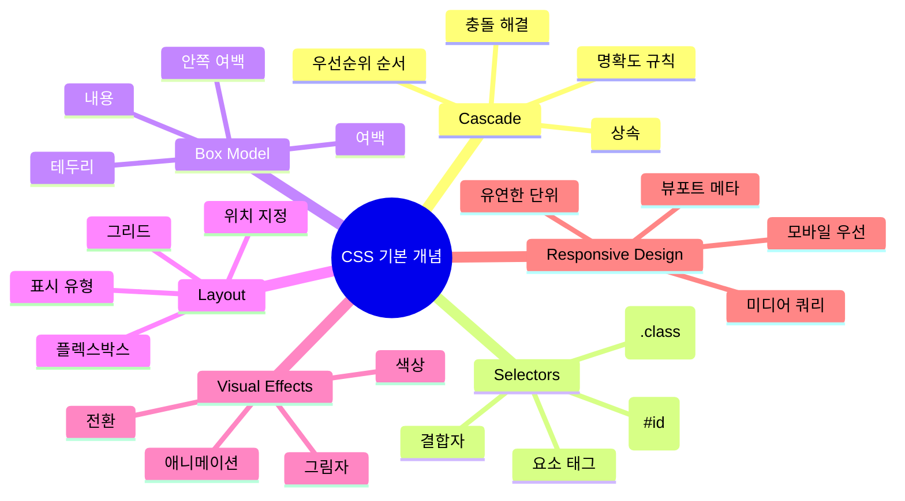
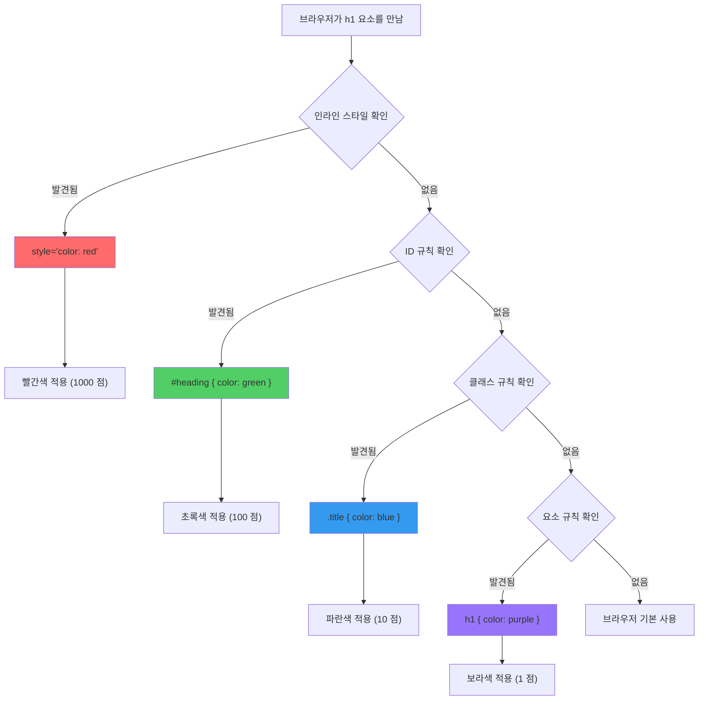
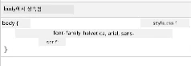
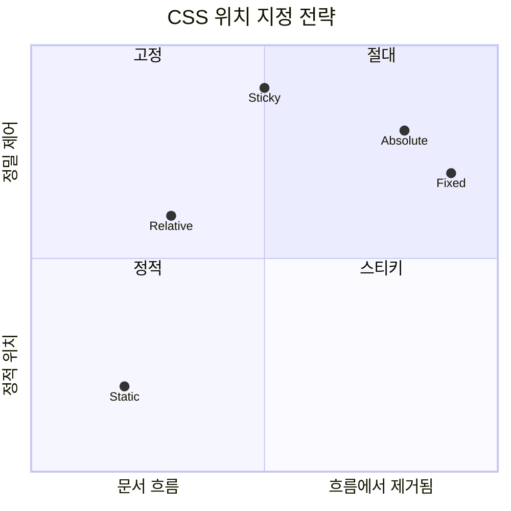
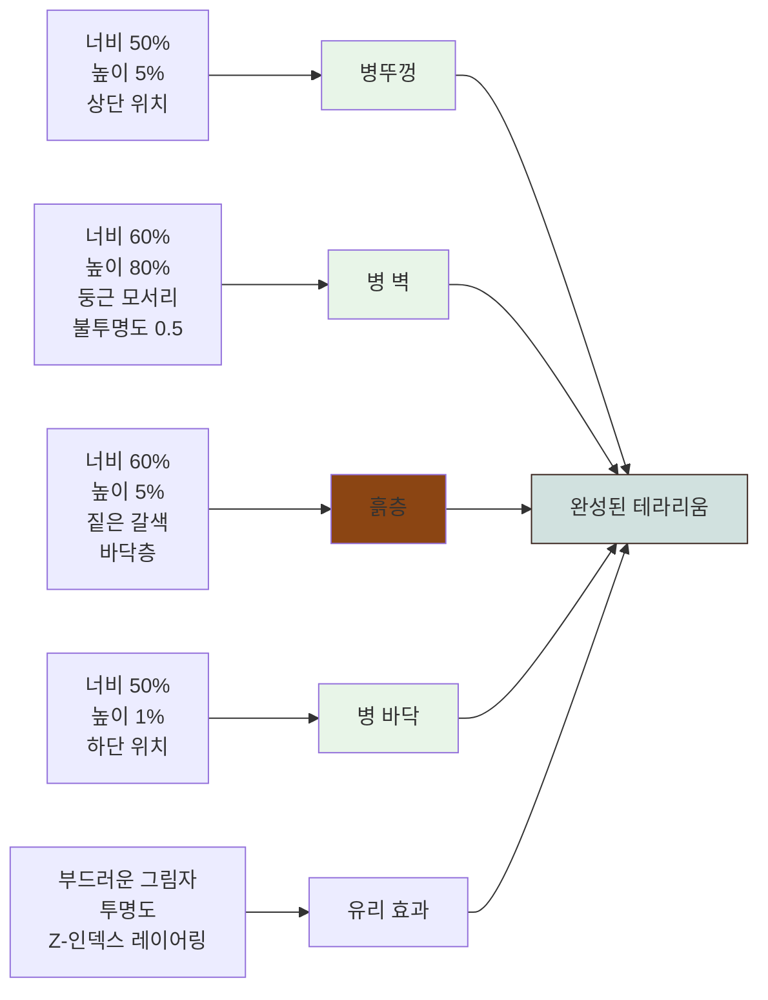
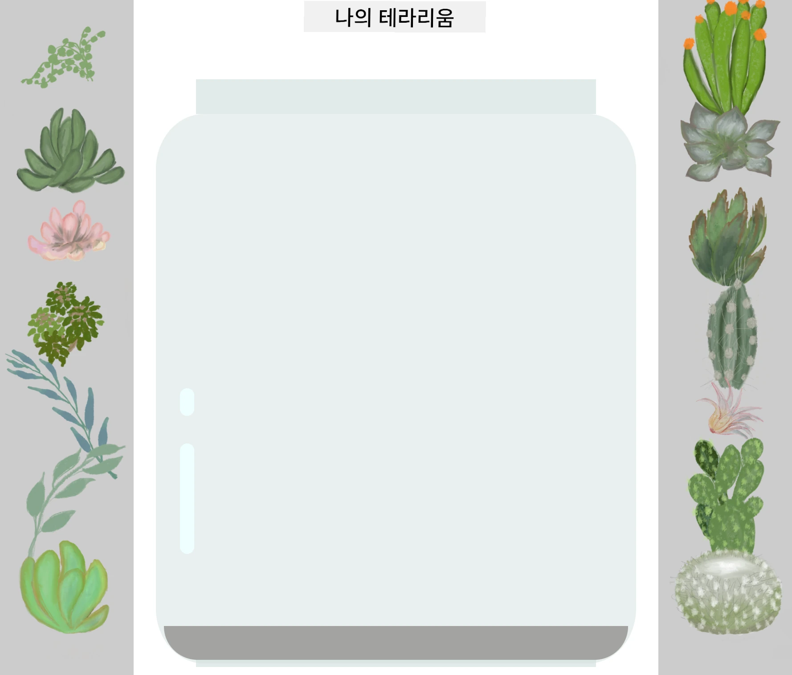
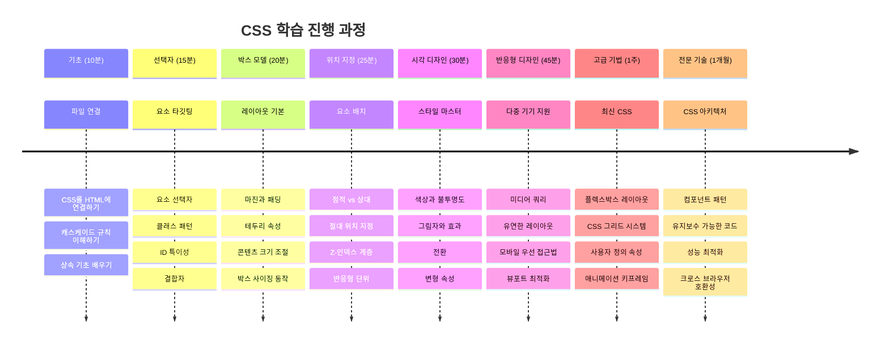

<!--
CO_OP_TRANSLATOR_METADATA:
{
  "original_hash": "e39f3a4e3bcccf94639e3af1248f8a4d",
  "translation_date": "2026-01-06T15:38:45+00:00",
  "source_file": "3-terrarium/2-intro-to-css/README.md",
  "language_code": "ko"
}
-->
# Terrarium 프로젝트 2부: CSS 소개



> 스케치노트 작성자: [Tomomi Imura](https://twitter.com/girlie_mac)

기억하시나요, HTML 테라리움이 꽤 기본적으로 보였던 것을? CSS는 그 단순한 구조를 시각적으로 매력적으로 변신시키는 부분입니다.

HTML이 집의 골조를 짓는 것과 같다면, CSS는 그 집을 집답게 만드는 모든 것 - 페인트 색상, 가구 배치, 조명, 방들이 서로 어떻게 연결되는지 등을 의미합니다. 베르사유 궁전이 원래 사냥용 오두막으로 시작했지만, 세심한 장식과 레이아웃 덕분에 세계에서 가장 훌륭한 건물 중 하나가 된 것을 생각해 보세요.

오늘은 여러분의 테라리움을 기능적 단계에서 세련된 단계로 바꿔 보겠습니다. 요소를 정확하게 위치시키는 법, 다양한 화면 크기에 반응하는 레이아웃을 만드는 법, 그리고 웹사이트를 매력적으로 만드는 시각적 요소들을 배우게 될 것입니다.

이 수업이 끝날 무렵, 전략적인 CSS 스타일링이 프로젝트를 얼마나 극적으로 향상시킬 수 있는지 보게 될 것입니다. 여러분의 테라리움에 스타일을 더해 보죠.


## 강의 전 퀴즈

[강의 전 퀴즈](https://ff-quizzes.netlify.app/web/quiz/17)

## CSS 시작하기

CSS는 흔히 "예쁘게 만드는 것"이라고만 생각되지만, 훨씬 더 넓은 목적을 가집니다. CSS는 마치 영화 감독과 같아서, 모든 것이 어떻게 보이는지뿐 아니라 어떻게 움직이고, 상호작용에 반응하며, 다양한 상황에 적응하는지도 통제합니다.

현대 CSS는 놀라울 정도로 강력합니다. 휴대폰, 태블릿, 데스크톱 컴퓨터에 맞춰 레이아웃을 자동으로 조정하는 코드를 작성할 수 있습니다. 사용자 주의를 필요한 곳으로 자연스럽게 이끄는 부드러운 애니메이션도 만들 수 있습니다. 모든 것이 잘 작동할 때 결과는 아주 인상적입니다.

> 💡 **전문 팁**: CSS는 끊임없이 새로운 기능들과 성능을 갖춰가고 있습니다. 새 CSS 기능을 프로덕션 프로젝트에 사용하기 전에 항상 [CanIUse.com](https://caniuse.com)에서 브라우저 지원 현황을 확인하세요.

**이번 수업에서 달성할 내용:**
- **최신 CSS 기술**을 사용해 테라리움 전체 시각 디자인 완성
- **캐스케이드, 상속, CSS 선택자** 등의 기본 개념 탐구
- **반응형 위치 및 레이아웃 전략** 구현
- **CSS 셰이프와 스타일링**을 사용해 테라리움 컨테이너 구축

### 사전 조건

이전 수업에서 HTML 구조를 완성했으며 이를 스타일링할 준비가 되어 있어야 합니다.

> 📺 **비디오 자료**: 도움이 되는 영상 워크스루 보기
>
> [](https://www.youtube.com/watch?v=6yIdOIV9p1I)

### CSS 파일 설정하기

스타일링을 시작하기 전에 CSS를 HTML에 연결해야 합니다. 이 연결은 브라우저에 테라리움 스타일링 지침이 어디에 있는지 알려줍니다.

테라리움 폴더에 `style.css`라는 새 파일을 만들고, HTML 문서의 `<head>` 섹션에 연결하세요:

```html
<link rel="stylesheet" href="./style.css" />
```

**이 코드가 하는 일:**
- HTML과 CSS 파일 간 연결을 만듭니다
- 브라우저가 `style.css`의 스타일을 불러와 적용하도록 지시합니다
- `rel="stylesheet"` 속성으로 CSS 파일임을 지정합니다
- `href="./style.css"` 경로를 참조합니다

## CSS 캐스케이드 이해하기

CSS가 "캐스케이딩(Cascading)" 스타일 시트라 불리는 이유를 궁금해한 적 있나요? 스타일은 폭포처럼 순차적으로 적용되며 때로는 서로 충돌합니다.

군대 명령 구조를 생각해 보세요 - 장군의 명령은 "모든 군인은 녹색 옷을 입어라"일지라도, 당신 부대에만 "의식에서는 정장 파란색을 입어라"라는 구체적 명령이 내려질 수 있습니다. 더 구체적인 지시가 우선합니다. CSS도 유사한 논리를 따르며 이 계층 구조를 이해하면 디버깅이 훨씬 쉬워집니다.

### 캐스케이드 우선순위 실험하기

캐스케이드 작동 방식을 확인하기 위해 스타일 충돌을 만들어 봅시다. 먼저 `<h1>` 태그에 인라인 스타일을 추가하세요:

```html
<h1 style="color: red">My Terrarium</h1>
```

**이 코드가 하는 일:**
- `<h1>` 요소에 직접 빨간색을 인라인 스타일로 적용합니다
- `style` 속성을 사용해 CSS를 HTML에 직접 삽입합니다
- 해당 요소에 가장 높은 우선순위 스타일 규칙을 만듭니다

다음으로 이 규칙을 `style.css` 파일에 추가하세요:

```css
h1 {
  color: blue;
}
```

**위에 있는 내용은:**
- 모든 `<h1>` 요소를 대상으로 하는 CSS 규칙 정의
- 외부 스타일시트를 사용해 텍스트 색상을 파란색으로 설정
- 인라인 스타일보다 낮은 우선순위 규칙 생성

✅ **지식 점검**: 웹 앱에서 어떤 색깔이 표시되나요? 그 색깔이 우선인 이유는 무엇인가요? 스타일을 덮어써야 할 상황을 생각해 본 적 있나요?


> 💡 **CSS 우선순위 순서 (높음 → 낮음):**
> 1. **인라인 스타일** (style 속성)
> 2. **ID 선택자** (#myId)
> 3. **클래스 및 속성 선택자** (.myClass)
> 4. **요소 선택자** (h1, div, p)
> 5. **브라우저 기본값**

## CSS 상속 실습

CSS 상속은 유전학과 비슷합니다 - 요소는 부모 요소로부터 특정 속성을 상속받습니다. 예를 들어 `body` 요소에 폰트 패밀리를 설정하면 내부 모든 텍스트가 자동으로 같은 폰트를 사용합니다. 이는 하프부르크 가문에서 독특한 턱선이 세대를 거쳐 나타나는 것과 비슷합니다.

하지만 모든 속성이 상속되는 건 아닙니다. 폰트나 색상 같은 텍스트 스타일은 상속되지만, 마진이나 테두리 같은 레이아웃 속성은 상속되지 않습니다. 자식이 신체적 특징은 물려받지만 부모의 패션 감각은 물려받지 않는 것과 같죠.

### 폰트 상속 관찰하기

`<body>` 요소에 폰트 패밀리를 설정해서 상속을 확인해 봅시다:

```css
body {
  font-family: 'Segoe UI', Tahoma, Geneva, Verdana, sans-serif;
}
```

**여기서 일어나는 일:**
- `<body>` 요소를 대상으로 페이지 전체 폰트 패밀리 설정
- 브라우저 호환성을 위한 폴백(font stack) 옵션 사용
- 다양한 운영체제에서 잘 보이는 최신 시스템 폰트 적용
- 자식 요소가 특별히 덮어쓰지 않는 이상 이 폰트를 상속받음 보장

브라우저 개발자 도구(F12)를 열고 요소 탭에서 `<h1>` 요소를 검사해 보세요. `body`로부터 폰트 패밀리를 상속받는 것을 확인할 수 있습니다:



✅ **실험 시간**: `<body>`에 `color`, `line-height`, 또는 `text-align` 같은 다른 상속 속성을 설정해 보세요. 제목과 다른 요소들은 어떻게 변하나요?

> 📝 **상속 가능한 속성 예:** `color`, `font-family`, `font-size`, `line-height`, `text-align`, `visibility`
>
> **비상속 속성 예:** `margin`, `padding`, `border`, `width`, `height`, `position`

### 🔄 **교육적 점검**
**CSS 기초 이해 여부 확인:** 선택자로 넘어가기 전에 다음을 할 수 있어야 합니다.
- ✅ 캐스케이드와 상속의 차이 설명
- ✅ 우선순위 충돌 시 어떤 스타일이 우선하는지 예측
- ✅ 상속되는 속성 식별
- ✅ CSS 파일을 HTML에 제대로 연결하는 법

**빠른 테스트**: 다음 스타일이 있을 때 `<div class="special">` 내부의 `<h1>`은 어떤 색이 될까요?
```css
div { color: blue; }
.special { color: green; }
h1 { color: red; }
```
*답: 빨간색 (요소 선택자가 직접 h1을 지정함)*

## CSS 선택자 마스터하기

CSS 선택자는 특정 요소를 스타일링하는 방법입니다. "집"이라고 말하는 대신 "메이플 거리의 빨간 문이 있는 파란 집"처럼 정확한 지시를 하는 것과 같습니다.

CSS에는 구체성을 다르게 하는 여러 방법이 있으며, 적절한 선택자를 고르는 것은 목적에 맞는 도구를 선택하는 것과 같습니다. 때로는 동네 모든 문을 스타일링해야 하고, 때로는 특정 한 문만 스타일링해야 할 때도 있죠.

### 요소 선택자 (태그)

요소 선택자는 태그 이름으로 HTML 요소를 타겟팅합니다. 페이지 전반에 걸쳐 기본 스타일을 설정할 때 적합합니다:

```css
body {
  font-family: 'Segoe UI', Tahoma, Geneva, Verdana, sans-serif;
  margin: 0;
  padding: 0;
}

h1 {
  color: #3a241d;
  text-align: center;
  font-size: 2.5rem;
  margin-bottom: 1rem;
}
```

**이 스타일 설명:**
- `body` 선택자로 페이지 전체에 일관된 타이포그래피 지정
- 기본 브라우저 여백과 패딩 제거로 제어력 향상
- 모든 헤더 요소에 색상, 정렬, 간격 스타일 적용
- 확장 가능하고 접근성 좋은 폰트 크기 단위인 `rem` 사용

요소 선택자는 일반 스타일링에 좋지만, 테라리움 식물 같은 개별 컴포넌트 스타일링에는 더 구체적인 선택자가 필요합니다.

### 고유 요소용 ID 선택자

ID 선택자는 `#` 심볼을 쓰며 특정 `id` 속성을 가진 요소를 타겟합니다. ID는 페이지 내 유일해야 하므로, 왼쪽 및 오른쪽 식물 컨테이너처럼 특별한 요소를 스타일링할 때 적합합니다.

식물이 들어갈 테라리움 측면 컨테이너 스타일을 만들어 봅시다:

```css
#left-container {
  background-color: #f5f5f5;
  width: 15%;
  left: 0;
  top: 0;
  position: absolute;
  height: 100vh;
  padding: 1rem;
  box-sizing: border-box;
}

#right-container {
  background-color: #f5f5f5;
  width: 15%;
  right: 0;
  top: 0;
  position: absolute;
  height: 100vh;
  padding: 1rem;
  box-sizing: border-box;
}
```

**이 코드는 다음을 수행합니다:**
- `absolute` 위치 지정으로 컨테이너를 화면 좌우 끝에 배치
- 화면 크기 대응을 위한 `vh`(뷰포트 높이) 단위로 높이 설정
- 패딩을 전체 너비에 포함시키도록 `box-sizing: border-box` 적용
- 0 값에서 불필요한 `px` 제거로 코드 정리
- 강렬한 회색 대신 부드러운 배경색 설정으로 눈 보호

✅ **코드 품질 도전과제**: 이 CSS가 DRY(중복 금지) 원칙을 위반합니다. ID와 클래스를 함께 사용해 리팩토링 할 수 있을까요?

**개선 방안 예시:**
```html
<div id="left-container" class="container"></div>
<div id="right-container" class="container"></div>
```

```css
.container {
  background-color: #f5f5f5;
  width: 15%;
  top: 0;
  position: absolute;
  height: 100vh;
  padding: 1rem;
  box-sizing: border-box;
}

#left-container {
  left: 0;
}

#right-container {
  right: 0;
}
```

### 재사용 스타일용 클래스 선택자

클래스 선택자는 `.` 기호를 쓰며 여러 요소에 같은 스타일을 적용할 때 적절합니다. ID와 달리 HTML 전반에서 재사용할 수 있어 일관된 스타일 패턴에 이상적입니다.

테라리움 내 식물마다 비슷한 스타일이 필요하지만 위치는 개별적이어야 하므로, 공통 스타일에는 클래스를, 개별 위치에는 ID를 혼합해 사용합니다.

**각 식물의 HTML 구조는 다음과 같습니다:**
```html
<div class="plant-holder">
  
</div>
```

**주요 요소 설명:**
- 모든 식물에 일관된 컨테이너 스타일 적용용 `class="plant-holder"`
- 공통 이미지 스타일 및 동작용 `class="plant"`
- 개별 위치 지정 및 JavaScript 연동을 위한 고유 `id="plant1"` 등
- 스크린 리더 접근성을 위해 설명이 포함된 alt 텍스트

다음 스타일을 `style.css`에 추가하세요:

```css
.plant-holder {
  position: relative;
  height: 13%;
  left: -0.6rem;
}

.plant {
  position: absolute;
  max-width: 150%;
  max-height: 150%;
  z-index: 2;
  transition: transform 0.3s ease;
}

.plant:hover {
  transform: scale(1.05);
}
```

**이 스타일 설명:**
- 식물 홀더의 상대 위치 지정으로 위치 설정 기준 생성
- 모든 식물 홀더를 높이 13%로 설정해 스크롤 없이 모두 맞춤
- 식물 홀더를 살짝 왼쪽으로 이동해 식물을 중앙에 가깝게 배치
- `max-width`, `max-height`로 식물이 반응형 크기 조절 가능
- `z-index`로 테라리움 내 다른 요소보다 식물이 위에 나타나도록 지정
- CSS 전환 효과로 부드러운 호버 효과 추가하여 사용자 경험 향상

✅ **비판적 사고**: 왜 `.plant-holder`와 `.plant` 둘 다 필요할까요? 하나만 사용하면 어떤 문제가 생길까요?

> 💡 **설계 패턴**: 컨테이너 (`.plant-holder`)는 레이아웃과 위치를, 내용 (`.plant`)은 외형과 크기 조절을 담당합니다. 이렇게 나누면 코드 유지보수가 쉽고 유연해집니다.

## CSS 위치 지정 이해

CSS 위치 지정은 연극의 무대 감독과 같습니다 - 배우들이 어디에 서고 어떻게 움직일지 지휘합니다. 어떤 배우는 표준 위치에 맞게 움직이고, 어떤 배우는 특별한 위치가 필요하죠.

위치 지정 개념을 알면 레이아웃 문제의 많은 부분이 해결됩니다. 스크롤 중에도 고정되는 네비게이션 바가 필요하다거나, 특정 위치에 툴팁을 띄워야 할 때 위치 지정을 활용합니다.

### 다섯 가지 위치 값


| 위치 값     | 동작                           | 사용 예시                     |
|------------|------------------------------|------------------------------|
| `static`   | 기본 흐름, top/left/right/bottom 무시 | 일반 문서 레이아웃             |
| `relative` | 원래 위치를 기준으로 위치 지정       | 작은 조정, 위치 설정 컨텍스트 생성 |
| `absolute` | 가장 가까운 위치 지정 조상을 기준으로 위치 지정 | 정밀 배치, 오버레이           |
| `fixed`    | 뷰포트를 기준으로 위치 지정         | 네비게이션 바, 플로팅 요소     |
| `sticky`   | 스크롤에 따라 relative와 fixed 전환 | 스크롤 시 고정되는 헤더        |

### 테라리움에서의 위치 지정

테라리움은 원하는 레이아웃을 만들기 위해 다양한 위치 지정 방식을 조합합니다:

```css
/* Container positioning */
.container {
  position: absolute; /* Removes from normal flow */
  /* ... other styles ... */
}

/* Plant holder positioning */
.plant-holder {
  position: relative; /* Creates positioning context */
  /* ... other styles ... */
}

/* Plant positioning */
.plant {
  position: absolute; /* Allows precise placement within holder */
  /* ... other styles ... */
}
```

**위치 지정 전략 이해:**
- `absolute` 컨테이너들은 문서 흐름에서 제거되고 화면 가장자리에 고정됨
- 상대 위치 지정 식물 홀더는 위치 기준 컨텍스트를 생성하면서 문서 흐름 유지
- `absolute` 식물들은 상대 컨테이너 내에서 정밀 위치 지정 가능
- 이 조합으로 식물이 수직으로 쌓이면서도 개별 위치 지정 가능

> 🎯 **이 점이 중요한 이유**: `plant` 요소는 다음 강의에서 드래그 가능하도록 `absolute` 위치 지정이 필요합니다. `absolute`는 정상 레이아웃 플로우에서 제거하여 드래그앤드롭 상호작용을 가능하게 합니다.

✅ **실험해 보기**: 위치 값을 바꿔 보고 결과를 관찰하세요:
- `.container`를 `absolute`에서 `relative`로 바꾸면 어떻게 될까요?
- `.plant-holder`가 `relative` 대신 `absolute`를 사용하면 레이아웃이 어떻게 변하나요?
- `.plant`를 `relative` 위치로 변경하면 어떤 일이 발생하나요?

### 🔄 **교육 점검**
**CSS 포지셔닝 숙달**: 이해도를 확인하세요:
- ✅ 식물을 드래그 앤 드롭하려면 왜 절대 위치 지정이 필요한지 설명할 수 있나요?
- ✅ 상대 위치 컨테이너가 어떻게 위치 지정 컨텍스트를 만드는지 이해하나요?
- ✅ 왜 측면 컨테이너가 절대 위치를 사용하는가?
- ✅ 위치 지정 선언을 완전히 제거하면 어떤 일이 일어나나요?

**실세계 연결**: CSS 위치가 실제 레이아웃을 어떻게 반영하는지 생각해 보세요:
- **Static**: 선반 위의 책들 (자연스러운 순서)
- **Relative**: 책을 약간 옮기되 자리 유지하기
- **Absolute**: 책갈피를 정확한 페이지에 꽂기
- **Fixed**: 페이지를 넘겨도 보이는 포스트잇

## CSS로 테라리움 만들기

이제 이미지를 전혀 사용하지 않고 CSS만으로 유리병을 만들어 봅니다.

포지셔닝과 투명도를 이용해 사실적인 유리, 그림자, 깊이 효과를 만드는 것은 CSS의 시각적 능력을 보여줍니다. 이 기법은 바우하우스 건축가들이 단순한 기하학적 형태로 복잡하고 아름다운 구조물을 만들었던 방법과 닮았습니다. 이 원리를 이해하면 많은 웹 디자인에서 CSS 기법이 어떻게 사용되는지 알 수 있습니다.


### 유리병 구성 요소 만들기

테라리움 병을 부분별로 만들어 봅시다. 각 부분은 절대 위치 지정과 백분율 기반 크기를 사용해 반응형 디자인을 구현합니다:

```css
.jar-walls {
  height: 80%;
  width: 60%;
  background: #d1e1df;
  border-radius: 1rem;
  position: absolute;
  bottom: 0.5%;
  left: 20%;
  opacity: 0.5;
  z-index: 1;
  box-shadow: inset 0 0 2rem rgba(0, 0, 0, 0.1);
}

.jar-top {
  width: 50%;
  height: 5%;
  background: #d1e1df;
  position: absolute;
  bottom: 80.5%;
  left: 25%;
  opacity: 0.7;
  z-index: 1;
  border-radius: 0.5rem 0.5rem 0 0;
}

.jar-bottom {
  width: 50%;
  height: 1%;
  background: #d1e1df;
  position: absolute;
  bottom: 0;
  left: 25%;
  opacity: 0.7;
  border-radius: 0 0 0.5rem 0.5rem;
}

.dirt {
  width: 60%;
  height: 5%;
  background: #3a241d;
  position: absolute;
  border-radius: 0 0 1rem 1rem;
  bottom: 1%;
  left: 20%;
  opacity: 0.7;
  z-index: -1;
}
```

**테라리움 제작 이해하기:**
- **반응형 스케일링**을 위해 백분율 기반 치수 사용
- **정확하게 쌓고 정렬**하기 위해 요소 절대 위치 지정
- **유리 투명 효과**를 위한 다양한 불투명도 적용
- **z-index 레이어링**으로 식물이 병 안에 들어있는 것처럼 표현
- **더 사실적인 모습**을 위한 미묘한 박스 그림자와 부드러운 테두리 반경 추가

### 백분율을 이용한 반응형 디자인

모든 치수가 고정 픽셀 값이 아닌 백분율을 사용하는 것을 주목하세요:

**이것이 중요한 이유:**
- **어떤 화면 크기든 비례적으로 테라리움 크기 조절** 보장
- **병 구성 요소 간 시각적 관계 유지**
- **모바일부터 대형 데스크탑 모니터까지 일관된 경험 제공**
- **시각적 레이아웃 손상 없이 디자인 적응 가능**

### CSS 단위 활용

테두리 반경에 `rem` 단위를 사용하고 있어 루트 글꼴 크기에 상대적으로 스케일됩니다. 이는 사용자 글꼴 설정을 존중하는 더 접근성 높은 디자인을 만듭니다. [CSS 상대 단위](https://www.w3.org/TR/css-values-3/#font-relative-lengths)를 공식 명세에서 더 알아보세요.

✅ **시각적 실험**: 값을 변경하여 효과를 관찰해 보세요:
- 병 불투명도를 0.5에서 0.8로 변경하면 유리 모습이 어떻게 변하나요?
- 흙 색상을 `#3a241d`에서 `#8B4513`로 바꾸면 시각적 효과는?
- 흙의 `z-index`를 2로 조절하면 레이어링에 무슨 변화가 있나요?

### 🔄 **교육 점검**
**CSS 시각 디자인 이해**: CSS 시각 감각을 확인하세요:
- ✅ 백분율 치수가 어떻게 반응형 디자인을 생성하는가?
- ✅ 불투명도가 유리 투명 효과를 만드는 이유는?
- ✅ z-index는 요소 레이어링에 어떤 역할을 하나?
- ✅ 테두리 반경 값이 병 모양에 어떻게 기여하는가?

**디자인 원칙**: 단순한 형태에서 어떻게 복잡한 시각을 만드는지 주목하세요:
1. **직사각형** → **둥근 직사각형** → **병 구성 요소**
2. **평면 색상** → **불투명도** → **유리 효과**
3. **개별 요소들** → **레이어 구성** → **3D 모습**

---

## GitHub Copilot 에이전트 챌린지 🚀

에이전트 모드를 사용하여 다음 도전을 완성하세요:

**설명:** 테라리움 내 식물이 자연스러운 바람에 살랑이는 듯이 부드럽게 흔들리도록 CSS 애니메이션을 만드세요. 이는 CSS 애니메이션, 변형, 키프레임을 연습하고 시각적 매력을 높이는 데 도움을 줍니다.

**프롬프트:** `.plant` 클래스에 좌우로 약간씩 (2-3도) 흔들리는 애니메이션을 추가하세요. 3-4초 지속되고 무한 반복되며 자연스러운 움직임을 위해 완화 함수(easing)를 적용하세요.

[에이전트 모드](https://code.visualstudio.com/blogs/2025/02/24/introducing-copilot-agent-mode)에 대해 더 알아보세요.

## 🚀 챌린지: 유리 반사 추가하기

사실적인 유리 반사를 테라리움에 추가할 준비가 되었나요? 이 기법은 깊이감과 사실감을 더합니다.

빛이 유리 표면에 반사되는 미묘한 하이라이트를 만듭니다. 이는 르네상스 화가 얀 반 에이크가 빛과 반사를 사용해 유리를 3차원처럼 보이게 한 방법과 비슷합니다. 목표는 다음과 같습니다:



**당신의 도전:**
- 유리 반사를 위한 미묘한 흰색 또는 밝은 색의 타원형 모양 만들기
- 병 왼쪽에 전략적으로 위치시키기
- 사실적인 빛 반사를 위해 적절한 불투명도와 블러 효과 적용
- `border-radius`로 유기적인 거품 같은 모양 생성
- 향상된 사실감을 위한 그라데이션이나 박스 그림자 실험

## 강의 후 퀴즈

[강의 후 퀴즈](https://ff-quizzes.netlify.app/web/quiz/18)

## CSS 지식 확장하기

처음엔 CSS가 복잡하게 느껴질 수 있지만, 핵심 개념을 이해하면 고급 기술 학습에 탄탄한 기반이 됩니다.

**다음에 배울 CSS 영역:**
- **Flexbox** - 요소 정렬과 배치 단순화
- **CSS Grid** - 복잡한 레이아웃 강력하게 구성
- **CSS 변수** - 반복 감소 및 유지보수 용이
- **반응형 디자인** - 다양한 화면 크기 지원

### 인터랙티브 학습 자료

재미있는 실습 게임으로 개념을 연습하세요:
- 🐸 [Flexbox Froggy](https://flexboxfroggy.com/) - 재미있는 도전으로 Flexbox 마스터하기
- 🌱 [Grid Garden](https://codepip.com/games/grid-garden/) - 가상 당근 기르며 CSS Grid 배우기
- 🎯 [CSS Battle](https://cssbattle.dev/) - 코딩 도전으로 CSS 실력 테스트

### 추가 학습

포괄적인 CSS 기초를 위해 이 Microsoft Learn 모듈을 완료하세요: [CSS로 HTML 앱 스타일링하기](https://docs.microsoft.com/learn/modules/build-simple-website/4-css-basics/?WT.mc_id=academic-77807-sagibbon)

### ⚡ **다음 5분 동안 할 수 있는 일**
- [ ] 개발자 도구를 열고 Elements 패널로 웹사이트 CSS 스타일 확인하기
- [ ] 간단한 CSS 파일 만들어 HTML 페이지에 연결하기
- [ ] 색상 변경 실습: 헥스, RGB, 이름 있는 색상 방식 모두 시도해보기
- [ ] 박스 모델 연습: div에 패딩과 마진 추가하기

### 🎯 **이 한 시간 안에 달성할 수 있는 것**
- [ ] 강의 후 퀴즈 완료하고 CSS 기본기 복습하기
- [ ] HTML 페이지에 글꼴, 색상, 간격 스타일링 적용하기
- [ ] Flexbox 또는 Grid를 사용해 간단한 레이아웃 만들기
- [ ] CSS 전환 효과로 부드러운 애니메이션 실험하기
- [ ] 미디어 쿼리로 반응형 디자인 연습하기

### 📅 **이번 주 CSS 여정**
- [ ] 창의성을 발휘해 테라리움 스타일링 과제 완료하기
- [ ] 사진 갤러리 레이아웃을 CSS Grid로 제작하며 마스터하기
- [ ] CSS 애니메이션 배워 디자인에 생명 불어넣기
- [ ] Sass 또는 Less 같은 CSS 전처리기 탐험하기
- [ ] 디자인 원칙 연구하고 CSS에 적용하기
- [ ] 온라인에서 흥미로운 디자인 분석 및 재현하기

### 🌟 **한 달간 디자인 마스터하기**
- [ ] 완전한 반응형 웹사이트 디자인 시스템 구축하기
- [ ] Tailwind처럼 CSS-in-JS 또는 유틸리티 퍼스트 프레임워크 배우기
- [ ] 오픈 소스 프로젝트에 CSS 개선 기여하기
- [ ] CSS 커스텀 속성 및 컨테인먼트 같은 고급 개념 마스터하기
- [ ] 모듈화된 CSS로 재사용 가능한 컴포넌트 라이브러리 만들기
- [ ] CSS 배우는 사람들 멘토링하고 디자인 지식 공유하기

## 🎯 당신의 CSS 마스터 타임라인


### 🛠️ CSS 도구 요약

이 수업을 완료하면 다음을 갖게 됩니다:
- **캐스케이드 이해**: 스타일이 어떻게 상속되고 덮어쓰이는지
- **선택자 숙달**: 요소, 클래스, ID로 정밀 타기팅
- **포지셔닝 스킬**: 전략적 요소 배치 및 레이어링
- **시각적 디자인**: 유리 효과, 그림자, 투명도 구현
- **반응형 기법**: 어떤 화면에도 적응하는 백분율 기반 레이아웃
- **코드 구성**: 깔끔하고 유지 보수 쉬운 CSS 구조
- **현대적 관행**: 상대 단위와 접근성 높은 디자인 패턴 사용

**다음 단계**: 테라리움에 구조(HTML)와 스타일(CSS)을 갖췄습니다. 최종 강의에선 자바스크립트로 인터랙티브 기능을 추가합니다!

## 과제

[CSS 리팩터링](assignment.md)

---

<!-- CO-OP TRANSLATOR DISCLAIMER START -->
**면책 조항**:  
이 문서는 AI 번역 서비스 [Co-op Translator](https://github.com/Azure/co-op-translator)를 사용하여 번역되었습니다. 정확성을 위해 최선을 다하고 있으나, 자동 번역은 오류나 부정확한 부분이 있을 수 있으니 참고하시기 바랍니다. 원본 문서는 해당 언어의 공식 자료로 간주되어야 합니다. 중요한 정보의 경우 전문적인 인간 번역을 권장합니다. 본 번역의 사용으로 인한 오해나 잘못된 해석에 대해서는 당사가 책임지지 않습니다.
<!-- CO-OP TRANSLATOR DISCLAIMER END -->