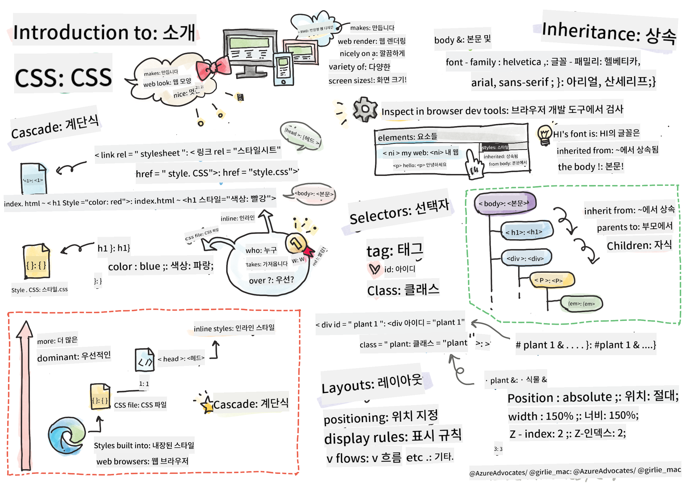
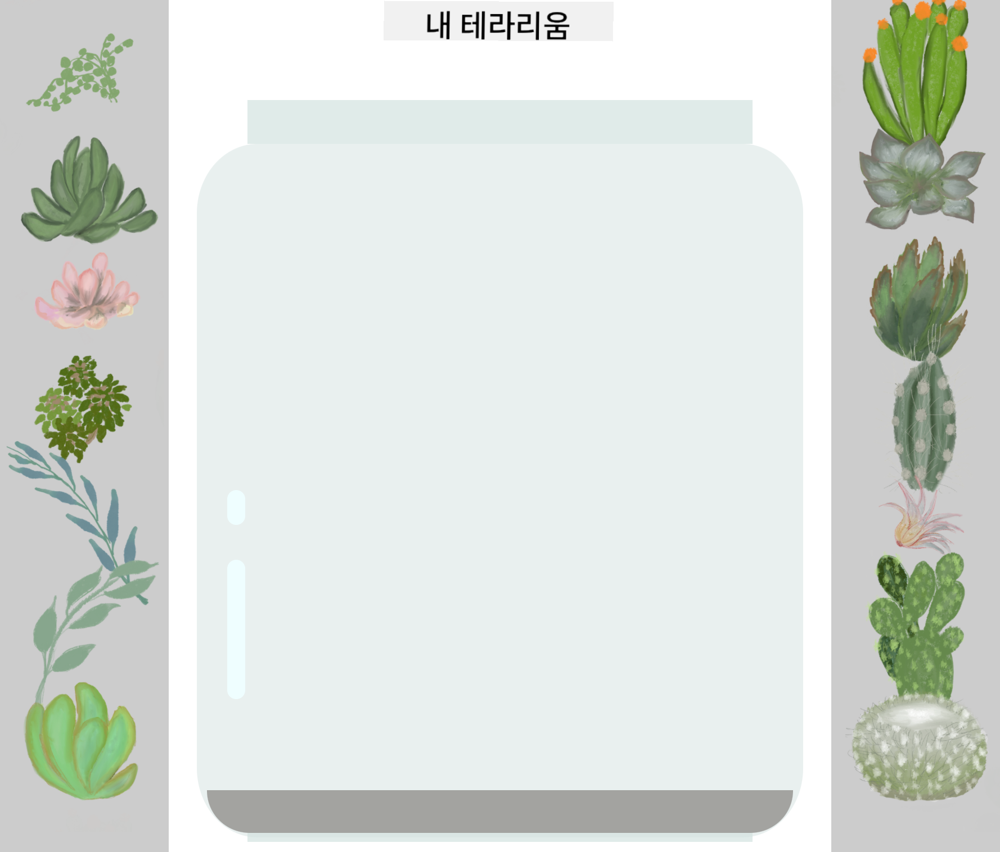

<!--
CO_OP_TRANSLATOR_METADATA:
{
  "original_hash": "acb5ae00cde004304296bb97da8ff4c3",
  "translation_date": "2025-08-29T15:42:34+00:00",
  "source_file": "3-terrarium/2-intro-to-css/README.md",
  "language_code": "ko"
}
-->
# 테라리움 프로젝트 2부: CSS 소개

  
> 스케치노트: [Tomomi Imura](https://twitter.com/girlie_mac)

## 강의 전 퀴즈

[강의 전 퀴즈](https://ff-quizzes.netlify.app/web/quiz/17)

### 소개

CSS(Cascading Style Sheets)는 웹 개발에서 중요한 문제를 해결합니다: 웹사이트를 보기 좋게 만드는 방법입니다. 앱에 스타일을 추가하면 더 사용하기 쉽고 보기 좋게 만들 수 있으며, CSS를 사용해 반응형 웹 디자인(Responsive Web Design, RWD)을 구현할 수도 있습니다. 이를 통해 앱이 어떤 화면 크기에서도 잘 보이게 할 수 있습니다. CSS는 단순히 앱을 보기 좋게 만드는 것뿐만 아니라, 애니메이션과 변형(transform)을 포함한 사양을 통해 앱에 정교한 상호작용을 추가할 수도 있습니다. CSS 워킹 그룹은 최신 CSS 사양을 유지 관리하며, 그들의 작업은 [World Wide Web Consortium의 사이트](https://www.w3.org/Style/CSS/members)에서 확인할 수 있습니다.

> 참고: CSS는 웹의 다른 모든 것처럼 진화하는 언어이며, 모든 브라우저가 최신 사양을 지원하는 것은 아닙니다. 항상 [CanIUse.com](https://caniuse.com)을 참조하여 구현을 확인하세요.

이번 강의에서는 온라인 테라리움에 스타일을 추가하고, CSS의 여러 개념에 대해 배울 것입니다: 계단식(cascade), 상속(inheritance), 선택자(selectors) 사용, 위치 지정(positioning), 그리고 CSS를 사용해 레이아웃을 구성하는 방법입니다. 이 과정을 통해 테라리움을 배치하고 실제 테라리움을 만들어 보겠습니다.

### 사전 요구사항

테라리움의 HTML이 이미 작성되어 있고 스타일을 추가할 준비가 되어 있어야 합니다.

> 동영상 확인하기

> 
> [](https://www.youtube.com/watch?v=6yIdOIV9p1I)

### 과제

테라리움 폴더에 `style.css`라는 새 파일을 생성하세요. 이 파일을 `<head>` 섹션에 가져오세요:

```html
<link rel="stylesheet" href="./style.css" />
```

---

## 계단식(Cascade)

CSS는 스타일이 '계단식'으로 적용된다는 개념을 포함합니다. 스타일의 적용은 우선순위에 따라 결정됩니다. 웹사이트 작성자가 설정한 스타일은 브라우저가 설정한 스타일보다 우선합니다. '인라인'으로 설정된 스타일은 외부 스타일 시트에 설정된 스타일보다 우선합니다.

### 과제

`<h1>` 태그에 "color: red"라는 인라인 스타일을 추가하세요:

```HTML
<h1 style="color: red">My Terrarium</h1>
```

그런 다음, `style.css` 파일에 다음 코드를 추가하세요:

```CSS
h1 {
 color: blue;
}
```

✅ 웹 앱에서 어떤 색상이 표시되나요? 왜 그런지 설명할 수 있나요? 스타일을 재정의하는 방법을 찾을 수 있나요? 언제, 왜 그렇게 해야 할까요?

---

## 상속(Inheritance)

스타일은 조상 요소에서 자손 요소로 상속됩니다. 즉, 중첩된 요소는 부모 요소의 스타일을 상속받습니다.

### 과제

body의 글꼴(font)을 특정 글꼴로 설정하고, 중첩된 요소의 글꼴을 확인하세요:

```CSS
body {
	font-family: helvetica, arial, sans-serif;
}
```

브라우저의 콘솔에서 '요소' 탭을 열고 H1의 글꼴을 관찰하세요. 브라우저에 표시된 대로 body에서 글꼴을 상속받습니다:


✅ 중첩된 스타일이 다른 속성을 상속받도록 만들 수 있나요?

---

## CSS 선택자(Selectors)

### 태그

현재까지 `style.css` 파일에는 몇 가지 태그만 스타일이 적용되어 있으며, 앱이 다소 이상하게 보일 것입니다:

```CSS
body {
	font-family: helvetica, arial, sans-serif;
}

h1 {
	color: #3a241d;
	text-align: center;
}
```

이러한 방식으로 태그를 스타일링하면 고유한 요소를 제어할 수 있지만, 테라리움의 많은 식물 스타일을 제어하려면 CSS 선택자를 활용해야 합니다.

### 아이디(Ids)

왼쪽 및 오른쪽 컨테이너를 배치하는 스타일을 추가하세요. 마크업에서 왼쪽 컨테이너와 오른쪽 컨테이너는 각각 하나씩만 있으므로 아이디가 부여됩니다. 이를 스타일링하려면 `#`을 사용하세요:

```CSS
#left-container {
	background-color: #eee;
	width: 15%;
	left: 0px;
	top: 0px;
	position: absolute;
	height: 100%;
	padding: 10px;
}

#right-container {
	background-color: #eee;
	width: 15%;
	right: 0px;
	top: 0px;
	position: absolute;
	height: 100%;
	padding: 10px;
}
```

여기서 컨테이너를 화면의 왼쪽과 오른쪽 끝에 절대 위치로 배치하고, 폭을 퍼센트로 설정하여 작은 모바일 화면에서도 스케일링되도록 했습니다.

✅ 이 코드는 반복적이므로 "DRY"(Don't Repeat Yourself) 원칙에 어긋납니다. 아이디와 클래스를 함께 사용하여 더 나은 스타일링 방법을 찾을 수 있나요? 마크업을 변경하고 CSS를 리팩터링해야 할 것입니다:

```html
<div id="left-container" class="container"></div>
```

### 클래스(Classes)

위 예제에서는 화면의 두 개의 고유한 요소를 스타일링했습니다. 화면의 여러 요소에 스타일을 적용하려면 CSS 클래스를 사용할 수 있습니다. 왼쪽 및 오른쪽 컨테이너에 있는 식물을 배치하려면 다음을 수행하세요.

HTML 마크업에서 각 식물은 아이디와 클래스의 조합을 가지고 있습니다. 여기서 아이디는 나중에 테라리움 식물 배치를 조작하기 위해 추가할 JavaScript에서 사용됩니다. 반면, 클래스는 모든 식물에 특정 스타일을 제공합니다.

```html
<div class="plant-holder">
	
</div>
```

`style.css` 파일에 다음을 추가하세요:

```CSS
.plant-holder {
	position: relative;
	height: 13%;
	left: -10px;
}

.plant {
	position: absolute;
	max-width: 150%;
	max-height: 150%;
	z-index: 2;
}
```

이 코드에서 주목할 점은 상대적 및 절대적 위치 지정의 혼합입니다. 이는 다음 섹션에서 다룰 것입니다. 높이를 퍼센트로 처리하는 방식을 살펴보세요:

- 식물 홀더의 높이를 13%로 설정했습니다. 이는 모든 식물이 스크롤 없이 각 수직 컨테이너에 표시되도록 보장하는 적절한 값입니다.
- 식물 홀더를 왼쪽으로 이동시켜 식물이 컨테이너 내에서 더 중앙에 배치되도록 했습니다. 이미지는 드래그 가능하도록 투명한 배경이 많으므로 화면에 더 잘 맞도록 왼쪽으로 밀어야 합니다.
- 식물 자체는 최대 폭을 150%로 설정했습니다. 이를 통해 브라우저가 축소될 때 크기가 줄어들 수 있습니다. 브라우저 크기를 조정해 보세요. 식물은 컨테이너 안에 유지되지만 화면에 맞게 크기가 줄어듭니다.

또한 z-index의 사용도 주목할 만합니다. 이는 요소의 상대적 높이를 제어하여 식물이 컨테이너 위에 놓이고 테라리움 안에 있는 것처럼 보이게 합니다.

✅ 왜 식물 홀더와 식물 CSS 선택자가 모두 필요한가요?

## CSS 위치 지정(Positioning)

위치 속성(정적, 상대적, 고정, 절대, 고정적 위치)을 혼합하여 사용하는 것은 다소 까다로울 수 있지만, 제대로 사용하면 페이지의 요소를 잘 제어할 수 있습니다.

절대 위치 요소는 가장 가까운 위치 지정된 조상 요소를 기준으로 배치되며, 조상 요소가 없으면 문서 본문을 기준으로 배치됩니다.

상대 위치 요소는 CSS의 지시에 따라 초기 위치에서 떨어진 위치를 기준으로 배치됩니다.

샘플에서 `plant-holder`는 절대 위치 컨테이너 내에 배치된 상대 위치 요소입니다. 결과적으로 사이드바 컨테이너는 왼쪽과 오른쪽에 고정되고, `plant-holder`는 사이드바 내에서 조정되어 식물이 수직으로 배치될 공간을 제공합니다.

> `plant` 자체도 절대 위치를 가지며, 이는 다음 강의에서 배우게 될 드래그 가능성을 위해 필요합니다.

✅ 사이드 컨테이너와 `plant-holder`의 위치 지정 유형을 전환해 보세요. 어떤 일이 발생하나요?

## CSS 레이아웃

이제 배운 내용을 사용해 CSS만으로 테라리움을 만들어 보겠습니다!

먼저, `.terrarium` div 자식을 CSS로 둥근 직사각형으로 스타일링하세요:

```CSS
.jar-walls {
	height: 80%;
	width: 60%;
	background: #d1e1df;
	border-radius: 1rem;
	position: absolute;
	bottom: 0.5%;
	left: 20%;
	opacity: 0.5;
	z-index: 1;
}

.jar-top {
	width: 50%;
	height: 5%;
	background: #d1e1df;
	position: absolute;
	bottom: 80.5%;
	left: 25%;
	opacity: 0.7;
	z-index: 1;
}

.jar-bottom {
	width: 50%;
	height: 1%;
	background: #d1e1df;
	position: absolute;
	bottom: 0%;
	left: 25%;
	opacity: 0.7;
}

.dirt {
	width: 60%;
	height: 5%;
	background: #3a241d;
	position: absolute;
	border-radius: 0 0 1rem 1rem;
	bottom: 1%;
	left: 20%;
	opacity: 0.7;
	z-index: -1;
}
```

여기서 퍼센트 사용에 주목하세요. 브라우저를 축소하면 병도 함께 축소되는 것을 볼 수 있습니다. 또한 병 요소의 폭과 높이 퍼센트와 각 요소가 뷰포트 하단에 고정된 방식도 확인하세요.

`rem`을 사용해 테두리 반경을 설정했는데, 이는 글꼴 상대 길이입니다. 이와 같은 상대적 측정에 대해 더 알아보려면 [CSS 사양](https://www.w3.org/TR/css-values-3/#font-relative-lengths)을 읽어보세요.

✅ 병 색상과 불투명도를 흙과 비교해 변경해 보세요. 어떤 일이 발생하나요? 왜 그런가요?

---

## 🚀도전 과제

병의 왼쪽 하단 영역에 '거품' 광택을 추가해 병이 유리처럼 보이게 만드세요. `.jar-glossy-long` 및 `.jar-glossy-short`를 스타일링해 반사된 광택처럼 보이게 하세요. 결과는 다음과 같습니다:



강의 후 퀴즈를 완료하려면 이 학습 모듈을 진행하세요: [HTML 앱을 CSS로 스타일링하기](https://docs.microsoft.com/learn/modules/build-simple-website/4-css-basics/?WT.mc_id=academic-77807-sagibbon)

## 강의 후 퀴즈

[강의 후 퀴즈](https://ff-quizzes.netlify.app/web/quiz/18)

## 복습 및 자기 학습

CSS는 겉보기에는 간단해 보이지만, 모든 브라우저와 화면 크기에 완벽하게 스타일을 적용하려면 많은 도전 과제가 있습니다. CSS-Grid와 Flexbox는 작업을 더 구조화하고 신뢰할 수 있게 만드는 도구입니다. [Flexbox Froggy](https://flexboxfroggy.com/)와 [Grid Garden](https://codepip.com/games/grid-garden/)을 플레이하며 이 도구들에 대해 배워보세요.

## 과제

[CSS 리팩터링](assignment.md)

---

**면책 조항**:  
이 문서는 AI 번역 서비스 [Co-op Translator](https://github.com/Azure/co-op-translator)를 사용하여 번역되었습니다. 정확성을 위해 최선을 다하고 있지만, 자동 번역에는 오류나 부정확성이 포함될 수 있습니다. 원본 문서의 원어 버전을 권위 있는 출처로 간주해야 합니다. 중요한 정보의 경우, 전문적인 인간 번역을 권장합니다. 이 번역 사용으로 인해 발생하는 오해나 잘못된 해석에 대해 당사는 책임을 지지 않습니다.