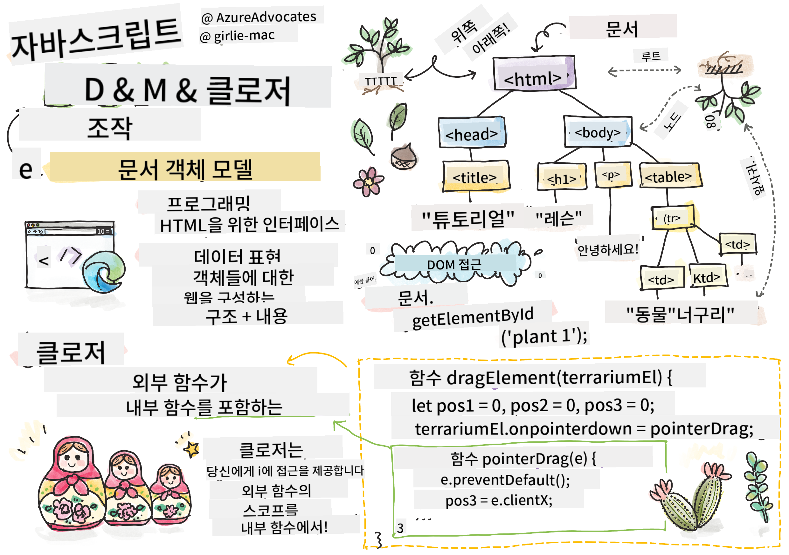

<!--
CO_OP_TRANSLATOR_METADATA:
{
  "original_hash": "61c14b27044861e5e69db35dd52c4403",
  "translation_date": "2025-08-29T15:43:04+00:00",
  "source_file": "3-terrarium/3-intro-to-DOM-and-closures/README.md",
  "language_code": "ko"
}
-->
# 테라리움 프로젝트 Part 3: DOM 조작과 클로저


> 스케치노트: [Tomomi Imura](https://twitter.com/girlie_mac)

## 강의 전 퀴즈

[강의 전 퀴즈](https://ff-quizzes.netlify.app/web/quiz/19)

### 소개

DOM, 즉 "문서 객체 모델(Document Object Model)"을 조작하는 것은 웹 개발의 핵심 요소입니다. [MDN](https://developer.mozilla.org/docs/Web/API/Document_Object_Model/Introduction)에 따르면, "문서 객체 모델(DOM)은 웹 문서의 구조와 내용을 구성하는 객체들의 데이터 표현입니다." DOM 조작의 어려움은 종종 JavaScript 프레임워크를 사용하여 DOM을 관리하게 된 주요 이유 중 하나였지만, 이번에는 순수 JavaScript로 직접 관리해 보겠습니다!

또한, 이번 강의에서는 [JavaScript 클로저](https://developer.mozilla.org/docs/Web/JavaScript/Closures)의 개념을 소개합니다. 클로저는 다른 함수에 의해 감싸진 함수로, 내부 함수가 외부 함수의 스코프에 접근할 수 있도록 합니다.

> JavaScript 클로저는 방대하고 복잡한 주제입니다. 이번 강의에서는 테라리움 코드에서 클로저를 사용하는 가장 기본적인 아이디어를 다룹니다. 클로저는 내부 함수와 외부 함수가 특정 방식으로 구성되어 내부 함수가 외부 함수의 스코프에 접근할 수 있도록 합니다. 이 작동 방식에 대한 더 많은 정보는 [상세 문서](https://developer.mozilla.org/docs/Web/JavaScript/Closures)를 참고하세요.

우리는 클로저를 사용하여 DOM을 조작할 것입니다.

DOM을 웹 페이지 문서를 조작할 수 있는 모든 방법을 나타내는 트리로 생각해 보세요. 다양한 API(Application Program Interfaces)가 작성되어 프로그래머가 선택한 프로그래밍 언어를 사용하여 DOM에 접근하고, 이를 편집, 변경, 재배열 및 관리할 수 있습니다.


> DOM과 이를 참조하는 HTML 마크업의 표현. 출처: [Olfa Nasraoui](https://www.researchgate.net/publication/221417012_Profile-Based_Focused_Crawler_for_Social_Media-Sharing_Websites)

이번 강의에서는 JavaScript를 작성하여 사용자가 페이지에서 식물을 조작할 수 있도록 하는 인터랙티브 테라리움 프로젝트를 완성할 것입니다.

### 사전 준비

테라리움의 HTML과 CSS가 준비되어 있어야 합니다. 이번 강의가 끝날 때쯤, 사용자가 식물을 드래그하여 테라리움 안팎으로 이동할 수 있게 될 것입니다.

### 작업

테라리움 폴더에 `script.js`라는 새 파일을 생성하세요. 이 파일을 `<head>` 섹션에 가져옵니다:

```html
	<script src="./script.js" defer></script>
```

> 참고: 외부 JavaScript 파일을 HTML 파일에 가져올 때 `defer`를 사용하여 HTML 파일이 완전히 로드된 후 JavaScript가 실행되도록 합니다. `async` 속성을 사용할 수도 있지만, 우리의 경우 드래그 스크립트를 실행하기 전에 HTML 요소가 완전히 준비되어야 하므로 `defer`를 사용하는 것이 중요합니다.
---

## DOM 요소

먼저, DOM에서 조작하려는 요소에 대한 참조를 생성해야 합니다. 우리의 경우, 사이드바에 있는 14개의 식물입니다.

### 작업

```html
dragElement(document.getElementById('plant1'));
dragElement(document.getElementById('plant2'));
dragElement(document.getElementById('plant3'));
dragElement(document.getElementById('plant4'));
dragElement(document.getElementById('plant5'));
dragElement(document.getElementById('plant6'));
dragElement(document.getElementById('plant7'));
dragElement(document.getElementById('plant8'));
dragElement(document.getElementById('plant9'));
dragElement(document.getElementById('plant10'));
dragElement(document.getElementById('plant11'));
dragElement(document.getElementById('plant12'));
dragElement(document.getElementById('plant13'));
dragElement(document.getElementById('plant14'));
```

여기서 무슨 일이 일어나고 있을까요? 문서를 참조하여 특정 Id를 가진 요소를 DOM에서 찾고 있습니다. HTML 첫 번째 강의에서 각 식물 이미지에 개별 Id를 부여했던 것을 기억하시나요? 이제 그 작업이 유용하게 쓰입니다. 각 요소를 식별한 후, 이를 곧 작성할 `dragElement`라는 함수에 전달합니다. 이렇게 하면 HTML의 요소가 드래그 가능해지거나 곧 가능해질 것입니다.

✅ 왜 요소를 Id로 참조할까요? CSS 클래스가 아닌 이유는 무엇일까요? 이전 CSS 강의를 참고하여 이 질문에 답해 보세요.

---

## 클로저

이제 `dragElement` 클로저를 생성할 준비가 되었습니다. 클로저는 내부 함수 하나 이상을 포함하는 외부 함수입니다. 

클로저는 하나 이상의 함수가 외부 함수의 스코프에 접근해야 할 때 유용합니다. 예를 들어:

```javascript
function displayCandy(){
	let candy = ['jellybeans'];
	function addCandy(candyType) {
		candy.push(candyType)
	}
	addCandy('gumdrops');
}
displayCandy();
console.log(candy)
```

이 예제에서 `displayCandy` 함수는 이미 존재하는 배열에 새로운 사탕 유형을 추가하는 함수를 감싸고 있습니다. 이 코드를 실행하면 `candy` 배열은 정의되지 않은 상태가 됩니다. 이는 배열이 클로저의 로컬 변수이기 때문입니다.

✅ `candy` 배열을 어떻게 접근 가능하게 만들 수 있을까요? 배열을 클로저 외부로 이동해 보세요. 이렇게 하면 배열이 전역 변수가 되어 클로저의 로컬 스코프에만 제한되지 않습니다.

### 작업

`script.js`의 요소 선언 아래에 다음과 같은 함수를 생성하세요:

```javascript
function dragElement(terrariumElement) {
	//set 4 positions for positioning on the screen
	let pos1 = 0,
		pos2 = 0,
		pos3 = 0,
		pos4 = 0;
	terrariumElement.onpointerdown = pointerDrag;
}
```

`dragElement`는 스크립트 상단에서 선언된 `terrariumElement` 객체를 가져옵니다. 그런 다음, 함수에 전달된 객체에 대해 로컬 위치를 `0`으로 설정합니다. 이러한 로컬 변수는 각 요소에 드래그 앤 드롭 기능을 추가하면서 조작됩니다. 테라리움은 이러한 드래그된 요소들로 채워질 것이므로, 요소들이 배치된 위치를 추적해야 합니다.

또한, 이 함수에 전달된 `terrariumElement`는 `pointerdown` 이벤트를 할당받습니다. 이는 DOM 관리를 돕기 위해 설계된 [웹 API](https://developer.mozilla.org/docs/Web/API)의 일부입니다. `onpointerdown`은 버튼이 눌리거나, 우리의 경우 드래그 가능한 요소가 터치될 때 실행됩니다. 이 이벤트 핸들러는 몇 가지 예외를 제외하고 [웹 및 모바일 브라우저](https://caniuse.com/?search=onpointerdown)에서 작동합니다.

✅ [이벤트 핸들러 `onclick`](https://developer.mozilla.org/docs/Web/API/GlobalEventHandlers/onclick)은 브라우저 간 지원이 훨씬 더 많습니다. 그런데 왜 여기서 사용하지 않을까요? 생성하려는 화면 상호작용의 정확한 유형에 대해 생각해 보세요.

---

## Pointerdrag 함수

`terrariumElement`는 드래그할 준비가 되었습니다. `onpointerdown` 이벤트가 실행되면, `pointerDrag` 함수가 호출됩니다. 이 함수를 다음 줄 바로 아래에 추가하세요: `terrariumElement.onpointerdown = pointerDrag;`:

### 작업 

```javascript
function pointerDrag(e) {
	e.preventDefault();
	console.log(e);
	pos3 = e.clientX;
	pos4 = e.clientY;
}
```

여기서 몇 가지 일이 발생합니다. 먼저, `e.preventDefault();`를 사용하여 `pointerdown` 시 기본적으로 발생하는 이벤트를 방지합니다. 이렇게 하면 인터페이스의 동작을 더 잘 제어할 수 있습니다.

> 스크립트 파일을 완전히 작성한 후 이 줄을 제거하고 실행해 보세요. 어떤 일이 발생하나요?

둘째, 브라우저 창에서 `index.html`을 열고 인터페이스를 검사합니다. 식물을 클릭하면 'e' 이벤트가 캡처되는 것을 볼 수 있습니다. 이벤트를 자세히 살펴보면, 하나의 `pointerdown` 이벤트로 얼마나 많은 정보가 수집되는지 확인할 수 있습니다!

다음으로, 로컬 변수 `pos3`와 `pos4`가 `e.clientX`로 설정되는 것을 확인하세요. 검사 창에서 `e` 값을 찾을 수 있습니다. 이 값들은 클릭하거나 터치한 순간 식물의 x, y 좌표를 캡처합니다. 식물을 클릭하고 드래그할 때의 동작을 세밀하게 제어하려면 이러한 좌표를 추적해야 합니다.

✅ 왜 이 전체 앱이 하나의 큰 클로저로 작성되었는지 점점 더 명확해지고 있나요? 그렇지 않다면, 14개의 드래그 가능한 식물 각각에 대해 스코프를 어떻게 유지할 수 있을까요?

초기 함수를 완료하려면 `pos4 = e.clientY` 아래에 두 개의 포인터 이벤트 조작을 더 추가하세요:

```html
document.onpointermove = elementDrag;
document.onpointerup = stopElementDrag;
```
이제 포인터를 이동할 때 식물이 함께 드래그되도록 하고, 식물을 선택 해제할 때 드래그 제스처가 중지되도록 지정합니다. `onpointermove`와 `onpointerup`은 모두 `onpointerdown`과 동일한 API의 일부입니다. 아직 `elementDrag`와 `stopElementDrag` 함수가 정의되지 않았으므로, 이를 다음에 작성하세요.

## elementDrag와 stopElementDrag 함수

클로저를 완료하려면 식물을 드래그할 때와 드래그를 멈출 때의 동작을 처리하는 두 개의 내부 함수를 추가해야 합니다. 원하는 동작은 언제든지 식물을 드래그하여 화면 어디에나 배치할 수 있는 것입니다. 이 인터페이스는 매우 자유롭게 설계되어(예: 드롭존 없음) 식물을 추가, 제거 및 재배치하여 원하는 대로 테라리움을 디자인할 수 있습니다.

### 작업

`pointerDrag`의 닫는 중괄호 바로 아래에 `elementDrag` 함수를 추가하세요:

```javascript
function elementDrag(e) {
	pos1 = pos3 - e.clientX;
	pos2 = pos4 - e.clientY;
	pos3 = e.clientX;
	pos4 = e.clientY;
	console.log(pos1, pos2, pos3, pos4);
	terrariumElement.style.top = terrariumElement.offsetTop - pos2 + 'px';
	terrariumElement.style.left = terrariumElement.offsetLeft - pos1 + 'px';
}
```
이 함수에서는 초기 위치 1-4를 조정하는 많은 작업이 이루어집니다. 여기서 무슨 일이 일어나고 있을까요?

드래그하는 동안, `pos1`을 `pos3`(이전 단계에서 `e.clientX`로 설정)에서 현재 `e.clientX` 값을 뺀 값으로 재할당합니다. `pos2`도 유사한 작업을 수행합니다. 그런 다음, `pos3`와 `pos4`를 요소의 새로운 x, y 좌표로 재설정합니다. 드래그하면서 콘솔에서 이러한 변경 사항을 확인할 수 있습니다. 그런 다음, 식물의 CSS 스타일을 조작하여 새로운 위치를 기반으로 식물의 상단과 왼쪽 x, y 좌표를 설정합니다.

> `offsetTop`과 `offsetLeft`는 부모 요소를 기준으로 요소의 위치를 설정하는 CSS 속성입니다. 부모 요소는 `static`으로 설정되지 않은 모든 요소가 될 수 있습니다.

위치 재계산을 통해 테라리움과 식물의 동작을 세밀하게 조정할 수 있습니다.

### 작업 

인터페이스를 완성하기 위한 마지막 작업은 `elementDrag`의 닫는 중괄호 뒤에 `stopElementDrag` 함수를 추가하는 것입니다:

```javascript
function stopElementDrag() {
	document.onpointerup = null;
	document.onpointermove = null;
}
```

이 작은 함수는 `onpointerup`과 `onpointermove` 이벤트를 재설정하여 식물의 진행을 다시 시작하거나 새 식물을 드래그할 수 있도록 합니다.

✅ 이 이벤트를 null로 설정하지 않으면 어떻게 될까요?

이제 프로젝트가 완료되었습니다!

🥇축하합니다! 아름다운 테라리움을 완성했습니다. 

---

## 🚀도전 과제

클로저에 새로운 이벤트 핸들러를 추가하여 식물에 더 많은 동작을 추가해 보세요. 예를 들어, 식물을 더블 클릭하여 맨 앞으로 가져오는 기능을 추가할 수 있습니다. 창의력을 발휘해 보세요!

## 강의 후 퀴즈

[강의 후 퀴즈](https://ff-quizzes.netlify.app/web/quiz/20)

## 복습 및 자기 학습

화면에서 요소를 드래그하는 것은 사소해 보일 수 있지만, 이를 구현하는 방법은 다양하며 원하는 효과에 따라 많은 함정이 있을 수 있습니다. 사실, [드래그 앤 드롭 API](https://developer.mozilla.org/docs/Web/API/HTML_Drag_and_Drop_API)라는 전체 API가 있습니다. 이번 모듈에서는 우리가 원하는 효과가 약간 달랐기 때문에 사용하지 않았지만, 이 API를 사용하여 자신의 프로젝트에서 무엇을 할 수 있는지 확인해 보세요.

포인터 이벤트에 대한 더 많은 정보는 [W3C 문서](https://www.w3.org/TR/pointerevents1/)와 [MDN 웹 문서](https://developer.mozilla.org/docs/Web/API/Pointer_events)에서 확인하세요.

항상 [CanIUse.com](https://caniuse.com/)을 사용하여 브라우저 호환성을 확인하세요.

## 과제

[DOM과 더 작업해 보기](assignment.md)

---

**면책 조항**:  
이 문서는 AI 번역 서비스 [Co-op Translator](https://github.com/Azure/co-op-translator)를 사용하여 번역되었습니다. 정확성을 위해 최선을 다하고 있으나, 자동 번역에는 오류나 부정확성이 포함될 수 있습니다. 원본 문서의 원어 버전을 권위 있는 출처로 간주해야 합니다. 중요한 정보의 경우, 전문적인 인간 번역을 권장합니다. 이 번역 사용으로 인해 발생하는 오해나 잘못된 해석에 대해 당사는 책임을 지지 않습니다.