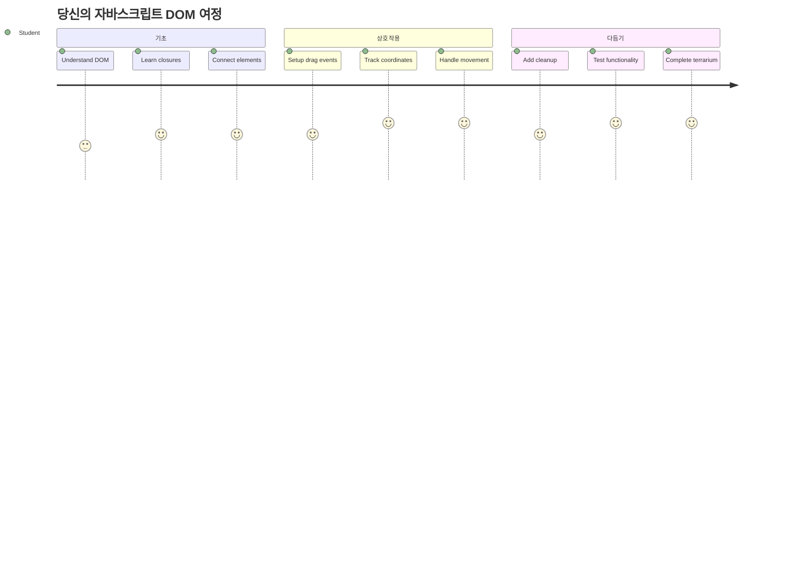
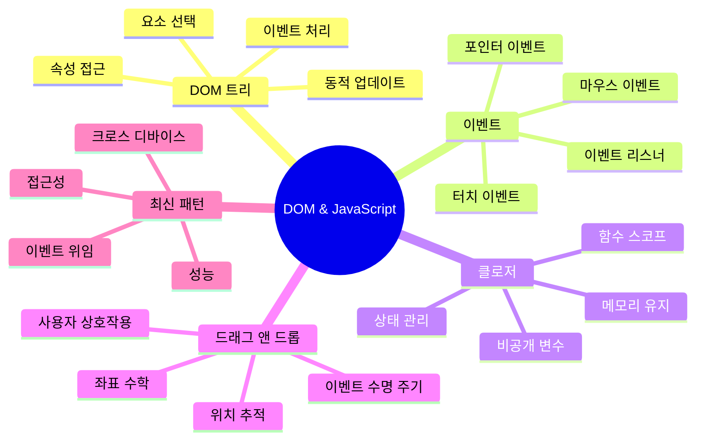
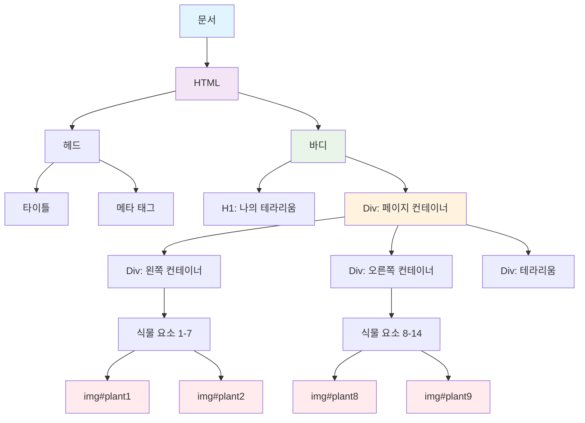
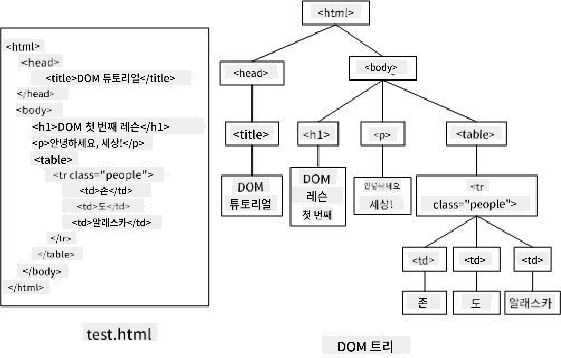
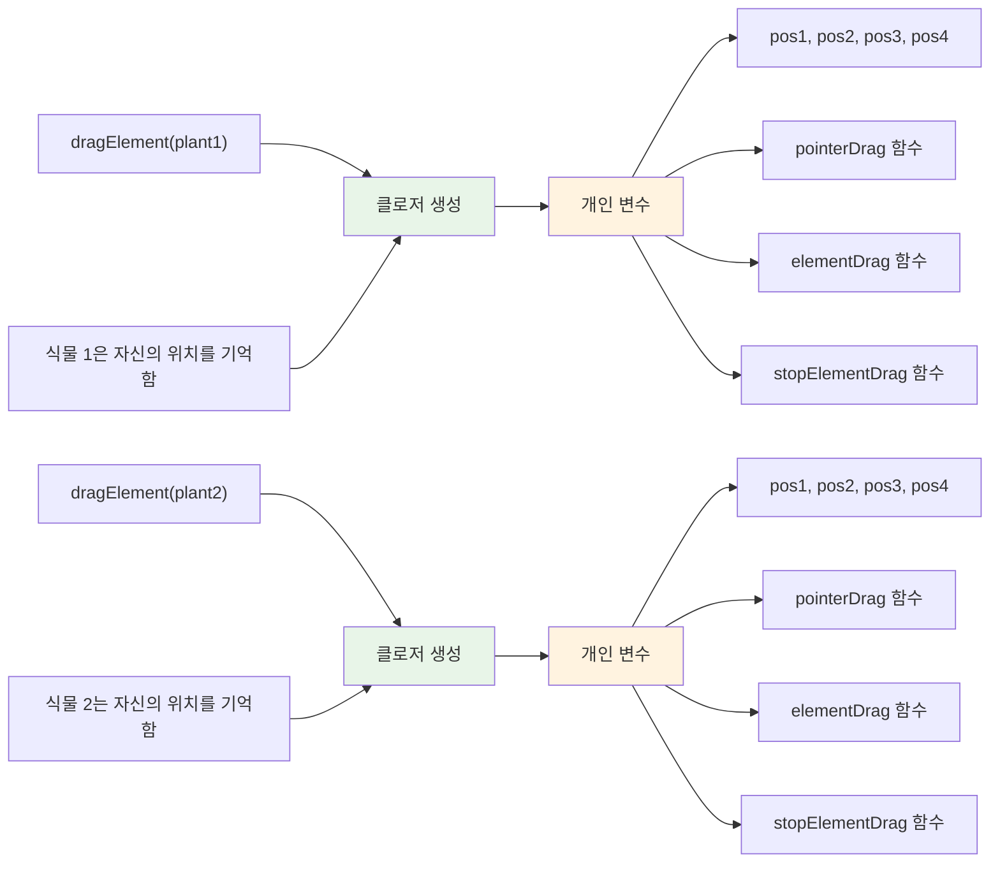
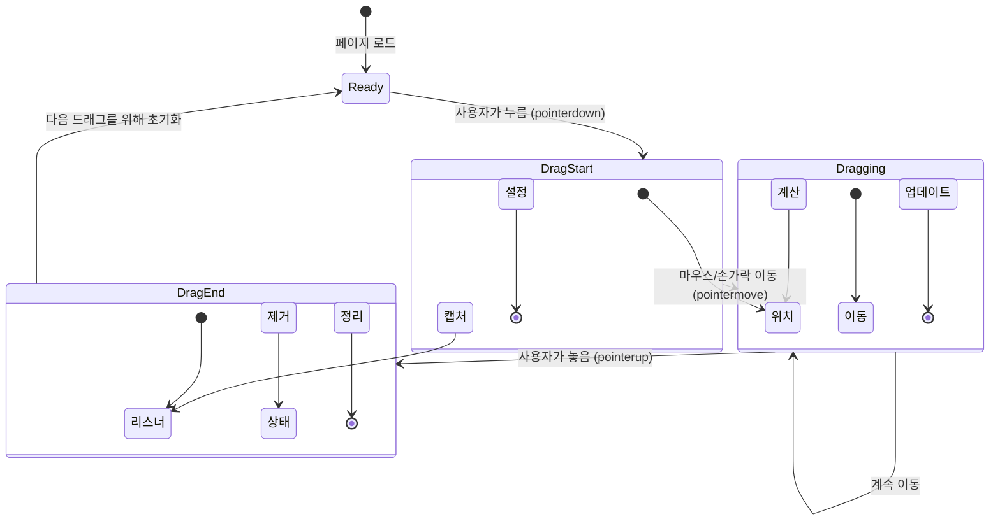
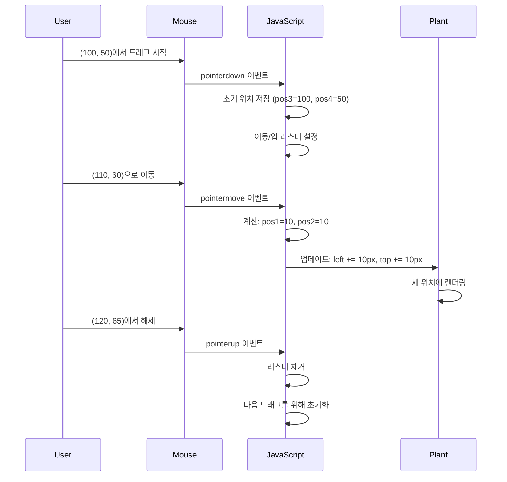
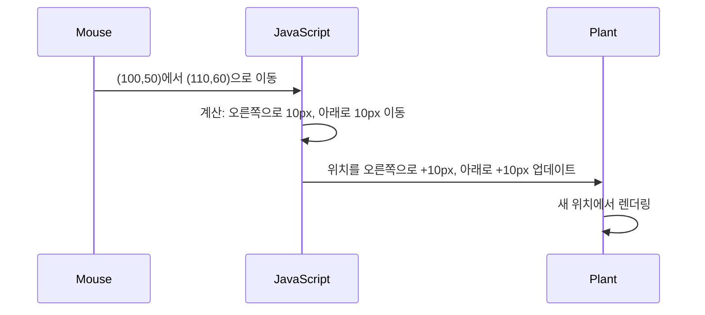
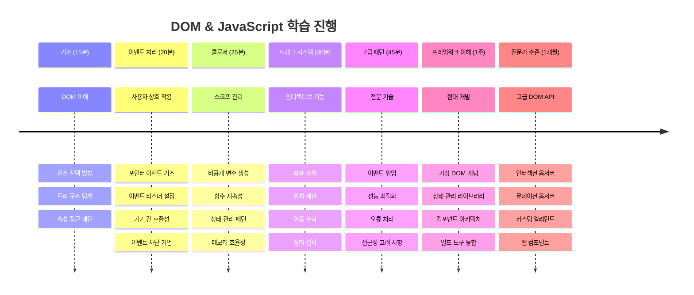

<!--
CO_OP_TRANSLATOR_METADATA:
{
  "original_hash": "973e48ad87d67bf5bb819746c9f8e302",
  "translation_date": "2026-01-06T15:36:06+00:00",
  "source_file": "3-terrarium/3-intro-to-DOM-and-closures/README.md",
  "language_code": "ko"
}
-->
# Terrarium 프로젝트 파트 3: DOM 조작과 JavaScript 클로저



> 스케치노트 작성자 [Tomomi Imura](https://twitter.com/girlie_mac)

웹 개발에서 가장 흥미로운 부분 중 하나에 오신 것을 환영합니다 - 바로 인터랙션 구현입니다! 문서 객체 모델(DOM)은 HTML과 JavaScript 사이의 다리와 같으며, 오늘은 이를 이용해 테라리움을 생동감 있게 만들어 보겠습니다. 팀 버너스리(Tim Berners-Lee)가 최초의 웹 브라우저를 만들었을 때, 문서가 동적이고 상호작용 가능할 수 있는 웹을 꿈꿨습니다 - DOM이 그 비전을 실현하게 합니다.

또한 자바스크립트 클로저도 탐구할 텐데, 처음에는 어려워 보일 수 있습니다. 클로저는 함수가 중요한 정보를 기억할 수 있는 "기억 주머니"를 만드는 것과 같습니다. 테라리움 내 각 식물이 자신의 위치를 추적할 수 있는 개별 데이터 기록을 가지는 것과 비슷하죠. 이번 수업이 끝나면 클로저가 얼마나 자연스럽고 유용한지 이해하게 될 것입니다.

우리가 만들 프로젝트는 다음과 같습니다: 사용자가 식물을 원하는 곳에 드래그 앤 드롭할 수 있는 테라리움. 드래그 앤 드롭 파일 업로드부터 인터랙티브 게임까지 모든 기능에 동력을 제공하는 DOM 조작 기법을 배우게 됩니다. 테라리움에 생명을 불어넣어 봅시다.


## 강의 전 퀴즈

[강의 전 퀴즈](https://ff-quizzes.netlify.app/web/quiz/19)

## DOM 이해하기: 인터랙티브 웹 페이지로 가는 관문

문서 객체 모델(DOM)은 JavaScript가 HTML 요소와 소통하는 방법입니다. 브라우저가 HTML 페이지를 불러올 때, 그 페이지의 구조화된 표현을 메모리에 만드는데 바로 이것이 DOM입니다. DOM은 각 HTML 요소가 JavaScript가 접근하고 수정하며 재배열할 수 있는 가족 구성원인 가족 나무와 같습니다.

DOM 조작은 정적인 페이지를 인터랙티브한 웹사이트로 바꿉니다. 마우스 오버 시 버튼 색깔이 바뀌거나 페이지 새로고침 없이 콘텐츠가 업데이트되거나, 요소를 드래그할 수 있을 때마다 그것이 DOM 조작의 결과입니다.




> DOM과 이를 참조하는 HTML 마크업의 표현. 출처: [Olfa Nasraoui](https://www.researchgate.net/publication/221417012_Profile-Based_Focused_Crawler_for_Social_Media-Sharing_Websites)

**DOM이 강력한 이유는 다음과 같습니다:**
- **페이지 내 모든 요소에 접근할 수 있는** 구조화된 방식을 제공합니다
- **페이지 새로고침 없이 동적 콘텐츠 업데이트가 가능하게 합니다**
- **클릭 및 드래그와 같은 사용자 상호작용에 실시간으로 반응할 수 있게 합니다**
- **현대적 인터랙티브 웹 애플리케이션의 기반을 만듭니다**

## JavaScript 클로저: 조직적이고 강력한 코드를 만드는 법

[JavaScript 클로저](https://developer.mozilla.org/docs/Web/JavaScript/Closures)는 함수에 자체적인 개인 작업 공간과 지속적인 메모리를 부여하는 것과 같습니다. 갈라파고스 제도의 다윈 핀치새가 환경에 맞춰 특화된 부리를 각각 발달시킨 것처럼, 클로저도 부모 함수 실행 후에도 각각의 고유한 컨텍스트를 기억하는 특화된 함수를 만듭니다.

우리 테라리움에서는 클로저가 각 식물이 자신의 위치를 독립적으로 기억하도록 돕습니다. 이 패턴은 전문 JavaScript 개발 전반에 등장하며 꼭 이해해야 하는 중요한 개념입니다.


> 💡 **클로저 이해하기**: 클로저는 JavaScript에서 중요한 주제로, 많은 개발자들이 제대로 이해하기까지 오랜 시간이 걸립니다. 오늘은 실용적 적용에 집중할 것입니다 - 인터랙티브 기능을 구현하면서 클로저가 자연스럽게 등장하는 모습을 보게 될 것입니다. 문제를 해결하는 방식을 통해 이해가 깊어질 것입니다.


> DOM과 이를 참조하는 HTML 마크업의 표현. 출처: [Olfa Nasraoui](https://www.researchgate.net/publication/221417012_Profile-Based_Focused_Crawler_for_Social_Media-Sharing_Websites)

이번 수업에서는 페이지 내 식물을 조작할 수 있게 하는 JavaScript를 만들어서 인터랙티브 테라리움 프로젝트를 완성합니다.

## 시작하기 전: 성공을 위한 준비

이전 테라리움 강의에서 만든 HTML과 CSS 파일이 필요합니다 - 이제 정적 디자인을 인터랙티브하게 만들 차례입니다. 처음 참여하신 분들은 이전 강의를 먼저 완료하면 중요한 배경지식을 얻을 수 있습니다.

우리가 만들 내용:
- **모든 테라리움 식물에 부드러운 드래그 앤 드롭 기능**
- **식물이 자신의 위치를 기억하도록 좌표 추적 기능**
- **바닐라 JavaScript로 완전한 인터랙티브 인터페이스 구현**
- **클로저 패턴을 이용한 깔끔하고 체계적인 코드 작성**

## JavaScript 파일 설정하기

이제 테라리움을 인터랙티브하게 만들 JavaScript 파일을 만듭시다.

**1단계: 스크립트 파일 생성**

테라리움 폴더에서 `script.js`라는 새 파일을 만드세요.

**2단계: JavaScript를 HTML에 연결하기**

`index.html`의 `<head>` 섹션에 다음 스크립트 태그를 추가하세요:

```html
<script src="./script.js" defer></script>
```

**`defer` 속성이 중요한 이유:**
- **모든 HTML이 로드될 때까지 JavaScript 실행을 지연시킵니다**
- **JavaScript가 아직 준비되지 않은 요소를 참조하는 오류 방지**
- **모든 식물 요소가 상호작용 가능하도록 보장합니다**
- **스크립트를 페이지 하단에 두는 것보다 성능이 더 좋습니다**

> ⚠️ **중요한 주의사항**: `defer` 속성은 일반적인 타이밍 문제를 예방합니다. 없으면 JavaScript가 HTML 요소를 불러오기 전에 접근을 시도해 오류가 발생할 수 있습니다.

---

## JavaScript와 HTML 요소 연결하기

요소들을 드래그 가능하게 만들려면 JavaScript가 DOM에서 그것들을 찾아야 합니다. 이는 도서관 분류 시스템과 비슷합니다 - 색인 번호를 알면 원하는 책을 정확히 찾아 내용을 볼 수 있듯이 말이죠.

`document.getElementById()` 메서드를 사용해 이런 연결을 할 것입니다. 정확한 파일링 시스템처럼, ID를 제공하면 HTML에서 정확한 요소를 찾습니다.

### 모든 식물에 드래그 기능 활성화하기

`script.js` 파일에 아래 코드를 추가하세요:

```javascript
// 모든 14개 식물에 드래그 기능 활성화
dragElement(document.getElementById('plant1'));
dragElement(document.getElementById('plant2'));
dragElement(document.getElementById('plant3'));
dragElement(document.getElementById('plant4'));
dragElement(document.getElementById('plant5'));
dragElement(document.getElementById('plant6'));
dragElement(document.getElementById('plant7'));
dragElement(document.getElementById('plant8'));
dragElement(document.getElementById('plant9'));
dragElement(document.getElementById('plant10'));
dragElement(document.getElementById('plant11'));
dragElement(document.getElementById('plant12'));
dragElement(document.getElementById('plant13'));
dragElement(document.getElementById('plant14'));
```

**이 코드가 하는 일:**
- **각 식물 요소를 고유 ID로 DOM에서 찾음**
- **각 HTML 요소에 대한 JavaScript 참조를 가져옴**
- **각 요소를 `dragElement` 함수에 전달 (다음에 만들 것)**
- **모든 식물을 드래그 앤 드롭 상호작용을 위해 준비함**
- **HTML 구조와 JavaScript 기능을 연결함**

> 🎯 **왜 클래스 대신 ID를 사용할까?** ID는 특정 요소에 고유 식별자를 제공하며, CSS 클래스는 그룹 스타일링 용도입니다. JavaScript가 개별 요소를 조작해야 할 때는 정확성과 성능을 위해 ID가 더 적합합니다.

> 💡 **꿀팁**: 각 식물에 대해 `dragElement()`를 개별 호출하는 이유는 각각 독립적인 드래그 동작을 부여해 부드러운 사용자 체험을 보장하기 때문입니다.

### 🔄 **학습 점검**
**DOM 연결 이해하기**: 드래그 기능으로 넘어가기 전에, 다음을 확인하세요:
- ✅ `document.getElementById()`로 HTML 요소가 어떻게 위치하는지 설명할 수 있다
- ✅ 각 식물에 고유 ID를 사용하는 이유를 이해한다
- ✅ 스크립트 태그에 `defer` 속성이 왜 필요한지 설명할 수 있다
- ✅ JavaScript와 HTML이 DOM을 통해 어떻게 연결되는지 인식한다

**빠른 자기 점검**: 두 요소가 같은 ID를 가진다면 어떻게 될까? 왜 `getElementById()`는 하나의 요소만 반환할까?
*답변: ID는 고유해야 하며, 중복되면 첫 번째 요소만 반환된다*

---

## 드래그 요소 클로저 만들기

이제 드래그 기능의 핵심인 클로저를 만들어 봅시다. 이 클로저는 마우스 움직임을 추적하고 요소 위치를 업데이트하는 내부 함수들을 포함합니다.

클로저는 함수 호출 간에 지속하는 "비공개" 변수를 만들어 각 식물에 독립적 좌표 추적 시스템을 제공하므로 완벽한 선택입니다.

### 간단한 예제로 클로저 이해하기

클로저 개념을 보여주는 간단한 예제를 들어 설명하겠습니다:

```javascript
function createCounter() {
    let count = 0; // 이것은 마치 private 변수와 같습니다
    
    function increment() {
        count++; // 내부 함수는 외부 변수를 기억합니다
        return count;
    }
    
    return increment; // 우리는 내부 함수를 반환하고 있습니다
}

const myCounter = createCounter();
console.log(myCounter()); // 1
console.log(myCounter()); // 2
```

**이 클로저 패턴에서 일어나는 일:**
- **이 클로저 내에만 존재하는 비공개 `count` 변수를 생성**
- **내부 함수가 외부 변수를 접근 및 수정할 수 있음 (클로저 메커니즘)**
- **내부 함수를 반환할 때 비공개 데이터에 대한 연결 유지**
- **`createCounter()` 실행 후에도 `count`가 지속되어 값을 기억**

### 왜 드래그 기능에 클로저가 완벽한가?

테라리움에서는 각 식물이 자신의 현재 위치 좌표를 기억해야 합니다. 클로저가 완벽한 솔루션을 제공합니다:

**프로젝트에 주는 주요 이점:**
- **각 식물에 대해 비공개 위치 변수를 독립적으로 유지**
- **드래그 이벤트 사이에 좌표 데이터를 보존**
- **여러 드래그 가능한 요소 간 변수 충돌 방지**
- **깔끔하고 조직화된 코드 구조 생성**

> 🎯 **학습 목표**: 클로저 모든 내용에 대해 지금 완벽할 필요는 없습니다. 우선 클로저가 코드 조직과 상태 유지를 어떻게 돕는지 보는 데 집중하세요.


### dragElement 함수 만들기

이제 드래그 로직 전체를 관리할 주요 함수를 작성해 봅시다. 식물 요소 선언 아래에 이 함수를 추가하세요:

```javascript
function dragElement(terrariumElement) {
    // 위치 추적 변수 초기화
    let pos1 = 0,  // 이전 마우스 X 위치
        pos2 = 0,  // 이전 마우스 Y 위치
        pos3 = 0,  // 현재 마우스 X 위치
        pos4 = 0;  // 현재 마우스 Y 위치
    
    // 초기 드래그 이벤트 리스너 설정
    terrariumElement.onpointerdown = pointerDrag;
}
```

**위치 추적 시스템 이해하기:**
- **`pos1`, `pos2`**: 이전과 새 마우스 위치 차이 저장
- **`pos3`, `pos4`**: 현재 마우스 좌표 추적
- **`terrariumElement`**: 드래그할 특정 식물 요소
- **`onpointerdown`**: 사용자가 드래그를 시작할 때 트리거 되는 이벤트

**클로저 패턴 작동 방식:**
- **각 식물 요소마다 비공개 위치 변수를 생성**
- **드래그 수명 주기 내내 이 변수 유지**
- **각 식물이 독립적으로 자신의 좌표 추적**
- **`dragElement` 함수로 깔끔한 인터페이스 제공**

### 왜 포인터 이벤트를 사용할까?

`onclick` 대신 `onpointerdown`을 쓰는 이유가 궁금할 수 있습니다. 이유는 다음과 같습니다:

| 이벤트 타입       | 최적 용도               | 단점                          |
|------------------|------------------------|-----------------------------|
| `onclick`         | 단순 버튼 클릭         | 드래그 불가 (클릭만 감지)    |
| `onpointerdown`   | 마우스 및 터치 모두 지원 | 최신이지만 요즘은 널리 지원됨 |
| `onmousedown`     | 데스크탑 마우스 전용    | 모바일 사용자는 제외됨        |

**우리가 만드는 기능에 포인터 이벤트가 완벽한 이유:**
- **마우스, 손가락, 스타일러스 등 어떤 입력장치도 잘 작동**
- **노트북, 태블릿, 휴대폰 어디서나 동일한 체감**
- **단순 클릭이 아닌 실제 드래그 동작 처리**
- **현대 웹 앱에서 기대하는 부드러운 사용자 경험 제공**

> 💡 **미래 대비**: 포인터 이벤트가 최신 사용자 인터랙션 처리 방식입니다. 마우스와 터치를 따로 코딩하지 않고 모두 한꺼번에 지원하니 매우 효율적입니다.

### 🔄 **학습 점검**
**이벤트 처리 이해**: 잠시 멈추고 개념 정리:
- ✅ 왜 마우스 이벤트 대신 포인터 이벤트를 쓸까?
- ✅ 클로저 변수는 함수 호출 간 어떻게 지속될까?
- ✅ 부드러운 드래그를 위해 `preventDefault()`는 어떤 역할일까?
- ✅ 왜 각 요소보다 문서에 이벤트 리스너를 붙일까?

**실생활 연결**: 여러분이 일상에서 자주 쓰는 드래그 앤 드롭 인터페이스 생각하기:
- **파일 업로드**: 파일을 브라우저에 끌어다 놓기
- **칸반 보드**: 작업을 열 사이 이동하기
- **사진 갤러리**: 사진 순서 재배열하기
- **모바일 인터페이스**: 터치 스크린에서 스와이프 및 드래그 하기

---

## pointerDrag 함수: 드래그 시작점 포착

사용자가 식물을 누를 때 (마우스 클릭이나 터치), `pointerDrag` 함수가 작동합니다. 이 함수는 초기 좌표를 기록하고 드래그 시스템을 설정합니다.

`dragElement` 클로저 내 `terrariumElement.onpointerdown = pointerDrag;` 바로 아래에 이 함수를 추가하세요:

```javascript
function pointerDrag(e) {
    // 기본 브라우저 동작(예: 텍스트 선택) 방지
    e.preventDefault();
    
    // 초기 마우스/터치 위치 캡처
    pos3 = e.clientX;  // 드래그 시작 시 X 좌표
    pos4 = e.clientY;  // 드래그 시작 시 Y 좌표
    
    // 드래그 과정에 대한 이벤트 리스너 설정
    document.onpointermove = elementDrag;
    document.onpointerup = stopElementDrag;
}
```

**단계별로 일어나는 일:**
- **드래그 방해할 수 있는 기본 브라우저 동작들을 막음**
- **사용자가 드래그를 시작한 정확한 좌표 기록**
- **드래그 중 움직임 감지를 위한 이벤트 리스너 설정**
- **문서 전체에서 마우스/손가락 움직임 추적 준비**

### 이벤트 기본 동작 방지 이해하기

`e.preventDefault()`는 부드러운 드래그를 위해 필수적입니다:

**방지하지 않으면 브라우저는:**
- **페이지를 드래그할 때 텍스트를 선택할 수 있음**
- **오른쪽 클릭 드래그 시 컨텍스트 메뉴가 뜰 수 있음**
- **우리가 만든 드래그 동작과 충돌 발생**
- **드래그 도중 비주얼 오류가 나타날 수 있음**

> 🔍 **실험하기**: 이 수업을 마친 후 `e.preventDefault()`를 제거해 드래그에 어떤 영향이 있는지 직접 체험해 보세요. 왜 이 줄이 필요한지 바로 이해할 수 있을 것입니다!

### 좌표 추적 시스템

`e.clientX`와 `e.clientY` 속성은 정확한 마우스/터치 좌표를 제공합니다:

| 속성        | 측정하는 것                      | 사용 사례                  |
|-------------|---------------------------------|---------------------------|
| `clientX`   | 뷰포트 기준 좌우 위치            | 좌우 움직임 추적           |
| `clientY`   | 뷰포트 기준 상하 위치            | 상하 움직임 추적           |
**이 좌표를 이해하기:**
- **픽셀 단위로 완벽한** 위치 정보 제공
- **사용자가 포인터를 이동할 때 실시간으로** 업데이트됨
- **다양한 화면 크기와 줌 레벨에 걸쳐** 일관된 상태 유지
- **부드럽고 반응성이 뛰어난** 드래그 상호작용 가능

### 문서 수준 이벤트 리스너 설정하기

움직임 및 중지 이벤트를 식물 요소뿐만 아니라 전체 `document`에 연결하는 것에 주목하세요:

```javascript
document.onpointermove = elementDrag;
document.onpointerup = stopElementDrag;
```

**왜 document에 연결하는가:**
- 마우스가 식물 요소를 벗어나도 **추적이 계속됨**
- 사용자가 빠르게 움직여도 **드래그가 중단되지 않음**
- 전체 화면에서 **부드러운 드래그 제공**
- 커서가 브라우저 창 밖으로 나가는 **예외 상황도 처리**

> ⚡ **성능 참고:** 드래그가 멈추면 메모리 누수 및 성능 문제를 방지하기 위해 이 문서 수준 리스너들을 정리할 것입니다.

## 드래그 시스템 완성하기: 움직임과 정리

이제 실제 드래그 움직임을 처리하고 드래그가 멈출 때 정리하는 두 가지 남은 함수를 추가합니다. 이 함수들은 함께 작동하여 테라리움 내 식물의 부드럽고 반응성 좋은 움직임을 구현합니다.

### elementDrag 함수: 움직임 추적하기

`pointerDrag` 닫는 중괄호 바로 다음에 `elementDrag` 함수를 추가하세요:

```javascript
function elementDrag(e) {
    // 마지막 이벤트 이후 이동한 거리 계산
    pos1 = pos3 - e.clientX;  // 수평 이동 거리
    pos2 = pos4 - e.clientY;  // 수직 이동 거리
    
    // 현재 위치 추적 업데이트
    pos3 = e.clientX;  // 새로운 현재 X 위치
    pos4 = e.clientY;  // 새로운 현재 Y 위치
    
    // 요소 위치에 이동 적용
    terrariumElement.style.top = (terrariumElement.offsetTop - pos2) + 'px';
    terrariumElement.style.left = (terrariumElement.offsetLeft - pos1) + 'px';
}
```

**좌표 수학 이해하기:**
- **`pos1`과 `pos2`**: 마지막 업데이트 이후 마우스가 얼마나 움직였는지 계산
- **`pos3`과 `pos4`**: 다음 계산을 위해 현재 마우스 위치 저장
- **`offsetTop`과 `offsetLeft`**: 페이지 상의 요소 현재 위치 가져오기
- **빼기 연산**: 마우스가 움직인 만큼 요소를 이동


**움직임 계산 세부 내역:**
1. 이전과 새로운 마우스 위치 간의 차이 측정
2. 마우스 움직임에 따라 요소가 얼마나 움직여야 하는지 계산
3. 요소의 CSS 위치 속성들을 실시간으로 업데이트
4. 다음 움직임 계산을 위한 기준점으로 새 위치 저장

### 수학적 시각화


### stopElementDrag 함수: 정리 작업

`elementDrag` 닫는 중괄호 바로 다음에 정리 함수를 추가하세요:

```javascript
function stopElementDrag() {
    // 문서 수준 이벤트 리스너를 제거합니다
    document.onpointerup = null;
    document.onpointermove = null;
}
```

**정리가 꼭 필요한 이유:**
- 남아 있는 이벤트 리스너로 인한 메모리 누수 방지
- 사용자가 식물에서 손을 떼면 드래그 동작 중지
- 다른 요소들이 독립적으로 드래그될 수 있게 허용
- 다음 드래그 작업을 위해 시스템 초기화

**정리하지 않으면 발생하는 문제:**
- 드래그가 멈춘 후에도 이벤트 리스너가 계속 작동
- 사용하지 않는 리스너가 쌓여 성능 저하
- 다른 요소와 상호작용할 때 예기치 않은 동작 발생
- 브라우저 리소스를 불필요하게 낭비

### CSS 위치 속성 이해하기

우리의 드래그 시스템은 두 가지 주요 CSS 속성을 조작합니다:

| 속성 | 제어하는 것 | 사용하는 방식 |
|----------|------------------|---------------|
| `top` | 위쪽 가장자리에서의 거리 | 드래그 중 수직 위치 조정 |
| `left` | 왼쪽 가장자리에서의 거리 | 드래그 중 수평 위치 조정 |

**offset 속성 핵심 인사이트:**
- **`offsetTop`**: 위치 지정된 부모 요소에서 위쪽 거리
- **`offsetLeft`**: 위치 지정된 부모 요소에서 왼쪽 거리
- **위치 지정 컨텍스트**: 이 값들은 가장 가까운 위치 지정 조상 요소 기준
- **실시간 업데이트**: CSS 속성을 변경하면 즉시 값 변경

> 🎯 **디자인 철학:** 이 드래그 시스템은 의도적으로 유연합니다 – "드롭 영역"이나 제한이 없으며, 사용자는 식물을 원하는 곳 어디에나 배치할 수 있어 테라리움 디자인에 완벽한 창의적 자유를 제공합니다.

## 모든 것을 아우르기: 완성된 드래그 시스템

축하합니다! 당신은 순수 자바스크립트를 사용해 정교한 드래그 앤 드롭 시스템을 만들었습니다. 완성된 `dragElement` 함수는 강력한 클로저를 포함하며 다음을 관리합니다:

**클로저가 수행하는 일:**
- 각 식물마다 독립적으로 개인 위치 변수를 **유지**
- 시작부터 끝까지 전체 드래그 수명 주기를 **처리**
- 전체 화면에서 부드럽고 반응성 뛰어난 움직임을 **제공**
- 메모리 누수를 방지하도록 자원을 **적절히 정리**
- 테라리움 디자인을 위한 직관적이고 창의적인 인터페이스를 **창출**

### 상호작용 테라리움 테스트

이제 상호작용 테라리움을 테스트하세요! 웹 브라우저에서 `index.html` 파일을 열고 기능을 시도해보세요:

1. 원하는 식물을 **클릭 후 누르고** 드래그 시작
2. 마우스나 손가락을 **움직이며 식물이 부드럽게 따라오는지 확인**
3. **놓아서** 식물을 새로운 위치에 배치
4. 다양한 배치를 시도하며 인터페이스 탐색

🥇 **성취:** 당신은 프로 개발자가 사용하는 핵심 개념으로 완전한 인터랙티브 웹 애플리케이션을 만들었습니다. 이 드래그 앤 드롭 기능은 파일 업로드, 칸반 보드, 그리고 많은 다른 인터랙티브 인터페이스의 원리와 동일합니다.

### 🔄 **학습 점검**
**전체 시스템 이해도 확인:** 완전한 드래그 시스템에 대한 이해도를 점검해보세요:
- ✅ 클로저가 각 식물의 독립 상태를 어떻게 유지하는가?
- ✅ 부드러운 움직임을 위해 좌표 계산 수학이 왜 필요한가?
- ✅ 이벤트 리스너 정리를 잊으면 어떤 일이 발생하는가?
- ✅ 이 패턴이 더 복잡한 상호작용에 어떻게 확장되는가?

**코드 품질 성찰:** 완성된 솔루션을 돌아보세요:
- **모듈형 설계:** 각 식물마다 별도의 클로저 인스턴스 생성
- **이벤트 효율성:** 리스너의 적절한 설정과 정리
- **기기별 호환:** 데스크톱과 모바일 모두 지원
- **성능 고려:** 메모리 누수 및 불필요한 계산 없음


---

## GitHub Copilot 에이전트 챌린지 🚀

에이전트 모드를 사용해 다음 챌린지를 완수하세요:

**설명:** 모든 식물을 원래 위치로 부드럽게 애니메이션하며 되돌리는 리셋 기능을 테라리움 프로젝트에 추가하세요.

**명령:** 클릭 시 모든 식물이 사이드바의 원래 위치로 CSS 전환 애니메이션을 이용해 1초 동안 부드럽게 돌아가도록 하는 리셋 버튼을 만드세요. 페이지 로딩 시 원래 위치를 저장하고, 리셋 버튼 클릭 시 이 위치로 부드럽게 이동해야 합니다.

[agent mode](https://code.visualstudio.com/blogs/2025/02/24/introducing-copilot-agent-mode)에 대해 자세히 알아보세요.

## 🚀 추가 도전 과제: 실력 확장하기

테라리움을 한 단계 업그레이드할 준비가 되었나요? 다음 개선 사항을 시도해 보세요:

**창의적인 확장:**
- 식물을 **더블 클릭**하면 앞으로 전면 배치(z-index 조작)
- 식물 위에 마우스를 올릴 때 미묘한 빛남 같은 **시각적 피드백 추가**
- 식물이 테라리움 영역 밖으로 드래그되지 않도록 **경계 설정**
- 식물 위치를 기억하는 **저장 기능** 로컬스토리지 사용
- 식물을 집거나 놓는 소리 같은 **사운드 효과 추가**

> 💡 **학습 기회:** 각 챌린지는 DOM 조작, 이벤트 관리, 사용자 경험 디자인의 새로운 측면을 가르쳐줍니다.

## 강의 후 퀴즈

[강의 후 퀴즈](https://ff-quizzes.netlify.app/web/quiz/20)

## 복습 및 자기 주도 학습: 이해 심화하기

DOM 조작과 클로저를 마스터했지만 배울 것이 항상 더 남아 있습니다! 지식과 기술을 확장하는 경로를 소개합니다.

### 대체 드래그 앤 드롭 접근법

최대 유연성을 위해 포인터 이벤트를 사용했지만 웹 개발에는 다양한 방법이 있습니다:

| 접근법 | 최적 용도 | 학습 가치 |
|----------|----------|----------------|
| [HTML Drag and Drop API](https://developer.mozilla.org/docs/Web/API/HTML_Drag_and_Drop_API) | 파일 업로드, 정형화된 드래그 영역 | 네이티브 브라우저 기능 이해 |
| [Touch Events](https://developer.mozilla.org/docs/Web/API/Touch_events) | 모바일 전용 상호작용 | 모바일 우선 개발 패턴 |
| CSS `transform` 속성 | 부드러운 애니메이션 | 성능 최적화 기법 |

### 고급 DOM 조작 주제

**다음 학습 여정:**
- **이벤트 위임:** 여러 요소에 대한 효율적 이벤트 처리
- **Intersection Observer:** 요소가 뷰포트에 들어오거나 나갈 때 감지
- **Mutation Observer:** DOM 구조 변경 감시
- **웹 컴포넌트:** 재사용 가능하고 캡슐화된 UI 요소 생성
- **가상 DOM 개념:** 프레임워크가 DOM 업데이트를 최적화하는 방법 이해

### 지속 학습을 위한 필수 자료

**기술 문서:**
- [MDN 포인터 이벤트 가이드](https://developer.mozilla.org/docs/Web/API/Pointer_events) - 포인터 이벤트 종합 참고자료
- [W3C 포인터 이벤트 명세](https://www.w3.org/TR/pointerevents1/) - 공식 표준 문서
- [JavaScript 클로저 심층 탐구](https://developer.mozilla.org/docs/Web/JavaScript/Closures) - 고급 클로저 패턴

**브라우저 호환성:**
- [CanIUse.com](https://caniuse.com/) - 브라우저별 기능 지원 확인
- [MDN 브라우저 호환성 데이터](https://github.com/mdn/browser-compat-data) - 상세 호환성 정보

**실습 기회:**
- 유사 드래그 메커니즘으로 퍼즐 게임 만들기
- 드래그 앤 드롭 작업 관리용 칸반 보드 제작
- 드래그 가능한 사진 배열로 이미지 갤러리 디자인
- 모바일 인터페이스용 터치 제스처 실험

> 🎯 **학습 전략:** 가장 좋은 개념 강화법은 실습입니다. 다양한 드래그 인터페이스 변형을 만들어 보면 사용자 상호작용과 DOM 조작의 새로운 면을 배우게 됩니다.

### ⚡ **다음 5분 동안 할 수 있는 일**
- [ ] 브라우저 개발자 도구를 열고 콘솔에 `document.querySelector('body')` 입력
- [ ] `innerHTML` 또는 `textContent`로 웹페이지 텍스트 변경 시도
- [ ] 임의 버튼이나 링크에 클릭 이벤트 리스너 추가해보기
- [ ] 요소 패널로 DOM 트리 구조 확인

### 🎯 **이번 시간에 달성할 것**
- [ ] 강의 후 퀴즈 완료 및 DOM 조작 개념 복습
- [ ] 사용자 클릭에 반응하는 인터랙티브 웹페이지 제작
- [ ] 다양한 이벤트 유형(클릭, 마우스오버, 키입력)으로 이벤트 핸들링 실습
- [ ] DOM 조작으로 간단한 할 일 목록 또는 카운터 만들기
- [ ] HTML 요소와 자바스크립트 객체 관계 탐구

### 📅 **주간 JavaScript 학습 로드맵**
- [ ] 드래그 앤 드롭 기능이 포함된 인터랙티브 테라리움 프로젝트 완성
- [ ] 효율적 이벤트 처리를 위한 이벤트 위임 마스터
- [ ] 이벤트 루프와 비동기 JavaScript 이해
- [ ] 클로저를 활용한 프라이빗 상태 모듈 제작 실습
- [ ] Intersection Observer 등 최신 DOM API 탐구
- [ ] 프레임워크 없이 인터랙티브 컴포넌트 빌드

### 🌟 **월간 JavaScript 숙련 여정**
- [ ] 순수 자바스크립트로 복잡한 SPA(단일 페이지 애플리케이션) 제작
- [ ] React, Vue, Angular 같은 최신 프레임워크 학습 및 순수 DOM 조작과 비교
- [ ] 오픈 소스 JavaScript 프로젝트에 기여
- [ ] 웹 컴포넌트 및 사용자 정의 요소 등 고급 개념 마스터
- [ ] 최적화된 DOM 패턴으로 성능 좋은 웹 앱 개발
- [ ] DOM 조작과 JavaScript 기초에 대해 타인에게 가르치기

## 🎯 여러분의 JavaScript DOM 마스터리 타임라인


### 🛠️ 여러분의 JavaScript 도구 요약

이 수업을 마치고 나면 다음을 갖게 됩니다:
- **DOM 숙련도:** 요소 선택, 속성 조작, 트리 탐색
- **이벤트 전문성:** 포인터 이벤트를 활용한 기기간 상호작용 처리
- **클로저 이해:** 프라이빗 상태 관리 및 함수 지속성
- **인터랙티브 시스템:** 처음부터 끝까지 완전한 드래그 앤 드롭 구현
- **성능 인식:** 적절한 이벤트 정리와 메모리 관리
- **현대적 패턴:** 전문 개발에 사용되는 코드 구성 기법
- **사용자 경험:** 직관적이고 반응성 좋은 인터페이스 제작

**전문가 수준 기술 획득:** 다음과 유사한 기술로 기능 구현:
- **트렐로/칸반 보드:** 카드 간 드래그
- **파일 업로드 시스템:** 드래그 앤 드롭 파일 핸들링
- **이미지 갤러리:** 사진 배열 인터페이스
- **모바일 앱:** 터치 기반 상호작용 패턴

**다음 단계:** React, Vue, Angular 같은 현대 프레임워크로 탐색 시작! 이들은 이 기본 DOM 조작 개념 위에 구축됩니다.

## 과제

[DOM을 좀 더 다뤄보기](assignment.md)

---

<!-- CO-OP TRANSLATOR DISCLAIMER START -->
**면책 조항**:  
이 문서는 AI 번역 서비스 [Co-op Translator](https://github.com/Azure/co-op-translator)를 사용하여 번역되었습니다. 정확성을 위해 최선을 다하고 있으나, 자동 번역에는 오류나 부정확한 부분이 있을 수 있음을 양지해 주시기 바랍니다. 원본 문서가 권위 있는 출처로 간주되어야 합니다. 중요한 정보의 경우에는 전문 번역가에 의한 인간 번역을 권장합니다. 본 번역의 사용으로 인한 오해나 잘못된 해석에 대해 당사는 책임을 지지 않습니다.
<!-- CO-OP TRANSLATOR DISCLAIMER END -->