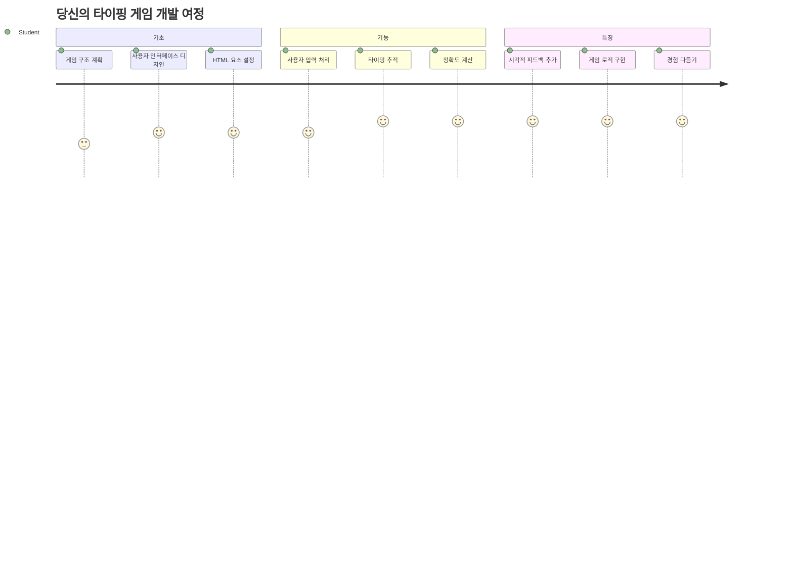
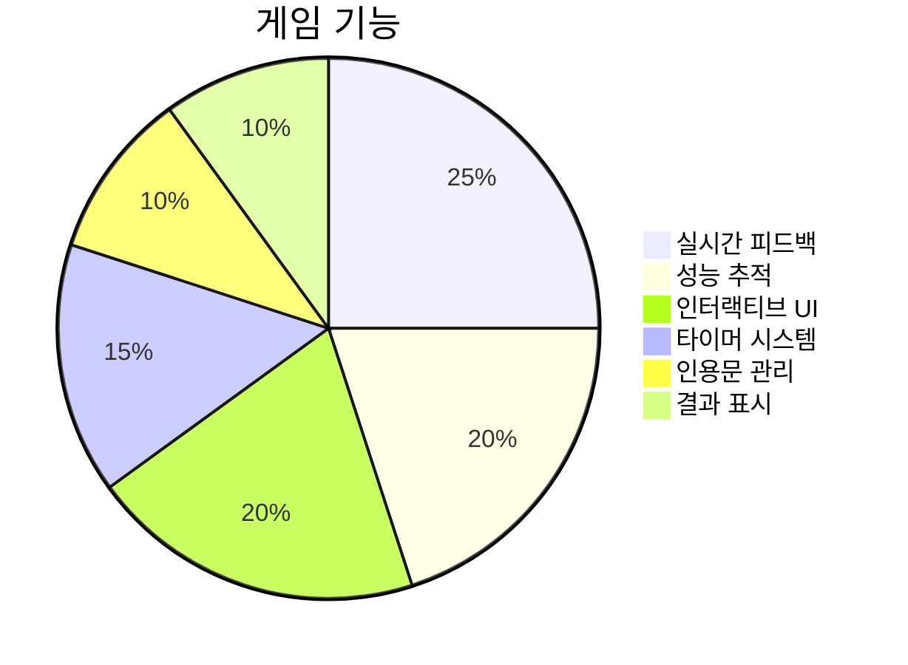
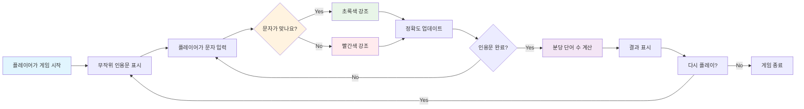
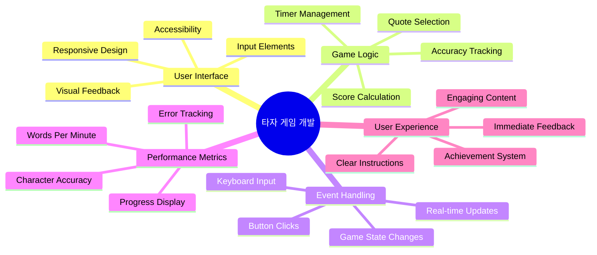
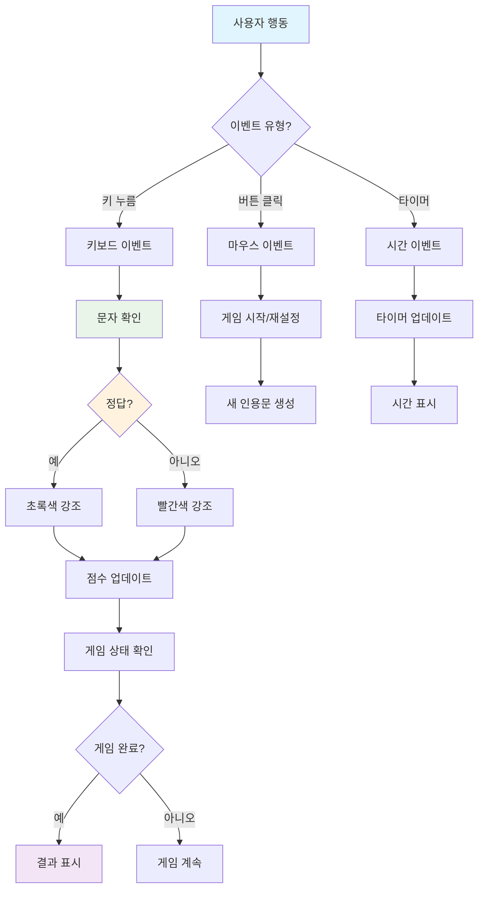
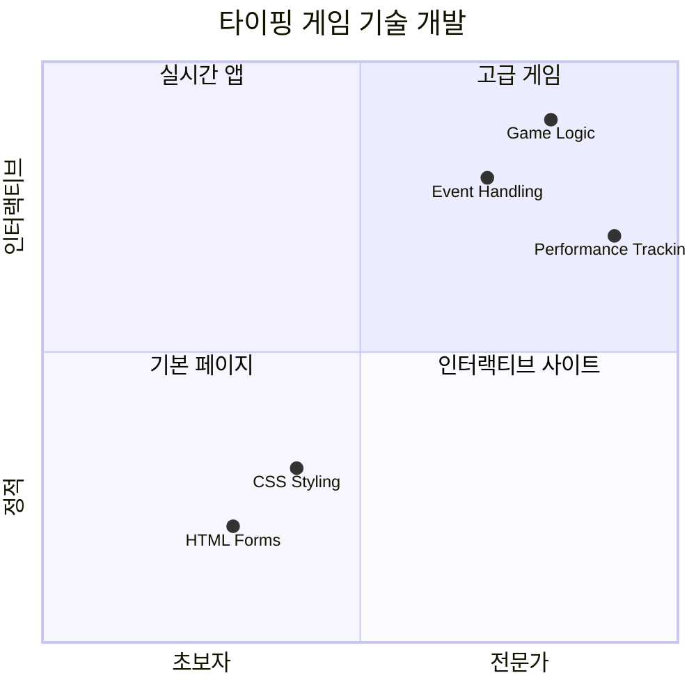
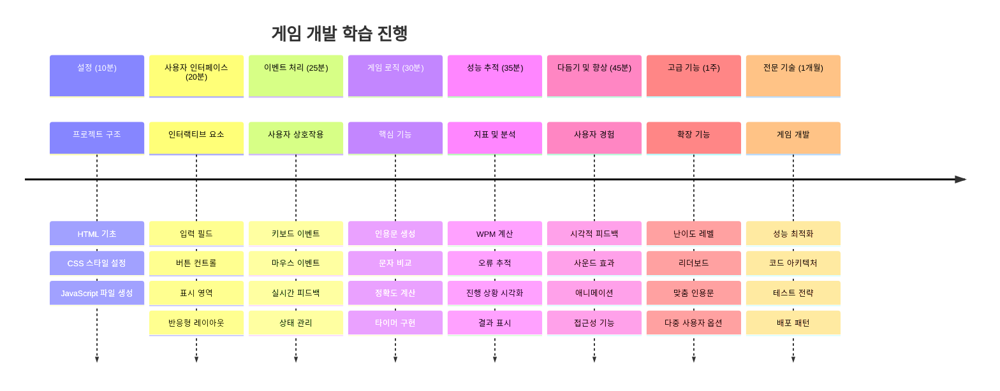

<!--
CO_OP_TRANSLATOR_METADATA:
{
  "original_hash": "efa2ab875b8bb5a7883816506da6b6d2",
  "translation_date": "2026-01-06T14:37:41+00:00",
  "source_file": "4-typing-game/README.md",
  "language_code": "ko"
}
-->
# 이벤트 기반 프로그래밍 - 타이핑 게임 만들기

## 소개

모든 개발자가 알지만 좀처럼 이야기하지 않는 사실이 하나 있어요: 빠른 타이핑은 슈퍼파워입니다! 🚀 생각해보세요 - 뇌에서 코드 편집기로 아이디어가 더 빠르게 전달될수록 창의력도 더 잘 발휘되죠. 마치 생각과 화면 사이에 직접 연결된 파이프라인이 있는 것과 같아요.

이 기술을 향상시키는 최고의 방법 중 하나를 알고 싶나요? 맞아요 - 게임을 만들어볼 거예요!

> 함께 멋진 타이핑 게임을 만들어 봅시다!

자, 지금까지 배운 JavaScript, HTML, CSS 실력을 실제로 활용할 준비 되셨나요? 전설적인 탐정 [셜록 홈즈](https://en.wikipedia.org/wiki/Sherlock_Holmes)의 무작위 명언으로 당신을 도전하게 할 타이핑 게임을 만들어볼 겁니다. 이 게임은 얼마나 빠르고 정확하게 타이핑할 수 있는지 추적할 거예요 - 믿어보세요, 생각보다 훨씬 중독성이 강해요!

## 알아야 할 사항

본격적으로 시작하기 전에 이 개념들에 익숙해져 있어야 합니다 (빠른 복습이 필요하다면 걱정하지 마세요 - 우리 모두 그런 적 있잖아요!):

- 텍스트 입력 및 버튼 컨트롤 만들기
- CSS 및 클래스 활용한 스타일 설정  
- JavaScript 기본
  - 배열 만들기
  - 난수 생성
  - 현재 시간 얻기

이 중 일부가 조금 낯설게 느껴져도 괜찮아요! 종종 가장 좋은 학습 방법은 프로젝트에 바로 뛰어들어 직접 해결해 나가는 거니까요.

### 🔄 **교육 점검**
**기초 평가**: 개발 시작 전에 다음을 이해하고 있는지 확인하세요:
- ✅ HTML 폼과 입력 요소가 어떻게 동작하는지
- ✅ CSS 클래스와 동적 스타일링
- ✅ JavaScript 이벤트 리스너와 핸들러
- ✅ 배열 조작과 무작위 선택
- ✅ 시간 측정과 계산

**자기 체크**: 이 개념들이 상호작용하는 게임에서 어떻게 작동하는지 설명할 수 있나요?
- **이벤트**는 사용자가 요소와 상호작용할 때 발생
- **핸들러**는 이벤트를 처리하고 게임 상태를 업데이트
- **CSS**는 사용자 행동에 대한 시각적 피드백 제공
- **타이밍**은 성능 측정과 게임 진행에 필수

## 이제 시작해 봅시다!

[이벤트 기반 프로그래밍으로 타이핑 게임 만들기](./typing-game/README.md)

### ⚡ **다음 5분 동안 할 수 있는 일**
- [ ] 브라우저 콘솔을 열고 `addEventListener`로 키보드 이벤트 감지해보기
- [ ] 간단한 입력 필드가 있는 HTML 페이지를 만들어 타이핑 감지 테스트하기
- [ ] 타이핑한 텍스트와 대상 텍스트를 비교하며 문자열 조작 연습하기
- [ ] `setTimeout` 함수를 이용해 타이밍 함수 이해하기

### 🎯 **이 시간 내에 달성할 수 있는 목표**
- [ ] 강의 후 퀴즈 완료하고 이벤트 기반 프로그래밍 이해하기
- [ ] 단어 검증이 가능한 기본 타이핑 게임 완성하기
- [ ] 올바른 글자와 틀린 글자에 대한 시각적 피드백 추가하기
- [ ] 속도와 정확도를 바탕으로 한 간단한 점수 시스템 구현하기
- [ ] CSS로 게임 시각적 스타일링 적용하기

### 📅 **일주일 간 게임 개발 계획**
- [ ] 모든 기능과 완성도를 갖춘 타이핑 게임 완성하기
- [ ] 난이도 조절과 단어 복잡도 변화 기능 추가하기
- [ ] 사용자의 통계 추적 기능(분당 단어 수(WPM), 시간에 따른 정확도 등) 구현하기
- [ ] 사용자 경험 향상을 위한 사운드 효과와 애니메이션 만들기
- [ ] 터치 기기 대응을 위한 모바일 반응형 디자인 적용하기
- [ ] 게임을 온라인에 공유하고 사용자 피드백 수집하기

### 🌟 **한 달 간 인터랙티브 개발 계획**
- [ ] 다양한 상호작용 패턴을 탐구하는 여러 게임 만들기
- [ ] 게임 루프, 상태 관리, 성능 최적화 학습하기
- [ ] 오픈 소스 게임 개발 프로젝트에 기여하기
- [ ] 고급 타이밍 개념과 부드러운 애니메이션 마스터하기
- [ ] 다양한 인터랙티브 애플리케이션 포트폴리오 만들기
- [ ] 게임 개발과 사용자 상호작용에 관심 있는 사람들 멘토링하기

## 🎯 당신의 타이핑 게임 마스터 타임라인

### 🛠️ 당신의 게임 개발 도구 요약

이 프로젝트를 완료하면 다음을 완전히 익히게 될 것입니다:
- **이벤트 기반 프로그래밍**: 입력에 반응하는 사용자 인터페이스 제작
- **실시간 피드백**: 즉각적인 시각 및 성능 업데이트 제공
- **성능 측정**: 정확한 시간 측정과 점수 시스템
- **게임 상태 관리**: 애플리케이션 흐름 및 사용자 경험 제어
- **인터랙티브 디자인**: 몰입감 있고 중독성 강한 사용자 경험 창출
- **최신 웹 API 활용**: 브라우저 기능을 이용한 풍부한 인터랙션
- **접근성 패턴**: 모든 사용자를 위한 포괄적 디자인

**실제 활용 사례**: 이 기술은 다음에 직접 적용됩니다:
- **웹 애플리케이션**: 모든 인터랙티브 인터페이스 및 대시보드
- **교육 소프트웨어**: 학습 플랫폼과 기술 평가 도구
- **생산성 도구**: 텍스트 편집기, IDE, 협업 소프트웨어
- **게임 산업**: 브라우저 게임 및 인터랙티브 엔터테인먼트
- **모바일 개발**: 터치 기반 인터페이스 및 제스처 처리

**다음 단계**: 이제 고급 게임 프레임워크, 실시간 멀티플레이어 시스템, 복잡한 인터랙티브 애플리케이션 탐험할 준비가 된 것입니다!

## 크레딧

♥️를 담아 [Christopher Harrison](http://www.twitter.com/geektrainer)가 작성했습니다.

---

<!-- CO-OP TRANSLATOR DISCLAIMER START -->
**면책 조항**:  
이 문서는 AI 번역 서비스 [Co-op Translator](https://github.com/Azure/co-op-translator)를 사용하여 번역되었습니다. 정확성을 위해 노력하고 있으나, 자동 번역은 오류나 부정확함을 포함할 수 있으니 참고하시기 바랍니다. 원문은 해당 언어의 원본 문서를 권위 있는 자료로 간주하여 주십시오. 중요한 정보의 경우, 전문적인 인간 번역을 권장합니다. 본 번역 사용으로 인한 오해나 잘못된 해석에 대해 저희는 책임을 지지 않습니다.
<!-- CO-OP TRANSLATOR DISCLAIMER END -->