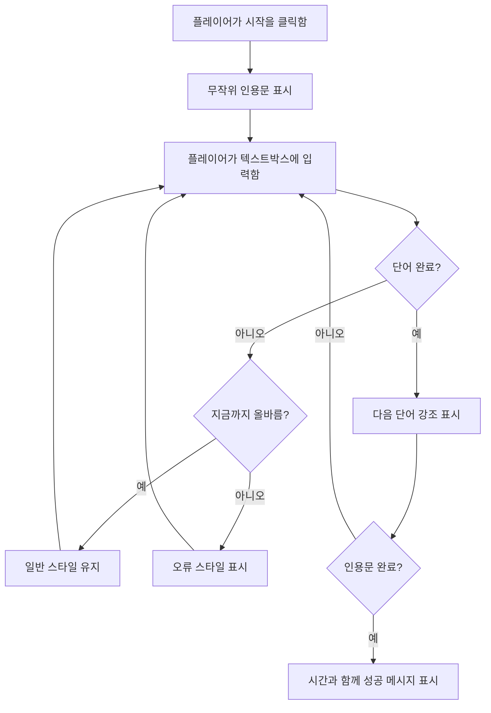
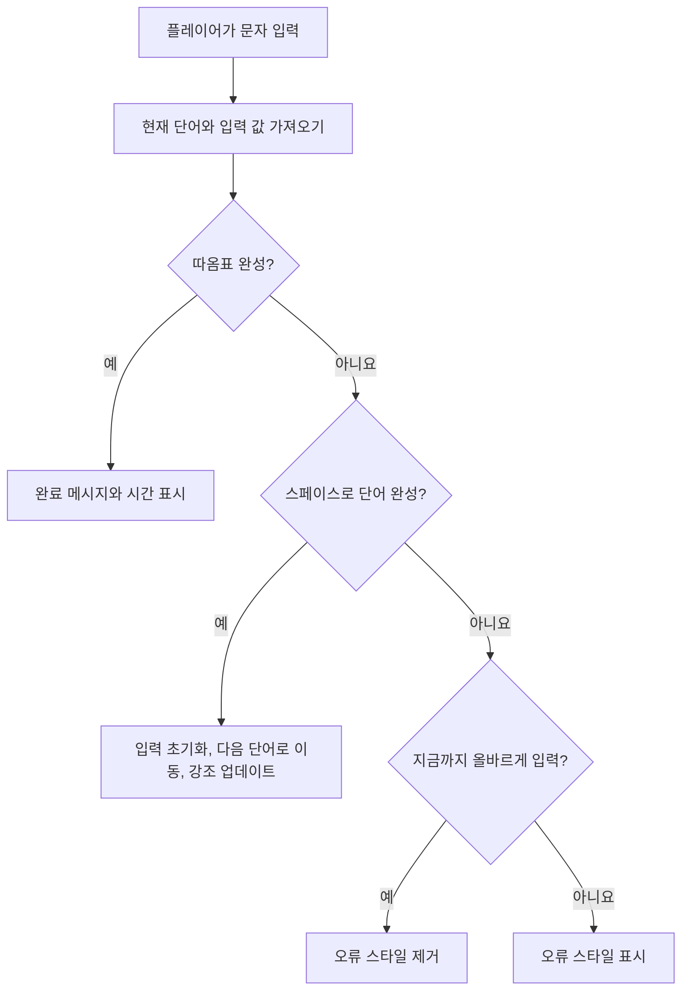
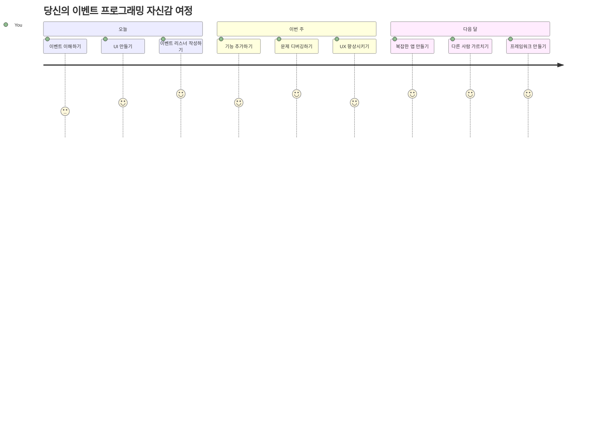

<!--
CO_OP_TRANSLATOR_METADATA:
{
  "original_hash": "da8bc72041a2bb3826a54654ee1a8844",
  "translation_date": "2026-01-06T15:31:42+00:00",
  "source_file": "4-typing-game/typing-game/README.md",
  "language_code": "ko"
}
-->
# 이벤트를 사용하여 게임 만들기

버튼을 클릭하거나 텍스트 상자에 입력할 때 웹사이트가 어떻게 그 사실을 아는지 궁금해 본 적 있나요? 그것이 바로 이벤트 기반 프로그래밍의 마법입니다! 이 필수 기술을 배우는 가장 좋은 방법은 유용한 무언가를 만들어 보는 것입니다 — 여러분이 누르는 모든 키에 반응하는 타자 속도 게임을 만드는 것이죠.

웹 브라우저가 여러분의 자바스크립트 코드와 어떻게 "대화"하는지 직접 보게 될 겁니다. 클릭, 입력, 마우스 이동이 있을 때마다 브라우저가 코드에 작은 메시지(우리가 이벤트라고 부릅니다)를 보내고, 여러분은 어떻게 반응할지 결정할 수 있습니다!

여기까지 배우면 속도와 정확도를 추적하는 진짜 타자 게임을 만들게 될 것입니다. 더 중요하게는, 여러분이 지금까지 사용해본 모든 인터랙티브한 웹사이트를 작동시키는 기본 개념을 이해하게 될 것입니다. 함께 시작해 봅시다!

## 강의 전 퀴즈

[강의 전 퀴즈](https://ff-quizzes.netlify.app/web/quiz/21)

## 이벤트 기반 프로그래밍

가장 좋아하는 앱이나 웹사이트를 생각해 보세요 — 무엇이 그것을 살아 있고 반응형으로 느끼게 하나요? 여러분이 하는 행동에 어떻게 반응하느냐가 전부입니다! 탭, 클릭, 스와이프 또는 키 입력 한 번마다 우리는 그것을 "이벤트"라고 부르며, 웹 개발의 진짜 마법이 바로 그 순간 일어납니다.

웹 프로그래밍이 흥미로운 이유는 이렇습니다: 누군가가 버튼을 클릭하거나 텍스트 상자에 타이핑을 언제 시작할지 알 수 없습니다. 즉시 클릭할 수도, 5분 후에 클릭할 수도, 아예 클릭하지 않을 수도 있기 때문입니다! 이 예측 불가능성 때문에 우리는 코드를 작성하는 방식을 다르게 생각해야 합니다.

처방전처럼 위에서 아래로 순서대로 실행되는 코드를 쓰는 대신, 무언가 발생하기를 인내심 있게 기다리는 코드를 작성해야 합니다. 1800년대 전신 기사들이 메신저가 신호를 보내는 순간 바로 대응하기 위해 기계 옆에서 대기하던 것과 비슷합니다.

그렇다면 “이벤트”란 정확히 무엇일까요? 간단히 말해, 일어나는 어떤 일입니다! 버튼을 클릭하면 — 그게 이벤트입니다. 글자를 입력하면 — 역시 이벤트입니다. 마우스를 움직이면 — 또 다른 이벤트입니다.

이벤트 기반 프로그래밍은 우리 코드를 듣고 반응하도록 설정할 수 있게 해줍니다. 우리는 **이벤트 리스너**라는 특별한 함수를 만들어 특정 일이 일어나길 인내심 있게 기다리다가 발생하면 즉시 작동하게 합니다.

이벤트 리스너는 여러분 코드의 초인종과 같습니다. 초인종(`addEventListener()`)을 설치하고, 어떤 소리(예: ‘click’ 또는 ‘keypress’)에 반응할지 지정하며, 누군가 벨을 누르면 어떤 일이 벌어져야 하는지(사용자 정의 함수)를 말합니다.

**이벤트 리스너 작동 방식은 다음과 같습니다:**
- 사용자 클릭, 키 입력, 마우스 이동 같은 특정 행동을 **감지**
- 지정한 이벤트가 발생하면 사용자 정의 코드를 **실행**
- 사용자 상호작용에 즉시 **반응**하여 매끄러운 경험 제공
- 동일 엘리먼트에서 여러 이벤트를 **다양한 리스너로 처리**

> **NOTE:** 이벤트 리스너를 만드는 방법은 매우 다양합니다. 익명 함수나 이름 있는 함수를 사용할 수 있고, `click` 프로퍼티를 설정하는 단축법이나 `addEventListener()`를 사용해도 됩니다. 이번 실습에서는 웹 개발자가 가장 흔히 쓰는 방법인 `addEventListener()`와 익명 함수에 집중할 것입니다. 이 방법은 모든 이벤트에 대해 활용 가능하고 이벤트 이름을 파라미터로 제공할 수 있어 매우 유연합니다.

### 자주 사용하는 이벤트

웹 브라우저는 수십 가지 이벤트를 제공하지만 대부분의 인터랙티브 애플리케이션은 몇 가지 필수 이벤트에 주로 의존합니다. 이 핵심 이벤트를 이해하면 복잡한 사용자 상호작용을 구현할 수 있는 기반이 됩니다.

애플리케이션을 만들 때 들을 수 있는 [수십 가지 이벤트](https://developer.mozilla.org/docs/Web/Events)가 있습니다. 기본적으로 사용자가 페이지에서 행하는 거의 모든 행동이 이벤트를 발생시키므로 원하는 경험을 제공할 수 있는 강력한 도구를 얻게 됩니다. 다행히도 일반적으로는 몇 가지 이벤트만 알면 충분합니다. 다음은 몇 가지 흔한 이벤트들입니다 (우리 게임에서 사용할 두 가지도 포함):

| 이벤트 | 설명 | 일반적 사용 사례 |
|-------|-------------|------------------|
| `click` | 사용자가 무언가를 클릭함 | 버튼, 링크, 인터랙티브 요소 |
| `contextmenu` | 사용자가 마우스 오른쪽 버튼 클릭 | 사용자 정의 우클릭 메뉴 |
| `select` | 사용자가 텍스트를 강조 표시함 | 텍스트 편집, 복사 작업 |
| `input` | 사용자가 텍스트 입력함 | 폼 검증, 실시간 검색 |

**이벤트 유형 이해하기:**
- 사용자가 페이지 특정 요소와 상호작용할 때 **발생**
- 이벤트 객체를 통해 사용자의 행동에 대한 상세 정보 **제공**
- 반응형 웹 애플리케이션을 만들 수 있게 **지원**
- 다양한 브라우저와 기기에서 일관성 있게 **동작**

## 게임 만들기

이제 이벤트가 어떻게 작동하는지 알았으니, 그 지식을 활용해 유용한 무언가를 만들어 봅시다. 이벤트 처리 방식을 보여주며 중요한 개발자 기술을 익히는 타자 속도 게임을 만들 것입니다.

자바스크립트에서 이벤트가 어떻게 작동하는지 탐구하기 위해 게임을 만들어 봅시다. 게임은 플레이어의 타자 실력을 테스트하는데, 이는 모든 개발자가 갖춰야 할 가장 과소평가된 기술 중 하나입니다. 재미있는 사실은, 우리가 오늘날 사용하는 QWERTY 키보드 배열이 사실 1870년대 타자기용으로 설계되었다는 점이며, 좋은 타자 실력은 여전히 프로그래머에게 매우 중요합니다! 게임의 전반적인 흐름은 다음과 같습니다:


**우리 게임 작동 방식:**
- 플레이어가 시작 버튼을 클릭하면 게임이 시작되고 랜덤 인용문을 표시
- 플레이어의 타이핑 진행 상황을 단어별로 실시간 추적
- 현재 단어를 하이라이트하여 플레이어 집중 유도
- 오타가 있을 때 즉시 시각적 피드백 제공
- 인용문 완료 시 전체 소요 시간 계산 및 표시

게임을 만들어 보고 이벤트에 대해 배워 봅시다!

### 파일 구조

코딩 시작 전에 정리부터 합시다! 처음부터 깔끔한 파일 구조를 갖추면 나중에 골치 아픈 일을 줄이고 프로젝트가 더 전문적으로 보입니다. 😊

파일은 단순하게 세 개로 구성할 것입니다: `index.html` — 페이지 구조, `script.js` — 게임 로직 전체, `style.css` — 스타일링. 이것은 웹의 클래식 삼총사입니다!

**터미널이나 콘솔 창을 열고 다음 명령어를 입력하여 새 폴더를 만드세요:**

```bash
# 리눅스 또는 macOS
mkdir typing-game && cd typing-game

# 윈도우즈
md typing-game && cd typing-game
```

**이 명령어들의 역할:**
- 프로젝트 파일을 위한 새 디렉터리 `typing-game` 생성
- 생성된 디렉터리로 자동 이동
- 게임 개발을 위한 깔끔한 작업 공간 준비

**Visual Studio Code 열기:**

```bash
code .
```

**이 명령어는:**
- 현재 디렉터리에서 Visual Studio Code를 실행
- 프로젝트 폴더를 에디터에서 열기
- 개발에 필요한 모든 도구 접근 제공

**Visual Studio Code에서 다음 세 파일을 폴더에 추가하세요:**
- `index.html` — 게임의 구조와 콘텐츠를 담음
- `script.js` — 모든 게임 로직과 이벤트 리스너 담당
- `style.css` — 시각적 디자인과 스타일 지정

## 사용자 인터페이스 만들기

이제 게임의 모든 조작이 이루어질 무대를 만들어 봅시다! 우주선 조종판 디자인하듯, 플레이어가 필요한 모든 것이 기대하는 곳에 있어야 합니다.

게임에 실제로 필요한 것을 생각해 봅시다. 타자 게임을 한다면 화면에 무엇이 보이길 원할까요? 다음과 같이 필요합니다:

| UI 요소 | 용도 | HTML 요소 |
|------------|---------|-------------|
| 인용문 표시 | 타이핑할 텍스트를 보여 줌 | `<p>` 엘리먼트, `id="quote"` |
| 메시지 영역 | 상태 및 성공 메시지 표시 | `<p>` 엘리먼트, `id="message"` |
| 텍스트 입력 | 플레이어가 인용문을 타이핑하는 곳 | `<input>` 엘리먼트, `id="typed-value"` |
| 시작 버튼 | 게임 시작 | `<button>` 엘리먼트, `id="start"` |

**UI 구조 이해하기:**
- 상단에서 하단으로 콘텐츠를 논리적으로 **구성**
- 자바스크립트 대상 지정용으로 요소에 **고유 ID 부여**
- 더 나은 사용자 경험을 위한 명확한 시각적 계층 구조 **제공**
- 접근성을 위한 시맨틱 HTML 요소 **포함**

각 요소에는 자바스크립트에서 작업할 수 있도록 ID가 필요합니다. 그리고 우리가 만들 CSS 및 자바스크립트 파일을 참조합니다.

새 파일 `index.html`을 만들고 다음 HTML을 추가하세요:

```html
<!-- inside index.html -->
<html>
<head>
  <title>Typing game</title>
  <link rel="stylesheet" href="style.css">
</head>
<body>
  <h1>Typing game!</h1>
  <p>Practice your typing skills with a quote from Sherlock Holmes. Click **start** to begin!</p>
  <p id="quote"></p> <!-- This will display our quote -->
  <p id="message"></p> <!-- This will display any status messages -->
  <div>
    <input type="text" aria-label="current word" id="typed-value" /> <!-- The textbox for typing -->
    <button type="button" id="start">Start</button> <!-- To start the game -->
  </div>
  <script src="script.js"></script>
</body>
</html>
```

**HTML 구조 설명:**
- 스타일링을 위해 `<head>`에 CSS 스타일시트 **연결**
- 명확한 제목과 사용자 안내문 **설정**
- 특정 ID를 가진 자리 표시자 단락들 생성하여 동적 콘텐츠 삽입 준비
- 접근성 속성을 가진 입력 필드 **포함**
- 게임 시작을 위한 버튼 **배치**
- 최적의 성능을 위해 맨 마지막에 자바스크립트 파일 **로딩**

### 애플리케이션 실행

개발 중 자주 테스트하면 문제를 조기에 발견하고 진행 상황을 실시간으로 볼 수 있어 좋습니다. Live Server 확장 기능은 저장할 때마다 브라우저를 자동으로 새로 고쳐 개발 효율성을 크게 높여줍니다.

항상 조금씩 개발하며 상태를 확인하는 것이 최선입니다. 애플리케이션을 실행해 봅시다. Visual Studio Code용 훌륭한 확장 기능인 [Live Server](https://marketplace.visualstudio.com/items?itemName=ritwickdey.LiveServer&WT.mc_id=academic-77807-sagibbon)를 설치하면 애플리케이션을 로컬에서 호스팅하고 저장할 때마다 브라우저가 새로 고쳐집니다.

**아래 링크에서 [Live Server](https://marketplace.visualstudio.com/items?itemName=ritwickdey.LiveServer&WT.mc_id=academic-77807-sagibbon)를 설치하세요:**

**설치 중 일어나는 일:**
- 브라우저가 Visual Studio Code를 열도록 **요청**
- 확장 기능 설치 과정을 안내
- 설치 완료를 위해 Visual Studio Code 재시작이 필요할 수 있음

**설치 후 Visual Studio Code에서 Ctrl-Shift-P (또는 Cmd-Shift-P)를 눌러 명령 팔레트를 엽니다:**

**명령 팔레트 이해하기:**
- 모든 VS Code 명령어에 빠르게 **접근** 가능
- 입력하는 동안 명령어 **검색**
- 개발을 더 빠르게 하는 키보드 단축키 제공

**“Live Server: Open with Live Server”를 입력하세요:**

**Live Server가 하는 일:**
- 프로젝트에 대한 로컬 개발 서버 **시작**
- 파일 저장 시 브라우저를 자동으로 **새로 고침**
- 일반적으로 `localhost:5500`에서 파일 **제공**

**브라우저에서 `https://localhost:5500`으로 이동:**

지금 막 만든 페이지가 보여야 합니다! 기능을 추가해 봅시다.

## CSS 추가하기

이제 보기 좋게 만듭시다! 시각적 피드백은 컴퓨팅 초창기부터 사용자 인터페이스에 매우 중요했습니다. 1980년대 연구자들은 즉각적인 시각적 피드백이 사용자 성능을 극적으로 향상시키고 오류를 줄인다는 것을 발견했습니다. 바로 우리가 만들려는 것이 이것입니다.

우리 게임은 현재 어떤 상태인지 명확히 보여줘야 합니다. 플레이어는 어떤 단어를 타이핑해야 하는지 바로 알아야 하며, 실수하면 즉시 확인할 수 있어야 합니다. 간단하지만 효과적인 스타일링을 만들어 봅시다:

새 파일 `style.css`를 만들고 다음 구문을 추가하세요.

```css
/* inside style.css */
.highlight {
  background-color: yellow;
}

.error {
  background-color: lightcoral;
  border: red;
}
```

**이 CSS 클래스 이해하기:**
- 현재 단어는 노란 배경으로 하이라이트되어 명확한 시각적 안내 제공
- 타이핑 오류는 연한 산호색 배경으로 표시하여 신속한 인지 지원
- 사용자의 타이핑 흐름을 방해하지 않고 즉각적인 피드백 제공
- 명확한 시각적 전달과 접근성을 위해 대비되는 색 사용

✅ CSS는 여러분 마음대로 배열해도 됩니다. 시간을 내어 페이지를 더 매력적으로 꾸며 보세요:

- 다른 글꼴 선택
- 헤더 색상 변경
- 아이템 크기 조절

## 자바스크립트

여기서부터 흥미진진해집니다! 🎉 HTML 구조와 CSS 스타일링은 갖췄지만, 지금 게임은 엔진 없이 멋진 자동차와 같습니다. 자바스크립트가 그 엔진 역할을 하여 모든 것을 실제로 작동하고 플레이어 행동에 반응하게 만듭니다.

지금부터 여러분의 창조물이 살아 움직이는 모습을 보게 될 것입니다. 단계별로 진행하니 부담 없이 따라올 수 있을 겁니다:

| 단계 | 목적 | 배울 내용 |
|------|---------|------------------|
| [상수 생성하기](../../../../4-typing-game/typing-game) | 인용문과 DOM 참조 설정 | 변수 관리와 DOM 선택법 |
| [게임 시작 이벤트 리스너](../../../../4-typing-game/typing-game) | 게임 초기화 처리 | 이벤트 처리와 UI 업데이트 |
| [타이핑 이벤트 리스너](../../../../4-typing-game/typing-game) | 실시간 사용자 입력 처리 | 입력 검증과 동적 피드백 |

**이 체계적인 접근법은 다음을 돕습니다:**
- 코드를 논리적이고 관리하기 쉬운 섹션으로 **구성**
- 기능을 단계적으로 만들어 디버깅 **용이**
- 애플리케이션 각 부분이 어떻게 함께 작동하는지 **이해**
- 향후 프로젝트를 위한 재사용 가능한 패턴 **구축**

우선 새 파일 `script.js`를 만드세요.

### 상수 추가하기

본격적으로 시작하기 전에 자원들을 모읍시다! NASA 미션 컨트롤이 발사 전에 모든 모니터링 시스템을 준비하는 것처럼, 미리 준비해 두면 나중에 찾으러 다닐 필요 없고 오타도 줄일 수 있습니다.

먼저 설정할 것은 다음과 같습니다:

| 데이터 종류 | 용도 | 예시 |
|-----------|---------|--------|
| 배열의 인용문 | 게임에 가능한 모든 인용문 저장 | `['Quote 1', 'Quote 2', ...]` |
| 단어 배열 | 현재 인용문을 개별 단어로 분리 | `['When', 'you', 'have', ...]` |
| 단어 인덱스 | 플레이어가 입력하는 단어 추적 | `0, 1, 2, 3...` |
| 시작 시간 | 점수를 위한 경과 시간 계산 | `Date.now()` |

**또한 UI 요소에 대한 참조가 필요합니다:**
| 요소 | ID | 용도 |
|---------|----|---------|
| 텍스트 입력 | `typed-value` | 플레이어가 입력하는 곳 |
| 인용문 표시 | `quote` | 입력할 인용문 표시 |
| 메시지 영역 | `message` | 상태 업데이트 표시 |

```javascript
// script.js 내부
// 우리의 모든 인용문
const quotes = [
    'When you have eliminated the impossible, whatever remains, however improbable, must be the truth.',
    'There is nothing more deceptive than an obvious fact.',
    'I ought to know by this time that when a fact appears to be opposed to a long train of deductions it invariably proves to be capable of bearing some other interpretation.',
    'I never make exceptions. An exception disproves the rule.',
    'What one man can invent another can discover.',
    'Nothing clears up a case so much as stating it to another person.',
    'Education never ends, Watson. It is a series of lessons, with the greatest for the last.',
];
// 단어 목록과 플레이어가 현재 입력하고 있는 단어의 인덱스를 저장
let words = [];
let wordIndex = 0;
// 시작 시간
let startTime = Date.now();
// 페이지 요소들
const quoteElement = document.getElementById('quote');
const messageElement = document.getElementById('message');
const typedValueElement = document.getElementById('typed-value');
```

**이 설정 코드가 하는 일 분해:**
- **const**를 사용해 변경되지 않는 셜록 홈즈 인용문 배열 저장
- 게임 중 업데이트될 값들을 위해 **let**으로 추적 변수 초기화
- 효율적인 접근을 위해 `document.getElementById()`로 DOM 요소 참조 캡처
- 명확하고 설명적인 변수명으로 모든 게임 기능의 토대 세팅
- 관련 데이터와 요소를 논리적으로 구성해 코드 유지보수 용이

✅ 게임에 더 많은 인용문을 추가하세요

> 💡 **전문가 팁**: `document.getElementById()`를 사용해 코드 어디서든 요소를 가져올 수 있습니다. 이 요소들을 반복적으로 참조하므로 문자열 오류를 줄이기 위해 상수를 사용합니다. [Vue.js](https://vuejs.org/)나 [React](https://reactjs.org/) 같은 프레임워크가 코드를 중앙 관리하는데 도움을 줄 수 있습니다.
>
**이 접근법이 잘 작동하는 이유는 다음과 같습니다:**
- 여러 번 요소를 참조할 때 철자 오류 방지
- 설명적인 상수명으로 코드 가독성 향상
- 자동 완성 및 오류 검사를 통한 IDE 지원 증대
- 나중에 요소 ID가 변경될 때 리팩토링 용이

`const`, `let` 및 `var` 사용법에 관한 영상을 잠시 시청해 보세요

[](https://youtube.com/watch?v=JNIXfGiDWM8 "변수의 종류")

> 🎥 위 이미지를 클릭하면 변수에 관한 동영상을 볼 수 있습니다.

### 시작 로직 추가

이제 모든 게 맞춰질 순간입니다! 🚀 첫 실질적인 이벤트 리스너를 작성하려고 하는데, 버튼 클릭에 코드가 반응하는 걸 보는 것은 매우 만족스럽습니다.

생각해 보세요: 어딘가에서 플레이어가 "시작" 버튼을 클릭할 것이고, 당신의 코드는 이를 준비해야 합니다. 언제 클릭할지 전혀 알 수 없죠 - 즉시일 수도 있고, 커피를 마신 후일 수도 있지만, 클릭하는 순간 게임이 시작됩니다.

사용자가 `start`를 클릭하면 인용문을 선택하고 사용자 인터페이스와 현재 단어 및 시간 추적을 설정해야 합니다. 아래는 추가할 JavaScript로, 스크립트 블록 아래에서 설명합니다.

```javascript
// script.js의 끝에서
document.getElementById('start').addEventListener('click', () => {
  // 인용문 가져오기
  const quoteIndex = Math.floor(Math.random() * quotes.length);
  const quote = quotes[quoteIndex];
  // 인용문을 단어 배열로 넣기
  words = quote.split(' ');
  // 추적을 위한 단어 인덱스 재설정
  wordIndex = 0;

  // UI 업데이트
  // 클래스를 설정할 수 있도록 span 요소 배열 만들기
  const spanWords = words.map(function(word) { return `<span>${word} </span>`});
  // 문자열로 변환하여 인용문 표시의 innerHTML로 설정
  quoteElement.innerHTML = spanWords.join('');
  // 첫 번째 단어 강조 표시
  quoteElement.childNodes[0].className = 'highlight';
  // 이전 메시지 지우기
  messageElement.innerText = '';

  // 텍스트박스 설정
  // 텍스트박스 지우기
  typedValueElement.value = '';
  // 포커스 설정
  typedValueElement.focus();
  // 이벤트 핸들러 설정

  // 타이머 시작
  startTime = new Date().getTime();
});
```

**코드를 논리적 섹션으로 나누어 설명:**

**📊 단어 추적 설정:**
- `Math.floor()`와 `Math.random()`을 사용해 무작위 인용문 선택
- `split(' ')`으로 인용문을 개별 단어의 배열로 변환
- 플레이어가 첫 단어부터 시작하므로 `wordIndex`를 0으로 재설정
- 새로운 라운드를 위한 게임 상태 준비

**🎨 UI 설정 및 표시:**
- 각 단어를 개별 스타일링을 위한 `<span>` 요소 배열 생성
- 효율적인 DOM 업데이트를 위해 스팬 요소들을 하나의 문자열로 합침
- 첫 단어에 `highlight` CSS 클래스를 추가해 강조
- 이전 게임 메시지 모두 지워 깔끔한 상태 제공

**⌨️ 텍스트박스 준비:**
- 입력창에 있던 기존 텍스트 초기화
- 플레이어가 즉시 타이핑 시작할 수 있도록 포커스 설정
- 새 게임 세션 준비를 위한 입력 필드 환경 세팅

**⏱️ 타이머 초기화:**
- `new Date().getTime()`으로 현재 시간 타임스탬프 캡처
- 타이핑 속도 및 완료 시간 정확한 계산 가능
- 게임 세션 성능 추적 시작

### 타이핑 로직 추가

이제 게임의 핵심을 다룰 차례입니다! 처음엔 어려워 보여도 걱정 마세요 - 모든 부분을 하나씩 설명할 것이고 끝나면 얼마나 논리적인지 알 수 있을 겁니다.

우리가 만드는 것은 꽤 정교합니다: 누군가 문자를 입력할 때마다, 코드가 입력값을 확인하고 피드백을 주며, 다음 행동을 결정합니다. 1970년대 WordStar 같은 초기 워드프로세서가 타이피스트에게 실시간 피드백을 제공한 것과 유사합니다.

```javascript
// script.js의 끝에서
typedValueElement.addEventListener('input', () => {
  // 현재 단어 가져오기
  const currentWord = words[wordIndex];
  // 현재 값 가져오기
  const typedValue = typedValueElement.value;

  if (typedValue === currentWord && wordIndex === words.length - 1) {
    // 문장 끝
    // 성공 표시
    const elapsedTime = new Date().getTime() - startTime;
    const message = `CONGRATULATIONS! You finished in ${elapsedTime / 1000} seconds.`;
    messageElement.innerText = message;
  } else if (typedValue.endsWith(' ') && typedValue.trim() === currentWord) {
    // 단어 끝
    // 새 단어를 위해 typedValueElement 지우기
    typedValueElement.value = '';
    // 다음 단어로 이동
    wordIndex++;
    // quote 내 모든 요소의 클래스 이름 재설정
    for (const wordElement of quoteElement.childNodes) {
      wordElement.className = '';
    }
    // 새 단어 강조 표시
    quoteElement.childNodes[wordIndex].className = 'highlight';
  } else if (currentWord.startsWith(typedValue)) {
    // 현재 맞음
    // 다음 단어 강조 표시
    typedValueElement.className = '';
  } else {
    // 오류 상태
    typedValueElement.className = 'error';
  }
});
```

**타이핑 로직 흐름 이해하기:**

이 함수는 워터폴 방식으로 조건을 가장 구체적인 것에서 가장 일반적인 것으로 차례대로 확인합니다. 각 시나리오를 살펴봅시다:


**🏁 인용문 완료 (시나리오 1):**
- 입력한 값이 현재 단어와 같고 마지막 단어인 경우 확인
- 시작 시간에서 현재 시간을 빼 경과 시간 계산
- 밀리초를 1000으로 나누어 초 단위로 변환
- 완료 시간과 함께 축하 메시지 표시

**✅ 단어 완료 (시나리오 2):**
- 입력이 공백으로 끝나면서 단어 완료 감지
- 공백 제거된 입력이 현재 단어와 정확히 일치하는지 확인
- 다음 단어 입력을 위해 입력 필드 초기화
- `wordIndex`를 증가시켜 다음 단어로 이동
- 모든 하이라이트 클래스를 제거하고 새 단어 강조

**📝 타이핑 진행 중 (시나리오 3):**
- 입력된 글자가 현재 단어의 시작과 일치하는지 확인
- 에러 스타일 제거하여 올바른 입력임을 표시
- 중단 없이 계속 타이핑 가능하도록 허용

**❌ 오류 상태 (시나리오 4):**
- 입력이 예상 단어 시작과 일치하지 않을 때 동작
- 즉각적으로 시각적 피드백을 위한 에러 CSS 클래스 적용
- 플레이어가 실수를 빠르게 인지하고 수정할 수 있게 도움

## 애플리케이션 테스트하기

정말 잘했어요! 🎉 이벤트 기반 프로그래밍으로 실질적인 타이핑 게임을 처음부터 만들었습니다. 잠시만 감탄해보세요 - 쉬운 일이 아닙니다!

이제 테스트할 시간입니다! 예상대로 동작할까요? 뭔가 빠뜨렸나요? 일부가 바로 완벽히 작동하지 않아도 괜찮습니다. 숙련된 개발자들도 자주 코드를 디버깅합니다. 개발 과정의 일부입니다!

`start`를 클릭하고 타이핑을 시작하세요! 이전에 본 애니메이션과 비슷하게 보일 겁니다.


**애플리케이션에서 테스트할 사항:**
- 시작 버튼 클릭 시 무작위 인용문이 표시되는지 확인
- 타이핑 시 현재 단어가 올바르게 하이라이트되는지 확인
- 오타 시 에러 스타일이 나타나는지 검증
- 단어를 완성하면 하이라이트가 제대로 이동하는지 점검
- 인용문 완성 시 완료 메시지와 시간이 표시되는지 테스트

**일반 디버깅 팁:**
- 브라우저 콘솔(F12)에서 JavaScript 오류 확인
- 모든 파일 이름 및 대소문자가 정확한지 다시 확인
- Live Server가 정상 작동하며 자동 새로 고침 되는지 확인
- 여러 인용문으로 무작위 선택 기능 테스트

---

## GitHub Copilot 에이전트 도전 과제 🎮

에이전트 모드를 사용해 다음 도전을 완료하세요:

**설명:** 타이핑 게임에 난이도 시스템을 구현해 플레이어 성과에 따라 게임 난이도를 조절합니다. 이 도전은 고급 이벤트 처리, 데이터 분석, 동적 UI 업데이트 능력을 연습할 수 있게 합니다.

**요구사항:** 타이핑 게임에 난이도 조절 시스템을 만드세요. 다음 내용을 포함해야 합니다:
1. 플레이어의 타이핑 속도(분당 단어수)와 정확도 백분율 추적
2. 난이도를 세 단계로 자동 조정: 쉬움(단순 인용문), 중간(현재 인용문), 어려움(복잡한 구두점 포함 인용문)
3. 현재 난이도와 플레이어 통계 UI에 표시
4. 3회 연속 좋은 성과 후 난이도 증가하는 연속 횟수 카운터 구현
5. 난이도 변경 시 색상, 애니메이션 등 시각적 피드백 추가

이 기능 구현을 위해 필요한 HTML 요소, CSS 스타일, JavaScript 함수들을 추가하세요. 적절한 오류 처리와 접근성을 고려한 ARIA 라벨 포함을 잊지 마세요.

[agent mode](https://code.visualstudio.com/blogs/2025/02/24/introducing-copilot-agent-mode)에 대해 더 알아보세요.

## 🚀 도전 과제

타이핑 게임을 한 단계 업그레이드할 준비가 되셨나요? 아래 고급 기능 구현을 통해 이벤트 처리와 DOM 조작에 대한 이해를 깊이 있게 다져보세요:

**기능 추가:**

| 기능 | 설명 | 연습할 스킬 |
|---------|-------------|------------------------|
| **입력 제어** | 완료 시 `input` 이벤트 리스너 비활성화, 버튼 클릭 시 다시 활성화 | 이벤트 관리 및 상태 제어 |
| **UI 상태 관리** | 플레이어가 인용문 완료 시 텍스트 박스 비활성화 | DOM 속성 조작 |
| **모달 다이얼로그** | 성공 메시지를 모달 다이얼로그 박스로 표시 | 고급 UI 패턴 및 접근성 |
| **최고 점수 시스템** | `localStorage`를 이용한 최고 점수 저장 | 브라우저 저장 API 및 데이터 영속성 |

**구현 팁:**
- 지속적 저장을 위해 `localStorage.setItem()` 및 `localStorage.getItem()` 공부
- 이벤트 리스너를 동적으로 추가/제거 연습
- HTML dialog 요소 또는 CSS 모달 패턴 탐색
- 폼 제어 비활성화/활성화 시 접근성 고려

## 강의 후 퀴즈

[강의 후 퀴즈](https://ff-quizzes.netlify.app/web/quiz/22)

---

## 🚀 타이핑 게임 마스터리 타임라인

### ⚡ **다음 5분 안에 할 수 있는 것**
- [ ] 여러 인용문으로 타이핑 게임을 테스트해 원활한 작동 확인
- [ ] CSS 스타일 실험 - 강조 및 오류 색상 변경해보기
- [ ] 브라우저 개발자 도구(F12)를 열고 콘솔을 보면서 플레이
- [ ] 가능한 한 빠르게 인용문 완성 도전

### ⏰ **이번 시간에 할 수 있는 것**
- [ ] 배열에 더 많은 인용문 추가 (좋아하는 책이나 영화에서)
- [ ] 도전 과제의 로컬스토리지 최고 점수 시스템 구현
- [ ] 게임 후 분당 단어수를 표시하는 계산기 만들기
- [ ] 올바른 타이핑, 오류, 완료 시 효과음 추가

### 📅 **이번 주 동안 할 수 있는 일**
- [ ] 친구들과 경쟁하는 멀티플레이어 버전 개발
- [ ] 다양한 인용문 난이도로 난이도 레벨 구현
- [ ] 인용문 진행 상황을 보여주는 진행 바 추가
- [ ] 개인 통계 추적 기능이 있는 사용자 계정 구현
- [ ] 커스텀 테마 디자인 및 사용자 스타일 선택 기능

### 🗓️ **이번 달 동안 할 수 있는 일**
- [ ] 올바른 손가락 위치를 가르치는 점진적 타이핑 강좌 만들기
- [ ] 오류가 가장 많은 글자나 단어를 분석하는 분석 기능 개발
- [ ] 다양한 언어 및 키보드 레이아웃 지원 추가
- [ ] 문학 데이터베이스에서 인용문을 가져오는 교육용 API 통합
- [ ] 다른 사람들이 즐길 수 있도록 향상된 타이핑 게임 출시

### 🎯 **최종 성찰 체크인**

**계속하기 전에 잠시 축하하세요:**
- 게임을 만드는 동안 가장 만족스러웠던 순간은 언제였나요?
- 이벤트 기반 프로그래밍에 대한 감정이 처음과 지금 어떻게 달라졌나요?
- 이 게임에 독특한 기능으로 추가하고 싶은 것은 무엇인가요?
- 다른 프로젝트에 이벤트 처리 개념을 어떻게 적용할 수 있을까요?


> 🌟 **기억하세요**: 여러분은 웹과 앱의 모든 인터랙티브한 핵심 개념 중 하나를 마스터했습니다. 이벤트 기반 프로그래밍은 웹을 살아있고 반응적으로 만드는 힘입니다. 드롭다운 메뉴, 입력 중 검증되는 폼, 클릭에 반응하는 게임을 볼 때마다 그 뒤에 숨은 마법을 이해하고 있습니다. 단순히 코딩을 배우는 것이 아니라 직관적이고 몰입감 있는 경험을 만드는 법을 배우고 있는 것입니다! 🎉

---

## 복습 및 독학

웹 브라우저가 개발자에게 제공하는 [가능한 모든 이벤트](https://developer.mozilla.org/docs/Web/Events)를 읽고, 각각을 사용할 만한 시나리오를 생각해 보세요.

## 과제

[새로운 키보드 게임 만들기](assignment.md)

---

<!-- CO-OP TRANSLATOR DISCLAIMER START -->
**면책 조항**:  
이 문서는 AI 번역 서비스 [Co-op Translator](https://github.com/Azure/co-op-translator)를 사용하여 번역되었습니다. 정확성을 위해 노력하고 있으나, 자동 번역에는 오류나 부정확성이 포함될 수 있음을 알려드립니다. 원문은 해당 언어의 원본 문서가 권위 있는 자료로 간주되어야 합니다. 중요한 정보의 경우 전문적인 인간 번역을 권장합니다. 본 번역 사용으로 인해 발생하는 오해나 해석상의 문제에 대해 당사는 책임을 지지 않습니다.
<!-- CO-OP TRANSLATOR DISCLAIMER END -->