# 브라우저 확장 프로그램 프로젝트 1부: 브라우저에 관하여

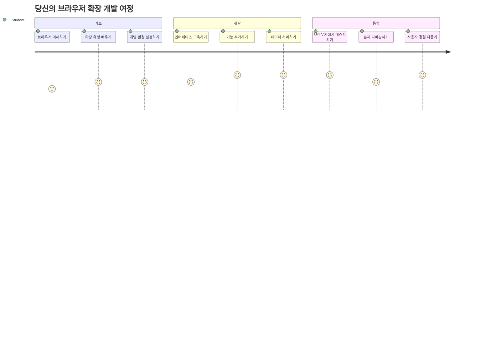
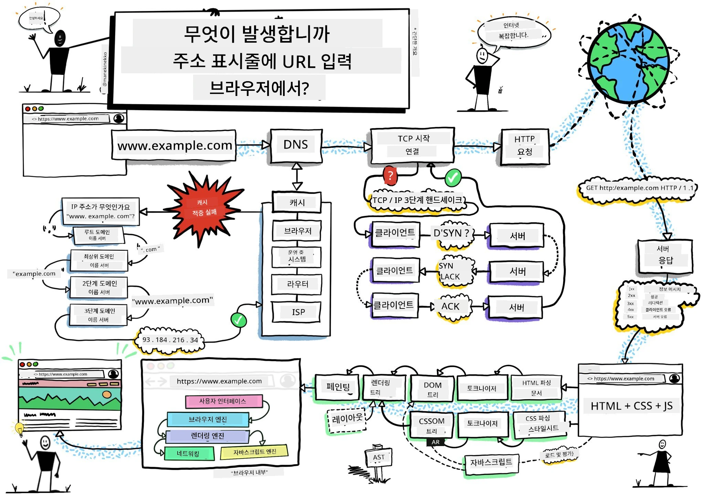
> 스케치노트 작성자: [Wassim Chegham](https://dev.to/wassimchegham/ever-wondered-what-happens-when-you-type-in-a-url-in-an-address-bar-in-a-browser-3dob)

## 강의 전 퀴즈

[강의 전 퀴즈](https://ff-quizzes.netlify.app/web/quiz/23)

### 소개

브라우저 확장 프로그램은 웹 브라우징 경험을 향상시키는 미니 애플리케이션입니다. 팀 버너스-리가 상호작용 웹에 대해 처음 구상한 것처럼, 확장 프로그램은 단순 문서 보기 이상의 브라우저 기능을 확장합니다. 계정을 안전하게 지키는 비밀번호 관리자부터 디자이너가 완벽한 색상을 선택할 수 있도록 돕는 컬러 피커까지, 확장 프로그램은 일상적인 브라우징 과제를 해결합니다.

첫 번째 확장 프로그램을 개발하기 전에 브라우저가 어떻게 작동하는지 이해해 봅시다. 알렉산더 그레이엄 벨이 전화기를 발명하기 전에 음향 전달을 이해해야 했던 것처럼, 브라우저의 기본 원리를 알면 기존 브라우저 시스템과 원활하게 통합되는 확장 프로그램을 만들 수 있습니다.

이 수업이 끝나면 브라우저 아키텍처를 이해하고 첫 확장 프로그램을 구축하기 시작하게 될 것입니다.

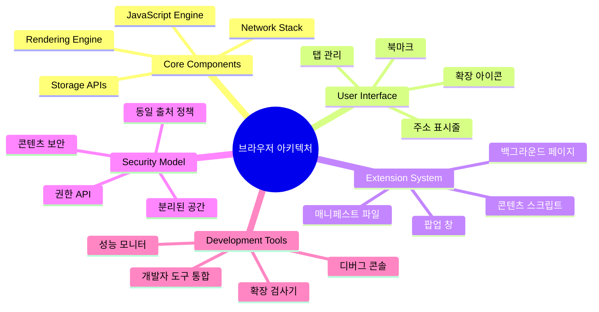
## 웹 브라우저 이해하기

웹 브라우저는 본질적으로 정교한 문서 해석기입니다. 주소창에 "google.com"을 입력하면 브라우저는 전 세계 서버로부터 콘텐츠를 요청하고, 그 코드를 해석하고 렌더링하여 보이는 대화형 웹 페이지를 만들어내는 복잡한 절차를 수행합니다.

이 과정은 팀 버너스-리가 1990년에 처음 설계한 최초 웹 브라우저 월드와이드웹(WorldWideWeb)이 하이퍼링크된 문서를 모두가 접근할 수 있도록 만든 방식을 반영합니다.

✅ **간단한 역사**: 최초의 브라우저는 'WorldWideWeb'이라 불렸으며, 1990년 팀 버너스-리가 만들었습니다.

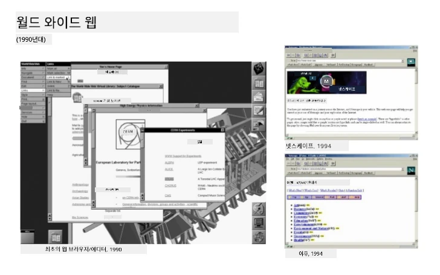
> 초기 몇몇 브라우저, 출처: [Karen McGrane](https://www.slideshare.net/KMcGrane/week-4-ixd-history-personal-computing)

### 브라우저가 웹 콘텐츠를 처리하는 방식

URL을 입력하고 웹 페이지를 보는 과정은 몇 초 내에 여러 단계가 조율되어 진행됩니다:

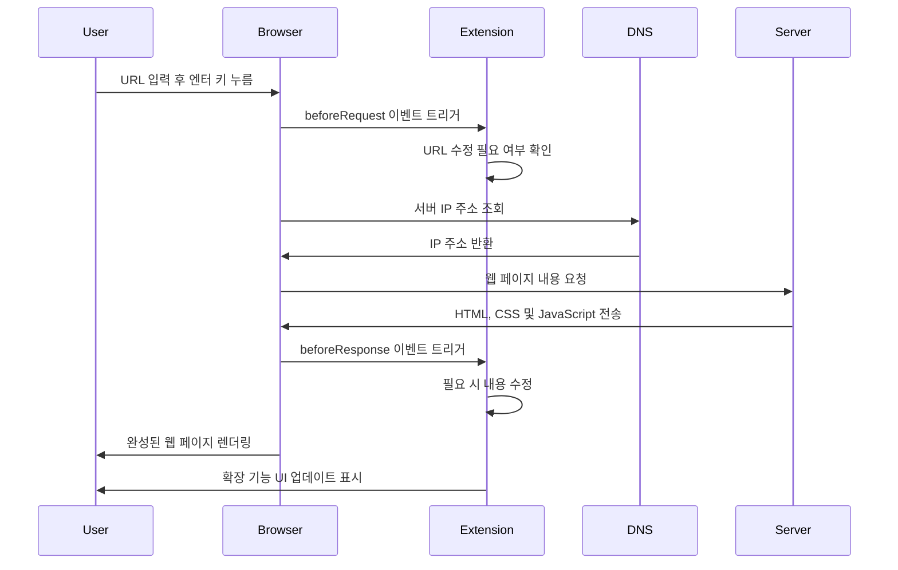
**이 과정이 수행하는 작업은 다음과 같습니다:**
- **사람이 읽을 수 있는 URL을 DNS 조회를 통해 서버 IP 주소로 변환**
- **HTTP 또는 HTTPS 프로토콜로 웹 서버와 안전한 연결 설정**
- **서버에 특정 웹 페이지 콘텐츠 요청**
- **서버로부터 HTML 마크업, CSS 스타일, JavaScript 코드 수신**
- **모든 콘텐츠를 대화형 웹 페이지로 렌더링**

### 브라우저 핵심 기능

현대 브라우저는 확장 개발자가 활용할 수 있는 수많은 기능을 제공합니다:

| 기능 | 목적 | 확장 프로그램 활용 가능성 |
|---------|---------|------------------------|
| **렌더링 엔진** | HTML, CSS, JavaScript 표시 | 콘텐츠 수정, 스타일 주입 |
| **자바스크립트 엔진** | JavaScript 코드 실행 | 사용자 스크립트, API 인터랙션 |
| **로컬 스토리지** | 데이터 로컬 저장 | 사용자 설정, 캐시 데이터 |
| **네트워크 스택** | 웹 요청 처리 | 요청 모니터링, 데이터 분석 |
| **보안 모델** | 악성 콘텐츠로부터 사용자 보호 | 콘텐츠 필터링, 보안 강화 |

**이 기능들 이해는 당신이:**
- **확장 프로그램이 가장 큰 가치를 더할 수 있는 부분 파악**
- **확장 기능에 적합한 브라우저 API 선택**
- **브라우저 시스템과 효율적으로 작동하는 확장 설계**
- **브라우저 보안 모범 사례 준수 보장**

### 크로스-브라우저 개발 고려 사항

브라우저마다 표준 구현에 약간의 차이가 있습니다. 마치 프로그래밍 언어별로 동일 알고리즘을 다르게 다루는 것처럼, Chrome, Firefox, Safari는 각각 고유한 특징이 있어 확장 프로그램 개발 시 고려해야 합니다.

> 💡 **전문가 팁**: [caniuse.com](https://www.caniuse.com)을 이용해 다양한 브라우저에서 지원하는 웹 기술을 확인하세요. 이는 확장 프로그램 기능을 계획하는 데 매우 유용합니다!

**확장 프로그램 개발 시 주요 고려 사항:**
- **확장 프로그램을 Chrome, Firefox, Edge에서 테스트**
- **각 브라우저별 확장 API와 매니페스트 형식에 적응**
- **성능 특성 및 제한 사항 차이 처리**
- **특정 브라우저에서만 제공하는 기능에 대한 대체책 제공**

✅ **분석 인사이트**: 웹 개발 프로젝트에 분석 툴을 설치하면 사용자들이 선호하는 브라우저를 파악할 수 있습니다. 이를 통해 어느 브라우저를 우선 지원할지 우선순위를 정할 수 있습니다.

## 브라우저 확장 프로그램 이해하기

브라우저 확장 프로그램은 웹 브라우징 중 일어나는 자주 겪는 문제를 해결하기 위해 브라우저 인터페이스에 바로 기능을 추가합니다. 별도 앱이나 복잡한 작업 없이 즉각적으로 도구와 기능에 접근할 수 있도록 합니다.

이 개념은 초기 컴퓨터 선구자 더글라스 엥겔바트가 기술로 인간 능력을 확장하기 위해 구상한 것과 일맥상통합니다. 확장 프로그램은 브라우저의 기본 기능을 보완합니다.

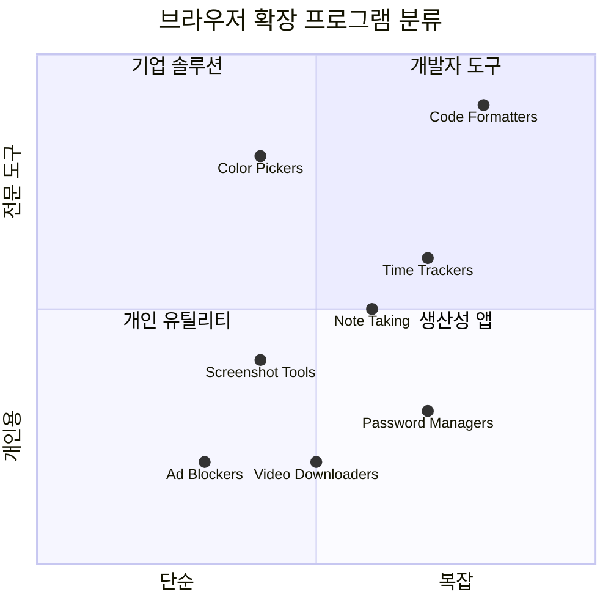
**인기 확장 카테고리 및 이점:**
- **생산성 도구**: 작업 관리자, 노트 앱, 시간 추적기 등 조직과 집중력 향상 지원
- **보안 강화**: 비밀번호 관리자, 광고 차단기, 개인 정보 보호 도구로 데이터 보호
- **개발자 도구**: 코드 포매터, 컬러 피커, 디버깅 도구로 개발 효율성 증진
- **콘텐츠 향상**: 읽기 모드, 비디오 다운로더, 스크린샷 도구로 웹 경험 개선

✅ **생각해보기 질문**: 좋아하는 브라우저 확장 프로그램은 무엇인가요? 구체적으로 어떤 작업을 수행하고, 브라우징 경험을 어떻게 개선하나요?

### 🔄 **학습 점검**
**브라우저 아키텍처 이해도 점검**: 확장 프로그램 개발 전, 다음을 할 수 있어야 합니다:
- ✅ 브라우저가 웹 요청을 처리하고 콘텐츠를 렌더링하는 과정을 설명할 수 있나요?
- ✅ 브라우저 아키텍처의 주요 구성 요소를 식별할 수 있나요?
- ✅ 확장 프로그램이 브라우저 기능과 어떻게 통합되는지 이해하나요?
- ✅ 사용자를 보호하는 보안 모델을 인지하나요?

**빠른 자기점검**: URL을 입력하고 웹 페이지까지 가는 경로를 따라볼 수 있나요?
1. **DNS 조회**로 URL을 IP 주소로 변환
2. **HTTP 요청**으로 서버에서 콘텐츠 가져오기
3. **파싱**으로 HTML, CSS, JavaScript 처리
4. **렌더링**으로 최종 웹 페이지 표시
5. **확장 프로그램**은 여러 단계에서 콘텐츠를 수정 가능

## 확장 프로그램 설치 및 관리

확장 설치 과정을 이해하면 사용자가 확장 설치 시 경험을 예측할 수 있습니다. 설치 과정은 현대 브라우저 전반에 걸쳐 표준화되어 있으나 UI 디자인에 약간의 차이가 있습니다.

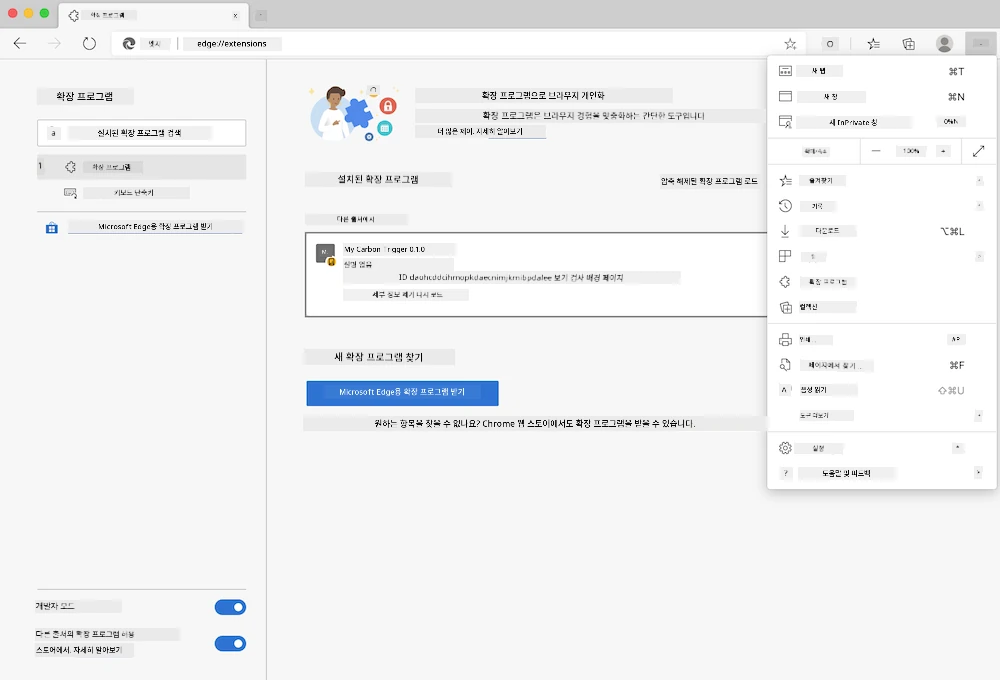

> **중요**: 직접 개발한 확장 프로그램을 테스트할 때는 개발자 모드를 활성화하고 다른 스토어의 확장 허용을 꼭 켜두세요.

### 개발 확장 설치 절차

개발 중인 확장을 테스트할 때는 아래 절차를 따르면 됩니다:

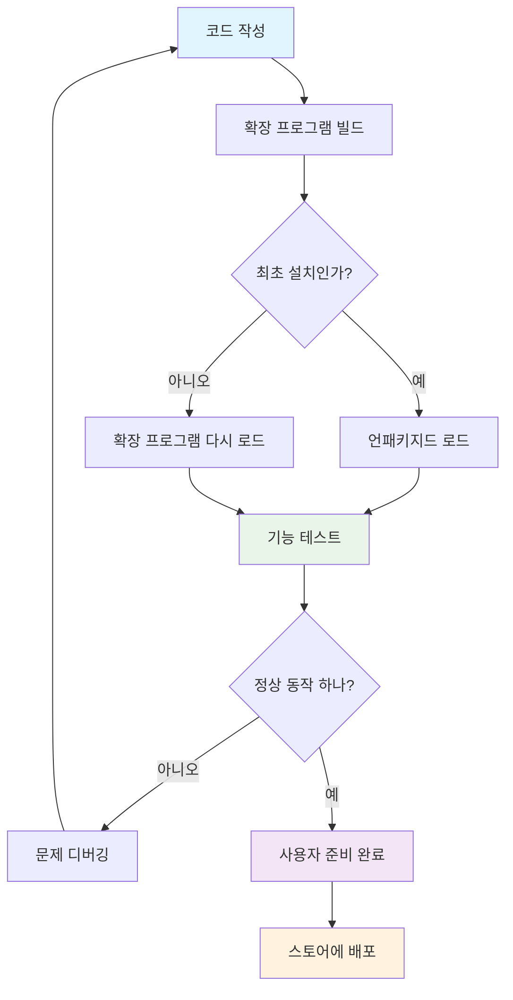
```bash
# 1단계: 확장 프로그램을 빌드합니다
npm run build
```

**이 명령이 수행하는 작업:**
- **소스 코드를 브라우저용 파일로 컴파일**
- **자바스크립트 모듈을 최적화된 패키지로 번들링**
- **최종 확장 파일을 `/dist` 폴더에 생성**
- **확장 설치 및 테스트 준비 완료**

**2단계: 브라우저 확장 관리 페이지로 이동**
1. **브라우저 확장 관리 페이지 열기**
2. **오른쪽 상단의 "설정 및 기타" 버튼(`...` 아이콘) 클릭**
3. **드롭다운 메뉴에서 "확장 프로그램" 선택**

**3단계: 확장 프로그램 로드**
- **새 설치 시**: `load unpacked` 선택 후 `/dist` 폴더 지정
- **업데이트 시**: 이미 설치된 확장 옆의 `reload` 클릭
- **테스트 시**: "개발자 모드" 활성화하여 추가 디버깅 기능 사용

### 프로덕션 확장 설치

> ✅ **참고**: 이 개발 지침은 직접 만든 확장에 해당합니다. 게시된 확장을 설치하려면, [Microsoft Edge 애드온 스토어](https://microsoftedge.microsoft.com/addons/Microsoft-Edge-Extensions-Home) 같은 공식 스토어를 방문하세요.

**차이점 이해하기:**
- **개발 설치**: 개발 중인 비공개 확장을 테스트할 수 있음
- **스토어 설치**: 검증된 공개 확장을 자동 업데이트와 함께 제공
- **사이드로딩**: 공식 스토어 외부에서 확장 설치 가능(개발자 모드 필요)

## 탄소 발자국 확장 만들기

지역 에너지 사용의 탄소 발자국을 보여주는 브라우저 확장을 만들어 봅니다. 이 프로젝트는 필수 확장 개발 개념을 실습하며 환경 인식 도구를 구현하는 좋은 예시입니다.

이 방식은 존 듀이의 교육 이론에 따른 ‘행동하며 배우기’ 원칙을 따릅니다 - 기술과 의미 있는 실제 사례를 결합합니다.

### 프로젝트 요구사항

개발을 시작하기 전에 필요한 자원과 의존성을 수집합시다:

**필요한 API 액세스:**
- **[CO2 Signal API 키](https://www.co2signal.com/)**: 이메일을 입력하면 무료 API 키 발급
- **[지역 코드](http://api.electricitymap.org/v3/zones)**: [Electricity Map](https://www.electricitymap.org/map)에서 지역 코드 확인 (예: 보스턴은 'US-NEISO')

**개발 도구:**
- **[Node.js 및 NPM](https://www.npmjs.com)**: 패키지 관리 도구로 프로젝트 의존성 설치
- **[시작 코드](../../../../5-browser-extension/start)**: 개발 시작용 `start` 폴더 다운로드

✅ **더 배우기**: 이 [포괄적인 Learn 모듈](https://docs.microsoft.com/learn/modules/create-nodejs-project-dependencies/?WT.mc_id=academic-77807-sagibbon)로 패키지 관리 기술을 키우세요.

### 프로젝트 구조 이해하기

프로젝트 구조를 이해하는 것은 개발 작업을 효율적으로 조직하는 데 도움이 됩니다. 마치 알렉산드리아 도서관이 지식을 쉽게 찾도록 설계된 것처럼, 잘 구조화된 코드베이스는 개발 효율성을 높입니다:

```
project-root/
├── dist/                    # Built extension files
│   ├── manifest.json        # Extension configuration
│   ├── index.html           # User interface markup
│   ├── background.js        # Background script functionality
│   └── main.js              # Compiled JavaScript bundle
├── src/                     # Source development files
│   └── index.js             # Your main JavaScript code
├── package.json             # Project dependencies and scripts
└── webpack.config.js        # Build configuration
```

**각 파일이 수행하는 역할:**
- **`manifest.json`**: 확장 메타데이터, 권한, 진입점 정의
- **`index.html`**: 사용자가 확장 클릭 시 표시되는 UI 생성
- **`background.js`**: 백그라운드 작업과 브라우저 이벤트 리스너 처리
- **`main.js`**: 빌드 과정 후 생성된 최종 번들 자바스크립트 포함
- **`src/index.js`**: 주요 개발 코드 포함, `main.js`로 컴파일됨

> 💡 **조직 팁**: API 키와 지역 코드를 안전한 노트에 보관해 개발 중 쉽게 참고하세요. 확장 기능 테스트 시 반드시 필요합니다.

✅ **보안 노트**: API 키나 민감한 자격 증명은 코드 저장소에 절대 커밋하지 마세요. 다음 단계에서 안전하게 관리하는 방법을 알려드립니다.

## 확장 인터페이스 만들기

이제 사용자 인터페이스 구성 요소를 만듭니다. 확장은 두 화면 구조를 사용합니다: 초기 설정용 구성 화면과 데이터 표시용 결과 화면.

이 방법은 초기 컴퓨팅 시대부터 사용된 점진적 공개 원칙을 따릅니다 - 사용자가 압도당하지 않도록 논리적 순서로 정보와 옵션을 제공합니다.

### 확장 뷰 개요

**설정 뷰** - 처음 사용자 설정 표시:
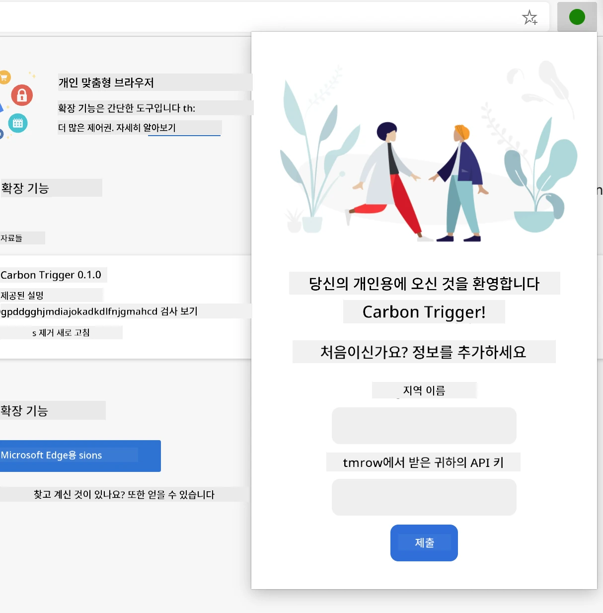

**결과 뷰** - 탄소 발자국 데이터 표시:
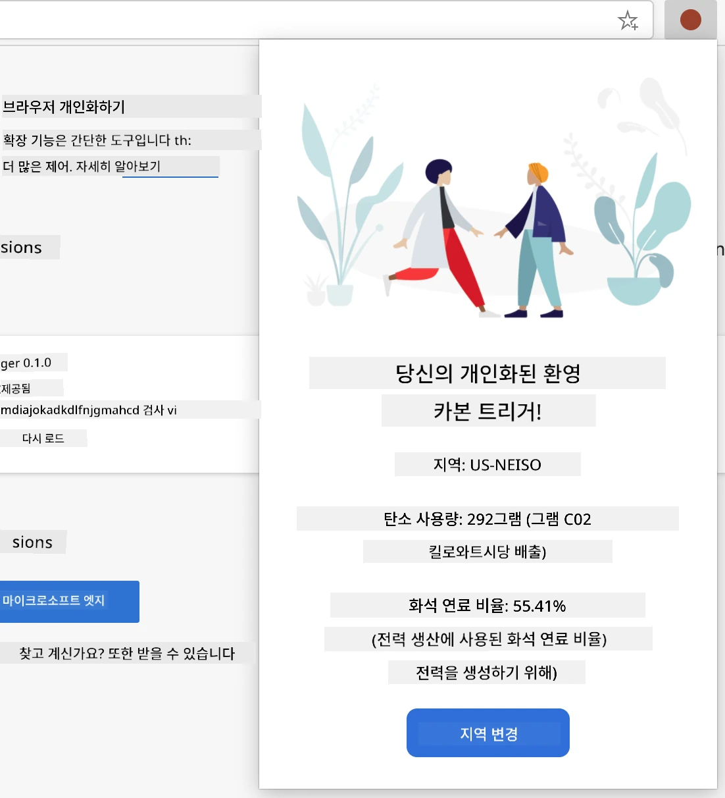

### 설정 폼 만들기

설정 폼은 초기 사용 시 사용자 구성 데이터를 수집합니다. 일단 설정하면 이 정보는 브라우저 저장소에 저장되어 이후 세션에 유지됩니다.

`/dist/index.html` 파일에 다음 폼 구조를 추가하세요:

```html
<form class="form-data" autocomplete="on">
    <div>
        <h2>New? Add your Information</h2>
    </div>
    <div>
        <label for="region">Region Name</label>
        <input type="text" id="region" required class="region-name" />
    </div>
    <div>
        <label for="api">Your API Key from tmrow</label>
        <input type="text" id="api" required class="api-key" />
    </div>
    <button class="search-btn">Submit</button>
</form>
```

**이 폼이 수행하는 작업:**
- **적절한 라벨과 입력 연관성을 가진 의미론적 폼 구조 생성**
- **자동완성 기능 활성화로 사용자 경험 향상**
- **양쪽 필드 모두 필수로 `required` 속성 지정**
- **입력을 쉽게 스타일링하고 자바스크립트 타깃팅 할 수 있도록 설명적 클래스명 사용**
- **처음 확장 설정하는 사용자에게 명확한 안내 제공**

### 결과 표시 영역 만들기

다음으로 탄소 발자국 데이터를 보여줄 결과 영역을 만듭니다. 폼 아래에 다음 HTML을 추가하세요:

```html
<div class="result">
    <div class="loading">loading...</div>
    <div class="errors"></div>
    <div class="data"></div>
    <div class="result-container">
        <p><strong>Region: </strong><span class="my-region"></span></p>
        <p><strong>Carbon Usage: </strong><span class="carbon-usage"></span></p>
        <p><strong>Fossil Fuel Percentage: </strong><span class="fossil-fuel"></span></p>
    </div>
    <button class="clear-btn">Change region</button>
</div>
```

**이 구조가 제공하는 기능 분해:**
- **`loading`**: API 데이터를 불러오는 동안 로딩 메시지 표시
- **`errors`**: API 호출 실패하거나 데이터가 올바르지 않을 때 오류 메시지 표시
- **`data`**: 개발 중 디버깅 목적으로 원시 데이터 보관
- **`result-container`**: 사용자에게 포맷된 탄소 발자국 정보 제공
- **`clear-btn`**: 사용자가 지역을 변경하고 확장을 재구성할 수 있도록 함

### 빌드 프로세스 설정

이제 프로젝트 의존성을 설치하고 빌드 과정을 테스트합시다:

```bash
npm install
```

**이 설치 과정이 수행하는 작업:**
- **`package.json`에 지정된 Webpack과 기타 개발 의존성 다운로드**
- **최신 자바스크립트 컴파일을 위한 빌드 도구 체인 구성**
- **확장 빌드 및 테스트를 위한 개발 환경 준비**
- **코드 번들링, 최적화, 크로스 브라우저 호환 기능 활성화**

> 💡 **빌드 과정 팁**: Webpack은 `/src/index.js`의 소스 코드를 `/dist/main.js`로 번들링합니다. 이 과정은 코드를 프로덕션용으로 최적화하고 브라우저 호환성을 보장합니다.

### 진행 상황 테스트

이 시점에서 확장을 테스트할 수 있습니다:
1. **빌드** 명령어를 실행하여 코드를 컴파일합니다  
2. **개발자 모드**를 사용하여 확장 프로그램을 브라우저에 로드합니다  
3. 폼이 올바르게 표시되며 전문적으로 보이는지 **확인**합니다  
4. 모든 폼 요소가 제대로 정렬되고 작동하는지 **체크**합니다  

**당신이 성취한 것:**  
- 확장 프로그램을 위한 기본 HTML 구조를 **구축**했습니다  
- 적절한 의미론적 마크업을 사용하여 구성 및 결과 인터페이스를 **작성**했습니다  
- 업계 표준 도구를 활용해 최신 개발 워크플로우를 **설정**했습니다  
- 상호작용이 가능한 JavaScript 기능 추가를 위한 기반을 **준비**했습니다  

### 🔄 **학습 점검**  
**확장 프로그램 개발 진행 상황**: 계속 진행하기 전에 이해도를 확인하세요:  
- ✅ 프로젝트 구조 내 각 파일의 목적을 설명할 수 있나요?  
- ✅ 빌드 과정이 소스 코드를 어떻게 변환하는지 이해하나요?  
- ✅ 구성과 결과를 별도의 UI 섹션으로 분리하는 이유는 무엇인가요?  
- ✅ 폼 구조가 사용성 및 접근성을 어떻게 지원하는지 아나요?  

**개발 워크플로우 이해**: 이제 다음을 할 수 있어야 합니다:  
1. 확장 프로그램 인터페이스의 HTML과 CSS를 **수정**합니다  
2. 변경 사항을 컴파일하기 위해 빌드 명령어를 **실행**합니다  
3. 브라우저에서 확장 프로그램을 다시 로드하여 업데이트를 **테스트**합니다  
4. 브라우저 개발자 도구를 사용해 문제를 **디버그**합니다  

여러분은 브라우저 확장 프로그램 개발의 첫 번째 단계를 완료했습니다. 라이트 형제가 비행 전에 항공 역학을 이해해야 했던 것처럼, 이러한 기초 개념을 이해하는 것은 다음 수업에서 더욱 복잡한 상호작용 기능을 구축하는 데 도움이 됩니다.  

## GitHub Copilot 에이전트 챌린지 🚀  

에이전트 모드를 사용하여 다음 챌린지를 완료하세요:  

**설명:** API 키 및 지역 코드를 입력할 때 사용자 경험을 향상시키기 위해 폼 유효성 검사와 사용자 피드백 기능을 추가하여 브라우저 확장 프로그램을 개선하세요.  

**요구사항:** API 키 필드가 최소 20자 이상인지, 지역 코드가 올바른 형식(예: 'US-NEISO')인지 확인하는 JavaScript 유효성 검사 함수를 작성하세요. 유효한 입력 시 입력란 테두리를 녹색으로, 유효하지 않은 경우 빨간색으로 변경하여 시각적 피드백을 추가하세요. 또한 보안 목적을 위해 API 키의 표시/숨김 토글 기능도 구현하세요.  

[agent mode](https://code.visualstudio.com/blogs/2025/02/24/introducing-copilot-agent-mode)에 대해 더 알아보세요.  

## 🚀 챌린지  

브라우저 확장 프로그램 스토어를 살펴보고 하나를 브라우저에 설치해보세요. 흥미로운 방식으로 파일을 살펴볼 수 있습니다. 무엇을 발견하셨나요?  

## 강의 후 퀴즈  

[강의 후 퀴즈](https://ff-quizzes.netlify.app/web/quiz/24)  

## 복습 및 자기주도 학습  

이번 수업에서는 웹 브라우저의 역사에 대해 조금 배웠습니다. 이번 기회에 월드 와이드 웹의 발명가들이 그 사용 방식을 어떻게 구상했는지 더 알아보세요. 유용한 사이트들은 다음과 같습니다:  

[웹 브라우저의 역사](https://www.mozilla.org/firefox/browsers/browser-history/)  

[웹의 역사](https://webfoundation.org/about/vision/history-of-the-web/)  

[팀 버너스리 인터뷰](https://www.theguardian.com/technology/2019/mar/12/tim-berners-lee-on-30-years-of-the-web-if-we-dream-a-little-we-can-get-the-web-we-want)  

### ⚡ **다음 5분 동안 할 수 있는 일**  
- [ ] Chrome/Edge 확장 프로그램 페이지(chrome://extensions)를 열어 설치한 확장 프로그램 탐색  
- [ ] 웹페이지 로드 시 브라우저 개발자 도구 네트워크 탭 관찰  
- [ ] 페이지 소스 보기(Ctrl+U)를 시도하여 HTML 구조 확인  
- [ ] 웹페이지 요소를 검사하고 개발자 도구에서 CSS 수정  

### 🎯 **이번 시간에 달성할 수 있는 목표**  
- [ ] 강의 후 퀴즈 완료 및 브라우저 기본 원리 이해  
- [ ] 브라우저 확장 프로그램용 기본 manifest.json 파일 작성  
- [ ] 팝업을 표시하는 간단한 "Hello World" 확장 프로그램 제작  
- [ ] 개발자 모드에서 확장 프로그램 로드 테스트  
- [ ] 대상 브라우저의 확장 프로그램 문서 탐색  

### 📅 **일주일간의 확장 프로그램 여정**  
- [ ] 실제 활용 가능한 기능성 브라우저 확장 프로그램 완성  
- [ ] 콘텐츠 스크립트, 백그라운드 스크립트 및 팝업 상호작용 학습  
- [ ] 저장소, 탭, 메시징 등 브라우저 API 마스터  
- [ ] 확장 프로그램을 위한 사용자 친화적 인터페이스 설계  
- [ ] 다양한 웹사이트 및 상황에서 확장 프로그램 테스트  
- [ ] 확장 프로그램을 브라우저 확장 스토어에 배포  

### 🌟 **한 달간의 브라우저 개발 일정**  
- [ ] 다양한 사용자 문제를 해결하는 여러 확장 프로그램 제작  
- [ ] 고급 브라우저 API와 보안 모범 사례 습득  
- [ ] 오픈 소스 브라우저 확장 프로젝트에 기여  
- [ ] 크로스 브라우저 호환성과 점진적 향상 기술 마스터  
- [ ] 다른 개발자를 위한 확장 개발 도구 및 템플릿 제작  
- [ ] 다른 개발자를 돕는 브라우저 확장 전문가 되기  

## 🎯 브라우저 확장 프로그램 마스터 타임라인  

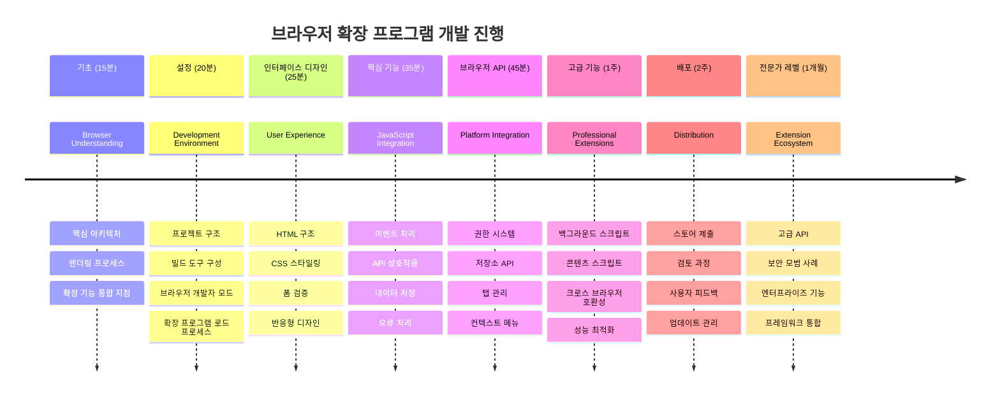
### 🛠️ 확장 프로그램 개발 도구 요약  

이 수업을 마치면 다음을 갖추게 됩니다:  
- **브라우저 아키텍처 지식**: 렌더링 엔진, 보안 모델, 확장 프로그램 통합 이해  
- **개발 환경**: Webpack, NPM, 디버깅 기능을 갖춘 최신 도구 체인  
- **UI/UX 기반**: 점진적 공개 패턴을 포함한 의미론적 HTML 구조  
- **보안 인식**: 브라우저 권한 및 안전한 개발 관행 이해  
- **크로스 브라우저 개념**: 호환성 고려사항 및 테스트 방법 숙지  
- **API 통합 기초**: 외부 데이터 소스 작업 기반 마련  
- **전문적인 워크플로우**: 업계 표준 개발 및 테스트 프로세스  

**실제 활용 분야:** 이 기술은 다음에 직접 적용됩니다:  
- **웹 개발**: SPA 및 점진적 웹 애플리케이션  
- **데스크탑 애플리케이션**: Electron 및 웹 기반 데스크탑 소프트웨어  
- **모바일 개발**: 하이브리드 앱 및 웹 기반 모바일 솔루션  
- **엔터프라이즈 도구**: 내부 생산성 애플리케이션 및 워크플로우 자동화  
- **오픈 소스**: 브라우저 확장 프로젝트 및 웹 표준 기여  

**다음 단계:** 상호작용 기능 추가, 브라우저 API 활용, 실제 사용자 문제 해결 확장 제작 준비 완료!  

## 과제  

[확장 프로그램 스타일 재구성](assignment.md)

---

<!-- CO-OP TRANSLATOR DISCLAIMER START -->
**면책 조항**:
이 문서는 AI 번역 서비스 [Co-op Translator](https://github.com/Azure/co-op-translator)를 사용하여 번역되었습니다. 정확성을 위해 노력하고 있으나, 자동 번역은 오류나 부정확성이 포함될 수 있음을 유의해 주시기 바랍니다. 원문 문서가 권위 있는 출처로 간주되어야 합니다. 중요한 정보의 경우, 전문 인간 번역을 권장합니다. 본 번역 사용으로 인해 발생하는 오해나 잘못된 해석에 대해 당사는 책임을 지지 않습니다.
<!-- CO-OP TRANSLATOR DISCLAIMER END -->