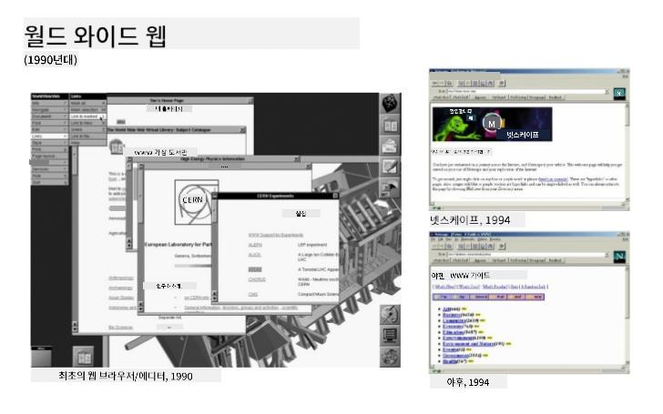
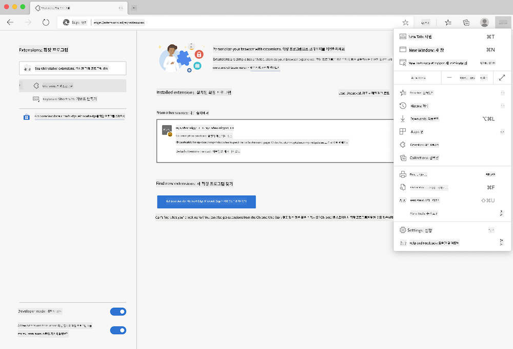

<!--
CO_OP_TRANSLATOR_METADATA:
{
  "original_hash": "2326d04e194a10aa760b51f5e5a1f61d",
  "translation_date": "2025-08-29T15:35:35+00:00",
  "source_file": "5-browser-extension/1-about-browsers/README.md",
  "language_code": "ko"
}
-->
# 브라우저 확장 프로그램 프로젝트 Part 1: 브라우저에 대해 알아보기


> 스케치노트 제공: [Wassim Chegham](https://dev.to/wassimchegham/ever-wondered-what-happens-when-you-type-in-a-url-in-an-address-bar-in-a-browser-3dob)

## 강의 전 퀴즈

[강의 전 퀴즈](https://ff-quizzes.netlify.app/web/quiz/23)

### 소개

브라우저 확장 프로그램은 브라우저에 추가적인 기능을 제공합니다. 하지만 확장 프로그램을 만들기 전에 브라우저가 어떻게 작동하는지 조금 배워야 합니다.

### 브라우저에 대해

이 강의 시리즈에서는 Chrome, Firefox, Edge 브라우저에서 작동하는 브라우저 확장 프로그램을 만드는 방법을 배웁니다. 이번 파트에서는 브라우저가 어떻게 작동하는지 알아보고 브라우저 확장 프로그램의 요소를 구성해볼 것입니다.

그렇다면 브라우저란 무엇일까요? 브라우저는 사용자가 서버에서 콘텐츠를 가져와 웹 페이지에 표시할 수 있도록 하는 소프트웨어 애플리케이션입니다.

✅ 간단한 역사: 최초의 브라우저는 'WorldWideWeb'이라는 이름으로 1990년 Sir Timothy Berners-Lee에 의해 만들어졌습니다.


> 일부 초기 브라우저들, 출처: [Karen McGrane](https://www.slideshare.net/KMcGrane/week-4-ixd-history-personal-computing)

사용자가 URL(Uniform Resource Locator) 주소를 사용하여 인터넷에 연결하면, 일반적으로 `http` 또는 `https` 주소를 통해 Hypertext Transfer Protocol을 사용하여 브라우저가 웹 서버와 통신하고 웹 페이지를 가져옵니다.

이 시점에서 브라우저의 렌더링 엔진이 사용자의 기기(모바일, 데스크톱, 노트북 등)에 페이지를 표시합니다.

브라우저는 콘텐츠를 캐싱하여 매번 서버에서 가져오지 않아도 되도록 할 수 있습니다. 또한 사용자의 브라우징 활동 기록을 저장하고, '쿠키'라는 작은 데이터 조각을 저장하여 사용자의 활동 정보를 기록하는 등 다양한 기능을 제공합니다.

브라우저에 대해 꼭 기억해야 할 중요한 점은 모든 브라우저가 동일하지 않다는 것입니다! 각 브라우저는 고유한 강점과 약점을 가지고 있으며, 전문 웹 개발자는 웹 페이지가 여러 브라우저에서 잘 작동하도록 만드는 방법을 이해해야 합니다. 여기에는 모바일 기기와 같은 작은 뷰포트를 처리하거나 오프라인 상태의 사용자를 지원하는 것도 포함됩니다.

웹 페이지를 만들 때 사용자 지원을 최적화하기 위해 기술 지원 목록을 제공하는 [caniuse.com](https://www.caniuse.com)을 북마크해두는 것이 매우 유용합니다.

✅ 웹 사이트의 사용자 기반에서 어떤 브라우저가 가장 인기 있는지 어떻게 알 수 있을까요? 분석 도구를 설치하면 다양한 인기 브라우저에서 어떤 브라우저가 가장 많이 사용되는지 알 수 있습니다.

## 브라우저 확장 프로그램

브라우저 확장 프로그램을 왜 만들고 싶을까요? 반복적으로 수행하는 작업에 빠르게 접근할 수 있는 편리한 도구입니다. 예를 들어, 다양한 웹 페이지에서 색상을 확인해야 하는 경우 색상 선택기 확장 프로그램을 설치할 수 있습니다. 비밀번호를 기억하기 어려운 경우 비밀번호 관리 확장 프로그램을 사용할 수 있습니다.

브라우저 확장 프로그램을 개발하는 것은 재미있기도 합니다. 확장 프로그램은 제한된 수의 작업을 잘 수행하는 경향이 있습니다.

✅ 여러분이 좋아하는 브라우저 확장 프로그램은 무엇인가요? 어떤 작업을 수행하나요?

### 확장 프로그램 설치하기

확장 프로그램을 만들기 전에 확장 프로그램을 빌드하고 배포하는 과정을 살펴보세요. 각 브라우저마다 이 작업을 관리하는 방식이 약간 다르지만, Chrome과 Firefox에서의 과정은 Edge에서의 예시와 비슷합니다:



> 참고: 개발자 모드를 활성화하고 다른 스토어의 확장 프로그램을 허용하세요.

본질적으로 과정은 다음과 같습니다:

- `npm run build`를 사용하여 확장 프로그램을 빌드합니다.
- 브라우저에서 오른쪽 상단의 "설정 및 기타" 버튼(`...` 아이콘)을 사용하여 확장 프로그램 창으로 이동합니다.
- 새 설치인 경우, `load unpacked`를 선택하여 빌드 폴더(우리의 경우 `/dist`)에서 새 확장 프로그램을 업로드합니다.
- 이미 설치된 확장 프로그램을 다시 로드하려면 `reload`를 클릭합니다.

✅ 이 지침은 직접 만든 확장 프로그램에 해당합니다. 브라우저 확장 프로그램 스토어에 출시된 확장 프로그램을 설치하려면 각 브라우저와 연결된 [스토어](https://microsoftedge.microsoft.com/addons/Microsoft-Edge-Extensions-Home)로 이동하여 원하는 확장 프로그램을 설치하세요.

### 시작하기

여러분은 지역의 탄소 발자국을 표시하는 브라우저 확장 프로그램을 만들 것입니다. 이 확장 프로그램은 지역의 에너지 사용량과 에너지 출처를 보여줍니다. 확장 프로그램에는 API 키를 수집하는 폼이 포함될 것입니다.

**필요한 것:**

- [API 키](https://www.co2signal.com/); 이 페이지의 상자에 이메일을 입력하면 키가 전송됩니다.
- [지역 코드](http://api.electricitymap.org/v3/zones); [Electricity Map](https://www.electricitymap.org/map)에 해당하는 코드 (예: 보스턴에서는 'US-NEISO'를 사용합니다).
- [스타터 코드](../../../../5-browser-extension/start). `start` 폴더를 다운로드하고 이 폴더에서 코드를 완성합니다.
- [NPM](https://www.npmjs.com) - NPM은 패키지 관리 도구입니다. 로컬에 설치하면 `package.json` 파일에 나열된 패키지가 웹 자산에서 사용 가능하도록 설치됩니다.

✅ 패키지 관리에 대해 더 알아보려면 이 [훌륭한 학습 모듈](https://docs.microsoft.com/learn/modules/create-nodejs-project-dependencies/?WT.mc_id=academic-77807-sagibbon)을 확인하세요.

코드베이스를 잠시 살펴보세요:

dist
    -|manifest.json (기본값 설정)
    -|index.html (프론트엔드 HTML 마크업)
    -|background.js (백그라운드 JS)
    -|main.js (빌드된 JS)
src
    -|index.js (여기에 JS 코드 작성)

✅ API 키와 지역 코드를 준비했으면, 나중에 사용할 수 있도록 메모에 저장하세요.

### 확장 프로그램의 HTML 작성하기

이 확장 프로그램에는 두 가지 뷰가 있습니다. 하나는 API 키와 지역 코드를 수집하기 위한 폼:


그리고 두 번째는 지역의 탄소 사용량을 표시하기 위한 뷰:


먼저 폼을 작성하고 CSS로 스타일링해봅시다.

`/dist` 폴더에서 폼과 결과 영역을 작성합니다. `index.html` 파일에서 폼 영역을 채웁니다:

```HTML
<form class="form-data" autocomplete="on">
	<div>
		<h2>New? Add your Information</h2>
	</div>
	<div>
		<label for="region">Region Name</label>
		<input type="text" id="region" required class="region-name" />
	</div>
	<div>
		<label for="api">Your API Key from tmrow</label>
		<input type="text" id="api" required class="api-key" />
	</div>
	<button class="search-btn">Submit</button>
</form>	
```
이 폼은 저장된 정보를 입력하고 로컬 스토리지에 저장하는 곳입니다.

다음으로 결과 영역을 만듭니다. 마지막 폼 태그 아래에 몇 개의 div를 추가하세요:

```HTML
<div class="result">
	<div class="loading">loading...</div>
	<div class="errors"></div>
	<div class="data"></div>
	<div class="result-container">
		<p><strong>Region: </strong><span class="my-region"></span></p>
		<p><strong>Carbon Usage: </strong><span class="carbon-usage"></span></p>
		<p><strong>Fossil Fuel Percentage: </strong><span class="fossil-fuel"></span></p>
	</div>
	<button class="clear-btn">Change region</button>
</div>
```
이 시점에서 빌드를 시도할 수 있습니다. 확장 프로그램의 패키지 종속성을 설치하세요:

```
npm install
```

이 명령은 npm(Node Package Manager)을 사용하여 확장 프로그램의 빌드 프로세스를 위한 webpack을 설치합니다. 이 프로세스의 출력을 `/dist/main.js`에서 확인할 수 있습니다. 코드가 번들링된 것을 볼 수 있습니다.

현재 확장 프로그램은 빌드되어 Edge에 확장 프로그램으로 배포하면 깔끔하게 표시된 폼을 볼 수 있습니다.

축하합니다! 브라우저 확장 프로그램을 만드는 첫 단계를 성공적으로 완료했습니다. 이후 강의에서는 확장 프로그램을 더 기능적이고 유용하게 만들 것입니다.

---

## 🚀 도전 과제

브라우저 확장 프로그램 스토어를 살펴보고 하나를 브라우저에 설치해보세요. 파일을 흥미로운 방식으로 조사할 수 있습니다. 무엇을 발견했나요?

## 강의 후 퀴즈

[강의 후 퀴즈](https://ff-quizzes.netlify.app/web/quiz/24)

## 복습 및 자기 학습

이번 강의에서는 웹 브라우저의 역사에 대해 조금 배웠습니다. 시간을 내어 월드 와이드 웹의 발명가들이 웹의 사용을 어떻게 구상했는지에 대해 더 알아보세요. 유용한 사이트는 다음과 같습니다:

[웹 브라우저의 역사](https://www.mozilla.org/firefox/browsers/browser-history/)

[웹의 역사](https://webfoundation.org/about/vision/history-of-the-web/)

[Tim Berners-Lee와의 인터뷰](https://www.theguardian.com/technology/2019/mar/12/tim-berners-lee-on-30-years-of-the-web-if-we-dream-a-little-we-can-get-the-web-we-want)

## 과제 

[확장 프로그램 스타일 변경하기](assignment.md)

---

**면책 조항**:  
이 문서는 AI 번역 서비스 [Co-op Translator](https://github.com/Azure/co-op-translator)를 사용하여 번역되었습니다. 정확성을 위해 최선을 다하고 있으나, 자동 번역에는 오류나 부정확성이 포함될 수 있습니다. 원본 문서를 해당 언어로 작성된 상태에서 권위 있는 자료로 간주해야 합니다. 중요한 정보의 경우, 전문적인 인간 번역을 권장합니다. 이 번역 사용으로 인해 발생하는 오해나 잘못된 해석에 대해 당사는 책임을 지지 않습니다.  