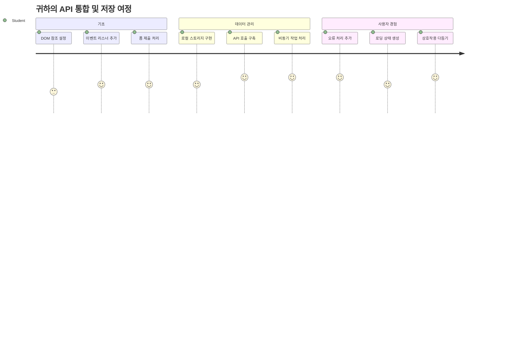
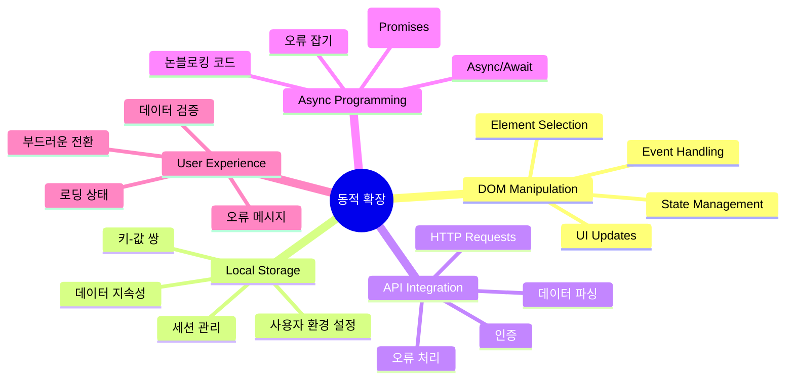
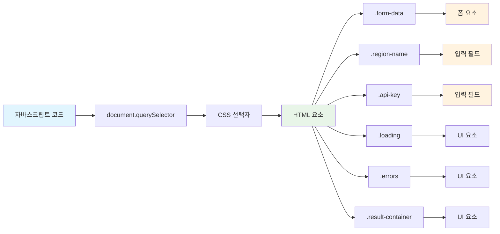
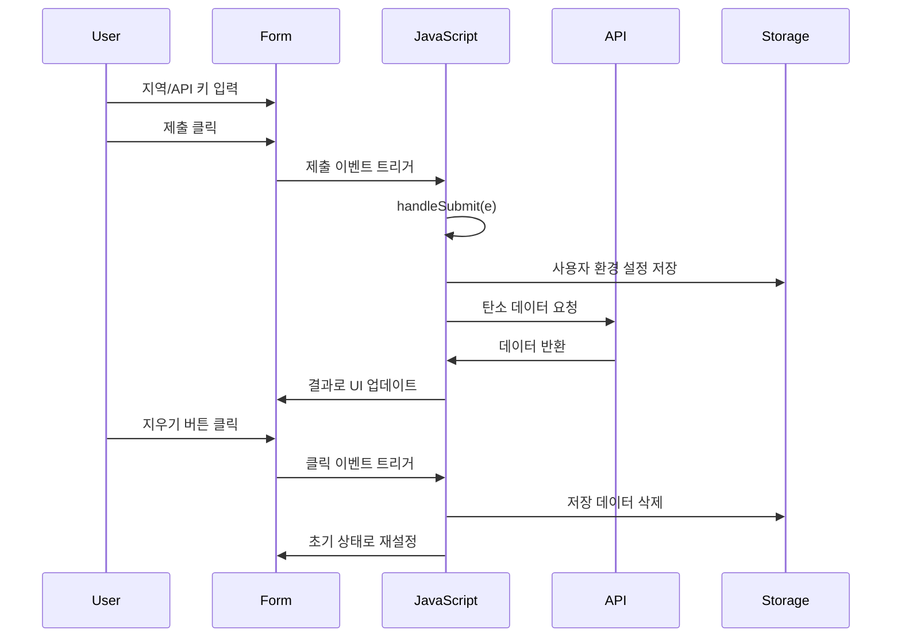
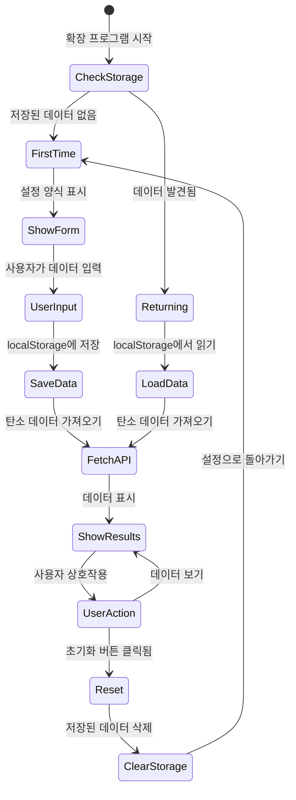
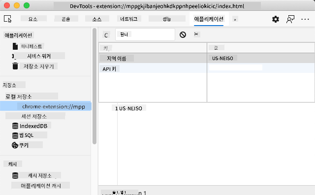
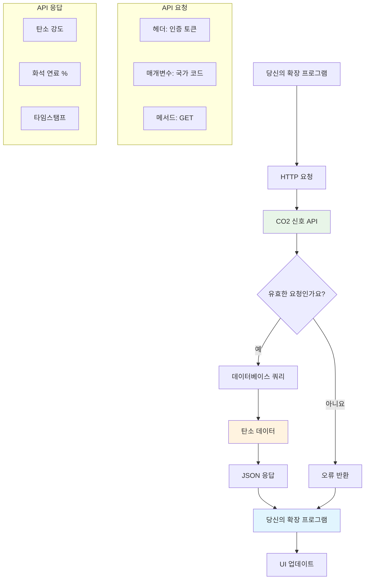
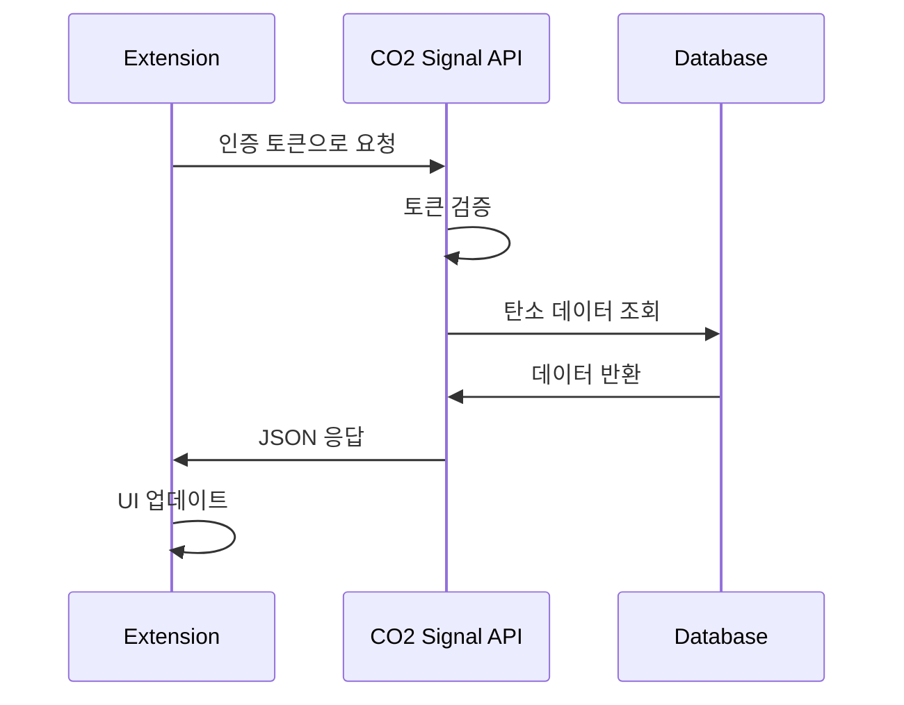
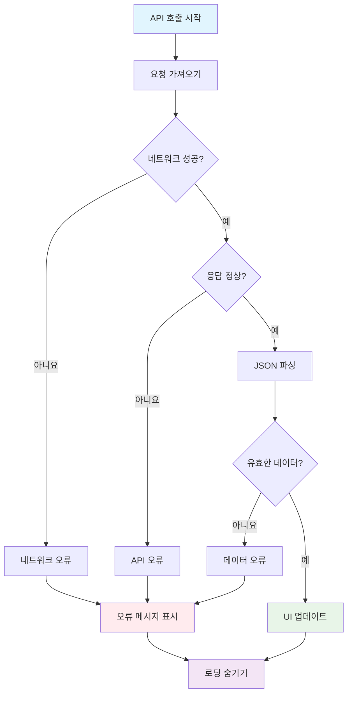
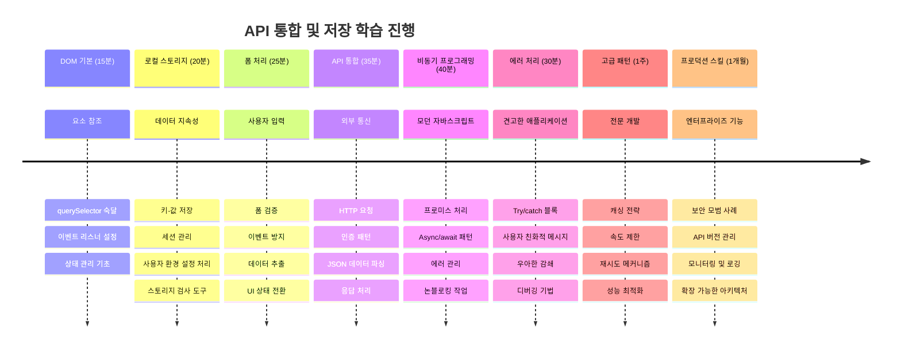

<!--
CO_OP_TRANSLATOR_METADATA:
{
  "original_hash": "2b6203a48c48d8234e0948353b47d84e",
  "translation_date": "2026-01-06T15:12:36+00:00",
  "source_file": "5-browser-extension/2-forms-browsers-local-storage/README.md",
  "language_code": "ko"
}
-->
# 브라우저 확장 프로젝트 파트 2: API 호출 및 로컬 스토리지 사용


## 강의 전 퀴즈

[강의 전 퀴즈](https://ff-quizzes.netlify.app/web/quiz/25)

## 소개

만들기 시작한 브라우저 확장 기억하시나요? 지금은 보기 좋은 폼이 있지만, 사실상 정적인 상태입니다. 오늘은 실시간 데이터와 연결하고 메모리를 부여해 확장에 생명을 불어넣을 것입니다.

아폴로 미션 컨트롤 컴퓨터를 생각해 보세요 - 고정된 정보만 표시한 것이 아니라 우주선과 지속적으로 통신하고 원격 측정 데이터를 업데이트하며 중요한 미션 파라미터를 기억했습니다. 오늘 만들려는 것은 바로 그런 동적인 동작입니다. 확장은 인터넷에 접속해 실제 환경 데이터를 가져오고 다음 사용을 위해 설정을 기억할 것입니다.

API 통합은 복잡해 보일 수 있지만, 본질은 코드가 다른 서비스와 통신하는 법을 배우는 것입니다. 오늘처럼 날씨 데이터, 소셜 미디어 피드, 탄소 배출량 정보 등을 가져오는 작업도 모두 이런 디지털 연결고리를 만드는 일입니다. 또 브라우저가 정보를 지속적으로 저장하는 방법도 탐구할 건데, 도서관이 카드 카탈로그로 책 위치를 기억하던 것과 비슷합니다.

이 강의가 끝나면 실제 데이터를 가져오고 사용자 환경 설정을 저장하며 부드러운 경험을 제공하는 브라우저 확장을 갖게 됩니다. 시작해 봅시다!


✅ 적절한 파일의 번호 매겨진 세그먼트를 따라가며 코드를 어디에 넣을지 확인하세요

## 확장에서 조작할 요소 설정하기

JavaScript가 인터페이스를 조작하려면 특정 HTML 요소에 대한 참조가 필요합니다. 망원경이 특정 별을 가리켜야 하듯이 — 갈릴레이가 목성의 위성을 연구하기 전에 목성 자체를 찾아 집중해야 했던 것과 같습니다.

`index.js` 파일에서 중요한 폼 요소 각각을 참조하는 `const` 변수를 만듭니다. 이는 과학자들이 장비에 이름을 붙여 매번 실험실 전체를 뒤지는 대신 필요할 때 바로 접근하는 것과 흡사합니다.


```javascript
// 폼 필드
const form = document.querySelector('.form-data');
const region = document.querySelector('.region-name');
const apiKey = document.querySelector('.api-key');

// 결과들
const errors = document.querySelector('.errors');
const loading = document.querySelector('.loading');
const results = document.querySelector('.result-container');
const usage = document.querySelector('.carbon-usage');
const fossilfuel = document.querySelector('.fossil-fuel');
const myregion = document.querySelector('.my-region');
const clearBtn = document.querySelector('.clear-btn');
```

**이 코드가 하는 일:**
- **document.querySelector()**와 CSS 클래스 선택자로 폼 요소를 캡처
- 지역 이름과 API 키 입력 필드 참조 생성
- 탄소 사용량 데이터 결과 표시 요소 연결
- 로딩 표시기와 오류 메시지 같은 UI 요소 접근 설정
- 각 요소 참조를 `const` 변수에 저장해 코드 전체에서 쉽게 재사용

## 이벤트 리스너 추가하기

이제 확장이 사용자 행동에 반응하게 만들 차례입니다. 이벤트 리스너는 코드가 사용자 상호작용을 감시하는 방법입니다. 초기 전화 교환기의 교환원들이 걸려오는 전화를 듣고 연결해 주던 것과 비슷합니다.


```javascript
form.addEventListener('submit', (e) => handleSubmit(e));
clearBtn.addEventListener('click', (e) => reset(e));
init();
```

**이 개념 이해하기:**
- 폼에 제출(submit) 리스너가 연결되어 사용자가 엔터를 누르거나 제출 버튼을 클릭할 때 작동
- 초기화 버튼 클릭 리스너가 연결되어 폼을 리셋
- 이벤트 객체 `(e)`를 핸들러 함수에 전달해 추가 제어 가능
- `init()` 함수를 즉시 호출해 확장 초기 상태를 설정

✅ 여기서는 단축형 화살표 함수 문법을 사용했습니다. 모던 자바스크립트 방식으로 전통적 함수 표현보다 깔끔하지만 둘 다 잘 작동합니다!

### 🔄 **교육적 점검**
**이벤트 핸들링 이해도**: 초기화로 넘어가기 전 확인하세요:
- ✅ `addEventListener`가 사용자 행동과 JS 함수 연결 방식을 설명할 수 있는가
- ✅ 왜 이벤트 객체 `(e)`를 핸들러에 전달하는지 이해하는가
- ✅ `submit`과 `click` 이벤트 차이를 구분하는가
- ✅ `init()` 함수가 언제 실행되고 왜 그런지 설명할 수 있는가

**빠른 자기 테스트**: 폼 제출 시 `e.preventDefault()`를 잊으면 어떻게 될까요?
*답: 페이지가 새로고침되어 모든 JS 상태가 사라지고 사용자 경험이 방해받음*

## 초기화 및 리셋 함수 만들기

확장의 초기화 로직을 만들어 봅시다. `init()` 함수는 선박의 내비게이션 시스템이 계기를 점검하는 것과 같아요 — 현재 상태를 판단해서 인터페이스를 조정합니다. 이전에 사용자가 확장을 쓴 적이 있는지 확인하고 저장된 설정을 불러옵니다.

`reset()` 함수는 과학자들이 실험 사이에 장비를 초기화해 깨끗한 데이터를 확보하는 것과 비슷하게 사용자에게 새 출발을 제공합니다.

```javascript
function init() {
	// 사용자가 이전에 API 자격 증명을 저장했는지 확인합니다
	const storedApiKey = localStorage.getItem('apiKey');
	const storedRegion = localStorage.getItem('regionName');

	// 확장 아이콘을 일반적인 녹색으로 설정합니다 (향후 수업을 위한 자리 표시자)
	// TODO: 다음 수업에서 아이콘 업데이트 구현

	if (storedApiKey === null || storedRegion === null) {
		// 처음 사용자: 설정 양식을 표시합니다
		form.style.display = 'block';
		results.style.display = 'none';
		loading.style.display = 'none';
		clearBtn.style.display = 'none';
		errors.textContent = '';
	} else {
		// 기존 사용자: 저장된 데이터를 자동으로 불러옵니다
		displayCarbonUsage(storedApiKey, storedRegion);
		results.style.display = 'none';
		form.style.display = 'none';
		clearBtn.style.display = 'block';
	}
}

function reset(e) {
	e.preventDefault();
	// 저장된 지역을 지워 사용자가 새 위치를 선택할 수 있도록 합니다
	localStorage.removeItem('regionName');
	// 초기화 과정을 재시작합니다
	init();
}
```

**여기에서 일어나는 일을 해체해 보면:**
- 브라우저 로컬 스토리지에서 저장된 API 키와 지역 정보를 불러옵니다
- 처음 사용자(저장된 자격 증명 없음)인지, 재방문 사용자인지 판단합니다
- 새 사용자용 설정 폼을 표시하고 나머지 UI 요소는 숨깁니다
- 재방문 사용자라면 저장된 데이터를 자동으로 로드하고 리셋 옵션 표시
- 사용 가능한 데이터에 따라 UI 상태를 관리

**로컬 스토리지 주요 개념:**
- 브라우저 세션 간 데이터를 지속 저장 (세션 스토리지와는 다름)
- `getItem()`, `setItem()`으로 키-값 쌍 저장
- 키에 해당하는 데이터가 없으면 `null` 반환
- 사용자 선호 설정과 설정값 등을 기억하는 간단한 방법 제공

> 💡 **브라우저 저장소 이해하기**: [LocalStorage](https://developer.mozilla.org/docs/Web/API/Window/localStorage)는 확장에 지속 메모리를 부여하는 셈입니다. 고대 알렉산드리아 도서관이 두루마리를 보관해 학자들이 떠났다가 돌아와도 정보를 얻을 수 있었던 것처럼 말이죠.
>
> **주요 특징:**
> - 브라우저를 닫아도 데이터가 유지됩니다
> - 컴퓨터 재시작 및 브라우저 충돌 후에도 살아남습니다
> - 사용자 설정 저장에 충분한 공간을 제공합니다
> - 네트워크 지연 없이 즉시 액세스 가능합니다

> **중요 참고사항**: 브라우저 확장에는 일반 웹페이지와 분리된 독립적인 로컬 스토리지가 있습니다. 이는 보안을 제공하고 다른 웹사이트와 충돌을 방지합니다.

브라우저 개발자 도구(F12)를 열고 **Application** 탭에서 **Local Storage** 섹션을 확장하면 저장된 데이터를 볼 수 있습니다.




> ⚠️ **보안 고려사항**: 실제 애플리케이션에서는 로컬 스토리지에 API 키를 저장하는 것이 위험할 수 있습니다. JavaScript가 이 데이터를 접근할 수 있기 때문입니다. 학습 목적에는 적합하지만 실제 앱은 민감한 자격 증명을 서버 측 안전 저장소에 보관해야 합니다.

## 폼 제출 처리하기

이제 사용자가 폼을 제출할 때 무슨 일이 벌어지는지 처리해 봅시다. 기본적으로 브라우저는 폼 제출 시 페이지를 새로고침하지만, 우리는 이 동작을 가로채 부드러운 경험을 만듭니다.

이는 미션 컨트롤이 우주선 통신을 다루는 방식과 비슷합니다 — 매번 전송 시마다 전체 시스템을 재설정하지 않고 새로운 정보를 처리하는 동안 계속 운영합니다.

폼 제출 이벤트를 캡처하고 사용자 입력을 추출하는 함수를 만듭니다:

```javascript
function handleSubmit(e) {
	e.preventDefault();
	setUpUser(apiKey.value, region.value);
}
```

**위 코드에서:**
- 페이지 새로고침을 막는 기본 폼 제출 동작을 방지
- API 키와 지역 입력값을 추출
- `setUpUser()` 함수에 폼 데이터를 전달해 처리
- 단일 페이지 애플리케이션처럼 페이지 리로드 없이 동작 유지

✅ HTML 폼 필드에 `required` 속성이 있어, 브라우저가 사용자가 API 키와 지역을 모두 입력했는지 자동으로 확인합니다.

## 사용자 환경 설정 저장

`setUpUser` 함수는 사용자의 인증 정보를 저장하고 첫 API 호출을 시작합니다. 이렇게 하면 설정에서 결과 표시로 자연스러운 전환이 이루어집니다.

```javascript
function setUpUser(apiKey, regionName) {
	// 향후 세션을 위해 사용자 자격 증명 저장
	localStorage.setItem('apiKey', apiKey);
	localStorage.setItem('regionName', regionName);
	
	// 로딩 상태를 표시하도록 UI 업데이트
	loading.style.display = 'block';
	errors.textContent = '';
	clearBtn.style.display = 'block';
	
	// 사용자 자격 증명으로 탄소 사용량 데이터 가져오기
	displayCarbonUsage(apiKey, regionName);
}
```

**순서대로 무슨 일이 일어나는지:**
- API 키와 지역명을 로컬 스토리지에 저장해 다음 사용에도 활용
- 데이터 요청 중임을 알리는 로딩 표시기 보여주기
- 이전 오류 메시지를 화면에서 지우기
- 나중에 설정을 초기화할 수 있도록 클리어 버튼 표시
- 실제 탄소 사용량 데이터를 가져오는 API 호출 시작

이 함수는 데이터 유지와 UI 업데이트를 한 동작으로 관리해 매끄러운 사용자 경험을 만듭니다.

## 탄소 사용량 데이터 표시하기

이제 확장을 API를 통해 외부 데이터 소스와 연결합니다. 확장이 독립 도구에서 인터넷 전역의 실시간 정보를 접근하는 도구로 변신하는 거죠.

**API 이해하기**

[API](https://www.webopedia.com/TERM/A/API.html)는 서로 다른 애플리케이션 간 통신하는 방법입니다. 19세기 도시 간 전보 시스템처럼 생각해 보세요 — 운영자가 먼 역에 요청을 보내고 요청받은 정보를 받았습니다. 소셜 미디어 확인, 음성 비서 질문, 배달 앱 사용 할 때마다 API가 이런 데이터 교환을 돕고 있습니다.


**REST API 주요 개념:**
- **REST**는 'Representational State Transfer'의 약자
- 데이터와 상호작용하는 표준 HTTP 메서드(GET, POST, PUT, DELETE) 사용
- 일반적으로 JSON 같은 예측 가능한 형식으로 데이터 반환
- 다양한 요청 형식을 위한 일관된 URL 기반 엔드포인트 제공

✅ 오늘 사용할 [CO2 Signal API](https://www.co2signal.com/)는 전 세계 전력망의 실시간 탄소 집약도 데이터를 제공합니다. 사용자들이 전기 사용의 환경 영향을 이해하는 데 도움을 줍니다!

> 💡 **비동기 자바스크립트 이해**: [`async` 키워드](https://developer.mozilla.org/docs/Web/JavaScript/Reference/Statements/async_function)는 여러 작업을 동시에 다룰 수 있게 합니다. 서버에 데이터를 요청할 때 확장 전체가 멈추지 않고, 마치 항공 관제센터가 한 비행기 답변 기다리느라 모든 작동을 중지하지 않는 것과 같습니다.
>
> **주요 장점:**
> - 데이터 로드하는 동안 확장이 반응성을 유지
> - 네트워크 요청 중 다른 코드가 계속 실행 가능
> - 전통 콜백 방식보다 코드 가독성 향상
> - 네트워크 문제에 대해 우아한 오류 처리 가능

`async`에 관한 간단한 영상입니다:

[](https://youtube.com/watch?v=YwmlRkrxvkk "Async and Await for managing promises")

> 🎥 async/await 관련 영상을 보려면 위 이미지를 클릭하세요.

### 🔄 **교육적 점검**
**비동기 프로그래밍 이해**: API 함수로 들어가기 전 확인할 점:
- ✅ 왜 확장 전체가 멈추지 않도록 `async/await`를 쓰는지
- ✅ `try/catch` 블록이 네트워크 오류를 우아하게 처리하는 방식
- ✅ 동기식과 비동기식 작업의 차이점
- ✅ API 호출 실패가 일어날 수 있고 이를 어떻게 처리하는지

**실생활 예시 비동기 프로세스**:
- **음식 주문**: 주방 앞에서 기다리지 않고 영수증 받고 다른 일 진행
- **이메일 전송**: 전송 중에도 앱 멈추지 않고 더 많은 메일 작성 가능
- **웹페이지 로딩**: 글자가 먼저 보이고 이미지가 점차 로드됨

**API 인증 흐름**:

탄소 사용량 데이터를 가져오고 표시하는 함수 만들기:

```javascript
// 최신 fetch API 방식 (외부 종속성 필요 없음)
async function displayCarbonUsage(apiKey, region) {
	try {
		// CO2 Signal API에서 탄소 강도 데이터 가져오기
		const response = await fetch('https://api.co2signal.com/v1/latest', {
			method: 'GET',
			headers: {
				'auth-token': apiKey,
				'Content-Type': 'application/json'
			},
			// 특정 지역에 대한 쿼리 매개변수 추가
			...new URLSearchParams({ countryCode: region }) && {
				url: `https://api.co2signal.com/v1/latest?countryCode=${region}`
			}
		});

		// API 요청이 성공했는지 확인
		if (!response.ok) {
			throw new Error(`API request failed: ${response.status}`);
		}

		const data = await response.json();
		const carbonData = data.data;

		// 반올림된 탄소 강도 값 계산
		const carbonIntensity = Math.round(carbonData.carbonIntensity);

		// 가져온 데이터로 사용자 인터페이스 업데이트
		loading.style.display = 'none';
		form.style.display = 'none';
		myregion.textContent = region.toUpperCase();
		usage.textContent = `${carbonIntensity} grams (grams CO₂ emitted per kilowatt hour)`;
		fossilfuel.textContent = `${carbonData.fossilFuelPercentage.toFixed(2)}% (percentage of fossil fuels used to generate electricity)`;
		results.style.display = 'block';

		// TODO: calculateColor(carbonIntensity) - 다음 레슨에서 구현

	} catch (error) {
		console.error('Error fetching carbon data:', error);
		
		// 사용자 친화적인 오류 메시지 표시
		loading.style.display = 'none';
		results.style.display = 'none';
		errors.textContent = 'Sorry, we couldn\'t fetch data for that region. Please check your API key and region code.';
	}
}
```

**여기서 일어나는 일을 자세히 보면:**
- Axios 같은 외부 라이브러리 없이 최신 `fetch()` API 사용, 의존성 없이 깔끔함
- `response.ok`로 API 오류 신속 발견
- `async/await`로 비동기 작동 체계적 관리, 가독성 향상
- `auth-token` 헤더로 CO2 Signal API 인증 수행
- JSON 응답을 파싱해 탄소 집약도 정보 추출
- 환경 데이터를 여러 UI 요소에 형식 맞춰 업데이트
- API 호출 실패 시 사용자 친화적 오류 메시지 제공

**시연된 최신 자바스크립트 개념들:**
- `${}` 구문을 사용한 템플릿 리터럴로 깔끔한 문자열 조합
- try/catch 블록으로 견고한 오류 처리
- 비동기 네트워크 요청을 위한 async/await 패턴
- API 응답에서 필요한 데이터만 추출하는 객체 구조 분해
- 다중 DOM 조작을 간결하게 처리하는 메서드 체이닝

✅ 이 함수는 외부 서버와 소통하고, 인증 처리하며, 데이터를 가공하고, UI를 갱신하고, 오류를 우아하게 관리하는 중요 웹 개발 개념을 보여줍니다. 전문 개발자가 자주 사용하는 기본기입니다.


### 🔄 **교육적 점검**
**전체 시스템 이해도**: 전체 흐름을 숙지했는지 확인:
- ✅ DOM 참조가 어떻게 자바스크립트가 인터페이스를 제어하는지
- ✅ 로컬 스토리지가 브라우저 세션 간 지속성을 만드는 원리
- ✅ async/await가 확장을 멈추지 않고 API 호출하는 방식
- ✅ API 호출 실패 시 일어나는 상황과 오류 처리 방법
- ✅ 사용자 경험에 로딩 상태와 오류 메시지가 왜 필요한지

🎉 **성취한 것들:** 당신은 인터넷과 연결해 실제 환경 데이터를 가져오고,
- **사용자 설정을 세션 간 유지하고**
- **오류는 우아하게 처리하며**
- **부드럽고 전문적인 사용자 경험을 제공하는** 브라우저 확장을 만들었어요

`npm run build`를 실행하고 브라우저에서 확장을 새로고침해서 잘 작동하는지 테스트하세요. 이제 기능하는 탄소 발자국 추적기가 완성되었습니다. 다음 강의에서는 다이나믹 아이콘 기능을 추가하여 확장을 마무리할 것입니다.

---

## GitHub Copilot Agent 챌린지 🚀

Agent 모드를 사용해 다음 챌린지를 완료하세요:
**설명:** 브라우저 확장 프로그램을 개선하여 오류 처리 향상 및 사용자 경험 기능을 추가하세요. 이 챌린지는 현대적인 자바스크립트 패턴을 사용하여 API, 로컬 스토리지 및 DOM 조작을 다루는 연습을 도와줍니다.

**프롬프트:** 다음을 포함하는 향상된 displayCarbonUsage 함수 버전을 작성하세요: 1) 지수 백오프를 사용하는 실패한 API 호출 재시도 메커니즘, 2) API 호출 전에 지역 코드 입력 검증, 3) 진행 표시기가 포함된 로딩 애니메이션, 4) 만료 타임스탬프가 있는 localStorage에 API 응답 캐싱(30분 동안 캐시), 5) 이전 API 호출의 히스토리컬 데이터 표시 기능. 또한 모든 함수 매개변수와 반환 타입을 문서화하는 적절한 TypeScript 스타일 JSDoc 주석을 추가하세요.

[agent mode](https://code.visualstudio.com/blogs/2025/02/24/introducing-copilot-agent-mode)에 대해 자세히 알아보세요.

## 🚀 챌린지

웹 개발을 위해 이용 가능한 다양한 브라우저 기반 API를 탐색하여 API에 대한 이해를 확장하세요. 다음 브라우저 API 중 하나를 선택하여 작은 데모를 만드세요:

- [Geolocation API](https://developer.mozilla.org/docs/Web/API/Geolocation_API) - 사용자의 현재 위치 확인
- [Notification API](https://developer.mozilla.org/docs/Web/API/Notifications_API) - 데스크탑 알림 전송
- [HTML Drag and Drop API](https://developer.mozilla.org/docs/Web/API/HTML_Drag_and_Drop_API) - 인터랙티브 드래그 인터페이스 생성
- [Web Storage API](https://developer.mozilla.org/docs/Web/API/Web_Storage_API) - 고급 로컬 스토리지 기법
- [Fetch API](https://developer.mozilla.org/docs/Web/API/Fetch_API) - XMLHttpRequest의 현대적 대안

**연구할 질문들:**
- 이 API는 어떤 실제 문제를 해결하는가?
- API는 오류와 극단적인 경우를 어떻게 처리하는가?
- 이 API를 사용할 때 어떤 보안 고려사항이 있는가?
- 이 API는 다양한 브라우저에서 얼마나 광범위하게 지원되는가?

연구 후, 개발자 친화적이고 신뢰할 수 있는 API의 특성을 파악하세요.

## 강의 후 퀴즈

[강의 후 퀴즈](https://ff-quizzes.netlify.app/web/quiz/26)

## 복습 & 자율 학습

이번 강의에서는 LocalStorage와 API에 대해 배웠으며, 두 가지 모두 전문 웹 개발자에게 매우 유용합니다. 이 두 가지가 어떻게 함께 작동하는지 생각해 보세요. API에서 사용할 항목들을 저장하는 웹 사이트를 어떻게 설계할지 고민해보세요.

### ⚡ **다음 5분 안에 할 수 있는 것**
- [ ] 개발자 도구의 Application 탭을 열고 어떤 웹사이트든 localStorage 탐색하기
- [ ] 간단한 HTML 폼을 만들고 브라우저에서 폼 검증 테스트 수행하기
- [ ] 브라우저 콘솔에서 localStorage를 사용해 데이터 저장 및 조회 시도하기
- [ ] 네트워크 탭을 사용하여 제출되는 폼 데이터 검사하기

### 🎯 **이번 시간에 달성할 수 있는 것**
- [ ] 강의 후 퀴즈 완료 및 폼 처리 개념 이해
- [ ] 사용자 설정을 저장하는 브라우저 확장 프로그램 폼 만들기
- [ ] 유용한 오류 메시지를 포함한 클라이언트 측 폼 검증 구현
- [ ] 확장 프로그램 데이터 영속성을 위한 chrome.storage API 연습
- [ ] 저장된 사용자 설정에 반응하는 사용자 인터페이스 만들기

### 📅 **이번 주간 확장 프로그램 개발**
- [ ] 폼 기능을 갖춘 완전한 기능의 브라우저 확장 만들기
- [ ] 로컬, 동기(sync), 세션 스토리지 등의 다양한 저장 옵션 마스터하기
- [ ] 자동 완성 및 검증 같은 고급 폼 기능 구현하기
- [ ] 사용자 데이터의 임포트/익스포트 기능 추가하기
- [ ] 다양한 브라우저에서 확장 프로그램 철저하게 테스트하기
- [ ] 확장 프로그램의 사용자 경험과 오류 처리 다듬기

### 🌟 **이번 달 웹 API 전문성 쌓기**
- [ ] 다양한 브라우저 저장 API를 사용한 복잡한 애플리케이션 구축
- [ ] 오프라인 우선 개발 패턴 학습
- [ ] 데이터 영속성 관련 오픈 소스 프로젝트 기여
- [ ] 개인정보 중심 개발과 GDPR 준수 전문가 되기
- [ ] 폼 처리 및 데이터 관리를 위한 재사용 가능한 라이브러리 제작
- [ ] 웹 API와 확장 프로그램 개발 관련 지식 공유

## 🎯 확장 프로그램 개발 마스터 타임라인


### 🛠️ 풀스택 개발 도구 요약

이 강의를 완료한 후, 다음을 갖추게 되었습니다:
- **DOM 마스터리**: 정확한 요소 선택 및 조작
- **저장 전문성**: localStorage를 이용한 영속적 데이터 관리
- **API 통합**: 실시간 데이터 가져오기 및 인증 구현
- **비동기 프로그래밍**: 현대 자바스크립트로 블로킹 없는 작업 수행
- **오류 처리**: 실패를 우아하게 처리하는 견고한 애플리케이션
- **사용자 경험**: 로딩 상태, 검증 및 부드러운 상호작용
- **현대 패턴**: fetch API, async/await 및 ES6+ 기능

**얻은 전문 기술**: 다음 분야에서 사용되는 패턴을 구현했습니다:
- **웹 애플리케이션**: 외부 데이터 소스를 가진 싱글 페이지 앱
- **모바일 개발**: 오프라인 기능이 포함된 API 기반 앱
- **데스크탑 소프트웨어**: 영속 저장소를 갖춘 Electron 앱
- **기업 시스템**: 인증, 캐싱, 오류 처리
- **최신 프레임워크**: React/Vue/Angular 데이터 관리 패턴

**다음 단계**: 캐싱 전략, 실시간 WebSocket 연결, 복잡한 상태 관리 같은 고급 주제를 탐색할 준비가 되었습니다!

## 과제

[API 채택하기](assignment.md)

---

<!-- CO-OP TRANSLATOR DISCLAIMER START -->
**면책 조항**:  
이 문서는 AI 번역 서비스 [Co-op Translator](https://github.com/Azure/co-op-translator)를 사용하여 번역되었습니다. 정확성을 위해 노력하고 있지만 자동 번역은 오류나 부정확성이 포함될 수 있음을 유의하시기 바랍니다. 원문은 해당 언어의 공식 문서로 간주되어야 합니다. 중요한 정보의 경우 전문 인력에 의한 번역을 권장합니다. 본 번역 사용으로 인한 오해나 잘못된 해석에 대해 당사는 책임을 지지 않습니다.
<!-- CO-OP TRANSLATOR DISCLAIMER END -->