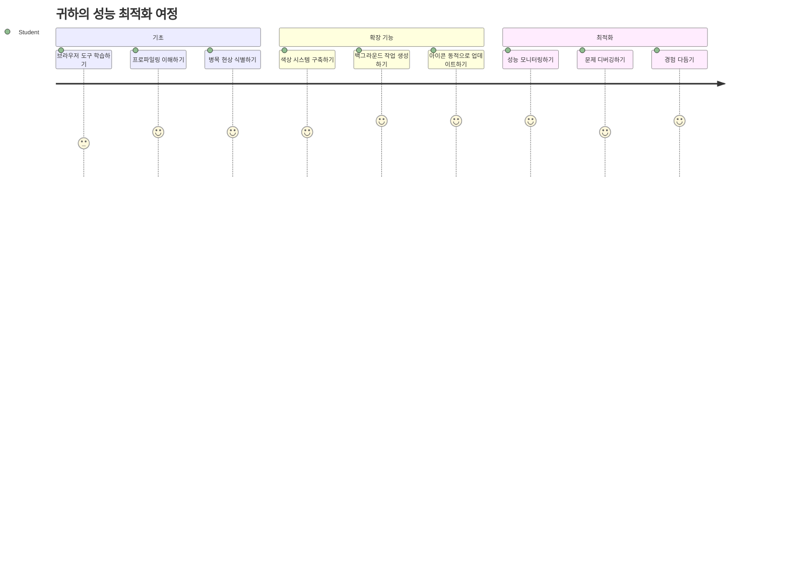
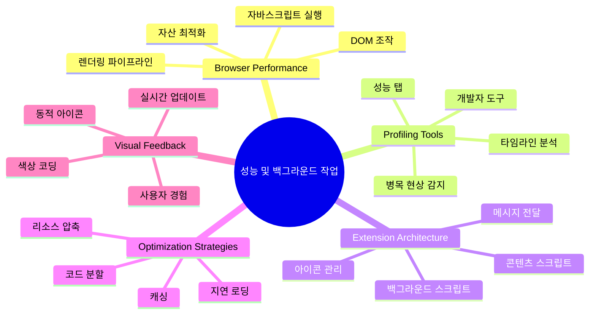
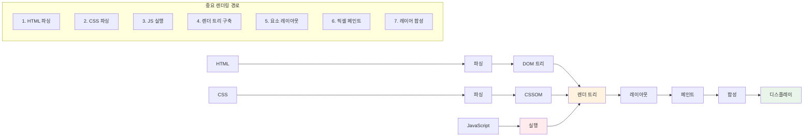
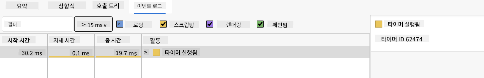
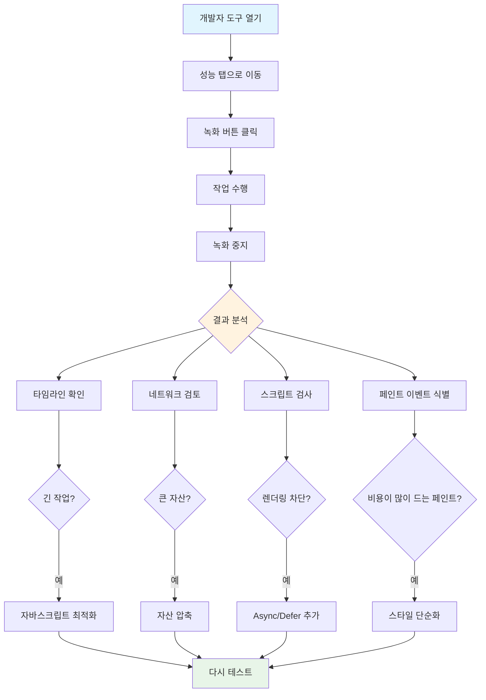
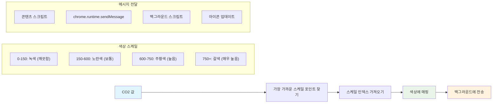
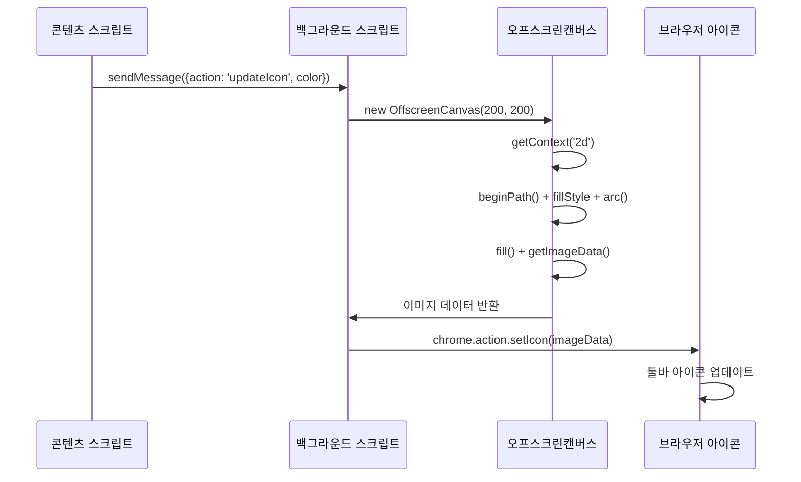
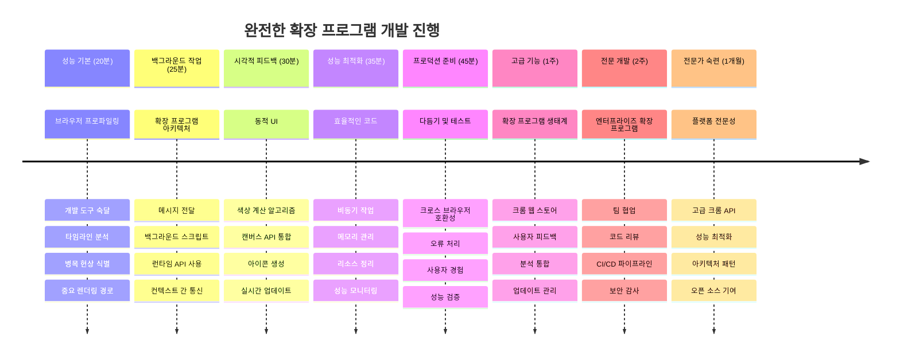

<!--
CO_OP_TRANSLATOR_METADATA:
{
  "original_hash": "b275fed2c6fc90d2b9b6661a3225faa2",
  "translation_date": "2026-01-06T15:16:21+00:00",
  "source_file": "5-browser-extension/3-background-tasks-and-performance/README.md",
  "language_code": "ko"
}
-->
# Browser Extension Project Part 3: 백그라운드 작업과 성능에 대해 배우기


어떤 브라우저 확장 프로그램은 빠르고 반응이 좋은데, 어떤 것은 느리다고 느껴본 적이 있나요? 그 비밀은 바로 배후에서 무슨 일이 일어나고 있는지에 있습니다. 사용자가 확장 프로그램의 인터페이스를 클릭하는 동안에도, 데이터 가져오기, 아이콘 업데이트, 시스템 리소스 관리 등의 백그라운드 프로세스가 조용히 작동하고 있습니다.

이것은 브라우저 확장 시리즈의 마지막 강의이며, 탄소 발자국 추적기가 부드럽게 작동하도록 만들 것입니다. 동적인 아이콘 업데이트를 추가하고, 문제로 발전하기 전에 성능 문제를 발견하는 방법을 배울 것입니다. 레이스카를 조정하는 것과 같아서 작은 최적화가 전체 작동 방식에 큰 차이를 만들 수 있습니다.

마지막에 우리는 완성된 확장 프로그램을 갖게 되며, 좋은 웹 앱과 훌륭한 웹 앱을 구분하는 성능 원칙을 이해하게 될 것입니다. 브라우저 최적화의 세계로 뛰어들어 봅시다.

## 강의 전 퀴즈

[강의 전 퀴즈](https://ff-quizzes.netlify.app/web/quiz/27)

### 소개

이전 강의에서, 폼을 만들고 API에 연결하고 비동기 데이터 가져오기를 다뤘습니다. 확장 프로그램의 형태가 잘 잡히고 있습니다.

이제 마무리 작업을 해야 합니다 - 예를 들어 탄소 데이터에 따라 확장 아이콘의 색상이 바뀌도록 만드는 것처럼요. 이건 마치 NASA가 아폴로 우주선의 모든 시스템을 최적화해야 했던 상황을 떠올리게 합니다. 그들은 낭비되는 사이클이나 메모리가 없어야 했는데, 성능에 따라 사람이 목숨을 걸고 있었기 때문입니다. 우리 브라우저 확장 프로그램은 그렇게까지 치명적이지는 않지만, 같은 원리가 적용됩니다 - 효율적인 코드는 더 나은 사용자 경험을 만듭니다.


## 웹 성능 기본

코드가 효율적으로 실행될 때, 사람들은 실제로 그 차이를 *느낄* 수 있습니다. 페이지가 즉시 로드되거나 애니메이션이 부드럽게 흐르는 순간을 아시나요? 그것이 좋은 성능의 증거입니다.

성능은 단지 속도만의 문제가 아니라 - 뻣뻣하고 답답한 대신 자연스럽게 느껴지는 웹 경험을 만드는 것입니다. 컴퓨팅 초기 시절, 그레이스 호퍼는 10억분의 1초 동안 빛이 이동하는 거리를 보여주기 위해 나노초(약 1피트 길이의 와이어)를 책상에 두곤 했습니다. 이로써 컴퓨팅에서 마이크로초가 왜 중요한지 설명했습니다. 이제 무엇이 성능을 저해하는지 알아내는 탐정 도구들을 살펴봅시다.

> "웹사이트 성능은 두 가지입니다: 페이지가 얼마나 빨리 로드되는지, 그리고 코드가 얼마나 빨리 실행되는지." -- [Zack Grossbart](https://www.smashingmagazine.com/2012/06/javascript-profiling-chrome-developer-tools/)

웹사이트를 온갖 기기와 사용자, 상황에서 눈부시게 빠르게 만드는 방법에 대한 주제는 당연히 방대합니다. 다음은 표준 웹 프로젝트나 브라우저 확장 프로그램을 만들 때 기억할 몇 가지 사항입니다.

사이트를 최적화하기 위한 첫걸음은 실제 내부에서 무슨 일이 벌어지는지 이해하는 것입니다. 다행히도, 브라우저에는 강력한 탐정 도구들이 내장되어 있습니다.


Edge에서 개발자 도구를 열려면, 오른쪽 상단의 점 세 개를 클릭한 후, More Tools > Developer Tools로 이동하세요. 또는 단축키를 사용하세요: Windows에서는 `Ctrl` + `Shift` + `I`, Mac에서는 `Option` + `Command` + `I`입니다. 도구가 열리면 Performance 탭을 클릭하세요 - 여기서 조사가 이루어집니다.

**여기 당신의 성능 탐정 도구 키트가 있습니다:**
- **개발자 도구 열기** (개발자로서 이 도구를 계속 사용하게 될 것입니다!)
- **Performance 탭으로 이동** - 웹 앱의 건강 상태 체크기라고 생각하세요
- **레코드 버튼 누르기** 그리고 페이지 동작 관찰하기
- **결과 연구하기** 무엇이 속도를 저하시킬지 찾아내기

해봅시다. 웹사이트(예: Microsoft.com)를 열고 'Record' 버튼을 클릭하세요. 이제 페이지를 새로 고침하고 프로파일러가 발생하는 모든 작업을 캡처하는 것을 지켜보세요. 녹화를 중단하면 브라우저가 사이트를 '스크립트', '렌더링', '페인팅' 하는 세부 분석 결과를 볼 수 있습니다. 이는 우주선 발사 시 미션 컨트롤이 모든 시스템을 모니터링하는 것과 비슷합니다 - 무엇이 언제 어떻게 일어나는지 실시간 데이터를 얻습니다.


✅ 더 깊이 배우고 싶다면 [Microsoft 문서](https://docs.microsoft.com/microsoft-edge/devtools-guide/performance/?WT.mc_id=academic-77807-sagibbon)를 참고하세요.

> 프로 팁: 브라우저 캐시를 테스트 전에 지우면 처음 방문하는 사용자에게 사이트가 어떻게 작동하는지 확인할 수 있습니다 - 보통 재방문 시와는 꽤 다릅니다!

프로파일 타임라인의 특정 부분을 선택해 페이지가 로드되는 동안 일어나는 이벤트를 확대해 보세요.

프로파일 타임라인의 일부를 선택하고 요약 창을 보면 페이지 성능의 스냅샷을 얻을 수 있습니다:


이벤트 로그 창에서 15ms 이상 걸린 이벤트가 있는지 확인하세요:



✅ 프로파일러에 익숙해지세요! 이 사이트에서 개발자 도구를 열어 병목 현상이 있는지 확인해 보세요. 가장 느린 로딩 자원은 무엇인가요? 가장 빠른 것은요?


## 프로파일링 시 주목할 점

프로파일러 실행은 시작일 뿐이고, 진짜 기술은 그 컬러풀한 차트들이 실제로 무엇을 말하는지 이해하는 것입니다. 걱정하지 마세요, 곧 익숙해질 것입니다. 숙련된 개발자들은 문제 발생 전에 경고 신호를 알아채는 법을 배웠습니다.

이제 웹 프로젝트에 숨어드는 성능 문제들의 전형적인 원인을 이야기해 봅시다. 마리 퀴리가 연구실의 방사선 수치를 조심스럽게 모니터링했듯이, 우리도 문제 징후가 보이는 특정 패턴을 경계해야 합니다. 조기 발견은 여러분과 사용자 모두의 많은 좌절을 막아줍니다.

**자산 크기**: 웹사이트가 점점 더 '무거워지고' 있는데, 많은 추가 무게는 이미지 때문입니다. 디지털 여행 가방에 점점 더 많은 것을 쑤셔 넣는 것과 같습니다.

✅ 페이지 크기가 시간에 따라 어떻게 커졌는지 보려면 [인터넷 아카이브](https://httparchive.org/reports/page-weight)를 확인하세요 - 꽤 흥미롭습니다.

**자산 최적화 방법은 다음과 같습니다:**
- **이미지 압축**! 최신 형식(WebP 등)은 파일 크기를 크게 줄여줍니다
- **기기별로 적절한 이미지 크기 제공** - 데스크톱용 큰 이미지를 휴대폰에 보낼 필요 없습니다
- **CSS와 JavaScript 축소** - 모든 바이트가 중요합니다
- **지연 로딩 사용**하여 사용자가 실제로 이미지를 스크롤할 때만 다운로드

**DOM 순회**: 브라우저는 작성한 코드에 따라 문서 객체 모델을 구축하므로, 좋은 페이지 성능을 위해 태그를 최소화하고, 페이지에 필요한 것만 사용 및 스타일링하는 것이 좋습니다. 예를 들어, 한 페이지에서만 필요한 스타일은 메인 스타일 시트에 포함하지 않는 등 필요 없는 CSS를 최적화할 수 있습니다.

**DOM 최적화 핵심 전략:**
- **HTML 요소와 중첩 정도 최소화**
- **사용하지 않는 CSS 규칙 제거 및 스타일시트 효율적으로 통합**
- **각 페이지에 필요한 스타일만 로드하도록 CSS 조직**
- **브라우저 분석에 유리하게 의미론적으로 HTML 구조화**

**JavaScript**: 모든 JavaScript 개발자는 '렌더링 차단' 스크립트를 주의해야 합니다. 이는 DOM을 순회하고 브라우저에 그리기 전에 반드시 로드되어야 하는 스크립트입니다. 인라인 스크립트에 `defer` 속성을 사용하는 것을 고려해 보세요(예: Terrarium 모듈에서).

**최신 JavaScript 최적화 기법:**
- **`defer` 속성으로 DOM 파싱 후 스크립트 로드**
- **코드 분할로 필요한 JavaScript만 로드**
- **비핵심 기능에 대해 지연 로딩 적용**
- **가능하면 무거운 라이브러리와 프레임워크 사용 최소화**

✅ [Site Speed Test 웹사이트](https://www.webpagetest.org/)에서 몇몇 사이트를 테스트하며 사이트 성능을 판단하는 일반적인 점검 방법을 더 배워보세요.

### 🔄 **학습 점검**
**성능 이해:** 확장 기능을 개발하기 전에 다음을 확인하세요:
- ✅ HTML에서 픽셀까지의 중요한 렌더링 경로 설명 가능
- ✅ 웹 애플리케이션에서 흔한 성능 병목 현상 식별 가능
- ✅ 브라우저 개발자 도구를 이용한 페이지 성능 프로파일링 가능
- ✅ 자산 크기와 DOM 복잡성이 속도에 미치는 영향 이해

**간단 자기진단**: 렌더링 차단 JavaScript가 있으면 무슨 일이 벌어지나요?
*답변: 브라우저가 HTML 파싱과 렌더링을 계속하기 전에 해당 스크립트를 다운로드하고 실행해야 합니다*

**실제 성능 영향:**
- **100ms 지연**: 사용자가 느림을 인지함
- **1초 지연**: 사용자가 집중력 잃기 시작
- **3초 이상**: 사용자 40% 페이지 이탈
- **모바일 네트워크에서는** 성능이 더 중요함

브라우저가 전송한 자산을 어떻게 렌더링하는지 이해했으니, 확장 기능 완성을 위해 마지막으로 해야 할 일들을 살펴봅시다:

### 색상을 계산하는 함수 만들기

이제 숫자 데이터를 의미 있는 색상으로 변환하는 함수를 만들겠습니다. 신호등 시스템과 비슷해서 - 초록은 청정 에너지, 빨강은 높은 탄소 강도를 나타냅니다.

이 함수는 API에서 받은 CO2 데이터를 토대로 환경 영향을 가장 잘 나타내는 색을 결정합니다. 이는 과학자들이 복잡한 데이터 패턴(해수 온도에서 별 형성까지)을 시각화하기 위해 열지도에서 색상을 사용하는 것과 유사합니다. `/src/index.js`에서 앞서 설정한 `const` 변수 바로 뒤에 이 함수를 추가해 봅시다:


```javascript
function calculateColor(value) {
	// CO2 강도 척도 정의 (킬로와트시당 그램)
	const co2Scale = [0, 150, 600, 750, 800];
	// 녹색(청정)에서 짙은 갈색(고탄소)까지 해당하는 색상
	const colors = ['#2AA364', '#F5EB4D', '#9E4229', '#381D02', '#381D02'];

	// 입력값과 가장 가까운 척도 값 찾기
	const closestNum = co2Scale.sort((a, b) => {
		return Math.abs(a - value) - Math.abs(b - value);
	})[0];
	
	console.log(`${value} is closest to ${closestNum}`);
	
	// 색상 매핑을 위한 인덱스 찾기
	const num = (element) => element > closestNum;
	const scaleIndex = co2Scale.findIndex(num);

	const closestColor = colors[scaleIndex];
	console.log(scaleIndex, closestColor);

	// 배경 스크립트에 색상 업데이트 메시지 전송
	chrome.runtime.sendMessage({ action: 'updateIcon', value: { color: closestColor } });
}
```

**이 영리한 함수 해부하기:**
- **두 개의 배열 설정** - 하나는 CO2 레벨용, 다른 하나는 색상용(초록 = 청정, 갈색 = 오염!)
- **실제 CO2 값과 가장 가까운 값 찾기** - 배열 정렬로 똑똑하게
- **matching 색상 인덱스 찾기** - findIndex() 메서드 활용
- **선택한 색상과 함께 Chrome 백그라운드 스크립트에 메시지 전송**
- **템플릿 리터럴(백틱) 사용**해 문자열 포맷 깔끔하게
- **모든 선언을 const로 관리해 깔끔하게 유지**

`chrome.runtime` [API](https://developer.chrome.com/extensions/runtime)는 확장 프로그램의 신경계와 같습니다 - 모든 배경 통신과 작업을 처리합니다:

> "chrome.runtime API를 사용해 백그라운드 페이지를 가져오고, 매니페스트 세부사항을 반환하며, 앱이나 확장 수명주기에서 이벤트를 듣고 응답할 수 있습니다. 또한 이 API를 사용하면 URL의 상대 경로를 완전한 URL로 변환할 수 있습니다."

**Chrome Runtime API가 유용한 이유:**
- **확장 프로그램의 여러 부분이 서로 통신할 수 있도록 해줌**
- **사용자 인터페이스를 멈추지 않고 백그라운드 작업 처리**
- **확장 프로그램 수명주기 이벤트 관리**
- **스크립트 간 메시지 전달을 매우 쉽게 만듦**

✅ Edge용 브라우저 확장을 개발한다면, 크롬 API를 사용한다는 사실이 다소 놀랍겠지만, 최신 Edge 브라우저가 크로미움 기반이므로 이 도구들을 활용할 수 있습니다.


> **프로 팁**: 브라우저 확장 성능을 프로파일링하려면, 확장 프로그램 자체 내에서 개발자 도구를 실행하세요. 확장은 별도의 브라우저 인스턴스라 확장 전용 성능 측정 정보를 볼 수 있습니다.

### 기본 아이콘 색상 설정하기

실제 데이터를 가져오기 전에 확장 프로그램에 시작점을 줍시다. 빈 아이콘이나 깨진 아이콘을 보는 사람은 없죠. 확장 프로그램을 설치한 순간부터 작동하고 있음을 사용자에게 알리기 위해 녹색으로 시작하겠습니다.

`init()` 함수 안에서 그 기본 녹색 아이콘을 설정합시다:

```javascript
chrome.runtime.sendMessage({
	action: 'updateIcon',
	value: {
		color: 'green',
	},
});
```

**이 초기화가 하는 일:**
- **중립적인 녹색을 기본 상태로 설정**
- **확장 프로그램이 로드될 때 즉각적인 시각적 피드백 제공**
- **백그라운드 스크립트와의 통신 패턴 확립**
- **데이터 로딩 전에 사용자가 기능하는 확장 프로그램을 보도록 보장**

### 함수 호출 및 실행

이제 새 CO2 데이터가 들어올 때마다 아이콘이 자동으로 알맞은 색으로 업데이트되도록 모든 것을 연결합시다. 전자 기기의 마지막 회로를 연결하는 것과 같아서, 개별 부품들이 하나의 시스템으로 작동하게 됩니다.

API에서 CO2 데이터를 가져온 직후 이 코드를 추가하세요:

```javascript
// API에서 CO2 데이터를 가져온 후
// let CO2 = data.data[0].intensity.actual;
calculateColor(CO2);
```

**이 통합이 하는 일:**
- **API 데이터 흐름과 시각적 표시 시스템 연결**
- **새 데이터가 들어올 때 아이콘 업데이트 자동 트리거**
- **실시간으로 현재 탄소 강도에 근거한 시각적 피드백 보장**
- **데이터 가져오기와 표시 로직 분리 유지**

마지막으로, `/dist/background.js`에 이 백그라운드 작업 호출을 위한 리스너를 추가하세요:

```javascript
// 콘텐츠 스크립트에서 오는 메시지를 수신합니다
chrome.runtime.onMessage.addListener(function (msg, sender, sendResponse) {
	if (msg.action === 'updateIcon') {
		chrome.action.setIcon({ imageData: drawIcon(msg.value) });
	}
});

// Canvas API를 사용하여 동적 아이콘을 그립니다
// 에너지 롤리팝 확장 기능에서 차용 - 멋진 기능입니다!
function drawIcon(value) {
	// 더 나은 성능을 위해 비가시 캔버스를 생성합니다
	const canvas = new OffscreenCanvas(200, 200);
	const context = canvas.getContext('2d');

	// 탄소 강도를 나타내는 색깔 원을 그립니다
	context.beginPath();
	context.fillStyle = value.color;
	context.arc(100, 100, 50, 0, 2 * Math.PI);
	context.fill();

	// 브라우저 아이콘용 이미지 데이터를 반환합니다
	return context.getImageData(50, 50, 100, 100);
}
```

**이 백그라운드 스크립트가 하는 일:**
- **메인 스크립트로부터 메시지 듣기 (접수원이 전화를 받는 것처럼)**
- **'updateIcon' 요청을 처리해 툴바 아이콘 변경**
- **Canvas API를 사용해 즉석에서 새로운 아이콘 생성**
- **현재 탄소 강도를 보여주는 간단한 색 원 그리기**
- **브라우저 툴바를 새 아이콘으로 업데이트**
- **OffscreenCanvas 사용으로 부드러운 성능 유지 (UI 차단 없음)**

✅ Canvas API에 대해 더 배우고 싶다면 [Space Game lessons](../../6-space-game/2-drawing-to-canvas/README.md)를 참고하세요.


### 🔄 **학습 점검**
**확장 프로그램 전체 이해**: 시스템 전체에 대한 숙련도를 확인하세요:
- ✅ 확장 프로그램의 다른 스크립트 간 메시지 전달은 어떻게 작동하나요?
- ✅ 성능 때문에 일반 캔버스 대신 OffscreenCanvas를 사용하는 이유는 무엇인가요?
- ✅ Chrome 런타임 API가 확장 아키텍처에서 어떤 역할을 하나요?
- ✅ 색상 계산 알고리즘이 데이터를 시각적 피드백에 어떻게 매핑하나요?

**성능 고려 사항**: 이제 확장 프로그램은 다음을 보여줍니다:
- **효율적인 메시지 전달**: 스크립트 컨텍스트 간의 깔끔한 통신
- **최적화된 렌더링**: OffscreenCanvas로 UI 블로킹 방지
- **실시간 업데이트**: 실시간 데이터에 따른 동적 아이콘 변경
- **메모리 관리**: 적절한 정리 및 리소스 처리

**확장 프로그램을 테스트할 시간입니다:**
- **모두 빌드** `npm run build`로
- **확장 프로그램을 다시 로드** 브라우저에서 (이 단계 잊지 마세요)
- **확장 프로그램을 열고** 아이콘이 색상을 바꾸는지 확인하세요
- **실제 전 세계 탄소 데이터에 어떻게 반응하는지 확인**

이제 이불 세탁하기 좋은 시간인지, 더 깨끗한 에너지를 기다려야 하는지 한눈에 알 수 있습니다. 실제로 유용한 무언가를 만들었고 브라우저 성능도 배웠습니다.

## GitHub Copilot 에이전트 챌린지 🚀

에이전트 모드를 사용하여 다음 챌린지를 완료하세요:

**설명:** 확장 프로그램의 성능 모니터링 기능을 향상시켜 확장 프로그램의 다양한 구성 요소가 로드되는 시간을 추적하고 표시하는 기능을 추가하세요.

**프롬프트:** CO2 데이터를 API에서 가져오기, 색상 계산, 아이콘 업데이트에 걸리는 시간을 Performance API를 이용해 측정하고 기록하는 `performanceTracker` 함수를 만드세요. 해당 함수는 브라우저 콘솔에 타임스탬프와 지속 시간 메트릭과 함께 결과를 표시해야 합니다.

에이전트 모드에 대해 더 알아보려면 [여기](https://code.visualstudio.com/blogs/2025/02/24/introducing-copilot-agent-mode)를 참고하세요.

## 🚀 챌린지

재미있는 탐정 미션입니다: 수년간 운영된 몇몇 오픈 소스 웹사이트(예: Wikipedia, GitHub, Stack Overflow)를 선택해 커밋 기록을 조사해보세요. 성능 개선을 한 흔적을 발견할 수 있나요? 어떤 문제가 계속 반복되었나요?

**조사 방법:**
- **커밋 메시지에서** "optimize", "performance", "faster" 같은 단어 검색
- **패턴 찾아보기** - 동일 유형 문제를 계속 해결했나요?
- **웹사이트를 느리게 하는 주요 원인** 파악
- **발견 내용 공유하기** - 다른 개발자들이 실제 사례에서 배울 수 있도록

## 강의 후 퀴즈

[강의 후 퀴즈](https://ff-quizzes.netlify.app/web/quiz/28)

## 복습 및 자기주도 학습

[성능 뉴스레터](https://perf.email/) 가입 고려해보세요

브라우저 웹 도구의 성능 탭을 살펴보면서 브라우저가 웹 성능을 측정하는 여러 방법을 조사해보세요. 주요 차이점이 있나요?

### ⚡ **다음 5분 안에 할 수 있는 일**
- [ ] 브라우저 작업 관리자 열기 (Chrome에서 Shift+Esc)로 확장 리소스 사용량 확인
- [ ] DevTools의 Performance 탭을 사용하여 웹페이지 성능 기록 및 분석
- [ ] 브라우저 확장 페이지에서 시작 시간에 영향을 주는 확장 찾아보기
- [ ] 확장 프로그램을 일시적으로 비활성화하여 성능 차이 확인

### 🎯 **이번 시간에 달성할 수 있는 목표**
- [ ] 수업 후 퀴즈 완료 및 성능 개념 이해
- [ ] 브라우저 확장용 백그라운드 스크립트 구현
- [ ] 효율적인 백그라운드 작업을 위한 browser.alarms 사용법 학습
- [ ] 콘텐츠 스크립트와 백그라운드 스크립트 간 메시지 전달 연습
- [ ] 확장 프로그램의 리소스 사용량 측정 및 최적화

### 📅 **한 주간 성능 여정**
- [ ] 백그라운드 기능 포함 고성능 브라우저 확장 완성
- [ ] 서비스 워커 및 최신 확장 아키텍처 마스터
- [ ] 효율적인 데이터 동기화 및 캐싱 전략 구현
- [ ] 확장 성능을 위한 고급 디버깅 기법 습득
- [ ] 기능과 리소스 효율성을 모두 고려한 최적화
- [ ] 확장 성능 시나리오에 대한 포괄적 테스트 제작

### 🌟 **한 달간 최적화 마스터 과정**
- [ ] 엔터프라이즈 수준의 최적화된 브라우저 확장 구축
- [ ] 웹 워커, 서비스 워커, 최신 웹 성능 기술 학습
- [ ] 성능 최적화에 집중한 오픈소스 프로젝트 기여
- [ ] 브라우저 내부 구조 및 고급 디버깅 스킬 마스터
- [ ] 성능 모니터링 도구 및 베스트 프랙티스 가이드 제작
- [ ] 웹 애플리케이션 최적화를 돕는 성능 전문가로 성장

## 🎯 당신의 브라우저 확장 마스터리 타임라인


### 🛠️ 완벽한 확장 개발 도구 모음

이 3부작을 완료한 후, 당신은 다음을 완벽히 이해했습니다:
- **브라우저 아키텍처**: 확장이 브라우저 시스템과 통합되는 깊은 이해
- **성능 프로파일링**: 개발자 도구를 이용해 병목 현상을 발견하고 해결
- **비동기 프로그래밍**: 응답성 높고 블로킹 없는 최신 자바스크립트 패턴
- **API 통합**: 인증 및 오류 처리를 포함한 외부 데이터 페치
- **시각적 디자인**: 동적 UI 업데이트 및 캔버스 기반 그래픽 생성
- **메시지 전달**: 확장 아키텍처 내 스크립트 간 통신
- **사용자 경험**: 로딩 상태, 오류 처리, 직관적 인터랙션
- **프로덕션 스킬**: 실제 배포를 위한 테스트, 디버깅, 최적화

**실무 적용 분야**: 확장 개발 기술은 다음에 직접 적용됩니다:
- **프로그레시브 웹 앱**: 유사한 아키텍처와 성능 패턴
- **Electron 데스크톱 앱**: 웹 기술을 활용한 크로스 플랫폼 앱
- **모바일 하이브리드 앱**: Cordova/PhoneGap 웹 API 개발
- **엔터프라이즈 웹 애플리케이션**: 복잡한 대시보드 및 생산성 도구
- **Chrome DevTools 확장**: 고급 개발자 도구 및 디버깅
- **웹 API 통합**: 외부 서비스와 통신하는 모든 앱

**전문가 영향력**: 이제 당신은:
- **프로덕션 준비 완료 브라우저 확장** 아이디어부터 배포까지 완성
- **웹 애플리케이션 성능 최적화** 업계 표준 프로파일링 도구 사용
- **확장 가능한 시스템 설계** 관심사 분리 원칙 적용
- **복잡한 비동기와 컨텍스트 간 통신 디버깅**
- **오픈소스 확장 프로젝트 및 브라우저 표준 기여**

**다음 단계 기회:**
- **Chrome 웹 스토어 개발자**: 수백만 사용자용 확장 게시
- **웹 성능 엔지니어**: 최적화 및 사용자 경험 전문화
- **브라우저 플랫폼 개발자**: 브라우저 엔진 개발 기여
- **확장 프레임워크 제작자**: 다른 개발자용 도구 제작
- **개발자 관계자**: 교육과 콘텐츠 제작으로 지식 공유

🌟 **업적 달성**: 전문 개발 관행과 현대 웹 표준을 입증하는 완전한 확장 프로그램을 만들었습니다!

## 과제

[사이트 성능 분석하기](assignment.md)

---

<!-- CO-OP TRANSLATOR DISCLAIMER START -->
**면책 조항**:  
이 문서는 AI 번역 서비스 [Co-op Translator](https://github.com/Azure/co-op-translator)를 사용하여 번역되었습니다. 정확성을 위해 노력하였으나, 자동 번역에는 오류나 부정확한 내용이 포함될 수 있으니 유의하시기 바랍니다. 원본 문서의 원어 버전이 공식적인 출처로 간주되어야 합니다. 중요한 정보의 경우, 전문적인 인력에 의한 번역을 권장합니다. 본 번역 사용으로 인해 발생하는 오해나 잘못된 해석에 대해서는 당사가 책임지지 않습니다.
<!-- CO-OP TRANSLATOR DISCLAIMER END -->