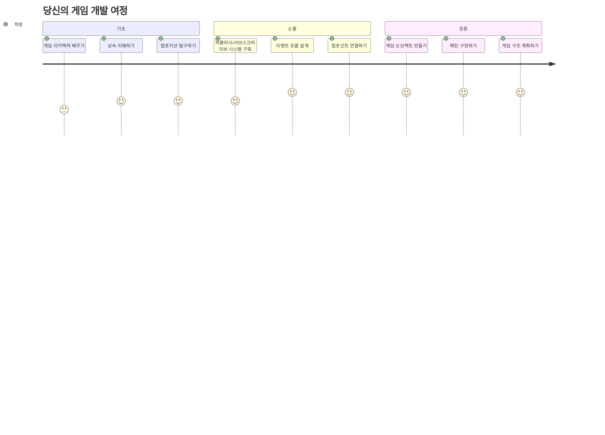
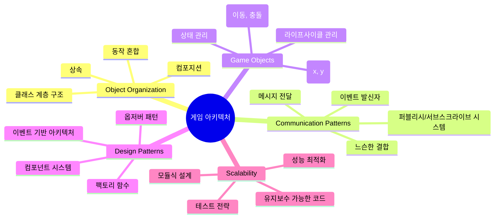
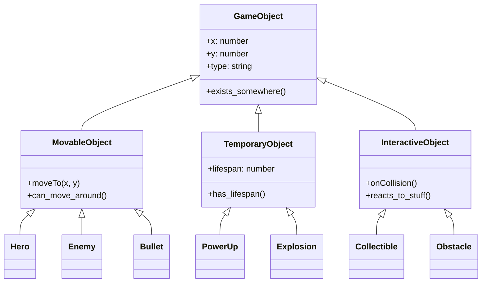
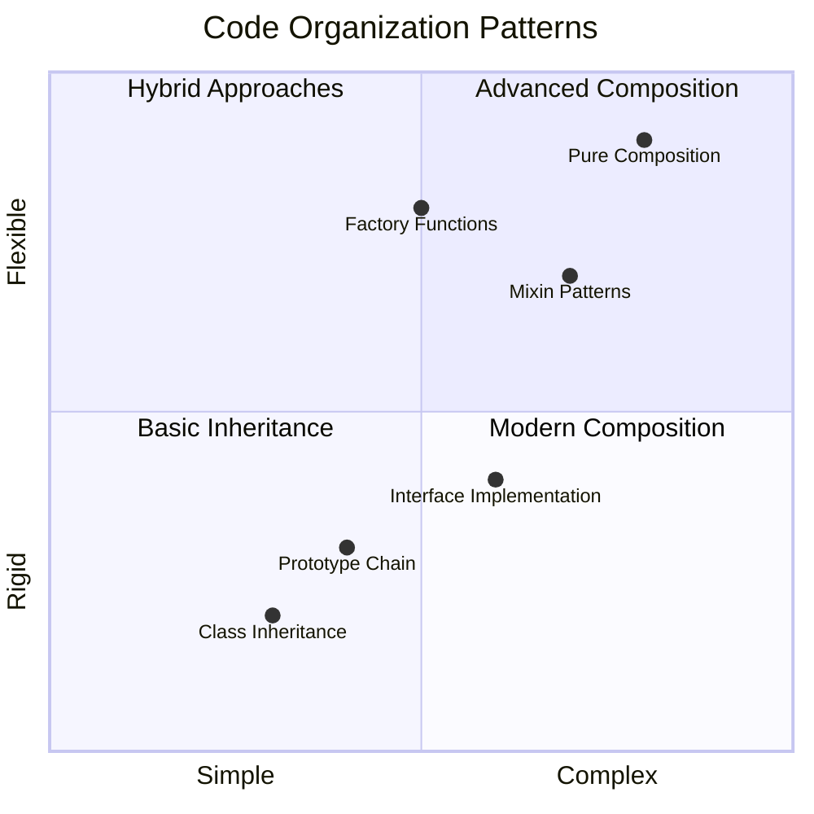
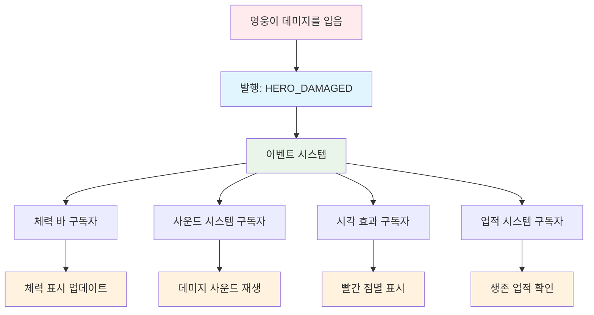
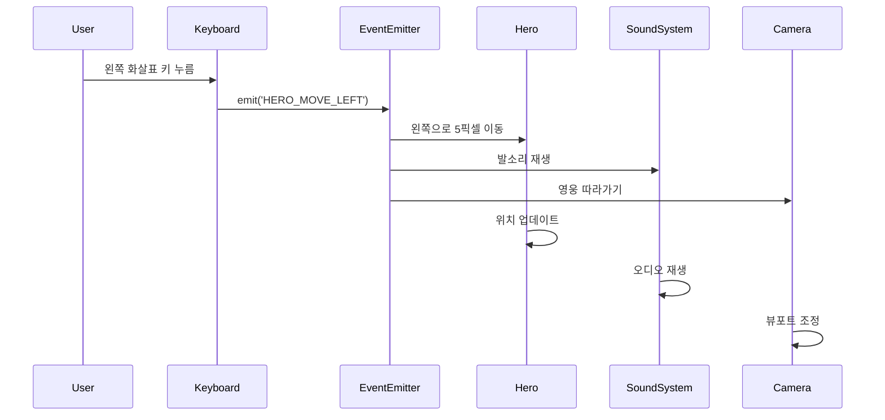
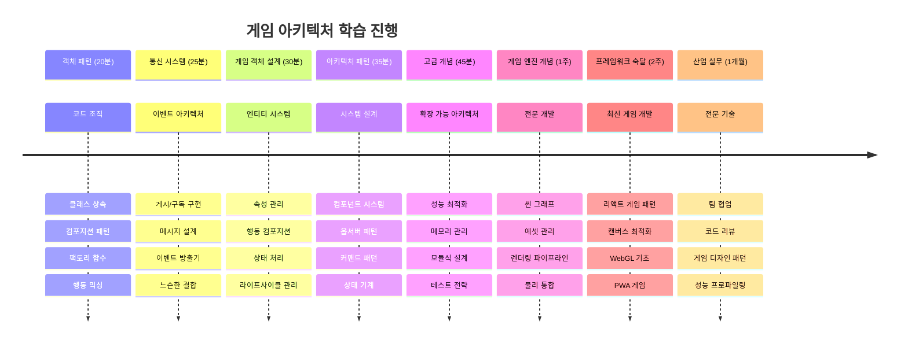

<!--
CO_OP_TRANSLATOR_METADATA:
{
  "original_hash": "a6332a7bb4d0be3bfd24199c83993777",
  "translation_date": "2026-01-06T15:08:39+00:00",
  "source_file": "6-space-game/1-introduction/README.md",
  "language_code": "ko"
}
-->
# 스페이스 게임 만들기 1부: 소개




NASA의 미션 컨트롤이 우주 발사 시 여러 시스템을 조율하는 것처럼, 우리는 프로그램의 여러 부분이 원활하게 작동하는 방식을 보여주는 스페이스 게임을 만들어 볼 것입니다. 실제 플레이할 수 있는 무언가를 만들면서 모든 소프트웨어 프로젝트에 적용되는 필수 프로그래밍 개념을 배울 수 있습니다.

코드 구성에 대한 두 가지 기본 접근 방식을 살펴볼 것입니다: 상속과 조합. 이들은 단순한 학문적 개념이 아니라 비디오 게임부터 은행 시스템에 이르기까지 모든 것에 동력을 제공하는 패턴입니다. 또한 우주선에서 사용하는 통신 네트워크처럼 동작하는 pub/sub라는 통신 시스템도 구현하여, 서로 다른 컴포넌트가 의존성을 만들지 않고 정보를 공유할 수 있게 할 것입니다.

이 시리즈가 끝나면, 게임, 웹 애플리케이션, 또는 다른 어떤 소프트웨어 시스템을 개발하든 확장과 진화가 가능한 애플리케이션을 만드는 방법을 이해하게 될 것입니다.


## 사전 퀴즈

[사전 퀴즈](https://ff-quizzes.netlify.app/web/quiz/29)

## 게임 개발에서의 상속과 조합

프로젝트가 복잡해질수록 코드 조직은 매우 중요해집니다. 단순한 스크립트로 시작한 것이 적절한 구조 없이는 유지보수가 어려워질 수 있는데, 이는 아폴로 임무가 수천 개의 구성 요소를 신중하게 조율해야 했던 것과 비슷합니다.

우리는 코드 조직을 위한 두 가지 기본 접근 방식인 상속과 조합을 탐구할 것입니다. 각각은 뚜렷한 장점이 있으며, 두 방식을 모두 이해하면 상황에 맞는 올바른 접근 방식을 선택하는 데 도움이 됩니다. 이 개념들은 영웅, 적, 파워업, 그리고 다른 객체들이 효율적으로 상호작용해야 하는 스페이스 게임을 통해 시연할 것입니다.

✅ 가장 유명한 프로그래밍 서적 중 하나는 [디자인 패턴](https://en.wikipedia.org/wiki/Design_Patterns)에 관한 책입니다.

모든 게임에는 `게임 오브젝트`가 있습니다 – 게임 세계를 구성하는 상호작용 요소들입니다. 영웅, 적, 파워업, 시각 효과 모두 게임 오브젝트입니다. 각 오브젝트는 좌표 평면에 점을 찍듯 `x` 와 `y` 값으로 특정 화면 좌표에 존재합니다.

시각적 차이가 있음에도, 이 오브젝트들은 종종 기본적인 행동을 공유합니다:

- **어딘가에 존재한다** – 모든 오브젝트는 x와 y 좌표가 있어 게임이 어디에 그릴지 압니다
- **많은 오브젝트가 움직인다** – 영웅은 달리고, 적은 쫓고, 총알은 화면을 가로질러 날아갑니다
- **수명이 있다** – 어떤 것은 영원히 존재하고, 폭발 같은 것은 짧게 나타났 사라집니다
- **무언가에 반응한다** – 충돌 발생 시, 파워업 수집 시, 체력바 갱신 등

✅ 팩맨 게임을 생각해보세요. 위에 나열된 네 가지 오브젝트 유형을 게임에서 식별할 수 있나요?


### 코드를 통한 행동 표현

게임 오브젝트가 공유하는 공통 동작을 이해했으니, 이제 자바스크립트에서 이러한 행동을 구현하는 방법을 살펴봅시다. 객체 행동은 클래스나 개별 객체에 붙이는 메서드로 표현할 수 있으며, 여러 접근 방식이 있습니다.

**클래스 기반 접근법**

클래스와 상속은 게임 오브젝트를 조직화하는 구조적 방법을 제공합니다. 카를 린네우스가 개발한 동물 분류 체계처럼, 공통 속성을 가진 기본 클래스로 시작해 이를 상속하며 특화된 클래스를 만듭니다.

✅ 상속은 중요한 개념입니다. [MDN의 상속 관련 문서](https://developer.mozilla.org/docs/Web/JavaScript/Inheritance_and_the_prototype_chain)에서 자세히 알아보세요.

클래스와 상속을 사용하여 게임 오브젝트를 구현하는 방법은 다음과 같습니다:

```javascript
// 1단계: 기본 GameObject 클래스를 생성합니다
class GameObject {
  constructor(x, y, type) {
    this.x = x;
    this.y = y;
    this.type = type;
  }
}
```

**단계별 설명:**
- 모든 게임 오브젝트가 사용할 수 있는 기본 템플릿을 만듭니다
- 생성자에서 오브젝트의 위치(`x`, `y`)와 종류를 저장합니다
- 모든 게임 오브젝트가 이 기본을 토대로 만들어집니다

```javascript
// 2단계: 상속을 통해 이동 기능 추가
class Movable extends GameObject {
  constructor(x, y, type) {
    super(x, y, type); // 부모 생성자 호출
  }

  // 새로운 위치로 이동하는 기능 추가
  moveTo(x, y) {
    this.x = x;
    this.y = y;
  }
}
```

**위 코드에서:**
- GameObject 클래스를 확장해 이동 기능을 추가했습니다
- `super()`로 부모 생성자를 호출해 상속된 속성을 초기화했습니다
- 위치를 수정하는 `moveTo()` 메서드를 추가했습니다

```javascript
// 3단계: 특정 게임 객체 유형 만들기
class Hero extends Movable {
  constructor(x, y) {
    super(x, y, 'Hero'); // 유형을 자동으로 설정
  }
}

class Tree extends GameObject {
  constructor(x, y) {
    super(x, y, 'Tree'); // 나무는 움직일 필요가 없음
  }
}

// 4단계: 게임 객체 사용
const hero = new Hero(0, 0);
hero.moveTo(5, 5); // 영웅이 움직일 수 있음!

const tree = new Tree(10, 15);
// tree.moveTo()는 오류를 발생시킴 - 나무는 움직일 수 없음
```

**개념 이해:**
- 적절한 행동을 상속받는 특화된 객체 타입을 생성합니다
- 상속으로 기능을 선택적으로 포함할 수 있음을 보여줍니다
- 영웅은 움직이고, 나무는 고정된 상태임을 시연합니다
- 클래스 계층 구조가 부적절한 행동을 방지함을 보여줍니다

✅ 팩맨의 히어로(예: Inky, Pinky, Blinky)를 자바스크립트로 어떻게 작성할지 잠깐 생각해보세요.

**조합 접근법**

조합은 교체 가능한 부품으로 우주선을 설계하는 엔지니어링 방식과 유사한 모듈식 설계 철학을 따릅니다. 부모 클래스를 상속하는 대신, 특정 행동을 결합해 필요한 기능만 갖춘 객체를 생성합니다. 이 접근법은 엄격한 계층 구조 없이 유연성을 제공합니다.

```javascript
// 1단계: 기본 동작 객체 생성
const gameObject = {
  x: 0,
  y: 0,
  type: ''
};

const movable = {
  moveTo(x, y) {
    this.x = x;
    this.y = y;
  }
};
```

**이 코드의 작동 방식:**
- 위치와 타입 속성을 가진 기본 `gameObject`를 정의합니다
- 이동 기능을 가진 별도의 `movable` 행동 객체를 만듭니다
- 위치 데이터와 이동 로직을 분리하여 독립적으로 유지합니다

```javascript
// 2단계: 동작을 결합하여 객체 구성하기
const movableObject = { ...gameObject, ...movable };

// 3단계: 다양한 객체 유형을 위한 팩토리 함수 생성하기
function createHero(x, y) {
  return {
    ...movableObject,
    x,
    y,
    type: 'Hero'
  };
}

function createStatic(x, y, type) {
  return {
    ...gameObject,
    x,
    y,
    type
  };
}
```

**위 코드에서는:**
- 스프레드 문법으로 기본 속성과 이동 행동을 결합했습니다
- 맞춤형 객체를 반환하는 팩토리 함수를 만들었습니다
- 엄격한 클래스 계층 없이 유연한 객체 생성을 가능하게 했습니다
- 객체가 필요한 행동만 가지도록 했습니다

```javascript
// 4단계: 구성된 객체를 생성하고 사용하기
const hero = createHero(10, 10);
hero.moveTo(5, 5); // 완벽하게 작동합니다!

const tree = createStatic(0, 0, 'Tree');
// tree.moveTo()는 정의되어 있지 않습니다 - 이동 동작이 구성되지 않았습니다
```

**중요한 점:**
- 행동을 상속하는 대신 섞어서(composing) 객체를 만듭니다
- 엄격한 상속 계층보다 유연성을 제공합니다
- 객체가 필요한 기능만 갖도록 허용합니다
- 현대 자바스크립트 스프레드 문법으로 깔끔한 객체 결합을 사용합니다
```

**Which Pattern Should You Choose?**

**Which Pattern Should You Choose?**



> 💡 **전문가 팁**: 두 가지 패턴 모두 현대 자바스크립트 개발에서 활용도가 높습니다. 명확한 계층 구조에는 클래스가 적합하고, 최대 유연성이 필요할 때는 조합이 빛을 발합니다.
> 
**언제 어떤 방식을 사용할지:**
- 명확한 "is-a" 관계(예: Hero는 Movable 객체다)에는 상속 선택
- "has-a" 관계(예: Hero는 이동 능력을 가진다)에는 조합 선택
- 팀의 선호도와 프로젝트 요구사항 고려
- 두 방식을 같은 애플리케이션에서 혼용 가능함 기억

### 🔄 **교육 점검**
**객체 조직 이해**: 통신 패턴으로 넘어가기 전에 다음을 확인하세요:
- ✅ 상속과 조합의 차이점 설명 가능
- ✅ 클래스와 팩토리 함수 중 언제 사용할지 식별 가능
- ✅ 상속에서 `super()` 키워드 작동 방식 이해
- ✅ 각각의 접근법이 게임 개발에 어떤 이점이 있는지 인지

**빠른 자기 테스트**: 움직이고 날 수 있는 Flying Enemy를 어떻게 만들까요?
- **상속 접근**: `class FlyingEnemy extends Movable`
- **조합 접근**: `{ ...movable, ...flyable, ...gameObject }`

**실제 사례 연결**: 이 패턴은 어디에나 등장합니다:
- **리액트 컴포넌트**: Props(조합) vs 클래스 상속
- **게임 엔진**: 엔티티-컴포넌트 시스템은 조합 사용
- **모바일 앱**: UI 프레임워크는 종종 상속 계층을 활용

## 통신 패턴: Pub/Sub 시스템

애플리케이션이 복잡해질수록 컴포넌트 간 통신 관리가 어려워집니다. 게시-구독 패턴(pub/sub)은 라디오 방송과 비슷한 원리를 사용하여 문제를 해결합니다 — 하나의 발신자가 누가 듣는지 모르는 상태로 여러 수신자에게 메시지를 전달할 수 있습니다.

예를 들어 영웅이 데미지를 입으면 체력 바가 업데이트되고, 효과음이 재생되며, 시각 피드백이 나타납니다. 영웅 객체가 이 시스템과 직접 결합되는 대신 pub/sub는 "데미지 입음" 메시지를 방송합니다. 대응해야 하는 시스템은 이 메시지 유형에 구독하여 적절히 반응합니다.

✅ **Pub/Sub**는 'publish-subscribe'의 약어입니다.


### Pub/Sub 아키텍처 이해

pub/sub 패턴은 애플리케이션의 다른 부분 간 결합도를 느슨하게 유지하여, 직접적으로 서로 의존하지 않고 함께 작동할 수 있게 합니다. 이 분리는 코드 유지보수성, 테스트 용이성, 변경에 대한 유연성을 높입니다.

**pub/sub의 주요 역할:**
- **메시지** – `'PLAYER_SCORED'`처럼 무슨 일이 일어났는지 설명하는 간단한 라벨(추가 정보 포함 가능)
- **발행자** – "무슨 일이 일어났다!"고 말하는 객체
- **구독자** – "그 이벤트에 관심 있다"며 발생 시 반응하는 객체
- **이벤트 시스템** – 메시지를 적절한 청중에게 전달하는 중개자

### 이벤트 시스템 구축

이 개념들을 시연할 단순하지만 강력한 이벤트 시스템을 만들어봅시다:

```javascript
// 1단계: EventEmitter 클래스 생성
class EventEmitter {
  constructor() {
    this.listeners = {}; // 모든 이벤트 리스너 저장
  }
  
  // 특정 메시지 유형에 대한 리스너 등록
  on(message, listener) {
    if (!this.listeners[message]) {
      this.listeners[message] = [];
    }
    this.listeners[message].push(listener);
  }
  
  // 등록된 모든 리스너에게 메시지 전송
  emit(message, payload = null) {
    if (this.listeners[message]) {
      this.listeners[message].forEach(listener => {
        listener(message, payload);
      });
    }
  }
}
```

**여기서 벌어지는 일 분석:**
- 간단한 클래스로 중앙 이벤트 관리 시스템 생성
- 메시지 유형별로 리스너를 저장하는 객체 유지
- `on()` 메서드로 새 리스너 등록
- `emit()` 메서드로 관련 리스너 모두에게 메시지 브로드캐스트
- 관련 정보를 전달하는 선택적 데이터 페이로드 지원

### 모두 연결해보기: 실용 예제

자, 이걸 실제로 적용해봅시다! 깔끔하고 유연한 pub/sub의 예로 간단한 이동 시스템을 만들겠습니다:

```javascript
// 1단계: 메시지 유형 정의하기
const Messages = {
  HERO_MOVE_LEFT: 'HERO_MOVE_LEFT',
  HERO_MOVE_RIGHT: 'HERO_MOVE_RIGHT',
  ENEMY_SPOTTED: 'ENEMY_SPOTTED'
};

// 2단계: 이벤트 시스템과 게임 오브젝트 생성하기
const eventEmitter = new EventEmitter();
const hero = createHero(0, 0);
```

**코드 설명:**
- 메시지 이름 오타 방지를 위한 상수 객체 정의
- 모든 통신을 처리할 이벤트 발생기 인스턴스 생성
- 시작 위치에 히어로 객체 초기화

```javascript
// 3단계: 이벤트 리스너(구독자) 설정하기
eventEmitter.on(Messages.HERO_MOVE_LEFT, () => {
  hero.moveTo(hero.x - 5, hero.y);
  console.log(`Hero moved to position: ${hero.x}, ${hero.y}`);
});

eventEmitter.on(Messages.HERO_MOVE_RIGHT, () => {
  hero.moveTo(hero.x + 5, hero.y);
  console.log(`Hero moved to position: ${hero.x}, ${hero.y}`);
});
```

**위 코드에서는:**
- 이동 메시지에 반응하는 이벤트 리스너 등록
- 이동 방향에 따라 히어로 위치 업데이트
- 히어로 위치 변경을 추적하는 콘솔 로그 추가
- 입력 처리와 이동 로직 분리

```javascript
// 4단계: 키보드 입력을 이벤트(발행자)에 연결하기
window.addEventListener('keydown', (event) => {
  switch(event.key) {
    case 'ArrowLeft':
      eventEmitter.emit(Messages.HERO_MOVE_LEFT);
      break;
    case 'ArrowRight':
      eventEmitter.emit(Messages.HERO_MOVE_RIGHT);
      break;
  }
});
```

**개념 이해:**
- 키보드 입력과 게임 이벤트를 강한 결합 없이 연결
- 입력 시스템이 게임 객체와 간접 통신 가능하게 함
- 여러 시스템이 같은 키보드 이벤트에 반응할 수 있게 함
- 키 바인딩 변경이나 신규 입력 방식 추가가 쉬움


> 💡 **전문가 팁**: 이 패턴의 장점은 유연성입니다! 단지 이벤트 리스너를 추가하는 것만으로 효과음, 화면 흔들림, 입자 효과 등을 쉽게 넣을 수 있습니다 — 기존 키보드나 이동 코드를 수정할 필요가 없습니다.
> 
**이 방식이 좋은 이유:**
- 새로운 기능 추가가 매우 쉬워짐 — 관심 있는 이벤트를 들으면 됩니다
- 동시에 여러 기능이 같은 이벤트에 반응하며 서로 충돌하지 않음
- 각 부분이 독립적으로 작동해 테스트가 훨씬 간단해짐
- 문제 발생 시 어디를 봐야 할지 명확히 알 수 있음

### Pub/Sub의 효과적인 확장성

pub/sub 패턴은 애플리케이션이 복잡해져도 단순함을 유지합니다. 수십의 적, 동적 UI 갱신, 사운드 시스템 등 관리 시에도 아키텍처 변경 없이 패턴이 확장에 대응합니다. 새 기능은 기존 이벤트 시스템에 통합되어 기존 기능에 영향 없이 동작합니다.

> ⚠️ **주의할 점**: 초기부터 너무 세분화된 메시지 타입을 만들지 마세요. 넓은 카테고리부터 시작해 게임 요구가 명확해짐에 따라 정제하세요.
> 
**따를 모범 사례:**
- 관련 메시지를 논리적 그룹으로 묶기
- 무슨 일이 일어났는지 명확히 나타내는 이름 사용
- 메시지 페이로드는 단순하고 핵심 내용 위주 유지
- 팀 협업을 위해 메시지 타입 문서화

### 🔄 **교육 점검**
**이벤트 기반 아키텍처 이해**: 전체 시스템 이해도를 검증하세요:
- ✅ pub/sub가 컴포넌트 간 타이트한 결합을 어떻게 방지하는가?
- ✅ 이벤트 기반 아키텍처에서 기능 추가가 왜 쉬운가?
- ✅ EventEmitter가 통신 흐름에서 어떤 역할을 하는가?
- ✅ 메시지 상수가 버그 방지와 유지보수성 향상에 어떤 도움을 주는가?

**설계 도전 과제**: pub/sub로 다음 게임 시나리오를 어떻게 처리할까요?
1. **적 사망**: 점수 업데이트, 효과음 재생, 파워업 생성, 화면에서 제거
2. **레벨 완료**: 음악 정지, UI 표시, 진행 상황 저장, 다음 레벨 로드
3. **파워업 획득**: 능력 향상, UI 업데이트, 효과 재생, 타이머 시작

**전문가 연결**: 이 패턴은 다음 분야에 사용됨:
- **프론트엔드 프레임워크**: React/Vue 이벤트 시스템
- **백엔드 서비스**: 마이크로서비스 통신
- **게임 엔진**: Unity 이벤트 시스템
- **모바일 개발**: iOS/Android 알림 시스템

---

## GitHub Copilot 에이전트 챌린지 🚀

에이전트 모드를 사용해 다음 챌린지를 완료하세요:

**설명:** 상속과 pub/sub 패턴을 모두 활용하여 간단한 게임 객체 시스템을 만드세요. 서로 직접 알지 못하면서 이벤트를 통해 소통하는 기본 게임을 구현할 것입니다.

**요구사항:** 자바스크립트 게임 시스템 구현:
1) x, y 좌표와 타입 속성을 가진 기본 GameObject 클래스 생성
2) GameObject를 상속하고 이동할 수 있는 Hero 클래스 생성
3) GameObject를 상속하고 영웅을 쫓을 수 있는 Enemy 클래스 생성
4) pub/sub 패턴용 EventEmitter 클래스 구현
5) 영웅이 이동할 때 근처 적들이 'HERO_MOVED' 이벤트를 받고 영웅 쪽으로 위치를 갱신하도록 이벤트 리스너 설정, 객체 간 통신을 보여줄 콘솔 로그 포함

[에이전트 모드](https://code.visualstudio.com/blogs/2025/02/24/introducing-copilot-agent-mode)에 대해 자세히 알아보세요.

## 🚀 챌린지
퍼블리셔-구독자(pub-sub) 패턴이 게임 아키텍처를 어떻게 향상시킬 수 있는지 고려해 보세요. 어떤 컴포넌트가 이벤트를 발생시켜야 하는지, 시스템이 어떻게 반응해야 하는지 식별하세요. 게임 컨셉을 설계하고 각 컴포넌트 간의 통신 패턴을 도식화하세요.

## 강의 후 퀴즈

[강의 후 퀴즈](https://ff-quizzes.netlify.app/web/quiz/30)

## 복습 및 자습

Pub/Sub에 대해 더 알아보려면 [여기에서 읽어보세요](https://docs.microsoft.com/azure/architecture/patterns/publisher-subscriber/?WT.mc_id=academic-77807-sagibbon).

### ⚡ **다음 5분 동안 할 수 있는 일**
- [ ] 온라인에서 HTML5 게임을 열고 DevTools로 코드를 검사해 보세요
- [ ] 간단한 HTML5 Canvas 요소를 만들고 기본 도형을 그려보세요
- [ ] `setInterval`을 사용해 간단한 애니메이션 루프를 만들어 보세요
- [ ] Canvas API 문서를 탐색하고 그리기 메서드를 시도해 보세요

### 🎯 **이번 시간에 달성할 수 있는 목표**
- [ ] 강의 후 퀴즈를 완료하고 게임 개발 개념을 이해하세요
- [ ] HTML, CSS, JavaScript 파일로 게임 프로젝트 구조를 설정하세요
- [ ] 지속적으로 업데이트되고 렌더링되는 기본 게임 루프를 만드세요
- [ ] 캔버스에 첫 게임 스프라이트를 그리세요
- [ ] 이미지와 사운드에 대한 기본 자산 로딩을 구현하세요

### 📅 **일주일간 게임 제작**
- [ ] 계획된 모든 기능을 갖춘 우주 게임 완성하기
- [ ] 다듬은 그래픽, 효과음, 부드러운 애니메이션 추가하기
- [ ] 게임 상태 구현(시작 화면, 게임 플레이, 게임 오버)
- [ ] 점수 시스템과 플레이어 진행 상황 추적 만들기
- [ ] 다양한 기기에서 반응형 및 접근성 갖추기
- [ ] 온라인에 게임 공유하고 플레이어 피드백 수집하기

### 🌟 **한 달간 게임 개발**
- [ ] 여러 장르와 메커니즘을 탐구하는 다양한 게임 제작하기
- [ ] Phaser 또는 Three.js 같은 게임 개발 프레임워크 배우기
- [ ] 오픈 소스 게임 개발 프로젝트에 기여하기
- [ ] 고급 게임 프로그래밍 패턴 및 최적화 마스터하기
- [ ] 게임 개발 기술을 보여주는 포트폴리오 만들기
- [ ] 게임 개발 및 인터랙티브 미디어에 관심 있는 사람 멘토링하기

## 🎯 당신의 게임 개발 숙련도 타임라인


### 🛠️ 게임 아키텍처 도구 요약

이 수업을 완료한 후, 당신은 이제:
- **디자인 패턴 숙련**: 상속 대 조합 트레이드오프 이해
- **이벤트 기반 아키텍처**: 확장 가능한 통신을 위한 Pub/Sub 구현
- **객체 지향 설계**: 클래스 계층과 동작 조합
- **모던 자바스크립트**: 팩토리 함수, 스프레드 문법, ES6+ 패턴
- **확장 가능한 아키텍처**: 느슨한 결합과 모듈화 설계 원칙
- **게임 개발 기초**: 엔티티 시스템과 컴포넌트 패턴
- **전문적 패턴**: 업계 표준 코드 조직 방식

**실무 적용 분야**: 이 패턴들은 다음에 직접 적용됩니다:
- **프론트엔드 프레임워크**: React/Vue 컴포넌트 아키텍처 및 상태 관리
- **백엔드 서비스**: 마이크로서비스 통신 및 이벤트 주도 시스템
- **모바일 개발**: iOS/Android 앱 아키텍처 및 알림 시스템
- **게임 엔진**: Unity, Unreal, 웹 기반 게임 개발
- **기업용 소프트웨어**: 이벤트 소싱 및 분산 시스템 설계
- **API 설계**: RESTful 서비스 및 실시간 통신

**전문 기술 습득**: 이제 당신은:
- **설계** 증명된 패턴을 사용해 확장 가능한 소프트웨어 아키텍처 설계
- **구현** 복잡한 상호작용을 처리하는 이벤트 기반 시스템 개발
- **선택** 다양한 시나리오에 맞는 적절한 코드 조직 전략
- **디버그** 및 유지 관리가 쉬운 느슨한 결합 시스템 관리
- **소통** 업계 표준 용어를 사용한 기술적 결정 전달

**다음 단계**: 이 패턴들을 실제 게임에 구현하거나 고급 게임 개발 주제를 탐구하거나 웹 애플리케이션에 아키텍처 개념을 적용할 준비가 되었습니다!

🌟 **업적 달성**: 단순 게임부터 복잡한 기업용 시스템까지 모든 것을 구동하는 기본 소프트웨어 아키텍처 패턴을 마스터했습니다!

## 과제

[게임 목업 만들기](assignment.md)

---

<!-- CO-OP TRANSLATOR DISCLAIMER START -->
**면책조항**:  
이 문서는 AI 번역 서비스 [Co-op Translator](https://github.com/Azure/co-op-translator)를 사용하여 번역되었습니다. 정확성을 위해 최선을 다하고 있으나, 자동 번역에는 오류나 부정확한 부분이 있을 수 있음을 양지해 주시기 바랍니다. 원본 문서의 원어는 권위 있는 자료로 간주되어야 합니다. 중요한 정보의 경우 전문적인 인간 번역을 권장합니다. 이 번역 사용으로 인한 어떠한 오해나 잘못된 해석에 대해서도 당사는 책임을 지지 않습니다.
<!-- CO-OP TRANSLATOR DISCLAIMER END -->