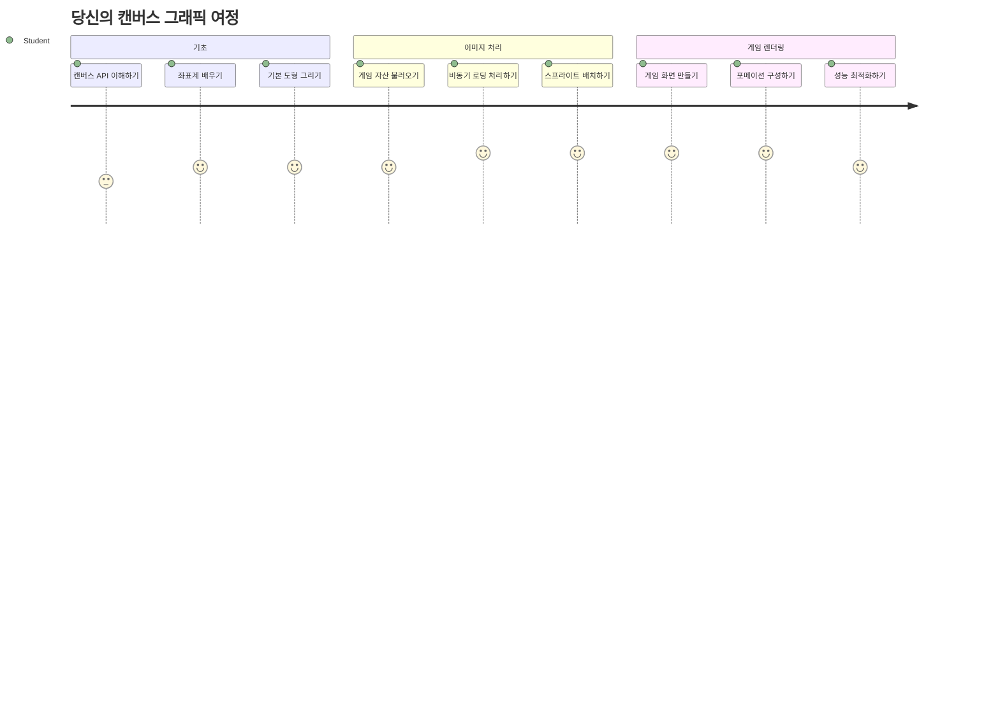
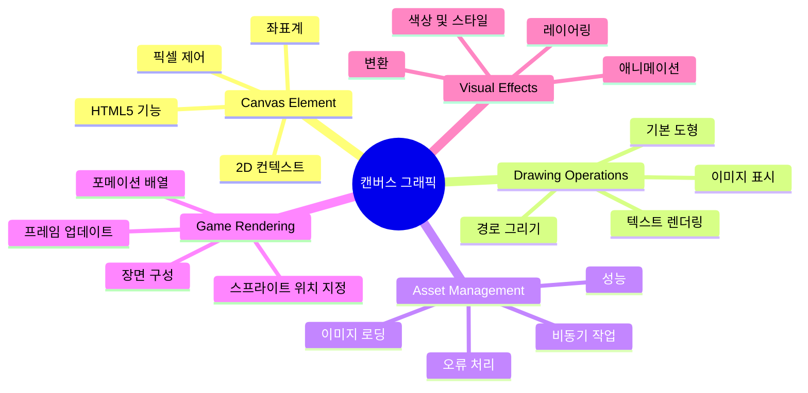
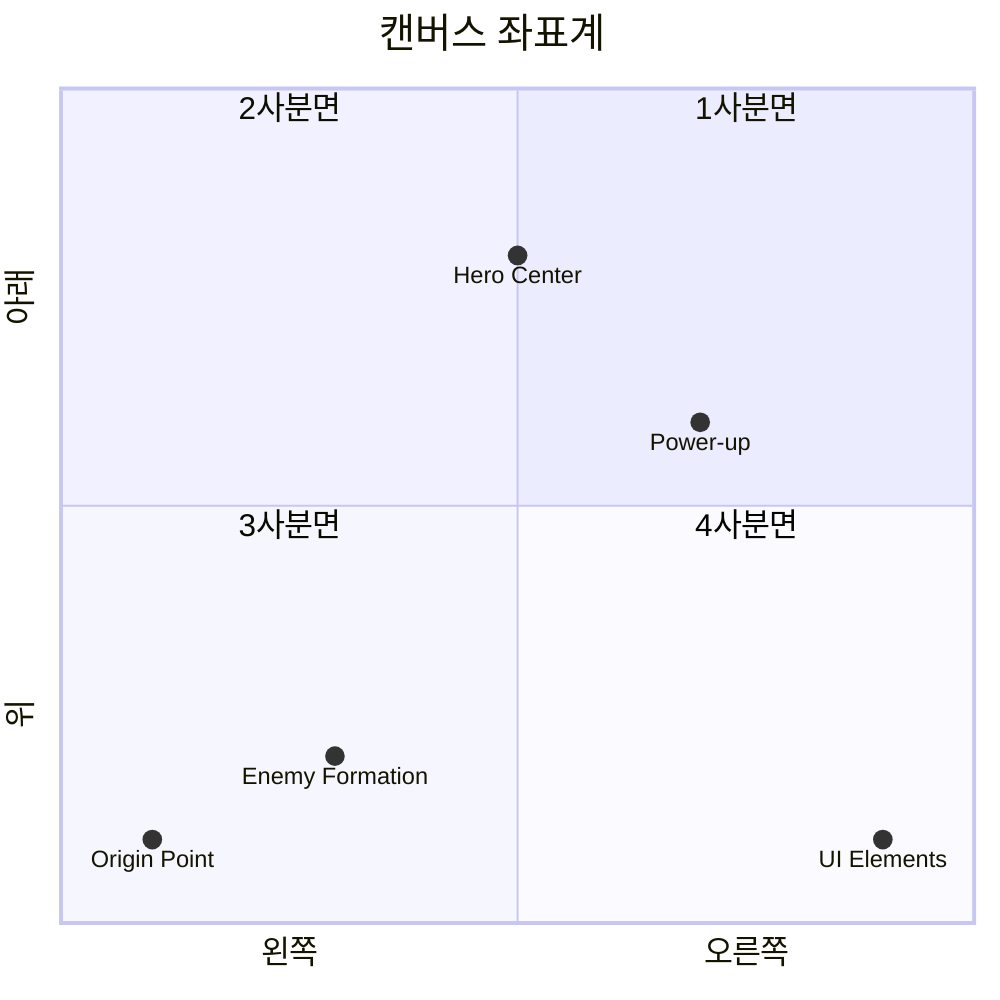
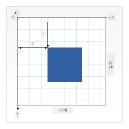
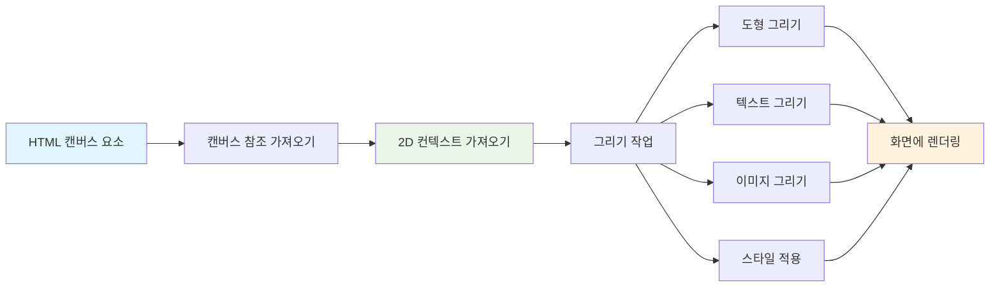
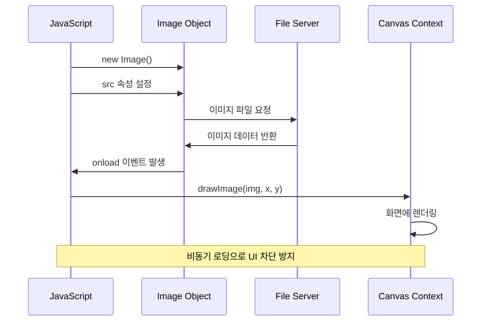
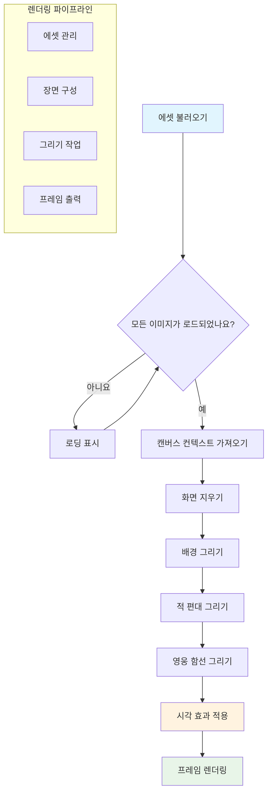
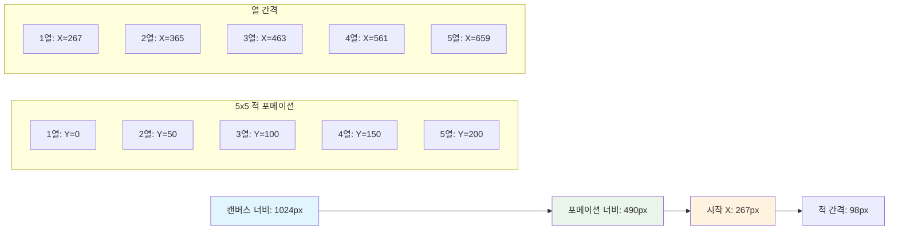
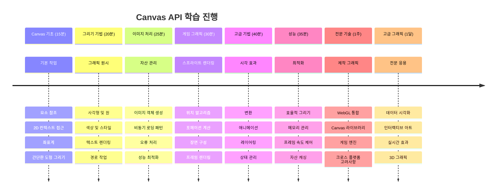

<!--
CO_OP_TRANSLATOR_METADATA:
{
  "original_hash": "7994743c5b21fdcceb36307916ef249a",
  "translation_date": "2026-01-06T15:02:53+00:00",
  "source_file": "6-space-game/2-drawing-to-canvas/README.md",
  "language_code": "ko"
}
-->
# 우주 게임 만들기 2부: 영웅과 몬스터를 캔버스에 그리기


Canvas API는 브라우저에서 동적이고 상호작용하는 그래픽을 직접 만들 수 있는 웹 개발의 가장 강력한 기능 중 하나입니다. 이번 강의에서는 빈 HTML `<canvas>` 요소를 영웅과 몬스터로 가득 찬 게임 세계로 변모시킬 것입니다. 캔버스를 코드가 시각으로 변하는 디지털 아트 보드로 생각하세요.

우리는 이전 강의에서 배운 내용을 토대로 시각적 측면으로 깊이 들어갑니다. 게임 스프라이트를 로드하고 표시하는 방법, 요소를 정확하게 배치하는 방법, 우주 게임의 시각적 기초를 만드는 방법을 배울 것입니다. 이는 정적인 웹 페이지와 동적이며 상호작용하는 경험 사이의 다리 역할을 합니다.

이 강의가 끝나면 영웅 우주선이 올바르게 배치되고 적의 대형이 전투 준비가 된 완전한 게임 장면을 갖게 됩니다. 현대 게임이 브라우저에서 그래픽을 렌더링하는 방식을 이해하고, 자신만의 상호작용 비주얼 경험을 만드는 기술을 습득할 것입니다. 캔버스 그래픽을 탐험하며 우주 게임에 생명을 불어넣어 봅시다!


## 강의 전 퀴즈

[강의 전 퀴즈](https://ff-quizzes.netlify.app/web/quiz/31)

## 캔버스란?

그렇다면 이 `<canvas>` 요소는 정확히 무엇일까요? 이것은 웹 브라우저 내에서 동적 그래픽과 애니메이션을 만들기 위한 HTML5의 해결책입니다. 일반 이미지나 동영상은 정적이지만, 캔버스는 화면에 나타나는 모든 것을 픽셀 단위로 제어할 수 있게 해줍니다. 이 점이 게임, 데이터 시각화, 인터랙티브 아트에 완벽합니다. 캔버스를 자바스크립트가 그리는 붓이 되는 프로그래밍 가능한 그리기 표면이라고 생각하세요.

기본적으로 캔버스 요소는 페이지에서 빈 투명 사각형처럼 보입니다. 하지만 잠재력은 바로 여기서 나옵니다! 자바스크립트를 사용하여 도형을 그리고, 이미지를 로드하며, 애니메이션을 만들고, 사용자 상호작용에 반응하도록 만들 때 진정한 힘이 발휘됩니다. 1960년대 벨 연구소의 초기 컴퓨터 그래픽 선구자들이 첫 디지털 애니메이션을 만들기 위해 픽셀 하나하나를 프로그래밍 했던 것과 유사합니다.

✅ MDN에서 [Canvas API에 대해 더 읽어보기](https://developer.mozilla.org/docs/Web/API/Canvas_API)

일반적으로 페이지 본문에 다음과 같이 선언합니다:

```html
<canvas id="myCanvas" width="200" height="100"></canvas>
```

**이 코드가 하는 일:**
- 자바스크립트에서 이 특정 캔버스 요소를 참조할 수 있도록 `id` 속성을 **설정**
- 캔버스의 가로 크기를 제어하기 위해 픽셀 단위의 `width`를 **정의**
- 캔버스의 세로 크기를 결정하기 위해 픽셀 단위의 `height`를 **설정**

## 간단한 기하 도형 그리기

캔버스 요소가 무엇인지 알았으니, 이번에는 실제로 그려봅시다! 캔버스는 수학 시간에 익숙할 법한 좌표계를 사용하지만 컴퓨터 그래픽에만 해당하는 중요한 차이가 있습니다.

캔버스는 x축(가로)과 y축(세로)으로 구성된 직교 좌표계를 사용합니다. 하지만 중요한 차이는 원점 `(0,0)`이 좌측 상단 모서리에 있다는 점입니다. x값은 오른쪽으로 갈수록 증가하고 y값은 아래쪽으로 갈수록 증가합니다. 이 방식은 전자 빔이 상단에서 하단으로 스캔하던 초기 컴퓨터 디스플레이에서 유래한 자연스러운 시작점입니다.



> 이미지 출처 [MDN](https://developer.mozilla.org/docs/Web/API/Canvas_API/Tutorial/Drawing_shapes)

캔버스에 그림을 그리려면, 모든 캔버스 그래픽의 토대가 되는 세 단계 과정을 따라야 합니다. 몇 번 해보면 자연스러워집니다:


1. DOM에서 캔버스 요소를 참조 가져오기 (다른 HTML 요소와 동일)
2. 2D 렌더링 컨텍스트 가져오기 – 모든 그리기 메서드를 제공합니다
3. 그리기 시작! 컨텍스트의 내장 메서드를 사용해 그래픽 생성

코드로 보면 다음과 같습니다:

```javascript
// 1단계: 캔버스 요소 가져오기
const canvas = document.getElementById("myCanvas");

// 2단계: 2D 렌더링 컨텍스트 가져오기
const ctx = canvas.getContext("2d");

// 3단계: 채우기 색상 설정 및 사각형 그리기
ctx.fillStyle = 'red';
ctx.fillRect(0, 0, 200, 200); // x, y, 너비, 높이
```

**단계별 설명:**
- ID로 캔버스 요소를 가져와 변수에 저장합니다
- 2D 렌더링 컨텍스트를 가져옵니다 – 그리기 툴킷입니다
- `fillStyle` 속성으로 캔버스에 빨간색을 채우도록 설정합니다
- 좌상단 `(0,0)`에서 시작해 200픽셀 가로세로 크기의 사각형을 그립니다

✅ Canvas API는 주로 2D 도형에 초점을 맞추지만, 3D 요소를 웹 사이트에 그릴 수도 있습니다; 이때는 [WebGL API](https://developer.mozilla.org/docs/Web/API/WebGL_API)를 사용할 수 있습니다.

Canvas API로 그릴 수 있는 것들 예시는:

- **기하학적 도형**: 직사각형 그리는 법을 이미 봤지만 훨씬 더 많은 도형을 그릴 수 있습니다.
- **텍스트**: 원하는 폰트와 색상으로 텍스트를 그릴 수 있습니다.
- **이미지**: 예를 들어 .jpg나 .png 같은 이미지 자산을 기반으로 이미지를 그릴 수 있습니다.

✅ 한번 시도해보세요! 직사각형 그릴 줄 알면, 원을 그릴 수 있을까요? CodePen에서 흥미로운 Canvas 그림들을 살펴보세요. 여기 [특히 인상적인 예](https://codepen.io/dissimulate/pen/KrAwx)가 있습니다.

### 🔄 **학습 점검**
**캔버스 기본 이해**: 이미지 로딩으로 넘어가기 전에 다음을 확인하세요:
- ✅ 캔버스 좌표계가 수학 좌표계와 어떻게 다른지 설명할 수 있다
- ✅ 캔버스 그리기 작업의 3단계 과정을 이해한다
- ✅ 2D 렌더링 컨텍스트가 무엇을 제공하는지 알 수 있다
- ✅ fillStyle과 fillRect가 어떻게 함께 작동하는지 설명할 수 있다

**간단한 자기 테스트**: 좌표 (100, 50)에 반지름 25인 파란 원을 어떻게 그리겠습니까?
```javascript
ctx.fillStyle = 'blue';
ctx.beginPath();
ctx.arc(100, 50, 25, 0, 2 * Math.PI);
ctx.fill();
```

**알고 있는 캔버스 그리기 메서드:**
- **fillRect()**: 채워진 사각형 그리기
- **fillStyle**: 색상과 패턴 설정
- **beginPath()**: 새로운 그리기 경로 시작
- **arc()**: 원과 곡선 생성

## 이미지 자산 로드 및 그리기

기본 도형 그리기는 시작하기에 유용하지만 대부분 게임은 실제 이미지가 필요합니다! 스프라이트, 배경, 텍스처가 게임의 시각적 매력을 만듭니다. 캔버스에 이미지를 로드하고 표시하는 방법은 기하 도형과 다르지만, 과정만 이해하면 간단합니다.

Image 객체를 생성하고 이미지 파일을 비동기적으로(“백그라운드에서”) 로드한 다음, 준비가 되면 캔버스에 그립니다. 이 방식은 이미지를 불러오는 동안 앱 실행을 막지 않으면서 이미지를 올바르게 표시할 수 있도록 보장합니다.


### 기본 이미지 로딩

```javascript
const img = new Image();
img.src = 'path/to/my/image.png';
img.onload = () => {
  // 이미지가 로드되어 사용 준비가 완료되었습니다
  console.log('Image loaded successfully!');
};
```

**이 코드에서 일어나는 일:**
- 새로운 Image 객체를 생성해 스프라이트나 텍스처를 담습니다
- 소스 경로를 설정해 어떤 이미지 파일을 불러올지 지정합니다
- 이미지가 준비됐을 때 알 수 있도록 load 이벤트를 듣습니다

### 더 나은 이미지 로딩 방법

프로 개발자가 주로 사용하는 좀 더 견고한 이미지 로딩 방식입니다. 이미지 로딩 코드를 Promise 기반 함수로 감싸는데, ES6에서 표준화된 자바스크립트 프로미스 덕분에 코드가 정돈되고 오류 처리도 깔끔해집니다:

```javascript
function loadAsset(path) {
  return new Promise((resolve, reject) => {
    const img = new Image();
    img.src = path;
    img.onload = () => {
      resolve(img);
    };
    img.onerror = () => {
      reject(new Error(`Failed to load image: ${path}`));
    };
  });
}

// 현대적인 async/await 사용법
async function initializeGame() {
  try {
    const heroImg = await loadAsset('hero.png');
    const monsterImg = await loadAsset('monster.png');
    // 이미지가 이제 사용할 준비가 되었습니다
  } catch (error) {
    console.error('Failed to load game assets:', error);
  }
}
```

**여기서 한 작업들:**
- 이미지 로딩 로직 전체를 Promise로 감쌌습니다, 처리하기 더 좋아집니다
- 문제가 생기면 알려주는 오류 처리도 추가했습니다
- async/await 문법을 사용해 가독성이 훨씬 좋아졌습니다
- try/catch 블록을 포함해 로딩 문제를 우아하게 다룹니다

이미지가 로드되면 캔버스에 그리는 건 꽤 단순합니다:

```javascript
async function renderGameScreen() {
  try {
    // 게임 자산 불러오기
    const heroImg = await loadAsset('hero.png');
    const monsterImg = await loadAsset('monster.png');

    // 캔버스 및 컨텍스트 가져오기
    const canvas = document.getElementById("myCanvas");
    const ctx = canvas.getContext("2d");

    // 특정 위치에 이미지 그리기
    ctx.drawImage(heroImg, canvas.width / 2, canvas.height / 2);
    ctx.drawImage(monsterImg, 0, 0);
  } catch (error) {
    console.error('Failed to render game screen:', error);
  }
}
```

**단계별 설명:**
- hero와 monster 이미지를 await로 백그라운드에서 로드합니다
- 캔버스 요소를 가져와 2D 렌더링 컨텍스트를 얻습니다
- 좌표 계산으로 영웅 이미지를 중앙에 배치합니다
- 적 이미지는 좌상단에 위치시켜 적 편대를 시작합니다
- 로딩이나 렌더링 중 오류가 발생하면 처리합니다


## 이제 게임을 만들 차례입니다

이제 모든 것을 합쳐 우주 게임의 시각적 토대를 만듭니다. 캔버스 기초와 이미지 로딩 기술을 잘 익혔으니, 이 실습을 통해 제대로 배치된 스프라이트로 완성된 게임 화면을 만드는 과정을 안내합니다.

### 만들 콘텐츠

Canvas 요소가 있는 웹 페이지를 만듭니다. 검은색 배경에 크기 `1024*768`의 화면을 렌더링해야 합니다. 다음 두 개의 이미지를 제공합니다:

- 영웅 우주선

   

- 5×5 몬스터 편대

   

### 개발 시작을 위한 권장 단계

`your-work` 하위 폴더에 생성된 시작 파일을 찾으세요. 프로젝트 구조는 다음을 포함해야 합니다:

```bash
your-work/
├── assets/
│   ├── enemyShip.png
│   └── player.png
├── index.html
├── app.js
└── package.json
```

**작업 환경 설명:**
- 게임 스프라이트는 모두 `assets/` 폴더에 있어 정리가 잘 되어 있습니다
- 메인 HTML 파일은 캔버스 요소를 설정하고 모든 준비를 합니다
- 게임 렌더링을 위한 자바스크립트 파일이 있습니다
- 로컬에서 테스트할 수 있는 개발 서버를 설정하는 package.json이 포함되어 있습니다

Visual Studio Code에서 이 폴더를 열고 개발을 시작하세요. Visual Studio Code, NPM, Node.js가 설치된 로컬 개발 환경이 필요합니다. 만약 `npm`이 없다면 [설치 방법 보기](https://www.npmjs.com/get-npm).

`your-work` 폴더로 이동해 개발 서버를 시작하세요:

```bash
cd your-work
npm start
```

**이 명령이 하는 일:**
- `http://localhost:5000`에서 로컬 서버를 시작해 게임을 테스트할 수 있게 합니다
- 모든 파일을 올바르게 서빙해 브라우저에서 문제없이 로드합니다
- 파일 변경 감지로 원활한 개발을 지원합니다
- 전문적인 개발 환경에서 테스트할 수 있게 해줍니다

> 💡 **참고**: 처음엔 브라우저가 빈 페이지를 보여줍니다 – 정상입니다! 코드를 추가할 때마다 페이지를 새로고침해 변경사항을 확인하세요. 이 반복적 개발 방식은 NASA가 아폴로 유도 컴퓨터를 구축할 때 각 부품을 테스트하던 방식과 비슷합니다.

### 코드 추가하기

`your-work/app.js` 파일에 다음 작업을 완료하기 위한 코드를 추가하세요:

1. **검은색 배경을 가진 캔버스 그리기**
   > 💡 **방법**: `/app.js` 내 TODO를 찾아 두 줄만 추가하세요. `ctx.fillStyle`을 검은색으로 설정하고, 캔버스 크기로 (0,0)부터 `ctx.fillRect()`를 호출하세요. 간단합니다!

2. **게임 텍스처 로드하기**
   > 💡 **방법**: `await loadAsset()`를 이용해 플레이어와 적 이미지를 로드하세요. 변수에 저장해 나중에 사용할 수 있게 하십시오. 실제로 그리기 전까지 이미지는 화면에 나타나지 않습니다!

3. **영웅 우주선을 화면 중앙 하단에 그리기**
   > 💡 **방법**: `ctx.drawImage()`를 사용해 영웅 위치를 조정합니다. x 좌표는 `canvas.width / 2 - 45`로 가운데 정렬하고, y 좌표는 `canvas.height - canvas.height / 4`를 사용해 하단 부근에 배치합니다.

4. **5×5 적 우주선 편대 그리기**
   > 💡 **방법**: `createEnemies` 함수를 찾아 중첩 반복문을 만듭니다. 적 간격과 위치를 위한 수학 계산이 필요하지만 걱정 마세요 – 어떻게 하는지 정확히 알려드리겠습니다!

먼저 적 편대를 올바르게 배치하기 위한 상수를 정의합니다:

```javascript
const ENEMY_TOTAL = 5;
const ENEMY_SPACING = 98;
const FORMATION_WIDTH = ENEMY_TOTAL * ENEMY_SPACING;
const START_X = (canvas.width - FORMATION_WIDTH) / 2;
const STOP_X = START_X + FORMATION_WIDTH;
```

**상수들의 역할:**
- 행과 열에 각각 5마리씩 적을 배치하는 5×5 격자를 설정합니다
- 적 사이 간격을 정의해 밀집되지 않게 합니다
- 편대 전체 너비를 계산합니다
- 편대가 화면 중앙에 오도록 시작 위치를 결정합니다


그 다음 중첩 반복문을 만들어 적 편대를 그립니다:

```javascript
for (let x = START_X; x < STOP_X; x += ENEMY_SPACING) {
  for (let y = 0; y < 50 * 5; y += 50) {
    ctx.drawImage(enemyImg, x, y);
  }
}
```

**중첩 반복문의 역할:**
- 바깥쪽 반복문은 편대의 좌우 방향을 이동합니다
- 안쪽 반복문은 위아래로 행을 만듭니다
- 계산한 정확한 x,y 좌표에 각 적 스프라이트를 그립니다
- 고르게 간격을 유지해 전문적이고 정돈된 모습을 만듭니다

### 🔄 **학습 점검**
**게임 렌더링 숙련도**: 전체 렌더링 시스템을 이해했는지 확인하세요:
- ✅ 비동기 이미지 로딩이 게임 시작 시 UI 차단을 방지하는 이유는 무엇인가요?
- ✅ 적 편대 위치를 상수로 계산하는 이유는 무엇인가요? 하드코딩이 아닌 이유는?
- ✅ 2D 렌더링 컨텍스트가 그리기 작업에서 하는 역할은 무엇인가요?
- ✅ 중첩 반복문이 어떻게 정돈된 스프라이트 편대를 만드는가요?

**성능 고려사항**: 여러분의 게임이 보여주는 점:
- **효율적인 자산 로딩**: Promise 기반 이미지 관리
- **체계적인 렌더링**: 구조화된 그리기 작업
- **수학적 위치 계산**: 계산된 스프라이트 배치
- **오류 처리**: 우아한 실패 관리

**비주얼 프로그래밍 개념**: 여러분은 배웠습니다:
- **좌표계**: 수학을 화면 위치로 변환하기
- **스프라이트 관리**: 게임 그래픽 불러오기 및 표시
- **포메이션 알고리즘**: 조직적인 레이아웃을 위한 수학적 패턴
- **비동기 작업**: 부드러운 사용자 경험을 위한 최신 자바스크립트

## 결과

완성된 결과는 다음과 같이 보여야 합니다:


## 해결책

우선 스스로 해결해보시고 막히신다면 [해결책](../../../../6-space-game/2-drawing-to-canvas/solution/app.js)을 확인해보세요.

---

## GitHub Copilot Agent 챌린지 🚀

Agent 모드를 사용하여 다음 챌린지를 완료하세요:

**설명:** Canvas API 기술을 활용해 시각 효과와 상호 작용 요소를 추가하여 우주 게임 캔버스를 확장하세요.

**프롬프트:** 배경에 애니메이션 별들이 반짝이고, 히어로 우주선의 체력바가 맥박 치며, 적 우주선이 천천히 아래로 이동하는 `enhanced-canvas.html` 파일을 새로 만드세요. 무작위 위치와 불투명도를 사용해 반짝이는 별을 그리고, 체력 수준(녹색 > 노란색 > 빨간색)에 따라 색상이 변하는 체력바를 구현하며, 적 우주선은 각각 다른 속도로 화면 아래로 이동하도록 자바스크립트 코드를 작성하세요.

[agent mode 자세히 알아보기](https://code.visualstudio.com/blogs/2025/02/24/introducing-copilot-agent-mode)

## 🚀 챌린지

2D 중심의 Canvas API를 활용해 그리기 실력을 익혔습니다; [WebGL API](https://developer.mozilla.org/docs/Web/API/WebGL_API)를 살펴보고 3D 객체를 그려보세요.

## 강의 후 퀴즈

[강의 후 퀴즈](https://ff-quizzes.netlify.app/web/quiz/32)

## 리뷰 및 자습

Canvas API에 대해 더 알아보려면 [해당 글을 읽어보세요](https://developer.mozilla.org/docs/Web/API/Canvas_API).

### ⚡ **다음 5분 동안 할 수 있는 것**
- [ ] 브라우저 콘솔을 열고 `document.createElement('canvas')`로 캔버스 요소 생성하기
- [ ] 캔버스 컨텍스트에서 `fillRect()`로 사각형 그리기 시도하기
- [ ] `fillStyle` 속성으로 다양한 색상 실험하기
- [ ] `arc()` 메소드로 간단한 원 그리기

### 🎯 **이번 시간 내에 달성할 수 있는 것**
- [ ] 강의 후 퀴즈 완료하고 캔버스 기초 개념 이해하기
- [ ] 여러 도형과 색상을 사용하는 캔버스 드로잉 앱 만들기
- [ ] 게임용 이미지 로딩과 스프라이트 렌더링 구현하기
- [ ] 객체가 캔버스를 가로지르는 간단한 애니메이션 만들기
- [ ] 스케일, 회전, 위치 변환 같은 캔버스 변환 연습하기

### 📅 **일주일 간의 캔버스 여정**
- [ ] 완성도 높은 그래픽과 스프라이트 애니메이션을 갖춘 우주 게임 완성하기
- [ ] 그라디언트, 패턴, 합성 등 고급 캔버스 기법 마스터하기
- [ ] 데이터 표현을 위한 상호작용 시각화 제작하기
- [ ] 부드러운 성능을 위한 캔버스 최적화 기법 배우기
- [ ] 다양한 도구를 이용한 드로잉 또는 페인팅 애플리케이션 만들기
- [ ] 캔버스를 활용한 창의적 코딩 패턴과 생성적 아트 탐구하기

### 🌟 **한 달 간의 그래픽 마스터 과정**
- [ ] Canvas 2D와 WebGL을 활용해 복잡한 시각적 애플리케이션 구축하기
- [ ] 그래픽 프로그래밍 개념과 셰이더 기초 배우기
- [ ] 오픈소스 그래픽 라이브러리 및 시각화 도구에 기여하기
- [ ] 그래픽 집중 애플리케이션 성능 최적화 마스터하기
- [ ] 캔버스 프로그래밍과 컴퓨터 그래픽 관련 교육 콘텐츠 만들기
- [ ] 다른 사람이 시각적 경험을 창조하도록 돕는 그래픽 프로그래밍 전문가 되기

## 🎯 당신의 캔버스 그래픽 마스터 타임라인


### 🛠️ 당신의 캔버스 그래픽 툴킷 요약

이번 강의를 완료하면서, 이제 다음과 같은 것을 갖췄습니다:
- **Canvas API 마스터리**: 2D 그래픽 프로그래밍 완전 이해
- **좌표 수학**: 정확한 위치 지정과 레이아웃 알고리즘
- **에셋 관리**: 전문적인 이미지 로딩 및 에러 처리
- **렌더링 파이프라인**: 장면 구성의 체계적 접근
- **게임 그래픽**: 스프라이트 위치 지정 및 포메이션 계산
- **비동기 프로그래밍**: 부드러운 성능을 위한 최신 자바스크립트 패턴
- **시각적 프로그래밍**: 수학 개념을 화면 그래픽으로 변환

**실제 적용 분야**: 캔버스 기술은 다음에 직접 사용할 수 있습니다:
- **데이터 시각화**: 차트, 그래프, 인터랙티브 대시보드
- **게임 개발**: 2D 게임, 시뮬레이션, 상호작용 경험
- **디지털 아트**: 창의적 코딩 및 생성적 아트 프로젝트
- **UI/UX 디자인**: 맞춤형 그래픽과 인터랙티브 요소
- **교육 소프트웨어**: 시각적 학습 도구와 시뮬레이션
- **웹 애플리케이션**: 동적 그래픽과 실시간 시각화

**획득한 전문 기술**: 이제 할 수 있습니다:
- **외부 라이브러리 없이** 맞춤 그래픽 솔루션 구축
- **렌더링 성능 최적화**로 부드러운 사용자 경험 제공
- **브라우저 개발자 도구를 이용해** 복잡한 시각 문제 디버깅
- **수학 원리를 이용해** 확장 가능한 그래픽 시스템 설계
- **최신 웹 애플리케이션 프레임워크와** Canvas 그래픽 통합

**숙련한 Canvas API 메서드**:
- **요소 관리**: getElementById, getContext
- **그리기 작업**: fillRect, drawImage, fillStyle
- **에셋 로딩**: 이미지 객체, Promise 패턴
- **수학적 위치 지정**: 좌표 계산, 포메이션 알고리즘

**다음 단계**: 이제 애니메이션, 사용자 상호 작용, 충돌 감지 추가나 WebGL을 탐색하며 3D 그래픽을 구현할 준비가 되었습니다!

🌟 **업적 달성**: 기본 Canvas API 기술로 완전한 게임 렌더링 시스템을 구축했습니다!

## 과제

[Canvas API 직접 사용해보기](assignment.md)

---

<!-- CO-OP TRANSLATOR DISCLAIMER START -->
**면책 조항**:  
이 문서는 AI 번역 서비스 [Co-op Translator](https://github.com/Azure/co-op-translator)를 사용하여 번역되었습니다. 정확성을 위해 최선을 다하고 있으나, 자동 번역에는 오류나 부정확한 부분이 있을 수 있음을 양해해 주시기 바랍니다. 원본 문서는 해당 언어의 공식 자료로 간주되어야 합니다. 중요한 정보의 경우 전문적인 인간 번역을 권장합니다. 본 번역의 사용으로 인해 발생하는 어떠한 오해나 잘못된 해석에 대해서도 당사는 책임을 지지 않습니다.
<!-- CO-OP TRANSLATOR DISCLAIMER END -->