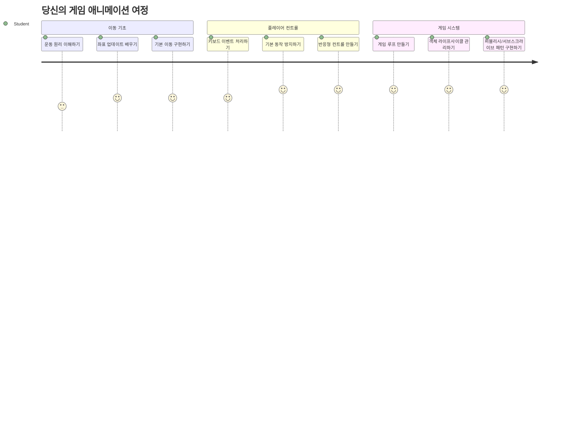
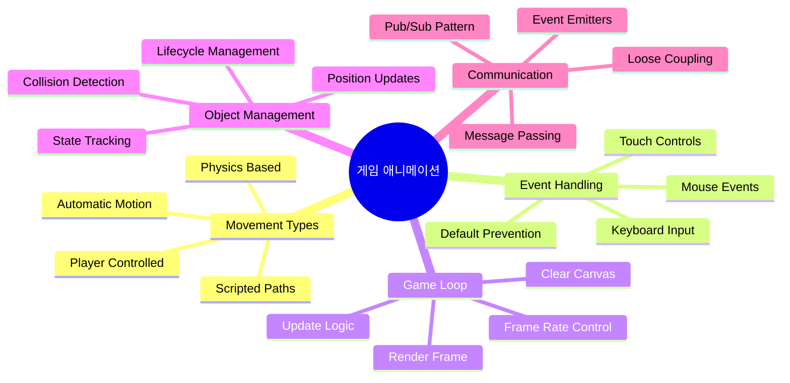
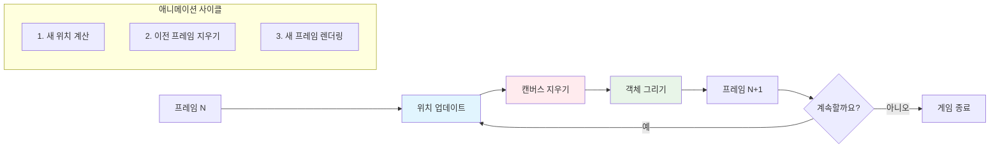
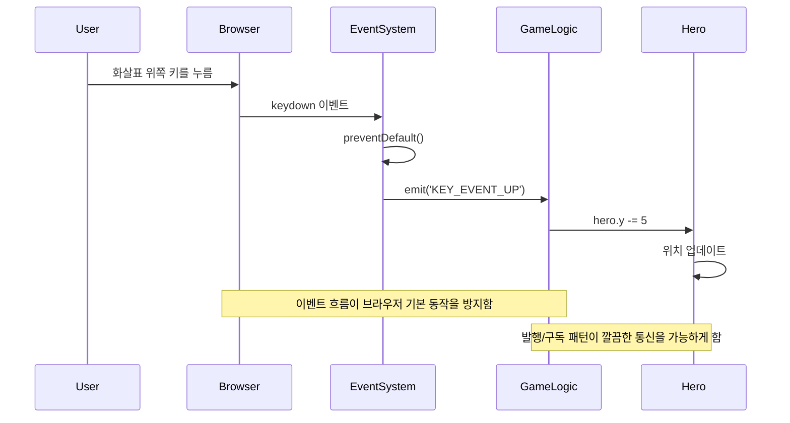
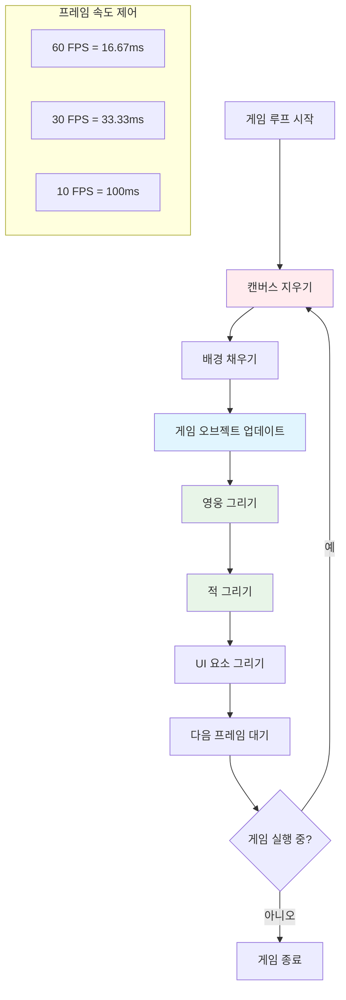
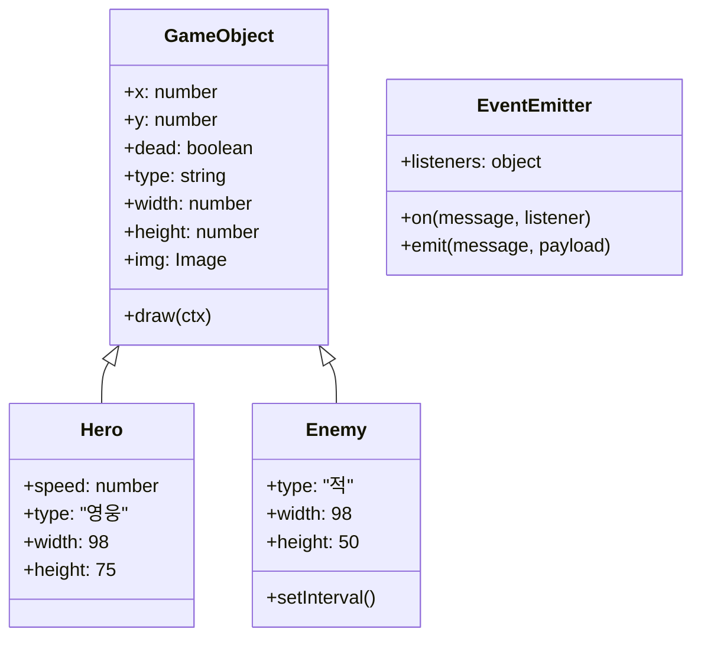
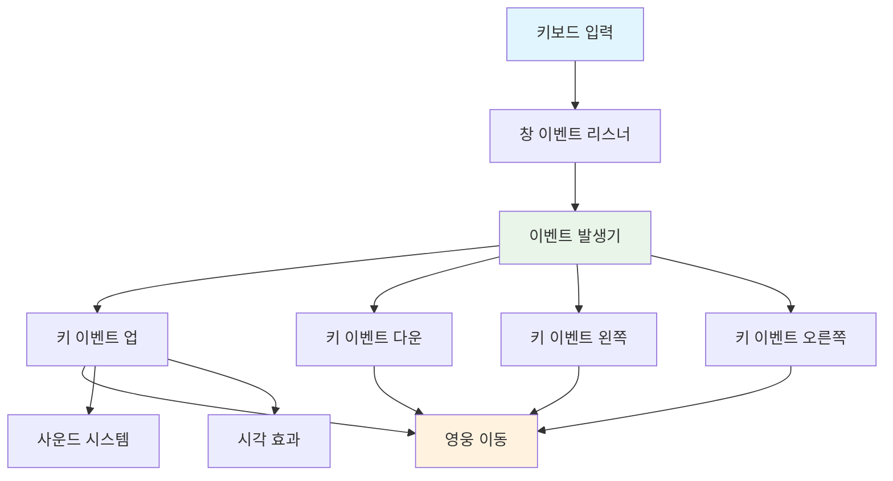
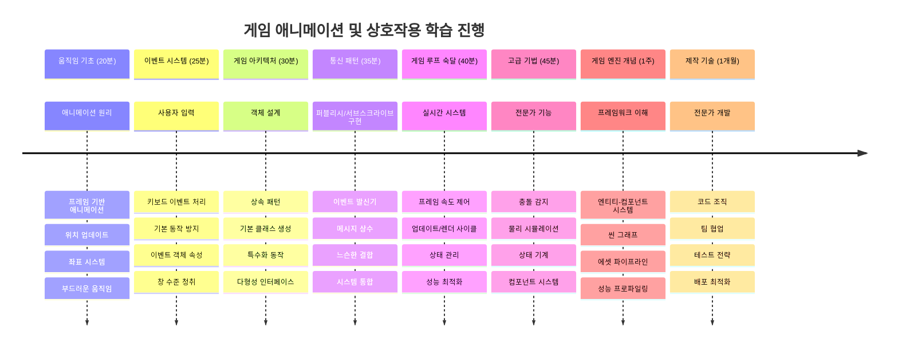

# 스페이스 게임 만들기 3부: 모션 추가하기


여러분이 좋아하는 게임들을 생각해보세요 – 그 게임들이 매혹적인 이유는 단지 예쁜 그래픽 때문만이 아니라, 모든 것이 움직이고 여러분의 행동에 반응하는 방식 때문입니다. 지금 여러분의 스페이스 게임은 아름다운 그림과 같지만, 이제 게임에 생명을 불어넣는 움직임을 추가하려고 합니다.

NASA 엔지니어들이 아폴로 미션의 유도 컴퓨터를 프로그래밍할 때 비슷한 도전에 직면했습니다: 우주선이 조종사의 입력에 반응하면서도 자동으로 경로 수정을 유지하게 하려면 어떻게 해야 할까요? 오늘 배울 원리는 바로 그와 같은 개념—플레이어가 조종하는 움직임과 자동 시스템 동작의 조화를 다룹니다.

이번 강의에서는 우주선이 화면을 활공하고 플레이어 명령에 반응하며 부드러운 움직임 패턴을 만드는 방법을 배울 것입니다. 모든 내용을 자연스럽게 연결되는 관리 가능한 개념들로 나누어 설명할 것입니다.

끝까지 배우면 플레이어가 영웅 우주선을 화면 여기저기로 날리며 적 함선들이 머리 위를 순찰하는 모습을 구현할 수 있을 것입니다. 더 중요하게는, 게임의 움직임 시스템을 작동시키는 핵심 원리를 이해하게 될 것입니다.


## 강의 전 퀴즈

[강의 전 퀴즈](https://ff-quizzes.netlify.app/web/quiz/33)

## 게임 움직임 이해하기

게임은 사물이 움직이기 시작하면 생동감이 생기는데, 기본적으로 이는 두 가지 방식으로 일어납니다:

- **플레이어가 조종하는 움직임**: 키를 누르거나 마우스를 클릭할 때 무언가가 움직입니다. 이것은 여러분과 게임 세계 간 직접적인 연결고리입니다.
- **자동 움직임**: 게임 자체가 움직임을 결정합니다 – 예를 들어 적 함선들이 플레이어가 무엇을 하든 상관없이 화면을 순찰하는 모습 등입니다.

컴퓨터 화면에서 객체를 움직이는 것은 생각보다 간단합니다. 수학 시간에 배운 x와 y 좌표 기억나나요? 정말 그걸 이용하는 겁니다. 갈릴레오가 1610년에 목성의 위성을 추적했을 때도 본질적으로 같은 일을 했습니다 — 시간이 지남에 따라 위치를 플로팅해서 움직임 패턴을 이해하려고 했죠.

화면에서 물체를 움직이는 건 플립북 애니메이션을 만드는 것과 같습니다 — 세 가지 간단한 단계를 따라야 합니다:


1. **위치 업데이트** – 객체가 있어야 할 위치를 변경합니다 (예: 오른쪽으로 5픽셀 이동)
2. **이전 프레임 지우기** – 화면을 지워서 잔상 같은 게 남지 않도록 합니다
3. **새 프레임 그리기** – 객체를 새 위치에 다시 그립니다

이 작업을 충분히 빠르게 하면 부드러운 움직임이 만들어져 플레이어가 자연스럽다고 느끼게 됩니다.

코드로는 이렇게 보일 수 있습니다:

```javascript
// 영웅의 위치를 설정합니다
hero.x += 5;
// 영웅이 위치한 직사각형을 지웁니다
ctx.clearRect(0, 0, canvas.width, canvas.height);
// 게임 배경과 영웅을 다시 그립니다
ctx.fillRect(0, 0, canvas.width, canvas.height);
ctx.fillStyle = "black";
ctx.drawImage(heroImg, hero.x, hero.y);
```

**이 코드의 역할은 다음과 같습니다:**
- 영웅의 x좌표를 5픽셀만큼 증가시켜 수평 이동 시킵니다
- 이전 프레임을 제거하기 위해 캔버스 전체를 지웁니다
- 캔버스 배경을 검은색으로 채웁니다
- 영웅 이미지를 새로운 위치에 다시 그립니다

✅ 초당 여러 프레임에서 영웅을 다시 그리면 성능 비용이 발생할 수 있는 이유를 생각해보세요. [이 패턴의 대안](https://developer.mozilla.org/en-US/docs/Web/API/Canvas_API/Tutorial/Optimizing_canvas)에 대해 읽어보세요.

## 키보드 이벤트 처리하기

여기서 플레이어 입력과 게임 동작을 연결합니다. 누군가 스페이스 바를 눌러 레이저를 쏘거나 화살표 키를 눌러 소행성을 피할 때, 게임은 그 입력을 감지하고 반응해야 합니다.

키보드 이벤트는 윈도우 수준에서 발생합니다. 즉, 전체 브라우저 창이 키 입력을 듣고 있는 셈입니다. 마우스 클릭은 특정 요소에 연결될 수 있지만 (예: 버튼 클릭), 스페이스 게임에서는 고전 아케이드 느낌을 주기 때문에 키보드 조작에 집중할 것입니다.

이것은 1800년대 전신사가 모스 부호 입력을 의미 있는 메시지로 번역해야 했던 것과 비슷합니다 — 우리는 키 입력을 게임 명령으로 번역하는 비슷한 작업을 하는 셈이죠.

이벤트를 처리하려면 window의 `addEventListener()` 메서드를 사용하며 두 개의 입력 파라미터를 제공합니다. 첫 번째는 이벤트 이름, 예를 들어 `keyup`이며, 두 번째는 이벤트 발생 시 호출될 함수입니다.

예시는 다음과 같습니다:

```javascript
window.addEventListener('keyup', (evt) => {
  // evt.key = 키의 문자열 표현
  if (evt.key === 'ArrowUp') {
    // 무언가를 수행하다
  }
});
```

**여기서 일어나는 일을 분해해보면:**
- 전체 윈도우에서 키보드 이벤트를 수신합니다
- 어떤 키가 눌렸는지 정보를 담은 이벤트 객체를 캡처합니다
- 눌린 키가 특정 키(예: 위쪽 화살표)인지 확인합니다
- 조건이 충족되면 코드를 실행합니다

키 이벤트에서 사용할 수 있는 두 가지 속성이 있습니다:

- `key` - 눌린 키를 문자열로 표현, 예: `'ArrowUp'`
- `keyCode` - 숫자 코드, 예: `37`은 `ArrowLeft`에 해당

✅ 키 이벤트 조작은 게임 개발 외부에도 유용합니다. 이 기술이 활용될 수 있는 다른 사례를 생각해보세요.


### 특수 키: 주의할 점!

일부 키는 내장된 브라우저 동작을 갖고 있어서 게임을 방해할 수 있습니다. 화살표 키는 페이지를 스크롤하고 스페이스 바는 페이지를 아래로 이동시키죠 — 우주선을 조종 중인 플레이어에게는 원하지 않는 행동입니다.

우리는 이런 기본 동작을 막고 게임이 입력을 직접 처리하도록 할 수 있습니다. 이는 초기 컴퓨터 프로그래머가 시스템 인터럽트를 무시하고 맞춤형 동작을 만들었던 것과 비슷합니다 — 단지 여기서는 브라우저 차원에서 수행합니다. 방법은 다음과 같습니다:

```javascript
const onKeyDown = function (e) {
  console.log(e.keyCode);
  switch (e.keyCode) {
    case 37:
    case 39:
    case 38:
    case 40: // 방향키
    case 32:
      e.preventDefault();
      break; // 스페이스
    default:
      break; // 다른 키를 차단하지 않음
  }
};

window.addEventListener('keydown', onKeyDown);
```

**이 방지 코드 이해하기:**
- 문제가 될 수 있는 특정 키 코드가 눌렸는지 검사합니다
- 화살표 키와 스페이스 바에 대한 브라우저 기본 동작을 막습니다
- 다른 키는 정상적으로 동작하도록 허용합니다
- `e.preventDefault()`를 사용해 브라우저 기본 동작을 멈춥니다

### 🔄 **학습 점검**
**이벤트 처리 이해도**: 자동 움직임으로 넘어가기 전에 다음을 확실히 이해하세요:
- ✅ `keydown`과 `keyup` 이벤트 차이 설명 가능
- ✅ 기본 브라우저 동작을 막는 이유 이해
- ✅ 이벤트 리스너가 사용자 입력과 게임 로직을 연결하는 방식 설명 가능
- ✅ 게임 제어를 방해할 수 있는 키들 식별 가능

**빠른 자기 점검**: 화살표 키에 대해 기본 동작을 막지 않으면 어떤 일이 벌어질까요?
*답: 브라우저가 페이지를 스크롤해서 게임 움직임을 방해한다*

**이벤트 시스템 구조**: 지금 이해한 내용:
- **윈도우 수준 청취**: 브라우저 레벨에서 이벤트 캡처
- **이벤트 객체 속성**: `key` 문자열과 `keyCode` 숫자
- **기본 차단**: 불필요한 브라우저 동작 멈추기
- **조건문 논리**: 특정 키 조합에 반응하기

## 게임 주도 움직임

이제 플레이어 입력 없이 움직이는 객체에 대해 이야기해봅시다. 화면을 가로지르는 적 함선, 직선으로 날아가는 총알, 배경을 떠다니는 구름 등을 생각해보세요. 이런 자율 움직임은 플레이어가 조종하지 않아도 게임 세계에 생기를 불어넣습니다.

자바스크립트 내장 타이머를 사용해 일정 간격마다 위치를 업데이트합니다. 이 개념은 진자 시계가 규칙적인 메커니즘으로 일정 시간 간격에 동작을 촉발하는 원리와 비슷합니다. 이렇게 간단할 수 있습니다:

```javascript
const id = setInterval(() => {
  // 적을 y 축으로 이동시키기
  enemy.y += 10;
}, 100);
```

**이 움직임 코드가 하는 일:**
- 100밀리초마다 실행되는 타이머를 만듭니다
- 매번 적의 y좌표를 10픽셀씩 증가시켜 아래로 이동시킵니다
- 나중에 중지할 수 있게 인터벌 ID를 저장합니다
- 적을 자동으로 화면 아래로 움직입니다

## 게임 루프

모든 것을 연결하는 핵심 개념이 바로 게임 루프입니다. 만약 게임이 영화라면, 게임 루프는 필름 프로젝터와 같아서 매우 빠르게 프레임을 보여주어 자연스럽게 움직임을 연출합니다.

모든 게임은 이 루프를 백그라운드에서 실행합니다. 이는 모든 게임 객체를 업데이트하고 화면을 다시 그리며, 이 과정을 계속 반복하는 함수입니다. 이 함수가 영웅, 모든 적, 날아다니는 레이저 등 게임 상태 전체를 관리합니다.

이 개념은 초기 영화 애니메이터들이 움직임 환상을 만들기 위해 매 프레임 캐릭터를 다시 그렸던 것과 유사합니다. 우리는 연필 대신 코드로 같은 작업을 합니다.

일반적인 게임 루프는 코드로 다음과 같이 보일 수 있습니다:


```javascript
const gameLoopId = setInterval(() => {
  function gameLoop() {
    ctx.clearRect(0, 0, canvas.width, canvas.height);
    ctx.fillStyle = "black";
    ctx.fillRect(0, 0, canvas.width, canvas.height);
    drawHero();
    drawEnemies();
    drawStaticObjects();
  }
  gameLoop();
}, 200);
```

**게임 루프 구조 이해하기:**
- 이전 프레임을 지우기 위해 캔버스 전체를 클리어합니다
- 배경을 단색으로 채웁니다
- 현재 위치에 모든 게임 객체들을 그립니다
- 200밀리초마다 이 과정을 반복해 부드러운 애니메이션 생성
- 인터벌 타이밍으로 프레임 속도 관리

## 스페이스 게임 계속하기

이제 이전에 만든 정적인 장면에 움직임을 추가합니다. 스크린샷 같은 화면을 인터랙티브한 경험으로 바꾸려 합니다. 하나씩 차근차근 작업해서 각 부분이 자연스럽게 이어지도록 하겠습니다.

이전 강의에서 끝난 부분의 코드를 가져오거나, 새로 시작하려면 [Part II- starter](../../../../6-space-game/3-moving-elements-around/your-work) 폴더의 코드를 사용하세요.

**오늘 만들 내용:**
- **영웅 조종**: 화살표 키를 사용해 우주선을 화면에서 조종
- **적 이동**: 외계 함선들이 전진 시작

기능 구현을 시작합시다.

## 추천 단계

`your-work` 하위 폴더에 생성된 파일들을 찾으세요. 다음이 포함되어 있을 것입니다:

```bash
-| assets
  -| enemyShip.png
  -| player.png
-| index.html
-| app.js
-| package.json
```

`your-work` 폴더에서 프로젝트를 시작하려면 다음을 입력합니다:

```bash
cd your-work
npm start
```

**이 명령어 역할:**
- 프로젝트 디렉터리로 이동합니다
- 주소 `http://localhost:5000`에서 HTTP 서버를 시작합니다
- 게임 파일을 브라우저에서 테스트할 수 있도록 서비스합니다

위 명령을 실행하면 `http://localhost:5000`에 HTTP 서버가 열립니다. 브라우저에서 해당 주소를 열면 영웅과 모든 적들이 표시되지만 아직 움직이지는 않을 것입니다!

### 코드 추가

1. `hero`, `enemy`, `game object`에 대한 전용 객체를 추가하세요. 각 객체는 `x`와 `y` 속성을 가져야 합니다. ([상속 또는 조합](../README.md) 부분 기억하세요.)

   *힌트* `game object`는 `x`와 `y`를 가지고 화면에 스스로 그릴 수 있어야 합니다.

   > **팁**: 아래 생성자와 함께 새로운 `GameObject` 클래스를 추가한 다음 캔버스에 그려보세요:

    ```javascript
    class GameObject {
      constructor(x, y) {
        this.x = x;
        this.y = y;
        this.dead = false;
        this.type = "";
        this.width = 0;
        this.height = 0;
        this.img = undefined;
      }
    
      draw(ctx) {
        ctx.drawImage(this.img, this.x, this.y, this.width, this.height);
      }
    }
    ```

    **이 기본 클래스 이해하기:**
    - 모든 게임 객체가 공유하는 공통 속성 정의 (위치, 크기, 이미지)
    - 객체 제거 여부를 추적하는 `dead` 플래그 포함
    - 캔버스에 객체를 렌더링하는 `draw()` 메서드 제공
    - 자식 클래스가 덮어쓸 수 있도록 기본값 설정


    이제 이 `GameObject`를 확장해 `Hero`와 `Enemy`를 만드세요:
    
    ```javascript
    class Hero extends GameObject {
      constructor(x, y) {
        super(x, y);
        this.width = 98;
        this.height = 75;
        this.type = "Hero";
        this.speed = 5;
      }
    }
    ```

    ```javascript
    class Enemy extends GameObject {
      constructor(x, y) {
        super(x, y);
        this.width = 98;
        this.height = 50;
        this.type = "Enemy";
        const id = setInterval(() => {
          if (this.y < canvas.height - this.height) {
            this.y += 5;
          } else {
            console.log('Stopped at', this.y);
            clearInterval(id);
          }
        }, 300);
      }
    }
    ```

    **이 클래스들에서 핵심 개념:**
    - `extends` 키워드로 `GameObject`를 상속합니다
    - 부모 생성자에 `super(x, y)` 호출합니다
    - 각 객체 유형에 맞는 크기와 속성 설정
    - `setInterval()`을 사용해 적의 자동 이동 구현

2. 키보드 내비게이션(영웅 위/아래/좌/우 이동)을 처리하는 키 이벤트 핸들러를 추가하세요.

   *기억하세요* 좌표계는 카르테시안 시스템으로, 왼쪽 위가 `0,0`입니다. 그리고 *기본 동작을 막는* 코드도 추가해야 합니다.

   > **팁**: `onKeyDown` 함수를 만들고 윈도우에 연결하세요:

   ```javascript
   const onKeyDown = function (e) {
     console.log(e.keyCode);
     // 기본 동작을 중지하기 위해 위 수업에서 코드를 추가하세요
     switch (e.keyCode) {
       case 37:
       case 39:
       case 38:
       case 40: // 방향키
       case 32:
         e.preventDefault();
         break; // 스페이스바
       default:
         break; // 다른 키를 차단하지 않음
     }
   };

   window.addEventListener("keydown", onKeyDown);
   ```
    
   **이 이벤트 핸들러가 하는 일:**
   - 전체 윈도우에서 keydown 이벤트를 청취합니다
   - 눌린 키 코드를 콘솔에 기록해 어떤 키가 눌렸는지 디버깅 도움
   - 화살표 키와 스페이스바의 기본 브라우저 동작을 막습니다
   - 다른 키는 정상 동작하도록 허용

   이 시점에서 브라우저 콘솔을 확인하고 눌린 키가 기록되는지 지켜보세요.

3. 남은 부분 작업은 [Pub sub 패턴](../README.md)을 구현하세요. 이 패턴은 코드를 깔끔하게 유지하는 데 도움을 줍니다.

   발행-구독 패턴은 이벤트 감지와 이벤트 처리를 분리해 코드 구조를 모듈화하고 유지보수를 쉽게 합니다.

   마지막으로 이렇게 진행하세요:

   1. 윈도우에 이벤트 리스너 추가:

       ```javascript
       window.addEventListener("keyup", (evt) => {
         if (evt.key === "ArrowUp") {
           eventEmitter.emit(Messages.KEY_EVENT_UP);
         } else if (evt.key === "ArrowDown") {
           eventEmitter.emit(Messages.KEY_EVENT_DOWN);
         } else if (evt.key === "ArrowLeft") {
           eventEmitter.emit(Messages.KEY_EVENT_LEFT);
         } else if (evt.key === "ArrowRight") {
           eventEmitter.emit(Messages.KEY_EVENT_RIGHT);
         }
       });
       ```

   **이 이벤트 시스템 역할:**
   - 키보드 입력을 감지하고 커스텀 게임 이벤트로 변환
   - 입력 감지와 게임 로직 분리
   - 나중에 컨트롤을 쉽게 변경 가능
   - 여러 시스템이 같은 입력에 반응할 수 있게 함


   2. 메시지를 발행하고 구독하는 EventEmitter 클래스 만들기:

       ```javascript
       class EventEmitter {
         constructor() {
           this.listeners = {};
         }
       
         on(message, listener) {
           if (!this.listeners[message]) {
             this.listeners[message] = [];
           }
           this.listeners[message].push(listener);
         }
       

   3. 상수 정의하고 EventEmitter 설정:

       ```javascript
       const Messages = {
         KEY_EVENT_UP: "KEY_EVENT_UP",
         KEY_EVENT_DOWN: "KEY_EVENT_DOWN",
         KEY_EVENT_LEFT: "KEY_EVENT_LEFT",
         KEY_EVENT_RIGHT: "KEY_EVENT_RIGHT",
       };
       
       let heroImg, 
           enemyImg, 
           laserImg,
           canvas, ctx, 
           gameObjects = [], 
           hero, 
           eventEmitter = new EventEmitter();
       ```

   **설정 내용 이해하기:**
   - 오타 방지 및 리팩토링 용이성을 위한 메시지 상수 정의
   - 이미지, 캔버스 컨텍스트, 게임 상태 변수 선언
   - 발행-구독 시스템을 위한 전역 이벤트 발행기 생성
   - **모든 게임 오브젝트를 담을 배열을 초기화합니다**

   4. **게임 초기화**

       ```javascript
       function initGame() {
         gameObjects = [];
         createEnemies();
         createHero();
       
         eventEmitter.on(Messages.KEY_EVENT_UP, () => {
           hero.y -= 5;
         });
       
         eventEmitter.on(Messages.KEY_EVENT_DOWN, () => {
           hero.y += 5;
         });
       
         eventEmitter.on(Messages.KEY_EVENT_LEFT, () => {
           hero.x -= 5;
         });
       
4. **게임 루프 설정**

   `window.onload` 함수를 리팩터링하여 게임을 초기화하고 적절한 간격으로 게임 루프를 설정하세요. 또한 레이저 빔도 추가할 것입니다:

    ```javascript
    window.onload = async () => {
      canvas = document.getElementById("canvas");
      ctx = canvas.getContext("2d");
      heroImg = await loadTexture("assets/player.png");
      enemyImg = await loadTexture("assets/enemyShip.png");
      laserImg = await loadTexture("assets/laserRed.png");
    
      initGame();
      const gameLoopId = setInterval(() => {
        ctx.clearRect(0, 0, canvas.width, canvas.height);
        ctx.fillStyle = "black";
        ctx.fillRect(0, 0, canvas.width, canvas.height);
        drawGameObjects(ctx);
      }, 100);
    };
    ```

   **게임 설정 이해하기:**
   - **페이지가 완전히 로드될 때까지 대기합니다**
   - **캔버스 요소와 2D 렌더링 컨텍스트를 가져옵니다**
   - **모든 이미지 자산을 비동기적으로 `await`를 사용해 로드합니다**
   - **100ms 간격(초당 10프레임)으로 게임 루프를 시작합니다**
   - **각 프레임마다 전체 화면을 지우고 다시 그립니다**

5. **일정 간격으로 적들을 이동시키는 코드 추가**

    `createEnemies()` 함수를 리팩터링하여 적들을 생성하고 새 게임 오브젝트 클래스에 추가하도록 만드세요:

    ```javascript
    function createEnemies() {
      const MONSTER_TOTAL = 5;
      const MONSTER_WIDTH = MONSTER_TOTAL * 98;
      const START_X = (canvas.width - MONSTER_WIDTH) / 2;
      const STOP_X = START_X + MONSTER_WIDTH;
    
      for (let x = START_X; x < STOP_X; x += 98) {
        for (let y = 0; y < 50 * 5; y += 50) {
          const enemy = new Enemy(x, y);
          enemy.img = enemyImg;
          gameObjects.push(enemy);
        }
      }
    }
    ```

    **적 생성의 동작:**
    - **적들을 화면 중앙에 배치하기 위해 위치를 계산합니다**
    - **중첩 루프를 사용해 적 그리드를 만듭니다**
    - **각 적 오브젝트에 적 이미지 할당**
    - **각 적을 전역 게임 오브젝트 배열에 추가**
    
    그리고 비슷한 과정을 영웅을 위해 처리하는 `createHero()` 함수를 추가하세요.
    
    ```javascript
    function createHero() {
      hero = new Hero(
        canvas.width / 2 - 45,
        canvas.height - canvas.height / 4
      );
      hero.img = heroImg;
      gameObjects.push(hero);
    }
    ```

    **영웅 생성 동작:**
    - **영웅을 화면 하단 중앙에 위치시킵니다**
    - **영웅 오브젝트에 영웅 이미지 할당**
    - **렌더링을 위해 게임 오브젝트 배열에 영웅 추가**

    마지막으로, 그리기를 시작하는 `drawGameObjects()` 함수를 추가하세요:

    ```javascript
    function drawGameObjects(ctx) {
      gameObjects.forEach(go => go.draw(ctx));
    }
    ```

    **그리기 함수 이해하기:**
    - **배열의 모든 게임 오브젝트를 순회**
    - **각 오브젝트의 `draw()` 메서드 호출**
    - **오브젝트들이 스스로 렌더링할 수 있게 캔버스 컨텍스트 전달**

    ### 🔄 **교육적 점검**
    **완전한 게임 시스템 이해**: 전체 아키텍처를 완전히 숙지했는지 확인하세요:
    - ✅ 상속은 어떻게 Hero와 Enemy가 공통 GameObject 속성을 공유하도록 할까요?
    - ✅ pub/sub 패턴이 코드를 더 유지보수하기 쉽게 하는 이유는 무엇일까요?
    - ✅ 게임 루프는 부드러운 애니메이션 생성에 어떤 역할을 할까요?
    - ✅ 이벤트 리스너는 어떻게 사용자 입력을 게임 오브젝트 동작에 연결할까요?

    **시스템 통합**: 게임은 이제 다음을 나타냅니다:
    - **객체 지향 설계**: 기본 클래스와 특화된 상속
    - **이벤트 기반 아키텍처**: 느슨한 결합을 위한 pub/sub 패턴
    - **애니메이션 프레임워크**: 일관된 프레임 업데이트를 가진 게임 루프
    - **입력 처리**: 기본 동작 방지를 포함한 키보드 이벤트
    - **자산 관리**: 이미지 로딩 및 스프라이트 렌더링

    **전문 패턴**: 다음을 구현했습니다:
    - **관심사의 분리**: 입력, 로직, 렌더링 분리
    - **다형성**: 모든 게임 오브젝트가 공통 그리기 인터페이스 공유
    - **메시지 전달**: 컴포넌트 간 깔끔한 통신
    - **리소스 관리**: 효율적인 스프라이트 및 애니메이션 처리

    적들이 당신의 영웅 우주선 쪽으로 이동하기 시작할 것입니다!
      }
    }
    ```
    
    and add a `createHero()` function to do a similar process for the hero.
    
    ```javascript
    function createHero() {
      hero = new Hero(
        canvas.width / 2 - 45,
        canvas.height - canvas.height / 4
      );
      hero.img = heroImg;
      gameObjects.push(hero);
    }
    ```

    마지막으로, 그리기를 시작하는 `drawGameObjects()` 함수를 추가하세요:

    ```javascript
    function drawGameObjects(ctx) {
      gameObjects.forEach(go => go.draw(ctx));
    }
    ```

    적들이 당신의 영웅 우주선 쪽으로 이동하기 시작할 것입니다!

---

## GitHub Copilot Agent 도전 과제 🚀

여기 게임의 완성도를 높일 수 있는 도전 과제가 있습니다: 경계 설정과 부드러운 컨트롤 추가. 현재 영웅은 화면 밖으로 나갈 수 있고, 움직임도 뚝뚝 끊기는 느낌이 있습니다.

**당신의 임무:** 화면 경계를 구현하고 부드러운 움직임을 만들어 우주선이 더 현실적으로 느껴지도록 하세요. 이는 NASA의 비행 제어 시스템이 우주선이 안전 작동 한계를 넘지 않도록 하는 것과 유사합니다.

**만들어야 할 것:** 영웅 우주선이 화면 안에 머무르게 하고, 플레이어가 방향키를 누르고 있으면 배가 연속해서 부드럽게 미끄러지듯 움직이는 시스템을 만드세요. 우주선이 화면 경계에 닿으면 플레이 영역의 경계를 보여주는 은은한 시각적 피드백 효과를 고려해 보세요.

[agent mode](https://code.visualstudio.com/blogs/2025/02/24/introducing-copilot-agent-mode)에 대해 더 알아보세요.

## 🚀 도전 과제

프로젝트가 커질수록 코드 조직화가 훨씬 중요해집니다. 함수, 변수, 클래스가 한 파일에 뒤섞여 있는 걸 눈치챘을 겁니다. 이 모습은 아폴로 미션 코드를 담당한 엔지니어들이 여러 팀이 동시에 작업할 수 있도록 명확하고 유지보수 가능한 시스템을 설계했던 방식을 떠올리게 합니다.

**당신의 임무:**
소프트웨어 아키텍트처럼 생각하세요. 6개월 후 당신 혹은 동료가 코드를 이해할 수 있도록 어떻게 코드를 구성할까요? 지금 당장은 한 파일에 모든 게 있어도 더 나은 조직화는 가능합니다:

- **관련 함수들을 명확한 주석 헤더로 그룹화하기**
- **관심사의 분리** - 게임 로직과 렌더링을 분리하기
- **일관된 이름 규칙** 사용하기
- **게임의 다양한 측면을 모듈이나 네임스페이스로 조직하기**
- **각 주요 부분의 목적을 설명하는 문서 추가하기**

**성찰 질문:**
- 코드를 다시 볼 때 가장 이해하기 어려운 부분은 어디인가요?
- 다른 사람이 기여하기 쉽게 코드를 어떻게 조직할 수 있을까요?
- 파워업이나 다양한 적 유형 같은 새 기능을 추가하려면 어떻게 될까요?

## 강의 후 퀴즈

[강의 후 퀴즈](https://ff-quizzes.netlify.app/web/quiz/34)

## 복습 및 자기주도 학습

우리는 모든 걸 처음부터 직접 만들었는데, 이건 배우기에 훌륭합니다. 하지만 비밀 하나를 알려드리자면, 훌륭한 자바스크립트 프레임워크들이 많아서 무거운 작업의 상당 부분을 대신 처리해 줍니다. 기본기를 익혔으면 [사용 가능한 프레임워크](https://github.com/collections/javascript-game-engines)를 탐색하는 것도 추천합니다.

프레임워크는 모든 도구를 직접 만드는 대신 잘 갖춰진 공구 상자를 갖는 것과 같습니다. 코드 조직에서 겪는 문제를 해결해줄 뿐만 아니라, 직접 만들면 몇 주가 걸릴 기능들도 제공합니다.

**탐색할 가치가 있는 주제:**
- 게임 엔진들이 코드를 어떻게 조직하는지 – 놀라운 패턴들
- 캔버스 게임을 부드럽게 작동시키는 성능 팁
- 코드를 더 깔끔하고 유지보수 가능하게 하는 최신 자바스크립트 기능
- 게임 오브젝트와 관계 관리에 대한 다양한 접근법

## 🎯 게임 애니메이션 마스터 타임라인


### 🛠️ 당신의 게임 개발 도구 요약

이번 레슨을 완료한 후, 당신은 다음을 마스터했습니다:
- **애니메이션 원리**: 프레임 기반 움직임과 부드러운 전환
- **이벤트 기반 프로그래밍**: 키보드 입력 처리와 적절한 이벤트 관리
- **객체 지향 설계**: 상속 계층과 다형성 인터페이스
- **통신 패턴**: 유지보수 가능한 코드를 위한 pub/sub 아키텍처
- **게임 루프 아키텍처**: 실시간 업데이트와 렌더링 사이클
- **입력 시스템**: 기본 동작 방지와 함께하는 사용자 제어 매핑
- **자산 관리**: 스프라이트 로딩 및 효율적인 렌더링 기법

### ⚡ **다음 5분 동안 할 수 있는 일**
- [ ] 브라우저 콘솔을 열고 `addEventListener('keydown', console.log)`를 실행해 키보드 이벤트 보는 연습
- [ ] 간단한 div 요소를 만들고 방향키로 움직여 보기
- [ ] `setInterval`로 연속 움직임 실험하기
- [ ] `event.preventDefault()`로 기본 동작 방지 연습하기

### 🎯 **이번 시간에 달성할 수 있는 목표**
- [ ] 강의 후 퀴즈 완료하고 이벤트 기반 프로그래밍 이해하기
- [ ] 완전한 키보드 컨트롤의 이동하는 영웅 우주선 만들기
- [ ] 부드러운 적 움직임 패턴 구현하기
- [ ] 게임 오브젝트가 화면 밖으로 나가지 않도록 경계 추가하기
- [ ] 기본 충돌 감지 구현하기

### 📅 **1주일간의 애니메이션 여정**
- [ ] 완성도 높은 움직임과 상호작용으로 전체 스페이스 게임 완성
- [ ] 곡선, 가속, 물리 효과 같은 고급 이동 패턴 추가
- [ ] 부드러운 전환과 이징 함수 구현
- [ ] 파티클 효과와 시각 피드백 시스템 만들기
- [ ] 60fps 부드러운 게임 플레이를 위한 성능 최적화
- [ ] 모바일 터치 컨트롤과 반응형 디자인 추가

### 🌟 **1개월간의 인터랙티브 개발**
- [ ] 고급 애니메이션 시스템을 갖춘 복잡한 인터랙티브 애플리케이션 개발
- [ ] GSAP 같은 애니메이션 라이브러리 배우기 또는 직접 엔진 만들기
- [ ] 오픈 소스 게임 개발 및 애니메이션 프로젝트 기여하기
- [ ] 그래픽 집약적 애플리케이션 성능 최적화 마스터하기
- [ ] 게임 개발 및 애니메이션 관련 교육 콘텐츠 제작
- [ ] 고급 인터랙티브 프로그래밍 기술을 보여주는 포트폴리오 구축

**현실 세계 적용**: 당신의 게임 애니메이션 기술은 다음에 직접 적용됩니다:
- **인터랙티브 웹 애플리케이션**: 동적 대시보드와 실시간 인터페이스
- **데이터 시각화**: 애니메이션 차트와 인터랙티브 그래픽
- **교육용 소프트웨어**: 인터랙티브 시뮬레이션과 학습 도구
- **모바일 개발**: 터치 기반 게임과 제스처 처리
- **데스크탑 애플리케이션**: Electron 앱의 부드러운 애니메이션
- **웹 애니메이션**: CSS 및 자바스크립트 애니메이션 라이브러리

**획득한 전문 기술**: 이제 당신은 다음을 할 수 있습니다:
- **복잡성에 맞게 확장 가능한 이벤트 기반 시스템을 설계하고 아키텍처 설계**
- **수학 원리를 사용해 부드러운 애니메이션 구현**
- **브라우저 개발자 도구를 사용해 복잡한 상호작용 시스템 디버깅**
- **다양한 기기와 브라우저에 맞게 게임 성능 최적화**
- **검증된 패턴을 사용해 유지보수 가능한 코드 구조 설계**

**게임 개발 개념 숙달**:
- **프레임 속도 관리**: FPS 및 타이밍 제어 이해
- **입력 처리**: 플랫폼 간 키보드 및 이벤트 시스템
- **객체 생명주기**: 생성, 갱신, 파괴 패턴
- **상태 동기화**: 프레임 간 게임 상태 일관성 유지
- **이벤트 아키텍처**: 게임 시스템 간 느슨한 결합 통신

**다음 단계**: 충돌 감지, 점수 시스템, 사운드 효과 추가 또는 Phaser, Three.js 같은 최신 게임 프레임워크 탐험 준비 완료!

🌟 **업적 달성**: 전문 아키텍처 패턴으로 완성된 인터랙티브 게임 시스템을 구축하셨습니다!

## 과제

[코드에 주석 달기](assignment.md)

---

<!-- CO-OP TRANSLATOR DISCLAIMER START -->
**면책 조항**:  
이 문서는 AI 번역 서비스 [Co-op Translator](https://github.com/Azure/co-op-translator)를 사용하여 번역되었습니다. 정확성을 위해 노력하고 있지만, 자동 번역은 오류나 부정확한 내용이 포함될 수 있음을 유의하시기 바랍니다. 원본 문서의 원어가 권위 있는 출처로 간주되어야 합니다. 중요한 정보의 경우 전문적인 인간 번역을 권장합니다. 본 번역 사용으로 인해 발생하는 어떠한 오해나 잘못된 해석에 대해서도 당사는 책임을 지지 않습니다.
<!-- CO-OP TRANSLATOR DISCLAIMER END -->