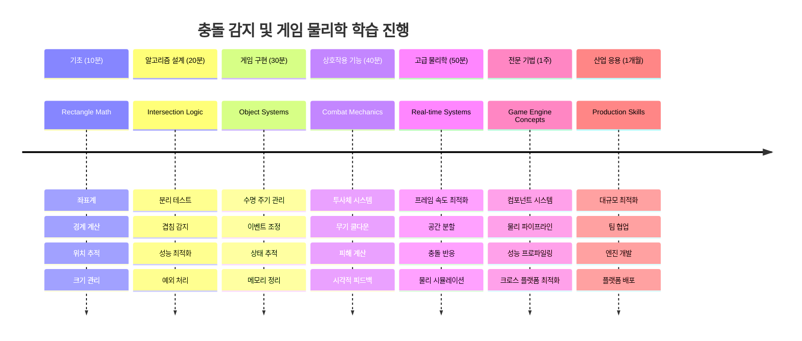

- [ ] 충돌 이벤트를 실시간으로 추적하기 위해 `console.log` 문 추가하기

### 🎯 **이번 시간에 달성할 수 있는 것**
- [ ] 수업 후 퀴즈 완료하고 충돌 감지 알고리즘 이해하기
- [ ] 충돌 시 폭발 같은 시각 효과 추가하기
- [ ] 다양한 속성을 가진 여러 종류의 투사체 구현하기
- [ ] 일시적으로 플레이어 능력을 향상시키는 파워업 만들기
- [ ] 충돌 시 더 만족스러운 효과를 위해 사운드 효과 추가하기

### 📅 **주간 물리 프로그래밍**
- [ ] 완성도 높은 충돌 시스템으로 전체 우주 게임 완성하기
- [ ] 사각형 외에 원, 다각형 등 고급 충돌 도형 구현하기
- [ ] 현실적인 폭발 효과를 위한 파티클 시스템 추가하기
- [ ] 충돌 회피를 포함한 복잡한 적 행동 구현하기
- [ ] 많은 오브젝트에 대해 성능을 향상시키는 충돌 감지 최적화
- [ ] 운동량과 현실적인 움직임 같은 물리 시뮬레이션 추가하기

### 🌟 **월간 게임 물리 마스터**
- [ ] 고급 물리 엔진과 현실적인 시뮬레이션을 사용하는 게임 빌드하기
- [ ] 3D 충돌 감지와 공간 분할 알고리즘 배우기
- [ ] 오픈 소스 물리 라이브러리 및 게임 엔진에 기여하기
- [ ] 그래픽 집약적인 애플리케이션 성능 최적화 마스터하기
- [ ] 게임 물리 및 충돌 감지에 대한 교육 콘텐츠 만들기
- [ ] 고급 물리 프로그래밍 기술을 보여주는 포트폴리오 만들기

## 🎯 충돌 감지 마스터 타임라인

### 🛠️ 게임 물리 도구 키트 요약

이 수업을 마친 후 이제 다음을 마스터했습니다:
- **충돌 수학**: 사각형 교차 알고리즘과 좌표계 이해
- **성능 최적화**: 실시간 애플리케이션에 적합한 효율적인 충돌 감지
- **객체 수명 주기 관리**: 안전한 생성, 업데이트, 파괴 패턴
- **이벤트 기반 아키텍처**: 충돌 응답을 위한 분리된 시스템 설계
- **게임 루프 통합**: 프레임 기반 물리 업데이트 및 렌더링 조정
- **입력 시스템**: 속도 제한과 피드백이 있는 반응형 컨트롤
- **메모리 관리**: 효율적인 객체 풀링 및 정리 전략

**실제 적용 분야**: 충돌 감지 기술은 다음에 직접 적용할 수 있습니다:
- **인터랙티브 시뮬레이션**: 과학 모델링 및 교육 도구
- **사용자 인터페이스 디자인**: 드래그 앤 드롭 상호작용 및 터치 감지
- **데이터 시각화**: 인터랙티브 차트 및 클릭 가능한 요소
- **모바일 개발**: 터치 제스처 인식과 충돌 처리
- **로봇 프로그래밍**: 경로 계획 및 장애물 회피
- **컴퓨터 그래픽스**: 레이 트레이싱 및 공간 알고리즘

**획득한 전문 기술**: 이제 할 수 있습니다:
- **설계** 실시간 충돌 감지를 위한 효율적인 알고리즘 구현
- **구현** 객체 복잡성에 따라 확장 가능한 물리 시스템 개발
- **디버그** 수학 원리를 사용한 복잡한 상호작용 시스템 문제 해결
- **최적화** 하드웨어 및 브라우저별 성능 조정
- **설계** 입증된 설계 패턴으로 유지보수 가능한 게임 시스템 구축

**마스터한 게임 개발 개념**:
- **물리 시뮬레이션**: 실시간 충돌 감지 및 응답
- **성능 공학**: 인터랙티브 애플리케이션에 최적화된 알고리즘
- **이벤트 시스템**: 게임 구성 요소 간 분리된 통신
- **객체 관리**: 동적 콘텐츠를 위한 효율적인 수명 주기 패턴
- **입력 처리**: 적절한 피드백이 포함된 반응형 컨트롤

**다음 단계**: Matter.js 같은 고급 물리 엔진 탐색, 3D 충돌 감지 구현, 또는 복잡한 파티클 시스템 구축 준비 완료!

🌟 **업적 달성**: 프로급 충돌 감지를 포함한 완벽한 물리 기반 상호작용 시스템을 구축했습니다!

## GitHub Copilot 에이전트 챌린지 🚀

에이전트 모드를 사용하여 다음 과제를 완료하세요:

**설명:** 영웅 함선이 수집할 때 임시 능력을 제공하는 파워업을 임의로 생성하여 충돌 감지 시스템을 확장하세요.

**프롬프트:** GameObject를 확장하는 PowerUp 클래스를 만들고, 영웅과 파워업 간 충돌 감지를 구현하세요. 발사 속도 증가(쿨다운 감소) 효과와 일시적 방어막 생성 효과의 두 가지 이상 파워업 유형을 추가하세요. 랜덤한 시간 간격과 위치에서 파워업이 생성되도록 스폰 로직을 구현하세요.

---

## 🚀 챌린지

폭발 효과를 추가하세요! [Space Art repo](../../../../6-space-game/solution/spaceArt/readme.txt)에 있는 게임 자산을 살펴보고 레이저가 외계인을 맞출 때 폭발을 추가해 보세요.

## 강의 후 퀴즈

[강의 후 퀴즈](https://ff-quizzes.netlify.app/web/quiz/36)

## 복습 및 자체 학습

지금까지 만든 게임에서 간격(인터벌)을 변경해 보세요. 변경 시 어떤 일이 일어나는지 확인하세요. [JavaScript 타이밍 이벤트](https://www.freecodecamp.org/news/javascript-timing-events-settimeout-and-setinterval/)에 대해 더 읽어보세요.

## 과제

[충돌 탐험하기](assignment.md)

---

<!-- CO-OP TRANSLATOR DISCLAIMER START -->
**면책 조항**:  
이 문서는 AI 번역 서비스 [Co-op Translator](https://github.com/Azure/co-op-translator)를 사용하여 번역되었습니다. 정확성을 위해 최선을 다하고 있으나, 자동 번역에는 오류나 부정확성이 포함될 수 있음을 유의하시기 바랍니다. 원본 문서가 권위 있는 자료로 간주되어야 합니다. 중요 정보의 경우 전문적인 사람 번역을 권장합니다. 본 번역의 사용으로 인해 발생하는 오해나 잘못된 해석에 대해 당사는 책임을 지지 않습니다.
<!-- CO-OP TRANSLATOR DISCLAIMER END -->