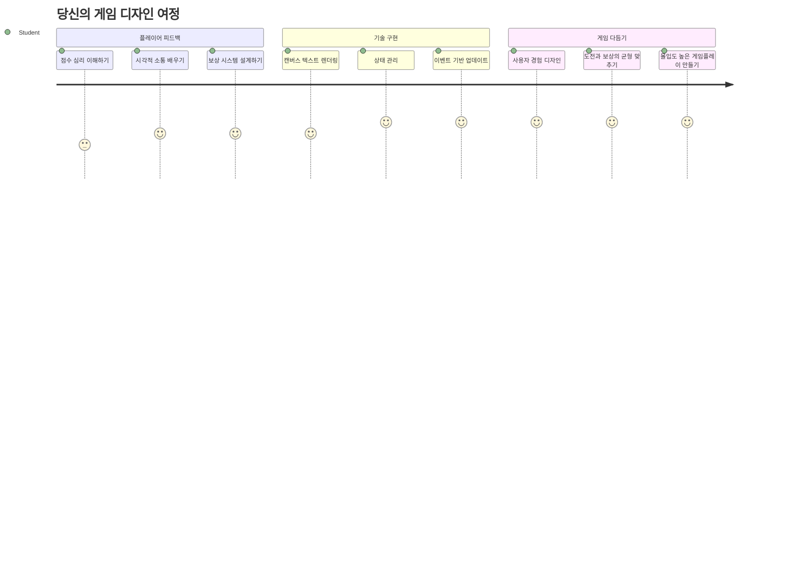
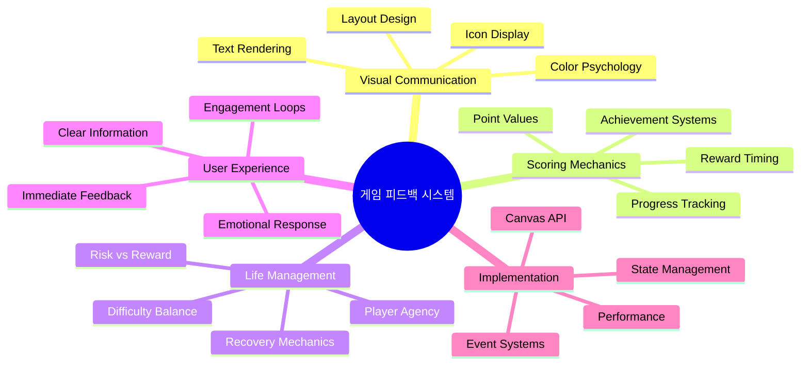
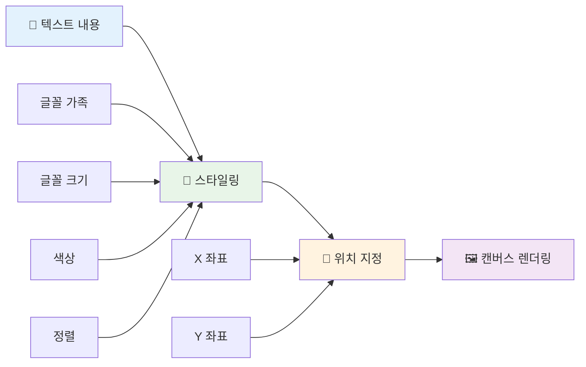
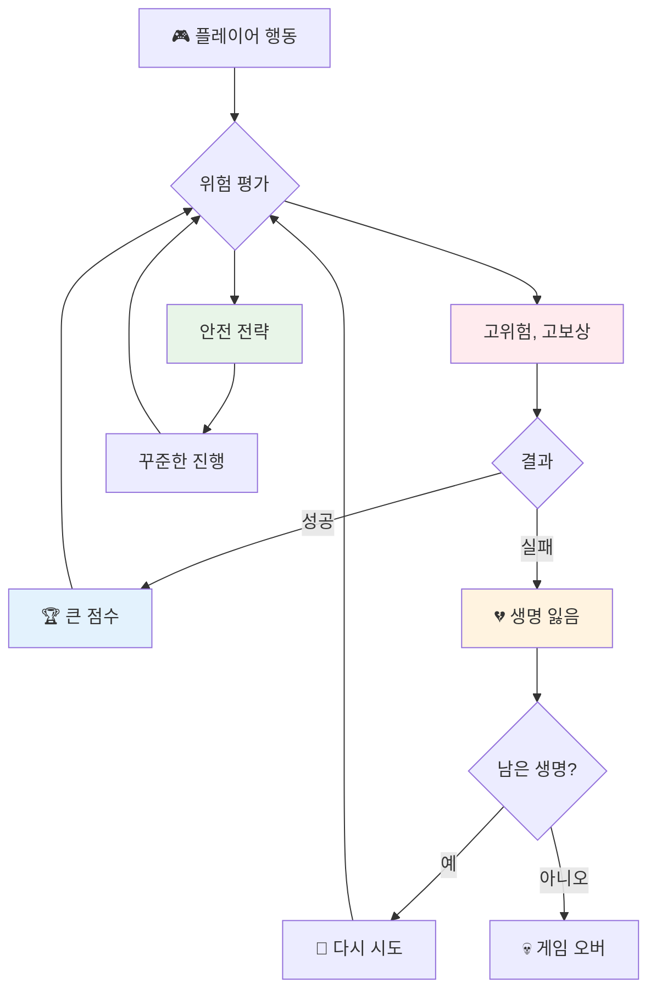
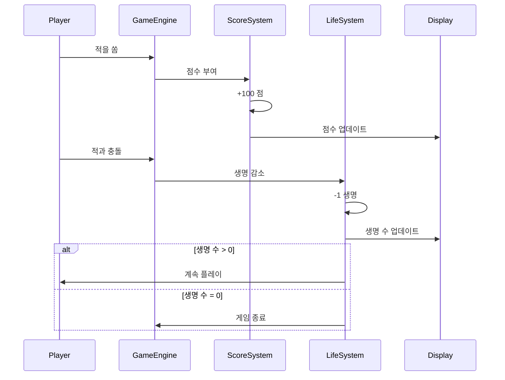
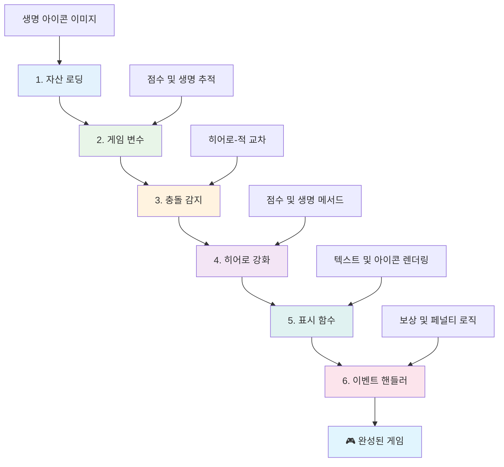
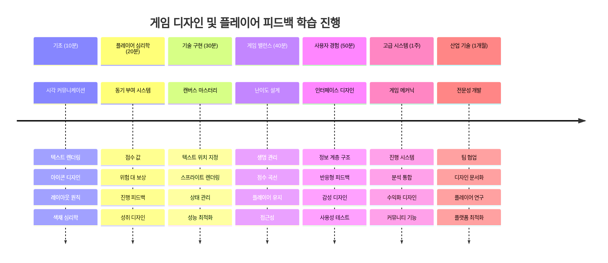

# 우주 게임 만들기 5부: 점수와 생명


## 강의 전 퀴즈

[강의 전 퀴즈](https://ff-quizzes.netlify.app/web/quiz/37)

우주 게임을 진짜 게임처럼 느끼게 만들 준비가 되었나요? 이제 점수 획득과 생명 관리라는 핵심 메커니즘을 추가해봅시다 - 이 메커니즘들이 초기 아케이드 게임인 스페이스 인베이더 같은 게임들을 단순한 시연에서 중독성 있는 오락으로 바꾸었습니다. 이제 게임이 진정으로 플레이 가능해집니다.


## 화면에 텍스트 그리기 - 당신 게임의 목소리

점수를 표시하려면 캔버스에 텍스트를 렌더링하는 방법을 배워야 합니다. `fillText()` 메서드는 이 작업에 가장 중요한 도구입니다 - 고전 아케이드 게임에서 점수와 상태 정보를 보여줄 때 쓰이는 같은 기술입니다.


텍스트 모양에 대해 완전히 제어할 수 있습니다:

```javascript
ctx.font = "30px Arial";
ctx.fillStyle = "red";
ctx.textAlign = "right";
ctx.fillText("show this on the screen", 0, 0);
```

✅ [캔버스에 텍스트 추가하기](https://developer.mozilla.org/docs/Web/API/Canvas_API/Tutorial/Drawing_text)를 더 깊이 파고들어 보세요 - 폰트와 스타일로 얼마나 창의적으로 만들 수 있는지 놀랄 수도 있습니다!

## 생명 - 단순한 숫자 이상의 의미

게임 디자인에서 '생명'은 플레이어가 실수할 수 있는 여유를 나타냅니다. 이 개념은 핀볼 기계에서 여러 개의 공을 주던 시절부터 시작되었습니다. Asteroids 같은 초기 비디오 게임에서는 생명이 플레이어가 위험을 감수하고 실수에서 배우도록 허용하는 역할을 했습니다.


시각적 표현도 매우 중요합니다 - 단순히 "생명: 3"이라고 표시하는 대신 우주선 아이콘을 보여주는 것이 즉각적인 시각적 인식을 만들어냅니다. 이는 초기 아케이드 게임 기계들이 언어 장벽을 넘어 아이콘으로 정보를 전달하던 방식과 유사합니다.

## 게임의 보상 시스템 구축

이제 플레이어의 몰입을 유지하는 핵심 피드백 시스템을 구현하겠습니다:


- **점수 시스템**: 파괴된 적 우주선마다 100점을 부여합니다 (라운드 숫자가 플레이어가 생각하기에 더 쉽습니다). 점수는 왼쪽 아래 모서리에 표시합니다.
- **생명 카운터**: 주인공은 세 개의 생명으로 시작합니다 - 초기 아케이드 게임이 도전과 플레이 가능성을 균형 맞춘 표준입니다. 적과 충돌할 때마다 한 생명이 줄어듭니다. 남은 생명은 오른쪽 아래 모서리에 우주선 아이콘으로 표시합니다 .

## 시작해 봅시다!

먼저 작업 공간을 설정하세요. `your-work` 하위 폴더의 파일들을 살펴보세요. 다음 파일들이 보여야 합니다:

```bash
-| assets
  -| enemyShip.png
  -| player.png
  -| laserRed.png
-| index.html
-| app.js
-| package.json
```

게임을 테스트하려면 `your_work` 폴더에서 개발 서버를 시작하세요:

```bash
cd your-work
npm start
```

이것은 `http://localhost:5000`에서 로컬 서버를 실행합니다. 브라우저에서 이 주소를 열어 게임을 확인하세요. 화살표 키로 컨트롤을 테스트하고 적을 쏘며 모든 기능이 제대로 작동하는지 확인하세요.


### 코딩 시작!

1. **필요한 시각 자산을 준비하세요**. `solution/assets/` 폴더에서 `life.png` 자산을 복사하여 `your-work` 폴더에 넣으세요. 그런 다음 `window.onload` 함수에 lifeImg를 추가하세요:

    ```javascript
    lifeImg = await loadTexture("assets/life.png");
    ```

1. `lifeImg`를 자산 목록에 추가하는 것을 잊지 마세요:

    ```javascript
    let heroImg,
    ...
    lifeImg,
    ...
    eventEmitter = new EventEmitter();
    ```
  
2. **게임 변수를 설정하세요**. 총 점수(0부터 시작)와 남은 생명(3부터 시작)을 추적하는 코드를 추가하세요. 화면에 이들을 표시해 플레이어가 항상 상태를 확인할 수 있게 합니다.

3. **충돌 감지 기능을 구현하세요**. `updateGameObjects()` 함수를 확장하여 적이 주인공과 충돌할 때를 감지하세요:

    ```javascript
    enemies.forEach(enemy => {
        const heroRect = hero.rectFromGameObject();
        if (intersectRect(heroRect, enemy.rectFromGameObject())) {
          eventEmitter.emit(Messages.COLLISION_ENEMY_HERO, { enemy });
        }
      })
    ```

4. **주인공에 생명과 점수 추적 기능 추가**. 
   1. **카운터 초기화**. `Hero` 클래스의 `this.cooldown = 0` 아래에 생명과 점수를 설정하세요:

        ```javascript
        this.life = 3;
        this.points = 0;
        ```

   1. **이 값들을 플레이어에게 보여주기**. 화면에 이 값을 그리는 함수를 만드세요:

        ```javascript
        function drawLife() {
          // 할 일, 35, 27
          const START_POS = canvas.width - 180;
          for(let i=0; i < hero.life; i++ ) {
            ctx.drawImage(
              lifeImg, 
              START_POS + (45 * (i+1) ), 
              canvas.height - 37);
          }
        }
        
        function drawPoints() {
          ctx.font = "30px Arial";
          ctx.fillStyle = "red";
          ctx.textAlign = "left";
          drawText("Points: " + hero.points, 10, canvas.height-20);
        }
        
        function drawText(message, x, y) {
          ctx.fillText(message, x, y);
        }

        ```

   1. **모든 것을 게임 루프에 연결하기**. `updateGameObjects()` 바로 다음에 이 함수들을 `window.onload`에 추가하세요:

        ```javascript
        drawPoints();
        drawLife();
        ```

### 🔄 **교육적 점검**
**게임 디자인 이해**: 결과를 구현하기 전에 다음을 이해했는지 확인하세요:
- ✅ 시각 피드백이 플레이어에게 게임 상태를 어떻게 전달하는지
- ✅ UI 요소의 일관된 배치가 사용성을 어떻게 향상시키는지
- ✅ 점수 값과 생명 관리에 숨겨진 심리
- ✅ 캔버스 텍스트 렌더링이 HTML 텍스트와 어떻게 다른지

**간단한 자기 점검**: 왜 아케이드 게임은 점수 값을 라운드 숫자로 사용하는가?
*답: 라운드 숫자는 플레이어가 머릿속으로 계산하기 쉽고, 만족스러운 심리적 보상을 주기 때문*

**사용자 경험 원칙**: 이제 다음을 적용하고 있습니다:
- **시각적 계층 구조**: 중요한 정보를 눈에 잘 띄는 위치에 배치
- **즉각적인 피드백**: 플레이어 동작에 실시간 반응
- **인지 부하 감소**: 간단하고 명확한 정보 제공
- **감성 디자인**: 플레이어와의 연계를 돕는 아이콘과 색상

1. **게임 결과와 보상 추가**. 이제 플레이어 행동을 의미 있게 만드는 피드백 시스템을 추가할 차례입니다:

   1. **충돌은 생명을 소모합니다**. 주인공이 적과 충돌할 때마다 생명이 줄어들어야 합니다.
   
      이 메서드를 `Hero` 클래스에 추가하세요:

        ```javascript
        decrementLife() {
          this.life--;
          if (this.life === 0) {
            this.dead = true;
          }
        }
        ```

   2. **적을 쏘면 점수를 얻습니다**. 성공적으로 적을 명중할 때마다 100점이 주어져 정확한 사격에 대한 즉각적인 긍정 피드백을 제공합니다.

      이 증가 메서드를 Hero 클래스에 확장하세요:
    
        ```javascript
          incrementPoints() {
            this.points += 100;
          }
        ```

        이제 이 함수들을 충돌 이벤트에 연결하세요:

        ```javascript
        eventEmitter.on(Messages.COLLISION_ENEMY_LASER, (_, { first, second }) => {
           first.dead = true;
           second.dead = true;
           hero.incrementPoints();
        })

        eventEmitter.on(Messages.COLLISION_ENEMY_HERO, (_, { enemy }) => {
           enemy.dead = true;
           hero.decrementLife();
        });
        ```

✅ 자바스크립트와 캔버스로 만든 다른 게임이 궁금하신가요? 한 번 탐색해보세요 - 불가능해 보였던 일들이 가능하다는 걸 알게 될지도 모릅니다!

이 기능들을 구현한 후 게임을 테스트하여 완전한 피드백 시스템이 제대로 작동하는지 확인하세요. 오른쪽 아래에 생명 아이콘이, 왼쪽 아래에 점수가 보일 것입니다. 충돌 시 생명이 줄어들고, 성공적인 사격은 점수를 올립니다.

당신의 게임은 이제 초기 아케이드 게임 만큼이나 강력한 핵심 메커니즘을 갖추었습니다 - 명확한 목표, 즉각적 피드백, 플레이어 행동의 의미 있는 결과.

### 🔄 **교육적 점검**
**완성된 게임 디자인 시스템**: 플레이어 피드백 시스템에 대한 숙련도를 확인해보세요:
- ✅ 점수 매커니즘은 어떻게 플레이어의 동기 부여와 몰입을 이끄는가?
- ✅ 시각적 일관성은 UI 디자인에 왜 중요한가?
- ✅ 생명 시스템은 도전과 플레이어 유지에 어떻게 균형을 맞추는가?
- ✅ 즉각적인 피드백이 만족스러운 게임플레이를 만드는 데 어떤 역할을 하는가?

**시스템 통합**: 당신의 피드백 시스템은 다음을 보여줍니다:
- **사용자 경험 디자인**: 명확한 시각적 의사소통과 정보 계층 구조
- **이벤트 주도 아키텍처**: 플레이어 행동에 반응하는 업데이트
- **상태 관리**: 동적 게임 데이터 추적 및 표시
- **캔버스 숙련도**: 텍스트 렌더링과 스프라이트 위치 지정
- **게임 심리학**: 플레이어 동기와 몰입 이해

**전문가 패턴**: 다음을 구현했습니다:
- **MVC 아키텍처**: 게임 로직, 데이터, 표현 분리
- **옵서버 패턴**: 게임 상태 변화를 위한 이벤트 기반 업데이트
- **컴포넌트 디자인**: 렌더링과 로직을 위한 재사용 가능 함수
- **성능 최적화**: 게임 루프에서 효율적 렌더링

### ⚡ **다음 5분 동안 할 수 있는 일**
- [ ] 점수 표시의 폰트 크기와 색상을 다르게 시도해보기
- [ ] 점수 값을 바꿔 게임플레이 느낌에 어떤 영향이 있는지 확인하기
- [ ] 점수와 생명 변화 시기를 추적하는 console.log 문 추가하기
- [ ] 생명이 모두 소진되거나 최고 점수 달성 같은 극한 상황 테스트하기

### 🎯 **이번 시간에 성취할 수 있는 목표**
- [ ] 사후 퀴즈 완료 및 게임 디자인 심리학 이해
- [ ] 점수 획득 및 생명 손실 효과음 추가
- [ ] localStorage를 사용하는 최고 점수 시스템 구현
- [ ] 적 유형별 다른 점수 값 부여
- [ ] 생명 손실 시 화면 흔들림 같은 시각 효과 추가

### 📅 **1주일간 게임 디자인 여정**
- [ ] 완성도 높은 피드백 시스템으로 전체 우주 게임 완성
- [ ] 콤보 배수 같은 고급 점수 시스템 구현
- [ ] 업적 및 잠금 해제 콘텐츠 추가
- [ ] 난이도 진행과 균형 맞추기 시스템 구축
- [ ] 메뉴와 게임 오버 화면용 사용자 인터페이스 디자인
- [ ] 다른 게임을 연구해 몰입 메커니즘 이해

### 🌟 **1개월간 게임 개발 마스터리**
- [ ] 정교한 진행 시스템이 있는 완전한 게임 제작
- [ ] 게임 분석과 플레이어 행동 측정 학습
- [ ] 오픈 소스 게임 개발 프로젝트 기여
- [ ] 고급 게임 디자인 패턴과 수익화 마스터
- [ ] 게임 디자인과 사용자 경험에 관한 교육 콘텐츠 제작
- [ ] 게임 디자인 및 개발 기술을 보여주는 포트폴리오 구축

## 🎯 게임 디자인 마스터리 타임라인


### 🛠️ 당신의 게임 디자인 도구 요약

이 강의를 완료한 후, 당신은 다음을 마스터했습니다:
- **플레이어 심리학**: 동기 부여, 위험과 보상, 몰입 루프 이해
- **시각적 의사소통**: 텍스트, 아이콘, 레이아웃을 활용한 효과적인 UI 디자인
- **피드백 시스템**: 플레이어 행동과 게임 이벤트에 실시간 반응
- **상태 관리**: 동적 게임 데이터 효율적으로 추적 및 표시
- **캔버스 텍스트 렌더링**: 스타일과 위치 지정 기능을 가진 전문적인 텍스트 표시
- **이벤트 통합**: 사용자 동작을 의미 있는 게임 결과와 연결
- **게임 균형 맞추기**: 난이도 곡선과 플레이어 진행 시스템 설계

**실제 적용 분야**: 당신의 게임 디자인 기술은 직접적으로 활용됩니다:
- **사용자 인터페이스 디자인**: 몰입도 높고 직관적인 인터페이스 제작
- **제품 개발**: 사용자 동기 및 피드백 루프 이해
- **교육 기술**: 게임화 및 학습 몰입 시스템
- **데이터 시각화**: 복잡한 정보를 쉽게 접근 가능하고 흥미롭게 표현
- **모바일 앱 개발**: 유지 메커니즘과 사용자 경험 디자인
- **마케팅 기술**: 사용자 행동과 전환 최적화 이해

**받은 전문 기술**: 이제 당신은:
- **디자인**: 사용자 몰입과 동기를 유발하는 경험 설계
- **구현**: 사용자 행동을 효과적으로 안내하는 피드백 시스템 구축
- **균형 맞추기**: 대화형 시스템에서 도전과 접근성을 조화롭게 설계
- **제작**: 다양한 사용자 집단에 어울리는 시각적 커뮤니케이션
- **분석**: 사용자 행동을 분석하고 디자인 개선 반복

**숙달한 게임 개발 개념**:
- **플레이어 동기 부여**: 몰입과 유지의 동인 이해
- **시각 디자인**: 명확하고 매력적이며 기능적인 인터페이스 제작
- **시스템 통합**: 여러 게임 시스템 연결로 일관된 경험 제공
- **성능 최적화**: 효율적인 렌더링과 상태 관리
- **접근성**: 다양한 스킬 레벨과 플레이어 요구사항에 맞춘 설계

**다음 단계**: 이제 고급 게임 디자인 패턴 탐색, 분석 시스템 구현, 게임 수익화 및 플레이어 유지 전략 연구를 할 준비가 되었습니다!

🌟 **업적 달성**: 전문 게임 디자인 원칙으로 완벽한 플레이어 피드백 시스템을 구축했습니다!

---

## GitHub Copilot 에이전트 챌린지 🚀

에이전트 모드를 사용하여 다음 챌린지를 완료하세요:

**설명:** 우주 게임의 점수 시스템을 개선하여 최고 점수 기능과 지속 저장, 보너스 점수 메커니즘을 구현하세요.

**프롬프트:** 플레이어의 최고 점수를 localStorage에 저장하는 최고 점수 시스템을 만드세요. 연속 적 처치(콤보 시스템)에 보너스 점수를 추가하고, 적 종류별로 다른 점수 값을 구현하세요. 플레이어가 새로운 최고 점수를 달성하면 시각적 표시를 포함하고, 게임 화면에 현재 최고 점수를 표시하세요.

## 🚀 챌린지

지금 당신은 점수와 생명이 있는 기능적인 게임을 갖고 있습니다. 플레이어 경험을 향상시킬 추가 기능이 무엇일지 고민해 보세요.

## 강의 후 퀴즈

[강의 후 퀴즈](https://ff-quizzes.netlify.app/web/quiz/38)

## 복습 및 자기 학습

더 탐구하고 싶나요? 게임 점수와 생명 시스템에 대한 다양한 접근법을 연구하세요. 점수, 리더보드, 플레이어 진행을 처리하는 [PlayFab](https://playfab.com) 같은 흥미로운 게임 엔진들도 있습니다. 이런 것을 통합하면 게임을 다음 단계로 올릴 수 있을까요?

## 과제

[점수 게임 만들기](assignment.md)

---

<!-- CO-OP TRANSLATOR DISCLAIMER START -->
**면책 조항**:  
이 문서는 AI 번역 서비스 [Co-op Translator](https://github.com/Azure/co-op-translator)를 사용하여 번역되었습니다. 정확성을 위해 노력하고 있으나, 자동 번역에는 오류나 부정확성이 포함될 수 있음을 양해해 주시기 바랍니다. 원본 문서는 해당 원어로 된 문서가 권위 있는 자료로 간주되어야 합니다. 중요한 정보의 경우 전문 인간 번역을 권장합니다. 본 번역 사용으로 인한 오해나 잘못된 해석에 대해 당사는 책임을 지지 않습니다.
<!-- CO-OP TRANSLATOR DISCLAIMER END -->