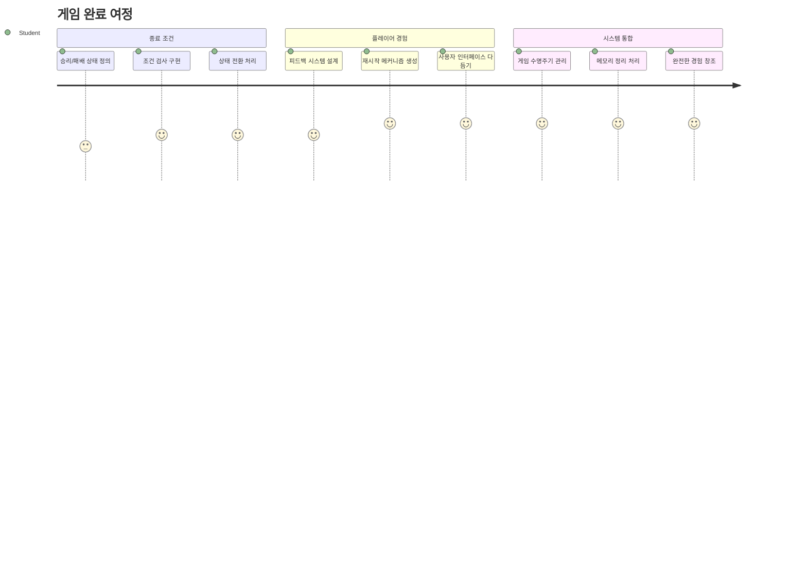
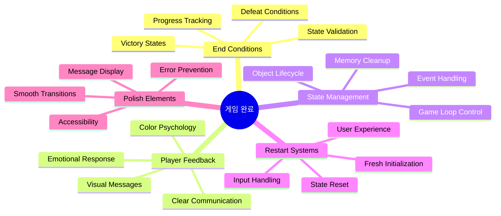
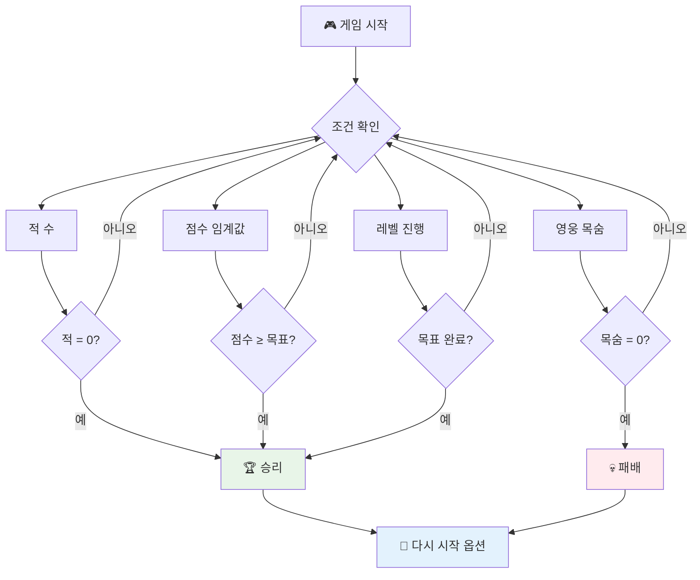
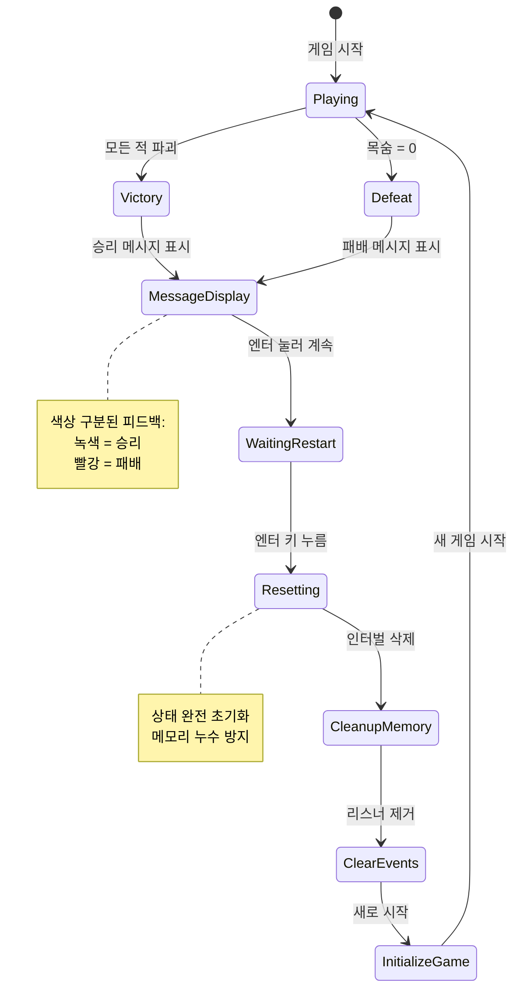
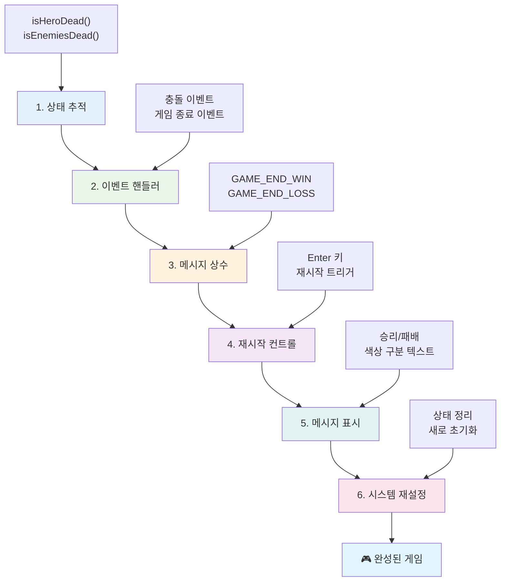
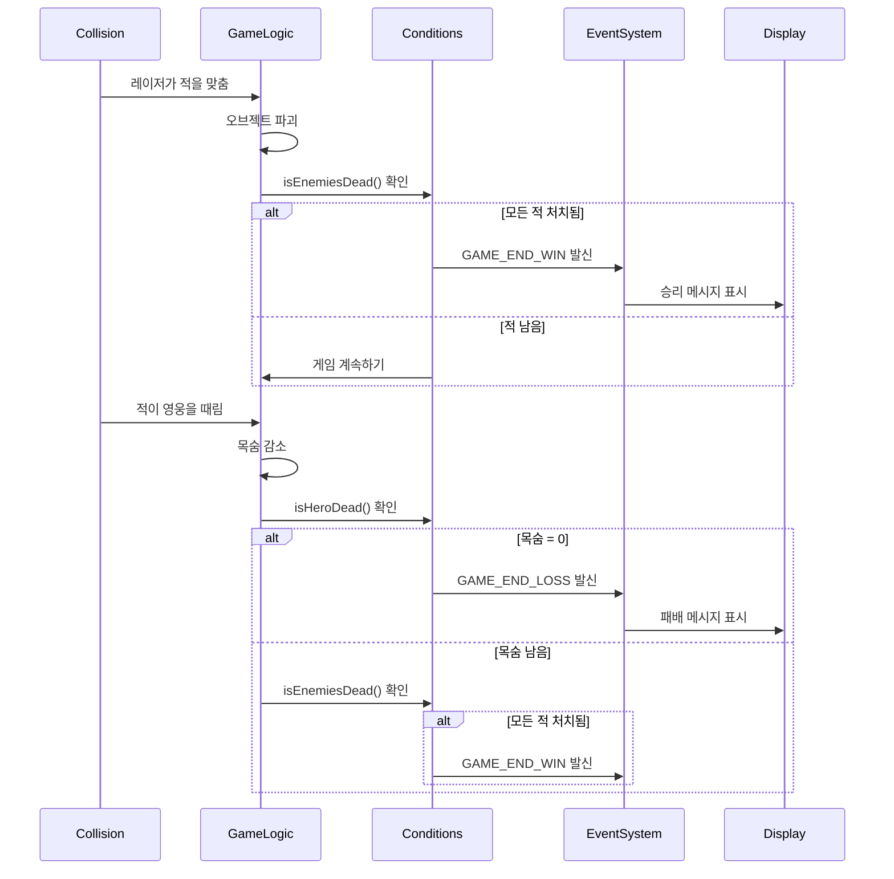
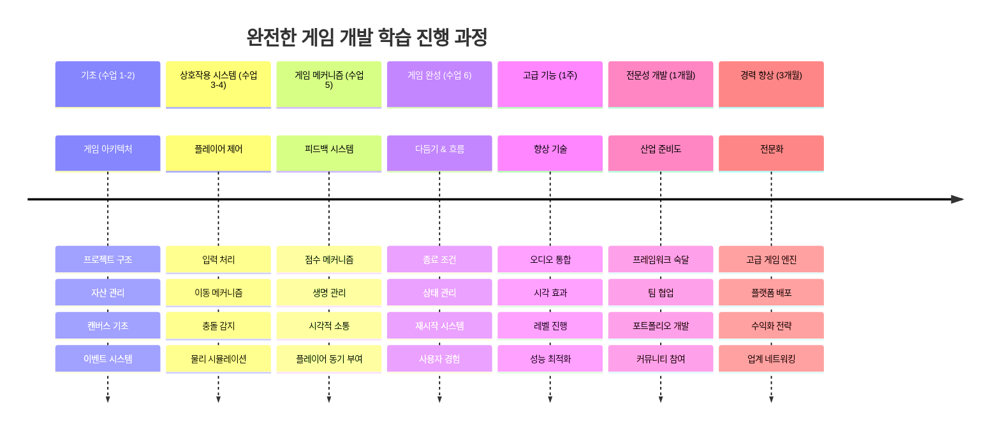

<!--
CO_OP_TRANSLATOR_METADATA:
{
  "original_hash": "a4b78043f4d64bf3ee24e0689b8b391d",
  "translation_date": "2026-01-06T15:05:08+00:00",
  "source_file": "6-space-game/6-end-condition/README.md",
  "language_code": "ko"
}
-->
# 우주 게임 만들기 6부: 종료 및 재시작


훌륭한 게임이라면 분명한 종료 조건과 부드러운 재시작 메커니즘이 필요합니다. 이동, 전투, 점수 시스템이 포함된 멋진 우주 게임을 완성했으니 이제 완성도를 높이는 마지막 조각들을 추가할 차례입니다.

현재 당신의 게임은 NASA가 1977년에 발사한 보이저 탐사선처럼 무한히 계속 실행됩니다 — 수십 년간 우주를 떠돌고 있죠. 우주 탐사에는 괜찮지만, 게임은 만족스러운 경험을 위해 명확한 종료 지점이 필요합니다.

오늘은 제대로 된 승패 조건과 재시작 시스템을 구현할 것입니다. 이 수업이 끝나면 고전 아케이드 게임처럼 플레이어가 완성하고 다시 플레이할 수 있는 다듬어진 게임을 갖게 될 겁니다.


## 수업 전 퀴즈

[수업 전 퀴즈](https://ff-quizzes.netlify.app/web/quiz/39)

## 게임 종료 조건 이해하기

당신의 게임은 언제 종료되어야 할까요? 이 근본적인 질문은 초기 아케이드 시절부터 게임 디자인을 형성해 왔습니다. 팩맨은 유령에게 잡히거나 모든 점을 먹으면 종료되고, 스페이스 인베이더는 외계인이 아래에 도달하거나 전부 파괴하면 종료됩니다.

게임 제작자인 당신이 승리와 패배 조건을 정의합니다. 우리 우주 게임에서는 다음과 같은 증명된 접근법들이 재미있는 게임 플레이를 만듭니다:


- **`N`대의 적선이 파괴됨**: 여러 레벨로 나누어진 게임에서 레벨을 완료하려면 `N`대의 적선을 모두 파괴해야 하는 경우가 많습니다
- **당신의 우주선이 파괴됨**: 우주선이 파괴되면 게임에서 패배하는 경우가 확실히 있습니다. 다른 흔한 방법은 생명 개념을 도입하는 것입니다. 우주선이 파괴될 때마다 목숨이 하나 줄어들고, 모든 목숨이 사라지면 게임에서 지는 것입니다.
- **`N` 점수를 획득함**: 점수를 모으는 것도 흔한 종료 조건입니다. 점수를 얻는 방법은 당신이 정하지만, 보통 적선을 파괴하거나 파괴된 적들이 떨어뜨리는 아이템을 획득하는 활동에 점수를 부여합니다.
- **레벨 완료**: 이 조건은 `X`대 적선 파괴, `Y` 점수 획득, 혹은 특정 아이템 획득과 같은 여러 조건을 포함할 수 있습니다.

## 게임 재시작 기능 구현하기

좋은 게임은 원활한 재시작 메커니즘을 통해 반복 플레이를 장려합니다. 플레이어들은 게임을 완료하거나 패배했을 때 점수 갱신이나 성과 향상을 위해 즉시 다시 시작하고 싶어합니다.


테트리스가 이를 완벽하게 보여줍니다: 블록이 맨 위까지 쌓이면 복잡한 메뉴 없이 바로 새 게임을 시작할 수 있죠. 비슷한 재시작 시스템을 만들어 게임 상태를 깔끔하게 초기화하고 빠르게 액션으로 돌아가도록 할 겁니다.

✅ **성찰**: 지금까지 해본 게임들을 생각해 보세요. 어떤 조건에서 종료되고, 어떻게 재시작하도록 안내되나요? 부드러운 재시작 경험과 답답한 경험의 차이는 무엇일까요?

## 당신이 만들 것

이번 수업에서는 프로젝트를 완성된 게임 경험으로 만드는 마지막 기능들을 구현합니다. 이 요소들은 다듬어진 게임과 기본 프로토타입을 구분합니다.

**오늘 추가할 사항은 다음과 같습니다:**

1. **승리 조건**: 적을 모두 격파하고 제대로 된 축하 화면(당연히 받을 자격이 있죠!)
2. **패배 조건**: 모든 목숨을 잃고 패배 화면을 마주하기
3. **재시작 메커니즘**: 엔터키를 눌러 즉시 재시작 — 한 판으로는 절대 충분하지 않으니까요
4. **상태 관리**: 매번 깨끗한 시작 — 잔존 적이나 이상한 버그 없이 깔끔한 초기화

## 시작하기

개발 환경을 준비합시다. 이전 수업들에서 작업한 우주 게임 파일이 모두 준비되어 있어야 합니다.

**프로젝트 구조는 다음과 비슷해야 합니다:**

```bash
-| assets
  -| enemyShip.png
  -| player.png
  -| laserRed.png
  -| life.png
-| index.html
-| app.js
-| package.json
```

**개발 서버 시작하기:**

```bash
cd your-work
npm start
```

**이 명령은:**
- `http://localhost:5000`에서 로컬 서버 실행
- 파일들을 올바르게 서빙
- 변경사항 발생 시 자동으로 새로 고침

브라우저에서 `http://localhost:5000`을 열고 게임이 실행되는지 확인하세요. 움직이고, 쏘고, 적과 상호작용할 수 있어야 합니다. 확인되면 구현을 진행할 수 있습니다.

> 💡 **프로 팁**: Visual Studio Code에서 경고를 피하려면 `gameLoopId`를 `window.onload` 함수 내부에 선언하지 말고 파일 상단에 `let gameLoopId;`로 선언하세요. 이는 최신 JavaScript 변수 선언 관행을 따릅니다.


## 구현 단계

### 1단계: 종료 조건 추적 함수 만들기

게임이 언제 종료되어야 하는지 감지할 함수가 필요합니다. 국제우주정거장(ISS)의 센서가 중요한 시스템을 계속 감시하는 것처럼 이 함수들은 게임 상태를 지속적으로 검사합니다.

```javascript
function isHeroDead() {
  return hero.life <= 0;
}

function isEnemiesDead() {
  const enemies = gameObjects.filter((go) => go.type === "Enemy" && !go.dead);
  return enemies.length === 0;
}
```

**내부 동작:**
- **생명 수 확인**: 주인공이 목숨이 남아있는지 체크
- **적 생존자 수 계산**: 몇 명이 아직 싸우고 있는지 집계
- **모든 적 소멸 시 `true` 반환**
- **간단한 true/false 논리 활용**
- **모든 게임 오브젝트를 걸러서 생존자 탐색**

### 2단계: 종료 조건에 맞게 이벤트 핸들러 업데이트

이제 충돌이 발생할 때마다 게임이 종료 조건을 평가하도록 연결합니다. 중요한 게임 이벤트에 즉각적 피드백을 줍니다.


```javascript
eventEmitter.on(Messages.COLLISION_ENEMY_LASER, (_, { first, second }) => {
    first.dead = true;
    second.dead = true;
    hero.incrementPoints();

    if (isEnemiesDead()) {
      eventEmitter.emit(Messages.GAME_END_WIN);
    }
});

eventEmitter.on(Messages.COLLISION_ENEMY_HERO, (_, { enemy }) => {
    enemy.dead = true;
    hero.decrementLife();
    if (isHeroDead())  {
      eventEmitter.emit(Messages.GAME_END_LOSS);
      return; // 승리 이전의 손실
    }
    if (isEnemiesDead()) {
      eventEmitter.emit(Messages.GAME_END_WIN);
    }
});

eventEmitter.on(Messages.GAME_END_WIN, () => {
    endGame(true);
});
  
eventEmitter.on(Messages.GAME_END_LOSS, () => {
  endGame(false);
});
```

**여기서 일어나는 일:**
- **레이저가 적 맞춤**: 둘 다 사라지고 점수 획득, 승리 여부 확인
- **적이 플레이어에 충돌**: 목숨 감소, 생존 확인
- **현명한 순서 지정**: 먼저 패배 여부를 확인 (한 상황에서 이기고 지는 일은 없으니까!)
- **즉각적 반응**: 중요한 일이 생기면 바로 게임이 감지

### 3단계: 새 메시지 상수 추가

`Messages` 상수 객체에 새 메시지 유형을 추가하세요. 이런 상수는 오탈자를 방지하고 일관성을 유지합니다.

```javascript
GAME_END_LOSS: "GAME_END_LOSS",
GAME_END_WIN: "GAME_END_WIN",
```

**위 코드에서:**
- 게임 종료 이벤트 상수 추가로 일관성 유지
- 명확한 의미를 가진 설명적 이름 사용
- 기존 메시지 유형 네이밍 규칙 따름

### 4단계: 재시작 제어 구현

재시작을 위한 키보드 입력을 추가합니다. 엔터키는 흔히 확인 및 새 게임 시작에 쓰여 자연스러운 선택입니다.

**기존 keydown 이벤트 리스너에 엔터키 감지 기능 추가:**

```javascript
else if(evt.key === "Enter") {
   eventEmitter.emit(Messages.KEY_EVENT_ENTER);
}
```

**새 메시지 상수 추가:**

```javascript
KEY_EVENT_ENTER: "KEY_EVENT_ENTER",
```

**알아야 할 사항:**
- 기존 키보드 이벤트 처리 시스템 확장
- 직관적인 유저 경험을 위한 엔터키 재시작 트리거 사용
- 게임의 다른 부분에서 수신할 수 있는 커스텀 이벤트 발송
- 기존 키보드 컨트롤과 동일한 패턴 유지

### 5단계: 메시지 표시 시스템 만들기

게임 상태(승리/패배)를 색상으로 구분해 명확히 전달하는 메시지 시스템을 만듭니다. 초창기 컴퓨터 터미널의 초록-성공, 빨강-오류 컬러 코드 방식을 참고합니다.

**`displayMessage()` 함수 생성:**

```javascript
function displayMessage(message, color = "red") {
  ctx.font = "30px Arial";
  ctx.fillStyle = color;
  ctx.textAlign = "center";
  ctx.fillText(message, canvas.width / 2, canvas.height / 2);
}
```

**단계별 설명:**
- 명확하고 읽기 쉬운 폰트 크기 및 패밀리 설정
- 기본값이 "빨강"인 색상 매개변수 적용
- 캔버스 중앙에 텍스트 수평 및 수직 정렬
- 최신 JS 기본 매개변수 기능 활용
- 캔버스 2D 컨텍스트로 직접 텍스트 렌더링

**`endGame()` 함수 생성:**

```javascript
function endGame(win) {
  clearInterval(gameLoopId);

  // 모든 대기 중인 렌더링이 완료되도록 지연 시간을 설정하세요
  setTimeout(() => {
    ctx.clearRect(0, 0, canvas.width, canvas.height);
    ctx.fillStyle = "black";
    ctx.fillRect(0, 0, canvas.width, canvas.height);
    if (win) {
      displayMessage(
        "Victory!!! Pew Pew... - Press [Enter] to start a new game Captain Pew Pew",
        "green"
      );
    } else {
      displayMessage(
        "You died !!! Press [Enter] to start a new game Captain Pew Pew"
      );
    }
  }, 200)  
}
```

**함수 역할:**
- 모든 동작(우주선, 레이저) 정지
- 마지막 프레임이 완성되도록 200ms 대기
- 화면 초기화 및 검은색 배경 칠하기
- 승자와 패자에 맞는 메시지 표시
- 녹색은 승리, 빨강은 패배 메시지 색상 사용
- 플레이어에게 재시작 방법 안내

### 🔄 **교육적 점검**
**게임 상태 관리**: 리셋 기능 구현 전, 다음을 이해했는지 확인:
- ✅ 종료 조건이 게임 목표를 명확히 만든다
- ✅ 시각적 피드백이 플레이어 이해를 돕는다
- ✅ 올바른 정리가 메모리 누수 방지에 중요하다
- ✅ 이벤트 기반 구조가 깔끔한 상태 전환을 돕는다

**간단 자가 테스트**: 리셋 시 이벤트 리스너를 지우지 않으면 어떻게 될까요?
*답: 메모리 누수와 중복 핸들러로 예측불가 동작 발생*

**게임 디자인 원칙**: 지금 구현 중인 것은
- **명확한 목표**: 성공과 실패 기준 명확화
- **즉각적 피드백**: 게임 상태 변화를 바로 알림
- **사용자 제어**: 플레이어가 원하는 때 재시작 가능
- **시스템 안정성**: 올바른 정리로 버그 및 성능 문제 예방

### 6단계: 게임 재설정 기능 구현

재설정 시스템은 현재 게임 상태를 완전히 정리하고 새 게임 세션을 초기화해야 합니다. 이전 데이터가 남지 않고 깔끔한 시작을 보장합니다.

**`resetGame()` 함수 생성:**

```javascript
function resetGame() {
  if (gameLoopId) {
    clearInterval(gameLoopId);
    eventEmitter.clear();
    initGame();
    gameLoopId = setInterval(() => {
      ctx.clearRect(0, 0, canvas.width, canvas.height);
      ctx.fillStyle = "black";
      ctx.fillRect(0, 0, canvas.width, canvas.height);
      drawPoints();
      drawLife();
      updateGameObjects();
      drawGameObjects(ctx);
    }, 100);
  }
}
```

**각 기능 설명:**
- 현재 게임 루프가 실행 중인지 확인 후 리셋
- 기존 게임 루프 정리하여 모든 게임 활동 중단
- 메모리 누수를 막기 위해 모든 이벤트 리스너 제거
- 새 객체 및 변수로 게임 상태 재초기화
- 필수 함수로 새 게임 루프 시작
- 일관된 게임 성능을 위한 100ms 간격 유지

**`initGame()` 함수에 엔터키 이벤트 헨들러 추가:**

```javascript
eventEmitter.on(Messages.KEY_EVENT_ENTER, () => {
  resetGame();
});
```

**EventEmitter 클래스에 `clear()` 메서드 추가:**

```javascript
clear() {
  this.listeners = {};
}
```

**중요 사항:**
- 엔터키 입력을 재설정 기능과 연결
- 게임 초기화 시 이벤트 리스너 등록
- 리셋 시 모든 이벤트 리스너를 한꺼번에 제거하는 깔끔한 방법 제공
- 메모리 누수 방지 위해 핸들러 지속적으로 정리
- 초기화를 위해 listeners 객체를 빈 상태로 재설정

## 축하합니다! 🎉

👽 💥 🚀 여러분은 기초부터 완성된 게임을 성공적으로 만들었습니다. 1970년대 최초 비디오 게임을 만들어낸 프로그래머들처럼 코드를 통해 상호작용하는 경험과 올바른 게임 메커니즘, 사용자 피드백을 창조했습니다. 🚀 💥 👽

**성취한 점:**
- 완전한 승패 조건 구현 및 사용자 피드백 제공
- 연속 플레이를 위한 매끄러운 재시작 시스템 제작
- 게임 상태 명확 표시를 위한 시각적 커뮤니케이션 설계
- 복잡한 게임 상태 전환 및 정리 관리
- 모든 요소를 모아 통합된 플레이어블 게임 완성

### 🔄 **교육적 점검**
**완전한 게임 개발 체계**: 전체 게임 개발 주기를 마스터한 것을 축하합니다:
- ✅ 종료 조건이 어떻게 플레이어 경험을 만족시키는가?
- ✅ 올바른 상태 관리가 게임 안정성에 왜 중요한가?
- ✅ 시각적 피드백이 플레이어 이해를 어떻게 돕는가?
- ✅ 재시작 시스템이 플레이어 유지에 어떤 역할을 하는가?

**시스템 숙련도**: 이제 보여줄 수 있습니다:
- **풀스택 게임 개발**: 그래픽부터 입력, 상태 관리까지
- **전문 아키텍처**: 이벤트 기반 시스템 및 철저한 정리
- **사용자 경험 설계**: 명확한 피드백과 직관적 조작
- **성능 최적화**: 효율적 렌더링과 메모리 관리
- **완성도와 다듬기**: 게임을 완성도 높게 만드는 모든 디테일

**업계 준비 기술**: 구현한 기능:
- **게임 루프 아키텍처**: 일관된 성능의 실시간 시스템
- **이벤트 기반 프로그래밍**: 효과적으로 확장 가능한 디커플링
- **상태 관리**: 복잡한 데이터 처리와 수명 주기 관리
- **사용자 인터페이스 설계**: 명확한 소통과 반응성 있는 조작
- **테스트 및 디버깅**: 반복적 개발과 문제 해결

### ⚡ **다음 5분 동안 할 수 있는 일**
- [ ] 완성된 게임 플레이하며 승/패 조건 테스트
- [ ] 다양한 종료 조건 매개변수 실험
- [ ] `console.log` 추가해 상태 변화를 추적
- [ ] 친구들과 게임 공유하고 피드백 수집

### 🎯 **이번 시간에 달성 가능한 목표**
- [ ] 수업 후 퀴즈 완료하고 게임 개발 여정 반영
- [ ] 승리 및 패배 상태에 맞는 오디오 효과 추가
- [ ] 시간 제한이나 보너스 목표 같은 추가 종료 조건 구현
- [ ] 적 수를 조절하는 다양한 난이도 레벨 만들기
- [ ] 더 좋은 폰트와 색상으로 시각적 표현 다듬기

### 📅 **이번 주 동안 마스터할 게임 개발**
- [ ] 여러 레벨과 진행 시스템이 포함된 확장 우주 게임 완성
- [ ] 파워업, 다양한 적 유형, 특수 무기와 같은 고급 기능 추가
- [ ] 영속 저장이 가능한 최고 점수 시스템 만들기
- [ ] 메뉴, 설정, 게임 옵션 UI 설계
- [ ] 다양한 기기와 브라우저에 최적화된 성능 개선
- [ ] 게임을 온라인에 배포하고 커뮤니티에 공유
### 🌟 **한 달간의 게임 개발 커리어**
- [ ] 다양한 장르와 메커니즘을 탐구하며 여러 완성된 게임 제작하기
- [ ] Phaser나 Three.js 같은 고급 게임 개발 프레임워크 배우기
- [ ] 오픈 소스 게임 개발 프로젝트에 기여하기
- [ ] 게임 디자인 원칙과 플레이어 심리학 공부하기
- [ ] 게임 개발 기술을 보여주는 포트폴리오 만들기
- [ ] 게임 개발 커뮤니티와 연결하고 지속적으로 학습하기

## 🎯 당신의 완전한 게임 개발 마스터 타임라인


### 🛠️ 당신의 완전한 게임 개발 툴킷 요약

이 우주 게임 시리즈 전체를 완료한 후, 이제 다음을 마스터했습니다:
- **게임 아키텍처**: 이벤트 기반 시스템, 게임 루프, 상태 관리
- **그래픽 프로그래밍**: 캔버스 API, 스프라이트 렌더링, 시각 효과
- **입력 시스템**: 키보드 처리, 충돌 감지, 반응형 컨트롤
- **게임 디자인**: 플레이어 피드백, 진행 시스템, 몰입 메커니즘
- **성능 최적화**: 효율적인 렌더링, 메모리 관리, 프레임률 제어
- **사용자 경험**: 명확한 커뮤니케이션, 직관적인 컨트롤, 세련된 디테일
- **전문 패턴**: 깔끔한 코드, 디버깅 기법, 프로젝트 조직

**실무 적용 사례**: 게임 개발 기술은 다음에 직접적으로 적용됩니다:
- **인터랙티브 웹 애플리케이션**: 동적 인터페이스와 실시간 시스템
- **데이터 시각화**: 애니메이션 차트 및 인터랙티브 그래픽
- **교육 기술**: 게임화 및 몰입도 높은 학습 경험
- **모바일 개발**: 터치 기반 상호작용과 성능 최적화
- **시뮬레이션 소프트웨어**: 물리 엔진과 실시간 모델링
- **크리에이티브 산업**: 인터랙티브 아트, 엔터테인먼트, 디지털 경험

**획득한 전문 기술**: 이제 다음을 할 수 있습니다:
- **복잡한 인터랙티브 시스템을 처음부터 설계**
- **체계적인 접근법으로 실시간 애플리케이션을 디버깅**
- **원활한 사용자 경험을 위한 성능 최적화**
- **몰입도 높은 UI 및 상호작용 패턴 디자인**
- **적절한 코드 조직으로 기술 프로젝트에서 효과적으로 협업**

**마스터한 게임 개발 개념**:
- **실시간 시스템**: 게임 루프, 프레임률 관리, 성능
- **이벤트 기반 아키텍처**: 디커플링된 시스템과 메시지 전달
- **상태 관리**: 복잡한 데이터 처리와 라이프사이클 관리
- **사용자 인터페이스 프로그래밍**: 캔버스 그래픽과 반응형 디자인
- **게임 디자인 이론**: 플레이어 심리 및 몰입 메커니즘

**다음 단계**: 고급 게임 프레임워크, 3D 그래픽, 멀티플레이어 시스템을 탐구하거나 전문 게임 개발 역할로 전환할 준비가 되었습니다!

🌟 **업적 달성**: 완전한 게임 개발 여정을 마치고 처음부터 전문 수준의 인터랙티브 경험을 구축했습니다!

**게임 개발 커뮤니티에 오신 것을 환영합니다!** 🎮✨

## GitHub Copilot 에이전트 챌린지 🚀

에이전트 모드를 사용해 다음 챌린지를 완료하세요:

**설명:** 난이도 증가와 보너스 기능을 가진 레벨 진행 시스템을 구현하여 우주 게임을 강화하세요.

**프롬프트:** 각 레벨마다 적 함선 수가 늘어나고 속도와 체력도 증가하는 다중 레벨 우주 게임 시스템을 만드세요. 각 레벨마다 증가하는 점수 배수 기능을 추가하고 적이 파괴될 때 무작위로 나타나는 빠른 발사나 방패 같은 파워업을 구현하세요. 레벨 완료 보너스를 포함하고 현재 레벨을 점수 및 생명과 함께 화면에 표시하세요.

[agent mode](https://code.visualstudio.com/blogs/2025/02/24/introducing-copilot-agent-mode)에 대해 자세히 알아보세요.

## 🚀 선택적 향상 챌린지

**게임에 오디오 추가하기**: 사운드 효과를 구현해 플레이 경험을 향상시키세요! 다음과 같은 오디오를 고려해보세요:

- 플레이어가 발사할 때의 **레이저 발사음**
- 적 함선 파괴 시의 **파괴음**
- 플레이어가 공격받을 때의 **피격음**
- 게임 승리 시의 **승리 음악**
- 게임 패배 시의 **패배 사운드**

**오디오 구현 예시:**

```javascript
// 오디오 객체 생성
const laserSound = new Audio('assets/laser.wav');
const explosionSound = new Audio('assets/explosion.wav');

// 게임 이벤트 중에 소리 재생
function playLaserSound() {
  laserSound.currentTime = 0; // 처음으로 재설정
  laserSound.play();
}
```

**알아야 할 사항:**
- 다양한 효과음을 위한 Audio 객체 생성
- 빠른 연속 사운드 효과를 위해 `currentTime`을 초기화
- 사용자 상호작용에서 사운드를 트리거 해 브라우저 자동 재생 정책 처리
- 더 나은 게임 경험을 위한 오디오 볼륨과 타이밍 관리

> 💡 **학습 자료**: JavaScript 게임에서 오디오 구현에 대해 더 배우려면 이 [오디오 샌드박스](https://www.w3schools.com/jsref/tryit.asp?filename=tryjsref_audio_play)를 탐색하세요.

## 강의 후 퀴즈

[강의 후 퀴즈](https://ff-quizzes.netlify.app/web/quiz/40)

## 복습 및 자기 주도 학습

새로운 샘플 게임을 만들기 위한 과제입니다. 흥미로운 게임들을 탐색하며 어떤 종류의 게임을 만들지 고민해보세요.

## 과제

[샘플 게임 만들기](assignment.md)

---

<!-- CO-OP TRANSLATOR DISCLAIMER START -->
**면책 조항**:  
이 문서는 AI 번역 서비스 [Co-op Translator](https://github.com/Azure/co-op-translator)를 사용하여 번역되었습니다. 정확성을 위해 노력하고 있으나, 자동 번역에는 오류나 부정확성이 포함될 수 있음을 유의하시기 바랍니다. 원본 문서는 해당 언어의 권위 있는 자료로 간주되어야 합니다. 중요한 정보의 경우 전문적인 인간 번역을 권장합니다. 이 번역 사용으로 인해 발생하는 모든 오해나 잘못된 해석에 대해 당사는 책임을 지지 않습니다.
<!-- CO-OP TRANSLATOR DISCLAIMER END -->