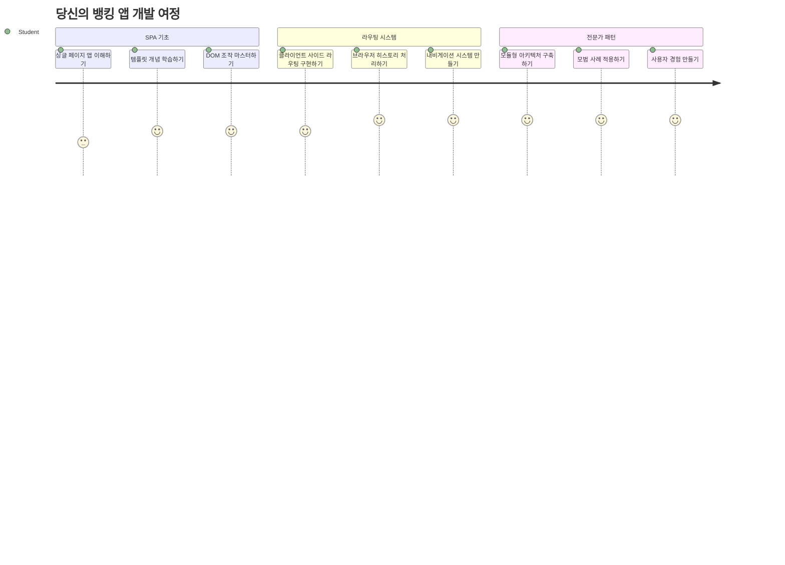
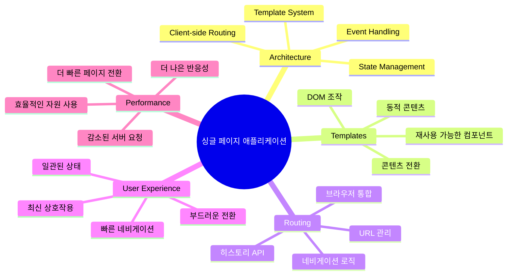
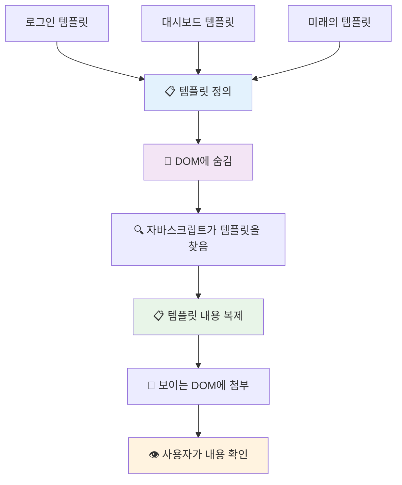
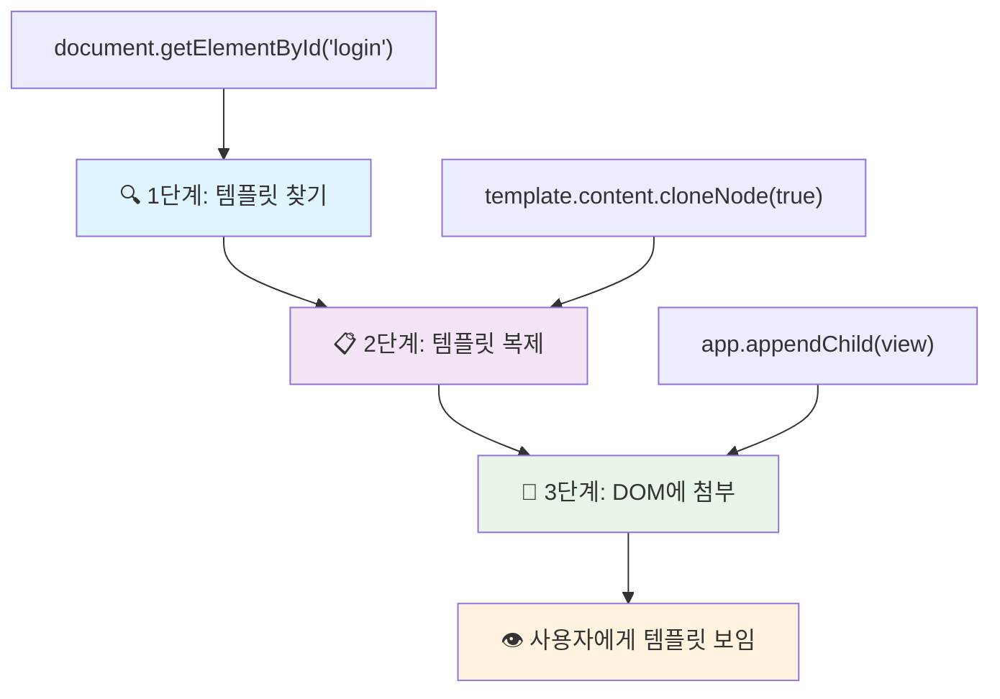
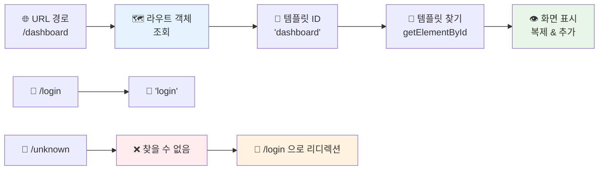
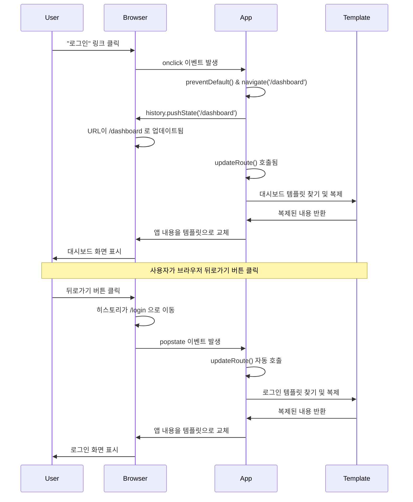
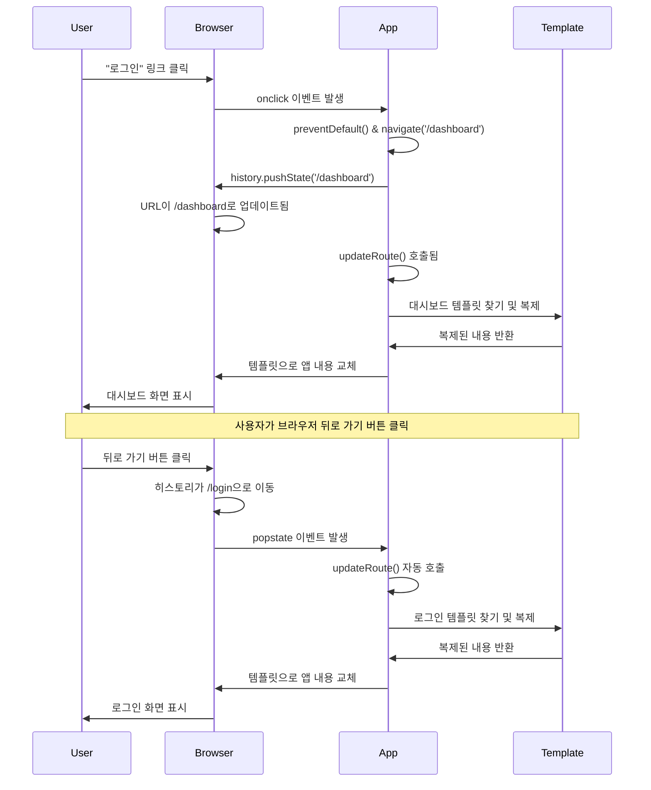
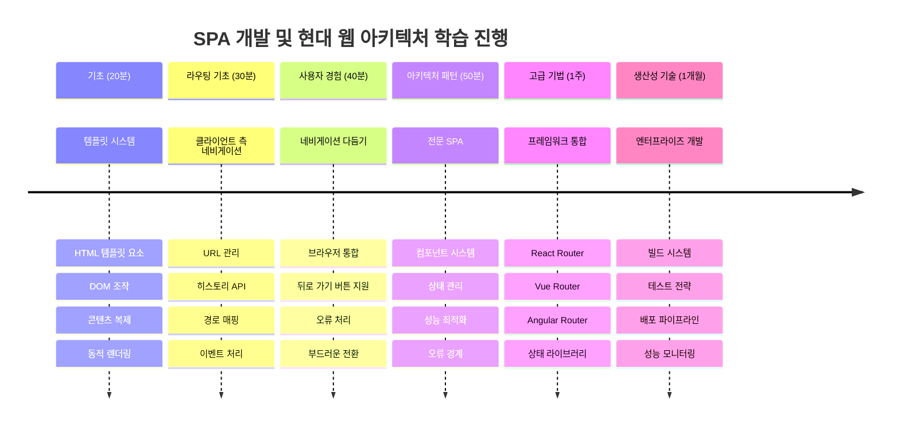

<!--
CO_OP_TRANSLATOR_METADATA:
{
  "original_hash": "351678bece18f07d9daa987a881fb062",
  "translation_date": "2026-01-06T15:23:13+00:00",
  "source_file": "7-bank-project/1-template-route/README.md",
  "language_code": "ko"
}
-->
# 은행 앱 만들기 1부: 웹 앱에서 HTML 템플릿과 라우트


1969년 아폴로 11호의 유도 컴퓨터가 달을 향해 항해할 때, 전체 시스템을 재시작하지 않고도 여러 프로그램 간에 전환해야 했습니다. 현대의 웹 애플리케이션도 비슷하게 작동합니다 – 모든 것을 처음부터 다시 로드하지 않고 보이는 내용을 변경합니다. 덕분에 오늘날 사용자가 기대하는 부드럽고 반응성 높은 경험이 만들어집니다.

모든 상호작용마다 전체 페이지를 다시 로드하는 전통적인 웹사이트와 달리, 현대 웹 앱은 변경이 필요한 부분만 업데이트합니다. 이 방식은 미션 컨트롤이 여러 화면을 전환하면서도 지속적으로 통신하는 것과 유사해 우리가 기대하는 유연한 경험을 만들어냅니다.

이 차이가 극명한 이유는 다음과 같습니다:

| 전통적 다중 페이지 앱 | 현대 싱글 페이지 앱 |
|----------------------------|-------------------------|
| **탐색** | 각 화면마다 전체 페이지 재로딩 | 즉각적인 콘텐츠 전환 |
| **성능** | 전체 HTML 다운로드로 느림 | 부분 업데이트로 빠름 |
| **사용자 경험** | 갑작스러운 페이지 깜박임 | 부드럽고 앱 같은 전환 |
| **데이터 공유** | 페이지 간 공유 어려움 | 상태 관리 용이 |
| **개발** | 여러 HTML 파일 유지 필요 | 동적 템플릿을 가진 단일 HTML |

**변화 이해하기:**
- **전통적인 앱**은 탐색할 때마다 서버 요청 필요
- **현대 SPA**는 한 번 로드 후 JavaScript로 동적으로 콘텐츠 업데이트
- **사용자 기대**는 즉각적이고 매끄러운 상호작용 선호
- **성능 이점**은 대역폭 감소와 빠른 응답 포함

이번 수업에서는 여러 화면이 매끄럽게 연결된 은행 앱을 만들겠습니다. 과학자들이 다양한 실험에 맞게 모듈식 기기를 재구성하는 것처럼, HTML 템플릿을 재사용 가능한 컴포넌트로 사용하여 필요에 따라 화면을 표시할 것입니다.

HTML 템플릿(다양한 화면을 위한 재사용 설계도), JavaScript 라우팅(화면 전환 시스템), 그리고 브라우저의 히스토리 API(뒤로 가기 버튼 작동 유지)를 다루게 됩니다. 이 기본 기술들은 React, Vue, Angular 같은 프레임워크에서 사용하는 것과 동일합니다.

끝나면 전문적인 싱글 페이지 앱 원리를 보여주는 작동하는 은행 앱을 갖게 될 것입니다.


## 강의 전 퀴즈

[강의 전 퀴즈](https://ff-quizzes.netlify.app/web/quiz/41)

### 준비물

은행 앱을 테스트할 로컬 웹 서버가 필요합니다 – 걱정 마세요, 생각보다 쉽습니다! 이미 없다면 [Node.js](https://nodejs.org)를 설치하고 프로젝트 폴더에서 `npx lite-server`를 실행하세요. 이 명령은 로컬 서버를 띄우고 자동으로 브라우저에서 앱을 열어줍니다.

### 준비 작업

컴퓨터에 `bank`라는 폴더를 만들고 그 안에 `index.html` 파일을 생성하세요. 다음 HTML [보일러플레이트](https://en.wikipedia.org/wiki/Boilerplate_code)부터 시작합니다:

```html
<!DOCTYPE html>
<html lang="en">
  <head>
    <meta charset="UTF-8">
    <meta name="viewport" content="width=device-width, initial-scale=1.0">
    <title>Bank App</title>
  </head>
  <body>
    <!-- This is where you'll work -->
  </body>
</html>
```

**이 보일러플레이트가 제공하는 것들:**
- **HTML5 문서 구조**를 적절한 DOCTYPE 선언과 함께 설정
- **문자 인코딩**을 UTF-8로 설정해 국제 문자 지원
- **뷰포트 메타 태그**로 모바일 호환성을 위한 반응형 디자인 가능
- **브라우저 탭에 표시될** 설명적인 타이틀 설정
- **앱을 빌드할 깔끔한 본문 영역** 생성

> 📁 **프로젝트 구조 미리보기**
> 
> **이 수업이 끝나면 프로젝트에는 다음이 포함됩니다:**
> ```
> bank/
> ├── index.html      <!-- Main HTML with templates -->
> ├── app.js          <!-- Routing and navigation logic -->
> └── style.css       <!-- (Optional for future lessons) -->
> ```
> 
> **파일 역할:**
> - **index.html**: 모든 템플릿을 포함하며 앱의 기본 구조 제공
> - **app.js**: 라우팅, 내비게이션, 템플릿 관리를 담당
> - **템플릿**: 로그인, 대시보드 및 기타 화면의 UI 정의

---

## HTML 템플릿

템플릿은 웹 개발에서 근본적인 문제를 해결합니다. 1440년대 구텐베르크가 활자 인쇄를 발명했을 때, 그는 전체 페이지를 새로 파는 대신 재사용 가능한 활자 블록을 만들어 필요할 때 배열하는 방식을 발견했습니다. HTML 템플릿도 같은 원칙입니다 – 각각의 화면마다 별도의 HTML 파일을 만드는 대신, 재사용 가능한 구조를 정의해 필요할 때 표시하는 것입니다.


템플릿은 앱의 여러 부분을 위한 설계도로 생각하세요. 마치 건축가가 똑같은 방을 여러 번 다시 그리기보다 설계도를 한 번 만들어 여러번 사용하는 것처럼, 템플릿을 한 번 만들고 필요에 따라 인스턴스화합니다. 브라우저는 JavaScript가 활성화할 때까지 이 템플릿들을 숨겨 둡니다.

웹 페이지에 여러 화면을 만들고 싶다면, 각 화면마다 HTML 파일을 만드는 방법도 있습니다. 그러나 이런 방식에는 불편함이 있습니다:

- 화면 전환 시 전체 HTML을 다시 로드해야 하므로 느려질 수 있습니다.
- 서로 다른 화면 간에 데이터를 공유하기 어렵습니다.

또 다른 방법은 HTML 파일을 하나만 두고 `<template>` 요소를 사용해 여러 HTML 템플릿을 정의하는 것입니다. 템플릿은 브라우저가 직접 표시하지 않는 재사용 가능한 HTML 블록이며, JavaScript를 통해 런타임에 인스턴스화하여 사용합니다.

### 만들어봅시다

로그인 페이지와 대시보드, 두 개의 주요 화면을 가진 은행 앱을 만들겠습니다. 먼저 HTML 본문에 자리 표시자 요소를 추가합니다 – 여기에 여러 화면이 표시될 것입니다:

```html
<div id="app">Loading...</div>
```

**이 자리 표시자 이해하기:**
- 모든 화면이 표시될 ID가 "app"인 컨테이너를 생성
- JavaScript가 첫 화면을 초기화할 때까지 로딩 메시지를 보여줌
- 동적 콘텐츠를 위한 단일 마운트 포인트 제공
- `document.getElementById()`로 쉽게 접근 가능하도록 지원

> 💡 **노하우**: 이 요소 내용이 교체되므로 앱이 로딩되는 동안 보여줄 메시지나 인디케이터를 넣어도 좋습니다.

다음으로, 로그인 페이지의 HTML 템플릿을 본문 하단에 추가합시다. 지금은 제목과 내비게이션에 사용할 링크가 있는 섹션만 넣을 겁니다.

```html
<template id="login">
  <h1>Bank App</h1>
  <section>
    <a href="/dashboard">Login</a>
  </section>
</template>
```

**로그인 템플릿 설명:**
- JavaScript가 식별할 수 있도록 고유 ID "login"을 가진 템플릿 정의
- 앱 브랜드를 확립하는 주요 제목 포함
- 관련 내용을 묶는 의미론적 `<section>` 요소 포함
- 대시보드로 이동할 내비게이션 링크 제공

다음으로 대시보드 페이지를 위한 HTML 템플릿을 추가합니다. 이 페이지는 여러 섹션을 포함합니다:

- 제목과 로그아웃 링크가 있는 헤더
- 은행 계좌의 현재 잔액
- 테이블로 표시되는 거래 내역 목록

```html
<template id="dashboard">
  <header>
    <h1>Bank App</h1>
    <a href="/login">Logout</a>
  </header>
  <section>
    Balance: 100$
  </section>
  <section>
    <h2>Transactions</h2>
    <table>
      <thead>
        <tr>
          <th>Date</th>
          <th>Object</th>
          <th>Amount</th>
        </tr>
      </thead>
      <tbody></tbody>
    </table>
  </section>
</template>
```

**대시보드 각 부분 이해하기:**
- 내비게이션이 포함된 의미론적 `<header>` 요소로 페이지를 구성
- 앱 제목을 일관되게 표시해 브랜드 유지
- 로그인 화면으로 돌아가는 로그아웃 링크 제공
- 별도 섹션에 현재 계좌 잔액 표시
- 거래 데이터를 적절한 HTML 테이블로 정리
- 날짜, 대상, 금액 열에 대한 테이블 머리글 정의
- 테이블 본문은 나중에 동적 콘텐츠를 주입할 수 있도록 비워 둠

> 💡 **노하우**: HTML 템플릿 내용을 직접 보고 싶다면 `<template>`와 `</template>` 태그를 `<!-- -->` 주석으로 감싸 주석 처리할 수 있습니다.

### 🔄 **교육적 확인**
**템플릿 시스템 이해도**: JavaScript를 구현하기 전에 확실히 알아야 할 것들:
- ✅ 템플릿이 일반 HTML 요소와 다른 점
- ✅ 템플릿이 JavaScript가 활성화할 때까지 숨겨지는 이유
- ✅ 템플릿에서 의미론적 HTML 구조가 중요한 이유
- ✅ 템플릿이 재사용 가능한 UI 컴포넌트를 가능하게 하는 방법

**간단한 자가 점검**: `<template>` 태그를 HTML 주위에서 제거하면 어떻게 될까요?
*답변: 콘텐츠가 즉시 보여지고 템플릿 기능을 잃게 됩니다*

**구조상의 이점**: 템플릿이 제공하는 것:
- **재사용성**: 하나의 정의로 여러 인스턴스 생성
- **성능**: 중복 HTML 파싱 없음
- **유지관리성**: UI 구조 중앙 집중화
- **유연성**: 동적 콘텐츠 전환 가능

✅ 템플릿에 `id` 속성을 사용하는 이유는? 클래스 같은 다른 것을 써도 될까요?

## JavaScript로 템플릿 활성화하기

이제 템플릿을 동작하게 만들어야 합니다. 3D 프린터가 디지털 설계도를 물리적 형상으로 만들 듯, JavaScript가 숨겨진 템플릿을 사용자에게 보이고 사용할 수 있는 상호작용 요소로 바꿉니다.

이 과정은 현대 웹 개발의 기초를 이루는 세 단계로 이루어져 있습니다. 이 패턴을 이해하면 많은 프레임워크와 라이브러리에서도 쉽게 알아볼 수 있습니다.

현재 HTML 파일을 브라우저에서 열면 `Loading...` 메시지가 계속 표시됩니다. 이는 HTML 템플릿을 인스턴스화하고 보여줄 JavaScript 코드를 추가해야 하기 때문입니다.

템플릿 인스턴스화는 보통 3단계로 이루어집니다:

1. DOM에서 템플릿 요소를 찾기, 예: [`document.getElementById`](https://developer.mozilla.org/docs/Web/API/Document/getElementById) 사용
2. 템플릿 요소 복제, [`cloneNode`](https://developer.mozilla.org/docs/Web/API/Node/cloneNode) 사용
3. 복제본을 가시적 요소 아래 DOM에 붙이기, 예: [`appendChild`](https://developer.mozilla.org/docs/Web/API/Node/appendChild) 사용


**과정 시각화:**
- **1단계** 숨겨진 템플릿을 DOM 구조 내에서 찾음
- **2단계** 안전하게 수정할 수 있는 작업 복사본 생성
- **3단계** 복제본을 보이는 페이지 영역에 삽입
- **결과** 사용자가 상호작용할 수 있는 기능적 화면 완성

✅ DOM에 붙이기 전에 템플릿을 복제하는 이유는? 이 단계를 건너뛰면 어떻게 될까요?

### 과제

프로젝트 폴더에 `app.js`라는 새 파일을 만들고 HTML의 `<head>` 섹션에 해당 파일을 임포트하세요:

```html
<script src="app.js" defer></script>
```

**이 스크립트 임포트 이해하기:**
- JavaScript 파일을 HTML 문서에 연결
- HTML 파싱 후 스크립트 실행을 보장하는 `defer` 속성 사용
- 스크립트 실행 전에 모든 DOM 요소가 로드되어 접근 가능하도록 함
- 스크립트 로딩과 성능을 위한 최신 모범 사례 따름

이제 `app.js`에서 `updateRoute`라는 함수를 만듭니다:

```js
function updateRoute(templateId) {
  const template = document.getElementById(templateId);
  const view = template.content.cloneNode(true);
  const app = document.getElementById('app');
  app.innerHTML = '';
  app.appendChild(view);
}
```

**단계별 설명:**
- 고유 ID로 템플릿 요소를 찾음
- `cloneNode(true)`로 템플릿 내용을 깊게 복제
- 콘텐츠가 표시될 앱 컨테이너를 찾음
- 컨테이너 내 기존 콘텐츠를 모두 제거
- 복제한 템플릿 콘텐츠를 보이는 DOM에 삽입

이 함수를 템플릿 중 하나로 호출하고 결과를 확인하세요.

```js
updateRoute('login');
```

**이 함수 호출의 결과:**
- 로그인 템플릿을 ID로 전달해 활성화
- 프로그래밍적으로 앱 화면 전환 방법 시연
- "Loading..." 메시지 대신 로그인 화면 표시

✅ `app.innerHTML = '';` 코드의 용도는? 이 부분이 없으면 어떻게 될까요?

## 라우트 만들기

라우팅은 본질적으로 URL을 올바른 콘텐츠에 매핑하는 것입니다. 초기 전화 교환원이 통화를 연결하기 위해 교환판으로 접속을 관리한 것처럼, 웹 라우팅도 URL 요청을 받아 어떤 콘텐츠를 보여줄지 결정합니다.


과거 웹 서버는 다른 URL에 대해 각기 다른 HTML 파일을 제공해 처리했습니다. 우리는 싱글 페이지 앱을 만들고 있으므로, JavaScript로 직접 라우팅을 처리해야 합니다. 이렇게 하면 사용자 경험과 성능을 더욱 세밀하게 제어할 수 있습니다.


**라우팅 흐름 이해:**
- URL 변화가 라우트 구성에서 조회를 유발
- 유효한 라우트는 렌더링할 특정 템플릿 ID로 매핑
- 유효하지 않은 라우트는 깨진 상태를 방지하기 위한 폴백 동작 실행
- 템플릿 렌더링은 이전에 배운 3단계 프로세스를 따름

웹 앱에서는 *라우팅*이란 **URL**을 특정 화면과 연결하는 의도를 말합니다. 여러 HTML 파일을 가진 웹사이트에서는 파일 경로가 URL에 반영되어 자동으로 이루어집니다. 예를 들어, 프로젝트 폴더에 이러한 파일이 있다면:

```
mywebsite/index.html
mywebsite/login.html
mywebsite/admin/index.html
```

`mywebsite`를 루트로 하는 웹 서버를 만들면 URL 매핑은 다음과 같습니다:

```
https://site.com            --> mywebsite/index.html
https://site.com/login.html --> mywebsite/login.html
https://site.com/admin/     --> mywebsite/admin/index.html
```

하지만 우리 웹 앱은 모든 화면을 포함하는 단일 HTML 파일을 사용하기 때문에, 이 기본 동작으로는 부족합니다. 이 매핑을 수동으로 만들고 JavaScript로 표시할 템플릿을 업데이트해야 합니다.

### 과제

간단한 객체를 이용해 URL 경로와 템플릿 간의 [맵](https://en.wikipedia.org/wiki/Associative_array)을 구현합니다. 이 객체를 `app.js` 파일 상단에 추가하세요.

```js
const routes = {
  '/login': { templateId: 'login' },
  '/dashboard': { templateId: 'dashboard' },
};
```

**이 라우트 구성 이해하기:**
- URL 경로와 템플릿 식별자를 연결하는 매핑 정의
- 키는 URL 경로, 값은 템플릿 정보가 포함된 객체 사용
- 지정된 URL에 대해 어떤 템플릿을 표시할지 쉽게 조회 가능
- 앞으로 새로운 라우트를 추가하기에 확장 가능한 구조 제공
이제 `updateRoute` 함수를 조금 수정해봅시다. `templateId`를 직접 인자로 전달하는 대신, 먼저 현재 URL을 확인하여 해당하는 템플릿 ID 값을 가져오도록 하겠습니다. URL의 경로 부분만 가져오기 위해 [`window.location.pathname`](https://developer.mozilla.org/docs/Web/API/Location/pathname)을 사용할 수 있습니다.

```js
function updateRoute() {
  const path = window.location.pathname;
  const route = routes[path];

  const template = document.getElementById(route.templateId);
  const view = template.content.cloneNode(true);
  const app = document.getElementById('app');
  app.innerHTML = '';
  app.appendChild(view);
}
```

**여기서 일어나는 작업을 분해해 보면:**
- **브라우저의 URL에서 현재 경로를 추출**하기 위해 `window.location.pathname` 사용
- **경로에 해당하는 라우트 설정을 조회**하기 위해 routes 객체 확인
- **라우트 설정에서 템플릿 ID를 가져옴**
- **이전과 같은 템플릿 렌더링 프로세스를 따름**
- **URL 변경에 반응하는 동적인 시스템 생성**

여기서 선언한 라우트들을 대응하는 템플릿에 매핑했습니다. 브라우저에서 URL을 수동으로 변경해 보면서 제대로 동작하는지 확인할 수 있습니다.

✅ 만약 URL에 알 수 없는 경로를 입력하면 어떻게 될까요? 이를 어떻게 해결할 수 있을까요?

## 내비게이션 추가

라우팅이 설정되었으니, 사용자가 앱 내를 이동할 방법이 필요합니다. 전통적인 웹사이트는 링크를 클릭할 때 전체 페이지를 새로고침하지만, 우리는 페이지 새로고침 없이 URL과 내용을 동시에 업데이트하고자 합니다. 이는 데스크톱 애플리케이션에서 다른 뷰로 전환하는 것과 비슷하게 부드러운 경험을 만듭니다.

우리는 두 가지를 조율해야 합니다: 사용자가 즐겨찾기를 하고 링크를 공유할 수 있도록 브라우저 URL을 업데이트하는 것, 그리고 적절한 콘텐츠를 표시하는 것입니다. 올바르게 구현하면 사용자가 기대하는 현대적인 애플리케이션의 무결점 내비게이션을 만들 수 있습니다.


### 🔄 **학습 점검**
**싱글 페이지 애플리케이션 아키텍처**: 전체 시스템에 대한 이해를 확인해 봅시다:
- ✅ 클라이언트 사이드 라우팅은 전통적인 서버 사이드 라우팅과 어떻게 다른가요?
- ✅ 올바른 SPA 내비게이션을 위해 History API가 왜 중요한가요?
- ✅ 템플릿은 페이지 새로고침 없이 어떻게 동적 콘텐츠를 가능하게 하나요?
- ✅ 내비게이션 가로채기에서 이벤트 핸들링은 어떤 역할을 하나요?

**시스템 통합**: 당신의 SPA가 보여주는 것:
- **템플릿 관리**: 동적 콘텐츠가 포함된 재사용 가능한 UI 컴포넌트
- **클라이언트 사이드 라우팅**: 서버 요청 없이 URL 관리
- **이벤트 중심 아키텍처**: 내비게이션과 사용자 상호작용에 반응
- **브라우저 통합**: 히스토리 및 뒤로/앞으로 버튼 지원
- **성능 최적화**: 빠른 전환과 서버 부하 감소

**전문가 패턴**: 구현한 것:
- **모델-뷰 분리**: 애플리케이션 로직과 분리된 템플릿
- **상태 관리**: 표시되는 콘텐츠와 동기화된 URL 상태
- **점진적 개선**: 기본 HTML 기능을 향상시키는 자바스크립트
- **사용자 경험**: 페이지 새로고침 없는 부드러운 앱 같은 내비게이션

> � **아키텍처 인사이트**: 내비게이션 시스템 구성 요소
>
> **당신이 만드는 것:**
> - **🔄 URL 관리**: 페이지 새로고침 없이 브라우저 주소 표시줄 업데이트
> - **📋 템플릿 시스템**: 현재 경로에 따라 콘텐츠를 동적으로 교체  
> - **📚 히스토리 통합**: 브라우저 뒤로/앞으로 버튼 기능 유지
> - **🛡️ 오류 처리**: 잘못된 경로나 누락된 경우 우아한 대체 처리
>
> **구성 요소 동작 방식:**
> - **내비게이션 이벤트(클릭, 히스토리 변경) 수신**
> - **History API로 URL 업데이트**
> - **새 경로에 맞는 템플릿 렌더링**
> - **전체적으로 매끄러운 사용자 경험 유지**

다음 단계는 URL을 수동으로 변경하지 않고도 페이지 간 내비게이션이 가능하도록 하는 것입니다. 이는 다음 두 가지를 의미합니다:

  1. 현재 URL 업데이트
  2. 새 URL에 따라 표시되는 템플릿 업데이트

`updateRoute` 함수로 두 번째 부분은 이미 해결했으니, 이제 현재 URL을 어떻게 업데이트할지 알아봐야 합니다.

`history.pushState` 메서드를 사용해야 하는데, 이 메서드는 URL을 업데이트하고 브라우징 히스토리에 새 항목을 추가할 수 있으면서 HTML 페이지를 새로고침하지 않도록 해줍니다.

> ⚠️ **중요 참고**: HTML 앵커 요소 [`<a href>`](https://developer.mozilla.org/docs/Web/HTML/Element/a)는 별도로 다양한 URL로 하이퍼링크를 생성하는 데 사용되지만, 기본적으로 브라우저가 HTML을 새로고침하게 합니다. 커스텀 자바스크립트로 라우팅을 처리할 때는 클릭 이벤트에서 preventDefault() 함수를 이용해 이 동작을 막아야 합니다.

### 과제

앱 내에서 내비게이션을 하기 위한 새 함수를 만들어 봅시다:

```js
function navigate(path) {
  window.history.pushState({}, path, path);
  updateRoute();
}
```

**이 내비게이션 함수 이해하기:**
- **`history.pushState`로 브라우저 URL을 새 경로로 업데이트**
- **적절한 뒤로/앞으로 버튼 동작을 위해 브라우저 히스토리 스택에 새 항목 추가**
- **`updateRoute()` 함수 호출로 대응하는 템플릿 표시**
- **페이지 새로고침 없는 싱글 페이지 앱 경험 유지**

이 메서드는 먼저 주어진 경로에 따라 현재 URL을 업데이트하고, 다음에 템플릿을 업데이트합니다. `window.location.origin` 속성은 URL의 루트 부분을 반환해 경로에서 전체 URL을 재구성할 수 있게 합니다.

이제 이 함수를 썼으니, 정의된 라우트와 일치하지 않는 경로가 있을 때 문제가 생기는 것을 해결해 봅시다. `updateRoute` 함수에 기존 라우트 중 하나로 돌아가는 폴백(fallback) 기능을 추가할 것입니다.

```js
function updateRoute() {
  const path = window.location.pathname;
  const route = routes[path];

  if (!route) {
    return navigate('/login');
  }

  const template = document.getElementById(route.templateId);
  const view = template.content.cloneNode(true);
  const app = document.getElementById('app');
  app.innerHTML = '';
  app.appendChild(view);
}
```

**기억할 주요 사항:**
- **현재 경로에 해당하는 라우트가 존재하는지 체크**
- **유효하지 않은 경로 접근 시 로그인 페이지로 리다이렉트**
- **고장난 내비게이션을 방지하는 폴백 메커니즘 제공**
- **잘못된 URL에도 항상 유효한 화면 제공 보장**

라우트를 찾지 못할 경우 이제 `login` 페이지로 리다이렉트합니다.

이제 링크를 클릭했을 때 URL을 얻고 브라우저 기본 링크 동작을 막는 함수도 만들어 봅시다:

```js
function onLinkClick(event) {
  event.preventDefault();
  navigate(event.target.href);
}
```

**이 클릭 핸들러 분해:**
- **`preventDefault()`로 브라우저 기본 링크 동작 차단**
- **클릭된 링크 엘리먼트에서 목적지 URL 추출**
- **페이지 새로고침 대신 커스텀 내비게이션 함수 호출**
- **부드러운 싱글 페이지 앱 경험 유지**

```html
<a href="/dashboard" onclick="onLinkClick(event)">Login</a>
...
<a href="/login" onclick="onLinkClick(event)">Logout</a>
```

**이 `onclick` 결합이 수행하는 일:**
- **각 링크를 커스텀 내비게이션 시스템에 연결**
- **클릭 이벤트를 처리하기 위해 `onLinkClick` 함수로 전달**
- **페이지 새로고침 없이 부드러운 내비게이션 가능**
- **사용자가 즐겨찾기하거나 공유할 수 있는 올바른 URL 구조 유지**

[`onclick`](https://developer.mozilla.org/docs/Web/API/GlobalEventHandlers/onclick) 속성은 `click` 이벤트를 자바스크립트 코드에 바인딩하는데, 여기서는 `navigate()` 함수 호출을 바인딩한 것입니다.

이 링크들을 클릭해 보세요. 이제 앱의 서로 다른 화면 사이를 내비게이션 할 수 있을 것입니다.

✅ `history.pushState` 메서드는 HTML5 표준의 일부이며 [모든 최신 브라우저](https://caniuse.com/?search=pushState)에서 구현되어 있습니다. 만약 구형 브라우저용 웹 앱을 만드는 경우, 이 API 대신 사용할 수 있는 트릭이 있습니다: [해시(`#`)](https://en.wikipedia.org/wiki/URI_fragment)를 경로 앞에 사용해 일반 앵커 내비게이션이 가능하면서도 페이지를 새로고침하지 않는 라우팅을 구현하는 것입니다.

## 뒤로 및 앞으로 버튼 작동시키기

웹 브라우징에서 뒤로 및 앞으로 버튼은 매우 중요한데, 마치 NASA 임무 담당자가 우주 임무 동안 이전 시스템 상태를 검토할 수 있는 것과 같습니다. 사용자는 이 버튼들이 제대로 작동하기를 기대하고, 작동하지 않으면 브라우징 경험이 깨집니다.

우리 싱글 페이지 앱은 이를 지원하려면 추가 설정이 필요합니다. 브라우저가 `history.pushState`로 히스토리 스택을 유지하지만, 사용자가 이 히스토리를 탐색할 때 앱이 이에 맞춰 표시 중인 콘텐츠를 업데이트해야 합니다.


**주요 상호작용 포인트:**
- **사용자 동작**은 클릭이나 브라우저 버튼 내비게이션을 유발
- **앱이 링크 클릭을 가로채서 페이지 새로고침 방지**
- **History API가 URL 변경과 브라우저 히스토리 스택 관리**
- **각 스크린의 콘텐츠 구조를 템플릿이 제공**
- **이벤트 리스너가 모든 종류의 내비게이션에 앱이 반응하도록 함**

`history.pushState`를 사용하면 브라우저 내비게이션 히스토리에 새 항목이 만들어집니다. 브라우저의 *뒤로 버튼*을 길게 누르면 다음과 같은 내비게이션 히스토리 목록을 볼 수 있습니다:


뒤로 버튼을 몇 번 눌러 보면 현재 URL은 바뀌고 히스토리가 업데이트되지만, 여전히 같은 템플릿만 표시되는 것을 볼 수 있습니다.

이는 애플리케이션이 히스토리가 변경될 때마다 `updateRoute()`를 호출해야 한다는 사실을 알지 못하기 때문입니다. [`history.pushState` 문서](https://developer.mozilla.org/docs/Web/API/History/pushState)를 보면, 상태가 변경되어 다른 URL로 이동하면 [`popstate`](https://developer.mozilla.org/docs/Web/API/Window/popstate_event) 이벤트가 트리거된다고 합니다. 이를 이용해 문제를 해결할 것입니다.

### 과제

브라우저 히스토리가 변경될 때 표시되는 템플릿이 업데이트되도록 `updateRoute()`를 호출하는 새 함수를 추가합시다. 이 코드는 `app.js` 파일 하단에 넣겠습니다:

```js
window.onpopstate = () => updateRoute();
updateRoute();
```

**이 히스토리 통합 이해하기:**
- **사용자가 브라우저 버튼으로 내비게이트할 때 발생하는 `popstate` 이벤트 수신**
- **간결한 이벤트 핸들러 문법을 위해 화살표 함수(arrow function) 사용**
- **히스토리 상태가 변경될 때마다 자동으로 `updateRoute()` 호출**
- **페이지가 처음 로드될 때도 `updateRoute()` 호출하여 앱 초기화**
- **사용자 내비게이션 방식과 상관없이 올바른 템플릿 표시 보장**

> 💡 **전문 팁**: 여기서 `popstate` 이벤트 핸들러를 선언할 때 [화살표 함수](https://developer.mozilla.org/docs/Web/JavaScript/Reference/Functions/Arrow_functions)를 사용해 간결하게 작성했지만, 일반 함수도 동일하게 작동합니다.

화살표 함수에 대한 복습 영상입니다:

[](https://youtube.com/watch?v=OP6eEbOj2sc "Arrow Functions")

> 🎥 위 이미지 클릭 시 화살표 함수 관련 영상이 재생됩니다.

이제 브라우저의 뒤로 및 앞으로 버튼을 사용해 보고, 이번에는 표시되는 경로가 올바르게 업데이트되는지 확인하세요.

### ⚡ **다음 5분 동안 해볼 수 있는 일**
- [ ] 브라우저 뒤로/앞으로 버튼을 사용해 은행 앱 내비게이션 테스트
- [ ] 주소 표시줄에 다양한 URL을 수동으로 입력해 라우팅 테스트
- [ ] 브라우저 개발자 도구 열고 템플릿이 DOM에 복제되는 과정 확인
- [ ] 라우팅 흐름 추적을 위해 console.log 문 추가해 실습

### 🎯 **이번 시간 내 달성할 수 있는 목표**
- [ ] 수업 후 퀴즈 완료하고 SPA 아키텍처 개념 이해
- [ ] CSS 스타일링 추가해 은행 앱 템플릿을 전문적으로 꾸미기
- [ ] 404 에러 페이지 과제 구현 및 적절한 에러 처리
- [ ] 추가 라우팅 기능을 갖춘 크레딧 페이지 과제 만들기
- [ ] 템플릿 전환 중 로딩 상태 및 전환 효과 추가

### 📅 **1주일간의 SPA 개발 여정**
- [ ] 폼, 데이터 관리, 지속성 포함한 완전한 은행 앱 완성
- [ ] 라우트 파라미터 및 중첩 라우트 같은 고급 라우팅 기능 추가
- [ ] 내비게이션 가드 및 인증 기반 라우팅 구현
- [ ] 재사용 가능한 템플릿 컴포넌트와 컴포넌트 라이브러리 제작
- [ ] 부드러운 사용자 경험을 위한 애니메이션 및 전환 효과 추가
- [ ] 호스팅 플랫폼에 SPA 배포하고 라우팅 적절히 구성

### 🌟 **1개월간의 프론트엔드 아키텍처 마스터리**
- [ ] React, Vue, Angular 같은 현대 프레임워크로 복잡한 SPA 구축
- [ ] 고급 상태 관리 패턴과 라이브러리 학습
- [ ] SPA 개발을 위한 빌드 도구와 개발 워크플로우 숙련
- [ ] 프로그레시브 웹 앱 기능 및 오프라인 동작 구현
- [ ] 대규모 SPA 성능 최적화 기법 연구
- [ ] 오픈소스 SPA 프로젝트에 기여하고 지식 공유

## 🎯 당신의 싱글 페이지 애플리케이션 마스터리 타임라인


### 🛠️ 당신의 SPA 개발 도구 모음 요약

이 수업을 마친 후, 이제 다음을 완벽하게 다룰 수 있습니다:
- **템플릿 아키텍처**: 동적 콘텐츠 렌더링을 지원하는 재사용 가능한 HTML 컴포넌트
- **클라이언트 사이드 라우팅**: 페이지 새로고침 없는 URL 관리 및 내비게이션
- **브라우저 통합**: History API 사용과 뒤로/앞으로 버튼 지원
- **이벤트 기반 시스템**: 내비게이션 처리 및 사용자 상호작용 관리
- **DOM 조작**: 템플릿 복제, 콘텐츠 전환, 엘리먼트 관리
- **오류 처리**: 잘못된 라우트 및 누락된 콘텐츠에 대한 우아한 대처
- **성능 패턴**: 효율적인 콘텐츠 로딩 및 렌더링 전략

**실제 적용 사례**: 당신의 SPA 개발 기술은 다음에 직접 적용 가능합니다:
- **현대 웹 애플리케이션**: React, Vue, Angular 등 프레임워크 개발
- **프로그레시브 웹 앱**: 앱 같은 오프라인 사용 가능한 애플리케이션
- **기업용 대시보드**: 다중 뷰를 가진 복잡한 비즈니스 애플리케이션
- **전자상거래 플랫폼**: 상품 카탈로그, 쇼핑 카트, 결제 흐름
- **콘텐츠 관리**: 동적 콘텐츠 생성 및 편집 인터페이스
- **모바일 개발**: 웹 기술을 이용한 하이브리드 앱

**획득한 전문 기술**: 당신은 이제
- **관심사의 분리를 적절히 하여** 단일 페이지 애플리케이션을 설계합니다  
- **애플리케이션 복잡도에 맞게 확장 가능한** 클라이언트 측 라우팅 시스템을 구현합니다  
- **브라우저 개발자 도구를 사용하여** 복잡한 내비게이션 흐름을 디버깅합니다  
- **효율적인 템플릿 관리를 통해** 애플리케이션 성능을 최적화합니다  
- **네이티브처럼 반응성이 뛰어난** 사용자 경험을 설계합니다  

**마스터한 프런트엔드 개발 개념**:  
- **컴포넌트 아키텍처**: 재사용 가능한 UI 패턴과 템플릿 시스템  
- **상태 동기화**: URL 상태 관리 및 브라우저 히스토리  
- **이벤트 중심 프로그래밍**: 사용자 상호작용 처리 및 내비게이션  
- **성능 최적화**: 효율적인 DOM 조작 및 콘텐츠 로딩  
- **사용자 경험 디자인**: 부드러운 전환과 직관적인 내비게이션  

**다음 단계**: 이제 현대적인 프런트엔드 프레임워크, 고급 상태 관리, 또는 복잡한 엔터프라이즈 애플리케이션 구축에 도전할 준비가 되었습니다!

🌟 **업적 달성**: 최신 웹 아키텍처 패턴을 통해 전문적인 단일 페이지 애플리케이션 기반을 구축했습니다!

---

## GitHub Copilot 에이전트 챌린지 🚀

에이전트 모드를 사용하여 다음 챌린지를 완료하세요:

**설명:** 잘못된 경로에 대해 오류 처리 및 404 페이지 템플릿을 구현하여 사용자 경험을 향상시키는 은행 앱 기능을 확장하세요.

**프롬프트:** user-friendly한 404 오류 페이지를 스타일과 함께 표시하는 id가 "not-found"인 새 HTML 템플릿을 만듭니다. 그런 다음 사용자가 유효하지 않은 URL로 이동할 때 이 템플릿을 보여주도록 자바스크립트 라우팅 로직을 수정하고, 로그인 페이지로 돌아가는 "Go Home" 버튼을 추가하세요.

[agent mode](https://code.visualstudio.com/blogs/2025/02/24/introducing-copilot-agent-mode)에 대해 자세히 알아보세요.

## 🚀 챌린지

이 앱의 크레딧을 보여주는 세 번째 페이지에 대한 새 템플릿과 라우트를 추가하세요.

**챌린지 목표:**  
- **적절한 콘텐츠 구조를 갖춘** 새로운 HTML 템플릿 생성  
- **라우트 구성 객체에** 새 라우트 추가  
- **크레딧 페이지로의** 내비게이션 링크 포함 및 역방향 링크 추가  
- **브라우저 히스토리를 이용한** 모든 내비게이션이 올바르게 작동하는지 테스트  

## 강의 후 퀴즈

[강의 후 퀴즈](https://ff-quizzes.netlify.app/web/quiz/42)

## 복습 및 자기 주도 학습

라우팅은 웹 개발에서 의외로 까다로운 부분 중 하나입니다. 특히 웹이 페이지 새로고침 방식에서 단일 페이지 애플리케이션의 페이지 새로고침 방식으로 이동할 때 더욱 그렇습니다. [Azure Static Web App 서비스가 어떻게 라우팅을 처리하는지](https://docs.microsoft.com/azure/static-web-apps/routes/?WT.mc_id=academic-77807-sagibbon) 조금 읽어보세요. 그 문서에 설명된 결정들이 왜 필요한지 설명할 수 있나요?

**추가 학습 자료:**  
- **React Router, Vue Router 같은 인기 프레임워크들이** 클라이언트 측 라우팅을 어떻게 구현하는지 탐색하기  
- **해시 기반 라우팅과 히스토리 API 라우팅의 차이점 조사하기**  
- **서버 사이드 렌더링(SSR)이 라우팅 전략에 미치는 영향 알아보기**  
- **프로그레시브 웹 앱(PWA)이 라우팅과 내비게이션을 어떻게 처리하는지 조사하기**  

## 과제

[라우팅 개선하기](assignment.md)

---

<!-- CO-OP TRANSLATOR DISCLAIMER START -->
**면책 조항**:  
이 문서는 AI 번역 서비스 [Co-op Translator](https://github.com/Azure/co-op-translator)를 사용하여 번역되었습니다. 정확성을 위해 노력하고 있으나, 자동 번역에는 오류나 부정확성이 포함될 수 있음을 알려드립니다. 원문은 해당 언어의 원본 문서가 권위 있는 출처로 간주되어야 합니다. 중요한 정보의 경우, 전문가의 인간 번역을 권장합니다. 본 번역 사용으로 인한 오해나 잘못된 해석에 대해서는 당사가 책임지지 않습니다.
<!-- CO-OP TRANSLATOR DISCLAIMER END -->