# 은행 앱 만들기 2부: 로그인 및 등록 양식 만들기

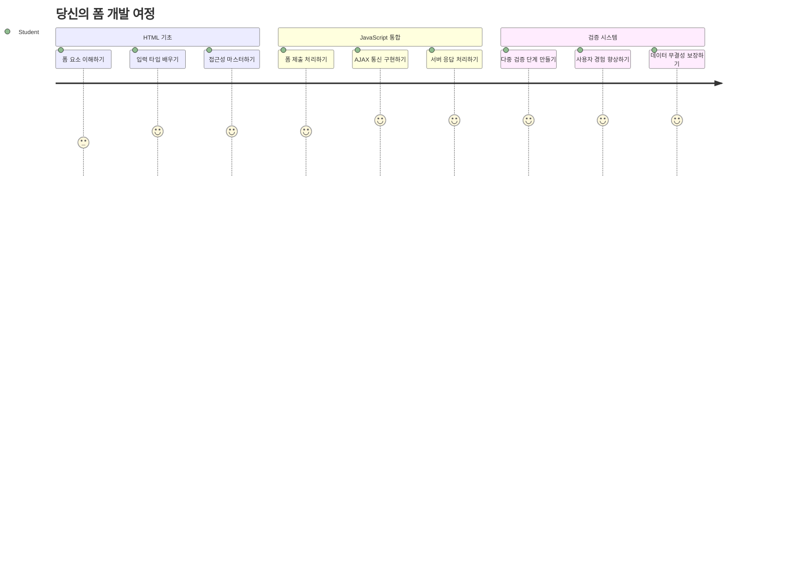
## 강의 전 퀴즈

[강의 전 퀴즈](https://ff-quizzes.netlify.app/web/quiz/43)

온라인에서 양식을 작성하다가 이메일 형식이 거부된 적이 있나요? 아니면 제출 버튼을 눌렀는데 모든 정보가 사라졌나요? 우리 모두 이런 좌절스러운 경험을 해봤을 겁니다.

양식은 사용자와 애플리케이션 기능 간의 다리입니다. 항공 교통 관제사가 비행기를 목적지까지 안전하게 안내하는 까다로운 절차처럼, 잘 설계된 양식은 명확한 피드백을 제공하고 비용이 많이 드는 오류를 방지합니다. 반면에 잘못된 양식은 복잡한 공항의 소통 오류보다도 빠르게 사용자를 떠나게 할 수 있습니다.

이번 수업에서는 정적인 은행 앱을 인터랙티브한 애플리케이션으로 바꿉니다. 사용자 입력을 검증하고, 서버와 통신하며, 유용한 피드백을 제공하는 양식을 만드는 법을 배웁니다. 이를 통해 사용자가 앱 기능을 탐색할 수 있는 제어 인터페이스를 구축하는 셈입니다.

최종적으로는 사용자가 좌절하지 않고 성공으로 안내하는 검증 기능이 포함된 완전한 로그인 및 회원가입 시스템을 갖추게 될 것입니다.

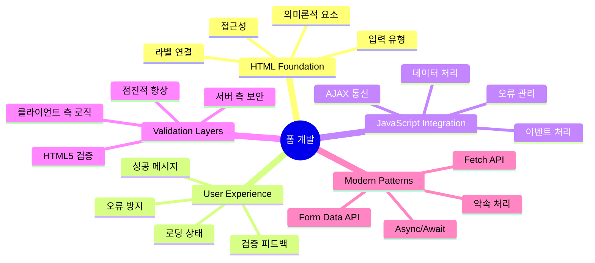
## 사전 준비 사항

양식을 만들기 전에 모든 설정이 올바른지 확인해 보겠습니다. 이 수업은 이전 수업에서 다룬 내용을 그대로 이어가므로, 건너뛰었다면 기본 설정부터 완성하는 것을 권장합니다.

### 필수 설정

| 구성 요소 | 상태 | 설명 |
|-----------|--------|-------------|
| [HTML 템플릿](../1-template-route/README.md) | ✅ 필수 | 기본 은행 앱 구조 |
| [Node.js](https://nodejs.org) | ✅ 필수 | 서버용 자바스크립트 런타임 |
| [은행 API 서버](../api/README.md) | ✅ 필수 | 데이터 저장용 백엔드 서비스 |

> 💡 **개발 팁**: 프론트엔드 은행 앱과 백엔드 API, 두 개의 별도 서버를 동시에 실행할 것입니다. 이는 프론트엔드와 백엔드 서비스가 독립적으로 운영되는 실제 개발 환경과 유사합니다.

### 서버 구성

**개발 환경은 다음으로 구성됩니다:**
- **프론트엔드 서버**: 은행 앱을 제공 (보통 포트 `3000`)
- **백엔드 API 서버**: 데이터 저장 및 조회 처리 (포트 `5000`)
- **두 서버**는 충돌 없이 동시에 실행 가능

**API 연결 테스트:**
```bash
curl http://localhost:5000/api
# 예상 응답: "Bank API v1.0.0"
```

**API 버전 응답이 보이면 준비 완료입니다!**

---

## HTML 양식과 컨트롤 이해하기

HTML 양식은 사용자가 웹 애플리케이션과 소통하는 방식입니다. 19세기 먼 곳을 연결했던 전신 시스템처럼 사용자 의도와 애플리케이션 응답 간 통신 프로토콜 역할을 합니다. 잘 설계되면 오류를 잡아내고 입력 형식을 안내하며 유용한 제안을 제공합니다.

현대 양식은 기본 텍스트 입력보다 훨씬 정교합니다. HTML5는 이메일 검증, 숫자 포맷, 날짜 선택 등을 자동으로 처리하는 전문화된 입력 유형을 도입했습니다. 이러한 개선은 접근성과 모바일 사용자 경험에 모두 이점을 줍니다.

### 필수 양식 요소

**양식에 꼭 필요한 기본 요소:**

```html
<!-- Basic form structure -->
<form id="userForm" method="POST">
  <label for="username">Username</label>
  <input id="username" name="username" type="text" required>
  
  <button type="submit">Submit</button>
</form>
```

**이 코드는 다음을 수행합니다:**
- **폼 컨테이너**를 고유 식별자와 함께 생성
- **데이터 제출 HTTP 메서드** 지정
- **접근성 위해 라벨과 입력 연결**
- **폼 처리용 제출 버튼 정의**

### 최신 입력 유형과 속성

| 입력 유형 | 용도 | 사용 예시 |
|------------|---------|---------------|
| `text` | 일반 텍스트 입력 | `<input type="text" name="username">` |
| `email` | 이메일 검증 | `<input type="email" name="email">` |
| `password` | 비밀 텍스트 입력 | `<input type="password" name="password">` |
| `number` | 숫자 입력 | `<input type="number" name="balance" min="0">` |
| `tel` | 전화번호 입력 | `<input type="tel" name="phone">` |

> 💡 **최신 HTML5 장점**: 특정 입력 유형을 사용하면 추가 자바스크립트 없이 자동 검증, 적합한 모바일 키보드, 더 나은 접근성 지원이 가능합니다!

### 버튼 유형과 동작

```html
<!-- Different button behaviors -->
<button type="submit">Save Data</button>     <!-- Submits the form -->
<button type="reset">Clear Form</button>    <!-- Resets all fields -->
<button type="button">Custom Action</button> <!-- No default behavior -->
```

**각 버튼 유형의 기능:**
- **제출 버튼**: 폼 제출을 트리거하고 지정된 엔드포인트에 데이터 전송
- **초기화 버튼**: 모든 폼 필드를 초기 상태로 복원
- **일반 버튼**: 기본 동작 없음, 기능 구현 위해 커스텀 자바스크립트 필요

> ⚠️ **중요 참고**: `<input>` 요소는 self-closing으로 닫는 태그가 필요 없습니다. 최신 권장 사항은 `<input>`을 슬래시 없이 작성하는 것입니다.

### 로그인 폼 만들기

이제 실용적인 로그인 폼을 만들어 현대 HTML 양식 관행을 보여 드리겠습니다. 기본 구조부터 시작해 접근성 기능과 검증으로 점진적으로 강화할 것입니다.

```html
<template id="login">
  <h1>Bank App</h1>
  <section>
    <h2>Login</h2>
    <form id="loginForm" novalidate>
      <div class="form-group">
        <label for="username">Username</label>
        <input id="username" name="user" type="text" required 
               autocomplete="username" placeholder="Enter your username">
      </div>
      <button type="submit">Login</button>
    </form>
  </section>
</template>
```

**여기서 일어나는 일:**
- **의미론적 HTML5 요소**로 폼 구조화
- **관련 요소 그룹화**를 위해 의미 있는 클래스가 포함된 `div` 컨테이너 사용
- **`for`와 `id` 속성으로 라벨과 입력 연결**
- **더 나은 UX를 위해 `autocomplete`과 `placeholder` 같은 최신 속성 포함**
- **브라우저 기본 검증 대신 JavaScript 검증을 위해 `novalidate` 추가**

### 적절한 라벨의 힘

**왜 라벨이 현대 웹 개발에서 중요한가:**

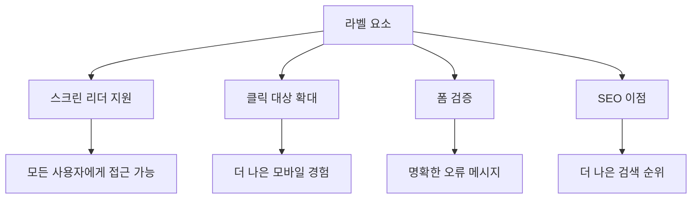
**적절한 라벨이 제공하는 효과:**
- **화면 읽기 도구가 폼 필드를 명확히 읽도록 지원**
- **클릭 영역 확대(라벨 클릭 시 입력에 포커스 이동)**
- **모바일에서 더 큰 터치 영역 제공으로 사용성 향상**
- **폼 검증 시 의미 있는 오류 메시지 지원**
- **폼 요소에 의미론적 의미 부여로 SEO 향상**

> 🎯 **접근성 목표**: 모든 폼 입력에는 연결된 라벨이 있어야 합니다. 이 간단한 습관은 장애가 있는 사용자를 포함해 모든 사용자가 양식을 원활히 사용할 수 있도록 하고 전반적인 사용자 경험을 개선합니다.

### 회원가입 폼 만들기

회원가입 폼은 완전한 사용자 계정 생성을 위해 더 상세한 정보가 필요합니다. 최신 HTML5 기능과 향상된 접근성을 적용해 만들어 봅시다.

```html
<hr/>
<h2>Register</h2>
<form id="registerForm" novalidate>
  <div class="form-group">
    <label for="user">Username</label>
    <input id="user" name="user" type="text" required 
           autocomplete="username" placeholder="Choose a username">
  </div>
  
  <div class="form-group">
    <label for="currency">Currency</label>
    <input id="currency" name="currency" type="text" value="$" 
           required maxlength="3" placeholder="USD, EUR, etc.">
  </div>
  
  <div class="form-group">
    <label for="description">Account Description</label>
    <input id="description" name="description" type="text" 
           maxlength="100" placeholder="Personal savings, checking, etc.">
  </div>
  
  <div class="form-group">
    <label for="balance">Starting Balance</label>
    <input id="balance" name="balance" type="number" value="0" 
           min="0" step="0.01" placeholder="0.00">
  </div>
  
  <button type="submit">Create Account</button>
</form>
```

**위 코드에서:**
- **각 필드를 컨테이너 `div`로 조직화해 스타일과 레이아웃 개선**
- **브라우저 자동 완성 지원을 위한 적절한 `autocomplete` 속성 추가**
- **사용자 입력 안내를 위한 도움말용 플레이스홀더 텍스트 포함**
- **기본값 설정을 위한 `value` 속성 사용**
- **`required`, `maxlength`, `min` 같은 검증 속성 적용**
- **잔액 필드에 소수점 지원을 위한 `type="number"` 사용**

### 입력 유형 및 동작 탐색

**현대 입력 유형의 향상된 기능:**

| 특징 | 이점 | 예시 |
|---------|---------|----------|
| `type="number"` | 모바일에서 숫자 키패드 제공 | 잔액 입력 용이 |
| `step="0.01"` | 소수점 단위 조절 | 화폐 단위(센트) 입력 가능 |
| `autocomplete` | 브라우저 자동 완성 | 빠른 양식 작성 |
| `placeholder` | 맥락적 힌트 제공 | 사용자 기대 안내 |

> 🎯 **접근성 도전 과제**: 키보드만으로 양식을 탐색해 보세요! `Tab`으로 필드 간 이동, `Space`로 체크박스 선택, `Enter`로 제출하기를 시도해 보세요. 이 경험은 화면 읽기 도구 사용자가 양식을 다루는 방식을 이해하는 데 도움이 됩니다.

### 🔄 **학습 상태 점검**
**양식 기초 이해**: 자바스크립트 구현 전에 이해해야 할 사항:
- ✅ 의미론적 HTML이 접근 가능한 폼 구조를 만드는 방법
- ✅ 입력 유형이 모바일 키보드 및 검증에 중요한 이유
- ✅ 라벨과 폼 컨트롤의 관계
- ✅ 폼 속성이 브라우저 기본 동작에 미치는 영향

**빠른 자가 테스트**: 자바스크립트가 없는 상태로 양식을 제출하면 어떻게 되나요?  
*답변: 브라우저가 기본 제출을 수행하여 보통 액션 URL로 리다이렉션합니다.*

**HTML5 폼의 장점**:
- **내장 검증**: 이메일, 숫자 형식 자동 확인
- **모바일 최적화**: 적절한 입력용 키보드 표시
- **접근성 지원**: 화면 읽기 도구 및 키보드 내비게이션 지원
- **점진적 향상**: 자바스크립트가 꺼져 있어도 작동

## 폼 제출 방식 이해하기

누군가 양식을 작성한 뒤 제출 버튼을 누르면 데이터는 보통 저장할 서버로 전송돼야 합니다. 이를 처리하는 몇 가지 방법이 있고 어떤 것을 선택하느냐에 따라 후속 작업이 달라집니다.

버튼을 누를 때 실제로 어떤 일이 일어나는지 살펴보겠습니다.

### 기본 폼 동작

먼저 기본 폼 제출 동작을 관찰해 봅시다:

**현재 양식 테스트:**
1. 양식에서 *가입하기* 버튼 클릭
2. 브라우저 주소창 변화 관찰
3. 페이지가 새로고침 되고 URL에 데이터가 표시됨을 확인


### HTTP 메서드 비교

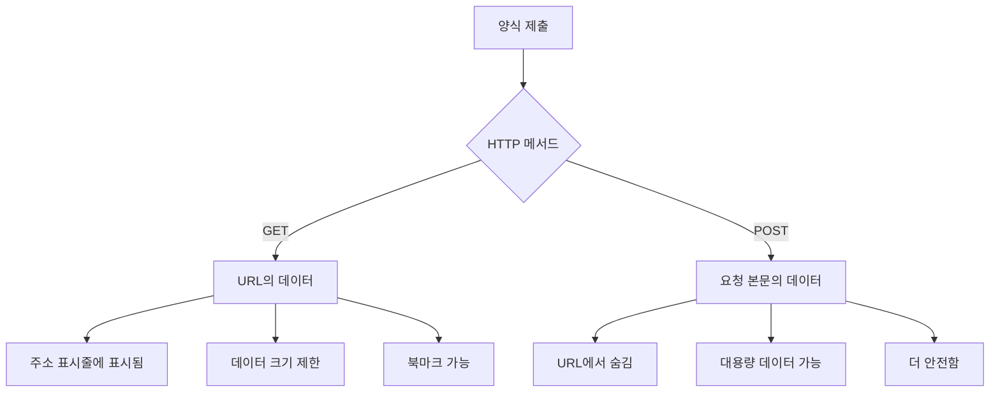
**차이점 이해하기:**

| 메서드 | 사용 사례 | 데이터 위치 | 보안 수준 | 크기 제한 |
|--------|----------|---------------|----------------|-------------|
| `GET` | 검색 쿼리, 필터링 | URL 파라미터 | 낮음 (노출됨) | 약 2000자 |
| `POST` | 사용자 계정, 민감 데이터 | 요청 본문 | 높음 (숨김) | 사실상 무제한 |

**기본 차이점 요약:**
- **GET**: 폼 데이터를 쿼리 파라미터로 URL에 추가 (검색용 적합)
- **POST**: 데이터를 요청 본문에 포함 (민감 정보에 필수)
- **GET 제한**: 크기 제한, 데이터 노출, 브라우저 기록에 남음
- **POST 장점**: 대용량 처리 가능, 개인정보 보호, 파일 업로드 지원

> 💡 **최선의 방법**: 검색 및 필터는 `GET`, 회원가입, 로그인, 데이터 생성에는 `POST` 사용 권장

### 폼 제출 구성

등록 폼이 백엔드 API와 `POST` 방식으로 안전하게 통신하도록 설정합시다:

```html
<form id="registerForm" action="//localhost:5000/api/accounts" 
      method="POST" novalidate>
```

**이 설정의 기능:**
- **폼 제출을 API 엔드포인트로 지정**
- **안전한 전송을 위해 `POST` 메서드 사용**
- **브라우저 기본 검증 대신 JavaScript 검증 위해 `novalidate` 포함**

### 폼 제출 테스트

**테스트 단계:**
1. 등록 폼에 정보 입력
2. "계정 생성" 버튼 클릭
3. 브라우저에서 서버 응답 관찰

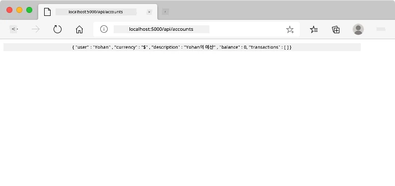

**확인할 사항:**
- **브라우저가 API 엔드포인트 URL로 리다이렉트 됨**
- **새로 생성된 계정 정보가 JSON으로 응답됨**
- **서버가 계정 생성 성공을 알림**

> 🧪 **실험해 보기**: 같은 사용자명으로 다시 가입 시도 후 응답을 살펴보세요. 서버가 중복 데이터 및 오류를 어떻게 처리하는지 이해할 수 있습니다.

### JSON 응답 이해하기

**서버가 양식을 성공적으로 처리했을 때:**
```json
{
  "user": "john_doe",
  "currency": "$",
  "description": "Personal savings",
  "balance": 100,
  "id": "unique_account_id"
}
```

**이 응답은:**
- **지정한 데이터로 새 계정 생성**
- **향후 참조를 위한 고유 식별자 할당**
- **검증용 모든 계정 정보 반환**
- **데이터베이스 저장 성공 표시**

## 자바스크립트로 현대적인 폼 처리하기

전통적인 폼 제출은 페이지 전체를 새로고침합니다. 초기 우주선 미션이 경로 수정을 위해 시스템을 완전 재부팅했던 것과 같습니다. 이런 방식은 사용자 경험을 방해하고 애플리케이션 상태를 잃게 만듭니다.

자바스크립트 폼 처리는 현대 우주선의 실시간 안내 시스템과 같아, 내비게이션 맥락을 잃지 않고도 즉시 조정할 수 있습니다. 폼 제출을 가로채 즉각 피드백을 제공하며, 오류를 우아하게 처리하고 서버 응답에 따라 인터페이스를 업데이트할 수 있습니다.

### 왜 페이지 리로드를 피해야 할까?

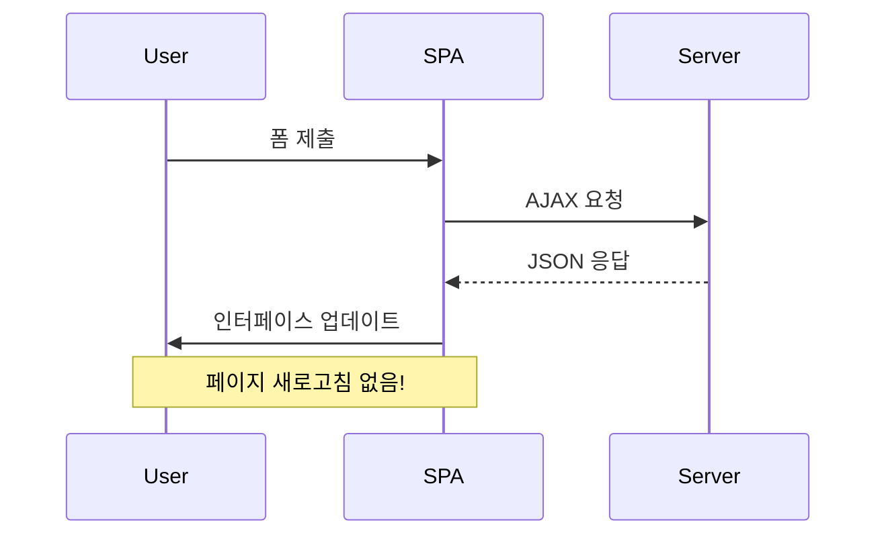
**자바스크립트 폼 처리의 이점:**
- **애플리케이션 상태와 사용자 컨텍스트 유지**
- **즉각적인 피드백 및 로딩 표시 제공**
- **동적 오류 처리 및 검증 가능**
- **부드럽고 앱 같은 사용자 경험 구현**
- **서버 응답에 따른 조건부 로직 가능**

### 전통적인 폼에서 현대 폼으로 전환

**전통적 방식의 문제점:**
- **사용자를 애플리케이션 밖으로 리다이렉트**
- **현재 애플리케이션 상태 및 컨텍스트 손실**
- **간단한 작업에도 전체 페이지 새로고침 필요**
- **사용자 피드백 제어 한계**

**현대 자바스크립트 방식의 장점:**
- **사용자를 애플리케이션 내에 유지**
- **모든 상태와 데이터 유지**
- **실시간 검증과 피드백 가능**
- **점진적 향상과 접근성 지원**

### 자바스크립트 폼 처리 구현

전통적 폼 제출 방식을 현대 자바스크립트 이벤트 처리로 대체합시다:

```html
<!-- Remove the action attribute and add event handling -->
<form id="registerForm" method="POST" novalidate>
```

**`app.js` 파일에 등록 로직 추가:**

```javascript
// 현대적인 이벤트 구동 폼 처리
function register() {
  const registerForm = document.getElementById('registerForm');
  const formData = new FormData(registerForm);
  const data = Object.fromEntries(formData);
  const jsonData = JSON.stringify(data);
  
  console.log('Form data prepared:', data);
}

// 페이지가 로드될 때 이벤트 리스너를 연결
document.addEventListener('DOMContentLoaded', () => {
  const registerForm = document.getElementById('registerForm');
  registerForm.addEventListener('submit', (event) => {
    event.preventDefault(); // 기본 폼 제출 동작 방지
    register();
  });
});
```

**작동 방식 분석:**
- **`event.preventDefault()`로 기본 폼 제출 차단**
- **최신 DOM 선택 방식으로 폼 요소 가져오기**
- **강력한 `FormData` API를 이용해 폼 데이터 추출**
- **`Object.fromEntries()`로 FormData를 일반 객체로 변환**
- **서버 통신을 위해 데이터를 JSON 직렬화**
- **디버깅 및 확인을 위해 처리된 데이터 콘솔 출력**

### FormData API 이해하기

**FormData API는 강력한 폼 처리 기능을 제공합니다:**
```javascript
// FormData가 캡처하는 예
const formData = new FormData(registerForm);

// FormData가 자동으로 캡처합니다:
// {
//   "user": "john_doe",
//   "currency": "$",
//   "description": "개인 계좌",
//   "balance": "100"
// }
```

**FormData API 장점:**
- **포괄적 수집**: 텍스트, 파일, 복잡한 입력까지 모든 폼 요소를 캡처
- **타입 인식**: 사용자 정의 코딩 없이 다양한 입력 타입 자동 처리
- **효율성**: 단일 API 호출로 수작업 필드 수집 제거
- **적응성**: 폼 구조 변경 시에도 기능 유지

### 서버 통신 함수 생성하기

이제 최신 자바스크립트 패턴을 사용하여 API 서버와 통신하는 강력한 함수를 만들어 봅시다:

```javascript
async function createAccount(account) {
  try {
    const response = await fetch('//localhost:5000/api/accounts', {
      method: 'POST',
      headers: { 
        'Content-Type': 'application/json',
        'Accept': 'application/json'
      },
      body: account
    });
    
    // 응답이 성공했는지 확인하세요
    if (!response.ok) {
      throw new Error(`HTTP error! status: ${response.status}`);
    }
    
    return await response.json();
  } catch (error) {
    console.error('Account creation failed:', error);
    return { error: error.message || 'Network error occurred' };
  }
}
```

**비동기 자바스크립트 이해:**

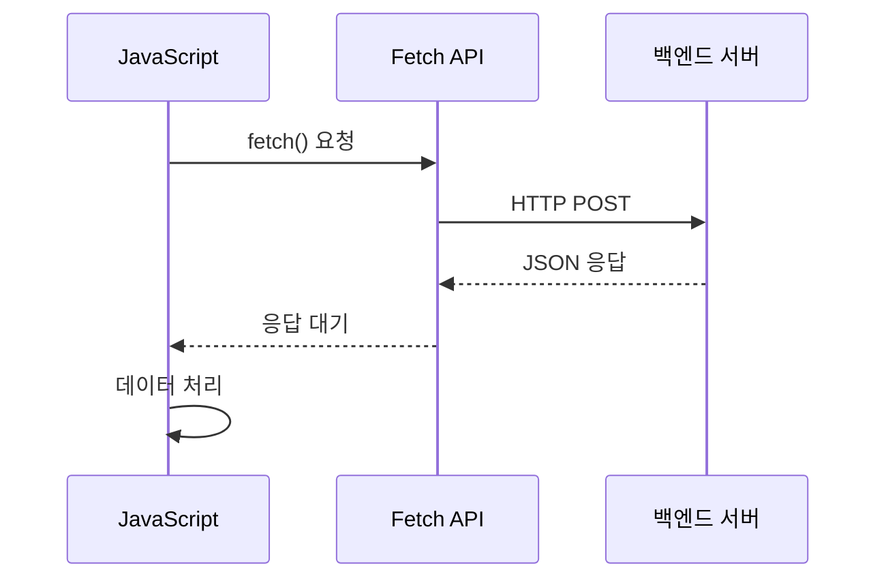
**이 최신 구현에서 달성하는 것:**
- **`async/await` 사용**: 가독성 높은 비동기 코드 작성
- **적절한 오류 처리 포함**: try/catch 블록으로 오류 대응
- **응답 상태 확인 후 데이터 처리**
- **JSON 통신을 위한 적절한 헤더 설정**
- **디버깅을 위한 상세 오류 메시지 제공**
- **성공 및 오류 경우에 일관된 데이터 구조 반환**

### 최신 Fetch API의 힘

**기존 방식 대비 Fetch API 장점:**

| 기능 | 이점 | 구현 예시 |
|---------|---------|----------------|
| Promise 기반 | 깔끔한 비동기 코드 | `await fetch()` |
| 요청 커스터마이징 | HTTP 완전 제어 가능 | 헤더, 메소드, 바디 설정 |
| 응답 처리 | 유연한 데이터 파싱 | `.json()`, `.text()`, `.blob()` |
| 오류 처리 | 포괄적 에러 캡처 | try/catch 블록 |

> 🎥 **더 알아보기**: [Async/Await 튜토리얼](https://youtube.com/watch?v=YwmlRkrxvkk) - 최신 웹 개발용 비동기 자바스크립트 패턴 이해.

**서버 통신 핵심 개념:**
- **Async 함수**는 서버 응답 대기를 위해 실행 일시 정지 가능
- **Await 키워드**는 비동기 코드를 동기 코드처럼 읽히게 만듦
- **Fetch API**는 최신의 Promise 기반 HTTP 요청 제공
- **오류 처리**는 네트워크 문제 발생 시 앱이 우아하게 반응하도록 보장

### 등록 함수 완성하기

모든 것을 합쳐서, 실제 운영 수준의 등록 함수를 만들어 봅시다:

```javascript
async function register() {
  const registerForm = document.getElementById('registerForm');
  const submitButton = registerForm.querySelector('button[type="submit"]');
  
  try {
    // 로딩 상태 표시
    submitButton.disabled = true;
    submitButton.textContent = 'Creating Account...';
    
    // 폼 데이터 처리
    const formData = new FormData(registerForm);
    const jsonData = JSON.stringify(Object.fromEntries(formData));
    
    // 서버로 전송
    const result = await createAccount(jsonData);
    
    if (result.error) {
      console.error('Registration failed:', result.error);
      alert(`Registration failed: ${result.error}`);
      return;
    }
    
    console.log('Account created successfully!', result);
    alert(`Welcome, ${result.user}! Your account has been created.`);
    
    // 성공적인 등록 후 폼 초기화
    registerForm.reset();
    
  } catch (error) {
    console.error('Unexpected error:', error);
    alert('An unexpected error occurred. Please try again.');
  } finally {
    // 버튼 상태 복원
    submitButton.disabled = false;
    submitButton.textContent = 'Create Account';
  }
}
```

**이 개선된 구현은:**
- **폼 제출 중 시각적 피드백 제공**
- **중복 제출 방지를 위해 제출 버튼 비활성화**
- **예상치 못한 오류까지 우아하게 처리**
- **사용자 친화적인 성공 및 오류 메시지 표시**
- **성공적으로 등록 후 폼 초기화**
- **결과와 무관하게 UI 상태 복원**

### 구현 테스트하기

**브라우저 개발자 도구를 열어 등록 기능을 테스트하세요:**

1. **브라우저 콘솔 열기 (F12 → Console 탭)**
2. **등록 폼 작성**
3. **"계정 만들기" 클릭**
4. **콘솔 메시지 및 사용자 피드백 관찰**

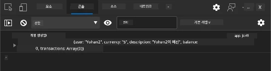

**보여야 할 내용:**
- **제출 버튼에 로딩 상태 표시**
- **콘솔 로그에 상세 진행 정보 출력**
- **계정 생성 성공 시 성공 메시지 표시**
- **성공 제출 후 폼 자동 초기화**

> 🔒 **보안 고려사항**: 현재 데이터가 HTTP로 전송되어 운영 환경에 적합하지 않습니다. 실제 앱에서는 데이터를 암호화하기 위해 반드시 HTTPS를 사용하세요. [HTTPS 보안](https://en.wikipedia.org/wiki/HTTPS)과 사용자 데이터 보호의 중요성에 대해 더 알아보세요.

### 🔄 **교육적 점검**
**최신 자바스크립트 통합**: 비동기 폼 처리 이해도를 확인하세요:
- ✅ `event.preventDefault()`가 기본 폼 동작에 어떤 영향을 주나요?
- ✅ FormData API가 수작업 필드 수집보다 왜 더 효율적인가요?
- ✅ async/await 패턴이 코드 가독성을 어떻게 개선하나요?
- ✅ 오류 처리가 사용자 경험에서 맡는 역할은 무엇인가요?

**시스템 아키텍처**: 귀하의 폼 처리는 다음을 보여줍니다:
- **이벤트 기반 프로그래밍**: 페이지 새로고침 없이 사용자 액션에 대응
- **비동기 통신**: 서버 요청이 UI를 차단하지 않음
- **오류 처리**: 네트워크 오류 발생 시 우아한 예외 처리
- **상태 관리**: 서버 응답에 따라 UI 업데이트 적절히 수행
- **점진적 향상**: 기본 기능 작동, 자바스크립트가 기능 향상 담당

**전문가 패턴**: 다음을 구현하셨습니다:
- **단일 책임 원칙**: 함수가 명확하고 집중된 목적 갖기
- **오류 경계**: try/catch 블록으로 앱 크래시 방지
- **사용자 피드백**: 로딩 상태와 성공/오류 메시지 처리
- **데이터 변환**: FormData를 JSON으로 서버와 통신

## 포괄적 폼 유효성 검사

폼 유효성 검사는 제출 후 오류를 발견하는 답답함을 예방합니다. 국제우주정거장의 여러 중복 시스템처럼, 효과적 유효성 검사는 여러 안전 장치를 겸비합니다.

최적의 접근법은 즉각적인 피드백을 위한 브라우저 수준 검증, 향상된 사용자 경험을 위한 자바스크립트 검증, 보안 및 데이터 무결성을 보장하는 서버 측 검증을 결합하는 것입니다. 이러한 중복성은 사용자 만족과 시스템 보호를 모두 보장합니다.

### 유효성 검사 레이어 이해하기

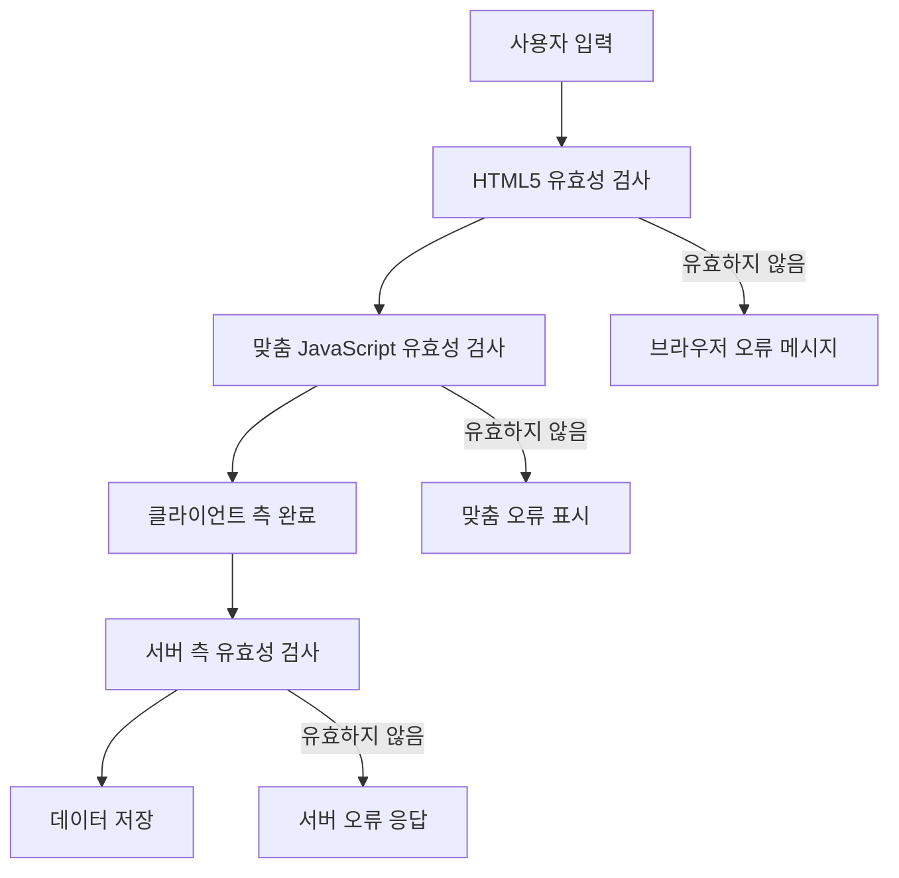
**다계층 유효성 검사 전략:**
- **HTML5 유효성 검사**: 즉각적 브라우저 기반 검사
- **자바스크립트 유효성 검사**: 사용자 정의 로직과 사용자 경험 강화
- **서버 유효성 검사**: 최종 보안 및 데이터 무결성 확인
- **점진적 향상**: 자바스크립트 비활성화 시에도 작동

### HTML5 유효성 검사 속성

**사용 가능한 최신 유효성 검사 도구:**

| 속성 | 용도 | 사용 예시 | 브라우저 동작 |
|-----------|---------|---------------|------------------|
| `required` | 필수 입력 필드 | `<input required>` | 빈 제출 방지 |
| `minlength`/`maxlength` | 텍스트 길이 제한 | `<input maxlength="20">` | 문자 길이 제한 적용 |
| `min`/`max` | 숫자 범위 제한 | `<input min="0" max="1000">` | 숫자 범위 유효성 검사 |
| `pattern` | 정규식 규칙 | `<input pattern="[A-Za-z]+">` | 특정 형식 일치 검사 |
| `type` | 데이터 타입 검사 | `<input type="email">` | 형식별 유효성 검사 |

### CSS 유효성 검사 스타일링

**유효성 검사 상태에 대한 시각적 피드백 만들기:**

```css
/* Valid input styling */
input:valid {
  border-color: #28a745;
  background-color: #f8fff9;
}

/* Invalid input styling */
input:invalid {
  border-color: #dc3545;
  background-color: #fff5f5;
}

/* Focus states for better accessibility */
input:focus:valid {
  box-shadow: 0 0 0 0.2rem rgba(40, 167, 69, 0.25);
}

input:focus:invalid {
  box-shadow: 0 0 0 0.2rem rgba(220, 53, 69, 0.25);
}
```

**이 시각적 표시가 하는 일:**
- **초록색 테두리**: 미션 컨트롤의 녹색 신호등처럼 유효성 성공 표시
- **빨간색 테두리**: 주의가 필요한 유효성 오류 표시
- **포커스 강조**: 현재 입력 위치를 명확히 시각화
- **일관된 스타일링**: 사용자가 익힐 수 있는 예측 가능한 인터페이스 패턴 제공

> 💡 **팁**: `:valid`와 `:invalid` CSS 가상클래스를 사용해 사용자가 입력할 때 즉시 시각적 피드백을 제공하여 반응형이고 친절한 인터페이스를 만드세요.

### 포괄적 유효성 검사 구현하기

등록 폼을 견고한 유효성 검사로 향상시켜 뛰어난 사용자 경험과 데이터 품질을 제공해 봅시다:

```html
<form id="registerForm" method="POST" novalidate>
  <div class="form-group">
    <label for="user">Username <span class="required">*</span></label>
    <input id="user" name="user" type="text" required 
           minlength="3" maxlength="20" 
           pattern="[a-zA-Z0-9_]+" 
           autocomplete="username"
           title="Username must be 3-20 characters, letters, numbers, and underscores only">
    <small class="form-text">Choose a unique username (3-20 characters)</small>
  </div>
  
  <div class="form-group">
    <label for="currency">Currency <span class="required">*</span></label>
    <input id="currency" name="currency" type="text" required 
           value="$" maxlength="3" 
           pattern="[A-Z$€£¥₹]+" 
           title="Enter a valid currency symbol or code">
    <small class="form-text">Currency symbol (e.g., $, €, £)</small>
  </div>
  
  <div class="form-group">
    <label for="description">Account Description</label>
    <input id="description" name="description" type="text" 
           maxlength="100" 
           placeholder="Personal savings, checking, etc.">
    <small class="form-text">Optional description (up to 100 characters)</small>
  </div>
  
  <div class="form-group">
    <label for="balance">Starting Balance</label>
    <input id="balance" name="balance" type="number" 
           value="0" min="0" step="0.01" 
           title="Enter a positive number for your starting balance">
    <small class="form-text">Initial account balance (minimum $0.00)</small>
  </div>
  
  <button type="submit">Create Account</button>
</form>
```

**향상된 유효성 검사 이해하기:**
- **필수 필드 표시와 유용한 설명 결합**
- **형식 검사용 `pattern` 속성 포함**
- **접근성과 툴팁용 `title` 속성 제공**
- **사용자 입력 안내용 보조 텍스트 추가**
- **접근성 향상을 위한 의미론적 HTML 구조 사용**

### 고급 유효성 검사 규칙

**각 유효성 검사 규칙의 역할:**

| 필드 | 유효성 검사 규칙 | 사용자 이점 |
|-------|------------------|--------------|
| 사용자명 | `required`, `minlength="3"`, `maxlength="20"`, `pattern="[a-zA-Z0-9_]+"` | 유효하고 고유한 식별자 보장 |
| 통화 | `required`, `maxlength="3"`, `pattern="[A-Z$€£¥₹]+"` | 일반 통화 기호 허용 |
| 잔액 | `min="0"`, `step="0.01"`, `type="number"` | 음수 잔액 방지 |
| 설명 | `maxlength="100"` | 적절한 길이 제한 |

### 유효성 검사 동작 테스트

**다음 유효성 검사 시나리오를 시도해 보세요:**
1. **빈 필수 필드로 폼 제출 시도**
2. **3자 미만의 사용자명 입력**
3. **사용자명에 특수 문자 입력 시도**
4. **음수 잔액 입력**

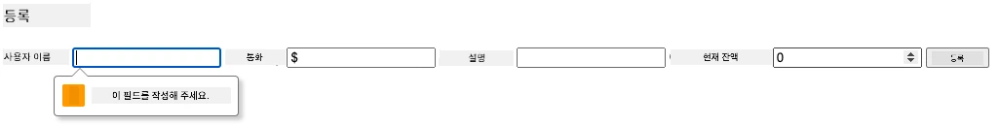

**관찰할 점:**
- **브라우저 기본 유효성 검사 메시지 표시**
- **`:valid` 및 `:invalid` 상태에 따른 스타일 변화**
- **모든 유효성 검사가 통과할 때까지 폼 제출 막힘**
- **최초 오류 필드로 자동 포커스 이동**

### 클라이언트-사이드 vs 서버-사이드 유효성 검사

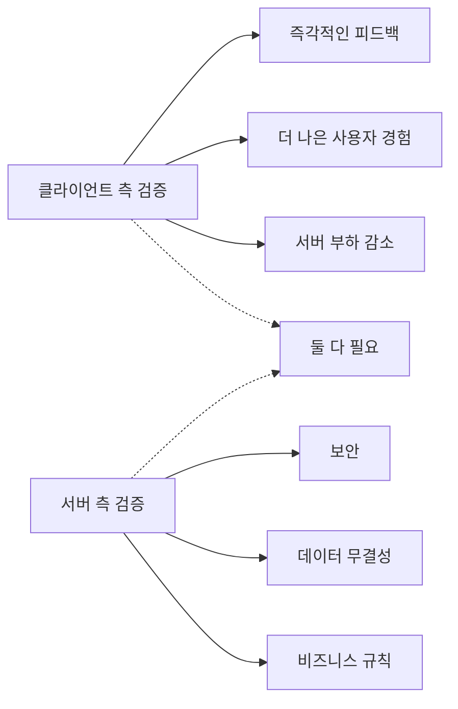
**양쪽이 모두 필요한 이유:**
- **클라이언트-사이드 검사**: 즉각 피드백 및 사용자 경험 향상
- **서버-사이드 검사**: 보안 보장 및 복잡한 비즈니스 규칙 처리
- **결합 접근법**: 견고하고 사용자 친화적이며 안전한 앱 구현
- **점진적 향상**: 자바스크립트 비활성화 시에도 작동

> 🛡️ **보안 알림**: 클라이언트 측 검증만 믿지 마세요! 악의적 사용자는 클라이언트 검증을 우회할 수 있으므로 보안과 데이터 무결성을 위해 서버 측 유효성 검증은 필수입니다.

### ⚡ **다음 5분 동안 해볼 일**
- [ ] 잘못된 데이터로 폼을 테스트하며 유효성 메시지 확인
- [ ] 자바스크립트 비활성화 후 HTML5 유효성 검사 시도
- [ ] 브라우저 개발자 도구 열고 서버에 전송되는 폼 데이터 검사
- [ ] 다양한 입력 타입 테스트하여 모바일 키보드 변화 확인

### 🎯 **이번 시간에 달성할 목표**
- [ ] 강의 후 퀴즈 완료 및 폼 처리 개념 이해
- [ ] 실시간 피드백 포함 포괄적 유효성 검사 구현 도전
- [ ] 전문적인 폼용 CSS 스타일링 추가
- [ ] 중복 사용자명 및 서버 오류에 대한 오류 처리 구현
- [ ] 비밀번호 확인 필드 및 일치 검사 추가

### 📅 **주간 폼 마스터리 여정**
- [ ] 고급 기능 포함 완전한 뱅킹 앱 구현
- [ ] 프로필 사진 또는 문서 업로드 기능 추가
- [ ] 진행 표시기 및 상태 관리 포함 다중 단계 폼 구현
- [ ] 사용자 선택에 따라 적응하는 동적 폼 생성
- [ ] 더 나은 사용자 경험을 위한 자동 저장 및 복구 기능 구현
- [ ] 이메일 인증 및 전화번호 형식 지정 같은 고급 유효성 검사 추가

### 🌟 **월간 프런트엔드 개발 마스터리**
- [ ] 조건부 로직과 워크플로우가 포함된 복잡한 폼 애플리케이션 제작
- [ ] 신속한 개발을 위한 폼 라이브러리 및 프레임워크 학습
- [ ] 접근성 지침과 포괄적 디자인 원칙 마스터
- [ ] 전 세계 양식 지원을 위한 국제화 및 현지화 구현
- [ ] 재사용 가능한 폼 컴포넌트 라이브러리 및 디자인 시스템 구축
- [ ] 오픈 소스 폼 프로젝트에 기여하고 베스트 프랙티스 공유

## 🎯 당신의 폼 개발 마스터리 타임라인

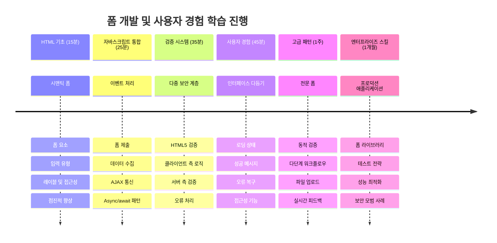
### 🛠️ 당신의 폼 개발 도구 모음 요약

이번 강의를 완료한 후, 이제 다음을 마스터했습니다:
- **HTML5 폼**: 의미론적 구조, 입력 타입, 접근성 기능
- **자바스크립트 폼 처리**: 이벤트 관리, 데이터 수집, AJAX 통신
- **유효성 검사 아키텍처**: 보안 및 사용자 경험을 위한 다중 레이어 검사
- **비동기 프로그래밍**: 최신 fetch API와 async/await 패턴
- **오류 관리**: 포괄적 오류 처리와 사용자 피드백 체계
- **사용자 경험 디자인**: 로딩 상태, 성공 메시지, 오류 복구
- **점진적 향상**: 모든 브라우저와 기능에서 동작하는 폼

**실제 적용 사례**: 당신의 폼 개발 기술은 다음에 직접 적용됩니다:
- **전자상거래 애플리케이션**: 결제 과정, 계정 등록, 결제 폼
- **기업용 소프트웨어**: 데이터 입력 시스템, 보고 인터페이스, 워크플로우 앱
- **콘텐츠 관리**: 게시 플랫폼, 사용자 생성 콘텐츠, 관리 인터페이스
- **금융 애플리케이션**: 뱅킹 인터페이스, 투자 플랫폼, 거래 시스템
- **의료 시스템**: 환자 포털, 예약 일정, 의료 기록 폼
- **교육 플랫폼**: 강좌 등록, 평가 도구, 학습 관리

**전문 기술 향상**: 이제 다음이 가능합니다:
- **모든 사용자, 장애인 포함, 접근 가능한 폼 설계**
- **데이터 훼손 및 보안 취약점을 막는 안전한 폼 유효성 검사 구현**
- **명확한 피드백과 안내를 제공하는 반응형 사용자 인터페이스 제작**
- **브라우저 개발자 도구 및 네트워크 분석을 사용해 복잡한 폼 상호작용 디버그**
- **효율적인 데이터 처리 및 유효성 검사 전략을 통해 폼 성능 최적화**

**프론트엔드 개발 개념 숙달**:
- **이벤트 기반 아키텍처**: 사용자 상호작용 처리 및 응답 시스템
- **비동기 프로그래밍**: 논블로킹 서버 통신 및 오류 처리
- **데이터 유효성 검사**: 클라이언트 및 서버 측 보안 및 무결성 검사
- **사용자 경험 디자인**: 사용자가 성공으로 이끄는 직관적 인터페이스
- **접근성 공학**: 다양한 사용자 필요에 맞는 포괄적 설계

**다음 단계**: 고급 폼 라이브러리를 탐색하거나, 복잡한 유효성 검사 규칙을 구현하거나, 기업용 데이터 수집 시스템 구축에 도전하세요!

🌟 **획득한 성과**: 전문가 수준 유효성 검사, 오류 처리, 사용자 경험 패턴이 포함된 완전한 폼 처리 시스템을 구축했습니다!

---


---

## GitHub Copilot Agent Challenge 🚀

에이전트 모드를 사용하여 다음 도전을 완료하세요:

**설명:** 등록 폼을 포괄적인 클라이언트 측 유효성 검사와 사용자 피드백으로 향상하세요. 이번 도전은 폼 유효성 검사, 오류 처리, 상호작용 피드백으로 사용자 경험 개선을 실습할 기회를 제공합니다.
**프롬프트:** 등록 양식을 위한 완전한 폼 유효성 검사 시스템을 만드세요. 다음을 포함합니다: 1) 사용자가 입력할 때 각 필드에 대한 실시간 유효성 검사 피드백, 2) 각 입력 필드 아래에 표시되는 사용자 정의 유효성 검사 메시지, 3) 비밀번호 확인 필드 및 일치 유효성 검사, 4) 시각적 표시기(유효한 필드에는 초록색 체크 표시, 유효하지 않은 필드에는 빨간 경고 표시 등), 5) 모든 유효성 검사가 통과되었을 때만 활성화되는 제출 버튼. HTML5 유효성 검사 속성, 유효성 검사 상태 스타일링을 위한 CSS, 상호 작용 동작을 위한 JavaScript를 사용하세요.

[agent mode](https://code.visualstudio.com/blogs/2025/02/24/introducing-copilot-agent-mode)에 대해 자세히 알아보세요.

## 🚀 챌린지

사용자가 이미 존재하는 경우 HTML에 오류 메시지를 표시하세요.

약간의 스타일링 후 최종 로그인 페이지가 어떻게 보일 수 있는지에 대한 예시는 다음과 같습니다:

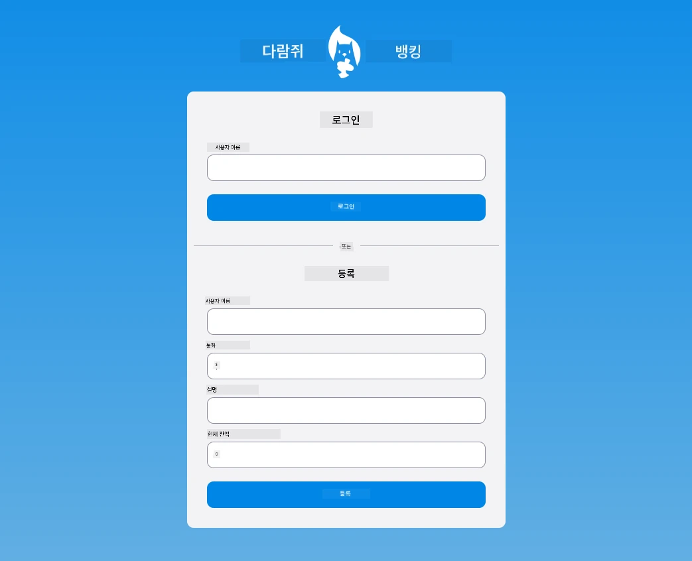

## 강의 후 퀴즈

[강의 후 퀴즈](https://ff-quizzes.netlify.app/web/quiz/44)

## 리뷰 및 자기 주도 학습

개발자들은 특히 유효성 검사 전략과 관련하여 폼 제작에 매우 창의적이 되었습니다. [CodePen](https://codepen.com)을 살펴보며 다양한 폼 흐름을 배워보세요; 흥미롭고 영감을 주는 폼을 찾을 수 있나요?

## 과제

[당신의 은행 앱 스타일링하기](assignment.md)

---

<!-- CO-OP TRANSLATOR DISCLAIMER START -->
**면책 조항**:  
이 문서는 AI 번역 서비스 [Co-op Translator](https://github.com/Azure/co-op-translator)를 사용하여 번역되었습니다. 저희는 정확성을 위해 최선을 다하고 있으나, 자동 번역에는 오류나 부정확성이 있을 수 있음을 양지해 주시기 바랍니다. 원문은 해당 문서가 작성된 원어가 권위 있는 출처로 간주되어야 합니다. 중요한 정보의 경우 전문적인 인간 번역을 권장합니다. 본 번역 사용으로 인한 오해나 잘못된 해석에 대해 당사는 책임지지 않습니다.
<!-- CO-OP TRANSLATOR DISCLAIMER END -->