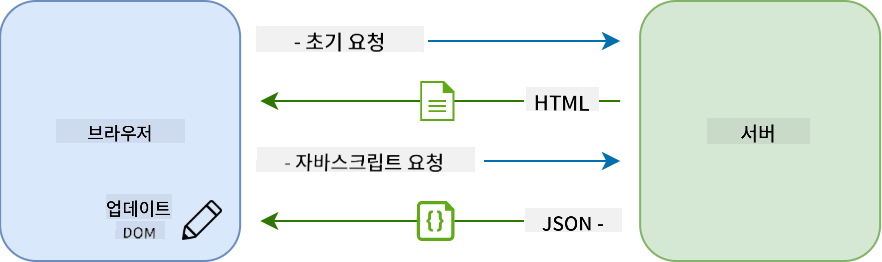

<!--
CO_OP_TRANSLATOR_METADATA:
{
  "original_hash": "89d0df9854ed020f155e94882ae88d4c",
  "translation_date": "2025-08-29T15:32:52+00:00",
  "source_file": "7-bank-project/3-data/README.md",
  "language_code": "ko"
}
-->
# 은행 앱 만들기 Part 3: 데이터 가져오기 및 사용 방법

## 강의 전 퀴즈

[강의 전 퀴즈](https://ff-quizzes.netlify.app/web/quiz/45)

### 소개

모든 웹 애플리케이션의 핵심은 *데이터*입니다. 데이터는 다양한 형태를 가질 수 있지만, 그 주요 목적은 항상 사용자에게 정보를 표시하는 것입니다. 웹 애플리케이션이 점점 더 상호작용적이고 복잡해짐에 따라, 사용자가 정보를 접근하고 상호작용하는 방식은 웹 개발의 중요한 부분이 되었습니다.

이번 강의에서는 서버에서 데이터를 비동기적으로 가져오는 방법과 HTML을 다시 로드하지 않고 웹 페이지에 정보를 표시하는 방법을 배웁니다.

### 사전 요구사항

이 강의를 위해 웹 앱의 [로그인 및 등록 폼](../2-forms/README.md)을 이미 구축했어야 합니다. 또한 [Node.js](https://nodejs.org)를 설치하고 [서버 API](../api/README.md)를 로컬에서 실행하여 계정 데이터를 가져와야 합니다.

서버가 제대로 실행되고 있는지 확인하려면 터미널에서 다음 명령을 실행하세요:

```sh
curl http://localhost:5000/api
# -> should return "Bank API v1.0.0" as a result
```

---

## AJAX와 데이터 가져오기

전통적인 웹 사이트는 사용자가 링크를 선택하거나 폼을 통해 데이터를 제출할 때 HTML 페이지 전체를 다시 로드하여 표시되는 콘텐츠를 업데이트합니다. 새로운 데이터를 로드할 때마다 웹 서버는 브라우저가 처리해야 하는 새로운 HTML 페이지를 반환하며, 이는 현재 사용자 작업을 중단시키고 로드 중 상호작용을 제한합니다. 이러한 워크플로는 *멀티 페이지 애플리케이션* 또는 *MPA*라고도 합니다.


웹 애플리케이션이 점점 더 복잡하고 상호작용적으로 발전하면서 [AJAX (Asynchronous JavaScript and XML)](https://en.wikipedia.org/wiki/Ajax_(programming))라는 새로운 기술이 등장했습니다. 이 기술은 JavaScript를 사용하여 서버에서 데이터를 비동기적으로 보내고 가져올 수 있게 하며, HTML 페이지를 다시 로드하지 않아도 되어 더 빠른 업데이트와 부드러운 사용자 상호작용을 제공합니다. 서버에서 새로운 데이터를 받으면 JavaScript를 사용하여 [DOM](https://developer.mozilla.org/docs/Web/API/Document_Object_Model) API를 통해 현재 HTML 페이지를 업데이트할 수 있습니다. 시간이 지나면서 이 접근 방식은 [*싱글 페이지 애플리케이션* 또는 *SPA*](https://en.wikipedia.org/wiki/Single-page_application)로 발전했습니다.



AJAX가 처음 도입되었을 때, 비동기적으로 데이터를 가져오기 위해 사용할 수 있는 유일한 API는 [`XMLHttpRequest`](https://developer.mozilla.org/docs/Web/API/XMLHttpRequest/Using_XMLHttpRequest)였습니다. 하지만 현대 브라우저는 이제 더 편리하고 강력한 [`Fetch` API](https://developer.mozilla.org/docs/Web/API/Fetch_API)를 구현하며, 이는 프로미스를 사용하고 JSON 데이터를 조작하기에 더 적합합니다.

> 모든 최신 브라우저가 `Fetch API`를 지원하지만, 웹 애플리케이션이 오래된 브라우저에서도 작동하기를 원한다면 [caniuse.com의 호환성 표](https://caniuse.com/fetch)를 먼저 확인하는 것이 항상 좋은 생각입니다.

### 작업

[이전 강의](../2-forms/README.md)에서 계정을 생성하기 위한 등록 폼을 구현했습니다. 이제 기존 계정을 사용하여 로그인하고 데이터를 가져오는 코드를 추가하겠습니다. `app.js` 파일을 열고 새로운 `login` 함수를 추가하세요:

```js
async function login() {
  const loginForm = document.getElementById('loginForm')
  const user = loginForm.user.value;
}
```

여기서는 먼저 `getElementById()`를 사용하여 폼 요소를 가져오고, `loginForm.user.value`를 통해 입력에서 사용자 이름을 가져옵니다. 모든 폼 컨트롤은 HTML에서 `name` 속성을 사용하여 설정된 이름을 폼의 속성으로 접근할 수 있습니다.

등록을 위해 했던 것과 비슷하게, 이번에는 계정 데이터를 가져오기 위한 서버 요청을 수행하는 또 다른 함수를 생성하겠습니다:

```js
async function getAccount(user) {
  try {
    const response = await fetch('//localhost:5000/api/accounts/' + encodeURIComponent(user));
    return await response.json();
  } catch (error) {
    return { error: error.message || 'Unknown error' };
  }
}
```

`fetch` API를 사용하여 서버에서 데이터를 비동기적으로 요청합니다. 이번에는 데이터를 쿼리하는 것뿐이므로 URL 외에 추가 매개변수가 필요하지 않습니다. 기본적으로 `fetch`는 우리가 원하는 [`GET`](https://developer.mozilla.org/docs/Web/HTTP/Methods/GET) HTTP 요청을 생성합니다.

✅ `encodeURIComponent()`는 URL의 특수 문자를 이스케이프 처리하는 함수입니다. 이 함수를 호출하지 않고 `user` 값을 URL에 직접 사용하면 어떤 문제가 발생할 수 있을까요?

이제 `login` 함수를 업데이트하여 `getAccount`를 사용해 보겠습니다:

```js
async function login() {
  const loginForm = document.getElementById('loginForm')
  const user = loginForm.user.value;
  const data = await getAccount(user);

  if (data.error) {
    return console.log('loginError', data.error);
  }

  account = data;
  navigate('/dashboard');
}
```

먼저, `getAccount`는 비동기 함수이므로 서버 결과를 기다리기 위해 `await` 키워드와 함께 사용해야 합니다. 모든 서버 요청과 마찬가지로 오류 상황을 처리해야 합니다. 지금은 오류를 표시하는 로그 메시지만 추가하고 나중에 다시 돌아오겠습니다.

그런 다음 대시보드 정보를 표시하기 위해 데이터를 저장할 필요가 있습니다. 아직 `account` 변수가 존재하지 않으므로 파일 상단에 전역 변수를 생성하겠습니다:

```js
let account = null;
```

사용자 데이터를 변수에 저장한 후, 이미 가지고 있는 `navigate()` 함수를 사용하여 *로그인* 페이지에서 *대시보드*로 이동할 수 있습니다.

마지막으로, 로그인 폼이 제출될 때 `login` 함수를 호출하도록 HTML을 수정해야 합니다:

```html
<form id="loginForm" action="javascript:login()">
```

새 계정을 등록하고 동일한 계정을 사용하여 로그인하여 모든 것이 올바르게 작동하는지 테스트하세요.

다음 부분으로 넘어가기 전에, `register` 함수를 아래 코드를 추가하여 완성할 수 있습니다:

```js
account = result;
navigate('/dashboard');
```

✅ 기본적으로, 브라우저는 사용자가 보고 있는 웹 페이지와 동일한 도메인 및 포트에서만 서버 API를 호출할 수 있습니다. 이는 브라우저에서 강제하는 보안 메커니즘입니다. 그런데 우리의 웹 앱은 `localhost:3000`에서 실행되고 서버 API는 `localhost:5000`에서 실행되는데, 왜 작동할까요? [Cross-Origin Resource Sharing (CORS)](https://developer.mozilla.org/docs/Web/HTTP/CORS)라는 기술을 사용하면 서버가 특정 도메인에 대한 예외를 허용하는 특별한 헤더를 응답에 추가하여 교차 출처 HTTP 요청을 수행할 수 있습니다.

> API에 대해 더 배우고 싶다면 이 [강의](https://docs.microsoft.com/learn/modules/use-apis-discover-museum-art/?WT.mc_id=academic-77807-sagibbon)를 확인하세요.

## HTML 업데이트하여 데이터 표시

이제 사용자 데이터를 얻었으니 기존 HTML을 업데이트하여 데이터를 표시해야 합니다. 이미 `document.getElementById()`를 사용하여 DOM에서 요소를 가져오는 방법을 알고 있습니다. 기본 요소를 가져온 후, 다음 API를 사용하여 요소를 수정하거나 자식 요소를 추가할 수 있습니다:

- [`textContent`](https://developer.mozilla.org/docs/Web/API/Node/textContent) 속성을 사용하여 요소의 텍스트를 변경할 수 있습니다. 이 값을 변경하면 요소의 모든 자식 요소(있는 경우)가 제거되고 제공된 텍스트로 대체됩니다. 따라서 빈 문자열 `''`을 할당하여 주어진 요소의 모든 자식을 효율적으로 제거할 수도 있습니다.

- [`document.createElement()`](https://developer.mozilla.org/docs/Web/API/Document/createElement)와 [`append()`](https://developer.mozilla.org/docs/Web/API/ParentNode/append) 메서드를 사용하여 하나 이상의 새로운 자식 요소를 생성하고 첨부할 수 있습니다.

✅ [`innerHTML`](https://developer.mozilla.org/docs/Web/API/Element/innerHTML) 속성을 사용하여 요소의 HTML 콘텐츠를 변경할 수도 있지만, 이는 [크로스 사이트 스크립팅 (XSS)](https://developer.mozilla.org/docs/Glossary/Cross-site_scripting) 공격에 취약하므로 피해야 합니다.

### 작업

*로그인* 페이지에서 대시보드 화면으로 넘어가기 전에 한 가지 더 해야 할 일이 있습니다. 현재, 존재하지 않는 사용자 이름으로 로그인하려고 하면 콘솔에 메시지가 표시되지만 일반 사용자에게는 아무것도 변경되지 않아 무슨 일이 일어났는지 알 수 없습니다.

로그인 `<button>` 바로 앞에 오류 메시지를 표시할 수 있는 플레이스홀더 요소를 추가하겠습니다:

```html
...
<div id="loginError"></div>
<button>Login</button>
...
```

이 `<div>` 요소는 비어 있으므로 화면에 아무것도 표시되지 않습니다. 또한 `id`를 부여하여 JavaScript로 쉽게 가져올 수 있도록 합니다.

`app.js` 파일로 돌아가서 새로운 헬퍼 함수 `updateElement`를 생성하세요:

```js
function updateElement(id, text) {
  const element = document.getElementById(id);
  element.textContent = text;
}
```

이 함수는 매우 간단합니다. 주어진 요소 *id*와 *text*를 사용하여 해당 `id`를 가진 DOM 요소의 텍스트 콘텐츠를 업데이트합니다. 이 메서드를 사용하여 `login` 함수의 이전 오류 메시지를 대체하겠습니다:

```js
if (data.error) {
  return updateElement('loginError', data.error);
}
```

이제 유효하지 않은 계정으로 로그인하려고 하면 다음과 같은 메시지가 표시됩니다:


이제 시각적으로 오류 텍스트가 표시되지만, 화면 판독기를 사용해 보면 아무것도 발표되지 않는다는 것을 알 수 있습니다. 페이지에 동적으로 추가된 텍스트가 화면 판독기에 발표되려면 [라이브 영역](https://developer.mozilla.org/docs/Web/Accessibility/ARIA/ARIA_Live_Regions)을 사용해야 합니다. 여기서는 경고라는 특정 유형의 라이브 영역을 사용할 것입니다:

```html
<div id="loginError" role="alert"></div>
```

`register` 함수 오류에도 동일한 동작을 구현하세요(HTML 업데이트를 잊지 마세요).

## 대시보드에 정보 표시

방금 본 기술을 사용하여 대시보드 페이지에서 계정 정보를 표시하는 작업도 처리하겠습니다.

서버에서 받은 계정 객체는 다음과 같습니다:

```json
{
  "user": "test",
  "currency": "$",
  "description": "Test account",
  "balance": 75,
  "transactions": [
    { "id": "1", "date": "2020-10-01", "object": "Pocket money", "amount": 50 },
    { "id": "2", "date": "2020-10-03", "object": "Book", "amount": -10 },
    { "id": "3", "date": "2020-10-04", "object": "Sandwich", "amount": -5 }
  ],
}
```

> 참고: 이미 데이터가 채워진 `test` 계정을 사용하면 작업이 더 쉬워집니다.

### 작업

HTML에서 "Balance" 섹션을 플레이스홀더 요소로 대체하는 작업부터 시작하겠습니다:

```html
<section>
  Balance: <span id="balance"></span><span id="currency"></span>
</section>
```

또한 계정 설명을 표시하기 위해 바로 아래에 새로운 섹션을 추가하겠습니다:

```html
<h2 id="description"></h2>
```

✅ 계정 설명은 아래 콘텐츠의 제목 역할을 하므로 의미적으로 제목으로 표시됩니다. [제목 구조](https://www.nomensa.com/blog/2017/how-structure-headings-web-accessibility)가 접근성에 얼마나 중요한지 알아보고 페이지를 비판적으로 검토하여 다른 제목이 될 수 있는 부분을 확인하세요.

다음으로, `app.js`에서 플레이스홀더를 채우는 새로운 함수를 생성하겠습니다:

```js
function updateDashboard() {
  if (!account) {
    return navigate('/login');
  }

  updateElement('description', account.description);
  updateElement('balance', account.balance.toFixed(2));
  updateElement('currency', account.currency);
}
```

먼저, 필요한 계정 데이터가 있는지 확인한 후 진행합니다. 그런 다음 이전에 생성한 `updateElement()` 함수를 사용하여 HTML을 업데이트합니다.

> 잔액 표시를 더 보기 좋게 만들기 위해 [`toFixed(2)`](https://developer.mozilla.org/docs/Web/JavaScript/Reference/Global_Objects/Number/toFixed) 메서드를 사용하여 소수점 아래 2자리 숫자를 강제로 표시합니다.

이제 대시보드가 로드될 때마다 `updateDashboard()` 함수를 호출해야 합니다. [강의 1 과제](../1-template-route/assignment.md)를 이미 완료했다면 간단할 것입니다. 그렇지 않다면 다음 구현을 사용할 수 있습니다.

`updateRoute()` 함수 끝에 이 코드를 추가하세요:

```js
if (typeof route.init === 'function') {
  route.init();
}
```

그리고 라우트 정의를 다음과 같이 업데이트하세요:

```js
const routes = {
  '/login': { templateId: 'login' },
  '/dashboard': { templateId: 'dashboard', init: updateDashboard }
};
```

이 변경으로 인해 대시보드 페이지가 표시될 때마다 `updateDashboard()` 함수가 호출됩니다. 로그인 후 계정 잔액, 통화 및 설명을 볼 수 있어야 합니다.

## HTML 템플릿으로 테이블 행 동적으로 생성하기

[첫 번째 강의](../1-template-route/README.md)에서 HTML 템플릿과 [`appendChild()`](https://developer.mozilla.org/docs/Web/API/Node/appendChild) 메서드를 사용하여 앱의 탐색을 구현했습니다. 템플릿은 더 작게 만들어 페이지의 반복적인 부분을 동적으로 채우는 데도 사용할 수 있습니다.

비슷한 접근 방식을 사용하여 HTML 테이블에서 거래 목록을 표시하겠습니다.

### 작업

HTML `<body>`에 새로운 템플릿을 추가하세요:

```html
<template id="transaction">
  <tr>
    <td></td>
    <td></td>
    <td></td>
  </tr>
</template>
```

이 템플릿은 단일 테이블 행을 나타내며, 우리가 채우고자 하는 3개의 열: 거래의 *날짜*, *객체*, *금액*을 포함합니다.

그런 다음, JavaScript로 쉽게 찾을 수 있도록 대시보드 템플릿 내 테이블의 `<tbody>` 요소에 이 `id` 속성을 추가하세요:

```html
<tbody id="transactions"></tbody>
```

HTML이 준비되었으니 JavaScript 코드로 전환하여 새로운 함수 `createTransactionRow`를 생성하겠습니다:

```js
function createTransactionRow(transaction) {
  const template = document.getElementById('transaction');
  const transactionRow = template.content.cloneNode(true);
  const tr = transactionRow.querySelector('tr');
  tr.children[0].textContent = transaction.date;
  tr.children[1].textContent = transaction.object;
  tr.children[2].textContent = transaction.amount.toFixed(2);
  return transactionRow;
}
```

이 함수는 이름 그대로의 역할을 합니다: 우리가 이전에 생성한 템플릿을 사용하여 새로운 테이블 행을 생성하고 거래 데이터를 사용하여 내용을 채웁니다. 이를 `updateDashboard()` 함수에서 사용하여 테이블을 채우겠습니다:

```js
const transactionsRows = document.createDocumentFragment();
for (const transaction of account.transactions) {
  const transactionRow = createTransactionRow(transaction);
  transactionsRows.appendChild(transactionRow);
}
updateElement('transactions', transactionsRows);
```

여기서는 [`document.createDocumentFragment()`](https://developer.mozilla.org/docs/Web/API/Document/createDocumentFragment) 메서드를 사용하여 작업할 새로운 DOM 프래그먼트를 생성한 후, 최종적으로 이를 HTML 테이블에 첨부합니다.

이 코드가 작동하기 전에 아직 해야 할 일이 하나 더 있습니다. 현재 `updateElement()` 함수는 텍스트 콘텐츠만 지원합니다. 코드를 약간 변경하겠습니다:

```js
function updateElement(id, textOrNode) {
  const element = document.getElementById(id);
  element.textContent = ''; // Removes all children
  element.append(textOrNode);
}
```

[`append()`](https://developer.mozilla.org/docs/Web/API/ParentNode/append) 메서드를 사용하여 텍스트 또는 [DOM 노드](https://developer.mozilla.org/docs/Web/API/Node)를 부모 요소에 첨부할 수 있습니다. 이는 모든 사용 사례에 적합합니다.
`test` 계정을 사용해 로그인하면 이제 대시보드에서 거래 목록을 볼 수 있을 거예요 🎉.

---

## 🚀 도전 과제

함께 협력하여 대시보드 페이지를 실제 은행 앱처럼 보이게 만들어 보세요. 이미 앱에 스타일을 적용했다면, [미디어 쿼리](https://developer.mozilla.org/docs/Web/CSS/Media_Queries)를 사용해 [반응형 디자인](https://developer.mozilla.org/docs/Web/Progressive_web_apps/Responsive/responsive_design_building_blocks)을 구현해 보세요. 데스크톱과 모바일 기기 모두에서 잘 작동하도록 만들어 보세요.

다음은 스타일이 적용된 대시보드 페이지의 예시입니다:


## 강의 후 퀴즈

[강의 후 퀴즈](https://ff-quizzes.netlify.app/web/quiz/46)

## 과제

[코드 리팩터링 및 주석 작성](assignment.md)

---

**면책 조항**:  
이 문서는 AI 번역 서비스 [Co-op Translator](https://github.com/Azure/co-op-translator)를 사용하여 번역되었습니다. 정확성을 위해 최선을 다하고 있지만, 자동 번역에는 오류나 부정확성이 포함될 수 있습니다. 원본 문서의 원어 버전을 권위 있는 출처로 간주해야 합니다. 중요한 정보의 경우, 전문적인 인간 번역을 권장합니다. 이 번역 사용으로 인해 발생하는 오해나 잘못된 해석에 대해 책임을 지지 않습니다.