# 은행 앱 만들기 3부: 데이터 가져오기와 사용 방법

스타트렉의 엔터프라이즈 컴퓨터를 떠올려보세요 - 피카드 함장이 함선 상태를 물어보면, 인터페이스가 멈췄다가 다시 만들어지지 않고 즉시 정보가 나타납니다. 그런 원활한 정보 흐름이 바로 우리가 동적 데이터 가져오기를 통해 구축하려는 것입니다.

지금 당신의 은행 앱은 인쇄된 신문과 같습니다 - 정보는 제공하지만 정적입니다. 우리는 그것을 NASA의 미션 컨트롤처럼, 데이터가 계속해서 실시간으로 흐르며 사용자의 작업 흐름을 방해하지 않고 업데이트되는 형태로 변환할 것입니다.

서버와 비동기적으로 통신하는 방법, 서로 다른 시점에 도착하는 데이터를 처리하는 법, 원시 정보를 사용자에게 의미 있는 형태로 변환하는 법을 배우게 될 것입니다. 이 차이가 데모와 프로덕션 준비 소프트웨어를 구분합니다.

## ⚡ 다음 5분 동안 할 수 있는 것

**바쁜 개발자를 위한 빠른 시작 경로**


- **1-2분**: API 서버 시작하기 (`cd api && npm start`) 및 연결 테스트
- **3분**: fetch를 사용한 기본 `getAccount()` 함수 만들기
- **4분**: `action="javascript:login()"` 으로 로그인 폼 연결하기
- **5분**: 로그인 테스트 후 콘솔에서 계좌 데이터 확인하기

**빠른 테스트 명령어**:
```bash
# API가 실행 중인지 확인
curl http://localhost:5000/api

# 테스트 계정 데이터 가져오기
curl http://localhost:5000/api/accounts/test
```

**중요한 이유**: 5분 만에 현대 웹 애플리케이션이 사용하는 비동기 데이터 가져오기 방식을 체험할 수 있습니다. 이는 앱이 반응적이고 생명력 있게 느껴지게 하는 기반입니다.

## 🗺️ 데이터 기반 웹 애플리케이션 학습 여정

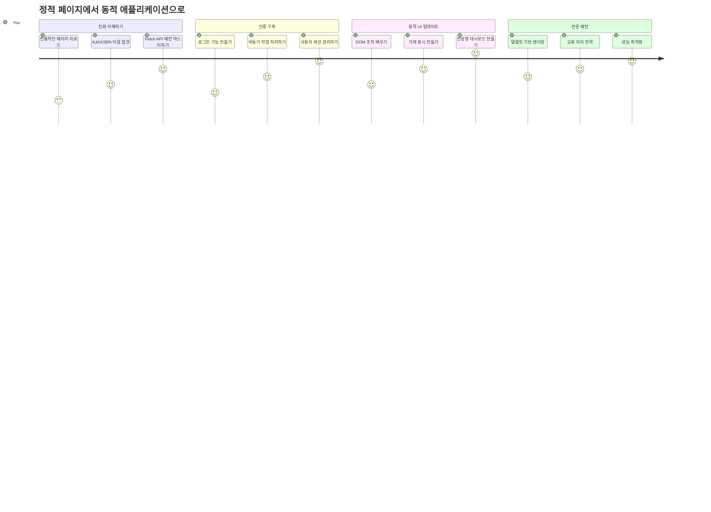
**학습 목표**: 이 수업을 마치면, 현대 웹 애플리케이션이 데이터를 동적으로 가져오고 처리하며 표시하는 방식을 이해하게 되어, 전문적인 애플리케이션에서 기대하는 원활한 사용자 경험을 구현할 수 있습니다.

## 강의 전 퀴즈

[강의 전 퀴즈](https://ff-quizzes.netlify.app/web/quiz/45)

### 사전 준비 사항

데이터 가져오기 전에 다음 항목을 준비하세요:

- **이전 강의**: [로그인 및 등록 폼](../2-forms/README.md) 완료 - 이 기반 위에서 작업합니다
- **로컬 서버**: [Node.js](https://nodejs.org) 설치 및 [서버 API 실행](../api/README.md)으로 계좌 데이터 제공
- **API 연결**: 다음 명령어로 서버 연결 테스트:

```bash
curl http://localhost:5000/api
# 예상 응답: "Bank API v1.0.0"
```

이 빠른 테스트는 모든 구성 요소가 올바르게 통신하는지 확인합니다:
- 시스템에서 Node.js가 정상 실행 중인지 확인
- API 서버가 활성 상태이며 응답하는지 점검
- 앱이 서버에 접근 가능한지 검증 (작전 전 무전 연락 체크와 유사)

## 🧠 데이터 관리 생태계 개요

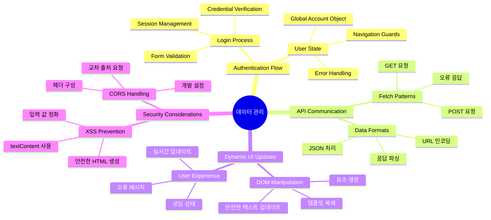
**핵심 원리**: 현대 웹 애플리케이션은 데이터 조율 시스템입니다 - 사용자 인터페이스, 서버 API, 브라우저 보안 모델 간의 조화를 통해 원활하고 반응적인 경험을 만듭니다.

---

## 현대 웹 앱의 데이터 가져오기 이해

지난 20년 동안 웹 애플리케이션이 데이터를 처리하는 방식은 크게 변화했습니다. 이 변화를 이해하면 AJAX나 Fetch API 같은 현대 기술이 얼마나 강력하며, 왜 웹 개발자에게 필수적인 도구가 되었는지 알게 됩니다.

전통적인 웹사이트와 우리가 지금 구축하는 동적이고 반응적인 애플리케이션이 어떻게 다른지 살펴봅시다.

### 전통적 다중 페이지 애플리케이션(MPA)

초창기 웹에서는 클릭할 때마다 마치 옛날 TV 채널을 바꾸는 것처럼 화면이 깜빡이고 다시 새로운 내용에 맞춰서 켜졌습니다. 초기 웹 애플리케이션은 모든 상호작용이 전체 페이지를 완전히 다시 불러오는 것이었죠.

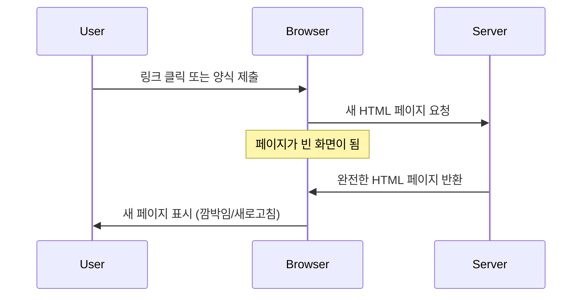
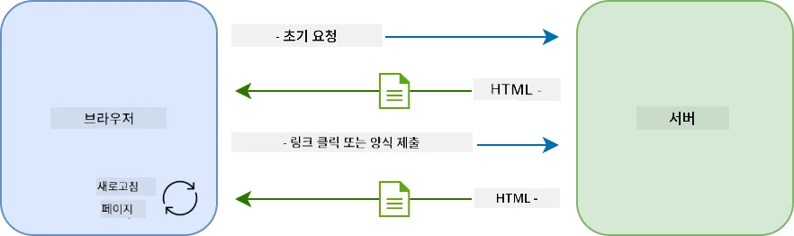

**이 방식이 답답하게 느껴진 이유:**
- 클릭할 때마다 페이지 전체를 새로 만들어야 했음
- 사용자 생각이 끊기는 짜증나는 화면 깜빡임 경험
- 같은 헤더와 푸터를 반복 다운로드해 네트워크 부하 증가
- 앱 사용 느낌이 소프트웨어라기보다 파일 서랍을 넘기는 듯함

### 현대 단일 페이지 애플리케이션(SPA)

AJAX(Asynchronous JavaScript and XML)는 이 패러다임을 완전히 바꿨습니다. 국제 우주 정거장의 모듈 설계처럼, 우주비행사가 개별 부품을 교체하는 것처럼 AJAX는 페이지 전체를 다시 로드하지 않고 특정 부분만 업데이트할 수 있게 해줍니다. 이름에 XML이 있지만, 현재는 주로 JSON을 사용하며 핵심 원리는 "변경된 부분만 업데이트" 하는 것입니다.

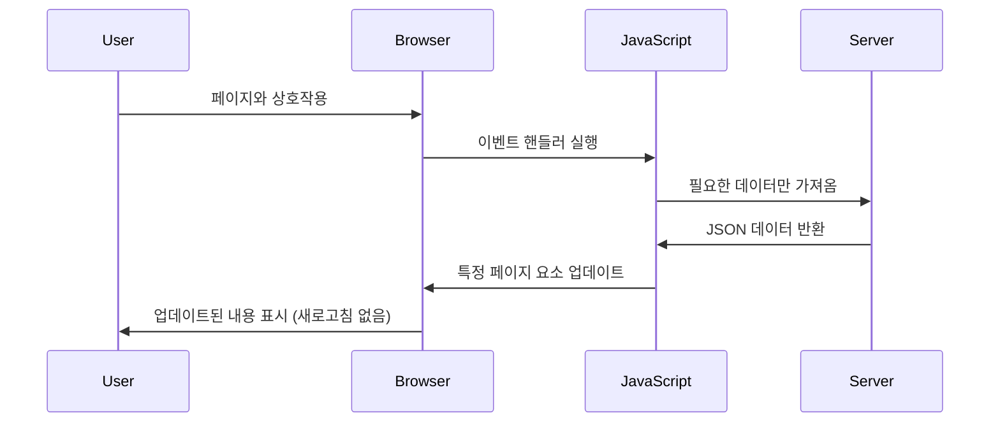
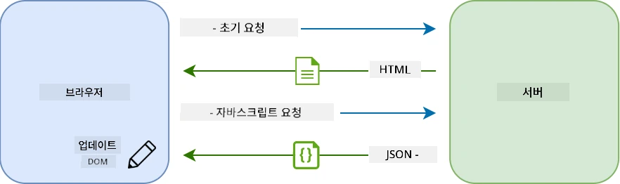

**SPA가 훨씬 좋은 이유:**
- 실제로 변경된 부분만 업데이트 (똑똑하죠?)
- 갑작스런 중단 없음 - 사용자는 흐름을 유지
- 줄어든 데이터 전송으로 더 빠른 로딩 시간
- 모든 것이 스마트폰 앱처럼 빠르고 반응적 느낌

### Fetch API로의 진화

현대 브라우저는 기존의 [`XMLHttpRequest`](https://developer.mozilla.org/docs/Web/API/XMLHttpRequest/Using_XMLHttpRequest)를 대체하는 [`Fetch` API](https://developer.mozilla.org/docs/Web/API/Fetch_API)를 제공합니다. 전신인 전신기와 이메일의 차이처럼, Fetch API는 프로미스를 사용해 비동기 코드를 깨끗하게 만들고 JSON도 자연스럽게 처리합니다.

| 특징 | XMLHttpRequest | Fetch API |
|---------|----------------|----------|
| **문법** | 복잡한 콜백 기반 | 깔끔한 프로미스 기반 |
| **JSON 처리** | 수동 파싱 필요 | 내장된 `.json()` 메서드 |
| **오류 처리** | 제한적인 오류 정보 | 상세한 오류 정보 제공 |
| **현대 지원** | 레거시 호환성 | ES6+ 프로미스 및 async/await 지원 |

> 💡 **브라우저 호환성**: 좋은 소식 - Fetch API는 모든 최신 브라우저에서 작동합니다! 구체적 버전이 궁금하면 [caniuse.com](https://caniuse.com/fetch)을 참고하세요.
> 
**결론:**
- 크롬, 파이어폭스, 사파리, 엣지 등 주요 브라우저 완벽 지원 (즉, 사용자 대부분이 사용하는 곳)
- 인터넷 익스플로러는 별도 지원 필요 (솔직히 IE는 이제 보내줄 때)
- 이후 사용할 우아한 async/await 패턴에 딱 맞춤

### 사용자 로그인 및 데이터 조회 구현

이제 은행 앱을 정적인 표시에서 기능성 애플리케이션으로 바꾸는 로그인 시스템을 구현해 봅시다. 군사 시설의 인증 프로토콜처럼, 사용자 자격 증명을 확인하고 특정 데이터에 접근 권한을 부여합니다.

기본 인증부터 시작해 점차 데이터 가져오기 기능을 추가하는 식으로 구축해 보겠습니다.

#### 1단계: 로그인 함수 기초 만들기

`app.js` 파일을 열고 새로운 `login` 함수를 추가하세요. 이 함수는 사용자 인증을 처리합니다:

```javascript
async function login() {
  const loginForm = document.getElementById('loginForm');
  const user = loginForm.user.value;
}
```

**설명:**
- `async` 키워드는 자바스크립트에 "이 함수 내에서 기다릴 필요가 있을 수 있다"고 알려줍니다
- 페이지에서 폼을 가져옵니다 (복잡하지 않고 ID로 단순 선택)
- 사용자가 입력한 사용자 이름 값을 뽑아냅니다
- 팁: 폼 입력값은 `name` 속성으로 접근 가능해, 별도 getElementById가 필요 없습니다!

> 💡 **폼 접근 패턴**: 모든 폼 컨트롤은 `name` 속성으로 지정하며, 폼 요소의 프로퍼티로 접근할 수 있습니다. 이 방식은 데이터를 깔끔하고 읽기 쉽게 가져올 수 있습니다.

#### 2단계: 계좌 데이터 가져오기 함수 만들기

다음으로, 서버에서 계좌 데이터를 불러오는 함수도 만듭니다. 등록 함수와 유사한 방식이며 데이터 조회에 집중합니다:

```javascript
async function getAccount(user) {
  try {
    const response = await fetch('//localhost:5000/api/accounts/' + encodeURIComponent(user));
    return await response.json();
  } catch (error) {
    return { error: error.message || 'Unknown error' };
  }
}
```

**이 코드가 하는 일:**
- 최신 `fetch` API로 비동기 데이터 요청
- 사용자 이름 파라미터를 포함한 GET 요청 URL 구성
- `encodeURIComponent()`로 URL 내 특수문자 안전 처리
- 응답을 JSON으로 변환해 데이터 조작 손쉽게
- 오류 발생 시 앱 충돌 없이 에러 객체 반환으로 우아하게 처리

> ⚠️ **보안 주의**: `encodeURIComponent()`는 해군 통신 부호화처럼 URL 내 특수문자가 잘못 해석되지 않도록 합니다. "#" 나 "&" 같은 문자가 엉뚱한 의미로 변하는 것을 방지합니다.
> 
**중요성:**
- URL 깨짐 방지
- URL 변조 공격 차단
- 서버가 의도한 데이터를 안전히 수신
- 보안 코딩 모범 사례 준수

#### HTTP GET 요청 이해하기

놀라실 수도 있는데, `fetch`에 옵션을 안 주면 기본적으로 [`GET`](https://developer.mozilla.org/docs/Web/HTTP/Methods/GET) 요청을 만듭니다. 이 방식은 서버에 "이 사용자의 계좌 데이터를 보여주세요"라고 정중히 요청하는 것입니다.

GET 요청은 도서관에 책을 빌리러 가는 것과 같습니다. 기존에 있는 걸 보는 요청이고, POST 요청(등록 시 사용)은 책을 새로 제출하는 것과 유사합니다.

| GET 요청 | POST 요청 |
|-------------|-------------|
| **목적** | 기존 데이터 가져오기 | 새로운 데이터 서버에 보내기 |
| **파라미터** | URL 경로나 쿼리 스트링 | 요청 본문 |
| **캐싱** | 브라우저가 캐시 가능 | 보통 캐시 안 함 |
| **보안** | URL/로그에 노출 | 요청 본문에 숨김 |

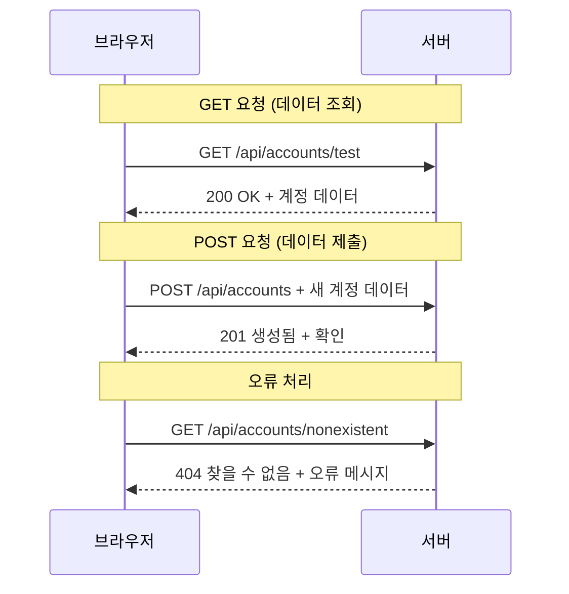
#### 3단계: 함수 연결하기

이제 계좌 가져오기 함수를 로그인 과정에 연결해서 완성합시다:

```javascript
async function login() {
  const loginForm = document.getElementById('loginForm');
  const user = loginForm.user.value;
  const data = await getAccount(user);

  if (data.error) {
    return console.log('loginError', data.error);
  }

  account = data;
  navigate('/dashboard');
}
```

함수의 흐름:
- 폼에서 사용자 이름 추출
- 서버에 사용자의 계좌 데이터 요청
- 오류가 발생하면 처리
- 성공 시 계좌 데이터 저장 후 대시보드로 이동

> 🎯 **Async/Await 패턴**: `getAccount`가 비동기 함수이므로, `await`로 서버 응답까지 실행을 멈춰서 데이터가 undefined 상태로 진행하지 않게 합니다.

#### 4단계: 데이터 저장 공간 만들기

앱에 한번 로드된 계좌 정보를 기억할 장소가 필요합니다. 앱의 단기 기억 같은 역할입니다. `app.js` 맨 위에 다음 라인을 추가하세요:

```javascript
// 이것은 현재 사용자의 계정 데이터를 보관합니다
let account = null;
```

**이런 이유로 필요:**
- 앱 어디서든 계좌 데이터에 접근 가능
- 초기값 `null`은 "아직 로그인 안 됨" 의미
- 로그인 또는 등록 성공 시 업데이트
- 단일 진실 출처(SoT, Single source of truth) 역할 - 로그인 사용자 혼동 방지

#### 5단계: 폼과 로그인 함수 연결하기

이제 로그인 함수를 HTML 폼과 연결합시다. 폼 태그를 다음과 같이 수정하세요:

```html
<form id="loginForm" action="javascript:login()">
  <!-- Your existing form inputs -->
</form>
```

**이 변경점이 하는 일:**
- 폼이 기본 동작(페이지 전체 새로고침)을 막음
- 대신 커스텀 자바스크립트 함수 실행
- 자연스러운 단일 페이지 앱 경험 유지
- 로그인 클릭 시 어떤 일이 일어날지 완전 제어 가능

#### 6단계: 등록 함수 개선하기

일관성을 위해 `register` 함수도 계좌 데이터를 저장하고 대시보드로 이동하도록 수정하세요:

```javascript
// 이 줄들을 등록 함수의 마지막에 추가하세요
account = result;
navigate('/dashboard');
```

**이 개선점으로:**
- 등록 후 대시보드로 원활한 전환
- 로그인과 등록 흐름 간 일관된 사용자 경험 제공
- 등록 성공 직후 즉시 계좌 데이터 접근 가능

#### 구현 테스트하기

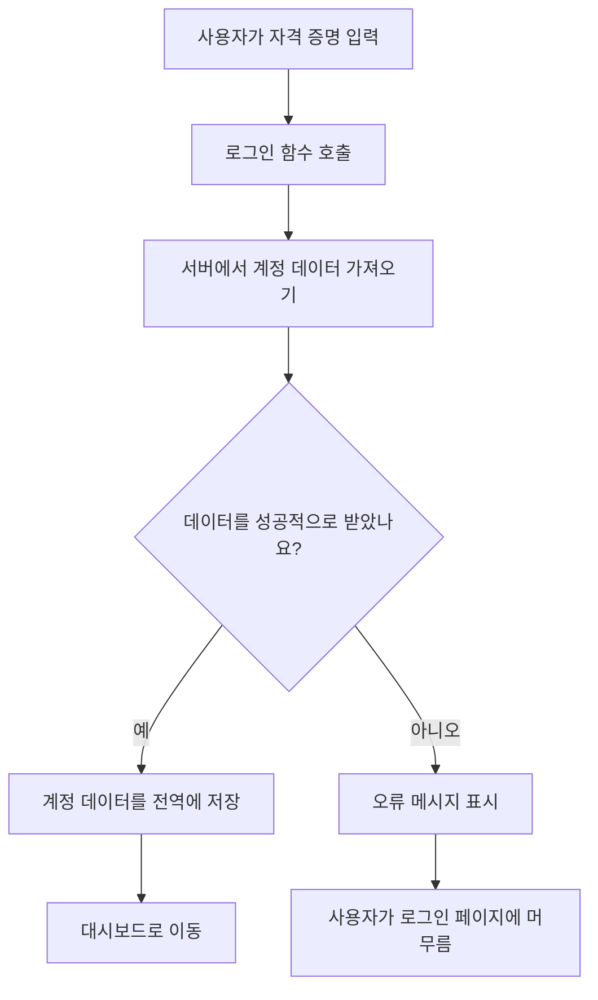
**테스트 방법:**
1. 새 계정을 만들어 문제 없는지 확인
2. 같은 계정으로 로그인 시도
3. 문제가 있으면 브라우저 콘솔(F12) 확인
4. 로그인 성공 시 대시보드 진입 여부 확인

문제가 있다면 당황하지 마세요! 대부분 오타나 API 서버 미기동 같은 사소한 문제입니다.

#### 크로스 오리진 이슈 간단 설명

"포트가 다른데 웹 앱이 API 서버와 어떻게 통신하나요?" 궁금하실 겁니다. 모든 웹 개발자가 언젠가 마주치는 문제입니다.

> 🔒 **교차 출처 보안**: 브라우저는 "동일 출처 정책"을 통해 허가받지 않은 도메인 간 통신을 차단합니다. 펜타곤 검문소처럼, 데이터 전송 전에 통신 권한을 검증합니다.
> 
**우리 환경에서는:**
- 웹 앱은 `localhost:3000` (개발 서버)
- API 서버는 `localhost:5000` (백엔드 서버)
- API 서버가 [CORS 헤더](https://developer.mozilla.org/docs/Web/HTTP/CORS)로 웹 앱의 통신을 명시적으로 허용함

이 설정은 프론트엔드와 백엔드가 보통 별도 서버로 운영되는 실제 개발 환경과 유사합니다.

> 📚 **더 알아보기**: 종합적으로 API와 데이터 가져오기를 배우고 싶다면 이 [Microsoft Learn API 모듈](https://docs.microsoft.com/learn/modules/use-apis-discover-museum-art/?WT.mc_id=academic-77807-sagibbon)을 참고하세요.

## HTML에서 데이터 시각화하기

이제 가져온 데이터를 DOM 조작을 통해 사용자에게 보여줍시다. 사진 암실에서 필름을 현상하듯, 눈에 보이지 않는 데이터를 눈에 띄고 상호작용할 수 있는 형태로 바꾸는 과정입니다.
DOM 조작은 정적인 웹 페이지를 사용자 상호작용 및 서버 응답에 따라 콘텐츠를 업데이트하는 동적인 애플리케이션으로 변환하는 기술입니다.

### 작업에 맞는 도구 선택하기

JavaScript로 HTML을 업데이트할 때 사용할 수 있는 여러 가지 옵션이 있습니다. 이것들은 공구 상자의 다양한 도구처럼 특정 작업에 완벽하게 맞춰져 있습니다:

| 메서드 | 적합한 용도 | 사용 시기 | 안전성 수준 |
|--------|-------------|------------|--------------|
| `textContent` | 사용자 데이터를 안전하게 표시 | 텍스트를 보여줄 때 언제든지 | ✅ 매우 안전 |
| `createElement()` + `append()` | 복잡한 레이아웃 구성 | 새 섹션/목록 생성 시 | ✅ 확실히 안전 |
| `innerHTML` | HTML 콘텐츠 설정 | ⚠️ 가능하면 피하기 | ❌ 위험함 |

#### 텍스트를 안전하게 표시하는 방법: textContent

[`textContent`](https://developer.mozilla.org/docs/Web/API/Node/textContent) 속성은 사용자 데이터를 표시할 때 가장 좋은 친구입니다. 웹 페이지의 경비원과 같아서 위험한 내용이 통과하지 못하게 막아줍니다:

```javascript
// 텍스트를 업데이트하는 안전하고 신뢰할 수 있는 방법
const balanceElement = document.getElementById('balance');
balanceElement.textContent = account.balance;
```

**textContent의 장점:**
- 모든 내용을 일반 텍스트로 처리(스크립트 실행 방지)
- 기존 콘텐츠 자동 삭제
- 단순 텍스트 업데이트에 효율적
- 악성 콘텐츠에 대한 내장 보안 제공

#### 동적 HTML 요소 생성하기

더 복잡한 콘텐츠의 경우 [`document.createElement()`](https://developer.mozilla.org/docs/Web/API/Document/createElement)와 [`append()`](https://developer.mozilla.org/docs/Web/API/ParentNode/append) 메서드를 조합하세요:

```javascript
// 새로운 요소를 안전하게 생성하는 방법
const transactionItem = document.createElement('div');
transactionItem.className = 'transaction-item';
transactionItem.textContent = `${transaction.date}: ${transaction.description}`;
container.append(transactionItem);
```

**이 방법 이해하기:**
- 새로운 DOM 요소를 프로그래밍 방식으로 **생성**
- 요소 속성과 콘텐츠를 완벽히 **통제**
- 복잡하고 중첩된 요소 구조도 **허용**
- 구조와 콘텐츠를 분리해 **보안 유지**

> ⚠️ **보안 주의사항**: 많은 튜토리얼에서 [`innerHTML`](https://developer.mozilla.org/docs/Web/API/Element/innerHTML)를 등장시키지만, 이 방법은 내장된 스크립트를 실행할 수 있습니다. CERN의 보안 프로토콜이 무단 코드 실행을 막듯, `textContent`와 `createElement`를 사용하는 것이 더 안전한 대안입니다.
> 
**innerHTML 위험성:**
- 사용자 데이터 내 `<script>` 태그 실행 가능
- 코드 인젝션 공격에 취약
- 보안 취약점 생성 가능성 있음
- 우리가 사용하는 안전한 대안은 동등한 기능 제공

### 사용자 친화적인 오류 처리 만들기

현재 로그인 오류는 사용자에게 보이지 않는 브라우저 콘솔에만 나타납니다. 조종사 내부 진단과 승객 정보 시스템의 차이처럼 중요한 정보를 적절한 채널로 전달해야 합니다.

시각적 오류 메시지를 구현하면 사용자가 무엇이 잘못됐고 어떻게 진행해야 하는지 즉시 알 수 있습니다.

#### 1단계: 오류 메시지 표시 위치 추가

우선, 로그인 버튼 바로 앞에 오류 메시지용 공간을 HTML에 추가합니다. 사용자가 자연스럽게 볼 수 있도록 배치합니다:

```html
<!-- This is where error messages will appear -->
<div id="loginError" role="alert"></div>
<button>Login</button>
```

**여기서 하는 일:**
- 필요한 때까지 보이지 않는 빈 컨테이너 생성
- 사용자가 "로그인" 클릭 후 자연스러운 위치에 배치
- `role="alert"` 속성으로 스크린 리더에게 중요한 정보임을 알림
- 고유 `id`로 JavaScript가 쉽게 대상 접근 가능

#### 2단계: 편리한 헬퍼 함수 만들기

어떤 요소의 텍스트를 업데이트하는 작은 유틸리티 함수를 만듭니다. "한 번 작성해 여러 곳에서 사용"하는 함수로 시간을 절약할 수 있습니다:

```javascript
function updateElement(id, text) {
  const element = document.getElementById(id);
  element.textContent = text;
}
```

**함수의 장점:**
- 요소 ID와 텍스트 콘텐츠만 필요해 인터페이스 간단
- 안전하게 DOM 요소 위치 탐색 및 업데이트
- 중복 코드를 줄이는 재사용 가능한 패턴
- 애플리케이션 전반에서 일관된 업데이트 동작 유지

#### 3단계: 사용자가 볼 수 있는 위치에 오류 표시하기

숨겨진 콘솔 메시지를 사용자가 볼 수 있도록 바꿉니다. 로그인 함수를 업데이트하세요:

```javascript
// 단순히 콘솔에 기록하는 대신 사용자에게 무엇이 잘못되었는지 보여줍니다
if (data.error) {
  return updateElement('loginError', data.error);
}
```

**작은 변경으로 큰 효과:**
- 오류 메시지를 사용자가 보는 위치에 바로 표시
- 더 이상 알 수 없는 조용한 실패 없음
- 즉각적이고 실행 가능한 피드백 제공
- 앱이 더 전문적이고 세심하게 느껴짐

이제 잘못된 계정으로 테스트하면 페이지에 도움 되는 오류 메시지가 바로 보일 것입니다!


#### 4단계: 접근성 포함하기

앞서 넣은 `role="alert"` 속성 덕분에 흥미로운 점이 있습니다 - 단순 장식이 아닙니다! 이 속성은 [Live Region](https://developer.mozilla.org/docs/Web/Accessibility/ARIA/ARIA_Live_Regions)을 생성하여 화면 읽기 도구에서 변화를 즉시 알리게 합니다:

```html
<div id="loginError" role="alert"></div>
```

**이게 왜 중요한가요:**
- 화면 읽기 사용자에게 오류 메시지 즉시 전달
- 사용 방법에 관계없이 모두에게 동일한 중요한 정보 제공
- 앱을 더 많은 사람이 사용할 수 있게 만드는 간단한 방법
- 포용적인 경험을 만드는 개발자임을 보여줌

이런 작은 배려가 좋은 개발자와 훌륭한 개발자를 구분합니다!

### 🎯 학습 점검: 인증 패턴

**잠시 멈추고 되돌아보기:** 이제 완전한 인증 흐름을 구현했습니다. 이는 웹 개발의 기본 패턴입니다.

**빠른 자기 점검:**
- API 호출에 async/await를 쓰는 이유를 설명할 수 있나요?
- `encodeURIComponent()`를 빼먹으면 어떤 일이 생길까요?
- 우리의 오류 처리 방식이 사용자 경험을 어떻게 개선하나요?

**실제 적용 사례:** 여기서 배운 패턴(비동기 데이터 가져오기, 오류 처리, 사용자 피드백)은 SNS부터 전자상거래 등 모든 주요 웹 사이트에서 사용됩니다. 실전 수준의 기술을 쌓고 있는 겁니다!

**도전 과제 질문:** 여러 사용자 역할(고객, 관리자, 텔러)을 처리하도록 인증 시스템을 어떻게 바꾸겠습니까? 필요한 데이터 구조와 UI 변경 사항을 생각해 보세요.

#### 5단계: 회원가입에도 동일한 패턴 적용하기

일관성을 위해 회원가입 폼에도 같은 오류 처리 방식을 구현하세요:

1. 회원가입 HTML에 오류 표시 요소 추가:
```html
<div id="registerError" role="alert"></div>
```

2. 회원가입 함수도 같은 오류 표시 패턴으로 업데이트:
```javascript
if (data.error) {
  return updateElement('registerError', data.error);
}
```

**일관된 오류 처리의 장점:**
- 모든 폼에서 일관된 사용자 경험 제공
- 익숙한 패턴 사용으로 인지 부하 감소
- 재사용 가능한 코드로 유지보수 간편화
- 앱 전반에 접근성 표준 준수 보장

## 동적 대시보드 만들기

이제 정적인 대시보드를 실계좌 데이터로 자동 업데이트되는 동적 인터페이스로 바꿉니다. 인쇄된 비행 일정과 공항의 실시간 출발 안내판 차이와 같습니다. 우리는 정적 정보에서 실시간 반응형 디스플레이로 이동하는 중입니다.

배운 DOM 조작 기술을 활용해 대시보드를 최신 계좌 정보로 자동 업데이트되도록 만들겠습니다.

### 데이터 익히기

구현 전에 서버가 어떤 데이터를 보내는지 잠시 살펴봅시다. 로그인 성공시 이런 귀중한 정보를 받게 됩니다:

```json
{
  "user": "test",
  "currency": "$",
  "description": "Test account",
  "balance": 75,
  "transactions": [
    { "id": "1", "date": "2020-10-01", "object": "Pocket money", "amount": 50 },
    { "id": "2", "date": "2020-10-03", "object": "Book", "amount": -10 },
    { "id": "3", "date": "2020-10-04", "object": "Sandwich", "amount": -5 }
  ]
}
```

**이 데이터 구조에서 얻는 것들:**
- **`user`**: 개인화에 딱 맞음 ("Sarah님 환영합니다!")
- **`currency`**: 금액 표시를 정확하게 위한 통화
- **`description`**: 계좌의 친근한 이름
- **`balance`**: 매우 중요한 현재 잔액
- **`transactions`**: 모든 세부 내역 포함한 거래 기록

전문 은행 대시보드를 구축하기에 완벽한 정보입니다!

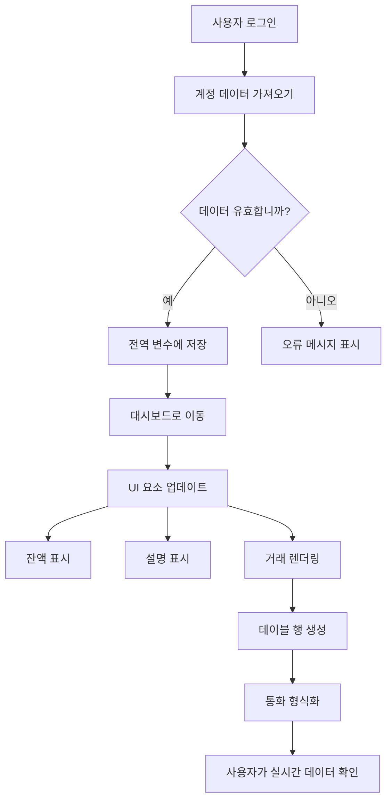
> 💡 **팁**: 대시보드를 바로 보고 싶다면 로그인 시 `test` 아이디를 사용하세요 - 샘플 데이터가 미리 로드되어 거래 내역을 만들지 않아도 잘 작동함을 바로 볼 수 있습니다.
> 
**test 계정이 좋은 이유:**
- 현실적인 샘플 데이터 기본 포함
- 거래 내역 표시 방식을 쉽게 확인 가능
- 대시보드 기능 테스트에 최적
- 가짜 데이터를 직접 만들 필요 없음

### 대시보드 표시 요소 만들기

차근차근 대시보드 인터페이스를 구축해봅시다. 우선 계좌 요약 정보부터 시작해 점차 거래 목록 같은 복잡한 기능으로 진행합니다.

#### 1단계: HTML 구조 업데이트

정적인 "잔액" 섹션을 자바스크립트가 내용을 채울 수 있는 동적 플레이스홀더로 바꿉니다:

```html
<section>
  Balance: <span id="balance"></span><span id="currency"></span>
</section>
```

다음으로 계좌 설명 섹션을 추가합니다. 이것은 대시보드 내용의 제목 역할을 하므로 시맨틱 HTML 요소를 사용합니다:

```html
<h2 id="description"></h2>
```

**HTML 구조 이해:**
- 잔액과 통화는 별도의 `<span>`으로 분리해 개별 제어 가능
- 각 요소에 고유 ID를 부여해 JavaScript 타겟팅 용이
- 계좌 설명은 `<h2>` 헤딩 태그로 시맨틱 HTML 준수
- 스크린 리더와 SEO를 위한 논리적 계층 구조 생성

> ✅ **접근성 인사이트**: 계좌 설명은 대시보드 콘텐츠 제목 역할을 하므로 시맨틱 헤딩으로 표시합니다. [헤딩 구조](https://www.nomensa.com/blog/2017/how-structure-headings-web-accessibility)가 접근성에 미치는 영향에 대해 더 알아보세요. 페이지 내 다른 요소 중 헤딩 태그가 있으면 좋은 대상은 무엇일지 생각해보시겠어요?

#### 2단계: 대시보드 업데이트 함수 만들기

이제 실제 계좌 데이터로 대시보드를 채우는 함수를 만듭니다:

```javascript
function updateDashboard() {
  if (!account) {
    return navigate('/login');
  }

  updateElement('description', account.description);
  updateElement('balance', account.balance.toFixed(2));
  updateElement('currency', account.currency);
}
```

**이 함수 단계별 동작:**
- 계좌 데이터가 존재하는지 검증
- 인증 안 된 사용자는 로그인 페이지로 리다이렉트
- 재사용 가능한 `updateElement` 함수로 계좌 설명 업데이트
- 잔액은 항상 소수점 둘째 자리까지 포맷
- 적절한 통화 기호 표시

> 💰 **금액 포맷팅**: [`toFixed(2)`](https://developer.mozilla.org/docs/Web/JavaScript/Reference/Global_Objects/Number/toFixed) 메서드는 정말 유용합니다! 잔액을 “75.00”처럼 실제 화폐처럼 보이게 만듭니다. 사용자가 익숙한 통화 형식을 보게 돼 만족할 것입니다.

#### 3단계: 대시보드가 업데이트되도록 하기

누군가 대시보드를 방문할 때마다 최신 데이터로 새로고침되게 하려면 내비게이션 시스템에 연결해야 합니다. [lesson 1 assignment](../1-template-route/assignment.md)를 완료했다면 익숙할 겁니다. 안 했다면 걱정 마세요 - 아래를 참고하세요:

`updateRoute()` 함수 끝에 다음 코드를 추가합니다:

```javascript
if (typeof route.init === 'function') {
  route.init();
}
```

그 다음, 대시보드 초기화를 위해 라우트를 업데이트하세요:

```javascript
const routes = {
  '/login': { templateId: 'login' },
  '/dashboard': { templateId: 'dashboard', init: updateDashboard }
};
```

**이 영리한 설정의 역할:**
- 특정 라우트에 초기화 코드가 있는지 검사
- 라우트가 로드될 때 자동으로 해당 코드 실행
- 항상 신선한 최신 데이터가 대시보드에 표시되도록 보장
- 내비게이션 로직을 깔끔하고 체계적으로 유지

#### 대시보드 테스트하기

이 변경사항을 적용한 후 다음을 테스트하세요:

1. 테스트 계정으로 로그인
2. 대시보드로 리다이렉트되는지 확인
3. 계좌 설명, 잔액, 통화가 올바르게 표시되는지 검증
4. 로그아웃 후 재로그인해 데이터가 제대로 새로 고쳐지는지 확인

이제 대시보드는 로그인한 사용자 데이터에 따라 동적으로 계좌 정보를 보여줄 것입니다!

## 템플릿으로 똑똑한 거래 목록 만들기

거래마다 HTML을 수동으로 만드는 대신 템플릿을 사용해 일관된 형식으로 자동 생성할 것입니다. 우주선 제작에 표준 부품을 쓰는 것처럼, 템플릿은 모든 거래 행이 같은 구조와 모양을 따르도록 합니다.

이 기술은 몇 건부터 수천 건까지 효율적으로 확장되어 성능과 표현을 일관되게 유지합니다.

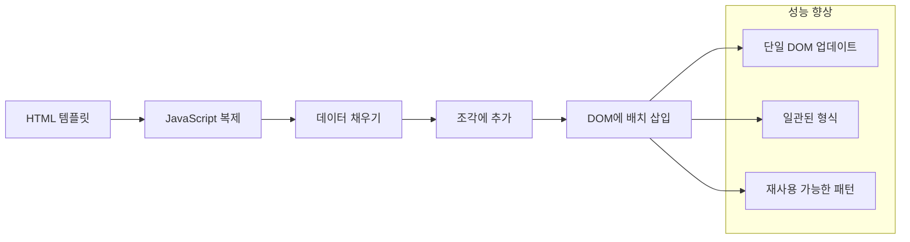

### 1단계: 거래 템플릿 만들기

먼저 HTML `<body>`에 재사용 가능한 거래 행 템플릿을 추가합니다:

```html
<template id="transaction">
  <tr>
    <td></td>
    <td></td>
    <td></td>
  </tr>
</template>
```

**HTML 템플릿 이해하기:**
- 테이블 한 행 구조를 정의
- JavaScript로 복제해 내용 채우기 전까지는 보이지 않음
- 날짜, 설명, 금액용 셀 3개 포함
- 일관된 형식을 위한 재사용 패턴 제공

### 2단계: 테이블에 동적 콘텐츠 위한 ID 추가

다음으로, JavaScript가 쉽게 목표할 수 있도록 테이블 본문에 `id`를 지정합니다:

```html
<tbody id="transactions"></tbody>
```

**이것이 하는 일:**
- 거래 행 삽입을 위한 명확한 목표 생성
- 테이블 구조와 동적 콘텐츠 분리
- 거래 데이터 지우기와 다시 채우기 용이

### 3단계: 거래 행 생성 함수 만들기

이제 거래 데이터를 HTML 요소로 변환하는 함수를 만듭니다:

```javascript
function createTransactionRow(transaction) {
  const template = document.getElementById('transaction');
  const transactionRow = template.content.cloneNode(true);
  const tr = transactionRow.querySelector('tr');
  tr.children[0].textContent = transaction.date;
  tr.children[1].textContent = transaction.object;
  tr.children[2].textContent = transaction.amount.toFixed(2);
  return transactionRow;
}
```

**팩토리 함수 상세 설명:**
- ID로 템플릿 요소 가져오기
- 템플릿 내용을 안전하게 복제
- 복제된 내용 내 테이블 행 선택
- 각 셀에 거래 데이터 채우기
- 금액을 올바른 소수점 표시로 포맷
- 삽입 준비 완료된 행 반환

### 4단계: 여러 거래 행 효율적으로 생성하기

모든 거래를 화면에 표시하도록 `updateDashboard()` 함수에 다음 코드를 추가합니다:

```javascript
const transactionsRows = document.createDocumentFragment();
for (const transaction of account.transactions) {
  const transactionRow = createTransactionRow(transaction);
  transactionsRows.appendChild(transactionRow);
}
updateElement('transactions', transactionsRows);
```

**이 효율적인 접근 방식 이해하기:**
- DOM 작업을 묶을 문서 프래그먼트 생성
- 계좌 데이터 내 모든 거래를 반복 처리
- 팩토리 함수로 각 거래 행 생성
- 모든 행을 프래그먼트에 모은 뒤 한꺼번에 DOM에 추가
- 여러 번 삽입 대신 한 번의 DOM 업데이트 수행
> ⚡ **성능 최적화**: [`document.createDocumentFragment()`](https://developer.mozilla.org/docs/Web/API/Document/createDocumentFragment)는 보잉의 조립 과정과 같습니다 - 부품을 메인 라인 밖에서 준비한 후 완성된 단위로 설치합니다. 이 배치 처리 방식은 여러 개별 작업 대신 단일 삽입을 수행하여 DOM 재배치를 최소화합니다.

### 5단계: 혼합 콘텐츠를 위한 업데이트 함수 개선

현재 `updateElement()` 함수는 텍스트 콘텐츠만 처리합니다. 텍스트와 DOM 노드 모두를 처리하도록 업데이트하세요:

```javascript
function updateElement(id, textOrNode) {
  const element = document.getElementById(id);
  element.textContent = ''; // 모든 자식 요소를 제거합니다
  element.append(textOrNode);
}
```

**이번 업데이트의 주요 개선 사항:**
- 새 콘텐츠를 추가하기 전에 기존 콘텐츠를 **지웁니다**
- 매개변수로 텍스트 문자열 또는 DOM 노드를 **허용합니다**
- 유연성을 위해 [`append()`](https://developer.mozilla.org/docs/Web/API/ParentNode/append) 메서드를 **사용합니다**
- 기존 텍스트 기반 사용과의 **호환성을 유지합니다**

### 대시보드를 테스트 드라이브 해보기

결과를 확인할 시간입니다! 동적 대시보드를 실제로 작동시키며 확인해 봅시다:

1. `test` 계정으로 로그인하세요 (샘플 데이터가 준비되어 있습니다)
2. 대시보드로 이동하세요
3. 거래 행이 올바른 형식으로 표시되는지 확인하세요
4. 날짜, 설명, 금액이 모두 제대로 표시되는지 확인하세요

모든 것이 제대로 작동하면 대시보드에 완전한 거래 목록이 표시될 것입니다! 🎉

**지금까지 해낸 것:**
- 어떤 양의 데이터에도 확장 가능한 대시보드 구축
- 일관된 형식을 위한 재사용 가능한 템플릿 생성
- 효율적인 DOM 조작 기법 구현
- 실제 은행 애플리케이션 수준의 기능 개발

정적 웹페이지를 동적 웹 애플리케이션으로 성공적으로 변환했습니다.

### 🎯 교육 점검: 동적 콘텐츠 생성

**아키텍처 이해**: React, Vue, Angular 같은 프레임워크에서 사용하는 패턴을 모방한 정교한 데이터-UI 파이프라인을 구현했습니다.

**주요 개념 숙달**:
- **템플릿 기반 렌더링**: 재사용 가능한 UI 컴포넌트 생성
- **문서 조각(document fragment)**: DOM 성능 최적화
- **안전한 DOM 조작**: 보안 취약점 방지
- **데이터 변환**: 서버 데이터를 사용자 인터페이스로 변환

**산업적 연계**: 이 기술들은 현대 프론트엔드 프레임워크의 기초를 형성합니다. React의 가상 DOM, Vue의 템플릿 시스템, Angular의 컴포넌트 아키텍처가 모두 이 핵심 개념에 기반합니다.

**성찰 질문**: 새로운 거래가 자동으로 나타나는 등 실시간 업데이트를 어떻게 이 시스템에 확장할 수 있을까요? WebSocket이나 Server-Sent Events를 고려해 보세요.

---

## 📈 당신의 데이터 관리 숙련 타임라인

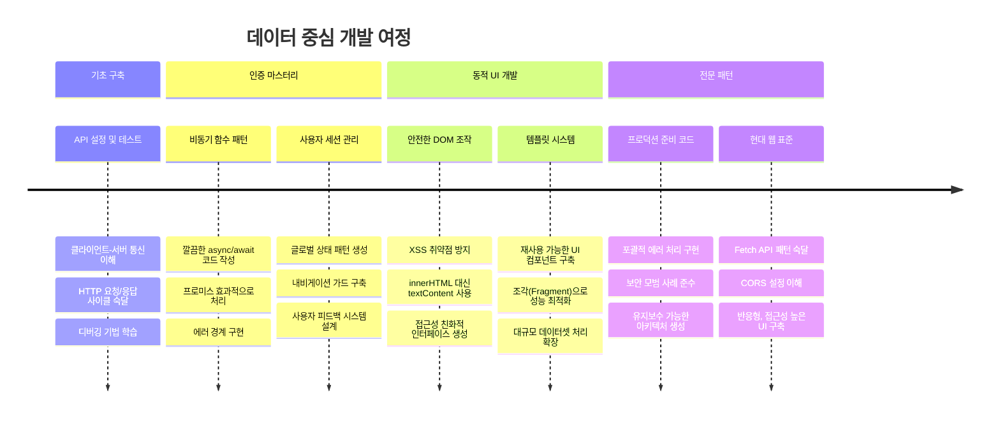
**🎓 졸업 이정표**: 최신 JavaScript 패턴을 사용하여 완전한 데이터 중심 웹 애플리케이션을 성공적으로 구축했습니다. 이 기술들은 React, Vue, Angular와 같은 프레임워크 작업에 직접적으로 적용할 수 있습니다.

**🔄 다음 단계 역량**:
- 이 개념을 기반으로 한 프론트엔드 프레임워크 탐색 준비 완료
- WebSocket으로 실시간 기능 구현 준비 완료
- 오프라인 기능을 갖춘 프로그레시브 웹앱 구축 가능
- 고급 상태 관리 패턴 학습을 위한 토대 마련

## GitHub Copilot 에이전트 도전 과제 🚀

에이전트 모드를 사용해 다음 도전 과제를 완료하세요:

**설명:** 거래 날짜 범위, 금액, 설명으로 사용자가 특정 거래를 찾을 수 있도록 검색 및 필터 기능을 은행 앱에 추가하세요.

**프롬프트:** 은행 앱에 대해 다음을 포함하는 검색 기능을 만드세요: 1) 날짜 범위(시작/종료), 최소/최대 금액, 거래 설명 키워드 입력 필드가 있는 검색 폼, 2) 검색 조건에 따라 account.transactions 배열을 필터링하는 `filterTransactions()` 함수, 3) 필터링된 결과를 보여주도록 `updateDashboard()` 함수 업데이트, 4) 뷰를 초기화하는 "필터 지우기" 버튼 추가. 현대 JavaScript 배열 메서드 `filter()`를 사용하고 빈 검색 조건에 따른 예외 처리도 하세요.

[에이전트 모드](https://code.visualstudio.com/blogs/2025/02/24/introducing-copilot-agent-mode)에 대해 더 알아보세요.

## 🚀 도전 과제

은행 앱을 한 단계 업그레이드할 준비가 되었나요? 실제로 사용하고 싶은 느낌과 모양을 만들어 봅시다. 아이디어 몇 가지를 제시합니다:

**아름답게 만들기**: CSS 스타일링으로 기능적인 대시보드를 시각적으로 매력적으로 만드세요. 깔끔한 라인, 적절한 간격, 약간의 미묘한 애니메이션을 생각해 보세요.

**반응형으로 만들기**: [미디어 쿼리](https://developer.mozilla.org/docs/Web/CSS/Media_Queries)를 활용해 휴대폰, 태블릿, 데스크톱에서 모두 잘 작동하는 [반응형 디자인](https://developer.mozilla.org/docs/Web/Progressive_web_apps/Responsive/responsive_design_building_blocks)을 만드세요. 사용자들이 좋아할 거예요!

**약간의 멋 추가하기**: 거래 유형별 색상 구분(수입은 녹색, 지출은 빨간색), 아이콘 추가, 인터페이스를 인터랙티브하게 만드는 호버 효과 등을 고려해 보세요.

다음은 스타일링 후 다듬어진 대시보드 예시입니다:

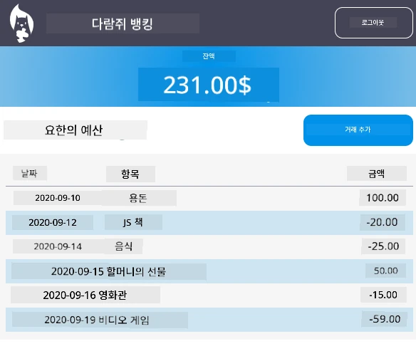

꼭 똑같이 만들 필요는 없습니다 - 영감을 받아 자신만의 스타일로 만드세요!

## 강의 후 퀴즈

[강의 후 퀴즈](https://ff-quizzes.netlify.app/web/quiz/46)

## 과제

[코드 리팩토링 및 주석 달기](assignment.md)

---

<!-- CO-OP TRANSLATOR DISCLAIMER START -->
**면책 조항**:  
이 문서는 AI 번역 서비스 [Co-op Translator](https://github.com/Azure/co-op-translator)를 사용하여 번역되었습니다. 정확성을 위해 최선을 다하고 있지만, 자동 번역본에는 오류나 부정확한 부분이 있을 수 있음을 유의하시기 바랍니다. 원문 언어로 된 원본 문서를 권위 있는 출처로 간주해야 합니다. 중요한 정보의 경우에는 전문 인력에 의한 번역을 권장합니다. 본 번역본 사용으로 인해 발생하는 오해나 잘못된 해석에 대해서 당사는 책임을 지지 않습니다.
<!-- CO-OP TRANSLATOR DISCLAIMER END -->