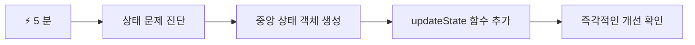
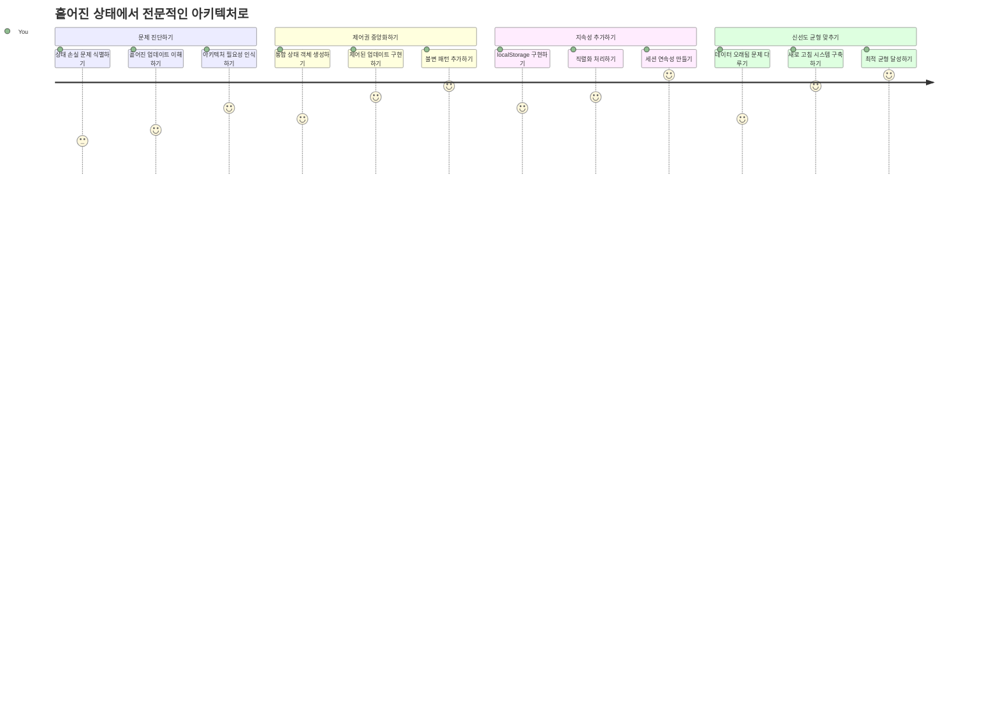
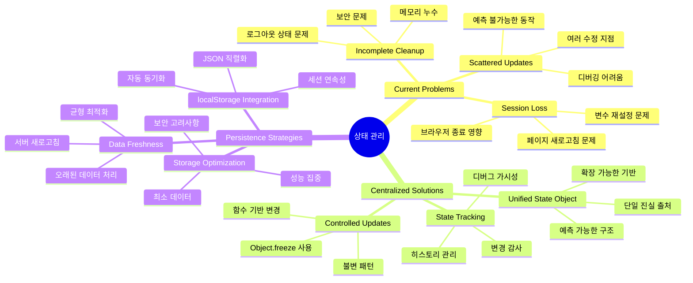
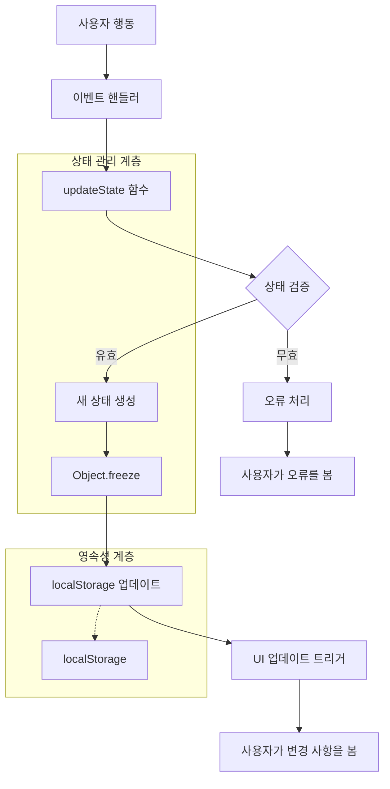
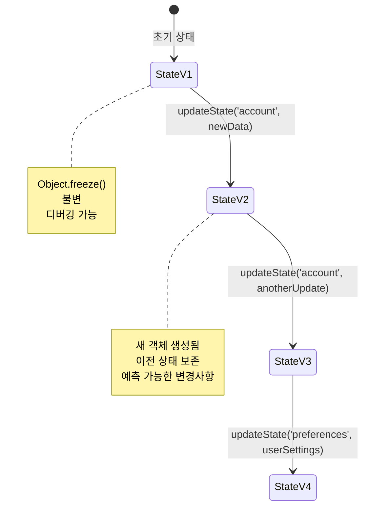
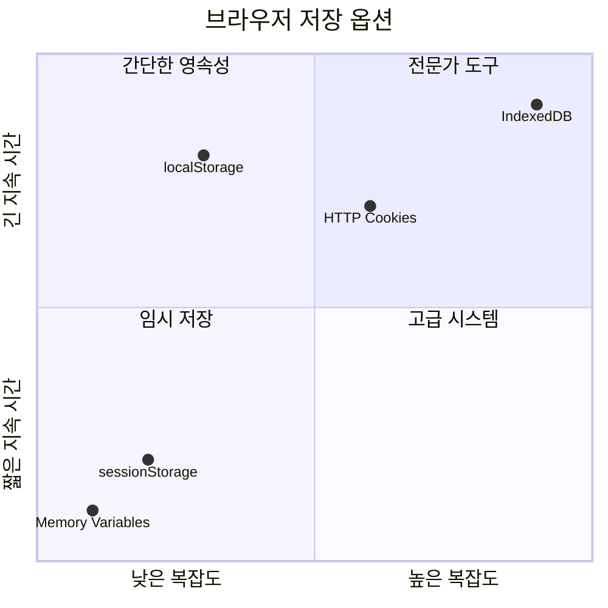
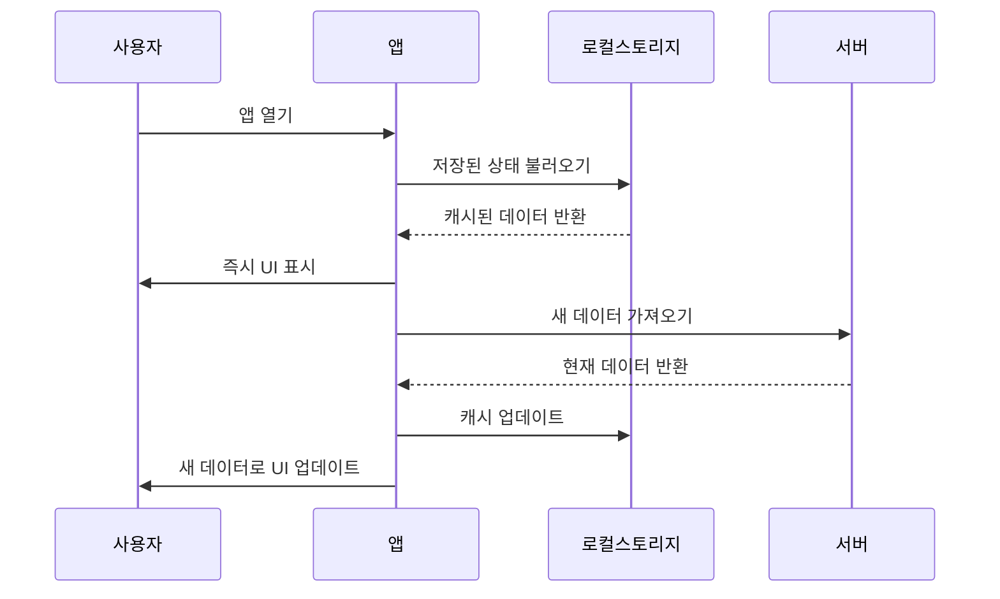
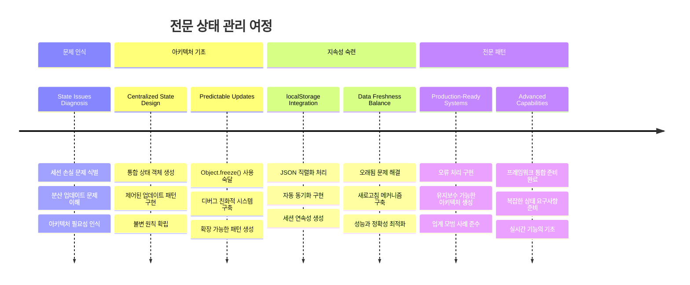

<!--
CO_OP_TRANSLATOR_METADATA:
{
  "original_hash": "b807b09df716dc48a2b750835bf8e933",
  "translation_date": "2026-01-06T15:28:50+00:00",
  "source_file": "7-bank-project/4-state-management/README.md",
  "language_code": "ko"
}
-->
# 금융 앱 구축 4부: 상태 관리 개념

## ⚡ 다음 5분 동안 할 수 있는 일

**바쁜 개발자를 위한 빠른 시작 경로**


- **1분차**: 현재 상태 문제 테스트 - 로그인, 페이지 새로고침, 로그아웃 관찰
- **2분차**: `let account = null` 대신 `let state = { account: null }` 사용
- **3분차**: 제어된 업데이트를 위한 간단한 `updateState()` 함수 생성
- **4분차**: 한 개 함수에서 새 패턴 사용으로 업데이트
- **5분차**: 예측 가능성과 디버깅 기능 향상 테스트

**간단 진단 테스트**:
```javascript
// 이전: 흩어진 상태
let account = null; // 새로고침 시 손실!

// 이후: 중앙 집중식 상태
let state = Object.freeze({ account: null }); // 제어 가능하고 추적 가능!
```

**이것이 중요한 이유**: 5분 안에 혼란스러운 상태 관리에서 예측 가능하고 디버깅 가능한 패턴으로의 변화를 경험할 것입니다. 이는 복잡한 애플리케이션을 유지보수 가능하게 만드는 기반입니다.

## 🗺️ 상태 관리 마스터 여정


**여정의 목적지**: 이 수업이 끝날 때쯤 전문적인 수준의 상태 관리 시스템을 구축하게 될 것입니다. 이 시스템은 지속성, 데이터 신선도, 예측 가능한 업데이트를 처리하며, 생산 환경 애플리케이션에 사용되는 동일한 패턴입니다.

## 강의 전 퀴즈

[강의 전 퀴즈](https://ff-quizzes.netlify.app/web/quiz/47)

## 소개

상태 관리는 보이저 우주선의 내비게이션 시스템과 같습니다 — 모든 것이 원활히 작동할 때는 거의 눈에 띄지 않습니다. 그러나 문제가 생기면, 그것은 성간 우주에 도달할지 아니면 우주 공간에 표류할지를 가르는 차이가 됩니다. 웹 개발에서 상태는 애플리케이션이 기억해야 하는 모든 것을 나타냅니다: 사용자 로그인 상태, 폼 데이터, 내비게이션 히스토리, 임시 인터페이스 상태 등.

당신의 금융 앱이 단순 로그인 폼에서 더 정교한 애플리케이션으로 발전하면서 흔히 마주치는 문제들을 경험했을 것입니다. 페이지를 새로 고침할 때 사용자가 예상치 못하게 로그아웃됩니다. 브라우저를 닫으면 모든 진행 상황이 사라집니다. 문제를 디버깅하려고 할 때, 같은 데이터를 여러 함수가 서로 다른 방식으로 수정하여 찾아내기가 어렵습니다.

이것들은 나쁜 코딩의 징후가 아니라 애플리케이션이 일정 복잡도에 도달했을 때 자연스럽게 나타나는 성장통입니다. 모든 개발자는 앱이 '개념 증명'에서 '프로덕션 준비' 단계로 넘어가면서 이러한 도전에 직면합니다.

이번 수업에서는 금융 앱을 신뢰성 높고 전문적인 애플리케이션으로 바꾸는 중앙 집중식 상태 관리 시스템을 구현할 것입니다. 데이터 흐름을 예측 가능하게 관리하고, 사용자 세션을 적절히 유지하며, 현대 웹 애플리케이션이 요구하는 부드러운 사용자 경험을 만드는 법을 배우게 됩니다.

## 사전 준비물

상태 관리 개념에 뛰어들기 전에, 개발 환경이 제대로 설정되어 있고 금융 앱의 기반이 마련되어 있어야 합니다. 이번 수업은 이 시리즈의 이전 부분의 개념과 코드를 직접 기반으로 합니다.

다음 구성요소가 준비되어 있는지 확인하세요:

**필수 설정:**
- [데이터 가져오기 수업](../3-data/README.md)을 완료 — 앱이 성공적으로 계정 데이터를 불러오고 표시해야 합니다
- 백엔드 API 실행을 위해 [Node.js](https://nodejs.org)를 시스템에 설치
- 계정 데이터 작업을 처리할 [서버 API](../api/README.md)를 로컬에서 시작

**환경 테스트:**

터미널에서 다음 명령어를 실행해 API 서버가 정상 작동하는지 확인하세요:

```sh
curl http://localhost:5000/api
# -> 결과로 "Bank API v1.0.0"을 반환해야 합니다
```

**이 명령어가 하는 일:**
- 로컬 API 서버에 GET 요청 **전송**
- 연결을 테스트하고 서버가 응답하는지 **확인**
- 정상 작동 시 API 버전 정보를 **반환**

## 🧠 상태 관리 아키텍처 개요


**핵심 원칙**: 전문적인 상태 관리는 예측 가능성, 지속성, 성능의 균형을 이루어 간단한 상호작용에서 복잡한 애플리케이션 워크플로우까지 확장 가능한 신뢰할 수 있는 사용자 경험을 만듭니다.

---

## 현재 상태 문제 진단

셜록 홈즈가 범죄 현장을 조사하는 것처럼, 사라지는 사용자 세션이라는 미스터리를 풀기 전에 현재 구현에서 무슨 일이 일어나고 있는지 정확히 이해해야 합니다.

간단한 실험을 통해 상태 관리 문제를 드러내 봅시다:

**🧪 이 진단 테스트를 시도해보세요:**
1. 금융 앱에 로그인하고 대시보드로 이동
2. 브라우저 페이지 새로 고침
3. 로그인 상태가 어떻게 변하는지 관찰

로그인 화면으로 다시 리디렉션된다면, 전형적인 상태 지속성 문제를 발견한 것입니다. 이 현상은 현재 구현이 JavaScript 변수에 사용자 데이터를 저장하고 있기 때문에 페이지가 새로 고침 될 때마다 변수가 재설정되기 때문입니다.

**현재 구현의 문제점:**

이전 수업의 간단한 `account` 변수는 사용자 경험과 코드 유지보수 모두에 영향을 주는 세 가지 중요한 문제를 만듭니다:

| 문제         | 기술적 원인                          | 사용자 영향                    |
| ------------ | ----------------------------------- | ----------------------------- |
| **세션 상실** | 페이지 새로고침 시 JavaScript 변수 초기화 | 사용자들이 자주 다시 인증해야 함 |
| **산발적 업데이트** | 여러 함수가 상태를 직접 수정        | 디버깅이 점점 더 어려워짐      |
| **불완전한 정리** | 로그아웃 시 모든 상태 참조를 지우지 않음 | 잠재적 보안 및 개인정보 문제  |

**아키텍처적 문제:**

타이타닉의 칸막이 설계가 여러 칸이 동시에 침수될 때까지 튼튼해 보였던 것처럼, 이 문제들을 개별적으로 고친다고 근본적인 아키텍처 문제는 해결되지 않습니다. 포괄적인 상태 관리 솔루션이 필요합니다.

> 💡 **우리가 진짜로 달성하려는 것은 무엇일까요?**

[상태 관리](https://en.wikipedia.org/wiki/State_management)는 본질적으로 두 가지 근본적인 퍼즐을 푸는 것입니다:

1. **내 데이터는 어디에 있지?**: 우리가 가진 정보와 그 출처를 추적하기
2. **모두 같은 내용을 보고 있나?**: 사용자가 보는 내용과 실제 상태가 일치하는지 확인하기

**우리의 계획:**

우리가 할 일은 **중앙 집중식 상태 관리** 시스템을 만드는 것입니다. 중요한 모든 것을 단 하나의 매우 조직적인 책임자가 관리한다고 생각하세요:



**이 데이터 흐름 이해하기:**
- 모든 애플리케이션 상태를 한 곳에 **중앙 집중화**
- 모든 상태 변경을 통제된 함수들을 통해 **라우팅**
- UI가 현재 상태와 동기화되도록 **보장**
- 데이터 관리를 위한 **명확하고 예측 가능한 패턴 제공**

> 💡 **전문가 조언**: 이번 수업은 기본 개념에 집중합니다. 복잡한 애플리케이션에서는 [Redux](https://redux.js.org) 같은 라이브러리가 더 발전된 상태 관리 기능을 제공합니다. 이 핵심 원칙을 이해하면 어떤 상태 관리 라이브러리도 잘 다룰 수 있습니다.

> ⚠️ **고급 주제**: 상태 변경에 의해 자동 UI 업데이트를 다루는 것은 [반응형 프로그래밍](https://en.wikipedia.org/wiki/Reactive_programming) 개념과 관련 있으므로 이번 수업에선 다루지 않습니다. 훌륭한 다음 학습 단계로 고려하세요!

### 작업: 상태 구조 중앙 집중화

산발적인 상태 관리를 중앙 집중식 시스템으로 바꾸는 작업을 시작합시다. 이 첫 단계가 모든 다음 개선의 기반을 만듭니다.

**1단계: 중앙 상태 객체 만들기**

간단한 `account` 선언을 다음으로 교체하세요:

```js
let account = null;
```

구조화된 상태 객체로 변경:

```js
let state = {
  account: null
};
```

**이 변경이 중요한 이유:**
- 애플리케이션 데이터를 한 곳에 **중앙 집중화**
- 이후에 더 많은 상태 속성을 추가할 수 있는 **구조 준비**
- 상태와 다른 변수 간에 명확한 **경계 설정**
- 앱이 성장해도 확장 가능한 **패턴 확립**

**2단계: 상태 접근 패턴 업데이트**

함수를 새 상태 구조를 사용하도록 업데이트하세요:

**`register()`와 `login()` 함수에서**, 다음을 교체:

```js
account = ...
```

로:

```js
state.account = ...
```

**`updateDashboard()` 함수 상단에 다음 라인 추가:**

```js
const account = state.account;
```

**이 업데이트들이 수행하는 역할:**
- 기존 기능 유지하면서 구조 개선
- 더 정교한 상태 관리를 위한 코드 준비
- 상태 데이터 접근을 위한 일관된 패턴 생성
- 중앙 집중식 상태 업데이트의 기초 마련

> 💡 **참고**: 리팩터링이 즉시 문제를 해결하지는 않지만, 앞으로 올 강력한 개선을 위한 필수 기반을 만듭니다!

### 🎯 교육적 점검: 중앙 집중화 원칙

**잠시 멈추고 생각하기**: 방금 중앙 집중화 상태 관리의 기본을 구현했습니다. 이것은 중요한 아키텍처 결정입니다.

**빠른 자기점검**:
- 왜 상태를 하나의 객체에 중앙 집중화하는 것이 산발적인 변수보다 좋은지 설명할 수 있나요?
- 만약 `state.account`를 사용하도록 함수 업데이트를 잊으면 어떤 일이 발생할까요?
- 이 패턴이 더 고급 기능을 위한 코드 준비에 어떻게 도움이 되나요?

**실제와의 연결**: 지금 배운 중앙 집중화 패턴은 Redux, Vuex, React Context 같은 현대 프레임워크의 기초입니다. 주요 애플리케이션에서 사용하는 동일한 아키텍처 사고를 키우는 중입니다.

**도전 질문**: 사용자 선호(테마, 언어)를 앱에 추가해야 한다면 상태 구조의 어디에 추가할 것이며, 이것이 어떻게 확장될까요?

## 제어된 상태 업데이트 구현

상태가 중앙 집중화되었으니, 다음 단계는 데이터 수정을 위한 제어된 메커니즘을 마련하는 것입니다. 이 접근법은 예측 가능한 상태 변화를 보장하고 디버깅을 용이하게 합니다.

핵심 원칙은 항공 관제와 같습니다: 여러 함수가 상태를 독립적으로 수정하는 대신, 모든 변경은 단일 제어 함수로 통과시킵니다. 이 패턴은 데이터 변경 시기와 방법에 대한 명확한 감독을 제공합니다.

**불변 상태 관리:**

`state` 객체를 [*불변 객체*](https://en.wikipedia.org/wiki/Immutable_object)로 다룹니다. 즉, 직접 수정하지 않고, 각 변경 시 새 상태 객체를 만듭니다.

직접 수정보다 비효율적으로 보일 수 있지만, 디버깅, 테스트, 그리고 애플리케이션 예측 가능성 유지에 큰 이점이 있습니다.

**불변 상태 관리의 이점:**

| 이점            | 설명                          | 영향                      |
|----------------|-----------------------------|--------------------------|
| **예측 가능성** | 변경은 제어 함수에서만 발생 | 디버깅 및 테스트 용이       |
| **이력 추적**   | 각 상태 변경 시 새 객체 생성 | 실행 취소/재실행 기능 구현 가능 |
| **부작용 방지**  | 우발적인 수정 없음           | 원인 모를 버그 방지         |
| **성능 최적화** | 상태 변경 감지가 용이        | 효율적 UI 업데이트 가능     |

**JavaScript 불변성 `Object.freeze()` 사용:**

JavaScript는 객체 수정을 막는 [`Object.freeze()`](https://developer.mozilla.org/docs/Web/JavaScript/Reference/Global_Objects/Object/freeze)를 제공합니다:

```js
const immutableState = Object.freeze({ account: userData });
// immutableState를 수정하려는 모든 시도는 오류를 발생시킵니다
```

**여기서 무슨 일이 일어나는지:**
- 속성 할당이나 삭제 **방지**
- 수정 시도 시 예외 **발생**
- 상태 변경은 제어 함수로만 가능함을 **보장**
- 상태 업데이트 방법에 관한 명확한 계약을 **만듦**

> 💡 **심층 탐구**: [MDN 문서](https://developer.mozilla.org/docs/Web/JavaScript/Reference/Global_Objects/Object/freeze#What_is_shallow_freeze)에서 *얕은*과 *깊은* 불변 객체의 차이를 배우세요. 복잡한 상태 구조에 매우 중요합니다.


### 작업

새로운 `updateState()` 함수를 만들어 봅시다:

```js
function updateState(property, newData) {
  state = Object.freeze({
    ...state,
    [property]: newData
  });
}
```

이 함수는 이전 상태로부터 데이터를 복사해 새 상태 객체를 만들고, [*스프레드(`...`) 연산자*](https://developer.mozilla.org/docs/Web/JavaScript/Reference/Operators/Spread_syntax#Spread_in_object_literals)를 사용합니다. 그 후, 대괄호 표기법 `[property]`로 특정 속성만 새 데이터로 갱신합니다. 마지막으로 `Object.freeze()`를 사용해 객체를 수정할 수 없게 잠급니다. 현재 상태에 `account` 속성만 있지만 이 방식을 이용해 필요한 만큼 속성을 추가할 수 있습니다.

또한 초기 상태도 반드시 불변으로 만들도록 `state` 초기화를 업데이트합니다:

```js
let state = Object.freeze({
  account: null
});
```

그 다음, `register` 함수 내 `state.account = result;` 할당을 다음으로 바꾸세요:

```js
updateState('account', result);
```

`login` 함수에서도 같은 방식으로 `state.account = data;`를 다음으로 바꿉니다:

```js
updateState('account', data);
```

이제 사용자가 *로그아웃*할 때 계정 데이터가 제대로 지워지지 않는 문제를 고칠 기회를 가집니다.

새 `logout()` 함수를 만드세요:

```js
function logout() {
  updateState('account', null);
  navigate('/login');
}
```

`updateDashboard()` 함수에서 리디렉션 `return navigate('/login');`을 `return logout()`으로 바꾸세요;

새 계정을 등록하고, 로그아웃 후 다시 로그인하여 모든 기능이 정상 작동하는지 확인하세요.

> 팁: `updateState()` 하단에 `console.log(state)`를 추가하고 브라우저 개발자 도구 콘솔을 열어 모든 상태 변화를 확인할 수 있습니다.

## 데이터 지속성 구현

앞서 확인한 세션 상실 문제는 사용자 상태를 브라우저 세션 간에 유지할 수 있는 지속성 솔루션이 필요합니다. 이를 통해 애플리케이션은 임시 경험이 아닌 신뢰성 높은 전문 도구가 됩니다.

정밀한 원자 시계가 정전에도 정확한 시간을 유지하듯, 웹 애플리케이션은 중요한 사용 데이터가 브라우저 세션과 페이지 새로 고침을 넘어 보존되도록 지속 저장 메커니즘을 필요로 합니다.

**데이터 지속성 전략 질문:**

지속성을 구현하기 전에 다음 중요한 질문들을 고려하세요:

| 질문                       | 금융 앱 맥락                  | 결정 영향                 |
|--------------------------|----------------------------|------------------------|
| **데이터가 민감한가?**       | 계좌 잔액, 거래 내역            | 안전한 저장 방법 선택       |
| **얼마나 오래 지속되어야 합니까?** | 로그인 상태 vs. 임시 UI 환경설정 | 적절한 저장 기간 선택 |
| **서버에서 필요합니까?** | 인증 토큰 vs. UI 설정 | 공유 요구 사항 결정 |

**브라우저 저장소 옵션:**

최신 브라우저는 각각 다른 사용 사례를 위해 설계된 여러 저장 메커니즘을 제공합니다:

**주요 저장 API:**

1. **[`localStorage`](https://developer.mozilla.org/docs/Web/API/Window/localStorage)**: 영구적인 [Key/Value 저장소](https://en.wikipedia.org/wiki/Key%E2%80%93value_database)
   - **브라우저 세션 간** 데이터를 무기한 **유지**
   - **브라우저 재시작 및 컴퓨터 재부팅 시에도 유지**
   - **특정 웹사이트 도메인에 제한됨**
   - **사용자 환경설정 및 로그인 상태에 적합**

2. **[`sessionStorage`](https://developer.mozilla.org/docs/Web/API/Window/sessionStorage)**: 임시 세션 저장소
   - **활성 세션 중에는 localStorage와 동일하게 동작**
   - **브라우저 탭 종료 시 자동 삭제**
   - **유지할 필요 없는 임시 데이터에 이상적**

3. **[HTTP 쿠키](https://developer.mozilla.org/docs/Web/HTTP/Cookies)**: 서버와 공유하는 저장소
   - **서버 요청 시 자동 전송**
   - **[인증](https://en.wikipedia.org/wiki/Authentication) 토큰에 적합**
   - **크기가 제한적이며 성능에 영향 가능**

**데이터 직렬화 요구 사항:**

`localStorage`와 `sessionStorage` 모두 [문자열](https://developer.mozilla.org/docs/Web/JavaScript/Reference/Global_Objects/String)만 저장합니다:

```js
// 객체를 저장을 위해 JSON 문자열로 변환
const accountData = { user: 'john', balance: 150 };
localStorage.setItem('account', JSON.stringify(accountData));

// 가져올 때 JSON 문자열을 다시 객체로 파싱
const savedAccount = JSON.parse(localStorage.getItem('account'));
```

**직렬화 이해하기:**
- **JavaScript 객체를 JSON 문자열로 변환**하기 위해 [`JSON.stringify()`](https://developer.mozilla.org/docs/Web/JavaScript/Reference/Global_Objects/JSON/stringify) 사용
- **JSON에서 객체로 다시 구성**하기 위해 [`JSON.parse()`](https://developer.mozilla.org/docs/Web/JavaScript/Reference/Global_Objects/JSON/parse) 사용
- **복잡한 중첩 객체와 배열도 자동 처리**
- **함수, undefined 값, 순환 참조에는 실패**

> 💡 **고급 옵션**: 대용량 데이터가 있는 복잡한 오프라인 애플리케이션에는 [`IndexedDB` API](https://developer.mozilla.org/docs/Web/API/IndexedDB_API)를 고려하세요. 전체 클라이언트 측 데이터베이스를 제공하지만 구현이 더 복잡합니다.


### 작업: localStorage 지속성 구현

사용자가 명시적으로 로그아웃할 때까지 로그인 상태를 유지하도록 영구 저장을 구현해봅시다. `localStorage`를 사용해 브라우저 세션 간에 계정 데이터를 저장할 것입니다.

**1단계: 저장 구성 정의**

```js
const storageKey = 'savedAccount';
```

**이 상수가 제공하는 것:**
- 저장 데이터에 일관된 식별자 생성
- 저장 키 참조에서 오타 방지
- 필요 시 저장 키 변경 용이
- 유지보수에 좋은 모범 사례 준수

**2단계: 자동 지속성 추가**

`updateState()` 함수 끝에 다음 줄을 추가하세요:

```js
localStorage.setItem(storageKey, JSON.stringify(state.account));
```

**이 코드 설명:**
- 계정 객체를 저장 가능한 JSON 문자열로 변환
- 일관된 저장 키를 사용해 데이터 저장
- 상태 변경 시 자동 실행
- 저장 데이터가 항상 현재 상태와 동기화되도록 보장

> 💡 **아키텍처 이점**: 모든 상태 업데이트가 `updateState()`를 통해 중앙 집중화되어 있으므로, 지속성 추가가 한 줄의 코드만 필요했습니다. 좋은 아키텍처 결정의 힘을 보여줍니다!

**3단계: 앱 로드 시 상태 복원**

저장된 데이터를 복원하는 초기화 함수를 만듭니다:

```js
function init() {
  const savedAccount = localStorage.getItem(storageKey);
  if (savedAccount) {
    updateState('account', JSON.parse(savedAccount));
  }

  // 이전 초기화 코드
  window.onpopstate = () => updateRoute();
  updateRoute();
}

init();
```

**초기화 과정 이해하기:**
- localStorage에서 이전에 저장된 계정 데이터 검색
- JSON 문자열을 JavaScript 객체로 파싱
- 제어된 업데이트 함수로 상태 갱신
- 페이지 로드 시 사용자의 세션 자동 복원
- 라우트 업데이트 전에 실행해 상태 이용 가능 보장

**4단계: 기본 라우트 최적화**

지속성을 활용하도록 기본 라우트를 업데이트하세요:

`updateRoute()` 안에서 다음을 교체:

```js
// 대체: return navigate('/login');
return navigate('/dashboard');
```

**이 변경이 합리적인 이유:**
- 새로운 지속성 시스템을 효과적으로 활용
- 대시보드가 인증 검사 담당
- 세션이 없으면 자동으로 로그인 페이지로 리다이렉트
- 더 매끄러운 사용자 경험 제공

**구현 테스트:**

1. 은행 앱 로그인
2. 브라우저 페이지 새로 고침
3. 계속 로그인된 상태이며 대시보드에 머무르는지 확인
4. 브라우저 닫았다가 다시 열기
5. 앱에 다시 접속하여 여전히 로그인 상태인지 확인

🎉 **성공!**: 지속적인 상태 관리 구현 완료! 앱이 전문 웹 애플리케이션처럼 작동합니다.

### 🎯 교육 점검: 지속성 아키텍처

**아키텍처 이해**: 사용자 경험과 데이터 관리 복잡성의 균형을 맞춘 고급 지속성 계층을 구현했습니다.

**주요 개념 숙달**:
- **JSON 직렬화**: 복잡한 객체를 저장 가능한 문자열로 변환
- **자동 동기화**: 상태 변경 시 저장소 자동 동기화
- **세션 복구**: 중단 후 사용자 컨텍스트 복원 가능
- **중앙 집중형 지속성**: 하나의 업데이트 함수가 모든 저장 처리

**업계 연계**: 이 패턴은 Progressive Web Apps (PWA), 오프라인 우선 앱과 현대 모바일 웹 경험의 핵심입니다. 당신은 실전 수준의 기능을 구축 중입니다.

**반성 질문**: 동일 기기에서 여러 사용자 계정을 지원하도록 이 시스템을 어떻게 수정하시겠습니까? 개인정보 보호와 보안 측면을 고려하세요.

## 지속성 vs 데이터 신선도의 균형

우리의 지속성 시스템은 사용자 세션을 유지하지만 새로운 문제를 야기합니다: 데이터 오래됨(staleness). 여러 사용자나 앱이 같은 서버 데이터를 변경할 때, 로컬 캐시 정보가 구식이 되어버립니다.

이 상황은 저장된 별자리 차트와 현재 천체 관측을 모두 참고하는 바이킹 항해사와 비슷합니다. 차트는 일관성을 제공하지만, 변화하는 환경에 대응해 신선한 관측이 필요했습니다. 마찬가지로 우리 앱은 지속적 사용자 상태와 최신 서버 데이터를 모두 필요로 합니다.

**🧪 데이터 신선도 문제 발견:**

1. `test` 계정으로 대시보드 로그인
2. 다른 출처에서 거래를 시뮬레이션 하는 터미널 명령 실행:

```sh
curl --request POST \
     --header "Content-Type: application/json" \
     --data "{ \"date\": \"2020-07-24\", \"object\": \"Bought book\", \"amount\": -20 }" \
     http://localhost:5000/api/accounts/test/transactions
```

3. 브라우저에서 대시보드 페이지 새로고침
4. 새 거래가 보이는지 확인

**이 테스트가 보여주는 것:**
- 로컬 저장소가 어떻게 “오래됨” 상태가 될 수 있는지 시연
- 앱 외부에서 데이터가 변경되는 현실 상황 시뮬레이션
- 지속성과 데이터 신선도 간 긴장 관계 노출

**데이터 오래됨 문제:**

| 문제 | 원인 | 사용자 영향 |
|---------|-------|-------------|
| **오래된 데이터** | localStorage가 자동 만료되지 않음 | 사용자가 구식 정보 표시 |
| **서버 변경 사항** | 다른 앱/사용자가 동일 데이터 변경 | 플랫폼 간 불일치 시각 |
| **캐시 vs 현실** | 로컬 캐시가 서버 상태와 불일치 | 나쁜 사용자 경험, 혼란 초래 |

**해결 전략:**

"로드 시 새로 고침" 패턴을 구현하여 지속성의 이점과 신선도 요구를 균형 있게 맞춥니다. 이 방법으로 부드러운 사용자 경험과 데이터 정확성을 동시에 유지합니다.


### 작업: 데이터 새로 고침 시스템 구현

지속성 상태 관리를 유지하면서 서버에서 신선한 데이터를 자동으로 가져오는 시스템을 만듭니다.

**1단계: 계정 데이터 업데이트 함수 작성**

```js
async function updateAccountData() {
  const account = state.account;
  if (!account) {
    return logout();
  }

  const data = await getAccount(account.user);
  if (data.error) {
    return logout();
  }

  updateState('account', data);
}
```

**이 함수의 동작 이해:**
- 로그인된 사용자가 있는지 상태(account 존재)를 확인
- 유효 세션 없으면 로그아웃으로 리다이렉트
- 기존 `getAccount()` 함수로부터 서버에서 최신 계정 데이터 요청
- 서버 오류 시 세션 유효하지 않으면 로그아웃 처리
- 제어된 업데이트 시스템을 사용하여 상태에 최신 데이터 반영
- `updateState()` 함수로 자동 localStorage 지속성 유발

**2단계: 대시보드 새로고침 핸들러 작성**

```js
async function refresh() {
  await updateAccountData();
  updateDashboard();
}
```

**이 새로고침 함수가 수행하는 역할:**
- 데이터 새로고침과 UI 업데이트 프로세스 조율
- 최신 데이터를 불러올 때까지 대기 후 화면 갱신
- 대시보드가 가장 최신 정보 표시하도록 보장
- 데이터 관리와 UI 업데이트 간의 깔끔한 분리 유지

**3단계: 라우트 시스템에 통합**

라우트 구성에 새로고침 자동 트리거 추가:

```js
const routes = {
  '/login': { templateId: 'login' },
  '/dashboard': { templateId: 'dashboard', init: refresh }
};
```

**통합 방식 설명:**
- 대시보드 라우트가 로드될 때마다 새로고침 함수 실행
- 사용자가 대시보드에 접근할 때마다 신선한 데이터 표시 보장
- 기존 라우트 구조 유지하며 데이터 신선도 추가
- 라우트별 초기화 일관된 패턴 제공

**데이터 새로고침 시스템 테스트:**

1. 은행 앱에 로그인
2. 앞서 실행한 curl 명령어로 새 거래 생성
3. 대시보드 페이지 새로고침 또는 다른 페이지 갔다가 다시 대시보드 이동
4. 새 거래가 즉시 표시되는지 확인

🎉 **완벽한 균형 달성**: 앱이 지속 상태의 부드러움과 서버 데이터의 정확성을 결합했습니다!

## 📈 상태 관리 숙련도 타임라인


**🎓 졸업 이정표**: Redux, Vuex 등 전문 상태 라이브러리 원리로 완전한 상태 관리 시스템 구현 완료. 이 패턴은 단순 앱에서 엔터프라이즈 앱까지 확장 가능합니다.

**🔄 다음 단계 능력**:
- 상태 관리 프레임워크 (Redux, Zustand, Pinia) 숙달 준비
- WebSocket으로 실시간 기능 구현 준비 완료
- 오프라인 우선 Progressive Web App 구축 가능
- 상태 머신, 옵저버 등 고급 패턴 기반 마련

## GitHub Copilot Agent 챌린지 🚀

Agent 모드를 사용해 다음 챌린지 수행:

**설명:** 은행 앱용으로 되돌리기/다시 실행 기능을 갖춘 포괄적 상태 관리 시스템 구현. 이 챌린지는 상태 이력 추적, 불변 업데이트, UI 동기화 등 고급 상태 관리 개념 연습에 도움.

**프롬프트:** 다음 기능 포함 상태 관리 시스템 개발: 1) 모든 이전 상태를 추적하는 상태 이력 배열, 2) 이전 상태로 되돌리기 및 다시 실행 함수, 3) 대시보드에 undo/redo UI 버튼, 4) 메모리 문제 방지를 위한 최대 10개 상태 이력 제한, 5) 로그아웃 시 이력 적절히 정리. 되돌리기/다시 실행 기능은 계좌 잔액 변경과 브라우저 새로고침간에도 지속되어야 함.

[agent mode](https://code.visualstudio.com/blogs/2025/02/24/introducing-copilot-agent-mode)에 대해 더 알아보기.

## 🚀 챌린지: 저장소 최적화

현재 구현은 사용자 세션, 데이터 새로고침, 상태 관리를 효과적으로 처리합니다. 그러나 저장 효율성과 기능성 간 균형이 최적인지 고민해보세요.

체스 고수들이 꼭 필요한 말과 희생 가능한 졸을 구분하는 것처럼, 효과적 상태 관리는 어떤 데이터가 반드시 지속되어야 하며 어떤 데이터는 항상 서버에서 신선하게 받아야 하는지 식별하는 것입니다.

**최적화 분석:**

현재 localStorage 구현을 평가하며 다음 전략적 질문을 고려하세요:
- 사용자 인증을 유지하는 데 필요한 최소 정보는 무엇인가?
- 자주 변경되어 로컬 캐싱이 거의 이득이 없는 데이터는 무엇인가?
- 저장소 최적화가 성능을 개선하면서도 사용자 경험을 저해하지 않으려면 어떻게 해야 할까?

이런 아키텍처 분석은 기능과 효율성 모두를 고려하는 숙련 개발자를 구분합니다.

**구현 전략:**
- 반드시 지속되어야 할 핵심 데이터 식별 (대부분 사용자 식별 정보)
- localStorage를 오직 핵심 세션 데이터만 저장하도록 수정
- 대시보드 방문 시 항상 최신 데이터를 서버에서 로드 보장
- 최적화한 방식이 동일한 사용자 경험 유지 확인

**고급 고려 사항:**
- 전체 계정 데이터 저장과 인증 토큰만 저장하는 것의 장단점 비교
- 향후 팀원이 참고할 수 있도록 결정과 근거 문서화

이 챌린지는 사용자 경험과 애플리케이션 효율성을 모두 고려하는 전문 개발자의 사고방식을 키우는 데 도움 됩니다. 다양한 접근법을 실험하며 충분히 시간을 가지세요!

## 강의 후 퀴즈

[Post-lecture quiz](https://ff-quizzes.netlify.app/web/quiz/48)

## 과제

[Implement "Add transaction" dialog](assignment.md)

과제 완료 후 예시 결과:


---

<!-- CO-OP TRANSLATOR DISCLAIMER START -->
**면책 조항**:  
이 문서는 AI 번역 서비스 [Co-op Translator](https://github.com/Azure/co-op-translator)를 사용하여 번역되었습니다. 정확성을 위해 최선을 다하고 있지만, 자동 번역에는 오류나 부정확한 부분이 있을 수 있음을 양지해 주시기 바랍니다. 원본 문서가 권위 있는 출처로 간주되어야 합니다. 중요한 정보의 경우 전문적인 인간 번역을 권장합니다. 본 번역 사용으로 인해 발생하는 오해나 잘못된 해석에 대해 당사는 책임을 지지 않습니다.
<!-- CO-OP TRANSLATOR DISCLAIMER END -->