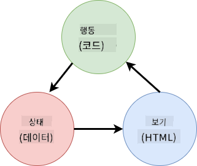

<!--
CO_OP_TRANSLATOR_METADATA:
{
  "original_hash": "b46acf79da8550d76445eed00b06c878",
  "translation_date": "2025-10-03T12:53:01+00:00",
  "source_file": "7-bank-project/4-state-management/README.md",
  "language_code": "ko"
}
-->
# 은행 앱 만들기 Part 4: 상태 관리 개념

## 강의 전 퀴즈

[강의 전 퀴즈](https://ff-quizzes.netlify.app/web/quiz/47)

### 소개

웹 애플리케이션이 성장함에 따라 모든 데이터 흐름을 추적하는 것이 점점 어려워집니다. 어떤 코드가 데이터를 가져오고, 어떤 페이지가 데이터를 소비하며, 어디서 언제 업데이트가 필요한지... 코드가 복잡해지고 유지 관리가 어려워지기 쉽습니다. 특히 앱의 여러 페이지에서 데이터를 공유해야 할 때, 예를 들어 사용자 데이터를 공유해야 할 때 더욱 그렇습니다. *상태 관리*라는 개념은 모든 종류의 프로그램에서 항상 존재해 왔지만, 웹 앱이 점점 복잡해짐에 따라 개발 중에 반드시 고려해야 할 핵심 요소가 되었습니다.

이 마지막 부분에서는 우리가 만든 앱을 다시 살펴보고 상태를 관리하는 방법을 재구성하여 브라우저 새로고침을 지원하고 사용자 세션 간 데이터를 지속적으로 유지할 수 있도록 할 것입니다.

### 사전 요구 사항

이 강의를 위해 웹 앱의 [데이터 가져오기](../3-data/README.md) 부분을 완료해야 합니다. 또한 [Node.js](https://nodejs.org)를 설치하고 [서버 API를 실행](../api/README.md)하여 계정 데이터를 관리할 수 있어야 합니다.

서버가 제대로 실행되고 있는지 확인하려면 터미널에서 다음 명령을 실행하세요:

```sh
curl http://localhost:5000/api
# -> should return "Bank API v1.0.0" as a result
```

---

## 상태 관리 재구성

[이전 강의](../3-data/README.md)에서는 현재 로그인한 사용자의 은행 데이터를 포함하는 전역 `account` 변수를 사용하여 앱에서 상태의 기본 개념을 소개했습니다. 하지만 현재 구현에는 몇 가지 결함이 있습니다. 대시보드에서 페이지를 새로고침해 보세요. 어떤 일이 발생하나요?

현재 코드에는 다음과 같은 3가지 문제가 있습니다:

- 상태가 지속되지 않아 브라우저를 새로고침하면 로그인 페이지로 돌아갑니다.
- 상태를 수정하는 함수가 여러 개 있습니다. 앱이 성장함에 따라 변경 사항을 추적하기 어려워지고 하나를 업데이트하는 것을 잊기 쉽습니다.
- 상태가 정리되지 않아 *로그아웃*을 클릭해도 로그인 페이지에 있지만 계정 데이터는 여전히 남아 있습니다.

이 문제를 하나씩 해결하기 위해 코드를 업데이트할 수도 있지만, 이는 코드 중복을 증가시키고 앱을 더 복잡하고 유지 관리하기 어렵게 만들 것입니다. 또는 몇 분 동안 멈추고 전략을 재구성할 수 있습니다.

> 여기서 우리가 실제로 해결하려는 문제는 무엇일까요?

[상태 관리](https://en.wikipedia.org/wiki/State_management)는 다음 두 가지 특정 문제를 해결하기 위한 좋은 접근 방식을 찾는 것입니다:

- 앱의 데이터 흐름을 이해하기 쉽게 만드는 방법은 무엇인가?
- 상태 데이터와 사용자 인터페이스를 항상 동기화 상태로 유지하는 방법은 무엇인가?

이 문제를 해결하면 다른 문제는 이미 해결되었거나 해결하기 쉬워질 수 있습니다. 이러한 문제를 해결하기 위한 접근 방식은 다양하지만, 우리는 **데이터와 이를 변경하는 방법을 중앙 집중화**하는 일반적인 솔루션을 선택할 것입니다. 데이터 흐름은 다음과 같이 진행됩니다:



> 여기서는 데이터가 자동으로 뷰 업데이트를 트리거하는 부분을 다루지 않습니다. 이는 [반응형 프로그래밍](https://en.wikipedia.org/wiki/Reactive_programming)의 더 고급 개념과 관련이 있습니다. 깊이 있는 학습을 원한다면 좋은 후속 주제입니다.

✅ 상태 관리에 대한 다양한 접근 방식을 가진 많은 라이브러리가 있으며, [Redux](https://redux.js.org)가 인기 있는 옵션입니다. 대규모 웹 앱에서 직면할 수 있는 잠재적 문제와 이를 해결하는 방법을 배우는 데 유용한 개념과 패턴을 살펴보세요.

### 작업

약간의 리팩토링으로 시작해 보겠습니다. `account` 선언을 다음으로 교체하세요:

```js
let account = null;
```

다음으로:

```js
let state = {
  account: null
};
```

이 아이디어는 앱의 모든 데이터를 단일 상태 객체에 *중앙 집중화*하는 것입니다. 현재 상태에는 `account`만 있으므로 크게 변하지 않지만, 향후 발전을 위한 길을 열어줍니다.

이를 사용하는 함수도 업데이트해야 합니다. `register()` 및 `login()` 함수에서 `account = ...`를 `state.account = ...`로 교체하세요.

`updateDashboard()` 함수의 맨 위에 다음 줄을 추가하세요:

```js
const account = state.account;
```

이 리팩토링 자체는 큰 개선을 가져오지 않았지만, 다음 변경을 위한 기초를 마련하는 것이 목적이었습니다.

## 데이터 변경 추적

이제 데이터를 저장할 `state` 객체를 설정했으니, 다음 단계는 업데이트를 중앙 집중화하는 것입니다. 목표는 변경 사항과 변경 시점을 더 쉽게 추적할 수 있도록 하는 것입니다.

`state` 객체에 변경 사항이 발생하지 않도록 하기 위해, 이를 [*불변 객체*](https://en.wikipedia.org/wiki/Immutable_object)로 간주하는 것도 좋은 방법입니다. 즉, 전혀 수정할 수 없다는 뜻입니다. 또한, 상태 객체에서 무언가를 변경하려면 새 상태 객체를 생성해야 합니다. 이렇게 하면 원치 않는 [부작용](https://en.wikipedia.org/wiki/Side_effect_(computer_science))을 방지하고, 앱에서 실행 취소/재실행 기능을 구현하거나 디버깅을 쉽게 할 수 있는 새로운 기능을 추가할 가능성을 열어줍니다. 예를 들어, 상태에 발생한 모든 변경 사항을 기록하고 변경 내역을 유지하여 버그의 원인을 이해할 수 있습니다.

JavaScript에서는 [`Object.freeze()`](https://developer.mozilla.org/docs/Web/JavaScript/Reference/Global_Objects/Object/freeze)를 사용하여 객체의 불변 버전을 생성할 수 있습니다. 불변 객체를 수정하려고 하면 예외가 발생합니다.

✅ *얕은* 불변 객체와 *깊은* 불변 객체의 차이를 알고 있나요? [여기](https://developer.mozilla.org/docs/Web/JavaScript/Reference/Global_Objects/Object/freeze#What_is_shallow_freeze)에서 읽어볼 수 있습니다.

### 작업

새로운 `updateState()` 함수를 만들어 보겠습니다:

```js
function updateState(property, newData) {
  state = Object.freeze({
    ...state,
    [property]: newData
  });
}
```

이 함수에서는 [*스프레드(`...`) 연산자*](https://developer.mozilla.org/docs/Web/JavaScript/Reference/Operators/Spread_syntax#Spread_in_object_literals)를 사용하여 이전 상태에서 데이터를 복사한 후, 상태 객체의 특정 속성을 새 데이터로 덮어씁니다. 그런 다음 `Object.freeze()`를 사용하여 객체를 잠그고 수정할 수 없도록 합니다. 현재 상태에는 `account` 속성만 저장되어 있지만, 이 접근 방식을 사용하면 상태에 필요한 속성을 원하는 만큼 추가할 수 있습니다.

초기 상태도 불변 상태로 설정되도록 `state` 초기화를 업데이트합니다:

```js
let state = Object.freeze({
  account: null
});
```

그런 다음, `register` 함수에서 `state.account = result;` 할당을 다음으로 교체하세요:

```js
updateState('account', result);
```

`login` 함수에서도 동일하게 `state.account = data;`를 다음으로 교체하세요:

```js
updateState('account', data);
```

이제 사용자가 *로그아웃* 버튼을 클릭했을 때 계정 데이터가 지워지지 않는 문제를 해결할 기회를 잡아보겠습니다.

새로운 `logout()` 함수를 만드세요:

```js
function logout() {
  updateState('account', null);
  navigate('/login');
}
```

`updateDashboard()`에서 `return navigate('/login');` 리디렉션을 `return logout();`으로 교체하세요.

새 계정을 등록하고 로그아웃한 후 다시 로그인하여 모든 것이 제대로 작동하는지 확인하세요.

> 팁: 브라우저 개발 도구의 콘솔을 열고 `updateState()` 하단에 `console.log(state)`를 추가하여 모든 상태 변경 사항을 확인할 수 있습니다.

## 상태 지속성

대부분의 웹 앱은 올바르게 작동하기 위해 데이터를 지속적으로 저장해야 합니다. 모든 중요한 데이터는 일반적으로 데이터베이스에 저장되고 서버 API를 통해 액세스됩니다. 예를 들어, 사용자 계정 데이터가 그렇습니다. 하지만 때로는 브라우저에서 실행 중인 클라이언트 앱에 데이터를 저장하는 것도 사용자 경험을 개선하거나 로딩 성능을 향상시키는 데 유용합니다.

브라우저에서 데이터를 저장하려면 몇 가지 중요한 질문을 스스로에게 해야 합니다:

- *데이터가 민감한가요?* 사용자 비밀번호와 같은 민감한 데이터를 클라이언트에 저장하는 것을 피해야 합니다.
- *이 데이터를 얼마나 오래 유지해야 하나요?* 이 데이터를 현재 세션에서만 액세스할 계획인가요, 아니면 영구적으로 저장하고 싶나요?

웹 앱 내부에서 정보를 저장하는 방법은 원하는 목표에 따라 다양합니다. 예를 들어, 검색 쿼리를 URL에 저장하여 사용자 간에 공유 가능하게 만들 수 있습니다. 또한 [인증](https://en.wikipedia.org/wiki/Authentication) 정보와 같이 서버와 데이터를 공유해야 하는 경우 [HTTP 쿠키](https://developer.mozilla.org/docs/Web/HTTP/Cookies)를 사용할 수 있습니다.

브라우저 API 중 데이터를 저장하는 데 특히 흥미로운 두 가지 옵션이 있습니다:

- [`localStorage`](https://developer.mozilla.org/docs/Web/API/Window/localStorage): 현재 웹 사이트에 특정한 데이터를 세션 간에 지속적으로 저장할 수 있는 [키/값 저장소](https://en.wikipedia.org/wiki/Key%E2%80%93value_database)입니다. 저장된 데이터는 절대 만료되지 않습니다.
- [`sessionStorage`](https://developer.mozilla.org/docs/Web/API/Window/sessionStorage): `localStorage`와 동일하게 작동하지만, 저장된 데이터는 세션이 종료되면(브라우저가 닫힐 때) 삭제됩니다.

이 두 API는 모두 [문자열](https://developer.mozilla.org/docs/Web/JavaScript/Reference/Global_Objects/String)만 저장할 수 있다는 점에 유의하세요. 복잡한 객체를 저장하려면 [`JSON.stringify()`](https://developer.mozilla.org/docs/Web/JavaScript/Reference/Global_Objects/JSON/stringify)를 사용하여 [JSON](https://developer.mozilla.org/docs/Web/JavaScript/Reference/Global_Objects/JSON) 형식으로 직렬화해야 합니다.

✅ 서버 없이 작동하는 웹 앱을 만들고 싶다면 [`IndexedDB` API](https://developer.mozilla.org/docs/Web/API/IndexedDB_API)를 사용하여 클라이언트에서 데이터베이스를 생성할 수도 있습니다. 이는 고급 사용 사례나 상당한 양의 데이터를 저장해야 할 때 예약된 옵션으로, 사용하기 더 복잡합니다.

### 작업

사용자가 *로그아웃* 버튼을 명시적으로 클릭할 때까지 로그인 상태를 유지하고 싶으므로 `localStorage`를 사용하여 계정 데이터를 저장할 것입니다. 먼저 데이터를 저장하는 데 사용할 키를 정의해 보겠습니다.

```js
const storageKey = 'savedAccount';
```

그런 다음 `updateState()` 함수 끝에 다음 줄을 추가하세요:

```js
localStorage.setItem(storageKey, JSON.stringify(state.account));
```

이로써 사용자 계정 데이터는 중앙 집중화된 상태 업데이트 덕분에 항상 최신 상태로 유지됩니다. 이전 리팩토링의 이점을 누리기 시작하는 순간입니다 🙂.

데이터가 저장되었으므로 앱이 로드될 때 이를 복원하는 것도 처리해야 합니다. 초기화 코드가 점점 많아지므로 `app.js` 하단의 이전 코드를 포함하는 새로운 `init` 함수를 만드는 것이 좋습니다:

```js
function init() {
  const savedAccount = localStorage.getItem(storageKey);
  if (savedAccount) {
    updateState('account', JSON.parse(savedAccount));
  }

  // Our previous initialization code
  window.onpopstate = () => updateRoute();
  updateRoute();
}

init();
```

여기서 저장된 데이터를 검색하고, 데이터가 있으면 상태를 적절히 업데이트합니다. 페이지 업데이트 중 상태를 사용하는 코드가 있을 수 있으므로 경로를 업데이트하기 *전에* 이를 수행하는 것이 중요합니다.

이제 계정 데이터가 지속되므로 *대시보드* 페이지를 애플리케이션 기본 페이지로 만들 수 있습니다. 데이터가 없으면 대시보드가 *로그인* 페이지로 리디렉션합니다. `updateRoute()`에서 기본값 `return navigate('/login');`을 `return navigate('/dashboard');`로 교체하세요.

이제 앱에 로그인하고 페이지를 새로고침해 보세요. 대시보드에 머물러야 합니다. 이 업데이트로 초기 문제를 모두 해결했습니다...

## 데이터 새로고침

...하지만 새로운 문제가 생겼을 수도 있습니다. 이런!

`test` 계정을 사용하여 대시보드로 이동한 다음 터미널에서 새 거래를 생성하기 위해 다음 명령을 실행하세요:

```sh
curl --request POST \
     --header "Content-Type: application/json" \
     --data "{ \"date\": \"2020-07-24\", \"object\": \"Bought book\", \"amount\": -20 }" \
     http://localhost:5000/api/accounts/test/transactions
```

이제 브라우저에서 대시보드 페이지를 새로고침해 보세요. 어떤 일이 발생하나요? 새 거래가 보이나요?

`localStorage` 덕분에 상태가 무기한 지속되지만, 이는 앱에서 로그아웃하고 다시 로그인할 때까지 절대 업데이트되지 않는다는 뜻이기도 합니다!

이를 해결하기 위한 한 가지 전략은 대시보드가 로드될 때마다 계정 데이터를 다시 로드하여 오래된 데이터를 방지하는 것입니다.

### 작업

새로운 `updateAccountData` 함수를 만드세요:

```js
async function updateAccountData() {
  const account = state.account;
  if (!account) {
    return logout();
  }

  const data = await getAccount(account.user);
  if (data.error) {
    return logout();
  }

  updateState('account', data);
}
```

이 메서드는 현재 로그인 상태인지 확인한 다음 서버에서 계정 데이터를 다시 로드합니다.

`refresh`라는 또 다른 함수를 만드세요:

```js
async function refresh() {
  await updateAccountData();
  updateDashboard();
}
```

이 함수는 계정 데이터를 업데이트한 다음 대시보드 페이지의 HTML을 업데이트합니다. 대시보드 경로가 로드될 때 호출해야 하는 함수입니다. 경로 정의를 다음으로 업데이트하세요:

```js
const routes = {
  '/login': { templateId: 'login' },
  '/dashboard': { templateId: 'dashboard', init: refresh }
};
```

이제 대시보드를 새로고침해 보세요. 업데이트된 계정 데이터가 표시되어야 합니다.

---

## 🚀 도전 과제

이제 대시보드가 로드될 때마다 계정 데이터를 다시 로드하므로, *모든 계정* 데이터를 지속적으로 저장할 필요가 있다고 생각하나요?

팀원들과 함께 `localStorage`에 저장하고 로드하는 데이터를 앱이 작동하는 데 절대적으로 필요한 데이터만 포함하도록 변경해 보세요.

## 강의 후 퀴즈
[강의 후 퀴즈](https://ff-quizzes.netlify.app/web/quiz/48)

## 과제

["거래 추가" 대화상자 구현하기](assignment.md)

과제를 완료한 후의 예시 결과는 다음과 같습니다:


---

**면책 조항**:  
이 문서는 AI 번역 서비스 [Co-op Translator](https://github.com/Azure/co-op-translator)를 사용하여 번역되었습니다. 정확성을 위해 최선을 다하고 있으나, 자동 번역에는 오류나 부정확성이 포함될 수 있습니다. 원본 문서의 원어 버전이 권위 있는 출처로 간주되어야 합니다. 중요한 정보의 경우, 전문적인 인간 번역을 권장합니다. 이 번역 사용으로 인해 발생하는 오해나 잘못된 해석에 대해 당사는 책임을 지지 않습니다.