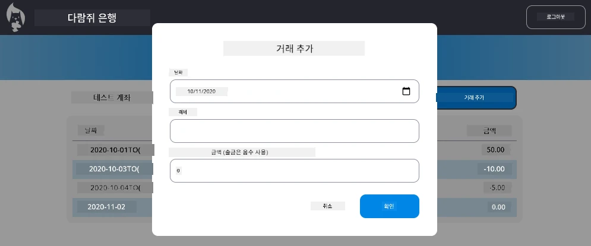

# "거래 추가" 대화 상자 구현

## 개요

당신의 뱅킹 앱은 이제 견고한 상태 관리와 데이터 지속성을 갖추었지만, 실제 뱅킹 앱에 꼭 필요한 중요한 기능이 빠져 있습니다: 사용자가 자신의 거래를 추가할 수 있는 기능입니다. 이 과제에서, 당신은 기존 상태 관리 시스템과 원활하게 통합되는 완전한 "거래 추가" 대화 상자를 구현하게 됩니다.

이 과제는 당신이 네 번의 뱅킹 수업에서 배운 모든 것을 하나로 모읍니다: HTML 템플릿 작성, 폼 처리, API 통합, 그리고 상태 관리.

## 학습 목표

이 과제를 완수함으로써, 당신은:
- **사용자 친화적인** 데이터 입력용 대화 상자 인터페이스를 **만들고**
- **키보드 및 화면 읽기 프로그램 지원**을 갖춘 접근성 높은 폼 디자인을 **구현하며**
- **기존 상태 관리 시스템**과 새로운 기능을 **통합하고**
- **API 통신과 오류 처리**를 **연습하며**
- 실제 기능에 현대 웹 개발 패턴을 **적용하는** 방법을 배우게 됩니다

## 지침

### 1단계: 거래 추가 버튼

대시보드 페이지에 사용자가 쉽게 찾고 접근할 수 있는 "거래 추가" 버튼을 **만들어야** 합니다.

**요구사항:**
- 버튼을 대시보드의 논리적인 위치에 **배치**
- 명확하고 행동 지향적인 버튼 텍스트를 **사용**
- 기존 UI 디자인과 어울리도록 버튼을 **스타일링**
- 버튼이 키보드로도 접근 가능하도록 **보장**

### 2단계: 대화 상자 구현

대화 상자 구현에 대해 다음 두 가지 접근 방법 중 하나를 선택하세요:

**옵션 A: 별도 페이지**
- 거래 폼을 위한 새 HTML 템플릿을 **만들고**
- 라우팅 시스템에 새 경로를 **추가**
- 폼 페이지로의 이동과 복귀를 **구현**

**옵션 B: 모달 대화 상자 (권장)**
- 자바스크립트를 사용하여 대시보드를 벗어나지 않고 대화 상자를 보이거나 숨기기
- [`hidden` 속성](https://developer.mozilla.org/docs/Web/HTML/Global_attributes/hidden) 또는 CSS 클래스를 활용하여 구현
- 적절한 포커스 관리로 부드러운 사용자 경험 생성

### 3단계: 접근성 구현

대화 상자가 [모달 대화 상자 접근성 표준](https://developer.paciellogroup.com/blog/2018/06/the-current-state-of-modal-dialog-accessibility/)을 충족하는지 **확인**하세요:

**키보드 내비게이션:**
- Escape 키로 대화 상자를 닫을 수 있도록 **지원**
- 대화 상자 열림 시 포커스를 대화 상자 내에 **가두기**
- 대화 상자 닫힌 후 포커스를 트리거 버튼으로 **복귀**

**스크린 리더 지원:**
- 적절한 ARIA 라벨과 역할 **추가**
- 대화 상자 열림/닫힘을 스크린 리더가 **알릴 수 있도록**
- 명확한 폼 필드 라벨과 오류 메시지 **제공**

### 4단계: 폼 생성

거래 데이터를 수집하는 HTML 폼을 **디자인**하세요:

**필수 입력 항목:**
- **날짜**: 거래가 발생한 날짜
- **설명**: 거래 내용
- **금액**: 거래 금액 (수입은 양수, 지출은 음수)

**폼 기능:**
- 제출 전에 사용자 입력을 **검증**
- 올바르지 않은 데이터에 대해 명확한 오류 메시지를 **제공**
- 유용한 플레이스홀더 텍스트와 라벨 **포함**
- 기존 디자인과 일관되게 **스타일링**

### 5단계: API 통합

백엔드 API에 폼을 **연결**하세요:

**구현 단계:**
- 올바른 엔드포인트 및 데이터 형식을 위해 [서버 API 명세](../api/README.md)를 **검토**
- 폼 입력에서 JSON 데이터를 **생성**
- 적절한 오류 처리와 함께 API에 데이터를 **전송**
- 사용자에게 성공/실패 메시지를 **표시**
- 네트워크 오류를 **우아하게 처리**

### 6단계: 상태 관리 통합

대시보드를 새 거래로 **업데이트**하세요:

**통합 요구사항:**
- 거래 추가 성공 후 계좌 데이터를 **새로 고침**
- 페이지 새로 고침 없이 대시보드 표시를 **업데이트**
- 새 거래가 즉시 **표시**되도록 보장
- 프로세스 전반에 걸쳐 상태 일관성 **유지**

## 기술 사양

**API 엔드포인트 세부 정보:**
자세한 내용은 [서버 API 문서](../api/README.md)를 참고하세요:
- 거래 데이터에 필요한 JSON 형식
- HTTP 메서드 및 엔드포인트 URL
- 예상 응답 형식
- 오류 응답 처리

**예상 결과:**
과제를 마치면, 당신의 뱅킹 앱은 전문적인 모양과 동작을 갖춘 완전한 "거래 추가" 기능을 갖추게 됩니다:

## 구현 테스트

**기능 테스트:**
1. "거래 추가" 버튼이 명확하게 보이고 접근 가능한지 **확인**
2. 대화 상자가 제대로 열리고 닫히는지 **테스트**
3. 모든 필수 필드에 대해 폼 검증이 작동하는지 **확인**
4. 성공한 거래가 대시보드에 즉시 나타나는지 **검증**
5. 올바르지 않은 데이터 및 네트워크 문제에 대한 오류 처리 작동 여부 **검증**

**접근성 테스트:**
1. 키보드만 사용하여 전체 흐름을 **탐색**
2. 스크린 리더를 사용해 적절한 안내가 되는지 **테스트**
3. 포커스 관리가 올바르게 작동하는지 **확인**
4. 모든 폼 요소에 적절한 라벨이 있는지 **검증**

## 평가 기준

| 평가 항목 | 우수 | 적절 | 개선 필요 |
| -------- | --------- | -------- | ----------------- |
| **기능성** | 거래 추가 기능이 완벽하게 작동하고 훌륭한 사용자 경험을 제공하며, 수업에서 배운 모범 사례를 모두 따른다 | 거래 추가 기능이 제대로 작동하지만 일부 모범 사례를 따르지 않거나 사소한 사용성 문제가 있다 | 거래 추가 기능이 부분적으로만 작동하거나 사용성에 심각한 문제가 있다 |
| **코드 품질** | 코드가 잘 조직되어 있고, 정립된 패턴을 따르며, 적절한 오류 처리를 포함하고 기존 상태 관리와 원활하게 통합됨 | 코드는 작동하지만 조직에 약간의 문제가 있거나 기존 코드베이스와 일관되지 않은 패턴을 가짐 | 코드에 구조적인 결함이 있거나 기존 패턴과 잘 통합되지 않음 |
| **접근성** | 완전한 키보드 내비게이션 지원, 스크린 리더 호환성 보유, WCAG 가이드라인 및 훌륭한 포커스 관리 준수 | 기본적인 접근성 기능 구현되었지만 일부 키보드 내비게이션이나 스크린 리더 기능이 부족할 수 있음 | 제한적이거나 접근성 고려 사항이 거의 또는 전혀 구현되지 않음 |
| **사용자 경험** | 직관적이고 세련된 인터페이스, 명확한 피드백, 부드러운 상호작용, 전문적인 외관 | 좋은 사용자 경험이나 피드백이나 시각적 디자인에서 약간의 개선이 필요함 | 혼란스러운 인터페이스 또는 사용자 피드백 부족으로 인해 열악한 사용자 경험 |

## 추가 도전 과제 (선택 사항)

기본 요구사항을 완료한 후, 다음 확장 기능을 고려해 보세요:

**향상된 기능:**
- 거래 카테고리 추가 (음식, 교통, 오락 등)
- 실시간 피드백을 제공하는 입력 검증 구현
- 파워 유저를 위한 키보드 단축키 생성
- 거래 편집 및 삭제 기능 추가

**고급 통합:**
- 최근 추가된 거래에 대한 실행 취소 기능 구현
- CSV 파일을 통한 대량 거래 가져오기 추가
- 거래 검색 및 필터링 기능 생성
- 데이터 내보내기 기능 구현

이러한 선택적 기능들은 더 고급 웹 개발 개념을 연습하고 더욱 완전한 뱅킹 애플리케이션을 만드는 데 도움이 될 것입니다!

---

<!-- CO-OP TRANSLATOR DISCLAIMER START -->
**면책 조항**:  
이 문서는 AI 번역 서비스 [Co-op Translator](https://github.com/Azure/co-op-translator)를 사용하여 번역되었습니다. 정확성을 위해 노력하고 있으나, 자동 번역에는 오류나 부정확한 부분이 있을 수 있음을 유의하시기 바랍니다. 원문 문서는 해당 언어의 공식 자료로 간주되어야 합니다. 중요한 정보에 대해서는 전문 인력의 번역을 권장합니다. 본 번역 사용으로 인한 오해나 잘못된 해석에 대해 당사는 책임을 지지 않습니다.
<!-- CO-OP TRANSLATOR DISCLAIMER END -->