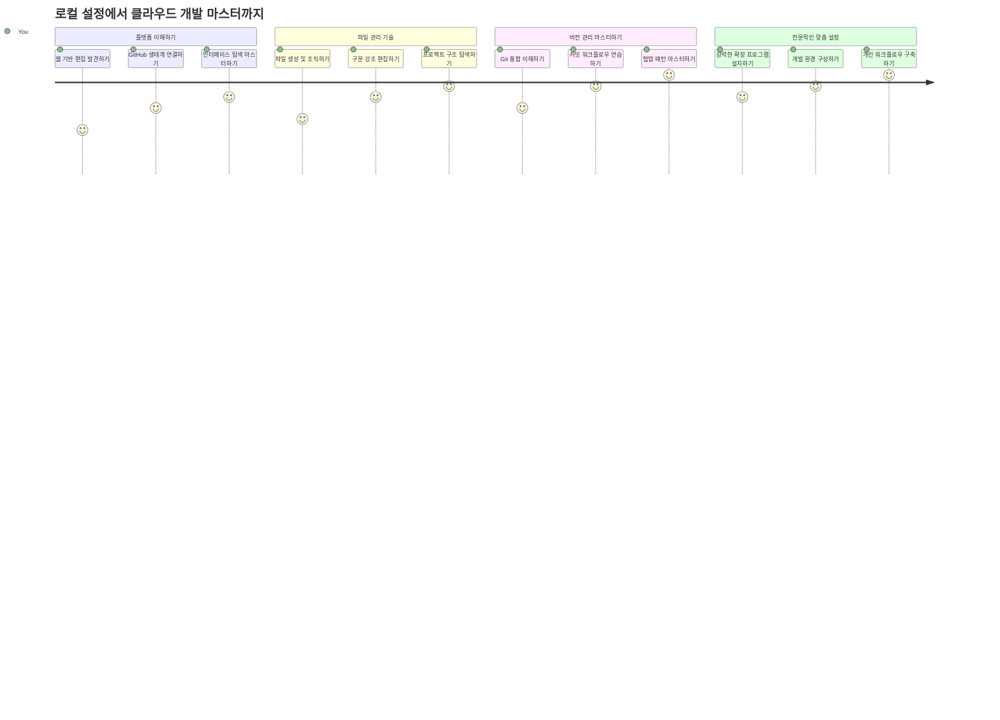
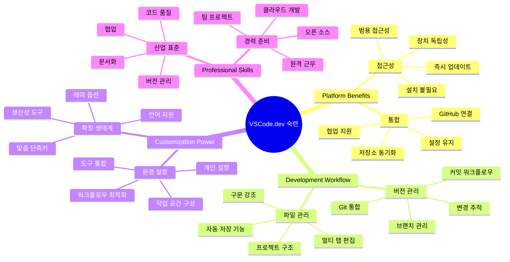
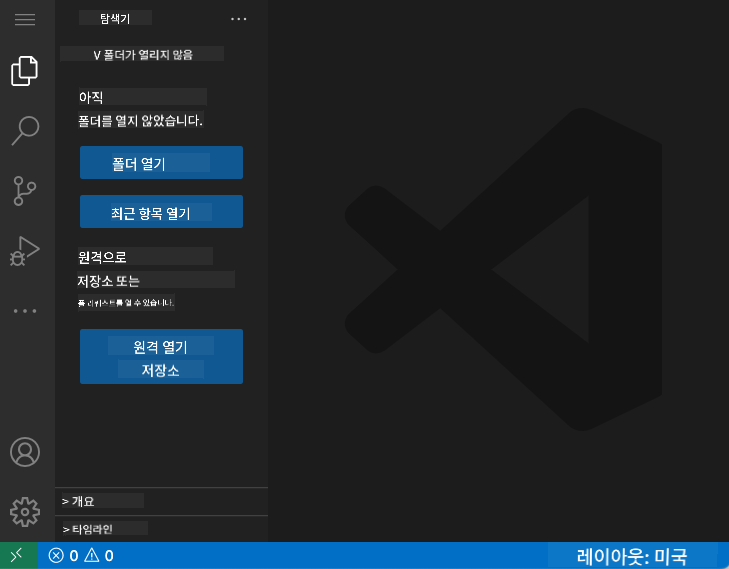
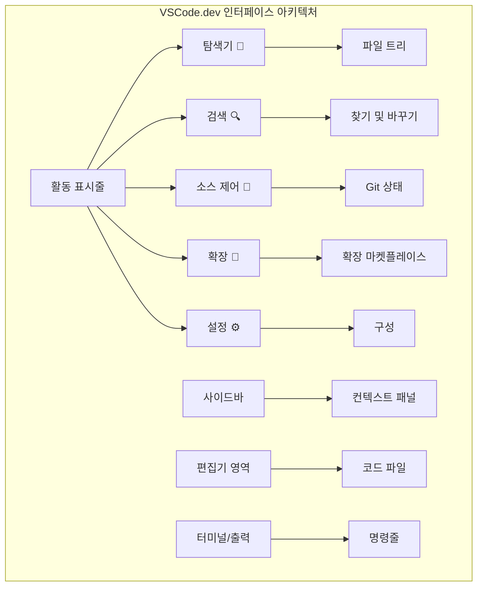
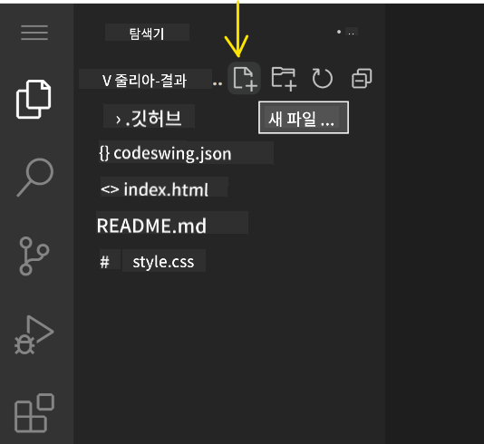
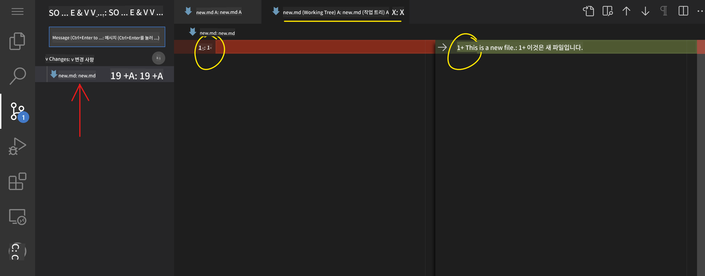
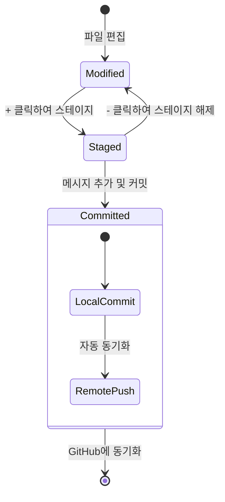
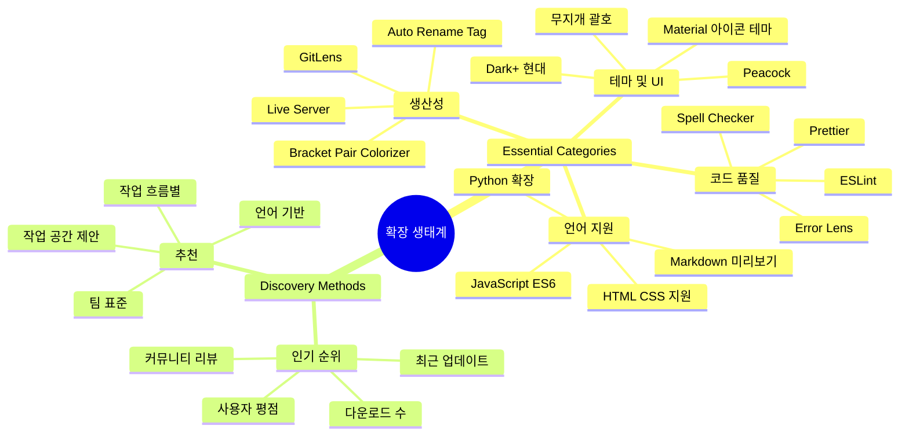
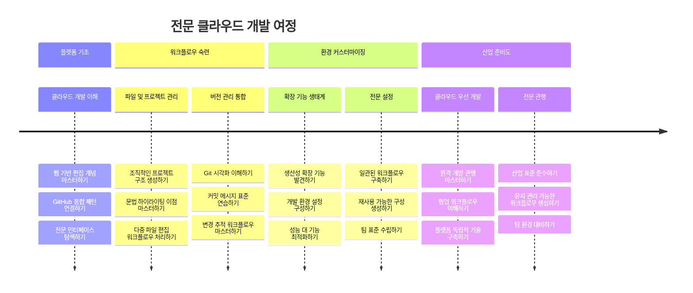

<!--
CO_OP_TRANSLATOR_METADATA:
{
  "original_hash": "a9a3bcc037a447e2d8994d99e871cd9f",
  "translation_date": "2026-01-06T14:56:02+00:00",
  "source_file": "8-code-editor/1-using-a-code-editor/README.md",
  "language_code": "ko"
}
-->
# 코드 편집기 사용하기: VSCode.dev 마스터하기

*매트릭스*에서 네오가 디지털 세계에 접속하기 위해 거대한 컴퓨터 터미널에 연결해야 했던 것을 기억하나요? 오늘날의 웹 개발 도구들은 정반대입니다 – 어디서든 접속 가능한 엄청난 기능들입니다. VSCode.dev는 인터넷 연결만 있으면 모든 기기에서 전문 개발 도구를 사용할 수 있도록 해주는 브라우저 기반 코드 편집기입니다.

인쇄기가 수도원의 필경사들만 아니라 모두가 책을 접할 수 있게 했던 것처럼, VSCode.dev는 코딩의 민주화를 이룹니다. 도서관 컴퓨터, 학교 실습실 또는 브라우저에 접속할 수 있는 어디서든 프로젝트 작업이 가능합니다. 설치 불필요하며 "내 설정이 필요해"라는 제한도 없습니다.

이 강의를 마치면 VSCode.dev를 탐색하고, GitHub 저장소를 브라우저에서 직접 열고, 버전 컨트롤을 위한 Git을 사용하는 방법을 이해하게 될 것입니다 – 이는 전문 개발자들이 매일 의존하는 기술입니다.

## ⚡ 다음 5분 안에 할 수 있는 것

**바쁜 개발자를 위한 빠른 시작 경로**


- **1분 차**: [vscode.dev](https://vscode.dev)로 이동 – 설치 필요 없음
- **2분 차**: GitHub에 로그인하여 저장소 연결
- **3분 차**: URL 변환법 시도하기: 저장소 URL의 `github.com`을 `vscode.dev/github`으로 변경
- **4분 차**: 새 파일 만들고 자동으로 작동하는 문법 하이라이팅 확인
- **5분 차**: 변경사항 만들고 소스 제어 패널로 커밋하기

**빠른 테스트 URL**:
```
# Transform this:
github.com/microsoft/Web-Dev-For-Beginners

# Into this:
vscode.dev/github/microsoft/Web-Dev-For-Beginners
```

**이것이 중요한 이유**: 5분 만에 어디서나 전문 도구로 코딩하는 자유를 경험하게 될 것입니다. 이는 접근 가능하고 강력하며 즉각적인 개발의 미래를 나타냅니다.

## 🗺️ 클라우드 기반 개발을 통한 학습 여정


**여정의 목적지**: 이 강의가 끝나면 어떤 기기에서든 동작하는 전문 클라우드 개발 환경을 마스터하여, 주요 IT 기업의 개발자들이 사용하는 동일한 도구로 코딩할 수 있게 됩니다.

## 배우게 될 내용

함께 살펴본 후, 다음을 할 수 있게 됩니다:

- VSCode.dev를 제2의 집처럼 탐색하여 필요한 모든 것을 길 잃지 않고 찾기
- 어떤 GitHub 저장소든 브라우저에서 열어 즉시 편집 시작하기 (이건 정말 마법 같아요!)
- Git을 사용해 변경사항을 추적하고 전문가처럼 작업 진척 사항 저장하기
- 코딩을 더 빠르고 재미있게 만드는 확장 기능으로 편집기를 강화하기
- 프로젝트 파일을 자신 있게 생성하고 조직하기

## 필요한 것

요구 사항은 간단합니다:

- 무료 [GitHub 계정](https://github.com) (필요 시 만들기 안내)
- 웹 브라우저 기본 지식
- GitHub 기초 강의가 배경지식 제공, 필수는 아님

> 💡 **GitHub 초보신가요?** 계정 만들기는 무료이며 몇 분 안에 완료됩니다. 도서관 카드가 전 세계 책에 접근하게 해주듯, GitHub 계정은 인터넷상의 코드 저장소 문을 열어줍니다.

## 🧠 클라우드 개발 생태계 개요


**핵심 원칙**: 클라우드 기반 개발 환경은 접근 가능하고 협업 가능하며 플랫폼 독립적인 전문 도구를 제공하는 코딩의 미래를 나타냅니다.

## 웹 기반 코드 편집기가 중요한 이유

인터넷 이전에는 여러 대학 과학자들이 연구를 쉽게 공유할 수 없었습니다. 1960년대의 ARPANET는 먼 거리 컴퓨터들을 연결했습니다. 웹 기반 코드 편집기도 같은 원칙을 따릅니다 – 물리적 위치나 기기에 관계없이 강력한 도구에 접근할 수 있게 합니다.

코드 편집기는 코드 파일을 작성, 편집, 정리하는 개발 작업 공간입니다. 단순 텍스트 편집기와 달리, 전문 코드 편집기는 문법 하이라이트, 오류 탐지, 프로젝트 관리 기능을 제공합니다.

VSCode.dev는 이러한 기능을 브라우저에 가져옵니다:

**웹 기반 편집의 장점:**

| 기능 | 설명 | 실용적 이점 |
|---------|-------------|----------|
| **플랫폼 독립성** | 브라우저가 있는 모든 기기에서 실행 | 다양한 컴퓨터에서 매끄럽게 작업 가능 |
| **설치 불필요** | 웹 URL로 접근 | 소프트웨어 설치 제한 우회 가능 |
| **자동 업데이트** | 항상 최신 버전 실행 | 수동 업데이트 없이 새 기능 이용 가능 |
| **저장소 통합** | GitHub와 직접 연결 | 로컬 파일 관리 없이 코드 편집 가능 |

**실용적 함의:**
- 다양한 환경에서 작업 지속성 보장
- 운영체제와 무관한 일관된 인터페이스
- 즉각적 협업 기능
- 로컬 저장 공간 절약

## VSCode.dev 탐색하기

마리 퀴리의 실험실이 상대적으로 단순한 공간에 정교한 장비가 갖춰져 있듯, VSCode.dev는 브라우저 인터페이스에 전문 개발 도구를 담았습니다. 이 웹 앱은 데스크톱 코드 편집기와 핵심 기능이 동일합니다.

브라우저에서 [vscode.dev](https://vscode.dev)로 이동하세요. 다운로드나 시스템 설치 없이 바로 인터페이스가 로드됩니다 – 클라우드 컴퓨팅 원칙의 직접적인 적용입니다.

### GitHub 계정 연결하기

알렉산더 그레이엄 벨의 전화가 먼 곳들을 연결했듯, GitHub 계정 연결은 VSCode.dev와 코드 저장소를 이어줍니다. GitHub 로그인 요청이 나타나면 연결 허용을 추천합니다.

**GitHub 통합 기능:**
- 편집기 내 저장소 직접 접근
- 기기 간 설정 및 확장 동기화
- GitHub로 저장 워크플로우 간소화
- 개인 맞춤 개발 환경 제공

### 새로운 작업 공간 알아보기

모든 것이 로드되면, 코드에 집중할 수 있도록 깔끔하게 설계된 작업 공간을 보게 됩니다!



**이곳이 여러분의 동네 안내입니다:**
- **활동 표시줄** (왼쪽 줄): 탐색기 📁, 검색 🔍, 소스 제어 🌿, 확장 기능 🧩, 설정 ⚙️의 주요 네비게이션
- **사이드바** (그 옆 패널): 선택한 항목에 따라 관련 정보를 표시
- **편집기 영역** (가운데 큰 공간): 마법이 일어나는 곳 – 주 코딩 공간

**잠시 탐색해 보세요:**
- 활동 표시줄 아이콘을 클릭하며 각각의 기능 확인
- 사이드바가 정보를 어떻게 바꾸는지 살펴보기 – 멋지죠?
- 탐색기 뷰(📁)는 아마도 가장 자주 사용할 예정이니 익숙해지기


## GitHub 저장소 열기

인터넷 이전에는 연구자들이 문서에 접근하려면 도서관까지 물리적으로 가야 했습니다. GitHub 저장소도 비슷합니다 – 원격에 저장된 코드 모음입니다. VSCode.dev는 편집 전에 저장소를 로컬로 다운로드하는 기존 단계를 없앴습니다.

이 기능으로 공개 저장소라면 즉시 보기, 편집, 기여가 가능합니다. 열 방법 두 가지를 알려드립니다:

### 방법 1: 포인터 클릭 방식

VSCode.dev를 처음 시작할 때 특정 저장소를 열고자 할 때 완벽합니다. 간단하고 초보자에게 친숙합니다:

**방법:**

1. 아직 방문하지 않았다면 [vscode.dev](https://vscode.dev)로 이동
2. 환영 화면에서 "Open Remote Repository" 버튼 클릭

   

3. 원하는 GitHub 저장소 URL 붙여넣기 (예: `https://github.com/microsoft/Web-Dev-For-Beginners`)
4. Enter를 누르고 마법을 지켜보기!

**프로 팁 – 명령 팔레트 단축키:**

코딩 마법사가 되고 싶나요? 키보드 단축키 Ctrl+Shift+P (Mac은 Cmd+Shift+P)로 명령 팔레트를 열어보세요:


**명령 팔레트는 할 수 있는 모든 것의 검색 엔진과 같습니다:**
- "open remote" 입력하면 원격 저장소 열기 기능 찾기
- 최근에 연 저장소도 기억함 (엄청 편리!)
- 익숙해지면 번개처럼 코딩하는 기분
- 사실상 VSCode.dev의 "시리야, 코딩 도와줘" 기능

### 방법 2: URL 수정 기법

HTTP와 HTTPS가 동일 도메인 구조를 유지하며 다른 프로토콜을 사용하듯이, VSCode.dev도 GitHub 주소 체계를 반영하는 URL 패턴을 사용합니다. 어떤 GitHub 저장소 URL도 수정하여 직행할 수 있습니다.

**URL 변환 패턴:**

| 저장소 유형 | GitHub URL | VSCode.dev URL |
|----------------|---------------------|----------------|
| **공개 저장소** | `github.com/microsoft/Web-Dev-For-Beginners` | `vscode.dev/github/microsoft/Web-Dev-For-Beginners` |
| **개인 프로젝트** | `github.com/your-username/my-project` | `vscode.dev/github/your-username/my-project` |
| **접근 가능한 모든 저장소** | `github.com/their-username/awesome-repo` | `vscode.dev/github/their-username/awesome-repo` |

**절차:**
- `github.com`을 `vscode.dev/github`으로 교체
- 나머지 URL 구성 요소는 그대로 유지
- 공개 접근 가능한 모든 저장소에서 작동
- 즉각 편집 접근 제공

> 💡 **인생이 바뀌는 팁**: 좋아하는 저장소 VSCode.dev 버전을 북마크하세요. 저는 "내 포트폴리오 편집", "문서 수정" 같은 북마크가 편집 모드로 바로 안내합니다!

**어느 방법을 사용할까?**
- **인터페이스 방식**: 탐색하거나 저장소 이름이 잘 기억나지 않을 때 최고
- **URL 변환법**: 정확히 어디로 갈지 알 때 번개처럼 빠른 접근에 적합

### 🎯 교육적 점검: 클라우드 개발 접근

**멈춰서 생각하기**: 방금 웹 브라우저로 저장소에 접근하는 두 가지 방법을 배웠습니다. 이는 개발 방식의 근본적인 변화를 의미합니다.

**빠른 자기 평가:**
- 웹 기반 편집이 왜 기존 "개발 환경 설정" 단계를 없애는지 설명할 수 있나요?
- URL 변환 기술이 로컬 git 클론보다 어떤 이점을 제공하나요?
- 이 방법이 오픈 소스 프로젝트 기여 방식을 어떻게 바꿀까요?

**현실 세계 연계**: GitHub, GitLab, Replit 같은 주요 회사들이 이러한 클라우드 우선 원칙 기반 개발 플랫폼을 구축했습니다. 여러분은 전 세계 전문 개발팀이 사용하는 워크플로를 배우고 있습니다.

**도전 문제**: 클라우드 기반 개발이 학교에서 코딩 교육 방식을 어떻게 바꿀 수 있을까요? 기기 요건, 소프트웨어 관리, 협업 가능성 관점에서 생각해 보세요.

## 파일 및 프로젝트 작업하기

이제 저장소를 열었으니 본격 작업해 봅시다! VSCode.dev는 코드 파일을 생성, 편집, 조직하는 데 필요한 모든 것을 제공합니다. 디지털 작업장처럼 모든 도구가 필요한 곳에 있습니다.

일상 작업부터 시작해보겠습니다. 이는 대부분 코딩 작업의 핵심입니다.

### 새 파일 만들기

건축가 사무실에서 도면을 정리하는 것처럼, VSCode.dev에서 파일 생성은 체계적입니다. 모든 표준 웹 개발 파일 형식을 지원합니다.

**파일 생성 절차:**

1. 탐색기 사이드바에서 대상 폴더로 이동
2. 폴더 이름 위에 마우스 호버하면 "새 파일" 아이콘(📄+) 나타남
3. 적절한 확장자를 포함한 파일 이름 입력 (`style.css`, `script.js`, `index.html`)
4. Enter 눌러 파일 생성



**이름 규칙:**
- 파일 목적을 알 수 있는 설명적 이름 사용
- 문법 하이라이팅을 위한 확장자 포함
- 프로젝트 전반에 일관된 명명 패턴 따르기
- 소문자와 하이픈 사용, 띄어쓰기 대신

### 파일 편집 및 저장

이제 진짜 재미가 시작됩니다! VSCode.dev 편집기는 코딩을 부드럽고 직관적으로 만들어주는 유용한 기능들로 가득합니다. 마치 정말 똑똑한 작문 비서 같은 존재입니다.

**편집 작업 흐름:**

1. 탐색기에서 파일 클릭해 중앙 영역에 열기
2. 타이핑 시작하면 VSCode.dev가 색, 제안, 오류 감지로 도와줌
3. Ctrl+S(윈도우/리눅스) 또는 Cmd+S(맥)로 저장 (자동 저장도 됨!)


**코딩하면서 일어나는 멋진 일들:**
- 코드가 보기 쉽게 아름다운 컬러 코딩
- 타이핑할 때 완성 제안 제공 (자동 수정보다 똑똑)
- 저장 전에도 오타와 오류 감지
- 브라우저 탭처럼 여러 파일을 탭에 동시에 열기
- 모든 작업은 백그라운드에서 자동 저장

> ⚠️ **빠른 팁**: 자동 저장이 있더라도 Ctrl+S나 Cmd+S를 누르는 습관이 좋습니다. 즉시 저장하며 오류 검사 같은 추가 기능도 트리거됩니다.

### Git을 이용한 버전 관리

고고학자가 발굴 층을 상세 기록하듯이 Git은 코드 변경 이력을 기록합니다. 이 시스템은 프로젝트 역사를 보존하고 필요할 때 이전 버전으로 되돌릴 수 있게 해줍니다. VSCode.dev는 통합 Git 기능을 포함합니다.

**소스 제어 인터페이스:**

1. 활동 표시줄의 🌿 아이콘을 통해 소스 제어 패널 접근
2. 수정된 파일이 "변경 사항" 섹션에 표시됨
3. 색상 코딩으로 변경 유형 표시: 초록색은 추가, 빨간색은 삭제



**작업 저장 (커밋 워크플로):**



**단계별 절차:**
- 저장할 파일 옆 "+" 아이콘 클릭하여 스테이지하기 (staging)
- 모든 스테이징된 변경 사항이 만족스러운지 다시 한 번 확인하세요
- 수행한 작업을 간단히 설명하는 짧은 메모를 작성하세요(이것이 "커밋 메시지"입니다)
- 체크 표시 버튼을 클릭하여 모든 내용을 GitHub에 저장하세요
- 마음이 바뀌었다면, 실행 취소 아이콘을 눌러 변경 사항을 버릴 수 있습니다

**좋은 커밋 메시지 작성법 (생각보다 쉽습니다!):**
- "Add contact form" 또는 "Fix broken navigation"처럼 수행한 작업을 간단히 설명하세요
- 짧고 간결하게 작성하세요 – 에세이 길이가 아닌 트윗 길이 정도로
- "Add", "Fix", "Update", "Remove"와 같은 동작 동사로 시작하세요
- **좋은 예시**: "Add responsive navigation menu", "Fix mobile layout issues", "Update colors for better accessibility"

> 💡 **빠른 네비게이션 팁**: 왼쪽 상단의 햄버거 메뉴(☰)를 사용해 GitHub 저장소로 바로 이동하고, 온라인에서 커밋한 변경사항을 확인하세요. 편집 환경과 GitHub 프로젝트 홈 간의 포털과 같습니다!

## 확장 기능으로 기능 향상하기

장인이 다양한 작업에 특화된 공구를 사용하는 것처럼, VSCode.dev는 특정 기능을 추가하는 확장 기능으로 맞춤 설정할 수 있습니다. 커뮤니티에서 개발한 이 플러그인들은 코드 포맷팅, 실시간 미리보기, 향상된 Git 통합 등 개발에 흔히 필요한 요구를 해결합니다.

확장 기능 마켓플레이스에는 전 세계 개발자들이 만든 수천 개의 무료 도구가 있습니다. 각 확장은 특정 작업 흐름 문제를 해결하여, 여러분만의 필요와 선호에 맞는 개인화된 개발 환경을 구축할 수 있게 도와줍니다.


### 나에게 딱 맞는 확장 기능 찾기

확장 기능 마켓플레이스는 매우 잘 정리되어 있어 필요한 것을 찾다가 길을 잃지 않을 거예요. 특정 도구뿐만 아니라 존재하는지도 몰랐던 멋진 것들도 발견할 수 있도록 설계되었습니다!

**마켓플레이스에 접근하는 방법:**

1. 활동 표시줄에서 확장 아이콘(🧩)을 클릭하세요
2. 둘러보거나 특정 항목을 검색하세요
3. 흥미로운 항목을 클릭해 자세히 알아보세요


**내부에서 볼 수 있는 것들:**

| 구분 | 내용 | 유용한 이유 |
|----------|---------|----------|
| **설치됨** | 이미 추가한 확장 기능들 | 개인적인 코딩 도구 모음 |
| **인기** | 대중의 인기작들 | 대부분 개발자들이 추천하는 것들 |
| **추천** | 프로젝트에 맞는 똑똑한 제안 | VSCode.dev가 추천하는 확장들 |

**탐색이 쉬운 이유:**
- 각 확장에는 평점, 다운로드 수, 실제 사용자 리뷰가 표시됩니다
- 각 확장의 기능에 대한 스크린샷과 명확한 설명을 볼 수 있어요
- 호환성 정보가 명확히 표시됩니다
- 비슷한 확장 기능을 추천해 비교할 수 있습니다

### 확장 기능 설치하기 (정말 간단해요!)

새로운 기능을 에디터에 추가하는 것은 버튼 한 번 클릭만큼 쉬워요. 확장은 몇 초 만에 설치되고 바로 작동하기 시작합니다 – 재시작도, 기다림도 필요 없어요.

**필요한 절차는 이렇습니다:**

1. 원하는 확장을 검색하세요 ("live server"나 "prettier" 같은 키워드로)
2. 관심 가는 확장을 클릭해 자세한 정보를 확인하세요
3. 기능을 읽고 평점을 확인하세요
4. 파란색 "Install" 버튼을 눌러 설치를 완료하세요!


**백그라운드에서 무슨 일이 일어날까요:**
- 확장이 자동으로 다운로드되어 설정됩니다
- 새 기능이 인터페이스에 바로 나타납니다
- 모든 것이 즉시 작동합니다 (정말 빠릅니다!)
- 로그인되어 있다면, 확장이 모든 기기에 동기화됩니다

**제가 추천하는 확장 몇 가지:**
- **Live Server**: 코딩하면서 웹사이트가 실시간으로 업데이트되는 마법 같은 확장
- **Prettier**: 코드를 자동으로 깨끗하고 전문적으로 포맷팅해줍니다
- **Auto Rename Tag**: 한 HTML 태그를 바꾸면 짝이 되는 태그도 함께 변경됩니다
- **Bracket Pair Colorizer**: 괄호를 색상으로 구분해서 헷갈리지 않게 도와줍니다
- **GitLens**: Git 기능을 강화하여 다양한 유용한 정보를 제공합니다

### 확장 기능 개인 설정하기

대부분 확장 기능은 여러분이 원하는 대로 동작하도록 설정값을 조정할 수 있습니다. 마치 자동차의 좌석과 거울을 자신의 취향에 맞게 조절하는 것과 같죠.

**확장 기능 설정 조정 방법:**

1. 확장 패널에서 설치된 확장을 찾으세요
2. 이름 옆의 작은 톱니바퀴 아이콘(⚙️)을 클릭하세요
3. 드롭다운에서 "Extension Settings"를 선택하세요
4. 원하는 만큼 설정을 변경해 작업 흐름에 맞게 맞추세요


**보통 조정하는 항목들:**
- 코드 포맷팅 방식 (탭 vs 공백, 줄 길이 등)
- 어떤 키보드 단축키로 동작을 실행할지
- 확장이 작업할 파일 유형 설정
- 깔끔하게 유지하기 위해 특정 기능 켜기/끄기

### 확장 기능 관리하기

점점 더 많은 멋진 확장을 발견하게 되면 이를 정돈하고 원활하게 운영하고 싶어질 것입니다. VSCode.dev는 이 과정을 매우 쉽게 만들어줍니다.

**확장 기능 관리 옵션들:**

| 기능 | 언제 유용한가 | 꿀팁 |
|--------|---------|----------|
| **비활성화** | 확장 때문에 문제가 생기는지 테스트할 때 | 다시 필요할 수도 있으니 완전 삭제보다 낫습니다 |
| **제거** | 더 이상 필요 없는 확장을 완전히 삭제할 때 | 환경을 깔끔하고 빠르게 유지합니다 |
| **업데이트** | 최신 기능과 버그 수정을 받으려 할 때 | 보통 자동으로 되지만 가끔 직접 확인하는 게 좋습니다 |

**제가 확장 관리를 하는 방법:**
- 몇 달에 한 번씩 설치한 확장을 검토해 사용하지 않는 것은 삭제합니다
- 항상 최신 버전으로 유지해 새로운 개선과 보안 패치를 받습니다
- 느려지면 확장을 일시 비활성화해 어느 것이 원인인지 확인합니다
- 주요 업데이트가 있으면 변경사항 노트를 읽어봅니다 – 간혹 멋진 새 기능이 포함되어 있습니다!

> ⚠️ **성능 팁**: 확장은 정말 좋지만 너무 많으면 속도가 느려질 수 있습니다. 진짜 유용한 것들에 집중하고 절대 안 쓰는 것은 과감히 삭제하세요.

### 🎯 학습 점검: 개발 환경 맞춤화

**아키텍처 이해**: 여러분은 커뮤니티 확장 기능을 이용해 전문 개발 환경을 맞춤 설정하는 법을 배웠습니다. 이는 기업 개발팀이 표준화된 도구 체인을 만드는 방식과 유사합니다.

**습득한 핵심 개념들**:
- **확장 발견**: 특정 개발 문제를 해결하는 도구 찾기
- **환경 구성**: 개인 혹은 팀의 선호에 맞게 도구 맞춤화
- **성능 최적화**: 기능과 시스템 성능 간 균형 맞추기
- **커뮤니티 협업**: 전 세계 개발자가 만든 도구 활용

**업계 연계**: 확장 기능 생태계는 VS Code, Chrome DevTools, 최신 IDE 등 주요 개발 플랫폼을 지원합니다. 확장을 평가, 설치, 구성하는 법을 이해하는 것은 전문 개발 작업 흐름에 필수적입니다.

**성찰 질문**: 10명 개발자 팀을 위한 표준화된 개발 환경을 어떻게 구축하시겠습니까? 일관성, 성능, 개인 선호도를 고려해 보세요.

## 📈 여러분의 클라우드 개발 마스터 타임라인


**🎓 졸업 마일스톤**: 여러분은 주요 기술 기업에서 전문 개발자가 사용하는 동일한 도구와 작업 흐름으로 클라우드 기반 개발을 성공적으로 마스터했습니다. 이 기술은 소프트웨어 개발의 미래를 의미합니다.

**🔄 다음 단계 능력**:
- 고급 클라우드 개발 플랫폼 탐색 준비 (Codespaces, GitPod)
- 분산 개발 팀에서 작업할 준비 완료
- 전 세계 오픈 소스 프로젝트에 기여할 수 있는 역량
- 최신 DevOps 및 지속적 통합 실천의 기반 마련

## GitHub Copilot 에이전트 챌린지 🚀

NASA가 우주 임무에 구조화된 접근법을 사용하는 것처럼, 이 챌린지는 VSCode.dev 기술을 체계적으로 적용하는 완전한 작업 흐름 시나리오를 포함합니다.

**목표:** VSCode.dev 숙련도를 보여주는 포괄적인 웹 개발 워크플로우 설정

**프로젝트 요구 사항:** 에이전트 모드 지원을 활용하여 다음 작업 완료:
1. 기존 저장소 포크 혹은 새 저장소 생성
2. HTML, CSS, JavaScript 파일로 기능적 프로젝트 구조 구축
3. 개발 생산성 향상용 확장 기능 3개 설치 및 구성
4. 설명이 담긴 커밋 메시지로 버전 관리 연습
5. 기능 브랜치 생성 및 수정 실습
6. README.md 파일에 과정과 학습 내용 문서화

이 연습은 앞으로 개발 프로젝트에 적용할 수 있도록 VSCode.dev 개념을 실제 작업 흐름으로 통합합니다.

[에이전트 모드](https://code.visualstudio.com/blogs/2025/02/24/introducing-copilot-agent-mode)에 대해 더 알아보세요.

## 과제

이제 이 기술들을 실제로 시험해 볼 차례입니다! 실습 프로젝트가 준비되어 있습니다: [VSCode.dev를 사용해 이력서 웹사이트 만들기](./assignment.md)

이 과제는 브라우저 내에서 전문적인 이력서 웹사이트를 완성하는 과정을 안내합니다. 지금까지 탐색한 모든 VSCode.dev 기능을 활용하며, 완료 후 멋진 웹사이트와 함께 새로운 작업 흐름에 대한 자신감을 얻게 될 것입니다.

## 계속 탐색하며 역량 키우기

이제 탄탄한 기반이 마련되었지만, 더 멋진 내용이 많이 남아 있습니다! VSCode.dev 실력을 한 단계 올릴 수 있는 자료와 아이디어를 소개합니다:

**공식 문서 즐겨찾기 추천:**
- [VSCode 웹 문서](https://code.visualstudio.com/docs/editor/vscode-web?WT.mc_id=academic-0000-alfredodeza) – 브라우저 기반 편집 완전 가이드
- [GitHub Codespaces](https://docs.github.com/en/codespaces) – 클라우드에서 강력한 작업 환경

**다음에 실험해 볼 만한 멋진 기능들:**
- **키보드 단축키**: 코딩 닌자가 된 듯 빠르게 작업할 수 있는 조합 배우기
- **워크스페이스 설정**: 프로젝트 유형별로 다른 환경 설정하기
- **멀티 루트 워크스페이스**: 여러 저장소를 동시에 작업하기 (엄청 편리해요!)
- **터미널 통합**: 브라우저에서 바로 커맨드라인 도구 접근

**연습 아이디어:**
- 오픈 소스 프로젝트에 참여하며 VSCode.dev 기여해 보기 – 멋진 봉사 방법!
- 여러 확장을 써보고 나만의 완벽한 세트업 찾기
- 자주 만드는 사이트 유형별 프로젝트 템플릿 만들기
- 브랜치 관리, 병합 같은 Git 작업 흐름 연습하기 – 팀 프로젝트에서 매우 귀중한 기술

---

**브라우저 기반 개발을 마스터하셨습니다!** 🎉 휴대용 기기의 발명이 과학자들이 멀리 떨어진 곳에서 연구할 수 있게 했듯, VSCode.dev는 인터넷 연결만 있으면 어디서나 전문 코딩이 가능하게 합니다.

이 기술은 현재 업계 관행을 반영합니다 – 많은 전문 개발자가 유연성과 접근성 때문에 클라우드 기반 개발 환경을 사용합니다. 여러분은 개인 프로젝트부터 대규모 팀 협업까지 확장 가능한 작업 흐름을 익혔습니다.

이 기술을 다음 개발 프로젝트에 꼭 활용해 보세요! 🚀

---

<!-- CO-OP TRANSLATOR DISCLAIMER START -->
**면책 조항**:  
이 문서는 AI 번역 서비스 [Co-op Translator](https://github.com/Azure/co-op-translator)를 사용하여 번역되었습니다. 정확성을 위해 최선을 다하고 있으나, 자동 번역물에는 오류나 부정확한 부분이 있을 수 있음을 유의해 주시기 바랍니다. 원문 문서는 해당 언어의 공식 출처로 간주되어야 합니다. 중요한 정보의 경우 전문적인 인간 번역을 권장합니다. 본 번역문 사용으로 인해 발생하는 오해나 잘못된 해석에 대해서는 당사가 책임을 지지 않습니다.
<!-- CO-OP TRANSLATOR DISCLAIMER END -->