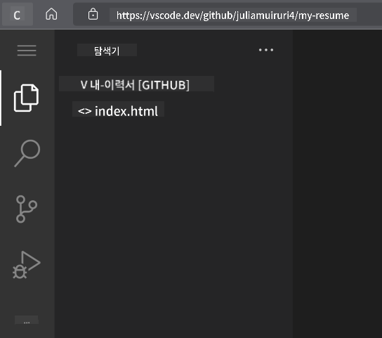

<!--
CO_OP_TRANSLATOR_METADATA:
{
  "original_hash": "bd3aa6d2b879c30ea496c43aec1c49ed",
  "translation_date": "2025-08-29T15:44:09+00:00",
  "source_file": "8-code-editor/1-using-a-code-editor/assignment.md",
  "language_code": "ko"
}
-->
# vscode.dev을 사용하여 이력서 웹사이트 만들기

_채용 담당자가 이력서를 요청했을 때 URL을 보내주는 게 얼마나 멋질까요?_ 😎

<!----
TODO: 선택적 이미지 추가

> [Author name](https://example.com)의 스케치노트
---->

<!---
## 강의 전 퀴즈
[강의 전 퀴즈](https://ff-quizzes.netlify.app/web/quiz/3)
---->

## 목표

이 과제를 완료한 후, 다음을 배울 수 있습니다:

- 이력서를 보여주는 웹사이트 만들기

### 사전 준비

1. GitHub 계정. [GitHub](https://github.com/)으로 이동하여 아직 계정이 없다면 계정을 만드세요.

## 단계

**1단계:** 새 GitHub 저장소를 만들고 이름을 `my-resume`로 지정하세요.

**2단계:** 저장소에 `index.html` 파일을 만드세요. github.com에서 파일을 추가해야 합니다. 빈 저장소는 vscode.dev에서 열 수 없기 때문입니다.

`새 파일 만들기` 링크를 클릭하고 파일 이름을 `index.html`로 입력한 후 `새 파일 커밋` 버튼을 선택하세요.


**3단계:** [VSCode.dev](https://vscode.dev)를 열고 `원격 저장소 열기` 버튼을 선택하세요.

방금 만든 이력서 사이트 저장소의 URL을 복사하여 입력 상자에 붙여넣으세요.

_`your-username`을 자신의 GitHub 사용자 이름으로 바꾸세요._

```
https://github.com/your-username/my-resume
```

✅ 성공하면 브라우저의 텍스트 편집기에서 프로젝트와 `index.html` 파일이 열립니다.



**4단계:** `index.html` 파일을 열고 아래 코드를 코드 영역에 붙여넣고 저장하세요.

<details>
    <summary><b>이력서 웹사이트의 콘텐츠를 담당하는 HTML 코드.</b></summary>
    
        <html>

            <head>
                <link href="style.css" rel="stylesheet">
                <link rel="stylesheet" href="https://cdnjs.cloudflare.com/ajax/libs/font-awesome/5.15.4/css/all.min.css">
                <title>여기에 이름을 입력하세요!</title>
            </head>
            <body>
                <header id="header">
                    <!-- 이력서 헤더: 이름과 직함 -->
                    <h1>여기에 이름을 입력하세요!</h1>
                    <hr>
                    당신의 역할!
                    <hr>
                </header>
                <main>
                    <article id="mainLeft">
                        <section>
                            <h2>연락처</h2>
                            <!-- 연락처 정보 및 소셜 미디어 -->
                            <p>
                                <i class="fa fa-envelope" aria-hidden="true"></i>
                                <a href="mailto:username@domain.top-level domain">여기에 이메일을 입력하세요</a>
                            </p>
                            <p>
                                <i class="fab fa-github" aria-hidden="true"></i>
                                <a href="github.com/yourGitHubUsername">여기에 사용자 이름을 입력하세요!</a>
                            </p>
                            <p>
                                <i class="fab fa-linkedin" aria-hidden="true"></i>
                                <a href="linkedin.com/yourLinkedInUsername">여기에 사용자 이름을 입력하세요!</a>
                            </p>
                        </section>
                        <section>
                            <h2>기술</h2>
                            <!-- 당신의 기술 -->
                            <ul>
                                <li>기술 1!</li>
                                <li>기술 2!</li>
                                <li>기술 3!</li>
                                <li>기술 4!</li>
                            </ul>
                        </section>
                        <section>
                            <h2>학력</h2>
                            <!-- 당신의 학력 -->
                            <h3>여기에 과정을 입력하세요!</h3>
                            <p>
                                여기에 기관 이름을 입력하세요!
                            </p>
                            <p>
                                시작 - 종료 날짜
                            </p>
                        </section>            
                    </article>
                    <article id="mainRight">
                        <section>
                            <h2>소개</h2>
                            <!-- 당신에 대한 소개 -->
                            <p>자신에 대한 간단한 소개를 작성하세요!</p>
                        </section>
                        <section>
                            <h2>경력</h2>
                            <!-- 당신의 경력 -->
                            <h3>직책</h3>
                            <p>
                                여기에 조직 이름을 입력하세요 | 시작 월 – 종료 월
                            </p>
                            <ul>
                                    <li>업무 1 - 수행한 일을 작성하세요!</li>
                                    <li>업무 2 - 수행한 일을 작성하세요!</li>
                                    <li>기여의 결과/영향을 작성하세요</li>
                                    
                            </ul>
                            <h3>직책 2</h3>
                            <p>
                                여기에 조직 이름을 입력하세요 | 시작 월 – 종료 월
                            </p>
                            <ul>
                                    <li>업무 1 - 수행한 일을 작성하세요!</li>
                                    <li>업무 2 - 수행한 일을 작성하세요!</li>
                                    <li>기여의 결과/영향을 작성하세요</li>
                                    
                            </ul>
                        </section>
                    </article>
                </main>
            </body>
        </html>
</details>

HTML 코드의 _플레이스홀더 텍스트_를 자신의 이력서 세부 정보로 교체하세요.

**5단계:** My-Resume 폴더 위에 마우스를 올리고 `새 파일 ...` 아이콘을 클릭하여 프로젝트에 `style.css`와 `codeswing.json` 파일을 새로 만드세요.

**6단계:** `style.css` 파일을 열고 아래 코드를 붙여넣고 저장하세요.

<details>
        <summary><b>사이트 레이아웃을 포맷하는 CSS 코드.</b></summary>
            
            body {
                font-family: 'Segoe UI', Tahoma, Geneva, Verdana, sans-serif;
                font-size: 16px;
                max-width: 960px;
                margin: auto;
            }
            h1 {
                font-size: 3em;
                letter-spacing: .6em;
                padding-top: 1em;
                padding-bottom: 1em;
            }

            h2 {
                font-size: 1.5em;
                padding-bottom: 1em;
            }

            h3 {
                font-size: 1em;
                padding-bottom: 1em;
            }
            main { 
                display: grid;
                grid-template-columns: 40% 60%;
                margin-top: 3em;
            }
            header {
                text-align: center;
                margin: auto 2em;
            }

            section {
                margin: auto 1em 4em 2em;
            }

            i {
                margin-right: .5em;
            }

            p {
                margin: .2em auto
            }

            hr {
                border: none;
                background-color: lightgray;
                height: 1px;
            }

            h1, h2, h3 {
                font-weight: 100;
                margin-bottom: 0;
            }
            #mainLeft {
                border-right: 1px solid lightgray;
            }
            
</details>

**6단계:** `codeswing.json` 파일을 열고 아래 코드를 붙여넣고 저장하세요.

    {
    "scripts": [],
    "styles": []
    }

**7단계:** `Codeswing 확장 프로그램`을 설치하여 코드 영역에서 이력서 웹사이트를 시각화하세요.

활동 표시줄에서 _`확장 프로그램`_ 아이콘을 클릭하고 Codeswing을 입력하세요. 확장 프로그램을 선택하여 추가 정보를 로드한 후, 확장 프로그램을 설치하려면 확장된 활동 표시줄의 _파란색 설치 버튼_을 클릭하거나 코드 영역에 나타나는 설치 버튼을 사용하세요. 확장 프로그램을 설치한 직후, 프로젝트에 대한 변경 사항을 코드 영역에서 확인하세요 😃


확장 프로그램 설치 후 화면에 다음과 같은 모습이 나타납니다.


변경 사항에 만족하면 `Changes` 폴더 위에 마우스를 올리고 `+` 버튼을 클릭하여 변경 사항을 스테이징하세요.

커밋 메시지 _(프로젝트에 대해 변경한 사항에 대한 설명)_를 입력하고 `체크`를 클릭하여 변경 사항을 커밋하세요. 프로젝트 작업이 완료되면 왼쪽 상단의 햄버거 메뉴 아이콘을 선택하여 GitHub의 저장소로 돌아가세요.

축하합니다 🎉 몇 단계만에 vscode.dev을 사용하여 이력서 웹사이트를 만들었습니다.

## 🚀 도전 과제

변경 권한이 있는 원격 저장소를 열고 일부 파일을 업데이트하세요. 다음으로, 변경 사항을 포함한 새 브랜치를 만들고 Pull Request를 생성해보세요.

<!----
## 강의 후 퀴즈
[강의 후 퀴즈](https://ff-quizzes.netlify.app/web/quiz/4)
---->

## 복습 및 자기 학습

[VSCode.dev](https://code.visualstudio.com/docs/editor/vscode-web?WT.mc_id=academic-0000-alfredodeza) 및 기타 기능에 대해 더 읽어보세요.

---

**면책 조항**:  
이 문서는 AI 번역 서비스 [Co-op Translator](https://github.com/Azure/co-op-translator)를 사용하여 번역되었습니다. 정확성을 위해 최선을 다하고 있으나, 자동 번역에는 오류나 부정확성이 포함될 수 있습니다. 원본 문서의 원어 버전을 권위 있는 출처로 간주해야 합니다. 중요한 정보의 경우, 전문적인 인간 번역을 권장합니다. 이 번역 사용으로 인해 발생하는 오해나 잘못된 해석에 대해 책임을 지지 않습니다.