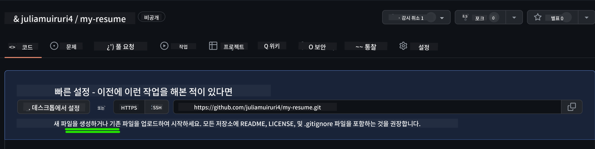
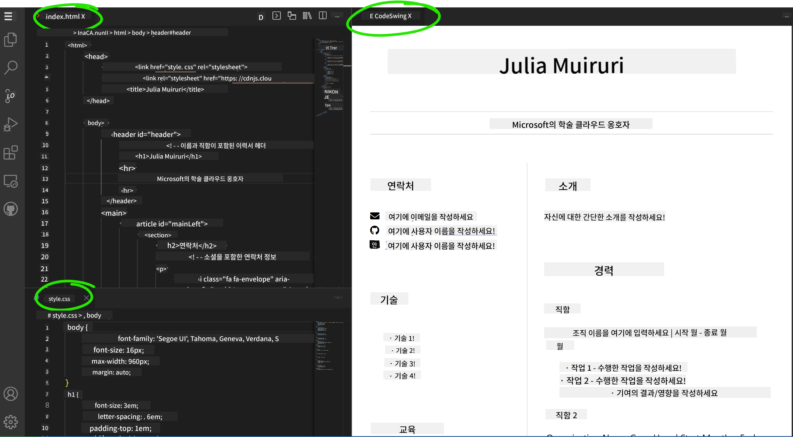

<!--
CO_OP_TRANSLATOR_METADATA:
{
  "original_hash": "effe56ba51c38d7bdfad1ea38288666b",
  "translation_date": "2026-01-06T14:58:19+00:00",
  "source_file": "8-code-editor/1-using-a-code-editor/assignment.md",
  "language_code": "ko"
}
-->
# VSCode.dev를 사용하여 이력서 웹사이트 만들기

인터랙티브하고 현대적인 형식으로 여러분의 기술과 경력을 보여주는 전문 이력서 웹사이트를 만들어 경력 전망을 향상시키세요. 전통적인 PDF 대신, 채용 담당자에게 여러분의 자격과 웹 개발 능력을 모두 보여주는 세련되고 반응형인 웹사이트를 제공하는 것을 상상해 보세요.

이 실습 과제는 여러분의 모든 VSCode.dev 기술을 실전에 적용하면서 진정으로 유용한 결과물을 만듭니다. 브라우저 내에서 리포지토리 생성부터 배포까지 완전한 웹 개발 워크플로우를 경험할 수 있습니다.

이 프로젝트를 완료하면 잠재적인 고용주와 쉽게 공유할 수 있고, 기술이 성장함에 따라 업데이트할 수 있으며, 개인 브랜드에 맞게 맞춤화할 수 있는 전문적인 온라인 존재감을 갖게 됩니다. 이것이 바로 실제 웹 개발 능력을 입증하는 실용적인 프로젝트입니다.

## 학습 목표

이 과제를 완료하면 다음을 할 수 있습니다:

- **VSCode.dev을 사용하여** 완전한 웹 개발 프로젝트 생성 및 관리
- **시맨틱 HTML 요소를 사용하여** 전문적인 웹사이트 구조화
- **현대적인 CSS 기법으로** 반응형 레이아웃 스타일링
- **기본 웹 기술을 활용하여** 인터랙티브한 기능 구현
- **공유 가능한 URL로** 라이브 웹사이트 배포
- **개발 과정 전반에 걸쳐** 버전 관리 모범 사례 시연

## 사전 준비 사항

이 과제를 시작하기 전에 다음을 준비하세요:

- GitHub 계정 (필요 시 [github.com](https://github.com/)에서 만드세요)
- VSCode.dev 인터페이스 탐색 및 기본 작업을 다룬 수업 이수
- HTML 구조와 CSS 스타일링 기본 개념 이해

## 프로젝트 설정 및 리포지토리 생성

먼저 프로젝트 기초를 설정해봅시다. 이는 실제 개발 워크플로우와 유사하며, 적절한 리포지토리 초기화와 구조 계획으로 시작합니다.

### 1단계: GitHub 리포지토리 생성

전용 리포지토리 설정으로 프로젝트를 효과적으로 관리하고 버전 관리를 시작할 수 있습니다.

1. [GitHub.com](https://github.com) 으로 이동하여 로그인하세요
2. 오른쪽 상단의 초록색 "New" 버튼 또는 "+" 아이콘을 클릭하세요
3. 리포지토리 이름을 `my-resume` (또는 `john-smith-resume` 같이 개인화된 이름으로) 지정하세요
4. 간단한 설명 추가: "HTML 및 CSS로 만든 전문 이력서 웹사이트"
5. "Public"을 선택하여 잠재 고용주가 접근 가능하게 만드세요
6. "Add a README file"을 체크하여 초기 프로젝트 설명 파일을 만드세요
7. "Create repository"를 클릭하여 설정을 완료하세요

> 💡 **리포지토리 이름 팁**: 프로젝트 목적을 명확히 알 수 있도록 설명적이고 전문적인 이름을 사용하세요. 이는 고용주와 공유하거나 포트폴리오 검토 시 유용합니다.

### 2단계: 프로젝트 구조 초기화

VSCode.dev는 리포지토리에 최소한 하나의 파일이 있어야 열리므로, GitHub에서 직접 메인 HTML 파일을 먼저 만들어 봅시다.

1. 새 리포지토리에서 "creating a new file" 링크를 클릭하세요
2. 파일 이름으로 `index.html`을 입력하세요
3. 다음 기본 HTML 구조를 추가하세요:

```html
<!DOCTYPE html>
<html lang="en">
<head>
    <meta charset="UTF-8">
    <meta name="viewport" content="width=device-width, initial-scale=1.0">
    <title>Your Name - Professional Resume</title>
</head>
<body>
    <h1>Your Name</h1>
    <p>Professional Resume Website</p>
</body>
</html>
```

4. 커밋 메시지로 "Add initial HTML structure"를 작성하세요
5. "Commit new file" 버튼을 클릭하여 변경 사항을 저장하세요



**이 초기 설정을 통해 달성되는 것:**
- 시맨틱 요소를 활용한 올바른 HTML5 문서 구조 수립
- 반응형 디자인 호환을 위한 viewport 메타 태그 포함
- 브라우저 탭에 나타나는 설명적인 페이지 제목 설정
- 전문적인 콘텐츠 구성의 기반 마련

## VSCode.dev에서 작업하기

리포지토리 기반이 마련되었으니, 본격적인 개발은 웹 기반 편집기인 VSCode.dev로 전환합니다. 이 환경은 전문 웹 개발에 필요한 모든 도구를 제공합니다.

### 3단계: VSCode.dev에서 프로젝트 열기

1. 새로운 브라우저 탭에서 [vscode.dev](https://vscode.dev)로 이동하세요
2. 환영 화면에서 "Open Remote Repository"를 클릭하세요
3. GitHub에서 복사한 리포지토리 URL을 입력란에 붙여넣으세요

   형식: `https://github.com/your-username/my-resume`
   
   *여기서 `your-username`을 실제 GitHub 사용자명으로 대체하세요*

4. Enter 키를 눌러 프로젝트를 불러오세요

✅ **성공 표시**: 탐색기 사이드바에 프로젝트 파일들이 나타나고, `index.html`을 편집할 수 있는 화면이 보입니다.


**인터페이스에서 볼 수 있는 것:**
- **탐색기 사이드바**: 리포지토리 파일과 폴더 구조 표시
- **편집기 영역**: 선택한 파일 내용을 편집 가능
- **활동 바**: 소스 제어, 확장 기능 등 접근 가능
- **상태 표시줄**: 연결 상태와 현재 브랜치 정보 표시

### 4단계: 이력서 콘텐츠 작성

`index.html`에 있는 플레이스홀더 내용을 여러분의 종합적인 이력서 구조로 교체하세요. 이 HTML은 자격을 전문적으로 보여줄 수 있는 기본 토대입니다.

<details>
<summary><b>완성된 HTML 이력서 구조</b></summary>

```html
<!DOCTYPE html>
<html lang="en">
<head>
    <meta charset="UTF-8">
    <meta name="viewport" content="width=device-width, initial-scale=1.0">
    <link href="style.css" rel="stylesheet">
    <link rel="stylesheet" href="https://cdnjs.cloudflare.com/ajax/libs/font-awesome/5.15.4/css/all.min.css">
    <title>Your Name - Professional Resume</title>
</head>
<body>
    <header id="header">
        <h1>Your Full Name</h1>
        <hr>
        <p class="role">Your Professional Title</p>
        <hr>
    </header>
    
    <main>
        <article id="mainLeft">
            <section>
                <h2>CONTACT</h2>
                <p>
                    <i class="fa fa-envelope" aria-hidden="true"></i>
                    <a href="mailto:your.email@domain.com">your.email@domain.com</a>
                </p>
                <p>
                    <i class="fab fa-github" aria-hidden="true"></i>
                    <a href="https://github.com/your-username">github.com/your-username</a>
                </p>
                <p>
                    <i class="fab fa-linkedin" aria-hidden="true"></i>
                    <a href="https://linkedin.com/in/your-profile">linkedin.com/in/your-profile</a>
                </p>
            </section>
            
            <section>
                <h2>SKILLS</h2>
                <ul>
                    <li>HTML5 & CSS3</li>
                    <li>JavaScript (ES6+)</li>
                    <li>Responsive Web Design</li>
                    <li>Version Control (Git)</li>
                    <li>Problem Solving</li>
                </ul>
            </section>
            
            <section>
                <h2>EDUCATION</h2>
                <h3>Your Degree or Certification</h3>
                <p>Institution Name</p>
                <p>Start Date - End Date</p>
            </section>
        </article>
        
        <article id="mainRight">
            <section>
                <h2>ABOUT</h2>
                <p>Write a compelling summary that highlights your passion for web development, key achievements, and career goals. This section should give employers insight into your personality and professional approach.</p>
            </section>
            
            <section>
                <h2>WORK EXPERIENCE</h2>
                <div class="job">
                    <h3>Job Title</h3>
                    <p class="company">Company Name | Start Date – End Date</p>
                    <ul>
                        <li>Describe a key accomplishment or responsibility</li>
                        <li>Highlight specific skills or technologies used</li>
                        <li>Quantify impact where possible (e.g., "Improved efficiency by 25%")</li>
                    </ul>
                </div>
                
                <div class="job">
                    <h3>Previous Job Title</h3>
                    <p class="company">Previous Company | Start Date – End Date</p>
                    <ul>
                        <li>Focus on transferable skills and achievements</li>
                        <li>Demonstrate growth and learning progression</li>
                        <li>Include any leadership or collaboration experiences</li>
                    </ul>
                </div>
            </section>
            
            <section>
                <h2>PROJECTS</h2>
                <div class="project">
                    <h3>Project Name</h3>
                    <p>Brief description of what the project accomplishes and technologies used.</p>
                    <a href="#" target="_blank">View Project</a>
                </div>
            </section>
        </article>
    </main>
</body>
</html>
```
</details>

**맞춤화 지침:**
- 모든 플레이스홀더 텍스트를 실제 정보로 교체하세요
- 경력 수준과 목표에 따라 섹션을 조정하세요
- 필요에 따라 섹션을 추가하거나 제거하세요 (예: 자격증, 자원봉사, 사용 언어)
- 실제 프로필과 프로젝트 링크를 포함하세요

### 5단계: 지원 파일 생성

전문 웹사이트는 체계적인 파일 구조가 필요합니다. 스타일시트와 설정 파일을 만듭니다.

1. 탐색기 사이드바에서 프로젝트 폴더 이름에 마우스를 올리세요
2. 나타나는 "New File" 아이콘(📄+)을 클릭하세요
3. 각 파일을 차례대로 생성하세요:
   - `style.css` (스타일 및 레이아웃용)
   - `codeswing.json` (미리보기 확장기능 설정용)

**CSS 파일(`style.css`) 생성:**

<details>
<summary><b>전문가용 CSS 스타일링</b></summary>

```css
/* Modern Resume Styling */
body {
    font-family: 'Segoe UI', Tahoma, Geneva, Verdana, sans-serif;
    font-size: 16px;
    line-height: 1.6;
    max-width: 960px;
    margin: 0 auto;
    padding: 20px;
    color: #333;
    background-color: #f9f9f9;
}

/* Header Styling */
header {
    text-align: center;
    margin-bottom: 3em;
    padding: 2em;
    background: linear-gradient(135deg, #667eea 0%, #764ba2 100%);
    color: white;
    border-radius: 10px;
    box-shadow: 0 4px 6px rgba(0, 0, 0, 0.1);
}

h1 {
    font-size: 3em;
    letter-spacing: 0.1em;
    margin-bottom: 0.2em;
    font-weight: 300;
}

.role {
    font-size: 1.3em;
    font-weight: 300;
    margin: 1em 0;
}

/* Main Content Layout */
main {
    display: grid;
    grid-template-columns: 35% 65%;
    gap: 3em;
    margin-top: 3em;
    background: white;
    padding: 2em;
    border-radius: 10px;
    box-shadow: 0 2px 10px rgba(0, 0, 0, 0.1);
}

/* Typography */
h2 {
    font-size: 1.4em;
    font-weight: 600;
    margin-bottom: 1em;
    color: #667eea;
    border-bottom: 2px solid #667eea;
    padding-bottom: 0.3em;
}

h3 {
    font-size: 1.1em;
    font-weight: 600;
    margin-bottom: 0.5em;
    color: #444;
}

/* Section Styling */
section {
    margin-bottom: 2.5em;
}

#mainLeft {
    border-right: 1px solid #e0e0e0;
    padding-right: 2em;
}

/* Contact Links */
section a {
    color: #667eea;
    text-decoration: none;
    transition: color 0.3s ease;
}

section a:hover {
    color: #764ba2;
    text-decoration: underline;
}

/* Icons */
i {
    margin-right: 0.8em;
    width: 20px;
    text-align: center;
    color: #667eea;
}

/* Lists */
ul {
    list-style: none;
    padding-left: 0;
}

li {
    margin: 0.5em 0;
    padding: 0.3em 0;
    position: relative;
}

li:before {
    content: "▸";
    color: #667eea;
    margin-right: 0.5em;
}

/* Work Experience */
.job, .project {
    margin-bottom: 2em;
    padding-bottom: 1.5em;
    border-bottom: 1px solid #f0f0f0;
}

.company {
    font-style: italic;
    color: #666;
    margin-bottom: 0.5em;
}

/* Responsive Design */
@media (max-width: 768px) {
    main {
        grid-template-columns: 1fr;
        gap: 2em;
    }
    
    #mainLeft {
        border-right: none;
        border-bottom: 1px solid #e0e0e0;
        padding-right: 0;
        padding-bottom: 2em;
    }
    
    h1 {
        font-size: 2.2em;
    }
    
    body {
        padding: 10px;
    }
}

/* Print Styles */
@media print {
    body {
        background: white;
        color: black;
        font-size: 12pt;
    }
    
    header {
        background: none;
        color: black;
        box-shadow: none;
    }
    
    main {
        box-shadow: none;
    }
}
```
</details>

**설정 파일(`codeswing.json`) 생성:**

```json
{
    "scripts": [],
    "styles": []
}
```

**CSS 기능 설명:**
- CSS Grid를 활용한 반응형이고 전문적인 레이아웃 구조 제공
- 그라데이션 헤더 등 현대적인 색채 구성 구현
- 호버 효과 및 부드러운 전환 포함하여 인터랙티브함 강화
- 모든 기기 크기를 지원하는 반응형 디자인 적용
- PDF 생성을 위한 인쇄 친화적 스타일 포함

### 6단계: 확장 기능 설치 및 구성

확장 기능은 라이브 미리보기 기능과 향상된 워크플로우 도구를 제공하여 개발 경험을 개선합니다. 특히 CodeSwing 확장 기능은 웹 개발 프로젝트에 유용합니다.

**CodeSwing 확장 기능 설치 방법:**

1. 활동 바에서 확장 기능 아이콘(🧩) 클릭
2. 마켓플레이스 검색창에 "CodeSwing" 입력
3. 검색 결과에서 CodeSwing 확장 기능 선택
4. 파란색 "Install" 버튼 클릭


**CodeSwing이 제공하는 기능:**
- 편집하는 동안 웹사이트 라이브 미리보기 가능
- 수동 새로고침 없이 실시간 변화 반영
- HTML, CSS, JavaScript 등 여러 파일 형식 지원
- 통합 개발 환경 경험 제공

**설치 직후 결과:**
CodeSwing 설치 후 편집기에 이력서 웹사이트의 라이브 미리보기가 나타납니다. 변경사항을 실시간으로 바로 볼 수 있습니다.



**강화된 인터페이스 이해:**
- **분할 뷰**: 코드 편집 화면과 라이브 미리보기를 동시에 표시
- **실시간 업데이트**: 입력 시 즉각적 반영
- **인터랙티브 미리보기**: 링크와 상호작용 테스트 가능
- **모바일 시뮬레이션**: 반응형 디자인 테스트 기능

### 7단계: 버전 관리 및 배포

이력서 웹사이트 완성 후, Git을 사용하여 작업을 저장하고 온라인에서 사용할 수 있도록 하세요.

**변경 사항 커밋하기:**

1. 활동 바에서 소스 제어 아이콘(🌿) 클릭
2. "Changes" 섹션에서 생성 및 수정한 파일 확인
3. 각 파일 옆의 "+" 아이콘을 클릭하여 스테이지에 올리기
4. 다음과 같은 설명적 커밋 메시지 작성:
   - "Add complete resume website with responsive design"
   - "Implement professional styling and content structure"
5. 체크 표시(✓)를 클릭하여 커밋 및 푸시 완료

**효과적인 커밋 메시지 예시:**
- "Add professional resume content and styling"
- "Implement responsive design for mobile compatibility"
- "Update contact information and project links"

> 💡 **전문가 팁**: 좋은 커밋 메시지는 프로젝트 진행 상황 추적에 도움을 주며, 고용주가 중요하게 여기는 세심함을 보여줍니다.

**발행 사이트 접속:**
커밋 후 왼쪽 상단 햄버거 메뉴(☰)를 통해 GitHub 리포지토리로 돌아갈 수 있습니다. 이력서 웹사이트는 이제 버전 관리되며 배포 및 공유 준비가 완료되었습니다.

## 결과 및 다음 단계

**축하합니다! 🎉** VSCode.dev를 활용하여 전문 이력서 웹사이트를 성공적으로 만들었습니다. 이 프로젝트는 다음을 보여줍니다:

**기술 역량 입증:**
- **리포지토리 관리**: 완전한 프로젝트 구조 생성 및 조직화
- **웹 개발**: 현대 HTML5, CSS3로 반응형 웹사이트 구축
- **버전 관리**: 의미 있는 커밋을 포함한 올바른 Git 워크플로우 적용
- **툴 숙련도**: VSCode.dev 인터페이스 및 확장 시스템 효과적 사용

**전문적 성과 달성:**
- **온라인 존재감**: 자격을 보여주는 공유 가능한 URL 확보
- **현대적 형식**: 전통적인 PDF 이력서의 대안으로서 인터랙티브함 제공
- **실증 가능한 기술**: 웹 개발 능력을 명확히 보여주는 결과물
- **쉬운 업데이트**: 지속적으로 개선 및 맞춤화 가능한 토대

### 배포 옵션

이력서를 고용주가 접근할 수 있게 하려면 다음 호스팅 옵션을 고려하세요:

**GitHub Pages (권장):**
1. GitHub 리포지토리에서 Settings로 이동
2. "Pages" 섹션으로 스크롤
3. "Deploy from a branch"를 선택 후 "main" 브랜치 선택
4. 사이트는 `https://your-username.github.io/my-resume` 에서 사용 가능

**대체 플랫폼:**
- **Netlify**: 맞춤 도메인 자동 배포
- **Vercel**: 현대적인 호스팅 기능과 빠른 배포
- **GitHub Codespaces**: 내장 미리보기 기능이 포함된 개발 환경

### 기능 개선 제안

기술을 계속 발전시키려면 다음 기능을 추가해 보세요:

**기술적 향상:**
- **JavaScript 인터랙티브 기능**: 부드러운 스크롤링이나 인터랙션 요소 추가
- **다크 모드 토글**: 사용자 선호에 따른 테마 전환 구현
- **연락처 폼**: 잠재 고용주가 직접 연락할 수 있는 양식 추가
- **SEO 최적화**: 메타 태그와 구조화 데이터 추가로 검색 가시성 향상

**콘텐츠 강화:**
- **프로젝트 포트폴리오**: GitHub 리포지토리 및 라이브 데모 링크 포함
- **기술 시각화**: 진행 바나 기술 등급 시스템 생성
- **추천사 섹션**: 동료나 멘토의 추천 글 포함
- **블로그 통합**: 학습 여정을 보여주는 블로그 섹션 추가

## GitHub Copilot Agent 챌린지 🚀

에이전트 모드를 사용해 다음 챌린지를 완료하세요:

**설명:** 전문 웹 개발 역량과 현대 디자인 원칙을 보여주는 고급 기능으로 이력서 웹사이트를 향상하세요.

**프롬프트:** 기존 이력서 웹사이트에 다음 고급 기능을 구현하세요:
1. 부드러운 전환이 있는 다크/라이트 테마 토글 추가
2. 애니메이션 진행 바가 있는 인터랙티브 기술 섹션 생성
3. 폼 검증이 포함된 연락처 폼 구현
4. 호버 효과와 모달 팝업이 있는 프로젝트 포트폴리오 섹션 추가
5. 학습 여정을 담은 샘플 게시물 3개 이상의 블로그 섹션 포함
6. 적절한 메타 태그, 구조화 데이터, 성능 최적화로 SEO 강화
7. GitHub Pages 또는 Netlify로 향상된 사이트 배포
8. README.md에 모든 새 기능과 스크린샷 문서화

향상된 웹사이트는 반응형 디자인, JavaScript 상호작용, 전문 배포 워크플로우를 포함한 현대적 웹 개발 역량 숙련을 보여줘야 합니다.

## 챌린지 확장

더 높은 도전을 원한다면 다음 고급 챌린지를 시도해 보세요:

**📱 모바일 우선 재설계:** CSS Grid와 Flexbox로 모바일 우선 방식으로 사이트 완전 재구성

**🔍 SEO 최적화:** 메타 태그, 구조화 데이터, 성능 최적화를 포함한 종합 SEO 구현

**🌐 다국어 지원:** 다국어 지원을 위한 국제화 기능 추가

**📊 분석 통합:** 방문자 참여 추적 및 콘텐츠 최적화를 위한 Google Analytics 추가

**🚀 성능 최적화:** 전 카테고리에서 완벽한 Lighthouse 점수 달성

## 복습 및 자기 학습

다음 자료로 지식을 확장하세요:

**고급 VSCode.dev 기능:**
- [VSCode.dev 문서](https://code.visualstudio.com/docs/editor/vscode-web?WT.mc_id=academic-0000-alfredodeza) - 웹 기반 편집의 완전한 가이드
- [GitHub Codespaces](https://docs.github.com/en/codespaces) - 클라우드 개발 환경

**웹 개발 모범 사례:**
- **반응형 디자인**: 모던 레이아웃을 위한 CSS Grid와 Flexbox 학습
- **접근성**: 포용적인 웹 디자인을 위한 WCAG 가이드라인 학습
- **성능**: 최적화를 위한 Lighthouse와 같은 도구 탐색
- **SEO**: 검색 엔진 최적화 기본 이해

**전문성 개발:**
- **포트폴리오 구축**: 다양한 기술을 보여줄 추가 프로젝트 생성
- **오픈 소스**: 협업 경험을 쌓기 위해 기존 프로젝트에 기여
- **네트워킹**: 개발자 커뮤니티에서 이력서 웹사이트 공유하여 피드백 받기
- **지속적 학습**: 웹 개발 동향과 기술 최신 상태 유지

---

**다음 단계:** 이력서 웹사이트를 친구, 가족 또는 멘토와 공유하여 피드백을 받으세요. 그들의 제안을 사용해 반복해서 디자인을 개선하세요. 이 프로젝트는 단순한 이력서가 아니라 웹 개발자로서 성장하는 모습을 보여주는 시연임을 기억하세요!

---

<!-- CO-OP TRANSLATOR DISCLAIMER START -->
**면책 조항**:  
이 문서는 AI 번역 서비스 [Co-op Translator](https://github.com/Azure/co-op-translator)를 사용하여 번역되었습니다. 정확성을 위해 최선을 다하고 있으나, 자동 번역은 오류나 부정확성이 포함될 수 있음을 유의하시기 바랍니다. 원본 문서가 권위 있는 출처로 간주되어야 합니다. 중요한 정보의 경우 전문적인 인간 번역을 권장합니다. 본 번역의 사용으로 인해 발생하는 오해나 잘못된 해석에 대해 당사는 책임을 지지 않습니다.
<!-- CO-OP TRANSLATOR DISCLAIMER END -->