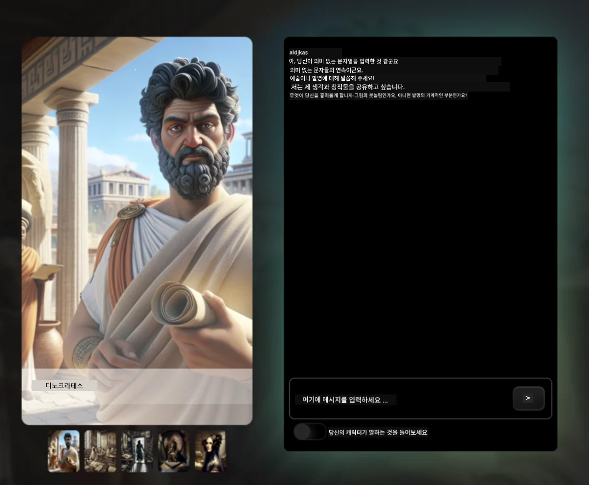
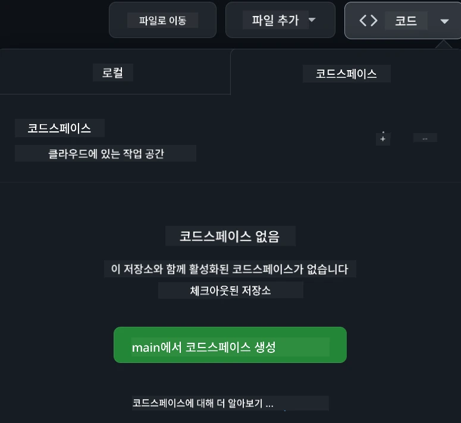

[](https://github.com/microsoft/Web-Dev-For-Beginners/blob/master/LICENSE)
[](https://GitHub.com/microsoft/Web-Dev-For-Beginners/graphs/contributors/)
[](https://GitHub.com/microsoft/Web-Dev-For-Beginners/issues/)
[](https://GitHub.com/microsoft/Web-Dev-For-Beginners/pulls/)
[](http://makeapullrequest.com)

[](https://GitHub.com/microsoft/Web-Dev-For-Beginners/watchers/)
[](https://GitHub.com/microsoft/Web-Dev-For-Beginners/network/)
[](https://GitHub.com/microsoft/Web-Dev-For-Beginners/stargazers/)

[](https://discord.gg/nTYy5BXMWG)

# 웹 개발 초보자를 위한 커리큘럼

Microsoft Cloud Advocates가 제공하는 12주간의 종합 코스와 함께 웹 개발의 기초를 배우세요. 24개의 각 레슨에서는 테라리움, 브라우저 확장 프로그램, 우주 게임 등 다양한 실습 프로젝트를 통해 JavaScript, CSS, HTML을 탐구합니다. 퀴즈, 토론, 실용 과제에 참여하세요. 효과적인 프로젝트 기반 교육법으로 기술을 향상시키고 지식 습득을 최적화하세요. 오늘 바로 코딩 여정을 시작하세요!

Azure AI Foundry Discord 커뮤니티에 참여하세요

[](https://discord.gg/nTYy5BXMWG)

이 리소스들을 사용하기 위해 다음 단계를 따르세요:
1. **저장소 포크하기**: 클릭 [](https://GitHub.com/microsoft/Web-Dev-For-Beginners/fork)
2. **저장소 클론하기**:   `git clone https://github.com/microsoft/Web-Dev-For-Beginners.git`
3. [**Azure AI Foundry Discord에 가입하여 전문가 및 개발자 동료를 만나보세요**](https://discord.com/invite/ByRwuEEgH4)

### 🌐 다국어 지원

#### GitHub Action을 통한 지원 (자동 및 항상 최신 상태 유지)

<!-- CO-OP TRANSLATOR LANGUAGES TABLE START -->
[Arabic](../ar/README.md) | [Bengali](../bn/README.md) | [Bulgarian](../bg/README.md) | [Burmese (Myanmar)](../my/README.md) | [Chinese (Simplified)](../zh-CN/README.md) | [Chinese (Traditional, Hong Kong)](../zh-HK/README.md) | [Chinese (Traditional, Macau)](../zh-MO/README.md) | [Chinese (Traditional, Taiwan)](../zh-TW/README.md) | [Croatian](../hr/README.md) | [Czech](../cs/README.md) | [Danish](../da/README.md) | [Dutch](../nl/README.md) | [Estonian](../et/README.md) | [Finnish](../fi/README.md) | [French](../fr/README.md) | [German](../de/README.md) | [Greek](../el/README.md) | [Hebrew](../he/README.md) | [Hindi](../hi/README.md) | [Hungarian](../hu/README.md) | [Indonesian](../id/README.md) | [Italian](../it/README.md) | [Japanese](../ja/README.md) | [Kannada](../kn/README.md) | [Korean](./README.md) | [Lithuanian](../lt/README.md) | [Malay](../ms/README.md) | [Malayalam](../ml/README.md) | [Marathi](../mr/README.md) | [Nepali](../ne/README.md) | [Nigerian Pidgin](../pcm/README.md) | [Norwegian](../no/README.md) | [Persian (Farsi)](../fa/README.md) | [Polish](../pl/README.md) | [Portuguese (Brazil)](../pt-BR/README.md) | [Portuguese (Portugal)](../pt-PT/README.md) | [Punjabi (Gurmukhi)](../pa/README.md) | [Romanian](../ro/README.md) | [Russian](../ru/README.md) | [Serbian (Cyrillic)](../sr/README.md) | [Slovak](../sk/README.md) | [Slovenian](../sl/README.md) | [Spanish](../es/README.md) | [Swahili](../sw/README.md) | [Swedish](../sv/README.md) | [Tagalog (Filipino)](../tl/README.md) | [Tamil](../ta/README.md) | [Telugu](../te/README.md) | [Thai](../th/README.md) | [Turkish](../tr/README.md) | [Ukrainian](../uk/README.md) | [Urdu](../ur/README.md) | [Vietnamese](../vi/README.md)

> **로컬에서 클론하는 게 더 편하세요?**

> 이 저장소는 50개 이상의 언어 번역을 포함하여 다운로드 크기가 상당히 큽니다. 번역 없이 클론하려면 sparse checkout을 사용하세요:
> ```bash
> git clone --filter=blob:none --sparse https://github.com/microsoft/Web-Dev-For-Beginners.git
> cd Web-Dev-For-Beginners
> git sparse-checkout set --no-cone '/*' '!translations' '!translated_images'
> ```
> 이렇게 하면 훨씬 빠른 다운로드로 코스를 완료하는 데 필요한 모든 것을 얻을 수 있습니다.
<!-- CO-OP TRANSLATOR LANGUAGES TABLE END -->

**추가 번역 언어를 원하시면 지원 가능한 언어 목록을 [여기](https://github.com/Azure/co-op-translator/blob/main/getting_started/supported-languages.md)에서 확인하세요**

[](https://open.vscode.dev/microsoft/Web-Dev-For-Beginners)

#### 🧑‍🎓 _학생이신가요?_

[**Student Hub 페이지**](https://docs.microsoft.com/learn/student-hub/?WT.mc_id=academic-77807-sagibbon)를 방문하세요. 초보자용 자료, 학생 패키지, 무료 증명서 바우처 신청 방법 등이 제공됩니다. 이 페이지를 즐겨찾기에 추가하고 정기적으로 확인하세요. 매월 콘텐츠가 교체됩니다.

### 📣 공지 – 완료할 새로운 GitHub Copilot 에이전트 모드 챌린지!

새로운 챌린지가 추가되었습니다. 대부분의 챕터에서 "GitHub Copilot Agent Challenge 🚀"를 찾아보세요. GitHub Copilot과 에이전트 모드를 사용해 완료할 새로운 도전과제입니다. 에이전트 모드는 단순한 텍스트 생성뿐 아니라 파일 생성 및 편집, 명령 실행 등도 할 수 있습니다.

### 📣 공지 – _생성 AI를 활용해 새 프로젝트 만들기_

새 AI 어시스턴트 프로젝트가 추가되었습니다. 프로젝트를 확인하세요 [project](./9-chat-project/README.md)

### 📣 공지 – _JavaScript용 생성 AI에 관한 새로운 커리큘럼_ 출시

새로운 생성 AI 커리큘럼을 놓치지 마세요!

시작하려면 [https://aka.ms/genai-js-course](https://aka.ms/genai-js-course)를 방문하세요!


- 기본부터 RAG까지 모든 내용을 다루는 레슨
- GenAI와 동반 앱을 사용해 역사적 인물과 상호작용
- 재미있고 몰입도 높은 스토리, 시간 여행 체험!




각 레슨에는 과제 완료, 지식 점검, 다음과 같은 학습 주제를 안내하는 도전과제가 포함됩니다:
- 프롬프트 및 프롬프트 엔지니어링
- 텍스트 및 이미지 앱 생성
- 검색 앱

시작하려면 [https://aka.ms/genai-js-course](../../[https:/aka.ms/genai-js-course)를 방문하세요!


## 🌱 시작하기

> **교사 여러분**, 이 커리큘럼을 어떻게 사용할지에 대한 [제안사항](for-teachers.md)이 포함되어 있습니다. [토론 게시판](https://github.com/microsoft/Web-Dev-For-Beginners/discussions/categories/teacher-corner)에서 의견을 들려주세요!

**[학습자 여러분](https://aka.ms/student-page/?WT.mc_id=academic-77807-sagibbon)**, 각 레슨마다 사전 퀴즈부터 시작해 강의 자료를 읽고 다양한 활동을 완료한 후, 사후 퀴즈로 이해도를 확인하세요.

학습 효과를 높이기 위해 동료와 함께 프로젝트를 진행하고 토론에 참여하세요! [토론 게시판](https://github.com/microsoft/Web-Dev-For-Beginners/discussions)에서 토론이 활발히 이루어지며, 운영진이 질문에 답변합니다.

추가 학습을 위해 [Microsoft Learn](https://learn.microsoft.com/users/wirelesslife/collections/p1ddcy5jwy0jkm?WT.mc_id=academic-77807-sagibbon)에서 보조 자료를 탐색하는 것도 적극 권장합니다.

### 📋 환경 설정

이 커리큘럼은 바로 사용할 수 있는 개발 환경을 제공합니다! 시작할 때 [Codespace](https://github.com/features/codespaces/) (_브라우저 기반, 별도 설치 불필요한 환경_)에서 실행하거나, 로컬 컴퓨터에 텍스트 편집기(예: [Visual Studio Code](https://code.visualstudio.com/?WT.mc_id=academic-77807-sagibbon))를 설치하여 실행할 수 있습니다.

#### 저장소 생성하기
작업을 편리하게 저장하려면 본인의 복사본 저장소를 만드는 것을 권장합니다. 페이지 상단의 **Use this template** 버튼을 클릭하면 커리큘럼 사본이 본인의 GitHub 계정에 새 저장소로 생성됩니다.

다음 단계를 수행하세요:
1. **저장소 포크하기**: 이 페이지 우측 상단의 "Fork" 버튼을 클릭하세요.
2. **저장소 클론하기**:   `git clone https://github.com/microsoft/Web-Dev-For-Beginners.git`

#### Codespace에서 커리큘럼 실행하기

생성한 본인 저장소에서 **Code** 버튼을 클릭하고 **Open with Codespaces**를 선택하세요. 새 Codespace가 생성되어 작업할 수 있습니다.



#### 로컬 컴퓨터에서 커리큘럼 실행하기

로컬 컴퓨터에서 이 커리큘럼을 실행하려면 텍스트 편집기, 브라우저, 명령줄 도구가 필요합니다. 첫 번째 레슨 [프로그램 언어 및 도구 소개](../../1-getting-started-lessons/1-intro-to-programming-languages)에서는 각 도구의 다양한 옵션을 안내해 자신에게 적합한 것을 선택할 수 있습니다.

편집기로는 [Visual Studio Code](https://code.visualstudio.com/?WT.mc_id=academic-77807-sagibbon)를 추천합니다. 이 편집기에는 내장된 [터미널](https://code.visualstudio.com/docs/terminal/basics/?WT.mc_id=academic-77807-sagibbon)도 포함되어 있습니다. Visual Studio Code는 [여기](https://code.visualstudio.com/?WT.mc_id=academic-77807-sagibbon)에서 다운로드할 수 있습니다.


1. 저장소를 컴퓨터에 클론하세요. **Code** 버튼을 클릭하고 URL을 복사하면 됩니다:

    [CodeSpace](./images/createcodespace.png)
그런 다음 [Visual Studio Code](https://code.visualstudio.com/?WT.mc_id=academic-77807-sagibbon) 내에서 [터미널](https://code.visualstudio.com/docs/terminal/basics/?WT.mc_id=academic-77807-sagibbon)을 열고, 방금 복사한 URL로 `<your-repository-url>`를 바꿔서 다음 명령어를 실행하세요:

    ```bash 
    git clone <your-repository-url>
    ```

2. Visual Studio Code에서 폴더를 엽니다. **파일** > **폴더 열기**를 클릭한 후 방금 복제한 폴더를 선택하여 열 수 있습니다.


>  추천하는 Visual Studio Code 확장 프로그램:
>
> * [Live Server](https://marketplace.visualstudio.com/items?itemName=ritwickdey.LiveServer&WT.mc_id=academic-77807-sagibbon) - Visual Studio Code 내에서 HTML 페이지 미리보기용
> * [Copilot](https://marketplace.visualstudio.com/items?itemName=GitHub.copilot&WT.mc_id=academic-77807-sagibbon) - 코드를 더 빠르게 작성하도록 도와줌

## 📂 각 수업에는 다음이 포함됩니다:

- 선택적 스케치노트
- 선택적 보조 비디오
- 수업 전 워밍업 퀴즈
- 글로 된 수업 내용
- 프로젝트 기반 수업의 경우, 프로젝트를 만드는 단계별 가이드
- 지식 점검
- 도전 과제
- 보조 읽기 자료
- 과제
- [수업 후 퀴즈](https://ff-quizzes.netlify.app/web/)

> **퀴즈에 대한 안내**: 모든 퀴즈는 Quiz-app 폴더에 들어 있으며, 각 3문항으로 총 48개 퀴즈가 있습니다. [여기](https://ff-quizzes.netlify.app/web/)에서 확인할 수 있고 퀴즈 앱은 로컬에서 실행하거나 Azure에 배포할 수 있습니다; `quiz-app` 폴더 내 지침을 따라서 진행하세요.

## 🗃️ 수업 목록

|     |                       프로젝트 이름                       |                            가르치는 개념                             | 학습 목표                                                                                                                 |                                                         연결된 수업                                                          |         저자          |
| :-: | :------------------------------------------------------: | :------------------------------------------------------------------: | ------------------------------------------------------------------------------------------------------------------------- | :----------------------------------------------------------------------------------------------------------------------------: | :-------------------: |
| 01  |                     시작하기                      |           프로그래밍 소개 및 작업 도구           | 대부분 프로그래밍 언어의 기본 개념과 전문 개발자가 업무를 수행할 때 사용하는 소프트웨어에 대해 배우기 | [프로그래밍 언어와 작업 도구 소개](./1-getting-started-lessons/1-intro-to-programming-languages/README.md) |         Jasmine         |
| 02  |                     시작하기                      |             GitHub 기본, 팀 작업 포함             | 프로젝트에서 GitHub 사용법과 코드 베이스에서 팀 협업하는 방법                                                    |                            [GitHub 소개](./1-getting-started-lessons/2-github-basics/README.md)                             |          Floor          |
| 03  |                     시작하기                      |                             접근성                              | 웹 접근성 기본 사항 학습                                                                                               |                       [접근성 기본](./1-getting-started-lessons/3-accessibility/README.md)                       |       Christopher       |
| 04  |                        JS 기초                         |                         JavaScript 데이터 타입                          | JavaScript 데이터 타입 기초                                                                                                 |                                       [데이터 타입](./2-js-basics/1-data-types/README.md)                                        |         Jasmine         |
| 05  |                        JS 기초                         |                         함수와 메서드                          | 애플리케이션의 로직 흐름을 관리하는 함수와 메서드를 배우기                                                             |                              [함수와 메서드](./2-js-basics/2-functions-methods/README.md)                               | Jasmine and Christopher |
| 06  |                        JS 기초                         |                        JS로 의사 결정 만들기                        | 조건문을 사용하는 의사 결정 방법을 배우기                                                           |                                 [의사 결정 만들기](./2-js-basics/3-making-decisions/README.md)                                  |         Jasmine         |
| 07  |                        JS 기초                         |                            배열과 반복문                            | JavaScript에서 배열과 반복문을 사용하여 데이터 다루기                                                                                 |                                   [배열과 반복문](./2-js-basics/4-arrays-loops/README.md)                                    |         Jasmine         |
| 08  |       [테라리움](./3-terrarium/solution/README.md)       |                            HTML 실습                            | 온라인 테라리움을 만들기 위한 HTML 작성, 레이아웃 구성에 중점                                                         |                                 [HTML 소개](./3-terrarium/1-intro-to-html/README.md)                                 |           Jen           |
| 09  |       [테라리움](./3-terrarium/solution/README.md)       |                            CSS 실습                             | 온라인 테라리움을 스타일링하는 CSS 작성, 반응형 페이지 만들기 기초 포함                     |                                  [CSS 소개](./3-terrarium/2-intro-to-css/README.md)                                  |           Jen           |
| 10  |            [테라리움](./3-terrarium/solution/README.md)            |                 JavaScript 클로저, DOM 조작                  | 테라리움을 드래그 앤 드롭 인터페이스로 기능 구현, 클로저와 DOM 조작에 중점             |                  [JavaScript 클로저, DOM 조작](./3-terrarium/3-intro-to-DOM-and-closures/README.md)                   |           Jen           |
| 11  |          [타이핑 게임](./4-typing-game/solution/README.md)          |                          타이핑 게임 만들기                           | 키보드 이벤트를 이용해 JavaScript 앱의 로직을 운용하는 방법                                                          |                                [이벤트 기반 프로그래밍](./4-typing-game/typing-game/README.md)                                |       Christopher       |
| 12  | [그린 브라우저 확장](./5-browser-extension/solution/README.md) |                         브라우저 작동 원리                          | 브라우저 작동 방식, 역사, 첫 브라우저 확장 요소의 템플릿 만드는 방법 학습                               |                               [브라우저 소개](./5-browser-extension/1-about-browsers/README.md)                                |           Jen           |
| 13  | [그린 브라우저 확장](./5-browser-extension/solution/README.md) | API 호출 및 로컬 저장소 변수 저장 | API를 호출하는 브라우저 확장기의 JavaScript 요소 작성법 학습                      |                [API, 폼, 로컬 저장소](./5-browser-extension/2-forms-browsers-local-storage/README.md)                 |           Jen           |
| 14  | [그린 브라우저 확장](./5-browser-extension/solution/README.md) |          브라우저 백그라운드 프로세스와 웹 성능          | 확장 프로그램 아이콘 관리를 위한 백그라운드 프로세스 활용법, 웹 성능 최적화에 관한 내용   |             [백그라운드 작업과 성능](./5-browser-extension/3-background-tasks-and-performance/README.md)              |           Jen           |
| 15  |           [우주 게임](./6-space-game/solution/README.md)           |             JavaScript를 활용한 고급 게임 개발             | 클래스와 컴포지션을 이용한 상속, Pub/Sub 패턴 학습, 게임 만드는 준비              |                      [고급 게임 개발 소개](./6-space-game/1-introduction/README.md)                       |          Chris          |
| 16  |           [우주 게임](./6-space-game/solution/README.md)           |                           캔버스에 그리기                            | 화면에 요소를 그리는 데 사용하는 Canvas API 이해                                                                       |                                [캔버스 그리기](./6-space-game/2-drawing-to-canvas/README.md)                                |          Chris          |
| 17  |           [우주 게임](./6-space-game/solution/README.md)           |                   화면상에서 요소 움직이기                    | 데카르트 좌표와 Canvas API를 활용해서 요소에 움직임을 부여하는 방법                                            |                           [요소 움직이기](./6-space-game/3-moving-elements-around/README.md)                           |          Chris          |
| 18  |           [우주 게임](./6-space-game/solution/README.md)           |                          충돌 감지                           | 키 입력을 이용해 요소 간 충돌과 반응 처리, 게임 성능 유지를 위한 쿨다운 기능 제공    |                              [충돌 감지](./6-space-game/4-collision-detection/README.md)                              |          Chris          |
| 19  |           [우주 게임](./6-space-game/solution/README.md)           |                             점수 집계                              | 게임 상태와 성능에 기반한 수학 계산 수행                                                                |                                    [점수 집계](./6-space-game/5-keeping-score/README.md)                                    |          Chris          |
| 20  |           [우주 게임](./6-space-game/solution/README.md)           |                     게임 종료 및 재시작                     | 게임 종료와 재시작, 자산 정리 및 변수 값 초기화 학습                              |                                [종료 조건](./6-space-game/6-end-condition/README.md)                                 |          Chris          |
| 21  |         [뱅킹 앱](./7-bank-project/solution/README.md)          |                 웹 앱의 HTML 템플릿 및 라우팅                 | 멀티페이지 웹사이트 구조의 기본 틀을 라우팅과 HTML 템플릿으로 만드는 방법                             |                            [HTML 템플릿과 라우팅](./7-bank-project/1-template-route/README.md)                             |          Yohan          |
| 22  |         [뱅킹 앱](./7-bank-project/solution/README.md)          |                  로그인 및 회원가입 폼 만들기                   | 폼 만들기와 유효성 검사 처리에 관한 학습                                                                          |                                           [폼](./7-bank-project/2-forms/README.md)                                           |          Yohan          |
| 23  |         [뱅킹 앱](./7-bank-project/solution/README.md)          |                   데이터 가져오기 및 사용 방법                   | 앱 내외부에서 데이터 흐름 이해, 데이터 가져오기, 저장 및 폐기 방법                                                 |                                            [데이터](./7-bank-project/3-data/README.md)                                            |          Yohan          |
| 24  |         [뱅킹 앱](./7-bank-project/solution/README.md)          |                      상태 관리 개념                      | 앱 상태 유지 및 프로그래밍 방식으로 관리하는 방법                                                              |                                [상태 관리](./7-bank-project/4-state-management/README.md)                                |          Yohan          |
| 25 | [브라우저/VS코드 코드](../../8-code-editor) | VS코드 사용법 | 코드 편집기 사용법 배우기| [VS코드 코드 편집기 사용](./8-code-editor/1-using-a-code-editor/README.md) | Chris |
| 26 | [AI 어시스턴트](./9-chat-project/README.md) | AI 활용 | 나만의 AI 어시스턴트 만드는 법 배우기 | [AI 어시스턴트 프로젝트](./9-chat-project/README.md) | Chris |

## 🏫 교수법

본 커리큘럼은 두 가지 주요 교육 원칙을 중심으로 설계되었습니다:
* 프로젝트 기반 학습
* 빈번한 퀴즈

이 프로그램은 JavaScript, HTML, CSS의 기본과 최신 웹 개발 도구 및 기술을 가르칩니다. 학생들은 타이핑 게임, 가상 테라리움, 친환경 브라우저 확장, 스페이스 인베이더 스타일 게임, 그리고 기업용 뱅킹 앱을 직접 개발하며 실습 경험을 쌓게 됩니다. 시리즈가 끝날 때쯤 학생들은 웹 개발에 대한 탄탄한 이해를 갖추게 됩니다.

> 🎓 이 커리큘럼의 첫 몇 개 수업은 Microsoft Learn의 [학습 경로](https://docs.microsoft.com/learn/paths/web-development-101/?WT.mc_id=academic-77807-sagibbon)로도 수강할 수 있습니다!

프로젝트와 콘텐츠가 일치하도록 하여 학생들이 더 몰입하고 개념 이해와 기억이 증진되도록 설계했습니다. JavaScript 기본기를 소개하는 입문 수업과 “[Beginners Series to: JavaScript](https://channel9.msdn.com/Series/Beginners-Series-to-JavaScript/?WT.mc_id=academic-77807-sagibbon)” 영상 시리즈를 함께 제공하며, 이 시리즈 중 일부 저자가 본 커리큘럼에 기여했습니다.

또한 수업 전 저위험 퀴즈를 통해 학생의 학습 의도를 설정하고 수업 후 두 번째 퀴즈로 개념 기억을 강화합니다. 커리큘럼은 유연하고 재미있게 설계되어 전체 또는 일부만 선택해도 좋습니다. 프로젝트는 작게 시작해 12주 사이클이 끝날 때쯤 점점 복잡해집니다.

JavaScript 프레임워크는 의도적으로 도입하지 않았으며, 웹 개발자가 되기 전에 기본기를 탄탄히 다지는 데 집중했습니다. 이 커리큘럼을 마친 후에는 영상 시리즈 “[Beginner Series to: Node.js](https://channel9.msdn.com/Series/Beginners-Series-to-Nodejs/?WT.mc_id=academic-77807-sagibbon)”를 통해 Node.js를 배우는 것이 좋은 다음 단계가 될 것입니다.

> [행동 강령](CODE_OF_CONDUCT.md)과 [기여 안내](CONTRIBUTING.md)를 방문해 주세요. 여러분의 건설적인 피드백을 환영합니다!


## 🧭 오프라인 접근

[Docsify](https://docsify.js.org/#/)를 사용하여 이 문서를 오프라인에서 실행할 수 있습니다. 이 리포를 포크한 뒤, 로컬 컴퓨터에 [Docsify 설치](https://docsify.js.org/#/quickstart)를 진행하고, 이 리포의 루트 폴더에서 `docsify serve` 명령을 입력하세요. 웹사이트가 로컬호스트 포트 3000에서 제공됩니다: `localhost:3000`.

## 📘 PDF

모든 수업의 PDF 파일은 [여기](https://microsoft.github.io/Web-Dev-For-Beginners/pdf/readme.pdf)에서 확인할 수 있습니다.


## 🎒 기타 강좌
우리 팀은 다른 강의도 제작합니다! 확인해 보세요:

<!-- CO-OP TRANSLATOR OTHER COURSES START -->
### LangChain
[](https://aka.ms/langchain4j-for-beginners)
[](https://aka.ms/langchainjs-for-beginners?WT.mc_id=m365-94501-dwahlin)
[](https://github.com/microsoft/langchain-for-beginners?WT.mc_id=m365-94501-dwahlin)
---

### Azure / Edge / MCP / Agents
[](https://github.com/microsoft/AZD-for-beginners?WT.mc_id=academic-105485-koreyst)
[](https://github.com/microsoft/edgeai-for-beginners?WT.mc_id=academic-105485-koreyst)
[](https://github.com/microsoft/mcp-for-beginners?WT.mc_id=academic-105485-koreyst)
[](https://github.com/microsoft/ai-agents-for-beginners?WT.mc_id=academic-105485-koreyst)

---
 
### 생성 AI 시리즈
[](https://github.com/microsoft/generative-ai-for-beginners?WT.mc_id=academic-105485-koreyst)
[-9333EA?style=for-the-badge&labelColor=E5E7EB&color=9333EA)](https://github.com/microsoft/Generative-AI-for-beginners-dotnet?WT.mc_id=academic-105485-koreyst)
[-C084FC?style=for-the-badge&labelColor=E5E7EB&color=C084FC)](https://github.com/microsoft/generative-ai-for-beginners-java?WT.mc_id=academic-105485-koreyst)
[-E879F9?style=for-the-badge&labelColor=E5E7EB&color=E879F9)](https://github.com/microsoft/generative-ai-with-javascript?WT.mc_id=academic-105485-koreyst)

---
 
### 핵심 학습
[](https://aka.ms/ml-beginners?WT.mc_id=academic-105485-koreyst)
[](https://aka.ms/datascience-beginners?WT.mc_id=academic-105485-koreyst)
[](https://aka.ms/ai-beginners?WT.mc_id=academic-105485-koreyst)
[](https://github.com/microsoft/Security-101?WT.mc_id=academic-96948-sayoung)
[](https://aka.ms/webdev-beginners?WT.mc_id=academic-105485-koreyst)
[](https://aka.ms/iot-beginners?WT.mc_id=academic-105485-koreyst)
[](https://github.com/microsoft/xr-development-for-beginners?WT.mc_id=academic-105485-koreyst)

---
 
### Copilot 시리즈
[](https://aka.ms/GitHubCopilotAI?WT.mc_id=academic-105485-koreyst)
[](https://github.com/microsoft/mastering-github-copilot-for-dotnet-csharp-developers?WT.mc_id=academic-105485-koreyst)
[](https://github.com/microsoft/CopilotAdventures?WT.mc_id=academic-105485-koreyst)
<!-- CO-OP TRANSLATOR OTHER COURSES END -->

## 도움 받기

AI 앱 개발 중에 막히거나 질문이 있으면 MCP에 대해 배우는 다른 학습자 및 경험 많은 개발자들과 토론에 참여하세요. 질문이 환영받고 지식이 자유롭게 공유되는 지원 커뮤니티입니다.

[](https://discord.gg/nTYy5BXMWG)

제품 피드백이나 빌드 중 오류가 있으면 다음을 방문하세요:

[](https://aka.ms/foundry/forum)

## 라이선스

이 저장소는 MIT 라이선스 하에 있습니다. 자세한 내용은 [LICENSE](../../LICENSE) 파일을 참조하세요.

---

<!-- CO-OP TRANSLATOR DISCLAIMER START -->
**면책 조항**:  
이 문서는 AI 번역 서비스 [Co-op Translator](https://github.com/Azure/co-op-translator)를 사용하여 번역되었습니다. 정확성을 위해 노력하고 있으나, 자동 번역에는 오류나 부정확한 부분이 있을 수 있음을 유의해 주시기 바랍니다. 원래 문서의 원어본이 권위 있는 자료로 간주되어야 합니다. 중요한 정보에 대해서는 전문적인 인간 번역을 권장합니다. 본 번역의 사용으로 인한 오해나 잘못된 해석에 대해 당사는 책임을 지지 않습니다.
<!-- CO-OP TRANSLATOR DISCLAIMER END -->