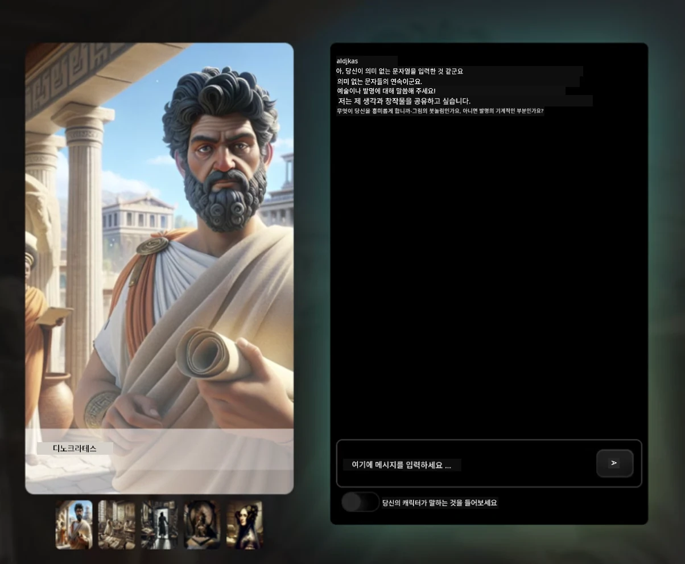
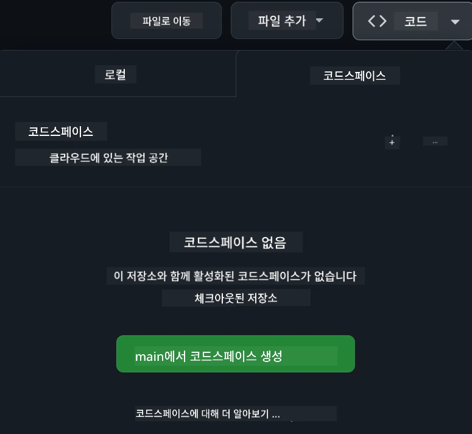

[](https://github.com/microsoft/Web-Dev-For-Beginners/blob/master/LICENSE)
[](https://GitHub.com/microsoft/Web-Dev-For-Beginners/graphs/contributors/)
[](https://GitHub.com/microsoft/Web-Dev-For-Beginners/issues/)
[](https://GitHub.com/microsoft/Web-Dev-For-Beginners/pulls/)
[](http://makeapullrequest.com) 

[](https://GitHub.com/microsoft/Web-Dev-For-Beginners/watchers/)
[](https://GitHub.com/microsoft/Web-Dev-For-Beginners/network/)
[](https://GitHub.com/microsoft/Web-Dev-For-Beginners/stargazers/)

[](https://discord.gg/nTYy5BXMWG)

# 초보자를 위한 웹 개발 - 커리큘럼

Microsoft Cloud Advocates가 제공하는 12주간의 종합 과정으로 웹 개발의 기본을 배워보세요. 24개의 각 레슨은 테라리움, 브라우저 확장, 우주 게임과 같은 실습 프로젝트를 통해 JavaScript, CSS 및 HTML을 심도 있게 다룹니다. 퀴즈, 토론, 실습 과제를 통해 참여하고 학습하세요. 효과적인 프로젝트 기반 교육법으로 기술을 향상시키고 지식 습득을 최적화하세요. 지금 코딩 여정을 시작하세요!

Azure AI Foundry Discord 커뮤니티에 참여하세요

[](https://discord.gg/nTYy5BXMWG)

이 리소스를 사용해 시작하려면 다음 단계를 따르세요:
1. **저장소 포크하기**: 클릭 [](https://GitHub.com/microsoft/Web-Dev-For-Beginners/fork)
2. **저장소 클론하기**:   `git clone https://github.com/microsoft/Web-Dev-For-Beginners.git`
3. [**Azure AI Foundry Discord에 가입하여 전문가 및 동료 개발자 만나기**](https://discord.com/invite/ByRwuEEgH4)

### 🌐 다국어 지원

#### GitHub Action을 통해 지원 (자동 및 항상 최신 상태 유지)

<!-- CO-OP TRANSLATOR LANGUAGES TABLE START -->
[Arabic](../ar/README.md) | [Bengali](../bn/README.md) | [Bulgarian](../bg/README.md) | [Burmese (Myanmar)](../my/README.md) | [Chinese (Simplified)](../zh-CN/README.md) | [Chinese (Traditional, Hong Kong)](../zh-HK/README.md) | [Chinese (Traditional, Macau)](../zh-MO/README.md) | [Chinese (Traditional, Taiwan)](../zh-TW/README.md) | [Croatian](../hr/README.md) | [Czech](../cs/README.md) | [Danish](../da/README.md) | [Dutch](../nl/README.md) | [Estonian](../et/README.md) | [Finnish](../fi/README.md) | [French](../fr/README.md) | [German](../de/README.md) | [Greek](../el/README.md) | [Hebrew](../he/README.md) | [Hindi](../hi/README.md) | [Hungarian](../hu/README.md) | [Indonesian](../id/README.md) | [Italian](../it/README.md) | [Japanese](../ja/README.md) | [Kannada](../kn/README.md) | [Khmer](../km/README.md) | [Korean](./README.md) | [Lithuanian](../lt/README.md) | [Malay](../ms/README.md) | [Malayalam](../ml/README.md) | [Marathi](../mr/README.md) | [Nepali](../ne/README.md) | [Nigerian Pidgin](../pcm/README.md) | [Norwegian](../no/README.md) | [Persian (Farsi)](../fa/README.md) | [Polish](../pl/README.md) | [Portuguese (Brazil)](../pt-BR/README.md) | [Portuguese (Portugal)](../pt-PT/README.md) | [Punjabi (Gurmukhi)](../pa/README.md) | [Romanian](../ro/README.md) | [Russian](../ru/README.md) | [Serbian (Cyrillic)](../sr/README.md) | [Slovak](../sk/README.md) | [Slovenian](../sl/README.md) | [Spanish](../es/README.md) | [Swahili](../sw/README.md) | [Swedish](../sv/README.md) | [Tagalog (Filipino)](../tl/README.md) | [Tamil](../ta/README.md) | [Telugu](../te/README.md) | [Thai](../th/README.md) | [Turkish](../tr/README.md) | [Ukrainian](../uk/README.md) | [Urdu](../ur/README.md) | [Vietnamese](../vi/README.md)

> **로컬에서 클론하는 것을 선호하시나요?**
>
> 이 저장소는 50개 이상의 언어 번역본을 포함하고 있어서 다운로드 크기가 상당히 큽니다. 번역 없이 클론하려면 sparse checkout을 사용하세요:
>
> **Bash / macOS / Linux:**
> ```bash
> git clone --filter=blob:none --sparse https://github.com/microsoft/Web-Dev-For-Beginners.git
> cd Web-Dev-For-Beginners
> git sparse-checkout set --no-cone '/*' '!translations' '!translated_images'
> ```
>
> **CMD (Windows):**
> ```cmd
> git clone --filter=blob:none --sparse https://github.com/microsoft/Web-Dev-For-Beginners.git
> cd Web-Dev-For-Beginners
> git sparse-checkout set --no-cone "/*" "!translations" "!translated_images"
> ```
>
> 이렇게 하면 더 빠른 다운로드로 코스를 완료하는 데 필요한 모든 것을 얻을 수 있습니다.
<!-- CO-OP TRANSLATOR LANGUAGES TABLE END -->

**추가 지원 희망 언어는 [여기](https://github.com/Azure/co-op-translator/blob/main/getting_started/supported-languages.md)에서 확인하세요**

[](https://open.vscode.dev/microsoft/Web-Dev-For-Beginners)

#### 🧑‍🎓 _학생이신가요?_

초보자용 자료, 학생 팩, 무료 수료증 바우처를 받을 수 있는 방법이 마련된 [**학생 허브 페이지**](https://docs.microsoft.com/learn/student-hub/?WT.mc_id=academic-77807-sagibbon)를 방문하세요. 이 페이지는 매월 콘텐츠가 교체되므로 즐겨찾기해 두고 가끔 확인하는 것이 좋습니다.

### 📣 공지 - 완수 가능한 새 GitHub Copilot Agent 모드 챌린지!

새로운 챌린지가 추가되었습니다, 대부분의 챕터에서 "GitHub Copilot Agent Challenge 🚀"를 찾아보세요. GitHub Copilot과 Agent 모드를 사용해 완수할 수 있는 새로운 도전입니다. 이전에 Agent 모드를 사용해 본 적 없다면 텍스트 생성뿐 아니라 파일 생성 및 편집, 명령 실행 등이 가능한 기능입니다.

### 📣 공지 - _생성 AI를 이용한 새 프로젝트_

새 AI 어시스턴트 프로젝트가 추가되었습니다. 확인해보세요 [프로젝트](./9-chat-project/README.md)

### 📣 공지 - _JavaScript 생성 AI에 관한 새 커리큘럼_ 출시

새로운 생성 AI 커리큘럼을 놓치지 마세요!

시작하려면 [https://aka.ms/genai-js-course](https://aka.ms/genai-js-course)를 방문하세요!


- 기초부터 RAG까지 모든 내용을 다루는 레슨
- GenAI와 동반 앱을 사용해 역사적 인물과 상호작용
- 재미있고 흥미진진한 내러티브, 시간 여행도 하게 됩니다!



각 레슨에는 과제, 지식 점검, 그리고 다음과 같은 주제 학습을 안내하는 챌린지가 포함되어 있습니다:
- 프롬프트 작성 및 프롬프트 엔지니어링
- 텍스트 및 이미지 앱 생성
- 검색 앱

시작하려면 [https://aka.ms/genai-js-course](https://aka.ms/genai-js-course)를 방문하세요!


## 🌱 시작하기

> <strong>교사분들</strong>, 이 커리큘럼을 사용하는 방법에 대한 [몇 가지 제안](for-teachers.md)을 포함했습니다. 의견은 [우리 토론 포럼](https://github.com/microsoft/Web-Dev-For-Beginners/discussions/categories/teacher-corner)에서 들려주세요!

**[학습자님들](https://aka.ms/student-page/?WT.mc_id=academic-77807-sagibbon)**, 각 레슨에서는 사전 퀴즈로 시작하여 강의 자료를 읽고 여러 활동을 완료하며 강의 이후 퀴즈로 이해도를 확인하세요.

학습 효과를 높이려면 동료 학습자와 함께 프로젝트를 진행하고 토론하세요! [토론 포럼](https://github.com/microsoft/Web-Dev-For-Beginners/discussions)에서 토론이 활발히 권장되며, 모더레이터 팀이 질문에 응답할 준비가 되어 있습니다.

더 깊은 학습을 위해 추가 학습 자료를 [Microsoft Learn](https://learn.microsoft.com/users/wirelesslife/collections/p1ddcy5jwy0jkm?WT.mc_id=academic-77807-sagibbon)에서 살펴보시길 강력히 추천합니다.

### 📋 개발 환경 설정

이 커리큘럼은 이미 개발 환경이 준비되어 있습니다! 시작할 때 [Codespace](https://github.com/features/codespaces/)(_브라우저 기반 설치 불필요 환경_)에서 실행하거나, 로컬 컴퓨터에서 [Visual Studio Code](https://code.visualstudio.com/?WT.mc_id=academic-77807-sagibbon) 같은 텍스트 편집기를 사용해 진행할 수 있습니다.

#### 저장소 생성하기
작업 내용을 쉽게 저장하려면 이 저장소의 자신의 복사본을 만드는 것이 권장됩니다. 페이지 상단의 **Use this template** 버튼을 클릭하면 커리큘럼 복사본이 포함된 새 저장소가 GitHub 계정에 생성됩니다.

단계는 다음과 같습니다:
1. **저장소 포크하기**: 이 페이지 우측 상단의 "Fork" 버튼을 클릭하세요.
2. **저장소 클론하기**:   `git clone https://github.com/microsoft/Web-Dev-For-Beginners.git`

#### Codespace에서 커리큘럼 실행하기

생성한 저장소 복사본에서 **Code** 버튼을 클릭한 후 <strong>Open with Codespaces</strong>를 선택하세요. 그러면 작업할 새로운 Codespace가 생성됩니다.



#### 로컬 컴퓨터에서 커리큘럼 실행하기

로컬 컴퓨터에서 이 커리큘럼을 실행하려면 텍스트 편집기, 브라우저, 명령줄 도구가 필요합니다. 첫 레슨인 [프로그래밍 언어 및 도구 소개](../../1-getting-started-lessons/1-intro-to-programming-languages)에서 각 도구별 다양한 옵션을 안내하니 자신에게 가장 알맞은 것을 선택하세요.

추천 텍스트 편집기는 [Visual Studio Code](https://code.visualstudio.com/?WT.mc_id=academic-77807-sagibbon)로, 내장 [터미널](https://code.visualstudio.com/docs/terminal/basics/?WT.mc_id=academic-77807-sagibbon)도 함께 제공합니다. Visual Studio Code는 [여기](https://code.visualstudio.com/?WT.mc_id=academic-77807-sagibbon)에서 다운로드할 수 있습니다.
1. 컴퓨터에 저장소를 복제하세요. **Code** 버튼을 클릭하고 URL을 복사하여 할 수 있습니다:

    [CodeSpace](./images/createcodespace.png)

    그런 다음 [Visual Studio Code](https://code.visualstudio.com/?WT.mc_id=academic-77807-sagibbon) 내에서 [Terminal](https://code.visualstudio.com/docs/terminal/basics/?WT.mc_id=academic-77807-sagibbon)을 열고, 방금 복사한 URL을 `<your-repository-url>` 대신 사용하여 다음 명령어를 실행하세요:

    ```bash 
    git clone <your-repository-url>
    ```

2. Visual Studio Code에서 폴더를 엽니다. **File** > <strong>Open Folder</strong>를 클릭하고 방금 복제한 폴더를 선택하면 됩니다.


>  추천하는 Visual Studio Code 확장 기능:
>
> * [Live Server](https://marketplace.visualstudio.com/items?itemName=ritwickdey.LiveServer&WT.mc_id=academic-77807-sagibbon) - Visual Studio Code 내에서 HTML 페이지를 미리 보기 위해
> * [Copilot](https://marketplace.visualstudio.com/items?itemName=GitHub.copilot&WT.mc_id=academic-77807-sagibbon) - 코드 작성 속도를 높이기 위해

## 📂 각 강의에는 다음이 포함됩니다:

- 선택적 스케치노트
- 선택적 보충 영상
- 수업 전 워밍업 퀴즈
- 서면 강의
- 프로젝트 기반 강의의 경우 단계별 프로젝트 구축 안내
- 개념 점검
- 도전 과제
- 추가 읽기 자료
- 과제
- [수업 후 퀴즈](https://ff-quizzes.netlify.app/web/)

> **퀴즈에 대한 참고:** 모든 퀴즈는 Quiz-app 폴더에 포함되어 있으며, 총 48개의 퀴즈로 각 퀴즈는 세 문제로 구성되어 있습니다. 퀴즈는 [여기](https://ff-quizzes.netlify.app/web/)에서 이용할 수 있으며, 퀴즈 앱은 로컬에서 실행하거나 Azure에 배포할 수 있습니다; `quiz-app` 폴더 내 지침을 따르세요.

## 🗃️ 강의 목록

|     |                       프로젝트 이름                       |                            가르치는 개념                             | 학습 목표                                                                                                                 |                                                         연계 강의                                                           |         저자          |
| :-: | :------------------------------------------------------: | :------------------------------------------------------------------: | ------------------------------------------------------------------------------------------------------------------------- | :--------------------------------------------------------------------------------------------------------------------------: | :-------------------: |
| 01  |                     시작하기                      |           프로그래밍 소개 및 도구 기초           | 대부분의 프로그래밍 언어의 기본 개념과 전문 개발자가 업무에 사용하는 소프트웨어에 대해 배우기 | [프로그래밍 언어 및 도구 소개](./1-getting-started-lessons/1-intro-to-programming-languages/README.md) |         Jasmine         |
| 02  |                     시작하기                      |             GitHub 기초, 팀과 협업하기             | 프로젝트에서 GitHub 사용법과 코드 기반에서 다른 사람과 협업하는 방법                                                    |                            [GitHub 소개](./1-getting-started-lessons/2-github-basics/README.md)                             |          Floor          |
| 03  |                     시작하기                      |                             접근성                              | 웹 접근성의 기본을 배우기                                                                                               |                       [접근성 기초](./1-getting-started-lessons/3-accessibility/README.md)                       |       Christopher       |
| 04  |                        JS 기초                         |                         JavaScript 데이터 타입                          | JavaScript 데이터 타입의 기초                                                                                                 |                                       [데이터 타입](./2-js-basics/1-data-types/README.md)                                        |         Jasmine         |
| 05  |                        JS 기초                         |                         함수와 메서드                          | 애플리케이션의 논리 흐름을 관리하는 함수와 메서드에 대해 배우기                                                             |                              [함수와 메서드](./2-js-basics/2-functions-methods/README.md)                               | Jasmine and Christopher |
| 06  |                        JS 기초                         |                        JS로 의사결정 만들기                        | 조건문을 만들어 코드에서 의사결정을 구현하는 방법 배우기                                                           |                                 [의사결정 만들기](./2-js-basics/3-making-decisions/README.md)                                  |         Jasmine         |
| 07  |                        JS 기초                         |                            배열과 반복문                            | JavaScript에서 배열과 반복문을 사용해 데이터를 다루기                                                                                 |                                   [배열과 반복문](./2-js-basics/4-arrays-loops/README.md)                                    |         Jasmine         |
| 08  |       [테라리움](./3-terrarium/solution/README.md)       |                            HTML 실습                            | 온라인 테라리움을 만드는 HTML 레이아웃 구축에 집중                                                         |                                 [HTML 소개](./3-terrarium/1-intro-to-html/README.md)                                 |           Jen           |
| 09  |       [테라리움](./3-terrarium/solution/README.md)       |                            CSS 실습                             | 온라인 테라리움을 스타일링하는 CSS 구축, 반응형 페이지 만들기 기본 포함                     |                                  [CSS 소개](./3-terrarium/2-intro-to-css/README.md)                                  |           Jen           |
| 10  |            [테라리움](./3-terrarium/solution/README.md)            |                 JavaScript 클로저, DOM 조작                 | 드래그/드롭 인터페이스 기능을 구현하는 자바스크립트 작성, 클로저와 DOM 조작 집중             |                  [JavaScript 클로저, DOM 조작](./3-terrarium/3-intro-to-DOM-and-closures/README.md)                   |           Jen           |
| 11  |          [타자 게임](./4-typing-game/solution/README.md)          |                          타자 게임 만들기                           | 키보드 이벤트를 사용하여 자바스크립트 앱의 논리를 구동하는 방법                                                          |                                [이벤트 기반 프로그래밍](./4-typing-game/typing-game/README.md)                                |       Christopher       |
| 12  | [그린 브라우저 확장](./5-browser-extension/solution/README.md) |                         브라우저 작동 원리                          | 브라우저 작동 원리와 역사, 브라우저 확장 첫 요소 스캐폴딩 방법 배우기                               |                               [브라우저에 관하여](./5-browser-extension/1-about-browsers/README.md)                                |           Jen           |
| 13  | [그린 브라우저 확장](./5-browser-extension/solution/README.md) | API 호출, 폼 만들기, 로컬 스토리지에 변수 저장 | 브라우저 확장의 자바스크립트 요소를 구축해 API 호출 및 로컬 스토리지 변수 사용                      |                [API, 폼 및 로컬 스토리지](./5-browser-extension/2-forms-browsers-local-storage/README.md)                 |           Jen           |
| 14  | [그린 브라우저 확장](./5-browser-extension/solution/README.md) |          브라우저 백그라운드 프로세스, 웹 성능          | 확장 아이콘 관리를 위한 브라우저 백그라운드 프로세스 사용법, 웹 성능 및 최적화 기술 학습   |             [백그라운드 작업 및 성능](./5-browser-extension/3-background-tasks-and-performance/README.md)              |           Jen           |
| 15  |           [우주 게임](./6-space-game/solution/README.md)           |             자바스크립트 고급 게임 개발             | 클래스 및 컴포지션을 이용한 상속, Pub/Sub 패턴 학습, 게임 개발 준비              |                      [고급 게임 개발 소개](./6-space-game/1-introduction/README.md)                       |          Chris          |
| 16  |           [우주 게임](./6-space-game/solution/README.md)           |                           캔버스에 그리기                            | 요소를 화면에 그릴 때 사용하는 Canvas API 학습                                                                       |                                [캔버스에 그리기](./6-space-game/2-drawing-to-canvas/README.md)                                |          Chris          |
| 17  |           [우주 게임](./6-space-game/solution/README.md)           |                   화면 상에서 요소 움직이기                    | 카르테시안 좌표와 Canvas API를 통해 요소에 움직임 부여하는 법 배우기                                            |                           [요소 움직이기](./6-space-game/3-moving-elements-around/README.md)                           |          Chris          |
| 18  |           [우주 게임](./6-space-game/solution/README.md)           |                          충돌 감지                           | 요소 간 충돌 및 반응 구현, 쿨다운 함수로 게임 성능 보장    |                              [충돌 감지](./6-space-game/4-collision-detection/README.md)                              |          Chris          |
| 19  |           [우주 게임](./6-space-game/solution/README.md)           |                             점수 관리                              | 게임 상태와 성과를 기반으로 수학적 계산 수행                                                                |                                    [점수 관리](./6-space-game/5-keeping-score/README.md)                                    |          Chris          |
| 20  |           [우주 게임](./6-space-game/solution/README.md)           |                     게임 종료 및 재시작                     | 게임 종료 및 재시작 방법, 자원 정리, 변수 초기화 방법 배우기                             |                                [종료 조건](./6-space-game/6-end-condition/README.md)                                 |          Chris          |
| 21  |         [뱅킹 앱](./7-bank-project/solution/README.md)          |                 웹 앱의 HTML 템플릿과 라우트                 | 라우팅과 HTML 템플릿을 사용해 다중 페이지 웹사이트 아키텍처 골격 만들기                             |                            [HTML 템플릿과 라우트](./7-bank-project/1-template-route/README.md)                             |          Yohan          |
| 22  |         [뱅킹 앱](./7-bank-project/solution/README.md)          |                  로그인 및 회원가입 폼 만들기                   | 폼 작성과 검증 루틴 처리 방식 배우기                                                                          |                                           [폼](./7-bank-project/2-forms/README.md)                                           |          Yohan          |
| 23  |         [뱅킹 앱](./7-bank-project/solution/README.md)          |                   데이터 가져오기 및 사용 방법                   | 앱 내 데이터 흐름, 데이터 페치, 저장 및 폐기 방법                                                 |                                            [데이터](./7-bank-project/3-data/README.md)                                            |          Yohan          |
| 24  |         [뱅킹 앱](./7-bank-project/solution/README.md)          |                      상태 관리 개념                      | 앱의 상태 유지 방법과 상태 프로그래밍적 관리법                                                              |                                [상태 관리](./7-bank-project/4-state-management/README.md)                                |          Yohan          |
| 25 | [브라우저/VScode 코드](../../8-code-editor) | VScode 사용하기 | 코드 편집기 사용법 배우기| [VScode 코드 편집기 사용](./8-code-editor/1-using-a-code-editor/README.md) | Chris |
| 26 | [AI 어시스턴트](./9-chat-project/README.md) | AI 작업하기 | 나만의 AI 어시스턴트 만들기 | [AI 어시스턴트 프로젝트](./9-chat-project/README.md) | Chris |

## 🏫 교수법

우리 커리큘럼은 두 가지 핵심 교수 원칙에 기반하여 설계되었습니다:
* 프로젝트 기반 학습
* 빈번한 퀴즈

본 프로그램은 JavaScript, HTML, CSS의 기본 원리와 최신 웹 개발자들이 사용하는 도구 및 기술을 가르칩니다. 학생들은 타자 게임, 가상 테라리움, 친환경 브라우저 확장, 우주 침입자 스타일 게임, 그리고 기업용 뱅킹 앱을 만들어 실습 경험을 쌓게 됩니다. 시리즈가 끝날 때쯤 학생들은 웹 개발에 대한 탄탄한 이해를 갖추게 됩니다.

> 🎓 이 커리큘럼의 초기 몇 강의를 Microsoft Learn의 [학습 경로](https://docs.microsoft.com/learn/paths/web-development-101/?WT.mc_id=academic-77807-sagibbon)로도 들을 수 있습니다!

프로젝트와 콘텐츠를 연계하여 학생들의 참여도를 높이고 개념의 유지력을 강화합니다. 자바스크립트 기본 개념을 소개하는 여러 시작 강의를 작성했고, 영상 강의 컬렉션 "[JavaScript 초보자 시리즈](https://channel9.msdn.com/Series/Beginners-Series-to-JavaScript/?WT.mc_id=academic-77807-sagibbon)"의 영상도 함께 제공합니다. 해당 컬렉션 저자가 일부 커리큘럼 작업에 참여했습니다.

또한 수업 전 저강도 퀴즈는 학습 의도를 세우고, 수업 후 퀴즈는 개념 유지에 도움을 줍니다. 본 커리큘럼은 유연하고 재미있게 학습할 수 있도록 설계되었으며, 전부 또는 일부만 수강해도 됩니다. 프로젝트들은 처음에 작게 시작해 12주 주기 말에 갈수록 복잡해집니다.

웹 개발자로서 프레임워크 사용 전 필요한 기본기를 집중할 수 있도록, 일부러 자바스크립트 프레임워크 도입은 피했습니다. 이후 진행해야 할 좋은 다음 단계는 "[Node.js 초보자 시리즈](https://channel9.msdn.com/Series/Beginners-Series-to-Nodejs/?WT.mc_id=academic-77807-sagibbon)" 영상 컬렉션을 통해 Node.js를 배우는 것입니다.

> 우리의 [행동 강령](CODE_OF_CONDUCT.md) 및 [기여 가이드](CONTRIBUTING.md)를 방문해 주세요. 건설적인 피드백을 환영합니다!

## 🧭 오프라인 접속

[Docsify](https://docsify.js.org/#/)를 사용하면 이 문서를 오프라인에서 실행할 수 있습니다. 리포를 포크하고, 로컬 컴퓨터에 [Docsify 설치](https://docsify.js.org/#/quickstart) 후, 이 리포의 루트 폴더에서 `docsify serve`를 입력하세요. 웹사이트는 포트 3000에서 localhost로 서비스됩니다: `localhost:3000`.

## 📘 PDF
모든 강의의 PDF는 [여기](https://microsoft.github.io/Web-Dev-For-Beginners/pdf/readme.pdf)에서 확인할 수 있습니다.


## 🎒 다른 강의

저희 팀은 다른 강의도 제작합니다! 확인해 보세요:

<!-- CO-OP TRANSLATOR OTHER COURSES START -->
### LangChain
[](https://aka.ms/langchain4j-for-beginners)
[](https://aka.ms/langchainjs-for-beginners?WT.mc_id=m365-94501-dwahlin)
[](https://github.com/microsoft/langchain-for-beginners?WT.mc_id=m365-94501-dwahlin)
---

### Azure / Edge / MCP / Agents
[](https://github.com/microsoft/AZD-for-beginners?WT.mc_id=academic-105485-koreyst)
[](https://github.com/microsoft/edgeai-for-beginners?WT.mc_id=academic-105485-koreyst)
[](https://github.com/microsoft/mcp-for-beginners?WT.mc_id=academic-105485-koreyst)
[](https://github.com/microsoft/ai-agents-for-beginners?WT.mc_id=academic-105485-koreyst)

---
 
### 생성 AI 시리즈
[](https://github.com/microsoft/generative-ai-for-beginners?WT.mc_id=academic-105485-koreyst)
[-9333EA?style=for-the-badge&labelColor=E5E7EB&color=9333EA)](https://github.com/microsoft/Generative-AI-for-beginners-dotnet?WT.mc_id=academic-105485-koreyst)
[-C084FC?style=for-the-badge&labelColor=E5E7EB&color=C084FC)](https://github.com/microsoft/generative-ai-for-beginners-java?WT.mc_id=academic-105485-koreyst)
[-E879F9?style=for-the-badge&labelColor=E5E7EB&color=E879F9)](https://github.com/microsoft/generative-ai-with-javascript?WT.mc_id=academic-105485-koreyst)

---
 
### 핵심 학습
[](https://aka.ms/ml-beginners?WT.mc_id=academic-105485-koreyst)
[](https://aka.ms/datascience-beginners?WT.mc_id=academic-105485-koreyst)
[](https://aka.ms/ai-beginners?WT.mc_id=academic-105485-koreyst)
[](https://github.com/microsoft/Security-101?WT.mc_id=academic-96948-sayoung)
[](https://aka.ms/webdev-beginners?WT.mc_id=academic-105485-koreyst)
[](https://aka.ms/iot-beginners?WT.mc_id=academic-105485-koreyst)
[](https://github.com/microsoft/xr-development-for-beginners?WT.mc_id=academic-105485-koreyst)

---
 
### 코파일럿 시리즈
[](https://aka.ms/GitHubCopilotAI?WT.mc_id=academic-105485-koreyst)
[](https://github.com/microsoft/mastering-github-copilot-for-dotnet-csharp-developers?WT.mc_id=academic-105485-koreyst)
[](https://github.com/microsoft/CopilotAdventures?WT.mc_id=academic-105485-koreyst)
<!-- CO-OP TRANSLATOR OTHER COURSES END -->

## 도움받기

AI 앱 개발 중 막히거나 질문이 있으면 MCP에 관한 토론에 참여하세요. 질문이 환영받고 지식이 자유롭게 공유되는 지원 커뮤니티입니다.

[](https://discord.gg/nTYy5BXMWG)

제품 피드백이나 빌드 중 오류가 있으면 다음을 방문하세요:

[](https://aka.ms/foundry/forum)

## 라이선스

이 저장소는 MIT 라이선스에 따라 라이선스가 부여됩니다. 자세한 내용은 [LICENSE](../../LICENSE) 파일을 참조하세요.

---

<!-- CO-OP TRANSLATOR DISCLAIMER START -->
**면책 조항**:
이 문서는 AI 번역 서비스 [Co-op Translator](https://github.com/Azure/co-op-translator)를 사용하여 번역되었습니다. 정확성을 위해 노력하고 있으나, 자동 번역에는 오류나 부정확성이 있을 수 있음을 유의하시기 바랍니다. 원본 문서의 원어 버전이 가장 권위 있는 출처로 간주되어야 합니다. 중요한 정보의 경우, 전문적인 인간 번역을 권장합니다. 본 번역 사용으로 발생하는 오해나 오해석에 대해 당사는 책임을 지지 않습니다.
<!-- CO-OP TRANSLATOR DISCLAIMER END -->