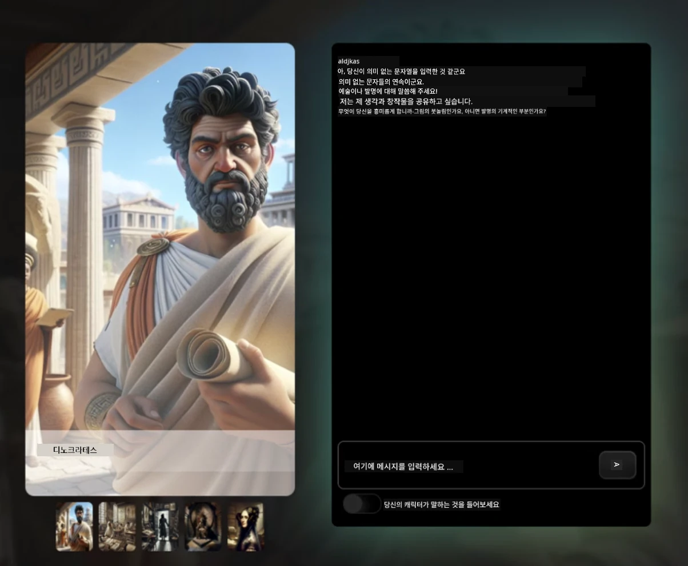
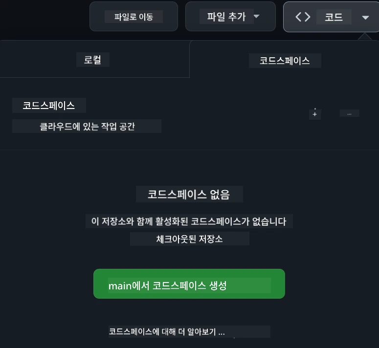

[](https://github.com/microsoft/Web-Dev-For-Beginners/blob/master/LICENSE)
[](https://GitHub.com/microsoft/Web-Dev-For-Beginners/graphs/contributors/)
[](https://GitHub.com/microsoft/Web-Dev-For-Beginners/issues/)
[](https://GitHub.com/microsoft/Web-Dev-For-Beginners/pulls/)
[](http://makeapullrequest.com) 

[](https://GitHub.com/microsoft/Web-Dev-For-Beginners/watchers/)
[](https://GitHub.com/microsoft/Web-Dev-For-Beginners/network/)
[](https://GitHub.com/microsoft/Web-Dev-For-Beginners/stargazers/)

[](https://discord.gg/nTYy5BXMWG)

# 초보자를 위한 웹 개발 - 커리큘럼

Microsoft Cloud Advocates가 제공하는 12주간의 종합 과정으로 웹 개발의 기본을 배우세요. 24개의 각 레슨에서는 테라리움, 브라우저 확장 프로그램, 우주 게임과 같은 실습 프로젝트를 통해 JavaScript, CSS, HTML을 깊이 있게 다룹니다. 퀴즈, 토론, 실습 과제로 참여하세요. 효과적인 프로젝트 기반 학습법으로 기술을 향상시키고 지식 유지력을 최적화하세요. 오늘부터 코딩 여정을 시작하세요!

Azure AI Foundry Discord에 참여하여 전문가 및 다른 개발자들과 만날 수 있습니다.

[](https://discord.gg/nTYy5BXMWG)

다음 단계에 따라 이 자료를 사용해 시작하세요:
1. **리포지토리 포크하기**: 클릭 [](https://GitHub.com/microsoft/Web-Dev-For-Beginners/fork)
2. **리포지토리 클론하기**:   `git clone https://github.com/microsoft/Web-Dev-For-Beginners.git`
3. [**Azure AI Foundry Discord에 참여하여 전문가 및 다른 개발자와 만나기**](https://discord.com/invite/ByRwuEEgH4)

### 🌐 다국어 지원

#### GitHub Action을 통해 지원 (자동 및 항상 최신 상태 유지)

<!-- CO-OP TRANSLATOR LANGUAGES TABLE START -->
[Arabic](../ar/README.md) | [Bengali](../bn/README.md) | [Bulgarian](../bg/README.md) | [Burmese (Myanmar)](../my/README.md) | [Chinese (Simplified)](../zh-CN/README.md) | [Chinese (Traditional, Hong Kong)](../zh-HK/README.md) | [Chinese (Traditional, Macau)](../zh-MO/README.md) | [Chinese (Traditional, Taiwan)](../zh-TW/README.md) | [Croatian](../hr/README.md) | [Czech](../cs/README.md) | [Danish](../da/README.md) | [Dutch](../nl/README.md) | [Estonian](../et/README.md) | [Finnish](../fi/README.md) | [French](../fr/README.md) | [German](../de/README.md) | [Greek](../el/README.md) | [Hebrew](../he/README.md) | [Hindi](../hi/README.md) | [Hungarian](../hu/README.md) | [Indonesian](../id/README.md) | [Italian](../it/README.md) | [Japanese](../ja/README.md) | [Kannada](../kn/README.md) | [Khmer](../km/README.md) | [Korean](./README.md) | [Lithuanian](../lt/README.md) | [Malay](../ms/README.md) | [Malayalam](../ml/README.md) | [Marathi](../mr/README.md) | [Nepali](../ne/README.md) | [Nigerian Pidgin](../pcm/README.md) | [Norwegian](../no/README.md) | [Persian (Farsi)](../fa/README.md) | [Polish](../pl/README.md) | [Portuguese (Brazil)](../pt-BR/README.md) | [Portuguese (Portugal)](../pt-PT/README.md) | [Punjabi (Gurmukhi)](../pa/README.md) | [Romanian](../ro/README.md) | [Russian](../ru/README.md) | [Serbian (Cyrillic)](../sr/README.md) | [Slovak](../sk/README.md) | [Slovenian](../sl/README.md) | [Spanish](../es/README.md) | [Swahili](../sw/README.md) | [Swedish](../sv/README.md) | [Tagalog (Filipino)](../tl/README.md) | [Tamil](../ta/README.md) | [Telugu](../te/README.md) | [Thai](../th/README.md) | [Turkish](../tr/README.md) | [Ukrainian](../uk/README.md) | [Urdu](../ur/README.md) | [Vietnamese](../vi/README.md)

> **로컬로 클론하는 것을 선호하시나요?**
>
> 이 리포지토리에는 50개 이상의 언어 번역이 포함되어 있어 다운로드 크기가 크게 증가합니다. 번역 없이 클론하려면 스파스 체크아웃을 사용하세요:
>
> **Bash / macOS / Linux:**
> ```bash
> git clone --filter=blob:none --sparse https://github.com/microsoft/Web-Dev-For-Beginners.git
> cd Web-Dev-For-Beginners
> git sparse-checkout set --no-cone '/*' '!translations' '!translated_images'
> ```
>
> **CMD (Windows):**
> ```cmd
> git clone --filter=blob:none --sparse https://github.com/microsoft/Web-Dev-For-Beginners.git
> cd Web-Dev-For-Beginners
> git sparse-checkout set --no-cone "/*" "!translations" "!translated_images"
> ```
>
> 이렇게 하면 훨씬 빠른 다운로드로 코스를 완료하는 데 필요한 모든 것을 얻을 수 있습니다.
<!-- CO-OP TRANSLATOR LANGUAGES TABLE END -->

**추가 번역을 원하시면, 지원되는 언어 목록은 [여기](https://github.com/Azure/co-op-translator/blob/main/getting_started/supported-languages.md)에서 확인하세요.**

[](https://open.vscode.dev/microsoft/Web-Dev-For-Beginners)

#### 🧑‍🎓 _학생이신가요?_

초보자 자료, 학생 팩, 무료 인증서 바우처 받는 방법 등 다양한 자료가 있는 [**학생 허브 페이지**](https://docs.microsoft.com/learn/student-hub/?WT.mc_id=academic-77807-sagibbon)를 방문하세요. 콘텐츠가 매월 교체되니 이 페이지를 북마크해두고 수시로 확인하세요.

### 📣 공지 - 완료해야 할 새로운 GitHub Copilot Agent 모드 챌린지!

각 장에서 "GitHub Copilot Agent Challenge 🚀"라는 새 챌린지가 추가되었습니다. GitHub Copilot과 Agent 모드를 사용하여 완료할 수 있습니다. Agent 모드를 처음 사용하는 경우 텍스트 생성뿐 아니라 파일 생성 및 편집, 명령 실행 등도 가능합니다.

### 📣 공지 - _생성형 AI를 활용한 새 프로젝트_

새로운 AI 어시스턴트 프로젝트가 방금 추가되었습니다. [프로젝트](./9-chat-project/README.md)를 확인하세요.

### 📣 공지 - _JavaScript용 생성형 AI_로 새 커리큘럼 출시

새 생성형 AI 커리큘럼을 놓치지 마세요!

시작하려면 [https://aka.ms/genai-js-course](https://aka.ms/genai-js-course)를 방문하세요!


- 입문부터 RAG까지 모든 내용을 다룸.
- GenAI와 동반 앱을 이용해 역사적 인물과 상호작용 가능.
- 재미있고 몰입도 높은 스토리텔링으로 시간 여행 체험!




각 레슨에는 완성할 과제, 지식 점검, 도전 과제가 포함되어 있어 다음 주제들을 안내합니다:
- 프롬프트 및 프롬프트 엔지니어링
- 텍스트 및 이미지 앱 생성
- 검색 앱

시작하려면 [https://aka.ms/genai-js-course](https://aka.ms/genai-js-course)를 방문하세요!


## 🌱 시작하기

> <strong>교사분들께</strong>, 이 커리큘럼을 사용하는 방법에 대한 [일부 제안](for-teachers.md)을 포함했습니다. [토론 포럼](https://github.com/microsoft/Web-Dev-For-Beginners/discussions/categories/teacher-corner)에서 여러분의 피드백을 기다립니다!

**[학습자분들](https://aka.ms/student-page/?WT.mc_id=academic-77807-sagibbon)**, 각 레슨마다 사전 강의 퀴즈로 시작하고 강의 자료를 읽은 다음 다양한 활동을 완료하고 사후 강의 퀴즈로 이해도를 확인하세요.

학습 경험을 향상하려면 동료들과 함께 프로젝트를 진행하며 교류하세요! [토론 포럼](https://github.com/microsoft/Web-Dev-For-Beginners/discussions)에서 토론을 장려하며, 우리 모더레이터 팀이 질문에 답변해드립니다.

더 깊이 있는 학습을 위해 [Microsoft Learn](https://learn.microsoft.com/users/wirelesslife/collections/p1ddcy5jwy0jkm?WT.mc_id=academic-77807-sagibbon)을 탐색하는 것을 강력히 추천합니다.

### 📋 개발 환경 설정

이 커리큘럼은 바로 사용할 수 있는 개발 환경을 제공합니다! 시작할 때는 설치가 필요 없는 브라우저 기반 환경인 [Codespace](https://github.com/features/codespaces/)에서 실행하거나, [Visual Studio Code](https://code.visualstudio.com/?WT.mc_id=academic-77807-sagibbon) 같은 텍스트 편집기를 사용해 로컬에서 실행할 수 있습니다.

#### 리포지토리 생성하기
작업을 쉽게 저장하려면 이 리포지토리의 사본을 만드는 것이 권장됩니다. 페이지 상단의 **Use this template** 버튼을 클릭하면 GitHub 계정에 커리큘럼 복사본이 포함된 새 리포지토리를 만들 수 있습니다.

절차:
1. **리포지토리 포크하기**: 이 페이지 우측 상단의 "Fork" 버튼을 클릭하세요.
2. **리포지토리 클론하기**:   `git clone https://github.com/microsoft/Web-Dev-For-Beginners.git`

#### Codespace에서 커리큘럼 실행하기

생성한 리포지토리 복사본에서 **Code** 버튼을 클릭하고 <strong>Open with Codespaces</strong>를 선택하세요. 새 Codespace가 생성되어 작업할 수 있습니다.



#### 컴퓨터에서 로컬로 커리큘럼 실행하기

로컬 환경에서 실행하려면 텍스트 편집기, 브라우저, 명령줄 도구가 필요합니다. 첫 수업인 [프로그래밍 언어 및 도구 소개](../../1-getting-started-lessons/1-intro-to-programming-languages)에서 각각에 대해 선택할 수 있는 다양한 옵션을 안내합니다.

추천 편집기는 [Visual Studio Code](https://code.visualstudio.com/?WT.mc_id=academic-77807-sagibbon)입니다. 내장된 [터미널](https://code.visualstudio.com/docs/terminal/basics/?WT.mc_id=academic-77807-sagibbon)도 포함되어 있습니다. Visual Studio Code는 [여기](https://code.visualstudio.com/?WT.mc_id=academic-77807-sagibbon)에서 다운로드할 수 있습니다.
1. 리포지토리를 컴퓨터에 클론하세요. **Code** 버튼을 클릭하고 URL을 복사하면 됩니다:

    [CodeSpace](./images/createcodespace.png)

    그런 다음, [Visual Studio Code](https://code.visualstudio.com/?WT.mc_id=academic-77807-sagibbon) 내에서 [Terminal](https://code.visualstudio.com/docs/terminal/basics/?WT.mc_id=academic-77807-sagibbon)을 열고, 방금 복사한 URL을 `<your-repository-url>`에 대체하여 아래 명령어를 실행하세요:

    ```bash 
    git clone <your-repository-url>
    ```

2. Visual Studio Code에서 폴더를 여세요. **File** > <strong>Open Folder</strong>를 클릭한 후 방금 클론한 폴더를 선택하면 됩니다.


>  추천하는 Visual Studio Code 확장 프로그램:
>
> * [Live Server](https://marketplace.visualstudio.com/items?itemName=ritwickdey.LiveServer&WT.mc_id=academic-77807-sagibbon) - Visual Studio Code 내에서 HTML 페이지를 미리 보기 위해
> * [Copilot](https://marketplace.visualstudio.com/items?itemName=GitHub.copilot&WT.mc_id=academic-77807-sagibbon) - 코드를 더 빠르게 작성하는 데 도움을 줌

## 📂 각 강의에는 다음이 포함됩니다:

- 선택적 스케치노트
- 선택적 보조 영상
- 수업 전 워밍업 퀴즈
- 강의 본문
- 프로젝트 기반 강의의 경우, 프로젝트 구축 단계별 가이드
- 지식 확인
- 챌린지
- 보조 읽기 자료
- 과제
- [수업 후 퀴즈](https://ff-quizzes.netlify.app/web/)

> **퀴즈에 관한 참고:** 모든 퀴즈는 Quiz-app 폴더에 포함되어 있으며, 각 3문항씩 총 48개 퀴즈가 있습니다. [여기](https://ff-quizzes.netlify.app/web/)에서 이용 가능하며, 퀴즈 앱은 로컬에서 실행하거나 Azure에 배포할 수 있습니다; `quiz-app` 폴더의 지침을 따르세요.

## 🗃️ 강의 목록

|     |                       프로젝트명                       |                            학습 개념                             | 학습 목표                                                                                                                 |                                                         연결된 강의                                                          |         저자          |
| :-: | :------------------------------------------------------: | :--------------------------------------------------------------------: | ----------------------------------------------------------------------------------------------------------------------------------- | :----------------------------------------------------------------------------------------------------------------------------: | :---------------------: |
| 01  |                     시작하기                      |           프로그래밍과 도구 입문           | 대부분 프로그래밍 언어의 기본 개념과 전문 개발자를 돕는 소프트웨어에 대해 학습 | [프로그래밍 언어 및 도구 입문](./1-getting-started-lessons/1-intro-to-programming-languages/README.md) |         Jasmine         |
| 02  |                     시작하기                      |             GitHub 기초, 팀 작업 포함             | 프로젝트에서 GitHub 사용법 및 코드베이스 협업 방법                                                    |                            [GitHub 입문](./1-getting-started-lessons/2-github-basics/README.md)                             |          Floor          |
| 03  |                     시작하기                      |                             접근성                              | 웹 접근성 기초 학습                                                                                               |                       [접근성 기본](./1-getting-started-lessons/3-accessibility/README.md)                       |       Christopher       |
| 04  |                        JS 기초                         |                         자바스크립트 데이터 타입                          | 자바스크립트 데이터 타입 기초                                                                                                 |                                       [데이터 타입](./2-js-basics/1-data-types/README.md)                                        |         Jasmine         |
| 05  |                        JS 기초                         |                         함수와 메서드                          | 애플리케이션 로직 흐름 관리 함수와 메서드에 대해 학습                                                             |                              [함수와 메서드](./2-js-basics/2-functions-methods/README.md)                               | Jasmine and Christopher |
| 06  |                        JS 기초                         |                        JS로 조건 만들기                        | 조건문 사용법과 의사 결정 방법 학습                                                           |                                 [의사 결정](./2-js-basics/3-making-decisions/README.md)                                  |         Jasmine         |
| 07  |                        JS 기초                         |                            배열과 반복문                            | 자바스크립트 배열과 반복문을 통한 데이터 처리                                                                                 |                                   [배열과 반복문](./2-js-basics/4-arrays-loops/README.md)                                    |         Jasmine         |
| 08  |       [테라리움](./3-terrarium/solution/README.md)       |                            HTML 실습                            | 온라인 테라리움 레이아웃을 만드는 HTML 구축                                                         |                                 [HTML 입문](./3-terrarium/1-intro-to-html/README.md)                                 |           Jen           |
| 09  |       [테라리움](./3-terrarium/solution/README.md)       |                            CSS 실습                             | 온라인 테라리움 스타일링을 위한 CSS 구축, 반응형 페이지 만들기 포함                     |                                  [CSS 입문](./3-terrarium/2-intro-to-css/README.md)                                  |           Jen           |
| 10  |            [테라리움](./3-terrarium/solution/README.md)            |                 자바스크립트 클로저, DOM 조작                  | 드래그 앤 드롭 인터페이스로 작동하는 테라리움 자바스크립트 구축                                                  |                  [자바스크립트 클로저, DOM 조작](./3-terrarium/3-intro-to-DOM-and-closures/README.md)                   |           Jen           |
| 11  |          [타자 게임](./4-typing-game/solution/README.md)          |                          타자 게임 만들기                           | 키보드 이벤트를 사용한 자바스크립트 앱 로직 구동 학습                                                          |                                [이벤트 기반 프로그래밍](./4-typing-game/typing-game/README.md)                                |       Christopher       |
| 12  | [그린 브라우저 확장](./5-browser-extension/solution/README.md) |                         브라우저 작동 방식                          | 브라우저 작동 원리, 역사 및 첫 브라우저 확장 요소 스캐폴딩 학습                               |                               [브라우저 소개](./5-browser-extension/1-about-browsers/README.md)                                |           Jen           |
| 13  | [그린 브라우저 확장](./5-browser-extension/solution/README.md) | API 호출, 폼 작성, 로컬 스토리지 변수 저장 | 변수를 로컬 스토리지에 저장하여 API 호출하는 브라우저 확장 자바스크립트 작성                      |                [API, 폼 및 로컬 스토리지](./5-browser-extension/2-forms-browsers-local-storage/README.md)                 |           Jen           |
| 14  | [그린 브라우저 확장](./5-browser-extension/solution/README.md) |          브라우저 백그라운드 프로세스, 웹 성능          | 확장 아이콘 관리 위한 브라우저 백그라운드 프로세스 사용; 웹 성능 최적화 및 관련 개념 학습   |             [백그라운드 작업 및 성능](./5-browser-extension/3-background-tasks-and-performance/README.md)              |           Jen           |
| 15  |           [우주 게임](./6-space-game/solution/README.md)           |             더 고급 자바스크립트 게임 개발             | 클래스와 컴포지션을 이용한 상속, 퍼블리셔/구독자 패턴 학습, 게임 개발 준비              |                      [고급 게임 개발 입문](./6-space-game/1-introduction/README.md)                       |          Chris          |
| 16  |           [우주 게임](./6-space-game/solution/README.md)           |                           캔버스에 그리기                            | 화면 요소를 그리기 위한 Canvas API 학습                                                                       |                                [캔버스에 그리기](./6-space-game/2-drawing-to-canvas/README.md)                                |          Chris          |
| 17  |           [우주 게임](./6-space-game/solution/README.md)           |                   화면 요소 이동                    | 데카르트 좌표와 Canvas API를 사용한 요소 이동 방법 발견                                            |                           [요소 이동](./6-space-game/3-moving-elements-around/README.md)                           |          Chris          |
| 18  |           [우주 게임](./6-space-game/solution/README.md)           |                          충돌 감지                           | 키 입력을 이용한 요소 충돌 및 반응 구현, 게임 성능 위한 쿨다운 함수 제공    |                              [충돌 감지](./6-space-game/4-collision-detection/README.md)                              |          Chris          |
| 19  |           [우주 게임](./6-space-game/solution/README.md)           |                             점수 계산                              | 게임 상태 및 성능 기반 수학 계산 수행                                                                |                                    [점수 계산](./6-space-game/5-keeping-score/README.md)                                    |          Chris          |
| 20  |           [우주 게임](./6-space-game/solution/README.md)           |                     게임 종료 및 재시작                     | 게임 종료 및 재시작 방법, 자원 정리 및 변수 초기화 학습                              |                                [종료 조건](./6-space-game/6-end-condition/README.md)                                 |          Chris          |
| 21  |         [뱅킹 앱](./7-bank-project/solution/README.md)          |                 웹 앱의 HTML 템플릿 및 라우팅                 | 라우팅과 HTML 템플릿을 이용하여 다중 페이지 웹 사이트 구조 구축                             |                            [HTML 템플릿과 라우팅](./7-bank-project/1-template-route/README.md)                             |          Yohan          |
| 22  |         [뱅킹 앱](./7-bank-project/solution/README.md)          |                  로그인 및 회원가입 폼 만들기                   | 폼 작성 및 유효성 검사 처리 학습                                                                          |                                           [폼](./7-bank-project/2-forms/README.md)                                           |          Yohan          |
| 23  |         [뱅킹 앱](./7-bank-project/solution/README.md)          |                   데이터 페치 및 사용 방법                   | 앱 내 데이터 흐름, 데이터를 가져오고 저장하고 폐기하는 방법                                                 |                                            [데이터](./7-bank-project/3-data/README.md)                                            |          Yohan          |
| 24  |         [뱅킹 앱](./7-bank-project/solution/README.md)          |                      상태 관리 개념                      | 앱 상태 유지 및 프로그래밍 방식의 상태 관리 학습                                                              |                                [상태 관리](./7-bank-project/4-state-management/README.md)                                |          Yohan          |
| 25 | [브라우저/VS코드 코드](../../8-code-editor) | VS코드 사용법 | 코드 에디터 사용법을 배우세요 | [VS코드 코드 에디터 사용](./8-code-editor/1-using-a-code-editor/README.md) | Chris |
| 26 | [AI 어시스턴트](./9-chat-project/README.md) | AI 활용 | 나만의 AI 어시스턴트 만들기 학습 | [AI 어시스턴트 프로젝트](./9-chat-project/README.md) | Chris |

## 🏫 교수법

본 커리큘럼은 두 가지 핵심 교수 원칙을 기반으로 설계되었습니다:
* 프로젝트 기반 학습
* 빈번한 퀴즈

본 프로그램은 JavaScript, HTML, CSS의 기초와 현재 웹 개발자들이 사용하는 최신 도구 및 기법을 가르칩니다. 학생들은 타자 게임, 가상 테라리움, 친환경 브라우저 확장, 우주 침입자 스타일 게임, 기업용 뱅킹 앱 구축을 통해 실무 경험을 쌓을 기회를 얻게 됩니다. 쌓아온 경험을 통해 수업이 끝날 무렵 웹 개발에 대한 탄탄한 이해를 갖추게 됩니다.

> 🎓 이 커리큘럼의 처음 몇 강의는 Microsoft Learn에서 [학습 경로](https://docs.microsoft.com/learn/paths/web-development-101/?WT.mc_id=academic-77807-sagibbon)로 수강할 수 있습니다!

콘텐츠가 프로젝트와 잘 연계되어 있어 학습 대상자의 참여도가 높아지고 개념의 이해와 기억이 향상됩니다. 또한 JavaScript 기초 개념을 소개하는 몇몇 스타터 강의와 “[Beginners Series to: JavaScript](https://channel9.msdn.com/Series/Beginners-Series-to-JavaScript/?WT.mc_id=academic-77807-sagibbon)” 영상 시리즈의 영상도 함께 제공합니다. 일부 저자들이 본 커리큘럼 제작에 기여했습니다.

수업 전 간단한 퀴즈는 학생의 주제 학습 의도를 설정하고, 수업 후 두 번째 퀴즈는 개념의 지속적 이해를 돕습니다. 본 커리큘럼은 유연하고 재미있도록 설계되어 있으며 전체 또는 부분적으로 수강할 수 있습니다. 프로젝트는 작게 시작해 12주 과정이 끝날 때 점진적으로 난이도가 높아집니다.

의도적으로 JavaScript 프레임워크 도입을 피하여 웹 개발자로서 필요한 기본 스킬에 집중했으며, 커리큘럼 완료 후 좋은 다음 단계는 “[Beginner Series to: Node.js](https://channel9.msdn.com/Series/Beginners-Series-to-Nodejs/?WT.mc_id=academic-77807-sagibbon)” 영상 시리즈를 통해 Node.js를 배우는 것입니다.

> [행동 강령](CODE_OF_CONDUCT.md) 및 [기여 안내](CONTRIBUTING.md)를 참조하세요. 건설적인 피드백을 환영합니다!


## 🧭 오프라인 접근

[Docsify](https://docsify.js.org/#/)를 사용하면 이 문서를 오프라인에서 실행할 수 있습니다. 이 리포지토리를 포크하고, 로컬 머신에 [Docsify 설치](https://docsify.js.org/#/quickstart) 후, 이 리포지토리 루트 폴더에서 `docsify serve`를 입력하세요. 웹 사이트가 로컬호스트 3000번 포트에서 서비스됩니다: `localhost:3000`.

## 📘 PDF
모든 강의의 PDF는 [여기](https://microsoft.github.io/Web-Dev-For-Beginners/pdf/readme.pdf)에서 확인할 수 있습니다.


## 🎒 기타 강좌

우리 팀은 다른 강좌도 제작합니다! 확인해 보세요:

<!-- CO-OP TRANSLATOR OTHER COURSES START -->
### LangChain
[](https://aka.ms/langchain4j-for-beginners)
[](https://aka.ms/langchainjs-for-beginners?WT.mc_id=m365-94501-dwahlin)
[](https://github.com/microsoft/langchain-for-beginners?WT.mc_id=m365-94501-dwahlin)
---

### Azure / Edge / MCP / Agents
[](https://github.com/microsoft/AZD-for-beginners?WT.mc_id=academic-105485-koreyst)
[](https://github.com/microsoft/edgeai-for-beginners?WT.mc_id=academic-105485-koreyst)
[](https://github.com/microsoft/mcp-for-beginners?WT.mc_id=academic-105485-koreyst)
[](https://github.com/microsoft/ai-agents-for-beginners?WT.mc_id=academic-105485-koreyst)

---
 
### 생성 AI 시리즈
[](https://github.com/microsoft/generative-ai-for-beginners?WT.mc_id=academic-105485-koreyst)
[-9333EA?style=for-the-badge&labelColor=E5E7EB&color=9333EA)](https://github.com/microsoft/Generative-AI-for-beginners-dotnet?WT.mc_id=academic-105485-koreyst)
[-C084FC?style=for-the-badge&labelColor=E5E7EB&color=C084FC)](https://github.com/microsoft/generative-ai-for-beginners-java?WT.mc_id=academic-105485-koreyst)
[-E879F9?style=for-the-badge&labelColor=E5E7EB&color=E879F9)](https://github.com/microsoft/generative-ai-with-javascript?WT.mc_id=academic-105485-koreyst)

---
 
### 기본 학습
[](https://aka.ms/ml-beginners?WT.mc_id=academic-105485-koreyst)
[](https://aka.ms/datascience-beginners?WT.mc_id=academic-105485-koreyst)
[](https://aka.ms/ai-beginners?WT.mc_id=academic-105485-koreyst)
[](https://github.com/microsoft/Security-101?WT.mc_id=academic-96948-sayoung)
[](https://aka.ms/webdev-beginners?WT.mc_id=academic-105485-koreyst)
[](https://aka.ms/iot-beginners?WT.mc_id=academic-105485-koreyst)
[](https://github.com/microsoft/xr-development-for-beginners?WT.mc_id=academic-105485-koreyst)

---
 
### Copilot 시리즈
[](https://aka.ms/GitHubCopilotAI?WT.mc_id=academic-105485-koreyst)
[](https://github.com/microsoft/mastering-github-copilot-for-dotnet-csharp-developers?WT.mc_id=academic-105485-koreyst)
[](https://github.com/microsoft/CopilotAdventures?WT.mc_id=academic-105485-koreyst)
<!-- CO-OP TRANSLATOR OTHER COURSES END -->

## 도움 받기

AI 앱 개발 중 막히거나 질문이 있으면 MCP에 대해 함께 배우는 학습자 및 숙련 개발자들과 토론에 참여하세요. 질문이 환영받고 지식이 자유롭게 공유되는 지원 커뮤니티입니다.

[](https://discord.gg/nTYy5BXMWG)

제품 피드백이나 빌드 중 오류가 있으면 다음을 방문하세요:

[](https://aka.ms/foundry/forum)

## 라이선스

이 저장소는 MIT 라이선스 하에 허가되었습니다. 자세한 내용은 [LICENSE](../../LICENSE) 파일을 참조하세요.

---

<!-- CO-OP TRANSLATOR DISCLAIMER START -->
**면책 조항**:  
이 문서는 AI 번역 서비스 [Co-op Translator](https://github.com/Azure/co-op-translator)를 사용하여 번역되었습니다. 정확성을 위해 최선을 다하고 있지만, 자동 번역에는 오류나 부정확한 부분이 있을 수 있습니다. 원본 문서의 원어 버전을 권위 있는 출처로 간주해야 합니다. 중요한 정보에 대해서는 전문적인 인간 번역을 권장합니다. 이 번역 사용으로 인한 오해나 잘못된 해석에 대해 당사는 책임을 지지 않습니다.
<!-- CO-OP TRANSLATOR DISCLAIMER END -->