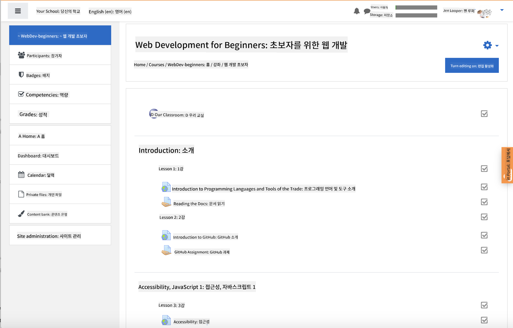

<!--
CO_OP_TRANSLATOR_METADATA:
{
  "original_hash": "71009af209f81cc01a1f2d324200375f",
  "translation_date": "2025-10-03T09:04:50+00:00",
  "source_file": "for-teachers.md",
  "language_code": "ko"
}
-->
### 교육자를 위한 안내

이 커리큘럼은 교실에서 자유롭게 활용하실 수 있습니다. GitHub Classroom 및 주요 LMS 플랫폼과 원활하게 작동하며, 학생들과 함께 독립적인 저장소로도 사용할 수 있습니다.

### GitHub Classroom과 함께 사용하기

코호트별로 수업과 과제를 관리하려면, 각 수업마다 별도의 저장소를 생성하여 GitHub Classroom이 각 과제를 독립적으로 연결할 수 있도록 합니다.

- 이 저장소를 조직으로 포크합니다.
- 각 수업 폴더를 별도의 저장소로 분리하여 수업별로 저장소를 만듭니다.
  - 옵션 A: 빈 저장소를 생성하고(수업당 하나씩) 각 수업 폴더의 내용을 복사합니다.
  - 옵션 B: Git 기록을 유지하는 접근 방식(예: 폴더를 새 저장소로 분리)을 사용하여 출처를 보존합니다.
- GitHub Classroom에서 각 수업에 대한 과제를 생성하고 해당 수업 저장소를 연결합니다.
- 추천 설정:
  - 저장소 가시성: 학생 작업을 위해 비공개로 설정.
  - 수업 저장소의 기본 브랜치에서 시작 코드 사용.
  - 퀴즈와 제출을 위한 이슈 및 풀 리퀘스트 템플릿 추가.
  - 수업에 자동 채점 및 테스트가 포함된 경우 이를 선택적으로 구성.
- 도움이 되는 규칙:
  - 저장소 이름: lesson-01-intro, lesson-02-html 등.
  - 라벨: quiz, assignment, needs-review, late, resubmission.
  - 코호트별 태그/릴리즈(e.g., v2025-term1).

팁: Windows에서 Git 충돌을 방지하기 위해 저장소를 동기화된 폴더(예: OneDrive/Google Drive) 내부에 저장하지 마세요.

### Moodle, Canvas, Blackboard와 함께 사용하기

이 커리큘럼은 일반적인 LMS 워크플로우를 위한 가져오기 패키지를 포함하고 있습니다.

- Moodle: 전체 과정을 로드하려면 [Moodle 업로드 파일](../../../../../../../teaching-files/webdev-moodle.mbz)을 사용하세요.
- Common Cartridge: 더 넓은 LMS 호환성을 위해 [Common Cartridge 파일](../../../../../../../teaching-files/webdev-common-cartridge.imscc)을 사용하세요.
- 참고 사항:
  - Moodle Cloud는 Common Cartridge 지원이 제한적입니다. 위의 Moodle 파일을 사용하는 것이 좋으며, 이는 Canvas에도 업로드할 수 있습니다.
  - 가져온 후, 모듈, 마감일, 퀴즈 설정을 학기 일정에 맞게 검토하세요.

> Moodle 교실에서의 커리큘럼

> Canvas에서의 커리큘럼

### 저장소를 직접 사용하기 (GitHub Classroom 없이)

GitHub Classroom을 사용하지 않으려면 이 저장소에서 직접 과정을 진행할 수 있습니다.

- 동기식/온라인 형식(Zoom/Teams):
  - 멘토가 이끄는 짧은 워밍업을 진행하고, 퀴즈를 위해 브레이크아웃 룸을 사용합니다.
  - 퀴즈 제출 시간 창을 공지하고, 학생들이 GitHub Issues로 답안을 제출합니다.
  - 협업 과제의 경우, 학생들이 공개된 수업 저장소에서 작업하고 풀 리퀘스트를 엽니다.
- 비공개/비동기식 형식:
  - 학생들이 각 수업을 자신의 **비공개** 저장소로 포크하고, 교사를 협력자로 추가합니다.
  - 학생들은 교실 저장소 또는 자신의 비공개 포크에서 Issues(퀴즈)와 Pull Requests(과제)를 통해 제출합니다.

### 모범 사례

- Git/GitHub 기본 사항, Issues, PR에 대한 오리엔테이션 수업을 제공합니다.
- 다단계 퀴즈/과제를 위한 체크리스트를 Issues에 추가합니다.
- CONTRIBUTING.md와 CODE_OF_CONDUCT.md를 추가하여 교실 규범을 설정합니다.
- 접근성 노트(대체 텍스트, 캡션)를 추가하고 인쇄 가능한 PDF를 제공합니다.
- 학기별로 콘텐츠를 버전 관리하고, 수업 저장소를 게시 후 동결합니다.

### 피드백 및 지원

이 커리큘럼이 교사와 학생들에게 유용하게 작동하길 바랍니다. 버그, 요청 또는 개선 사항이 있다면 이 저장소에서 새로운 Issue를 열거나 Teacher Corner에서 논의를 시작하세요.

---

**면책 조항**:  
이 문서는 AI 번역 서비스 [Co-op Translator](https://github.com/Azure/co-op-translator)를 사용하여 번역되었습니다. 정확성을 위해 최선을 다하고 있으나, 자동 번역에는 오류나 부정확성이 포함될 수 있습니다. 원본 문서의 원어 버전을 신뢰할 수 있는 권위 있는 자료로 간주해야 합니다. 중요한 정보의 경우, 전문적인 인간 번역을 권장합니다. 이 번역 사용으로 인해 발생하는 오해나 잘못된 해석에 대해 당사는 책임을 지지 않습니다.