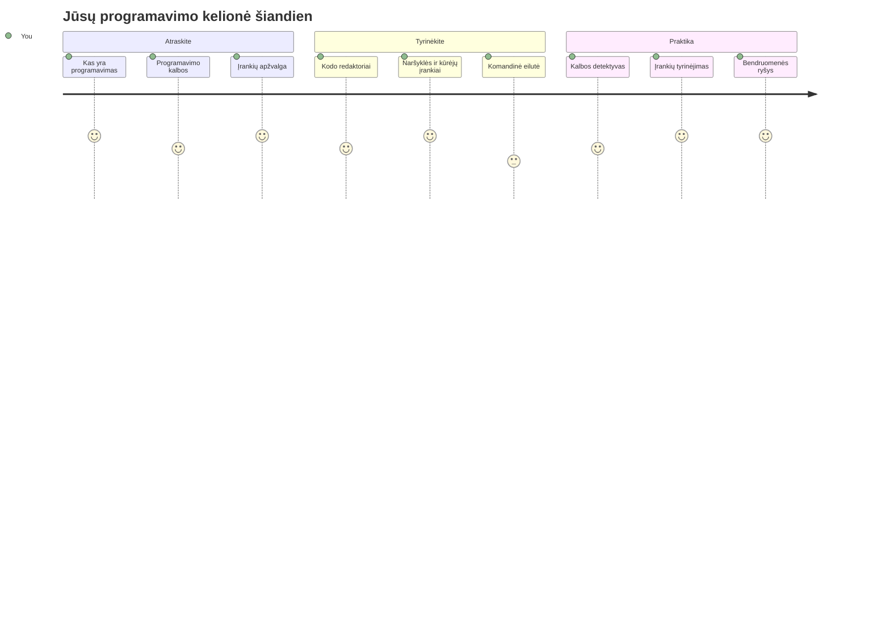
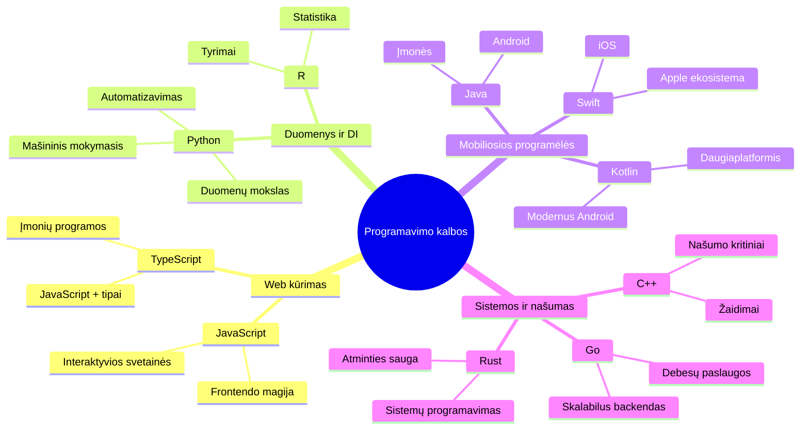
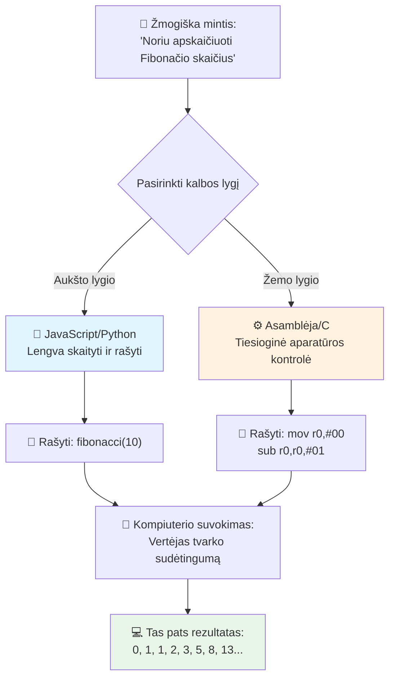
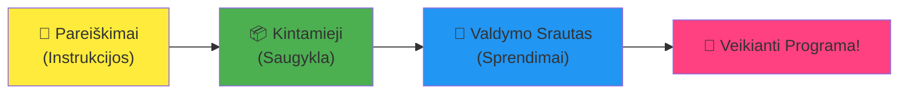
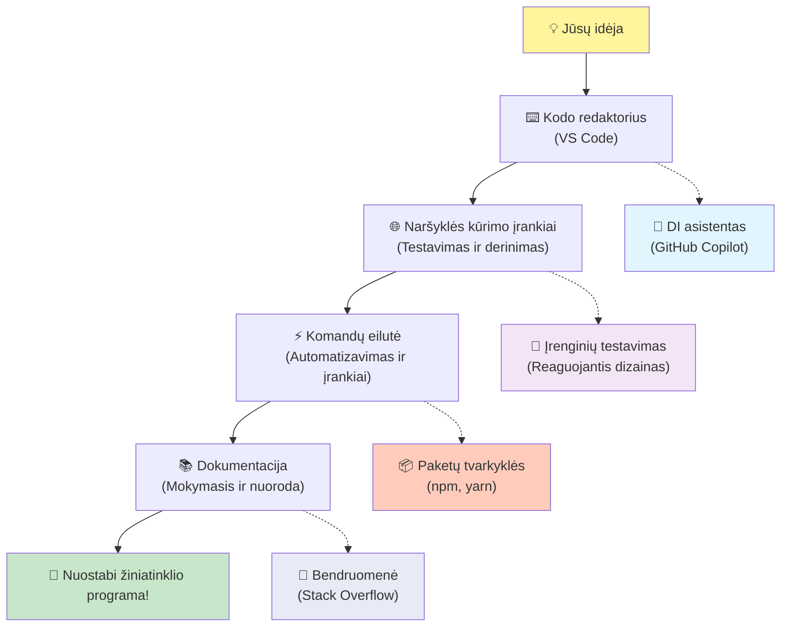
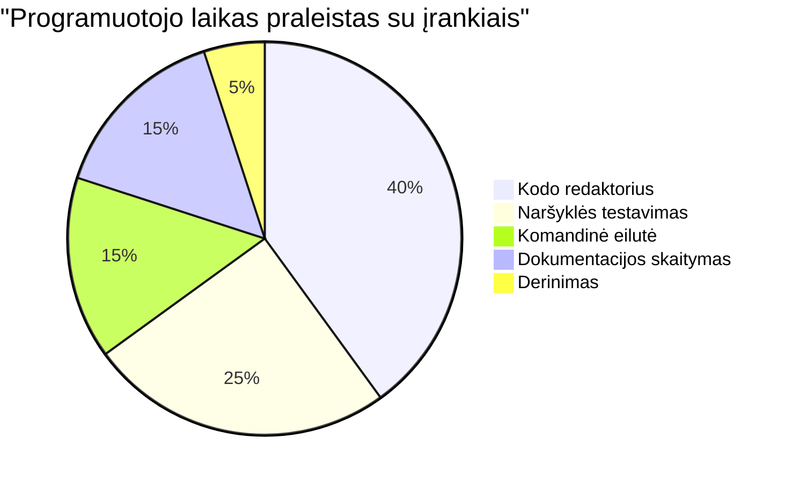
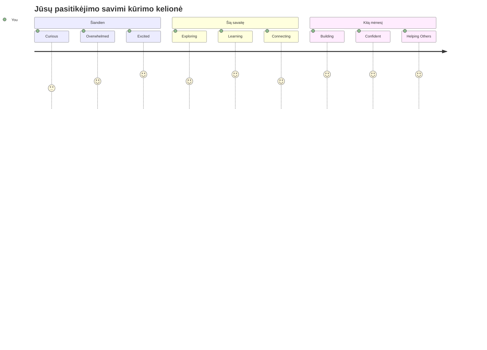

<!--
CO_OP_TRANSLATOR_METADATA:
{
  "original_hash": "d45ddcc54eb9232a76d08328b09d792e",
  "translation_date": "2026-01-07T12:19:52+00:00",
  "source_file": "1-getting-started-lessons/1-intro-to-programming-languages/README.md",
  "language_code": "lt"
}
-->
# Įvadas į programavimo kalbas ir modernius kūrėjų įrankius

Sveikas, būsimasis kūrėjau! 👋 Ar galiu tau pasakyti kažką, kas vis dar kasdien sukelia man šiurpuliukus? Tu netrukus suprasi, kad programavimas – tai ne tik apie kompiuterius – tai apie tikrąsias supergalias, kurios leidžia įgyvendinti tavo laukinius sumanymus!

Žinai tą akimirką, kai naudoji savo mėgstamą programėlę ir viskas tiesiog veikia tobuloje harmonijoje? Kai paspaudi mygtuką ir įvyksta kažkas visiškai stebuklingo, dėl ko sakančiausi: „oho, kaip jie TAI padarė?“ Na, kažkas panašaus į tave – tikriausiai sėdintis savo mėgstamoje kavinėje vidurnaktį su trečiąja espresso porcija – parašė tą kodą, kuris sukūrė tą magiją. Ir štai kas privers tave nustebti: pamoko pabaigoje tu ne tik suprasi, kaip jie tai padarė, bet ir pats norėsi išbandyti!

Žinau, programuoti gali atrodyti baugu. Kai aš pradėjau, man atrodė, kad turi būti kažkokiu būdu matematikos genijus arba programuoti nuo penkerių metų. Bet štai kas visiškai pakeitė mano požiūrį: programavimas yra kaip išmokti kalbėti nauja kalba. Pradedi nuo „labas“ ir „ačiū“, paskui gali užsisakyti kavos, o netrukus jau kalbiesi apie gilias filosofines temas! Tik šiuo atveju – tu kalbiesi su kompiuteriais, ir žinai ką? Jie yra kantriausi pašnekovai – niekada nenuvertina tavo klaidų ir visada entuziastingai nori pabandyti dar kartą!

Šiandien pažvelgsime į neįtikėtinas priemones, kurios daro šiuolaikinį žiniatinklio kūrimą ne tik įmanomu, bet ir labai priklausomybę sukeliančiu užsiėmimu. Kalbu apie tuos pačius redaktorius, naršykles ir darbo eigas, kuriomis kasdien naudojasi kūrėjai Netflix, Spotify bei tavo mėgstamoje nepriklausomoje programėlių studijoje. Ir štai kas privers tave šokti iš džiaugsmo: dauguma šių profesionalių, pramonės standartų įrankių yra visiškai nemokami!


> Sketchnote autorius [Tomomi Imura](https://twitter.com/girlie_mac)


## Pažiūrėkime, ką jau žinai!

Prieš pereidami prie linksmybių, įdomu – ką tu jau žinai apie šį programavimo pasaulį? Ir žinok, jei žvelgi į šiuos klausimus galvodamas „Aš nieko apie tai nežinau iš viso“, tai ne tik gerai, bet puiku! Tai reiškia, kad esi būtent ten, kur reikia. Galvok apie šį testą kaip apie apšilimą prieš treniruotę – tiesiog šildome smegenų raumenis!

[Atlik pradžios testą](https://forms.office.com/r/dru4TE0U9n?origin=lprLink)


## Nuotykis, kurį keliausime kartu

Gerai, aš tikrai negaliu nusėdėti iš džiaugsmo, ką šiandien tyrinėsime! Rimtai, norėčiau matyti tavo veidą, kai kai kurios iš šių sąvokų tikrai įsisavins. Štai neįtikėtina kelionė, kurią keliaujame kartu:

- **Kas yra programavimas iš tikrųjų (ir kodėl tai pats šauniausias dalykas!)** – Atraskime, kaip kodas yra nematoma magija, valdanti viską aplink tave, nuo to žadintuvo, kuris kaip nors žino, kad yra pirmadienio rytas, iki algoritmo, kuris idealiai atrenka tavo Netflix rekomendacijas
- **Programavimo kalbos ir jų nuostabios asmenybės** – Įsivaizduok, kad įeini į vakarėlį, kuriame kiekvienas žmogus turi visiškai skirtingas supergalias ir problemų sprendimo būdus. Taip ir su programavimo kalbomis, ir tau patiks jas pažinti!
- **Pagrindiniai blokai, kurie sukuria skaitmeninę magiją** – Įsivaizduok tai kaip neprilygstamą kūrybinį LEGO rinkinį. Kai suprasi, kaip šios dalys dera tarpusavyje, suprasi, kad gali statyti bet ką, ką tik įsivaizduoji
- **Profesionalūs įrankiai, kurie privers tave jaustis lyg ką tik gavai burtininko lazdelę** – Nėra jokio perdėjimo – šie įrankiai iš tiesų privers tave pasijusti turint supergalias, o geriausia? Tai tie patys įrankiai, kuriuos naudoja profesionalai!

> 💡 **Štai kas svarbu**: šiandien nė nebandyk įsiminti visko! Šiuo metu tiesiog noriu, kad pajustum tą susidomėjimą dėl galimų dalykų. Detalės natūraliai įsigers, kai mokysimės kartu – taip vyksta tikras mokymasis!

> Šią pamoką gali atlikti [Microsoft Learn](https://docs.microsoft.com/learn/modules/web-development-101/introduction-programming/?WT.mc_id=academic-77807-sagibbon)!

## Tai kas gi iš tikrųjų yra *programavimas*?

Gerai, imkime milijono dolerių vertės klausimą: kas yra programavimas iš tikrųjų?

Papasakosiu tau istoriją, kuri visiškai pakeitė mano požiūrį. Praėjusią savaitę bandžiau paaiškinti mamai, kaip naudotis mūsų naujuoju išmaniuoju televizoriaus pultu. Aš svarsčiau, sakydamas: „Paspausk raudoną mygtuką, bet ne didelį raudoną mygtuką, mažą raudoną kairėje... ne, tavo kita kairė... gerai, dabar palaikyk du sekundes, ne vieną, ne tris...“ Skamba pažįstamai? 😅

Tai yra programavimas! Tai menas duoti labai detalias, žingsnis po žingsnio instrukcijas kažkam labai galingam, bet kuriam reikia itin aiškiai viską išdėstyti. Tik vietoj to, kad aiškintum mamai (kuri gali paklausti „kuris raudonas mygtukas?!“), aiškini kompiuteriui (kuris tiksliai daro tai, ką sakai, net jei tai, ką sakei, nėra būtent tai, ką norėjai pasakyti).

Štai kas mane nustebino, kai tik pradėjau mokytis: kompiuteriai iš esmės yra gana paprasti. Jie supranta tik du dalykus – 1 ir 0, kas iš esmės yra „taip“ ir „ne“ arba „įjungta“ ir „išjungta.“ Tai viskas! Bet štai kur prasideda magija – mes nemokame kalbėti tik 1 ir 0, tarsi būtume „Matricoje.“ Čia į pagalbą ateina **programavimo kalbos**. Jos kaip geriausias vertėjas pasaulyje, kuris tau padeda išreikšti tavo paprastus žmonių mintis kompiuterių kalba.

Ir štai kas vis dar kas rytą man kelia šiurpuliukus: pažink, kad *viskas* skaitmeniniame pasaulyje tavo gyvenime prasidėjo nuo kažkieno panašaus į tave, tikriausiai sėdinčio pižamoje su puoduku kavos, rašančio kodą į savo nešiojamąjį kompiuterį. Tas Instagram filtras, kuris padaro tave tobulą? Kas nors parašė tą kodą. Rekomendacija, kuri nuvedė tave prie naujos mėgstamos dainos? Kūrėjas sukūrė tą algoritmą. Programėlė, kuri padeda tau dalintis vakarienės sąskaitą su draugais? Taip, kažkas pagalvojo „čia erzina, aš galėčiau tai išspręsti“ ir tada… tai padarė!

Kai išmoksti programuoti, tu ne tik įgyji naują įgūdį – tu tampi šios nuostabios bendruomenės dalimi, kurią sudaro problemoms spręsti skirtų žmonių grupė, kuri kasdien galvoja: „O ką, jei galėčiau sukurti kažką, kas šiek tiek pagerintų kieno nors dieną?“ Sąžiningai, ar yra kas nors šaunesnio?

✅ **Smagus faktas**: štai kažkas labai įdomaus, ką gali paieškoti, kai turėsi laisvą minutę – kas, tavo manymu, buvo pirmasis pasaulio kompiuterio programuotojas? Duosiu užuominą: tai gali būti ne tas, ko tikiesi! Šio žmogaus istorija yra tikrai fascinanti ir parodo, kad programavimas visada buvo kūrybiškas problemų sprendimas ir mąstymas už įprastų ribų.

### 🧠 **Patikrink save: kaip jautiesi?**

**Skirk minutėlę apmąstymams:**
- Ar dabar tau prasminga idėja „duoti instrukcijas kompiuteriams“?
- Ar gali pagalvoti apie kasdienę užduotį, kurią norėtum automatizuoti programuodamas?
- Kokie klausimai kyla tavo galvoje apie visą tą programavimo pasaulį?

> **Prisimink**: visiškai normalu, jei kai kurios sąvokos atrodo miglotos. Programavimą mokytis yra kaip naują kalbą – smegenims reikia laiko sukurti naujus ryšius. Tu darai puikiai!

## Programavimo kalbos – tai kaip skirtingi magijos skoniai

Gerai, tai skambės keistai, bet lik su manimi – programavimo kalbos daug kuo panašios į skirtingų muzikos stilių rūšis. Pagalvok: turi džiazą, kuris yra švelnus ir improvizuojantis, roką, kuris yra galingas ir tiesmukas, klasiką, kuri elegantiška ir struktūruota, ir hiphopą, kuris kūrybingas ir išraiškingas. Kiekvienas stilius turi savo nuotaiką, savo aistringų gerbėjų bendruomenę, ir kiekvienas puikiai tinka skirtingiems jausmams bei progoms.

Programavimo kalbos veikia lygiai taip pat! Tu juk nenaudotum tos pačios kalbos kurdama linksmą mobilią žaidimą ir apdorojant milžiniškus klimato duomenis, taip pat kaip nesileisi žaisti death metalo jogų užsiėmime (na, daugelyje užsiėmimų tikrai ne! 😄).

Bet štai kas mane visuomet stulbina: šios kalbos yra kaip kantriausias, genialiausias pasaulio vertėjas, sėdintis šalia tavęs. Tu gali išreikšti savo idėjas taip, kaip tau natūralu kaip žmogui, o jos atlieka visą sudėtingą darbą verčiant tai į kompiuterio kalbą, kurią sudaro 1 ir 0. Tai kaip turėti draugą, kuris puikiai moka tiek „žmogišką kūrybiškumą“, tiek „kompiuterinę logiką“ – jie niekada nepavargsta, niekada neprisiruošia kavos pertraukėlės, ir niekada tavęs nevertina, jei paklai aus tą patį klausimą du kartus!

### Populiarios programavimo kalbos ir jų panaudojimas


| Kalba | Geriausia naudoti | Kodėl populiari |
|----------|----------|------------------|
| **JavaScript** | Žiniatinklio kūrimas, vartotojo sąsajos | Veikia naršyklėse ir valdo interaktyvias svetaines |
| **Python** | Duomenų mokslas, automatizavimas, dirbtinis intelektas | Lengva skaityti ir mokytis, galingos bibliotekos |
| **Java** | Verslo programos, Android programėlės | Platformų nepriklausoma, stabili didelėms sistemoms |
| **C#** | Windows programos, žaidimų kūrimas | Stipri Microsoft ekosistema |
| **Go** | Debesų paslaugos, serverio pusės sistemos | Greita, paprasta, sukurta šiuolaikiniam skaičiavimui |

### Aukšto lygio ir žemo lygio kalbos

Gerai, tai buvo sąvoka, kuri visiškai sudaužė mano smegenis, kai pradėjau mokytis, todėl pasidalinsiu analogija, kuri man pagaliau padėjo suprasti – ir tikiuosi, padės ir tau!

Įsivaizduok, kad esi svečiuose šalyje, kurios kalbos nemoki, ir desperatiškai nori rasti artimiausią tualetą (visi per gyvenimą esame buvę tokioje situacijoje, tiesa? 😅):

- **Žemo lygio programavimas** yra kaip taip gerai išmokti vietinę tarme, kad gali kalbėtis su močiute, kuri parduoda vaisius kampe, naudodamas kultūrinius potekstes, vietinius slengus ir užkulisines anekdotų nuorodas, kurias supranta tik tas, kas užaugo ten. Labai įspūdinga ir be galo efektyvu... jei esi gimtakalbis! Bet gana baugu, kai tiesiog bandai rasti tualetą.

- **Aukšto lygio programavimas** yra kaip turėti nuostabų vietinį draugą, kuris tave puikiai supranta. Gali pasakyti „Man tikrai reikia rasti tualetą“ paprasta anglų kalba, o jis pasirūpina visa kultūrine interpretacija ir nurodo kelią taip, kad tavo nelokalams smegenims viskas būtų aišku.

Programavimo terminais:
- **Žemo lygio kalbos** (pvz., Assembly ar C) leidžia labai detaliai bendrauti su kompiuterio aparatine įranga, bet reikia galvoti kaip mašina, o tai... sakykime, didelis protinis pokytis!
- **Aukšto lygio kalbos** (pvz., JavaScript, Python ar C#) leidžia mąstyti kaip žmogus, o jos rūpinasi visa mašinos kalba užkulisiuose. Be to, jose gyvena draugiškos bendruomenės, pilnos žmonių, kurie prisimena, kaip buvo naujokai ir tikrai nori padėti!

Spėk, kurias aš pasiūlysiu pradėti tau? 😉 Aukšto lygio kalbos yra kaip treniruočių ratukai, kurių tu iš tiesų niekada nenorėsi nusimesti, nes jos daro visą patirtį daug malonesnę!


### Parodysiu, kodėl aukšto lygio kalbos yra kur kas draugiškesnės

Gerai, ketinu tau parodyti ką nors, kas puikiai iliustruoja, kodėl aš įsimylėjau aukšto lygio kalbas, bet pirmiausia – pažadu man kažką. Kai pamatysi pirmą kodo pavyzdį, nesijaudink! Jis turi atrodyti šiek tiek bauginantis. Būtent tai aš ir noriu parodyti!

Pažiūrėsime tą pačią užduotį parašytą dviem visiškai skirtingais stiliais. Abi kuria tai, kas vadinama Fibonacci seka – gražus matematinis modelis, kuriame kiekvienas skaičius yra dviejų prieš jį esančių suma: 0, 1, 1, 2, 3, 5, 8, 13... (Smagus faktas: šį modelį rasi tiesiog visur gamtoje – saulėgrąžų sėklų spiralėse, kankorėžių raštuose, netgi galaktikų formavime!)

Pasiruošęs pamatyti skirtumą? Pradėkime!

**Aukšto lygio kalba (JavaScript) – žmogui draugiška:**

```javascript
// 1 žingsnis: Pagrindinis Fibonačio nustatymas
const fibonacciCount = 10;
let current = 0;
let next = 1;

console.log('Fibonacci sequence:');
```

**Štai ką daro šis kodas:**
- **Nustato** konstantą, kiek Fibonacci skaičių norime sugeneruoti
- **Inicijuoja** du kintamuosius, kurie seka esamą ir kitą skaičių sekoje
- **Nustato** pradines reikšmes (0 ir 1), kurios apibrėžia Fibonacci modelį
- **Rodo** antraštę, kad pažymėtų mūsų išvestį

```javascript
// 2 veiksmas: Sukurkite seką su kilpa
for (let i = 0; i < fibonacciCount; i++) {
  console.log(`Position ${i + 1}: ${current}`);
  
  // Apskaičiuokite kitą sekos skaičių
  const sum = current + next;
  current = next;
  next = sum;
}
```

**Kas vyksta čia:**
- **Kartojame** per visą sekos ilgį naudodami `for` ciklą
- **Rodo** kiekvieną skaičių su jo padėtimi naudodami šabloninį formatavimą
- **Apskaičiuoja** kitą Fibonacci skaičių pridėdami dabartinį ir kitą skaičių
- **Atnaujina** kintamuosius sekti, kad pereitume prie kitos iteracijos

```javascript
// 3 žingsnis: Modernus funkcinis požiūris
const generateFibonacci = (count) => {
  const sequence = [0, 1];
  
  for (let i = 2; i < count; i++) {
    sequence[i] = sequence[i - 1] + sequence[i - 2];
  }
  
  return sequence;
};

// Naudojimo pavyzdys
const fibSequence = generateFibonacci(10);
console.log(fibSequence);
```

**Aukščiau mes:**
- **Sukūrėme** pakartotinai naudojamą funkciją naudodami modernią rodyklės funkcijos sintaksę
- **Sukonstravome** masyvą, kuriame saugoma visa seka, o ne rodoma po vieną skaičių
- **Naudojame** masyvo indeksavimą, kad apskaičiuotume kiekvieną naują skaičių iš ankstesnių
- **Gražiname** visą seką, kad galėtume lankščiai naudoti kitose programos vietose

**Žemo lygio kalba (ARM Assembly) – kompiuteriui draugiška:**

```assembly
 area ascen,code,readonly
 entry
 code32
 adr r0,thumb+1
 bx r0
 code16
thumb
 mov r0,#00
 sub r0,r0,#01
 mov r1,#01
 mov r4,#10
 ldr r2,=0x40000000
back add r0,r1
 str r0,[r2]
 add r2,#04
 mov r3,r0
 mov r0,r1
 mov r1,r3
 sub r4,#01
 cmp r4,#00
 bne back
 end
```

Pastebėk, kaip JavaScript variantas beveik skaito kaip anglų kalbos instrukcijos, o Assembly versija naudoja paslaptimis apipintas komandas, kurios tiesiogiai valdo kompiuterio procesorių. Abi atlieka tą pačią užduotį, bet aukšto lygio kalba yra daug lengviau suprantama, parašoma ir palaikoma žmogui.

**Svarbūs skirtumai:**
- **Skaitomumas**: JavaScript naudoja aprašomuosius pavadinimus, tokius kaip `fibonacciCount`, o Assembly – paslėptus ženklus, tokius kaip `r0`, `r1`
- **Komentarai**: Aukšto lygio kalbos skatina aiškius komentarus, kurie daro kodą savarankiškai aprašomu
- **Struktūra**: JavaScript loginis srautas atitinka, kaip žmonės žingsnis po žingsnio mąsto apie problemas
- **Priežiūra**: JavaScript versijos atnaujinimas skirtingiems reikalavimams yra paprastas ir aiškus

✅ **Apie Fibonačio seką**: Šis tiesiog nuostabus skaičių modelis (kai kiekvienas skaičius yra dviejų prieš jį esančių suma: 0, 1, 1, 2, 3, 5, 8...) pasitaiko tiesiog *visur* gamtoje! Jį rasite saulėgrąžų spiralėse, pušies kūgio raštuose, nukalnių kriauklių išlinkimuose, ir netgi medžių šakų augime. Tai tikrai nuostabu, kaip matematika ir kodas gali padėti mums suprasti ir atkurti modelius, kuriuos gamta naudoja kurdama grožį!


## Statybiniai blokai, kurie sukuria magiją

Gerai, dabar, kai matėte, kaip atrodytų programavimo kalbos veikiant, išskaidykime pagrindines dalis, kurios sudaro praktiškai kiekvieną kada nors parašytą programą. Įsivaizduokite jas kaip svarbiausias sudedamąsias jūsų mėgstamoje recepto dalyje – kai suprasite, ką kiekviena daro, galėsite skaityti ir rašyti kodą beveik bet kuria kalba!

Tai yra tarsi mokytis programavimo gramatikos. Prisiminkite mokykloje, kai mokėtės apie daiktavardžius, veiksmus ir kaip daryti sakinius? Programavimas turi savąją gramatiką, ir tiesą sakant, ji daug logiškesnė ir atlaidesnė nei anglų kalbos gramatika! 😄

### Pareiškimai: žingsnis po žingsnio instrukcijos

Pradėkime nuo **pareiškimų** – tai tarsi atskiri sakiniai pokalbyje su jūsų kompiuteriu. Kiekvienas pareiškimas liepia kompiuteriui atlikti vieną konkretų veiksmą, panašiai kaip duodami nurodymus: „Pasukite čia į kairę“, „Sustokite prie raudono šviesoforo“, „Pastatykite automobilį šioje vietoje.“

Man patinka pareiškimų skaitomumas. Pažiūrėkite:

```javascript
// Pagrindinės komandos, kurios atlieka vienkartines veiksmus
const userName = "Alex";                    
console.log("Hello, world!");              
const sum = 5 + 3;                         
```

**Štai ką daro šis kodas:**
- **Deklaruoja** konstantą kintamąjį, kuriame saugomas vartotojo vardas
- **Rodo** pasveikinimo žinutę konsolėje
- **Apskaičiuoja** ir saugo matematinių veiksmų rezultatą

```javascript
// Teiginiai, sąveikaujantys su tinklalapiais
document.title = "My Awesome Website";      
document.body.style.backgroundColor = "lightblue";
```

**Žingsnis po žingsnio, štai kas vyksta:**
- **Keičia** interneto svetainės puslapio pavadinimą, rodomą naršyklės skirtuke
- **Pakeičia** viso puslapio fono spalvą

### Kintamieji: Jūsų programos atminties sistema

Gerai, **kintamieji** man yra viena iš mėgstamiausių mokymo sąvokų, nes jie labai panašūs į dalykus, kuriuos kasdien naudojate!

Pagalvokite apie savo telefono kontaktų sąrašą. Jūs neužsirašote visų numerių atmintinai – vietoj to išsaugote „Mama“, „Geriausias draugas“ ar „Picerija, kuri tiekia iki 2 val. nakties“ ir telefono telefono atmintis prisimena tikruosius numerius. Kintamieji veikia lygiai taip pat! Jie tarsi pavadintos talpyklos, kuriose programa gali saugoti informaciją ir vėliau ją rasti pagal prasmingą pavadinimą.

Štai kas išties nuostabu: kintamieji gali keistis, kai programa veikia (todėl jie ir vadinami „kintamaisiais“ – suprantate, ką jie padarė?). Kaip atnaujinate tą picerijos kontaktą, kai radote dar geresnę vietą, taip kintamieji atnaujinami, kai programa sužino naujos informacijos arba kai situacijos keičiasi!

Leiskite parodyti, kaip tai gali būti paprasta ir gražu:

```javascript
// 1 žingsnis: kuriami pagrindiniai kintamieji
const siteName = "Weather Dashboard";        
let currentWeather = "sunny";               
let temperature = 75;                       
let isRaining = false;                      
```

**Šių sąvokų supratimas:**
- **Laikykite** nekintančias reikšmes `const` kintamuosiuose (pavyzdžiui, svetainės pavadinimą)
- **Naudokite** `let` vertėms, kurios gali keistis programos eigoje
- **Priskirkite** skirtingų tipų duomenis: tekstus (eilutes), skaičius ir bool tipo reikšmes (true/false)
- **Rinkitės** aiškius pavadinimus, kurie paaiškina, ką kiekvienas kintamasis saugo

```javascript
// 2 žingsnis: Darbas su objektais siekiant suskirstyti susijusius duomenis
const weatherData = {                       
  location: "San Francisco",
  humidity: 65,
  windSpeed: 12
};
```

**Aukščiau mes:**
- **Sukūrėme** objektą, kuris grupuoja susijusią oro sąlygų informaciją
- **Organizavome** kelias duomenų dalis po vienu kintamuoju pavadinimu
- **Panaudojome** raktas-reikšmė poras, kad aiškiai pažymėtume kiekvieną duomenų dalį

```javascript
// 3 žingsnis: kintamųjų naudojimas ir atnaujinimas
console.log(`${siteName}: Today is ${currentWeather} and ${temperature}°F`);
console.log(`Wind speed: ${weatherData.windSpeed} mph`);

// Keičiami kintamieji atnaujinami
currentWeather = "cloudy";                  
temperature = 68;                          
```

**Suvokime kiekvieną dalį:**
- **Rodyti** informaciją naudojant šablonines eilutes su `${}` sintakse
- **Pasiekti** objekto savybes naudojant taško žymėjimą (`weatherData.windSpeed`)
- **Atnaujinti** `let` deklaruotus kintamuosius, kad atspindėtų kintančias sąlygas
- **Derinti** kelis kintamuosius, kad sukurtumėte prasmingas žinutes

```javascript
// 4 žingsnis: Modernus destruktūravimas švaresniam kodui
const { location, humidity } = weatherData; 
console.log(`${location} humidity: ${humidity}%`);
```

**Tai, ką reikia žinoti:**
- **Išskirti** specifines objekto savybes naudojant destruktuojantį priskyrimą
- **Automatiškai kurti** naujus kintamuosius su tokiais pačiais pavadinimais kaip objekto raktai
- **Supaprastinti** kodą vengiant pasikartojančio taško žymėjimo

### Valdymo eiga: mokome programą mąstyti

Gerai, čia prasideda tikras programavimo stebuklas! **Valdymo eiga** iš esmės reiškia mokyti programą priimti protingus sprendimus, kaip darote kiekvieną dieną, net apie tai negalvodami.

Įsivaizduokite: šiandien rytą turbūt pagalvojote „Jei lyja, pasiimsiu skėtį. Jei šalta – užsidėsiu striukę. Jei vėluoju, praleisiu pusryčius ir nusipirksiu kavos kelyje.“ Jūsų smegenys natūraliai seka šią jeigu-tada logiką dešimtis kartų kasdien!

Tai leidžia programoms atrodyti protingoms ir gyvoms, o ne tiesiog vykdyti nuobodžius, nuspėjamus scenarijus. Jos gali pažvelgti į situaciją, įvertinti, kas vyksta, ir tinkamai atsakyti. Lyg suteiktumėte savo programai smegenis, kurios gali prisitaikyti ir priimti sprendimus!

Norite pamatyti, kaip gražiai visa tai veikia? Leiskite parodyti:

```javascript
// 1 žingsnis: Pagrindinė sąlyginė logika
const userAge = 17;

if (userAge >= 18) {
  console.log("You can vote!");
} else {
  const yearsToWait = 18 - userAge;
  console.log(`You'll be able to vote in ${yearsToWait} year(s).`);
}
```

**Štai ką daro šis kodas:**
- **Patikrina**, ar vartotojo amžius atitinka balsavimo reikalavimus
- **Vykdo** skirtingus kodo blokus pagal sąlygos rezultatą
- **Apskaičiuoja** ir rodo, kiek liko laiko iki balsavimo teisės, jei mažiau nei 18
- **Teikia** konkrečią ir naudingą grįžtamąją informaciją kiekvienam atvejui

```javascript
// 2 žingsnis: kelios sąlygos su loginiais operatoriais
const userAge = 17;
const hasPermission = true;

if (userAge >= 18 && hasPermission) {
  console.log("Access granted: You can enter the venue.");
} else if (userAge >= 16) {
  console.log("You need parent permission to enter.");
} else {
  console.log("Sorry, you must be at least 16 years old.");
}
```

**Išskaidykime, kas čia vyksta:**
- **Sujungia** kelias sąlygas naudodama `&&` (ir) operatorių
- **Sukuria** sąlygų hierarchiją naudodama `else if` keliems scenarijams
- **Tvarko** visas galimas bylas naudodama galutinį `else` pareiškimą
- **Teikia** aiškią, veiksmingą grįžtamąją informaciją kiekvienai skirtingai situacijai

```javascript
// 3 žingsnis: Trumpa sąlyga su ternariniu operatoriumi
const votingStatus = userAge >= 18 ? "Can vote" : "Cannot vote yet";
console.log(`Status: ${votingStatus}`);
```

**Tai, ką verta prisiminti:**
- **Naudokite** ternarinį operatorių (`? :`) paprastoms dvejetainėms sąlygoms
- **Rašykite** sąlygą pirmiausia, tada `?`, po jos tiesa, tada `:`, po to melas
- **Pritaikykite** šį modelį, kai reikia priskirti reikšmes pagal sąlygas

```javascript
// 4 žingsnis: kelių specifinių atvejų tvarkymas
const dayOfWeek = "Tuesday";

switch (dayOfWeek) {
  case "Monday":
  case "Tuesday":
  case "Wednesday":
  case "Thursday":
  case "Friday":
    console.log("It's a weekday - time to work!");
    break;
  case "Saturday":
  case "Sunday":
    console.log("It's the weekend - time to relax!");
    break;
  default:
    console.log("Invalid day of the week");
}
```

**Šis kodas atlieka šiuos veiksmus:**
- **Palygina** kintamojo reikšmę su keliais specifiniais atvejais
- **Grupuoja** panašias bylas (darbo dienos prieš savaitgalius)
- **Vykdo** tinkamą kodą, kai randamas sutapimas
- **Įtraukia** `default` atvejį neplanuotoms reikšmėms
- **Naudoja** `break` pareiškimus, kad nebūtų tęsiamas kodas kitam atvejui

> 💡 **Tikro gyvenimo analogija**: Valdymo eigą įsivaizduokite kaip kantriausią GPS pasaulyje, kuris jums duoda nurodymus. Jis gali pasakyti „Jei Main gatvėje yra kamštis, važiuok greitkeliu. Jei greitkelį užkemša statybos, bandyk aplinkkelį.“ Programos naudoja tokią pačią sąlyginę logiką, kad išmintingai reaguotų į įvairias situacijas ir visada suteiktų geriausią patirtį vartotojams.

### 🎯 **Patikrinimas: pagrindų valdymas**

**Pažiūrėkime, kaip sekasi su pagrindais:**
- Ar galite savo žodžiais paaiškinti, kuo skiriasi kintamasis nuo pareiškimo?
- Pagalvokite apie realų gyvenimo pavyzdį, kur naudotumėte jeigu-tada sprendimą (kaip balsavimo pavyzdyje)
- Kas programavimo logikoje jus labiausiai nustebino?

**Greitas pasitikėjimo suteikėjas:**

✅ **Kas bus toliau**: Mes įdomiai gilinsimės į šias sąvokas tęsdamiesi šią nuostabią kelionę kartu! Dabar tiesiog mėgaukitės jauduliu dėl visų nuostabių galimybių priešais jus. Specifiniai įgūdžiai ir technikos natūraliai įsimins, kai mokysimės kartu – pažadu, bus daug smagiau nei tikitės!

## Įrankiai

Gerai, čia aš išties taip jaudinuosi, kad vos susivaldau! 🚀 Kalbėsime apie neįtikėtinus įrankius, kurie leis jaustis, tarsi ką tik gautumėte skaitmeninės kosminės erdvėlaivio raktus.

Žinote, kaip šefas turi tobulai sureguliuotus peilius, kurie tarsi taptų jo rankų pratęsimu? Arba kaip muzikantas turi tą vienintelę gitarą, kuri atrodo kažkaip dainuoja vos tik ją palietus? Na, programuotojai turi savo magiškų įrankių versiją, ir štai kas visiškai nušluostys jums kojas – dauguma jų yra visiškai nemokami!

Praktiškai šoku iš džiaugsmo galvodamas apie tai, kaip visa tai jums papasakoti, nes jie visiškai pakeitė, kaip mes kuriame programinę įrangą. Kalbame apie dirbtiniu intelektu paremtus programavimo padėjėjus, kurie gali padėti jums rašyti kodą (rimtai!), debesis, kur galite kurti visą programą tiesiog iš bet kur su Wi-Fi, bei tokius sudėtingus klaidų taisymo įrankius, kurie tarsi turi rentgeno matymą jūsų programoms.

Ir štai dalis, kuri vis dar man kelia šiurpuliukus: tai nėra „pradedančiųjų įrankiai“, kuriuos peraugsit. Tai yra būtent tie patys profesionalūs įrankiai, kuriuos šiuo pat metu naudoja Google, Netflix ir tas indie programų studija, kurią mylite. Jūs jausitės tikrais profesionalais juos naudodami!


### Kodo redaktoriai ir IDE: jūsų nauji skaitmeniniai draugai

Kalbėkime apie kodo redaktorius – jie tikrai taps jūsų mėgstamiausiomis vietomis kurti! Įsivaizduokite juos kaip asmeninę programavimo erdvę, kur praleisite daugiausiai laiko kurdami ir tobulindami savo skaitmeninius kūrinius.

Bet štai kas nepaprasta apie šiuolaikinius redaktorius: tai ne tik puošnūs teksto redaktoriai. Jie tarsi genialiausi, palaikantys programavimo mentoriai, sėdintys šalia jūsų 24/7. Jie pagauna jūsų klaidas dar prieš jums jas pastebint, siūlo patobulinimus, kurie padaro jus genijumi, padeda suprasti, ką daro kiekviena kodo dalis, o kai kurie net gali nuspėti, ką ketinate rašyti ir pasiūlyti užbaigti jūsų mintis!

Prisimenu, kai atradau automatinį užbaigimą – nejaučiau, kad gyvenu realybėje, tai buvo tarsi ateitis. Pradedate rašyti, o redaktorius sako: „Ei, galvojai apie šią funkciją, kuri daro būtent tai, ko tau reikia?“ Tarsi jūsų programavimo draugas, kuris skaito mintis!

**Kas daro šiuos redaktorius tokiais nuostabiais?**

Šiuolaikiniai kodo redaktoriai siūlo įspūdingą funkcijų sąrašą, skirtą didinti jūsų produktyvumą:

| Funkcija | Ką ji daro | Kodėl ji naudinga |
|---------|--------------|--------------|
| **Sintaksės paryškinimas** | Spalvina skirtingas kodo dalis | Palengvina skaitymą ir klaidų pastebėjimą |
| **Automatinis užbaigimas** | Siūlo kodą rašant | Spartina programavimą ir mažina klaidas |
| **Debug įrankiai** | Padeda rasti ir taisyti klaidas | Taupo valandas sprendžiant problemas |
| **Praplėtimai** | Prideda specializuotas funkcijas | Priderina redaktorių bet kokiai technologijai |
| **DI asistentai** | Siūlo kodo fragmentus ir paaiškinimus | Pagreitina mokymąsi ir darbą |

> 🎥 **Vaizdo įrašas**: Norite pamatyti šiuos įrankius veikiant? Peržiūrėkite [Tools of the Trade video](https://youtube.com/watch?v=69WJeXGBdxg) išsamų apžvalgą.

#### Rekomenduojami redaktoriai interneto kūrimui

**[Visual Studio Code](https://code.visualstudio.com/?WT.mc_id=academic-77807-sagibbon)** (Nemokamas)
- Populiariausias tarp interneto kūrėjų
- Puikus praplėtimų ekosistema
- Integruotas terminalas ir Git palaikymas
- **Būtini priedai**:
  - [GitHub Copilot](https://marketplace.visualstudio.com/items?itemName=GitHub.copilot) - DI pagrįstos kodo rekomendacijos
  - [Live Share](https://marketplace.visualstudio.com/items?itemName=MS-vsliveshare.vsliveshare) - bendradarbiavimas realiu laiku
  - [Prettier](https://marketplace.visualstudio.com/items?itemName=esbenp.prettier-vscode) - automatinis kodo formatavimas
  - [Code Spell Checker](https://marketplace.visualstudio.com/items?itemName=streetsidesoftware.code-spell-checker) - klaidų tikrinimas kode

**[JetBrains WebStorm](https://www.jetbrains.com/webstorm/)** (Mokamas, nemokamas studentams)
- Pažangūs klaidų taisymo ir testavimo įrankiai
- Išmanus kodo užbaigimas
- Integruota versijų kontrolė

**Debesų pagrindu veikiantys IDE** (Įvairios kainos)
- [GitHub Codespaces](https://github.com/features/codespaces) - pilnas VS Code naršyklėje
- [Replit](https://replit.com/) - puikus mokymuisi ir kodo dalijimuisi
- [StackBlitz](https://stackblitz.com/) - momentinė, pilno svorio interneto kūrimas

> 💡 **Pradžios patarimas**: Pradėkite nuo Visual Studio Code – jis nemokamas, plačiai naudojamas pramonėje ir turi milžinišką bendruomenę, kuri kuria naudingus mokymus ir priedus.


### Interneto naršyklės: jūsų slaptos kūrimo laboratorijos

Gerai, pasiruoškite, kad jūsų mintys bus visiškai sudaužytos! Žinote, kaip naudojate naršykles naršydami socialiniuose tinkluose ar žiūrėdami vaizdo įrašus? Paaiškėjo, kad jos visą laiką slėpė šią neįtikėtiną slaptą kūrėjų laboratoriją, tik laukdamos, kol ją atrasite!

Kiekvieną kartą, kai dešiniuoju pelės klavišu spustelite puslapį ir renkatės "Inspect Element" („Tikrinti elementą“), jūs atveriate paslėptą kūrėjų įrankių pasaulį, kuris yra tiesiog galingesnis už kai kurią brangią programinę įrangą, už kurią kažkada mokėjau šimtus dolerių. Tai tarsi atrasti, kad jūsų įprasta virtuvė slepia profesionalaus šefų laboratoriją už slaptos plokštės!
Pirmą kartą, kai kas nors man parodė naršyklės kūrėjo įrankius (DevTools), praleidau maždaug tris valandas tiesiog spustelėdamas ir sakydamas „PALAU, JIS GALI IR TAI?!“ Tu gali tiesiogiai redaguoti bet kurią svetainę realiu laiku, matyti, kaip greitai viskas įsikrauna, testuoti, kaip tavo svetainė atrodo skirtinguose įrenginiuose, ir netgi derinti JavaScript kaip tikras profesionalas. Tai tiesiog stulbinama!

**Štai kodėl naršyklės yra tavo slaptas ginklas:**

Kai kuri savo svetainę ar interneto programą, turi matyti, kaip ji atrodo ir veikia realiame pasaulyje. Naršyklės ne tik rodo tavo darbą, bet ir suteikia išsamų grįžtamąjį ryšį apie našumą, prieinamumą ir galimas problemas.

#### Naršyklės kūrėjo įrankiai (DevTools)

Šiuolaikinės naršyklės apima visapusiškas kūrimo programas:

| Įrankio kategorija | Ką jis daro | Pavyzdinė panaudojimo sritis |
|--------------------|-------------|------------------------------|
| **Elementų inspektorius** | Peržiūri ir redaguoja HTML/CSS realiu laiku | Koreguoja stilių, kad iš karto matytum rezultatus |
| **Konsolė** | Rodo klaidų pranešimus ir leidžia testuoti JavaScript | Derina klaidas ir eksperimentuoja su kodu |
| **Tinklo monitorius** | Stebi, kaip kraunasi resursai | Optimizuoja našumą ir įkėlimo laikus |
| **Prieinamumo tikrintuvas** | Testuoja įtraukiantį dizainą | Užtikrina, kad svetainė veiktų visiems vartotojams |
| **Įrenginių simuliatorius** | Leidžia peržiūrėti skirtingo ekrano dydžių vaizdą | Testuoja reaguojantį dizainą be kelių įrenginių |

#### Rekomenduojamos naršyklės kūrimui

- **[Chrome](https://developers.google.com/web/tools/chrome-devtools/)** – standartinis DevTools su detalia dokumentacija
- **[Firefox](https://developer.mozilla.org/docs/Tools)** – puikūs įrankiai CSS Grid ir prieinamumui
- **[Edge](https://docs.microsoft.com/microsoft-edge/devtools-guide-chromium/?WT.mc_id=academic-77807-sagibbon)** – Chromium pagrindu su Microsoft kūrėjų ištekliais

> ⚠️ **Svarbus testavimo patarimas**: Visada testuok savo svetaines keliose naršyklėse! Tai, kas puikiai veikia Chrome, gali atrodyti kitaip Safari ar Firefox. Profesionalūs kūrėjai testuoja visuose pagrindiniuose naršyklėse, kad užtikrintų nuoseklią naudotojo patirtį.


### Komandų eilutės įrankiai: tavo kelias į kūrėjo supergalias

Gerai, būkime visiškai atviri apie komandų eilutę, nes noriu, kad tai girdėtum iš kažko, kas tikrai supranta. Kai ją pirmą kartą pamačiau – tiesiog tą baisią juodą ekraną su mirksinčiu tekstu – aš tiesiog pagalvojau: „Ne, jokiu būdu! Atrodo kaip iš 1980-ųjų hakerių filmo, ir aš tikrai nesu pakankamai protingas tam!“ 😅

Bet štai ką būčiau norėjęs, kad kas nors man pasakytų tada, ir ką tau sakau dabar: komandų eilutė nėra baisi – tai kaip tiesioginis pokalbis su tavo kompiuteriu. Pagalvok apie tai kaip skirtumą tarp užsakymo per gražią programėlę su paveikslėliais ir meniu (kas yra miela ir paprasta) ir atėjimo į tavo mėgstamą vietinę restoraną, kur virėjas tiksliai žino, ką tu mėgsti, ir gali sukurti kažką tobulai, tiesiog išgirdęs tavo žodžius „nustebink kažkuo nuostabiu“.

Komandų eilutė yra ta vieta, kur kūrėjai jaučiasi kaip tikri burtininkai. Tu įvedi keletą atrodančių magiškais žodžių (gerai, tai tiesiog komandos, bet jos atrodo magiškai!), paspaudi Enter, ir BAM – sukuri visą projekto struktūrą, įdiegia galingus įrankius iš viso pasaulio arba išpublikuoji savo programą internete, kad milijonai žmonių ją pamatytų. Kai tik paragauji šios galios, tai tikrai užklumpa!

**Kodėl komandų eilutė taps tavo mėgstamiausiu įrankiu:**

Nors grafinės sąsajos yra puikios daugeliui užduočių, komandų eilutė puikiai tinka automatizavimui, preciziškumui ir greičiui. Daugelis kūrimo įrankių daugiausia veikia per komandų eilutę, o jų efektyvus naudojimas gerokai padidina produktyvumą.

```bash
# 1 žingsnis: Sukurkite ir pereikite į projekto katalogą
mkdir my-awesome-website
cd my-awesome-website
```

**Štai ką atlieka šis kodas:**
- **Sukuria** naują katalogą „my-awesome-website“ tavo projektui
- **Pereina** į ką tik sukurtą katalogą, kad pradėtum darbą

```bash
# 2 žingsnis: Inicializuokite projektą su package.json
npm init -y

# Įdiekite šiuolaikinius kūrimo įrankius
npm install --save-dev vite prettier eslint
npm install --save-dev @eslint/js
```

**Žingsnis po žingsnio vyksta štai kas:**
- **Inicijuoja** naują Node.js projektą su numatytais nustatymais naudojant `npm init -y`
- **Įdiegia** Vite kaip modernų statybos įrankį greitam plėtojimui ir gamybos statymams
- **Prideda** Prettier automatinio kodo formatavimo ir ESLint kodo kokybės tikrinimui
- **Naudoja** `--save-dev` žymeklį, kad pažymėtų juos kaip tik kūrimo priklausomybes

```bash
# 3 žingsnis: Sukurkite projekto struktūrą ir failus
mkdir src assets
echo '<!DOCTYPE html><html><head><title>My Site</title></head><body><h1>Hello World</h1></body></html>' > index.html

# Paleiskite kūrimo serverį
npx vite
```

**Aukščiau mes:**
- **Organizavome** savo projektą, sukurdami atskirus aplankus šaltinio kodui ir turiniui
- **Sugeneravome** bazinį HTML failą su tinkama dokumento struktūra
- **Paleidome** Vite kūrimo serverį su gyvu perkrovimu ir karštosios modulio pakeitimo funkcija

#### Būtini komandų eilutės įrankiai interneto kūrimui

| Įrankis | Paskirtis | Kodėl tau jų reikia |
|---------|-----------|--------------------|
| **[Git](https://git-scm.com/)** | Versijų valdymas | Sekti pakeitimus, bendradarbiauti ir kurti atsargines kopijas |
| **[Node.js & npm](https://nodejs.org/)** | JavaScript vykdymo aplinka ir paketų valdymas | Vykdyti JavaScript už naršyklių ribų, įdiegti modernius kūrimo įrankius |
| **[Vite](https://vitejs.dev/)** | Statybos įrankis ir kūrimo serveris | Žaibiškai greitas vystymas su karšto pakeitimo palaikymu |
| **[ESLint](https://eslint.org/)** | Kodo kokybė | Automatiškai rasti ir ištaisyti JavaScript problemas |
| **[Prettier](https://prettier.io/)** | Kodo formatavimas | Išlaikyti nuoseklų ir skaitomą kodo formatą |

#### Platformai specifinės galimybės

**Windows:**
- **[Windows Terminal](https://docs.microsoft.com/windows/terminal/?WT.mc_id=academic-77807-sagibbon)** – moderni ir funkcijų turinti terminalo programa
- **[PowerShell](https://docs.microsoft.com/powershell/?WT.mc_id=academic-77807-sagibbon)** 💻 – galinga scenarijų vykdymo aplinka
- **[Command Prompt](https://docs.microsoft.com/windows-server/administration/windows-commands/?WT.mc_id=academic-77807-sagibbon)** 💻 – tradicinė Windows komandų eilutė

**macOS:**
- **[Terminal](https://support.apple.com/guide/terminal/)** 💻 – integruota terminalo programa
- **[iTerm2](https://iterm2.com/)** – patobulinta terminalo programa su pažangiomis funkcijomis

**Linux:**
- **[Bash](https://www.gnu.org/software/bash/)** 💻 – standartinė Linux shell aplinka
- **[KDE Konsole](https://docs.kde.org/trunk5/en/konsole/konsole/index.html)** – pažangi terminalo emuliatoriaus programa

> 💻 = Iš anksto įdiegta operacinėje sistemoje

> 🎯 **Mokymosi kelias**: Pradėk nuo pagrindinių komandų, tokių kaip `cd` (keisti katalogą), `ls` arba `dir` (rodyti failus) ir `mkdir` (sukurti aplanką). Praktikuok su šiuolaikinėmis darbo eigos komandomis, tokiomis kaip `npm install`, `git status` ir `code .` (atidaryti dabartinį katalogą VS Code). Kai įgysi pasitikėjimo, natūraliai išmoksi pažangesnes komandas ir automatizavimo metodus.


### Dokumentacija: tavo visada prieinamas mokymosi mentorius

Gerai, leisk pasidalinti mažyte paslaptimi, kuri padės tau jaustis daug geriau, būnant pradedančiuoju: net patyrę kūrėjai praleidžia didžiąją dalį savo laiko skaitydami dokumentaciją. Ir tai ne todėl, kad jie nesupranta, ką daro – tai išminties ženklas!

Mąstyk apie dokumentaciją kaip apie prieigą prie kantriausių, žinojančių mokytojų pasaulyje, kurie yra prieinami 24/7. Įstringai naktį 2 val. ryto? Dokumentacija čia, tarsi šiltas virtualus apkabinimas, su būtent reikalingu atsakymu. Nori sužinoti apie kokią naują puikią funkciją, apie kurią visi kalba? Dokumentacija tau padės žingsnis po žingsnio. Nori suprasti, kodėl kažkas veikia taip, kaip veikia? Teisingai supratai – dokumentacija gali paaiškinti taip, kad pagaliau viskas susidėliotų į vietas!

Štai kas visiškai pakeitė mano požiūrį: interneto kūrimo pasaulis labai greitai keičiasi ir niekas (turiu omeny visiškai niekas!) nepamena visko mintinai. Mačiau vyresnius kūrėjus su 15+ metų patirtimi, kurie ieškojo pagrindinės sintaksės, ir žinai ką? Tai nėra gėda – tai yra protinga! Tai ne apie tobulą atmintį, o apie tai, kur rasti patikimus atsakymus greitai ir kaip juos pritaikyti.

**Čia vyksta tikras stebuklas:**

Profesionalūs kūrėjai daug laiko skiria dokumentacijos skaitymui – ne todėl, kad jie nežino, ką daro, bet todėl, kad interneto kūrimo erdvė keičiasi taip greitai, jog norint būti ūkininku reikia nuolatinio mokymosi. Puiki dokumentacija padeda suprasti ne tik *kaip* naudoti kažką, bet ir *kodėl* bei *kada* tai naudoti.

#### Būtini dokumentacijos ištekliai

**[Mozilla Developer Network (MDN)](https://developer.mozilla.org/docs/Web)**
- Aukso standartas interneto technologijų dokumentacijai
- Išsamios gairės HTML, CSS ir JavaScript
- Įtraukiama informacija apie naršyklių suderinamumą
- Praktiniai pavyzdžiai ir interaktyvios demonstracijos

**[Web.dev](https://web.dev)** (Google)
- Modernios interneto kūrimo geriausios praktikos
- Našumo optimizavimo gairės
- Prieinamumo ir įtraukaus dizaino principai
- Atvejų studijos iš realių projektų

**[Microsoft Developer Documentation](https://docs.microsoft.com/microsoft-edge/#microsoft-edge-for-developers)**
- Edge naršyklės kūrimo ištekliai
- Pažangių interneto programų gairės
- Daugiaplatformio kūrimo įžvalgos

**[Frontend Masters Learning Paths](https://frontendmasters.com/learn/)**
- Struktūruoti mokymosi kursai
- Vaizdo pamokos iš pramonės ekspertų
- Praktinės programavimo užduotys

> 📚 **Mokymosi strategija**: Nesisek memorizuoti dokumentacijos – vietoj to išmok naudotis ja efektyviai. Įsidėk žymes dažnai naudojamoms nuorodoms ir praktikuok paieškos funkcijas, kad greitai surastum konkrečią informaciją.

### 🔧 **Įrankių valdos patikra: kas tau skamba?**

**Pasižvalgyk ir pagalvok:**
- Kurį įrankį labiausiai norėtum išbandyti pirmiausia? (Teisingo ar neteisingo atsakymo nėra!)
- Ar komandų eilutė vis dar atrodo bauginanti, ar jau esi smalsus ją išmokti?
- Ar gali įsivaizduoti, kaip naudosi naršyklės DevTools, kad pažvelgtum už savo mėgstamiausių svetainių uždangalo?


> **Smagus pastebėjimas**: Dauguma kūrėjų apie 40 % savo laiko praleidžia kodo redaktoriuje, bet pastebi, kiek laiko skiriama testavimui, mokymuisi ir problemų sprendimui. Programavimas nėra tik kodų rašymas – tai patirčių kūrimas!

✅ **Maitinantis apmąstymams**: Štai įdomus klausimas – kaip manai, kuo įrankiai tinkami svetainių kurimui (kūrimas) skiriasi nuo įrankių tinkamų jų dizainui? Tai kaip skirtumas tarp architekto, kuris kuria gražų namą, ir rangovo, kuris jį stato. Abu yra svarbūs, bet jiems reikia skirtingų įrankių rinkinų! Tokia mąstysena padės geriau suprasti, kaip gimsta svetainės.

## GitHub Copilot Agent užduotis 🚀

Naudok Agent režimą, kad įvykdytum šią užduotį:

**Aprašymas:** Ištirk šiuolaikinio kodo redaktoriaus ar IDE funkcijas ir parodyk, kaip jos gali pagerinti tavo darbo eigą kaip interneto kūrėjo.

**Užduotis:** Pasirink kodo redaktorių ar IDE (pavyzdžiui, Visual Studio Code, WebStorm ar debesimis pagrįstą IDE). Išvardink tris funkcijas ar plėtinius, kurie padeda efektyviau rašyti, derinti ar prižiūrėti kodą. Kiekvienam trumpai paaiškink, kaip tai pagerina tavo darbo eigą.

---

## 🚀 Iššūkis

**Na, detektyve, pasiruošęs pirmajam bylai?**

Dabar, kai turi šį puikų pagrindą, laukia nuotykis, padėsiantis pamatyti, kaip nuostabiai įvairus ir įdomus programavimo pasaulis išties yra. Ir klausyk – čia dar ne apie kodo rašymą, taigi jokio spaudimo! Pagalvok apie save kaip apie programavimo kalbų detektyvą tavo pirmajame įdomiame atvejyje!

**Tavo misija, jei sutinki ją priimti:**
1. **Tapk kalbų tyrinėtoju**: Pasirink tris programavimo kalbas iš visiškai skirtingų pasaulių – gal vieną, kuri kuria svetaines, kitą, kuri kuria mobiliąsias programėles, ir dar vieną – kuri apdoroja mokslinius duomenis. Surask pavyzdžių, kaip kiekviena kalba atlieka tą patį paprastą uždavinį. Pažadu, tu būsi visiškai nustebęs, kiek skirtingai tai gali atrodyti vykdant visiškai tą patį veiksmą!

2. **Atskleisk jų kilmės istorijas**: Kas daro kiekvieną kalbą ypatingą? Štai smagus faktas – kiekviena programavimo kalba buvo sukurta todėl, kad kažkas pagalvojo: „Žinai ką? Privalo būti geresnis būdas spręsti šią konkrečią problemą.“ Ar gali atspėti, kokios tai problemos? Kai kurios istorijos yra išties intriguojančios!

3. **Susipažink su bendruomenėmis**: Pažiūrėk, kaip draugiškos ir aistringos yra kiekvienos kalbos bendruomenės. Kai kurios turi milijonus kūrėjų, dalijasi žiniomis ir padeda vieni kitiems, kitos yra mažesnės, bet labai glaudžiai susijusios ir palaikančios. Tau patiks pamatyti, kokios skirtingos yra šių bendruomenių asmenybės!

4. **Sek savo intuicija**: Kuri kalba tau dabar atrodo lengviausiai prieinama? Nesijaudink dėl „tobulo“ pasirinkimo – klausyk savo jausmų! Tikrai nėra teisingo ar neteisingo atsakymo, o vėliau visada galėsi tyrinėti kitas.

**Papildomas detektyvo darbas**: Pažiūrėk, ar gali sužinoti, kokios didžiausios svetainės ar programėlės sukurtos kiekviena kalba. Galiu garantuoti, kad būsi nustebęs sužinojęs, kas palaiko Instagram, Netflix ar tą mobiliąją žaidimo programėlę, kurios negali nustoti žaisti!

> 💡 **Atmink**: Nekuri šiandien savęs eksperto bet kurioje iš šių kalbų. Tu tiesiog susipažįsti su apylinkėmis prieš nuspręsdamas, kur nori įsikurti. Skirk laiko, linksminkis ir leisk savo smalsumui vedžioti!

## Švęskime tai, ką atradai!

Dieve mano, šiandien įsisavinai tiek nuostabios informacijos! Esu nuoširdžiai susidomėjęs, kiek šios įdomios kelionės su tavimi liko. Ir prisimink – čia nėra testo, kur reikia visko atlikti tobulai. Tai labiau šventė visų tų įdomybių, kurias sužinojai apie šį įdomų pasaulį, į kurį tu jau ruošiesi panerti!

[Atlik baigiamąjį testą](https://ff-quizzes.netlify.app/web/)
## Apžvalga ir savarankiškas mokymasis

**Skirk savo laiką tyrinėjimui ir linksminkis!**

Šiandien padarei daug pažangos, ir tai yra ką parodyti! Dabar ateina smagi dalis – tyrinėti temas, kurios sužadino tavo susidomėjimą. Prisimink, tai nėra namų darbai – tai nuotykis!

**Pasinerk giliau į tai, kas tave žavi:**

**Įgyk praktikos su programavimo kalbomis:**
- Aplankyk oficialias 2-3 kalbų svetaines, kurios patraukė tavo dėmesį. Kiekviena turi savo charakterį ir istoriją!
- Išbandyk kai kurias internetines kodavimo aikšteles, kaip [CodePen](https://codepen.io/), [JSFiddle](https://jsfiddle.net/) ar [Replit](https://replit.com/). Nebijok eksperimentuoti – nieko nesugadinsi!
- Paskaityk apie tai, kaip atsirado tavo mėgstama kalba. Rimtai, kai kurios šių atsiradimo istorijų yra labai įdomios ir padės suprasti, kodėl kalbos veikia būtent taip.

**Prisijaukink naujus įrankius:**
- Jei dar nesate, atsisiųsk Visual Studio Code – jis nemokamas ir tau labai patiks!
- Paskirk kelias minutes paieškai Extensions rinkoje. Tai tarsi programėlių parduotuvė tavo kodo redaktoriui!
- Atidaryk naršyklės kūrėjo įrankius (Developer Tools) ir tiesiog spustelėk čia ir ten. Nesijaudink, jei visko nesupranti – tiesiog susipažink su tuo, kas ten yra.

**Prisijunk prie bendruomenės:**
- Sek keletą programuotojų bendruomenių [Dev.to](https://dev.to/), [Stack Overflow](https://stackoverflow.com/) arba [GitHub](https://github.com/). Programavimo bendruomenė labai draugiška naujokams!
- Žiūrėk pradedantiesiems skirtus kodavimo video „YouTube“. Yra daug puikių kūrėjų, kurie puikiai supranta, ką reiškia pradėti.
- Apsvarstyk galimybę prisijungti prie vietinių susitikimų ar internetinių bendruomenių. Tik pasitikėk manimi – programuotojai mėgsta padėti naujokams!

> 🎯 **Klausyk, štai ką noriu, kad atsimintum**: Nėra lūkestis tapti programavimo žinovu per naktį! Šiuo metu tu tiesiog susipažįsti su nuostabiu nauju pasauliu, kuriame tu būsi. Skirk laiko, mėgaukis kelione ir prisimink – kiekvienas programuotojas, kurį žavi, kartą sėdėjo tiksliai ten, kur ir tu dabar, susijaudinęs ir galbūt šiek tiek sutrikęs. Tai visiškai normalu ir reiškia, kad esi teisingame kelyje!


## Užduotis

[Reading the Docs](assignment.md)

> 💡 **Mažas paskatinimas tavo užduočiai**: Norėčiau pamatyti, kaip tyrinėji kelis įrankius, kurių dar neapėmėme! Praleisk redaktorius, naršykles ir komandų eilutės įrankius, apie kuriuos jau kalbėjome – yra visas nuostabus vystymo įrankių visatas, kurios laukia būti atrastomis. Ieškok tų, kurie yra aktyviai palaikomi ir turi gyvybingas, draugiškas bendruomenes (tokie paprastai turi geriausius mokomuosius ir daugiausiai palaikančių žmonių, kai neišvengiamai užstrigi ir ieškai pagalbos).

---

## 🚀 Tavo programavimo kelionės laiko juosta

### ⚡ **Ką gali padaryti per artimiausias 5 minutes**
- [ ] Užsirašyk 2-3 programavimo kalbų svetaines, kurios patraukė tavo dėmesį
- [ ] Jei dar nesate, atsisiųsk Visual Studio Code
- [ ] Atidaryk naršyklės kūrėjo įrankius (F12) ir naršyk bet kurią svetainę paspaudinėdamas
- [ ] Prisijunk prie vienos programuotojų bendruomenės (Dev.to, Reddit r/webdev ar Stack Overflow)

### ⏰ **Ką gali nuveikti šią valandą**
- [ ] Užbaik pamokos testo klausimus ir apmąstyk savo atsakymus
- [ ] Įsidiek VS Code su GitHub Copilot plėtiniu
- [ ] Išbandyk „Hello World“ pavyzdį 2 skirtingose programavimo kalbose internete
- [ ] Pažiūrėk „Vienos dienos programuotojo gyvenime“ video „YouTube“
- [ ] Pradėk savo programavimo kalbos detektyvo darbą (pagal iššūkį)

### 📅 **Savaitės trukmės nuotykis**
- [ ] Įvykdyk užduotį ir išbandyk 3 naujus vystymo įrankius
- [ ] Sek 5 programuotojus arba programavimo paskyras socialiniuose tinkluose
- [ ] Pamėgink sukurti ką nors mažytį CodePen ar Replit (net ir „Hello, [Tavo Vardas]!“)
- [ ] Perskaityk vieną programuotojo tinklaraščio įrašą apie kieno nors programavimo kelią
- [ ] Prisijunk prie virtualaus susitikimo arba pažiūrėk programuotojų paskaitą
- [ ] Pradėk mokytis pasirinktos kalbos su internetiniais mokymais

### 🗓️ **Mėnesio trukmės pokyčiai**
- [ ] Sukurk pirmąją mažą programėlę (net paprastas tinklapis tinka!)
- [ ] Prisidėk prie atviro kodo projekto (pradėk nuo dokumentacijos pataisymų)
- [ ] Mentoruok ką nors, kas tik pradeda programavimo kelią
- [ ] Sukurk savo programuotojo portfelio svetainę
- [ ] Užmegzk ryšius su vietinėmis programuotojų bendruomenėmis ar studijų grupėmis
- [ ] Pradėk planuoti savo kitą mokymosi etapą

### 🎯 **Galutinis apmąstymų tikrinimas**

**Prieš judėdamas toliau, skirk laiko pasidžiaugti:**
- Kas šiandien programavime tave labiausiai sužavėjo?
- Kurį įrankį ar sąvoką nori tyrinėti pirmą?
- Kaip jautiesi pradėdamas šią programavimo kelionę?
- Kokį klausimą norėtum dabar užduoti programuotojui?


> 🌟 **Prisimink**: Kiekvienas ekspertas kažkada buvo pradedantysis. Kiekvienas vyresnysis programuotojas kažkada jautėsi lygiai taip pat kaip tu dabar – susijaudinęs, galbūt šiek tiek sutrikęs ir tikrai smalsus dėl galimybių. Tu esi nuostabioje kompanijoje, ir ši kelionė bus nepakartojama. Sveikas atvykęs į nuostabų programavimo pasaulį! 🎉

---

<!-- CO-OP TRANSLATOR DISCLAIMER START -->
**Atsakomybės apribojimas**:
Šis dokumentas buvo išverstas naudojant dirbtinio intelekto vertimo paslaugą [Co-op Translator](https://github.com/Azure/co-op-translator). Nors siekiame tikslumo, atkreipkite dėmesį, kad automatiniai vertimai gali turėti klaidų ar netikslumų. Pirminis dokumentas gimtąja kalba turi būti laikomas autoritetingu šaltiniu. Svarbiai informacijai rekomenduojama naudoti profesionalų žmogaus vertimą. Mes neatsakome už bet kokius nesusipratimus ar klaidingus aiškinimus, kilusius dėl šio vertimo naudojimo.
<!-- CO-OP TRANSLATOR DISCLAIMER END -->