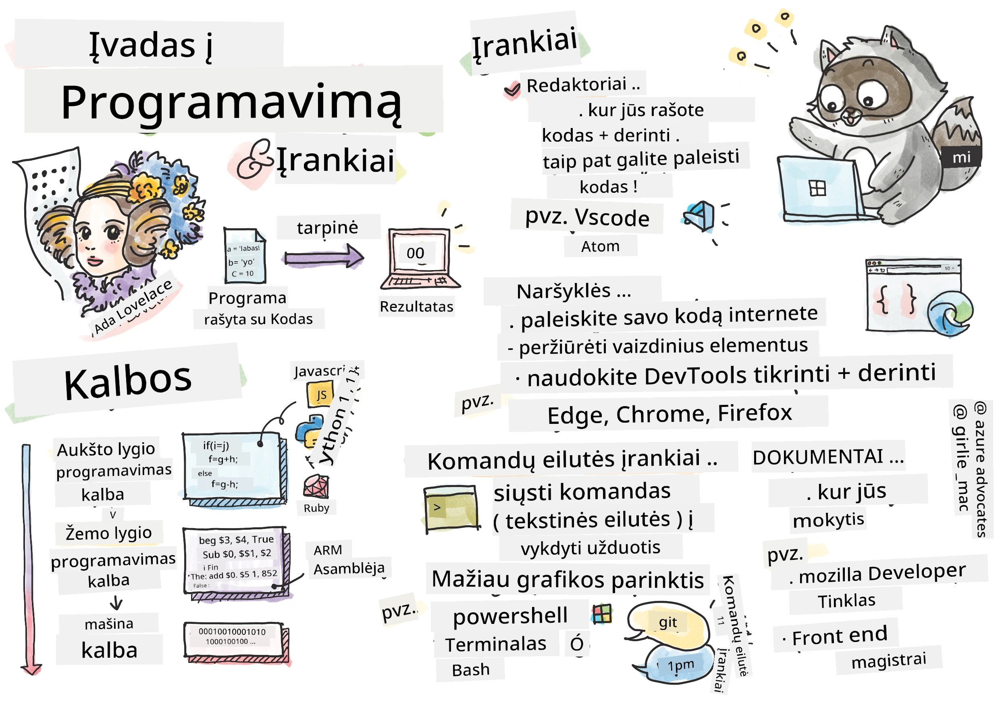
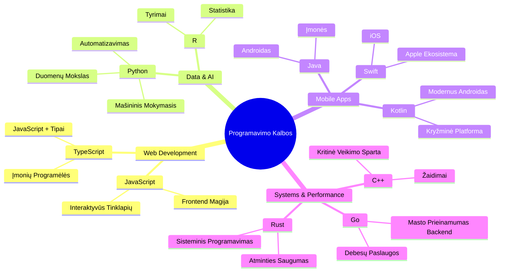
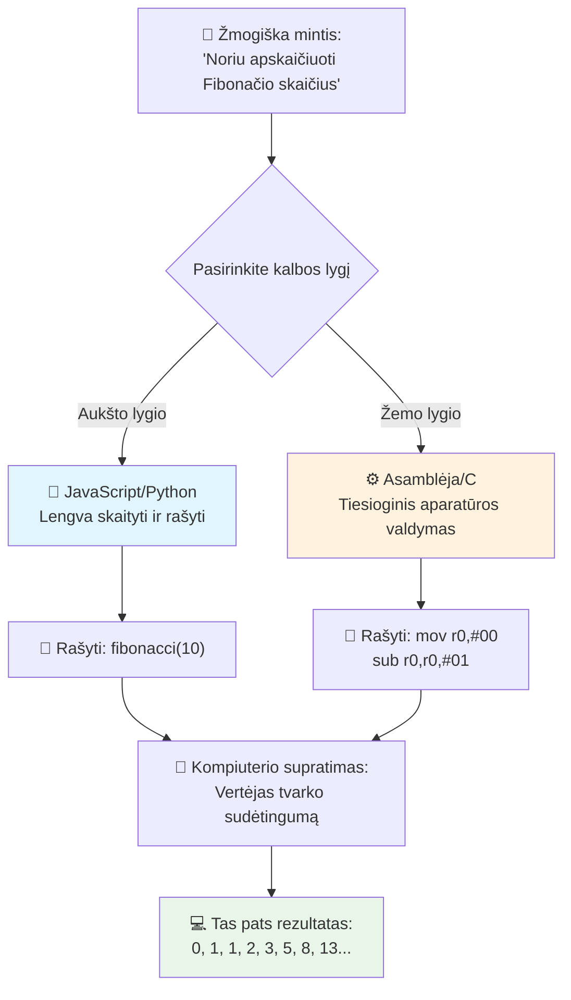
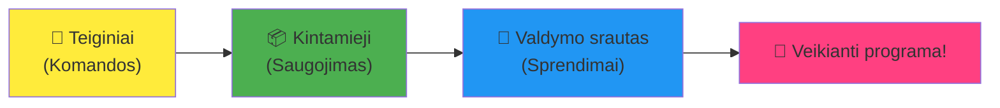
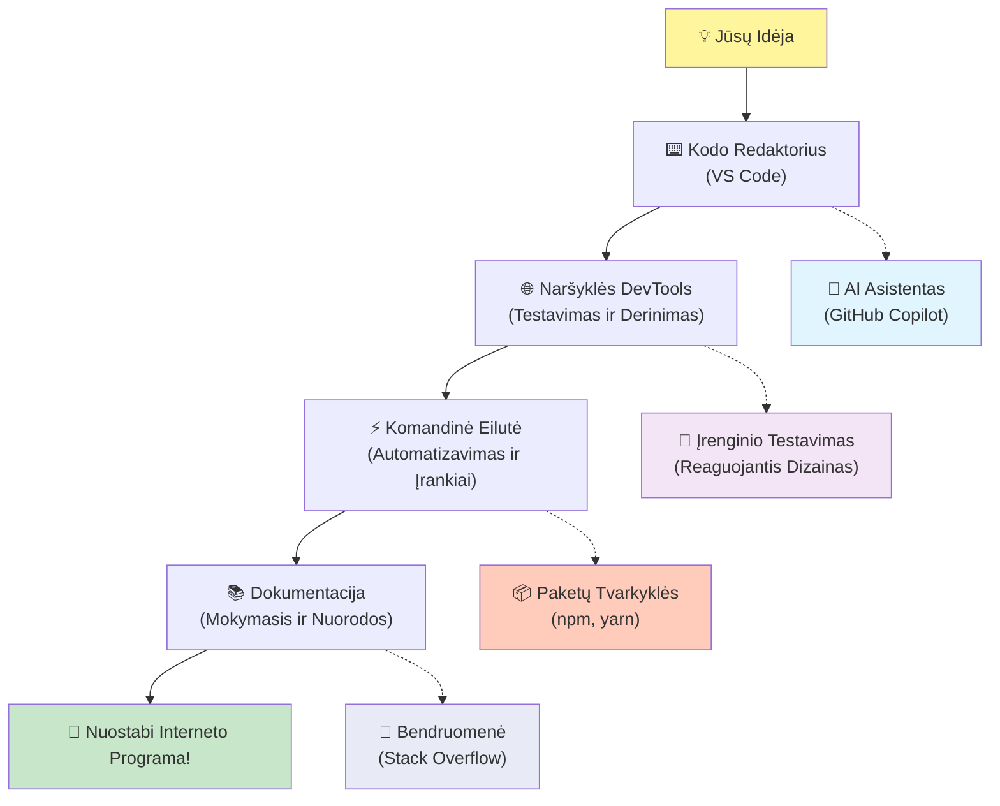
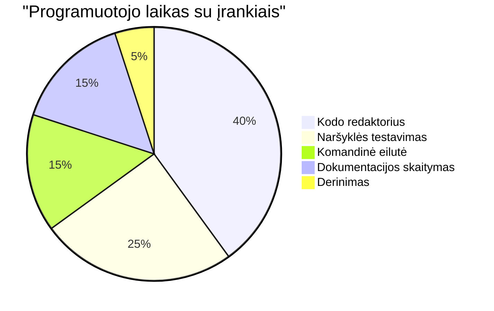

# Įvadas į programavimo kalbas ir modernius kūrėjų įrankius

Sveikas, būsimasis kūrėji! 👋 Ar galiu tau papasakoti kažką, kas kasdien man sukelia šiurpuliukus? Tu netrukus suprasi, kad programavimas nėra tik apie kompiuterius – tai tikros supergalios paversti savo beprotiškiausias idėjas realybe!

Žinai tą akimirką, kai naudoji savo mėgstamą programėlę ir viskas tiesiog susiklosto puikiai? Kai paspaudi mygtuką ir įvyksta kažkas nepaprasto, kas privers tave sakyti „vau, kaip jie TAI PADARĖ?“ Na, kažkas panašaus kaip tu – tikriausiai sėdėdamas savo mėgstamame kavinės kampelyje 2 val. nakties su trečia espreso kava – parašė kodą, kuris sukūrė tą magiją. Ir štai kas tave sužavės: pamokos pabaigoje tu ne tik suprasi, kaip jie tai padarė, bet ir degsi noru tai išbandyti pats!

Žinok, visiškai suprantu, jei dabar programavimas atrodo bauginantis. Kai pradėjau, tikrai galvojau, kad reikia būti kokiu nors matematikos genijumi arba programuoti nuo penkerių metų. Bet štai kas visiškai pakeitė mano požiūrį: programavimas yra kaip mokytis kalbėti nauja kalba. Pradedi nuo „labas“ ir „ačiū“, vėliau užsakai kavą, ir netrukus jau vediesi gilius filosofinius pokalbius! Tik šiuo atveju tu kalbiesi su kompiuteriais, o jie yra kantriausi pokalbių draugai – niekada nepeikia tavo klaidų ir visada pasirengę bandyti dar kartą!

Šiandien ištyrinėsime neįtikėtinus įrankius, kurie padaro šiuolaikinę interneto kūrimo praktiką ne tik įmanoma, bet ir labai patrauklia. Kalbu apie tą pačią redaktorių, naršyklių ir darbo procesų grupę, kurių kasdien naudojasi kūrėjai Netflix, Spotify ir tavo mėgstamos nepriklausomos programėlės studijos komandoje. Ir štai kas privers tave šokti iš džiaugsmo: dauguma šių profesionalių, pramonės standartų įrankių yra visiškai nemokami!


> Sketchnote autorius [Tomomi Imura](https://twitter.com/girlie_mac)


```mermaid
journey
    title Jūsų programavimo kelionė šiandien
    section Atraskite
      Kas yra programavimas: 5: You
      Programavimo kalbos: 4: You
      Įrankių apžvalga: 5: You
    section Tyrinėti
      Kodo redaktoriai: 4: You
      Naršyklės ir kūrėjų įrankiai: 5: You
      Komandinė eilutė: 3: You
    section Praktika
      Kalbų detektyvas: 4: You
      Įrankių tyrinėjimas: 5: You
      Bendruomenės ryšiai: 5: You
```
## Pažiūrėkime, ką tu jau žinai!

Prieš šokinėjant į smagius dalykus, man įdomu – ką tu jau žinai apie šį programavimo pasaulį? Ir klausyk, jei žiūrėdamas į šiuos klausimus galvoji „aš tiesiog visiškai neturiu jokios užuominos apie tai“, tai ne tik normalu, bet ir puiku! Tai reiškia, kad esi būtent reikiamoje vietoje. Galvok apie šį testą kaip apie tempimą prieš treniruotę – tiesiog šildome smegenų raumenis!

[Atlik priešpamokinį testą](https://ff-quizzes.netlify.app/web/)


## Nuotykis, kurį ketiname patirti kartu

Gerai, aš išties džiaugiuosi dėl to, ką šiandien ištyrinėsime! Rimtai, norėčiau matyti tavo veidą, kai kai kurie šie konceptai ims kristi į vietas. Štai nuostabus kelias, kurį žengiame kartu:

- **Kas iš tikrųjų yra programavimas (ir kodėl tai pats šauniausias dalykas!)** – Sužinosime, kaip kodas iš tikrųjų yra nematoma magija, valdanti viską aplink tave, nuo to žadintuvo, kuris kaip tyčia žino, kad pirmadienis rytoj, iki algoritmo, kuris tobulai atrenka tavo Netflix rekomendacijas
- **Programavimo kalbos ir jų nuostabūs charakteriai** – Įsivaizduok, kad ateini į vakarėlį, kuriame kiekvienas žmogus turi visiškai skirtingų supergalių ir sprendžia problemas skirtingais būdais. Taip yra ir programavimo kalbų pasaulyje, ir tau tikrai patiks jas pažinti!
- **Pagrindinės dalelės, kurios kuria skaitmeninę magiją** – Įsivaizduok šiuos kaip galutinį kūrybinį LEGO rinkinį. Kai suprasi, kaip šie gabalai dera kartu, suprasi, kad gali tiesiogiai sukurti bet ką, ką tik įsivaizduoji
- **Profesionalūs įrankiai, kurie privers jaustis lyg būtų atiduotas burtininko lazdelė** – Nesu dramatiškas – šie įrankiai tikrai suteiks tau supergalių jausmą, o geriausia? Tai tie patys, kuriuos naudoja profesionalai!

> 💡 **Štai ką tau pasakysiu**: Šiandien net nesistenk įsiminti visko! Dabar tiesiog noriu, kad pajustum tą jaudulį dėl to, kas įmanoma. Detalės natūraliai įstrigs, kai drauge praktikavsimės – štai kaip vyksta tikras mokymasis!

> Šią pamoką gali atlikti [Microsoft Learn](https://learn.microsoft.com/en-us/learn/modules/web-development-101/introduction-programming/?WT.mc_id=academic-77807-sagibbon) platformoje!

## Tai kas gi iš tiesų yra programavimas?

Gerai, spręskime milijono vertės klausimą: kas iš tiesų yra programavimas?

Paprasčiau pasakosiu istoriją, kuri visiškai pakeitė mano supratimą. Praeitą savaitę bandžiau paaiškinti savo mamai, kaip naudotis mūsų naujuoju išmaniu televizoriaus pultu. Pradėjau sakyti dalykus tipo „Paspausk raudoną mygtuką, bet ne didelį raudoną, o mažą raudoną kairėje... ne, tavo kitoje kairėje... gerai, dabar palaikyk du sekundes, ne vieną, ne tris...“ Skamba pažįstamai? 😅

Tai ir yra programavimas! Tai menas duoti nepaprastai detalias, žingsnis po žingsnio instrukcijas kažkam labai galingam, bet kam reikia viską labai tiksliai išdėstyti. Išskyrus tai, kad vietoje paaiškinimo mamai (kuri gali paklausti „kurią raudoną?!“), tu paaiškini kompiuteriui (kuris tiesiog daro būtent tai, ką sakai, net jei ne visai tai, ką turėjai omenyje).

Mano protą ištiko šokas, kai pirmą kartą supratau šią tiesą: kompiuteriai iš tikrųjų yra labai paprasti savo esmėje. Jie supranta tik du dalykus – 1 ir 0, kas iš esmės reiškia „taip“ ir „ne“ arba „įjungta“ ir „išjungta“. Tai viskas! Bet čia prasideda magija – mums nereikia kalbėti tik 1 ir 0 kaip Matrix filme. Čia ateina **programavimo kalbos** į pagalbą. Jos kaip geriausias pasaulio vertėjas, kuris paverčia tavo paprastus žmogaus mintis į kompiuterių kalbą.

Ir štai kas man vis dar kas rytą sukelia šiurpuliukus: tiesiog *viskas* skaitmeniniame tavo gyvenime prasidėjo nuo kažko panašaus į tave, tikriausiai dėvint pižamą, gurkšnojančio kavą ir rašančio kodą savo nešiojamame kompiuteryje. Tą Instagram filtrą, kuris tave daro tobulą? Jį sukūrė kažkas. Rekomendaciją, kuria užkliuvai už savo naujos mėgstamos dainos? Algoritmą sukūrė kūrėjas. Programėlė, kuri padeda su draugais dalytis vakarienės sąskaitą? Taip, kažkas pagalvojo „tai erzina, gal aš galiu tai sutvarkyti“ ir tada... sutvarkė!

Kai mokaisi programuoti, tu ne tik įgyji naują įgūdį – tu tampi šios neįtikėtinos problemų sprendėjų bendruomenės dalimi, kuri kiekvieną dieną klausia savęs: „O kas, jei aš galėčiau sukurti kažką, kas truputį pagerintų kieno nors dieną?“ Rimtai, ar gali būti kas nors šauniau už tai?

✅ **Smagus faktų medžioklė**: Štai ką labai smagaus galima paieškoti laisvu metu – kas, tavo manymu, buvo pirmasis pasaulio kompiuterių programuotojas? Duosiu užuominą: tai gali būti ne tas, ko tikiesi! Šios asmenybės istorija be galo įdomi ir parodo, kad programavimas visada buvo apie kūrybinį problemų sprendimą ir mąstymą neįprastai.

### 🧠 **Patikra: Kaip jautiesi?**

**Skirk akimirką pagalvoti:**
- Ar tau dabar prasminga mintis „duoti instrukcijas kompiuteriams“?
- Ar gali įsivaizduoti kasdienę užduotį, kurią norėtum automatizuoti su programavimu?
- Kokie klausimai kyla galvoje apie visą šį programavimo dalyką?

> **Prisimink**: Visiškai normalu, jei kai kurios sąvokos atrodo miglotos. Programavimas yra kaip mokytis naują kalbą – tavo smegenys turi laiko sukurti nervinius kelius. Tu darai puikų darbą!

## Programavimo kalbos yra kaip skirtingi magijos skoniai

Gerai, tai skambės keistai, bet iškentėk – programavimo kalbos daug kuo panašios į skirtingų muzikos stilių rūšis. Pagalvok: yra džiazas, kuris švelnus ir improvizuojantis, rokas, kuris galingas ir tiesmukas, klasikinė muzika, kuri elegantiška ir struktūruota, ir hiphopas, kuris kūrybingas ir ekspresyvus. Kiekvienas stilius turi savo atmosferą, savo aistruolių bendruomenę, ir kiekvienas tinka skirtingoms nuotaikoms bei progoms.

Programavimo kalbos veikia būtent taip pat! Tu juk nesinaudotum ta pačia kalba kuriant smagią mobilų žaidimą ir analizuojant milžiniškus klimato duomenų kiekius, taip pat kaip ir negrojėtum death metalo jogos užsiėmime (na, daugumoje jogos užsiėmimų! 😄).

Bet štai kas mane sužavi kiekvieną kartą, kai apie tai galvoju: šios kalbos tarsi kantriausias ir geniali draugas-vertėjas pasaulyje sėdi šalia tavęs. Gali idėjas išreikšti taip, kaip natūralu tavo žmogaus smegenims, o jos sudėtingai verčia tai į 1 ir 0, kuriuos iš tikrųjų supranta kompiuteriai. Tai kaip turėti draugą, kuris puikiai kalba tiek „žmogiška kūryba“, tiek „kompiuterio logika“ – jis niekada nepavargsta, niekada neprašo kavos pertraukos ir niekada nesmerkia, jei užduodi tą patį klausimą du kartus!

### Populiarios programavimo kalbos ir jų paskirtys


```mermaid
mindmap
  root((Programavimo Kalbos))
    Web Development
      JavaScript
        Frontend Magija
        Interaktyvūs Tinklapių
      TypeScript
        JavaScript + Tipai
        Įmonių Programėlės
    Data & AI
      Python
        Duomenų Mokslas
        Mašininis Mokymasis
        Automatizavimas
      R
        Statistika
        Tyrimai
    Mobile Apps
      Java
        Androidas
        Įmonės
      Swift
        iOS
        Apple Ekosistema
      Kotlin
        Modernus Androidas
        Kryžminė Platforma
    Systems & Performance
      C++
        Žaidimai
        Kritinė Veikimo Sparta
      Rust
        Atminties Saugumas
        Sisteminis Programavimas
      Go
        Debesų Paslaugos
        Masto Prieinamumas Backend
```
| Kalba | Geriausia | Kodėl populiari |
|----------|----------|------------------|
| **JavaScript** | Interneto kūrimas, vartotojo sąsajos | Veikia naršyklėse ir valdžioja interaktyvias svetaines |
| **Python** | Duomenų mokslas, automatizavimas, DI | Lengva skaityti ir mokytis, galingos bibliotekos |
| **Java** | Įmonių programos, Android aplikacijos | Nepriklausoma nuo platformos, stabili dideliems sistemoms |
| **C#** | Windows programos, žaidimų kūrimas | Stipri Microsoft ekosistema |
| **Go** | Debesų paslaugos, serverio dalis | Greita, paprasta, skirta moderniam kompiuterijimui |

### Aukšto lygio ir žemo lygio kalbos

Gerai, tai buvo konceptas, kuris pradžioje visiškai sulaužė mano smegenis, todėl pasidalinsiu analogija, kuri galiausiai man tai paaiškino – ir labai tikiuosi, kad padės ir tau!

Įsivaizduok, kad lankaisi šalyje, kurios kalbos nemoki, ir desperatiškai nori surasti arčiausią tualetą (visi tai yra patyrę, tiesa? 😅):

- **Žemo lygio programavimas** panašus į tai, kai taip gerai išmoksti vietinį dialektą, kad gali kalbėtis su močiute, pardavinėjančia vaisius, naudodamas kultūrines užuominas, vietinius šnekamosios kalbos posakius ir vidinius juokelius, kuriuos suprastų tik augęs toje vietovėje. Labai įspūdinga ir ypač efektyvu… jei esi laisvai kalbantis! Bet gana sudėtinga, kai tiesiog nori rasti tualetą.

- **Aukšto lygio programavimas** yra kaip turėti tą nuostabų vietinį draugą, kuris tave puikiai supranta. Gali tiesiog pasakyti „Man labai reikia rasti tualetą“ paprasta anglų kalba, o jis persimoko kultūrines subtilybes ir duoda tau suprantamas nuorodas, kurios suprantamos tavo nelokaliai smegenims.

Programavimo terminologijoje:
- **Žemo lygio kalbos** (kaip Assembly ar C) leidžia tau labai detaliai bendrauti su kompiuterio aparatine įranga, tačiau turi mąstyti kaip mašina, kas yra... na, didelis protinis perėjimas!
- **Aukšto lygio kalbos** (kaip JavaScript, Python ar C#) leidžia tau mąstyti kaip žmogui, o jos užkulisiuose tvarko visą kalbą mašinai. Be to, jos turi nepaprastai draugiškas bendruomenes, kuriose pilna žmonių, prisimenančių, kaip buvo pradžioje, ir iš tikrųjų norinčių padėti!

Spėk, kokias kalbas pasiūlysiu tau pradėti mokytis? 😉 Aukšto lygio kalbos yra tarsi mokomieji ratukai, kurių tu niekada nenorėsi nusimauti, nes jos labai palengvina visą patirtį!


```mermaid
flowchart TB
    A["👤 Žmogiška mintis:<br/>'Noriu apskaičiuoti Fibonačio skaičius'"] --> B{Pasirinkite kalbos lygį}
    
    B -->|Aukšto lygio| C["🌟 JavaScript/Python<br/>Lengva skaityti ir rašyti"]
    B -->|Žemo lygio| D["⚙️ Asamblėja/C<br/>Tiesioginis aparatūros valdymas"]
    
    C --> E["📝 Rašyti: fibonacci(10)"]
    D --> F["📝 Rašyti: mov r0,#00<br/>sub r0,r0,#01"]
    
    E --> G["🤖 Kompiuterio supratimas:<br/>Vertėjas tvarko sudėtingumą"]
    F --> G
    
    G --> H["💻 Tas pats rezultatas:<br/>0, 1, 1, 2, 3, 5, 8, 13..."]
    
    style C fill:#e1f5fe
    style D fill:#fff3e0
    style H fill:#e8f5e8
```
### Pasirodysiu, kodėl aukšto lygio kalbos yra daug draugiškesnės

Gerai, dabar parodysiu tau ką nors, kas puikiai iliustruoja, kodėl aš įsimylėjau aukšto lygio kalbas, bet pirmiausia turi pažadėti man vieną dalyką. Kai pamatysi pirmą kodų pavyzdį, nesijaudink! Jis turi atrodyti kiek bauginančiai. Tai yra taikoma mano mintis!

Pažiūrėsime tą pačią užduotį, parašytą dviem visiškai skirtingais stiliais. Abu kuria tai, ką vadiname Fibonačio seka – tai nuostabus matematinis modelis, kur kiekvienas skaičius yra dviejų prieš jį esančių skaičių suma: 0, 1, 1, 2, 3, 5, 8, 13... (Smagi detalė: šią seką galima rasti visur gamtoje – saulėgrąžos sėklų spiralėse, pušies kankorėžių raštuose ar net galaksijų formavime!)

Pasiruošęs pamatyti skirtumą? Pradėkime!

**Aukšto lygio kalba (JavaScript) – Draugiška žmogui:**

```javascript
// 1 žingsnis: Pagrindinis Fibonačio nustatymas
const fibonacciCount = 10;
let current = 0;
let next = 1;

console.log('Fibonacci sequence:');
```

**Štai ką šis kodas daro:**
- **Deklaruoja** konstantą, nurodančią, kiek Fibonačio skaičių norime sugeneruoti
- **Inicijuoja** du kintamuosius, kurie seka einamą ir kitą skaičius sekoje
- **Nustato** pradinius skaičius (0 ir 1), kurie apibrėžia Fibonačio modelį
- **Rodo** antraštę, identifikuojančią mūsų išvestį

```javascript
// 2 žingsnis: Sukurkite seką naudojant ciklą
for (let i = 0; i < fibonacciCount; i++) {
  console.log(`Position ${i + 1}: ${current}`);
  
  // Apskaičiuokite kitą sekos skaičių
  const sum = current + next;
  current = next;
  next = sum;
}
```

**Išskaidome, kas čia vyksta:**
- **Kartojama** per kiekvieną poziciją sekoje naudojant `for` ciklą
- **Atvaizduojamas** kiekvienas skaičius su jo pozicija templatinių simbolių formatu
- **Apskaičiuojamas** kitas Fibonačio skaičius sudedant einamuosius ir kitus skaičius
- **Atnaujinami** stebėjimo kintamieji, kad pereitume į kitą iteraciją

```javascript
// 3 žingsnis: Modernus funkcinis požiūris
const generateFibonacci = (count) => {
  const sequence = [0, 1];
  
  for (let i = 2; i < count; i++) {
    sequence[i] = sequence[i - 1] + sequence[i - 2];
  }
  
  return sequence;
};

// Naudojimo pavyzdys
const fibSequence = generateFibonacci(10);
console.log(fibSequence);
```

**Aukščiau mes:**
- **Sukūrėme** pakartotinai naudojamą funkciją su modernaus rodyklių funkcijos sintakse
- **Sukaupėme** masyvą, kuriame saugoma visa seka vietoje atvaizdavimo po vieną
- **Panaudojome** masyvo indeksavimą kiekvienam naujam skaičiui apskaičiuoti pagal ankstesnius
- **Grąžiname** visą seką, kad ją būtų galima lanksčiai naudoti kitose programos dalyse

**Žemo lygio kalba (ARM Assembly) – Draugiška kompiuteriui:**

```assembly
 area ascen,code,readonly
 entry
 code32
 adr r0,thumb+1
 bx r0
 code16
thumb
 mov r0,#00
 sub r0,r0,#01
 mov r1,#01
 mov r4,#10
 ldr r2,=0x40000000
back add r0,r1
 str r0,[r2]
 add r2,#04
 mov r3,r0
 mov r0,r1
 mov r1,r3
 sub r4,#01
 cmp r4,#00
 bne back
 end
```

Atkreipk dėmesį, kaip JavaScript versija beveik skaitosi kaip anglų kalbos instrukcijos, o Assembly versija naudoja paslaptingas komandas, kurios tiesiogiai valdo kompiuterio procesorių. Abu atlieka tą pačią užduotį, bet aukšto lygio kalba yra daug lengviau suprantama, rašoma ir prižiūrima žmonių.

**Pagrindiniai skirtumai, kuriuos pastebėsi:**
- **Skaitymo paprastumas**: JavaScript naudoja apibūdinančius pavadinimus, kaip `fibonacciCount`, o Asamblėja – kriptinius žymenis, kaip `r0`, `r1`
- **Komentarai**: Aukšto lygio kalbos skatina aiškinamuosius komentarus, kurie padaro kodą savaiminiu dokumentu
- **Struktūra**: JavaScript loginė eiga atitinka, kaip žmonės mąsto apie problemas žingsnis po žingsnio
- **Priežiūra**: JavaScript versijos atnaujinimas pagal įvairius reikalavimus yra paprastas ir aiškus

✅ **Apie Fibonačio seką**: Šis gražiausias skaičių modelis (kur kiekvienas skaičius lygus dviejų prieš jį esančių sumai: 0, 1, 1, 2, 3, 5, 8...) pasirodo pažodžiui *kiekviename* gamtos kampelyje! Jį rasite saulėgrąžų spiralėse, pušies kūgų raštuose, nautilo kriauklių vingiuose ir net medžių šakų augime. Tai gana stulbinama, kaip matematika ir kodas gali padėti mums suprasti ir atkartoti gamtos naudojamus grožio modelius!


## Kūrimo blokai, kurie sukuria stebuklą

Gerai, dabar, kai jau matėte, kaip atrodo programavimo kalbos veikime, išskaidykime pagrindinius elementus, sudarančius pažodžiui kiekvieną kada nors parašytą programą. Įsivaizduokite juos kaip esminius ingredientus jūsų mėgstamiausiame recepte – kai suprasite, ką kiekvienas daro, galėsite skaityti ir rašyti kodą beveik bet kuria kalba!

Tai šiek tiek primena programavimo gramatikos mokymąsi. Prisiminkite mokykloje, kai mokėtės apie daiktavardžius, veiksmažodžius ir kaip sudėti sakinius? Programavimas turi savo gramatiką, ir, tiesą sakant, ji kur kas logiškesnė ir atlaidesnė nei anglų kalbos gramatika! 😄

### Pareiškimai: žingsnis po žingsnio instrukcijos

Pradėkime nuo **pareiškimų** – tai tarsi atskiri sakiniai pokalbyje su jūsų kompiuteriu. Kiekvienas pareiškimas nurodo kompiuteriui padaryti vieną konkrečią užduotį, tarsi duodant instrukcijas: „Čia pasuk į kairę“, „Sustok prie raudono šviesoforo“, „Pastatyk automobilį ten“.

Man patinka pareiškimai, nes jie paprastai labai suprantami. Pažiūrėkite į tai:

```javascript
// Pagrindinės instrukcijos, atliekamos vieną veiksmą
const userName = "Alex";                    
console.log("Hello, world!");              
const sum = 5 + 3;                         
```

**Štai ką šis kodas daro:**
- **Deklaruoja** konstantą, kurioje saugomas vartotojo vardas
- **Rodo** pasveikinimo žinutę konsolės išvestyje
- **Apskaičiuoja** ir saugo matematinės operacijos rezultatą

```javascript
// Teiginiai, kurie sąveikauja su interneto puslapiais
document.title = "My Awesome Website";      
document.body.style.backgroundColor = "lightblue";
```

**Žingsnis po žingsnio, kas vyksta:**
- **Pakeičia** tinklalapio antraštę, rodomą naršyklės skirtuke
- **Pakeičia** viso puslapio fono spalvą

### Kintamieji: jūsų programos atminties sistema

Gerai, **kintamieji** man yra viena iš pati mėgstamiausių temų mokyti, nes jie labai panašūs į dalykus, kuriuos jau naudojate kiekvieną dieną!

Įsivaizduokite savo telefono kontaktų sąrašą. Jūs neprisimenate visų telefono numerių – vietoj to išsaugote „Mama“, „Geriausias draugas“ ar „Picerija, kuri dirba iki 2 val. nakties“ ir leidžiate telefonui prisiminti tikruosius numerius. Kintamieji veikia lygiai taip pat! Jie tarsi pažymėti konteineriai, kuriuose jūsų programa gali laikyti informaciją ir vėliau ją atgaivinti pagal prasmę turintį pavadinimą.

Ką yra labai šaunu: kintamieji gali keistis programai veikiant (todėl ir vadinami „kintamais“ – ar ne šaunu?). Kaip jūs atsinaujinate picų kontaktą, kai randate geresnį variantą, taip programoje kintamieji keičiasi, kai programa sužino naujų dalykų arba keičiasi sąlygos!

Parodysiu, kaip paprastai tai atrodo:

```javascript
// 1 žingsnis: pagrindinių kintamųjų kūrimas
const siteName = "Weather Dashboard";        
let currentWeather = "sunny";               
let temperature = 75;                       
let isRaining = false;                      
```

**Suprasti šiuos konceptus:**
- **Laikyti** nekintamas reikšmes naudodami `const` (pvz., svetainės pavadinimą)
- **Naudoti** `let` reikšmėms, kurios gali keistis visos programos metu
- **Priskirti** skirtingus duomenų tipus: tekstus, skaičius, loginės reikšmės (true/false)
- **Rinktis** apibūdinančius pavadinimus, kurie aiškiai pasako, ką kiekvienas kintamasis laiko

```javascript
// 2 žingsnis: Darbas su objektais, norint sugrupuoti susijusius duomenis
const weatherData = {                       
  location: "San Francisco",
  humidity: 65,
  windSpeed: 12
};
```

**Aukščiau mes:**
- **Sukūrėme** objektą, kad sugrupuotume susijusią orų informaciją
- **Organizavome** kelis duomenų elementus po vienu kintamojo pavadinimu
- **Naudojome** raktas-reikšmė poras, kad aiškiai pažymėtume kiekvieną informaciją

```javascript
// 3 žingsnis: kintamųjų naudojimas ir atnaujinimas
console.log(`${siteName}: Today is ${currentWeather} and ${temperature}°F`);
console.log(`Wind speed: ${weatherData.windSpeed} mph`);

// Keičiami kintamieji atnaujinami
currentWeather = "cloudy";                  
temperature = 68;                          
```

**Paaiškinkime kiekvieną dalį:**
- **Rodome** informaciją naudodami šabloninius tekstus su `${}` sintakse
- **Panaudojame** objekto savybes per taško notaciją (`weatherData.windSpeed`)
- **Atnaujiname** su `let` deklaruotus kintamuosius, kad atspindėtume pokyčius
- **Sujungiame** kelis kintamuosius, kad sukurtume prasmingas žinutes

```javascript
// 4 veiksmas: Šiuolaikinis dekonstruojimas švaresniam kodui
const { location, humidity } = weatherData; 
console.log(`${location} humidity: ${humidity}%`);
```

**Ką reikia žinoti:**
- **Ištraukti** tam tikras savybes iš objektų naudojant destruktūrizacijos priskyrimą
- **Sukurti** naujus kintamuosius automatiškai su tais pačiais pavadinimais kaip objekto raktai
- **Supaprastinti** kodą vengiant daugkartinės taško notacijos

### Kontrolės srautas: mokyti programą mąstyti

Gerai, dabar programavimas tampa tiesiog stulbinančiai įdomus! **Kontrolės srautas** iš esmės yra jūsų programos mokymas priimti sumanius sprendimus, lygiai kaip jūs kiekvieną dieną tai darote be jokio mąstymo.

Įsivaizduokite: ryte tikriausiai galvojote „Jei lyja, pasiimsiu skėtį. Jei šalta, apsirengsiu striukę. Jei vėluoju, praleisiu pusryčius ir iškeliausiu pasiimti kavos.“ Jūsų smegenys natūraliai seka tokią jei-tada logiką dešimtis kartų per dieną!

Tai daro programas protingas ir gyvas, o ne tiesiog nuobodžiai vykdančias nuspėjamą scenarijų. Jos gali pažvelgti į situaciją, įvertinti, kas vyksta, ir tinkamai reaguoti. Tai tarsi suteikti programai smegenis, kurios gali prisitaikyti ir priimti sprendimus!

Norite pamatyti, kaip gražiai tai veikia? Parodysiu:

```javascript
// 1 žingsnis: Pagrindinė sąlyginė logika
const userAge = 17;

if (userAge >= 18) {
  console.log("You can vote!");
} else {
  const yearsToWait = 18 - userAge;
  console.log(`You'll be able to vote in ${yearsToWait} year(s).`);
}
```

**Šis kodas daro:**
- **Tikrina**, ar vartotojo amžius atitinka balsavimo reikalavimus
- **Atlieka** skirtingus kodo blokus pagal sąlygos rezultatą
- **Apskaičiuoja** ir rodo, kiek laiko liko iki balsavimo galiojimo, jei vartotojas jaunesnis nei 18
- **Pateikia** konkrečią, naudingą informaciją kiekvienam scenarijui

```javascript
// 2 žingsnis: kelios sąlygos su loginiais operatoriais
const userAge = 17;
const hasPermission = true;

if (userAge >= 18 && hasPermission) {
  console.log("Access granted: You can enter the venue.");
} else if (userAge >= 16) {
  console.log("You need parent permission to enter.");
} else {
  console.log("Sorry, you must be at least 16 years old.");
}
```

**Išskaidydami, kas vyksta:**
- **Sujungia** kelias sąlygas naudodami `&&` (ir) operatorių
- **Sukuria** sąlygų hierarchiją su `else if` keliose situacijose
- **Tvarko** visas galimas situacijas paskutiniu `else` pareiškimu
- **Pateikia** aiškią ir veiksmingą grįžtamąją informaciją kiekvienam atvejui

```javascript
// 3 žingsnis: Trumpa sąlyga su ternariniu operatoriumi
const votingStatus = userAge >= 18 ? "Can vote" : "Cannot vote yet";
console.log(`Status: ${votingStatus}`);
```

**Svarbu atsiminti:**
- **Naudokite** ternarinį operatorių (`? :`) paprastoms dvejopoms sąlygoms
- **Rašykite** sąlygą pirmą, po jos `?`, tada tiesą atitinkantį rezultatą, po to `:`, tada netiesą atitinkantį rezultatą
- **Taikykite** šį šabloną, kai reikia priskirti reikšmes pagal sąlygas

```javascript
// 4 žingsnis: kelių konkrečių atvejų apdorojimas
const dayOfWeek = "Tuesday";

switch (dayOfWeek) {
  case "Monday":
  case "Tuesday":
  case "Wednesday":
  case "Thursday":
  case "Friday":
    console.log("It's a weekday - time to work!");
    break;
  case "Saturday":
  case "Sunday":
    console.log("It's the weekend - time to relax!");
    break;
  default:
    console.log("Invalid day of the week");
}
```

**Šis kodas atlieka:**
- **Palygina** kintamojo reikšmę su keliomis konkrečiomis reikšmėmis
- **Suriša** panašius atvejus kartu (darbo dienos prieš savaitgalius)
- **Atlieka** atitinkamą kodo bloką, kai randamas atitikmuo
- **Numato** `default` atvejį netikėtoms reikšmėms apdoroti
- **Naudoja** `break` pareiškimus, kad kodas neitų į kitą atvejį

> 💡 **Reali gyvenimo analogija**: pagalvokite apie kontrolės srautą kaip apie pasaulio kantriausią GPS, kuris duoda nurodymus. Jis gali sakyti „Jei Main gatvėje eismas, važiuok greitkeliu. Jei greitkelį uždaro statybos, važiuok per vaizdingą maršrutą.“ Programos naudoja tą pačią loginę sąlygų logiką, kad išmintingai reaguotų į situacijas ir visuomet suteiktų vartotojams geriausią patirtį.

### 🎯 **Konceptų patikra: Kūrimo blokų meistriškumas**

**Pažiūrėkime, kaip sekasi su pagrindais:**
- Ar sugebate savo žodžiais paaiškinti skirtumą tarp kintamojo ir pareiškimo?
- Pagalvokite apie tikrą situaciją, kurje panaudotumėte jei-tada sprendimą (kaip balsavimo pavyzdyje)
- Kas apie programavimo logiką jus nustebino?

**Greitas pasitikėjimo skatinimas:**

```mermaid
flowchart LR
    A["📝 Teiginiai<br/>(Komandos)"] --> B["📦 Kintamieji<br/>(Saugojimas)"] --> C["🔀 Valdymo srautas<br/>(Sprendimai)"] --> D["🎉 Veikianti programa!"]
    
    style A fill:#ffeb3b
    style B fill:#4caf50
    style C fill:#2196f3
    style D fill:#ff4081
```
✅ **Ką darysime toliau**: kartu žengsime toliau šioje nuostabioje kelionėje! Dabar tiesiog pasimėgaukite jauduliu dėl visų nuostabių galimybių, kurios jūsų laukia. Konkretūs įgūdžiai ir technikos ateis natūraliai, kai kartu praktikuosimės – pažadu, kad tai bus daug smagiau nei galite tikėtis!

## Įrankiai darbui

Gerai, čia aš tiesiog negaliu sulaikyti savo džiugesio! 🚀 Kalbėsime apie nuostabius įrankius, kurie leis jums jaustis tarsi ką tik gavote skaitmeninės kosminės laivo raktus.

Žinote, kaip šefas turi tobulai subalansuotus peilius, kurie atrodo tarsi rankų pratęsimas? Arba muzikantas turi gitarą, kuri tarsi pradeda dainuoti vos tik ją paliečia? Na, programuotojai turi savo versiją tų magiškų įrankių, ir štai kas jus visiškai sužavės – dauguma jų yra visiškai nemokami!

Aš beveik trypčioju vietoje, galvodamas, ką jums pasakysiu, nes šie įrankiai visiškai pakeitė, kaip mes kuriame programinę įrangą. Kalbame apie AI varomus kodavimo padėjėjus, kurie gali padėti rašyti jūsų kodą (rimtai!), debesų aplinkas, kur galite kurti visas programas iš bet kur turėdami Wi-Fi, bei tokias sudėtingas klaidų taisymo priemones, kad jos tarsi jūsų programų rentgeno akys.

Ir štai dalis, kuri man vis dar sukelia šiurpuliukus: tai ne „pradedančiųjų“ įrankiai, kuriuos greitai peraugsite. Tai būtent tie profesionalūs įrankiai, kuriuos dabar naudoja Google, Netflix ir ta indie programėlių studija, kurią mylite. Jūs jausitės tiesiog profesionalu, naudodami juos!


```mermaid
graph TD
    A["💡 Jūsų Idėja"] --> B["⌨️ Kodo Redaktorius<br/>(VS Code)"] 
    B --> C["🌐 Naršyklės DevTools<br/>(Testavimas ir Derinimas)"]
    C --> D["⚡ Komandinė Eilutė<br/>(Automatizavimas ir Įrankiai)"]
    D --> E["📚 Dokumentacija<br/>(Mokymasis ir Nuorodos)"]
    E --> F["🚀 Nuostabi Interneto Programa!"]
    
    B -.-> G["🤖 AI Asistentas<br/>(GitHub Copilot)"]
    C -.-> H["📱 Įrenginio Testavimas<br/>(Reaguojantis Dizainas)"]
    D -.-> I["📦 Paketų Tvarkyklės<br/>(npm, yarn)"]
    E -.-> J["👥 Bendruomenė<br/>(Stack Overflow)"]
    
    style A fill:#fff59d
    style F fill:#c8e6c9
    style G fill:#e1f5fe
    style H fill:#f3e5f5
    style I fill:#ffccbc
    style J fill:#e8eaf6
```
### Kodo redaktoriai ir IDE: jūsų nauji skaitmeniniai draugai

Pakalbėkime apie kodo redaktorius – jie greitai taps jūsų mėgstamiausiomis vietomis! Įsivaizduokite juos kaip savo asmeninę programavimo šventovę, kurioje praleisite daugiausiai laiko kurdami ir tobulindami savo skaitmeninius kūrinius.

Bet štai kas čia magiška apie šiuolaikinius redaktorius: tai ne tiesiog išmanūs teksto redaktoriai. Tai tarsi genialiausias ir palaikantis programavimo mentorius, kuris sėdi šalia jūsų 24/7. Jie pagauna jūsų rašybos klaidas dar prieš jums jas pastebint, siūlo patobulinimus, dėl kurių atrodote kaip genijus, padeda suprasti, ką kiekvienas kodo gabalas daro, o kai kurie net spėja, ką ketinate parašyti ir siūlo užbaigti jūsų mintis!

Prisimenu, kai pirmą kartą atradau automatinį užbaigimą – tiesiog jaučiausi it gyvenčiau ateityje. Pradedate rašyti kažką, o redaktorius sako: „Ei, galvojote apie šią funkciją, kuri tiksliai atlieka tai, ko jums reikia?“ Tai tarsi turėti mintis skaitančią programavimo bičiulę!

**Kas daro šiuos redaktorius tokius nuostabius?**

Šiuolaikiniai kodo redaktoriai siūlo įspūdingą funkcijų spektrą, skirtą padidinti jūsų produktyvumą:

| Funkcija | Ką ji daro | Kam tai naudinga |
|---------|--------------|--------------|
| **Sintaksės paryškinimas** | Spalvina skirtingas kodo dalis | Lengviau skaityti kodą ir pastebėti klaidas |
| **Automatinis užbaigimas** | Siūlo kodą rašant | Paspartina kodavimą ir sumažina klaidų |
| **Klaidų taisymo įrankiai** | Padeda rasti ir taisyti klaidas | Sutaupo daug laiko trikčių šalinimui |
| **Praplėtimai** | Prideda specializuotas funkcijas | Pritaiko redaktorių bet kokiai technologijai |
| **AI pagalbininkai** | Siūlo kodą ir paaiškinimus | Pagreitina mokymąsi ir darbą |

> 🎥 **Vaizdo įrašas**: Norite pamatyti šiuos įrankius veiksme? Peržiūrėkite šį [Tools of the Trade video](https://youtube.com/watch?v=69WJeXGBdxg) išsamiam apžvalgai.

#### Rekomenduojami redaktoriai interneto kūrimui

**[Visual Studio Code](https://code.visualstudio.com/?WT.mc_id=academic-77807-sagibbon)** (Nemokamas)
- Populiariausias tarp interneto kūrėjų
- Puiki praplatinimų ekosistema
- Integruota terminalas ir Git palaikymas
- **Privalomi praplėtimai**:
  - [GitHub Copilot](https://marketplace.visualstudio.com/items?itemName=GitHub.copilot) – AI varomi kodo pasiūlymai
  - [Live Share](https://marketplace.visualstudio.com/items?itemName=MS-vsliveshare.vsliveshare) – bendradarbiavimas realiu laiku
  - [Prettier](https://marketplace.visualstudio.com/items?itemName=esbenp.prettier-vscode) – automatinis kodo formatavimas
  - [Code Spell Checker](https://marketplace.visualstudio.com/items?itemName=streetsidesoftware.code-spell-checker) – klaidų tikrinimas kode

**[JetBrains WebStorm](https://www.jetbrains.com/webstorm/)** (Mokamas, nemokamas studentams)
- Pažangūs klaidų taisymo ir testavimo įrankiai
- Intelektualus kodo užbaigimas
- Integruota versijų kontrolė

**Debesų IDE** (Įvairios kainos)
- [GitHub Codespaces](https://github.com/features/codespaces) – pilnas VS Code jūsų naršyklėje
- [Replit](https://replit.com/) – puikus mokymuisi ir kodų dalijimuisi
- [StackBlitz](https://stackblitz.com/) – momentinis, pilno paketo interneto kūrimas

> 💡 **Pradžios patarimas**: pradėkite nuo Visual Studio Code – jis nemokamas, plačiai naudojamas pramonėje ir turi milžinišką bendruomenę, kuri kuria naudingus mokymus ir praplėtimus.


### Interneto naršyklės: jūsų paslaptinga kūrimo laboratorija

Gerai, pasiruoškite, kad protas gali būti visiškai sukrėstas! Žinote, kaip naršyklės naudojamos naršyti socialiniuose tinkluose ar žiūrėti vaizdo įrašus? Paaiškėjo, kad jos visą laiką slepia neįtikėtiną kūrėjo laboratoriją, kuri tik laukia, kol ją atrasite!

Kiekvieną kartą, kai dešiniuoju pelės mygtuku spustelite interneto puslapį ir pasirenkate „Inspect Element“ (Tikrinti elementą), jūs atveriate slaptą kūrėjų įrankių pasaulį, kuris yra tiesiog galingesnis nei kai kurios brangios programos, už kurias anksčiau mokėjau šimtus dolerių. Tai tarsi atrasti, kad jūsų paprasta virtuvė slepia profesionalaus šefų laboratoriją už slapto skydelio!
Pirmą kartą, kai kas parodė man naršyklės kūrėjo įrankius (DevTools), aš praleidau apie tris valandas tiesiog spustelėdamas ir sakydamas „PALAUKE, AR TAI TIKRAI GALIMA DARYTI?“ Tu gali tiesiogiai redaguoti bet kurią svetainę realiuoju laiku, tiksliai matyti, kaip greitai viskas įsikrauna, testuoti, kaip tavo svetainė atrodo skirtinguose įrenginiuose, ir netgi vykdyti JavaScript derinimą kaip tikras profesionalas. Tai tiesiog stulbinama!

**Štai kodėl naršyklės yra tavo slaptas ginklas:**

Kai kuri svetainę ar žiniatinklio programą, reikia matyti, kaip ji atrodo ir veikia realiame pasaulyje. Naršyklės ne tik rodo tavo kūrinį, bet ir suteikia išsamų grįžtamąjį ryšį apie našumą, prieinamumą ir galimas problemas.

#### Naršyklės kūrėjo įrankiai (DevTools)

Šiuolaikinės naršyklės turi išsamias kūrimo priemonių komplektus:

| Įrankio kategorija | Ką daro | Pavyzdinė panaudojimo situacija |
|--------------------|---------|--------------------------------|
| **Elementų inspektorius** | Tiesiogiai peržiūrėti ir redaguoti HTML/CSS | Koreguoti dizainą, kad matyti akimirksniu pokyčius |
| **Konsolė** | Rodyti klaidų pranešimus ir testuoti JavaScript | Derinti problemas ir eksperimentuoti su kodu |
| **Tinklo stebėjimas** | Sekti, kaip įkeliami ištekliai | Optimizuoti veikimą ir įkėlimo laikus |
| **Prieinamumo tikrinimas** | Testuoti įtraukiantį dizainą | Užtikrinti, kad svetainė veiktų visiems naudotojams |
| **Įrenginio simuliatorius** | Peržiūrėti skirtingo ekrano dydžio rodinius | Testuoti atsakomąjį dizainą be kelių įrenginių |

#### Rekomenduojamos naršyklės kūrimui

- **[Chrome](https://developers.google.com/web/tools/chrome-devtools/)** - Pramonės standartas su plačia dokumentacija
- **[Firefox](https://developer.mozilla.org/docs/Tools)** - Puikios CSS Grid ir prieinamumo priemonės
- **[Edge](https://docs.microsoft.com/microsoft-edge/devtools-guide-chromium/?WT.mc_id=academic-77807-sagibbon)** - Sukurta ant Chromium su Microsoft kūrėjo ištekliais

> ⚠️ **Svarbi testavimo patarimas:** Visada testuok savo svetaines keliuose naršyklėse! Kas puikiai veikia Chrome, gali atrodyti kitaip Safari ar Firefox. Profesionalūs kūrėjai testuoja visuose pagrindiniuose naršyklėse, kad užtikrintų vienodą naudotojų patirtį.


### Komandų eilutės įrankiai: tavo kelias į kūrėjo supergalias

Gerai, būkime visiškai atviri apie komandų eilutę, nes noriu, kad išgirstum tai iš kažko, kas tikrai supranta. Kai pirmą kartą ją pamačiau – šį baisų juodą ekraną su mirksinčiu tekstu – aš tiesiog pagalvojau: „Ne, visai ne! Tai atrodo kaip kas nors iš 1980-ųjų kibernetinio filmo, ir aš tikrai nepakankamai protingas tam!“ 😅

Bet štai ką norėčiau, kad kas man būtų pasakęs tada, ir ką sakau tau dabar: komandų eilutė nėra baisi – tai tarsi tiesioginis pokalbis su tavo kompiuteriu. Įsivaizduok, kad tai skirtumas tarp maisto užsakymo per elegantišką programėlę su paveikslėliais ir meniu (kas yra patogu ir paprasta) ir įėjimo į mėgstamą vietinį restoraną, kur virėjas tiksliai žino, ką tu mėgsti, ir gali paruošti kažką ypatingo, tik pasakius „ nustebink mane kuo nors įspūdingu.“

Komandų eilutė yra ten, kur kūrėjai jaučiasi tikrais burtininkais. Tu įvedi kelis stebuklingus žodžius (gerai, tie žodžiai yra komandos, bet jos atrodo stebuklingos!), spaudi enter, ir PAF – sukuri visą projektų struktūrą, įdiegia galingus įrankius iš viso pasaulio arba išleidžia savo aplikaciją internetui, kad milijonai žmonių ją pamatytų. Kai pirmą kartą pajusi šios galios skonį, tai būna tiesiog priklausomybę keliantis!

**Kodėl komandų eilutė taps tavo mėgstamiausiu įrankiu:**

Nors grafinės sąsajos yra puikios daugeliui užduočių, komandų eilutė išsiskiria automatizavimu, tikslumu ir greičiu. Daugelis kūrimo įrankių veikia daugiausia per komandų eilutę, o mokėjimas jas efektyviai naudoti gali žymiai pagerinti tavo produktyvumą.

```bash
# 1 žingsnis: Sukurkite ir pereikite į projekto katalogą
mkdir my-awesome-website
cd my-awesome-website
```

**Štai ką daro šis kodas:**
- **Sukuria** naują katalogą pavadinimu „my-awesome-website“ tavo projektui
- **Pereina** į ką tik sukurtą katalogą, kad pradėtum darbą

```bash
# 2 žingsnis: Inicijuokite projektą su package.json
npm init -y

# Įdiekite šiuolaikinius kūrimo įrankius
npm install --save-dev vite prettier eslint
npm install --save-dev @eslint/js
```

**Žingsnis po žingsnio, štai kas vyksta:**
- **Inicializuoja** naują Node.js projektą su numatytomis reikšmėmis naudodamas `npm init -y`
- **Įdiegia** Vite kaip modernų kūrimo įrankį greitam vystymui ir produkcijos rinkimams
- **Prideda** Prettier automatinio kodo formatavimo ir ESLint kodo kokybės tikrinimo tikslams
- **Naudoja** `--save-dev` žymeklį nurodant šias priklausomybes kaip tik vystymo metu reikalingas

```bash
# 3 žingsnis: Sukurkite projekto struktūrą ir failus
mkdir src assets
echo '<!DOCTYPE html><html><head><title>My Site</title></head><body><h1>Hello World</h1></body></html>' > index.html

# Paleiskite kūrimo serverį
npx vite
```

**Aukščiau mes:**
- **Organizavome** projektą kurdami atskirus aplankus šaltinio kodui ir turiniui
- **Sugeneravome** bazinį HTML failą su tinkama dokumento struktūra
- **Paleidome** Vite vystymo serverį su gyvu perkelimu ir karštu modulių keitimu

#### Būtini komandų eilutės įrankiai žiniatinklio kūrimui

| Įrankis | Paskirtis | Kodėl jo reikia |
|---------|-----------|----------------|
| **[Git](https://git-scm.com/)** | Versijų valdymas | Sekti pakeitimus, bendradarbiauti, kurti atsargines kopijas |
| **[Node.js & npm](https://nodejs.org/)** | JavaScript vykdymas ir paketų valdymas | Vykdyti JavaScript už naršyklės ribų, įdiegti modernius kūrimo įrankius |
| **[Vite](https://vitejs.dev/)** | Kūrimo įrankis ir vystymo serveris | Žaibiškai greitas vystymas su karštu modulių perkėlimu |
| **[ESLint](https://eslint.org/)** | Kodo kokybė | Automatiškai rasti ir taisyti problemas JavaScript kode |
| **[Prettier](https://prettier.io/)** | Kodo formatavimas | Išlaikyti nuoseklų ir skaitomą kodo formatą |

#### Specifinės platformos pasirinkimai

**Windows:**
- **[Windows Terminal](https://docs.microsoft.com/windows/terminal/?WT.mc_id=academic-77807-sagibbon)** - Šiuolaikinis, su daugeliu funkcijų terminalas
- **[PowerShell](https://docs.microsoft.com/powershell/?WT.mc_id=academic-77807-sagibbon)** 💻 - Galinga skriptų kūrimo aplinka
- **[Command Prompt](https://learn.microsoft.com/windows-server/administration/windows-commands/windows-commands)** 💻 - Tradicinė Windows komandų eilutė

**macOS:**
- **[Terminal](https://support.apple.com/guide/terminal/)** 💻 - Integruota terminalo programa
- **[iTerm2](https://iterm2.com/)** - Išplėstinis terminalas su pažangiomis funkcijomis

**Linux:**
- **[Bash](https://www.gnu.org/software/bash/)** 💻 - Standartinė Linux apvalkalas
- **[KDE Konsole](https://docs.kde.org/trunk5/en/konsole/konsole/index.html)** - Pažangus terminalo emuliatorius

> 💻 = Iš anksto įdiegta operacinėje sistemoje

> 🎯 **Mokymosi kelias:** Pradėk nuo pagrindinių komandų, tokių kaip `cd` (pakeisti katalogą), `ls` arba `dir` (peržiūrėti failus) ir `mkdir` (sukurti katalogą). Praktikuok modernias darbo komandas, tokias kaip `npm install`, `git status` ir `code .` (atidaryti dabartinį katalogą VS Code). Kai įgisite patirties, natūraliai išmoksite pažangias komandas ir automatizavimo būdus.


### Dokumentacija: tavo visada pasiekiama mokymosi mentorė

Gerai, pasidalinsiu mažyte paslaptimi, kuri privers tave jaustis daug geriau, būnant pradedančiuoju: net patyrę kūrėjai praleidžia daug laiko skaitydami dokumentaciją. Ir tai ne todėl, kad jie nežino, ką daro – tai išminties ženklas!

Įsivaizduok dokumentaciją kaip prieigą prie kantriausių ir išmaniausių mokytojų pasaulyje, kurie yra prieinami 24/7. Užstrigei prie užduoties 2 val. nakties? Dokumentacija šalia su šiltu virtualiu apkabinimu ir būtent tuo atsakymu, kurio reikia. Nori sužinoti apie naują funkciją, apie kurią visi kalba? Dokumentacija tau padės su žingsnis po žingsnio pavyzdžiais. Bandai suprasti, kodėl kažkas veikia būtent taip? Atspėjai – dokumentacija paaiškins tokiu būdu, kad pagaliau viskas taps aišku!

Štai kas visiškai pakeitė mano požiūrį: žiniatinklio kūrimo pasaulis juda labai greitai, ir niekas (turiu omeny visiškai niekas!) nesaugo visko atmintyje. Mačiau vyresnius kūrėjus su 15+ metų patirtimi ieškančius bazinės sintaksės ir žinai ką? Tai nėra gėda – tai protinga! Tai ne atminties turėjimo klausimas, o žinojimas, kur greitai rasti patikimus atsakymus ir suprasti, kaip juos taikyti.

**Štai kur slypi tikrasis stebuklas:**

Profesionalūs kūrėjai daug laiko skiria dokumentacijos skaitymui – ne todėl, kad nežino, ką daro, bet todėl, kad žiniatinklio kūrimo aplinka besikeičia greitai ir norint būti aktualiu, reikia nuolatinio mokymosi. Puiki dokumentacija padeda suprasti ne tik *kaip* naudoti ką nors, bet ir *kodėl* bei *kada* tai daryti.

#### Būtinų dokumentacijos šaltinių sąrašas

**[Mozilla Developer Network (MDN)](https://developer.mozilla.org/docs/Web)**
- Aukso standartas žiniatinklio technologijų dokumentacijoje
- Išsamios gairės HTML, CSS ir JavaScript
- Apima naršyklių suderinamumo informaciją
- Pateikia praktinius pavyzdžius ir interaktyvius demonstravimus

**[Web.dev](https://web.dev)** (Google)
- Modernios žiniatinklio kūrimo gerosios praktikos gairės
- Veikimo optimizavimo patarimai
- Prieinamumo ir įtraukaus dizaino principai
- Atvejo studijos iš realių projektų

**[Microsoft Developer Documentation](https://docs.microsoft.com/microsoft-edge/#microsoft-edge-for-developers)**
- Edge naršyklės kūrimo ištekliai
- Progresyviųjų žiniatinklio programų gairės
- Kryžminės platformos kūrimo įžvalgos

**[Frontend Masters Learning Paths](https://frontendmasters.com/learn/)**
- Struktūruoti mokymosi kursai
- Vaizdo pamokos iš pramonės ekspertų
- Praktinės kodavimo užduotys

> 📚 **Mokymosi patarimas:** Nereikia mokytis dokumentacijos mintinai – verčiau išmok mokytis ją efektyviai naršyti. Užsirašyk dažnai naudojamus šaltinius ir praktikuok paieškas, kad greitai rastum reikiamą informaciją.

### 🔧 **Įrankių meistriškumo patikra: kas tau patinka?**

**Skirk akimirką pagalvoti:**
- Kurį įrankį norėtum išbandyti pirmiausia? (Teisingo atsakymo nėra!)
- Ar komandų eilutė vis dar kelia nerimą, ar jau esi smalsus ją išbandyti?
- Ar įsivaizduoji naudoti naršyklės DevTools, kad pažvelgtum už tavo mėgstamų svetainių uždangalo?


```mermaid
pie title "Programuotojo laikas su įrankiais"
    "Kodo redaktorius" : 40
    "Naršyklės testavimas" : 25
    "Komandinė eilutė" : 15
    "Dokumentacijos skaitymas" : 15
    "Derinimas" : 5
```
> **Smagus faktas:** Dauguma kūrėjų apie 40 % savo laiko praleidžia kodo redaktoriuje, bet pastebėk, kiek daug laiko praleidžiama testuojant, mokantis ir sprendžiant problemas. Programavimas nėra vien tik kodų rašymas – tai patirčių kūrimas!

✅ **Mintims pamąstyti:** Štai įdomus klausimas – kaip manai, kuo skiriasi įrankiai, skirti kurti svetaines (vystymui), nuo įrankių, skirtų jų dizainui? Tai tarsi skirtumas tarp architekto, kuris suprojektuoja gražų namą, ir rangovo, kuris jį pastato. Abu svarbūs, bet reikia skirtingų įrankių! Tokie apmąstymai padės geriau suprasti, kaip svetainės „gimsta.“

## GitHub Copilot agento iššūkis 🚀

Naudok Agent režimą, kad įvykdytum šį iššūkį:

**Aprašymas:** Išnagrinėk šiuolaikinio kodo redaktoriaus ar IDE funkcijas ir parodyk, kaip jos gali pagerinti tavo darbą kaip žiniatinklio kūrėjo.

**Užklausa:** Pasirink kodo redaktorių arba IDE (pvz., Visual Studio Code, WebStorm ar debesų pagrindu veikiantį IDE). Išvardink tris funkcijas arba plėtinius, kurie padeda efektyviau rašyti, derinti ar palaikyti kodą. Kiekvienam trumpai paaiškink, kaip tai pagerina tavo darbą.

---

## 🚀 Iššūkis

**Gerai, detektyve, ar pasiruošęs savo pirmai bylai?**

Kadangi turi šį puikų pagrindą, turiu nuotykį, kuris padės tau pamatyti, kaip iš tiesų įvairus ir įdomus yra programavimo pasaulis. Ir klausyk – čia dar ne apie kodą, tai nelabai dėl to jaudinkis! Įsivaizduok, kad esi programavimo kalbų detektyvas savo pirmai įdomiai bylai!

**Tavo misija, jei sutinki ją priimti:**
1. **Tapsk kalbų tyrinėtoju:** Pasirink tris programavimo kalbas iš visiškai skirtingų pasaulių – gal vieną, skirtą svetainių kūrimui, kitą, kuri sukuria mobiliąsias programėles, ir dar vieną, skirtą moksliniams duomenų apdorojimams. Surask tą patį paprastą uždavinį, parašytą kiekviena kalba. Pažadu, būsi nustebęs, kaip skirtingai jos gali atrodyti, nors daro tą patį!

2. **Išsiaiškink jų kilmės istorijas:** Kas kiekvieną kalbą padaro ypatinga? Štai įdomybė – kiekviena programavimo kalba atsirado, nes kažkas pagalvojo: „Žinai ką? Privalo būti geresnis būdas išspręsti šią konkrečią problemą.“ Ar sugebėsi atskleisti, kokios tos problemos buvo? Kai kurios istorijos yra tikrai žavios!

3. **Susipažink su bendruomenėmis:** Pažiūrėk, kaip svetingos ir aistringos yra kiekvienos kalbos bendruomenės. Kai kurios jų turi milijonus kūrėjų dalijasi žiniomis ir padeda vieni kitiems, kitos yra mažesnės bet labai glaudžios ir palaikančios. Tau tikrai patiks matyti šių bendruomenių skirtingas „asmenybes“!

4. **Sek savo intuicija:** Kuri kalba tau šiuo metu atrodo patraukliausia? Nesispausk dėl „tobulo“ pasirinkimo – tiesiog klausyk savo instinktų! Čia nėra neteisingo atsakymo, o vėliau visada gali išbandyti kitas.

**Papildomas detektyvinis darbas:** Pažiūrėk, ar gali sužinoti, kokios pagrindinės svetainės ar aplikacijos yra sukurtos kiekviena kalba. Garantuoju, kad būsi nustebęs sužinojęs, kas palaiko Instagram, Netflix ar tą mobilią žaidimo programėlę, nuo kurios negali atitraukti akių!

> 💡 **Prisimink:** Šiandien nesieki tapti ekspertu nė vienoje kalboje. Tiesiog susipažįsti su kaimynyste prieš priimdamas sprendimą, kur įsikurti. Skirk laiko, mėgaukis procesu ir leisk smalsumui tave vesti!

## Švęskime tai, ką atradai!

Oho, šiandien sužinojai tiek daug nuostabios informacijos! Iš tiesų džiaugiuosi matydamas, kiek šio nuostabaus kelio sugebėjai įsisavinti. Ir prisimink – tai nėra testas, kurį reikia išlaikyti tobulai. Tai greičiau šventė visų tų šaunių dalykų, kuriuos išmokai apie šį žavų pasaulį, kuriame esi pasiruošęs panirti!

[Padaryk testą po pamokos](https://ff-quizzes.netlify.app/web/)

## Apžvalga ir savarankiškas mokymasis

**Skirk laiko tyrinėti ir smagiai praleisk laiką!**
Šiandien nuėjai ilgą kelią, ir tai yra priežastis didžiuotis! Dabar ateina smagi dalis – tyrinėti temas, kurios pažadino tavo smalsumą. Atmink, tai nėra namų darbai – tai nuotykis!

**Gilinkis į tai, kas tave džiugina:**

**Praktikuokis su programavimo kalbomis:**
- Aplankyk oficialias 2-3 kalbų svetaines, kurios patraukė tavo dėmesį. Kiekviena iš jų turi savo charakterį ir istoriją!
- Išbandyk kai kurias internetines kodavimo platformas, tokias kaip [CodePen](https://codepen.io/), [JSFiddle](https://jsfiddle.net/) arba [Replit](https://replit.com/). Nebijok eksperimentuoti – nieko nesugadinsi!
- Paskaityk apie tavo mėgstamos kalbos atsiradimą. Rimtai, kai kurios jų kilmės istorijos yra labai įdomios ir padės suprasti, kodėl kalbos veikia būtent taip, kaip veikia.

**Prisipažink su savo naujais įrankiais:**
- Atsisiųsk Visual Studio Code, jei dar to nepadarei – jis yra nemokamas ir tau tikrai patiks!
- Skirk keletą minučių naršydamas Extensions parduotuvę. Tai lyg programėlių parduotuvė tavo kodo redaktoriui!
- Atidaryk naršyklės kūrėjų įrankius ir tiesiog paspaudinėk visur. Nesijaudink, jei visko nesuprasi – tiesiog susipažink su tuo, kas ten yra.

**Prisijunk prie bendruomenės:**
- Sek keletą programuotojų bendruomenių [Dev.to](https://dev.to/), [Stack Overflow](https://stackoverflow.com/) arba [GitHub](https://github.com/). Programuotojų bendruomenė yra labai draugiška naujokams!
- Žiūrėk pradedantiesiems skirtus kodavimo vaizdo įrašus YouTube. Yra daug puikių kūrėjų, kurie prisimena, kaip tai buvo pradėti.
- Apsvarstyk galimybę prisijungti prie vietinių susitikimų ar internetinių bendruomenių. Patikėk, programuotojai mėgsta padėti naujokams!

> 🎯 **Klausyk, ką nori, kad prisimintum**: Nėra tikslo tapti programavimo žinovu per naktį! Šiuo metu tu tiesiog susipažįsti su nuostabiu nauju pasauliu, kuriame greitai tapsi. Skirk laiko, mėgaukis kelione ir prisimink – kiekvienas programuotojas, kurį gerbi, kažkada sėdėjo būtent ten, kur sėdi dabar, jausdamasis susijaudinęs ir gal šiek tiek priblokštas. Tai visiškai normalu ir reiškia, kad eini tinkamu keliu!


## Užduotis

[Reading the Docs](assignment.md)

> 💡 **Šiek tiek paskatinimo tavo užduočiai**: Labai norėčiau pamatyti, kaip tyrinėsi kai kuriuos įrankius, apie kuriuos dar nekalbėjome! Praleisk redaktorius, naršykles ir komandų eilutės įrankius, apie kuriuos jau kalbėjome – ten yra visas nuostabus ir stebinantis platus kūrimo įrankių pasaulis, kuris laukia, kol jį atrasi. Ieškok tokių, kurie yra aktyviai prižiūrimi ir turi gyvybingas, draugiškas bendruomenes (tokie paprastai turi geriausias pamokas ir palaikančius žmones, kai reikės pagalbos).

---

## 🚀 Tavo programavimo kelionės laiko planas

### ⚡ **Ką gali padaryti per artimiausias 5 minutes**
- [ ] Užsirašyk 2-3 programavimo kalbų svetaines, kurios patraukė tavo dėmesį
- [ ] Atsisiųsk Visual Studio Code, jei dar to nepadarei
- [ ] Atidaryk naršyklės Developer Tools (F12) ir paspaudinėk bet kurioje svetainėje
- [ ] Prisijunk prie vienos programuotojų bendruomenės (Dev.to, Reddit r/webdev arba Stack Overflow)

### ⏰ **Ką gali nuveikti šią valandą**
- [ ] Atlik pamokos testą ir apmąstyk atsakymus
- [ ] Įdiek VS Code su GitHub Copilot plėtiniu
- [ ] Išbandyk „Hello World“ pavyzdį 2 skirtingose programavimo kalbose internetu
- [ ] Pažiūrėk vaizdo įrašą „Diena programuotojo gyvenime“ YouTube
- [ ] Pradėk tyrinėti savo pasirinktų kalbų istoriją (pagal iššūkį)

### 📅 **Tavo savaitės nuotykis**
- [ ] Atlik užduotį ir išbandyk 3 naujus kūrimo įrankius
- [ ] Sek 5 programuotojus arba programavimo paskyras socialiniuose tinkluose
- [ ] Pabandyk sukurti kažką mažo CodePen ar Replit (net jei tai tik „Sveikas, [Tavo Vardas]!“)
- [ ] Perskaityk vieną programuotojo tinklaraščio įrašą apie jo kelią į programavimą
- [ ] Prisijunk prie virtualaus susitikimo arba pažiūrėk programavimo kalbą
- [ ] Pradėk mokytis savo pasirinktos kalbos su internetinėmis pamokomis

### 🗓️ **Tavo mėnesio pokyčiai**
- [ ] Sukurk pirmą mažą projektą (net paprastas internetinis puslapis tinka!)
- [ ] Prisidėk prie atvirojo kodo projekto (pradėk nuo dokumentacijos taisymų)
- [ ] Mentoruok tą, kuris tik pradeda programavimo kelią
- [ ] Sukurk savo programuotojo portfolio svetainę
- [ ] Užmegzk ryšius su vietinėmis programuotojų bendruomenėmis ar studijų grupėmis
- [ ] Pradėk planuoti kitą savo mokymosi tikslą

### 🎯 **Galutiniai apmąstymai**

**Prieš judėdamas toliau, skirk minutėlę šventimui:**
- Kas šiandien programavime tave labiausiai sužavėjo?
- Kurį įrankį arba koncepciją nori tyrinėti pirma?
- Kaip jaučies pradėdamas šią programavimo kelionę?
- Kokią vieną klausimą norėtum dabar užduoti programuotojui?


```mermaid
journey
    title Jūsų Pasitikėjimo Savimi Kūrimo Kelionė
    section Šiandien
      Smalsus: 3: You
      Prislėgtas: 4: You
      Susijaudinęs: 5: You
    section Ši Savaitė
      Tyrinėja: 4: You
      Mokosi: 5: You
      Prisijungia: 4: You
    section Kitas Mėnuo
      Kuria: 5: You
      Pasitikintis: 5: You
      Padeda Kitiems: 5: You
```
> 🌟 **Prisimink**: Kiekvienas ekspertas kažkada buvo pradedantysis. Kiekvienas vyresnysis programuotojas buvo būtent toks, kaip esi dabar – susijaudinęs, gal kiek priblokštas, bet tikrai smalsus, ką galima pasiekti. Tu esi nuostabioje kompanijoje, ir ši kelionė bus nepaprasta. Sveikas atvykęs į nuostabųjį programavimo pasaulį! 🎉

---

<!-- CO-OP TRANSLATOR DISCLAIMER START -->
**Atsakomybės apribojimas**:  
Šis dokumentas buvo išverstas naudojant dirbtinio intelekto vertimo paslaugą [Co-op Translator](https://github.com/Azure/co-op-translator). Nors siekiame tikslumo, atkreipkite dėmesį, kad automatizuoti vertimai gali turėti klaidų arba netikslumų. Originalus dokumentas jo gimtąja kalba turėtų būti laikomas autoritetingu šaltiniu. Kritinei informacijai rekomenduojamas profesionalus žmogaus vertimas. Mes neatsakome už jokius nesusipratimus ar neteisingus aiškinimus, kilusius naudojantis šiuo vertimu.
<!-- CO-OP TRANSLATOR DISCLAIMER END -->