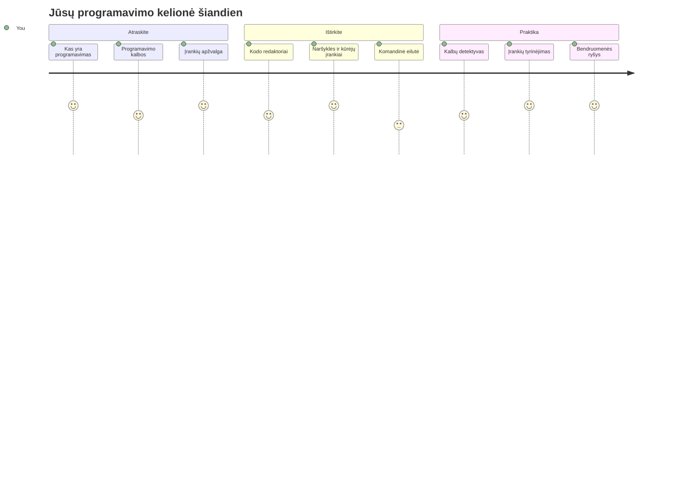
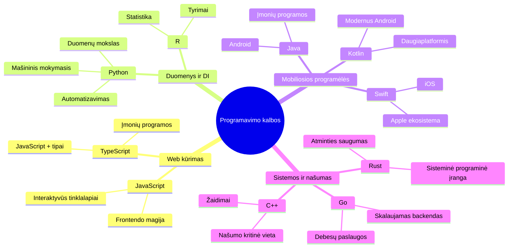
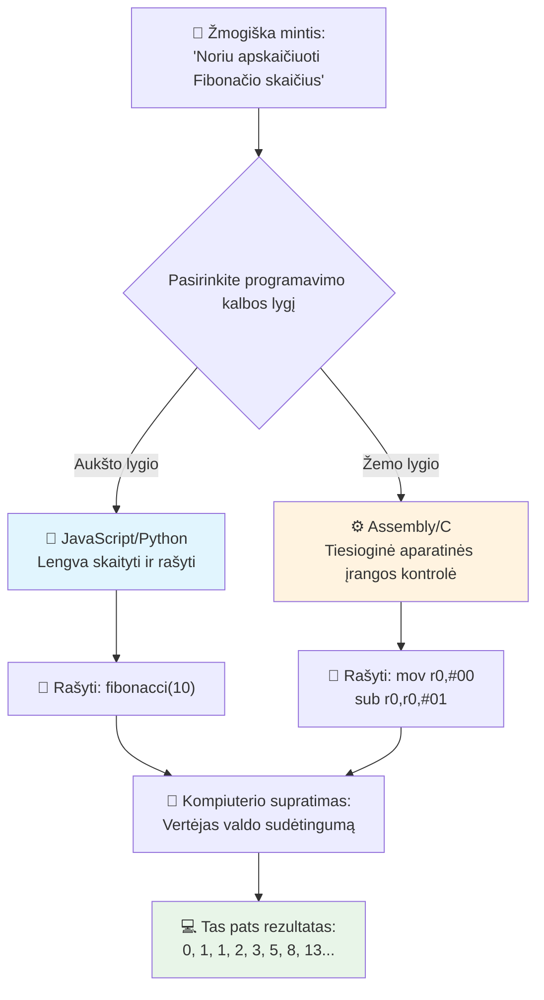
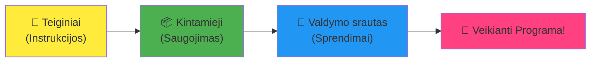
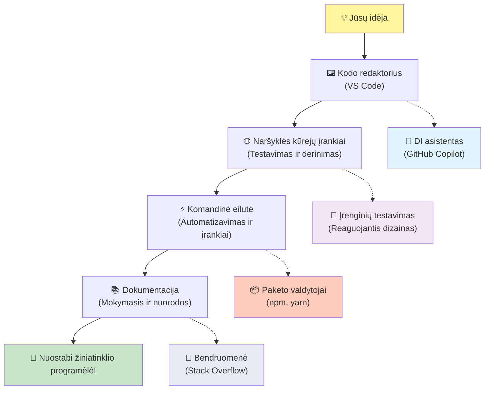
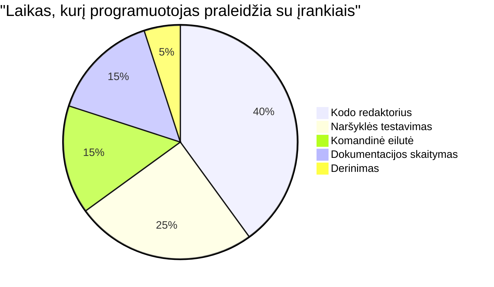
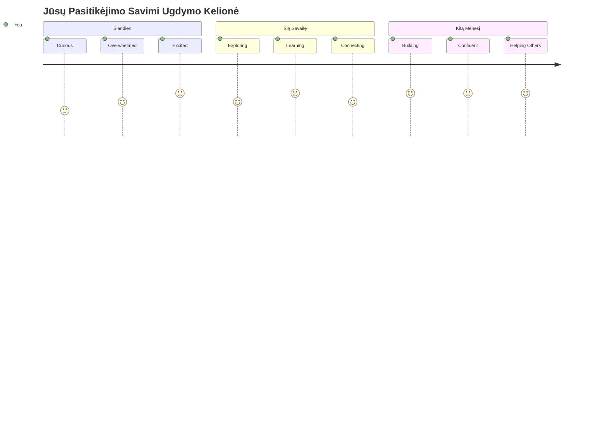

# Įvadas į programavimo kalbas ir modernius kūrėjų įrankius
 
Sveikas, būsimasis programuotojau! 👋 Ar galiu tau pasakyti kažką, kas man kiekvieną dieną sukelia šiurpuliukus? Tu ketini atrasti, kad programavimas nėra tik kompiuteriai – tai tikros supergalios, leidžiančios įgyvendinti tavo laukines idėjas!

Žinai tą akimirką, kai naudojiesi savo mėgstama programa ir viskas tiesiog veikia tobulai? Kai palieti mygtuką ir įvyksta kažkas stebuklingo, dėl ko sakai "oho, kaip jie TAI padarė?" Na, kažkas, panašus į tave – tikriausiai savo mėgstamoje kavinėje prie 2 val. nakties su trečiu espreso – parašė tą kodą, kuris sukūrė tą magiją. Ir štai kas tau privers sprogti protą: šios pamokos pabaigoje ne tik suprasi, kaip jie tai padarė, bet ir pats norėsi pabandyti!

Žinok, suprantu, jei programavimas dabar atrodo bauginantis. Kai pradėjau, tikrai galvojau, kad reikia būti kažkokiu matematikos genijumi arba programuoti nuo penkerių metų. Tačiau štai kas visiškai pakeitė mano požiūrį: programavimas yra tarsi naujos kalbos mokymasis – pradedi nuo „labas“ ir „ačiū“, tuomet pereini prie kavos užsakymo ir netrukus jau vedi gilius filosofinius pokalbius! Tik šiuo atveju tu kalbiesi su kompiuteriais, o jie – kantriausi pašnekovai, kokius gali turėti – niekada nepeikia tavo klaidų ir visada noriai bando dar kartą!

Šiandien pažvelgsime į nuostabius įrankius, kurie modernią žiniatinklio kūrimą paverčia ne tik įmanoma, bet ir labai įtraukią. Kalbu apie tuos pačius redaktorius, naršykles ir darbo procesus, kuriuos kasdien naudoja „Netflix“, „Spotify“ ir tavo mėgstamos nepriklausomos programėlių studijos kūrėjai. Ir štai dalykas, kuris privers tave šokti iš laimės: dauguma šių profesionalių pramonės standartų įrankių yra visiškai nemokami!


> Sketchnote autorius [Tomomi Imura](https://twitter.com/girlie_mac)


```mermaid
journey
    title Jūsų programavimo kelionė šiandien
    section Atraskite
      Kas yra programavimas: 5: You
      Programavimo kalbos: 4: You
      Įrankių apžvalga: 5: You
    section Ištirkite
      Kodo redaktoriai: 4: You
      Naršyklės ir kūrėjų įrankiai: 5: You
      Komandinė eilutė: 3: You
    section Praktika
      Kalbų detektyvas: 4: You
      Įrankių tyrinėjimas: 5: You
      Bendruomenės ryšys: 5: You
```
## Pažiūrėkime, ką jau žinai!

Prieš tai, kai pradėsime smagų turinį, man įdomu – ką tu jau žinai apie šį programavimo pasaulį? Ir žinok, jei žiūri į šiuos klausimus ir galvoji „aš iš tiesų neturiu jokio supratimo apie tai“, tai ne tik gerai, tai puiku! Tai reiškia, kad esi tiksliai ten, kur turi būti. Įsivaizduok šį testą kaip tempimą prieš treniruotę – mes tiesiog ruošiamės raumenims!

[Atlik išankstinį testą](https://ff-quizzes.netlify.app/web/)


## Nuotykis, į kurį kartu įžengsime

Gerai, aš tikrai smarkiai džiaugiuosi tuo, ką šiandien tyrinėsime! Rimtai, norėčiau pamatyti tavo veidą, kai kai kurie iš šių koncepcijų įsižiebs. Štai nuostabi kelionė, kurią keliausime kartu:

- **Kas iš tikrųjų yra programavimas (ir kodėl tai be galo šaunu!)** – Atraskime, kaip kodas tiesiogiai yra nematoma magija, kuri valdo viską aplinkui, nuo to žadintuvo, kuris kaip mat žino, kad yra pirmadienio rytas, iki algoritmo, kuris tobulai parenka tavo „Netflix“ rekomendacijas
- **Programavimo kalbos ir jų nuostabios asmenybės** – Įsivaizduok vakarėlį, kuriame kiekvienas turi skirtingas supergalias ir sprendžia problemas savaip. Būtent toks yra programavimo kalbų pasaulis, ir tu jas pamilsi!
- **Pagrindiniai pastato blokai, kurie kuria skaitmeninę magiją** – Įsivaizduok juos kaip tobulą kūrybinį LEGO rinkinį. Kai suprasi, kaip šios dalys dera kartu, suprasi, kad gali sukurti bet ką, ką tik sugalvoji
- **Profesionalūs įrankiai, dėl kurių jausiesi tarsi tau būtų įteikta burtininko lazdelė** – Aš čia nešališkas dramatiškumas – šie įrankiai tikrai leis tau jaustis, kad turi supergalias, o geriausia? Tai patys įrankiai, kuriuos naudoja profesionalai!

> 💡 **Svarbu**: Neskubėk šiandien visko įsiminti! dabar noriu, kad pajustum tą azartą, kas įmanoma. Detalės ateis natūraliai, kai kartu praktikavsimės – taip vyksta tikras mokymasis!

> Šią pamoką gali rasti [Microsoft Learn](https://learn.microsoft.com/en-us/learn/modules/web-development-101/introduction-programming/?WT.mc_id=academic-77807-sagibbon)!

## Tai kas gi *yra* programavimas?

Gerai, imkimės milijono dolerių klausimo: kas iš tiesų yra programavimas?

Papasakosiu tau istoriją, kuri visiškai pakeitė mano požiūrį. Praėjusią savaitę bandžiau mamai paaiškinti, kaip naudotis mūsų nauju išmaniuoju televizoriaus nuotolinio valdymo pultu. Pagavau save sakant tokius žodžius: „Paspausk raudoną mygtuką, bet ne didįjį raudoną, o mažąjį raudoną kairėje... ne, tavo kitas kairėje... gerai, dabar laikyk du sekundes, ne vieną, ne tris...“ Skamba pažįstamai? 😅

Tai yra programavimas! Tai menas duoti labai išsamius, žingsnis po žingsnio nurodymus kažkam galingam, bet kam reikia viską tiksliai išdėstyti. Tik vietoje to, kad aiškintum mamytei (kuri gali paklausti „kuri raudona mygtukė?!“), tu aiškini kompiuteriui (kuris tiesiog atlieka tai, ką sakai, net jei tai ne visiškai tas, ką turėjai omenyje).

Štai kas man atvertė akis, kai tik pradėjau mokytis: kompiuteriai iš tiesų yra gana paprasti savo esmėje. Jie supranta tik du dalykus – 1 ir 0, kas yra tiesiog „taip“ ir „ne“ arba „įjungta“ ir „išjungta“. Viskas! Bet štai kur prasideda magija – mums nereikia kalbėti tik 1 ir 0, tarsi būtume „Matricoje“. Čia į pagalbą ateina **programavimo kalbos**. Jos tarsi geriausias pasaulio vertėjas, kuris išverčia tavo paprastus žmogiškus mintis į kompiuterio kalbą.

Ir štai kas man kiekvieną rytą pažadina tikrus šiurpuliukus: tiesiog *viskas* skaitmeniniame pasaulyje prasidėjo nuo kažko panašaus į tave, tikriausiai pasislėpusio pižamoje su puodeliu kavos, kuris rašė kodą savo nešiojamame kompiuteryje. Tas Instagram filtras, kuris leidžia tau atrodyti nepriekaištingai? Kažkas jį sukūrė. Rekomendacija, kuri atvedė tave iki tavo naujos mėgstamos dainos? Programuotojas sukūrė tą algoritmą. Programėlė, kuri padeda suskaidyti vakarienės sąskaitas su draugais? Taip, kažkas pagalvojo „tai erzina, tikrai galėčiau tai išspręsti“ ir tada... jis tai padarė!

Išmokęs programuoti, ne tik įgiši naują įgūdį – tu tampi šios nuostabios problemų sprendėjų bendruomenės dalimi, kuri dienas leidžia galvodama: „O kas, jei galėčiau sukurti kažką, kas padaro kieno nors dieną bent šiek tiek geresnę?“ Svarstyk, ar yra kas nors šauniau už tai?

✅ **Linksmas faktų medžioklė**: Štai kas smagu paieškoti, kai turėsi laisvą minutę – kas, tavo manymu, buvo pirmasis pasaulio kompiuterių programuotojas? Pasilenksiu į užuominą: tai gali būti ne tas, ko tikėjaisi! Šios asmenybės istorija yra be galo įkvepianti ir parodo, kad programavimas visada buvo susijęs su kūrybišku problemų sprendimu ir mąstymu už ribų.

### 🧠 **Patikrink, kaip jautiesi?**

**Skirk minutę apmąstymams:**
- Ar dabar tau prasminga idėja „duoti nurodymus kompiuteriams“?
- Ar gali pagalvoti apie kasdienę užduotį, kurią norėtum automatizuoti programuodamas?
- Kokie klausimai kyla tavo galvoje apie visą šitą programavimo dalyką?

> **Prisimink**: visiškai normalu, jei kai kurios sąvokos dabar atrodo miglotos. Programavimo mokymasis yra kaip naujos kalbos mokymasis – reikia laiko neurų keliams susiformuoti. Tu eini puikiai!

## Programavimo kalbos – kaip skirtingi magijos skoniai

Gerai, tai skambės keistai, bet būk su manimi – programavimo kalbos daug kuo primena skirtingų muzikos stilių. Įsivaizduok: turi džiazą, kuris yra lygus ir improvizacinis, rokenrolą, kuris galingas ir tiesmukas, klasiką, kuri elegantiška ir struktūruota, ir hip-hopą, kuris kūrybingas ir ekspresyvus. Kiekvienas stilius turi savo nuotaiką, savo aistringų gerbėjų bendruomenę, ir kiekvienas yra tinkamas skirtingoms nuotaikoms ir progoms.

Programavimo kalbos veikia būtent taip! Tu nenaudotum tos pačios kalbos smagiam mobiliam žaidimui kurti, kuriai apdoroti didžiulius klimato duomenų kiekius, kaip ir nesileistum groti death metalo jogos užsiėmime (na, daugumoje jogos užsiėmimų! 😄).

Bet štai kas kiekvieną kartą man visiškai priverčia protą suktis: šios kalbos tarsi turi kantriausią, įspūdingiausią vertėją, kuris sėdi šalia tavęs. Tu gali išreikšti savo idėjas taip, kaip tavo žmogaus smegenims natūralu, o jis rūpinasi visa labai sudėtinga vertimo dalimi į 1 ir 0 kalbą, kuria iš tikrųjų kalba kompiuteriai. Tai tarsi draugas, kuris tobulai moka tiek „žmogišką kūrybiškumą“, tiek „kompiuterinę logiką“ – ir jis niekada nepavargsta, jam nereikia kavos pertraukų, ir jis niekada nepeikia, jei tu pakartotinai klausiu tą patį!

### Populiarios programavimo kalbos ir jų paskirtys


```mermaid
mindmap
  root((Programavimo kalbos))
    Web kūrimas
      JavaScript
        Frontendo magija
        Interaktyvūs tinklalapiai
      TypeScript
        JavaScript + tipai
        Įmonių programos
    Duomenys ir DI
      Python
        Duomenų mokslas
        Mašininis mokymasis
        Automatizavimas
      R
        Statistika
        Tyrimai
    Mobiliosios programėlės
      Java
        Android
        Įmonių programos
      Swift
        iOS
        Apple ekosistema
      Kotlin
        Modernus Android
        Daugiaplatformis
    Sistemos ir našumas
      C++
        Žaidimai
        Našumo kritinė vieta
      Rust
        Atminties saugumas
        Sisteminė programinė įranga
      Go
        Debesų paslaugos
        Skalaujamas backendas
```
| Kalba | Geriausiai tinka | Kodėl populiari |
|-------|------------------|-----------------|
| **JavaScript** | Interneto kūrimas, vartotojo sąsajos | Veikia naršyklėse, valdo interaktyvias svetaines |
| **Python** | Duomenų mokslas, automatizavimas, DI | Lengva skaityti ir mokytis, galingos bibliotekos |
| **Java** | Įmonių programos, Android programėlės | Platformai nepriklausoma, tvirta didelėms sistemoms |
| **C#** | „Windows“ programos, žaidimų kūrimas | Stipri Microsoft ekosistema |
| **Go** | Debesų paslaugos, backend sistemos | Greita, paprasta, sukurta šiuolaikinei skaičiavimams |

### Aukšto lygio ir žemo lygio kalbos

Gerai, tai buvo tiesiog koncepcija, kuri išties sunaikino mano protą, kai pradėjau mokytis, todėl dalinsiuosi analogija, kuri pagaliau man leido tai suprasti – ir labai tikiuosi, kad ir tau padės!

Įsivaizduok, kad lankaisi šalyje, kurios kalbos nesupranti, ir desperatiškai reikia rasti artimiausią tualetą (mes visi per tą esame ėję, tiesa? 😅):

- **Žemo lygio programavimas** yra tarsi mokėti vietinį dialektą taip gerai, kad gali kalbėtis su močiute, kuri prekiauja vaisiais kampe, naudodamas kultūrinius niuansus, vietinius žodžius ir vidinius juokelius, kuriuos supranta tik tie, kurie užaugo ten. Labai įspūdinga ir labai efektyvu... jei esi sklandus! Tačiau gana sudėtinga, kai tik nori rasti tualetą.

- **Aukšto lygio programavimas** yra tarsi turėti nuostabų vietinį draugą, kuris tiesiog tave supranta. Gali pasakyti „man labai reikia surasti tualetą“ paprasta anglų kalba, o jis išverčia kultūrinius niuansus ir duoda tau nuorodas tokiu būdu, kuris tavo nenatūralioms smegenims visiškai aiškus.

Programavimo terminais:
- **Žemo lygio kalbos** (tokios kaip Asamblėja ar C) leidžia labai detaliai kalbėtis su kompiuterio aparatine įranga, tačiau reikalingas mašinos mąstymas, o tai... na, sakykime, didelis psichologinis šuolis!
- **Aukšto lygio kalbos** (pavyzdžiui, JavaScript, Python ar C#) leidžia galvoti kaip žmogui, o jos pačios rūpinasi visa mašinine kalba užkulisiuose. Be to, jos turi draugiškas bendruomenes, pilnas žmonių, kurie prisimena, kas buvo mokiniai ir tikrai nori padėti!

Spėk, nuo kurių aš siūlau pradėti? 😉 Aukšto lygio kalbos yra tarsi mokomieji ratai, kurių tu tikrai nenori nuimti, nes jos daro visą patirtį daug smagesnę!


```mermaid
flowchart TB
    A["👤 Žmogiška mintis:<br/>'Noriu apskaičiuoti Fibonačio skaičius'"] --> B{Pasirinkite programavimo kalbos lygį}
    
    B -->|Aukšto lygio| C["🌟 JavaScript/Python<br/>Lengva skaityti ir rašyti"]
    B -->|Žemo lygio| D["⚙️ Assembly/C<br/>Tiesioginė aparatinės įrangos kontrolė"]
    
    C --> E["📝 Rašyti: fibonacci(10)"]
    D --> F["📝 Rašyti: mov r0,#00<br/>sub r0,r0,#01"]
    
    E --> G["🤖 Kompiuterio supratimas:<br/>Vertėjas valdo sudėtingumą"]
    F --> G
    
    G --> H["💻 Tas pats rezultatas:<br/>0, 1, 1, 2, 3, 5, 8, 13..."]
    
    style C fill:#e1f5fe
    style D fill:#fff3e0
    style H fill:#e8f5e8
```
### Parodysiu, kodėl aukšto lygio kalbos tokios draugiškos

Gerai, rodysiu tau pavyzdį, kuris puikiai parodo, kodėl aš pamėgau aukšto lygio kalbas, bet pirmiausiai – noriu, kad pažadėtum man kažką. Kai pamatysi pirmąk kodą, nepanikuok! Jis turi atrodyti bauginančiai. Ir tai yra būtent mano taikymas!

Pažiūrėsime tą pačią užduotį, parašytą dviem visiškai skirtingais stiliais. Abu sukuria Fibonacci seką – tai gražus matematinis dėsnis, kai kiekvienas skaičius yra dviejų prieš jį esančių sumą: 0, 1, 1, 2, 3, 5, 8, 13... (Įdomybė: šį dėsningumą rasi tiesiog visur gamtoje – saulėgrąžų sėklų spiralėse, pušų kūgių raštuose, netgi galaktikų formavime!)

Pasiruošęs pamatyti skirtumą? Eime!

**Aukšto lygio kalba (JavaScript) – žmogui draugiška:**

```javascript
// 1 žingsnis: Pagrindinis Fibonačio nustatymas
const fibonacciCount = 10;
let current = 0;
let next = 1;

console.log('Fibonacci sequence:');
```

**Šis kodas daro šiuos veiksmus:**
- **Deklaruoja** konstantą, kuri nurodo, kiek Fibonacci skaičių norime sugeneruoti
- **Inicializuoja** du kintamuosius, sekančius dabartinį ir kitą skaičių sekoje
- **Nustato** pradinius reikšmes (0 ir 1), kurios apibrėžia Fibonacci modelį
- **Pateikia** antraštę, kad pažymėtų rezultatus

```javascript
// 2 žingsnis: Sugeneruokite seką naudodami kilpą
for (let i = 0; i < fibonacciCount; i++) {
  console.log(`Position ${i + 1}: ${current}`);
  
  // Apskaičiuokite kitą skaičių sekoje
  const sum = current + next;
  current = next;
  next = sum;
}
```

**Čia vyksta:**
- **Kartojamas ciklas** per kiekvieną sekos elementą naudojant `for` ciklą
- **Rodomas** kiekvienas skaičius su jo pozicija naudojant šablonines eilutes
- **Apskaičiuojamas** kitas Fibonacci skaičius, sudedant dabartinę ir kitą reikšmes
- **Atnaujinami** kintamieji, judant prie kitos iteracijos

```javascript
// 3 žingsnis: Šiuolaikinis funkcinis požiūris
const generateFibonacci = (count) => {
  const sequence = [0, 1];
  
  for (let i = 2; i < count; i++) {
    sequence[i] = sequence[i - 1] + sequence[i - 2];
  }
  
  return sequence;
};

// Naudojimo pavyzdys
const fibSequence = generateFibonacci(10);
console.log(fibSequence);
```

**Aukščiau mes:**
- **Sukūrėme** pakartotinai naudojamą funkciją, naudojant modernią rodyklės funkciją
- **Sukūrėme** masyvą, kuris saugo visą seką, o ne rodo skaičius pavieniui
- **Naudojome** masyvo indeksavimą, kad apskaičiuoti kiekvieną naują skaičių iš ankstesnių reikšmių
- **Gražiname** visą seką, kad ją būtų galima lanksčiai naudoti programos kituose vietose

**Žemo lygio kalba (ARM Asamblėja) – kompiuteriui draugiška:**

```assembly
 area ascen,code,readonly
 entry
 code32
 adr r0,thumb+1
 bx r0
 code16
thumb
 mov r0,#00
 sub r0,r0,#01
 mov r1,#01
 mov r4,#10
 ldr r2,=0x40000000
back add r0,r1
 str r0,[r2]
 add r2,#04
 mov r3,r0
 mov r0,r1
 mov r1,r3
 sub r4,#01
 cmp r4,#00
 bne back
 end
```

Atkreipk dėmesį, kaip JavaScript versija skaitosi beveik kaip angliški nurodymai, o Asamblėjos versija naudoja kriptinius komandas, kurios tiesiogiai valdo kompiuterio procesorių. Abi atlieka tą pačią užduotį, bet aukšto lygio kalba gerokai lengviau suprantama, rašoma ir prižiūrima žmogui.

**Pagrindiniai skirtumai, kuriuos pastebėsi:**
- **Skaitymo paprastumas**: JavaScript naudoja aprašomuosius pavadinimus, tokius kaip `fibonacciCount`, o Assembly – paslėptus žymenis, tokius kaip `r0`, `r1`
- **Komentarai**: Aukšto lygio kalbos skatina aiškinamuosius komentarus, kurie daro kodą savidokumentuojančiu
- **Struktūra**: JavaScript loginė eiga atitinka žmonių mąstymą problemų sprendime žingsnis po žingsnio
- **Priežiūra**: JavaScript versijos atnaujinimas skirtingiems reikalavimams yra paprastas ir aiškus

✅ **Apie Fibonacci seką**: Šis visiškai nuostabus skaičių raštas (kur kiekvienas skaičius yra dviejų prieš jį esančių sumą: 0, 1, 1, 2, 3, 5, 8...) pasirodo tiesiog *visur* gamtoje! Jį rasite saulėgrąžų spiralėse, pušies kankorėžių raštuose, kaip vingiuoja nautilius kriauklės, net kaip auga medžių šakos. Labai įdomu, kaip matematika ir kodas gali padėti mums suprasti ir atkurti raštus, kuriuos gamta naudoja kuriant grožį!


## Kūrimo blokai, kurie daro magiją

Gerai, dabar kai pamatėte, kaip atrodo programavimo kalbos praktiškai, suskaidykime pagrindines dalis, kurios sudaro tiesiog kiekvieną parašytą programą. Galvokite apie jas kaip esminius ingredientus savo mėgstamiausiame recepte – supratę, ką daro kiekvienas, galėsite skaityti ir rašyti kodą beveik bet kuria kalba!

Tai kažkas panašaus į programavimo gramatikos mokymąsi. Prisiminkite mokykloje, kai mokėtės apie daiktavardžius, veiksmažodžius ir kaip sudaryti sakinius? Programavimas turi savo gramatikos versiją, ir tiesiog įdomu, kad ji yra daug logiškesnė ir atlaidesnė nei anglų kalbos gramatika! 😄

### Sakinių blokai: žingsnis po žingsnio instrukcijos

Pradėkime nuo **sakinių** – jie kaip atskiros pastraipos pokalbyje su jūsų kompiuteriu. Kiekvienas sakinys liepia kompiuteriui atlikti vieną konkrečią užduotį, tarsi duotų kryptis: „Čia pasuk į kairę“, „Sustok prie raudono šviesoforo“, „Pastatyk automobilį tame taške.“

Man patinka sakiniai dėl jų skaitomumo. Pažiūrėkite:

```javascript
// Pagrindinės instrukcijos, kurios atlieka vienkartinius veiksmus
const userName = "Alex";                    
console.log("Hello, world!");              
const sum = 5 + 3;                         
```

**Štai ką šis kodas atlieka:**
- **Deklaruoja** konstantą kintamąjį vartotojo vardui saugoti
- **Rodo** pasveikinimo pranešimą konsolės išvestyje
- **Apskaičiuoja** ir išsaugo matematinės operacijos rezultatą

```javascript
// Teiginiai, kurie sąveikauja su tinklalapiais
document.title = "My Awesome Website";      
document.body.style.backgroundColor = "lightblue";
```

**Žingsnis po žingsnio, štai kas vyksta:**
- **Pakeičia** tinklalapio pavadinimą, rodoma naršyklės skirtelyje
- **Pakeičia** viso puslapio fono spalvą

### Kintamieji: jūsų programos atminties sistema

Taip, **kintamieji** yra tikrai viena mano mėgstamiausių mokymo sąvokų, nes jie labai panašūs į dalykus, kuriuos jau naudojate kiekvieną dieną!

Pagalvokite apie savo telefono kontaktų sąrašą. Jūs neužsirašote visų numerių atmintinai – vietoje to išsaugote „Mama“, „Geriausias draugas“ arba „Pica, kuri pristato iki 2 valandos nakties“ ir telefone išsaugomi tik tikrieji numeriai. Kintamieji veikia visai taip pat! Tai kaip pažymėtos talpos, kuriose jūsų programa gali saugoti informaciją ir vėliau ją pasiimti naudodama pavadinimą, kuris iš tikrųjų prasmingas.

Čia yra tai, kas tikrai nuostabu: kintamieji gali keistis programos veikimo metu (todėl ir pavadinimas „kintamasis“ – pamatykite, ką jie padarė?). Kaip jūs galėtumėte atnaujinti tą picos kontaktą radę dar geresnį restoraną, taip kintamieji gali būti atnaujinti, kai programa sužino naujos informacijos arba keičiasi sąlygos!

Leiskite parodyti, kaip gražiai paprasta tai gali būti:

```javascript
// 1 žingsnis: Kuriame pagrindinius kintamuosius
const siteName = "Weather Dashboard";        
let currentWeather = "sunny";               
let temperature = 75;                       
let isRaining = false;                      
```

**Šios sąvokos supratimas:**
- **Saugo** nekintamus duomenis `const` kintamuosiuose (pvz., svetainės pavadinimą)
- **Naudoja** `let` reikšmėms, kurios gali keistis programos metu
- **Priedija** skirtingus duomenų tipus: tekstus (string), skaičius, ir loginės reikšmės (boolean)
- **Pasirenka** aprašomuosius pavadinimus, kurie aiškiai paaiškina, ką kiekvienas kintamasis saugo

```javascript
// 2 žingsnis: Darbas su objektais susijusių duomenų grupavimui
const weatherData = {                       
  location: "San Francisco",
  humidity: 65,
  windSpeed: 12
};
```

**Aukščiau mes:**
- **Sukūrėme** objektą, grupuojantį susijusią orų informaciją
- **Organizavome** kelis duomenis po vienu kintamojo pavadinimu
- **Naudojome** raktas–reikšmė poras, kad aiškiai pažymėtume kiekvieną duomenų elementą

```javascript
// 3 žingsnis: Kintamųjų naudojimas ir atnaujinimas
console.log(`${siteName}: Today is ${currentWeather} and ${temperature}°F`);
console.log(`Wind speed: ${weatherData.windSpeed} mph`);

// Kintamųjų, kuriuos galima keisti, atnaujinimas
currentWeather = "cloudy";                  
temperature = 68;                          
```

**Paaiškinkime kiekvieną dalį:**
- **Rodyti** informaciją naudojant šablonines eilutes su `${}` sintakse
- **Pasiekti** objekto savybes naudojant taškinę notaciją (`weatherData.windSpeed`)
- **Atnaujinti** `let` deklaruotus kintamuosius, kad atspindėtų besikeičiančias sąlygas
- **Sujungti** kelis kintamuosius kuriant prasmingus pranešimus

```javascript
// 4 žingsnis: Modernus destruktūrizavimas švaresniam kodui
const { location, humidity } = weatherData; 
console.log(`${location} humidity: ${humidity}%`);
```

**Ką reikia žinoti:**
- **Išskirti** tam tikras objekto savybes naudojant destruktūrizavimo priskyrimą
- **Sukurti** naujus kintamuosius automatiškai su tokiais pat pavadinimais kaip objekto raktai
- **Supaprastinti** kodą vengiant pasikartojančios taškinės notacijos

### Kontrolės srautas: mokome programą galvoti

Gerai, čia programavimas tampa tikrai stulbinantis! **Kontrolės srautas** iš esmės reiškia mokyti programą priimti išmintingus sprendimus, tarsi kaip jūs darote kiekvieną dieną be jokių minčių.

Įsivaizduokite: ryte galbūt manote „Jeigu lyja, pasiimsiu skėtį. Jei šalta, apsirengsiu striukę. Jei vėluoju, nepavalgysiu ir pasiimsiu kavos pakeliui.“ Jūsų smegenys natūraliai vykdo šią jeigu–tai logiką dešimtis kartų per dieną!

Tai daro programas protingas ir gyvas, o ne tik seką nuobodžių, nuspėjamų komandų. Jos iš tiesų gali pažvelgti į situaciją, įvertinti, kas vyksta, ir tinkamai reaguoti. Tarsi suteiktumėte programai smegenis, kurios gali prisitaikyti ir priimti sprendimus!

Norite pamatyti, kaip gražiai tai veikia? Leiskite parodyti:

```javascript
// 1 žingsnis: Pagrindinė sąlyginė logika
const userAge = 17;

if (userAge >= 18) {
  console.log("You can vote!");
} else {
  const yearsToWait = 18 - userAge;
  console.log(`You'll be able to vote in ${yearsToWait} year(s).`);
}
```

**Štai ką šis kodas daro:**
- **Tikrina**, ar vartotojo amžius atitinka balsavimo reikalavimą
- **Vykdo** skirtingus kodo blokus priklausomai nuo sąlygų rezultato
- **Apskaičiuoja** ir parodo, kiek dar laiko iki balsavimo teisės, jei vartotojas jaunesnis nei 18
- **Suteikia** konkrečią, naudingą grįžtamąją informaciją kiekvienam atvejui

```javascript
// 2 žingsnis: Keli sąlygos su loginiais operatoriais
const userAge = 17;
const hasPermission = true;

if (userAge >= 18 && hasPermission) {
  console.log("Access granted: You can enter the venue.");
} else if (userAge >= 16) {
  console.log("You need parent permission to enter.");
} else {
  console.log("Sorry, you must be at least 16 years old.");
}
```

**Išskaidyti tai, kas čia vyksta:**
- **Sujungia** kelias sąlygas naudodami `&&` (ir) operatorių
- **Kurti** daugiapakopį sąlygų hierarchiją naudodami `else if` keliems scenarijams
- **Apdoroti** visas galimas situacijas galutiniu `else` sakiniu
- **Pateikti** aiškią, veiksmingą grįžtamąją informaciją kiekvienai skirtingai situacijai

```javascript
// 3 žingsnis: Trumpa sąlyga su ternarinis operatoriumi
const votingStatus = userAge >= 18 ? "Can vote" : "Cannot vote yet";
console.log(`Status: ${votingStatus}`);
```

**Ką reikia prisiminti:**
- **Naudoti** ternarinį operatorių (`? :`) paprastoms dviejų galimų variantų sąlygoms
- **Rašyti** sąlygą pirma, po to `?`, tada tiesos rezultatą, po to `:`, tada klaidos rezultatą
- **Taikyti** šį modelį, kai reikia priskirti reikšmes pagal sąlygas

```javascript
// 4 žingsnis: kelių specifinių atvejų tvarkymas
const dayOfWeek = "Tuesday";

switch (dayOfWeek) {
  case "Monday":
  case "Tuesday":
  case "Wednesday":
  case "Thursday":
  case "Friday":
    console.log("It's a weekday - time to work!");
    break;
  case "Saturday":
  case "Sunday":
    console.log("It's the weekend - time to relax!");
    break;
  default:
    console.log("Invalid day of the week");
}
```

**Šis kodas atlieka:**
- **Suderina** kintamojo reikšmę su keliomis konkrečiomis situacijomis
- **Grupuoja** panašias bylas kartu (darbo dienos prieš savaitgalius)
- **Vykdo** tinkamą kodo bloką suradus atitikimą
- **Įtraukia** `default` atvejį netikėtoms reikšmėms apdoroti
- **Naudoja** `break` sakinius, kad kodas nesitęstų į kitą bylą

> 💡 **Realus pavyzdys**: Pagalvokite apie kontrolės srautą kaip apie kantriausią pasaulyje GPS, kuris duoda jums nurodymus. Jis gali sakyti: „Jei pagrindinėje gatvėje spūstis, važiuokite automagistrale. Jei automagistralę uždaro statybos, bandykite vaizdingą maršrutą.“ Programos naudoja tokią pačią loginę sąlygų logiką, kad išmintingai reaguotų į skirtingas situacijas ir visuomet suteiktų vartotojams geriausią patirtį.

### 🎯 **Konceptų patikrinimas: pagrindų meistriškumas**

**Pažiūrėkime, kaip sekasi su pagrindais:**
- Ar galite paaiškinti skirtumą tarp kintamojo ir sakinio savo žodžiais?
- Sugalvokite realų scenarijų, kur panaudotumėte jeigu–tai sprendimą (kaip mūsų balsavimo pavyzdyje)
- Kas programavimo logikoje jus nustebino?

**Greitas pasitikėjimo pakilimas:**

```mermaid
flowchart LR
    A["📝 Teiginiai<br/>(Instrukcijos)"] --> B["📦 Kintamieji<br/>(Saugojimas)"] --> C["🔀 Valdymo srautas<br/>(Sprendimai)"] --> D["🎉 Veikianti Programa!"]
    
    style A fill:#ffeb3b
    style B fill:#4caf50
    style C fill:#2196f3
    style D fill:#ff4081
```
✅ **Ką darysime toliau**: Pradėsime smagiai gilintis į šias sąvokas ir tęsti šią nuostabią kelionę kartu! Dabar tiesiog susikoncentruokite į jaudulį dėl visų nuostabių galimybių, kurios laukia jūsų. Konkrečios įgūdžių ir technikos įsisavins natūraliai, kai praktikuosimės kartu – pažadu, tai bus daug smagiau, nei tikėjotės!

## Įrankiai darbui

Gerai, čia aš iš tiesų labai jaudinuosi ir vos neapsiverkiu iš džiaugsmo! 🚀 Kalbėsime apie neįtikėtinus įrankius, kurie leis jums jaustis, tarsi ką tik gavote rakto nuo skaitmeninės kosminės laivo taikymo.

Žinote, kaip virėjas turi tobulai subalansuotus peilius, kurie jaučiasi tarsi jo rankos tęsinys? O muzikantas turi gitarą, kuri atrodo ima dainuoti vos ją palietus? Na, kūrėjai turi savo versiją tų magiškų įrankių, ir štai kas jus tiesiog pribloškia – dauguma jų visai nemokami!

Negaliu nustygti vietoje, galvodamas apie galimybę dalintis jais su jumis, nes jie visiškai pakeitė, kaip kuriame programinę įrangą. Kalbame apie AI varomus kodo pagalbininkus, kurie gali padėti rašyti kodą (ir aš čia tikrai nejuokauju!), debesų aplinkas, kur galite kurti visas programas bet kur, kur yra Wi-Fi, ir tokį derinimo įrankių kompleksą, kad jie tarsi X-spinduliai jūsų programoms.

Ir štai kas man vis dar kelia šiurpuliukus: tai tikrai nėra „pradedančiųjų įrankiai“, kuriuos greitai peraugsit. Tai tie patys profesionalaus lygio įrankiai, kuriuos šiuo metu naudoja Google, Netflix ir ta indie programėlių studija, kurią dievinate. Jūs jausitės tikru profesionalu, juos naudodami!


```mermaid
graph TD
    A["💡 Jūsų idėja"] --> B["⌨️ Kodo redaktorius<br/>(VS Code)"] 
    B --> C["🌐 Naršyklės kūrėjų įrankiai<br/>(Testavimas ir derinimas)"]
    C --> D["⚡ Komandinė eilutė<br/>(Automatizavimas ir įrankiai)"]
    D --> E["📚 Dokumentacija<br/>(Mokymasis ir nuorodos)"]
    E --> F["🚀 Nuostabi žiniatinklio programėlė!"]
    
    B -.-> G["🤖 DI asistentas<br/>(GitHub Copilot)"]
    C -.-> H["📱 Įrenginių testavimas<br/>(Reaguojantis dizainas)"]
    D -.-> I["📦 Paketo valdytojai<br/>(npm, yarn)"]
    E -.-> J["👥 Bendruomenė<br/>(Stack Overflow)"]
    
    style A fill:#fff59d
    style F fill:#c8e6c9
    style G fill:#e1f5fe
    style H fill:#f3e5f5
    style I fill:#ffccbc
    style J fill:#e8eaf6
```
### Kodo redaktoriai ir IDE: jūsų naujieji skaitmeniniai draugai

Pakalbėkime apie kodo redaktorius – jie rimtai gali tapti jūsų mėgstamiausiomis vietomis praleisti laiką! Galvokite apie juos kaip savo asmeninę programavimo šventovę, kur praleisite daugiausia laiko, kurdami ir tobulindami savo skaitmeninius kūrinius.

Bet štai kas yra tiesiog magiška apie modernius redaktorius: jie nėra vien tik išvaizdžūs teksto redaktoriai. Jie tarsi pats šviesiausias ir palaikantis programavimo mentorius, sėdintis šalia jūsų 24/7. Jie pagauna jūsų klaidas dar anksčiau, nei jas pastebite, pasiūlo patobulinimus, kurie jus padaro genijumi, padeda suprasti, ką daro kiekvienas kodo gabalas, ir kai kurie net gali nuspėti, ką ketinate rašyti, ir pasiūlyti baigti jūsų mintis!

Prisimenu, kai pirmą kartą atradau automatinį užbaigimą – jaučiausi tarsi gyvenčiau ateityje. Pradedate rašyti, ir redaktorius sako: „Ei, ar galvojote apie šią funkciją, kuri daro būtent tai, ko jums reikia?“ Tarsi turėtumėte mintis skaitantį draugą!

**Kas daro šiuos redaktorius tokius neįtikėtinus?**

Modernūs kodo redaktoriai siūlo įspūdingą funkcijų rinkinį, skirtą padidinti jūsų produktyvumą:

| Funkcija | Ką ji daro | Kodėl tai naudinga |
|---------|--------------|--------------|
| **Sintaksės paryškinimas** | Spalvina skirtingas kodo dalis | Padeda lengviau skaityti kodą ir aptikti klaidas |
| **Automatinis užbaigimas** | Siūlo kodą rašant | Spartina kodavimą ir mažina klaidas |
| **Derinimo įrankiai** | Padeda rasti ir taisyti klaidas | Taupo daugybę problemų sprendimo laiko |
| **Pratęsimai** | Prideda specializuotas funkcijas | Leidžia pritaikyti redaktorių bet kokiai technologijai |
| **AI asistentai** | Siūlo kodą ir paaiškinimus | Pagreitina mokymąsi ir produktyvumą |

> 🎥 **Vaizdo įrašo šaltinis**: Norite pamatyti šiuos įrankius veikiant? Peržiūrėkite šį [Įrankių vaizdo įrašą](https://youtube.com/watch?v=69WJeXGBdxg) dėl išsamaus apžvalgos.

#### Rekomenduojami redaktoriai interneto plėtrai

**[Visual Studio Code](https://code.visualstudio.com/?WT.mc_id=academic-77807-sagibbon)** (Nemokamas)
- Populiariausias tarp interneto kūrėjų
- Puiki plėtinių ekosistema
- Integruotas terminalas ir Git palaikymas
- **Būtini plėtiniai**:
  - [GitHub Copilot](https://marketplace.visualstudio.com/items?itemName=GitHub.copilot) – AI varomi kodo pasiūlymai
  - [Live Share](https://marketplace.visualstudio.com/items?itemName=MS-vsliveshare.vsliveshare) – bendradarbiavimas realiuoju laiku
  - [Prettier](https://marketplace.visualstudio.com/items?itemName=esbenp.prettier-vscode) – automatinis kodo formatavimas
  - [Code Spell Checker](https://marketplace.visualstudio.com/items?itemName=streetsidesoftware.code-spell-checker) – klaidų rašyboje tikrinimas kode

**[JetBrains WebStorm](https://www.jetbrains.com/webstorm/)** (Mokamas, nemokamas studentams)
- Pažangūs derinimo ir testavimo įrankiai
- Išmanus kodo užbaigimas
- Integruota versijų kontrolė

**Debesyse veikiantys IDE** (Įvairios kainos)
- [GitHub Codespaces](https://github.com/features/codespaces) – pilnas VS Code naršyklėje
- [Replit](https://replit.com/) – puiku mokymuisi ir kodo dalinimuisi
- [StackBlitz](https://stackblitz.com/) – momentinė pilno spektro interneto plėtra

> 💡 **Pradžios patarimas**: Pradėkite su Visual Studio Code – jis nemokamas, plačiai naudojamas industrijoje ir turi milžinišką bendruomenę, kuri kuria naudingas pamokas ir pratęsimus.


### Interneto naršyklės: jūsų slaptasis kūrimo laboratorija

Gerai, pasiruoškite būti visiškai sužavėti! Žinote, kaip naršyklės naudojamos naršyti socialiniuose tinkluose ir žiūrėti vaizdo įrašus? Paaiškėjo, kad jos visą laiką slėpė nuostabią slapta kūrėjų laboratoriją, tik laukdamos, kol ją atrasite!

Kiekvieną kartą, kai paspaudžiate dešinį pelės mygtuką ant tinklalapio ir pasirenkate „Peržiūrėti elementą“, jūs atidarote paslėptą kūrėjų įrankių pasaulį, kuris yra nuoširdžiai galingesnis už kai kurią brangią programinę įrangą, už kurią anksčiau mokėjau šimtus dolerių. Tai tarsi atrasti, kad jūsų paprasta virtuvė slepia profesionalaus virėjo laboratoriją už slaptos panelės!
Pirmą kartą, kai man parodė naršyklės DevTools, praleidau maždaug tris valandas tiesiog spausdamas visur ir sakydamas „PALAU, JI TAI GALI DARYTI?!" Tu tiesiog gali realiu laiku redaguoti bet kurią svetainę, tiksliai matyti, kaip greitai viskas įsikrauna, išbandyti, kaip tavo svetainė atrodo skirtinguose įrenginiuose, ir netgi derinti JavaScript tarsi tikras profesorius. Tai absoliučiai pribloškianti patirtis!

**Štai kodėl naršyklės yra tavo slaptas ginklas:**

Kai kuri svetainę ar žiniatinklio programą, reikia matyti, kaip ji atrodo ir elgiasi realiame pasaulyje. Naršyklės ne tik rodo tavo darbą, bet ir suteikia detalią informaciją apie veikimą, prieinamumą ir galimas problemas.

#### Naršyklės kūrėjų įrankiai (DevTools)

Šiuolaikinės naršyklės apima visapusiškas kūrimo priemonių rinkinius:

| Įrankio kategorija | Ką ji daro | Naudojimo pavyzdys |
|--------------------|------------|--------------------|
| **Elementų inspektorius** | Realiojo laiko HTML/CSS peržiūra ir redagavimas | Koreguoti stilių, kad pamatytumėte akimirksniu rezultatus |
| **Konsolė** | Peržiūrėti klaidų pranešimus ir testuoti JavaScript | Derinti problemas ir eksperimentuoti su kodu |
| **Tinklo stebėjimas** | Stebėti kaip kraunasi resursai | Optimizuoti našumą ir įkėlimo laikus |
| **Prieinamumo tikrintuvas** | Tikrinti įtraukiantį dizainą | Užtikrinti, kad svetainė veiktų visiems vartotojams |
| **Įrenginio simuliatorius** | Peržiūra skirtingų ekranų dydžių | Išbandyti reaguojančio dizaino be kelių įrenginių |

#### Rekomenduojamos naršyklės kūrimui

- **[Chrome](https://developers.google.com/web/tools/chrome-devtools/)** – pramonės standartas DevTools su išsamiomis dokumentacijomis
- **[Firefox](https://developer.mozilla.org/docs/Tools)** – puikios CSS Grid ir prieinamumo priemonės
- **[Edge](https://docs.microsoft.com/microsoft-edge/devtools-guide-chromium/?WT.mc_id=academic-77807-sagibbon)** – pastatytas ant Chromium, su Microsoft kūrėjų ištekliais

> ⚠️ **Svarbi testavimo patarimas**: Visada testuok savo svetaines keliuose naršyklėse! Kas puikiai veikia Chrome, gali atrodyti kitaip Safari ar Firefox. Profesionalūs kūrėjai testuoja visose pagrindinėse naršyklėse, kad užtikrintų nuoseklią vartotojo patirtį.


### Komandų eilutės įrankiai: tavo kelias gauti kūrėjo supergalių

Gerai, turime visiškai sąžiningą akimirką apie komandų eilutę, nes noriu, kad išgirstum tai iš žmogaus, kuris tikrai tai supranta. Kai pirmą kartą ją pamačiau – tik tą bauginančią juodą ekraną su mirksinčiu tekstu – aš tiesiog pagalvojau: „Ne, tikrai ne! Tai atrodo kaip kažkas iš 1980-ųjų hakerių filmo, ir aš tikrai nesu pakankamai protingas tam!“ 😅

Bet štai ką norėčiau, kad kas nors man būtų pasakęs tada, ir ką sakau tau dabar: komandų eilutė nėra baisi – tai iš tikrųjų tarsi tiesioginis pokalbis su tavo kompiuteriu. Įsivaizduok tai kaip skirtumą tarp užsakymo per įmantrų programėlę su paveikslėliais ir meniu (kas yra lengva ir patogu) ir įėjimo į tavo mėgstamą vietinį restoraną, kur šefas tiksliai žino, ką tau patinka, ir gali pagaminti kažką tobulo vien sakydamas „nustebink mane kažkuo nuostabiu“.

Komandų eilutė yra vieta, kur kūrėjai jaučiasi lyg tikri raganiai. Parašai keletą atrodytų magiškų žodžių (gerai, tai tik komandos, bet jos jaučiasi magiškai!), paspaudi Enter ir BUM – sukuri visą projektų struktūrą, įdiegia galingus įrankius iš viso pasaulio arba išleidžia savo programėlę į internetą, kad milijonai žmonių galėtų ją pamatyti. Kai pirmą kartą paragauji galios, tai tikrai užkrečiama!

**Kodėl komandų eilutė taps tavo mėgstamiausiu įrankiu:**

Nors grafinės sąsajos yra puikios daugeliui užduočių, komandų eilutė išsiskiria automatizacija, preciziškumu ir greitumu. Daugelis kūrimo įrankių daugiausia veikia per komandų eilutės sąsajas, o išmokti jas efektyviai naudotis gali žymiai pagerinti tavo produktyvumą.

```bash
# 1 žingsnis: Sukurkite ir eikite į projekto katalogą
mkdir my-awesome-website
cd my-awesome-website
```

**Ką daro šis kodas:**
- **Sukuria** naują aplanką pavadinimu „my-awesome-website“ tavo projektui
- **Pereina** į ką tik sukurtą aplanką, kad pradėtum darbą

```bash
# 2 žingsnis: inicializuoti projektą su package.json
npm init -y

# Įdiegti šiuolaikinius kūrimo įrankius
npm install --save-dev vite prettier eslint
npm install --save-dev @eslint/js
```

**Žingsnis po žingsnio, kas vyksta:**
- **Inicijuoja** naują Node.js projektą su numatytosiomis reikšmėmis naudojant `npm init -y`
- **Įdiegia** Vite kaip modernų įrankį greitam kūrimui ir gamybos kompiliavimui
- **Prideda** Prettier automatinio kodo formatavimo ir ESLint kodo kokybės tikrinimų įrankius
- **Naudoja** `--save-dev` žymeklį, kad žymėtume tai kaip tik kūrimo priklausomybes

```bash
# 3 žingsnis: Sukurkite projekto struktūrą ir failus
mkdir src assets
echo '<!DOCTYPE html><html><head><title>My Site</title></head><body><h1>Hello World</h1></body></html>' > index.html

# Paleiskite kūrimo serverį
npx vite
```

**Aukščiau mes:**
- **Organizavome** projektą sukurdami atskirus aplankus šaltinio kodui ir ištekliams
- **Sugeneravome** bazinį HTML failą su tinkama dokumento struktūra
- **Paleidome** Vite kūrimo serverį su tiesioginiu perkrovimu ir karštu modulių pakeitimu

#### Būtini komandų eilutės įrankiai žiniatinklio kūrimui

| Įrankis | Paskirtis | Kodėl tau to reikia |
|---------|-----------|--------------------|
| **[Git](https://git-scm.com/)** | Versijų valdymas | Sekti pasikeitimus, bendradarbiauti su kitais, kurti atsargines kopijas |
| **[Node.js & npm](https://nodejs.org/)** | JavaScript paleidimo aplinka ir paketų valdymas | Vykdyti JavaScript už naršyklių ribų, įdiegti modernius kūrimo įrankius |
| **[Vite](https://vitejs.dev/)** | Build įrankis ir kūrimo serveris | Žaibiškai greitas kūrimas su karštu modulių pakeitimu |
| **[ESLint](https://eslint.org/)** | Kodo kokybė | Automatiškai rasti ir taisyti problemas tavo JavaScript kode |
| **[Prettier](https://prettier.io/)** | Kodo formatavimas | Išlaikyti kodą nuosekliai suformatuotą ir skaitomą |

#### Platformai specifinės parinktys

**Windows:**
- **[Windows Terminal](https://docs.microsoft.com/windows/terminal/?WT.mc_id=academic-77807-sagibbon)** – moderni, pilna funkcijų terminalo programa
- **[PowerShell](https://docs.microsoft.com/powershell/?WT.mc_id=academic-77807-sagibbon)** 💻 – galinga scenarijų rašymo aplinka
- **[Command Prompt](https://docs.microsoft.com/windows-server/administration/windows-commands/?WT.mc_id=academic-77807-sagibbon)** 💻 – tradicinė Windows komandų eilutė

**macOS:**
- **[Terminal](https://support.apple.com/guide/terminal/)** 💻 – įdiegta terminalo programa
- **[iTerm2](https://iterm2.com/)** – patobulinta terminalo programa su pažangiomis funkcijomis

**Linux:**
- **[Bash](https://www.gnu.org/software/bash/)** 💻 – standartinė Linux apvalkalas
- **[KDE Konsole](https://docs.kde.org/trunk5/en/konsole/konsole/index.html)** – pažangi terminalo emuliavimo programa

> 💻 = Iš anksto įdiegta operacinėje sistemoje

> 🎯 **Mokymosi kelias**: Pradėk nuo pagrindinių komandų kaip `cd` (keisti katalogą), `ls` arba `dir` (rodyti failų sąrašą) ir `mkdir` (sukurti aplanką). Praktikuok modernias darbo proceso komandas kaip `npm install`, `git status` ir `code .` (atidaro dabartinį aplanką VS Code). Kai tapsi labiau pasitikintis, natūraliai išmoksi sudėtingesnes komandas ir automatizavimo technikas.


### Dokumentacija: tavo visada pasiekiamas mokymosi mentorius

Gerai, leisk man atskleisti mažą paslaptį, kuri tave privers jaustis daug geriau dėl to, kad esi pradedantysis: net ir patyrę kūrėjai didžiąją dalį savo laiko praleidžia skaitydami dokumentaciją. Ir ne todėl, kad jie nežino, ką daro – tai iš tikrųjų išminties ženklas!

Įsivaizduok dokumentaciją kaip prieigą prie kantriausių, žinomiausių mokytojų pasaulyje, kurie yra prieinami 24/7. Įstrigai prie problemos 2 val. nakties? Dokumentacija ten kaip jaukus virtualus apkabinimas ir tiksliai su atsakymu, kurio tau reikia. Nori sužinoti apie kokią nors naują šaunią funkciją, apie kurią visi šneka? Dokumentacija padės su žingsnis po žingsnio pavyzdžiais. Bandai suprasti, kodėl kažkas veikia būtent taip? Spėjai – dokumentacija paaiškins taip, kad tau pagaliau „užsidegs“!

Štai kas visiškai pakeitė mano požiūrį: žiniatinklio kūrimo pasaulis juda neįtikėtinai greitai, ir niekas (turiu omenyje visai niekas!) nepamena visko mintinai. Mačiau vyresnius techninius specialistus su daugiau nei 15 metų patirtimi žiūrėti į bazinę sintaksę, ir žinai ką? Tai nėra gėdinga – tai protinga! Svarbu ne turėti tobulą atmintį, o žinoti, kur greitai rasti patikimus atsakymus ir išmokti juos pritaikyti.

**Štai kur iš tiesų vyksta stebuklai:**

Profesionalūs kūrėjai daug laiko praleidžia skaitydami dokumentaciją – ne todėl, kad nežino, ką daro, tačiau todėl, kad žiniatinklio kūrimo sritis vystosi taip sparčiai, jog norint išlikti šiuolaikišku reikia nuolatinio mokymosi. Gera dokumentacija padeda suprasti ne tik *kaip* kažką naudoti, bet ir *kodėl* bei *kada* tai daryti.

#### Būtiniausi dokumentacijos ištekliai

**[Mozilla Developer Network (MDN)](https://developer.mozilla.org/docs/Web)**
- Aukso standartas žiniatinklio technologijų dokumentacijai
- Išsamūs vadovai HTML, CSS ir JavaScript temomis
- Apima naršyklių suderinamumo informaciją
- Praktiniai pavyzdžiai ir interaktyvūs demonstravimai

**[Web.dev](https://web.dev)** (Google)
- Šiuolaikinės žiniatinklio kūrimo gerosios praktikos
- Veikimo optimizavimo patarimai
- Prieinamumo ir integruoto dizaino principai
- Atvejų analizės iš realių projektų

**[Microsoft Developer Documentation](https://docs.microsoft.com/microsoft-edge/#microsoft-edge-for-developers)**
- Edge naršyklės kūrimo ištekliai
- Progresyvios žiniatinklio programėlių vadovai
- Kryžminės platformos kūrimo įžvalgos

**[Frontend Masters Learning Paths](https://frontendmasters.com/learn/)**
- Struktūruotos mokymosi programos
- Vaizdo kursai iš pramonės ekspertų
- Praktiniai programavimo pratimai

> 📚 **Mokymosi strategija**: Nesistenk mintinai įsiminti dokumentacijos – vietoj to išmok, kaip ja naudotis efektyviai. Išsaugok mėgstamiausius šaltinius ir praktikuoksiie naudotis paieška, kad greitai rastum reikiamą informaciją.

### 🔧 **Įrankių meistriškumo patikra: kas tau įdomiausia?**

**Skirk akimirką pagalvoti:**
- Kurį įrankį labiausiai norėtum išbandyti pirmiausiai? (Nėra klaidingo atsakymo!)
- Ar komandų eilutė dar atrodo bauginanti, ar jau esi smalsus ją išbandyti?
- Ar gali įsivaizduoti naudosi naršyklės DevTools, kad pažvelgtum už tavo mėgstamiausių svetainių uždangalo?


```mermaid
pie title "Laikas, kurį programuotojas praleidžia su įrankiais"
    "Kodo redaktorius" : 40
    "Naršyklės testavimas" : 25
    "Komandinė eilutė" : 15
    "Dokumentacijos skaitymas" : 15
    "Derinimas" : 5
```
> **Įdomus faktas**: Dauguma kūrėjų apie 40% savo laiko praleidžia kodų redaktoriuje, bet pastebėk, kiek daug laiko skiriama testavimui, mokymuisi ir problemų sprendimui. Programavimas nėra tik kodo rašymas – tai patirčių kūrimas!

✅ **Apmąstymui**: Štai įdomus klausimas – kaip manai, kuo skiriasi įrankiai svetainių kūrimui (programavimui) ir įrankiai dizainui (kaip jos atrodo)? Tai kaip skirtumas tarp architekto, kuris suprojektuoja gražų namą, ir rangovo, kuris jį realiai stato. Abu yra būtini, bet jiems reikia skirtingų įrankių! Šis mąstymas tikrai padės geriau suprasti, kaip svetainės įgauna gyvybę.

## GitHub Copilot agento iššūkis 🚀

Naudok agento režimą, kad įvykdytum šį iššūkį:

**Aprašymas:** Išnagrinėk šiuolaikinio kodo redaktoriaus arba IDE galimybes ir parodyk, kaip jos pagerina tavo darbo eigą kaip žiniatinklio kūrėjo.

**Užduotis:** Pasirink kodo redaktorių arba IDE (pvz., Visual Studio Code, WebStorm ar debesyje veikiantį IDE). Išvardink tris funkcijas ar plėtinius, kurie tau padeda rašyti, derinti ar prižiūrėti kodą efektyviau. Kiekvienam pateik trumpą paaiškinimą, kaip tai pagerina tavo darbo eigą.

---

## 🚀 Iššūkis

**Gerai, detektyve, pasiruošęs pirmai bylai?**

Dabar, kai turi tvirtą pagrindą, turiu nuotykį, kuris padės tau pamatyti, kokia neįtikėtinai įvairove ir įdomybe pasižymi programavimo pasaulis. Ir klausyk – čia dar nesiruoši rašyti kodo, taigi jokių nervų! Galvok apie save kaip apie programavimo kalbų detektyvą savo pirmai įdomiausiai bylai!

**Tavo misija, jei sutinki ją priimti:**
1. **Tapk kalbų tyrinėtoju**: Pasirink tris programavimo kalbas iš visiškai skirtingų pasaulių – gal vieną kuriantį svetaines, kitą mobiliosioms programėlėms kurti, o trečią – mokslininkų duomenų apdorojimui. Surask pavyzdžių, kaip atliekama ta pati paprasta užduotis kiekviena kalba. Pažadu, tu būsi absoliučiai nustebintas, kaip skiriasi jų atvaizdavimas, nors užduotis ta pati!

2. **Atrask jų kilmės istorijas**: Kas daro kiekvieną kalbą ypatingą? Štai šaunus faktas – kiekviena programavimo kalba buvo sukurta, nes kažkas galvojo: „Žinai ką? Turi būti geresnis būdas išspręsti šią konkretų problemą.“ Ar gali atsekti, kokios tos problemos buvo? Kai kurios istorijos tikrai žavi!

3. **Susipažink su bendruomenėmis**: Pažiūrėk, kaip svetingos ir aistringos yra kiekvienos kalbos bendruomenės. Kai kurios turi milijonus kūrėjų, kurie dalijasi žiniomis ir padeda vieni kitiems, kitos yra mažesnės, bet nepaprastai glaudžios ir palaikančios. Tau patiks matyti skirtingus šių bendruomenių charakterius!

4. **Sek savo nuojauta**: Kuri kalba tau dabar atrodo prieinamesnė? Nesirūpink „tobulu“ pasirinkimu – tiesiog klausyk savo instinktų! Čia tikrai nėra klaidingo atsakymo ir vėliau visada gali išbandyti kitas.

**Papildomas detektyvinis darbas**: Pažiūrėk, ar sugebėsi rasti, kokios pagrindinės svetainės ar programėlės yra sukurtos kiekviena kalba. Galiu garantuoti, kad nustebsi sužinojęs, kas varo Instagram, Netflix ar tą mobilų žaidimą, kurį negali nustoti žaisti!

> 💡 **Atmink:** Šiandien nenori tapti ekspertu nė vienoje iš šių kalbų. Tu tiesiog susipažįsti su kaimynyste prieš nuspręsdamas, kur įsikursi. Skirk laiko, smagiai leisk laiką ir leisk smalsumui vadovauti!

## Švęskime, ką atradai!

Oho, šiandien įsisavinai tiek daug nuostabios informacijos! Aš nuoširdžiai džiaugiuosi matydamas, kiek šios nuostabios kelionės liko su tavimi. Ir prisimink – tai nėra testas, kur turi būti tobulas. Tai labiau šventė visoms šaunioms žinioms, kurias sužinojai apie šį nuostabų pasaulį, į kurį pasiruošęs panerti!

[Atlik pamokos testą](https://ff-quizzes.netlify.app/web/)

## Apžvalga ir savarankiškas mokymasis

**Skirk laiko tyrinėti ir mėgautis!**
Jūs šiandien nuėjote nemažą kelią, ir tai yra ką verta didžiuotis! Dabar ateina smagiausia dalis – tyrinėti temas, kurios sužadino jūsų smalsumą. Atminkite, tai nėra namų darbai – tai nuotykis!

**Panirkite giliau į tai, kas jus stimuliuoja:**

**Praktikuokitės su programavimo kalbomis:**
- Aplankykite oficialias 2–3 kalbų svetaines, kurios patraukė jūsų dėmesį. Kiekviena turi savo asmenybę ir istoriją!
- Išbandykite kai kuriuos internetinius kodo žaidimo aikšteles, tokius kaip [CodePen](https://codepen.io/), [JSFiddle](https://jsfiddle.net/), arba [Replit](https://replit.com/). Nebijokite eksperimentuoti – nieko nesugadinsite!
- Perskaitykite, kaip atsirado jūsų mėgstamiausia kalba. Rimtai, kai kurios iš šių kilmės istorijų yra įdomios ir padės suprasti, kodėl kalbos veikia būtent taip.

**Susipažinkite su savo naujais įrankiais:**
- Atsisiųskite Visual Studio Code, jei dar to nepadarėte – jis nemokamas ir jums tikrai patiks!
- Skirkite kelias minutes naršyti Extensions marketplace. Tai tarsi programėlių parduotuvė jūsų kodo redaktoriui!
- Atidarykite naršyklės Developer Tools ir tiesiog spustelėkite čia ir ten. Nesijaudinkite, jei ne viską suprasite – tiesiog susipažinkite su tuo, kas yra.

**Prisijunkite prie bendruomenės:**
- Sekite keletą programuotojų bendruomenių [Dev.to](https://dev.to/), [Stack Overflow](https://stackoverflow.com/) ar [GitHub](https://github.com/). Programavimo bendruomenė labai draugiška naujokams!
- Žiūrėkite lengvai pradedantiesiems skirtus kodavimo vaizdo įrašus YouTube. Yra daug puikių kūrėjų, kurie atsimena, ką reiškia pradėti.
- Apsvarstykite galimybę prisijungti prie vietinių susitikimų ar internetinių bendruomenių. Pasitikėkite manimi, programuotojai dievina padėti naujokams!

> 🎯 **Klausykite, ką noriu, kad prisimintumėte:** Nereikia per naktį tapti programavimo žinovu! Šiuo metu jūs tiesiog pažįstate šį nuostabų naują pasaulį, kuriame būsite. Skirkite laiko, mėgaukitės kelione ir prisiminkite – kiekvienas programuotojas, kuriuo žavitės, kažkada sėdėjo būtent ten, kur esate dabar, jausdamasis susijaudinęs ir galbūt šiek tiek apimtas streso. Tai visiškai normalu ir reiškia, kad darote viską teisingai!


## Užduotis

[Reading the Docs](assignment.md)

> 💡 **Šiek tiek paskatinimo jūsų užduočiai:** Labai norėčiau pamatyti, kaip tyrinėjate kai kuriuos įrankius, apie kuriuos dar nekalbėjome! Praleiskite redaktorius, naršykles ir komandų eilutės įrankius, apie kuriuos jau kalbėjome – už šio horizonto yra visa nuostabi kūrimo įrankių visata, laukiančia būti atrasta. Ieškokite tų, kurie yra aktyviai palaikomi ir turi gyvybingas, pagalbą siūlančias bendruomenes (jie dažnai turi geriausius pamokymus ir draugiškiausius žmones, kai neišvengiamai įstringate ir reikia draugiškos pagalbos).

---

## 🚀 Jūsų programavimo kelionės laiko juosta

### ⚡ **Ką galite padaryti per artimiausias 5 minutes**
- [ ] Užsirašyti 2-3 programavimo kalbų svetaines, kurios patraukė jūsų dėmesį
- [ ] Atsisiųsti Visual Studio Code, jei dar nepadarėte
- [ ] Atidaryti naršyklės DevTools (F12) ir naršyti bet kurią svetainę
- [ ] Prisijungti prie vienos programavimo bendruomenės (Dev.to, Reddit r/webdev arba Stack Overflow)

### ⏰ **Ką galite pasiekti per šią valandą**
- [ ] Atlikti po pamokos testą ir peržvelgti atsakymus
- [ ] Įdiegti VS Code su GitHub Copilot plėtiniu
- [ ] Išbandyti „Hello World“ pavyzdį 2 skirtingose programavimo kalbose internete
- [ ] Pažiūrėti „Programuotojo diena“ vaizdo įrašą YouTube
- [ ] Pradėti programavimo kalbos detektyvo darbą (pagal užduotį)

### 📅 **Jūsų savaitės trukmės nuotykis**
- [ ] Atlikti užduotį ir išbandyti 3 naujus kūrimo įrankius
- [ ] Sekti 5 kūrėjus arba programavimo paskyras socialinėje medijoje
- [ ] Pamėginti sukurti kažką mažo CodePen arba Replit (net jei tik „Hello, [Jūsų vardas]!“)
- [ ] Perskaityti vieną kūrėjo tinklaraščio įrašą apie kieno nors programavimo kelionę
- [ ] Prisijungti prie virtualaus susitikimo arba pažiūrėti programavimo kalbą
- [ ] Pradėti mokytis pasirinktos kalbos su internetiniais pamokymais

### 🗓️ **Jūsų mėnesio trukmės transformacija**
- [ ] Sukurti pirmą mažą projektą (net paprastas tinklalapis laikomas!)
- [ ] Prisidėti prie atvirojo kodo projekto (pradėti nuo dokumentacijos taisymų)
- [ ] Mentoriauti ką nors, kas tik pradeda programavimo kelią
- [ ] Sukurti savo kūrėjo portfolio svetainę
- [ ] Užmegzti ryšius su vietinėmis kūrėjų bendruomenėmis ar mokymosi grupėmis
- [ ] Pradėti planuoti kitą mokymosi etapą

### 🎯 **Galutinė refleksija**

**Prieš judėdami toliau, skirkite vieną akimirką pasidžiaugti:**
- Kas šiandien jus labiausiai sužadino programavimo srityje?
- Kurį įrankį ar koncepciją norite ištirti pirmiausia?
- Kaip jaučiatės pradėję šią programavimo kelionę?
- Koks klausimas norėtumėte užduoti programuotojui būtent dabar?


```mermaid
journey
    title Jūsų Pasitikėjimo Savimi Ugdymo Kelionė
    section Šiandien
      Curious: 3: You
      Overwhelmed: 4: You
      Excited: 5: You
    section Šią Savaitę
      Exploring: 4: You
      Learning: 5: You
      Connecting: 4: You
    section Kitą Mėnesį
      Building: 5: You
      Confident: 5: You
      Helping Others: 5: You
```
> 🌟 **Prisiminkite:** Kiekvienas ekspertas kadaise buvo pradedantysis. Kiekvienas vyresnysis programuotojas kažkada jautėsi būtent kaip jūs dabar – susijaudinęs, galbūt šiek tiek apimtas streso ir tikrai smalsus, kas įmanoma. Jūs esate nuostabioje kompanijoje, o ši kelionė bus nepaprasta. Sveiki atvykę į nuostabų programavimo pasaulį! 🎉

---

<!-- CO-OP TRANSLATOR DISCLAIMER START -->
**Atsakomybės apribojimas**:  
Šis dokumentas buvo išverstas naudojant dirbtinio intelekto vertimo paslaugą [Co-op Translator](https://github.com/Azure/co-op-translator). Nors stengiamės užtikrinti tikslumą, atkreipkite dėmesį, kad automatiniai vertimai gali turėti klaidų ar netikslumų. Originalus dokumentas gimtąja kalba laikomas autoritetingu šaltiniu. Svarbiai informacijai rekomenduojama kreiptis į profesionalų žmogišką vertimą. Mes neatsakome už jokius nesusipratimus ar klaidingus aiškinimus, kilusius naudojantis šiuo vertimu.
<!-- CO-OP TRANSLATOR DISCLAIMER END -->