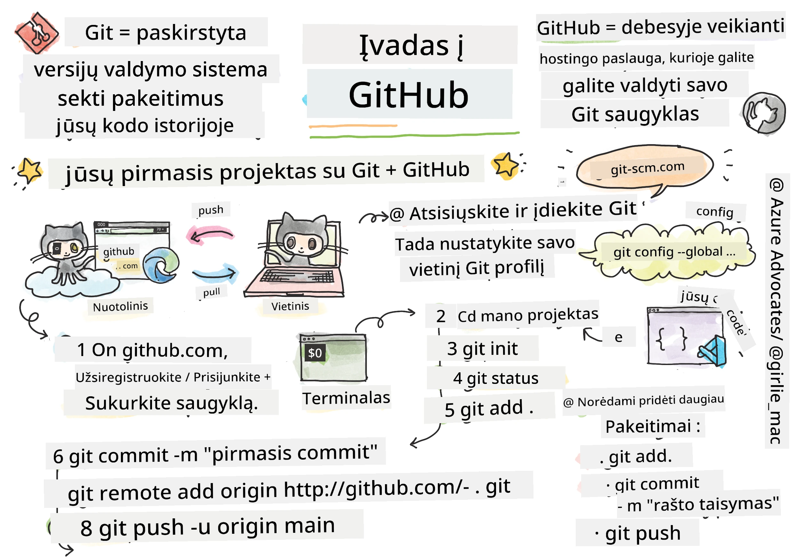
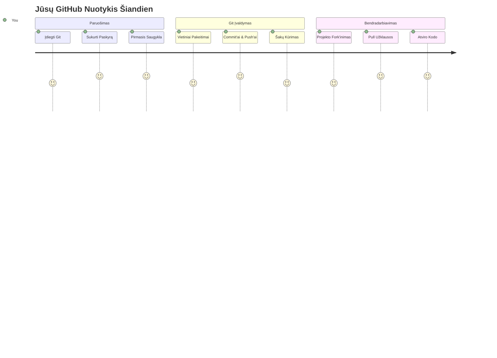
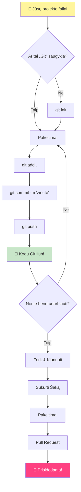
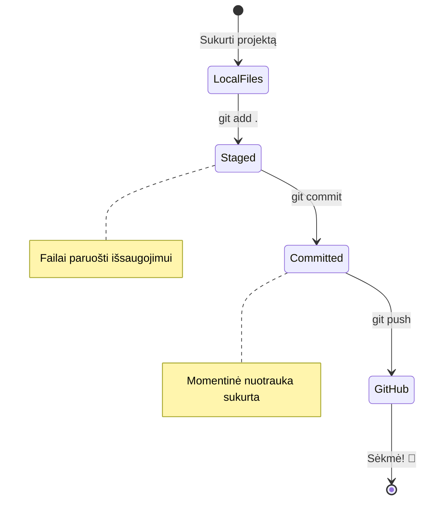
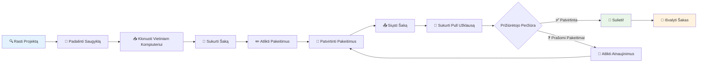
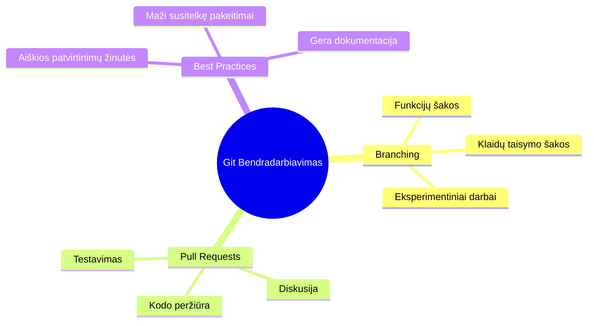
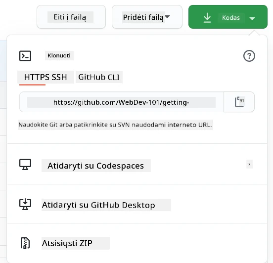
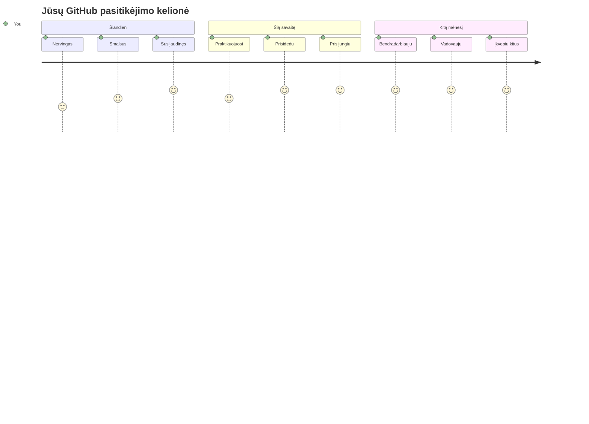

<!--
CO_OP_TRANSLATOR_METADATA:
{
  "original_hash": "5c383cc2cc23bb164b06417d1c107a44",
  "translation_date": "2026-01-07T12:24:48+00:00",
  "source_file": "1-getting-started-lessons/2-github-basics/README.md",
  "language_code": "lt"
}
-->
# Įvadas į GitHub

Sveikas, būsimasis programuotojau! 👋 Pasiruošęs prisijungti prie milijonų programuotojų visame pasaulyje? Aš nuoširdžiai džiaugiuosi galėdamas pristatyti tau GitHub – galvok apie tai kaip apie socialinį tinklą programuotojams, tik vietoje to, kad dalintumėtės savo pietų nuotraukomis, mes dalinamės kodu ir kartu statome neįtikėtinus dalykus!

Štai kas man visiškai iššūkį meta: kiekviena programėlė tavo telefone, kiekvienas tinklalapis, kurį lankai, ir dauguma įrankių, kuriuos išmoksi naudoti, buvo sukurti kūrėjų komandų bendradarbiaujant platformose, panašiose į GitHub. Ta muzikinė programėlė, kurią myli? Kažkas panašaus į tave prisidėjo prie jos kūrimo. Ta žaidimas, kurio negali paleisti? Taip, tikriausiai buvo sukurtas su GitHub bendradarbiavimu. Ir dabar TU MOKYSI, kaip tapti šios nuostabios bendruomenės dalimi!

Žinau, kad iš pradžių tai gali pasirodyti daug – velnias, aš pats prisimenu, kaip žiūrėjau į savo pirmąją GitHub puslapį ir galvojau „Ką iš tiesų visa tai reiškia?“ Bet štai ką: kiekvienas programuotojas pradėjo būtent ten, kur dabar esi tu. Pabaigoje šios pamokos tu turėsi savo paties GitHub saugyklą (galvok apie ją kaip apie savo asmeninę projekto vitrino debesyje), ir žinosi, kaip išsaugoti savo darbą, dalintis juo su kitais ir net prisidėti prie projektų, kuriais naudojasi milijonai žmonių.

Mes šią kelionę eisime kartu, žingsnis po žingsnio. Jokio skubėjimo, jokio spaudimo – tik tu, aš ir keli labai šaunūs įrankiai, kurie netrukus taps tavo naujais geriausiais draugais!


> Sketchnote autorius [Tomomi Imura](https://twitter.com/girlie_mac)


## Priešpamokos testas
[Priešpamokos testas](https://ff-quizzes.netlify.app)

## Įvadas

Prieš įsitraukiant į tikrai įdomius dalykus, pasiruoškime tavo kompiuterį GitHub magijai! Galvok apie tai kaip apie tavo dailininko įrankių paruošimą prieš kuriant šedevrą – turėti tinkamus įrankius pasiruošus yra daug sklandžiau ir kur kas smagiau.

Aš asmeniškai pravesiu tave per kiekvieną diegimo žingsnį ir pažadu, kad tai nėra taip baugu, kaip gali atrodyti iš pirmo žvilgsnio. Jei kažkas iš pradžių nekliūna, tai visiškai normalu! Prisimenu, kai rengiau savo pirmąją kūrimo aplinką ir jautėsi, tarsi bandyčiau skaityti senovinius hieroglifus. Kiekvienas programuotojas buvo tiksliai ten, kur esi dabar, svarstydamas ar daro viską teisingai. Spoileris: jei tu čia mokaisi, tu jau darai teisingai! 🌟

Šioje pamokoje aptarsime:

- kaip sekti darbą savo kompiuteryje
- kaip dirbti su kitais prie projektų
- kaip prisidėti prie atvirojo kodo programinės įrangos

### Išankstinės sąlygos

Paruoškime tavo kompiuterį GitHub magijai! Nesirūpink – šį nustatymą daryti reikės tik kartą ir tada būsi pasiruošęs visai savo programavimo kelionei.

Gerai, pradėkime nuo pagrindų! Pirmiausia turime patikrinti, ar Git jau yra tavo kompiuteryje. Git iš esmės yra tarsi itin protingas asistentas, kuris prisimena kiekvieną tavo padarytą kodo pakeitimą – daug geriau nei pulti panika ir spausti Ctrl+S kas du sekundžius (mes visi per tą praeiname!).

Pažiūrėkime, ar Git jau įdiegtas, įvesdami šią magišką komandą savo terminale:
`git --version`

Jei Git dar nėra, nesijaudink! Tiesiog eik į [parsisiųsti Git](https://git-scm.com/downloads) ir atsisiųsk. Kai įdiegsi, turime jį tinkamai supažindinti su tavimi:

> 💡 **Pirmojo paleidimo nustatymai**: Šios komandos nurodys Git, kas tu esi. Ši informacija bus pridėta prie kiekvieno tavo įrašo, todėl rinkis vardą ir el. paštą, kuriuos esi pasiruošęs viešai dalintis.

```bash
git config --global user.name "your-name"
git config --global user.email "your-email"
```

Norėdamas patikrinti, ar Git jau sukonfigūruotas, gali įvesti:
```bash
git config --list
```

Taip pat tau reikės GitHub paskyros, kodo redaktoriaus (pvz., Visual Studio Code) ir atsidaryti terminalą (arba: komandų eilutę).

Eik į [github.com](https://github.com/) ir susikurk paskyrą, jei dar neturi, arba prisijunk ir užpildyk savo profilį.

💡 **Moderni patarimas**: apsvarstyk galimybę susikonfigūruoti [SSH raktus](https://docs.github.com/en/authentication/connecting-to-github-with-ssh) arba naudoti [GitHub CLI](https://cli.github.com/) patogesniam prisijungimui be slaptažodžių.

✅ GitHub nėra vienintelė kodo saugykla pasaulyje; yra ir kitų, tačiau GitHub yra geriausiai žinoma

### Paruošimas

Tau reikės turėti aplanką su kodo projektu savo vietiniame kompiuteryje (nešiojamame ar stacionariame), taip pat viešą saugyklą GitHub, kuri bus puikus pavyzdys, kaip prisidėti prie kitų projektų.

### Kaip saugoti savo kodą

Trumpam pakalbėkime apie saugumą – bet nesijaudink, neįkalbinsime tavęs baisių dalykų! Galvok apie šias saugumo praktikas kaip apie savo automobilio ar namų užrakinimą. Tai paprasti įpročiai, kurie tampa antrąja prigimtimi ir saugo tavo sunkų darbą.

Iš pat pradžių parodysime tau modernius ir saugius būdus dirbti su GitHub. Tokiu būdu įgisite gerus įpročius, kurie jums pasitarnaus visos programavimo karjeros metu.

Dirbant su GitHub svarbu laikytis saugumo geriausių praktikų:

| Saugumo sritis | Geriausia praktika | Kodėl tai svarbu |
|---------------|---------------|----------------|
| **Autentifikacija** | Naudoti SSH raktus arba Asmeninius Prieigos Žetonus | Slaptažodžiai yra mažiau saugūs ir po truputį nyksta |
| **Dvejetainė Autentifikacija** | Įjungti 2FA savo GitHub paskyroje | Prideda papildomą apsaugos sluoksnį paskyrai |
| **Saugyklos saugumas** | Niekada neįsipakuok jautrios informacijos | API raktai ir slaptažodžiai neturėtų būti viešuose repo |
| **Priklausomybių valdymas** | Įjungti Dependabot atnaujinimams | Išlaiko tavo priklausomybes saugias ir atnaujintas |

> ⚠️ **Kritinis saugumo priminimas**: Niekada neįsipakuok API raktų, slaptažodžių ar kitos jautrios informacijos į jokias saugyklas. Naudok aplinkos kintamuosius ir `.gitignore` failus, kad apsaugotum jautrius duomenis.

**Moderni autentifikacijos konfigūracija:**

```bash
# Sugeneruoti SSH raktą (modernus ed25519 algoritmas)
ssh-keygen -t ed25519 -C "your_email@example.com"

# Konfigūruoti Git naudoti SSH
git remote set-url origin git@github.com:username/repository.git
```

> 💡 **Profesionalus patarimas**: SSH raktai pašalina poreikį nuolat įvesti slaptažodžius ir yra saugesni už tradicinius prisijungimo būdus.

---

## Kaip valdyti savo kodą kaip profesionalas

Gerai, čia prasideda tikras smagumas! 🎉 Mes ruošiamės išmokti sekimo ir kodo valdymo patarimų kaip profesionalai, ir tiesą sakant, tai viena iš mano mėgstamiausių temų, nes tai labai pakeičia žaidimo taisykles.

Įsivaizduok, kad rašai nuostabią istoriją ir nori sekti kiekvieną juodraštį, kiekvieną genialų pataisymą ir kiekvieną „palauk, tai šaunu!“ momentą pakeliui. Būtent tai Git daro tavo kodui! Tai tarsi turėti nuostabų laiko keliaujantį sąsiuvinį, kuris prisimena VISKĄ – kiekvieną klavišo paspaudimą, kiekvieną pakeitimą, kiekvieną „ups, dabar viskas sulūžo“ momentą, kurį gali akimirksniu atšaukti.

Būk sąžiningas – iš pradžių tai gali atrodyti baugu. Kai pradėjau, maniau „Kodėl negaliu paprasčiausiai išsaugoti failų kaip įprastai?“ Bet pasitikėk manimi: kai Git tau atsivers (ir tai įvyks!), turėsi tą lemtingą akimirką, kai pagalvosi „Kaip aš BEGALIU kūręs be to?“ Tai kaip atrasti, kad gali skraidyti, kai visą gyvenimą esi vaikščiojęs!

Tarkime, turi aplanką savo kompiuteryje su projektu ir nori pradėti sekti pažangą naudodamas git – versijų kontrolės sistemą. Kai kurie žmonės lygina git naudojimą su meilužio laiško rašymu savo ateities „aš“. Skaitant savo commit žinutes po kelių dienų, savaičių ar mėnesių galėsi prisiminti, kodėl priėmei tam tikrą sprendimą arba „grąžinti“ pakeitimą – tai reiškia, kai rašai geras „commit“ žinutes.


### Užduotis: Sukurk savo pirmą saugyklą!

> 🎯 **Tavo misija (ir aš labai džiaugiuosi dėl tavęs!)**: kartu sukursime tavo pirmąją GitHub saugyklą! Baigę čia turėsi savo interneto kampelį, kuriame gyvena tavo kodas, ir atliksi savo pirmąjį „commit“ (tai programuotojų kalba, reiškianti labai protingą darbo išsaugojimą).
>
> Tai išties ypatinga akimirka – tu oficialiai prisijungi prie pasaulinės kūrėjų bendruomenės! Aš vis dar prisimenu jaudulį, kai sukūriau savo pirmąją saugyklą ir galvojau „Vaizduot, aš tikrai tai darau!“

Eikime per šią kelionę kartu, žingsnis po žingsnio. Skirk sau laiko kiekviename etape – čia nėra jokio skubėjimo apdovanojimo, ir pažadu, kad kiekvienas žingsnis bus aiškus. Prisiminus, kiekvienas programavimo žvaigždė, kurią tu gerbi, kažkada sėdėjo ten, kur dabar tu, ruošdamasis sukurti savo pirmąją saugyklą. Koks tai šaunu!

> Pažiūrėk video
> 
> [](https://www.youtube.com/watch?v=9R31OUPpxU4)

**Darykime tai kartu:**

1. **Sukurk savo saugyklą GitHub**. Eik į GitHub.com ir surask tą ryškiai žalią mygtuką **New** (arba **+** viršutiniame dešiniajame kampe). Spustelėk ir pasirink **New repository**.

   Štai ką daryti:
   1. Pavadink savo saugyklą – rinkis ką nors tau prasmingo!
   1. Pridėk aprašymą, jei nori (tai padės kitiems suprasti, apie ką tavo projektas)
   1. Nuspręsk, ar nori, kad jis būtų viešas (visi matys) ar privatus (tik tau)
   1. Rekomenduoju pažymėti langelį, kad būtų pridėtas README failas – tai tarsi tavo projekto viršelis
   1. Spustelėk **Create repository** ir švęsk – tu ką tik sukūrei savo pirmąją saugyklą! 🎉

2. **Eik į savo projekto aplanką**. Dabar atidaryk terminalą (nesijaudink, jis ne toks baisus, kaip atrodo!). Turime pasakyti tavo kompiuteriui, kur yra tavo projekto failai. Įvesk šią komandą:

   ```bash
   cd [name of your folder]
   ```

   **Ką čia darome:**
   - Iš esmės sakome „Ei, kompiuteri, nuvesk mane į mano projekto aplanką“
   - Tai kaip atidaryti konkretų aplanką darbalaukyje, bet darome tai naudodami teksto komandas
   - Pakeisk `[name of your folder]` savo projekto aplanko tikruoju pavadinimu

3. **Paversk savo aplanką Git saugykla**. Čia vyksta magija! Įvesk:

   ```bash
   git init
   ```

   **Štai kas ką tik nutiko (visai šaunu!):**
   - Git ką tik sukūrė paslėptą `.git` aplanką tavo projekte – jo nematysi, bet jis yra!
   - Tavo įprastas aplankas dabar yra „saugykla“, kuri gali sekti kiekvieną tavo pakeitimą
   - Galvok apie tai kaip suteikiame savo aplankui supergalias prisiminti viską

4. **Patikrink, kas vyksta**. Pažiūrėkime, ką Git galvoja apie tavo projektą dabar:

   ```bash
   git status
   ```

   **Suprasti, ką Git tau sako:**
   
   Gali pamatyti kažką panašaus į tai:

   ```output
   Changes not staged for commit:
   (use "git add <file>..." to update what will be committed)
   (use "git restore <file>..." to discard changes in working directory)

        modified:   file.txt
        modified:   file2.txt
   ```

   **Nesijaudink! Štai ką tai reiškia:**
   - Failai raudona spalva yra tie, kurie turi pakeitimų, bet dar nėra pasiruošę išsaugoti
   - Failai žalia spalva (kai juos matai) yra pasiruošę išsaugoti
   - Git padeda tau sakydamas, ką gali daryti toliau

   > 💡 **Profesionalus patarimas**: komanda `git status` yra tavo geriausias draugas! Naudok ją bet kada, kai kyla neaiškumų. Tai tarsi paklausti Git „Ei, koks dabar situacijos vaizdas?“

5. **Paruošk failus išsaugojimui** (tai vadinama „staging“):

   ```bash
   git add .
   ```

   **Ką ką tik padarėme:**
   - Pasakėme Git „Ei, noriu įtraukti VISUS savo failus į kitą išsaugojimą“
   - `.` reiškia „viską šiame aplanke“
   - Dabar tavo failai yra „paruošti“ kitam žingsniui

   **Nori būti išrankesnis?** Gali įtraukti tik konkrečius failus:

   ```bash
   git add [file or folder name]
   ```

   **Kodėl taip norėtum?**
   - Kartais nori išsaugoti susijusius pakeitimus kartu
   - Tai padeda logiškai suskirstyti darbą
   - Lengviau suprasti, kas ir kada pasikeitė

   **Apsigalvojai?** Nesijaudink! Failus gali pašalinti iš „paruoštųjų“ sąrašo taip:

   ```bash
   # Atšaukti visų failų pasirengimą
   git reset
   
   # Atšaukti pasirengimą tik vienam failui
   git reset [file name]
   ```

   Nesijaudink – tai nereiškia, kad ištrinsi savo darbą, tiesiog pašalini failus iš „paruošta išsaugojimui“ sąrašo.

6. **Išsaugok savo darbą visam laikui** (atlik pirmą commit!):

   ```bash
   git commit -m "first commit"
   ```

   **🎉 Sveikinimai! Tu ką tik padarei savo pirmą commit!**
   
   **Štai kas ką tik įvyko:**
   - Git padarė „momentinį paveikslą“ visų tavo paruoštų failų šiuo tikslu momentu
   - Tavo commit žinutė „first commit“ paaiškina, apie ką šis išsaugojimas
   - Git suteikė šiam momentiniam paveikslui unikalų ID, kad galėtum jį rasti kada tik norėsi
   - Oficialiai pradėjai sekti savo projekto istoriją!

   > 💡 **Būsimos commit žinutės**: būsi aprašomesnis! Vietoje „atnaujinome kažką“ rašyk „Pridėta kontaktinė forma į pagrindinį puslapį“ arba „Ištaisyta navigacijos meniu klaida“. Tavo būsimas aš tau padėkos!

7. **Sujunk vietinį projektą su GitHub**. Šiuo metu tavo projektas egzistuoja tik tavo kompiuteryje. Pojunkime jį prie tavo GitHub saugyklos, kad galėtum dalintis su pasauliu!

   Pirma, nueik į savo GitHub saugyklos puslapį ir nukopijuok URL. Tada grįžk čia ir įvesk:

   ```bash
   git remote add origin https://github.com/username/repository_name.git
   ```
   
   (Pakeisk tą URL savo tikruoju saugyklos adresu!)

   **Ką ką tik padarėme:**
   - Mes sukūrėme ryšį tarp jūsų vietinio projekto ir jūsų GitHub saugyklos
   - „Origin“ yra tik pravardė jūsų GitHub saugyklai – tai tarsi pridėti kontaktą į savo telefoną
   - Dabar jūsų vietinis Git žino, kur siųsti jūsų kodą, kai būsite pasiruošę jį bendrinti

   💡 **Paprastesnis būdas**: Jei turite įdiegtą GitHub CLI, galite tai padaryti viena komanda:
   ```bash
   gh repo create my-repo --public --push --source=.
   ```

8. **Siųskite savo kodą į GitHub** (didžioji akimirka!):

   ```bash
   git push -u origin main
   ```

   **🚀 Štai jis! Jūs įkeliat savo kodą į GitHub!**
   
   **Kas vyksta:**
   - Jūsų pakeitimai keliauja iš jūsų kompiuterio į GitHub
   - `-u` žymeklis nustato nuolatinį ryšį, kad ateityje push komandos būtų paprastesnės
   - „main“ yra pagrindinės jūsų šakos pavadinimas (kaip pagrindinis aplankas)
   - Po to galite tiesiog rašyti `git push` norėdami siųsti pakeitimus ateityje!

   💡 **Greita pastaba**: Jei jūsų šaka vadinasi kitaip (pvz., „master“), naudokite tą pavadinimą. Galite patikrinti komanda `git branch --show-current`.

9. **Jūsų nauja kasdienė kodo rašymo rutina** (čia jau priklausomybė!):

   Nuo šiol, kai tik atliksite pakeitimų projekte, turėsite šokį iš trijų paprastų žingsnių:

   ```bash
   git add .
   git commit -m "describe what you changed"
   git push
   ```

   **Tai tampa jūsų kodo rašymo ritmu:**
   - Atlikite nuostabių pakeitimų savo kode ✨
   - Pažymėkite juos su `git add` („Ei, Git, atkreipk dėmesį į šiuos pakeitimus!“)
   - Išsaugokite su `git commit` ir aprašomu pranešimu (ateities jūs padėkos!)
   - Pasidalykite jais su pasauliu per `git push` 🚀
   - Kartokite ir kartokite – rimtai, tai tampa toks natūralus veiksmas kaip kvėpavimas!

   Man labai patinka ši darbo eiga, nes ji panaši į turėjimą kelių išsaugojimo taškų video žaidime. Padarėte pakeitimą, kurį mėgstate? Įvykdykite commit! Norite išbandyti ką nors rizikingo? Be problemų – visada galite grįžti prie paskutinio commit, jei kas nors ne taip!

   > 💡 **Patariau**: Taip pat galite nuspręsti naudoti `.gitignore` failą, kad failai, kurių nenorite sekti, nepasirodytų GitHub – pavyzdžiui, pastabų failas, kurį laikote toje pačioje aplankale, bet jam nėra vietos viešoje saugykloje. Šablonus `.gitignore` failams galite rasti [.gitignore templates](https://github.com/github/gitignore) arba pasigaminti vieną naudodami [gitignore.io](https://www.toptal.com/developers/gitignore).

### 🧠 **Pirmas įrašas saugykloje: Kaip jautėtės?**

**Skirkite akimirką švęsti ir apmąstyti:**
- Kaip jautėtės pamatę savo kodą GitHub pirmą kartą?
- Koks žingsnis atrodė labiausiai painus, o kuris – nesitikėtai lengvas?
- Ar galite savo žodžiais paaiškinti skirtumą tarp `git add`, `git commit` ir `git push`?


> **Prisiminkite**: Net patyrę programuotojai kartais pamiršta tikslias komandas. Ši darbo eiga turi tapti raumenų atmintimi, todėl reikia praktikos – jums sekasi puikiai!

#### Šiuolaikinės Git darbo eigos

Apsvarstykite galimybę priimti šias šiuolaikines praktikas:

- **Konvencionalūs commit pranešimai**: Naudokite standartizuotą commit žinutės formatą, pvz., `feat:`, `fix:`, `docs:` ir kt. Sužinokite daugiau [conventionalcommits.org](https://www.conventionalcommits.org/)
- **Atomariniai commit'ai**: Kiekvienas commit'as turi atspindėti vieną loginį pakeitimą
- **Dažni commit'ai**: Commit'inkite dažnai su aiškiais pranešimais, o ne dideliais, retais commit'ais

#### Commit pranešimai

Puikus Git commit temos eilutė užbaigia šią sakinį:
Jeigu bus pritaikytas, šis commit'as <čia jūsų temos eilutė>

Temoje naudokite imperatyvą, esamą laiką: „change“ (keisti), o ne „changed“ ar „changes“. Kaip ir temoje, ir kūne (nebūtina) naudokite imperatyvą ir esamą laiką. Kūne turėtų būti motyvacija pakeitimui bei jo palyginimas su ankstesne elgsena. Jūs paaiškinate „kodėl“, o ne „kaip“.

✅ Paskirkite kelias minutes naršyti GitHub. Ar galite rasti tikrai gerą commit žinutę? Ar galite rasti minimalų pavyzdį? Kokia informacija, jūsų manymu, yra svarbiausia ir naudinga perduoti commit žinutėje?

## Darbas su kitais (Linksmasis etapas!)

Laikykite skrybėlę, nes ČIA GitHub tampa tikrai magiškas! 🪄 Jūs jau išmokote valdyti savo kodą, bet dabar gilinamės į mano mėgstamiausią dalį – bendradarbiavimą su nuostabiais žmonėmis iš viso pasaulio.

Įsivaizduokite: pabundate rytą ir matote, kad kažkas Tokijuje patobulino jūsų kodą, kol miegojote. Tada kažkas Berlyne ištaisė klaidą, su kuria nesugebėjote susidoroti. Po pietų São Paulo kūrėjas pridėjo funkciją, apie kurią net nesvajojote. Tai nėra mokslinė fantastika – taip atrodo antradienis GitHub pasaulyje!

Labai džiugina, kad bendradarbiavimo įgūdžiai, kuriuos greitai įgysite? Tai yra TIKTOSIOS darbo eigos, kurių komandos Google, Microsoft ir jūsų mėgstamiausios startuolės naudoja kasdien. Jūs ne tik mokotės naudoti šaunų įrankį – jūs mokotės slapto kalbėjimo, kuris leidžia visam programinės įrangos pasauliui dirbti kartu.

Rimtai, kai patirsite jaudulį, kai kažkas sujungia jūsų pirmąjį pull request'ą, suprasite, kodėl programuotojai taip aistringai myli atvirojo kodo bendruomenę. Tai tarsi būti didžiausio ir kūrybiškiausio pasaulyje komandinio projekto dalimi!

> Žiūrėkite vaizdo įrašą
>
> [](https://www.youtube.com/watch?v=bFCM-PC3cu8)

Pagrindinė priežastis įkelti dalykus į GitHub buvo suteikti galimybę bendradarbiauti su kitais kūrėjais.


Savo saugykloje eikite į `Insights > Community` norėdami pamatyti, kaip jūsų projektas atitinka rekomenduojamus bendruomenės standartus.

Norite, kad jūsų saugykla atrodytų profesionaliai ir svetingai? Eikite į savo saugyklą ir spustelėkite `Insights > Community`. Ši įspūdinga funkcija parodo, kaip jūsų projektas atitinka tai, ką GitHub bendruomenė laiko „gera saugyklos praktika“.

> 🎯 **Leiskite savo projektui spindėti**: Gerai suorganizuota saugykla su gera dokumentacija – tai tarsi švarus, svetingas parduotuvės frontas. Tai rodo, kad jums rūpi jūsų darbas, ir skatina kitus prisidėti!

**Štai kas daro saugyklą nuostabia:**

| Ką pridėti | Kodėl tai svarbu | Ką tai suteikia jums |
|-------------|------------------|---------------------|
| **Aprašymas** | Pirmas įspūdis svarbus! | Žmonės iškart supranta, ką jūsų projektas daro |
| **README** | Projekto pirmas puslapis | Tarsi draugiškas gidui naujiems lankytojams |
| **Indėlio taisyklės** | Parodo, kad laukiate pagalbos | Žmonės tiksliai žino, kaip jums padėti |
| **Elgesio taisyklės** | Kuria draugišką erdvę | Visi jaučiasi kviečiami dalyvauti |
| **Licencija** | Teisinė aiškumas | Kiti žino, kaip jie gali naudoti jūsų kodą |
| **Saugumo politika** | Parodo profesionalumą | Demonstruoja atsakingą praktiką |

> 💡 **Pro patarimas**: GitHub suteikia šablonus visiems šiems failams. Kuriant naują saugyklą, pažymėkite langelius, kad šie failai būtų sugeneruoti automatiškai.

**Šiuolaikinės GitHub funkcijos, kurias verta išbandyti:**

🤖 **Automatizavimas ir CI/CD:**
- **GitHub Actions** automatiniam testavimui ir diegimui
- **Dependabot** automatinėms priklausomybių atnaujinimams

💬 **Bendruomenė ir projektų valdymas:**
- **GitHub Discussions** bendruomenės pokalbiams už problemų ribų
- **GitHub Projects** kanban tipo projektų valdymui
- **Šakų apsaugos taisyklės** kokybės standartams užtikrinti

Visi šie ištekliai padės naujiems komandos nariams greičiau įsilieti. Ir būtent tai dažnai žiūri nauji bendradarbiai, dar nepradėję žiūrėti jūsų kodo, kad suprastų, ar tai tinkama vieta jų laikui praleisti.

✅ README failai, nors ir užima laiko paruošti, dažnai yra apleidžiami užsiėmusių prižiūrėtojų. Ar galite rasti ypač išsamų pavyzdį? Pastaba: yra keletas [įrankių padedančių kurti gerus README](https://www.makeareadme.com/), kuriuos verta išbandyti.

### Užduotis: Sulieti šiek tiek kodo

Indėlių dokumentacija padeda žmonėms prisidėti prie projekto. Joje paaiškinama, kokio tipo indėlio ieškote ir kaip vyksta procesas. Kūrėjams reikės atlikti keletą žingsnių, kad galėtų prisidėti prie jūsų saugyklos GitHub:


1. **Jūsų saugyklos forkinimas** Greičiausiai norėsite, kad žmonės _forkintų_ jūsų projektą. Forkinimas reiškia sukurti jūsų saugyklos kopiją jų GitHub profilyje.
1. **Klonavimas** Iš ten jie klonuos projektą į savo vietinę mašiną. 
1. **Šakos sukūrimas** Paprašysite jų sukurti _šaką_ savo darbui. 
1. **Pakeitimų fokusuojimas į vieną sritį** Paprašykite indėlių koncentruotis po vieną dalyką vienu metu – taip bus didesnė tikimybė, kad galėsite _sujungti_ jų darbą. Įsivaizduokite, kad jie parašo klaidos pataisymą, prideda naują funkciją ir atnaujina kelis testus – kas, jei norėsite arba galėsite įgyvendinti tik 2 iš 3 ar tik 1 iš 3 pakeitimų?

✅ Įsivaizduokite situaciją, kur šakos ypač svarbios rašant ir pristatant kokybišką kodą. Kokias naudojimo situacijas galite įvardyti?

> Pastaba, būkite ta pokyčių jėga, kurią norite matyti pasaulyje, ir patys kurkite šakas savo darbams. Bet kokie commit'ai, kuriuos padarysite, bus atlikti toje šakoje, kurioje šiuo metu esate „checked out“. Naudokite komandą `git status`, kad pamatytumėte, kuri tai šaka.

Eikime per bendradarbio darbo eigą. Tarkime, kad bendradarbis jau _forkino_ ir _klonavęs_ saugyklą, taigi jis turi Git saugyklą, kurią galima dirbti vietinėje mašinoje:

1. **Sukurti šaką**. Komanda `git branch` sukurkite šaką, kuri talpins pakeitimus, kuriuos jie nori įdėti:

   ```bash
   git branch [branch-name]
   ```

   > 💡 **Šiuolaikinis požiūris**: Taip pat galite sukurti ir perjungti į naują šaką viena komanda:
   ```bash
   git switch -c [branch-name]
   ```

1. **Perjungti į darbo šaką**. Perjunkite į nurodytą šaką ir atnaujinkite darbo katalogą su `git switch`:

   ```bash
   git switch [branch-name]
   ```

   > 💡 **Šiuolaikinė pastaba**: `git switch` yra šiuolaikinė alternatyva `git checkout` keičiant šakas. Ji aiškesnė ir saugesnė pradedantiesiems.

1. **Atlikti darbą**. Šiuo metu norite pridėti savo pakeitimus. Nepamirškite pranešti Git apie juos su šiomis komandomis:

   ```bash
   git add .
   git commit -m "my changes"
   ```

   > ⚠️ **Commit žinutės kokybė**: Įsitikinkite, kad jūsų commit turi gerą pavadinimą, tiek dėl savęs, tiek dėl saugyklos prižiūrėtojo, kuriam padedate. Būkite konkretūs, ką pakeitėte!

1. **Sujungti savo darbą su `main` šaka**. Kai baigsite darbą, norėsite jį sujungti su `main` šaka. Kadangi `main` gali būti keitusi, pirmiausia įsitikinkite, kad ją atnaujinote iki naujausios versijos su šiomis komandomis:

   ```bash
   git switch main
   git pull
   ```

   Šiuo metu norite įsitikinti, kad visi _konfliktai_, situacijos, kai Git negali lengvai _sujungti_ pakeitimų, įvyksta jūsų darbo šakoje. Todėl paleiskite šias komandas:

   ```bash
   git switch [branch_name]
   git merge main
   ```

   Komanda `git merge main` įtrauks visus pakeitimus iš `main` į jūsų šaką. Tikimės, kad galėsite tęsti. Jei ne, VS Code jums parodys, kur Git yra _pasimetęs_, ir jūs tiesiog pakeisite paveiktus failus, nurodydami, kuris turinys yra teisingiausias.

   💡 **Šiuolaikinė alternatyva**: Apsvarstykite galimybę naudoti `git rebase` tvarkingesnei kronikai:
   ```bash
   git rebase main
   ```
   Tai atkartoja jūsų commit'us virš naujausios main šakos, sukuriant linijinę istoriją.

1. **Nusiųsti savo darbą į GitHub**. Siųsti darbą į GitHub reiškia du dalykus. Išsiųsti savo šaką į savo saugyklą ir tada atidaryti PR, Pull Request.

   ```bash
   git push --set-upstream origin [branch-name]
   ```

   Aukščiau pateikta komanda sukuria šaką jūsų forkintoje saugykloje.

### 🤝 **Bendradarbiavimo įgūdžių patikra: Pasiruošę dirbti su kitais?**

**Pažiūrėkime, kaip jaučiatės dėl bendradarbiavimo:**
- Ar dabar jums suprantama forkinimo ir pull request sąvokos?
- Kas yra viena sritis darbui su šakomis, kurią norėtumėte daugiau praktikuoti?
- Kaip jaučiatės prisidėti prie kieno nors kito projekto?


> **Pasitikėjimo stiprintuvas**: Kiekvienas programuotojas, kurį gerbiate, kadaise jaudinosi dėl savo pirmojo pull request'o. GitHub bendruomenė labai draugiška naujokams!

1. **Atidaryti PR**. Toliau norėsite atidaryti PR. Tai darote eidami į forkintą saugyklą GitHub. Ten pamatysite nurodymą, kur bus klausiama, ar norite sukurti naują PR, spustelėkite jį ir būsite nuvesti į sąsają, kurioje galėsite pakeisti commit žinutės pavadinimą, pridėti tinkamesnį aprašymą. Dabar saugyklos prižiūrėtojas, kurio saugyklą forkinate, pamatys šį PR ir, laikydami kumščius, įvertins ir _sujungs_ jūsų PR. Sveikinimai, jūs dabar bendradarbis! :)

   💡 **Šiuolaikinis patarimas**: PR galima kurti ir per GitHub CLI:
   ```bash
   gh pr create --title "Your PR title" --body "Description of changes"
   ```

   🔧 **Geriausios PR praktikos**:
   - Susiekite su susijusiomis problemomis naudodami raktinius žodžius, pvz., „Fixes #123“
   - Pridėkite ekrano nuotraukas UI pakeitimams
   - Prašykite konkrečių peržiūrėtojų
   - Naudokite draft PR darbo metu
   - Įsitikinkite, kad visi CI patikrinimai praėjo prieš prašydami peržiūros
1. **Išvalykite**. Laikoma gera praktika _išvalyti_ po to, kai sėkmingai sujungiate PR. Norite išvalyti tiek savo vietinę šaką, tiek šaką, kurią nusiuntėte į GitHub. Pirmiausia ją ištrinkime vietoje naudodami šią komandą:

   ```bash
   git branch -d [branch-name]
   ```

Įsitikinkite, kad vėliau nueisite į „fork“ repozitorijos GitHub puslapį ir pašalinsite nuotolinę šaką, kurią ką tik nusiuntėte.

`Pull request` (prašymas sujungti) gali atrodyti kvailas terminas, nes iš tikrųjų norite nusiųsti savo pakeitimus į projektą. Tačiau prižiūrėtojas (projekto savininkas) arba pagrindinė komanda turi apsvarstyti jūsų pakeitimus prieš juos sujungiant su projekto „main“ šaka, tad iš esmės jūs prašote prižiūrėtojo priimti pakeitimo sprendimą.

Pull request yra vieta, kur palyginami ir aptariami skirtumai, pristatyti šakoje, su peržiūromis, komentarais, integruotais testais ir dar daugiau. Geras pull request maždaug laikosi tų pačių taisyklių kaip ir įsipareigojimo (commit) žinutė. Galite pridėti nuorodą į problemą (issue) sekimo sistemoje, kai jūsų darbas, pavyzdžiui, išsprendžia tą problemą. Tai daroma naudojant `#`, po kurio eina jūsų problemos numeris. Pvz., `#97`.

🤞Tikiuosi, kad visi patikrinimai praeis sėkmingai ir projekto savininkai sujungs jūsų pakeitimus į projektą🤞

Atnaujinkite savo esamą vietinę darbo šaką su visais naujais įsipareigojimais iš atitinkamos nuotolinės GitHub šakos:

`git pull`

## Prisidėjimas prie atviro kodo (Jūsų galimybė palikti pėdsaką!)

Ar esate pasiruošę kažkam, kas visiškai priblošk jūsų protą? 🤯 Pakalbėkime apie prisidėjimą prie atviro kodo projektų – ir mane tiesiog šiurpai apima galvojant, kad tai galiu su jumis pasidalinti!

Tai jūsų proga tapti kažko tikrai nepaprasto dalimi. Įsivaizduokite, kad gerinate įrankius, kuriuos milijonai kūrėjų naudoja kiekvieną dieną, arba ištaisote klaidą programėlėje, kurią mėgsta jūsų draugai. Tai ne tik svajonė – tai yra atviro kodo prisidėjimo esmė!

Štai kas man visada sukelia šiurpuliukus: kiekvienas įrankis, kurio mokotės – jūsų kodo redaktorius, tyrinėjami karkasai, net naršyklė, kuria skaitote šį tekstą – prasidėjo nuo žmogaus, tokio kaip jūs, kuris pirmą kartą padarė savo prisidėjimą. Tas nuostabus kūrėjas, sukūręs jūsų mėgstamą VS Code plėtinį? Jis taip pat buvo naujokas, drebėdamas spaudęs „create pull request“, lygiai kaip ir jūs dabar.

Ir štai gražiausia dalis: atviro kodo bendruomenė yra kaip didžiausias interneto grupinis apkabinimas. Daugelis projektų aktyviai ieško naujokų ir turi problemas su žyma „good first issue“ specialiai tokiems žmonėms kaip jūs! Prižiūrėtojai tikrai džiaugiasi sulaukę naujų prisidėjėjų, nes prisimena ir savo pirmuosius žingsnius.

```mermaid
flowchart TD
    A[🔍 Tyrinėkite GitHub] --> B[🏷️ Raskite "gerą pirmą užduotį"]
    B --> C[📖 Skaitykite bendradarbiavimo gaires]
    C --> D[🍴 Klonuokite saugyklą]
    D --> E[💻 Sukurkite vietinę aplinką]
    E --> F[🌿 Sukurkite funkcijos šaką]
    F --> G[✨ Atlikite savo indėlį]
    G --> H[🧪 Išbandykite savo pakeitimus]
    H --> I[📝 Rašykite aiškų įsipareigojimą]
    I --> J[📤 Įkelkite ir sukurkite PR]
    J --> K[💬 Bendraukite su atsiliepimais]
    K --> L[🎉 Sujungta! Jūs esate bendradarbis!]
    L --> M[🌟 Raskite kitą užduotį]
    
    style A fill:#e1f5fe
    style L fill:#c8e6c9
    style M fill:#fff59d
```
Jūs čia mokotės ne tik programuoti – jūs ruošiatės prisijungti prie globalaus kūrėjų šeimos, kurie kiekvieną dieną galvoja: „Kaip galėtume skaitmeninį pasaulį padaryti kiek geresniu?“ Sveiki atvykę į klubą! 🌟

Pirmiausia raskime GitHub atviro kodo repozitoriją, kuri jus domina ir prie kurios norėtumėte prisidėti pakeitimu. Norėsite nukopijuoti jos turinį į savo kompiuterį.

✅ Geras būdas rasti „pradedantiesiems draugiškus“ repozitorijus yra [paieška pagal žymą 'good-first-issue'](https://github.blog/2020-01-22-browse-good-first-issues-to-start-contributing-to-open-source/).



Yra keletas būdų, kaip kopijuoti kodą. Vienas būdų yra „klonuoti“ repozitorijos turinį, naudojant HTTPS, SSH ar GitHub CLI (Komandų eilutės sąsają).

Atidarykite savo terminalą ir klonuokite repozitoriją taip:
```bash
# Naudojant HTTPS
git clone https://github.com/ProjectURL

# Naudojant SSH (reikia sukonfigūruoti SSH raktą)
git clone git@github.com:username/repository.git

# Naudojant GitHub CLI
gh repo clone username/repository
```

Norėdami dirbti prie projekto, pereikite į teisingą aplanką:
`cd ProjectURL`

Taip pat galite atidaryti visą projektą naudodami:
- **[GitHub Codespaces](https://github.com/features/codespaces)** – „GitHub“ debesų plėtros aplinka su VS Code naršyklėje
- **[GitHub Desktop](https://desktop.github.com/)** – GUI programa Git operacijoms
- **[GitHub.dev](https://github.dev)** – paspauskite `.` bet kurio GitHub repozitorijos lange, kad atidarytumėte VS Code naršyklėje
- **VS Code** su GitHub Pull Requests plėtiniu

Galiausiai galite atsisiųsti kodą suzipuotame aplanke.

### Dar keletas įdomių dalykų apie GitHub

Galite žvaigždutėmis pažymėti, stebėti ir/arba „forkinti“ bet kurią viešą GitHub repozitoriją. Savo pažymėtus žvaigždutėmis repozitorijus rasite viršutinio dešiniojo meniu išskleidžiamajame sąraše. Tai kaip žymeklis, bet kodui.

Projektai turi problemų (issue) sekimo sistemą, dažniausiai GitHub „Issues“ skiltyje, jei nenurodyta kitaip, kur žmonės aptaria su projektu susijusias problemas. O „Pull Requests“ skiltyje žmonės diskutuoja ir peržiūri vykdomus pakeitimus.

Projektai taip pat gali turėti diskusijų forumų, el. pašto sąrašų ar pokalbių kanalų, tokių kaip Slack, Discord ar IRC.

🔧 **Modernios GitHub funkcijos**:
- **GitHub Discussions** – integruotas forumas bendruomenės pokalbiams
- **GitHub Sponsors** – finansinė parama prižiūrėtojams
- **Security tab** – saugumo pažeidimų ataskaitos ir patarimai
- **Actions tab** – automatizuotų darbo eigų ir CI/CD vamzdynų peržiūra
- **Insights tab** – analitika apie prisidėjėjus, įsipareigojimus ir projekto būklę
- **Projects tab** – GitHub integruoti projekto valdymo įrankiai

✅ Apžiūrėkite savo naują GitHub repozitoriją ir išbandykite keletą dalykų, pavyzdžiui, redaguokite nustatymus, pridėkite informaciją prie savo repozitorijos, sukurkite projektą (pvz., Kanban lentą) ir sukonfigūruokite GitHub Actions automatizavimui. Galimybių daug!

---

## 🚀 Iššūkis

Gerai, laikas išbandyti savo naujus GitHub supergalios įgūdžius! 🚀 Štai iššūkis, kuris padės viską suprasti ir įsisavinti pačiu maloniausiu būdu:

Paimkite draugą (ar šeimos narį, kuris vis klausinėja, ką jūs veikiate su visa ta „kompiuterine įranga“) ir kartu leiskitės į bendrą programavimo nuotykį! Čia prasideda tikroji magija – sukurkite projektą, leiskite jiems forkninti, padarykite šakas ir sujunkite pakeitimus kaip profesionalai, kuriais tampate.

Neslėpsiu – jūs tikrai juoksitės (ypač kai abu bandysite pakeisti tą pačią eilutę), galbūt susipainiosite, bet tikrai patirsite neįtikėtinus „aha!“ momentus, dėl kurių visa mokymosi kelionė verta. Be to, dalintis tuo pirmuoju sėkmingu sujungimu su kuo nors kitu – tarsi maža šventė, kaip toli jau nuėjote!

Dar neturite programavimo draugo? Nesijaudinkite! GitHub bendruomenė pilna nepaprastai svetingų žmonių, kurie prisimena, ką reiškia būti naujokais. Ieškokite repozitorijų su „good first issue“ žymomis – jos tiesiog sako „Ei, naujokai, ateikite mokytis kartu!“ Kiek tai nuostabu?

## Po paskaitos testas
[Po paskaitos testas](https://ff-quizzes.netlify.app/web/en/)

## Apžvalga & Tolimesnis mokymasis

Uff! 🎉 Pažiūrėkite į save – ką tik įvaldei GitHub pagrindus kaip tikras čempionas! Jei dabar jaučiate smegenų perkrovą, tai visiškai normalu ir iš tiesų geras ženklas. Jūs ką tik išmokote įrankių, kuriems man prireikė savaičių jaustis patogiai pradėjus.

Git ir GitHub yra nepaprastai galingi (rimtai galingi), ir kiekvienas kūrėjas, kurį pažįstu – net tie, kurie dabar atrodo kaip burtininkai – turėjo šiek tiek praktikuotis ir paklysti, kol viskas tapo aišku. Faktas, kad perėjote šią pamoką, reiškia, jog jau einate teisingu keliu į vienų svarbiausių įrankių įvaldymą kūrėjo arsenale.

Štai keletas tikrai puikių resursų, kurie padės jums toliau praktikuotis ir tobulėti:

- [Prisidėjimas prie atviro kode programinės įrangos gidas](https://opensource.guide/how-to-contribute/#how-to-submit-a-contribution) – Jūsų kelrodis, kaip padaryti skirtumą
- [Git spraudžių lapelis](https://training.github.com/downloads/github-git-cheat-sheet/) – Laikykite tai po ranka greitai pasitikrinti!

Ir prisiminkite: praktika kuria pažangą, o ne tobulumą! Kuo daugiau naudosite Git ir GitHub, tuo natūralesni jie taps. GitHub sukūrė keletą nuostabių interaktyvių kursų, leidžiančių praktikuotis saugioje aplinkoje:

- [Įvadas į GitHub](https://github.com/skills/introduction-to-github)
- [Bendraukite naudojant Markdown](https://github.com/skills/communicate-using-markdown)
- [GitHub Pages](https://github.com/skills/github-pages)
- [Sujungimo konfliktų valdymas](https://github.com/skills/resolve-merge-conflicts)

**Jaučiatės drąsiai? Išbandykite šiuos modernius įrankius:**
- [GitHub CLI dokumentacija](https://cli.github.com/manual/) – Kai norite jaustis kaip komandų eilutės burtininkas
- [GitHub Codespaces dokumentacija](https://docs.github.com/en/codespaces) – Programuokite debesyje!
- [GitHub Actions dokumentacija](https://docs.github.com/en/actions) – Automatizuokite viską
- [Geriausios Git praktikos](https://www.atlassian.com/git/tutorials/comparing-workflows) – Pakelkite savo darbo eigą į kitą lygį

## GitHub Copilot agento iššūkis 🚀

Naudokite Agent režimą, kad įvykdytumėte šį iššūkį:

**Aprašymas:** Sukurkite bendradarbiaujantį interneto plėtros projektą, demonstruojantį visą GitHub darbo eigą, kurią išmokote šioje pamokoje. Šis iššūkis padės jums praktikuotis kuriant repozitorijas, bendradarbiavimo funkcijas ir modernias Git darbo eigas realiame pasaulyje.

**Užduotis:** Sukurkite naują viešą GitHub repozitoriją paprastam projektui „Internetinių plėtros ištekliai“. Repozitorijoje turi būti gerai struktūruotas README.md failas, kuriame išvardinti naudingi internetinio kūrimo įrankiai ir ištekliai, suskirstyti pagal kategorijas (HTML, CSS, JavaScript ir kt.). Nustatykite repozitoriją laikantis bendruomenės standartų, įskaitant licenciją, prisidėjimo gaires ir elgesio kodeksą. Sukurkite bent dvi funkcines šakas: vieną CSS ištekliams pridėti, kitą – JavaScript ištekliams. Atlikite įsipareigojimus abiejose šakose su aprašomomis žinutėmis, tada sukurkite pull request’us pakeitimams sujungti atgal į main. Įjunkite GitHub funkcijas, tokias kaip Issues, Discussions, ir sukurkite bazinę GitHub Actions darbo eigą automatiniams patikrinimams.

## Užduotis

Jūsų misija, jei ją priimsite: baigti [Įvado į GitHub](https://github.com/skills/introduction-to-github) kursą GitHub Skills platformoje. Šis interaktyvus kursas leis jums praktikuotis saugioje, vedlioje aplinkoje. Be to, pabaigę gausite puikų ženkliuką! 🏅

**Norite daugiau iššūkių?**
- Nustatykite SSH autentifikaciją savo GitHub paskyrai (nebereikės slaptažodžių!)
- Išbandykite GitHub CLI savo kasdienėms Git operacijoms
- Sukurkite repozitoriją su GitHub Actions automatizacijos eiga
- Ištirkite GitHub Codespaces atidarydami šią repozitoriją debesų pagrindu veikiančiame redaktoriuje

---

## 🚀 Jūsų GitHub meistriškumo laiko juosta

### ⚡ **Ką galite padaryti per artimiausias 5 minutes**
- [ ] Pažymėti šį repozitorijų ir dar 3 kitus projektus, kurie jus domina
- [ ] Įjungti dvikryptę (faktorių) autentifikaciją savo GitHub paskyroje
- [ ] Sukurti paprastą README savo pirmajai repozitorijai
- [ ] Sekti 5 kūrėjus, kurių darbas jus įkvepia

### 🎯 **Ką galite pasiekti per šią valandą**
- [ ] Baigti po paskaitos testą ir apmąstyti savo GitHub kelią
- [ ] Nustatyti SSH raktus slaptažodžių nenaudojimui GitHub autentifikacijoje
- [ ] Atlikti savo pirmą reikšmingą įsipareigojimą su puikia žinute
- [ ] Ištirti GitHub „Explore“ skiltį ir atrasti populiarius projektus
- [ ] Praktikuoti repozitorijos forkinimą ir nedidelio pakeitimo padarymą

### 📅 **Jūsų savaitės ilgio GitHub nuotykis**
- [ ] Baigti GitHub Skills kursus (Įvadas į GitHub, Markdown)
- [ ] Pateikti savo pirmą pull request atviro kodo projektui
- [ ] Nustatyti GitHub Pages svetainę savo darbų demonstravimui
- [ ] Dalyvauti GitHub Discussions diskusijose dominančiuose projektuose
- [ ] Sukurti repozitoriją laikantis bendruomenės standartų (README, Licencija ir kt.)
- [ ] Išbandyti GitHub Codespaces debesų pagrindu plėtrai

### 🌟 **Jūsų mėnesio ilgio transformacija**
- [ ] Prisidėti prie 3 skirtingų atviro kodo projektų
- [ ] Tapti mentoriumi naujokui GitHub’e (pasidalinti žiniomis!)
- [ ] Nustatyti automatines darbo eigas su GitHub Actions
- [ ] Sukurti portfelį, demonstruojantį jūsų prisidėjimus GitHub’e
- [ ] Dalyvauti Hacktoberfest ar panašiuose bendruomenės renginiuose
- [ ] Tapti savo projekto prižiūrėtoju, prie kurio prisideda kiti

### 🎓 **Galutinis GitHub meistriškumo patikrinimas**

**Pasidžiaukite savo pasiekimais:**
- Kas jums labiausiai patinka naudojant GitHub?
- Kuri bendradarbiavimo funkcija jus labiausiai žavi?
- Kaip užtikrintai jaučiatės prisidėdami prie atviro kodo dabar?
- Kuriam projektui norite prisidėti pirmiausia?


> 🌍 **Sveiki atvykę į globalią kūrėjų bendruomenę!** Dabar turite įrankius bendradarbiauti su milijonais kūrėjų visame pasaulyje. Jūsų pirmasis prisidėjimas gali atrodyti mažas, bet prisiminkite – kiekvienas svarbus atviro kodo projektas prasidėjo nuo kažkieno pirmojo įsipareigojimo. Klausimas nėra ar paliksite pėdsaką, o kuris nuostabus projektas pirmasis pasinaudos jūsų unikaliu požiūriu! 🚀

Prisiminkite: kiekvienas ekspertas kažkada buvo pradedantysis. Jūs tai galite! 💪

---

<!-- CO-OP TRANSLATOR DISCLAIMER START -->
**Atsakomybės apribojimas**:
Šis dokumentas buvo išverstas naudojant dirbtinio intelekto vertimo paslaugą [Co-op Translator](https://github.com/Azure/co-op-translator). Nors siekiame tikslumo, prašome atkreipti dėmesį, kad automatiniai vertimai gali turėti klaidų ar netikslumų. Originalus dokumentas jo gimtąja kalba turi būti laikomas autoritetingu šaltiniu. Kritiniais atvejais rekomenduojamas profesionalus žmogaus vertimas. Mes neatsakome už bet kokius nesusipratimus ar neteisingus aiškinimus, kilusius dėl šio vertimo naudojimo.
<!-- CO-OP TRANSLATOR DISCLAIMER END -->